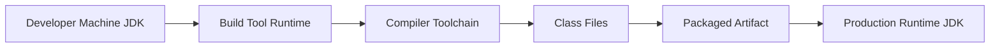
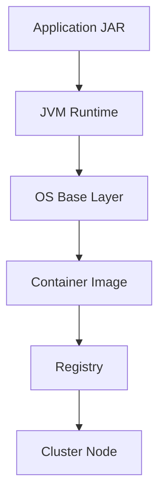
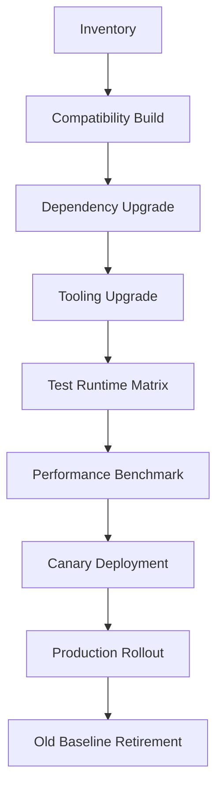

------
title: Learn Java Source, Package, Dependency, Build, Release & Deployment Engineering - Part 025
description: Java platform release model, JDK cadence, LTS strategy, vendor distributions, source/target/release flags, compatibility, multi-release JARs, and enterprise upgrade policy.
series: learn-java-build-dependency-release-deployment
seriesTitle: Learn Java Source, Package, Dependency, Build, Release & Deployment Engineering
order: 25
partTitle: Java Platform Release Model
tags:
- java
- jdk
- release-model
- lts
- compatibility
- maven
- gradle
- build-engineering
- deployment
- enterprise-architecture
date: 2026-06-29
------

# Part 025 — Java Platform Release Model

## 1. Posisi Part Ini Dalam Seri

Sebelumnya kita sudah membahas build system, dependency management, supply-chain, reproducible build, quality gates, generated code, dan build debugging.

Sekarang kita naik satu layer: **release model platform Java itu sendiri**.

Banyak engineer bisa menjawab:

> “Project ini pakai Java 17.”

Tetapi engineer yang matang harus bisa menjawab:

- Java 17 dipakai sebagai **source language**, **target bytecode**, **runtime**, atau **vendor distribution**?
- JDK yang dipakai developer, CI, dan production sama atau berbeda?
- Apakah Maven/Gradle benar-benar mengunci toolchain?
- Apakah `--release` dipakai, atau hanya `sourceCompatibility`/`targetCompatibility`?
- Apakah library yang kita build kompatibel untuk consumer Java 11/17/21/25?
- Apakah runtime production menerima bytecode yang kita hasilkan?
- Apakah kita punya upgrade policy untuk LTS berikutnya?
- Apakah kita punya strategi untuk non-LTS feature adoption?
- Apakah support vendor, patch cadence, container image, dan CVE response sudah selaras?

Part ini bukan daftar fitur Java. Seri fitur bahasa sudah dibahas di seri `learn-modern-java-8-to-25`.

Part ini membahas Java sebagai **platform dependency** yang ikut menentukan build, release, deployment, security, dan operasi production.

---

## 2. Mental Model: Java Version Bukan Satu Hal

Ketika seseorang berkata “pakai Java 21”, kalimat itu ambigu.

Dalam build/release engineering, kita harus memecahnya menjadi beberapa dimensi:

| Dimensi | Pertanyaan | Contoh |
|---|---|---|
| Source language level | Sintaks dan fitur bahasa apa yang boleh dipakai? | records, pattern matching, virtual threads |
| Target bytecode level | Class file version berapa yang dihasilkan? | Java 8, 11, 17, 21, 25 |
| Bootclasspath/API level | API JDK versi berapa yang boleh direferensikan saat compile? | `List.of` tidak tersedia di Java 8 |
| Build JDK | JDK apa yang menjalankan Maven/Gradle? | CI memakai JDK 25 |
| Toolchain JDK | JDK apa yang dipakai compiler/test/Javadoc? | compile dengan JDK 17 walau Gradle jalan di JDK 25 |
| Runtime JDK | JDK apa yang menjalankan aplikasi? | container production memakai JRE/JDK 21 |
| Vendor/distribution | Build OpenJDK dari siapa? | Oracle JDK, Temurin, Corretto, Zulu, Liberica, Microsoft Build |
| Patch level | Update security mana yang terpasang? | 21.0.11 vs 21.0.7 |
| Support model | Siapa yang menyediakan update/support? | vendor LTS, OS package, container base image |

Kesalahan umum adalah menganggap semua dimensi itu otomatis sama.

Padahal di enterprise, sering terjadi kombinasi seperti ini:

```text
Developer laptop:       JDK 25
CI build runner:        JDK 21
Compilation target:     Java 17
Library consumer:       Java 11
Production runtime:     JDK 17.0.x
Container base image:   Eclipse Temurin 17
Security scanner:       OS package database
```

Kombinasi seperti ini bisa valid, tetapi hanya kalau sengaja didesain.

Kalau tidak sengaja, hasilnya adalah drift.

---

## 3. Kaufman Skill Deconstruction

### 3.1 Target Performance Level

Setelah part ini, kita harus mampu:

- membedakan JDK version as language level, bytecode level, API level, runtime level, dan vendor support level;
- menjelaskan Java time-based release model;
- membuat enterprise JDK adoption policy;
- memilih LTS vs non-LTS secara rasional;
- mengatur Maven dan Gradle agar source/target/release/toolchain jelas;
- mencegah accidental usage of newer JDK APIs;
- memahami runtime compatibility risk;
- mengevaluasi vendor distribution dan container base image;
- membuat upgrade roadmap Java platform;
- menulis ADR untuk Java baseline version;
- mendesain build matrix untuk library dan application;
- menangani migration dari JDK lama ke LTS baru.

### 3.2 Sub-Skills

Skill ini bisa dipecah menjadi:

1. **Platform release literacy**
   - feature release;
   - update release;
   - LTS release;
   - preview/incubator feature;
   - vendor support;
   - patch cadence.

2. **Compatibility reasoning**
   - source compatibility;
   - binary compatibility;
   - runtime compatibility;
   - behavioral compatibility;
   - library consumer compatibility.

3. **Build configuration**
   - Maven Compiler Plugin;
   - Gradle Java toolchains;
   - `--release`;
   - source/target;
   - toolchain provisioning;
   - CI image pinning.

4. **Deployment/runtime alignment**
   - container base image;
   - runtime patching;
   - OS/JDK CVE response;
   - JVM flags;
   - observability agent compatibility;
   - GC/runtime behavior.

5. **Enterprise governance**
   - approved JDK versions;
   - supported vendors;
   - upgrade windows;
   - EOL policy;
   - exception handling;
   - compatibility test suite.

---

## 4. Java Time-Based Release Model

Modern Java uses a time-based release cadence.

The important mental model:

```text
The Java platform does not wait indefinitely for features.
Features wait for the next release train when they are ready.
```

This changes how enterprise teams should think about upgrades.

Historically, Java releases were large and infrequent. That made upgrades feel like major migration projects.

Modern Java pushes toward:

- smaller feature releases;
- predictable cadence;
- regular update releases;
- periodic LTS baselines;
- easier incremental migration if teams avoid falling too far behind.

### 4.1 Feature Releases

A feature release is a new major Java version:

```text
Java 17
Java 18
Java 19
Java 20
Java 21
Java 22
Java 23
Java 24
Java 25
Java 26
```

Feature releases may introduce:

- language features;
- library APIs;
- JVM enhancements;
- GC improvements;
- tooling changes;
- deprecations;
- removals;
- preview/incubator features.

A feature release is not automatically a good enterprise baseline.

It might be useful for:

- experimentation;
- library compatibility testing;
- preparing for next LTS;
- performance benchmarking;
- early feature adoption in non-critical systems.

### 4.2 Update Releases

An update release is a patch update within a feature family:

```text
21.0.9
21.0.10
21.0.11
25.0.1
25.0.2
26.0.1
```

Update releases typically matter for:

- security patches;
- bug fixes;
- timezone data;
- JVM stability;
- vendor fixes;
- production operations.

For production, patch level matters as much as feature family.

Saying “we run Java 21” is incomplete.

A better operational statement is:

```text
Production Java baseline is Temurin JDK 21, pinned to 21.0.x latest CPU within 14 days of release, validated through platform regression suite and container image promotion.
```

### 4.3 LTS Releases

LTS means Long-Term Support, but the exact support duration and licensing depend on vendor.

A Java LTS release is usually the enterprise baseline because it offers:

- longer update availability;
- better ecosystem maturity;
- vendor support options;
- easier compliance justification;
- lower operational churn;
- stable target for platform teams.

Examples of commonly used LTS baselines:

```text
Java 8
Java 11
Java 17
Java 21
Java 25
```

As of 2026-06-29, JDK 26 is the latest Java SE platform release from Oracle, while JDK 25 is the latest LTS release.

### 4.4 Non-LTS Releases

Non-LTS releases are not “bad”. They are just usually inappropriate as the default production baseline for conservative enterprise systems.

Good use cases:

- testing your codebase against the future;
- verifying dependency ecosystem readiness;
- catching deprecations early;
- validating framework compatibility;
- performance experiments;
- learning upcoming platform capabilities.

Bad use cases:

- default production baseline for dozens of teams without upgrade automation;
- compliance-sensitive runtime without vendor support clarity;
- systems where container base images are not regularly patched;
- libraries that need long consumer compatibility windows.

---

## 5. Version String Mental Model

Modern Java version strings are feature-first.

A simplified shape is:

```text
$FEATURE.$INTERIM.$UPDATE.$PATCH
```

For day-to-day engineering, the most important part is the feature number:

```text
17
21
25
26
```

But for operations, update number matters:

```text
21.0.11
25.0.3
26.0.1
```

### 5.1 Engineering Meaning

| Version component | Meaning for engineers |
|---|---|
| Feature | Platform family: language/library/JVM capabilities |
| Update | Security/bug-fix patch level |
| Vendor build metadata | Distribution-specific build identity |
| Container digest | Actual deployable runtime identity |

A top-tier team tracks all of them.

### 5.2 Policy Example

```yaml
java-platform-policy:
  application-baseline: 21
  next-lts-evaluation: 25
  build-jdk: 25
  compile-release: 21
  runtime-distribution: eclipse-temurin
  patch-policy:
    cpu-window-days: 14
    psu-window-days: 30
  non-lts-policy:
    allowed-in-prod: false
    allowed-in-ci-compatibility-tests: true
```

This is better than “we use Java 21”.

---

## 6. Source, Target, and Release

Java build configuration has three related but different concepts:

| Concept | Meaning |
|---|---|
| `source` | Which Java language syntax is accepted |
| `target` | Which bytecode/class file version is generated |
| `--release` | Which platform API and bytecode target are used together |

### 6.1 The Classic Mistake

A common mistake:

```xml
<source>8</source>
<target>8</target>
```

while compiling with a newer JDK.

This may produce Java 8 bytecode, but it can still accidentally reference newer JDK APIs unless bootclasspath is correctly controlled.

Example:

```java
// Java 9 API
List<String> names = List.of("a", "b");
```

If compiled incorrectly for Java 8 compatibility, this can pass compile but fail at runtime on Java 8.

### 6.2 Why `--release` Matters

`--release` tells `javac` to compile against the documented API of a specific Java platform release.

For compatibility-sensitive builds, prefer:

```xml
<release>17</release>
```

instead of only:

```xml
<source>17</source>
<target>17</target>
```

### 6.3 Maven Example

```xml
<properties>
    <maven.compiler.release>21</maven.compiler.release>
</properties>
```

or explicit plugin configuration:

```xml
<plugin>
    <groupId>org.apache.maven.plugins</groupId>
    <artifactId>maven-compiler-plugin</artifactId>
    <version>3.13.0</version>
    <configuration>
        <release>21</release>
    </configuration>
</plugin>
```

### 6.4 Gradle Example

```kotlin
java {
    toolchain {
        languageVersion.set(JavaLanguageVersion.of(25))
    }
}

tasks.withType<JavaCompile>().configureEach {
    options.release.set(21)
}
```

This means:

- Gradle may use JDK 25 compiler tools;
- generated bytecode/API compatibility targets Java 21.

### 6.5 Application vs Library

For an application:

```text
compile release should normally match runtime baseline
```

For a library:

```text
compile release should match lowest supported consumer runtime
```

Example:

```text
Internal service runtime: Java 21
Internal shared library consumed by Java 17 and 21 services: compile with --release 17
Public library supporting Java 11+: compile with --release 11
```

A library that unnecessarily raises Java baseline forces every consumer to upgrade.

That can be an architectural event, not a local build setting.

---

## 7. Build JDK vs Runtime JDK

Build JDK and runtime JDK are not the same dimension.



A team might run Gradle with JDK 25 but compile for Java 21 and deploy to Java 21.

That can be fine.

But the policy must be explicit.

### 7.1 Maven Toolchains

Maven toolchains let builds select a JDK for tool execution instead of relying only on `JAVA_HOME`.

Conceptual example:

```xml
<plugin>
    <groupId>org.apache.maven.plugins</groupId>
    <artifactId>maven-toolchains-plugin</artifactId>
    <version>3.2.0</version>
    <executions>
        <execution>
            <goals>
                <goal>toolchain</goal>
            </goals>
        </execution>
    </executions>
    <configuration>
        <toolchains>
            <jdk>
                <version>21</version>
            </jdk>
        </toolchains>
    </configuration>
</plugin>
```

### 7.2 Gradle Toolchains

Gradle Java toolchains can declaratively request a Java version for compile, test, and Javadoc tasks.

```kotlin
java {
    toolchain {
        languageVersion.set(JavaLanguageVersion.of(21))
    }
}
```

### 7.3 CI Rule

Never rely on “whatever JDK is installed on the runner”.

A production-grade build should define:

- build image;
- Maven/Gradle wrapper version;
- toolchain version;
- `--release` target;
- test runtime matrix;
- container runtime image;
- update patch policy.

---

## 8. Java Compatibility Types

Compatibility is not one concept.

| Compatibility type | Meaning | Example |
|---|---|---|
| Source compatibility | Existing source still compiles | Method rename breaks source |
| Binary compatibility | Existing compiled clients still link | Removing public method breaks binary |
| Runtime compatibility | Artifact runs on target JVM | Java 21 bytecode cannot run on Java 17 |
| Behavioral compatibility | Observable behavior remains compatible | Same method now sorts differently |
| Configuration compatibility | Runtime flags/env still valid | Removed JVM flag breaks startup |
| Tooling compatibility | Build/test/agent tools still work | Old JaCoCo incompatible with new class file version |

### 8.1 Runtime Bytecode Compatibility

Java bytecode is forward-moving.

A Java 21 runtime generally cannot run class files compiled for Java 25.

Thus, this is dangerous:

```text
Compile on JDK 25 without --release
Deploy to JDK 21
```

Expected failure class:

```text
UnsupportedClassVersionError
```

### 8.2 API Compatibility

Even if bytecode target is old enough, API usage can break runtime.

Dangerous:

```text
Compile with JDK 25 APIs
Set target bytecode to 17
Run on JDK 17
```

If a Java 25-only API is referenced, Java 17 runtime cannot provide it.

Expected failure class:

```text
NoSuchMethodError
NoClassDefFoundError
ClassNotFoundException
```

### 8.3 Tooling Compatibility

New Java versions may require updated:

- Maven Compiler Plugin;
- Gradle version;
- SpotBugs;
- Checkstyle;
- PMD;
- JaCoCo;
- Byte Buddy;
- Mockito;
- Lombok;
- ASM;
- coverage tools;
- Java agents;
- application servers;
- IDEs;
- container image scanners.

This is why Java upgrade is not just “change `JAVA_HOME`”.

---

## 9. Preview and Incubator Features

Preview and incubator features are not stable production contracts.

They can be useful for learning or experiments, but they require deliberate policy.

### 9.1 Preview Feature Risk

Preview features may change or be removed before becoming final.

A team using preview features must handle:

- compiler flags;
- runtime flags;
- IDE support;
- CI enforcement;
- framework/tool compatibility;
- future migration if syntax/API changes.

### 9.2 Policy Recommendation

For enterprise application baseline:

```text
Preview language features are disabled unless explicitly approved by architecture governance.
```

For sandbox projects:

```text
Preview features may be enabled in isolated modules that do not publish stable APIs.
```

For libraries:

```text
Avoid preview features in public API and published artifacts.
```

### 9.3 Maven Example

```xml
<configuration>
    <compilerArgs>
        <arg>--enable-preview</arg>
    </compilerArgs>
</configuration>
```

Tests/runtime must also be launched with preview enabled.

### 9.4 Gradle Example

```kotlin
tasks.withType<JavaCompile>().configureEach {
    options.compilerArgs.add("--enable-preview")
}

tasks.withType<Test>().configureEach {
    jvmArgs("--enable-preview")
}
```

If this feels noisy, that is intentional: preview usage should be explicit.

---

## 10. Vendor Distributions

OpenJDK is the open-source reference implementation basis, but production teams consume **distributions**.

Common distributions include:

- Oracle JDK;
- Eclipse Temurin;
- Amazon Corretto;
- Azul Zulu;
- BellSoft Liberica;
- Microsoft Build of OpenJDK;
- Red Hat build of OpenJDK;
- SAP SapMachine.

The key question is not “which is best?”

The key question is:

```text
Which distribution can we patch, support, certify, and operate consistently across developer, CI, and production environments?
```

### 10.1 Vendor Selection Criteria

| Criterion | Why it matters |
|---|---|
| Security update availability | Production patching |
| Licensing | Legal/commercial compliance |
| TCK status | Compatibility confidence |
| OS/container support | Deployment environment fit |
| Architecture support | x86_64, arm64 |
| Commercial support | Incident escalation |
| Base image availability | Container supply-chain |
| Update cadence | CVE response SLA |
| SBOM/scanner support | Compliance evidence |

### 10.2 Avoid Distribution Drift

Bad:

```text
Developers use random SDKMAN installs.
CI uses Ubuntu package OpenJDK.
Production uses vendor container image.
Performance test uses a different vendor.
```

Better:

```text
Approved vendor set is documented.
Build/test/runtime images are pinned.
JDK distribution and patch are included in build evidence.
Production images are promoted through the same artifact pipeline.
```

---

## 11. Container Image Strategy

Java runtime selection must connect to deployment packaging.

A Java application in a container has at least these runtime layers:



A Java upgrade may require changing:

- compile target;
- runtime image;
- JDK vendor;
- OS base;
- JVM flags;
- GC defaults;
- monitoring agents;
- security scanner rules;
- memory settings.

### 11.1 Image Pinning

Bad:

```dockerfile
FROM eclipse-temurin:21
```

Better:

```dockerfile
FROM eclipse-temurin:21.0.11_9-jre
```

Even better in regulated environments:

```text
pin by digest + track human-readable tag in metadata
```

Example conceptual policy:

```yaml
runtime-image:
  vendor: eclipse-temurin
  java-feature: 21
  patch-policy: latest-cpu-after-validation
  pinning: digest
  rebuild-trigger:
    - jdk-security-update
    - os-security-update
    - base-image-cve
```

### 11.2 JRE vs JDK in Production

Production runtime often does not need full JDK.

But be careful:

- some diagnostic tools require JDK tools;
- some frameworks use attach APIs;
- some agents require specific modules;
- debugging production containers may need separate debug image;
- `jlink` custom images can remove modules accidentally needed at runtime.

A mature platform defines:

- default production runtime image;
- debug runtime image;
- approved agent compatibility matrix;
- minimum diagnostic capabilities.

---

## 12. Multi-Release JARs

A multi-release JAR can contain class versions for different Java releases.

Conceptual layout:

```text
my-library.jar
├── com/example/Foo.class
└── META-INF/versions/21/com/example/Foo.class
```

A Java 21 runtime can use the Java 21-specific version. Older runtimes use the base version.

### 12.1 When Useful

Useful for libraries that want:

- low baseline compatibility;
- optimized implementation on newer Java;
- access to newer APIs internally;
- stable public API across runtimes.

### 12.2 When Dangerous

Dangerous when:

- test matrix is weak;
- public API differs by runtime;
- generated metadata is inconsistent;
- shading relocates versioned classes incorrectly;
- tooling does not inspect versioned entries;
- maintainers do not understand runtime selection.

### 12.3 Rule

Use multi-release JARs only when the benefit is clear.

For most internal enterprise applications, they are unnecessary.

For libraries with broad runtime support, they can be valuable but require strong testing.

---

## 13. Enterprise Java Baseline Strategy

A baseline strategy defines what Java versions are allowed where.

### 13.1 Baseline Types

| Baseline | Meaning |
|---|---|
| Minimum library baseline | Lowest Java version supported by shared libraries |
| Application runtime baseline | Java version used by services in production |
| Build platform baseline | Java version used to run build tools |
| CI compatibility baseline | Versions tested in matrix |
| Migration target baseline | Next approved Java platform |
| Experiment baseline | Non-LTS versions used for future testing |

### 13.2 Example Policy

```yaml
java-baselines:
  shared-libraries:
    minimum-release: 17
  new-applications:
    runtime-release: 21
  legacy-applications:
    allowed-runtime-releases: [11, 17, 21]
    retirement-plan-required-for: 11
  build-platform:
    default-jdk: 25
  compatibility-tests:
    library-matrix: [17, 21, 25]
  preview-features:
    production: false
    approved-experiments-only: true
```

### 13.3 Why Library Baseline Should Lag Application Baseline

Applications can upgrade faster because they own their deployment runtime.

Libraries are consumed by other systems.

Raising a library baseline from 17 to 21 means every consumer below 21 must either:

- stop upgrading the library;
- upgrade runtime;
- fork/replace the library;
- accept delivery delay.

Therefore:

```text
Application baseline can be aggressive.
Library baseline should be conservative and explicit.
```

---

## 14. Upgrade Strategy

A Java upgrade should be treated as a controlled platform migration, not a last-minute dependency bump.

### 14.1 Upgrade Phases



### 14.2 Phase 1: Inventory

Collect:

- current JDK version;
- vendor;
- patch level;
- build JDK;
- compile release;
- runtime image;
- Maven/Gradle version;
- compiler plugin version;
- test plugin versions;
- bytecode manipulation libraries;
- Java agents;
- frameworks;
- app server/runtime platform;
- JVM flags;
- GC settings;
- container memory settings.

### 14.3 Phase 2: Compile Compatibility

Run:

```bash
mvn -DskipTests=false clean verify
```

or:

```bash
./gradlew clean check
```

with the candidate JDK.

Do not disable failures immediately.

Classify failures:

| Failure | Likely layer |
|---|---|
| `invalid target release` | compiler/plugin/toolchain |
| `UnsupportedClassVersionError` | runtime bytecode mismatch |
| illegal reflective access | JPMS/encapsulation/framework |
| test agent crash | Byte Buddy/ASM/JaCoCo/agent |
| missing method/class | dependency/API mismatch |
| container OOM | JVM/container memory behavior |

### 14.4 Phase 3: Toolchain Upgrade

Upgrade first:

- Maven wrapper or Maven version;
- Gradle wrapper;
- compiler plugin;
- Surefire/Failsafe;
- JaCoCo;
- Checkstyle/PMD/SpotBugs;
- Lombok;
- Byte Buddy/Mockito;
- application framework;
- container base image;
- CI action/plugins.

### 14.5 Phase 4: Runtime Testing

Test the application on the target runtime.

Minimum suite:

- unit tests;
- integration tests;
- contract tests;
- startup test;
- migration test;
- smoke test;
- load test;
- memory test;
- observability agent test;
- graceful shutdown test;
- rollback test.

### 14.6 Phase 5: Performance Baseline

JDK upgrades can change:

- GC behavior;
- JIT behavior;
- TLS performance;
- class loading;
- memory footprint;
- startup time;
- reflection/proxy behavior;
- thread scheduling;
- container memory ergonomics.

Capture before/after metrics:

```text
startup time
p50/p95/p99 latency
throughput
heap after warmup
GC pause time
CPU per request
thread count
native memory
container RSS
error rate
```

---

## 15. Build Matrix Design

### 15.1 Application Matrix

For applications, keep matrix targeted:

```text
compile with approved release
run tests on target runtime
optionally run compatibility smoke on next LTS
```

Example:

```yaml
application-ci:
  build-jdk: 25
  compile-release: 21
  test-runtime: 21
  next-lts-smoke: 25
```

### 15.2 Library Matrix

For libraries, matrix matters more.

Example:

```yaml
library-ci:
  compile-release: 17
  test-runtimes:
    - 17
    - 21
    - 25
  forbidden-api-check: true
  binary-compatibility-check: true
```

The goal is to prove:

- lowest supported runtime works;
- newer runtimes work;
- public API remains compatible;
- accidental newer API usage is blocked.

### 15.3 Platform Library Matrix

For internal platform libraries:

```yaml
platform-library-ci:
  compile-release: 17
  test-runtimes: [17, 21, 25]
  dependency-baseline: internal-platform-bom
  publish-policy:
    requires-binary-compatibility-report: true
    requires-consumer-contract-tests: true
```

---

## 16. Runtime Flags and Removed Options

Java upgrades often fail at startup due to old JVM flags.

Examples of flag risk:

- removed GC options;
- changed defaults;
- module access flags;
- deprecated logging flags;
- old PermGen flags;
- container memory flags;
- internal API access flags.

### 16.1 Policy

All JVM flags should be version-owned.

Bad:

```text
JAVA_OPTS copied from an old service template since 2016
```

Better:

```yaml
jvm-runtime-profile:
  java-release: 21
  gc: default-or-g1
  memory:
    max-ram-percentage: 75
  diagnostics:
    heap-dump-on-oom: true
    gc-logging: unified
  module-access:
    approved-add-opens:
      - reason: framework-x reflection until migration complete
        expires: 2026-12-31
```

### 16.2 `--add-opens` Governance

`--add-opens` can be necessary during migration, but should not become permanent invisible debt.

Each `--add-opens` should have:

- owner;
- reason;
- affected dependency;
- replacement plan;
- expiry date;
- CI check.

---

## 17. Java Release Model and Dependency Ecosystem

A Java version upgrade may force dependency upgrades.

Common cases:

| Component | Why it may need upgrade |
|---|---|
| Spring/Quarkus/Micronaut | Java baseline support |
| Hibernate | bytecode enhancement/proxy behavior |
| Netty | native transport/JDK compatibility |
| Jackson | records/sealed support and security patches |
| Lombok | compiler internals |
| Mockito/Byte Buddy | class file version support |
| JaCoCo | bytecode instrumentation |
| Maven/Gradle | toolchain and class file support |
| Application server | supported Java runtime |
| Observability agent | attach/instrumentation compatibility |

### 17.1 Upgrade Order

Do not upgrade randomly.

Recommended order:

```text
build tool → compiler/test plugins → bytecode tools → framework → runtime image → application code
```

For example:

1. Upgrade Gradle/Maven wrapper.
2. Upgrade Java compiler/test plugins.
3. Upgrade JaCoCo/Byte Buddy/Mockito/Lombok.
4. Upgrade application framework.
5. Run test suite on current JDK.
6. Switch candidate JDK.
7. Fix code/runtime issues.
8. Canary.

---

## 18. ADR: Choosing Java Baseline

Use an ADR when changing Java baseline.

```md
# ADR: Adopt Java 25 as Next Platform Baseline

## Status
Proposed

## Context
Current production baseline is Java 21. JDK 25 is the latest LTS baseline. Several teams require language/runtime improvements and the current JDK 21 support/licensing window must be reviewed.

## Decision
Adopt Java 25 as the next application runtime baseline for new services. Existing Java 21 services migrate by phased rollout. Shared libraries continue compiling with --release 17 until all active consumers are Java 21+.

## Consequences
- Build platform upgrades to Maven/Gradle versions compatible with Java 25.
- CI adds Java 25 compatibility lane.
- Container base image policy updates.
- Observability agents must be certified.
- Legacy Java 11 services require retirement plan.

## Rollout
1. Platform compatibility build.
2. Dependency upgrade wave.
3. Pilot services.
4. Canary production.
5. Default template update.
6. Old baseline retirement.
```

---

## 19. Common Failure Modes

| Failure | Symptom | Root cause | Fix |
|---|---|---|---|
| Build passes, runtime fails | `UnsupportedClassVersionError` | Compiled for newer Java than runtime | Set `--release`, align runtime |
| Java 8 runtime fails with missing API | `NoSuchMethodError` | Used newer JDK API while targeting old bytecode | Use `--release`, forbidden API check |
| CI differs from local | Different compile/test result | JDK drift | Toolchains + pinned CI image |
| Tests fail after JDK upgrade | Agent/instrumentation crash | Old JaCoCo/Mockito/Byte Buddy/ASM | Upgrade tooling |
| Startup fails | Unrecognized JVM option | Removed/changed flag | Version-owned JVM profile |
| Native image/container fails | Runtime module missing | Over-minimized image or `jlink` issue | Add required modules/test image |
| Production memory changes | OOM or higher RSS | Runtime ergonomics changed | Benchmark and retune |
| Dependency upgrade required | Framework incompatibility | Old framework does not support target JDK | Upgrade framework first |
| Library consumers break | Cannot run new library | Library baseline raised silently | Publish baseline policy, SemVer major |
| Preview feature becomes incompatible | Build/runtime flags fail | Preview changed/removed | Avoid in stable APIs |

---

## 20. Practical Maven Patterns

### 20.1 Application POM

```xml
<properties>
    <java.release>21</java.release>
    <maven.compiler.release>${java.release}</maven.compiler.release>
</properties>

<build>
    <pluginManagement>
        <plugins>
            <plugin>
                <groupId>org.apache.maven.plugins</groupId>
                <artifactId>maven-compiler-plugin</artifactId>
                <version>3.13.0</version>
                <configuration>
                    <release>${java.release}</release>
                </configuration>
            </plugin>
        </plugins>
    </pluginManagement>
</build>
```

### 20.2 Library POM

```xml
<properties>
    <library.minimum.java.release>17</library.minimum.java.release>
    <maven.compiler.release>${library.minimum.java.release}</maven.compiler.release>
</properties>
```

### 20.3 Enforcer Policy Concept

```xml
<plugin>
    <groupId>org.apache.maven.plugins</groupId>
    <artifactId>maven-enforcer-plugin</artifactId>
    <version>3.5.0</version>
    <executions>
        <execution>
            <goals>
                <goal>enforce</goal>
            </goals>
            <configuration>
                <rules>
                    <requireJavaVersion>
                        <version>[21,22)</version>
                    </requireJavaVersion>
                    <requireMavenVersion>
                        <version>[3.9,)</version>
                    </requireMavenVersion>
                </rules>
            </configuration>
        </execution>
    </executions>
</plugin>
```

Use with care: `requireJavaVersion` checks build runtime, not necessarily compile target.

---

## 21. Practical Gradle Patterns

### 21.1 Application Build

```kotlin
plugins {
    java
}

java {
    toolchain {
        languageVersion.set(JavaLanguageVersion.of(21))
    }
}

tasks.withType<JavaCompile>().configureEach {
    options.release.set(21)
}
```

### 21.2 Library Build

```kotlin
plugins {
    `java-library`
}

java {
    toolchain {
        languageVersion.set(JavaLanguageVersion.of(25))
    }
}

tasks.withType<JavaCompile>().configureEach {
    options.release.set(17)
}
```

Meaning:

```text
Build using JDK 25 toolchain, produce Java 17-compatible library artifact.
```

### 21.3 Runtime Matrix Concept

```kotlin
val testOn21 by tasks.registering(Test::class) {
    javaLauncher.set(
        javaToolchains.launcherFor {
            languageVersion.set(JavaLanguageVersion.of(21))
        }
    )
}

val testOn25 by tasks.registering(Test::class) {
    javaLauncher.set(
        javaToolchains.launcherFor {
            languageVersion.set(JavaLanguageVersion.of(25))
        }
    )
}
```

---

## 22. Java Baseline Review Checklist

Before adopting a Java baseline:

- [ ] Is this for application runtime or library minimum runtime?
- [ ] Is the selected version LTS or non-LTS?
- [ ] Which vendor distribution is approved?
- [ ] What is the patch/update policy?
- [ ] Is build JDK pinned?
- [ ] Is compiler toolchain pinned?
- [ ] Is `--release` used?
- [ ] Do all CI runners use approved images?
- [ ] Do container images match runtime policy?
- [ ] Are observability agents certified?
- [ ] Are JVM flags valid for target version?
- [ ] Are bytecode manipulation libraries compatible?
- [ ] Is framework baseline compatible?
- [ ] Are dependency BOMs updated?
- [ ] Are generated-code tools compatible?
- [ ] Is performance baseline captured?
- [ ] Is rollback/roll-forward plan defined?
- [ ] Is old baseline retirement date known?

---

## 23. Deliberate Practice

### Drill 1 — Identify Version Dimensions

Take one Java service and write:

```text
Build JDK:
Compiler toolchain JDK:
--release target:
Runtime JDK:
Vendor distribution:
Patch level:
Container image:
Maven/Gradle version:
Test runtime:
```

If any answer is “unknown”, that is a platform governance gap.

### Drill 2 — Break It Intentionally

Create a small project:

- compile with JDK 25;
- set target to Java 17 incorrectly;
- reference a newer Java API;
- run on Java 17.

Observe the failure.

Then fix with `--release 17`.

The goal is to internalize why source/target is not enough.

### Drill 3 — Library Baseline Decision

Given consumers on Java 11, 17, and 21, decide whether an internal library can move to Java 21.

Write:

- impacted consumers;
- migration cost;
- compatibility alternative;
- SemVer impact;
- release plan.

### Drill 4 — Upgrade Readiness Matrix

For one service, create a table:

| Component | Current | Target | Risk | Owner |
|---|---|---|---|---|
| JDK | | | | |
| Gradle/Maven | | | | |
| Framework | | | | |
| JaCoCo | | | | |
| Lombok | | | | |
| Runtime image | | | | |
| Agent | | | | |

---

## 24. Top 1% Engineer Mental Model

A beginner asks:

> “What Java version should we use?”

A normal engineer answers:

> “Use the latest LTS.”

A senior engineer asks:

> “For build, compile, library compatibility, or runtime?”

A top-tier engineer says:

> “New applications can run on Java 25 after platform certification, but shared libraries should continue compiling with `--release 17` until consumer inventory proves Java 21+ coverage. CI should run the library matrix on 17, 21, and 25. Runtime images must be pinned by digest and patched within the CPU window. Any `--add-opens` must have an owner and expiry.”

That is the difference between version selection and platform engineering.

---

## 25. References

- OpenJDK JEP 322 — Time-Based Release Versioning: https://openjdk.org/jeps/322
- Oracle Java SE Support Roadmap: https://www.oracle.com/java/technologies/java-se-support-roadmap.html
- Oracle Java Downloads: https://www.oracle.com/java/technologies/downloads/
- Oracle `javac` command documentation: https://docs.oracle.com/en/java/javase/21/docs/specs/man/javac.html
- Java Language Specification, Chapter 13 — Binary Compatibility: https://docs.oracle.com/javase/specs/jls/se25/html/jls-13.html
- Apache Maven Compiler Plugin: https://maven.apache.org/plugins/maven-compiler-plugin/
- Apache Maven Toolchains Plugin: https://maven.apache.org/plugins/maven-toolchains-plugin/
- Gradle Java Toolchains: https://docs.gradle.org/current/userguide/toolchains.html
- Gradle Building Java Projects: https://docs.gradle.org/current/userguide/building_java_projects.html
- Multi-Release JAR Files, JAR File Specification: https://docs.oracle.com/en/java/javase/25/docs/specs/jar/jar.html
