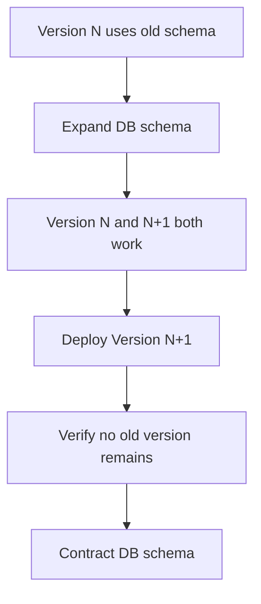
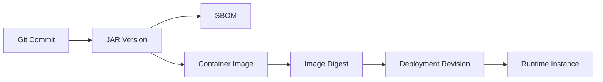

------
title: Learn Java Source, Package, Dependency, Build, Release & Deployment Engineering - Part 026
description: Application and library versioning as compatibility contracts, including SemVer, CalVer, snapshots, release candidates, binary/source/behavioral compatibility, and enterprise version governance.
series: learn-java-build-dependency-release-deployment
seriesTitle: Learn Java Source, Package, Dependency, Build, Release & Deployment Engineering
order: 26
partTitle: Application and Library Versioning
tags:
- java
- versioning
- semver
- release-engineering
- dependency-management
- compatibility
- maven
- gradle
- enterprise-architecture
date: 2026-06-29
------

# Part 026 — Application and Library Versioning

## 1. Posisi Part Ini Dalam Seri

Part sebelumnya membahas Java platform release model: JDK cadence, LTS, vendor distribution, `--release`, runtime baseline, dan enterprise upgrade strategy.

Sekarang kita membahas versioning untuk artifact yang kita hasilkan sendiri:

- application artifact;
- library artifact;
- internal platform BOM;
- Gradle platform;
- shared schema artifact;
- generated client;
- container image;
- deployment package;
- release candidate;
- hotfix;
- patch line.

Versioning bukan sekadar menulis angka di `pom.xml` atau `build.gradle.kts`.

Versioning adalah **compatibility contract**.

Versi menjawab pertanyaan:

```text
Kalau saya upgrade dari artifact A versi X ke versi Y, apa yang boleh saya asumsikan tetap aman?
```

Kalau angka versi tidak membawa makna, dependency management berubah menjadi tebakan.

---

## 2. Mental Model: Version Is a Promise

Setiap version number adalah janji.

Bukan janji bahwa software bebas bug.

Tetapi janji tentang tingkat perubahan yang boleh diasumsikan consumer.

Contoh:

```text
1.4.2 → 1.4.3
```

Consumer berharap perubahan kecil, bug fix, kompatibilitas tetap.

```text
1.4.2 → 1.5.0
```

Consumer berharap ada fitur baru, tetapi tidak ada breaking change bila memakai SemVer dengan benar.

```text
1.4.2 → 2.0.0
```

Consumer siap bahwa ada breaking change.

Kalau tim merilis breaking change sebagai patch version, maka angka versi kehilangan makna.

Akibatnya:

- consumer takut upgrade;
- dependency update otomatis berbahaya;
- patch security sulit diadopsi;
- release train macet;
- incident rollback lebih rumit;
- platform governance kehilangan kepercayaan.

---

## 3. Versioning Untuk Application vs Library

Application dan library harus dipikirkan berbeda.

### 3.1 Application Version

Application version biasanya dikonsumsi oleh deployment system, operator, support team, auditor, dan incident responder.

Pertanyaan utamanya:

- build mana yang sedang jalan di production?
- commit mana yang menghasilkan artifact ini?
- konfigurasi mana yang dipakai?
- image digest mana yang deployed?
- database migration mana yang included?
- release note mana yang relevan?
- bisa rollback ke versi mana?

Application version lebih dekat dengan **operational identity**.

### 3.2 Library Version

Library version dikonsumsi oleh developer dan build system.

Pertanyaan utamanya:

- apakah upgrade ini aman?
- apakah API berubah?
- apakah binary compatibility terjaga?
- apakah transitive dependency berubah?
- apakah minimum Java version berubah?
- apakah behavior berubah?
- apakah consumer perlu mengubah kode?

Library version lebih dekat dengan **compatibility contract**.

### 3.3 Perbandingan

| Aspect | Application | Library |
|---|---|---|
| Main consumer | Deployment/runtime/operator | Other codebases |
| Main contract | Traceability and deployability | Compatibility |
| Rollback | Deploy previous artifact | Downgrade dependency may be hard |
| Version style | SemVer, CalVer, build number | Usually SemVer-like |
| Breaking change | Runtime/data/API behavior | Public API, ABI, dependencies |
| Metadata needed | commit, build, image digest | API diff, min Java, dependency diff |
| Release cadence | product-driven | consumer-impact-driven |

---

## 4. Semantic Versioning

Semantic Versioning, commonly shortened to SemVer, uses this shape:

```text
MAJOR.MINOR.PATCH
```

The usual meaning:

| Segment | Meaning |
|---|---|
| MAJOR | incompatible API changes |
| MINOR | backward-compatible functionality |
| PATCH | backward-compatible bug fixes |

Optional labels:

```text
1.2.0-alpha.1
1.2.0-rc.1
1.2.0+build.45
```

### 4.1 Why SemVer Is Hard in Java

SemVer sounds simple. Java makes it subtle.

A Java library has multiple compatibility surfaces:

- public classes;
- public methods;
- public constructors;
- public fields;
- annotations;
- generic signatures;
- exceptions;
- serialized forms;
- service provider interfaces;
- resource files;
- module names;
- Maven coordinates;
- transitive dependencies;
- runtime behavior;
- configuration keys;
- generated code contracts.

Changing any of these can break consumers.

### 4.2 SemVer Is Not Enough

SemVer is a communication protocol, not a verification system.

You still need:

- API diff checks;
- binary compatibility checks;
- consumer contract tests;
- dependency diff checks;
- migration notes;
- release governance.

Bad:

```text
We follow SemVer because humans remember to bump the major version.
```

Better:

```text
We enforce compatibility checks in CI and require explicit release classification.
```

---

## 5. Calendar Versioning

Calendar Versioning, often called CalVer, encodes date information.

Common shapes:

```text
2026.06.0
2026.6.29
26.6.1
2026.06-servicepack.1
```

### 5.1 When CalVer Helps

CalVer is useful when:

- release cadence matters more than API compatibility;
- artifact is an application;
- compliance/audit wants date traceability;
- platform baseline changes by release train;
- product release trains are calendar-based;
- infrastructure bundles are updated regularly.

### 5.2 When CalVer Hurts

CalVer is weak when consumers need to infer compatibility.

Example:

```text
2026.06.0 → 2026.07.0
```

Does that contain breaking API changes?

The date alone does not say.

For libraries, CalVer must be paired with explicit compatibility policy.

### 5.3 Hybrid Strategy

Some enterprises use:

```text
library: SemVer
application: CalVer + build metadata
container: version tag + immutable digest
platform BOM: CalVer release train
```

Example:

```text
customer-risk-api: 2.7.3
case-management-service: 2026.06.29.4
platform-bom: 2026.06.0
container image: case-management-service:2026.06.29.4@sha256:...
```

This is reasonable if every artifact type has a documented policy.

---

## 6. Maven Version Semantics

Maven coordinates are:

```text
groupId:artifactId:version
```

Example:

```text
com.acme.risk:case-policy-engine:2.4.1
```

The version is part of artifact identity.

### 6.1 SNAPSHOT Versions

A Maven `SNAPSHOT` is a mutable development version.

Example:

```text
2.4.1-SNAPSHOT
```

Snapshot artifacts may resolve to different timestamped builds over time.

### 6.2 Snapshot Rule

Snapshots are acceptable for:

- local development;
- short-lived integration branches;
- internal pre-release validation;
- CI of closely coupled modules.

Snapshots are dangerous for:

- production deployment;
- external dependency consumption;
- regulated release evidence;
- reproducible builds;
- artifact promotion;
- incident rollback.

Policy:

```text
Production deployments must use immutable release artifacts, not SNAPSHOT artifacts.
```

### 6.3 Maven Release Versions

Release versions should be immutable.

Once published:

```text
com.acme.risk:case-policy-engine:2.4.1
```

should never be overwritten.

If there is a bug, publish:

```text
2.4.2
```

not a replacement of `2.4.1`.

### 6.4 Maven Version Ranges

Maven supports version ranges, but enterprise builds should use them sparingly.

Bad for reproducibility:

```xml
<version>[2.0,3.0)</version>
```

Better:

```xml
<version>2.4.1</version>
```

or centralized via BOM:

```xml
<dependencyManagement>
    <dependencies>
        <dependency>
            <groupId>com.acme.platform</groupId>
            <artifactId>platform-bom</artifactId>
            <version>2026.06.0</version>
            <type>pom</type>
            <scope>import</scope>
        </dependency>
    </dependencies>
</dependencyManagement>
```

---

## 7. Gradle Version Semantics

Gradle dependency coordinates are also usually:

```text
group:name:version
```

Example:

```kotlin
implementation("com.acme.risk:case-policy-engine:2.4.1")
```

Gradle has rich version features:

- strict versions;
- preferred versions;
- rejected versions;
- dynamic versions;
- dependency locking;
- version catalogs;
- platforms;
- enforced platforms;
- constraints.

### 7.1 Dynamic Versions

Example:

```kotlin
implementation("com.acme.risk:case-policy-engine:2.+")
```

Danger:

```text
Same source code can resolve different dependencies at different times.
```

Dynamic versions are convenient but undermine reproducibility if not locked.

### 7.2 Strict Versions

Example:

```kotlin
implementation("com.acme.risk:case-policy-engine") {
    version {
        strictly("2.4.1")
    }
}
```

Use strict versions when:

- compatibility has been certified;
- security policy requires exact version;
- platform BOM must not be overridden;
- incident remediation pins a known-good version.

### 7.3 Dependency Locking

Dependency locking lets Gradle persist resolved versions.

This is useful when using:

- dynamic versions;
- rich constraints;
- plugin resolution;
- large multi-project builds;
- reproducible CI.

---

## 8. Compatibility Dimensions in Java Libraries

### 8.1 Source Compatibility

A change is source-compatible if existing consumer source code still compiles.

Breaking examples:

```java
// Before
public void approve(CaseId id)

// After
public void approve(CaseId id, UserId userId)
```

Consumer source must change, so this is breaking.

### 8.2 Binary Compatibility

A change is binary-compatible if already-compiled consumer bytecode can still link and run against the new library.

Breaking example:

```java
// Removing a public method
public Decision evaluate(Input input)
```

Existing compiled consumers may fail with:

```text
NoSuchMethodError
```

### 8.3 Behavioral Compatibility

A change is behavior-compatible if observable behavior remains within the promised contract.

Example:

```java
// Before
calculateRisk(null) returns Risk.UNKNOWN

// After
calculateRisk(null) throws NullPointerException
```

The method signature did not change, but behavior changed.

This may be a breaking change.

### 8.4 Serialization Compatibility

Java serialization, JSON contracts, Avro schemas, protobuf schemas, and database payloads have their own compatibility rules.

A Java library version bump may also be a data-contract version bump.

### 8.5 Dependency Compatibility

Changing transitive dependencies can break consumers even if public API is unchanged.

Example:

```text
Library A 1.4.0 depends on Jackson 2.15
Library A 1.4.1 depends on Jackson 2.18
Consumer also depends on a framework requiring Jackson 2.15
```

Even patch upgrades can create classpath conflict.

### 8.6 Java Baseline Compatibility

Changing minimum Java version is breaking.

Example:

```text
Library 1.8.4: --release 11
Library 1.8.5: --release 17
```

Even if API is unchanged, Java 11 consumers can no longer run it.

This should usually be a major release or an explicitly announced release-line transition.

---

## 9. What Counts as Breaking Change?

| Change | Usually breaking? | Notes |
|---|---:|---|
| Remove public class | Yes | Source and binary break |
| Remove public method | Yes | Binary break |
| Rename public method | Yes | Source and binary break |
| Change return type | Usually yes | Covariant return may be nuanced |
| Add method to interface | Often yes | May break implementors depending default method |
| Add abstract method to abstract class | Yes | Subclasses must implement |
| Add default method to interface | Usually binary-compatible, can be behavior-sensitive | Conflict possible |
| Change checked exception | Source-sensitive | Callers may break |
| Change generic signature | Often source-sensitive | May cause warnings/errors |
| Change annotation retention | Yes for processors/runtime users | Tooling break |
| Change module name | Yes | JPMS consumers break |
| Change Maven coordinates | Yes | Dependency declaration break |
| Raise Java baseline | Yes | Runtime compatibility break |
| Upgrade transitive dependency major | Possibly | Consumer conflict risk |
| Change configuration key | Yes | Runtime behavior break |
| Change default timeout | Maybe | Behavior/operational compatibility |
| Fix bug | Maybe | Some consumers depend on bug behavior |

Versioning is not just API surface.

It includes everything consumers reasonably rely on.

---

## 10. Release Lines

A release line is a maintained stream of versions.

Example:

```text
1.9.x  → Java 11 baseline, maintenance only
2.4.x  → Java 17 baseline, active support
3.0.x  → Java 21 baseline, new feature line
```

### 10.1 Why Release Lines Matter

They allow:

- security backports;
- consumer migration windows;
- staged Java baseline upgrades;
- hotfixes without forcing major migration;
- support for regulated systems.

### 10.2 Bad Pattern

```text
One artifact line, always latest, no backports.
```

This forces every consumer to upgrade immediately for security fixes.

### 10.3 Good Pattern

```text
Current line receives features.
Previous LTS line receives security and critical bug fixes for defined period.
Old line has EOL date.
```

Example:

| Line | Java baseline | Status | Support until |
|---|---:|---|---|
| 1.9.x | 11 | Maintenance | 2026-12-31 |
| 2.4.x | 17 | Active | 2027-12-31 |
| 3.0.x | 21 | Current | TBD |

---

## 11. Pre-Releases and Release Candidates

Pre-release versions communicate that artifact is not final.

Examples:

```text
2.5.0-alpha.1
2.5.0-beta.1
2.5.0-rc.1
```

### 11.1 Alpha

Use alpha for:

- incomplete feature;
- unstable API;
- early integration;
- internal experiments.

### 11.2 Beta

Use beta for:

- mostly complete feature;
- API still may change;
- broader testing;
- consumer feedback.

### 11.3 Release Candidate

Use RC for:

- candidate final artifact;
- no known blocking issues;
- full verification expected;
- deployment rehearsal.

### 11.4 Enterprise Rule

```text
Production deployment should not use alpha/beta/rc unless explicitly approved.
```

Exceptions may exist for:

- canary environment;
- pilot users;
- emergency vendor patch;
- isolated internal system.

But the exception should be explicit.

---

## 12. Build Metadata

Build metadata identifies the build without changing compatibility meaning.

Example:

```text
2.4.1+build.783.sha.a1b2c3d
```

In container environments, version tags alone are insufficient.

You should also track:

- git commit SHA;
- CI run ID;
- source repository;
- builder identity;
- image digest;
- SBOM reference;
- provenance attestation;
- config version;
- database migration version.

### 12.1 Application Metadata Example

```json
{
  "service": "case-management-service",
  "version": "2026.06.29.4",
  "commit": "a1b2c3d4",
  "buildNumber": "783",
  "javaRelease": "21",
  "runtimeVendor": "eclipse-temurin",
  "imageDigest": "sha256:...",
  "platformBom": "2026.06.0",
  "builtAt": "2026-06-29T08:15:30Z"
}
```

Expose this through:

- `/actuator/info` or equivalent;
- startup logs;
- deployment metadata;
- incident dashboard;
- artifact repository metadata.

---

## 13. Versioning Internal Platform BOMs

An internal platform BOM is itself a versioned artifact.

Example:

```text
com.acme.platform:java-platform-bom:2026.06.0
```

It may align:

- Spring Boot version;
- logging stack;
- Jackson;
- Netty;
- Micrometer;
- OpenTelemetry;
- test libraries;
- plugin versions;
- internal libraries.

### 13.1 BOM Version Contract

A BOM version promises:

```text
These dependency versions were tested as a coherent platform baseline.
```

A BOM upgrade can be minor operationally or large architecturally.

Example:

```text
2026.05.0 → 2026.06.0
```

may include:

- Java baseline change;
- framework major upgrade;
- transitive dependency conflict resolution;
- security patch wave;
- logging behavior change.

So release notes are mandatory.

### 13.2 BOM SemVer vs CalVer

For platform BOMs, CalVer often works well because the BOM is a release train.

But you still need change classification:

```yaml
platform-bom: 2026.06.0
change-classification:
  java-baseline: unchanged
  framework-major: no
  security-patches: yes
  breaking-config-change: no
  required-actions:
    - rerun regression tests
    - rebuild container images
```

---

## 14. Versioning Generated Clients and Schemas

Generated clients are tricky.

They sit between:

- schema version;
- generator version;
- runtime dependency version;
- package namespace;
- artifact version;
- service compatibility.

Example:

```text
case-api-schema: 1.12.0
openapi-generator: 7.x
case-api-client-java: 1.12.0
```

### 14.1 Recommended Rule

If client is generated from a schema:

```text
Client major/minor should track schema major/minor when it represents the same API contract.
```

Patch may differ if generator-only fix occurs.

Example:

```text
schema: 1.12.0
client: 1.12.3
```

Meaning:

```text
Same API contract, client generation/runtime fixes.
```

### 14.2 Breaking Schema Change

Breaking schema change should bump major.

Examples:

- remove field;
- change field type;
- make optional field required;
- remove endpoint;
- change enum semantics;
- change error contract;
- change pagination semantics.

---

## 15. Database and Deployment Compatibility

Application versioning interacts with database migration.

A service release may include:

- code version;
- DB migration version;
- schema compatibility state;
- rolling deployment constraints;
- rollback constraints.

### 15.1 Expand-Contract Pattern

For safe rolling deployments:



### 15.2 Version Contract

A deployment version should specify:

- required minimum DB migration;
- backward-compatible with previous app version?
- can run during rolling update?
- rollback possible after migration?
- data backfill required?
- feature flag dependency?

Bad release note:

```text
Update case service to 2.8.0.
```

Good release note:

```text
case-service 2.8.0 requires DB migration V142 expand step. Compatible with 2.7.x during rolling update. Do not run contract migration V143 until all pods are on 2.8.x. Rollback to 2.7.x is safe before V143 only.
```

---

## 16. Artifact Identity Across Build and Deployment

The same logical release may have multiple artifact identities:



### 16.1 Do Not Rebuild for Each Environment

Bad:

```text
Build dev artifact
Build staging artifact
Build prod artifact
```

Better:

```text
Build once, promote same artifact through environments
```

Versioning should support artifact promotion.

If production artifact cannot be tied back to the exact CI artifact, release governance is weak.

### 16.2 Immutable Artifact Rule

```text
A released version must be immutable.
```

This applies to:

- Maven artifacts;
- Gradle published modules;
- container images;
- SBOMs;
- provenance metadata;
- deployment bundles.

If an artifact is overwritten, audit and rollback become unreliable.

---

## 17. Version Bumping Policy

### 17.1 Library Policy

| Change | Version bump |
|---|---|
| Fix internal bug, no behavior contract change | PATCH |
| Add backward-compatible API | MINOR |
| Deprecate API without removal | MINOR |
| Remove public API | MAJOR |
| Change public method semantics incompatibly | MAJOR |
| Raise minimum Java version | MAJOR or release-line transition |
| Upgrade transitive dependency major | MINOR or MAJOR depending risk |
| Security fix with no API change | PATCH |
| Security fix that changes behavior | PATCH with prominent notice, or MAJOR if breaking |

### 17.2 Application Policy

| Change | Version impact |
|---|---|
| Code-only bug fix | patch/build increment |
| Feature behind flag | minor/release train increment |
| Public API breaking change | major or API version increment |
| DB migration incompatible with rollback | major or explicit deployment warning |
| Config key rename | major or migration-support window |
| Runtime baseline change | major/release train with platform note |

### 17.3 Platform BOM Policy

| Change | Version impact |
|---|---|
| Security patches only | patch/release-train patch |
| Library minor alignment | minor/release-train increment |
| Framework major upgrade | major or clearly classified release train |
| Java baseline change | major/platform generation change |
| Dependency removal | major if consumer-visible |

---

## 18. Deprecation Policy

Deprecation is how you avoid sudden breaking changes.

A good deprecation has:

- replacement API;
- reason;
- first deprecated version;
- planned removal version;
- migration example;
- compiler/runtime warning if appropriate;
- release note entry.

Example:

```java
/**
 * @deprecated since 2.6.0. Use {@link DecisionService#evaluate(EvaluationRequest)}.
 * This method will be removed in 3.0.0.
 */
@Deprecated(since = "2.6.0", forRemoval = true)
public Decision evaluate(Input input) {
    return evaluate(EvaluationRequest.from(input));
}
```

### 18.1 Deprecation Without Removal Is Debt

If APIs are deprecated forever:

- surface area grows;
- tests multiply;
- documentation becomes confusing;
- compatibility burden increases;
- implementation cannot be simplified.

Use release lines to manage removal.

---

## 19. Binary Compatibility Checks

Human review is not enough.

Use automated checks for Java libraries.

Common tools/concepts:

- japicmp;
- Revapi;
- SigTest;
- Maven/Gradle binary compatibility plugins;
- API surface reports;
- forbidden API checks.

### 19.1 Maven Concept

```xml
<plugin>
    <groupId>com.github.siom79.japicmp</groupId>
    <artifactId>japicmp-maven-plugin</artifactId>
    <version>0.23.1</version>
    <configuration>
        <oldVersion>
            <dependency>
                <groupId>com.acme.risk</groupId>
                <artifactId>case-policy-engine</artifactId>
                <version>2.4.0</version>
            </dependency>
        </oldVersion>
        <newVersion>
            <file>${project.build.directory}/${project.build.finalName}.jar</file>
        </newVersion>
        <parameter>
            <breakBuildOnBinaryIncompatibleModifications>true</breakBuildOnBinaryIncompatibleModifications>
        </parameter>
    </configuration>
</plugin>
```

### 19.2 Gradle Concept

```kotlin
plugins {
    id("me.champeau.gradle.japicmp") version "0.4.5"
}
```

Exact plugin choices vary. The principle is stable:

```text
compatibility claim should be machine-checked before publish
```

### 19.3 What Tools Cannot Fully Detect

Binary compatibility tools cannot fully prove:

- behavioral compatibility;
- performance compatibility;
- thread-safety compatibility;
- semantic meaning of fields;
- external protocol compatibility;
- database migration safety;
- operational configuration compatibility.

So combine tools with contract tests and release review.

---

## 20. Versioning and Dependency Governance

Versioning connects directly to dependency governance.

A dependency update bot might propose:

```text
case-policy-engine 2.4.1 → 2.4.2
```

The team accepts automatically only if:

- patch releases are trustworthy;
- binary compatibility is enforced;
- changelog is meaningful;
- tests are strong;
- provenance is verified;
- release immutability is guaranteed.

If version policy is weak, all updates need manual fear-driven review.

### 20.1 Upgrade Confidence Formula

```text
upgrade confidence = version semantics × compatibility evidence × test coverage × artifact trust
```

If any term is near zero, upgrade confidence collapses.

---

## 21. Versioning Anti-Patterns

### 21.1 Forever 1.0.0

Everything stays at:

```text
1.0.0
```

Impact:

- no compatibility signal;
- no upgrade semantics;
- artifact repository confusion;
- impossible support triage.

### 21.2 Timestamp Only for Libraries

```text
20260629.0815
```

This tells when, not compatibility.

### 21.3 Reusing Versions

Publishing a new artifact over the same version destroys trust.

### 21.4 SNAPSHOT in Production

Impossible to prove exactly what code is running unless timestamped snapshot metadata is captured perfectly.

Avoid.

### 21.5 Major Version Fear

Teams avoid major version bumps even when breaking changes occur.

This makes SemVer dishonest.

A major version is not failure. It is truthful communication.

### 21.6 Silent Java Baseline Raise

Raising `--release` without major version/release note breaks consumers unexpectedly.

### 21.7 Changelog Without Risk Classification

Bad:

```text
- update dependencies
- refactor evaluator
- fix validation
```

Better:

```text
- PATCH: fixed null handling in evaluator; preserves previous UNKNOWN behavior
- MINOR: added EvaluationContext overload; old method remains supported
- SECURITY: upgraded Jackson 2.x to remediate CVE; no public API change
- BREAKING: removed deprecated RuleRepository constructor; migration documented
```

---

## 22. Release Notes Template

```md
# Release 2.7.0 — case-policy-engine

## Classification
MINOR — backward-compatible feature release.

## Java Baseline
Minimum runtime: Java 17
Compiled with: --release 17
Tested on: Java 17, 21, 25

## Compatibility
- Binary compatible with 2.6.x: yes
- Source compatible with 2.6.x: yes
- Behavioral compatibility notes: risk score default remains unchanged
- Serialization compatibility: no schema changes

## Added
- New EvaluationContext API for tenant-aware scoring.

## Changed
- Internal rule cache eviction algorithm improved.

## Fixed
- Null metadata no longer causes evaluator failure.

## Deprecated
- DecisionService#evaluate(Input) deprecated since 2.7.0, planned removal in 3.0.0.

## Dependencies
- Updated internal-platform-bom from 2026.05.0 to 2026.06.0.
- Jackson patch update for security remediation.

## Migration
No required migration for 2.6.x consumers.

## Evidence
- Build: CI-783
- Commit: a1b2c3d
- SBOM: attached
- Binary compatibility report: attached
```

---

## 23. Version Decision Table

Use this table during release review.

| Question | If yes | Likely action |
|---|---|---|
| Did public API change incompatibly? | yes | major |
| Did minimum Java version increase? | yes | major/release-line transition |
| Did module name or package namespace change? | yes | major |
| Did transitive dependency major change? | yes | review minor vs major |
| Did behavior change for existing calls? | yes | major or prominent patch note if bug fix |
| Was only internal bug fixed? | yes | patch |
| Was backward-compatible API added? | yes | minor |
| Was a security issue fixed? | yes | patch/minor with security note |
| Is this an application deploy build? | yes | operational version + metadata |
| Is this a platform BOM? | yes | release train classification |

---

## 24. Enterprise Versioning Policy Example

```yaml
versioning-policy:
  libraries:
    scheme: semver
    immutable-release: true
    snapshots-in-production: false
    minimum-java-baseline-change: major
    binary-compatibility-check: required
    changelog: required
    deprecation-window: at-least-one-minor-before-major-removal
  applications:
    scheme: calver-with-build-number
    immutable-artifact: true
    build-metadata: required
    image-digest: required
    rollback-notes: required
    db-migration-compatibility: required
  platform-bom:
    scheme: calver
    release-notes: required
    dependency-diff: required
    security-classification: required
  release-candidates:
    production-use: approval-required
  snapshots:
    allowed-environments:
      - local
      - ephemeral-integration
    forbidden-environments:
      - staging
      - production
```

---

## 25. Code Review Checklist

Before approving a versioned release:

- [ ] Version bump matches actual change class.
- [ ] Public API changes are documented.
- [ ] Binary compatibility report exists for libraries.
- [ ] Minimum Java version did not change silently.
- [ ] Transitive dependency diff is reviewed.
- [ ] Snapshot dependencies are absent.
- [ ] Version ranges/dynamic versions are absent or locked.
- [ ] Release artifact is immutable.
- [ ] SBOM/provenance are attached if required.
- [ ] Changelog explains compatibility impact.
- [ ] Deprecated APIs have replacement and removal plan.
- [ ] Application release notes include rollback constraints.
- [ ] DB migration compatibility is documented.
- [ ] Container image digest is captured.
- [ ] CI build ID and commit SHA are linked.

---

## 26. Deliberate Practice

### Drill 1 — Classify Changes

For each change, decide version bump:

1. Add new overload to public class.
2. Remove deprecated constructor.
3. Change default timeout from 30s to 5s.
4. Upgrade library minimum Java from 17 to 21.
5. Fix null handling to throw exception instead of returning default.
6. Patch CVE in transitive dependency.
7. Rename Maven artifactId.
8. Add optional config key.

Write your reasoning.

### Drill 2 — Build a Compatibility Report

Pick an internal/shared library.

Create report:

```text
Current version:
Proposed version:
API diff:
Binary compatibility:
Source compatibility:
Behavioral risk:
Dependency diff:
Java baseline:
Recommended bump:
```

### Drill 3 — Rewrite Release Notes

Take a vague changelog:

```text
- bug fixes
- dependency updates
- cleanup
```

Rewrite it into compatibility-aware release notes.

### Drill 4 — Design Release Lines

For a library currently used by services on Java 11, 17, and 21, design:

- maintenance line;
- current line;
- next major line;
- support windows;
- Java baseline per line;
- security backport policy.

---

## 27. Top 1% Engineer Mental Model

A beginner says:

> “Just bump the version.”

A normal engineer says:

> “This is a patch release.”

A senior engineer asks:

> “Patch according to which compatibility contract?”

A top-tier engineer says:

> “This release adds a backward-compatible overload, preserves binary compatibility, keeps `--release 17`, upgrades a transitive dependency within the platform BOM, and passes API diff checks. It should be `2.8.0`, not `3.0.0`. However, the behavior of null metadata changed, so the release notes must call that out and consumer contract tests must cover it.”

That is the core: versioning is not numbering. Versioning is controlled communication of change.

---

## 28. References

- Semantic Versioning specification: https://semver.org/
- Calendar Versioning: https://calver.org/
- Apache Maven POM Reference: https://maven.apache.org/pom.html
- Apache Maven Dependency Mechanism: https://maven.apache.org/guides/introduction/introduction-to-dependency-mechanism.html
- Apache Maven Repository Metadata: https://maven.apache.org/repositories/metadata.html
- Gradle Declaring Versions and Ranges: https://docs.gradle.org/current/userguide/dependency_versions.html
- Gradle Dependency Locking: https://docs.gradle.org/current/userguide/dependency_locking.html
- Gradle Platforms: https://docs.gradle.org/current/userguide/platforms.html
- Java Language Specification, Chapter 13 — Binary Compatibility: https://docs.oracle.com/javase/specs/jls/se25/html/jls-13.html
- japicmp: https://siom79.github.io/japicmp/
- Revapi: https://revapi.org/
