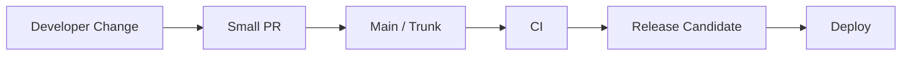
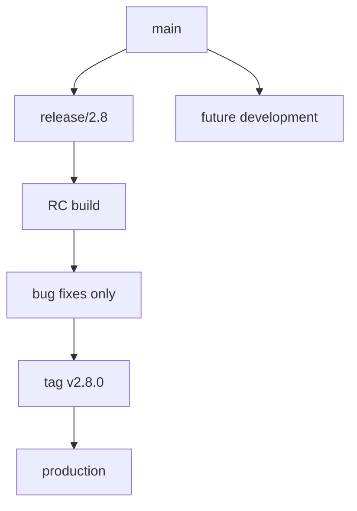
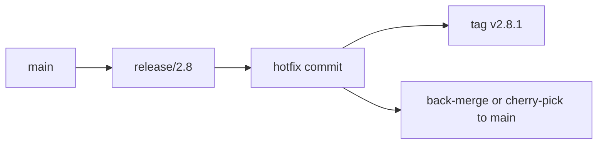
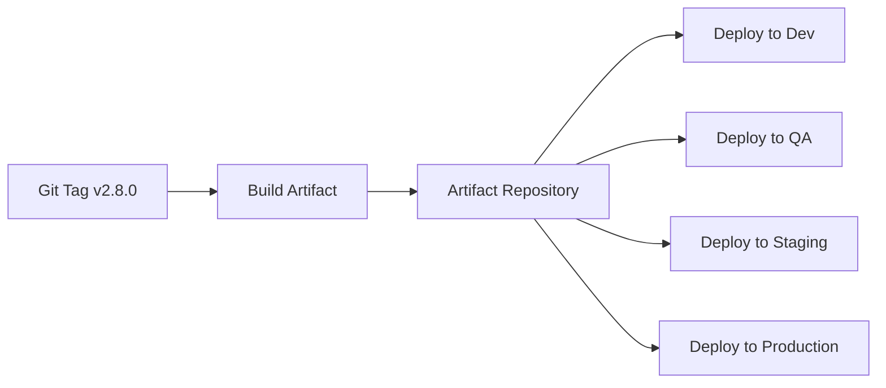
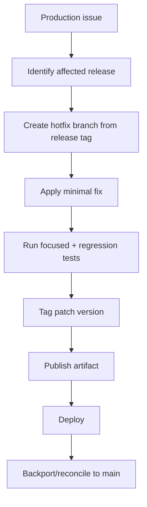
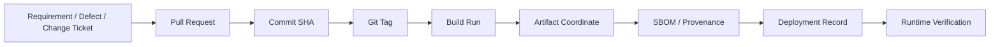

------
title: Learn Java Source, Package, Dependency, Build, Release & Deployment Engineering - Part 027
description: Branching, tagging, changelog, and release notes as release traceability mechanisms for Java applications, libraries, and enterprise delivery systems.
series: learn-java-build-dependency-release-deployment
seriesTitle: Learn Java Source, Package, Dependency, Build, Release & Deployment Engineering
order: 27
partTitle: Branching, Tagging, Changelog, and Release Notes
tags:
- java
- release-engineering
- git
- branching
- tagging
- changelog
- release-notes
- ci-cd
- maven
- gradle
- enterprise-architecture
date: 2026-06-29
------

# Part 027 — Branching, Tagging, Changelog, and Release Notes

## 1. Posisi Part Ini Dalam Seri

Part sebelumnya membahas versioning aplikasi dan library sebagai **compatibility contract**.

Sekarang kita membahas mekanisme yang membuat versi itu dapat dipercaya:

- branch strategy;
- release branch;
- tag;
- changelog;
- release notes;
- commit discipline;
- backport;
- hotfix;
- traceability;
- audit evidence.

Di banyak tim, release gagal bukan karena Java-nya rumit.

Release gagal karena organisasi tidak bisa menjawab pertanyaan sederhana:

```text
Commit mana yang sebenarnya masuk ke versi ini?
Kenapa versi ini dirilis?
Apa perbedaan versi ini dengan versi sebelumnya?
Apakah fix urgent sudah masuk tanpa membawa perubahan lain?
Siapa yang menyetujui release?
Artifact ini dibangun dari source yang mana?
```

Top-tier engineer tidak melihat Git hanya sebagai tempat menyimpan kode.

Git adalah **ledger perubahan teknis**.

Release process adalah cara mengambil subset dari ledger itu dan mengubahnya menjadi artifact yang bisa dipertanggungjawabkan.

---

## 2. Kaufman Skill Deconstruction

Mengikuti pendekatan Josh Kaufman, skill besar ini kita pecah menjadi sub-skill kecil yang bisa dilatih.

### 2.1 Target Performance Level

Setelah part ini, kita ingin mampu:

1. memilih branching model yang sesuai dengan risiko delivery;
2. menjelaskan trade-off trunk-based, release branch, dan GitFlow-style flow;
3. mendesain tag policy yang aman untuk release artifact;
4. membedakan changelog, release notes, dan commit history;
5. membuat release notes yang berguna untuk engineer, QA, operation, product, dan auditor;
6. mengelola hotfix/backport tanpa membuat branch chaos;
7. menjaga traceability dari requirement sampai deployed artifact;
8. mendeteksi release smell sebelum menjadi incident.

### 2.2 Skill Units

```text
Release traceability
├── branch model
│   ├── trunk-based
│   ├── release branch
│   ├── feature branch
│   ├── hotfix branch
│   └── long-lived branch risk
├── tag model
│   ├── annotated tag
│   ├── lightweight tag
│   ├── signed tag
│   └── tag immutability
├── change description
│   ├── commit message
│   ├── pull request title/body
│   ├── changelog
│   └── release notes
├── release evidence
│   ├── commit SHA
│   ├── build number
│   ├── artifact coordinate
│   ├── SBOM/provenance
│   └── deployment record
└── correction loop
    ├── rollback
    ├── roll-forward
    ├── hotfix
    └── backport
```

---

## 3. Mental Model: Release Is a Named, Auditable Cut of Change

A release is not merely a build.

A release is a named cut of change.

```text
Repository history + dependency state + build environment + approval context
= release evidence
```

A release must answer:

| Question | Evidence |
|---|---|
| What source was used? | Git commit SHA and tag |
| What version was produced? | Maven/Gradle version and artifact coordinate |
| What dependencies were used? | lockfile, BOM/platform, dependency report, SBOM |
| Who approved it? | pull request, CI approval, change ticket |
| What changed? | changelog and release notes |
| Where was it deployed? | deployment record |
| Can we rebuild or verify it? | reproducible build inputs and provenance |

In a regulated or enterprise environment, the release process is not only a productivity mechanism.

It is a defensibility mechanism.

---

## 4. Branching Strategy Is a Risk-Control System

A branch is not just a parallel line of development.

A branch controls:

- integration delay;
- review timing;
- conflict probability;
- testing surface;
- release isolation;
- hotfix speed;
- audit complexity;
- ownership clarity.

The weak assumption many teams make:

```text
More branches = safer releases.
```

That is often false.

More branches can mean:

- more divergence;
- more untested merge combinations;
- slower feedback;
- duplicated fixes;
- unclear source of truth;
- higher cognitive load.

A branch strategy is good only if it optimizes for the system constraints you actually have.

---

## 5. Trunk-Based Development

### 5.1 Definition

In trunk-based development, the main integration branch is the source of truth.

Changes are integrated frequently.

Long-lived feature branches are avoided.



### 5.2 Why It Works

Trunk-based development reduces integration risk by making integration continuous.

The key idea:

```text
Integration pain grows with time-separated change.
```

Small changes merged frequently are easier to reason about than large changes merged late.

### 5.3 Requirements

Trunk-based development requires discipline:

- small pull requests;
- fast CI;
- reliable tests;
- feature flags for incomplete features;
- backward-compatible schema changes;
- strong code ownership;
- rollback or roll-forward plan;
- good observability after deployment.

Without those, trunk-based development degenerates into unstable main branch chaos.

### 5.4 Good Fit

Use trunk-based development when:

- team can merge daily or several times per week;
- CI is fast enough to provide meaningful feedback;
- deployment is automated;
- feature flagging is available;
- release cadence is frequent;
- product accepts incremental delivery;
- service architecture supports independent deployment.

### 5.5 Weak Fit

Be careful when:

- release cycles are quarterly and heavily gated;
- validation requires long manual regression;
- several customers require different release lines;
- codebase lacks automated tests;
- operational rollback is slow;
- database migration discipline is weak.

Trunk-based development is not magic.

It moves risk from branch isolation to test automation, feature control, and runtime safety.

---

## 6. Release Branch Model

### 6.1 Definition

A release branch is created when a version enters stabilization.



### 6.2 Purpose

A release branch allows main to continue evolving while the release candidate is stabilized.

This is useful when:

- release validation takes time;
- QA needs a stable line;
- deployment approval is not instant;
- customer delivery windows are fixed;
- minor fixes must be accepted without pulling unrelated new features.

### 6.3 Rules

A release branch must be boring.

Allowed:

- bug fix;
- documentation update related to release;
- version metadata change;
- pipeline/release config fix;
- release-note correction;
- test fix relevant to release validation.

Not allowed:

- new feature;
- broad refactor;
- dependency upgrade without release justification;
- formatting-only mass change;
- unrelated modernization;
- behavior change not tied to release acceptance.

### 6.4 Release Branch Naming

Common patterns:

```text
release/2.8
release/2.8.x
release/2026.06
release/customer-a-2026q2
```

Choose names based on release line, not arbitrary sprint names.

Bad examples:

```text
release/final
release/prod
release/new
release/june-fixes
```

These names do not encode lifecycle meaning.

### 6.5 Back-Merge Rule

Every fix applied to a release branch must be reconciled back to main unless intentionally release-line-specific.



If you do not back-merge, bugs will reappear in future releases.

This is one of the most common enterprise release failures.

---

## 7. GitFlow-Style Model

GitFlow-style models use multiple long-lived branches, commonly:

- `main` or `master`;
- `develop`;
- `feature/*`;
- `release/*`;
- `hotfix/*`.

### 7.1 When It Helps

It can help when:

- product release cadence is slow;
- multiple release trains exist;
- manual QA cycle is long;
- product packaging is batch-oriented;
- organization expects formal release branch semantics.

### 7.2 Where It Hurts

It hurts when:

- `develop` becomes an untrusted integration landfill;
- feature branches live for weeks;
- release branches diverge heavily;
- fixes must be cherry-picked across many branches;
- CI runs only on merge to main;
- no one knows which branch represents production.

### 7.3 Strong Position

Do not adopt GitFlow because it looks “enterprise”.

Adopt it only if you have a real need for long-lived release separation.

For most modern service teams, a simplified model is better:

```text
main + short-lived feature branches + release branches only when stabilization is needed
```

---

## 8. Environment Branches Are a Smell

A common anti-pattern:

```text
dev branch
qa branch
staging branch
prod branch
```

This often indicates the team is using Git as an environment promotion mechanism.

That is dangerous.

### 8.1 Why It Is Dangerous

Environment branches create ambiguity:

- `prod` may not equal the tagged release;
- environment-specific config leaks into source control;
- promotion becomes merge-based instead of artifact-based;
- the same artifact is not promoted across environments;
- last-minute merge differences become production-only behavior.

### 8.2 Better Model

Use one artifact and promote it through environments:



Different environment configuration belongs in deployment configuration, secret management, config server, Helm values, Kustomize overlays, or equivalent deployment-layer mechanism.

It should not require rebuilding a different binary for each environment.

---

## 9. Branching Decision Matrix

| Constraint | Better Branching Choice | Reason |
|---|---|---|
| Frequent deployment | Trunk-based | Minimizes integration delay |
| Slow manual QA | Release branch | Allows stabilization while main moves |
| Multiple supported versions | Release lines | Enables controlled backport |
| Weak automated testing | Release branch may be needed temporarily | But fix the testing gap |
| Heavy customer-specific delivery | Release line per product/customer only when unavoidable | Avoid custom branch explosion |
| Library with many consumers | Tag every release, keep main clean | Consumers need immutable coordinates |
| Regulated deployment | Release branch + signed tag + evidence | Easier audit trail |
| Microservice team with flags | Trunk-based | Better flow and feedback |

The decision should be documented as an ADR.

---

## 10. Tagging: The Release Anchor

A tag names a specific commit.

For release engineering, tag quality matters.

Git supports lightweight and annotated tags. The Git documentation recommends annotated tags for releases because they carry metadata; lightweight tags are closer to private or temporary labels.

### 10.1 Lightweight Tag

```bash
git tag v2.8.0
```

A lightweight tag is basically a pointer.

It is simple, but weak as release evidence.

Use it for local experiments, not official release anchors.

### 10.2 Annotated Tag

```bash
git tag -a v2.8.0 -m "Release v2.8.0"
```

Annotated tags include metadata such as tagger, date, and message.

For release tags, this should be the default minimum.

### 10.3 Signed Tag

```bash
git tag -s v2.8.0 -m "Release v2.8.0"
```

Signed tags add cryptographic verification.

Use signed tags when:

- release integrity matters;
- artifacts are public;
- regulated traceability is required;
- organization already manages developer/release signing keys;
- supply-chain threat model includes source tampering.

### 10.4 Tag Naming

Use a stable naming convention.

For application SemVer:

```text
v2.8.0
v2.8.1
v3.0.0-rc.1
```

For CalVer:

```text
v2026.06.0
v2026.06.1
```

For multi-module repository:

```text
customer-service-v2.8.0
payment-platform-v1.14.0
bom-v2026.06.0
```

Avoid ambiguous tags:

```text
latest
prod
stable
release
final
```

These are mutable concepts, not release identities.

---

## 11. Tag Immutability Policy

A release tag must be immutable.

Do not delete and recreate release tags after publishing artifacts.

Bad flow:

```text
git tag v2.8.0
git push tag
build artifact
find bug
delete tag
move tag
rebuild artifact with same version
```

This breaks trust.

Better flow:

```text
v2.8.0 released
bug found
create v2.8.1
publish new artifact
record fix in changelog
```

If a tag was accidentally created before public release, the team may fix it internally, but once an artifact escapes CI/repository boundaries, assume the version is burned.

---

## 12. Version Source of Truth

A release has several places where version appears:

- Git tag;
- Maven `project.version`;
- Gradle `version`;
- artifact filename;
- manifest;
- container image tag;
- Helm chart version;
- deployment metadata;
- release notes.

These must agree.

### 12.1 Maven Example

```xml
<project>
  <groupId>com.acme.payment</groupId>
  <artifactId>payment-service</artifactId>
  <version>2.8.0</version>
</project>
```

Artifact coordinate:

```text
com.acme.payment:payment-service:2.8.0
```

Tag:

```text
v2.8.0
```

Image:

```text
registry.acme.internal/payment-service:2.8.0
```

### 12.2 Gradle Example

```kotlin
group = "com.acme.payment"
version = "2.8.0"
```

Publication coordinate:

```text
com.acme.payment:payment-service:2.8.0
```

### 12.3 Avoid Competing Version Sources

Do not let these disagree:

```text
pom.xml says 2.8.0
Git tag says v2.8.1
container image says latest
release notes say 2.7.9
```

This is not a documentation bug.

It is a release integrity bug.

---

## 13. Commit History Is Not a Changelog

A commit log is for developers.

A changelog is for consumers.

A release note is for stakeholders.

They overlap, but they are not the same artifact.

| Artifact | Audience | Purpose |
|---|---|---|
| Commit message | Maintainers | Explain atomic code change |
| Pull request | Reviewers and future maintainers | Explain change set and validation |
| Changelog | Users/consumers | Explain notable version-to-version changes |
| Release notes | Operators, QA, product, business, audit | Explain release impact and actions |
| Deployment note | Operations/on-call | Explain runtime rollout context |

If your release notes are just a dump of commit messages, they are usually too noisy.

If your changelog omits breaking changes, it is unsafe.

---

## 14. Commit Message Discipline

A good commit message helps later release reconstruction.

Bad:

```text
fix
update
changes
wip
misc
```

Better:

```text
Fix retry classification for 429 responses
Add checksum validation for downloaded artifacts
Remove deprecated payment-status endpoint
```

For teams using structured commit convention:

```text
fix(payment): classify 429 as retryable throttling
feat(build): publish SBOM beside release artifact
chore(deps): upgrade jackson BOM to 2.18.2
```

### 14.1 Commit Message Invariants

A release-useful commit message should answer:

- what changed;
- where it changed;
- why it matters;
- whether it is a feature, fix, chore, refactor, or breaking change.

### 14.2 Do Not Overfit to Tools

Structured commits are useful only if the team uses them consistently.

A bad conventional commit is still bad:

```text
fix: stuff
feat: update
chore: all changes
```

The format is not the discipline.

The discipline is semantic clarity.

---

## 15. Changelog Design

A changelog is a curated, chronological list of notable changes per version.

It should not contain every commit.

It should contain what a consumer needs to know.

### 15.1 Common Categories

Use categories such as:

```markdown
## [2.8.0] - 2026-06-29

### Added
- Added support for artifact provenance upload in release pipeline.

### Changed
- Changed default Maven repository mirror to internal Nexus proxy.

### Fixed
- Fixed dependency convergence failure when both module A and B import different Jackson BOM versions.

### Deprecated
- Deprecated legacy WAR packaging for new services.

### Removed
- Removed obsolete `release/dev` environment branch flow.

### Security
- Added dependency signature verification for release builds.
```

### 15.2 Changelog Rules

A strong changelog is:

- versioned;
- dated;
- curated;
- categorized;
- explicit about breaking changes;
- explicit about migrations;
- linked to issues/PRs when useful;
- written for consumers, not only authors.

### 15.3 Changelog for Internal Libraries

Internal libraries need changelog discipline too.

Consumers need to know:

- API additions;
- binary incompatible changes;
- default behavior changes;
- dependency version upgrades;
- transitive dependency changes;
- required Java baseline change;
- migration steps;
- deprecations and removal timeline.

Example:

```markdown
## [3.4.0] - 2026-06-29

### Changed
- Raised Java baseline from 17 to 21.
- Upgraded Spring Boot platform from 3.3.x to 3.4.x.

### Migration
- Consumers must compile with JDK 21 or newer.
- Replace `LegacyTokenVerifier` with `JwtTokenVerifier`.
```

A Java baseline change is not a footnote.

It is a consumer-impacting compatibility change.

---

## 16. Release Notes Design

Release notes are broader than changelog.

They explain release impact.

### 16.1 Release Notes Template

```markdown
# Release Notes — payment-service v2.8.0

## Summary
Short explanation of what this release does.

## Release Identity
- Version: 2.8.0
- Git tag: v2.8.0
- Commit SHA: abc123...
- Artifact: com.acme.payment:payment-service:2.8.0
- Container image: registry.acme.internal/payment-service:2.8.0
- Build number: 2026.06.29.184

## Change Summary
- Added ...
- Fixed ...
- Changed ...

## Breaking Changes
None / List explicitly.

## Migration Notes
Steps required before/after deployment.

## Operational Notes
- New config:
- New metrics:
- New logs:
- New alerts:

## Database Changes
- Migration ID:
- Backward compatible: yes/no
- Rollback support: yes/no

## Security Notes
- Dependency upgrades:
- Vulnerability fixes:
- Signing/SBOM/provenance:

## Deployment Plan
- Environments:
- Rollout strategy:
- Verification:

## Rollback / Roll-forward Plan
Steps and constraints.

## Known Issues
Known limitations, if any.

## Approval
- Engineering:
- QA:
- Product:
- Change manager:
```

### 16.2 Audience-Specific Content

| Audience | Needs |
|---|---|
| Developer | API changes, dependency changes, migration steps |
| QA | test focus, fixed defects, regression risks |
| SRE/operations | deployment behavior, config, metrics, rollback |
| Product | user-visible changes |
| Security | vulnerability fixes, supply-chain evidence |
| Auditor | traceability, approval, artifact identity |

A single release note can serve all audiences if structured well.

---

## 17. Release Notes for Java-Specific Concerns

Java release notes should explicitly mention:

- Java baseline change;
- Maven/Gradle plugin changes;
- dependency BOM upgrade;
- transitive dependency exposure;
- JPMS module export changes;
- classpath/module-path behavior changes;
- packaging change: thin JAR, fat JAR, WAR, native image;
- JVM runtime flag change;
- container base image change;
- memory sizing change;
- startup behavior change;
- serialization compatibility;
- schema compatibility;
- generated client compatibility.

Example:

```markdown
### Java Runtime Notes
- Runtime baseline remains Java 21.
- Build JDK changed from Temurin 21.0.5 to Temurin 21.0.6.
- Container base image changed from `eclipse-temurin:21-jre` to internal distroless JRE image.
- No JPMS exported package changes.
```

This prevents invisible platform drift.

---

## 18. Hotfix Flow

A hotfix is a targeted fix to production or release line.

It must be boring.



### 18.1 Hotfix Rules

Allowed:

- minimal fix;
- test proving the fix;
- release note update;
- version bump;
- operational mitigation documentation.

Not allowed:

- opportunistic refactor;
- unrelated dependency upgrade;
- multiple bug fixes bundled together without clear scope;
- feature work;
- formatting-only change;
- broad test rewrite.

### 18.2 Hotfix Branch Naming

```text
hotfix/v2.8.1-payment-timeout
hotfix/INC-48291-release-2.8
```

Prefer names that encode affected release and issue context.

### 18.3 Hotfix Versioning

For SemVer:

```text
2.8.0 → 2.8.1
```

For CalVer:

```text
2026.06.0 → 2026.06.1
```

Do not republish `2.8.0` with different bits.

---

## 19. Backport Flow

Backport means applying a fix from one branch to another maintained release line.

Example:

```text
main contains fix F
release/2.7 still supported
release/2.8 still supported
F must be applied to release/2.7 and release/2.8
```

### 19.1 Backport Decision Questions

Before backporting, ask:

- Is the affected release line still supported?
- Is the bug present in that line?
- Does the fix apply cleanly?
- Does the fix require newer dependencies?
- Does the fix change behavior beyond the bug?
- What tests prove the fix in that line?
- Does the release note explain the backport?

### 19.2 Backport Methods

Common approaches:

```bash
git cherry-pick <commit-sha>
```

or manual reimplementation when the code diverged.

Cherry-pick is not automatically safe.

A fix can compile but be semantically wrong in an older branch because surrounding behavior differs.

---

## 20. Traceability Model

For enterprise release, traceability should connect:



A release that cannot be traced is not truly controlled.

### 20.1 Minimum Traceability Fields

| Field | Example |
|---|---|
| Release version | `2.8.0` |
| Git tag | `v2.8.0` |
| Commit SHA | `abc123...` |
| Build run | `build-20260629-184` |
| Artifact coordinate | `com.acme:payment-service:2.8.0` |
| Image digest | `sha256:...` |
| SBOM location | artifact repository path |
| Deployment target | `prod-id-01` |
| Approval reference | change ticket |
| Release note | release note URL/path |

Do not rely on human memory.

Traceability must be mechanical.

---

## 21. Pull Request as Release Evidence

A PR is not only a code review artifact.

It is also release evidence.

A strong PR contains:

- concise title;
- problem statement;
- solution summary;
- risk explanation;
- validation evidence;
- migration notes;
- rollback notes;
- linked issue/ticket;
- screenshots/log snippets when relevant;
- dependency/security impact.

Example PR body:

```markdown
## Problem
Payment retry classification treats HTTP 429 as non-retryable, causing avoidable payment failure during upstream throttling.

## Change
Classify HTTP 429 as retryable throttling with exponential backoff.

## Validation
- Added unit test for 429 classification.
- Ran integration test against throttling stub.
- Verified retry metric `payment.retry.count` increments.

## Risk
May increase request volume during upstream throttling. Existing retry budget limits total attempts.

## Release Notes
Fixed retry classification for HTTP 429 responses.
```

This is far better than:

```text
fix retry
```

---

## 22. Release Candidate Discipline

A release candidate is a candidate to become final.

It is not just another snapshot.

### 22.1 RC Versioning

```text
2.8.0-rc.1
2.8.0-rc.2
2.8.0
```

### 22.2 RC Rules

- Build RC from controlled branch or release commit.
- Publish RC to staging/pre-release repository.
- Tag RC if needed.
- Do not mutate RC artifacts.
- If RC fails, create new RC.
- Final release should be traceably related to accepted RC.

### 22.3 RC Smell

Bad:

```text
2.8.0-rc.1 is manually patched in QA environment.
```

Better:

```text
Fix committed, 2.8.0-rc.2 built and promoted.
```

---

## 23. Enterprise Release Branch Policy Example

```markdown
# Release Branch Policy

## Branches
- `main` is the primary integration branch.
- `release/x.y` is created only for releases requiring stabilization.
- `hotfix/*` branches are created from the affected production tag.

## Allowed Changes on Release Branch
- Bug fixes approved for the release.
- Test fixes required for release verification.
- Release metadata and documentation updates.

## Disallowed Changes on Release Branch
- New features.
- Large refactors.
- Unrelated dependency upgrades.
- Formatting-only mass changes.

## Tags
- Official releases use annotated or signed tags.
- Release tags are immutable after artifact publication.
- Tag format: `v<major>.<minor>.<patch>`.

## Back-Merge
- Every release-branch fix must be reconciled to `main`.
- Exceptions require an explicit note in the release record.
```

This kind of policy reduces argument during incident pressure.

---

## 24. Failure Modes

| Failure | Symptom | Root Cause | Prevention |
|---|---|---|---|
| Reused version | Same version has different artifact bits | Mutable release process | Burn versions; publish patch version |
| Moved release tag | Tag no longer matches published artifact | Weak tag immutability | Protect release tags |
| Environment branch drift | QA/prod differ unexpectedly | Git used as promotion tool | Promote immutable artifacts |
| Missing changelog | Consumers cannot assess upgrade risk | Commit log treated as documentation | Curated changelog categories |
| Hotfix regression | Fix reintroduces bug in next release | No back-merge to main | Backport/reconciliation rule |
| Release branch chaos | Too many unrelated changes | Poor branch policy | Allow only release-scoped changes |
| Unknown production commit | Cannot diagnose issue | Deployment not linked to SHA/tag | Deployment metadata and release notes |
| No rollback path | Release incident stalls | Release notes omitted operation plan | Require rollback/roll-forward section |
| Tag/version mismatch | Artifact coordinate disagrees with Git tag | Multiple version sources | CI validation gate |
| Changelog noise | Users ignore release notes | Auto-generated commit dump | Curate notable changes |

---

## 25. CI Gates for Branching and Tagging

Add automated checks:

- release branch name format;
- tag name format;
- tag points to allowed branch/commit;
- Maven/Gradle version matches tag;
- changelog has entry for version;
- release notes generated or updated;
- no `SNAPSHOT` dependency in release;
- no dirty working tree in release build;
- artifact version not already published;
- release tag is protected;
- build uses wrapper version;
- dependency lockfile is current;
- SBOM/provenance attached.

Example pseudo-check:

```bash
TAG="v2.8.0"
PROJECT_VERSION="$(./mvnw help:evaluate -Dexpression=project.version -q -DforceStdout)"

if [ "$TAG" != "v$PROJECT_VERSION" ]; then
  echo "Tag $TAG does not match project version $PROJECT_VERSION"
  exit 1
fi
```

For Gradle:

```bash
PROJECT_VERSION="$(./gradlew properties -q | grep '^version:' | awk '{print $2}')"
```

In real enterprise pipelines, prefer a dedicated release metadata task rather than fragile text parsing.

---

## 26. Deliberate Practice Drills

### Drill 1 — Branch Model ADR

Take an existing Java service and write an ADR:

```text
Should this repo use trunk-based development, release branches, or GitFlow-style release management?
```

Include:

- release frequency;
- QA process;
- rollback capability;
- deployment automation maturity;
- customer support lines;
- team size;
- CI feedback time.

### Drill 2 — Release Traceability Reconstruction

Pick a previous production release.

Reconstruct:

- Git tag;
- commit SHA;
- artifact coordinate;
- image digest;
- dependency set;
- changelog entry;
- release note;
- approval evidence;
- deployment record.

If any field is missing, define a process fix.

### Drill 3 — Changelog Rewrite

Take a raw commit list and convert it into:

- Added;
- Changed;
- Fixed;
- Deprecated;
- Removed;
- Security;
- Migration.

Remove noise.

Keep consumer-impacting changes.

### Drill 4 — Hotfix Simulation

Simulate production bug fix:

1. create branch from release tag;
2. make minimal fix;
3. add regression test;
4. create patch version;
5. update release note;
6. tag release;
7. reconcile to main.

Measure how many manual steps exist.

### Drill 5 — Tag Protection Design

Design policy:

- who can create release tags;
- whether tags must be signed;
- whether tags are protected;
- how accidental tags are handled;
- how tag/version mismatch is detected.

---

## 27. Senior-Level Review Questions

Use these to test mastery:

1. Why are environment branches usually a deployment smell?
2. When is a release branch better than trunk-only flow?
3. Why should release tags be annotated or signed?
4. What breaks when a release tag is moved after publishing?
5. Why is a commit log not enough as a changelog?
6. What should Java-specific release notes include?
7. How do you prevent hotfixes from disappearing in future releases?
8. How should a multi-module repository tag independent releases?
9. What is the minimum evidence needed to reconstruct a production release?
10. How do you know whether GitFlow is solving a real problem or creating process theater?

---

## 28. Practical Checklist

Before official release:

- [ ] branch strategy matches release risk;
- [ ] release branch, if used, has strict allowed-change policy;
- [ ] version is final, not snapshot;
- [ ] tag name matches version;
- [ ] tag is annotated or signed;
- [ ] tag points to reviewed commit;
- [ ] CI passed on release commit;
- [ ] artifact coordinate matches tag;
- [ ] changelog has curated entry;
- [ ] release notes include operational notes;
- [ ] breaking changes are explicit;
- [ ] migration steps are explicit;
- [ ] rollback/roll-forward plan exists;
- [ ] dependency changes are listed;
- [ ] Java baseline changes are listed;
- [ ] release evidence is stored;
- [ ] hotfix/backport policy is clear;
- [ ] release tag is protected after publish.

---

## 29. Key Takeaways

Branching, tagging, changelog, and release notes are not administrative decoration.

They are the control plane of release traceability.

The main mental models:

1. **A release is a named, auditable cut of change.**
2. **Branches control integration risk, not environment promotion.**
3. **Tags are release anchors and must be immutable.**
4. **Changelog is for consumers, not authors.**
5. **Release notes explain operational and business impact.**
6. **Hotfixes must be minimal and reconciled.**
7. **Traceability must be mechanical, not tribal.**

In the next part, we move from release metadata to release automation: how to build once, promote artifacts, sign them, stage them, approve them, and deploy them without rebuilding under pressure.

---

## References

- Git documentation — `git tag`: https://git-scm.com/docs/git-tag
- Pro Git Book — Tagging: https://git-scm.com/book/en/v2/Git-Basics-Tagging
- Keep a Changelog: https://keepachangelog.com/en/1.1.0/
- Maven Versioning and Release Plugin documentation: https://maven.apache.org/maven-release/maven-release-plugin/
- Gradle Maven Publish Plugin: https://docs.gradle.org/current/userguide/publishing_maven.html
