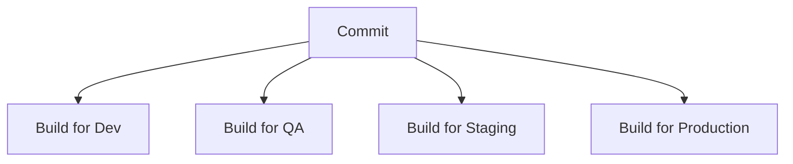
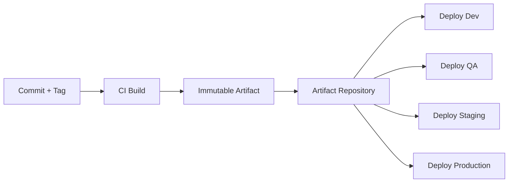
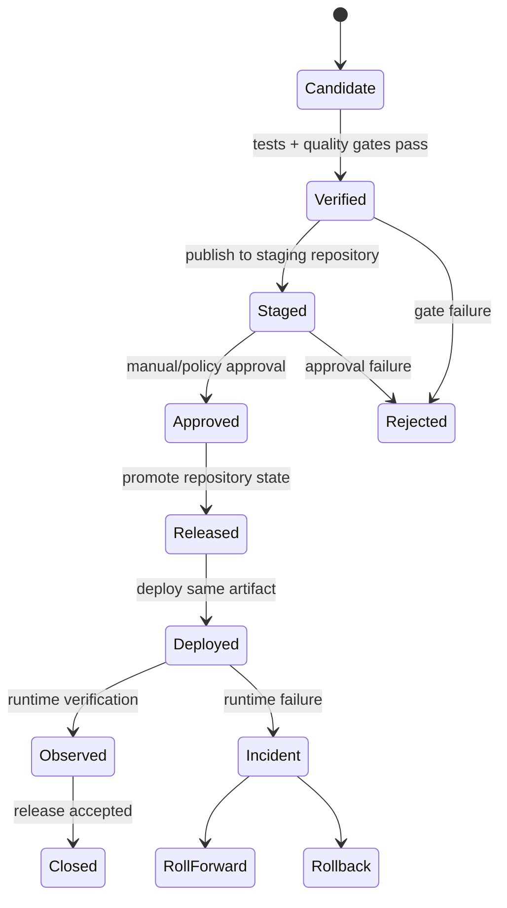
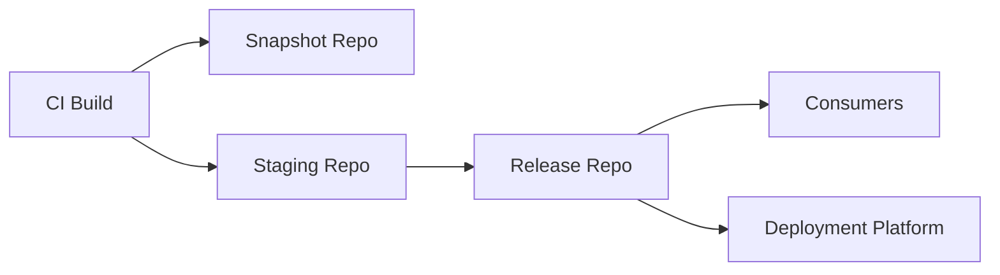
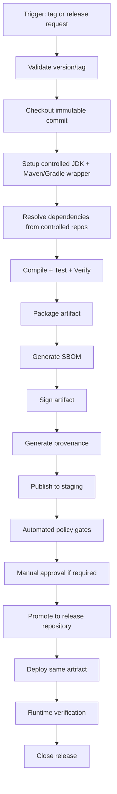
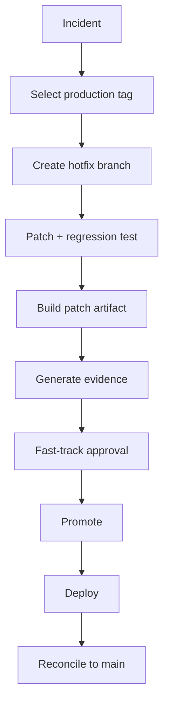

------
title: Learn Java Source, Package, Dependency, Build, Release & Deployment Engineering - Part 028
description: Release automation and artifact promotion for Java systems, covering build-once-promote-many, Maven and Gradle publishing, staging repositories, signing, approvals, rollback, and release pipeline design.
series: learn-java-build-dependency-release-deployment
seriesTitle: Learn Java Source, Package, Dependency, Build, Release & Deployment Engineering
order: 28
partTitle: Release Automation and Artifact Promotion
tags:
- java
- release-engineering
- artifact-promotion
- ci-cd
- maven
- gradle
- signing
- sbom
- provenance
- deployment
- enterprise-architecture
date: 2026-06-29
------

# Part 028 — Release Automation and Artifact Promotion

## 1. Posisi Part Ini Dalam Seri

Part sebelumnya membahas branching, tagging, changelog, dan release notes.

Sekarang kita membahas bagaimana release dijalankan secara mekanis:

- build once;
- publish artifact;
- sign artifact;
- attach SBOM/provenance;
- stage artifact;
- promote artifact;
- approve release;
- deploy release;
- rollback or roll-forward.

Di level junior, release sering dipandang sebagai command:

```bash
mvn deploy
```

atau:

```bash
./gradlew publish
```

Di level senior, release adalah **controlled transition of artifact state**.

```text
candidate → verified → staged → approved → released → deployed → observed
```

Yang berubah bukan source code.

Yang berubah adalah **trust level** terhadap artifact yang sama.

---

## 2. Kaufman Skill Deconstruction

### 2.1 Target Performance Level

Setelah part ini, kita ingin mampu:

1. mendesain release pipeline untuk Java application dan library;
2. menerapkan prinsip build-once-promote-many;
3. membedakan snapshot, release candidate, staged artifact, released artifact, dan deployed artifact;
4. mengatur Maven/Gradle publishing tanpa rebuilding saat promotion;
5. mendesain artifact repository flow;
6. memasukkan signing, SBOM, provenance, dan approval gate;
7. menghindari mutable release dan environment rebuild;
8. merancang rollback/roll-forward policy yang realistis;
9. mengevaluasi release automation dari perspektif failure mode.

### 2.2 Skill Units

```text
Release automation
├── source state
│   ├── branch
│   ├── tag
│   └── version
├── build state
│   ├── compile
│   ├── test
│   ├── package
│   └── verify
├── artifact state
│   ├── candidate
│   ├── snapshot
│   ├── RC
│   ├── staged
│   ├── released
│   └── deprecated/yanked
├── trust evidence
│   ├── checksum
│   ├── signature
│   ├── SBOM
│   ├── provenance
│   └── quality reports
└── promotion state
    ├── dev
    ├── qa
    ├── staging
    ├── production
    └── rollback/roll-forward
```

---

## 3. Mental Model: Release Is Artifact State Promotion

The most important release invariant:

```text
Do not rebuild when promoting.
```

Build once.

Promote the same bits.

If QA tested artifact A, production should run artifact A.

Not “artifact rebuilt from the same commit”.

The same artifact.

### 3.1 Wrong Model



This creates environment-specific binaries.

Even if source commit is the same, hidden inputs can differ:

- JDK patch version;
- Maven/Gradle version;
- plugin cache;
- repository metadata;
- dependency resolution timing;
- generated code timestamp;
- environment variables;
- base image version;
- OS package version.

### 3.2 Correct Model



Promotion changes trust and environment assignment.

It must not change artifact bits.

---

## 4. Release Pipeline Invariants

A strong Java release pipeline has invariants.

### 4.1 Invariant 1 — Source Identity Is Frozen

Release build must identify:

- repository;
- commit SHA;
- tag;
- branch;
- version;
- build run ID.

If the source identity is unclear, the artifact is not release-grade.

### 4.2 Invariant 2 — Toolchain Is Controlled

Release build must define:

- JDK version;
- Maven/Gradle wrapper version;
- plugin versions;
- repository mirror;
- build container image;
- environment variables;
- dependency lock state.

No release should depend on whatever happens to be installed on a CI worker.

### 4.3 Invariant 3 — Dependencies Are Controlled

Release build must avoid:

- dynamic versions;
- unbounded snapshots;
- external repository drift;
- dependency resolution from arbitrary internet sources;
- release builds with `-SNAPSHOT` dependencies unless explicitly allowed for internal pre-release testing.

### 4.4 Invariant 4 — Artifact Is Immutable

Once published as release:

```text
same coordinate + same version = same bits forever
```

For Maven artifact:

```text
com.acme.payment:payment-service:2.8.0
```

must not later point to a different JAR.

For container image, tag is useful but digest is stronger:

```text
registry.acme.internal/payment-service@sha256:...
```

### 4.5 Invariant 5 — Evidence Travels With Artifact

Release artifact should have associated evidence:

- checksum;
- signature;
- SBOM;
- provenance/attestation;
- test reports;
- static analysis reports;
- dependency scan results;
- release notes;
- approval reference.

A naked JAR is not enough for high-trust environments.

---

## 5. Release State Machine

Think of release automation as a state machine.



The point of this mental model:

- do not mix states;
- do not deploy unverified artifacts;
- do not approve artifacts that were later rebuilt;
- do not release artifacts that cannot be traced;
- do not treat deployment success as release success without observation.

---

## 6. Snapshot, RC, Staging, Release

These terms are often confused.

| State | Meaning | Mutability | Consumer Expectation |
|---|---|---|---|
| Snapshot | Moving development artifact | Mutable | Not stable |
| Candidate | Build being evaluated | Should be immutable within run | May be rejected |
| RC | Explicit release candidate | Immutable | Could become final candidate |
| Staged | Published to controlled staging area | Immutable | Awaiting approval |
| Released | Official artifact | Immutable | Safe to consume under version contract |
| Deployed | Running in environment | Immutable artifact + environment config | Operational behavior |

A snapshot is not a release.

A release candidate is not a snapshot with a nicer name.

A staged artifact is not automatically production-approved.

A deployed artifact is not necessarily the same as latest released artifact.

---

## 7. Maven Release Automation Models

Maven has multiple release styles.

### 7.1 Classic Maven Release Plugin Model

The Maven Release Plugin traditionally performs operations around release preparation and release execution, including checking project state, changing versions, tagging in SCM, and running release goals.

Common commands:

```bash
mvn release:prepare
mvn release:perform
```

This model can be useful for traditional library projects, but it must be used carefully.

### 7.2 Strengths

- established Maven ecosystem convention;
- handles version transitions;
- integrates with SCM tagging;
- useful for simple library release flow;
- familiar in older enterprise environments.

### 7.3 Risks

- can mutate POM versions during release;
- can be confusing in multi-module builds;
- can create commits/tags as side effects;
- can be hard to reason about in modern CI;
- may encourage release from developer workstation if not governed;
- may not fit container-based application deployment.

### 7.4 Modern Maven CI-Friendly Release Model

A common modern alternative:

1. version is set by CI/tag;
2. build runs in clean CI environment;
3. artifact is published to repository;
4. tag is created/protected by release workflow;
5. promotion is handled outside Maven.

Example using CI-friendly property:

```xml
<project>
  <version>${revision}</version>
</project>
```

Release build:

```bash
./mvnw -Drevision=2.8.0 clean verify deploy
```

This keeps release orchestration in CI/CD rather than pushing all release semantics into Maven plugin behavior.

### 7.5 Maven Deploy

`deploy` publishes built artifacts to a remote repository as part of Maven’s lifecycle.

For release-quality usage, ensure:

- no snapshot dependencies;
- repository target matches version type;
- credentials are CI-managed;
- artifacts are signed when required;
- checksums are generated;
- generated POM is correct;
- source and javadoc artifacts exist for public libraries when required;
- staging/promotion is explicit.

### 7.6 Maven Library vs Application Release

For libraries:

- publish JAR;
- publish POM metadata;
- publish sources JAR;
- publish javadoc JAR;
- sign artifacts;
- stage and release repository;
- update changelog;
- communicate compatibility.

For applications:

- build executable artifact;
- build container image;
- publish image by digest;
- attach SBOM/provenance;
- generate release notes;
- promote image through environments.

Do not force application release to look exactly like library release.

---

## 8. Gradle Release Automation Models

Gradle provides publishing infrastructure through plugins such as `maven-publish`.

### 8.1 Basic Gradle Maven Publish

```kotlin
plugins {
    `java-library`
    `maven-publish`
}

group = "com.acme.payment"
version = "2.8.0"

publishing {
    publications {
        create<MavenPublication>("mavenJava") {
            from(components["java"])
        }
    }
    repositories {
        maven {
            name = "internal"
            url = uri("https://repo.acme.internal/releases")
        }
    }
}
```

Publish:

```bash
./gradlew publish
```

### 8.2 Gradle Signing

For library releases, signing can be added:

```kotlin
plugins {
    signing
}

signing {
    sign(publishing.publications["mavenJava"])
}
```

In production, signing keys must be CI-secret managed, rotated, and audited.

Do not leave private keys on developer machines as the primary release mechanism.

### 8.3 Gradle Version Strategy

Avoid hiding version logic inside arbitrary build scripts.

Better patterns:

- version from tag;
- version from CI release input;
- version from release plugin with clear policy;
- version validated against tag;
- no accidental `unspecified` version;
- no dynamic version in release artifact.

### 8.4 Gradle Multi-Project Release

For multi-project builds, decide whether modules release:

1. together with one version;
2. independently with separate versions;
3. in grouped release lines.

Do not accidentally publish every subproject just because the root build has a publish task.

Recommended discipline:

```text
Only publish modules that are intended external/internal consumption units.
```

Internal implementation modules should not necessarily become published artifacts.

---

## 9. Artifact Repository Flow

A mature repository flow separates repository roles.



### 9.1 Snapshot Repository

Used for development builds.

Properties:

- mutable;
- short retention;
- not for production;
- may be overwritten or timestamped;
- useful for integration testing.

### 9.2 Staging Repository

Used for release candidates waiting for validation.

Properties:

- immutable within candidate;
- gated;
- not generally consumed by production;
- can be dropped if validation fails.

### 9.3 Release Repository

Used for official artifacts.

Properties:

- immutable;
- long retention;
- backed up;
- access controlled;
- monitored;
- indexed;
- production-consumable.

### 9.4 Promotion, Not Copy-Paste Chaos

Promotion should be recorded.

Bad:

```text
curl upload jar manually to releases repository
```

Better:

```text
CI promotes staged artifact ID 48291 to release repository with approval reference CHG-9132
```

---

## 10. Artifact Promotion Patterns

### 10.1 Repository Promotion

Artifact is first published to staging, then repository manager promotes it.

Good for:

- libraries;
- Maven Central-like release process;
- internal artifact repository governance;
- signed artifact validation.

### 10.2 Metadata Promotion

Artifact stays in one store, but metadata changes state:

```text
artifact state: candidate → approved → production-eligible
```

Good for:

- internal artifact platforms;
- container registries with labels/attestations;
- deployment orchestrators.

### 10.3 Environment Promotion

Artifact is deployed to increasingly critical environments:

```text
dev → qa → staging → prod
```

The artifact is unchanged.

Only environment configuration and deployment target change.

### 10.4 Image Digest Promotion

For containerized Java applications, promote image digest, not only mutable tags.

Bad:

```text
payment-service:latest
```

Better:

```text
payment-service:2.8.0@sha256:abc...
```

Best operational record:

```text
version: 2.8.0
image: registry.acme.internal/payment-service@sha256:abc...
gitTag: v2.8.0
commit: abc123...
sbom: repo://sbom/payment-service/2.8.0.json
provenance: repo://attestation/payment-service/2.8.0.intoto.jsonl
```

---

## 11. Signing, SBOM, and Provenance in Release Automation

Part 020 covered supply-chain security conceptually.

Here we place it in the release pipeline.

### 11.1 Signing Gate

Signing proves artifact origin/integrity according to your key management model.

Release pipeline should verify:

- signing key is available only in trusted CI context;
- signing happens after build and before release publication;
- signature is stored beside artifact;
- consumers or repository manager can verify signature;
- key rotation process exists;
- compromised key response exists.

### 11.2 SBOM Gate

SBOM should be generated from resolved dependency graph, not hand-written.

Release pipeline should verify:

- SBOM exists;
- SBOM format is accepted;
- SBOM matches artifact version;
- SBOM includes direct and transitive dependencies;
- vulnerability scan uses SBOM or equivalent resolved graph;
- SBOM is stored with artifact evidence.

### 11.3 Provenance Gate

Provenance should answer:

```text
Who built this artifact, from what source, with what builder, using what inputs?
```

At minimum:

- source repository;
- commit SHA;
- tag;
- CI workflow ID;
- builder identity;
- artifact digest;
- build parameters;
- timestamp;
- dependency state.

### 11.4 Evidence Bundle

For enterprise release, store evidence as a bundle:

```text
payment-service-2.8.0/
├── payment-service-2.8.0.jar
├── payment-service-2.8.0.jar.asc
├── payment-service-2.8.0.jar.sha256
├── payment-service-2.8.0-sbom.cdx.json
├── payment-service-2.8.0-provenance.intoto.jsonl
├── test-report.zip
├── dependency-report.txt
├── release-notes.md
└── approval.json
```

This makes incident response and audit reconstruction much easier.

---

## 12. Approval Gates

Approval gates should be explicit and minimal.

Too few gates create risk.

Too many gates create theater.

### 12.1 Gate Types

| Gate | Automated? | Purpose |
|---|---:|---|
| Unit tests | Yes | Basic correctness |
| Integration tests | Yes | External boundary behavior |
| Security scan | Yes | Known vulnerability control |
| Dependency policy | Yes | Approved graph enforcement |
| License policy | Yes | Legal compliance |
| SBOM generation | Yes | Dependency evidence |
| Signing | Yes | Integrity evidence |
| Change approval | Often manual | Business/operational acceptance |
| Production deploy approval | Often manual/conditional | Blast-radius control |

### 12.2 Gate Design Rule

A gate should define:

- input;
- decision criteria;
- output;
- owner;
- override policy;
- evidence produced;
- expiration, if temporary.

Bad gate:

```text
Someone from QA says OK in chat.
```

Better gate:

```text
QA approval recorded against release candidate 2.8.0-rc.2, test run TR-9183, and artifact digest sha256:abc...
```

---

## 13. Release Pipeline Blueprint



This flow is platform-agnostic.

It can be implemented in Jenkins, GitHub Actions, GitLab CI, Azure DevOps, Buildkite, Tekton, Argo Workflows, or internal systems.

The invariant matters more than the CI vendor.

---

## 14. Maven Pipeline Example

This is intentionally simplified.

```bash
set -euo pipefail

VERSION="${RELEASE_VERSION}"
TAG="v${VERSION}"

./mvnw -B -ntp \
  -Drevision="${VERSION}" \
  clean verify

./mvnw -B -ntp \
  -Drevision="${VERSION}" \
  -DskipTests \
  deploy
```

In real systems, add:

- dependency convergence check;
- no snapshot dependency check;
- license gate;
- SBOM generation;
- signing;
- staging repository close/release;
- provenance generation;
- release note upload;
- artifact digest capture.

### 14.1 Maven Release Validation Checks

```bash
./mvnw -B -ntp dependency:tree
./mvnw -B -ntp help:effective-pom
./mvnw -B -ntp enforcer:enforce
```

Possible Enforcer rules:

- require Maven version;
- require Java version;
- dependency convergence;
- ban duplicate classes through additional plugins;
- ban snapshot dependencies;
- require plugin versions.

---

## 15. Gradle Pipeline Example

```bash
set -euo pipefail

VERSION="${RELEASE_VERSION}"

./gradlew \
  -PreleaseVersion="${VERSION}" \
  clean check

./gradlew \
  -PreleaseVersion="${VERSION}" \
  publish
```

In real systems, include:

- dependency locking validation;
- dependency verification;
- build scan capture;
- test report archive;
- SBOM generation;
- signing;
- provenance;
- staging/promotion API call.

### 15.1 Gradle Release Validation Checks

```bash
./gradlew dependencies
./gradlew dependencyInsight --dependency jackson-databind --configuration runtimeClasspath
./gradlew check
./gradlew publishToMavenLocal
```

Use `publishToMavenLocal` only for local validation.

Never treat local Maven repository as release infrastructure.

---

## 16. Application Release vs Library Release

### 16.1 Library Release

A library release is consumed by other builds.

Primary risks:

- API compatibility;
- binary compatibility;
- transitive dependency changes;
- metadata correctness;
- signature validity;
- Maven/Gradle consumption compatibility;
- source/javadoc artifacts for public distribution;
- BOM/platform alignment.

Release success means consumers can safely resolve and upgrade.

### 16.2 Application Release

An application release is deployed into runtime environments.

Primary risks:

- runtime config;
- container image correctness;
- database migration;
- deployment strategy;
- health checks;
- resource sizing;
- observability;
- rollback/roll-forward;
- operational blast radius.

Release success means the system behaves correctly in production.

### 16.3 Shared Rule

Both require immutable artifact identity.

But their release evidence differs.

---

## 17. Database Migration in Release Automation

Database migration is part of release risk, even if migration tooling is not the main topic of this series.

Release automation must know whether a release includes:

- schema migration;
- data migration;
- backward-compatible change;
- destructive change;
- long-running migration;
- dual-write requirement;
- expand/contract sequence.

### 17.1 Release Note Fields

```markdown
## Database Migration
- Migration IDs: V2026_06_29_01, V2026_06_29_02
- Backward compatible: yes
- Requires downtime: no
- Rollback: roll-forward only after migration V2026_06_29_02
- Verification query: ...
```

### 17.2 Deployment Gate

Deployment pipeline should fail if:

- migration scripts are present but not declared in release notes;
- destructive migration lacks approval;
- app version is incompatible with already-applied migration;
- rollback plan claims to support rollback when migration does not.

Do not let database migration hide inside application startup with no release visibility.

---

## 18. Rollback and Roll-Forward

Rollback means returning to previous known-good artifact/configuration.

Roll-forward means shipping a new fix.

### 18.1 When Rollback Works

Rollback works when:

- previous artifact still compatible with current data/schema;
- config can be reverted;
- external API contract did not change irreversibly;
- message formats remain compatible;
- old version can consume current queue/topic data;
- deployment platform supports quick revert.

### 18.2 When Rollback Is Dangerous

Rollback is dangerous when:

- database migration is destructive;
- messages have been written in new incompatible format;
- external side effects occurred;
- downstream consumers changed behavior;
- secrets/config rotated incompatibly;
- state transition is not reversible.

### 18.3 Release Automation Requirement

Every release should declare:

```text
rollback supported: yes/no/limited
preferred recovery: rollback/roll-forward/mitigation
```

This must be known before production incident.

---

## 19. Hotfix Automation

Hotfix release should use the same pipeline with narrower scope.

Do not create a separate “manual emergency release” path unless absolutely unavoidable.

Emergency paths become permanent backdoors.

### 19.1 Hotfix Pipeline



### 19.2 Fast-Track Does Not Mean No Evidence

A hotfix may reduce approval latency.

It should not remove:

- source identity;
- test evidence;
- artifact identity;
- release notes;
- SBOM/signature/provenance if normally required;
- post-release reconciliation.

---

## 20. Release Automation Anti-Patterns

### 20.1 Rebuild Per Environment

```text
build-dev
build-qa
build-prod
```

This breaks promotion integrity.

### 20.2 Manual Artifact Upload

```text
Engineer uploads JAR from laptop to repository.
```

This bypasses controlled build environment.

### 20.3 `latest` as Deployment Contract

```text
image: payment-service:latest
```

This destroys traceability.

### 20.4 Release From Dirty Workspace

```text
mvn deploy from local machine with uncommitted changes
```

This creates unreconstructable artifacts.

### 20.5 Mutable Version

```text
Republish 2.8.0 because the first 2.8.0 had a small bug.
```

This breaks consumer trust.

### 20.6 Approval Detached From Artifact

```text
Approved release 2.8.0
```

without commit SHA, artifact digest, or build ID.

Approval must bind to artifact identity.

---

## 21. Failure Modes

| Failure | Symptom | Root Cause | Guardrail |
|---|---|---|---|
| Rebuilt during promotion | QA and prod differ | Build per environment | Build once, promote same artifact |
| Mutable artifact | Same version has different bits | Repository overwrite allowed | Immutable release repo |
| Missing evidence | Cannot audit release | Release pipeline only uploads JAR | Evidence bundle |
| Snapshot in release | Runtime dependency changes unexpectedly | Weak dependency gate | Ban snapshots in release build |
| Wrong repository | Release published to snapshot repo | Version/repo policy missing | Repository routing validation |
| Signing bypass | Unsigned official artifact | Manual release path | Signing gate in CI |
| Approval ambiguity | Cannot prove what was approved | Approval not bound to digest | Approval references artifact digest |
| Rollback fails | Old app incompatible with new DB | Migration risk not modeled | Pre-release rollback analysis |
| Hotfix divergence | Same bug returns later | No reconciliation to main | Mandatory backport/back-merge |
| Release plugin side effect surprise | Unexpected commit/tag/version bump | Tool behavior misunderstood | Dry run and CI-owned release |

---

## 22. Enterprise Release Policy Example

```markdown
# Java Release Automation Policy

## Source
- Official releases must originate from protected branches or protected tags.
- Release source identity must include commit SHA and tag.

## Build
- Releases must run in CI using project wrapper.
- JDK toolchain must be declared.
- Release builds must not use local developer machines.

## Dependencies
- Release builds must use controlled repositories.
- Snapshot dependencies are prohibited unless release type is explicitly pre-release.
- Dependency lock or equivalent resolved dependency evidence must be stored.

## Artifact
- Release artifacts are immutable.
- Official artifact versions must not be republished.
- Artifact checksum must be stored.

## Evidence
- SBOM is required.
- Signature is required for libraries and production deployable artifacts.
- Provenance is required for production release.
- Release notes are required before production deployment.

## Promotion
- The same artifact must be promoted across environments.
- Deployment records must include artifact digest and version.

## Exception
- Exceptions require owner, reason, expiry, and compensating control.
```

---

## 23. Release Pipeline ADR Template

```markdown
# ADR: Java Release Automation Model

## Context
Describe current release process, pain points, regulatory requirements, artifact types, and deployment model.

## Decision
We will use build-once-promote-many with CI-owned release builds and immutable artifact promotion.

## Release Trigger
- Tag-based / manual approval / scheduled release train.

## Version Source
- Git tag / CI input / project metadata.

## Artifact Types
- Maven JAR / executable JAR / container image / Helm chart / SBOM / provenance.

## Repository Flow
- snapshot → staging → release.

## Gates
- tests, dependency policy, security, signing, SBOM, approval.

## Rollback Strategy
- rollback / roll-forward / limited rollback due to DB migration.

## Consequences
Positive and negative consequences.

## Alternatives Considered
- Maven Release Plugin end-to-end.
- Manual release.
- Rebuild per environment.
```

---

## 24. Deliberate Practice Drills

### Drill 1 — Pipeline State Machine

Draw the current release pipeline of one Java service as a state machine.

Identify:

- states;
- transitions;
- gates;
- manual actions;
- artifact identity;
- evidence produced.

Then mark where artifact bits can change.

That is the danger zone.

### Drill 2 — Build Once Verification

For one production deployment, prove whether QA and production used the same artifact.

Collect:

- Git SHA;
- tag;
- Maven coordinate;
- container digest;
- build run ID;
- deployment record.

If proof is impossible, design the missing metadata.

### Drill 3 — Release Evidence Bundle

Create an evidence bundle for a sample Java library:

- JAR;
- POM;
- sources JAR;
- javadoc JAR;
- checksums;
- signatures;
- SBOM;
- provenance;
- test report;
- changelog;
- release note.

### Drill 4 — Snapshot Ban Gate

Add a release check that fails when snapshot dependencies are present.

For Maven, investigate dependency tree and Enforcer rules.

For Gradle, inspect dependencies and dependency locking.

### Drill 5 — Rollback Analysis

Pick a release with database migration.

Answer:

- Can previous app version run after migration?
- Can migration be reverted?
- Are message formats backward compatible?
- Is config backward compatible?
- Is rollback faster than roll-forward?

Document the result before release.

---

## 25. Senior-Level Review Questions

1. Why is rebuilding per environment dangerous even if the Git commit is identical?
2. What is the difference between release, deployment, and promotion?
3. Why is image digest stronger than image tag?
4. What evidence should be attached to a production Java artifact?
5. When is Maven Release Plugin appropriate, and when can it be harmful?
6. How should Gradle multi-project builds avoid accidental publication?
7. Why must approval bind to artifact identity?
8. What makes rollback impossible for some releases?
9. How do you prevent emergency hotfixes from becoming governance bypasses?
10. What are the minimum controls for a high-trust Java release pipeline?

---

## 26. Practical Checklist

Release pipeline readiness:

- [ ] release trigger is explicit;
- [ ] version source is explicit;
- [ ] tag/version validation exists;
- [ ] build runs only in controlled CI;
- [ ] JDK/toolchain is declared;
- [ ] Maven/Gradle wrapper is used;
- [ ] repositories are controlled;
- [ ] release dependencies are locked or recorded;
- [ ] snapshot dependencies are banned for official release;
- [ ] tests and quality gates run before publishing;
- [ ] artifact checksum is stored;
- [ ] artifact signature is created when required;
- [ ] SBOM is generated;
- [ ] provenance is generated;
- [ ] artifact is published to staging first when appropriate;
- [ ] approval references artifact identity;
- [ ] release repository is immutable;
- [ ] deployment uses same artifact;
- [ ] deployment record includes digest/version;
- [ ] rollback/roll-forward strategy is documented;
- [ ] hotfix path uses same pipeline;
- [ ] release evidence is retained.

---

## 27. Key Takeaways

Release automation is not about making `mvn deploy` or `gradle publish` faster.

It is about making artifact transition safe, reproducible, auditable, and boring.

The core principles:

1. **Build once, promote many.**
2. **Promotion changes state, not bits.**
3. **Release artifacts are immutable.**
4. **Approval must bind to artifact identity.**
5. **Evidence must travel with artifact.**
6. **Emergency release must not bypass traceability.**
7. **Rollback must be analyzed before production.**

In the next part, we move from release automation to packaging models: thin JAR, fat JAR, shaded JAR, executable JAR, WAR, JPMS modular JAR, multi-release JAR, runtime images, and how packaging choices shape deployment behavior.

---

## References

- Maven Release Plugin: https://maven.apache.org/maven-release/maven-release-plugin/
- Maven Release Plugin `release:prepare`: https://maven.apache.org/maven-release/maven-release-plugin/prepare-mojo.html
- Maven Deploy Plugin: https://maven.apache.org/plugins/maven-deploy-plugin/
- Gradle Maven Publish Plugin: https://docs.gradle.org/current/userguide/publishing_maven.html
- Gradle Signing Plugin: https://docs.gradle.org/current/userguide/signing_plugin.html
- SLSA Specification: https://slsa.dev/spec/
