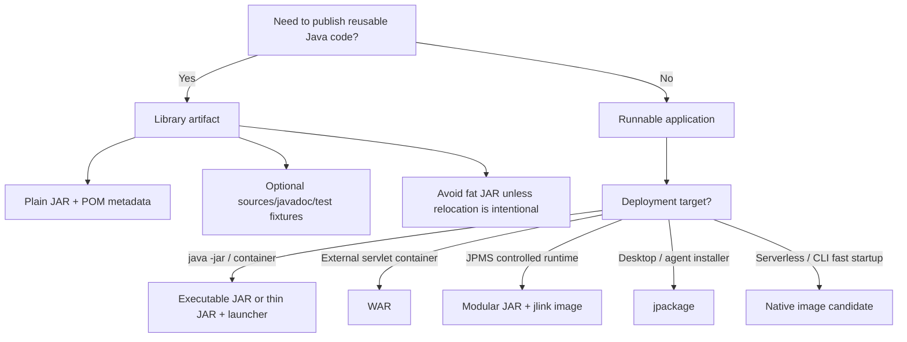

------
title: Learn Java Source, Package, Dependency, Build, Release & Deployment Engineering - Part 029
description: Java packaging models for production systems, covering thin JAR, fat JAR, shaded JAR, executable JAR, WAR, modular JAR, multi-release JAR, jlink runtime image, jpackage installer, and packaging decision architecture.
series: learn-java-build-dependency-release-deployment
seriesTitle: Learn Java Source, Package, Dependency, Build, Release & Deployment Engineering
order: 29
partTitle: Java Packaging Models
tags:
- java
- packaging
- jar
- war
- jpms
- jlink
- jpackage
- spring-boot
- release-engineering
- deployment
- enterprise-architecture
date: 2026-06-29
------

# Part 029 — Java Packaging Models

## 1. Posisi Part Ini Dalam Seri

Part sebelumnya membahas release automation dan artifact promotion.

Sekarang kita masuk ke bentuk fisik artifact Java.

Ini penting karena build/release/deployment sering gagal bukan karena source code salah, tetapi karena **bentuk artifact tidak cocok dengan deployment model**.

Contoh:

- library dipublish sebagai fat JAR sehingga membawa dependency yang seharusnya dikelola consumer;
- aplikasi dipackage sebagai thin JAR tapi runtime classpath tidak konsisten antar environment;
- Spring Boot executable JAR diperlakukan seperti JAR biasa sehingga classpath/debugging membingungkan;
- WAR dipilih untuk sistem baru padahal organisasi tidak lagi mengoperasikan app server dengan baik;
- native image dipakai untuk mengejar startup cepat, tapi reflection/resource/proxy configuration tidak dimodelkan;
- `jlink` image dibuat, tetapi security patch cadence untuk runtime image tidak dirancang.

Di level top-tier, packaging bukan sekadar output build.

Packaging adalah **deployment contract**.

```text
source code + dependencies + runtime assumptions + operational constraints = package model
```

Package yang baik menjawab:

1. siapa membawa dependency?
2. siapa membawa runtime?
3. siapa menentukan classpath/module path?
4. siapa melakukan startup?
5. siapa melakukan patching?
6. siapa mengobservasi versi yang sedang berjalan?
7. siapa bertanggung jawab saat rollback?

---

## 2. Kaufman Skill Deconstruction

### 2.1 Target Performance Level

Setelah part ini, kita ingin mampu:

1. membedakan packaging Java application vs library;
2. memilih thin JAR, fat JAR, shaded JAR, executable JAR, WAR, modular JAR, native image, `jlink`, atau `jpackage` dengan alasan yang defensible;
3. memahami konsekuensi classpath, module path, dependency mediation, startup, image layering, dan patching;
4. mendesain package layout yang mendukung release automation;
5. menghindari packaging yang menyembunyikan risiko dependency;
6. membuat decision matrix untuk enterprise Java workloads;
7. men-debug packaging failure seperti `ClassNotFoundException`, duplicate classes, `NoSuchMethodError`, reflective access, dan resource missing;
8. merancang packaging policy untuk platform internal.

### 2.2 Sub-Skills

Skill packaging dipecah menjadi beberapa sub-skill:

| Sub-skill | Pertanyaan utama |
|---|---|
| Artifact identity | Artifact ini application, library, plugin, runtime image, atau installer? |
| Dependency carriage | Dependency dibawa dalam artifact, disediakan runtime, atau dideklarasikan sebagai metadata? |
| Runtime carriage | JRE/JDK dibawa bersama artifact atau disediakan environment? |
| Class loading model | Classpath, module path, nested class loader, app server loader, atau native image closed world? |
| Upgrade model | Patch aplikasi dan patch runtime dilakukan bersamaan atau terpisah? |
| Deployment model | Artifact dijalankan via `java -jar`, app server, container, OS package, atau orchestrator? |
| Debuggability | Apakah dependency/resource/classpath mudah diinspeksi? |
| Reproducibility | Apakah artifact deterministic dan traceable ke source/build? |
| Operational risk | Apakah packaging mendukung rollback, health check, observability, dan emergency patch? |

### 2.3 First 20 Hours Practice Plan

| Jam | Fokus | Output |
|---:|---|---|
| 1-2 | Membongkar JAR standar | Bisa membaca manifest, classes, resources |
| 3-4 | Thin JAR + external classpath | Bisa menjalankan aplikasi dengan dependency eksternal |
| 5-6 | Fat JAR/shaded JAR | Bisa membuat single JAR dan memahami risikonya |
| 7-8 | Spring Boot executable JAR | Bisa menjelaskan `BOOT-INF/classes` dan `BOOT-INF/lib` |
| 9-10 | WAR deployment | Bisa membedakan embedded vs external servlet container |
| 11-12 | JPMS modular JAR | Bisa menjalankan modular application via module path |
| 13-14 | Multi-release JAR | Bisa menjelaskan kapan layak dan kapan berbahaya |
| 15-16 | `jlink` runtime image | Bisa membuat custom runtime image |
| 17-18 | `jpackage` installer | Bisa menjelaskan desktop/agent distribution use case |
| 19-20 | Packaging decision review | Bisa menulis ADR packaging untuk sistem nyata |

---

## 3. Mental Model: Package as Runtime Contract

Kita perlu membedakan empat hal:

```text
source artifact     = code representation
build artifact      = compiler/build output
release artifact    = immutable artifact trusted by release process
deployment artifact = artifact consumed by runtime platform
```

Kadang semuanya satu file.

Kadang tidak.

Contoh library Java:

```text
source artifact     = Git tag
build artifact      = target/my-lib-1.2.0.jar
release artifact    = signed JAR + POM + sources JAR + javadoc JAR + checksum
deployment artifact = dependency resolved into consumer classpath
```

Contoh Spring Boot service:

```text
source artifact     = Git tag
build artifact      = build/libs/payment-service.jar
release artifact    = signed executable JAR + SBOM
deployment artifact = OCI image containing executable JAR
```

Contoh desktop Java app:

```text
source artifact     = Git tag
build artifact      = modular JARs
release artifact    = custom runtime image
 deployment artifact = platform installer generated by jpackage
```

Perbedaan ini penting karena packaging decision menentukan siapa yang mengontrol dependency, runtime, startup, patch, dan rollback.

---

## 4. Packaging Decision Diagram



---

## 5. Plain JAR

### 5.1 Apa Itu Plain JAR?

Plain JAR adalah archive ZIP dengan struktur yang dipahami JVM/tooling Java.

Secara sederhana:

```text
my-lib-1.0.0.jar
├── META-INF/
│   └── MANIFEST.MF
└── com/acme/payment/
    ├── Money.class
    └── CurrencyPolicy.class
```

Untuk library, plain JAR adalah default paling sehat.

Kenapa?

Karena library tidak seharusnya membawa semua dependency-nya sebagai bytecode gabungan. Library sebaiknya mempublikasikan:

- JAR berisi class miliknya;
- metadata dependency melalui POM/Gradle Module Metadata;
- sources JAR;
- javadoc JAR;
- checksum/signature;
- optional SBOM.

Consumer lalu membangun dependency graph-nya sendiri.

### 5.2 Kapan Memakai Plain JAR?

Gunakan plain JAR untuk:

- reusable library;
- shared domain model;
- SDK internal;
- annotation processor;
- plugin;
- test fixture;
- JPMS module;
- library yang dipublish ke internal/external repository.

### 5.3 Invariant Plain JAR untuk Library

```text
Library JAR should contain its own classes and resources, not a hidden universe of dependencies.
```

Dependency library harus transparan.

Jika library diam-diam membawa dependency yang sudah disalin ke dalam JAR, consumer kehilangan kemampuan untuk:

- melakukan dependency mediation;
- meng-upgrade transitive dependency;
- melakukan vulnerability scanning yang akurat;
- mendeteksi duplicate classes;
- mengontrol classpath order;
- menggunakan BOM/platform.

### 5.4 Maven Plain JAR

```xml
<project>
  <modelVersion>4.0.0</modelVersion>

  <groupId>com.acme.platform</groupId>
  <artifactId>money-core</artifactId>
  <version>1.4.0</version>
  <packaging>jar</packaging>

  <dependencies>
    <dependency>
      <groupId>org.slf4j</groupId>
      <artifactId>slf4j-api</artifactId>
      <version>2.0.17</version>
    </dependency>
  </dependencies>
</project>
```

Build:

```bash
mvn clean package
```

Publish:

```bash
mvn deploy
```

### 5.5 Gradle Plain JAR

```kotlin
plugins {
    `java-library`
    `maven-publish`
}

group = "com.acme.platform"
version = "1.4.0"

java {
    withSourcesJar()
    withJavadocJar()
}

dependencies {
    api("org.slf4j:slf4j-api:2.0.17")
    implementation("com.fasterxml.jackson.core:jackson-databind:2.17.2")
}

publishing {
    publications {
        create<MavenPublication>("mavenJava") {
            from(components["java"])
        }
    }
}
```

Perhatikan penggunaan `java-library`.

`api` berarti dependency terlihat sebagai bagian dari API consumer.

`implementation` berarti dependency internal terhadap library.

Ini bukan sekadar sintaks Gradle. Ini adalah boundary compatibility.

---

## 6. Thin JAR

### 6.1 Apa Itu Thin JAR?

Thin JAR adalah JAR aplikasi yang hanya berisi class aplikasi sendiri, sementara dependency disediakan secara eksternal.

Contoh:

```text
payment-service.jar
├── META-INF/MANIFEST.MF
└── com/acme/payment/App.class

lib/
├── jackson-databind.jar
├── slf4j-api.jar
├── logback-classic.jar
└── postgresql.jar
```

Runtime command:

```bash
java -cp "payment-service.jar:lib/*" com.acme.payment.App
```

### 6.2 Kapan Thin JAR Masuk Akal?

Thin JAR masuk akal ketika:

- runtime platform mengelola dependency separately;
- aplikasi dijalankan di controlled enterprise runtime;
- dependency patching perlu dilakukan tanpa rebuild aplikasi;
- beberapa aplikasi berbagi dependency bundle;
- startup launcher custom diperlukan;
- app server/container lama mengatur classpath;
- packaging ingin memisahkan application code layer dan dependency layer.

### 6.3 Risiko Thin JAR

Thin JAR berbahaya jika dependency runtime tidak dikontrol ketat.

Failure umum:

```text
CI passed with dependency set A.
Production ran with dependency set B.
```

Hasilnya:

- `ClassNotFoundException`;
- `NoClassDefFoundError`;
- `NoSuchMethodError`;
- incompatible driver;
- security patch regression;
- inconsistent behavior antar node.

### 6.4 Thin JAR Invariant

```text
Thin JAR is safe only if the external runtime classpath is versioned, immutable, and traceable.
```

Kalau `lib/` bisa diedit manual di server, itu bukan thin JAR architecture.

Itu operational gambling.

### 6.5 Thin JAR Deployment Layout

Lebih sehat:

```text
releases/
└── payment-service/
    └── 1.8.3/
        ├── app/
        │   └── payment-service.jar
        ├── lib/
        │   ├── jackson-databind-2.17.2.jar
        │   ├── logback-classic-1.5.6.jar
        │   └── postgresql-42.7.3.jar
        ├── bin/
        │   └── start.sh
        ├── conf/
        │   └── application.yml.template
        └── manifest.json
```

`manifest.json` sebaiknya memuat:

```json
{
  "application": "payment-service",
  "version": "1.8.3",
  "gitCommit": "abc1234",
  "buildJdk": "25.0.1",
  "runtimeJdk": "25",
  "dependencies": [
    "com.fasterxml.jackson.core:jackson-databind:2.17.2",
    "ch.qos.logback:logback-classic:1.5.6",
    "org.postgresql:postgresql:42.7.3"
  ]
}
```

---

## 7. Fat JAR / Uber JAR

### 7.1 Apa Itu Fat JAR?

Fat JAR atau Uber JAR adalah single JAR yang membawa aplikasi dan dependency di dalam satu archive.

Secara konseptual:

```text
payment-service-all.jar
├── com/acme/payment/App.class
├── com/fasterxml/jackson/...
├── org/slf4j/...
└── ch/qos/logback/...
```

Tujuannya sederhana:

```text
java -jar payment-service-all.jar
```

### 7.2 Benefit Fat JAR

Fat JAR memudahkan:

- distribusi single file;
- CLI tools;
- batch jobs;
- demos;
- air-gapped environment;
- simple deployment;
- avoidance of runtime classpath assembly.

### 7.3 Risiko Fat JAR

Fat JAR sering terlihat sederhana, tetapi menyembunyikan banyak keputusan:

1. Apa yang terjadi saat dua dependency punya file resource dengan path sama?
2. Apa yang terjadi pada `META-INF/services`?
3. Bagaimana signature file di `META-INF` ditangani?
4. Apakah dependency license tetap traceable?
5. Apakah scanner bisa membaca dependency asli?
6. Apakah duplicate classes terdeteksi?
7. Apakah dependency relocation dilakukan?
8. Apakah transitive dependency masih bisa di-upgrade oleh consumer?

Untuk application artifact, fat JAR bisa masuk akal.

Untuk library artifact, fat JAR sering salah.

### 7.4 Maven Shade Plugin Pattern

```xml
<plugin>
  <groupId>org.apache.maven.plugins</groupId>
  <artifactId>maven-shade-plugin</artifactId>
  <version>3.6.0</version>
  <executions>
    <execution>
      <phase>package</phase>
      <goals>
        <goal>shade</goal>
      </goals>
      <configuration>
        <createDependencyReducedPom>true</createDependencyReducedPom>
        <transformers>
          <transformer implementation="org.apache.maven.plugins.shade.resource.ManifestResourceTransformer">
            <mainClass>com.acme.payment.App</mainClass>
          </transformer>
          <transformer implementation="org.apache.maven.plugins.shade.resource.ServicesResourceTransformer" />
        </transformers>
      </configuration>
    </execution>
  </executions>
</plugin>
```

### 7.5 Gradle Shadow Plugin Pattern

```kotlin
plugins {
    application
    id("com.github.johnrengelman.shadow") version "8.1.1"
}

application {
    mainClass.set("com.acme.payment.App")
}

tasks.shadowJar {
    archiveClassifier.set("all")
    mergeServiceFiles()
}
```

### 7.6 Fat JAR Rule

```text
Fat JAR is a deployment convenience, not a dependency governance strategy.
```

Jika organisasi memakai fat JAR, tetap butuh:

- dependency lock;
- SBOM;
- signing;
- vulnerability scan;
- duplicate class detection;
- reproducible build;
- explicit resource merge strategy;
- startup smoke test.

---

## 8. Shaded JAR and Relocation

### 8.1 Shading vs Fat JAR

Fat JAR berarti dependency disatukan.

Shading bisa berarti dependency disatukan **dan** package-nya direlokasi.

Contoh relocation:

```text
org.objectweb.asm.*
```

menjadi:

```text
com.acme.internal.shadow.asm.*
```

Tujuannya menghindari conflict dengan dependency consumer.

### 8.2 Kapan Relocation Layak?

Relocation masuk akal untuk:

- compiler plugin;
- build plugin;
- agent;
- framework internal dependency;
- library yang harus membawa dependency internal stabil;
- dependency kecil yang sangat rentan conflict;
- tool executable.

### 8.3 Kapan Relocation Berbahaya?

Relocation berbahaya ketika:

- dependency punya reflection-heavy behavior;
- dependency membaca resource berdasarkan package name;
- dependency mengekspos class di public API;
- dependency punya native library;
- dependency memakai `ServiceLoader`;
- dependency punya license/notice requirement yang tidak dipindahkan benar;
- scanner/security tooling tidak bisa memetakan dependency asli.

### 8.4 Rule untuk Library

```text
Never expose relocated classes in public API.
```

Buruk:

```java
public class ParserFactory {
    public com.acme.shadow.jackson.ObjectMapper mapper() {
        return new com.acme.shadow.jackson.ObjectMapper();
    }
}
```

Lebih baik:

```java
public interface JsonSerializer {
    String serialize(Object value);
}
```

Internal implementation boleh memakai relocated dependency.

Public contract tidak boleh bocor.

---

## 9. Executable JAR

### 9.1 Manifest Main-Class

JAR bisa dibuat executable dengan `Main-Class` di manifest.

```text
META-INF/MANIFEST.MF
```

```text
Main-Class: com.acme.payment.App
```

Command:

```bash
java -jar payment-service.jar
```

Namun ada batas penting:

```text
java -jar ignores ordinary -cp application classpath semantics.
```

Jika dependency tidak ada di dalam JAR atau tidak direferensikan via manifest `Class-Path`, aplikasi gagal.

### 9.2 Manifest Class-Path

Manifest bisa memuat:

```text
Class-Path: lib/jackson-databind.jar lib/logback-classic.jar
```

Tetapi ini brittle:

- path relatif harus benar;
- dependency ordering bisa penting;
- command-line visibility rendah;
- environment packaging harus presisi.

Untuk service modern, executable JAR biasanya berarti either:

- fat/shaded JAR;
- framework-specific executable JAR seperti Spring Boot;
- custom launcher.

---

## 10. Spring Boot Executable JAR

### 10.1 Struktur Boot JAR

Spring Boot executable JAR bukan sekadar fat JAR biasa.

Strukturnya umumnya:

```text
payment-service.jar
├── META-INF/
│   └── MANIFEST.MF
├── org/springframework/boot/loader/...
└── BOOT-INF/
    ├── classes/
    │   └── com/acme/payment/App.class
    └── lib/
        ├── jackson-databind.jar
        ├── spring-core.jar
        └── logback-classic.jar
```

Aplikasi dijalankan oleh boot loader yang tahu cara membaca nested JAR.

Ini berbeda dari shaded JAR biasa.

Dependency tetap berupa nested JAR, bukan selalu diekstrak menjadi class flat.

### 10.2 Kekuatan Boot JAR

Spring Boot executable JAR bagus untuk:

- service deployment;
- `java -jar` simplicity;
- dependency separation di dalam archive;
- embedded servlet container;
- layered JAR untuk container image;
- build plugin integration;
- operational convention.

### 10.3 Risiko Boot JAR

Risiko Boot JAR:

- class loader model berbeda dari plain classpath;
- nested JAR bisa membingungkan tooling lama;
- fat artifact besar;
- dependency patch tetap butuh rebuild artifact/image;
- startup debug perlu memahami Boot loader;
- mixing with custom classloader bisa kompleks.

### 10.4 Maven Spring Boot Packaging

```xml
<plugin>
  <groupId>org.springframework.boot</groupId>
  <artifactId>spring-boot-maven-plugin</artifactId>
  <configuration>
    <layers>
      <enabled>true</enabled>
    </layers>
  </configuration>
</plugin>
```

Build:

```bash
mvn clean package
```

### 10.5 Gradle Spring Boot Packaging

```kotlin
plugins {
    id("org.springframework.boot") version "3.5.0"
    id("io.spring.dependency-management") version "1.1.7"
    java
}

tasks.bootJar {
    layered {
        enabled.set(true)
    }
}
```

### 10.6 Boot JAR Rule

```text
Spring Boot executable JAR is an application package, not a library package.
```

Jangan publish Boot JAR sebagai dependency library untuk consumer.

Jika project menghasilkan reusable code dan aplikasi Boot, pisahkan artifact:

```text
payment-core       -> plain library JAR
payment-service    -> executable Boot JAR
```

---

## 11. WAR

### 11.1 Apa Itu WAR?

WAR adalah Web Application Archive.

Struktur umum:

```text
payment.war
├── index.html
├── WEB-INF/
│   ├── web.xml
│   ├── classes/
│   │   └── com/acme/payment/Servlet.class
│   └── lib/
│       ├── spring-webmvc.jar
│       └── jackson-databind.jar
```

WAR historically ditujukan untuk deployment ke servlet container atau application server.

Contoh runtime:

- Tomcat;
- Jetty;
- Undertow;
- WebLogic;
- WebSphere;
- WildFly/JBoss.

### 11.2 WAR dalam Sistem Modern

WAR masih relevan ketika:

- organisasi memiliki app server platform matang;
- compliance/ops standard mengharuskan external container;
- banyak aplikasi legacy berjalan di satu runtime;
- deployment lifecycle dikendalikan app server;
- Java EE/Jakarta EE features disediakan container;
- shared operational tooling sudah mapan.

Tetapi untuk service baru, executable JAR/container image sering lebih sederhana.

### 11.3 Provided Scope

WAR sering memakai dependency `provided`.

Contoh Maven:

```xml
<dependency>
  <groupId>jakarta.servlet</groupId>
  <artifactId>jakarta.servlet-api</artifactId>
  <version>6.1.0</version>
  <scope>provided</scope>
</dependency>
```

Artinya:

```text
compile against this API, but do not package it in the WAR.
```

Runtime container menyediakan dependency tersebut.

### 11.4 WAR Failure Mode

WAR paling sering gagal karena mismatch antara build-time API dan runtime container.

Contoh:

```text
Build compiled against Jakarta Servlet 6.
Runtime container only supports older Servlet API.
```

Hasil:

- `NoSuchMethodError`;
- startup failure;
- deployment rejected;
- classloader conflict;
- duplicate logging framework;
- memory leak saat redeploy.

### 11.5 WAR Invariant

```text
WAR is safe only when the external container contract is explicit, versioned, and tested.
```

Minimal harus jelas:

- container vendor;
- container version;
- Servlet/Jakarta EE version;
- provided libraries;
- classloader isolation behavior;
- deployment descriptor conventions;
- redeploy behavior;
- logging integration;
- security realm integration;
- patch cadence.

---

## 12. EAR Legacy Context

### 12.1 Apa Itu EAR?

EAR adalah Enterprise Application Archive.

EAR dapat berisi beberapa module:

```text
banking.ear
├── META-INF/application.xml
├── account-web.war
├── transfer-ejb.jar
├── settlement-ejb.jar
└── lib/shared-domain.jar
```

EAR berasal dari Java EE application server model.

### 12.2 Kapan Masih Relevan?

EAR masih muncul dalam:

- core banking legacy;
- telecom BSS/OSS legacy;
- insurance platform;
- government enterprise system;
- app server-centric deployments;
- EJB/JMS/JTA-heavy systems.

Untuk greenfield microservice Java modern, EAR biasanya bukan pilihan pertama.

### 12.3 Risiko EAR

Risiko utama:

- deployment unit terlalu besar;
- lifecycle antar module terkunci;
- classloader behavior vendor-specific;
- upgrade app server mahal;
- testing lokal sulit;
- CI/CD granular sulit;
- rollback partial sulit;
- dependency ownership kabur.

### 12.4 Rule

```text
Do not modernize an EAR by merely wrapping it in a container image.
```

Jika EAR tetap dipakai, pahami bahwa container image hanya membungkus runtime lama.

Arsitektur deployment tetap app-server-centric.

---

## 13. Modular JAR

### 13.1 Apa Itu Modular JAR?

Modular JAR adalah JAR yang memiliki `module-info.class`.

Source:

```java
module com.acme.payment.core {
    exports com.acme.payment.api;
    requires java.sql;
}
```

Packaging:

```text
payment-core.jar
├── module-info.class
└── com/acme/payment/api/Money.class
```

Runtime:

```bash
java --module-path mods \
     --module com.acme.payment.app/com.acme.payment.App
```

### 13.2 Kapan Modular JAR Masuk Akal?

Modular JAR masuk akal ketika:

- kamu ingin strong encapsulation;
- dependency graph perlu eksplisit;
- aplikasi cocok untuk `jlink`;
- library ingin memberi module metadata;
- runtime image ingin diperkecil;
- platform internal ingin module boundary formal;
- reflection/open package policy perlu eksplisit.

### 13.3 Risiko Modular JAR

Risiko:

- dependency belum modular;
- automatic module name unstable;
- split package;
- reflection-heavy framework butuh `opens`;
- build tool/IDE misconfiguration;
- classpath/module path mixing;
- migration effort tinggi.

### 13.4 Modular Packaging Rule

```text
JPMS gives architectural enforcement only if your dependency graph and reflection policy are intentionally designed.
```

Menambahkan `module-info.java` tanpa governance bisa membuat sistem lebih brittle.

---

## 14. Multi-Release JAR

### 14.1 Apa Itu Multi-Release JAR?

Multi-release JAR memungkinkan class berbeda untuk versi Java berbeda di archive yang sama.

Struktur:

```text
my-lib.jar
├── com/acme/Foo.class
└── META-INF/versions/21/com/acme/Foo.class
```

Runtime Java 21 dapat memilih class di `META-INF/versions/21`.

Runtime lama memakai base class.

### 14.2 Kapan Layak?

Multi-release JAR bisa layak untuk library yang:

- ingin mendukung baseline lama;
- ingin mengoptimalkan fitur JDK baru;
- punya compatibility matrix jelas;
- mampu melakukan test matrix lintas JDK;
- memiliki release discipline kuat.

Contoh:

```text
Base implementation supports Java 11.
Java 21 implementation uses newer API for performance.
```

### 14.3 Risiko

Risiko multi-release JAR tinggi:

- test matrix lebih kompleks;
- behavior berbeda per runtime;
- debugging lebih sulit;
- tooling scanning harus paham MRJAR;
- accidental API usage di base class bisa merusak compatibility;
- class identity bisa membingungkan.

### 14.4 Rule

```text
Use multi-release JAR only when the compatibility benefit outweighs the operational complexity.
```

Untuk kebanyakan enterprise application internal, lebih sederhana memilih satu Java baseline.

---

## 15. Native Image Concept

### 15.1 Apa Itu Native Image?

Native image mengubah aplikasi Java menjadi executable native ahead-of-time.

Manfaat umum:

- startup cepat;
- memory footprint lebih kecil untuk beberapa workload;
- cocok untuk CLI/serverless tertentu;
- tidak membutuhkan JVM runtime terpisah di deployment image.

Tetapi mental modelnya berbeda.

JVM biasa:

```text
load classes dynamically at runtime
```

Native image:

```text
closed-world analysis before runtime
```

### 15.2 Kapan Layak?

Native image bisa layak untuk:

- CLI tools;
- short-lived jobs;
- serverless functions;
- latency-sensitive cold start;
- edge deployment;
- memory-constrained workloads.

### 15.3 Risiko Native Image

Risiko:

- reflection config;
- dynamic proxy config;
- resource inclusion;
- JNI/native library handling;
- build time panjang;
- platform-specific output;
- runtime behavior berbeda;
- debugging berbeda;
- dependency support tidak merata.

### 15.4 Rule

```text
Native image is a runtime model decision, not just a packaging optimization.
```

Jangan memilih native image hanya karena “lebih cepat”.

Tanyakan:

- bottleneck kita startup atau throughput?
- memory limit kita ketat atau tidak?
- dependency stack native-image friendly atau tidak?
- observability agent compatible atau tidak?
- debugging workflow siap atau tidak?
- CI build time acceptable atau tidak?

---

## 16. `jlink` Runtime Image

### 16.1 Apa Itu `jlink`?

`jlink` membuat custom runtime image dari Java modules.

Alih-alih membawa seluruh JDK/JRE, kita bisa membuat runtime yang hanya berisi module yang diperlukan.

Contoh konseptual:

```bash
jlink \
  --module-path "$JAVA_HOME/jmods:mods" \
  --add-modules com.acme.payment.app \
  --output build/payment-runtime \
  --strip-debug \
  --compress=2 \
  --no-header-files \
  --no-man-pages
```

Output:

```text
payment-runtime/
├── bin/java
├── conf/
├── legal/
├── lib/
└── release
```

### 16.2 Kapan `jlink` Layak?

`jlink` layak ketika:

- aplikasi modular;
- runtime footprint penting;
- distribution perlu self-contained runtime;
- environment tidak menyediakan JRE standar;
- runtime hardening ingin mengurangi module surface;
- desktop/edge/agent distribution butuh runtime predictable.

### 16.3 Risiko `jlink`

Risiko:

- patching runtime menjadi tanggung jawab tim release;
- dependency non-modular menyulitkan;
- reflection/resource dynamic access tetap perlu diuji;
- runtime image platform-specific;
- observability agent/tooling perlu diuji;
- image rebuild wajib saat JDK patch.

### 16.4 Rule

```text
If you ship the runtime, you own the runtime patch lifecycle.
```

Ini invariant penting.

Tim yang membuat `jlink` image harus punya proses untuk:

- JDK patch monitoring;
- rebuild image;
- regression test;
- vulnerability scan;
- rollout;
- rollback.

---

## 17. `jpackage`

### 17.1 Apa Itu `jpackage`?

`jpackage` membuat application image atau native installer platform-specific untuk aplikasi Java.

Contoh output:

- `.dmg` untuk macOS;
- `.pkg` untuk macOS;
- `.msi` atau `.exe` untuk Windows;
- `.deb` atau `.rpm` untuk Linux.

Ini berguna untuk aplikasi yang didistribusikan ke machine user/operator, bukan hanya server container.

### 17.2 Kapan `jpackage` Layak?

Gunakan `jpackage` untuk:

- desktop application;
- internal operator tool;
- thick client;
- local agent;
- offline installation;
- enterprise workstation deployment;
- regulated workstation where install/uninstall must be standard.

### 17.3 Risiko `jpackage`

Risiko:

- build harus dilakukan di platform target;
- code signing/notarization bisa diperlukan;
- OS packaging policy berbeda;
- auto-update harus dirancang;
- runtime patching menjadi tanggung jawab publisher;
- support matrix lebih luas;
- install/uninstall behavior perlu diuji.

### 17.4 Rule

```text
jpackage is not a server deployment strategy. It is an end-user or machine-local distribution strategy.
```

Untuk backend service, container image atau runtime-managed process biasanya lebih cocok.

---

## 18. Packaging for Libraries vs Applications

### 18.1 Library Packaging

Library idealnya:

- plain JAR;
- meaningful POM metadata;
- Gradle Module Metadata bila relevan;
- sources JAR;
- javadoc JAR;
- semantic version;
- checksum/signature;
- optional SBOM;
- no application launcher;
- no embedded runtime;
- no hidden dependency universe.

### 18.2 Application Packaging

Application boleh:

- executable JAR;
- Boot JAR;
- thin distribution;
- fat/shaded JAR;
- container image;
- custom runtime image;
- native executable;
- OS package.

Application packaging mengoptimalkan deployment.

Library packaging mengoptimalkan composition.

### 18.3 Core Rule

```text
Libraries should remain composable. Applications should become deployable.
```

Kekeliruan umum adalah membuat library terlalu deployable atau aplikasi terlalu composable.

---

## 19. Packaging and Dependency Metadata

Artifact bukan hanya file binary.

Artifact release Java biasanya mencakup:

```text
my-lib-1.4.0.jar
my-lib-1.4.0.pom
my-lib-1.4.0-sources.jar
my-lib-1.4.0-javadoc.jar
my-lib-1.4.0.module
my-lib-1.4.0.jar.asc
my-lib-1.4.0.jar.sha256
sbom.json
provenance.intoto.jsonl
```

Untuk application:

```text
payment-service-1.8.3.jar
payment-service-1.8.3.jar.sha256
payment-service-1.8.3.sbom.json
payment-service-1.8.3.provenance.json
payment-service-1.8.3.release-notes.md
```

Jika artifact dipackage menjadi OCI image:

```text
registry.acme.internal/payment-service:1.8.3
registry.acme.internal/payment-service@sha256:...
sbom attached to image
provenance attached to image
signature attached to image
```

Packaging harus mempertahankan traceability.

---

## 20. Classpath vs Module Path Packaging

### 20.1 Classpath Model

Classpath adalah ordered set of locations.

```bash
java -cp "app.jar:lib/*" com.acme.App
```

Karakteristik:

- flexible;
- legacy-compatible;
- duplicate class bisa tersembunyi;
- encapsulation lemah;
- dependency graph implicit;
- runtime conflict bisa muncul terlambat.

### 20.2 Module Path Model

Module path memakai module graph.

```bash
java --module-path mods --module com.acme.app/com.acme.App
```

Karakteristik:

- dependency eksplisit;
- exports/opens eksplisit;
- strong encapsulation;
- split package tidak boleh;
- reflective access harus dipikirkan;
- migration lebih sulit.

### 20.3 Rule

```text
Classpath optimizes compatibility. Module path optimizes explicitness and encapsulation.
```

Untuk enterprise, pilihan bukan ideologis.

Pilihan harus mengikuti:

- dependency ecosystem;
- framework behavior;
- runtime distribution;
- team maturity;
- upgrade strategy.

---

## 21. Packaging and Resource Handling

Resource sering jadi sumber bug packaging.

Contoh resource:

```text
application.yml
logback.xml
META-INF/services/com.acme.Plugin
db/migration/V1__init.sql
schema/payment.avsc
openapi/payment.yaml
messages_en.properties
```

### 21.1 Failure Mode

| Failure | Penyebab |
|---|---|
| Resource missing | File tidak masuk JAR |
| Resource overwritten | Fat JAR merge strategy salah |
| ServiceLoader tidak menemukan provider | `META-INF/services` tidak di-merge |
| Migration tidak jalan | `db/migration` tidak ter-package |
| Locale fallback salah | properties tidak ikut artifact |
| Logging config salah | config internal override external config |

### 21.2 Rule

```text
Every resource used at runtime is a build input and must be tested as part of packaging.
```

Tambahkan smoke test:

```java
@Test
void packagedResourcesExist() {
    assertNotNull(getClass().getResource("/db/migration/V1__init.sql"));
    assertNotNull(getClass().getResource("/META-INF/services/com.acme.Plugin"));
}
```

---

## 22. Packaging and Configuration

Jangan hardcode environment config ke artifact.

Buruk:

```text
payment-service-prod.jar
payment-service-uat.jar
payment-service-dev.jar
```

Lebih baik:

```text
payment-service-1.8.3.jar
```

Lalu environment config disuntikkan saat runtime.

Rule:

```text
Artifact should identify version. Environment should provide configuration.
```

Tetapi jangan berlebihan.

Artifact masih boleh membawa safe defaults:

- logging default;
- classpath resource schema;
- static metadata;
- default profile that is not environment-specific;
- health endpoint setup.

Yang tidak boleh:

- database password;
- production URL hardcoded;
- tenant-specific behavior;
- region-specific secret;
- mutable feature flag state.

---

## 23. Packaging and Logging

Logging packaging mistakes umum:

1. library membawa concrete logger implementation;
2. aplikasi membawa dua logger bindings;
3. shaded JAR merusak service/resource metadata;
4. WAR bentrok dengan app server logging;
5. executable JAR membawa config yang tidak bisa dioverride.

Rule untuk library:

```text
Library should depend on logging API, not force application logging backend.
```

Contoh:

```kotlin
dependencies {
    api("org.slf4j:slf4j-api:2.0.17")
    testRuntimeOnly("ch.qos.logback:logback-classic:1.5.6")
}
```

Rule untuk application:

```text
Application owns logging backend and runtime logging configuration.
```

---

## 24. Packaging Decision Matrix

| Model | Best for | Avoid when | Main risk |
|---|---|---|---|
| Plain JAR | Libraries | Need runnable app | Runtime classpath required |
| Thin JAR | Controlled runtime distribution | Server classpath mutable/manual | Environment drift |
| Fat JAR | Simple runnable app/CLI | Reusable libraries | Hidden dependency conflicts |
| Shaded JAR | Plugins/tools needing isolation | Public API exposes shaded deps | Resource/relocation breakage |
| Boot JAR | Spring Boot services | Publishing reusable libraries | Boot loader/classpath assumptions |
| WAR | External servlet/app server | Greenfield simple services | Container mismatch |
| EAR | Legacy Java EE systems | New modular services | Coarse deployment unit |
| Modular JAR | JPMS encapsulation/runtime images | Dependency ecosystem not ready | Migration/reflection friction |
| Multi-release JAR | Library supporting multiple Java baselines | Internal apps with single baseline | Test/debug matrix complexity |
| Native image | CLI/serverless/cold start | Dynamic runtime-heavy apps | Closed-world config complexity |
| `jlink` image | Self-contained modular runtime | Runtime patch ownership unclear | JDK patch lifecycle |
| `jpackage` | Desktop/agent installers | Backend server deployment | Platform-specific support |

---

## 25. Enterprise Packaging Policy Template

```yaml
javaPackagingPolicy:
  library:
    default: plain-jar
    required:
      - pom-metadata
      - sources-jar
      - javadoc-jar
      - checksum
      - signature
    forbidden:
      - executable-boot-jar-as-library
      - hidden-fat-jar-dependencies
      - environment-specific-config

  service:
    default: executable-jar-in-container-image
    allowed:
      - spring-boot-executable-jar
      - thin-jar-distribution
      - jpms-runtime-image
    required:
      - sbom
      - provenance
      - immutable-version
      - runtime-smoke-test
      - health-endpoint
      - externalized-config

  legacyWeb:
    allowed:
      - war
      - ear
    required:
      - container-version-contract
      - provided-dependency-list
      - classloader-risk-review
      - redeploy-test

  exceptions:
    approvalRequiredFor:
      - native-image
      - shaded-library
      - multi-release-jar
      - jpackage-installer
      - mutable-thin-classpath
```

---

## 26. Packaging Smoke Tests

### 26.1 Why Smoke Test the Package?

Unit test memvalidasi source behavior.

Packaging smoke test memvalidasi release artifact.

Keduanya berbeda.

Contoh unit test bisa pass, tetapi package gagal karena:

- manifest salah;
- main class tidak ada;
- dependency tidak ikut;
- resource missing;
- generated class tidak masuk artifact;
- duplicate class conflict;
- runtime JDK mismatch;
- provided dependency salah.

### 26.2 Basic Executable JAR Smoke Test

```bash
java -jar build/libs/payment-service.jar --version
```

Expected:

```text
payment-service 1.8.3 abc1234
```

### 26.3 Dependency Visibility Test

```bash
jar tf build/libs/payment-service.jar | grep 'BOOT-INF/lib'
```

### 26.4 Manifest Test

```bash
jar xf build/libs/payment-service.jar META-INF/MANIFEST.MF
cat META-INF/MANIFEST.MF
```

### 26.5 Maven Integration Smoke

```xml
<plugin>
  <groupId>org.apache.maven.plugins</groupId>
  <artifactId>maven-failsafe-plugin</artifactId>
  <executions>
    <execution>
      <goals>
        <goal>integration-test</goal>
        <goal>verify</goal>
      </goals>
    </execution>
  </executions>
</plugin>
```

### 26.6 Gradle Smoke Task

```kotlin
tasks.register<JavaExec>("smokeJar") {
    dependsOn(tasks.named("jar"))
    classpath(files(tasks.named("jar")))
    args("--version")
}
```

For Boot JAR, use process execution instead of plain `JavaExec` if you need to test exact `java -jar` behavior.

---

## 27. Debugging Packaging Failures

### 27.1 `ClassNotFoundException`

Meaning:

```text
The class was requested by name, but no classloader found it.
```

Check:

- is the class in the artifact?
- is the dependency packaged?
- is runtime classpath correct?
- is module exported/readable?
- is Boot nested JAR loader active?
- is app server providing or hiding it?

### 27.2 `NoClassDefFoundError`

Meaning:

```text
The class existed at compile time or earlier load path, but runtime loading/linking failed.
```

Check:

- missing transitive dependency;
- static initializer failure;
- dependency excluded;
- provided scope mismatch;
- classloader isolation;
- runtime JDK mismatch.

### 27.3 `NoSuchMethodError`

Meaning:

```text
Runtime class version differs from compile-time class version.
```

Check:

- dependency version conflict;
- nearest-wins in Maven;
- Gradle resolution override;
- app server provided library;
- duplicate classes in fat JAR;
- stale dependency in thin distribution.

### 27.4 `UnsupportedClassVersionError`

Meaning:

```text
Class compiled for newer Java than runtime supports.
```

Check:

- build JDK;
- `--release` setting;
- target runtime JDK;
- multi-release JAR behavior;
- CI vs production runtime mismatch.

### 27.5 `IllegalAccessError` or Reflective Access Failure

Check:

- JPMS exports/opens;
- strong encapsulation;
- framework reflective access;
- shaded package relocation;
- runtime flags;
- dependency version that changed access modifier.

---

## 28. Packaging ADR Template

```md
# ADR: Java Packaging Model for <Service/Library>

## Status
Accepted

## Context
We need to package <system> for <deployment target>.
The system has <dependency/runtime/operational constraints>.

## Decision
We will package it as <plain JAR / Boot JAR / thin distribution / WAR / jlink image / native image>.

## Rationale
- Dependency ownership: ...
- Runtime ownership: ...
- Deployment compatibility: ...
- Observability: ...
- Security scanning: ...
- Rollback model: ...
- Operational support: ...

## Consequences
Positive:
- ...

Negative:
- ...

## Required Controls
- artifact signing
- SBOM
- smoke test
- runtime JDK contract
- externalized config
- dependency scan

## Revisit Trigger
- Java baseline changes
- deployment platform changes
- startup/memory requirements change
- security policy changes
```

---

## 29. Common Anti-Patterns

### 29.1 Publishing Application Artifact as Library

Buruk:

```text
other-service depends on payment-service-boot.jar
```

Masalah:

- brings application dependencies;
- starts leaking framework runtime;
- unexpected auto-configuration;
- dependency graph polluted;
- binary compatibility unclear.

Solusi:

```text
payment-api.jar
payment-client.jar
payment-domain.jar
payment-service.jar
```

### 29.2 Environment-Specific Artifact

Buruk:

```text
payment-service-prod.jar
payment-service-uat.jar
```

Solusi:

```text
payment-service-1.8.3.jar + runtime config
```

### 29.3 Manual Server Lib Directory

Buruk:

```text
scp new.jar server:/opt/app/lib/
```

Tanpa manifest, checksum, version lock, dan deployment automation.

Solusi:

- immutable release directory;
- manifest;
- checksum verification;
- deployment script generated by CI;
- rollback pointer.

### 29.4 Shading Without Service Merge

Symptoms:

```text
ServiceLoader cannot find provider
```

Solusi:

- merge `META-INF/services`;
- run plugin discovery test;
- inspect final JAR.

### 29.5 WAR Without Container Contract

Buruk:

```text
It runs on Tomcat somewhere.
```

Baik:

```text
Tomcat 10.1.x, Jakarta Servlet 6, Java 21, provided APIs listed, patched monthly.
```

---

## 30. Deliberate Practice

### Drill 1 — Inspect a JAR

Ambil satu JAR internal.

Jalankan:

```bash
jar tf artifact.jar | head -100
jar xf artifact.jar META-INF/MANIFEST.MF
cat META-INF/MANIFEST.MF
```

Jawab:

1. Apakah ini library atau application artifact?
2. Apakah ada `Main-Class`?
3. Apakah dependency berada di dalam artifact?
4. Apakah ada `module-info.class`?
5. Apakah ada resource penting?

### Drill 2 — Convert App to Thin Distribution

Buat layout:

```text
app.jar
lib/*.jar
bin/start.sh
manifest.json
```

Pastikan:

- dependency versions locked;
- manifest generated;
- startup script deterministic;
- smoke test menjalankan exact layout.

### Drill 3 — Build Fat JAR and Detect Resource Risk

Buat fat JAR.

Cek:

```bash
jar tf app-all.jar | grep META-INF/services
jar tf app-all.jar | grep logback
```

Cari:

- duplicate resources;
- overwritten service files;
- unexpected signatures;
- duplicate classes.

### Drill 4 — Write Packaging ADR

Pilih satu service internal.

Tulis ADR dengan:

- chosen packaging;
- rejected alternatives;
- dependency ownership;
- runtime ownership;
- deployment model;
- failure modes;
- controls.

---

## 31. Review Checklist

Sebelum menerima packaging design, tanyakan:

- [ ] Artifact ini library atau application?
- [ ] Apakah dependency metadata transparan?
- [ ] Apakah dependency yang dipackage memang harus dipackage?
- [ ] Apakah runtime JDK dimiliki artifact atau environment?
- [ ] Apakah artifact environment-neutral?
- [ ] Apakah package smoke-tested?
- [ ] Apakah resource runtime ikut artifact?
- [ ] Apakah SBOM dapat merepresentasikan dependency aktual?
- [ ] Apakah signing/checksum/provenance tersedia?
- [ ] Apakah rollback memakai artifact yang sama?
- [ ] Apakah classpath/module path jelas?
- [ ] Apakah provided dependency contract jelas?
- [ ] Apakah patching runtime dirancang?
- [ ] Apakah observability agent compatible?
- [ ] Apakah format artifact cocok dengan deployment target?

---

## 32. Summary

Packaging adalah boundary antara build engineering dan deployment engineering.

Mental model paling penting:

```text
Libraries should remain composable.
Applications should become deployable.
Runtime ownership must be explicit.
Dependency carriage must be intentional.
Packaging must preserve traceability.
```

Plain JAR cocok untuk library.

Executable JAR/Boot JAR cocok untuk banyak service modern.

WAR/EAR cocok jika external container/app server contract memang masih menjadi platform organisasi.

Modular JAR, multi-release JAR, `jlink`, `jpackage`, dan native image adalah pilihan kuat, tetapi hanya jika konsekuensinya dipahami.

Engineer top-tier tidak bertanya “bisa jalan atau tidak?” saja.

Engineer top-tier bertanya:

```text
Can this package be built reproducibly, scanned accurately, deployed safely, patched predictably, and debugged under failure?
```

Jika jawabannya ya, packaging model tersebut layak dipertahankan.

---

## 33. Referensi Resmi

- Oracle, JAR File Specification: https://docs.oracle.com/javase/8/docs/technotes/guides/jar/jar.html
- OpenJDK, JEP 238: Multi-Release JAR Files: https://openjdk.org/jeps/238
- Oracle, `jpackage` Packaging Overview: https://docs.oracle.com/en/java/javase/26/jpackage/packaging-overview.html
- Oracle, `jpackage` Command: https://docs.oracle.com/en/java/javase/25/docs/specs/man/jpackage.html
- Oracle, Java Runtime Modifications with `jlink` and `jpackage`: https://docs.oracle.com/en/java/javase/22/jpackage/image-and-runtime-modifications.html
- Spring Boot, Executable Jar Format: https://docs.spring.io/spring-boot/specification/executable-jar/
- Spring Boot Gradle Plugin, Packaging Executable Archives: https://docs.spring.io/spring-boot/gradle-plugin/packaging.html
- Apache Maven JAR Plugin: https://maven.apache.org/plugins/maven-jar-plugin/
- Apache Maven Shade Plugin: https://maven.apache.org/plugins/maven-shade-plugin/
------
