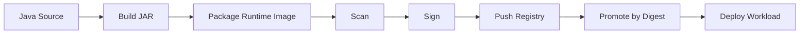
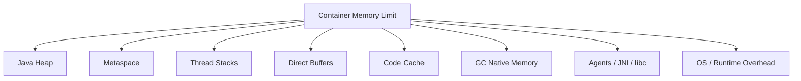
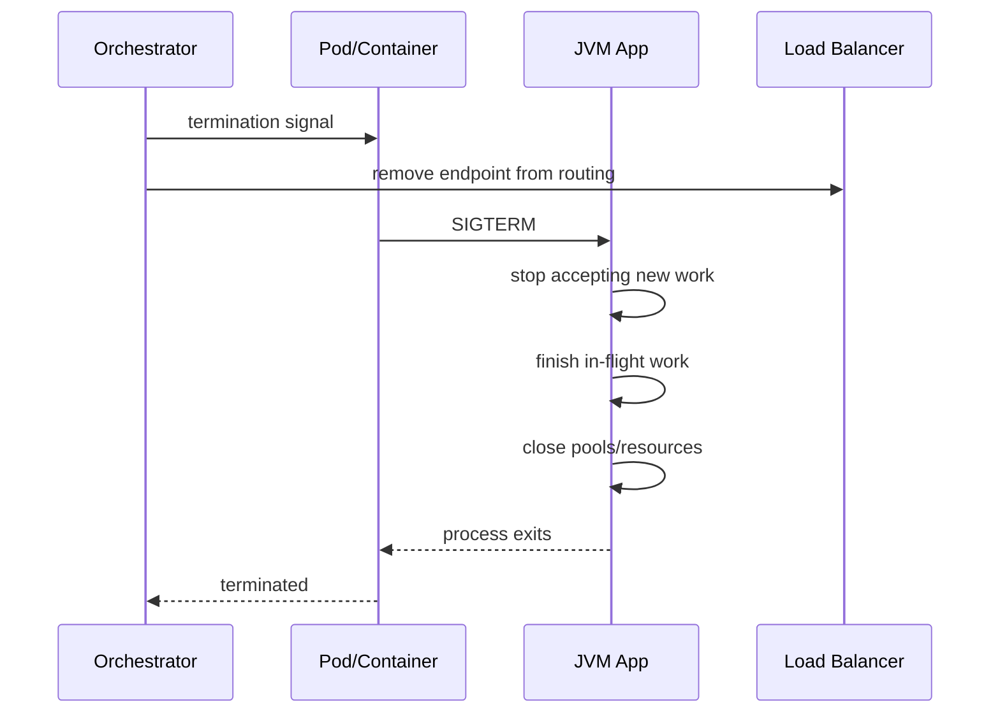

------
title: Learn Java Source, Package, Dependency, Build, Release & Deployment Engineering - Part 030
description: Container image and runtime deployment for Java applications, covering base image choice, multi-stage Dockerfiles, layered artifacts, JVM container ergonomics, memory sizing, startup, health checks, immutable tags, and runtime configuration.
series: learn-java-build-dependency-release-deployment
seriesTitle: Learn Java Source, Package, Dependency, Build, Release & Deployment Engineering
order: 30
partTitle: Container Image and Runtime Deployment
tags:
- java
- containers
- docker
- oci-image
- jvm
- deployment
- runtime
- kubernetes
- spring-boot
- ci-cd
- production-engineering
date: 2026-06-29
------

# Part 030 — Container Image and Runtime Deployment

## 1. Posisi Part Ini Dalam Seri

Part sebelumnya membahas Java packaging models.

Sekarang kita membahas bagaimana package Java dibawa ke runtime deployment modern, terutama container image.

Di banyak organisasi, build pipeline tidak berhenti di JAR.

Build pipeline menghasilkan:

```text
source → JAR → container image → signed image → promoted image → deployed workload
```

Container image bukan sekadar “tempat menaruh JAR”.

Container image adalah **deployment artifact** yang menggabungkan:

- application package;
- runtime base image;
- OS/library surface;
- startup command;
- filesystem layout;
- metadata;
- user/permission model;
- health/readiness contract;
- environment variable contract;
- JVM runtime behavior.

Kesalahan containerisasi Java sering muncul karena engineer memperlakukan container sebagai VM kecil.

Padahal container adalah process packaging and isolation model.

Top-tier engineer harus bisa menjawab:

1. JDK atau JRE/runtime image apa yang dipakai?
2. Apakah build tools ikut final image?
3. Apakah image immutable dan traceable?
4. Bagaimana JVM membaca memory/cpu limit container?
5. Berapa heap, metaspace, thread stack, direct memory, native memory?
6. Bagaimana startup, shutdown, health, readiness, dan observability bekerja?
7. Bagaimana image dipatch saat base image/JDK punya vulnerability?
8. Apakah artifact yang sama dipromote antar environment?

---

## 2. Kaufman Skill Deconstruction

### 2.1 Target Performance Level

Setelah part ini, kita ingin mampu:

1. mendesain container image Java yang kecil, aman, repeatable, dan debuggable;
2. memilih base image berdasarkan runtime, patching, compliance, dan operability;
3. menulis Dockerfile multi-stage yang tidak membawa Maven/Gradle/JDK build cache ke runtime image;
4. memakai layering untuk mempercepat rebuild/pull;
5. mengkonfigurasi JVM untuk container memory/cpu limits;
6. membedakan heap, non-heap, native memory, direct memory, thread stack, code cache;
7. mendesain startup command, signal handling, graceful shutdown, dan health checks;
8. mengeksternalisasi config/secrets tanpa membuat artifact mutable;
9. memahami image tags vs digests;
10. membuat deployment readiness checklist untuk Java service.

### 2.2 Sub-Skills

| Sub-skill | Pertanyaan utama |
|---|---|
| Image composition | Apa saja yang masuk final image? |
| Base image governance | Siapa memilih, patch, dan approve base image? |
| Build strategy | Apakah build dilakukan di image atau pipeline? |
| Layering | Apakah dependency dan application code berada di layer berbeda? |
| Runtime command | Apakah `ENTRYPOINT`/`CMD` benar dan signal-friendly? |
| JVM sizing | Apakah heap/non-heap/native memory sesuai container limit? |
| Health contract | Apakah startup/readiness/liveness dipisahkan? |
| Config contract | Apakah config disuntikkan runtime tanpa mengubah image? |
| Security posture | Apakah image minimal, non-root, scanned, signed? |
| Deployment identity | Apakah image tag/digest immutable dan traceable? |

### 2.3 First 20 Hours Practice Plan

| Jam | Fokus | Output |
|---:|---|---|
| 1-2 | Build naive Java image | Paham baseline yang buruk |
| 3-4 | Multi-stage Dockerfile | Build tools tidak masuk final image |
| 5-6 | Base image comparison | Bisa memilih JDK/JRE/distroless-style image |
| 7-8 | Layered JAR/image | Dependency/app layers terpisah |
| 9-10 | JVM memory sizing | Bisa menjelaskan heap vs non-heap |
| 11-12 | CPU/container ergonomics | Bisa menghindari thread pool over-sizing |
| 13-14 | Health/readiness/shutdown | Service deployable dengan aman |
| 15-16 | Config/secrets | Image immutable, config runtime |
| 17-18 | Image tagging/digest/promotion | Artifact traceable |
| 19-20 | Production review | Bisa menulis container deployment ADR |

---

## 3. Mental Model: Container Image as Release Artifact

Container image adalah immutable filesystem snapshot plus metadata.

Runtime container menjalankan process dari image tersebut.



Perhatikan:

```text
JAR is not always the final release artifact.
Container image often is.
```

Tetapi prinsip release sebelumnya tetap berlaku:

```text
build once, promote the same artifact many times
```

Untuk container:

```text
build once, promote the same image digest many times
```

Bukan:

```text
rebuild image separately for dev, uat, prod
```

---

## 4. Bad Baseline: Naive Dockerfile

Contoh buruk yang sering muncul:

```dockerfile
FROM maven:3-eclipse-temurin-25
WORKDIR /app
COPY . .
RUN mvn package
CMD ["java", "-jar", "target/payment-service.jar"]
```

Masalah:

1. Final image membawa Maven.
2. Final image membawa source code.
3. Final image membawa local build cache.
4. Final image size besar.
5. Attack surface lebih luas.
6. Build dan runtime dicampur.
7. Layer cache buruk.
8. Tidak ada explicit runtime user.
9. Tidak ada metadata artifact.
10. Reproducibility lemah jika dependency tidak dikunci.

Dockerfile ini mungkin “jalan”.

Tetapi tidak cukup untuk production engineering.

---

## 5. Multi-Stage Dockerfile

### 5.1 Tujuan Multi-Stage

Multi-stage build memisahkan build environment dari runtime environment.

```text
build stage   = has JDK + Maven/Gradle + source
runtime stage = has runtime + application artifact only
```

### 5.2 Maven Example

```dockerfile
# syntax=docker/dockerfile:1

FROM eclipse-temurin:25-jdk AS build
WORKDIR /workspace

COPY .mvn .mvn
COPY mvnw pom.xml ./
RUN ./mvnw -B -ntp dependency:go-offline

COPY src src
RUN ./mvnw -B -ntp clean package -DskipTests

FROM eclipse-temurin:25-jre
WORKDIR /app

RUN useradd --system --uid 10001 appuser
COPY --from=build /workspace/target/payment-service.jar /app/app.jar

USER 10001
EXPOSE 8080
ENTRYPOINT ["java", "-jar", "/app/app.jar"]
```

### 5.3 Gradle Example

```dockerfile
# syntax=docker/dockerfile:1

FROM eclipse-temurin:25-jdk AS build
WORKDIR /workspace

COPY gradlew settings.gradle.kts build.gradle.kts ./
COPY gradle gradle
RUN ./gradlew --no-daemon dependencies || true

COPY src src
RUN ./gradlew --no-daemon clean build -x test

FROM eclipse-temurin:25-jre
WORKDIR /app

RUN useradd --system --uid 10001 appuser
COPY --from=build /workspace/build/libs/payment-service.jar /app/app.jar

USER 10001
EXPOSE 8080
ENTRYPOINT ["java", "-jar", "/app/app.jar"]
```

### 5.4 Production Caveat

Ada dua valid strategies:

#### Strategy A — Build JAR outside Docker

```text
CI builds JAR → Docker build copies JAR
```

Pros:

- build pipeline clearer;
- Maven/Gradle cache managed by CI;
- easier artifact scanning/signing before image;
- easier build reproducibility controls.

Cons:

- Dockerfile cannot build from clean source alone;
- requires CI artifact handoff.

#### Strategy B — Build JAR inside Docker

```text
Docker build performs Maven/Gradle build
```

Pros:

- environment consistency;
- single Docker build command;
- local/CI parity possible.

Cons:

- more complex cache handling;
- secrets for private repositories must be handled carefully;
- build logs/artifacts inside Docker build;
- test execution strategy must be explicit.

Rule:

```text
Either strategy is acceptable if build inputs, dependency resolution, and final image contents are controlled.
```

---

## 6. Base Image Selection

Base image is a dependency.

Treat it like a dependency with:

- owner;
- version;
- vulnerability surface;
- patch cadence;
- license/compliance impact;
- runtime behavior;
- support model.

### 6.1 JDK vs JRE vs Runtime Image

| Image type | Contains | Use case |
|---|---|---|
| JDK image | compiler, tools, runtime | build stage, diagnostics-heavy runtime if intentionally needed |
| JRE/runtime image | runtime only | normal service runtime |
| Custom `jlink` image | selected modules | minimal self-contained runtime |
| Distroless-style image | minimal OS/userspace | hardened runtime if debugging workflow exists |
| App server image | Tomcat/WildFly/etc | WAR/EAR deployment model |

### 6.2 Why Not Always Smallest?

Small image is good.

But smallest is not always best.

You also need:

- CA certificates;
- timezone data if needed;
- locale behavior;
- DNS resolver behavior;
- shell availability for debugging or not;
- libc compatibility;
- font/native libs if generating PDFs/images;
- observability agent compatibility;
- security patch availability.

### 6.3 Enterprise Base Image Policy

A strong enterprise setup usually has approved internal base images:

```text
registry.acme.internal/base/java-runtime:25.0.1-ubuntu-202606
registry.acme.internal/base/java-runtime:21.0.9-alpine-202606
registry.acme.internal/base/java-runtime:25.0.1-distroless-202606
```

Metadata:

```yaml
baseImage:
  name: acme/java-runtime
  javaVersion: 25.0.1
  osFamily: ubuntu
  osPatchDate: 2026-06-15
  owner: platform-runtime-team
  supportUntil: 2026-09-15
  allowedFor:
    - backend-service
    - batch-worker
  includes:
    - ca-certificates
    - tzdata
  excludes:
    - shell
    - package-manager
```

### 6.4 Rule

```text
A base image is part of your production dependency graph.
```

Do not use floating tags like:

```dockerfile
FROM eclipse-temurin:latest
```

Prefer versioned tags and promotion by digest.

---

## 7. Layering Java Images

### 7.1 Why Layering Matters

Container images are layers.

If application code changes often but dependencies change rarely, split them.

Bad:

```dockerfile
COPY app.jar /app/app.jar
```

All dependency and app code are in one layer.

Better for fat/executable JAR if tooling supports extraction:

```text
dependencies layer
spring-boot-loader layer
snapshot-dependencies layer
application layer
```

### 7.2 Spring Boot Layered JAR

Spring Boot executable JAR can include layer metadata.

Typical layers:

```text
dependencies
spring-boot-loader
snapshot-dependencies
application
```

Dockerfile pattern:

```dockerfile
FROM eclipse-temurin:25-jre AS runtime
WORKDIR /app

COPY build/libs/payment-service.jar app.jar
RUN java -Djarmode=tools -jar app.jar extract --layers --destination extracted

FROM eclipse-temurin:25-jre
WORKDIR /app
RUN useradd --system --uid 10001 appuser

COPY --from=runtime /app/extracted/dependencies/ ./
COPY --from=runtime /app/extracted/spring-boot-loader/ ./
COPY --from=runtime /app/extracted/snapshot-dependencies/ ./
COPY --from=runtime /app/extracted/application/ ./

USER 10001
ENTRYPOINT ["java", "org.springframework.boot.loader.launch.JarLauncher"]
```

Exact command can vary by Spring Boot version, but the principle is stable:

```text
separate slow-changing dependencies from fast-changing application code
```

### 7.3 Layering Thin Distribution

If using thin distribution:

```dockerfile
COPY lib/ /app/lib/
COPY app.jar /app/app.jar
```

Dependency layer changes less often.

Application layer changes frequently.

### 7.4 Layering Rule

```text
Order image layers from least frequently changing to most frequently changing.
```

Typical order:

1. OS/runtime base;
2. JVM/runtime config;
3. dependency JARs;
4. framework loader;
5. application classes/resources;
6. startup scripts.

---

## 8. JVM Container Awareness

Modern JVMs are container-aware.

But container-aware does not mean automatically optimal.

JVM must decide:

- available processors;
- max heap;
- GC behavior;
- thread ergonomics;
- memory allocation behavior.

Container runtime imposes:

- memory limit;
- CPU quota;
- CPU shares;
- filesystem limits;
- process limits.

### 8.1 Important JVM Flags

Common flags:

```bash
-XX:MaxRAMPercentage=70
-XX:InitialRAMPercentage=50
-XX:MinRAMPercentage=50
-XX:ActiveProcessorCount=2
-Xlog:os+container=info
```

Use with care.

Do not cargo-cult.

### 8.2 Why `-Xmx` Alone Is Not Enough

Container memory limit includes more than heap.

```text
container memory = heap + metaspace + code cache + thread stacks + direct memory + GC native memory + JNI + mmap + libc + agents + OS overhead
```

If container limit is 512 MiB and you set:

```bash
-Xmx512m
```

You are likely overcommitting.

Because non-heap memory still needs space.

### 8.3 Memory Budget Diagram



### 8.4 Practical Starting Point

For many server-side Java services:

```text
heap budget: 50-75% of container memory
non-heap/native: 25-50%
```

But this depends on:

- thread count;
- direct buffer usage;
- Netty usage;
- TLS/native libs;
- observability agents;
- class count;
- code cache;
- GC choice;
- workload allocation rate.

### 8.5 Rule

```text
Size the container for the JVM process, not just the heap.
```

---

## 9. CPU Limits and Java Runtime Behavior

CPU limits affect:

- GC threads;
- ForkJoinPool parallelism;
- HTTP server worker defaults;
- database pool assumptions;
- reactive scheduler assumptions;
- batch parallelism;
- JIT compilation resources;
- startup time.

### 9.1 Failure Mode

You deploy a Java service with CPU limit `500m`.

The JVM/framework thinks it has many processors or gets constrained heavily.

Symptoms:

- slow startup;
- timeouts during deployment;
- GC pauses longer than expected;
- thread pool contention;
- liveness probe failures;
- high latency under low traffic.

### 9.2 ActiveProcessorCount

Sometimes useful:

```bash
-XX:ActiveProcessorCount=2
```

This can align JVM ergonomics with deployment expectation.

Do not set globally without measurement.

### 9.3 Rule

```text
CPU limit is an application behavior parameter, not just an infrastructure quota.
```

When CPU limit changes, retest:

- startup time;
- throughput;
- latency;
- GC behavior;
- readiness timing;
- background jobs;
- connection pool.

---

## 10. Runtime Command and PID 1

### 10.1 ENTRYPOINT Form

Prefer exec form:

```dockerfile
ENTRYPOINT ["java", "-jar", "/app/app.jar"]
```

Avoid shell form unless needed:

```dockerfile
ENTRYPOINT java -jar /app/app.jar
```

Exec form helps signal delivery.

### 10.2 Environment-Based Java Options

Common pattern:

```dockerfile
ENTRYPOINT ["sh", "-c", "exec java $JAVA_OPTS -jar /app/app.jar"]
```

This supports runtime options but reintroduces shell.

Better if base image/startup script is controlled:

```sh
#!/usr/bin/env sh
set -eu
exec java ${JAVA_OPTS:-} -jar /app/app.jar
```

Key is `exec`.

Without `exec`, shell remains PID 1 and signal handling can break.

### 10.3 Signal Handling

Kubernetes/Docker sends termination signal.

Java app must receive it and shut down gracefully.

Runtime must allow enough termination grace period.

Rule:

```text
Container startup command must preserve signal delivery to the Java process.
```

---

## 11. Graceful Shutdown

Graceful shutdown is not only application framework behavior.

It is a deployment contract.

Flow:



### 11.1 Failure Modes

| Failure | Cause |
|---|---|
| Requests dropped | Readiness not removed before shutdown |
| Message duplication | Consumer killed before ack/commit |
| DB transactions interrupted | Grace period too short |
| Liveness restarts during slow shutdown | Probe misconfiguration |
| Logs missing | Process killed before flush |

### 11.2 Controls

- handle SIGTERM;
- configure graceful shutdown in framework;
- readiness becomes false before process exit;
- termination grace period aligned with max request/job duration;
- message consumers pause before shutdown;
- DB pools close;
- telemetry flushes.

---

## 12. Health Checks: Startup, Readiness, Liveness

Health checks are often misused.

### 12.1 Startup Probe

Question:

```text
Has the application started enough that liveness checks should begin?
```

Use for slow-starting Java apps.

### 12.2 Readiness Probe

Question:

```text
Can this instance receive traffic now?
```

Readiness should fail when:

- startup not complete;
- dependency critical unavailable;
- app is draining;
- local cache not loaded if required;
- migration lock not acquired if required.

### 12.3 Liveness Probe

Question:

```text
Is this process unrecoverably stuck and should be restarted?
```

Liveness should not fail for every temporary downstream issue.

Otherwise orchestrator creates restart storms.

### 12.4 Rule

```text
Readiness protects users. Liveness protects the platform. Startup protects slow initialization.
```

---

## 13. Configuration Injection

Image should be environment-neutral.

Config should be injected at runtime.

Common methods:

- environment variables;
- mounted config files;
- config maps;
- secrets;
- command-line args;
- service discovery;
- dynamic config service.

### 13.1 Bad Pattern

```dockerfile
COPY application-prod.yml /app/application.yml
```

Build per environment:

```text
payment-service:dev
payment-service:uat
payment-service:prod
```

This violates build-once-promote-many.

### 13.2 Better Pattern

```text
payment-service@sha256:abc... deployed to dev/uat/prod
```

Environment provides:

```yaml
env:
  DATABASE_URL: jdbc:postgresql://...
  LOG_LEVEL: INFO
  FEATURE_X_ENABLED: "false"
```

### 13.3 Secrets Rule

```text
Secrets must not be baked into images.
```

Also avoid leaking secrets through:

- image layers;
- build args;
- Docker history;
- logs;
- environment dump endpoints;
- exception messages;
- crash dumps;
- heap dumps.

---

## 14. Immutable Tags and Digests

Tags are names.

Digests are content identities.

Example:

```text
registry.acme.internal/payment-service:1.8.3
registry.acme.internal/payment-service@sha256:9f...
```

A tag can move unless registry policy prevents it.

A digest points to exact content.

### 14.1 Recommended Tagging

Use multiple tags:

```text
payment-service:1.8.3
payment-service:1.8.3-build.45
payment-service:git-abc1234
payment-service:release-2026-06-29
```

But deploy by digest where possible.

### 14.2 Forbidden Pattern

```yaml
image: payment-service:latest
```

In production, this destroys traceability.

### 14.3 Rule

```text
Promotion should promote image identity, not rebuild image content.
```

---

## 15. Image Metadata and Labels

Add OCI labels:

```dockerfile
LABEL org.opencontainers.image.title="payment-service"
LABEL org.opencontainers.image.version="1.8.3"
LABEL org.opencontainers.image.revision="abc1234"
LABEL org.opencontainers.image.created="2026-06-29T10:00:00Z"
LABEL org.opencontainers.image.source="https://git.acme.internal/payment/payment-service"
```

Labels help:

- incident response;
- audit;
- inventory;
- vulnerability triage;
- release traceability;
- runtime introspection.

Rule:

```text
A running container should be traceable back to source, build, dependencies, and release approval.
```

---

## 16. Non-Root Runtime

Run as non-root.

```dockerfile
RUN useradd --system --uid 10001 appuser
USER 10001
```

Also ensure writable paths are explicit:

```dockerfile
RUN mkdir -p /app/logs /tmp/app \
    && chown -R 10001:10001 /app /tmp/app
```

But in many container platforms, logs should go to stdout/stderr, not file.

### 16.1 Filesystem Rule

```text
Assume container filesystem is immutable except explicitly mounted writable paths.
```

Java apps often write:

- temp files;
- compiled templates;
- uploaded files;
- heap dumps;
- logs;
- local caches;
- embedded database files.

Make these explicit.

---

## 17. JVM Options Delivery

### 17.1 Environment Variable Pattern

```yaml
env:
  JAVA_OPTS: >-
    -XX:MaxRAMPercentage=70
    -XX:+ExitOnOutOfMemoryError
    -Dfile.encoding=UTF-8
```

### 17.2 Opinionated Runtime Script

```sh
#!/usr/bin/env sh
set -eu

DEFAULT_JAVA_OPTS="-XX:+ExitOnOutOfMemoryError -Dfile.encoding=UTF-8"
exec java ${DEFAULT_JAVA_OPTS} ${JAVA_OPTS:-} -jar /app/app.jar
```

### 17.3 Governance Rule

```text
Application teams may tune JVM options, but platform defaults should be visible and versioned.
```

Avoid invisible base image magic that changes JVM behavior unexpectedly.

---

## 18. OutOfMemory Behavior

When Java hits memory pressure, behavior can be bad:

- process limps in degraded state;
- OOM killer terminates container;
- heap dump fills disk;
- liveness probe restarts repeatedly;
- pod enters CrashLoopBackOff;
- message processing duplicates work.

Useful flag:

```bash
-XX:+ExitOnOutOfMemoryError
```

Potentially useful in controlled environment:

```bash
-XX:+HeapDumpOnOutOfMemoryError
-XX:HeapDumpPath=/dumps
```

But heap dumps may contain secrets.

Rule:

```text
OOM policy must balance recovery, diagnostics, storage, and data sensitivity.
```

---

## 19. Temporary Files and Writable Directories

Java libraries may use:

```java
System.getProperty("java.io.tmpdir")
```

Default usually `/tmp`.

Container hardening may make filesystem read-only.

Kubernetes example:

```yaml
securityContext:
  readOnlyRootFilesystem: true
volumeMounts:
  - name: tmp
    mountPath: /tmp
volumes:
  - name: tmp
    emptyDir: {}
```

Rule:

```text
Every writable path must be intentional, bounded, and monitored.
```

---

## 20. Time, Locale, and CA Certificates

Minimal images can miss assumptions.

Check:

- timezone data;
- locale support;
- CA certificates;
- DNS resolver behavior;
- font libraries;
- TLS configuration;
- entropy source.

Symptoms:

- TLS handshake failure;
- wrong timestamp formatting;
- PDF/image rendering failure;
- non-English text issues;
- certificate path errors;
- DNS resolution differences.

Rule:

```text
Minimal image does not mean assumption-free image.
```

---

## 21. Observability in Container Runtime

Containerized Java service should emit:

- logs to stdout/stderr;
- metrics endpoint or push path;
- traces via instrumentation;
- health endpoint;
- build/version info endpoint;
- JVM metrics;
- GC logs if needed;
- structured deployment metadata.

### 21.1 Version Endpoint

Example:

```json
{
  "application": "payment-service",
  "version": "1.8.3",
  "gitCommit": "abc1234",
  "buildTime": "2026-06-29T10:00:00Z",
  "imageDigest": "sha256:9f...",
  "javaVersion": "25.0.1"
}
```

### 21.2 GC Logging

For incident investigation:

```bash
-Xlog:gc*:stdout:time,level,tags
```

Use selectively based on log volume and runtime needs.

Rule:

```text
Runtime image should make the running version observable without shelling into the container.
```

---

## 22. Startup Time and Warmup

Java services may have:

- classloading cost;
- JIT warmup;
- framework initialization;
- dependency connection setup;
- schema validation;
- cache warmup;
- migration checks;
- TLS initialization;
- metrics/tracing agent startup.

### 22.1 Deployment Impact

If startup is slower than probe thresholds:

- orchestrator restarts app before ready;
- rollout stalls;
- canary fails incorrectly;
- autoscaling ineffective;
- peak traffic scaling too slow.

### 22.2 Controls

- startup probe;
- realistic readiness timeout;
- lazy vs eager initialization decision;
- precomputed assets;
- CDS/AppCDS where appropriate;
- native image only if startup is real bottleneck;
- reduce classpath bloat;
- avoid slow network calls during startup unless required.

Rule:

```text
Startup is part of deployment correctness.
```

---

## 23. Container Image Build Cache

Docker cache is layer-based.

Order matters.

Bad:

```dockerfile
COPY . .
RUN ./mvnw package
```

Every source change invalidates dependency resolution layer.

Better:

```dockerfile
COPY pom.xml mvnw ./
COPY .mvn .mvn
RUN ./mvnw dependency:go-offline
COPY src src
RUN ./mvnw package
```

But this is still imperfect for multi-module Maven/Gradle.

For complex builds, prefer CI cache plus controlled artifact-to-image step.

Rule:

```text
Optimize Docker layers around change frequency and trust boundaries.
```

---

## 24. Image Scanning and Patch Flow

Container image contains:

- OS packages;
- runtime JDK/JRE;
- application JAR;
- dependency JARs;
- native libraries;
- certificates;
- metadata.

Scanning must cover all relevant layers.

Patch triggers:

- application dependency CVE;
- base OS CVE;
- JDK CVE;
- framework CVE;
- container runtime policy update;
- certificate bundle update.

### 24.1 Rebuild Without Source Change

Sometimes you must rebuild image even if application code unchanged.

Example:

```text
base image patched for OpenSSL/glibc/JDK vulnerability
```

Then produce:

```text
payment-service:1.8.3-build.46
```

Same app version, different image build.

### 24.2 Rule

```text
Application version and image version are related but not always identical.
```

Track both.

---

## 25. Deployment Manifest Example

Kubernetes-style example:

```yaml
apiVersion: apps/v1
kind: Deployment
metadata:
  name: payment-service
spec:
  replicas: 3
  selector:
    matchLabels:
      app: payment-service
  template:
    metadata:
      labels:
        app: payment-service
        version: "1.8.3"
    spec:
      terminationGracePeriodSeconds: 45
      containers:
        - name: payment-service
          image: registry.acme.internal/payment-service@sha256:9f...
          ports:
            - containerPort: 8080
          env:
            - name: JAVA_OPTS
              value: >-
                -XX:MaxRAMPercentage=70
                -XX:+ExitOnOutOfMemoryError
                -Dfile.encoding=UTF-8
          resources:
            requests:
              cpu: "500m"
              memory: "768Mi"
            limits:
              cpu: "1"
              memory: "1024Mi"
          startupProbe:
            httpGet:
              path: /actuator/health/startup
              port: 8080
            failureThreshold: 30
            periodSeconds: 2
          readinessProbe:
            httpGet:
              path: /actuator/health/readiness
              port: 8080
            periodSeconds: 5
          livenessProbe:
            httpGet:
              path: /actuator/health/liveness
              port: 8080
            periodSeconds: 10
```

This is illustrative.

Exact health paths depend on framework.

---

## 26. Runtime Configuration Contract

Document config as contract.

Example:

```yaml
runtimeConfig:
  requiredEnv:
    DATABASE_URL:
      description: JDBC URL for primary database
      secret: false
    DATABASE_USERNAME:
      secret: true
    DATABASE_PASSWORD:
      secret: true
    LOG_LEVEL:
      default: INFO
    JAVA_OPTS:
      default: "-XX:MaxRAMPercentage=70 -XX:+ExitOnOutOfMemoryError"

  files:
    /etc/acme/payment/application.yml:
      optional: true
    /etc/acme/payment/truststore.p12:
      optional: false
      secret: true

  writablePaths:
    /tmp:
      type: ephemeral
    /dumps:
      type: restricted
      containsSensitiveData: true
```

Rule:

```text
Runtime config should be explicit enough that another platform can deploy the service without reading source code.
```

---

## 27. Java Container Failure Modes

| Symptom | Likely Cause | Investigation |
|---|---|---|
| `CrashLoopBackOff` | bad config, OOM, startup probe too strict | logs, exit code, events |
| OOMKilled | heap/native over memory limit | container metrics, GC logs, NMT |
| slow startup | CPU limit, classpath bloat, framework init | startup metrics, profiling |
| readiness never true | dependency check too strict, config missing | health details, app logs |
| liveness restart storm | liveness checks downstream dependency | probe design review |
| TLS failure | missing CA certs/truststore | image contents, JVM trust config |
| wrong timezone | missing tzdata or config | runtime env, date output |
| permission denied | non-root user lacks writable path | filesystem ownership |
| graceful shutdown fails | signal not delivered or grace too short | ENTRYPOINT, pod events |
| dependency CVE not detected | fat JAR/image scanner blind spot | SBOM, scanner config |
| prod differs from UAT | rebuilt image per env | image digest comparison |

---

## 28. Container Deployment ADR Template

```md
# ADR: Container Runtime Model for <Service>

## Status
Accepted

## Context
<Service> is deployed as a Java workload to <platform>.
It has <startup/memory/security/compliance> constraints.

## Decision
We will package the service as <JAR type> inside <base image> and deploy by image digest.

## Image Composition
- Base image: ...
- Java version: ...
- Package type: ...
- User: non-root UID ...
- Writable paths: ...

## JVM Runtime
- Memory request/limit: ...
- Heap policy: ...
- CPU policy: ...
- GC/logging flags: ...
- OOM behavior: ...

## Deployment Contract
- Config injection: ...
- Secrets: ...
- Health endpoints: ...
- Shutdown grace period: ...
- Observability: ...

## Security and Supply Chain
- Image scanning: ...
- SBOM: ...
- Signing: ...
- Promotion by digest: ...
- Base image patch flow: ...

## Consequences
Positive:
- ...

Negative:
- ...

## Revisit Trigger
- Java baseline changes
- base image policy changes
- memory/startup incidents
- platform migration
- vulnerability response gaps
```

---

## 29. Production-Grade Dockerfile Template

This template assumes the JAR is already built by CI.

```dockerfile
FROM registry.acme.internal/base/java-runtime:25.0.1-202606

ARG APP_NAME=payment-service
ARG APP_VERSION
ARG GIT_COMMIT
ARG BUILD_TIME

LABEL org.opencontainers.image.title=$APP_NAME
LABEL org.opencontainers.image.version=$APP_VERSION
LABEL org.opencontainers.image.revision=$GIT_COMMIT
LABEL org.opencontainers.image.created=$BUILD_TIME

WORKDIR /app

COPY --chown=10001:10001 build/libs/payment-service.jar /app/app.jar
COPY --chown=10001:10001 docker/entrypoint.sh /app/entrypoint.sh

RUN chmod 0555 /app/entrypoint.sh

USER 10001:10001
EXPOSE 8080

ENTRYPOINT ["/app/entrypoint.sh"]
```

`entrypoint.sh`:

```sh
#!/usr/bin/env sh
set -eu

DEFAULT_JAVA_OPTS="-XX:+ExitOnOutOfMemoryError -Dfile.encoding=UTF-8"

exec java ${DEFAULT_JAVA_OPTS} ${JAVA_OPTS:-} -jar /app/app.jar "$@"
```

Important:

- no package manager in runtime flow;
- no source code;
- no build tool;
- non-root user;
- OCI labels;
- explicit entrypoint;
- externalized `JAVA_OPTS`;
- image should be scanned/signed after build.

---

## 30. Review Checklist

Before approving a Java container deployment, check:

- [ ] Does final image exclude source code and build tools?
- [ ] Is base image approved and versioned?
- [ ] Is image deployed by digest or immutable tag?
- [ ] Are OCI labels present?
- [ ] Does image run as non-root?
- [ ] Are writable paths explicit?
- [ ] Are secrets excluded from image and layers?
- [ ] Is config injected at runtime?
- [ ] Is JVM memory budget documented?
- [ ] Is heap smaller than container limit with non-heap headroom?
- [ ] Is CPU limit tested?
- [ ] Are startup/readiness/liveness probes separated?
- [ ] Is graceful shutdown tested?
- [ ] Is OOM behavior intentional?
- [ ] Are logs emitted to stdout/stderr?
- [ ] Is version/build info observable at runtime?
- [ ] Is image scanned?
- [ ] Is image signed?
- [ ] Is SBOM attached or published?
- [ ] Is base image patch flow defined?
- [ ] Is rollback by previous image digest possible?

---

## 31. Deliberate Practice

### Drill 1 — Inspect an Existing Java Image

Run:

```bash
docker image inspect registry.acme.internal/payment-service:1.8.3
```

Answer:

1. What is the base image?
2. What user does it run as?
3. What command starts the app?
4. Does it expose metadata labels?
5. Can you map it to Git commit?
6. Does it contain build tools?

### Drill 2 — Compare Tag and Digest

Pull by tag.

```bash
docker pull registry.acme.internal/payment-service:1.8.3
```

Find digest.

```bash
docker image inspect registry.acme.internal/payment-service:1.8.3 --format '{{index .RepoDigests 0}}'
```

Document why deploying digest is safer.

### Drill 3 — Memory Budget

Given:

```text
container memory limit = 1024 MiB
thread count = 250
thread stack = 1 MiB each
observability agent = 80 MiB estimated
metaspace/code/native/direct = 180 MiB estimated
```

Estimate safe heap.

```text
1024 - 250 - 80 - 180 - OS headroom = heap
```

Then compare with `MaxRAMPercentage=70`.

### Drill 4 — Probe Failure Review

Given a service that restarts under downstream database outage.

Check:

- Is database included in liveness?
- Should database only affect readiness?
- Is startup probe long enough?
- Are shutdown transitions making readiness false?

### Drill 5 — Rebuild for Base Image CVE

Take same JAR.

Build two images with different patched base images.

Confirm:

- same app version;
- different image digest;
- updated base image metadata;
- SBOM changed;
- release notes mention runtime patch.

---

## 32. Common Anti-Patterns

### 32.1 `latest` in Production

```yaml
image: payment-service:latest
```

Problem:

- no reproducibility;
- no audit trail;
- rollback ambiguous;
- incident response slow.

### 32.2 Build Tools in Runtime Image

```dockerfile
FROM maven:...
```

as final image.

Problem:

- bigger image;
- larger attack surface;
- hidden source/build artifacts;
- patch burden.

### 32.3 JVM Heap Equals Container Limit

```bash
-Xmx1024m
```

inside 1024Mi container.

Problem:

- non-heap memory causes OOMKill.

### 32.4 Liveness Checks Downstream Database

Bad:

```text
DB down → liveness fails → container restarts → load increases → outage worsens
```

Use readiness for dependency availability.

### 32.5 Rebuild Per Environment

```text
dev image != uat image != prod image
```

Problem:

- tested artifact is not deployed artifact.

### 32.6 Root User by Default

Problem:

- unnecessary privilege;
- policy violation;
- filesystem mutation risk.

### 32.7 Secrets in Build Args

```dockerfile
ARG DB_PASSWORD
```

Problem:

- can leak through image history/build logs/layers.

---

## 33. Summary

Container deployment for Java is not just Docker syntax.

It is the meeting point of:

- Java packaging;
- JVM ergonomics;
- OS/runtime image governance;
- release artifact immutability;
- security scanning;
- config/secrets injection;
- health/shutdown semantics;
- operational debugging.

Core mental model:

```text
A container image is a production dependency graph frozen into a runnable filesystem.
```

Top-tier engineers do not stop at:

```text
docker build works
```

They ask:

```text
Is this image minimal enough, patched enough, observable enough, memory-safe enough, signal-safe enough, traceable enough, and promotable enough for production?
```

If yes, containerization becomes a reliability amplifier.

If no, containerization merely hides packaging and runtime mistakes behind a different artifact format.

---

## 34. Referensi Resmi

- Docker Docs, Building Best Practices: https://docs.docker.com/build/building/best-practices/
- Docker Docs, Image-building Best Practices: https://docs.docker.com/get-started/workshop/09_image_best/
- Docker Docs, Containerize a Java Application: https://docs.docker.com/guides/java/containerize/
- Spring Boot, Executable Jar Format and Nested JARs: https://docs.spring.io/spring-boot/specification/executable-jar/nested-jars.html
- Spring Boot, Packaging Executable Archives with Gradle: https://docs.spring.io/spring-boot/gradle-plugin/packaging.html
- Spring Boot, Efficient Container Images: https://docs.spring.io/spring-boot/reference/packaging/container-images/efficient-images.html
- OpenJDK / HotSpot, Container logging flag reference via `-Xlog:os+container`: https://docs.oracle.com/en/java/javase/25/docs/specs/man/java.html
- Kubernetes, Configure Liveness, Readiness and Startup Probes: https://kubernetes.io/docs/tasks/configure-pod-container/configure-liveness-readiness-startup-probes/
- OCI Image Spec Annotations: https://github.com/opencontainers/image-spec/blob/main/annotations.md
------
