------
title: Learn Java Source, Package, Dependency, Build, Release & Deployment Engineering - Part 031
description: Enterprise deployment topologies for Java systems, covering VM, application server, container orchestration, Kubernetes, rolling update, blue/green, canary, feature flags, database migration coordination, configuration, secrets, multi-region release, rollback, and roll-forward models.
series: learn-java-build-dependency-release-deployment
seriesTitle: Learn Java Source, Package, Dependency, Build, Release & Deployment Engineering
order: 31
partTitle: Enterprise Deployment Topologies
tags:
- java
- deployment
- release-engineering
- kubernetes
- enterprise-architecture
- ci-cd
- topology
- rollout
- rollback
- feature-flags
- database-migration
- production-engineering
date: 2026-06-29
------

# Part 031 — Enterprise Deployment Topologies

## 1. Posisi Part Ini Dalam Seri

Part sebelumnya membahas container image dan runtime deployment.

Sekarang kita naik satu level:

```text
artifact → image/package → workload → environment → topology → release strategy
```

Deployment topology adalah bentuk nyata dari bagaimana software dijalankan, di-upgrade, di-rollback, dan dioperasikan.

Top-tier Java engineer tidak cukup hanya tahu:

```bash
kubectl apply -f deployment.yaml
```

atau:

```bash
java -jar app.jar
```

Yang lebih penting adalah memahami konsekuensi arsitektural dari setiap topology:

- siapa yang mengontrol runtime;
- bagaimana artifact dipromosikan;
- bagaimana traffic berpindah;
- bagaimana state dan database dimigrasikan;
- bagaimana rollback bekerja;
- bagaimana konfigurasi dipisahkan dari artifact;
- bagaimana deployment tetap defensible di audit;
- bagaimana failure tidak berubah menjadi outage penuh.

Part ini tidak membahas Kubernetes secara tutorial lengkap. Kita hanya memakai Kubernetes sebagai salah satu deployment substrate modern. Fokus utama tetap Java release/deployment engineering.

---

## 2. Kaufman Skill Deconstruction

### 2.1 Target Performance Level

Setelah part ini, kita ingin mampu:

1. membedakan deployment topology berdasarkan artifact, runtime, traffic, state, dan rollback behavior;
2. memilih deployment model untuk aplikasi Java enterprise: VM, app server, container, Kubernetes, atau hybrid;
3. mendesain rolling update, blue/green, canary, dan ring deployment dengan failure mode yang jelas;
4. memisahkan deployment, release, exposure, dan activation;
5. mengoordinasikan deployment aplikasi dengan database migration;
6. mengelola runtime configuration dan secrets tanpa rebuild artifact;
7. memahami rollback vs roll-forward sebagai keputusan operasional;
8. mendesain multi-region release yang aman;
9. mendefinisikan deployment readiness checklist;
10. menulis deployment ADR untuk sistem enterprise.

### 2.2 Sub-Skills

| Sub-skill | Pertanyaan utama |
|---|---|
| Topology recognition | Sistem ini berjalan di VM, app server, container, atau orchestrator? |
| Artifact-runtime mapping | Artifact apa yang dipromote dan apa yang mutable di runtime? |
| Traffic shifting | Bagaimana user traffic berpindah ke versi baru? |
| Rollout safety | Bagaimana kita mengurangi blast radius? |
| State coordination | Apa dampak deployment terhadap DB, cache, queue, dan storage? |
| Config/secrets handling | Apakah environment-specific value disuntikkan runtime? |
| Rollback design | Apakah rollback benar-benar aman setelah schema/data berubah? |
| Multi-region release | Apakah release global, regional, ring-based, atau tenant-based? |
| Evidence | Apa bukti bahwa deployment artifact, config, dan approval valid? |
| Operability | Bagaimana incident diagnosis dan recovery dilakukan? |

### 2.3 First 20 Hours Practice Plan

| Jam | Fokus | Output |
|---:|---|---|
| 1-2 | Map topology lama | Diagram VM/app server/container existing system |
| 3-4 | Identify artifact boundary | Tahu artifact mana yang immutable |
| 5-6 | Rolling update simulation | Bisa menjelaskan old/new version coexistence |
| 7-8 | Blue/green simulation | Bisa switch traffic dan rollback cepat |
| 9-10 | Canary simulation | Bisa membatasi blast radius |
| 11-12 | Config/secrets review | Pisahkan config dari artifact |
| 13-14 | DB migration strategy | Expand/contract migration plan |
| 15-16 | Feature flag release | Pisahkan deploy vs activate |
| 17-18 | Multi-region rollout | Buat ring/regional plan |
| 19-20 | Deployment ADR | Decision record + rollback/roll-forward plan |

---

## 3. Mental Model: Deploy, Release, Expose, Activate

Banyak tim mencampur empat konsep ini.

| Konsep | Arti | Contoh |
|---|---|---|
| Deploy | Menaruh versi baru ke runtime environment | Pod baru, VM baru, WAR baru |
| Release | Menjadikan versi baru eligible untuk dipakai | Release tag, promoted artifact, approved deployment |
| Expose | Mengalirkan traffic ke versi baru | Load balancer switch, service selector, ingress route |
| Activate | Mengaktifkan behavior/fungsi | Feature flag, config toggle, tenant enablement |

Top-tier engineer memisahkan empat hal ini.

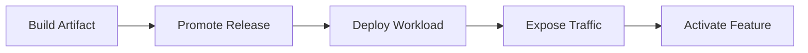

Kenapa ini penting?

Karena setiap tahap punya rollback behavior berbeda.

| Tahap gagal | Recovery umum |
|---|---|
| Build artifact salah | Rebuild dan jangan promote |
| Release approval salah | Revoke/stop promotion |
| Deployment gagal start | Rollback workload |
| Traffic exposure gagal | Switch route back |
| Feature activation gagal | Disable flag |

Kesalahan fatal:

```text
Deployment = release = exposure = activation
```

Jika semua digabung, setiap bug menjadi production outage.

---

## 4. Topology 1: Direct VM Deployment

### 4.1 Bentuk Umum

```text
CI artifact → copy to server → systemd/service manager → java process
```

Atau:

```text
artifact repository → deployment agent → VM fleet → restart service
```

Diagram:

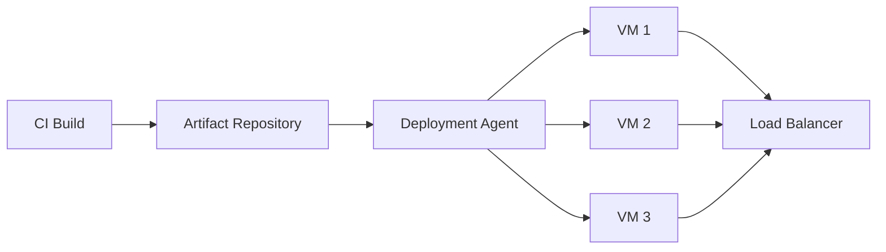

### 4.2 Kelebihan

| Kelebihan | Penjelasan |
|---|---|
| Simple mental model | Java process berjalan langsung di OS |
| Easy low-level debugging | Bisa inspect filesystem, process, logs, ports |
| Cocok untuk legacy enterprise | Banyak organisasi sudah punya VM governance |
| Tidak butuh orchestrator kompleks | Cocok untuk sistem stabil dan kecil |

### 4.3 Kekurangan

| Kekurangan | Dampak |
|---|---|
| Environment drift | VM bisa berbeda satu sama lain |
| Mutable server | Hotfix manual sering tidak terlacak |
| Rollback manual | Butuh script/agent disiplin |
| Dependency runtime drift | JDK, OS package, config bisa berubah |
| Scaling lambat | Provision VM tidak secepat container orchestration |

### 4.4 Java-Specific Concerns

VM deployment butuh governance terhadap:

- installed JDK;
- service user;
- filesystem layout;
- log directory;
- heap/memory setting;
- restart policy;
- signal handling;
- config path;
- certificate truststore;
- OS patching;
- time zone;
- entropy source;
- network firewall;
- JVM flags.

Contoh layout yang cukup defensible:

```text
/opt/company/apps/payment-service/
  releases/
    2026.06.29-001/
      app.jar
      sbom.json
      provenance.json
      checksums.txt
    2026.06.28-004/
      app.jar
  current -> releases/2026.06.29-001
  config/
    application-prod.yaml
  logs/
  tmp/
```

Syarat penting:

```text
current symlink switch is deployment.
JAR content must not be modified on the server.
```

### 4.5 Good VM Deployment Invariants

1. Artifact diambil dari repository, bukan hasil build di server.
2. Artifact punya checksum/signature.
3. JDK version dikunci.
4. Service berjalan dengan non-root user.
5. Config environment-specific berada di lokasi terpisah.
6. Deployment script idempotent.
7. Health check dilakukan sebelum masuk load balancer.
8. Rollback menunjuk ke release sebelumnya, bukan rebuild.
9. Semua command deployment terekam.
10. Manual hotfix dilarang atau dipaksa jadi emergency change record.

---

## 5. Topology 2: Java Application Server Deployment

### 5.1 Bentuk Umum

```text
WAR/EAR → application server → managed runtime
```

Contoh umum:

- Tomcat-style servlet container;
- Jakarta EE application server;
- WebLogic/WebSphere-style enterprise server;
- shared container dengan banyak aplikasi.

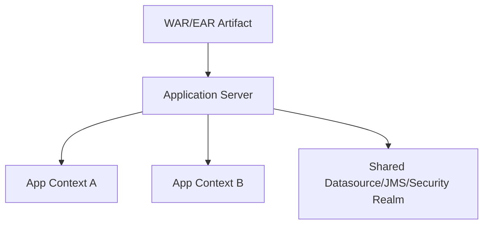

### 5.2 Kapan Masih Masuk Akal

Application server masih masuk akal jika:

- organisasi punya investasi besar di Jakarta EE stack;
- runtime menyediakan managed transaction/JMS/security/datasource;
- banyak aplikasi kecil dikelola dalam server fleet yang sama;
- governance platform mewajibkan shared runtime;
- aplikasi perlu compatible dengan sistem legacy.

### 5.3 Failure Mode

| Failure | Penyebab | Mitigasi |
|---|---|---|
| Shared runtime coupling | Banyak app memakai server/library yang sama | Isolasi classloader dan version policy |
| Classloader conflict | Library app bentrok dengan server library | Explicit provided/runtime boundary |
| Restart blast radius | Deploy satu app mengganggu app lain | Dedicated server per domain kritis |
| Config hidden in console | Setting ada di UI admin, bukan source-controlled | Export/config-as-code |
| Rollback tidak reproducible | Artifact lama tidak disimpan | Release repository + deployment record |

### 5.4 Top-Tier Rule

Untuk app server:

```text
The server is platform.
The WAR/EAR is product artifact.
Do not mix ownership casually.
```

Jika platform team mengubah datasource, security realm, JDK, server patch, atau shared library, aplikasi bisa berubah behavior tanpa release aplikasi.

Karena itu deployment evidence harus mencatat:

- app artifact version;
- server version;
- JDK version;
- server config version;
- datasource/JMS/security realm version;
- deployment timestamp;
- operator/automation identity.

---

## 6. Topology 3: Container on VM / Simple Container Runtime

### 6.1 Bentuk Umum

```text
container image → docker/podman runtime → VM fleet
```

Ini sering menjadi transisi sebelum Kubernetes.

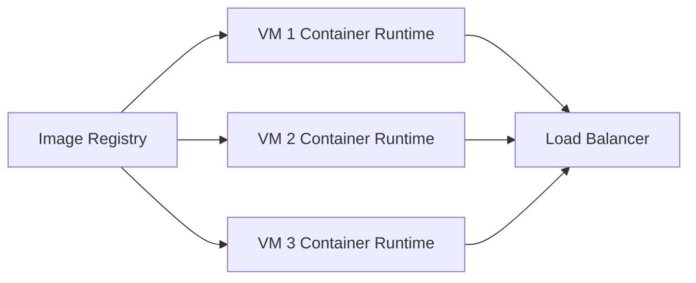

### 6.2 Kelebihan

- artifact runtime lebih immutable daripada copy JAR;
- JDK/base image ikut artifact;
- lebih mudah parity dev/CI/prod;
- deployment bisa berbasis image digest;
- rollback bisa switch image.

### 6.3 Kekurangan

- scheduling masih manual;
- service discovery sering custom;
- secret/config injection perlu discipline;
- health/load balancer integration perlu script;
- scaling dan self-healing tidak setara orchestrator.

### 6.4 Good Use Case

Cocok untuk:

- organisasi belum siap Kubernetes;
- workload jumlah kecil;
- regulated environment dengan VM governance kuat;
- edge deployment;
- migration phase dari JAR-on-VM ke orchestrated container.

---

## 7. Topology 4: Kubernetes / Container Orchestration

### 7.1 Mental Model

Kubernetes tidak sekadar menjalankan container.

Kubernetes menyediakan declarative control loop:

```text
desired state → reconciliation → observed state → correction
```

Untuk Java service, objek umum:

| Kubernetes object | Fungsi deployment |
|---|---|
| Deployment | Mengelola ReplicaSet/Pod rollout |
| ReplicaSet | Menjaga jumlah Pod |
| Pod | Unit runtime container |
| Service | Stable virtual endpoint |
| Ingress/Gateway | External traffic routing |
| ConfigMap | Non-secret runtime configuration |
| Secret | Sensitive runtime configuration |
| HorizontalPodAutoscaler | Autoscaling |
| Job/CronJob | Batch/migration/periodic work |

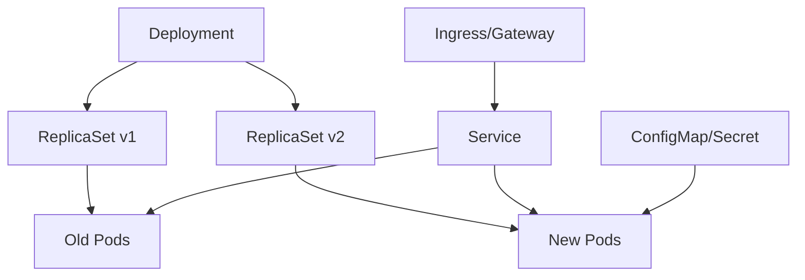

### 7.2 Deployment Object and Rolling Update

Deployment biasanya dipakai untuk stateless Java services.

Rolling update berarti versi lama dan versi baru bisa coexist selama rollout.

Konsekuensinya:

```text
old version and new version must be compatible during rollout window
```

Itu mempengaruhi:

- API compatibility;
- database schema compatibility;
- event schema compatibility;
- cache key compatibility;
- session compatibility;
- feature flag behavior;
- idempotency;
- background jobs.

### 7.3 Deployment Configuration Example

```yaml
apiVersion: apps/v1
kind: Deployment
metadata:
  name: payment-service
spec:
  replicas: 6
  strategy:
    type: RollingUpdate
    rollingUpdate:
      maxSurge: 1
      maxUnavailable: 0
  selector:
    matchLabels:
      app: payment-service
  template:
    metadata:
      labels:
        app: payment-service
        version: "2026.06.29-001"
    spec:
      containers:
      - name: app
        image: registry.example.com/payment-service@sha256:...
        ports:
        - containerPort: 8080
        readinessProbe:
          httpGet:
            path: /ready
            port: 8080
        livenessProbe:
          httpGet:
            path: /live
            port: 8080
        resources:
          requests:
            cpu: "500m"
            memory: "768Mi"
          limits:
            memory: "1024Mi"
        envFrom:
        - configMapRef:
            name: payment-service-config
        - secretRef:
            name: payment-service-secret
```

### 7.4 Java-Specific Kubernetes Concerns

| Concern | Why it matters |
|---|---|
| Startup time | Slow warmup can break readiness assumptions |
| JVM memory | Container limit includes heap + non-heap + native memory |
| Graceful shutdown | Pod termination must drain traffic safely |
| Probe semantics | Liveness must not kill slow but healthy app |
| Thread pools | CPU limits affect actual concurrency |
| DNS caching | JVM DNS behavior can affect service discovery |
| Classpath size | Startup and image layer impact |
| Config reload | ConfigMap updates are not always immediate/app-aware |
| Secret rotation | App must handle credential rotation or restart strategy |
| Transaction in-flight | Shutdown must stop accepting work before killing process |

---

## 8. Rolling Update

### 8.1 Definition

Rolling update replaces old instances with new instances gradually.

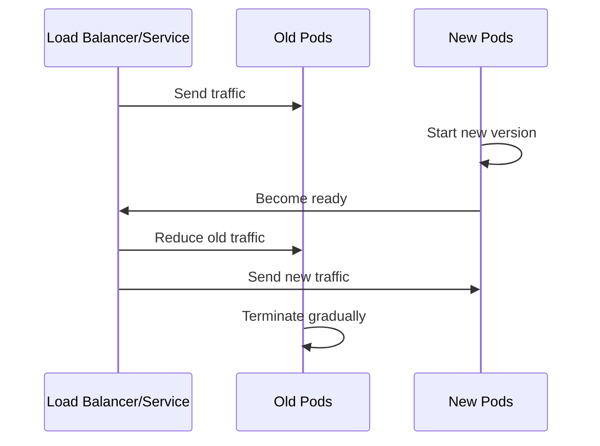

### 8.2 Strengths

- simple default for stateless services;
- no full capacity duplication if configured carefully;
- orchestrators support it naturally;
- progressive replacement reduces some risk.

### 8.3 Weaknesses

- old and new version coexist;
- rollback can be unsafe after DB/data mutation;
- partial exposure can hide bugs;
- version-specific session/cache behavior can fail;
- not ideal for incompatible protocol/schema changes.

### 8.4 Required Compatibility

A rolling deployment requires:

```text
N and N+1 must be compatible for at least the rollout window.
```

Compatibility checklist:

| Boundary | Required behavior |
|---|---|
| HTTP API | Clients can call old/new safely |
| Database | Both versions can read/write current schema |
| Events | Consumers tolerate old/new payloads |
| Cache | Key format does not corrupt each version |
| Session | Old session data readable by new version |
| Jobs | Duplicate/overlapping jobs safe |

### 8.5 When Not to Use Rolling Update

Avoid pure rolling update when:

- migration is not backward compatible;
- only one active writer is allowed;
- version change affects global singleton behavior;
- old/new cannot share database schema;
- traffic must switch atomically;
- external partner certification requires exact cutover.

---

## 9. Blue/Green Deployment

### 9.1 Definition

Blue/green keeps two environments or two workload pools:

- blue: currently serving traffic;
- green: new candidate;
- traffic switch determines active version.

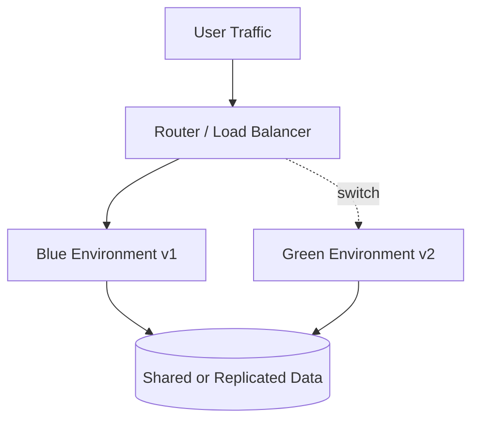

### 9.2 Strengths

- fast traffic switch;
- easy pre-production validation in green;
- fast rollback if state compatible;
- good for high-risk release windows;
- useful when exact cutover is needed.

### 9.3 Weaknesses

- requires extra capacity;
- data compatibility still hard;
- long-lived connections/sessions complicate switch;
- shared database can break rollback;
- duplicated environment drift is possible.

### 9.4 Blue/Green Is Not Magic

Many engineers say:

```text
We can rollback because we use blue/green.
```

This is only true if:

1. green has not performed irreversible writes;
2. database schema remains backward compatible;
3. event consumers tolerate both versions;
4. external side effects are idempotent or reversible;
5. sessions/connections can be drained;
6. config/secrets are version-compatible.

If green writes data that blue cannot read, blue/green rollback is fake.

---

## 10. Canary Deployment

### 10.1 Definition

Canary sends a small portion of real traffic to a new version.

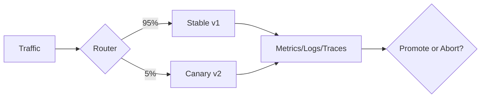

### 10.2 Strengths

- reduces blast radius;
- catches production-only issues;
- supports progressive delivery;
- useful for performance/regression detection;
- can be automated with metrics gates.

### 10.3 Weaknesses

- requires reliable metrics and routing;
- low traffic can hide rare bugs;
- user/session consistency can be hard;
- canary analysis can be noisy;
- state mutations still affect shared data.

### 10.4 Canary Gate Examples

Canary promotion should not be based only on “pod is running”.

Better gates:

| Signal | Example threshold |
|---|---|
| Error rate | Not worse than baseline by more than defined margin |
| Latency | p95/p99 within acceptable delta |
| Saturation | CPU/memory/thread pool stable |
| Business metric | Payment success rate stable |
| JVM health | GC pause and memory growth acceptable |
| Dependency calls | Downstream error/timeout not increasing |
| Logs | No new high-severity error pattern |

### 10.5 Canary Failure Model

Canary can fail silently if:

- canary traffic is not representative;
- sticky sessions keep critical users off canary;
- batch jobs bypass canary route;
- downstream calls are mocked/disabled;
- metrics are aggregated without version label;
- canary only checks technical health, not business behavior.

Top-tier rule:

```text
Canary without version-labelled observability is theater.
```

---

## 11. Ring Deployment

Ring deployment is a structured canary across user/system groups.

Example rings:

| Ring | Scope |
|---|---|
| Ring 0 | Internal synthetic traffic |
| Ring 1 | Internal users / dogfood |
| Ring 2 | Low-risk tenants |
| Ring 3 | Medium-risk tenants |
| Ring 4 | High-value / regulated tenants |
| Ring 5 | Global default |

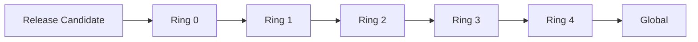

Ring deployment is useful when:

- tenants have different risk profiles;
- regulatory exposure differs;
- geography affects dependencies;
- traffic varies by business unit;
- rollback impact must be contained.

---

## 12. Feature Flags vs Deployment

### 12.1 Core Principle

```text
Deployment moves code.
Feature flag activates behavior.
```

This separation allows:

- deploy dark;
- test in production without broad exposure;
- gradually enable by tenant/user/group;
- disable feature without rollback;
- reduce release pressure.

### 12.2 Common Flag Types

| Flag type | Purpose | Lifetime |
|---|---|---|
| Release flag | Hide incomplete capability | Short |
| Experiment flag | A/B behavior | Short/medium |
| Ops flag | Disable expensive/risky behavior | Long |
| Permission flag | Entitlement/tenant behavior | Long |
| Migration flag | Control old/new path | Medium |

### 12.3 Feature Flag Failure Modes

| Failure | Why dangerous |
|---|---|
| Forgotten flags | Permanent complexity and dead branches |
| Runtime-only policy | Behavior not traceable to release |
| Inconsistent evaluation | Different services make different decisions |
| Flag explosion | State space impossible to test |
| Flag changes bypass change control | Activation becomes ungoverned release |

### 12.4 Governance Rule

Every feature flag should have:

- owner;
- purpose;
- default value;
- allowed audience;
- creation date;
- expected removal date;
- observability labels;
- rollback behavior;
- audit trail.

---

## 13. Database Migration Coordination

### 13.1 Why Database Breaks Deployment Strategy

Application deployment can be rolled back quickly.

Database changes often cannot.

This creates asymmetry:

```text
code rollback is easy;
data rollback is hard;
schema rollback is risky;
semantic rollback may be impossible.
```

### 13.2 Expand/Contract Pattern

For backward-compatible migration:

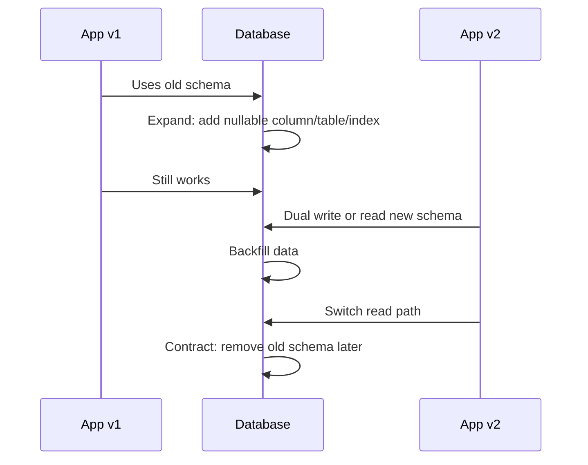

Phases:

| Phase | Action | Compatibility |
|---|---|---|
| Expand | Add new schema safely | Old app still works |
| Deploy | New app can use old/new | Coexistence safe |
| Backfill | Populate new structure | Idempotent/resumable |
| Switch | Read from new path | Controlled by flag/config |
| Contract | Remove old structure | Only after old version impossible |

### 13.3 Rules for Safe Deployment with DB

1. Never deploy code and destructive schema change in one irreversible step.
2. Add before use.
3. Write compatibly before reading exclusively.
4. Backfill must be idempotent.
5. Contract only after all old versions are gone.
6. Migrations must be observable.
7. Rollback plan must mention data compatibility, not only code.
8. Large migrations need rate limit and pause/resume.
9. Locking behavior must be tested on production-like data volume.
10. Schema migration ownership must be explicit.

### 13.4 Failure Table

| Failure | Typical cause | Mitigation |
|---|---|---|
| Old app crashes after migration | Dropped/renamed column | Expand/contract |
| New app reads missing data | Backfill incomplete | Feature flag read switch |
| Migration locks table | DDL not tested at scale | Online migration strategy |
| Rollback corrupts data | New app wrote incompatible format | Dual-write/versioned format |
| Multiple instances run migration | Migration embedded in app startup | External migration job/lock |

---

## 14. Config and Secrets Deployment

### 14.1 Config Is Runtime Contract

Configuration must not require rebuilding the application artifact.

Examples:

- endpoint URLs;
- feature flag defaults;
- thread pool size;
- timeout/retry policy;
- tenant routing;
- non-secret operational values.

Secrets include:

- database password;
- API token;
- private key;
- signing key reference;
- OAuth client secret.

### 14.2 Kubernetes ConfigMap and Secret Model

In Kubernetes, ConfigMap is intended for non-confidential key-value configuration, while Secret is intended for small amounts of sensitive data such as passwords or tokens.

For Java deployment engineering, the deeper principle is:

```text
same image digest + different runtime config = environment-specific deployment
```

Not:

```text
different image per environment because config is baked in
```

### 14.3 Config Versioning

Treat config as a versioned deployment input.

Deployment evidence should include:

- image digest;
- app version;
- config version;
- secret version/reference;
- environment;
- deployment identity;
- approval record;
- timestamp.

### 14.4 Config Failure Modes

| Failure | Example | Mitigation |
|---|---|---|
| Config drift | Prod differs from source-controlled desired state | GitOps/config-as-code |
| Secret leaked into image | `application-prod.yaml` in JAR/image | Build scan and secret scanning |
| Runtime config not tracked | Manual env var change | Deployment evidence capture |
| Secret rotation breaks app | App cannot reload credential | Restart/rotation strategy |
| ConfigMap update not app-aware | File changes but app caches old value | Explicit reload/restart policy |

---

## 15. Stateful and Background Workloads

Java enterprise systems often include more than stateless REST services.

### 15.1 Workload Types

| Workload | Deployment concern |
|---|---|
| REST service | Traffic draining, readiness, backward compatibility |
| Worker/consumer | Queue partitioning, idempotency, duplicate processing |
| Scheduler | Singleton execution, leader election, missed runs |
| Batch job | Restartability, checkpointing, data volume |
| Stream processor | Offset management, schema evolution |
| Stateful service | Storage, quorum, backup/restore |

### 15.2 Worker Deployment Invariants

For queue/stream consumers:

1. Processing must be idempotent or deduplicated.
2. Shutdown must stop pulling new work before process termination.
3. Offset/ack must happen after durable side effects.
4. Versioned event schemas must support old/new consumers.
5. Poison messages need quarantine/dead-letter strategy.
6. Canary may need message routing, not HTTP routing.

### 15.3 Scheduler Deployment Invariants

Schedulers need:

- single active execution;
- lock/lease/leader election;
- clock/timezone consistency;
- idempotent job body;
- missed-run handling;
- deployment pause behavior.

Never assume:

```text
replicas = 3 means scheduled job runs once
```

Without coordination, it may run three times.

---

## 16. Multi-Region Release

### 16.1 Why Multi-Region Is Different

Multi-region deployment introduces:

- replication lag;
- regional dependencies;
- region-specific compliance;
- partial outage modes;
- traffic steering;
- inconsistent config rollout;
- schema/data compatibility across regions;
- support team coordination.

### 16.2 Regional Rollout Pattern

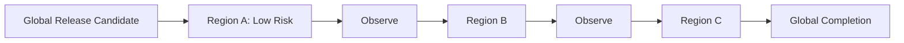

### 16.3 Multi-Region Release Checklist

| Area | Question |
|---|---|
| Artifact | Is the same digest promoted to all regions? |
| Config | Are regional config differences intentional and tracked? |
| Data | Is schema migration regional or global? |
| Traffic | Can traffic be drained or rerouted? |
| Dependencies | Are downstream services region-local or global? |
| Observability | Can metrics be compared per region/version? |
| Rollback | Is rollback regional or global? |
| Compliance | Are data residency and audit rules respected? |

### 16.4 Follow-the-Sun Risk

A release can pass in one region and fail in another because:

- traffic mix differs;
- customer behavior differs;
- downstream provider differs;
- data shape differs;
- timezone-dependent code differs;
- locale/currency/regulatory logic differs.

For Java systems handling financial/regulatory workflows, region/tenant/data-shape differences matter more than raw CPU/memory metrics.

---

## 17. Rollback vs Roll-Forward

### 17.1 Rollback

Rollback means returning runtime exposure to previous known-good version.

It works well when:

- previous artifact still exists;
- config is compatible;
- database/data is backward-compatible;
- external side effects are not irreversible;
- previous version can read current data.

### 17.2 Roll-Forward

Roll-forward means deploying a new fix version instead of reverting.

It is often better when:

- data migration already happened;
- external side effects already occurred;
- old version cannot safely run;
- bug is localized and fixable quickly;
- rollback would increase damage.

### 17.3 Decision Matrix

| Condition | Prefer rollback | Prefer roll-forward |
|---|---:|---:|
| No data mutation | ✅ | Maybe |
| Destructive migration occurred | ❌ | ✅ |
| Previous version compatible | ✅ | Maybe |
| Previous version incompatible with current data | ❌ | ✅ |
| Bug is catastrophic and route switch can stop it | ✅ | Maybe |
| Fix is small and verified | Maybe | ✅ |
| External side effects already emitted | Maybe | ✅ |

### 17.4 Top-Tier Incident Rule

During incident, do not ask only:

```text
Can we rollback?
```

Ask:

```text
Can previous code safely operate on current state?
```

That is the real rollback question.

---

## 18. Deployment Evidence and Auditability

Enterprise deployment should produce evidence.

Evidence is not bureaucracy; it is how we reconstruct what happened.

### 18.1 Minimum Evidence

| Evidence | Example |
|---|---|
| Source version | Git commit SHA |
| Release version | `2026.06.29-001` |
| Artifact identity | JAR checksum, image digest |
| Build identity | CI run ID, builder identity |
| SBOM | Dependency list |
| Provenance | Where/how artifact was built |
| Approval | Change/release approval record |
| Environment | prod/uat/region/tenant |
| Config version | Config commit/ref |
| Secret reference | Secret manager version/ref |
| Deployment actor | Automation identity |
| Timestamp | Start/end deployment time |
| Outcome | success/failed/rolled back/rolled forward |

### 18.2 Evidence Flow

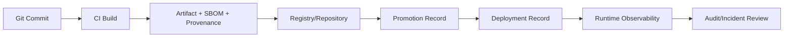

---

## 19. Deployment Anti-Patterns

### 19.1 Rebuild Per Environment

```text
dev build → dev artifact
uat build → uat artifact
prod build → prod artifact
```

Problem:

- prod artifact was not tested;
- environment config may be baked in;
- provenance differs;
- rollback harder;
- checksum differs.

Better:

```text
one artifact → promote through environments
```

### 19.2 Database Migration in App Startup Without Control

Problem:

- every replica may try migration;
- rollout and migration failure are coupled;
- startup time unpredictable;
- rollback semantics unclear.

Better:

- dedicated migration job;
- explicit lock;
- migration phase separated;
- evidence captured.

### 19.3 Liveness Probe as Business Health Check

If liveness fails too aggressively, Kubernetes restarts the app.

Bad liveness probe can cause restart storm.

Rule:

```text
liveness asks: should this process be killed?
readiness asks: should this instance receive traffic?
startup asks: is boot still in progress?
```

### 19.4 Feature Flags Without Removal Discipline

Flags accumulate into invisible architecture.

Old flags create:

- dead branches;
- untested combinations;
- impossible reasoning;
- unexpected production behavior.

### 19.5 Rollback Plan That Ignores State

A rollback plan that says only:

```text
redeploy previous version
```

is incomplete.

It must answer:

- what happened to database schema?
- what happened to written data?
- what happened to emitted events?
- what happened to cache entries?
- what happened to downstream side effects?
- can previous version read current state?

---

## 20. Enterprise Deployment ADR Template

```markdown
# ADR: Deployment Topology for <service>

## Context
- Service criticality:
- Runtime platform:
- Artifact type:
- State dependencies:
- Traffic characteristics:
- Compliance/audit requirements:

## Decision
We will deploy <service> using <topology> with <rollout strategy>.

## Rationale
- Why this topology fits:
- Why alternatives were rejected:
- Expected failure modes:

## Artifact and Promotion
- Artifact identity:
- Promotion model:
- Signing/SBOM/provenance:

## Configuration and Secrets
- Config source:
- Secret source:
- Versioning strategy:

## Database and State
- Migration strategy:
- Backward compatibility requirement:
- Rollback/roll-forward rules:

## Rollout Strategy
- Initial scope:
- Gate metrics:
- Expansion plan:
- Abort criteria:

## Rollback / Roll-Forward
- Safe rollback conditions:
- Unsafe rollback conditions:
- Roll-forward path:

## Evidence
- Required deployment records:
- Audit trail location:

## Consequences
- Positive:
- Negative:
- Operational burden:
```

---

## 21. Practical Deployment Review Checklist

### 21.1 Artifact

- [ ] Is the artifact immutable?
- [ ] Is the image/JAR identified by digest/checksum?
- [ ] Was it built once and promoted?
- [ ] Does it have SBOM/provenance?
- [ ] Is it signed or verifiable?

### 21.2 Runtime

- [ ] Is JDK/runtime version known?
- [ ] Are JVM memory settings compatible with platform limits?
- [ ] Is the service non-root where applicable?
- [ ] Are startup, readiness, liveness, and shutdown configured?
- [ ] Are logs/metrics/traces labelled by version?

### 21.3 Configuration

- [ ] Is environment config outside the artifact?
- [ ] Is config versioned?
- [ ] Are secrets injected safely?
- [ ] Is secret rotation planned?
- [ ] Are manual runtime edits prevented or audited?

### 21.4 Rollout

- [ ] Which strategy is used: rolling, blue/green, canary, ring?
- [ ] Is old/new compatibility verified?
- [ ] Are gate metrics defined?
- [ ] Is blast radius limited?
- [ ] Is abort criteria explicit?

### 21.5 State

- [ ] Is database migration backward-compatible?
- [ ] Are event schemas compatible?
- [ ] Are cache keys/versioned data safe?
- [ ] Are background jobs coordinated?
- [ ] Is rollback safe on current state?

---

## 22. Exercises

### Exercise 1 — Classify Existing Deployment

Pick one Java service.

Document:

- artifact type;
- runtime topology;
- deployment tool;
- traffic routing;
- config source;
- secret source;
- database migration process;
- rollback process;
- evidence captured.

Then identify the weakest link.

### Exercise 2 — Rolling Compatibility Review

For a service using rolling updates, list all boundaries where old/new versions coexist:

- API;
- database;
- cache;
- event stream;
- scheduler;
- worker;
- client SDK;
- feature flag.

Write what compatibility means for each.

### Exercise 3 — Convert Deployment to Release/Expose/Activate Model

Take one release flow and split it into:

1. deploy;
2. release;
3. expose;
4. activate.

Identify which step currently carries the most risk.

### Exercise 4 — Rollback Truth Test

For one production service, answer:

```text
Can the previous version safely read and write current production data after the new version has run for 30 minutes?
```

If answer is not clearly yes, rollback is not guaranteed.

---

## 23. Summary

Enterprise deployment topology is not just infrastructure choice.

It is a set of operational invariants:

- artifact immutability;
- runtime control;
- traffic movement;
- state compatibility;
- configuration governance;
- rollout safety;
- rollback/roll-forward semantics;
- audit evidence.

The strongest mental model is:

```text
deploy != release != expose != activate
```

Rolling update, blue/green, canary, and ring deployment are not “better/worse” universally.

They are tools with different assumptions:

| Strategy | Best for | Main risk |
|---|---|---|
| Rolling | Stateless compatible services | Old/new coexistence |
| Blue/green | Controlled cutover | State rollback illusion |
| Canary | Blast-radius reduction | Weak observability/representativeness |
| Ring | Tenant/region risk management | Operational complexity |

For top-tier engineering, every deployment strategy must be tied to:

- artifact identity;
- compatibility model;
- state transition model;
- rollout gate;
- abort criteria;
- evidence trail.

---

## 24. References

- Kubernetes Documentation — Deployments: https://kubernetes.io/docs/concepts/workloads/controllers/deployment/
- Kubernetes Documentation — Managing Workloads / Canary Deployments: https://kubernetes.io/docs/concepts/workloads/management/
- Kubernetes Documentation — ConfigMaps: https://kubernetes.io/docs/concepts/configuration/configmap/
- Kubernetes Documentation — Secrets: https://kubernetes.io/docs/concepts/configuration/secret/
- Helm Documentation — Provenance and Integrity: https://helm.sh/docs/topics/provenance/
- SLSA — Supply-chain Levels for Software Artifacts: https://slsa.dev/
