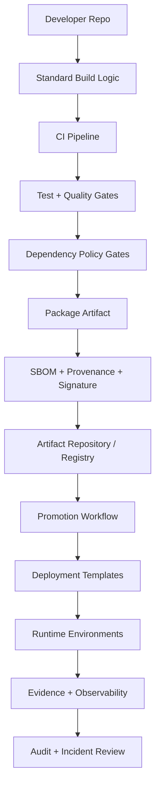
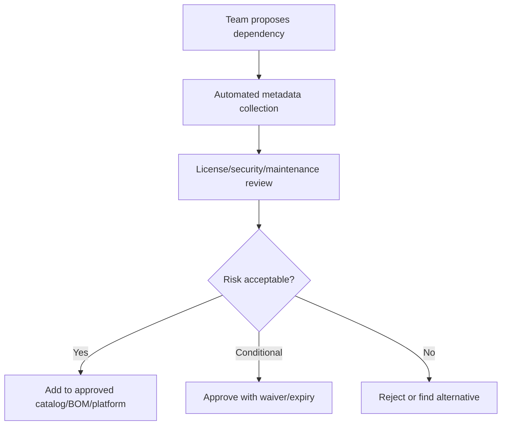
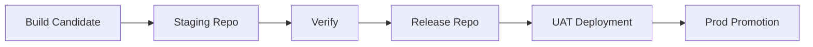
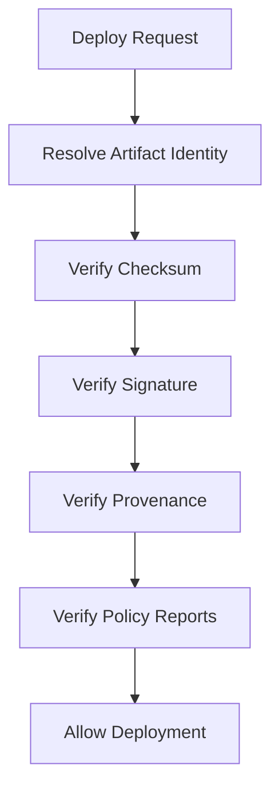

------
title: Learn Java Source, Package, Dependency, Build, Release & Deployment Engineering - Part 032
description: Capstone for designing an enterprise Java build, dependency, release, and deployment platform, covering reference architecture, Maven and Gradle standards, dependency governance, artifact repositories, CI pipelines, SBOM, signing, provenance, promotion, deployment templates, operating model, maturity model, and final self-assessment.
series: learn-java-build-dependency-release-deployment
seriesTitle: Learn Java Source, Package, Dependency, Build, Release & Deployment Engineering
order: 32
partTitle: Capstone Enterprise Build Release Platform
tags:
- java
- build-platform
- release-engineering
- deployment-platform
- maven
- gradle
- dependency-management
- artifact-repository
- sbom
- provenance
- slsa
- ci-cd
- production-engineering
- capstone
date: 2026-06-29
------

# Part 032 — Capstone: Enterprise Java Build, Release, and Deployment Platform

> Ini adalah bagian terakhir dari seri `learn-java-build-dependency-release-deployment`.

## 1. Posisi Part Ini Dalam Seri

Kita sudah membahas:

1. Kaufman skill map;
2. artifact lifecycle;
3. source layout;
4. package boundary;
5. JPMS;
6. source set/generated code;
7. Maven mental model;
8. Maven dependency resolution;
9. Maven multi-module;
10. Maven 4;
11. Gradle mental model;
12. Gradle dependency configurations/version catalogs;
13. Gradle multi-project/composite/build logic;
14. Gradle performance/cache/incrementality;
15. Maven vs Gradle decision framework;
16. migration Maven/Gradle;
17. dependency governance;
18. BOM/platform alignment;
19. repository/registry/artifact storage;
20. dependency security/SBOM/signing/provenance;
21. reproducible/hermetic builds;
22. test/quality gates/build pipelines;
23. code generation/annotation processing;
24. build observability/debugging;
25. Java platform release model;
26. application/library versioning;
27. branching/tagging/changelog/release notes;
28. release automation/artifact promotion;
29. Java packaging models;
30. container image/runtime deployment;
31. enterprise deployment topologies.

Sekarang kita gabungkan semuanya menjadi capstone:

```text
Enterprise Java Build, Dependency, Release, and Deployment Platform
```

Ini bukan sekadar template project.

Ini adalah internal engineering platform yang membantu ratusan engineer menghasilkan Java artifact yang:

- reproducible;
- secure;
- dependency-governed;
- testable;
- releaseable;
- deployable;
- observable;
- auditable;
- recoverable.

---

## 2. Capstone Objective

Tujuan capstone ini adalah mendesain platform internal yang menjawab pertanyaan:

```text
How do we make the correct way the easiest way for Java teams?
```

Bukan:

```text
How do we write one more build template?
```

Platform yang baik membuat pilihan benar menjadi default:

- wrapper sudah ada;
- JDK/toolchain dikunci;
- dependency policy otomatis;
- BOM/platform tersedia;
- quality gates standar;
- artifact publishing konsisten;
- SBOM/provenance otomatis;
- deployment templates siap;
- evidence tercatat;
- exception/waiver terkontrol.

---

## 3. Kaufman Final Skill Integration

### 3.1 Deconstruct the Skill

Skill utama:

```text
Design and operate an enterprise-grade Java delivery system.
```

Sub-skill final:

| Area | Capability |
|---|---|
| Source management | Repo structure, package boundary, module boundary |
| Dependency management | Version alignment, graph governance, security control |
| Build system | Maven/Gradle standardization, performance, reproducibility |
| Artifact management | Publishing, repository, promotion, retention |
| Release model | Versioning, tagging, changelog, approval, traceability |
| Deployment model | Packaging, container, topology, rollout strategy |
| Supply-chain security | SBOM, signing, provenance, verification |
| Platform operation | Templates, conventions, migration, support, SLO |
| Auditability | Evidence, policy, change record, incident reconstruction |

### 3.2 Learn Enough to Self-Correct

Top-tier engineer knows how to debug when abstraction leaks:

- dependency graph conflict;
- CI-only build failure;
- non-reproducible artifact;
- plugin task order issue;
- classpath/module-path issue;
- generated code drift;
- BOM/platform misalignment;
- repository metadata corruption;
- failed release promotion;
- rollback blocked by schema change;
- deployment passes but feature activation fails.

### 3.3 Remove Practice Barriers

A good platform removes repeated friction:

| Friction | Platform response |
|---|---|
| Teams copy-paste build scripts | Convention plugins / parent POM |
| Dependency versions drift | BOM/platform/version catalog |
| CI pipelines differ randomly | Standard pipeline library |
| Release manual and risky | Release automation |
| Artifact not traceable | Immutable artifact identity |
| Security evidence missing | SBOM/provenance/signing by default |
| Deployment templates inconsistent | Golden path templates |
| Rollback unclear | Deployment strategy templates with state rules |

### 3.4 Deliberate Practice

The capstone is not complete until you can:

1. design the platform;
2. migrate an existing service into it;
3. detect policy violations;
4. debug a failed release;
5. explain every control and trade-off;
6. remove unnecessary controls that slow teams without reducing risk.

---

## 4. Reference Architecture

### 4.1 High-Level Platform



### 4.2 Platform Components

| Component | Responsibility |
|---|---|
| Project template | New service/library baseline |
| Maven parent POM | Standard Maven defaults |
| Maven BOM | Version alignment for Maven consumers |
| Gradle convention plugins | Standard Gradle build behavior |
| Gradle version catalog | Central dependency coordinates |
| Gradle platform | Version alignment for Gradle builds |
| CI pipeline library | Standard stages and gates |
| Artifact repository | Immutable JAR/WAR/BOM storage |
| Image registry | Immutable container image storage |
| SBOM generator | Dependency inventory evidence |
| Signing/provenance generator | Integrity and build-origin evidence |
| Policy engine | Enforce allowed/blocked dependencies and rules |
| Deployment template | Kubernetes/VM/app-server baseline |
| Release dashboard | Trace release from commit to runtime |
| Exception workflow | Govern waivers without blocking all work |

---

## 5. Non-Negotiable Invariants

These are the platform rules that should be hard to bypass.

### 5.1 Build Invariants

1. Build uses Maven Wrapper or Gradle Wrapper.
2. Build JDK is explicit and controlled.
3. Dependency repositories are controlled by organization policy.
4. Build artifact is generated in CI, not developer laptop.
5. Release artifact is immutable.
6. CI build records source commit and build identity.
7. Build can run from clean checkout.
8. Build does not depend on undeclared local files.
9. Generated code is deterministic or generated at controlled phase.
10. Build logs and reports are retained.

### 5.2 Dependency Invariants

1. Direct dependencies are owned.
2. Transitive dependencies are visible.
3. Versions are centrally aligned for platform dependencies.
4. Critical libraries require approval.
5. Vulnerabilities are classified by exploitability and exposure, not only CVSS.
6. Waivers have owner and expiry date.
7. Snapshot dependencies cannot enter production release.
8. Internal libraries follow versioning contract.
9. Dependency graph can be exported.
10. Dependency changes are reviewable.

### 5.3 Release Invariants

1. Release version maps to source commit.
2. Release tag is immutable.
3. Changelog/release notes are generated or curated.
4. Release artifact is built once.
5. Artifact promotion does not rebuild.
6. SBOM is attached or retrievable.
7. Provenance records build inputs and builder.
8. Signature/checksum verification is possible.
9. Release approval is recorded.
10. Rollback/roll-forward plan exists for production changes.

### 5.4 Deployment Invariants

1. Runtime config is separate from artifact.
2. Secrets are never baked into artifact/image.
3. Deployment references immutable artifact identity.
4. Startup/readiness/liveness/shutdown contracts are defined.
5. Deployment strategy is explicit.
6. Database migration compatibility is reviewed.
7. Old/new coexistence is considered.
8. Observability includes version labels.
9. Deployment evidence is captured.
10. Manual production edits are audited or prevented.

---

## 6. Standard Repository Template

### 6.1 Application Repository

```text
payment-service/
  README.md
  ADR/
  docs/
  src/
    main/
      java/
      resources/
    test/
      java/
      resources/
    integrationTest/
      java/
      resources/
  deploy/
    kubernetes/
    vm/
  db/
    migration/
  build-logic/              # Gradle only when local build logic is justified
  pom.xml                   # Maven option
  mvnw
  mvnw.cmd
  .mvn/
  build.gradle.kts          # Gradle option
  settings.gradle.kts
  gradlew
  gradlew.bat
  gradle/
  ci/
    pipeline.yml
  sbom/
  CHANGELOG.md
```

Do not put both Maven and Gradle in long-term template unless the repository is intentionally in migration mode.

Dual-build is an exception, not the default.

### 6.2 Library Repository

```text
customer-risk-client/
  README.md
  src/main/java/
  src/test/java/
  pom.xml or build.gradle.kts
  compatibility/
    binary-compatibility.md
    api-policy.md
  publishing/
    release-policy.md
  CHANGELOG.md
```

Library template requires stronger compatibility contract than application template.

Applications can change internals freely.
Libraries create dependency obligations for consumers.

---

## 7. Maven Standard

### 7.1 Corporate Parent POM

A corporate parent POM should define:

- plugin versions;
- compiler settings;
- test plugins;
- quality plugins;
- reproducible build defaults;
- encoding;
- Java release level;
- source/javadoc packaging policy;
- enforcer rules;
- repository policy if appropriate;
- distribution management if appropriate.

Example sketch:

```xml
<project>
  <modelVersion>4.0.0</modelVersion>
  <groupId>com.example.platform</groupId>
  <artifactId>java-parent</artifactId>
  <version>2026.06.0</version>
  <packaging>pom</packaging>

  <properties>
    <maven.compiler.release>21</maven.compiler.release>
    <project.build.sourceEncoding>UTF-8</project.build.sourceEncoding>
    <project.build.outputTimestamp>${git.commit.time}</project.build.outputTimestamp>
  </properties>

  <build>
    <pluginManagement>
      <plugins>
        <!-- compiler, surefire, failsafe, jar, source, javadoc, enforcer -->
      </plugins>
    </pluginManagement>
  </build>
</project>
```

### 7.2 Corporate BOM

A BOM should define dependency versions, not build behavior.

```xml
<dependencyManagement>
  <dependencies>
    <dependency>
      <groupId>com.fasterxml.jackson</groupId>
      <artifactId>jackson-bom</artifactId>
      <version>...</version>
      <type>pom</type>
      <scope>import</scope>
    </dependency>
  </dependencies>
</dependencyManagement>
```

Separate concerns:

| Artifact | Owns |
|---|---|
| Parent POM | Build behavior |
| BOM | Dependency versions |
| Archetype/template | Initial repo shape |

### 7.3 Maven Platform Rules

1. Parent POM should be versioned and changelogged.
2. BOM should be consumable without inheriting build policy.
3. Plugin versions must not float.
4. Release profile must not hide critical behavior.
5. Snapshot parent/BOM prohibited in release builds.
6. `dependency:tree` and effective POM reports should be available in CI.
7. Enforcer rules should be staged before enforced globally.
8. Teams must be able to override with documented waiver when justified.

---

## 8. Gradle Standard

### 8.1 Convention Plugins

For Gradle, prefer convention plugins over copy-pasted `subprojects {}` blocks.

Example platform plugin set:

```text
com.example.java-library-conventions
com.example.java-application-conventions
com.example.java-test-conventions
com.example.java-publishing-conventions
com.example.java-quality-conventions
com.example.java-container-conventions
```

Each plugin owns one concern.

### 8.2 Version Catalog

```toml
[versions]
junit = "..."
jackson = "..."

[libraries]
junit-jupiter = { module = "org.junit.jupiter:junit-jupiter", version.ref = "junit" }
jackson-databind = { module = "com.fasterxml.jackson.core:jackson-databind", version.ref = "jackson" }

[plugins]
```

Version catalog improves developer ergonomics, but it is not enough for strict alignment. Use platforms/constraints for enforced graph behavior.

### 8.3 Gradle Platform

```kotlin
plugins {
    `java-platform`
}

javaPlatform {
    allowDependencies()
}

dependencies {
    constraints {
        api("com.fasterxml.jackson.core:jackson-databind:...")
        api("org.junit.jupiter:junit-jupiter:...")
    }
}
```

### 8.4 Gradle Platform Rules

1. Build logic belongs in convention plugins.
2. Dependency coordinates belong in version catalogs/platforms.
3. Task configuration must be lazy.
4. Configuration cache compatibility should be a platform target.
5. Build cache must not hide correctness problems.
6. Dependency verification/locking should be deliberate and staged.
7. Multi-project builds should avoid global mutation blocks.
8. Composite builds should be used for source substitution and build logic isolation where appropriate.

---

## 9. Standard CI Pipeline

### 9.1 Pipeline Stages


### 9.2 Pull Request Pipeline

PR pipeline should be fast and focused:

- compile;
- unit tests;
- static checks;
- dependency policy check;
- generated code drift check;
- module/package boundary check if applicable;
- lightweight container build if needed.

### 9.3 Main Branch Pipeline

Main branch pipeline should produce candidate artifacts:

- full test suite;
- integration/contract tests;
- SBOM generation;
- vulnerability scan;
- artifact packaging;
- artifact signing;
- provenance generation;
- publish to staging/candidate repository.

### 9.4 Release Pipeline

Release pipeline should not rebuild if artifact already exists.

It should:

- verify artifact identity;
- verify SBOM/provenance/signature;
- verify approval gates;
- promote artifact;
- tag release if not already tagged;
- publish release notes;
- trigger deployment workflow.

### 9.5 Deployment Pipeline

Deployment pipeline should:

- select artifact by immutable identity;
- select config version;
- verify environment policy;
- run pre-deploy checks;
- apply migration if explicitly part of plan;
- deploy workload;
- wait for readiness;
- run smoke test;
- shift traffic according to strategy;
- monitor gates;
- record outcome.

---

## 10. Dependency Governance Operating Model

### 10.1 Dependency Lifecycle States

| State | Meaning |
|---|---|
| Proposed | Team wants to add it |
| Approved | Allowed under policy |
| Preferred | Recommended default |
| Restricted | Allowed only with justification |
| Deprecated | Existing use tolerated, no new use |
| Blocked | Not allowed |
| Emergency blocked | Immediate remediation required |

### 10.2 Intake Workflow



### 10.3 Review Criteria

| Criteria | Question |
|---|---|
| License | Is it compatible with product/commercial constraints? |
| Maintenance | Is it actively maintained? |
| Popularity | Is ecosystem usage strong enough? |
| Security history | Are vulnerabilities handled responsibly? |
| Transitive graph | Does it bring risky dependencies? |
| API stability | Is it stable enough for long-term use? |
| Runtime cost | Does it affect startup/memory/classpath significantly? |
| Replacement cost | How hard to remove later? |
| Internal overlap | Does it duplicate an approved internal capability? |

### 10.4 Policy as Code

Dependency governance should be encoded in CI as much as possible.

Examples:

- banned coordinates;
- banned versions;
- no snapshots in release;
- no dynamic versions;
- allowed repositories;
- max severity vulnerability threshold;
- license allowlist/denylist;
- required SBOM;
- required checksum/signature verification;
- waiver expiry.

---

## 11. Artifact Repository and Registry Design

### 11.1 Repository Types

| Repository | Purpose |
|---|---|
| Proxy/cache | Cache external dependencies |
| Hosted snapshot | Internal snapshot artifacts |
| Hosted release | Internal immutable release artifacts |
| Staging | Pre-release verification |
| Quarantine | Suspicious or unapproved artifacts |
| Archive | Retained old releases |

### 11.2 Image Registry Policy

Container registry should enforce:

- immutable production tags or digest-based deployment;
- vulnerability scan integration;
- signature/provenance attachment where available;
- retention policy;
- promotion by digest;
- access separation between push and deploy;
- audit logs.

### 11.3 Artifact Promotion Model



Promotion must not rebuild.

Promotion changes status/visibility/location/approval, not artifact bytes.

---

## 12. SBOM, Signing, and Provenance

### 12.1 Why These Exist

| Control | Answers |
|---|---|
| SBOM | What is inside this artifact? |
| Signature | Has this artifact been altered? |
| Checksum | Are these bytes the expected bytes? |
| Provenance | Where, when, and how was this artifact built? |
| Attestation | Who/what claims this property about the artifact? |

### 12.2 Evidence Bundle

A release should produce an evidence bundle:

```text
release-2026.06.29-001/
  artifact.jar
  artifact.jar.sha256
  artifact.jar.sig
  sbom.cyclonedx.json
  provenance.intoto.jsonl
  dependency-policy-report.json
  vulnerability-report.json
  test-report.zip
  release-notes.md
  deployment-record.json
```

### 12.3 Verification Flow



### 12.4 Practical Rule

SBOM alone is not enough.

SBOM tells what is inside.

Provenance tells how it was produced.

Signature/checksum help verify identity and integrity.

Together they support supply-chain trust.

---

## 13. Deployment Template Standard

### 13.1 Required Fields

Every deployment template should expose explicit parameters:

- service name;
- image digest;
- app version;
- environment;
- region;
- replica count;
- CPU/memory request/limit;
- JVM memory strategy;
- config reference;
- secret reference;
- readiness/liveness/startup endpoints;
- rollout strategy;
- metrics labels;
- logging/tracing labels;
- migration hook/job if any.

### 13.2 Kubernetes Template Skeleton

```yaml
apiVersion: apps/v1
kind: Deployment
metadata:
  name: ${SERVICE_NAME}
  labels:
    app: ${SERVICE_NAME}
    app.kubernetes.io/version: ${APP_VERSION}
spec:
  replicas: ${REPLICAS}
  strategy:
    type: RollingUpdate
    rollingUpdate:
      maxSurge: 1
      maxUnavailable: 0
  selector:
    matchLabels:
      app: ${SERVICE_NAME}
  template:
    metadata:
      labels:
        app: ${SERVICE_NAME}
        version: ${APP_VERSION}
    spec:
      containers:
      - name: app
        image: ${IMAGE_DIGEST}
        envFrom:
        - configMapRef:
            name: ${CONFIG_REF}
        - secretRef:
            name: ${SECRET_REF}
        readinessProbe:
          httpGet:
            path: /ready
            port: 8080
        livenessProbe:
          httpGet:
            path: /live
            port: 8080
        lifecycle:
          preStop:
            exec:
              command: ["sh", "-c", "sleep 10"]
```

### 13.3 Template Policy

Templates should be opinionated but not rigid.

Allowed customization:

- resource sizing;
- replica count;
- rollout strategy;
- environment config;
- route/ingress;
- persistence requirements;
- job vs service workload.

Restricted customization:

- disabling readiness probes;
- deploying mutable tags to production;
- bypassing secrets management;
- running as root without exception;
- disabling policy gates;
- bypassing artifact verification.

---

## 14. Platform Team Operating Model

### 14.1 Platform as Product

Build/release platform is not a one-time standards document.

It is a product.

It needs:

- product owner;
- roadmap;
- support channel;
- documentation;
- migration guides;
- release notes;
- compatibility policy;
- deprecation policy;
- adoption metrics;
- incident response;
- feedback loop.

### 14.2 Responsibility Split

| Responsibility | Platform team | Product team |
|---|---:|---:|
| Build convention | Owns | Consumes/extends |
| Dependency policy | Owns guardrails | Requests additions/waivers |
| Application code | Supports patterns | Owns |
| Release pipeline | Owns standard | Owns release decision |
| Deployment template | Owns baseline | Owns service-specific config |
| Runtime incident | Supports platform failures | Owns service behavior |
| Security controls | Implements shared controls | Remediates app-specific risk |

### 14.3 Golden Path and Escape Hatch

A mature platform has both:

```text
golden path + governed escape hatch
```

Golden path:

- easiest;
- documented;
- supported;
- automated;
- compliant by default.

Escape hatch:

- allowed for justified cases;
- time-limited;
- audited;
- reviewed;
- eventually folded back into platform if pattern repeats.

Without escape hatch, teams fork the platform informally.

Without golden path, every team reinvents delivery.

---

## 15. Migration Strategy

### 15.1 Adoption Phases

| Phase | Goal |
|---|---|
| Phase 0 | Inventory current repositories and pipelines |
| Phase 1 | Define minimum platform standard |
| Phase 2 | Pilot with 2-3 representative services |
| Phase 3 | Automate project template and CI pipeline |
| Phase 4 | Migrate low-risk services |
| Phase 5 | Migrate critical services with service-specific plan |
| Phase 6 | Enforce policy gates gradually |
| Phase 7 | Deprecate old templates/pipelines |
| Phase 8 | Continuous improvement |

### 15.2 Service Classification

| Class | Migration approach |
|---|---|
| New service | Use golden path immediately |
| Small internal app | Direct migration |
| Shared library | Compatibility-first migration |
| Critical service | Shadow pipeline and staged rollout |
| Legacy app server app | Adapter template + gradual modernization |
| Regulated system | Evidence-first migration |

### 15.3 Migration Anti-Patterns

| Anti-pattern | Result |
|---|---|
| Big-bang migration | High outage/coordination risk |
| Policy gates on day one | Teams blocked by existing debt |
| No waiver model | Teams bypass platform |
| Template without support | Adoption stalls |
| No metrics | Cannot prove value |
| Dual-build forever | Permanent complexity |

---

## 16. Metrics and SLOs for Build/Release Platform

### 16.1 Build Metrics

| Metric | Why it matters |
|---|---|
| Median PR build time | Developer feedback speed |
| P95 build time | Tail pain |
| Build failure rate | Signal/noise quality |
| Flaky test rate | Trust in CI |
| Cache hit rate | Build efficiency |
| Dependency resolution time | Repository/cache health |

### 16.2 Release Metrics

| Metric | Why it matters |
|---|---|
| Deployment frequency | Delivery capability |
| Lead time for change | Flow efficiency |
| Change failure rate | Release quality |
| MTTR | Recovery capability |
| Rollback rate | Release risk |
| Waiver count/age | Policy debt |

### 16.3 Security/Supply-Chain Metrics

| Metric | Why it matters |
|---|---|
| SBOM coverage | Inventory completeness |
| Provenance coverage | Build traceability |
| Signed artifact coverage | Integrity control |
| Critical vulnerability age | Risk exposure duration |
| Unapproved dependency count | Governance gap |
| Snapshot-in-release violations | Release hygiene |

### 16.4 Adoption Metrics

| Metric | Why it matters |
|---|---|
| Repos on golden path | Platform adoption |
| Repos with current parent/plugin version | Upgrade health |
| Pipeline drift count | Standardization gap |
| Template fork count | Missing platform capability |
| Support tickets by category | Friction discovery |

---

## 17. Maturity Model

### Level 0 — Ad Hoc

- each team uses its own build scripts;
- dependency versions drift;
- CI pipelines differ;
- releases are manual;
- artifact provenance unavailable;
- deployments are mutable.

### Level 1 — Standardized Build

- Maven/Gradle wrapper used;
- parent POM/convention plugin exists;
- CI pipeline mostly standardized;
- artifact repository used;
- versioning policy exists.

### Level 2 — Governed Dependencies

- BOM/platform/version catalog adopted;
- dependency review process exists;
- vulnerability scanning integrated;
- dependency graph export available;
- release snapshots blocked.

### Level 3 — Reproducible Release

- toolchains pinned;
- artifacts immutable;
- SBOM generated;
- signing/checksum/provenance available;
- promotion does not rebuild;
- deployment records captured.

### Level 4 — Progressive Deployment

- standardized deployment templates;
- rollout strategies defined;
- canary/ring support;
- version-labelled observability;
- rollback/roll-forward playbooks;
- DB migration compatibility gates.

### Level 5 — Self-Service Internal Platform

- golden path is self-service;
- policy-as-code and waivers automated;
- platform metrics and SLOs tracked;
- teams can migrate safely;
- incidents feed platform improvement;
- audit evidence is automatic.

---

## 18. Failure-Mode Table

| Failure | Detection | Prevention | Recovery |
|---|---|---|---|
| Dependency conflict | Dependency tree/insight, tests | BOM/platform, constraints | Align/exclude/upgrade |
| Vulnerable dependency | Scanner/SBOM | Approved catalog, policy gate | Patch/waiver/remove |
| Non-reproducible build | Artifact checksum mismatch | Pinned toolchain, controlled inputs | Debug hidden inputs |
| CI-only failure | Pipeline logs/build reports | CI parity, wrapper, toolchain | Reproduce with clean env |
| Generated code drift | Diff check | Deterministic generation | Regenerate or fix generator |
| Publishing wrong artifact | Repository metadata/checksum | Signed artifacts, staging | Yank/quarantine/release fix |
| Rebuild during promotion | Digest mismatch | Build-once-promote-many | Stop promotion, rebuild candidate |
| Config baked into image | Secret/config scan | Runtime config policy | Rebuild clean image |
| Canary false positive | Version-labelled metrics absent | Observability standard | Abort and improve gates |
| Rollback unsafe | DB/data incompatibility | Expand/contract migration | Roll-forward fix |

---

## 19. Final Capstone Exercise

Design an internal Java platform for your organization.

### 19.1 Deliverable 1 — Platform ADR

Create:

```text
ADR-0001-enterprise-java-delivery-platform.md
```

It must include:

- problem statement;
- scope;
- Maven standard;
- Gradle standard;
- dependency governance;
- CI pipeline;
- artifact repository;
- SBOM/signing/provenance;
- release promotion;
- deployment template;
- waiver model;
- migration plan;
- success metrics.

### 19.2 Deliverable 2 — Golden Path Template

Create one template for:

- Java REST service;
- Java library;
- Java worker/consumer.

Each template must include:

- build file;
- wrapper;
- standard source layout;
- tests;
- quality gates;
- dependency policy;
- publishing/deployment placeholder;
- README with local dev commands;
- release checklist.

### 19.3 Deliverable 3 — Migration of Existing Service

Pick one real service and write:

- current state inventory;
- target state;
- migration risks;
- shadow pipeline plan;
- dependency cleanup plan;
- deployment compatibility plan;
- rollback/roll-forward plan;
- timeline;
- owners.

### 19.4 Deliverable 4 — Incident Drill

Simulate:

```text
A production release introduced a transitive dependency conflict that only appears under real traffic after canary expansion.
```

Write:

- detection path;
- build evidence used;
- dependency graph diagnosis;
- rollback/roll-forward decision;
- platform improvement after incident.

---

## 20. Final Self-Assessment

You are close to top-tier capability in this area if you can answer these without hand-waving.

### 20.1 Build and Dependency

1. Why did Maven choose this transitive dependency version?
2. Why did Gradle expose this dependency to consumers?
3. Which dependency versions are governed by BOM/platform and which are unmanaged?
4. How do you prove two builds from the same commit produce equivalent artifacts?
5. What hidden inputs could break reproducibility?
6. How do annotation processors affect incremental build and classpath correctness?
7. How do you debug a CI-only classpath conflict?

### 20.2 Release

1. What exact commit produced this release artifact?
2. Was this artifact rebuilt during promotion?
3. What changed since previous release?
4. Is the artifact signed/verifiable?
5. Does this release have SBOM and provenance?
6. Can we recreate the release evidence after 12 months?
7. Which release lines are supported?

### 20.3 Deployment

1. What artifact identity is running in production?
2. What config version is attached to it?
3. Can old and new versions coexist safely?
4. What happens to in-flight requests during shutdown?
5. Can previous code read current database state after rollout?
6. What is the abort criterion for canary?
7. Is rollback safe, or must we roll forward?

### 20.4 Platform

1. What is the golden path?
2. What is the governed escape hatch?
3. Which controls are automated?
4. Which controls are manual and why?
5. What is the platform adoption rate?
6. What is the most common source of friction?
7. What platform change would reduce the most release risk?

---

## 21. Recommended Next Advanced Series

After this series, the most valuable next topics are:

1. **Java Internal Developer Platform Engineering**
   - Backstage-style service catalog;
   - templates;
   - golden paths;
   - developer self-service;
   - platform SLOs;
   - paved road governance.

2. **Java Cloud Native Runtime and Kubernetes Operations**
   - Kubernetes deeper dive;
   - probes;
   - autoscaling;
   - rollout controllers;
   - service mesh;
   - JVM in Kubernetes;
   - production troubleshooting.

3. **Java Software Supply Chain Security**
   - SBOM;
   - SLSA;
   - in-toto;
   - Sigstore/cosign;
   - provenance verification;
   - dependency attack modeling;
   - policy-as-code.

4. **Java Enterprise Architecture Governance**
   - architecture fitness functions;
   - dependency boundaries;
   - service ownership;
   - platform contracts;
   - regulatory defensibility;
   - audit trails.

---

## 22. Series Completion

Seri ini selesai di Part 032.

Final coverage:

```text
source code → package/module → dependency graph → Maven/Gradle build graph
→ artifact repository → supply-chain security → reproducible build
→ test/quality pipeline → release model → packaging → deployment topology
→ enterprise build/release/deployment platform
```

Skill inti yang harus tertanam:

```text
Delivery engineering is architecture.
```

Build, dependency, release, dan deployment bukan pekerjaan “plumbing” rendah.

Mereka menentukan:

- apakah sistem bisa direproduksi;
- apakah sistem bisa diaudit;
- apakah sistem bisa dipatch;
- apakah sistem bisa dirollback;
- apakah tim bisa scale;
- apakah organisasi bisa bergerak cepat tanpa kehilangan kontrol.

Jika kamu bisa mendesain, mengoperasikan, dan memperbaiki platform seperti ini, kamu bukan hanya pengguna Maven/Gradle/Kubernetes.

Kamu sudah berpikir sebagai engineer yang memahami lifecycle software dari source sampai production evidence.

---

## 23. References

- Apache Maven — Introduction to the Build Lifecycle: https://maven.apache.org/guides/introduction/introduction-to-the-lifecycle.html
- Apache Maven — Introduction to the Dependency Mechanism: https://maven.apache.org/guides/introduction/introduction-to-dependency-mechanism.html
- Gradle Documentation — Build Lifecycle: https://docs.gradle.org/current/userguide/build_lifecycle.html
- Gradle Documentation — Dependency Management: https://docs.gradle.org/current/userguide/core_dependency_management.html
- Gradle Documentation — Version Catalogs: https://docs.gradle.org/current/userguide/version_catalogs.html
- Gradle Documentation — Platforms: https://docs.gradle.org/current/userguide/platforms.html
- Kubernetes Documentation — Deployments: https://kubernetes.io/docs/concepts/workloads/controllers/deployment/
- Kubernetes Documentation — ConfigMaps: https://kubernetes.io/docs/concepts/configuration/configmap/
- Kubernetes Documentation — Secrets: https://kubernetes.io/docs/concepts/configuration/secret/
- Helm Documentation — Provenance and Integrity: https://helm.sh/docs/topics/provenance/
- SLSA — Supply-chain Levels for Software Artifacts: https://slsa.dev/
- SLSA Specification — Build Provenance: https://slsa.dev/spec/v1.2/build-provenance
