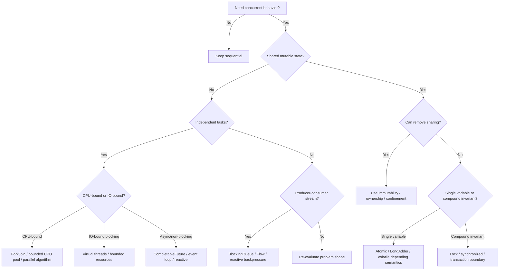

------
title: Learn Java Concurrency & Correctness - Part 001
description: Peta skill, target kompetensi, batasan seri, cara latihan 20 jam pertama, dan taxonomy Java concurrency untuk engineer tingkat lanjut.
series: learn-java-concurrency-correctness
seriesTitle: Learn Java Concurrency & Correctness
order: 1
partTitle: Kaufman Skill Map
tags:
- java
- concurrency
- correctness
- kaufman
- series
date: 2026-06-28
---

# Part 001 — Kaufman Skill Map

> Tujuan part ini bukan mengajari seluruh concurrency sekaligus. Tujuannya adalah memberi **peta belajar yang benar**, sehingga setiap konsep berikutnya punya tempat yang jelas: kapan dipakai, risiko apa yang dikendalikan, dan invariant apa yang harus tetap benar.

Java concurrency bukan satu topik. Ia adalah gabungan dari:

1. **correctness**: apakah program tetap benar saat dieksekusi bersamaan;
2. **coordination**: bagaimana task/thread bekerja sama tanpa saling merusak;
3. **execution model**: bagaimana pekerjaan dijalankan oleh platform thread, virtual thread, executor, event loop, fork-join, atau reactive scheduler;
4. **liveness**: apakah sistem tetap bergerak, tidak deadlock, tidak starvation, tidak overload;
5. **throughput/latency engineering**: apakah sistem mampu melayani load secara efisien;
6. **failure semantics**: apa yang terjadi saat satu task gagal, timeout, dibatalkan, atau tertinggal;
7. **observability**: apakah perilaku runtime bisa dibaca dari thread dump, JFR, metrics, dan logs.

Seri ini dirancang untuk menjadikan concurrency sebagai **engineering discipline**, bukan koleksi trik.

---

## 1. Kenapa Concurrency Sulit

Concurrency sulit karena bug-nya sering tidak lokal.

Pada kode sequential, kita biasanya bisa membaca satu alur:

```java
validate(command);
caseRepository.save(command);
auditLog.write(command);
notifySupervisor(command);
```

Jika ada bug, kita cari di urutan itu.

Pada kode concurrent, bug dapat muncul dari interleaving:

```java
// Thread A
if (!caseFile.isEscalated()) {
    caseFile.escalate();
}

// Thread B
if (!caseFile.isEscalated()) {
    caseFile.escalate();
}
```

Masing-masing thread terlihat benar jika dibaca sendiri. Namun bersama-sama, keduanya bisa menghasilkan duplikasi eskalasi.

Itulah sebabnya topik ini tidak boleh dipelajari sebagai “cara membuat thread”. Pertanyaan utamanya adalah:

> State mana yang dibagi, operasi mana yang harus tampak atomik, siapa yang memiliki lifecycle pekerjaan, dan bagaimana kegagalan dibatasi?

---

## 2. Target Kompetensi Seri

Setelah menyelesaikan seri ini, targetnya bukan hanya bisa memakai `ExecutorService`, `CompletableFuture`, virtual threads, atau reactive stream. Targetnya adalah mampu menjawab pertanyaan desain seperti ini:

- Apakah problem ini benar-benar perlu parallelism, atau cukup concurrency?
- Apakah workload ini CPU-bound, IO-bound, blocking, async, atau streaming?
- Apakah shared state ini perlu lock, atomic, immutable snapshot, actor-like ownership, queue, atau transactional boundary?
- Apakah task boleh orphaned, atau harus punya parent lifetime?
- Apakah cancellation hanya nice-to-have, atau bagian dari correctness?
- Apakah timeout berada di level call, workflow, request, atau business deadline?
- Apakah reactive dipilih karena backpressure, atau hanya karena ingin terlihat modern?
- Apakah virtual threads menyederhanakan desain, atau malah menyembunyikan bottleneck resource lain?
- Apakah thread pool sedang melindungi sistem, atau justru menjadi antrean tak terlihat?

Top 1% engineer dalam concurrency biasanya tidak terlihat dari jumlah API yang dihafal. Mereka terlihat dari kemampuannya menjaga invariant saat sistem berada dalam kondisi buruk: traffic tinggi, dependency lambat, request dibatalkan, pool penuh, lock contention, deployment berubah, dan data diproses ulang.

---

## 3. Framework Kaufman untuk Seri Ini

Josh Kaufman dalam *The First 20 Hours* menekankan empat hal penting: pecah skill, belajar secukupnya untuk self-correction, hilangkan hambatan latihan, dan latihan sengaja dalam durasi pendek tetapi intens.

Kita adaptasi untuk Java concurrency seperti ini.

### 3.1 Deconstruct the Skill

Kita tidak belajar concurrency sebagai satu blok. Kita pecah menjadi sub-skill:

| Skill Cluster | Pertanyaan Utama | Output Kompetensi |
|---|---|---|
| Correctness | Apa yang harus tetap benar? | Safety invariant, linearization point, ownership rule |
| Memory Model | Kapan write terlihat oleh thread lain? | Happens-before reasoning, safe publication |
| Coordination | Bagaimana task menunggu, memberi sinyal, atau membatasi akses? | Locking, condition, synchronizer, queue |
| Execution | Siapa menjalankan task dan bagaimana lifecycle-nya? | Executor, virtual thread, fork-join, event loop |
| Async Composition | Bagaimana operasi asinkron digabung dan gagal? | `CompletableFuture`, timeout, cancellation, context |
| Reactive | Bagaimana stream asynchronous diberi backpressure? | Publisher/subscriber protocol, scheduler boundary |
| Parallelism | Bagaimana CPU digunakan secara efisien? | Decomposition, work stealing, false sharing awareness |
| Production Forensics | Bagaimana diagnosis dilakukan saat runtime bermasalah? | Thread dump, JFR, metrics, incident playbook |

### 3.2 Learn Enough to Self-Correct

Kriteria “cukup belajar” bukan “sudah membaca semua class di `java.util.concurrent`”. Kriteria yang lebih kuat:

- bisa menjelaskan bug concurrency dari interleaving;
- bisa menunjukkan invariant mana yang rusak;
- bisa memilih primitive yang paling sederhana;
- bisa mendesain cancellation dan timeout sejak awal;
- bisa membaca thread dump dan menemukan bottleneck;
- bisa membuat stress test yang memperbesar peluang race muncul;
- bisa menghindari solusi over-engineered.

### 3.3 Remove Practice Barriers

Concurrency sering gagal dipelajari karena contoh terlalu kecil:

```java
new Thread(() -> System.out.println("hello")).start();
```

Contoh seperti itu tidak salah, tetapi tidak membangun intuisi production.

Sepanjang seri, contoh akan diarahkan ke domain yang realistis:

- case management;
- workflow escalation;
- policy evaluation;
- audit writing;
- batch validation;
- remote dependency fan-out;
- event handling;
- reporting workload;
- bounded resource usage.

### 3.4 Practice Deliberately

Setiap part berikutnya akan punya pola latihan:

1. baca mental model;
2. lihat bug minimal;
3. identifikasi invariant;
4. perbaiki dengan primitive paling sederhana;
5. ukur trade-off;
6. dokumentasikan rule agar tidak regress.

---

## 4. Mental Model Utama: Concurrency adalah Kontrol atas Interleaving

Concurrency berarti beberapa pekerjaan dapat berlangsung dalam periode waktu yang tumpang tindih. Itu tidak selalu berarti berjalan pada banyak core.

Masalah correctness muncul karena operasi program tidak selalu terjadi sebagai satu unit logis.

Contoh:

```java
counter++;
```

Secara source code terlihat satu operasi. Secara konseptual, ia bisa terdiri dari:

1. read `counter`;
2. add `1`;
3. write `counter`.

Jika dua thread melakukan ini bersamaan, hasil akhirnya bisa salah.

```mermaid
gantt
    title Lost Update Interleaving
    dateFormat  X
    axisFormat %s
    section Thread A
    read counter = 10     :a1, 0, 1
    compute 11            :a2, 1, 1
    write 11              :a3, 3, 1
    section Thread B
    read counter = 10     :b1, 0, 1
    compute 11            :b2, 1, 1
    write 11              :b3, 2, 1
```



Dua increment seharusnya menghasilkan `12`, tetapi hasil bisa `11`.

Jadi pertanyaan pertama dalam concurrency selalu:

> Operasi logis mana yang harus tidak bisa dipecah dari sudut pandang thread lain?

---

## 5. Taxonomy Problem Concurrency

Sebelum memilih API, klasifikasikan problem.

### 5.1 Shared-State Correctness Problem

Ciri-ciri:

- ada mutable object yang dibaca/ditulis banyak thread;
- hasil bergantung pada urutan interleaving;
- bug muncul sebagai lost update, stale read, broken invariant, duplicate action.

Contoh:

```java
class EscalationCounter {
    private int count;

    void increment() {
        count++;
    }
}
```

Solusi mungkin:

- make state immutable;
- confine state ke satu thread;
- gunakan lock;
- gunakan atomic;
- gunakan concurrent collection;
- ubah model menjadi message passing;
- pindahkan invariant ke database transaction.

### 5.2 Coordination Problem

Ciri-ciri:

- task harus menunggu kondisi tertentu;
- task harus memberi sinyal ke task lain;
- akses ke resource harus dibatasi;
- ada producer-consumer relationship.

Contoh:

```java
// Worker boleh mulai setelah konfigurasi loaded.
// Reporter boleh publish setelah semua validator selesai.
```

Solusi mungkin:

- `CountDownLatch`;
- `Semaphore`;
- `BlockingQueue`;
- `Condition`;
- structured concurrency;
- bounded executor.

### 5.3 Execution Management Problem

Ciri-ciri:

- ada banyak task;
- butuh lifecycle management;
- butuh shutdown;
- butuh cancellation;
- butuh timeout;
- butuh isolation antar workload.

Solusi mungkin:

- `ExecutorService`;
- thread pool khusus;
- virtual-thread-per-task executor;
- fork-join pool;
- scheduler;
- structured concurrency scope.

### 5.4 Async Composition Problem

Ciri-ciri:

- task bergantung pada hasil remote call;
- banyak call bisa berjalan overlapping;
- hasil perlu digabung;
- error propagation rumit;
- thread tidak boleh blocked terlalu lama.

Solusi mungkin:

- `CompletableFuture`;
- structured concurrency;
- reactive stream;
- async HTTP client;
- event-loop architecture.

### 5.5 Backpressure Problem

Ciri-ciri:

- producer bisa lebih cepat dari consumer;
- antrean bisa tumbuh tanpa batas;
- memory naik;
- latency memburuk;
- sistem tampak “masih hidup” tetapi sebenarnya sedang menumpuk hutang kerja.

Solusi mungkin:

- bounded queue;
- semaphore;
- rate limit;
- reactive streams demand protocol;
- load shedding;
- bulkhead;
- deadline-aware rejection.

---

## 6. Decision Map: Jangan Mulai dari API

Gunakan peta berikut sebelum memilih primitive.



Prinsipnya:

> API yang benar adalah konsekuensi dari problem shape, bukan preferensi gaya kode.

---

## 7. Correctness Vocabulary yang Wajib Dipakai

Seri ini akan sering memakai istilah berikut.

### 7.1 Safety

Safety berarti “hal buruk tidak terjadi”.

Contoh safety invariant:

- satu case tidak boleh dieskalasi dua kali;
- total alokasi tidak boleh melebihi budget;
- audit record harus sesuai state transition;
- policy decision tidak boleh memakai snapshot setengah jadi;
- queue internal tidak boleh corrupt.

### 7.2 Liveness

Liveness berarti “hal baik akhirnya terjadi”.

Contoh liveness property:

- request akhirnya selesai atau timeout;
- worker tidak menunggu selamanya;
- lock tidak membuat starvation;
- cancellation benar-benar menghentikan pekerjaan;
- shutdown tidak menggantung.

### 7.3 Progress

Progress menjelaskan tingkat jaminan gerak sistem:

| Progress Property | Makna Praktis |
|---|---|
| Blocking | Thread bisa tertahan menunggu lock/resource |
| Deadlock-free | Sistem secara keseluruhan masih bisa bergerak |
| Starvation-free | Setiap peserta akhirnya mendapat kesempatan |
| Lock-free | Setidaknya satu thread membuat progress |
| Wait-free | Setiap thread menyelesaikan operasi dalam langkah terbatas |

Kebanyakan aplikasi bisnis tidak perlu lock-free algorithm custom. Namun engineer senior perlu tahu kapan klaim “non-blocking” tidak otomatis berarti “lebih benar” atau “lebih cepat”.

### 7.4 Atomicity

Atomicity berarti operasi tampak tidak terpecah dari sudut pandang observer.

```java
void escalate(CaseFile file) {
    if (!file.isEscalated()) {
        file.markEscalated();
        audit.write("ESCALATED");
    }
}
```

Invariant-nya bukan hanya `markEscalated()`. Invariant-nya mungkin:

> Untuk setiap case, state escalated dan audit ESCALATED harus muncul tepat sekali dan konsisten.

Itu compound invariant. `AtomicBoolean` saja mungkin tidak cukup jika audit harus ikut dalam atomic boundary.

### 7.5 Visibility

Visibility berarti write oleh satu thread dapat dilihat oleh thread lain.

Tanpa happens-before relation, satu thread bisa membaca nilai lama meskipun thread lain sudah menulis nilai baru.

### 7.6 Ordering

Ordering berarti urutan operasi yang tampak oleh thread lain. Compiler, CPU, dan JVM dapat melakukan reordering selama semantics single-thread tetap terjaga, tetapi concurrent observer bisa melihat efek yang mengejutkan jika tidak ada synchronization yang benar.

---

## 8. Java Concurrency Landscape

Java menyediakan beberapa lapisan concurrency.

```mermaid
flowchart TB
    A[Java Concurrency] --> B[Language Semantics]
    A --> C[Low-Level Primitives]
    A --> D[High-Level Utilities]
    A --> E[Execution Models]
    A --> F[Async / Reactive]
    A --> G[Diagnostics]

    B --> B1[JMM]
    B --> B2[happens-before]
    B --> B3[synchronized]
    B --> B4[volatile]
    B --> B5[final field semantics]

    C --> C1[wait/notify]
    C --> C2[Lock]
    C --> C3[Condition]
    C --> C4[Atomics]
    C --> C5[VarHandle]

    D --> D1[BlockingQueue]
    D --> D2[ConcurrentHashMap]
    D --> D3[Semaphore]
    D --> D4[Latch / Barrier / Phaser]

    E --> E1[Platform Threads]
    E --> E2[ExecutorService]
    E --> E3[ForkJoinPool]
    E --> E4[Virtual Threads]
    E --> E5[StructuredTaskScope]

    F --> F1[CompletableFuture]
    F --> F2[Flow API]
    F --> F3[Reactive Streams]
    F --> F4[Event Loop]

    G --> G1[Thread Dump]
    G --> G2[JFR]
    G --> G3[Metrics]
    G --> G4[Profilers]
```



Kesalahan umum adalah melompat ke lapisan atas tanpa memahami lapisan bawah. Contoh:

- memakai `CompletableFuture` tanpa paham executor yang menjalankannya;
- memakai reactive stream tanpa paham backpressure;
- memakai virtual threads tanpa membatasi database connections;
- memakai `ConcurrentHashMap` tetapi tetap merusak compound invariant;
- memakai `volatile` untuk operasi yang sebenarnya butuh atomicity.

---

## 9. Batasan Seri: Apa yang Tidak Akan Diulang

Agar efisien, seri ini tidak akan mengulang materi yang sudah tercakup dalam seri lain.

Tidak akan dibahas ulang secara basic:

- syntax Java umum;
- OOP, interface, record, enum;
- collections dasar;
- stream API sequential dasar;
- DSA umum;
- design pattern umum;
- REST/Jakarta/Jersey;
- persistence/JDBC/MyBatis;
- messaging/event streaming sebagai domain utama;
- cryptography/security hardening;
- BPMN/Camunda.

Namun kita akan memakai contoh dari area tersebut jika relevan untuk concurrency. Misalnya database connection pool akan muncul dalam pembahasan virtual threads, tetapi bukan untuk mengulang JDBC.

---

## 10. Skill Ladder

Gunakan ladder berikut untuk mengukur perkembangan.

### Level 1 — API User

Ciri:

- tahu `Thread`, `ExecutorService`, `synchronized`;
- bisa membuat task berjalan bersamaan;
- belum stabil dalam reasoning race condition.

Risiko:

- membuat thread pool asal-asalan;
- memakai `volatile` untuk semua masalah;
- menganggap concurrent collection menyelesaikan semua bug.

### Level 2 — Correctness-Aware Engineer

Ciri:

- bisa membedakan race condition dan data race;
- bisa menjelaskan happens-before secara praktis;
- tahu kapan lock dibutuhkan;
- mulai berpikir dengan invariant.

Risiko:

- solusi aman tetapi terlalu coarse-grained;
- belum matang dalam liveness dan cancellation.

### Level 3 — Production Concurrency Engineer

Ciri:

- mendesain bounded queues, thread pools, timeout, cancellation;
- bisa memilih virtual threads vs pool vs async;
- memahami overload behavior;
- bisa debug thread dump dan JFR.

Risiko:

- terlalu fokus pada runtime tuning, kurang modeling failure semantics.

### Level 4 — Architecture-Level Engineer

Ciri:

- menjadikan concurrency bagian dari domain model;
- memisahkan ownership state;
- mendesain lifecycle task secara structured;
- menggabungkan local concurrency dengan distributed consistency;
- membuat decision framework untuk tim.

Target seri ini adalah membawa pembaca menuju Level 4.

---

## 11. First 20 Hours Plan

20 jam pertama bukan untuk menguasai semuanya. Ini adalah bootstrap agar Anda bisa belajar part berikutnya dengan cepat.

### Jam 1–3 — Vocabulary dan Failure Shape

Target:

- bisa membedakan concurrency, parallelism, async, reactive;
- bisa mengenali shared-state correctness problem;
- bisa menjelaskan lost update, stale read, check-then-act.

Latihan:

- tulis 3 contoh race condition di sistem yang pernah Anda bangun;
- untuk tiap contoh, tulis invariant yang rusak;
- jangan tulis solusi dulu.

### Jam 4–6 — JMM dan Happens-Before

Target:

- mengerti bahwa visibility tidak otomatis;
- tahu peran `synchronized`, `volatile`, `final`, thread start/join;
- bisa menjelaskan safe publication.

Latihan:

- buat object yang dipublish secara tidak aman;
- perbaiki dengan final field, volatile reference, atau lock;
- jelaskan happens-before relation-nya.

### Jam 7–9 — Locking dan Coordination

Target:

- bisa memakai lock untuk compound invariant;
- tahu risiko deadlock;
- bisa memakai condition predicate dengan benar.

Latihan:

- implement bounded buffer kecil;
- buat versi salah dengan `if` saat `wait`;
- perbaiki dengan `while`.

### Jam 10–12 — Executors dan Lifecycle

Target:

- tahu perbedaan task dan thread;
- bisa shutdown executor dengan benar;
- bisa mendesain rejection policy;
- tahu efek queue unbounded.

Latihan:

- buat executor untuk workload IO-bound dan CPU-bound;
- simulasikan dependency lambat;
- amati queue growth.

### Jam 13–15 — Async Composition

Target:

- bisa compose `CompletableFuture`;
- tahu executor default hazard;
- bisa menangani exception dan timeout;
- tahu cancellation tidak selalu menghentikan pekerjaan fisik.

Latihan:

- fan-out ke 3 dependency;
- gabungkan hasil;
- buat satu dependency timeout;
- pastikan failure semantics jelas.

### Jam 16–18 — Virtual Threads dan Structured Thinking

Target:

- memahami virtual thread sebagai `Thread`, bukan coroutine API baru;
- tahu virtual thread cocok untuk blocking IO dalam jumlah besar;
- tahu resource bottleneck tetap harus dibatasi;
- mulai memahami structured concurrency.

Latihan:

- ubah executor fixed pool IO-bound menjadi virtual-thread-per-task;
- tambahkan semaphore untuk database connection atau remote API limit;
- ukur perbedaan mental model, bukan hanya angka.

### Jam 19–20 — Diagnostics

Target:

- bisa membaca thread dump dasar;
- bisa mengenali blocked, waiting, timed waiting;
- tahu sinyal awal deadlock, starvation, pool saturation.

Latihan:

- buat deliberate deadlock;
- ambil thread dump;
- jelaskan lock owner dan waiter.

---

## 12. Engineering Heuristics Awal

Heuristics ini akan dipakai berulang.

### 12.1 Prefer No Sharing

Solusi terbaik untuk shared-state bug adalah menghilangkan shared mutable state.

Urutan preferensi umum:

1. immutable value;
2. thread confinement;
3. message passing / queue ownership;
4. atomic primitive;
5. lock;
6. custom lock-free algorithm.

Bukan berarti lock buruk. Lock sering paling benar dan paling mudah direview untuk compound invariant. Namun lock sebaiknya dipakai dengan sadar.

### 12.2 Bound Everything

Unbounded concurrency adalah hutang produksi.

Yang perlu dibatasi:

- thread count;
- task queue;
- DB connections;
- outbound HTTP calls;
- memory buffer;
- retry count;
- in-flight request;
- per-tenant workload;
- per-case workflow fan-out.

Virtual threads mengurangi biaya thread, tetapi tidak menghilangkan bottleneck resource lain.

### 12.3 Timeouts are Part of Correctness

Timeout bukan sekadar performance tuning. Dalam sistem nyata, timeout menentukan apakah lifecycle pekerjaan bisa ditutup.

Tanpa timeout:

- request bisa menggantung;
- parent task menunggu selamanya;
- lock/resource lebih lama tertahan;
- shutdown tidak selesai;
- caller tidak tahu apakah boleh retry.

### 12.4 Cancellation Must Have a Contract

“Cancel” harus menjawab:

- siapa yang boleh membatalkan;
- kapan cancellation diperiksa;
- apakah operasi fisik benar-benar berhenti;
- cleanup apa yang wajib dilakukan;
- apakah efek parsial boleh terjadi;
- bagaimana caller membedakan cancelled, failed, timeout, dan rejected.

### 12.5 Throughput Without Correctness is Damage at Scale

Concurrency membuat sistem bisa memproses lebih banyak pekerjaan. Jika invariant salah, concurrency hanya memperbesar kecepatan kerusakan.

---

## 13. Running Example: Regulatory Case Engine

Agar contoh konsisten, kita akan memakai running example: **Regulatory Case Engine**.

Domain simplifikasi:

- case dibuat dari report;
- policy rules dievaluasi;
- case bisa dieskalasi;
- audit wajib ditulis;
- supervisor notification dikirim;
- SLA deadline dihitung;
- beberapa dependency remote dipanggil;
- batch job melakukan reconciliation;
- streaming event mengirim update.

Kenapa domain ini cocok:

- punya state transition;
- punya invariant hukum/audit;
- punya race risk;
- punya IO-bound workload;
- punya async fan-out;
- punya backpressure;
- punya kebutuhan defensibility.

Contoh invariant:

```text
For each caseId:
- escalation may happen at most once per escalation level;
- every accepted state transition must have exactly one audit record;
- notification may be retried but must be idempotent;
- timeout must not leave the case in an invisible intermediate state;
- reconciliation must not overwrite a newer decision with an older snapshot.
```

Ini lebih realistis daripada counter demo, walaupun kita tetap akan memakai contoh kecil saat perlu menjelaskan mekanisme.

---

## 14. Template Analisis Masalah Concurrency

Sebelum menulis solusi, isi template ini.

```text
Problem:

1. Unit of work:
   - Apa task terkecil yang diproses?

2. Shared state:
   - Data apa yang dibaca/ditulis oleh lebih dari satu thread?

3. Ownership:
   - Siapa pemilik state?
   - Apakah ownership bisa dibuat single-writer?

4. Invariant:
   - Apa yang harus selalu benar?
   - Apakah invariant melibatkan satu field, banyak field, atau external side effect?

5. Lifecycle:
   - Siapa parent task?
   - Kapan pekerjaan dianggap selesai?
   - Apa yang terjadi jika caller pergi?

6. Failure:
   - Apa yang terjadi jika subtask gagal?
   - Apakah partial result boleh dipakai?

7. Time:
   - Timeout di mana?
   - Deadline absolut atau relative timeout?

8. Backpressure:
   - Apa yang terjadi jika producer lebih cepat dari consumer?

9. Observability:
   - Metric/log/thread dump apa yang membuktikan sistem sehat?

10. Simplest correct primitive:
    - Immutable?
    - Lock?
    - Atomic?
    - Queue?
    - Executor?
    - Virtual thread?
    - Reactive stream?
```

Template ini akan terasa lambat di awal, tetapi sangat menghemat waktu saat debugging production.

---

## 15. Mini Example: Salah Kaprah AtomicBoolean

Misalkan kita ingin memastikan case hanya dieskalasi sekali.

```java
class CaseEscalation {
    private final AtomicBoolean escalated = new AtomicBoolean(false);

    void escalate(CaseFile file) {
        if (escalated.compareAndSet(false, true)) {
            file.markEscalated();
            audit.write(file.id(), "ESCALATED");
            notification.send(file.id());
        }
    }
}
```

Ini terlihat aman: `compareAndSet` memastikan blok hanya masuk sekali.

Namun correctness bergantung pada invariant sebenarnya.

Jika invariant-nya:

> `notification.send` boleh gagal dan diretry terpisah, tetapi audit harus tepat sekali.

Maka desain mungkin cukup.

Jika invariant-nya:

> State case dan audit harus commit atomically.

Maka `AtomicBoolean` tidak cukup, karena `file.markEscalated()` dan `audit.write()` bukan satu atomic boundary.

Jika invariant-nya:

> Setelah gagal menulis audit, case tidak boleh terlihat escalated.

Maka kode di atas salah.

Pelajaran:

> Primitive concurrency hanya benar relatif terhadap invariant. Tanpa invariant, kita hanya menebak.

---

## 16. Seri Roadmap Singkat


Urutan ini sengaja dimulai dari correctness, bukan performance. Performance tanpa correctness hanya mempercepat bug.

---

## 17. Checklist Setelah Part Ini

Anda siap lanjut jika bisa menjawab:

- Apa bedanya concurrency problem dan parallelism problem?
- Apa contoh safety invariant dalam sistem Anda?
- Apa contoh liveness failure yang pernah Anda temui?
- Kenapa `AtomicBoolean` tidak otomatis menyelesaikan compound invariant?
- Kenapa virtual threads tidak menghilangkan kebutuhan backpressure?
- Kenapa timeout dan cancellation termasuk correctness?
- Primitive apa yang akan Anda hindari sampai benar-benar perlu?

Jika belum bisa menjawab, ulangi bagian taxonomy dan template analisis.

---

## 18. Latihan Mandiri

Ambil satu flow dari sistem yang pernah Anda bangun. Misalnya:

- create case;
- approve application;
- reconcile payment;
- evaluate policy;
- send notification;
- process uploaded document;
- generate report.

Isi template berikut:

```text
Flow name:
Unit of work:
Shared state:
External side effects:
Safety invariant:
Liveness requirement:
Failure mode paling berbahaya:
Timeout boundary:
Backpressure boundary:
Observability signal:
Simplest correct concurrency model:
```

Jangan langsung menulis kode. Di concurrency, desain yang tidak eksplisit biasanya menjadi bug yang sulit direproduksi.

---

## 19. Referensi

- Josh Kaufman, *The First 20 Hours: How to Learn Anything ... Fast*.
- Java Language Specification, Chapter 17: Threads and Locks — https://docs.oracle.com/javase/specs/jls/se8/html/jls-17.html
- OpenJDK JEP 444: Virtual Threads — https://openjdk.org/jeps/444
- OpenJDK JEP 505: Structured Concurrency — https://openjdk.org/jeps/505
- Java SE 25 `Thread` API — https://docs.oracle.com/en/java/javase/25/docs/api/java.base/java/lang/Thread.html
- Java SE `Flow` API — https://docs.oracle.com/en/java/javase/11/docs/api/java.base/java/util/concurrent/Flow.html
- Reactive Streams — https://www.reactive-streams.org/

---

## Penutup

Part ini adalah peta. Mulai Part 002, kita akan memperjelas perbedaan concurrency, parallelism, asynchrony, non-blocking, dan reactive. Perbedaan itu penting karena banyak desain buruk lahir dari memilih model eksekusi yang tidak sesuai bentuk masalah.
