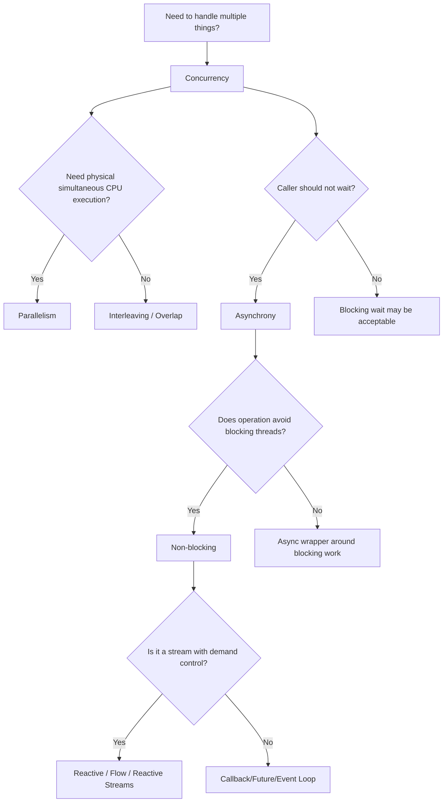
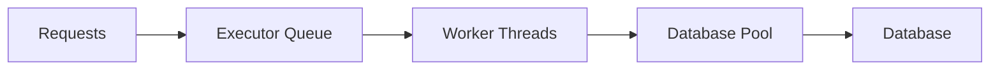

------
title: Learn Java Concurrency & Correctness - Part 002
description: Perbedaan concurrency, parallelism, asynchrony, non-blocking, reactive, throughput, latency, utilization, dan bagaimana memilih model eksekusi yang tepat di Java.
series: learn-java-concurrency-correctness
seriesTitle: Learn Java Concurrency & Correctness
order: 2
partTitle: Concurrency vs Parallelism vs Asynchrony
tags:
- java
- concurrency
- parallelism
- async
- reactive
date: 2026-06-28
---

# Part 002 — Concurrency vs Parallelism vs Asynchrony

> Banyak bug arsitektur muncul bukan karena engineer tidak tahu API, tetapi karena salah mengklasifikasikan masalah. Problem IO-bound diperlakukan seperti CPU-bound. Problem backpressure diperlakukan seperti thread pool sizing. Problem correctness diperlakukan seperti performance optimization.

Part ini membangun vocabulary operasional:

- **concurrency**: mengelola banyak pekerjaan yang overlap;
- **parallelism**: menjalankan banyak pekerjaan secara fisik pada saat yang sama;
- **asynchrony**: tidak menunggu hasil secara blocking di call site;
- **non-blocking**: progress tidak bergantung pada thread yang tertahan menunggu resource;
- **reactive**: asynchronous stream processing dengan backpressure protocol;
- **throughput**: jumlah pekerjaan selesai per unit waktu;
- **latency**: waktu yang dialami satu pekerjaan;
- **utilization**: seberapa efektif CPU/resource dipakai.

Kata-kata ini sering dicampur. Dalam sistem production, campur aduk istilah menghasilkan desain yang sulit dituning dan sulit dipertanggungjawabkan.

---

## 1. Core Distinction

### 1.1 Concurrency

Concurrency berarti sistem mampu menangani beberapa pekerjaan dalam periode waktu yang tumpang tindih.

Contoh:

- server menerima banyak request;
- batch job memproses banyak case;
- workflow menunggu beberapa dependency;
- event consumer menangani stream message;
- UI/backend tidak membeku saat operasi lambat.

Concurrency adalah tentang **struktur pekerjaan**.

Pertanyaan concurrency:

- Apa unit of work?
- Apakah task independent?
- Apakah ada shared state?
- Bagaimana lifecycle task dikelola?
- Apa yang terjadi jika satu task gagal?
- Bagaimana task dibatasi agar sistem tidak overload?

### 1.2 Parallelism

Parallelism berarti beberapa pekerjaan benar-benar berjalan secara bersamaan, biasanya pada beberapa CPU core.

Contoh:

- memproses 10 juta record dengan fork-join;
- menghitung risk score untuk banyak entity;
- image/video processing;
- compression;
- CPU-heavy rule evaluation;
- parallel sorting atau aggregation.

Parallelism adalah tentang **eksekusi fisik**.

Pertanyaan parallelism:

- Apakah workload CPU-bound?
- Berapa jumlah core efektif?
- Apakah task cukup besar untuk mengalahkan overhead scheduling?
- Apakah data bisa dipartisi tanpa banyak coordination?
- Apakah ada false sharing atau memory bandwidth bottleneck?

### 1.3 Asynchrony

Asynchrony berarti caller tidak harus menunggu hasil secara blocking pada call stack saat ini.

Contoh:

```java
CompletableFuture<Decision> decisionFuture = policyClient.evaluateAsync(caseFile);
```

Asynchrony adalah tentang **cara mengekspresikan waiting**.

Pertanyaan async:

- Di mana callback/continuation dijalankan?
- Executor mana yang dipakai?
- Bagaimana exception mengalir?
- Bagaimana timeout dan cancellation bekerja?
- Bagaimana context seperti request id/MDC/security principal ikut terbawa?

### 1.4 Non-Blocking

Non-blocking berarti thread tidak tertahan menunggu operasi selesai. Operasi biasanya mendaftarkan minat, lalu runtime/event loop memberi callback saat siap.

Contoh:

- non-blocking socket;
- selector/event loop;
- async HTTP client;
- reactive pipeline.

Namun hati-hati:

> Async API tidak selalu non-blocking. Non-blocking API hampir selalu asynchronous, tetapi async API bisa saja hanya memindahkan blocking call ke thread lain.

Contoh async tetapi tetap blocking secara fisik:

```java
CompletableFuture.supplyAsync(() -> blockingJdbcCall(), executor);
```

Call site tidak blocking, tetapi worker thread tetap blocked.

### 1.5 Reactive

Reactive programming dalam konteks Java modern biasanya berarti stream asynchronous dengan backpressure. `java.util.concurrent.Flow` menyediakan interface yang berkaitan dengan Reactive Streams specification: `Publisher`, `Subscriber`, `Subscription`, dan `Processor`.

Reactive adalah tentang **data flow + asynchronous boundary + demand control**.

Pertanyaan reactive:

- Siapa producer?
- Siapa consumer?
- Bagaimana demand dinyatakan?
- Apa yang terjadi jika consumer lambat?
- Di scheduler mana operator berjalan?
- Apakah stream cold atau hot?
- Apakah ordering penting?

---

## 2. Visual Taxonomy



---

## 3. Why the Difference Matters

Misclassification causes concrete failures.

### 3.1 Treating IO-Bound Work as CPU-Bound

Bad assumption:

> “We have 8 cores, so the pool should have 8 threads.”

This can be correct for CPU-bound work, but disastrous for blocking IO.

If each task spends most time waiting for database/network, only 8 threads may underutilize the service. Historically, engineers increased thread pools for blocking IO. With virtual threads, Java offers another model: use many lightweight threads for blocking-style code, while still bounding real resources such as DB connections and outbound rate limits.

### 3.2 Treating CPU-Bound Work as IO-Bound

Bad assumption:

> “Virtual threads are cheap, so let’s start 100,000 CPU-heavy tasks.”

Virtual threads reduce the cost of waiting, not the cost of CPU work. CPU-bound work is limited by cores, cache, memory bandwidth, and algorithmic overhead. Too many runnable CPU tasks can increase scheduling overhead and hurt latency.

### 3.3 Treating Backpressure as a Thread Count Problem

Bad assumption:

> “Consumers are slow, add more threads.”

If the downstream system is the bottleneck, adding more threads increases pressure. Correct answer may be:

- bounded queue;
- demand protocol;
- rate limiting;
- load shedding;
- batching;
- caching;
- reducing upstream production;
- isolating tenants.

### 3.4 Treating Correctness as Performance

Bad assumption:

> “This race is rare, and lock makes it slower.”

If invariant matters, performance optimization cannot justify incorrectness. First make invariant correct. Then optimize the critical section, change ownership, reduce contention, or partition state.

---

## 4. Workload Classification

Sebelum memilih model, klasifikasikan workload.

| Workload Type | Dominant Wait | Good Fit | Bad Fit |
|---|---|---|---|
| CPU-bound | CPU cycles | ForkJoin, bounded CPU pool, parallel algorithm | Huge virtual-thread fan-out without CPU bound |
| Blocking IO-bound | Network/DB/file wait | Virtual threads, bounded resource limit, sometimes classic pool | Small fixed CPU-sized pool |
| Non-blocking IO | Event readiness | Event loop, async client, reactive | Blocking inside event loop |
| Stream processing | Producer/consumer rate mismatch | Reactive/backpressure, bounded queue | Unbounded queue, uncontrolled `subscribe` |
| Shared-state mutation | Invariant protection | Lock, atomic, confinement, transaction | Blind parallel writes |
| Coordination-heavy | Waiting for condition/group | Synchronizers, structured concurrency | Manual sleep/poll loops |
| Latency-sensitive fan-out | Multiple remote calls | Structured concurrency, `CompletableFuture`, deadlines | Sequential calls without reason |
| Batch throughput | Large partitionable data | Parallelism, chunking, work stealing | Per-record thread creation without batching |

---

## 5. Java Execution Models

Java gives multiple ways to execute concurrent work. Each has a different failure profile.

### 5.1 Platform Threads

Platform threads are traditional Java threads backed by operating-system threads. They are powerful and general, but relatively expensive compared with virtual threads.

Use them when:

- you need long-lived threads;
- you run CPU-bound loops;
- you integrate with code that expects dedicated thread behavior;
- you build infrastructure such as event loops or schedulers.

Risks:

- too many threads consume memory;
- context switching overhead;
- blocked thread count can cap scalability;
- lifecycle can become unmanaged.

### 5.2 Thread Pools / ExecutorService

`ExecutorService` decouples task submission from thread management.

Classic pattern:

```java
ExecutorService executor = Executors.newFixedThreadPool(16);

Future<Decision> future = executor.submit(() -> evaluatePolicy(caseFile));

try {
    Decision decision = future.get(500, TimeUnit.MILLISECONDS);
} finally {
    executor.shutdown();
}
```

Use when:

- task volume must be bounded;
- workload needs isolation;
- CPU-bound task count should match hardware;
- legacy blocking workload needs controlled concurrency.

Risks:

- unbounded queue hides overload;
- wrong pool size creates latency or underutilization;
- blocking inside shared pool causes starvation;
- shutdown often forgotten;
- `Future.cancel(true)` depends on interruption cooperation.

### 5.3 ForkJoinPool

Fork-join is designed for recursive decomposition and work stealing.

Use when:

- workload is CPU-bound;
- tasks can be split recursively;
- tasks are mostly non-blocking;
- work units are enough to amortize overhead.

Risks:

- blocking calls inside fork-join can starve worker threads;
- using common pool accidentally via parallel streams or `CompletableFuture` can create interference;
- too fine-grained tasks increase overhead.

### 5.4 CompletableFuture

`CompletableFuture` expresses async composition.

Example:

```java
CompletableFuture<PolicyDecision> policy =
    CompletableFuture.supplyAsync(() -> policyClient.evaluate(caseFile), ioExecutor);

CompletableFuture<RiskScore> risk =
    CompletableFuture.supplyAsync(() -> riskClient.score(caseFile), ioExecutor);

CompletableFuture<CaseDecision> decision =
    policy.thenCombine(risk, CaseDecision::from);
```

Use when:

- tasks are independent and results must be composed;
- call site should not block;
- fan-out/fan-in is manageable;
- error handling can be expressed as pipeline.

Risks:

- default executor surprises;
- exception handling becomes fragmented;
- cancellation semantics are limited;
- context propagation is easy to lose;
- nested futures create unreadable control flow.

### 5.5 Virtual Threads

Virtual threads are `java.lang.Thread` instances that are not tied one-to-one to OS threads. They are designed to make high-throughput concurrent applications easier to write, maintain, and debug when tasks spend much time blocked waiting for IO.

Example:

```java
try (var executor = Executors.newVirtualThreadPerTaskExecutor()) {
    Future<Decision> decision = executor.submit(() -> policyClient.evaluate(caseFile));
    return decision.get();
}
```

Use when:

- workload is blocking IO-bound;
- code is naturally sequential;
- you want thread-per-task clarity;
- many concurrent operations wait on network/database/file operations;
- stack traces and debugging clarity matter.

Risks:

- virtual threads do not create more database connections;
- CPU-bound fan-out still needs bounding;
- native calls or monitor pinning can matter in some cases;
- uncontrolled request fan-out can overload downstream systems;
- `ThreadLocal` usage may become expensive or semantically confusing at massive scale.

### 5.6 Structured Concurrency

Structured concurrency treats related concurrent subtasks as one unit of work. It makes lifetime, cancellation, error propagation, and observability easier to reason about.

Conceptually:

```java
// Pseudocode-style sketch. Exact API depends on JDK preview version.
try (var scope = StructuredTaskScope.open()) {
    var policy = scope.fork(() -> policyClient.evaluate(caseFile));
    var risk = scope.fork(() -> riskClient.score(caseFile));

    scope.join();

    return combine(policy.get(), risk.get());
}
```

Use when:

- one request forks multiple subtasks;
- subtasks should not outlive the parent;
- failure of one subtask should affect siblings;
- deadline/cancellation semantics matter;
- observability should show task hierarchy.

Risks:

- still preview in JDK 25;
- API changes must be tracked;
- not a replacement for resource bounding;
- not a distributed transaction mechanism.

### 5.7 Reactive / Flow / Event Loop

Reactive fits stream processing where demand and asynchronous boundaries matter.

Use when:

- producer may outpace consumer;
- non-blocking IO stack is already in place;
- data arrives over time;
- backpressure is first-class;
- transformations compose as stream pipeline.

Risks:

- blocking inside event loop breaks the model;
- debugging stack traces is harder;
- scheduler boundaries can be misunderstood;
- simple request/response IO may become overcomplicated;
- backpressure does not solve all overload by itself.

---

## 6. Concurrency is Not Automatically Faster

Consider a CPU-bound function:

```java
long score(CaseFile file) {
    long result = 0;
    for (Rule rule : rules) {
        result += expensiveEvaluate(rule, file);
    }
    return result;
}
```

Parallelism may help if:

- each rule evaluation is expensive enough;
- rules are independent;
- result combination is cheap;
- data locality is acceptable;
- no shared mutable state causes contention.

Parallelism may hurt if:

- work units are tiny;
- each task allocates heavily;
- result aggregation is synchronized;
- rules access the same contended cache lines;
- CPU is already saturated by other workloads.

A rough decision rule:

```text
Parallelism helps when:
  useful_work_per_task >> scheduling_overhead + coordination_overhead + memory_overhead
```

This is why blindly using `parallelStream()` often disappoints.

---

## 7. Blocking vs Non-Blocking

Blocking is not morally bad. Blocking can be simple, correct, and efficient enough, especially with virtual threads.

Bad blocking means:

- blocking event-loop thread;
- blocking fork-join worker without compensation;
- blocking a small shared pool;
- blocking while holding a critical lock;
- blocking without timeout;
- blocking during shutdown without cancellation path.

Good blocking means:

- blocking in a virtual thread for IO;
- blocking with timeout/deadline;
- blocking without holding unrelated locks;
- blocking behind a bounded resource limit;
- blocking with interruption handling;
- blocking in a model that remains observable.

### 7.1 Example: Acceptable Blocking with Virtual Threads

```java
class CaseDecisionService {
    private final PolicyClient policyClient;
    private final RiskClient riskClient;
    private final Semaphore outboundLimit = new Semaphore(100);

    Decision decide(CaseFile caseFile) throws Exception {
        outboundLimit.acquire();
        try {
            PolicyDecision policy = policyClient.evaluate(caseFile); // blocking IO
            RiskScore risk = riskClient.score(caseFile);             // blocking IO
            return Decision.combine(policy, risk);
        } finally {
            outboundLimit.release();
        }
    }
}
```

This code can run well in virtual threads if the clients are blocking IO and the semaphore protects downstream capacity.

### 7.2 Example: Dangerous Blocking in Event Loop

```java
Mono<Decision> decide(CaseFile caseFile) {
    return Mono.fromCallable(() -> jdbcRepository.load(caseFile.id()))
        .map(this::evaluate);
}
```

This is dangerous if executed on an event-loop scheduler and `jdbcRepository.load` blocks. The reactive wrapper does not magically make JDBC non-blocking. It must be moved to an appropriate bounded scheduler or replaced with a non-blocking driver where that architecture is justified.

---

## 8. Throughput, Latency, and Utilization

Concurrency discussions often collapse three different metrics.

### 8.1 Throughput

Throughput is completed work per unit time.

Example:

```text
2,000 case evaluations / second
```

Higher throughput can come from:

- more concurrency;
- less blocking;
- batching;
- caching;
- faster algorithm;
- fewer allocations;
- better resource utilization;
- reduced coordination.

### 8.2 Latency

Latency is time experienced by one unit of work.

Example:

```text
p50 = 40 ms
p95 = 180 ms
p99 = 900 ms
```

Concurrency can improve or worsen latency.

It improves latency if independent waits overlap:

```text
Sequential remote calls:
  policy 100ms + risk 120ms + history 80ms = ~300ms

Concurrent fan-out:
  max(100ms, 120ms, 80ms) + overhead = ~120ms+
```

It worsens latency if:

- queues grow;
- lock contention grows;
- CPU is oversubscribed;
- downstream dependencies are overloaded;
- GC pressure increases;
- retries amplify load.

### 8.3 Utilization

Utilization measures resource usage.

High CPU utilization can be good for batch compute but bad for latency-sensitive APIs. High thread count can be acceptable with virtual threads but suspicious with platform threads. High queue length is often a sign of overload, not productivity.

Important distinction:

```text
Busy does not mean healthy.
Queued does not mean progressing.
Concurrent does not mean parallel.
Async does not mean non-blocking.
Non-blocking does not mean backpressured.
```

---

## 9. Fan-Out/Fan-In: Sequential vs Concurrent

A common service pattern:

```java
Decision decide(CaseFile file) {
    PolicyDecision policy = policyClient.evaluate(file);
    RiskScore risk = riskClient.score(file);
    CaseHistory history = historyClient.load(file.id());

    return combine(policy, risk, history);
}
```

If the three calls are independent, sequential execution wastes time.

### 9.1 CompletableFuture Version

```java
Decision decide(CaseFile file) {
    CompletableFuture<PolicyDecision> policy = CompletableFuture.supplyAsync(
        () -> policyClient.evaluate(file),
        ioExecutor
    );

    CompletableFuture<RiskScore> risk = CompletableFuture.supplyAsync(
        () -> riskClient.score(file),
        ioExecutor
    );

    CompletableFuture<CaseHistory> history = CompletableFuture.supplyAsync(
        () -> historyClient.load(file.id()),
        ioExecutor
    );

    return policy.thenCombine(risk, PartialDecision::new)
        .thenCombine(history, Decision::from)
        .orTimeout(500, TimeUnit.MILLISECONDS)
        .join();
}
```

This overlaps calls but introduces questions:

- Is `ioExecutor` bounded?
- What happens if `policy` fails quickly?
- Are sibling tasks cancelled?
- Does `orTimeout` stop physical work or only complete the future exceptionally?
- Does context propagate?
- What does `join()` do to exception semantics?

### 9.2 Virtual Thread Style

```java
Decision decide(CaseFile file) throws Exception {
    try (var executor = Executors.newVirtualThreadPerTaskExecutor()) {
        Future<PolicyDecision> policy = executor.submit(() -> policyClient.evaluate(file));
        Future<RiskScore> risk = executor.submit(() -> riskClient.score(file));
        Future<CaseHistory> history = executor.submit(() -> historyClient.load(file.id()));

        return Decision.from(policy.get(), risk.get(), history.get());
    }
}
```

This is easier to read, but still incomplete:

- no explicit deadline;
- sibling cancellation semantics depend on scope shutdown and task behavior;
- downstream resources still need limits;
- error semantics must be specified.

### 9.3 Structured Concurrency Direction

Structured concurrency is conceptually stronger because it models the group as one unit of work. That is closer to the real domain:

```text
Decision request
  ├── policy evaluation
  ├── risk scoring
  └── history lookup
```

The parent should own child lifetime. If the parent times out or fails, children should not keep running invisibly.

---

## 10. Queueing: The Hidden Enemy

Most concurrency systems fail gradually through queues.

A queue is not bad. A hidden unbounded queue is bad.



If database is slow, worker threads wait. If worker threads are occupied, executor queue grows. If queue is unbounded, memory grows and latency explodes. The system may accept work long after it has no realistic chance of completing within SLA.

A production-grade design asks:

- where can work queue?
- what is the maximum queue size?
- what is the rejection behavior?
- is rejection fast and explicit?
- are deadlines checked before starting expensive work?
- do metrics expose queue depth and wait time?

### 10.1 Little’s Law Intuition

A useful operational intuition:

```text
Concurrency ≈ Throughput × Latency
```

If a service handles 1,000 requests/sec and each request takes 200ms on average, approximate in-flight concurrency is:

```text
1000 × 0.2 = 200 in-flight requests
```

If latency rises to 2 seconds under downstream slowness:

```text
1000 × 2 = 2,000 in-flight requests
```

This is why latency spikes can multiply concurrency demand and trigger cascading failure.

---

## 11. Decision Matrix

| Problem Shape | Preferred Starting Model | Why |
|---|---|---|
| One request performs several blocking remote calls | Virtual threads or structured concurrency | Keeps code direct; overlaps IO; easier stack traces |
| One request performs several async client calls already returning futures | `CompletableFuture` composition | Natural fit if async client is real and executor explicit |
| Long stream with producer faster than consumer | Reactive streams or bounded queue | Backpressure/demand must be explicit |
| CPU-heavy independent computation | ForkJoin/bounded CPU pool | Parallelism limited by cores |
| Shared mutable aggregate invariant | Lock or single-writer ownership | Compound invariant needs atomic boundary |
| High-frequency independent counters | `LongAdder`/atomic family | Avoid coarse lock if exact immediate value not required |
| UI-like callback orchestration | Async/event-loop | Avoid blocking UI/event loop |
| Batch job with partitionable chunks | Chunked executor/fork-join | Throughput with bounded memory |
| Per-tenant workload isolation | Bulkhead executors/semaphores | Prevent noisy neighbor failure |
| Request-scoped context passing | Scoped values / explicit context | Avoid uncontrolled ThreadLocal leakage |

---

## 12. Anti-Patterns

### 12.1 “Make It Async” as a Performance Plan

Async is not a performance plan. It is a control-flow model.

Bad:

```java
CompletableFuture<Void> f = CompletableFuture.runAsync(() -> slowBlockingCall());
```

This may simply move the wait to another thread.

Ask instead:

- what resource is bottlenecked?
- what blocks?
- what is bounded?
- what is the cancellation behavior?
- what is the latency target?

### 12.2 One Global Executor

Bad:

```java
static final ExecutorService EXECUTOR = Executors.newCachedThreadPool();
```

Problems:

- no workload isolation;
- unbounded thread growth;
- no ownership;
- hard shutdown;
- noisy neighbor risk;
- metrics lack meaning.

Better:

- separate CPU-bound and IO-bound work;
- name thread factories;
- define queue size;
- define rejection policy;
- expose metrics;
- shut down with lifecycle owner.

### 12.3 Parallel Stream for Side Effects

Bad:

```java
cases.parallelStream().forEach(caseFile -> {
    repository.update(caseFile);
    audit.write(caseFile.id());
});
```

Risks:

- common pool interference;
- uncontrolled DB pressure;
- side-effect ordering unclear;
- exception behavior surprising;
- transaction boundary unclear.

Parallel streams are best for pure-ish CPU/data transformations, not arbitrary side-effect orchestration.

### 12.4 Unbounded Queue as “Reliability”

Bad assumption:

> “If we queue everything, we lose nothing.”

Reality:

- memory can grow until OOM;
- latency can exceed business deadline;
- retries can become stale;
- work accepted now may be useless later;
- system fails later and harder.

A bounded queue plus explicit rejection is often more reliable.

### 12.5 Blocking While Holding Lock

Bad:

```java
synchronized (caseFile) {
    caseFile.markValidating();
    Decision decision = remotePolicyClient.evaluate(caseFile); // blocking remote call
    caseFile.apply(decision);
}
```

This serializes all access to `caseFile` while waiting for remote IO. Worse, if the remote call indirectly needs something blocked by this lock, deadlock-like failure can emerge.

Better:

- snapshot under lock;
- release lock;
- perform remote call;
- reacquire lock;
- validate version/state;
- apply result if still valid.

---

## 13. Case Study: Escalation Dashboard

Suppose we need dashboard counts:

- total open cases;
- cases pending supervisor review;
- cases breaching SLA within 24 hours;
- cases grouped by region.

### Option A — Sequential Query

Good when:

- data size small;
- DB can aggregate efficiently;
- dashboard latency acceptable;
- correctness depends on one consistent snapshot.

### Option B — Parallel DB Queries

Potentially good when:

- queries independent;
- DB has capacity;
- latency matters;
- connection pool is sized appropriately.

Risk:

- increasing parallel queries can overload DB;
- result snapshots may not be consistent;
- partial failure semantics needed.

### Option C — Reactive Streaming

Potentially good when:

- result stream is large;
- consumer may process gradually;
- backpressure matters;
- non-blocking database driver is used;
- live update pipeline exists.

Risk:

- unnecessary complexity for simple dashboard;
- blocking driver ruins non-blocking model;
- transaction/snapshot consistency harder.

### Option D — Precomputed Read Model

Potentially good when:

- dashboard is high traffic;
- exact real-time consistency not required;
- event stream already updates counters;
- query latency must be low.

Risk:

- eventual consistency;
- reconciliation needed;
- duplicate/missing events must be handled.

Concurrency decision is not just code style. It is a product, data, and operational decision.

---

## 14. Context: Why Modern Java Changes the Trade-Off

Before virtual threads, Java backend systems often faced a trade-off:

- thread-per-request was simple but expensive at high concurrency;
- async/reactive was scalable but harder to read/debug;
- large thread pools could work but needed careful tuning.

Virtual threads change that trade-off for blocking IO workloads. They make thread-per-task practical at much higher concurrency while preserving direct style code.

However, they do not eliminate:

- correctness problems;
- database limits;
- remote API limits;
- CPU limits;
- memory limits;
- deadline/cancellation design;
- backpressure;
- observability needs.

Reactive still matters when:

- you need protocol-level backpressure;
- event-loop stack is already central;
- data is naturally streaming;
- non-blocking IO and high fan-in/fan-out are core;
- libraries and team maturity support it.

The modern engineer should not be ideological. Use the model that matches problem shape.

---

## 15. Practical Selection Algorithm

Use this before designing concurrency.

```text
1. Is the operation required to be concurrent?
   - If no, keep sequential.

2. Is the main goal latency reduction by overlapping independent waits?
   - Consider virtual threads, structured concurrency, or CompletableFuture.

3. Is the main goal CPU throughput?
   - Consider bounded CPU pool, fork-join, or data-parallel algorithm.

4. Is the main challenge producer/consumer speed mismatch?
   - Consider bounded queues, reactive streams, or explicit rate control.

5. Is shared mutable state involved?
   - First remove sharing if possible.
   - Otherwise protect invariant with lock/atomic/ownership/transaction.

6. Is the work request-scoped?
   - Prefer structured lifetime.
   - Avoid orphan tasks.

7. Can downstream dependencies be overloaded?
   - Add resource bounds independent of thread model.

8. What happens on timeout, cancellation, failure, and shutdown?
   - Define before writing code.

9. How will this be observed in production?
   - Add metrics/logging/tracing/thread naming.
```

---

## 16. MDX Drill: Rewrite the Problem Statement

Bad problem statement:

```text
We need to make case processing async.
```

Better:

```text
We need to reduce p95 latency of case processing from 800ms to under 300ms by overlapping three independent blocking remote calls. Each request must have a 500ms deadline. If policy evaluation fails, the whole decision fails and sibling calls should be cancelled. Outbound calls to the risk service must be limited to 100 in-flight requests globally. Audit writes must remain synchronous with the final state transition.
```

This better version reveals the design:

- latency goal;
- independent fan-out;
- blocking IO;
- deadline;
- failure policy;
- cancellation;
- downstream limit;
- audit invariant.

Now we can discuss virtual threads, structured concurrency, semaphores, and transaction boundaries intelligently.

---

## 17. Checklist Setelah Part Ini

Anda siap lanjut jika bisa menjawab:

- Apakah concurrency selalu berarti parallelism?
- Apakah async selalu berarti non-blocking?
- Kapan virtual threads lebih sederhana daripada reactive?
- Kapan reactive tetap lebih tepat daripada virtual threads?
- Kenapa CPU-bound workload harus dibatasi berdasarkan core?
- Kenapa IO-bound workload harus dibatasi berdasarkan downstream resource, bukan hanya thread?
- Kenapa queue depth adalah sinyal penting?
- Kenapa throughput tinggi bisa bersamaan dengan latency buruk?
- Bagaimana menulis problem statement concurrency yang cukup jelas?

---

## 18. Latihan Mandiri

Ambil satu fitur nyata, lalu isi:

```text
Feature:
Current execution model:
Problem type:
- [ ] correctness
- [ ] latency
- [ ] throughput
- [ ] resource isolation
- [ ] backpressure
- [ ] cancellation
- [ ] observability

Workload:
- [ ] CPU-bound
- [ ] blocking IO-bound
- [ ] non-blocking IO
- [ ] streaming
- [ ] shared-state mutation
- [ ] coordination-heavy

Potential model:
- [ ] sequential
- [ ] platform thread pool
- [ ] virtual thread per task
- [ ] CompletableFuture
- [ ] structured concurrency
- [ ] fork-join
- [ ] reactive stream
- [ ] queue/worker

Safety invariant:
Liveness requirement:
Timeout/deadline:
Resource bound:
Failure behavior:
Observability:
```

Tujuan latihan ini adalah memaksa Anda memilih model berdasarkan problem, bukan trend.

---

## 19. Referensi

- Java Language Specification, Chapter 17: Threads and Locks — https://docs.oracle.com/javase/specs/jls/se8/html/jls-17.html
- OpenJDK JEP 444: Virtual Threads — https://openjdk.org/jeps/444
- Java SE 25 `Thread` API — https://docs.oracle.com/en/java/javase/25/docs/api/java.base/java/lang/Thread.html
- OpenJDK JEP 505: Structured Concurrency — https://openjdk.org/jeps/505
- Java SE `Flow` API — https://docs.oracle.com/en/java/javase/11/docs/api/java.base/java/util/concurrent/Flow.html
- Reactive Streams — https://www.reactive-streams.org/

---

## Penutup

Part ini memberi vocabulary untuk memilih model eksekusi. Part berikutnya akan masuk ke correctness-first mental model: safety, liveness, progress, determinism, invariants, dan linearizability. Tanpa fondasi itu, concurrency hanya menjadi optimasi yang rapuh.
