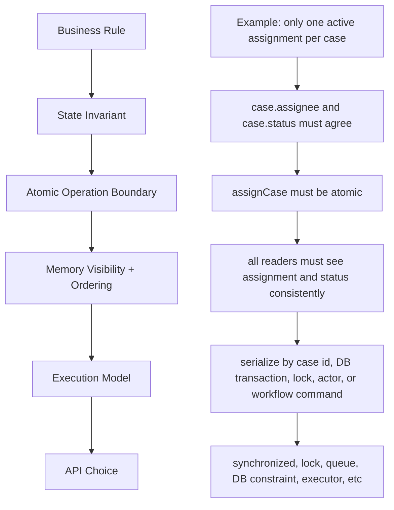
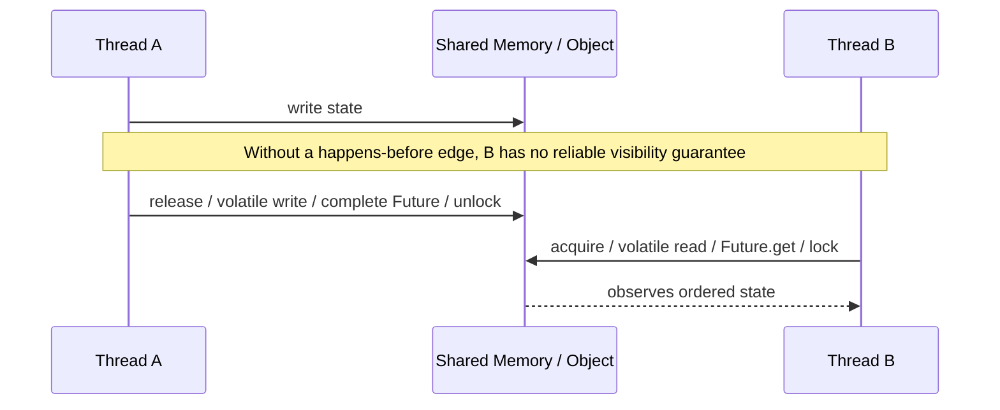
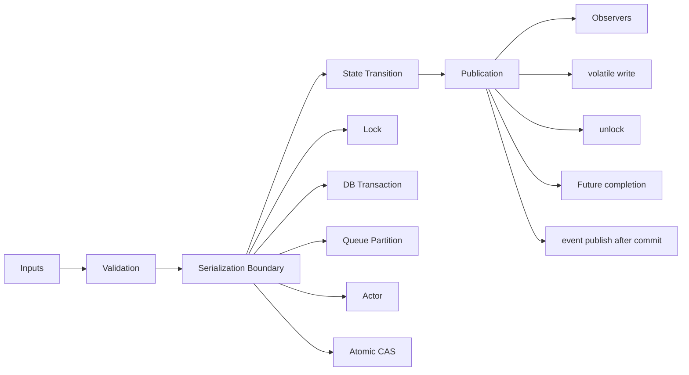
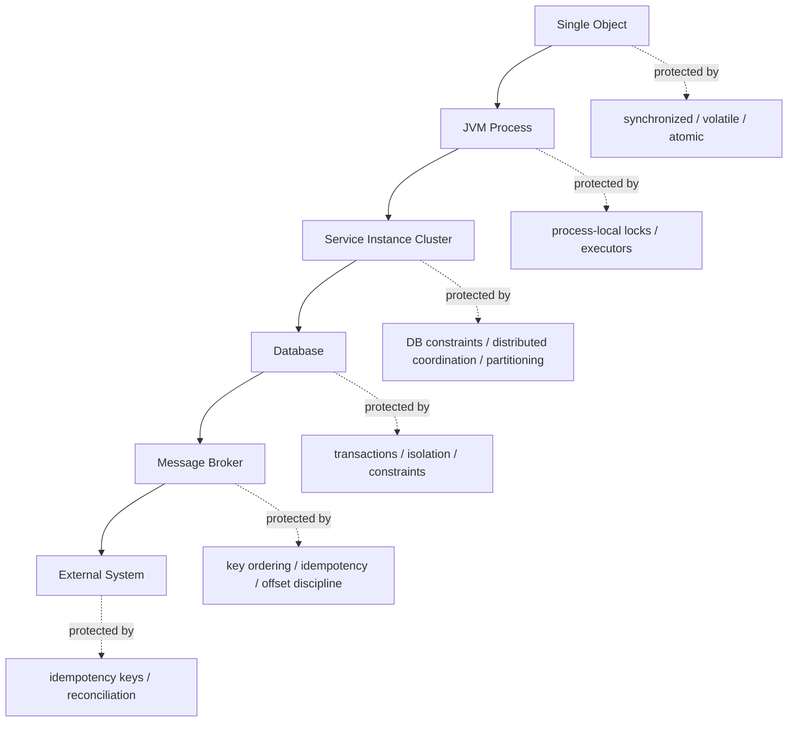

------
title: Learn Java Concurrency & Correctness - Part 003
description: Correctness-first mental model for Java concurrency: safety, liveness, invariants, linearizability, determinism, and failure-oriented reasoning before choosing APIs.
series: learn-java-concurrency-correctness
seriesTitle: Learn Java Concurrency & Correctness
order: 3
partTitle: Correctness First Mental Model
tags:
- java
- concurrency
- correctness
- invariants
- thread-safety
- series
date: 2026-06-28
---

# Part 003 — Correctness First Mental Model

Concurrency is not primarily about making code faster. It is about preserving truth when multiple flows of execution overlap.

A top-tier Java engineer does not start a concurrency discussion with:

> Should we use `synchronized`, `ReentrantLock`, `CompletableFuture`, Reactor, or virtual threads?

They start with:

> What must remain true while work overlaps, fails, waits, retries, times out, and is observed by other threads?

That question is the core of this part.

Concurrency APIs are implementation tools. Correctness is the design target.

References for this part:

- Java Language Specification, Chapter 17: Threads and Locks — https://docs.oracle.com/javase/specs/jls/se8/html/jls-17.html
- Java `Thread` API — https://docs.oracle.com/javase/8/docs/api/java/lang/Thread.html
- JEP 444: Virtual Threads — https://openjdk.org/jeps/444

---

## 1. Kaufman Frame: Deconstruct the Skill

Using Josh Kaufman's approach, we deconstruct “being good at Java concurrency” into smaller sub-skills.

For correctness, the sub-skills are:

1. identify shared mutable state;
2. state the invariant that must not be broken;
3. identify operations that must appear atomic;
4. identify who may observe intermediate state;
5. identify ordering and visibility requirements;
6. identify liveness expectations;
7. identify cancellation and timeout behavior;
8. identify what happens under partial failure;
9. choose the simplest execution model that preserves the above;
10. test and observe the design under stress.

This is different from memorizing APIs. API knowledge answers “what can I call?” Correctness knowledge answers “what must be impossible?”

---

## 2. The Most Important Question

For every concurrent design, ask:

> What are the impossible states?

Examples:

- An account balance must never go below zero unless an overdraft rule explicitly allows it.
- A case must not be both `CLOSED` and `AWAITING_REVIEW`.
- A task must not be marked `COMPLETED` before all mandatory subtasks finish.
- A payment must not be captured twice for the same authorization.
- A queue consumer must not acknowledge work before durable processing succeeds.
- A request context must not leak from user A into user B's execution.

Those are not implementation details. They are correctness boundaries.

A concurrent bug is usually one of these:

1. a state became possible that should have been impossible;
2. an expected state transition did not happen;
3. an observer saw a state that should not have been visible;
4. two operations overlapped even though the business rule required serialization;
5. an operation was retried/cancelled/timed out without preserving its invariant;
6. the system technically kept running but made no useful progress.

---

## 3. Correctness Vocabulary

Before we discuss Java APIs deeply, we need precise words.

### 3.1 Safety

Safety means: **nothing bad happens**.

A safety violation corrupts state or exposes an impossible state.

Examples:

```java
class Counter {
    private int value;

    void increment() {
        value++; // read-modify-write, not atomic
    }

    int value() {
        return value;
    }
}
```

If two threads call `increment()` concurrently, one update can be lost. The safety invariant “every successful increment contributes exactly one to the counter” can be violated.

Safety bugs are often silent. No exception is thrown. Logs may look normal. The data is just wrong.

### 3.2 Liveness

Liveness means: **something good eventually happens**.

Examples of liveness failures:

- thread A waits forever for thread B;
- all worker threads are blocked waiting for tasks that are queued behind them;
- a retry loop never exits;
- a lock is never released because cleanup code did not run;
- a thread pool accepts work but never has capacity to execute it;
- a reactive stream never requests more elements, so upstream never emits.

Safety protects truth. Liveness protects progress.

### 3.3 Progress

Progress is the shape of liveness under contention.

Common progress categories:

| Category | Meaning | Practical implication |
|---|---|---|
| Blocking | A thread may wait for another thread to make progress | Simple, common, but can deadlock or saturate pools |
| Lock-free | At least one thread makes progress system-wide | Good under some contention, harder to reason about |
| Wait-free | Every thread completes in bounded steps | Rare in general application code |
| Obstruction-free | One thread progresses if eventually run in isolation | Usually too weak as an application-level guarantee |

Most enterprise Java code is blocking or semi-blocking. That is acceptable if bounded and observable.

### 3.4 Determinism

A deterministic operation gives the same result for the same logical inputs.

Concurrency introduces scheduling nondeterminism. The scheduler can interleave operations differently across runs.

A correct concurrent program does not require a specific lucky interleaving.

Bad design:

```java
if (!cache.containsKey(key)) {
    cache.put(key, load(key));
}
```

This looks deterministic in single-threaded execution. Under concurrency, multiple threads can load and put the same key. Whether that is a bug depends on the invariant:

- If duplicate load is harmless but inefficient, the issue is performance.
- If duplicate load causes duplicate side effects, the issue is correctness.
- If later puts overwrite earlier values from different versions, the issue is stale state.

### 3.5 Linearizability

Linearizability means each operation appears to take effect at one instant between its call and return.

For a counter:

```text
Thread A calls increment()
Thread B calls value()
Thread A returns from increment()
```

If `value()` observes a value that cannot be explained by any valid order of completed operations, the object is not linearizable.

Linearizability is a strong correctness model for individual concurrent objects. You do not always need it for whole distributed workflows, but you often need it inside shared in-memory components.

### 3.6 Serializability

Serializability means the result of concurrent operations is equivalent to some serial order.

It is broader than linearizability and common in transaction thinking. A database transaction may be serializable without each individual memory operation being linearizable at the Java object level.

Do not confuse:

- Java object concurrency correctness;
- database transaction isolation;
- distributed workflow correctness;
- message ordering;
- idempotency.

They interact, but they are not the same layer.

### 3.7 Visibility

Visibility means a write by one thread can be seen by another thread.

In Java, visibility is governed by the Java Memory Model. Without a happens-before relationship, one thread is not guaranteed to observe another thread's write in the way intuition expects.

A classic visibility bug:

```java
class StopFlag {
    private boolean stopped;

    void stop() {
        stopped = true;
    }

    void runLoop() {
        while (!stopped) {
            doWork();
        }
    }
}
```

One thread calls `stop()`. Another thread runs `runLoop()`. Without `volatile`, synchronization, or another happens-before edge, the running thread may not observe the update promptly or reliably.

Correctness is not just “no two threads write at the same time.” It is also “threads observe the writes they are supposed to observe.”

### 3.8 Ordering

Ordering means operations are perceived in a constrained sequence.

Humans read code top to bottom. CPUs, compilers, and runtimes optimize as long as single-threaded semantics are preserved. Under concurrency, those optimizations matter.

A thread may execute code in a way that is valid for itself but surprising to another thread unless the Java Memory Model provides an ordering guarantee.

This is why “it works on my machine” has little value for concurrent code.

---

## 4. The Core Correctness Model

Think of concurrent correctness as four nested boundaries.



Never reverse this order.

Bad sequence:

1. choose `CompletableFuture`;
2. add thread pool;
3. sprinkle locks;
4. hope correctness emerges.

Good sequence:

1. state the invariant;
2. define the operation boundary;
3. define observers;
4. define progress expectations;
5. choose the concurrency mechanism;
6. test failure and interleavings.

---

## 5. What Counts as Shared Mutable State?

Shared mutable state is any state that:

1. can change; and
2. can be reached by more than one thread.

This includes obvious state:

```java
private final Map<String, CaseState> cases = new HashMap<>();
```

It also includes less obvious state:

- static fields;
- singleton service fields;
- caches;
- connection/session wrappers;
- mutable DTOs reused across calls;
- request contexts stored in `ThreadLocal`;
- metrics accumulators;
- mock objects shared across tests;
- lazy initialization state;
- object graphs reachable through immutable-looking references;
- mutable collections returned from getters;
- framework-managed beans with mutable fields;
- temporal state such as “already sent,” “already scheduled,” or “currently processing.”

A value being `private` does not make it thread-safe. A reference being `final` does not make the referenced object immutable.

```java
final List<String> names = new ArrayList<>();
```

The variable `names` always points to the same list. The list contents can still change.

---

## 6. Race Condition vs Data Race

These terms are often used casually, but the distinction matters.

### Race condition

A race condition exists when correctness depends on timing or interleaving.

```java
if (!user.hasActiveSession()) {
    user.createSession();
}
```

Two threads can both observe no active session and both create one. The bug is at the logical operation level.

### Data race

A data race is a lower-level memory model concept: multiple threads access the same variable concurrently, at least one access is a write, and there is no proper synchronization/happens-before ordering.

A data race often causes a race condition, but not all race conditions are simple data races.

Example without obvious shared Java field:

```java
// Thread A
if (!repository.exists(caseId, assignmentId)) {
    repository.insert(caseId, assignmentId);
}

// Thread B does the same concurrently
```

The Java heap may be perfectly synchronized, but the database-level race still exists if no unique constraint or transaction isolation rule protects the invariant.

A top engineer asks: **which layer owns the invariant?**

---

## 7. Atomicity: The Operation Must Not Be Split

An operation is atomic when observers cannot see it partially complete.

Consider:

```java
class CaseAssignment {
    private String assignee;
    private String status;

    void assignTo(String userId) {
        assignee = userId;
        status = "ASSIGNED";
    }

    boolean isConsistent() {
        return (assignee == null && status.equals("UNASSIGNED"))
            || (assignee != null && status.equals("ASSIGNED"));
    }
}
```

If a reader sees `assignee != null` but `status == "UNASSIGNED"`, the invariant is broken from the reader's perspective.

Atomicity is not only about one variable. Most real invariants span multiple fields, rows, objects, messages, or resources.

Better design options:

1. represent both fields in one immutable value object;
2. guard both fields with the same lock;
3. update both fields inside one database transaction;
4. serialize commands through an actor/queue per aggregate id;
5. use optimistic versioning and retry;
6. enforce a database constraint;
7. move the state transition to a workflow engine if lifecycle durability matters.

The right choice depends on the boundary.

---

## 8. Visibility: The Write Must Become Observable

Atomicity answers: “Can the operation be split?”

Visibility answers: “Can another thread see the result?”

A write performed by thread A is not automatically visible to thread B in the way we want. Java gives guarantees through constructs such as:

- starting a thread;
- joining a thread;
- synchronized lock/unlock on the same monitor;
- volatile write/read of the same variable;
- final field initialization safety;
- concurrent collection guarantees;
- executor submission and task execution memory consistency effects;
- `Future.get()` after task completion;
- other documented happens-before edges.

The mental model:



Visibility bugs are difficult because they can disappear under debugging, logging, profiling, or small workloads.

---

## 9. Ordering: The Story Must Make Sense

Ordering is about which events must be seen before other events.

Example:

```java
class Holder {
    int value;
    boolean ready;
}

// Writer
holder.value = 42;
holder.ready = true;

// Reader
if (holder.ready) {
    use(holder.value);
}
```

Humans expect that if `ready` is true, `value` must be 42. Without a memory-ordering guarantee, that expectation is not safe.

This pattern appears in production as:

- `initialized` flags;
- lazy cache warmup;
- readiness flags;
- `started` / `stopped` lifecycle fields;
- config reload markers;
- background worker status;
- one-time publication of clients, parsers, mappers, or registries.

Do not use ordinary booleans as cross-thread readiness signals.

---

## 10. Invariants: The Design Center

An invariant is a fact that must remain true across all valid states.

Examples:

```text
A Case may have at most one active owner.
A Review must not start before the Submission is complete.
A balance may not become negative.
A token must not be used after revocation.
A retry must not create a second external payment capture.
A completed job must have either result or terminal error, never both.
A queue item must not be acknowledged before the durable side effect is committed.
```

Concurrency engineering is invariant engineering.

For every shared component, document:

| Question | Example answer |
|---|---|
| What is the invariant? | At most one active assignment per case |
| What operation can violate it? | Concurrent assign/reassign commands |
| What is the serialization key? | `caseId` |
| Which layer enforces it? | DB unique constraint + transaction, or per-case command queue |
| What observers exist? | API readers, event consumers, background jobs |
| Can observers see intermediate state? | No |
| What is the recovery behavior? | Retry optimistic conflict, reject stale command |

If you cannot answer this table, you are not ready to choose a concurrency primitive.

---

## 11. Example: Broken Transfer

A common teaching example is account transfer. We will use it carefully because it exposes multiple dimensions.

```java
class Account {
    private long balance;

    Account(long initialBalance) {
        this.balance = initialBalance;
    }

    long balance() {
        return balance;
    }

    void withdraw(long amount) {
        if (balance < amount) {
            throw new IllegalStateException("insufficient funds");
        }
        balance -= amount;
    }

    void deposit(long amount) {
        balance += amount;
    }
}

class TransferService {
    void transfer(Account from, Account to, long amount) {
        from.withdraw(amount);
        to.deposit(amount);
    }
}
```

Potential problems:

1. `balance += amount` and `balance -= amount` are not atomic compound operations.
2. `withdraw` check and update can be interleaved.
3. A reader may see money removed from one account before it appears in the other.
4. If `deposit` fails after `withdraw`, money disappears.
5. If two transfers lock accounts in different order, deadlock can occur.
6. If this crosses database boundaries, Java locks do not protect distributed correctness.

The invariant is not “no exception.” The invariant is:

```text
For all completed transfers, total money is conserved and no account violates its allowed balance rule.
```

A concurrent design must state whether readers may observe intermediate states. In many financial systems the answer is not simply “use a Java lock.” The correct boundary is usually a database transaction, ledger model, append-only journal, or domain-specific consistency mechanism.

The lesson: local thread safety is not automatically system correctness.

---

## 12. State Ownership Patterns

Before locking, ask whether shared mutable state can be avoided.

### 12.1 Immutable state

Immutable values are easiest to share.

```java
public record CaseSnapshot(
    String caseId,
    String status,
    String assignee,
    Instant updatedAt
) {}
```

If all fields are final and referenced objects are themselves immutable or safely treated as immutable, sharing is simple.

### 12.2 Thread confinement

State is safe if only one thread can access it.

Examples:

- local variables inside one task;
- objects created, used, and discarded within one request;
- parser instances not shared across requests;
- per-thread buffers;
- per-actor state in an actor-like design.

Confinement is often better than synchronization.

### 12.3 Ownership transfer

Ownership transfer means one actor/thread/component gives up access when another receives it.

Example:

```java
BlockingQueue<WorkItem> queue = new ArrayBlockingQueue<>(1000);

// Producer creates WorkItem and hands it off.
queue.put(new WorkItem(...));

// Consumer becomes the owner of that WorkItem.
WorkItem item = queue.take();
```

The queue provides coordination and memory visibility. The design rule is: after handoff, the producer must not mutate the item.

### 12.4 Serialization by key

Some invariants need ordering per entity, not globally.

Example:

```text
All commands for the same caseId must be processed sequentially.
Commands for different caseIds may run concurrently.
```

This is often a better model than one global lock.

Potential implementations:

- database row lock by `caseId`;
- optimistic version per aggregate;
- partitioned queue by `caseId`;
- actor per aggregate shard;
- single-threaded executor per partition;
- workflow engine command stream.

### 12.5 Shared mutable state with synchronization

When sharing is necessary, protect it deliberately.

Options:

- `synchronized`;
- `ReentrantLock`;
- concurrent collections;
- atomics;
- immutable snapshot replacement;
- database transaction;
- external lock service in limited cases;
- queue-based serialization.

The primitive is chosen after the invariant.

---

## 13. The Correctness Envelope

A component should have a declared correctness envelope.



The envelope answers:

1. Where is input validated?
2. Where are conflicting operations serialized?
3. Where does the state transition happen?
4. How is the new state safely published?
5. Who can observe it?
6. What happens if publication fails?
7. What happens if the caller times out but the operation eventually succeeds?

This is especially important for enterprise platforms where a state transition may be visible through API, database, cache, event stream, audit log, and workflow engine.

---

## 14. Safety Failure Patterns

### 14.1 Lost update

```java
value = value + 1;
```

This is read, compute, write. Two threads can read the same old value and both write the same new value.

### 14.2 Check-then-act

```java
if (!map.containsKey(key)) {
    map.put(key, createValue());
}
```

The condition can become false after the check but before the act.

### 14.3 Read-modify-write

```java
balance -= amount;
```

Same category as lost update, usually with domain consequences.

### 14.4 Unsafe publication

```java
class Registry {
    static Service service;

    static void init() {
        service = new Service();
    }
}
```

Another thread can observe the reference without a proper publication guarantee.

### 14.5 Escaped `this`

```java
class ListenerHolder {
    private final List<String> rules;

    ListenerHolder(EventBus bus) {
        bus.register(this); // this escapes before constructor finishes
        this.rules = loadRules();
    }
}
```

Another thread could call the listener before construction completes.

### 14.6 Mutable object used as key

```java
Map<RequestKey, Result> cache = new ConcurrentHashMap<>();
```

If `RequestKey` fields that affect `equals` or `hashCode` mutate after insertion, the map's logical behavior breaks even if the map is concurrent.

### 14.7 Leaky getter

```java
List<Rule> rules() {
    return rules;
}
```

Returning internal mutable collections breaks encapsulation and synchronization assumptions.

### 14.8 Split lock

```java
synchronized (lockA) {
    x++;
}

synchronized (lockB) {
    y++;
}
```

If invariant requires `x` and `y` to change together, using different locks breaks the invariant.

---

## 15. Liveness Failure Patterns

### 15.1 Deadlock

Thread A holds lock 1 and waits for lock 2. Thread B holds lock 2 and waits for lock 1.

### 15.2 Starvation

A thread is ready to run but rarely gets resources.

Examples:

- unfair lock under heavy contention;
- high-priority tasks always filling the queue;
- small thread pool dominated by long blocking operations.

### 15.3 Livelock

Threads are active but no useful progress occurs.

Example: two retrying workers keep backing off and retrying in sync, always colliding.

### 15.4 Thread pool starvation

A task waits for another task submitted to the same saturated executor.

```java
Future<Result> child = executor.submit(this::childWork);
return child.get(); // dangerous if all workers do this
```

If every worker blocks waiting for child work that cannot start, the pool stalls.

### 15.5 Unbounded queue delay

The system accepts tasks faster than it executes them. Nothing crashes immediately, but latency grows without bound.

This is a liveness and overload-control failure.

---

## 16. Correctness Is Layered

A Java lock protects memory inside one JVM. It does not protect:

- another JVM instance;
- another service;
- the database unless the DB operation is inside the same critical section and design boundary;
- a message broker;
- an external payment provider;
- a user retrying an HTTP request;
- a scheduled job running on another node.

Concurrency correctness must be assigned to the correct layer.



A common mistake is using JVM-local concurrency tools to solve distributed invariants.

Example:

```java
synchronized void approve(String caseId) {
    repository.markApproved(caseId);
}
```

This only serializes calls inside one JVM object instance. It does not serialize approvals from another application node.

---

## 17. Local Correctness vs System Correctness

Local correctness: the class behaves correctly under concurrent access within one JVM.

System correctness: the end-to-end business invariant holds across processes, databases, queues, retries, and failures.

You need both, but they use different tools.

Example: duplicate case approval.

| Layer | Failure | Possible protection |
|---|---|---|
| Java object | two threads update same in-memory state | lock, atomic, confinement |
| API service cluster | two nodes process same command | DB optimistic version, unique constraint |
| Queue consumer | duplicate message delivered | idempotency key, processed table |
| Workflow engine | concurrent signal/update | workflow engine consistency semantics |
| External system | repeated HTTP call | external idempotency key, reconciliation |

The mental model: **a lock has a jurisdiction**. Know its jurisdiction.

---

## 18. Design Matrix: Choosing a Correctness Strategy

| Problem shape | Good default strategy | Avoid |
|---|---|---|
| Read-only shared data | Immutable snapshot | Mutable singleton map |
| Per-request temporary data | Local variables / request-scoped object | Static mutable fields |
| Simple numeric counter | `LongAdder` for high write metrics, `AtomicLong` for exact atomic sequence | `int++` on shared field |
| Multi-field invariant in one object | One lock guarding all fields, or immutable replacement | Separate locks per field |
| Per-key state transition | Serialize by key, optimistic version, DB constraint | One global lock or no conflict strategy |
| Producer-consumer | Bounded `BlockingQueue` | Unbounded queue with no backpressure |
| Many IO-bound tasks | Virtual threads or bounded async IO model | Huge platform thread pools |
| CPU-bound parallel work | Fixed-size pool / ForkJoin with bounded parallelism | More threads than cores without reason |
| Cross-node uniqueness | Database unique constraint / transaction | JVM `synchronized` |
| External side effect | Idempotency key + durable record | Blind retry |

This table is not a replacement for reasoning. It is a starting bias.

---

## 19. Example: Correcting a Shared Counter

### Broken

```java
class VisitCounter {
    private long visits;

    void recordVisit() {
        visits++;
    }

    long visits() {
        return visits;
    }
}
```

Problem:

- `visits++` is not atomic.
- Updates can be lost.
- Readers may see stale values.

### Option 1: synchronized

```java
class VisitCounter {
    private long visits;

    synchronized void recordVisit() {
        visits++;
    }

    synchronized long visits() {
        return visits;
    }
}
```

Good when:

- exact value matters;
- contention is moderate;
- simplicity matters.

### Option 2: AtomicLong

```java
import java.util.concurrent.atomic.AtomicLong;

class VisitCounter {
    private final AtomicLong visits = new AtomicLong();

    void recordVisit() {
        visits.incrementAndGet();
    }

    long visits() {
        return visits.get();
    }
}
```

Good when:

- single-variable atomicity is enough;
- exact value matters;
- no multi-field invariant is involved.

### Option 3: LongAdder

```java
import java.util.concurrent.atomic.LongAdder;

class VisitCounter {
    private final LongAdder visits = new LongAdder();

    void recordVisit() {
        visits.increment();
    }

    long visits() {
        return visits.sum();
    }
}
```

Good when:

- high-contention metric counter;
- eventual observation is acceptable;
- no need to use the value as a unique sequence.

Bad use:

```java
long id = visits.sum() + 1; // not a safe ID generator
```

Correctness depends on semantics, not class names.

---

## 20. Example: Correcting Check-Then-Act

Broken:

```java
class RuleCache {
    private final Map<String, Rule> cache = new HashMap<>();

    Rule get(String id) {
        Rule rule = cache.get(id);
        if (rule == null) {
            rule = loadRule(id);
            cache.put(id, rule);
        }
        return rule;
    }
}
```

Problems:

- `HashMap` is not safe for concurrent mutation.
- Multiple threads can load the same rule.
- Partially constructed or stale values may be observed depending on publication.

Better:

```java
import java.util.concurrent.ConcurrentHashMap;
import java.util.concurrent.ConcurrentMap;

class RuleCache {
    private final ConcurrentMap<String, Rule> cache = new ConcurrentHashMap<>();

    Rule get(String id) {
        return cache.computeIfAbsent(id, this::loadRule);
    }

    private Rule loadRule(String id) {
        // load from DB, config, or remote source
        return new Rule(id);
    }
}
```

But even this requires thinking:

- Is `loadRule` idempotent?
- Can it block for a long time?
- Can it call back into the same map?
- What happens if loading fails?
- Is the returned `Rule` immutable?
- Does refresh require replacing the value?

API choice reduces risk. It does not remove design responsibility.

---

## 21. Correctness Review Template

Use this template before approving concurrent code.

```text
Component:

1. Shared state
   - What mutable state exists?
   - Who can access it?
   - Can references escape?

2. Invariants
   - What must always be true?
   - Which fields/resources participate?
   - Is the invariant local or distributed?

3. Atomicity
   - Which operations must appear indivisible?
   - Can readers observe intermediate state?
   - Are multi-field updates protected by one boundary?

4. Visibility
   - How are writes published?
   - Which happens-before edge is relied on?
   - Is safe publication guaranteed?

5. Ordering
   - Which event must happen before another?
   - Is the ordering local, per-key, global, or external?

6. Liveness
   - Can the operation block?
   - Is there a timeout?
   - Can deadlock, starvation, or pool exhaustion occur?

7. Cancellation
   - How does cancellation propagate?
   - Is cleanup reliable?
   - Are partial side effects possible?

8. Failure
   - What if the thread is interrupted?
   - What if DB commit succeeds but event publish fails?
   - What if caller times out but worker continues?

9. Observability
   - How do we detect blocked threads, queue growth, retries, and rejected work?
   - Are metrics tagged by operation and executor?

10. Testability
   - Is there a stress test?
   - Can time be controlled?
   - Can scheduling-sensitive behavior be exercised?
```

This review style catches more bugs than asking “is this thread-safe?”

---

## 22. Misleading Questions

### “Is this class thread-safe?”

Better question:

> Under which access pattern, mutation pattern, and publication mechanism is this class safe?

A class may be safe for concurrent reads but not writes. It may be safe after construction but not during lazy initialization. It may be safe if callers do not mutate returned collections.

### “Should this be synchronized?”

Better question:

> Which invariant needs serialization, and what is the smallest correct boundary?

Sometimes the answer is `synchronized`. Sometimes it is a database constraint. Sometimes it is immutability.

### “Should we make it async?”

Better question:

> What resource are we trying to free, and what new ordering/cancellation/failure problems are introduced?

Async code can improve utilization while making correctness harder.

### “Can we use virtual threads?”

Better question:

> Is this workload mostly blocking IO, and do we still have bounded downstream resources?

Virtual threads simplify the execution model for many IO-bound workloads, but they do not remove the need for backpressure or invariant protection.

---

## 23. Correctness and Performance Are Not Enemies

A common false trade-off:

> We can make it correct or fast.

In serious systems, wrong answers at high speed are worse than slow answers.

Correctness-first does not mean ignoring performance. It means measuring performance after the invariant boundary is clear.

Often, the fastest correct solution is simpler:

- immutable snapshots instead of locks;
- per-key serialization instead of global lock;
- bounded queues instead of unbounded async fan-out;
- virtual threads instead of callback-heavy async for blocking IO;
- database constraint instead of fragile application-level check;
- `LongAdder` instead of lock for metrics;
- `ConcurrentHashMap.computeIfAbsent` instead of custom double-checking.

Correctness narrows the search space for performance optimization.

---

## 24. Practice: The 20-Hour Drill for Correctness

For the first deliberate practice block, do not write complex frameworks.

### Drill 1: classify bugs

Take 20 snippets and classify each as:

- lost update;
- unsafe publication;
- visibility bug;
- check-then-act;
- split invariant;
- liveness bug;
- distributed race;
- not a concurrency bug.

### Drill 2: state invariants

For each component in your codebase:

```text
Component: AssignmentService
Invariant: one active assignment per case
Serialization key: caseId
Enforcement layer: DB unique constraint + optimistic version
Java local state: none
Observers: API read model, audit events, reporting jobs
```

### Drill 3: fix with three strategies

For the same bug, implement three solutions:

1. lock-based;
2. immutable/confinement-based;
3. database/transaction-based.

Then compare jurisdiction, failure modes, and performance.

### Drill 4: draw the happens-before edge

For every cross-thread handoff, draw:

```text
writer action -> publication edge -> reader action
```

If you cannot draw the edge, the design is suspect.

### Drill 5: add failure pressure

Ask:

- What if the writer is interrupted?
- What if the reader times out?
- What if there are 10,000 concurrent requests?
- What if the operation succeeds but response delivery fails?
- What if metrics show queue growth but CPU is low?

---

## 25. Production Checklist

Before a concurrent component is production-ready, verify:

- [ ] The invariant is written down.
- [ ] The shared mutable state is identified.
- [ ] The operation atomicity boundary is explicit.
- [ ] The visibility mechanism is explicit.
- [ ] The ordering requirement is explicit.
- [ ] Locks, atomics, queues, or transactions match the invariant jurisdiction.
- [ ] Blocking points are known.
- [ ] Timeouts are bounded and meaningful.
- [ ] Cancellation has cleanup behavior.
- [ ] Executor queues are bounded or intentionally unbounded with justification.
- [ ] Thread pool saturation behavior is defined.
- [ ] Distributed races are handled outside JVM-local locks.
- [ ] Tests include stress and failure scenarios.
- [ ] Observability includes queue depth, active workers, blocked time, rejection, timeout, and latency.

---

## 26. Key Takeaways

1. Concurrency correctness starts with impossible states, not API selection.
2. Safety means nothing bad happens; liveness means something good eventually happens.
3. Race condition and data race are related but not identical.
4. Atomicity, visibility, and ordering are separate concerns.
5. Invariants often span multiple fields, objects, services, databases, or external systems.
6. A lock has jurisdiction; know what it protects and what it cannot protect.
7. Immutability, confinement, and ownership transfer are often better than locking.
8. Async and parallelism can improve utilization, but they also create new correctness obligations.
9. Correct concurrent design must describe failure, timeout, cancellation, and observation.
10. The best engineers reason from invariant to implementation, not from API to hope.

---

## 27. What Comes Next

Part 004 moves from correctness language into the Java execution substrate:

- what a Java thread is;
- how platform threads relate to OS threads;
- what thread states mean;
- how interruption works;
- what daemon threads actually imply;
- how uncaught failures behave;
- why direct `Thread` usage is usually lower-level than production code should prefer.

This prepares us for the Java Memory Model, `volatile`, locking, executors, virtual threads, and structured concurrency.
