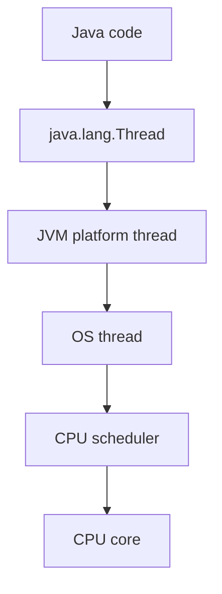
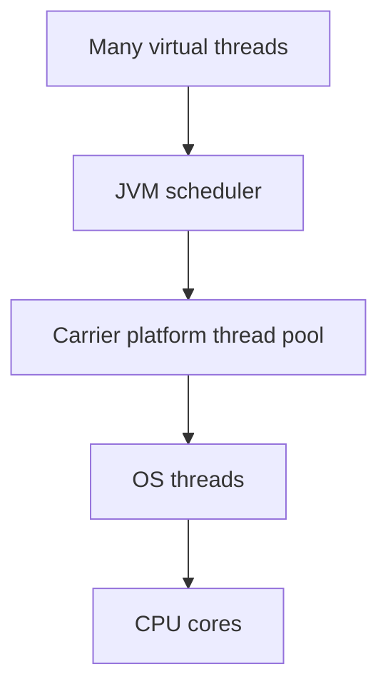
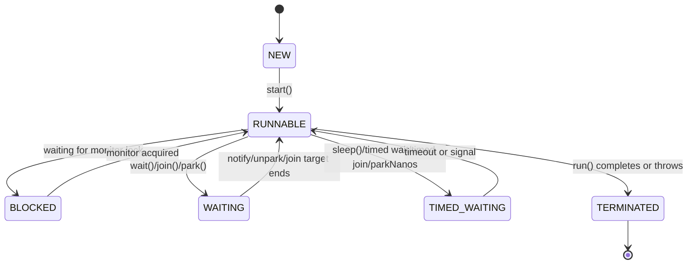
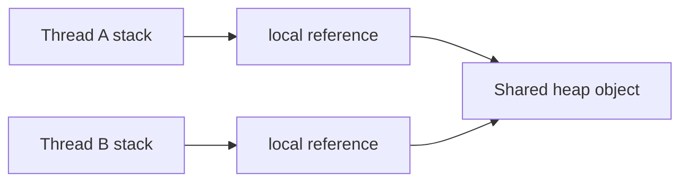
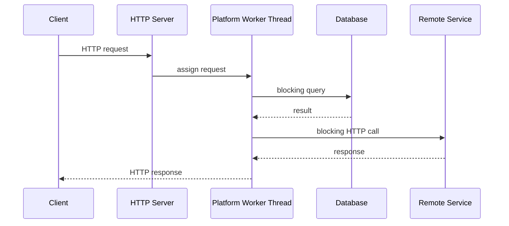
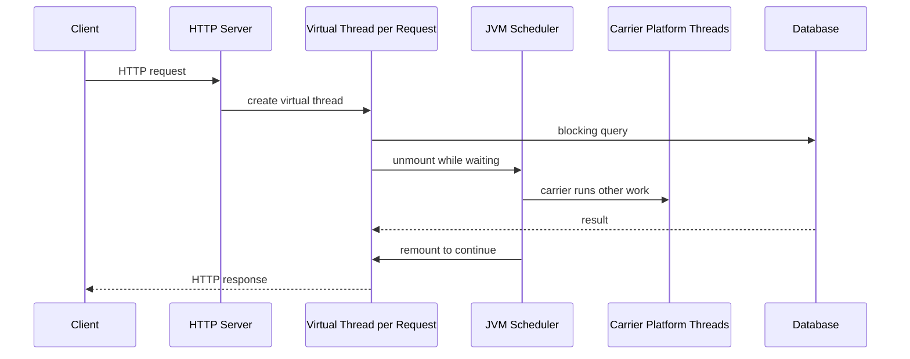
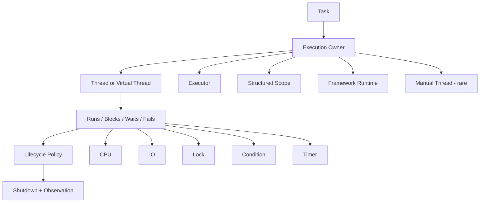

------
title: Learn Java Concurrency & Correctness - Part 004
description: Java thread execution model: platform threads, JVM/OS scheduling, lifecycle states, daemon behavior, interruption, uncaught failure, and production implications.
series: learn-java-concurrency-correctness
seriesTitle: Learn Java Concurrency & Correctness
order: 4
partTitle: Thread Execution Model
tags:
- java
- concurrency
- threads
- scheduling
- interruption
- correctness
- series
date: 2026-06-28
---

# Part 004 — Thread Execution Model

A Java thread is an execution path. It is not just a class named `Thread`.

To reason about concurrency correctly, we need to know what happens below our service method:

- how work gets mapped to execution;
- how threads start and stop;
- how blocking changes scheduling;
- how interruption is represented;
- why daemon threads can silently lose work;
- why uncaught exceptions do not necessarily kill the process;
- why direct thread creation is rarely the right production abstraction;
- why virtual threads change cost, but not correctness requirements.

References for this part:

- Java `Thread` API — https://docs.oracle.com/javase/8/docs/api/java/lang/Thread.html
- Java Language Specification, Chapter 17: Threads and Locks — https://docs.oracle.com/javase/specs/jls/se8/html/jls-17.html
- Java Virtual Threads Guide — https://docs.oracle.com/en/java/javase/21/core/virtual-threads.html
- JEP 444: Virtual Threads — https://openjdk.org/jeps/444

---

## 1. Kaufman Frame: What Skill Are We Acquiring?

The skill in this part is not “how to create a thread.”

The real skill is:

> Given a piece of Java work, understand where it runs, how long it can occupy execution resources, how it can be stopped, and how failure is observed.

A production engineer must be able to inspect a blocked system and answer:

- Which threads are doing useful work?
- Which threads are waiting?
- Which threads are blocked on locks?
- Which threads are sleeping?
- Which threads are stuck on IO?
- Which executor owns them?
- Which request or job created them?
- Which thread can be safely interrupted?
- Which thread failure was swallowed?
- Which background thread keeps the JVM alive?
- Which daemon thread can disappear during shutdown?

This part gives the execution model needed for those answers.

---

## 2. A Thread Is a Unit of Scheduled Execution

The Java platform describes a thread as a thread of execution in a program. In practical terms:

```text
Thread = execution context + call stack + scheduling identity + lifecycle + interruption status
```

A thread has:

- a name;
- an ID;
- priority;
- daemon flag;
- context class loader;
- uncaught exception handler;
- stack trace;
- interrupted status;
- state;
- relation to a thread group;
- either platform-thread or virtual-thread implementation in modern Java.

A thread executes code by running a `Runnable` or equivalent task.

```java
Thread thread = new Thread(() -> {
    System.out.println("Running on " + Thread.currentThread().getName());
});

thread.start();
```

The important method is `start()`, not `run()`.

Calling `run()` directly is just a normal method call on the current thread.

```java
Thread t = new Thread(() -> doWork());

t.run();   // runs on current thread, not concurrently
t.start(); // asks JVM to start a new thread of execution
```

---

## 3. Platform Threads: JVM Thread Mapped to OS Thread

Before virtual threads, “Java thread” normally meant platform thread.

A platform thread is implemented as a thin wrapper around an operating system thread.



This has consequences:

1. Platform threads are relatively expensive compared with ordinary objects.
2. Each platform thread needs stack memory.
3. The OS scheduler decides when it runs.
4. Blocking a platform thread blocks an OS thread.
5. Creating too many platform threads can exhaust memory or degrade scheduling.

This does not mean platform threads are bad. They are powerful and still essential. But they are not free.

---

## 4. Virtual Threads: Java Thread Not Permanently Tied to OS Thread

Modern Java includes virtual threads, finalized in JDK 21 by JEP 444.

A virtual thread is still a `java.lang.Thread`, but it is lightweight and managed by the JVM. It does not permanently occupy an OS thread while blocked on most JDK-supported blocking operations.



Virtual threads are designed to make thread-per-task style practical for high-throughput blocking IO applications.

They change the cost model:

| Topic | Platform thread | Virtual thread |
|---|---|---|
| Creation cost | Relatively high | Low |
| Blocking cost | Occupies OS thread | Usually unmounts from carrier during supported blocking |
| Typical count | Hundreds to thousands | Thousands to millions depending on workload/resources |
| Best fit | CPU work, long-lived worker pools, integration with legacy code | Many concurrent blocking IO tasks |
| Pooling | Usually pooled | Usually not pooled by application |

But they do not change the correctness model:

- shared state still needs protection;
- data races are still data races;
- deadlocks are still deadlocks;
- database connections are still bounded;
- remote systems still need backpressure;
- cancellation still needs a contract;
- context leakage still matters.

Virtual threads change how we wait. They do not make unsafe state safe.

Detailed virtual thread production engineering appears later in the series.

---

## 5. Thread Lifecycle States

Java exposes thread states through `Thread.State`.

The states are:

- `NEW`
- `RUNNABLE`
- `BLOCKED`
- `WAITING`
- `TIMED_WAITING`
- `TERMINATED`



These states are diagnostic categories, not a full OS scheduling model.

### 5.1 `NEW`

A thread object exists, but `start()` has not been called.

```java
Thread t = new Thread(() -> doWork());
System.out.println(t.getState()); // NEW
```

A `NEW` thread has not executed user code.

### 5.2 `RUNNABLE`

The thread is executing in the JVM or ready to execute.

This includes both:

- actually running on a CPU;
- waiting for CPU time from the scheduler.

Do not interpret `RUNNABLE` as “definitely consuming CPU right now.”

For blocking IO, platform-specific behavior may also appear as `RUNNABLE` because the JVM sees the thread as runnable while the native call blocks. Thread dumps require interpretation.

### 5.3 `BLOCKED`

A thread is `BLOCKED` when waiting to acquire a monitor lock.

Example:

```java
synchronized (lock) {
    longOperation();
}
```

Other threads trying to enter a synchronized block guarded by the same monitor may become `BLOCKED`.

`BLOCKED` usually points to lock contention or deadlock risk.

### 5.4 `WAITING`

A thread is waiting indefinitely for another thread to perform an action.

Examples:

- `Object.wait()` with no timeout;
- `Thread.join()` with no timeout;
- `LockSupport.park()`.

Indefinite waiting must be justified. In production services, unbounded waits often become incident root causes.

### 5.5 `TIMED_WAITING`

A thread is waiting for a bounded time.

Examples:

- `Thread.sleep(...)`;
- `Object.wait(timeout)`;
- `Thread.join(timeout)`;
- `LockSupport.parkNanos(...)`;
- `LockSupport.parkUntil(...)`.

Timed waiting is not automatically good. A bad timeout is just a delayed failure.

### 5.6 `TERMINATED`

The thread finished normally or ended because an exception escaped `run()`.

A terminated thread cannot be restarted.

```java
Thread t = new Thread(() -> {});
t.start();
t.join();
t.start(); // IllegalThreadStateException
```

---

## 6. Thread Start and Happens-Before

Thread start has memory semantics.

Actions before `Thread.start()` in the parent thread happen-before actions in the started thread.

That means data prepared before starting a thread is visible to that thread, assuming the data does not later race unsafely.

```java
class Worker implements Runnable {
    private final String config;

    Worker(String config) {
        this.config = config;
    }

    @Override
    public void run() {
        System.out.println(config);
    }
}

Worker worker = new Worker("safe-to-read");
new Thread(worker).start();
```

The started thread sees the object state established before `start()`.

But this does not make future unsynchronized mutations safe.

```java
Worker worker = new Worker("initial");
Thread t = new Thread(worker);
t.start();
worker.mutateConfig("changed"); // needs separate synchronization if read by worker
```

Thread start safely publishes initial setup. It is not a general-purpose synchronization strategy for ongoing mutation.

---

## 7. Thread Join and Completion Visibility

`Thread.join()` waits for another thread to die.

It also gives a useful reasoning boundary: after a successful join returns, the joining thread can observe the effects of the completed thread according to the Java Memory Model.

```java
class ResultHolder {
    int result;
}

ResultHolder holder = new ResultHolder();

Thread t = new Thread(() -> holder.result = compute());
t.start();
t.join();

System.out.println(holder.result); // completion is visible after join
```

This is one reason `join()` appears in small concurrency examples.

In production, we usually prefer higher-level abstractions:

- `Future.get()`;
- `CompletableFuture` composition;
- structured concurrency scopes;
- executor termination;
- framework lifecycle hooks.

But the underlying concept is the same: completion creates an observation boundary.

---

## 8. Scheduler Reality

Java does not guarantee that your threads execute fairly or immediately.

A scheduler may:

- pause a thread after any instruction boundary visible to the runtime;
- run one thread more often than another;
- resume a blocked thread later than expected;
- migrate threads across CPU cores;
- delay execution due to CPU saturation;
- interact with OS priorities and container CPU limits;
- be affected by GC safepoints and runtime mechanics.

Do not write logic that depends on timing luck.

Bad:

```java
Thread t = new Thread(this::initialize);
t.start();
Thread.sleep(100); // hope initialization finished
useInitializedState();
```

Good:

```java
CountDownLatch ready = new CountDownLatch(1);

Thread t = new Thread(() -> {
    initialize();
    ready.countDown();
});

t.start();
ready.await();
useInitializedState();
```

Even better in production may be a lifecycle abstraction, `Future`, `CompletableFuture`, or framework readiness model.

Sleep is not coordination. It is delay.

---

## 9. The Call Stack and Heap

Each thread has its own call stack.

Local variables live on the stack or are optimized by the JVM, but objects they reference usually live on the heap.

```java
void handle(Request request) {
    String local = request.id();
    MutableContext context = request.context();
    process(context);
}
```

`local` is not shared unless captured or stored somewhere shared. `context` may reference a shared mutable object.

The simple model:



A local variable is safe. A local reference to shared mutable state is not automatically safe.

This distinction catches many mistakes in service code.

---

## 10. Thread Identity and Current Thread

`Thread.currentThread()` returns the thread executing the current code.

```java
String name = Thread.currentThread().getName();
```

Thread identity matters for:

- logging;
- debugging;
- executor naming;
- thread dump analysis;
- `ThreadLocal` storage;
- security/context propagation;
- detecting accidental blocking on event-loop threads;
- detecting accidental execution on the wrong executor.

In production, unnamed threads are operational debt.

Bad:

```text
Thread-17
pool-3-thread-8
ForkJoinPool.commonPool-worker-12
```

Better:

```text
case-command-worker-4
payment-callback-vt-39182
report-batch-cpu-2
```

Thread names should communicate ownership and workload.

---

## 11. Daemon Threads

A daemon thread does not prevent the JVM from exiting.

The JVM can exit when all non-daemon threads have finished, even if daemon threads are still running.

This matters for background work.

```java
Thread t = new Thread(this::flushMetricsForever);
t.setDaemon(true);
t.start();
```

If only daemon threads remain, the JVM may exit before metrics are flushed.

Daemon threads are appropriate for support tasks that should not keep the process alive by themselves.

They are dangerous for:

- critical persistence;
- audit event delivery;
- payment capture;
- compliance logging;
- final state transition;
- queue acknowledgement;
- durable cleanup.

A rule of thumb:

> If losing the work is unacceptable, do not rely on daemon-thread completion.

Use explicit lifecycle management instead.

---

## 12. Uncaught Exceptions

If an exception escapes a thread's `run()` method, that thread terminates.

It does not automatically terminate the whole JVM.

```java
Thread t = new Thread(() -> {
    throw new RuntimeException("boom");
});

t.start();
```

The thread dies. Other threads may continue.

This is dangerous for background workers.

Example failure:

```java
new Thread(() -> {
    while (true) {
        processNextMessage(); // RuntimeException kills worker
    }
}).start();
```

If `processNextMessage()` throws unexpectedly and the exception escapes, the worker thread is gone.

Production code should define:

- where failures are caught;
- whether the task retries;
- whether the worker restarts;
- whether the service should fail fast;
- how the error is reported;
- whether in-flight work is safe to retry;
- whether poison messages are isolated.

You can set an uncaught exception handler:

```java
Thread t = new Thread(this::runWorker, "case-worker-1");
t.setUncaughtExceptionHandler((thread, error) -> {
    log.error("Worker thread failed: {}", thread.getName(), error);
});
t.start();
```

But logging is not recovery. It is observation.

---

## 13. Interruption: Java's Cooperative Stop Signal

Java does not safely stop arbitrary threads by force.

Interruption is a cooperative signal.

Each thread has an interrupted status. Calling `interrupt()` sets that status and may cause certain blocking methods to throw `InterruptedException`.

```java
Thread worker = new Thread(() -> {
    while (!Thread.currentThread().isInterrupted()) {
        doUnitOfWork();
    }
});

worker.start();
worker.interrupt();
```

Interruption means:

> Please stop what you are doing if your contract says interruption should stop it.

It does not mean:

- the thread is immediately killed;
- all blocking IO stops instantly;
- locks are automatically released except through normal stack unwinding;
- partial business operations are rolled back;
- external side effects are cancelled.

### 13.1 Interruptible blocking

Many blocking methods respond to interruption:

- `Thread.sleep(...)`;
- `Object.wait(...)`;
- `Thread.join(...)`;
- many `java.util.concurrent` blocking methods such as `BlockingQueue.take()`;
- many lock acquisition methods such as `lockInterruptibly()`.

Example:

```java
try {
    WorkItem item = queue.take();
    process(item);
} catch (InterruptedException e) {
    Thread.currentThread().interrupt();
    return;
}
```

The common pattern is to restore interrupted status if you cannot fully handle the interruption.

### 13.2 Do not swallow interruption

Bad:

```java
try {
    Thread.sleep(1000);
} catch (InterruptedException e) {
    // ignore
}
```

This destroys the cancellation signal.

Better:

```java
try {
    Thread.sleep(1000);
} catch (InterruptedException e) {
    Thread.currentThread().interrupt();
    return;
}
```

Or translate into an application-specific cancellation exception if your layer owns the policy.

### 13.3 Interruption and business correctness

Stopping a thread is not the same as cancelling the operation.

Ask:

- Has a database row already been updated?
- Has an event been published?
- Has a remote API been called?
- Has the queue message been acknowledged?
- Is the operation idempotent?
- Can a retry safely complete it?

Interruption is a thread-level mechanism. Cancellation is an application-level contract.

---

## 14. Why `Thread.stop()` Is Not a Solution

Historically, Java had methods such as `Thread.stop()`, `suspend()`, and `resume()`. They are deprecated because they are unsafe.

The core problem: forcibly stopping a thread can leave shared objects in inconsistent states.

Imagine a thread is stopped here:

```java
synchronized void transfer(Account from, Account to, long amount) {
    from.withdraw(amount);
    // thread forcibly stopped here
    to.deposit(amount);
}
```

Locks may be released while invariants are broken. Other threads can then observe corrupted state.

The correct approach is cooperative cancellation with well-defined cleanup.

---

## 15. Sleep Is Not a Synchronization Primitive

`Thread.sleep(...)` pauses the current thread for approximately the requested time, subject to scheduler and timer behavior.

It does not guarantee:

- another thread has completed;
- memory visibility;
- ordering;
- lock release;
- readiness;
- fairness;
- progress.

Bad test:

```java
worker.start();
Thread.sleep(50);
assertTrue(worker.isReady());
```

Better:

```java
worker.start();
assertTrue(worker.awaitReady(Duration.ofSeconds(1)));
```

The second version uses an explicit condition and bounded wait.

---

## 16. Yield Is Usually Not a Design Tool

`Thread.yield()` hints that the current thread is willing to let others run.

It is not a correctness mechanism.

Do not use `yield()` to fix races, ordering, readiness, or fairness. If adding `yield()` appears to fix a bug, the bug remains.

---

## 17. Thread Priority Is Not a Portable Correctness Tool

Java exposes thread priority, but priority behavior depends heavily on JVM and OS scheduling.

Do not depend on priority for correctness.

Use explicit queues, admission control, executor separation, and resource budgeting.

Example:

- separate CPU-heavy reporting pool from latency-sensitive API pool;
- separate blocking IO pool from computation pool;
- use bounded queues and rejection policies;
- use priority queues only with starvation prevention.

---

## 18. Direct Thread Creation vs Executor Ownership

Directly creating threads is low-level.

```java
new Thread(() -> process(job)).start();
```

Problems:

- no central ownership;
- no bounded concurrency;
- no queue policy;
- no lifecycle management;
- no structured failure propagation;
- weak observability;
- hard shutdown;
- uncontrolled resource consumption.

Executors separate task submission from execution policy.

```java
ExecutorService executor = Executors.newFixedThreadPool(8);
executor.submit(() -> process(job));
```

This is better, but still requires engineering:

- pool size;
- queue capacity;
- thread naming;
- rejection policy;
- shutdown policy;
- exception handling;
- metrics;
- blocking behavior;
- context propagation.

We will go deep on executors later. For now, remember:

> A thread is an execution resource. An executor is an ownership and policy boundary.

---

## 19. Thread Lifecycle in a Service Request

A traditional servlet-style request on platform threads often looks like this:



During blocking DB or HTTP calls, the platform worker thread is occupied. If enough requests block, the server may run out of workers.

Virtual threads change this execution economics:



But database connections are still limited. If you create 100,000 virtual threads that all want 50 database connections, 99,950 are still waiting somewhere.

Virtual threads reduce thread scarcity. They do not remove resource scarcity.

---

## 20. Blocking: What Is Actually Blocked?

“Blocking” means the current execution cannot proceed until some condition is satisfied.

But what resource is blocked depends on the model.

| Blocking operation | Platform thread impact | Virtual thread impact | Correctness concern |
|---|---|---|---|
| `Thread.sleep` | OS thread occupied | virtual thread usually parks | delay is not coordination |
| monitor acquisition | waits for lock | waits for lock | deadlock/contention possible |
| blocking queue take | worker waits | virtual thread may park | cancellation/backpressure |
| DB query | OS thread occupied | virtual thread may park if driver/JDK path cooperates | connection pool saturation |
| remote HTTP call | OS thread occupied | virtual thread may park if client supports it | timeout/idempotency |
| CPU loop | CPU consumed | carrier consumed while running | virtual threads do not help CPU work |

Always ask:

1. What is waiting?
2. What scarce resource is held while waiting?
3. Who can wake it?
4. What happens if it never wakes?
5. Can it be interrupted?
6. Is there a deadline?

---

## 21. CPU-Bound vs IO-Bound Execution

CPU-bound work is limited by available CPU.

Examples:

- compression;
- encryption;
- image processing;
- large JSON transformation;
- rule evaluation over huge in-memory data;
- sorting large collections;
- pathfinding or optimization algorithms.

IO-bound work waits on external resources.

Examples:

- database query;
- HTTP call;
- file read;
- message broker poll;
- cache network call.

Thread strategy differs.

| Workload | Good default |
|---|---|
| CPU-bound | bounded pool near CPU capacity, avoid excessive parallelism |
| IO-bound, blocking style | virtual thread per task or carefully sized platform pool |
| IO-bound, event-loop style | non-blocking APIs, avoid blocking event loop |
| mixed workload | isolate CPU, blocking IO, and latency-sensitive paths |

The worst design is mixing everything in one executor with no ownership.

---

## 22. Context Switching

A context switch occurs when execution changes from one thread to another.

Costs include:

- scheduler overhead;
- CPU cache disruption;
- memory locality loss;
- coordination overhead;
- lock handoff overhead.

More threads do not automatically mean more throughput.

For CPU-bound work, too many threads can reduce throughput because the CPU spends more time switching and less time executing useful work.

For IO-bound work, more concurrency can increase throughput if external resources and backpressure are controlled.

This is why execution strategy starts with workload classification.

---

## 23. Thread Dumps: Execution Model as Evidence

A thread dump is a snapshot of thread states and stack traces.

When reading a thread dump, look for:

- many threads with the same stack;
- many `BLOCKED` threads on the same monitor;
- deadlock reports;
- request threads waiting on `Future.get()`;
- pool workers blocked on remote IO;
- event-loop threads doing blocking work;
- background workers terminated or absent;
- unnamed threads;
- daemon-only work near shutdown;
- excessive `TIMED_WAITING` due to sleep-based polling.

The state alone is not enough. The stack tells why.

Example interpretation:

```text
case-worker-17 BLOCKED on CaseRegistry@7a91
  at CaseRegistry.assign(...)

case-worker-18 BLOCKED on CaseRegistry@7a91
  at CaseRegistry.assign(...)

case-worker-1 RUNNABLE
  at ExternalRiskClient.call(...)
```

Maybe all assignment work is serialized behind one global lock while the holder is making a remote call. That is both a throughput and liveness smell.

---

## 24. Production Thread Naming

A useful thread name contains:

- subsystem;
- workload type;
- executor/pool identity;
- sequence number;
- optionally tenant/partition in controlled cases.

Examples:

```text
case-command-pool-1
case-command-pool-2
risk-http-vt-98231
settlement-batch-cpu-3
audit-publisher-1
```

Avoid including sensitive data in thread names. Thread names may appear in logs, dumps, metrics, and support bundles.

Thread names are for operations, not business secrets.

---

## 25. Thread Factories

A `ThreadFactory` centralizes thread creation policy.

Example:

```java
import java.util.concurrent.ThreadFactory;
import java.util.concurrent.atomic.AtomicInteger;

final class NamedThreadFactory implements ThreadFactory {
    private final String prefix;
    private final AtomicInteger sequence = new AtomicInteger();

    NamedThreadFactory(String prefix) {
        this.prefix = prefix;
    }

    @Override
    public Thread newThread(Runnable task) {
        Thread thread = new Thread(task);
        thread.setName(prefix + "-" + sequence.incrementAndGet());
        thread.setDaemon(false);
        thread.setUncaughtExceptionHandler((t, e) ->
            System.err.println("Uncaught failure in " + t.getName() + ": " + e)
        );
        return thread;
    }
}
```

This is a basic example. Production systems usually connect this to structured logging and metrics.

A thread factory is where you encode:

- name;
- daemon policy;
- exception handler;
- priority only if truly justified;
- context class loader if needed;
- virtual vs platform thread creation in modern Java.

---

## 26. Platform Thread Stack Size

Platform threads require stack memory. Exact behavior depends on JVM, OS, and configuration.

Implication:

- thousands of platform threads can consume significant memory;
- deep recursion or large stack frames can cause `StackOverflowError`;
- excessive thread creation can cause `OutOfMemoryError` or native thread creation failure.

Do not use unbounded platform thread creation as a concurrency strategy.

Virtual threads are much lighter, but not magic. Their continuation stacks still consume memory as needed, and each running virtual thread eventually needs CPU and downstream resources.

---

## 27. ThreadLocal and Execution Identity

`ThreadLocal` stores data associated with a thread.

```java
private static final ThreadLocal<String> REQUEST_ID = new ThreadLocal<>();

void handle(String requestId) {
    REQUEST_ID.set(requestId);
    try {
        process();
    } finally {
        REQUEST_ID.remove();
    }
}
```

ThreadLocal is common for:

- logging MDC;
- security context;
- transaction context;
- locale;
- request correlation;
- framework internals.

But it is dangerous if not cleaned up, especially on pooled platform threads.

If worker thread 1 handles request A, then later request B, stale ThreadLocal data from A can leak into B unless removed.

Virtual threads reduce some pooling-related leakage patterns because virtual threads are often short-lived per task, but context propagation is still a real design concern. Scoped values and structured concurrency will be covered later.

---

## 28. Lifecycle Ownership

Every thread should have an owner.

Ownership means someone knows:

- why the thread exists;
- when it starts;
- when it stops;
- how it is named;
- what it may block on;
- how failure is handled;
- how shutdown occurs;
- where metrics are emitted;
- what business operation it belongs to.

Unowned threads are production hazards.

Bad:

```java
void onRequest(Request request) {
    new Thread(() -> sendAuditEvent(request)).start();
    returnResponse();
}
```

Problems:

- audit may be lost on shutdown;
- failure may be invisible;
- unbounded thread creation;
- no backpressure;
- no retry policy;
- no correlation with request lifecycle;
- no guarantee work completed before response if that matters.

Better designs:

- durable outbox;
- managed executor;
- queue with bounded capacity;
- framework-managed async component;
- structured task scope if lifetime is tied to parent operation;
- virtual thread executor with resource guardrails.

---

## 29. Shutdown Semantics

Thread execution must have a shutdown story.

Questions:

1. Should new work be accepted during shutdown?
2. Should queued work finish?
3. Should in-flight work be interrupted?
4. How long do we wait?
5. What is persisted before exit?
6. What happens to partially processed messages?
7. Are daemon threads hiding unfinished work?
8. Is shutdown idempotent?

A clean shutdown often follows this pattern:

```text
stop accepting new work
signal cancellation / close input
wait bounded time for in-flight work
drain or persist queued work
interrupt if policy allows
release resources
emit final lifecycle logs/metrics
exit
```

Executor shutdown appears in later parts. But the principle starts at the thread level.

---

## 30. Anti-Patterns

### 30.1 Fire-and-forget thread

```java
new Thread(task).start();
```

Usually missing ownership, bounds, failure handling, and shutdown.

### 30.2 Sleep-based coordination

```java
Thread.sleep(500);
```

Usually a race with a delay.

### 30.3 Ignoring interruption

```java
catch (InterruptedException ignored) {}
```

Destroys cancellation semantics.

### 30.4 Critical work on daemon thread

Allows JVM exit before work completes.

### 30.5 Global lock around blocking IO

```java
synchronized (lock) {
    remoteClient.call();
}
```

Serializes unrelated callers and can cause cascading latency.

### 30.6 Unnamed executors

Makes production forensics harder.

### 30.7 Mixing CPU and blocking IO in one pool

Can starve CPU tasks behind slow IO or saturate all workers with blocking calls.

### 30.8 Treating virtual threads as infinite capacity

Virtual threads are cheap, but downstream resources are finite.

---

## 31. Small Example: A Well-Behaved Worker

```java
import java.time.Duration;
import java.util.concurrent.BlockingQueue;
import java.util.concurrent.TimeUnit;

final class Worker implements Runnable {
    private final BlockingQueue<WorkItem> queue;
    private volatile boolean stopping;

    Worker(BlockingQueue<WorkItem> queue) {
        this.queue = queue;
    }

    void stop() {
        stopping = true;
    }

    @Override
    public void run() {
        while (!stopping && !Thread.currentThread().isInterrupted()) {
            try {
                WorkItem item = queue.poll(1, TimeUnit.SECONDS);
                if (item == null) {
                    continue;
                }
                process(item);
            } catch (InterruptedException e) {
                Thread.currentThread().interrupt();
                break;
            } catch (RuntimeException e) {
                // Production code should log with context and apply retry/poison policy.
                handleFailure(e);
            }
        }
        cleanup();
    }

    private void process(WorkItem item) {
        // business processing
    }

    private void handleFailure(RuntimeException e) {
        // report, retry, dead-letter, or fail-fast depending on policy
    }

    private void cleanup() {
        // release resources
    }
}
```

Why this is better than a naive loop:

- it has a stop flag;
- it respects interruption;
- it does not block forever on `take()`;
- it catches task-level runtime failures;
- it has a cleanup hook;
- it makes policy visible.

This is still not a complete production worker. It lacks metrics, ownership, executor lifecycle, retry policy, poison message handling, and graceful shutdown orchestration. But it shows the execution concerns explicitly.

---

## 32. Better Example: Prefer Executor Ownership

```java
import java.util.concurrent.ExecutorService;
import java.util.concurrent.Executors;
import java.util.concurrent.ThreadFactory;
import java.util.concurrent.atomic.AtomicInteger;

final class CaseWorkerRuntime implements AutoCloseable {
    private final ExecutorService executor;

    CaseWorkerRuntime(int workers) {
        this.executor = Executors.newFixedThreadPool(
            workers,
            namedThreads("case-worker")
        );
    }

    void submit(Runnable task) {
        executor.submit(wrap(task));
    }

    private Runnable wrap(Runnable task) {
        return () -> {
            try {
                task.run();
            } catch (RuntimeException e) {
                // report and rethrow or handle according to policy
                throw e;
            }
        };
    }

    @Override
    public void close() {
        executor.shutdown();
    }

    private static ThreadFactory namedThreads(String prefix) {
        AtomicInteger seq = new AtomicInteger();
        return task -> {
            Thread t = new Thread(task);
            t.setName(prefix + "-" + seq.incrementAndGet());
            t.setDaemon(false);
            return t;
        };
    }
}
```

This is still basic, but it introduces ownership. Later parts will refine executor shutdown, rejection, queue sizing, and failure policy.

---

## 33. Mental Model Summary



Do not think of a thread as merely “parallel code.” Think of it as a runtime obligation.

---

## 34. Production Review Checklist

Before approving thread-level code, verify:

- [ ] Threads have an owner.
- [ ] Threads have meaningful names.
- [ ] Direct `new Thread(...)` is justified or replaced with an executor/scope.
- [ ] Daemon policy is explicit.
- [ ] Uncaught exception behavior is explicit.
- [ ] Interruption is not swallowed.
- [ ] Blocking operations are known.
- [ ] Blocking operations have deadlines where appropriate.
- [ ] Shutdown behavior is defined.
- [ ] Critical work is not fire-and-forget.
- [ ] Sleep is not used as coordination.
- [ ] CPU-bound and IO-bound work are not accidentally mixed.
- [ ] Virtual threads are not treated as unlimited downstream capacity.
- [ ] ThreadLocal state is cleaned up or avoided.
- [ ] Thread dump interpretation is possible from names and ownership.

---

## 35. Key Takeaways

1. `Thread.start()` creates a new execution path; `run()` is only a normal method call.
2. Platform threads map to OS threads and are relatively expensive.
3. Virtual threads are lightweight Java threads, useful for many blocking IO workloads, but they do not solve shared-state correctness.
4. Thread states are diagnostic clues, not full scheduler truth.
5. `sleep()` is delay, not coordination.
6. Interruption is cooperative cancellation signaling, not forced termination.
7. Daemon threads can be abandoned when the JVM exits.
8. Uncaught exceptions usually kill the thread, not the process.
9. Every thread should have ownership, lifecycle, naming, failure handling, and shutdown policy.
10. Execution model knowledge is necessary before using locks, executors, futures, virtual threads, or reactive streams well.

---

## 36. What Comes Next

Part 005 moves into shared state and data races.

We will connect the execution model to concrete bugs:

- lost updates;
- stale reads;
- unsafe publication;
- check-then-act races;
- compound invariants;
- local vs shared references;
- object escape;
- why “it is private” and “it is final” are often misunderstood.
