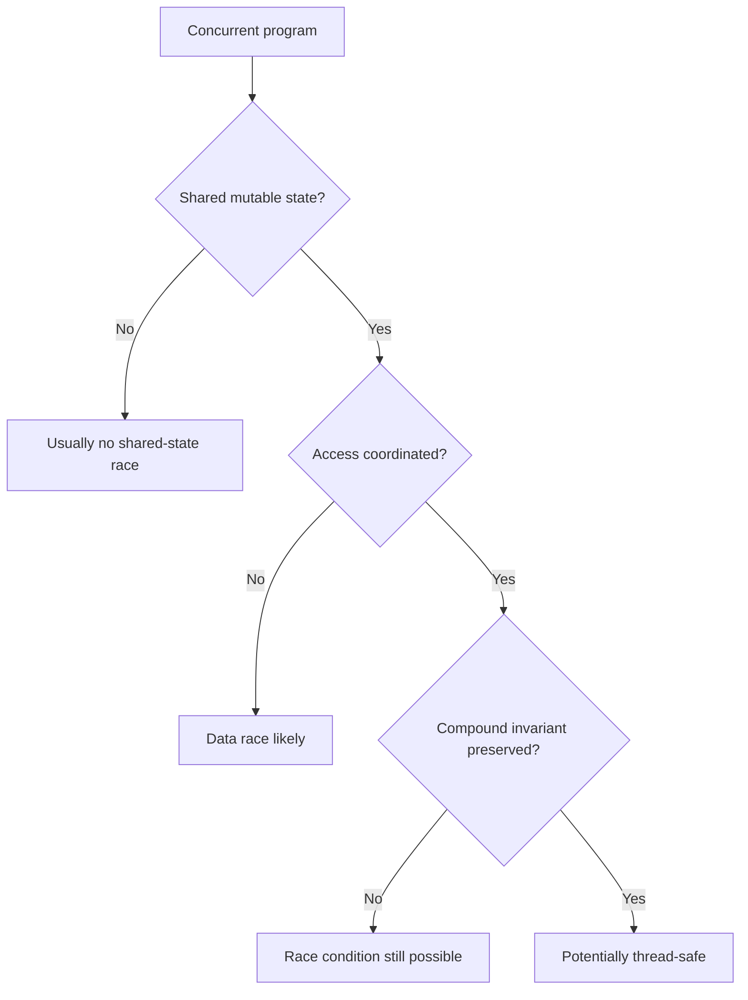
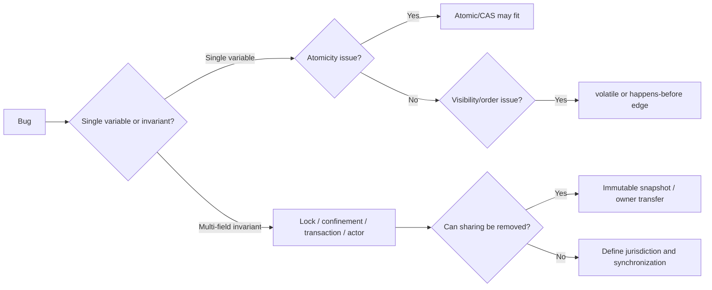

------
title: Learn Java Concurrency & Correctness - Part 005
description: Shared mutable state, race condition, data race, check-then-act, lost update, stale read, aliasing, and correctness-first mitigation strategies.
series: learn-java-concurrency-correctness
seriesTitle: Learn Java Concurrency & Correctness
order: 5
partTitle: Shared State and Data Races
tags:
- java
- concurrency
- correctness
- shared-state
- data-race
- race-condition
- thread-safety
date: 2026-06-28
---

# Part 005 — Shared State and Data Races

Concurrency becomes difficult when **multiple execution contexts can observe or mutate the same state while at least one of them writes**.

That sentence is more important than any Java API in this series.

Most concurrency bugs are not caused by “threads” in the abstract. They are caused by uncontrolled access to shared mutable state. Threads, executors, virtual threads, callbacks, event loops, and reactive pipelines are just different ways to create overlapping execution. The correctness question is always the same:

> Who owns this state, who may read it, who may write it, and what ordering/visibility guarantee connects those operations?

In this part, we build the mental model needed before studying `volatile`, locks, atomics, concurrent collections, executors, virtual threads, or reactive streams.

---

## 1. Kaufman Skill Deconstruction

Josh Kaufman's approach starts by breaking a complex skill into smaller subskills. For concurrency correctness, shared state is the first major subskill.

You need to be able to:

1. Identify shared state.
2. Identify mutation.
3. Identify aliasing paths.
4. Identify compound operations.
5. Detect whether an invariant spans more than one field/object/operation.
6. Determine which mechanism creates mutual exclusion, visibility, and ordering.
7. Remove sharing where possible before adding synchronization.

The mistake many engineers make is starting with the mechanism:

```java
synchronized
ReentrantLock
AtomicInteger
ConcurrentHashMap
CompletableFuture
Flux
ExecutorService
```

The top-level skill is not choosing an API. The top-level skill is recognizing the **shape of the correctness problem**.

---

## 2. The Core Model

A piece of state is concurrency-relevant when it has all three properties:

| Property | Meaning |
|---|---|
| Shared | More than one execution context can access it |
| Mutable | Its value or reachable object graph can change |
| Uncoordinated | Access is not protected by a correctness mechanism |

If any one of those is false, the risk drops sharply.

| State Type | Usually Safe? | Why |
|---|---:|---|
| Local variable holding primitive value | Yes | Not shared unless captured/escaped |
| Immutable object safely published | Yes | No mutation after construction |
| Mutable object confined to one thread/request/task | Yes | No concurrent access |
| Mutable object protected by one lock | Usually | Mutual exclusion + visibility if consistently used |
| Mutable object accessed by many threads with no discipline | No | Race conditions/data races likely |

The practical rule:

> Before synchronizing state, ask whether the state should be shared at all.

---

## 3. Race Condition vs Data Race

These terms are often used casually, but they are not identical.

### 3.1 Race Condition

A **race condition** happens when correctness depends on timing or interleaving between operations.

Example:

```java
if (!caseFile.isAssigned()) {
    caseFile.assignTo(officerId);
}
```

Two threads may both observe `isAssigned() == false`, and both assign the case. The code may be data-race-free if protected incorrectly at lower levels, but the higher-level operation is still not atomic.

A race condition is a **semantic correctness bug**.

### 3.2 Data Race

A **data race** is a lower-level memory-model condition: two conflicting accesses to the same variable, at least one write, not ordered by a happens-before relationship.

Example:

```java
final class StopFlag {
    boolean stopped;

    void stop() {
        stopped = true;
    }

    boolean isStopped() {
        return stopped;
    }
}
```

If one thread calls `stop()` and another repeatedly calls `isStopped()` without synchronization or `volatile`, there is a data race.

A data race is a **memory visibility/ordering bug**.

### 3.3 Relationship



You can have:

| Scenario | Data Race? | Race Condition? | Example |
|---|---:|---:|---|
| Unsynchronized shared counter | Yes | Yes | `count++` from many threads |
| Atomic counter but wrong business invariant | No | Yes | Separate atomics for `used` and `limit` |
| Immutable shared object | No | No | `record Money(BigDecimal amount, Currency currency)` |
| Correct lock around whole invariant | No | Usually no | `synchronized` transition method |

This distinction matters because simply replacing fields with atomics may remove the data race while preserving the race condition.

---

## 4. The Smallest Broken Example: Lost Update

Consider this class:

```java
final class Counter {
    private int value;

    void increment() {
        value++;
    }

    int value() {
        return value;
    }
}
```

`value++` looks like one operation, but it is a compound action:

```text
read value
add 1
write value
```

Two threads can interleave like this:

| Step | Thread A | Thread B | Stored Value |
|---:|---|---|---:|
| 1 | read `0` |  | 0 |
| 2 |  | read `0` | 0 |
| 3 | compute `1` |  | 0 |
| 4 |  | compute `1` | 0 |
| 5 | write `1` |  | 1 |
| 6 |  | write `1` | 1 |

Expected value after two increments: `2`.
Actual possible value: `1`.

The operation lost an update.

Correct options depend on the invariant:

```java
final class SynchronizedCounter {
    private int value;

    synchronized void increment() {
        value++;
    }

    synchronized int value() {
        return value;
    }
}
```

or:

```java
import java.util.concurrent.atomic.AtomicInteger;

final class AtomicCounter {
    private final AtomicInteger value = new AtomicInteger();

    void increment() {
        value.incrementAndGet();
    }

    int value() {
        return value.get();
    }
}
```

But the correct choice is not “atomics are faster” or “locks are safer”. The choice depends on the protected invariant.

If the invariant is only one independent numeric cell, an atomic may fit.
If the invariant spans multiple fields, use a lock or redesign ownership.

---

## 5. Shared State Is Often Hidden by Aliasing

A reference is an access path. If two components hold references to the same mutable object, they share state even if no field is static.

```java
final class CaseAssignmentService {
    private final List<String> assignedOfficerIds;

    CaseAssignmentService(List<String> assignedOfficerIds) {
        this.assignedOfficerIds = assignedOfficerIds;
    }

    void assign(String officerId) {
        assignedOfficerIds.add(officerId);
    }
}
```

The constructor receives a mutable list. The caller may still hold the same list:

```java
var officers = new ArrayList<String>();
var service = new CaseAssignmentService(officers);

// Somewhere else, possibly another thread:
officers.clear();
```

The service does not own its own state. It shares an alias with the caller.

A safer version:

```java
final class CaseAssignmentService {
    private final List<String> assignedOfficerIds = new ArrayList<>();

    CaseAssignmentService(Collection<String> initialOfficerIds) {
        this.assignedOfficerIds.addAll(initialOfficerIds);
    }

    synchronized void assign(String officerId) {
        assignedOfficerIds.add(officerId);
    }

    synchronized List<String> snapshot() {
        return List.copyOf(assignedOfficerIds);
    }
}
```

Key changes:

1. The constructor copies input.
2. The internal list is not exposed.
3. Mutation is protected.
4. Reads return immutable snapshots.

This is not just defensive programming. It is **ownership control**.

---

## 6. The Ownership Question

Every mutable object should have an ownership model.

Ask:

1. Who creates it?
2. Who may mutate it?
3. Who may read it?
4. Can it escape?
5. Is mutation single-threaded, lock-protected, actor-owned, transaction-owned, or atomic?
6. When ownership transfers, is the previous owner forbidden from touching it?

### 6.1 Ownership Models

| Model | Description | Example | Risk |
|---|---|---|---|
| Thread confinement | Only one thread accesses state | UI event loop, single worker | Broken if reference escapes |
| Request confinement | State belongs to one request/task | DTO built during request | Broken if cached globally |
| Object lock ownership | One lock protects object invariant | `synchronized` aggregate | Broken if lock not consistently used |
| Actor ownership | One mailbox/consumer owns mutation | Case processor per case id | Backpressure/ordering design required |
| Immutable snapshot | State cannot mutate after construction | config snapshot | Must publish safely |
| Database transaction ownership | DB enforces isolation/constraint | transition row update | Requires correct isolation/locking |
| Atomic variable ownership | One cell updated atomically | sequence number | Unsafe for multi-field invariants |

A top-tier engineer does not ask “is this class thread-safe?” first. They ask:

> What is the ownership and jurisdiction of each mutable invariant?

---

## 7. Compound Actions

A compound action is a sequence that must be treated as one logical operation.

Common forms:

| Pattern | Example | Bug |
|---|---|---|
| Check-then-act | `if (!map.containsKey(k)) map.put(k, v)` | Duplicate creation/race |
| Read-modify-write | `count++` | Lost update |
| Validate-then-transition | `if (state == OPEN) state = CLOSED` | Invalid transition |
| Iterate-then-remove | Loop over mutable collection | Concurrent modification/semantic race |
| Load-compute-store | Read config, compute diff, write result | Overwritten update |
| Multi-field update | debit one account, credit another | Broken invariant |

### 7.1 Check-Then-Act Example

Broken:

```java
final class CaseRegistry {
    private final Map<String, CaseFile> cases = new HashMap<>();

    CaseFile getOrCreate(String caseId) {
        var existing = cases.get(caseId);
        if (existing != null) {
            return existing;
        }

        var created = new CaseFile(caseId);
        cases.put(caseId, created);
        return created;
    }
}
```

Two threads can both create a `CaseFile` for the same `caseId`.

Lock-protected:

```java
final class CaseRegistry {
    private final Map<String, CaseFile> cases = new HashMap<>();

    synchronized CaseFile getOrCreate(String caseId) {
        var existing = cases.get(caseId);
        if (existing != null) {
            return existing;
        }

        var created = new CaseFile(caseId);
        cases.put(caseId, created);
        return created;
    }
}
```

Concurrent collection version:

```java
import java.util.concurrent.ConcurrentHashMap;
import java.util.concurrent.ConcurrentMap;

final class CaseRegistry {
    private final ConcurrentMap<String, CaseFile> cases = new ConcurrentHashMap<>();

    CaseFile getOrCreate(String caseId) {
        return cases.computeIfAbsent(caseId, CaseFile::new);
    }
}
```

The concurrent map version is correct only if `new CaseFile(caseId)` has no problematic side effects that cannot be repeated or retried. Mapping functions in concurrent containers must be designed carefully. Treat them as small, deterministic, non-blocking, side-effect-minimal functions.

---

## 8. Data Race Shapes in Real Systems

### 8.1 Shared Cache with Mutable Values

```java
final class DecisionCache {
    private final ConcurrentHashMap<String, DecisionContext> cache = new ConcurrentHashMap<>();

    DecisionContext get(String id) {
        return cache.get(id);
    }
}
```

The map is concurrent. But what about `DecisionContext`?

If `DecisionContext` is mutable and returned to callers, then the concurrent map only protects the map structure. It does not protect the object graph stored inside it.

Better:

```java
record DecisionContext(
    String caseId,
    String policyVersion,
    List<String> applicableRules
) {
    DecisionContext {
        applicableRules = List.copyOf(applicableRules);
    }
}
```

Now the cached value is immutable by construction.

### 8.2 Static Mutable State

```java
final class CurrentTenant {
    static String tenantId;
}
```

This is usually broken in server-side code. Multiple requests may overwrite each other.

Better options:

1. Pass tenant explicitly.
2. Use request-scoped context.
3. Use `ScopedValue` in modern Java where appropriate.
4. Use `ThreadLocal` only with strict lifecycle cleanup and awareness of virtual-thread implications.

### 8.3 Mutable Configuration Reload

```java
final class RuleEngine {
    private RuleConfig config;

    void reload(RuleConfig newConfig) {
        this.config = newConfig;
    }

    Decision decide(Input input) {
        return evaluate(input, config);
    }
}
```

Problems:

1. `config` may be read stale.
2. If `RuleConfig` is mutable, a reader may observe partially updated internal state.
3. Reload and decision evaluation may not have a defined publication boundary.

Better:

```java
final class RuleEngine {
    private volatile RuleConfig config;

    RuleEngine(RuleConfig initialConfig) {
        this.config = initialConfig;
    }

    void reload(RuleConfig newConfig) {
        this.config = newConfig; // publish immutable snapshot
    }

    Decision decide(Input input) {
        var snapshot = config;
        return evaluate(input, snapshot);
    }
}
```

This is correct only if `RuleConfig` is immutable or not mutated after publication. `volatile` publishes the reference, not a magic shield around future mutation.

---

## 9. The Three Failure Axes

Shared-state bugs usually fall into three axes.

### 9.1 Atomicity Failure

The operation is interrupted in the middle.

```java
if (availablePermits > 0) {
    availablePermits--;
    grantPermit();
}
```

The invariant “permits never go below zero” can be violated.

### 9.2 Visibility Failure

One thread writes, another does not reliably see the write.

```java
while (!stopped) {
    doWork();
}
```

Without `volatile`, lock coordination, or another happens-before edge, the loop may not see `stopped = true` promptly or at all.

### 9.3 Ordering Failure

A reader observes operations in an order the writer did not intend.

```java
payload = loadPayload();
ready = true;
```

If another thread sees `ready == true`, can it safely assume `payload` is visible? Not without a happens-before relationship.

The shared-state diagnostic model:



---

## 10. Why Tests Often Miss These Bugs

Concurrency bugs are schedule-dependent.

A unit test may pass because:

1. The interleaving did not occur.
2. The CPU/JIT/runtime behavior was different from production.
3. The test machine has fewer cores.
4. The race requires high traffic.
5. Logging accidentally changes timing.
6. The test asserts eventual state but misses intermediate invariant violation.
7. The bug only appears under cancellation/shutdown/retry.

Example:

```java
@Test
void increments() throws Exception {
    var counter = new Counter();
    var threads = IntStream.range(0, 10)
        .mapToObj(i -> new Thread(() -> {
            for (int j = 0; j < 1000; j++) {
                counter.increment();
            }
        }))
        .toList();

    for (var t : threads) t.start();
    for (var t : threads) t.join();

    assertEquals(10_000, counter.value());
}
```

This test may fail sometimes, pass sometimes, or pass for months until runtime conditions change.

Testing is necessary but not sufficient. Concurrent code must be designed from invariants and synchronization relationships, not tested into correctness.

---

## 11. Case Study: Case Lifecycle Transition

Suppose a case has lifecycle states:

```text
DRAFT -> SUBMITTED -> UNDER_REVIEW -> APPROVED
                                 -> REJECTED
```

Naive implementation:

```java
final class CaseFile {
    private Status status = Status.DRAFT;
    private String reviewerId;

    void submit() {
        if (status != Status.DRAFT) {
            throw new IllegalStateException("Only DRAFT can be submitted");
        }
        status = Status.SUBMITTED;
    }

    void startReview(String reviewerId) {
        if (status != Status.SUBMITTED) {
            throw new IllegalStateException("Only SUBMITTED can be reviewed");
        }
        this.reviewerId = reviewerId;
        status = Status.UNDER_REVIEW;
    }
}
```

Problems:

1. Two reviewers may both start review.
2. A thread may see `status == UNDER_REVIEW` but stale `reviewerId == null`.
3. A caller may observe a transition halfway through if fields are not protected together.
4. Business rules span multiple fields.

Correct lock-based aggregate:

```java
final class CaseFile {
    private Status status = Status.DRAFT;
    private String reviewerId;

    synchronized void submit() {
        require(status == Status.DRAFT, "Only DRAFT can be submitted");
        status = Status.SUBMITTED;
    }

    synchronized void startReview(String reviewerId) {
        require(status == Status.SUBMITTED, "Only SUBMITTED can be reviewed");
        this.reviewerId = Objects.requireNonNull(reviewerId);
        status = Status.UNDER_REVIEW;
    }

    synchronized CaseSnapshot snapshot() {
        return new CaseSnapshot(status, reviewerId);
    }

    private static void require(boolean condition, String message) {
        if (!condition) {
            throw new IllegalStateException(message);
        }
    }
}

record CaseSnapshot(Status status, String reviewerId) {}
```

The lock protects the aggregate invariant:

```text
if status == UNDER_REVIEW, reviewerId must not be null
```

Important: making `status` an `AtomicReference<Status>` would not automatically protect `reviewerId`.

---

## 12. Single-Variable Thread Safety Is Not Aggregate Thread Safety

This is a common production trap:

```java
final class Quota {
    private final AtomicInteger used = new AtomicInteger();
    private final AtomicInteger limit = new AtomicInteger();

    boolean tryConsume() {
        if (used.get() >= limit.get()) {
            return false;
        }
        used.incrementAndGet();
        return true;
    }
}
```

Each variable is individually thread-safe. The invariant is not.

Two threads can both see `used < limit`, then both increment.

A safer lock-based version:

```java
final class Quota {
    private int used;
    private int limit;

    Quota(int limit) {
        this.limit = limit;
    }

    synchronized boolean tryConsume() {
        if (used >= limit) {
            return false;
        }
        used++;
        return true;
    }

    synchronized void resize(int newLimit) {
        if (newLimit < used) {
            throw new IllegalArgumentException("newLimit below current usage");
        }
        limit = newLimit;
    }
}
```

The rule:

> Atomics protect cells. Locks can protect invariants.

There are lock-free ways to encode aggregate state as a single immutable value inside an atomic reference, but that is an explicit design, not an automatic consequence of using atomic fields.

Example:

```java
record QuotaState(int used, int limit) {}

final class LockFreeQuota {
    private final AtomicReference<QuotaState> state;

    LockFreeQuota(int limit) {
        this.state = new AtomicReference<>(new QuotaState(0, limit));
    }

    boolean tryConsume() {
        while (true) {
            var current = state.get();
            if (current.used() >= current.limit()) {
                return false;
            }

            var next = new QuotaState(current.used() + 1, current.limit());
            if (state.compareAndSet(current, next)) {
                return true;
            }
        }
    }
}
```

This encodes the whole invariant in one CAS-protected immutable state value. It can be correct, but it is more advanced and may be less readable under complex business rules.

---

## 13. Confinement Before Coordination

The most effective concurrency design is often to avoid shared mutation.

### 13.1 Stack Confinement

```java
Decision decide(Input input) {
    var facts = new ArrayList<Fact>();
    facts.addAll(extractFacts(input));
    return evaluate(facts);
}
```

`facts` is safe if it does not escape the method while another thread can mutate it.

### 13.2 Request Confinement

```java
record RequestContext(
    String requestId,
    String tenantId,
    Instant receivedAt
) {}
```

Pass this explicitly through request processing instead of storing it in shared static state.

### 13.3 Immutable Snapshot

```java
record RuleSet(
    String version,
    List<Rule> rules
) {
    RuleSet {
        rules = List.copyOf(rules);
    }
}
```

Immutable snapshots are excellent for hot-reload configs, rule engines, routing tables, and feature flags.

### 13.4 Ownership Transfer

```java
workQueue.put(new WorkItem(caseId, payload));
```

After enqueueing, the producer must treat the work item as transferred. Do not mutate it after handing it to another thread.

Better:

```java
record WorkItem(String caseId, Payload payload) {}
```

where `Payload` is immutable or defensively copied.

---

## 14. Shared Mutable Collections

A common misconception:

> “I used a concurrent collection, so my logic is thread-safe.”

A concurrent collection protects its own internal structural invariants. It does not automatically protect your business invariant.

### 14.1 Broken Multi-Step Use

```java
if (!caseIds.contains(id)) {
    caseIds.add(id);
    audit("created " + id);
}
```

Even if `caseIds` is a concurrent set, the operation may not be semantically atomic with `audit`.

### 14.2 Better: Use Atomic Collection Operations

```java
if (caseIds.add(id)) {
    audit("created " + id);
}
```

Now the decision is based on the atomic result of `add`.

### 14.3 But Beware Side Effects

If `audit()` must be exactly-once with the state transition, a local concurrent collection is not enough. You may need a transaction, outbox, lock, idempotency key, or domain event protocol.

The state mechanism must match the failure semantics.

---

## 15. Publication: Sharing Starts at Escape

An object becomes shared when a reference escapes to another execution context.

Escape paths:

1. Storing in a static field.
2. Returning from a method.
3. Passing to another thread/task.
4. Inserting into shared collection/cache.
5. Capturing in a lambda submitted to an executor.
6. Publishing through listener/callback registration.
7. Passing to framework code that stores it.

Example:

```java
final class EscapingConstructor {
    private final EventBus eventBus;
    private int value;

    EscapingConstructor(EventBus eventBus) {
        this.eventBus = eventBus;
        eventBus.register(this::onEvent); // this escapes during construction
        value = 42;
    }

    private void onEvent(Event event) {
        System.out.println(value);
    }
}
```

`this` escapes before construction completes. Another thread could observe partially initialized state.

Better:

```java
final class ListenerComponent {
    private final EventBus eventBus;
    private final int value;

    private ListenerComponent(EventBus eventBus, int value) {
        this.eventBus = eventBus;
        this.value = value;
    }

    static ListenerComponent createAndRegister(EventBus eventBus) {
        var component = new ListenerComponent(eventBus, 42);
        eventBus.register(component::onEvent);
        return component;
    }

    private void onEvent(Event event) {
        System.out.println(value);
    }
}
```

Construction completes before registration.

---

## 16. Anti-Patterns to Recognize Early

### 16.1 “It Is Only Read Most of the Time”

Read-mostly does not mean thread-safe. One uncoordinated writer is enough.

### 16.2 “It Works on My Machine”

Concurrency bugs often require specific timing, core count, JIT compilation state, memory pressure, or IO delays.

### 16.3 “ConcurrentHashMap Fixes It”

It fixes concurrent access to the map's internal structure. It does not fix mutable values or multi-step business workflows.

### 16.4 “Volatile Makes the Object Thread-Safe”

`volatile` on a reference controls visibility/order for the reference access. It does not make the referenced object's fields atomic or immutable.

### 16.5 “Atomic Fields Mean Thread-Safe Class”

Atomic fields are useful for independent cells. They do not automatically protect relationships between cells.

### 16.6 “Virtual Threads Remove Concurrency Problems”

Virtual threads make blocking concurrency cheaper. They do not make shared mutable state safe.

---

## 17. Decision Matrix

| Problem Shape | Preferred Direction |
|---|---|
| No need to share | Keep state local/confined |
| Shared read-only config | Immutable snapshot + safe publication |
| Single independent counter | `AtomicLong`, `LongAdder`, or lock depending on read accuracy needs |
| Multi-field invariant | Lock, actor, transaction, or immutable aggregate CAS |
| Producer-consumer handoff | Bounded queue + immutable/owned messages |
| Exactly-once external side effect | Idempotency + transaction/outbox, not just in-memory lock |
| Shared mutable cache value | Immutable cached value or value-level synchronization |
| Request/security/context state | Explicit parameter, scoped context, or carefully managed `ThreadLocal` |
| High-contention write hotspot | Redesign partitioning/sharding/ownership before micro-optimizing locks |

---

## 18. Practical Review Checklist

For every class touched by concurrent execution, ask:

1. Which fields are mutable?
2. Which mutable fields can be reached from outside?
3. Which methods mutate state?
4. Which methods read state?
5. Can reads and writes overlap?
6. What invariant must always hold?
7. Is the invariant single-field or multi-field?
8. Which lock/atomic/ownership rule protects it?
9. Is that rule consistently used on every access path?
10. Are mutable constructor arguments copied?
11. Are mutable return values exposed?
12. Does `this` escape during construction?
13. Are callbacks/listeners invoked while holding locks?
14. Are side effects inside concurrent collection mapping functions safe?
15. Is shutdown/cancellation able to observe stop flags reliably?

---

## 19. Practice Drills

### Drill 1 — Identify Shared State

Take a service class from your codebase and mark every mutable field:

```text
field name | mutable? | shared? | protected by? | invariant?
```

If “protected by” is vague, the class is not concurrency-reviewed.

### Drill 2 — Replace Shared Mutation

Find a method that mutates a shared `List`, `Map`, or DTO. Rewrite it using one of:

1. Immutable snapshot.
2. Local variable confinement.
3. Single synchronized method.
4. `ConcurrentHashMap.computeIfAbsent`.
5. Message handoff to one owner.

Then explain why the chosen model fits.

### Drill 3 — Aggregate Invariant

Given:

```java
class ReviewSlot {
    AtomicInteger assigned = new AtomicInteger();
    AtomicInteger capacity = new AtomicInteger();
}
```

Design a correct `tryAssign()` operation. Explain why separate atomics are insufficient.

### Drill 4 — Escape Audit

Search your codebase for:

```text
static mutable fields
public mutable getters
constructor listener registration
executor.submit(() -> uses mutable object)
cache.put(id, mutableObject)
ThreadLocal without remove
```

Classify each as safe, unsafe, or needs deeper review.

---

## 20. Key Takeaways

1. Shared mutable state is the root of most concurrency correctness problems.
2. A race condition is a semantic timing bug; a data race is a memory-model-level uncoordinated conflicting access.
3. Atomic fields do not automatically make aggregate invariants safe.
4. Concurrent collections protect their own structure, not your business workflow.
5. Mutability plus aliasing is hidden sharing.
6. Confinement and immutability are often simpler than synchronization.
7. Every mutable invariant needs a jurisdiction: one owner, one lock, one transaction, one actor, or one atomic state representation.
8. Correct concurrent code is designed from invariants first and APIs second.

---

## References

- Java Language Specification, Chapter 17: Threads and Locks — https://docs.oracle.com/javase/specs/jls/se8/html/jls-17.html
- Java SE 25 `java.lang.Thread` API — https://docs.oracle.com/en/java/javase/25/docs/api/java.base/java/lang/Thread.html
- Java SE 25 `java.util.concurrent` package — https://docs.oracle.com/en/java/javase/25/docs/api/java.base/java/util/concurrent/package-summary.html
- JEP 444: Virtual Threads — https://openjdk.org/jeps/444
