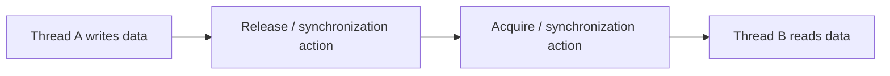
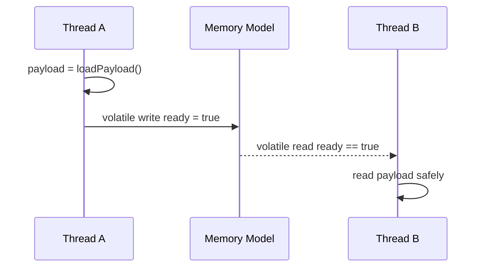
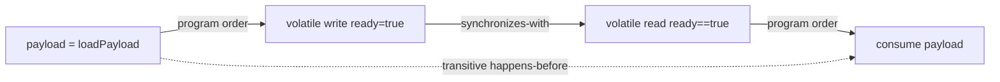

------
title: Learn Java Concurrency & Correctness - Part 006
description: Java Memory Model foundation: visibility, ordering, happens-before, synchronization actions, correctly synchronized programs, and practical design rules.
series: learn-java-concurrency-correctness
seriesTitle: Learn Java Concurrency & Correctness
order: 6
partTitle: Java Memory Model Foundation
tags:
- java
- concurrency
- correctness
- java-memory-model
- happens-before
- visibility
- ordering
date: 2026-06-28
---

# Part 006 — Java Memory Model Foundation

The Java Memory Model, usually abbreviated as **JMM**, is the specification that defines which writes a read is allowed to observe in a multithreaded Java program.

That sounds abstract, but it answers concrete production questions:

- If one thread sets a stop flag, will another thread see it?
- If one thread initializes an object and publishes it, can another thread see partially initialized fields?
- If a field is written before another field, can a reader observe them in the opposite order?
- What does `synchronized` actually guarantee beyond mutual exclusion?
- Why does `volatile` fix some bugs but not others?
- Why can a program look correct in tests but fail under load?

This part builds the memory model required for the next parts: `volatile`, final fields, safe publication, locks, atomics, executors, virtual threads, and reactive boundaries.

---

## 1. Kaufman Skill Deconstruction

To become effective with the JMM, do not try to memorize every formal rule first. Deconstruct the skill into operational subskills:

1. Recognize shared mutable variables.
2. Distinguish atomicity, visibility, and ordering.
3. Identify synchronization actions.
4. Draw happens-before relationships.
5. Check whether every conflicting access is ordered.
6. Reason about safe publication.
7. Avoid relying on timing, sleep, logging, or CPU behavior.
8. Design classes so their invariants do not require heroic memory-model reasoning.

The goal is not to become a language-lawyer. The goal is to become reliable under production concurrency.

---

## 2. Why Java Needs a Memory Model

A single-threaded program can mostly be understood as if statements execute in program order.

A multithreaded program cannot be understood that way unless the program is correctly synchronized.

Modern execution includes:

1. Compiler transformations.
2. JIT optimization.
3. CPU cache hierarchy.
4. Store buffers.
5. Instruction reordering.
6. Register allocation.
7. Speculative execution.
8. Multiple cores observing memory at different times.

The JMM defines the legal outcomes for Java programs despite those optimizations.

Without a memory model, every JVM/CPU combination could expose different behavior. With a memory model, Java can allow aggressive optimization while defining correctness rules for concurrent programs.

---

## 3. The Three Questions

When analyzing shared memory, ask three separate questions.

### 3.1 Atomicity

Is the operation indivisible?

```java
count++;
```

No. It is read-modify-write.

### 3.2 Visibility

If one thread writes, is another thread guaranteed to see it?

```java
stopped = true;
```

Not necessarily, unless there is a happens-before relationship.

### 3.3 Ordering

If one thread performs operation A before operation B, must another thread observe A before B?

```java
payload = loadPayload();
ready = true;
```

Not necessarily, unless `ready` is `volatile`, the accesses are lock-protected, or another synchronization relationship exists.

These are distinct. `volatile` can help visibility and ordering for a variable access, but it does not make compound actions atomic.

---

## 4. Sequential Consistency: The Model Engineers Wish They Had

Sequential consistency means the result of execution is as if:

1. Operations of all threads were interleaved in one global order.
2. Each thread's operations appeared in its own program order.

That is the intuitive model most engineers assume.

But Java only gives this simple model for programs that are correctly synchronized.

A key JMM principle:

> If a program has no data races, its executions appear sequentially consistent.

This is why avoiding data races is not academic. Data-race-free programs are much easier to reason about.

---

## 5. Program Order Is Not Enough

Inside one thread, the code has **program order**.

```java
x = 1;
y = 2;
```

Thread A executes `x = 1` before `y = 2` in program order.

But program order is not automatically a visibility guarantee to Thread B.

```java
final class Pair {
    int x;
    int y;
}

Pair pair = new Pair();

// Thread A
pair.x = 1;
pair.y = 2;

// Thread B
System.out.println(pair.y);
System.out.println(pair.x);
```

Without synchronization, Thread B is not guaranteed to observe a coherent story that matches Thread A's program order.

The JMM is about the relationship between actions across threads, not just order within one thread.

---

## 6. Happens-Before

The most practical JMM concept is **happens-before**.

If action A happens-before action B, then effects of A are visible to B, and A is ordered before B for memory-model purposes.

Think of happens-before as a visibility/ordering bridge.



No bridge, no reliable visibility.

---

## 7. Core Happens-Before Edges

You do not need every formal edge on day one, but you must internalize the common ones.

| Edge | Meaning |
|---|---|
| Program order | Within one thread, earlier actions happen-before later actions |
| Monitor unlock → subsequent monitor lock | Exiting a synchronized block happens-before another thread enters synchronized block on same monitor |
| Volatile write → subsequent volatile read | A write to a volatile field happens-before a later read of that same field |
| Thread start | Actions before `Thread.start()` happen-before actions in the started thread |
| Thread termination → join return | Actions in a thread happen-before another thread successfully returns from `join()` |
| Default initialization | Default writes to fields happen-before other actions |
| Transitivity | If A happens-before B and B happens-before C, then A happens-before C |

The engineering use of this table:

> For every reader that must observe a writer, identify the happens-before path.

If you cannot identify the path, the design is relying on luck.

---

## 8. Example: Broken Stop Flag

```java
final class Worker implements Runnable {
    private boolean stopped;

    void stop() {
        stopped = true;
    }

    @Override
    public void run() {
        while (!stopped) {
            doWork();
        }
    }

    private void doWork() {
        // work
    }
}
```

One thread calls `stop()`. Another thread runs the loop.

There is no happens-before relationship between the write and the read.

Possible consequences:

1. The worker sees the update late.
2. The worker never sees the update.
3. The JIT optimizes based on the assumption that `stopped` is not changed by the current thread.

Correct with `volatile`:

```java
final class Worker implements Runnable {
    private volatile boolean stopped;

    void stop() {
        stopped = true;
    }

    @Override
    public void run() {
        while (!stopped) {
            doWork();
        }
    }

    private void doWork() {
        // work
    }
}
```

Now the volatile write in `stop()` happens-before a subsequent volatile read in `run()` that observes it.

But `volatile` is appropriate here because the invariant is a single flag. It would not be enough for a complex multi-field transition.

---

## 9. Example: Ready Flag and Payload

Broken:

```java
final class Holder {
    private Payload payload;
    private boolean ready;

    void publish() {
        payload = loadPayload();
        ready = true;
    }

    Payload consumeIfReady() {
        if (ready) {
            return payload;
        }
        return null;
    }
}
```

A reader might observe `ready == true` but not reliably observe the initialized `payload`.

Correct with volatile flag:

```java
final class Holder {
    private Payload payload;
    private volatile boolean ready;

    void publish() {
        payload = loadPayload();
        ready = true;
    }

    Payload consumeIfReady() {
        if (ready) {
            return payload;
        }
        return null;
    }
}
```

Why this works:

1. In Thread A, `payload = loadPayload()` happens-before `ready = true` by program order.
2. The volatile write to `ready` happens-before Thread B's subsequent volatile read of `ready` that sees `true`.
3. By transitivity, the payload write happens-before the payload read.

Diagram:



This is the classic release/acquire pattern using a volatile flag.

---

## 10. Locks Give Visibility, Not Just Mutual Exclusion

Many engineers understand locks as “only one thread at a time”. That is only half the story.

`synchronized` also creates happens-before edges.

```java
final class LockedHolder {
    private Payload payload;
    private boolean ready;

    synchronized void publish() {
        payload = loadPayload();
        ready = true;
    }

    synchronized Payload consumeIfReady() {
        return ready ? payload : null;
    }
}
```

When Thread A exits `publish()`, it unlocks the monitor. When Thread B enters `consumeIfReady()`, it locks the same monitor. The unlock happens-before the subsequent lock.

That means Thread B sees effects made visible by Thread A inside the synchronized region.

Important:

> The same lock must protect both read and write paths.

This is broken:

```java
final class HalfLockedHolder {
    private Payload payload;
    private boolean ready;

    synchronized void publish() {
        payload = loadPayload();
        ready = true;
    }

    Payload consumeIfReady() {
        return ready ? payload : null; // not synchronized
    }
}
```

The writer uses a lock, but the reader does not participate in the same happens-before protocol.

---

## 11. Volatile Is Not a Lightweight Lock

`volatile` gives visibility and ordering around reads/writes of a variable. It does not provide mutual exclusion for compound actions.

Broken:

```java
final class VolatileCounter {
    private volatile int count;

    void increment() {
        count++;
    }

    int value() {
        return count;
    }
}
```

The read and write of `count` are individually volatile, but `count++` is still:

```text
volatile read
add
volatile write
```

Two threads can still lose updates.

Use `volatile` when:

1. A single variable represents state.
2. Writes do not depend on the current value, or there is only one writer.
3. You need publication/visibility signaling.
4. You do not need compound atomicity.

Use a lock/atomic/CAS/state machine when mutation depends on current state.

---

## 12. Correctly Synchronized Programs

A program is correctly synchronized when all conflicting accesses to shared variables are ordered by happens-before.

A conflicting access means:

1. Two accesses to the same variable.
2. At least one is a write.
3. They are from different threads.

If all such conflicts are ordered, the program is data-race-free.

A practical review process:

```text
For every mutable shared field:
  list all writes
  list all reads
  for each read/write pair across threads:
    identify happens-before edge
  if none exists:
    data race
```

This is tedious at first, but it becomes a design habit.

---

## 13. Data-Race-Free Does Not Mean Business-Correct

A data-race-free program avoids undefined memory visibility behavior. It can still be logically wrong.

Example:

```java
final class BookingService {
    private final AtomicInteger remaining = new AtomicInteger(1);

    boolean tryBook() {
        if (remaining.get() <= 0) {
            return false;
        }
        remaining.decrementAndGet();
        return true;
    }
}
```

The atomic operations are individually race-free, but the business operation is not atomic.

Correct:

```java
final class BookingService {
    private final AtomicInteger remaining = new AtomicInteger(1);

    boolean tryBook() {
        while (true) {
            int current = remaining.get();
            if (current <= 0) {
                return false;
            }
            if (remaining.compareAndSet(current, current - 1)) {
                return true;
            }
        }
    }
}
```

or with a lock:

```java
final class BookingService {
    private int remaining = 1;

    synchronized boolean tryBook() {
        if (remaining <= 0) {
            return false;
        }
        remaining--;
        return true;
    }
}
```

The JMM tells you which writes are visible. It does not automatically validate your domain invariant.

---

## 14. Reordering: The Bug You Cannot See Locally

Consider:

```java
int x = 0;
boolean ready = false;

// Thread A
x = 42;
ready = true;

// Thread B
if (ready) {
    assert x == 42;
}
```

Without synchronization, the assertion is not guaranteed.

The issue is not only literal CPU reordering. The JMM allows the runtime to produce results consistent with legal executions where Thread B does not get the visibility/order guarantee you intended.

Correct approaches:

```java
volatile boolean ready;
```

or:

```java
synchronized (lock) {
    x = 42;
    ready = true;
}
```

and corresponding synchronized read.

Do not reason from the source-code order alone. Reason from happens-before.

---

## 15. Thread Start and Join

### 15.1 Start Edge

Actions before starting a thread happen-before actions inside the started thread.

```java
var config = new Config("v1");
var worker = new Thread(() -> use(config));
worker.start();
```

The writes that prepared `config` before `start()` are visible to the new thread, assuming `config` is not mutated unsafely afterward.

### 15.2 Join Edge

Actions performed by a thread happen-before another thread returns from `join()` on that thread.

```java
var result = new ResultBox();
var thread = new Thread(() -> result.value = compute());
thread.start();
thread.join();
System.out.println(result.value);
```

The write in the worker is visible after successful `join()`.

This is why test code that starts threads and joins them can read final results safely, even if the internal operation itself may have been racy.

---

## 16. Default Initialization

Java guarantees default initialization of fields before other actions.

For example, object fields start as `0`, `false`, or `null` before normal writes occur.

However, default initialization is not a substitute for safe publication. A thread may see default values for fields if an object is improperly published before construction/initialization effects are visible.

This is one reason constructor escape is dangerous.

---

## 17. Final Fields and Initialization Safety

`final` fields have special JMM semantics. Properly constructed objects with final fields provide stronger initialization safety guarantees.

Example:

```java
record Rule(String id, String expression) {}
```

Records are naturally useful for immutable data carriers because their components are final.

But final-field safety has boundaries:

1. Do not let `this` escape during construction.
2. Final reference does not make the referenced object deeply immutable.
3. Mutable objects stored in final fields still need defensive copies or confinement.

Example:

```java
final class RuleSet {
    private final List<Rule> rules;

    RuleSet(List<Rule> rules) {
        this.rules = List.copyOf(rules);
    }

    List<Rule> rules() {
        return rules;
    }
}
```

This combines final-field initialization safety with immutable collection publication.

Final fields are important enough that the next part will treat `volatile`, `final`, and safe publication in more detail.

---

## 18. Happens-Before Transitivity

Transitivity is how simple synchronization edges compose into real systems.

Example:

```java
payload = loadPayload();       // A
ready = true;                  // B, volatile write

if (ready) {                   // C, volatile read
    consume(payload);          // D
}
```

Relationships:

```text
A happens-before B       // program order
B happens-before C       // volatile write/read
C happens-before D       // program order
therefore A happens-before D
```

Mermaid view:



This is the core reasoning move of the JMM.

---

## 19. Publication Patterns

Publication means making an object reachable by another thread.

Common publication channels:

1. Assigning to a shared field.
2. Putting into a concurrent collection.
3. Returning from a synchronized method.
4. Starting a thread with captured state.
5. Completing a `Future`/`CompletableFuture`.
6. Sending through a blocking queue.
7. Emitting through a reactive publisher.

The JMM question:

> Does the publication channel create a happens-before relationship from the writer's initialization to the reader's consumption?

Examples:

### 19.1 Unsafe Publication

```java
class Registry {
    static RuleSet current;

    static void reload() {
        current = new RuleSet(loadRules());
    }
}
```

The reference assignment is not enough unless access is otherwise safely published.

### 19.2 Volatile Publication

```java
class Registry {
    static volatile RuleSet current;

    static void reload() {
        current = new RuleSet(loadRules());
    }
}
```

A volatile write publishes the new immutable snapshot to volatile readers.

### 19.3 Lock Publication

```java
class Registry {
    private final Object lock = new Object();
    private RuleSet current;

    void reload() {
        synchronized (lock) {
            current = new RuleSet(loadRules());
        }
    }

    RuleSet current() {
        synchronized (lock) {
            return current;
        }
    }
}
```

Unlock/lock on the same monitor establishes visibility.

---

## 20. The JMM and Virtual Threads

Virtual threads change the cost model of concurrency. They do not change the Java Memory Model.

A virtual thread is still a `Thread` from the perspective of Java code. Shared mutable state accessed by virtual threads must obey the same synchronization rules.

This means:

1. `volatile` means the same thing.
2. `synchronized` means the same thing.
3. Data races are still data races.
4. Safe publication is still required.
5. Thread confinement is less reliable if state is handed across many virtual-thread tasks.

Virtual threads make it easier to write thread-per-task code, but they do not make unsynchronized shared state safe.

---

## 21. The JMM and Async/Reactive Code

Async code often hides threads behind callbacks, futures, schedulers, event loops, or publishers.

The memory-model question remains:

> What guarantees that the producer's write is visible to the consumer's callback?

Libraries such as `CompletableFuture`, blocking queues, executors, and reactive implementations provide their own synchronization internally. But your own shared mutable objects passed through them still need correct ownership.

Bad:

```java
var request = new MutableRequest();
future.thenRun(() -> service.handle(request));
request.setTenantId("changed-after-registration");
```

The issue is ownership, not just memory visibility. Once a mutable object is handed to an async boundary, continuing to mutate it is usually a design smell.

Prefer immutable messages:

```java
record RequestMessage(String requestId, String tenantId, Payload payload) {}
```

---

## 22. Practical Happens-Before Audit

Use this audit when reviewing code.

### 22.1 Field Inventory

```text
Class: RuleEngine

field           mutable?   shared?   protection
config          yes        yes       volatile immutable snapshot
metrics         yes        yes       LongAdder
cache           yes        yes       ConcurrentHashMap + immutable values
lastError       yes        yes       synchronized accessor
```

### 22.2 Access Inventory

```text
field: config
writes:
  reload()
reads:
  decide()
happens-before:
  volatile write in reload -> volatile read in decide
invariant:
  config object must be immutable after publication
```

### 22.3 Red Flags

```text
mutable field + no volatile/lock/atomic/confinement
synchronized writer + unsynchronized reader
volatile reference to mutable object
atomic fields protecting multi-field invariant
this escape during construction
shared collection with mutable values
ThreadLocal value not removed in pooled threads
async callback closes over mutable object
```

---

## 23. Common Misconceptions

### 23.1 “The CPU Is Strong Enough, So It Is Fine”

Java code must be correct under the Java Memory Model, not only under one CPU architecture observed today.

### 23.2 “Sleep Fixes Visibility”

```java
Thread.sleep(100);
```

Sleep does not create a happens-before edge for your shared state.

### 23.3 “Logging Fixes It”

Logging may accidentally add synchronization or alter timing. That does not make your program correct.

### 23.4 “It Is Safe Because the Reference Is Final”

A final reference prevents reassignment of the reference. It does not make the object graph immutable.

```java
private final List<String> ids = new ArrayList<>();
```

The reference is final. The list is mutable.

### 23.5 “Only Writes Need Synchronization”

Readers must participate in the same visibility protocol. A synchronized write with an unsynchronized read is not enough.

---

## 24. Design Rules You Can Apply Immediately

1. Prefer immutable objects for cross-thread communication.
2. Avoid publishing mutable objects before construction is complete.
3. Do not expose internal mutable collections.
4. Use one synchronization strategy per invariant.
5. Protect both reads and writes.
6. Use `volatile` for simple state publication, not compound state transitions.
7. Use locks for multi-field invariants unless you intentionally encode the whole state in one atomic reference.
8. Treat async boundaries as ownership boundaries.
9. Do not rely on `sleep`, logging, tests, or observed timing.
10. Draw happens-before paths for non-trivial concurrent code.

---

## 25. Practice Drills

### Drill 1 — Draw the Happens-Before Graph

Given:

```java
class Holder {
    int x;
    volatile boolean ready;

    void write() {
        x = 10;
        ready = true;
    }

    int read() {
        return ready ? x : -1;
    }
}
```

Draw the happens-before chain from `x = 10` to `return x`.

### Drill 2 — Find the Missing Edge

Given:

```java
class Holder {
    int x;
    boolean ready;

    synchronized void write() {
        x = 10;
        ready = true;
    }

    int read() {
        return ready ? x : -1;
    }
}
```

Explain why this is still broken.

### Drill 3 — Safe Publication Review

Take one cached object in your codebase. Answer:

1. Where is it created?
2. Where is it published?
3. Is the reference published through volatile, lock, concurrent collection, future completion, queue, or another mechanism?
4. Is the object immutable after publication?
5. Can any caller mutate its internals?

### Drill 4 — Replace Sleep

Find any code that uses `Thread.sleep()` to wait for a state change. Replace it with one of:

1. `join()`.
2. `CountDownLatch`.
3. `Future.get()`.
4. `CompletableFuture` completion.
5. Lock/condition.
6. Polling with explicit volatile deadline if appropriate.

Explain the happens-before edge created by the replacement.

---

## 26. Key Takeaways

1. The Java Memory Model defines which writes a read may observe.
2. Program order inside one thread is not enough for cross-thread visibility.
3. Happens-before is the main practical reasoning tool.
4. Locks provide both mutual exclusion and visibility.
5. Volatile provides visibility/ordering for a variable, not compound atomicity.
6. Data-race-free programs are much easier to reason about.
7. Business correctness still requires invariant-level thinking beyond the JMM.
8. Virtual threads and async programming do not remove memory-model obligations.
9. Safe publication requires both a publication mechanism and an immutable/constrained object graph.
10. If you cannot draw the happens-before path, the design is suspect.

---

## References

- Java Language Specification, Chapter 17: Threads and Locks — https://docs.oracle.com/javase/specs/jls/se8/html/jls-17.html
- Java SE 25 `java.lang.Thread` API — https://docs.oracle.com/en/java/javase/25/docs/api/java.base/java/lang/Thread.html
- Java SE 25 `java.util.concurrent` package — https://docs.oracle.com/en/java/javase/25/docs/api/java.base/java/util/concurrent/package-summary.html
- JEP 444: Virtual Threads — https://openjdk.org/jeps/444
