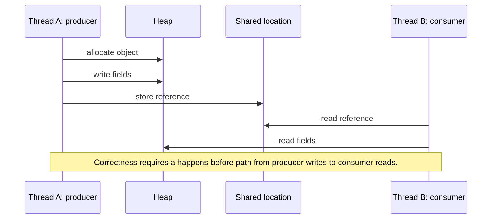
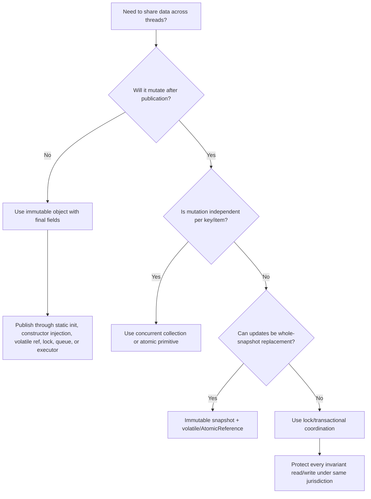

------
title: Learn Java Concurrency & Correctness - Part 007
description: Deep dive into volatile, final fields, initialization safety, object publication, lazy initialization, visibility edges, and practical safe-publication design rules.
series: learn-java-concurrency-correctness
seriesTitle: Learn Java Concurrency & Correctness
order: 7
partTitle: Volatile, Final, and Safe Publication
tags:
- java
- concurrency
- correctness
- volatile
- final
- safe-publication
- java-memory-model
- happens-before
date: 2026-06-28
---

# Part 007 — Volatile, Final, and Safe Publication

A large class of Java concurrency bugs does not come from two threads writing the same counter. It comes from something more subtle:

> One thread creates or updates an object, another thread receives a reference to it, but the second thread is not guaranteed to see the state that the first thread intended to publish.

This is the **publication problem**.

In single-threaded code, construction and visibility feel like the same event. In concurrent Java, they are separate concerns:

1. An object can be allocated.
2. Its fields can be written.
3. A reference to that object can be stored somewhere shared.
4. Another thread can read that reference.
5. That other thread may or may not be guaranteed to see the field writes.

Safe publication is the set of techniques that make step 5 reliable.

This part is about three related tools:

- `final` fields: initialization safety and immutable object foundation.
- `volatile` fields: visibility and ordering through a lightweight synchronization variable.
- safe publication patterns: the practical ways to transfer object state across threads without relying on luck.

This part deliberately focuses on correctness, not micro-optimization. A fast publication bug is still a production incident.

---

## 1. Kaufman Skill Deconstruction

To master safe publication, break the skill into five subskills:

| Subskill | Question it answers |
|---|---|
| Identify publication | "Where does a reference become visible to another thread?" |
| Separate reference visibility from object state visibility | "Seeing the pointer is not the same as seeing the constructor's writes." |
| Choose a happens-before edge | "What rule forces the reader to observe the intended writes?" |
| Preserve immutability boundaries | "Can the published object be mutated after publication?" |
| Audit unsafe escape | "Can `this`, a mutable collection, or an array leak before it is ready?" |

A strong engineer does not ask only, "Is this field `volatile`?" They ask:

> What is the publication channel, what is the visibility edge, and what invariant is the reader allowed to rely on?

---

## 2. The Publication Problem

Consider this code:

```java
final class Config {
    int timeoutMillis;
    String endpoint;
}

final class ConfigRegistry {
    private Config config;

    void load() {
        Config c = new Config();
        c.timeoutMillis = 2_000;
        c.endpoint = "https://api.internal";
        config = c; // publication
    }

    Config current() {
        return config;
    }
}
```

It looks innocent. One thread calls `load()`. Another calls `current()`.

The problem is that the reference assignment `config = c` is visible to other threads without a synchronization edge. The reader may see:

- `config != null`, but stale field values;
- an old version of `config`;
- values that appear out of order relative to another shared flag;
- apparently impossible behavior during stress.

The core issue is this:

> The write of a reference to a shared variable does not automatically make all earlier ordinary field writes visible to another thread.

We need a safe publication mechanism.

---

## 3. Mental Model: Object Construction Is Not Publication

Object construction is a local activity. Publication is a cross-thread visibility event.



The production question is not merely:

> Can another thread get a reference?

The production question is:

> When another thread gets the reference, what visibility guarantees exist for the object graph reachable through that reference?

---

## 4. Happens-Before Edges Used for Publication

Safe publication requires a **happens-before** relationship from the writer's state initialization to the reader's state use.

Common publication mechanisms:

| Mechanism | Publication rule |
|---|---|
| `volatile` reference | Write to a volatile field happens-before subsequent read of that same volatile field. |
| Lock release/acquire | Unlock happens-before subsequent lock on the same monitor/lock. |
| Static initialization | Class initialization safely publishes static fields initialized by the class initializer. |
| `final` fields | Constructor writes to final fields have special initialization-safety guarantees if `this` does not escape. |
| Concurrent collections | Insertion/update operations provide synchronization effects for retrieval through that collection. |
| Blocking queues | Producer handoff through queue establishes ordering to consumer retrieval. |
| Executor submission | Actions before task submission happen-before actions in the task, and task actions happen-before successful `Future.get()`. |
| Thread start/join | Actions before `Thread.start()` happen-before actions in started thread; thread completion happens-before successful `join()`. |

You do not need all of these at once. You need one correct edge for each publication path.

---

## 5. `final` Fields: Initialization Safety

`final` fields are not just about style. They have a special role in the Java Memory Model.

A properly constructed object with `final` fields can be safely read by another thread after publication in ways that ordinary non-final fields cannot. The key condition is:

> The object must not let `this` escape during construction.

Example:

```java
public final class ServiceConfig {
    private final String endpoint;
    private final int timeoutMillis;
    private final Set<String> enabledFeatures;

    public ServiceConfig(String endpoint, int timeoutMillis, Set<String> enabledFeatures) {
        this.endpoint = Objects.requireNonNull(endpoint);
        this.timeoutMillis = timeoutMillis;
        this.enabledFeatures = Set.copyOf(enabledFeatures);
    }

    public String endpoint() {
        return endpoint;
    }

    public int timeoutMillis() {
        return timeoutMillis;
    }

    public Set<String> enabledFeatures() {
        return enabledFeatures;
    }
}
```

This class has three important properties:

1. All fields are `final`.
2. Mutable input is defensively copied.
3. The object does not publish itself during construction.

This makes it a good candidate for safe sharing.

---

## 6. Final Does Not Mean Deeply Immutable

`final` means the field reference cannot be reassigned after construction. It does not mean the referenced object cannot mutate.

Broken example:

```java
public final class BadConfig {
    private final List<String> endpoints;

    public BadConfig(List<String> endpoints) {
        this.endpoints = endpoints; // shares caller-owned mutable list
    }

    public List<String> endpoints() {
        return endpoints; // exposes internal mutable list
    }
}
```

The field is `final`, but the object is not safely immutable. Another thread can mutate the list through the original reference or through the getter.

Corrected version:

```java
public final class GoodConfig {
    private final List<String> endpoints;

    public GoodConfig(List<String> endpoints) {
        this.endpoints = List.copyOf(endpoints);
    }

    public List<String> endpoints() {
        return endpoints;
    }
}
```

The mental model:

> `final` protects the field binding. Immutability requires controlling the whole reachable object graph.

For production review, ask:

- Are all fields final where possible?
- Are mutable constructor inputs copied?
- Are internal arrays copied?
- Are mutable collections wrapped or copied using immutable factories?
- Can any contained object mutate behind the aggregate's back?

---

## 7. Unsafe Escape During Construction

The most dangerous final-field bug is allowing `this` to escape before the constructor finishes.

Bad example:

```java
public final class ListenerService {
    private final EventBus eventBus;
    private final Map<String, Handler> handlers;

    public ListenerService(EventBus eventBus) {
        this.eventBus = eventBus;
        eventBus.register(this); // this escapes too early
        this.handlers = Map.of("created", this::onCreated);
    }

    private void onCreated(Event event) {
        // handlers may not be visible as initialized if callback occurs during construction
    }
}
```

If `eventBus.register(this)` stores the reference or triggers a callback, another thread can observe the object before construction completes.

Better:

```java
public final class ListenerService {
    private final EventBus eventBus;
    private final Map<String, Handler> handlers;

    public ListenerService(EventBus eventBus) {
        this.eventBus = Objects.requireNonNull(eventBus);
        this.handlers = Map.of("created", this::onCreated);
    }

    public void start() {
        eventBus.register(this);
    }

    private void onCreated(Event event) {
        // fully constructed object
    }
}
```

This separates construction from lifecycle publication.

Production rule:

> Constructors should initialize state, not start threads, register callbacks, publish references, or call overridable methods.

---

## 8. Constructor Anti-Patterns

Avoid these inside constructors:

```java
new Thread(this::run).start();
```

```java
executor.submit(this::run);
```

```java
registry.put(id, this);
```

```java
eventBus.subscribe(this);
```

```java
callback.accept(this);
```

```java
this.someOverridableMethod();
```

All of these can expose the object before it is fully initialized or before subclass initialization completes.

A safer pattern is:

```java
public final class Worker implements AutoCloseable {
    private final ExecutorService executor;
    private final AtomicBoolean started = new AtomicBoolean();

    public Worker(ExecutorService executor) {
        this.executor = Objects.requireNonNull(executor);
    }

    public void start() {
        if (started.compareAndSet(false, true)) {
            executor.submit(this::run);
        }
    }

    private void run() {
        // object is constructed before publication to executor
    }

    @Override
    public void close() {
        // shutdown coordination
    }
}
```

Construction and execution are distinct phases.

---

## 9. `volatile`: What It Guarantees

A `volatile` field gives two core guarantees:

1. **Visibility**: a write to a volatile field is visible to subsequent reads of that same volatile field.
2. **Ordering**: ordinary writes before a volatile write cannot be reordered after it in a way that breaks the happens-before relationship; ordinary reads after a volatile read cannot be reordered before it in a way that breaks the relationship.

Example:

```java
public final class StopSignal {
    private volatile boolean stopped;

    public void stop() {
        stopped = true;
    }

    public boolean isStopped() {
        return stopped;
    }
}
```

This is a valid use of `volatile` because the variable represents a single independent state flag.

The write:

```java
stopped = true;
```

happens-before a later read that observes it:

```java
if (stopped) { ... }
```

---

## 10. Volatile Publication

A common safe-publication pattern is storing an immutable object in a volatile reference.

```java
public final class ConfigProvider {
    private volatile ServiceConfig current = new ServiceConfig(
        "https://default.internal",
        1_000,
        Set.of()
    );

    public ServiceConfig current() {
        return current;
    }

    public void reload(ServiceConfig next) {
        current = Objects.requireNonNull(next);
    }
}
```

Why this works:

1. `ServiceConfig` is immutable.
2. The `current` reference is volatile.
3. Writers publish a complete replacement object.
4. Readers take a snapshot reference and use it.

This is excellent for:

- runtime configuration;
- feature flag snapshots;
- routing tables;
- read-mostly state;
- immutable policy objects;
- versioned rule sets.

It is poor for:

- multi-step mutation of the same object;
- frequent write-heavy counters;
- invariants spanning multiple mutable objects;
- transactional updates requiring validation against current state.

---

## 11. Volatile Is Not a Lock

This code is broken:

```java
public final class BrokenCounter {
    private volatile int count;

    public void increment() {
        count++;
    }

    public int get() {
        return count;
    }
}
```

`count++` is not one operation. It is conceptually:

1. read `count`;
2. add one;
3. write `count`.

`volatile` makes reads/writes visible, but it does not make the read-modify-write sequence atomic.

Correct alternatives:

```java
public final class LockedCounter {
    private int count;

    public synchronized void increment() {
        count++;
    }

    public synchronized int get() {
        return count;
    }
}
```

or:

```java
public final class AtomicCounter {
    private final AtomicInteger count = new AtomicInteger();

    public void increment() {
        count.incrementAndGet();
    }

    public int get() {
        return count.get();
    }
}
```

We will go deeper into atomicity in Part 008.

Rule:

> Use `volatile` for visibility of independent state, not for protecting compound actions.

---

## 12. Good Uses of Volatile

### 12.1 Cancellation Flags

```java
public final class PollingWorker implements Runnable {
    private volatile boolean cancelled;

    public void cancel() {
        cancelled = true;
    }

    @Override
    public void run() {
        while (!cancelled) {
            pollOnce();
        }
    }

    private void pollOnce() {
        // perform bounded work
    }
}
```

This is acceptable only if `pollOnce()` is bounded or interruptible. A volatile flag does not wake a blocked thread.

If the worker blocks on IO, queue take, sleep, or lock acquisition, you also need interruption, timeout, or resource closure.

### 12.2 Mode Switches

```java
public enum Mode {
    NORMAL,
    DEGRADED,
    READ_ONLY
}

public final class ModeSwitch {
    private volatile Mode mode = Mode.NORMAL;

    public Mode currentMode() {
        return mode;
    }

    public void switchTo(Mode next) {
        mode = Objects.requireNonNull(next);
    }
}
```

This works because the variable is a single state value.

### 12.3 Immutable Snapshot Replacement

```java
public record RoutingSnapshot(
    long version,
    Map<String, URI> routes
) {
    public RoutingSnapshot {
        routes = Map.copyOf(routes);
    }
}

public final class RouterTable {
    private volatile RoutingSnapshot snapshot = new RoutingSnapshot(0, Map.of());

    public URI route(String key) {
        return snapshot.routes().get(key);
    }

    public void replace(RoutingSnapshot next) {
        snapshot = Objects.requireNonNull(next);
    }
}
```

This is one of the best volatile patterns: immutable aggregate + volatile reference.

---

## 13. Bad Uses of Volatile

### 13.1 Volatile Mutable Holder

```java
public final class BadRegistry {
    private volatile Map<String, Handler> handlers = new HashMap<>();

    public void register(String name, Handler handler) {
        handlers.put(name, handler); // mutates shared HashMap
    }

    public Handler find(String name) {
        return handlers.get(name);
    }
}
```

The reference is volatile, but the map is mutable and not thread-safe.

Safer options:

Use immutable copy-on-write snapshot:

```java
public final class SnapshotRegistry {
    private volatile Map<String, Handler> handlers = Map.of();

    public synchronized void register(String name, Handler handler) {
        Map<String, Handler> copy = new HashMap<>(handlers);
        copy.put(name, handler);
        handlers = Map.copyOf(copy);
    }

    public Handler find(String name) {
        return handlers.get(name);
    }
}
```

or use a concurrent collection when independent per-key updates are acceptable:

```java
public final class ConcurrentRegistry {
    private final ConcurrentHashMap<String, Handler> handlers = new ConcurrentHashMap<>();

    public void register(String name, Handler handler) {
        handlers.put(name, handler);
    }

    public Handler find(String name) {
        return handlers.get(name);
    }
}
```

The correct choice depends on the invariant:

- Need whole-table atomic replacement? Use immutable snapshot.
- Need independent key-level updates? Use concurrent map.
- Need multi-key invariant? Use lock or immutable aggregate replacement.

### 13.2 Volatile Pair Invariant

```java
public final class BadRange {
    private volatile int lower;
    private volatile int upper;

    public void setLower(int value) {
        if (value > upper) {
            throw new IllegalArgumentException();
        }
        lower = value;
    }

    public void setUpper(int value) {
        if (value < lower) {
            throw new IllegalArgumentException();
        }
        upper = value;
    }
}
```

Each field is visible independently, but the invariant `lower <= upper` spans both fields. Volatile cannot protect the compound invariant.

Better:

```java
public final class Range {
    private int lower;
    private int upper;

    public synchronized void setLower(int value) {
        if (value > upper) {
            throw new IllegalArgumentException();
        }
        lower = value;
    }

    public synchronized void setUpper(int value) {
        if (value < lower) {
            throw new IllegalArgumentException();
        }
        upper = value;
    }

    public synchronized int lower() {
        return lower;
    }

    public synchronized int upper() {
        return upper;
    }
}
```

or immutable aggregate:

```java
public record RangeSnapshot(int lower, int upper) {
    public RangeSnapshot {
        if (lower > upper) {
            throw new IllegalArgumentException("lower > upper");
        }
    }
}

public final class SnapshotRange {
    private volatile RangeSnapshot range = new RangeSnapshot(0, 0);

    public RangeSnapshot current() {
        return range;
    }

    public void replace(RangeSnapshot next) {
        range = Objects.requireNonNull(next);
    }
}
```

---

## 14. Safe Publication Patterns

### 14.1 Immutable Object Published Through Constructor

```java
public final class ApplicationService {
    private final ServiceConfig config;

    public ApplicationService(ServiceConfig config) {
        this.config = Objects.requireNonNull(config);
    }

    public void handle(Request request) {
        use(config);
    }
}
```

If `ApplicationService` itself is safely published by a DI container, class initialization, or thread-confined startup before workers begin, the final field is a stable dependency.

### 14.2 Static Final Constants

```java
public final class Defaults {
    public static final ServiceConfig CONFIG = new ServiceConfig(
        "https://default.internal",
        1_000,
        Set.of("health")
    );

    private Defaults() {}
}
```

Class initialization provides safe publication.

### 14.3 Initialization-on-Demand Holder

```java
public final class ExpensiveClientProvider {
    private ExpensiveClientProvider() {}

    public static ExpensiveClient instance() {
        return Holder.INSTANCE;
    }

    private static final class Holder {
        private static final ExpensiveClient INSTANCE = createClient();
    }

    private static ExpensiveClient createClient() {
        return new ExpensiveClient();
    }
}
```

This is lazy, thread-safe, and does not require explicit locks in user code.

### 14.4 Volatile Reference

```java
public final class RulesEngine {
    private volatile RuleSet rules = RuleSet.empty();

    public Decision evaluate(Input input) {
        return rules.evaluate(input);
    }

    public void updateRules(RuleSet next) {
        rules = Objects.requireNonNull(next);
    }
}
```

Use this when readers can tolerate snapshot semantics.

### 14.5 Lock-Protected Publication

```java
public final class LockedConfigProvider {
    private ServiceConfig current;

    public synchronized ServiceConfig current() {
        return current;
    }

    public synchronized void reload(ServiceConfig next) {
        current = Objects.requireNonNull(next);
    }
}
```

Simple, correct, sometimes entirely sufficient.

### 14.6 Concurrent Collection Publication

```java
public final class HandlerDirectory {
    private final ConcurrentHashMap<String, Handler> handlers = new ConcurrentHashMap<>();

    public void register(String key, Handler handler) {
        handlers.put(key, handler);
    }

    public Handler handler(String key) {
        return handlers.get(key);
    }
}
```

This works for independent entries. It may not work for invariants across entries.

### 14.7 Queue Handoff

```java
public final class WorkDispatcher {
    private final BlockingQueue<WorkItem> queue = new ArrayBlockingQueue<>(1_000);

    public void submit(WorkItem item) throws InterruptedException {
        queue.put(item);
    }

    public WorkItem take() throws InterruptedException {
        return queue.take();
    }
}
```

The queue is both a coordination mechanism and a publication mechanism.

---

## 15. Double-Checked Locking

Double-checked locking was historically broken without `volatile`. With `volatile`, it can be correct, but it is still easy to misuse.

Correct form:

```java
public final class LazyClientProvider {
    private volatile ExpensiveClient client;

    public ExpensiveClient client() {
        ExpensiveClient local = client;
        if (local == null) {
            synchronized (this) {
                local = client;
                if (local == null) {
                    local = new ExpensiveClient();
                    client = local;
                }
            }
        }
        return local;
    }
}
```

Important details:

- `client` must be `volatile`.
- Read into a local variable to reduce volatile reads and preserve clarity.
- The object constructor must not leak `this`.
- Initialization failure policy must be explicit.

Often better:

```java
public final class ClientProvider {
    public ExpensiveClient client() {
        return Holder.INSTANCE;
    }

    private static final class Holder {
        private static final ExpensiveClient INSTANCE = new ExpensiveClient();
    }
}
```

Use double-checked locking only when instance-level lazy initialization is truly needed.

---

## 16. Publication and Object Graphs

Safe publication of a reference does not automatically make future unsynchronized mutations safe.

Example:

```java
public final class MutableCatalog {
    private final Map<String, Product> products = new HashMap<>();

    public void add(Product product) {
        products.put(product.id(), product);
    }

    public Product find(String id) {
        return products.get(id);
    }
}
```

Even if a `MutableCatalog` reference is safely published, concurrent calls to `add()` and `find()` are unsafe because the internal `HashMap` is mutable and not synchronized.

Safe publication answers:

> Can other threads initially see the object correctly?

Thread safety answers:

> Can other threads keep using the object correctly while it mutates?

Those are related but not identical.

---

## 17. Snapshot Design Pattern

For many enterprise systems, the best publication pattern is immutable snapshots.

Example use cases:

- pricing rules;
- enforcement policy rules;
- workflow transition tables;
- routing metadata;
- authorization decision configuration;
- feature flags;
- jurisdiction mappings;
- SLA thresholds.

Pattern:

```java
public record PolicySnapshot(
    long version,
    Instant loadedAt,
    Map<String, Rule> rulesByCode,
    Map<String, EscalationPath> escalationByRegion
) {
    public PolicySnapshot {
        rulesByCode = Map.copyOf(rulesByCode);
        escalationByRegion = Map.copyOf(escalationByRegion);
    }
}

public final class PolicyRepository {
    private volatile PolicySnapshot current = emptySnapshot();

    public PolicySnapshot current() {
        return current;
    }

    public void replace(PolicySnapshot next) {
        current = Objects.requireNonNull(next);
    }

    private static PolicySnapshot emptySnapshot() {
        return new PolicySnapshot(0, Instant.EPOCH, Map.of(), Map.of());
    }
}
```

Advantages:

- Readers do not lock.
- Readers see internally consistent snapshots.
- Writers publish whole versions atomically.
- Rollback is easy.
- Observability can attach version IDs to decisions.

Limitations:

- Large snapshots may cost memory.
- Write-heavy use cases may be inefficient.
- Deep immutability must be enforced.
- Stale reads are possible by design.

---

## 18. Safe Publication Decision Tree



Use this decision tree during design reviews.

---

## 19. Safe Publication Is a Boundary Concern

Publication often happens at boundaries:

| Boundary | Common risk | Safer model |
|---|---|---|
| Constructor to background thread | `this` escapes before initialized | `start()` method after construction |
| Config reload | Partial mutable update | immutable snapshot replacement |
| Cache refresh | mutable map shared with readers | concurrent map or copy-on-write snapshot |
| Dependency injection | object lifecycle unclear | constructor-injected final dependencies |
| Event listener registration | callback during construction | register after construction |
| Async task submission | mutable capture changes later | capture immutable request snapshot |
| Scheduled jobs | stale or shared state | explicit state ownership and publication |

When reviewing code, search for verbs like:

- `start`
- `submit`
- `register`
- `publish`
- `put`
- `set`
- `reload`
- `refresh`
- `schedule`
- `subscribe`

These are often publication points.

---

## 20. Capturing Variables for Async Work

A common publication bug is capturing mutable state in async tasks.

Bad:

```java
public void process(Request request) {
    MutableContext context = new MutableContext();
    context.setTenant(request.tenant());

    executor.submit(() -> audit(context));

    context.setTenant("changed");
}
```

The async task observes a shared mutable object whose state may change after submission.

Better:

```java
public void process(Request request) {
    AuditContext context = new AuditContext(request.tenant(), request.userId(), Instant.now());
    executor.submit(() -> audit(context));
}

public record AuditContext(String tenant, String userId, Instant capturedAt) {}
```

Async boundaries should usually capture immutable snapshots, not mutable request contexts.

---

## 21. Safe Publication with `AtomicReference`

`AtomicReference` can be used as a publication mechanism and as a foundation for CAS-based updates.

```java
public final class AtomicSnapshotStore {
    private final AtomicReference<PolicySnapshot> current = new AtomicReference<>(emptySnapshot());

    public PolicySnapshot current() {
        return current.get();
    }

    public void replace(PolicySnapshot next) {
        current.set(Objects.requireNonNull(next));
    }
}
```

For plain get/set snapshot replacement, `volatile` is often simpler. `AtomicReference` becomes useful when updates depend on the current value:

```java
public void update(UnaryOperator<PolicySnapshot> updater) {
    current.updateAndGet(old -> {
        PolicySnapshot next = updater.apply(old);
        return Objects.requireNonNull(next);
    });
}
```

However, if the update function has side effects, retries can duplicate those side effects. We will discuss this in Part 008.

---

## 22. Safe Publication and Records

Records are a strong fit for immutable data carriers, but records do not automatically make contained objects immutable.

Good:

```java
public record UserSnapshot(
    String id,
    String email,
    Set<String> roles
) {
    public UserSnapshot {
        roles = Set.copyOf(roles);
    }
}
```

Bad:

```java
public record BadUserSnapshot(
    String id,
    List<String> roles
) {}
```

The list can be mutated externally if the caller keeps a reference.

Rule:

> A record gives shallow final fields. You still own deep immutability decisions.

---

## 23. Arrays Are Mutable Even When Final

Bad:

```java
public final class DigestHolder {
    private final byte[] digest;

    public DigestHolder(byte[] digest) {
        this.digest = digest;
    }

    public byte[] digest() {
        return digest;
    }
}
```

Correct:

```java
public final class DigestHolder {
    private final byte[] digest;

    public DigestHolder(byte[] digest) {
        this.digest = digest.clone();
    }

    public byte[] digest() {
        return digest.clone();
    }
}
```

This is not only a security issue. It is also a concurrency issue because arrays can be mutated concurrently through aliases.

---

## 24. Safe Publication and Dependency Injection

In frameworks, object publication may be handled by the container, but your class still controls its internal thread-safety boundaries.

Good service shape:

```java
public final class CaseDecisionService {
    private final PolicyRepository policies;
    private final Clock clock;
    private final DecisionAuditSink auditSink;

    public CaseDecisionService(
        PolicyRepository policies,
        Clock clock,
        DecisionAuditSink auditSink
    ) {
        this.policies = Objects.requireNonNull(policies);
        this.clock = Objects.requireNonNull(clock);
        this.auditSink = Objects.requireNonNull(auditSink);
    }

    public Decision decide(CaseInput input) {
        PolicySnapshot snapshot = policies.current();
        Decision decision = snapshot.evaluate(input, clock.instant());
        auditSink.record(decision);
        return decision;
    }
}
```

The service itself is stateless with final dependencies. Mutable behavior is isolated inside dependencies that own their publication mechanisms.

Bad service shape:

```java
public final class CaseDecisionService {
    private CaseInput lastInput;
    private Decision lastDecision;

    public Decision decide(CaseInput input) {
        lastInput = input;
        lastDecision = compute(input);
        return lastDecision;
    }
}
```

This stores per-request state in a shared singleton service, creating data races and publication bugs.

---

## 25. Practical Design Rules

### Rule 1: Prefer Immutability for Shared Objects

If multiple threads read the same object, make the object immutable unless mutation is essential.

### Rule 2: Publish Immutable Snapshots, Not Mutable Internals

If data changes occasionally, replace the whole snapshot instead of mutating a shared object in place.

### Rule 3: Use One Synchronization Jurisdiction per Invariant

If multiple fields form one invariant, protect all reads and writes through the same lock, atomic reference, or snapshot.

### Rule 4: Do Not Start Threads in Constructors

Do not publish `this` before construction completes.

### Rule 5: Volatile Is for Visibility, Not Compound Invariants

A volatile variable is good for independent flags and snapshot references. It is not a substitute for a lock.

### Rule 6: Copy Mutable Inputs and Outputs

Especially arrays, lists, maps, sets, and mutable domain objects.

### Rule 7: Treat Async Boundaries as Publication Boundaries

Task submission, scheduling, event emission, queue handoff, and callback registration publish data.

---

## 26. Review Checklist

Use this checklist in code review:

```text
Safe Publication Review

[ ] What object/reference crosses a thread boundary?
[ ] Through what shared location or handoff mechanism does it cross?
[ ] What happens-before edge makes the writer's state visible to the reader?
[ ] Is the object immutable after publication?
[ ] If not immutable, what protects future mutation?
[ ] Are all fields that can be final declared final?
[ ] Are mutable constructor inputs defensively copied?
[ ] Are mutable getters exposing internal state?
[ ] Can 'this' escape from the constructor?
[ ] Are background threads/tasks started after construction?
[ ] Is volatile being used only for independent state or snapshot references?
[ ] Are multi-field invariants protected as a unit?
```

---

## 27. Common Interview-Grade Trap Questions

### "If a field is final, is the object thread-safe?"

No. Final fields help with initialization safety and prevent reassignment of the field. The object may still expose mutable state or reference mutable objects.

### "If a reference is volatile, is the object it points to thread-safe?"

No. Volatile safely publishes the reference and gives visibility for the reference access. The object can still be internally unsafe if it mutates without synchronization.

### "Can I use volatile instead of synchronized?"

Sometimes, only when the state is independent and the operation does not require compound atomicity or multi-field invariants.

### "Is double-checked locking safe in modern Java?"

Yes, if the field is volatile and construction does not leak the object. But the initialization-on-demand holder idiom is often simpler.

### "Can a constructor publish `this` if all fields are final?"

No. Letting `this` escape during construction can break initialization safety.

---

## 28. Production Failure Modes

| Failure mode | Symptom | Root cause |
|---|---|---|
| Stale config | service ignores recent reload | non-volatile mutable reference or unsafely published snapshot |
| Partial config | some fields updated, others old | in-place mutation without invariant boundary |
| Rare NPE after startup | field appears null despite constructor assignment | unsafe publication or `this` escape |
| Listener sees invalid state | callback invoked during registration in constructor | premature escape |
| Counter loses updates | lower than expected count | volatile used for non-atomic increment |
| Range invariant broken | impossible lower/upper pair | separate volatile fields for one invariant |
| Request data contamination | async task sees wrong user/tenant | shared mutable context captured into task |
| Memory leak | static registry retains object forever | uncontrolled publication and lifecycle |

---

## 29. Mini Case Study: Runtime Policy Reload

### Bad Design

```java
public final class PolicyEngine {
    private final Map<String, Rule> rules = new HashMap<>();

    public void reload(List<Rule> loadedRules) {
        rules.clear();
        for (Rule rule : loadedRules) {
            rules.put(rule.code(), rule);
        }
    }

    public Decision decide(Input input) {
        Rule rule = rules.get(input.code());
        return rule.evaluate(input);
    }
}
```

Problems:

- Readers can observe the map while it is partially cleared.
- `HashMap` is not safe for concurrent mutation and reads.
- There is no version identifier for audit.
- Reload failure can leave partially updated state.

### Better Design

```java
public record PolicySnapshot(
    long version,
    Instant loadedAt,
    Map<String, Rule> rules
) {
    public PolicySnapshot {
        rules = Map.copyOf(rules);
    }
}

public final class PolicyEngine {
    private volatile PolicySnapshot current = new PolicySnapshot(0, Instant.EPOCH, Map.of());

    public Decision decide(Input input) {
        PolicySnapshot snapshot = current;
        Rule rule = snapshot.rules().get(input.code());
        if (rule == null) {
            return Decision.noRule(snapshot.version());
        }
        return rule.evaluate(input, snapshot.version());
    }

    public void reload(List<Rule> loadedRules) {
        Map<String, Rule> nextRules = loadedRules.stream()
            .collect(Collectors.toUnmodifiableMap(Rule::code, Function.identity()));

        PolicySnapshot next = new PolicySnapshot(
            current.version() + 1,
            Instant.now(),
            nextRules
        );

        current = next;
    }
}
```

Benefits:

- Readers always see a complete snapshot.
- Reload is atomic from reader perspective.
- Audit can record policy version.
- No reader lock required.

Remaining concerns:

- `Rule` must also be immutable or thread-safe.
- Version increment may require stronger atomicity if multiple reloaders exist.
- Large snapshots may need memory budgeting.

---

## 30. Deliberate Practice

### Drill 1: Identify Publication Points

For a service you own, list every place where data crosses a thread boundary:

- executor submission;
- scheduled job;
- event listener;
- queue handoff;
- static field;
- singleton service;
- cache refresh;
- map update;
- reactive pipeline;
- HTTP request context capture.

For each, write down the happens-before edge.

### Drill 2: Convert Mutable Shared Config to Snapshot

Take a mutable shared config holder and redesign it as:

```text
immutable record + volatile reference + version number
```

Then define whether readers tolerate stale snapshots.

### Drill 3: Constructor Escape Audit

Search for these patterns:

```text
this
start
submit
register
subscribe
schedule
publish
```

inside constructors. Refactor risky cases into explicit lifecycle methods.

### Drill 4: Volatile Suitability Test

For every volatile field in a codebase, answer:

```text
Is this variable independent?
Is every operation on it a simple read or write?
Does any invariant span this field and another field?
Is it pointing to mutable state?
```

If any answer is suspicious, redesign.

---

## 31. What To Remember

Safe publication is not optional ceremony. It is the bridge between object construction and reliable cross-thread use.

The core rules:

1. Seeing a reference is not the same as seeing the object's intended state.
2. `final` helps initialization safety, but only if `this` does not escape.
3. `final` is shallow; copy mutable inputs and outputs.
4. `volatile` gives visibility and ordering for independent state and snapshot references.
5. `volatile` does not make compound actions atomic.
6. Publication and future mutation are different problems.
7. Async/task/event boundaries are publication boundaries.
8. Immutable snapshot replacement is often the cleanest enterprise design.

If you can consistently identify publication points and explain their happens-before edge, you are already operating above the majority of concurrency discussions.

---

## 32. References

- Java Language Specification, Chapter 17: Threads and Locks.
- Java SE API documentation: `java.lang.Thread`, `java.util.concurrent`, `java.util.concurrent.atomic`.
- JEP 444: Virtual Threads.
- Brian Goetz et al., *Java Concurrency in Practice*.
- Doug Lea, JSR-133 materials and Java memory model discussions.

---

## 33. Next Part

Part 008 moves from visibility to **atomicity**:

- why `count++` is not atomic;
- why compound actions need one jurisdiction;
- where atomics help;
- where atomics are insufficient;
- CAS loops;
- linearization points;
- ABA risk;
- immutable-state updates with `AtomicReference`.
