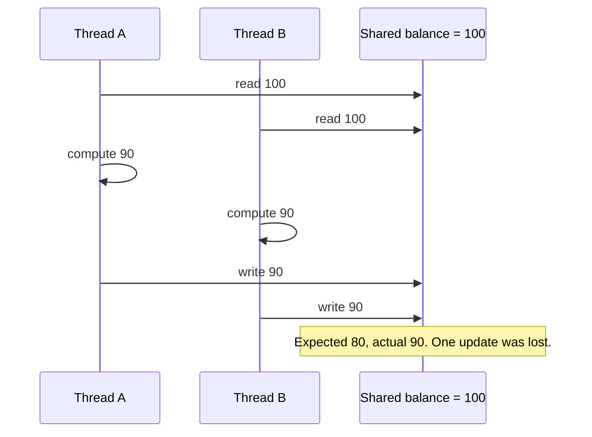
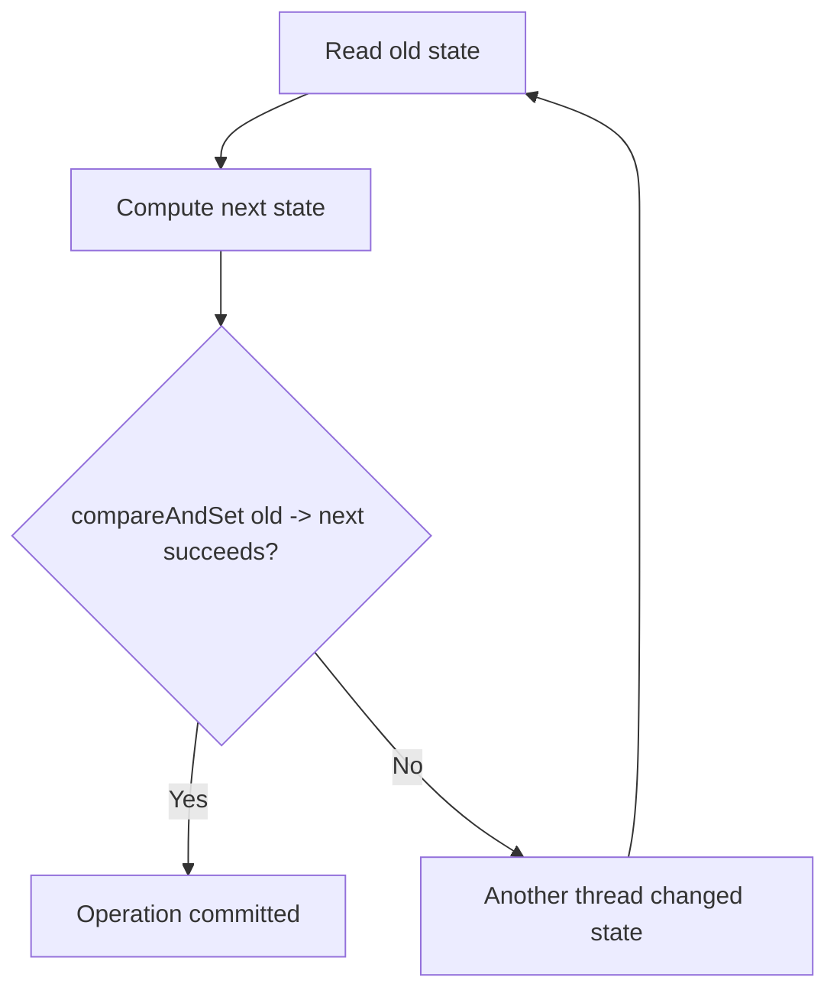

------
title: Learn Java Concurrency & Correctness - Part 008
description: Atomicity, compound actions, linearization points, CAS thinking, AtomicInteger, AtomicReference, LongAdder, ABA risk, and choosing between locks and atomics.
series: learn-java-concurrency-correctness
seriesTitle: Learn Java Concurrency & Correctness
order: 8
partTitle: Atomicity and Compound Actions
tags:
- java
- concurrency
- correctness
- atomicity
- compound-actions
- cas
- atomicreference
- lock-free
date: 2026-06-28
---

# Part 008 — Atomicity and Compound Actions

Part 007 focused on visibility: can one thread reliably see what another thread published?

This part focuses on atomicity:

> Can other threads observe or interfere with an operation while it is only partially complete?

Atomicity is not about whether a single Java statement looks small. It is about whether an operation has one indivisible effect with respect to other threads.

Many production bugs happen because code protects visibility but not atomicity:

```java
private volatile int count;

public void increment() {
    count++;
}
```

The read and write are visible. The increment is still not atomic.

This part builds the mental model needed before we go deeper into locks, conditions, synchronizers, executors, and lock-free designs.

---

## 1. Kaufman Skill Deconstruction

Atomicity can be decomposed into six practical subskills:

| Subskill | Engineering question |
|---|---|
| Identify compound actions | "Is this operation more than one memory action?" |
| Identify invariants | "What must remain true before and after the operation?" |
| Choose one jurisdiction | "What mechanism owns the entire invariant?" |
| Define the linearization point | "At what instant does the operation logically take effect?" |
| Pick lock vs atomic | "Is the state single-variable, multi-variable, contended, or transactional?" |
| Avoid side effects inside retries | "Can this update function be safely retried?" |

This is the key distinction:

> Beginner question: "Is this API thread-safe?"  
> Advanced question: "What invariant is being protected, and what is its linearization point?"

---

## 2. Atomicity Mental Model

An operation is atomic when other threads cannot observe it halfway done.

Example:

```java
balance = balance - amount;
```

This looks like one statement, but conceptually it involves:

1. read `balance`;
2. compute `balance - amount`;
3. write the new value.

If two threads run this concurrently, both can read the same original value and overwrite each other's result.



The problem is not arithmetic. The problem is that the operation's logical effect was not protected as one unit.

---

## 3. Statements Are Not Atomicity Boundaries

Do not infer atomicity from syntax.

| Code | Atomic as business operation? | Why |
|---|---:|---|
| `x = 1` | Usually single write | But may not protect visibility unless synchronized/volatile/atomic. |
| `x++` | No | read-modify-write. |
| `map.put(k, v)` on `ConcurrentHashMap` | Per-key operation is thread-safe | But may not protect multi-key invariant. |
| `if (!set.contains(x)) set.add(x)` | No | check-then-act race unless atomic API or lock used. |
| `list.add(x)` on `ArrayList` | No | not thread-safe under concurrent mutation. |
| `atomic.incrementAndGet()` | Yes for that variable | Does not protect other variables. |
| `accountA.debit(); accountB.credit();` | No | transfer invariant spans two accounts. |

Atomicity is about the operation's **semantic boundary**, not the number of Java statements.

---

## 4. Compound Actions

A compound action is an operation made of multiple steps that must behave as one logical unit.

Common compound actions:

| Pattern | Example |
|---|---|
| Read-modify-write | increment counter, update balance, append sequence number |
| Check-then-act | initialize if absent, validate then update, create if missing |
| Multi-field invariant update | lower/upper range, status/timestamp, amount/currency |
| Multi-object transaction | transfer money, move task between queues, swap ownership |
| Iterate-then-modify | scan collection and remove matching entries |
| Publish-after-build | construct aggregate then replace visible snapshot |

The core review question:

> What data must not change between the first read and the final write?

If anything must remain stable, you need a jurisdiction.

---

## 5. Jurisdiction: Who Owns the Invariant?

An invariant is a rule that must always be true at externally visible boundaries.

Examples:

```text
balance >= 0
lower <= upper
case.status transition must follow state machine
attemptCount <= maxAttempts
activeWorkers <= permits
policySnapshot.version increases monotonically
order.total == sum(order.lines)
```

A jurisdiction is the mechanism that owns that invariant:

- a lock;
- a monitor;
- an atomic variable;
- a concurrent collection operation;
- an immutable snapshot replacement;
- a database transaction;
- an actor/event loop;
- a single-threaded owner;
- a distributed lock or lease, if crossing process boundaries.

The anti-pattern is split jurisdiction:

```text
field A protected by volatile
field B protected by synchronized
field C protected by convention
business rule protected by hope
```

One invariant should have one clear owner.

---

## 6. Lost Update

Broken counter:

```java
public final class BrokenCounter {
    private int count;

    public void increment() {
        count++;
    }

    public int get() {
        return count;
    }
}
```

Even worse, without synchronization readers may also see stale values.

Correct with a lock:

```java
public final class SynchronizedCounter {
    private int count;

    public synchronized int incrementAndGet() {
        return ++count;
    }

    public synchronized int get() {
        return count;
    }
}
```

Correct with atomic:

```java
public final class AtomicCounter {
    private final AtomicInteger count = new AtomicInteger();

    public int incrementAndGet() {
        return count.incrementAndGet();
    }

    public int get() {
        return count.get();
    }
}
```

Both are correct for a single counter. The right choice depends on surrounding invariants.

---

## 7. Check-Then-Act Race

Bad:

```java
public final class UserRegistry {
    private final Map<String, User> users = new HashMap<>();

    public User getOrCreate(String id) {
        User existing = users.get(id);
        if (existing != null) {
            return existing;
        }

        User created = new User(id);
        users.put(id, created);
        return created;
    }
}
```

Two threads can both observe absence, both create a user, and one overwrites the other.

Using `ConcurrentHashMap` incorrectly can still have the same logical problem:

```java
public User getOrCreate(String id) {
    User existing = users.get(id);
    if (existing != null) {
        return existing;
    }

    User created = new User(id);
    users.put(id, created);
    return created;
}
```

The map is thread-safe, but the compound operation is not atomic.

Better:

```java
public final class UserRegistry {
    private final ConcurrentHashMap<String, User> users = new ConcurrentHashMap<>();

    public User getOrCreate(String id) {
        return users.computeIfAbsent(id, User::new);
    }
}
```

Now the per-key compound action is owned by the map.

Caution: mapping functions should be short, side-effect-light, and must not recursively mutate the same map in surprising ways.

---

## 8. Multi-Field Invariants Need One Boundary

Broken:

```java
public final class BrokenRange {
    private final AtomicInteger lower = new AtomicInteger();
    private final AtomicInteger upper = new AtomicInteger(100);

    public void setLower(int value) {
        if (value > upper.get()) {
            throw new IllegalArgumentException();
        }
        lower.set(value);
    }

    public void setUpper(int value) {
        if (value < lower.get()) {
            throw new IllegalArgumentException();
        }
        upper.set(value);
    }
}
```

Each integer is atomic. The invariant is not.

Correct with one lock:

```java
public final class Range {
    private int lower;
    private int upper = 100;

    public synchronized void setLower(int value) {
        if (value > upper) {
            throw new IllegalArgumentException();
        }
        lower = value;
    }

    public synchronized void setUpper(int value) {
        if (value < lower) {
            throw new IllegalArgumentException();
        }
        upper = value;
    }

    public synchronized RangeSnapshot snapshot() {
        return new RangeSnapshot(lower, upper);
    }
}

public record RangeSnapshot(int lower, int upper) {}
```

Correct with immutable state and `AtomicReference`:

```java
public record RangeState(int lower, int upper) {
    public RangeState {
        if (lower > upper) {
            throw new IllegalArgumentException("lower > upper");
        }
    }
}

public final class AtomicRange {
    private final AtomicReference<RangeState> state =
        new AtomicReference<>(new RangeState(0, 100));

    public void setLower(int value) {
        state.updateAndGet(old -> new RangeState(value, old.upper()));
    }

    public void setUpper(int value) {
        state.updateAndGet(old -> new RangeState(old.lower(), value));
    }

    public RangeState snapshot() {
        return state.get();
    }
}
```

Now the invariant is inside one immutable object, and replacement is atomic.

---

## 9. Linearization Point

A linearization point is the instant where an operation appears to take effect atomically.

For a synchronized counter:

```java
public synchronized int incrementAndGet() {
    return ++count;
}
```

The operation is linearized during the lock-protected update.

For an atomic counter:

```java
public int incrementAndGet() {
    return count.incrementAndGet();
}
```

The operation is linearized at the successful atomic update.

For a snapshot replacement:

```java
current = next;
```

The operation is linearized at the volatile write.

Why this matters:

- It defines what other threads are allowed to observe.
- It makes reasoning precise.
- It helps you design tests.
- It exposes broken multi-step operations.

Ask during review:

> Where exactly does this operation become true for the rest of the system?

If the answer is vague, correctness is probably vague too.

---

## 10. Compare-And-Set Mental Model

CAS means **compare and set**:

```text
If the current value is still what I observed, replace it with my new value.
Otherwise, someone else changed it; retry or fail.
```

Simplified pattern:

```java
while (true) {
    State old = ref.get();
    State next = computeNext(old);
    if (ref.compareAndSet(old, next)) {
        return next;
    }
}
```

Diagram:



CAS is optimistic concurrency. It assumes conflicts are possible but not always dominant.

---

## 11. CAS Update Example

Suppose we need a monotonic maximum:

```java
public final class MaxTracker {
    private final AtomicInteger max = new AtomicInteger(Integer.MIN_VALUE);

    public int observe(int value) {
        return max.updateAndGet(current -> Math.max(current, value));
    }

    public int currentMax() {
        return max.get();
    }
}
```

This is concise and correct because:

- the state is one integer;
- the update function is pure;
- retries are safe;
- the invariant is simple: `max` never decreases.

Manual CAS form:

```java
public int observe(int value) {
    while (true) {
        int current = max.get();
        if (value <= current) {
            return current;
        }
        if (max.compareAndSet(current, value)) {
            return value;
        }
    }
}
```

This shows the real mental model behind `updateAndGet`.

---

## 12. Side Effects Inside Atomic Update Functions

Bad:

```java
public void updatePolicy(UnaryOperator<PolicySnapshot> updater) {
    current.updateAndGet(old -> {
        PolicySnapshot next = updater.apply(old);
        auditSink.record("policy updated to " + next.version());
        return next;
    });
}
```

The function passed to `updateAndGet` may be invoked multiple times under contention. That means the audit side effect can happen multiple times for one logical update.

Better:

```java
public PolicySnapshot updatePolicy(UnaryOperator<PolicySnapshot> updater) {
    while (true) {
        PolicySnapshot old = current.get();
        PolicySnapshot next = Objects.requireNonNull(updater.apply(old));

        if (current.compareAndSet(old, next)) {
            auditSink.record("policy updated to " + next.version());
            return next;
        }
    }
}
```

The side effect occurs only after successful commit.

Rule:

> CAS retry functions must be pure or retry-safe. Put irreversible side effects after the successful CAS.

---

## 13. Locks vs Atomics

Atomics are not "better locks". They are a different coordination model.

| Use case | Prefer |
|---|---|
| Single counter or flag | Atomic or volatile |
| Single independent reference replacement | Volatile or `AtomicReference` |
| Update depends on current single value | Atomic CAS/update |
| Multi-field invariant | Lock or immutable aggregate in atomic reference |
| Operation blocks or waits | Lock/synchronizer, not CAS spin |
| Needs condition waiting | Lock + condition or higher-level synchronizer |
| Complex transaction | Lock, database transaction, actor, or state machine owner |
| Low contention simple metric | AtomicLong |
| High contention additive metric | LongAdder |
| Need exact value immediately after every update | AtomicLong or lock, not LongAdder in some designs |

Atomics are excellent when the state can be compressed into one independent variable or one immutable aggregate reference.

Locks are excellent when a block of logic must run with exclusive jurisdiction.

---

## 14. `LongAdder` vs `AtomicLong`

`AtomicLong` keeps one value. Under high contention, many threads compete on the same memory location.

```java
private final AtomicLong requests = new AtomicLong();

public void recordRequest() {
    requests.incrementAndGet();
}

public long count() {
    return requests.get();
}
```

`LongAdder` spreads contention across internal cells and sums them when asked:

```java
private final LongAdder requests = new LongAdder();

public void recordRequest() {
    requests.increment();
}

public long count() {
    return requests.sum();
}
```

Use `LongAdder` for high-throughput metrics where `sum()` may be slightly stale relative to concurrent updates.

Use `AtomicLong` when you need atomic read-modify-write semantics on a single exact value.

Bad use of `LongAdder`:

```java
if (active.sum() < limit) {
    active.increment();
    // limit can be exceeded under race
}
```

This is a check-then-act race. Use a semaphore, lock, or atomic CAS state machine.

---

## 15. Atomic Does Not Mean Transactional

Broken transfer using atomics:

```java
public final class Account {
    private final AtomicLong balance = new AtomicLong();

    public Account(long openingBalance) {
        balance.set(openingBalance);
    }

    public void withdraw(long amount) {
        balance.addAndGet(-amount);
    }

    public void deposit(long amount) {
        balance.addAndGet(amount);
    }

    public long balance() {
        return balance.get();
    }
}

public void transfer(Account from, Account to, long amount) {
    from.withdraw(amount);
    to.deposit(amount);
}
```

Each balance update is atomic, but the transfer is not. Another thread can observe money disappearing between withdraw and deposit. If deposit fails, money is lost.

A transfer invariant spans two accounts:

```text
from.balance + to.balance remains constant
```

That invariant needs one jurisdiction.

---

## 16. Transfer with Lock Ordering

```java
public final class LockedAccount {
    private final long id;
    private long balance;

    public LockedAccount(long id, long openingBalance) {
        this.id = id;
        this.balance = openingBalance;
    }

    public static void transfer(LockedAccount from, LockedAccount to, long amount) {
        LockedAccount first = from.id < to.id ? from : to;
        LockedAccount second = from.id < to.id ? to : from;

        synchronized (first) {
            synchronized (second) {
                if (from.balance < amount) {
                    throw new IllegalArgumentException("insufficient funds");
                }
                from.balance -= amount;
                to.balance += amount;
            }
        }
    }

    public synchronized long balance() {
        return balance;
    }
}
```

Lock ordering avoids deadlock when multiple transfers occur concurrently.

This is more complex than atomics, but it owns the real invariant.

We will go deeper into locking and deadlock in Parts 009–011.

---

## 17. Immutable Aggregate Atomic Update

For many domain states, a single immutable aggregate plus `AtomicReference` is cleaner than many atomics.

```java
public record CaseState(
    String caseId,
    Status status,
    int escalationLevel,
    Instant updatedAt
) {
    public CaseState escalate(Clock clock) {
        if (status == Status.CLOSED) {
            throw new IllegalStateException("closed case cannot escalate");
        }
        return new CaseState(caseId, status, escalationLevel + 1, clock.instant());
    }
}

public final class CaseStateHolder {
    private final AtomicReference<CaseState> state;
    private final Clock clock;

    public CaseStateHolder(CaseState initial, Clock clock) {
        this.state = new AtomicReference<>(initial);
        this.clock = clock;
    }

    public CaseState escalate() {
        while (true) {
            CaseState old = state.get();
            CaseState next = old.escalate(clock);
            if (state.compareAndSet(old, next)) {
                return next;
            }
        }
    }

    public CaseState current() {
        return state.get();
    }
}
```

This works if:

- the aggregate is immutable;
- updates are pure or retry-safe;
- contention is acceptable;
- no blocking operation happens inside the CAS loop;
- side effects happen after commit.

---

## 18. Avoid Blocking Inside CAS Loops

Bad:

```java
state.updateAndGet(old -> {
    ExternalData data = remoteClient.fetch(); // blocking side effect
    return old.withData(data);
});
```

Problems:

- The function may be retried.
- Remote call may happen multiple times.
- The state can change while waiting.
- Latency under contention becomes unpredictable.

Better:

```java
ExternalData data = remoteClient.fetch();

while (true) {
    State old = state.get();
    State next = old.withData(data);
    if (state.compareAndSet(old, next)) {
        return next;
    }
}
```

Even this may be semantically wrong if `data` was fetched based on old state. Then you need a lock or a transactional design.

---

## 19. ABA Problem

The ABA problem occurs when a thread observes value A, another thread changes it to B, then back to A. The first thread's CAS sees A and succeeds, even though the state changed in between.

```text
T1 reads A
T2 changes A -> B
T2 changes B -> A
T1 compareAndSet(A, C) succeeds
```

This matters when the identity of intermediate changes matters.

Mitigations:

- include a version number in immutable state;
- use `AtomicStampedReference`;
- use locks;
- design state transitions so ABA is harmless;
- avoid object reuse in lock-free structures unless carefully controlled.

Versioned state example:

```java
public record VersionedState(long version, Status status) {
    public VersionedState transitionTo(Status next) {
        return new VersionedState(version + 1, next);
    }
}
```

Because every update increments the version, A → B → A is not the same full state anymore.

---

## 20. Compare-And-Set With Versioned State

```java
public final class VersionedStatus {
    private final AtomicReference<VersionedState> state =
        new AtomicReference<>(new VersionedState(0, Status.NEW));

    public VersionedState transition(Status expected, Status next) {
        while (true) {
            VersionedState old = state.get();
            if (old.status() != expected) {
                throw new IllegalStateException("expected " + expected + " but was " + old.status());
            }

            VersionedState updated = new VersionedState(old.version() + 1, next);

            if (state.compareAndSet(old, updated)) {
                return updated;
            }
        }
    }

    public VersionedState current() {
        return state.get();
    }
}
```

This is useful for in-memory state machines, but remember:

> In-memory CAS does not protect distributed state across multiple JVMs.

For persistent or multi-node state, the jurisdiction may need to be a database transaction, optimistic locking column, message partition owner, actor, or workflow engine.

---

## 21. Atomicity Across Process Boundaries

Java atomics only coordinate threads inside the same JVM process. They do not coordinate:

- multiple service instances;
- multiple containers;
- multiple JVMs;
- database rows;
- message broker partitions;
- external APIs;
- distributed schedulers.

Bad assumption:

```text
We used AtomicBoolean, so only one node will run the job.
```

No. That only works inside one JVM.

For distributed atomicity, consider:

- database uniqueness constraints;
- `SELECT ... FOR UPDATE` or equivalent transactional locking;
- optimistic locking version columns;
- idempotency keys;
- lease tables;
- leader election;
- message partition ownership;
- workflow execution ownership.

This series focuses on Java concurrency, but top-tier engineers always ask where the boundary of the mechanism ends.

---

## 22. Atomicity and Idempotency

Atomicity prevents interleaving inside one jurisdiction. Idempotency limits damage when operations are retried or duplicated.

Example:

```java
public Decision submit(String requestId, Command command) {
    return submissions.computeIfAbsent(requestId, id -> execute(command));
}
```

This may be valid in a single JVM registry. In a distributed API platform, the idempotency key must usually be persisted with transactional semantics.

Local concurrency design is not a replacement for end-to-end correctness.

---

## 23. Choosing the Right Atomic Boundary

### Boundary Too Small

```java
AtomicInteger lower;
AtomicInteger upper;
```

Each variable is atomic, but the range is not.

### Boundary Too Large

```java
synchronized void handleEveryRequestGlobally(...) { ... }
```

Correct but may destroy throughput.

### Boundary Aligned With Invariant

```java
AtomicReference<RangeState>
```

or:

```java
synchronized range mutation methods
```

The boundary should match the invariant.

---

## 24. Atomicity Decision Matrix

| State shape | Example | Good mechanism |
|---|---|---|
| Independent boolean | shutdown flag | `volatile boolean` or `AtomicBoolean` |
| Independent counter | request count | `AtomicLong` or `LongAdder` |
| Independent max/min | max latency | `AtomicLong` CAS/update |
| Independent reference | current config snapshot | `volatile` reference |
| Current value + conditional update | versioned state | `AtomicReference` CAS |
| Multiple fields one invariant | range, status + timestamp | lock or immutable aggregate reference |
| Multiple objects one invariant | transfer, move, swap | lock ordering or transaction |
| Needs wait/notify condition | bounded resource | lock/condition/semaphore/queue |
| Cross-JVM invariant | single job owner | DB/lease/partition/leader election |

---

## 25. Case Study: Case Escalation Counter

### Requirement

A regulatory case can be escalated at most three times. Every escalation must record:

- new escalation level;
- actor;
- timestamp;
- reason;
- audit event exactly once after successful escalation.

### Bad Design

```java
public final class CaseEscalation {
    private final AtomicInteger level = new AtomicInteger();

    public void escalate(String actor, String reason) {
        if (level.get() >= 3) {
            throw new IllegalStateException("max escalation reached");
        }

        int next = level.incrementAndGet();
        audit(actor, reason, next);
    }
}
```

Bug:

- Two threads can both pass the check when level is 2.
- Both increment.
- Level can become 4.

### Better Atomic Version

```java
public record EscalationState(
    int level,
    List<EscalationEvent> events
) {
    public EscalationState {
        events = List.copyOf(events);
    }

    public EscalationState escalate(String actor, String reason, Instant now) {
        if (level >= 3) {
            throw new IllegalStateException("max escalation reached");
        }

        EscalationEvent event = new EscalationEvent(level + 1, actor, reason, now);
        ArrayList<EscalationEvent> nextEvents = new ArrayList<>(events);
        nextEvents.add(event);
        return new EscalationState(level + 1, nextEvents);
    }
}

public final class CaseEscalation {
    private final AtomicReference<EscalationState> state =
        new AtomicReference<>(new EscalationState(0, List.of()));
    private final Clock clock;
    private final AuditSink auditSink;

    public CaseEscalation(Clock clock, AuditSink auditSink) {
        this.clock = clock;
        this.auditSink = auditSink;
    }

    public EscalationState escalate(String actor, String reason) {
        EscalationState committed;

        while (true) {
            EscalationState old = state.get();
            EscalationState next = old.escalate(actor, reason, clock.instant());
            if (state.compareAndSet(old, next)) {
                committed = next;
                break;
            }
        }

        auditSink.record(committed.events().getLast());
        return committed;
    }
}
```

This aligns the atomic boundary with the invariant:

```text
level == events.size()
level <= 3
every successful escalation has exactly one event
```

Caveat: if `auditSink.record` fails, state is already committed. If audit must be transactional with state, the jurisdiction must move to a durable transaction or outbox pattern.

---

## 26. Atomicity and Exceptions

Atomic sections must define what happens if an exception occurs halfway.

With locks:

```java
public synchronized void update() {
    step1();
    step2();
    step3();
}
```

If `step2()` throws after mutating state, the lock is released but the object may be left inconsistent unless you design rollback or mutation ordering.

Better style:

1. validate first;
2. compute new state locally;
3. commit with a short mutation;
4. perform side effects after commit if appropriate.

```java
public synchronized void replace(ConfigInput input) {
    Config next = validateAndBuild(input);
    this.current = next;
}
```

Atomicity is not only about threads. It is also about failure boundaries.

---

## 27. Blocking, Spinning, and CPU Waste

CAS loops retry under contention. If contention is high, they can waste CPU.

Bad pattern:

```java
while (!flag.compareAndSet(false, true)) {
    // spin forever
}
```

Better options:

- use a lock;
- use a semaphore;
- use a blocking queue;
- use timed retry with backoff only when appropriate;
- redesign ownership to reduce contention.

Lock-free does not mean wait-free. A system can be lock-free and still cause starvation for unlucky threads.

---

## 28. Testing Atomicity Bugs

Atomicity bugs are often schedule-dependent. A unit test that passes does not prove correctness.

Minimal stress harness idea:

```java
public static void main(String[] args) throws Exception {
    for (int round = 0; round < 10_000; round++) {
        BrokenCounter counter = new BrokenCounter();
        Thread t1 = new Thread(() -> incrementMany(counter));
        Thread t2 = new Thread(() -> incrementMany(counter));

        t1.start();
        t2.start();
        t1.join();
        t2.join();

        if (counter.get() != 200_000) {
            throw new AssertionError("lost update: " + counter.get());
        }
    }
}
```

This can expose bugs, but it is not exhaustive. Later, Part 033 will cover systematic concurrent testing and JCStress-style thinking.

---

## 29. Code Review Checklist

```text
Atomicity Review

[ ] What is the operation's semantic boundary?
[ ] What invariant must hold before and after the operation?
[ ] Can another thread observe intermediate state?
[ ] Is this a read-modify-write operation?
[ ] Is this a check-then-act operation?
[ ] Does the invariant span multiple fields?
[ ] Does the invariant span multiple objects?
[ ] Does the invariant cross JVM/process/database boundaries?
[ ] What mechanism owns the invariant?
[ ] Where is the linearization point?
[ ] Are atomic update functions pure/retry-safe?
[ ] Are side effects performed only after successful commit?
[ ] Is contention low enough for CAS?
[ ] Would a lock be simpler and safer?
```

---

## 30. Common Anti-Patterns

### Anti-Pattern 1: Volatile Counter

```java
volatile int count;
count++;
```

Visibility without atomicity.

### Anti-Pattern 2: Many Atomics for One Invariant

```java
AtomicInteger lower;
AtomicInteger upper;
AtomicReference<Status> status;
```

Many atomic variables do not create one atomic domain.

### Anti-Pattern 3: Side Effects Inside `updateAndGet`

```java
ref.updateAndGet(old -> {
    sendEmail();
    return next(old);
});
```

May execute multiple times.

### Anti-Pattern 4: Local Atomic for Distributed Coordination

```java
private static final AtomicBoolean leader = new AtomicBoolean();
```

Coordinates only one JVM.

### Anti-Pattern 5: Lock-Free by Ego

Replacing simple synchronized code with complex CAS loops can reduce correctness and maintainability.

---

## 31. Production Heuristics

Use these heuristics:

1. If the invariant is simple and single-variable, atomics are usually fine.
2. If the invariant spans fields, prefer a lock or immutable aggregate.
3. If the invariant spans objects, define lock ordering or transactional ownership.
4. If the invariant spans services, Java atomics are irrelevant.
5. If update logic has side effects, be careful with CAS retries.
6. If correctness is hard to explain, the design is probably too clever.
7. If a lock solves the problem clearly and contention is low, use the lock.
8. If high contention is real, measure before choosing a complex lock-free design.

---

## 32. Deliberate Practice

### Drill 1: Decompose `++`

Write the conceptual read/compute/write steps for:

```java
count++
balance -= amount
map.putIfAbsent(key, value)
ref.updateAndGet(fn)
```

Mark which ones are atomic under which API.

### Drill 2: Find Compound Actions

Search a service for:

```text
if (...) put(...)
if (...) set(...)
get(); set();
contains(); add();
size(); add();
read status; write status
read version; write version
```

Classify each as safe or unsafe.

### Drill 3: Define Linearization Points

Pick five methods and write:

```text
This method becomes true for other threads at: ______
The invariant it protects is: ______
The mechanism is: ______
```

If you cannot fill this in, redesign.

### Drill 4: Refactor Many Atomics

Take a class with multiple atomic fields and convert it to:

```text
record State(...)
AtomicReference<State>
CAS loop
side effects after commit
```

Then evaluate whether a lock would be simpler.

---

## 33. What To Remember

Atomicity is about preserving meaning under interleaving.

The core rules:

1. Syntax does not define atomicity.
2. `volatile` gives visibility, not compound atomicity.
3. A compound action needs one jurisdiction.
4. Multiple atomic fields do not automatically protect a multi-field invariant.
5. The atomic boundary should match the invariant boundary.
6. CAS is optimistic and can retry; update functions must be retry-safe.
7. Side effects belong after successful commit unless explicitly designed otherwise.
8. `LongAdder` is for scalable metrics, not check-then-act limits.
9. Local atomics do not solve distributed correctness.
10. Locks are often the clearest and most correct solution.

Top-tier concurrency engineering is not about avoiding locks. It is about choosing the smallest understandable correctness boundary that preserves the real invariant.

---

## 34. References

- Java Language Specification, Chapter 17: Threads and Locks.
- Java SE API documentation: `java.util.concurrent.atomic`.
- Java SE API documentation: `AtomicInteger`, `AtomicLong`, `AtomicReference`, `AtomicStampedReference`, `LongAdder`.
- Brian Goetz et al., *Java Concurrency in Practice*.
- Doug Lea's `java.util.concurrent` design materials.

---

## 35. Next Part

Part 009 moves into `synchronized`:

- intrinsic locks;
- monitor enter/exit;
- reentrancy;
- lock scope;
- visibility guarantees of lock release/acquire;
- object-level lock jurisdiction;
- common mistakes with synchronized methods and blocks.
