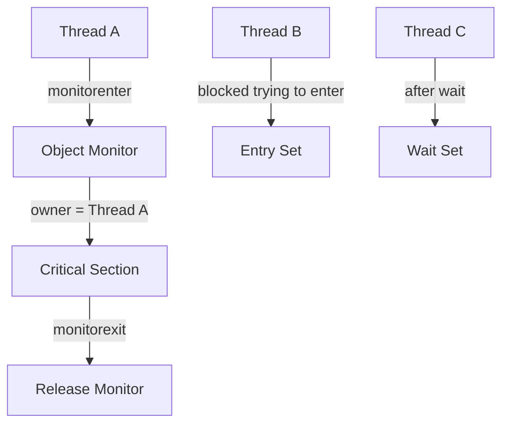
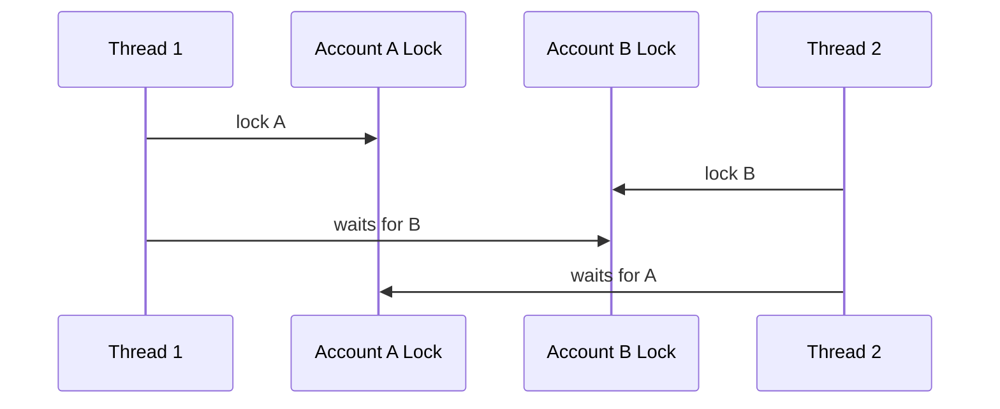

------
title: Learn Java Concurrency & Correctness - Part 009
description: Intrinsic locks, synchronized methods and blocks, monitor ownership, reentrancy, lock scope, happens-before guarantees, object-level locking, and production-grade synchronized design.
series: learn-java-concurrency-correctness
seriesTitle: Learn Java Concurrency & Correctness
order: 9
partTitle: Locking with synchronized
tags:
- java
- concurrency
- correctness
- synchronized
- intrinsic-lock
- monitor
- locking
date: 2026-06-28
---

# Part 009 — Locking with `synchronized`

Part 008 established atomicity and compound actions. We learned that many bugs are not caused by single operations being unsafe, but by multiple individually valid operations being combined without one governing jurisdiction.

This part introduces Java's oldest and most fundamental mutual exclusion mechanism:

```java
synchronized (lock) {
    // critical section
}
```

` synchronized ` is not a legacy curiosity. It is still a core correctness primitive. It is simple, structured, reentrant, exception-safe, and deeply integrated into the Java Memory Model.

The advanced skill is not knowing that `synchronized` exists. The advanced skill is knowing:

- what invariant it protects;
- which object owns the monitor;
- what code is inside the jurisdiction;
- what must never run while holding the lock;
- how visibility and ordering are established;
- when `synchronized` is enough;
- when a more explicit lock abstraction is justified.

---

## 1. Kaufman Skill Deconstruction

To use `synchronized` well, decompose the skill into seven subskills.

| Subskill | Practical question |
|---|---|
| Identify the protected invariant | What state must not be observed halfway changed? |
| Choose the monitor object | Which object represents the jurisdiction? |
| Define the critical section | What exact code must execute atomically? |
| Keep lock scope minimal but complete | Did we include all state transitions but exclude slow unrelated work? |
| Use the same lock for the same invariant | Are all reads and writes guarded consistently? |
| Avoid external calls while locked | Could this code call unknown, slow, blocking, or reentrant user code? |
| Reason about happens-before | Does unlock from one thread happen-before a later lock by another thread? |

A beginner sees `synchronized` as a keyword.

A senior engineer sees `synchronized` as a **jurisdiction declaration**.

> Everything inside this jurisdiction observes and modifies the protected invariant under one authority.

---

## 2. What Problem Does `synchronized` Solve?

`synchronized` primarily solves two local in-process problems:

1. **Mutual exclusion** — only one thread at a time can execute the critical section for the same monitor.
2. **Visibility / ordering** — changes made before releasing a monitor become visible to a thread that later acquires the same monitor.

It does not solve:

- distributed consistency;
- database transaction isolation;
- fairness guarantees in all cases;
- deadlock automatically;
- long-running blocking safety;
- overload control;
- business idempotency;
- correctness across JVM processes.

Keep the boundary precise:

> `synchronized` protects memory invariants inside one JVM process.

---

## 3. The Monitor Mental Model

Every Java object can be used as a monitor.

A monitor is conceptually composed of:

- an ownership slot: which thread currently owns the monitor;
- an entry set: threads waiting to acquire it;
- a wait set: threads that called `wait()` on that monitor;
- reentrancy count: how many times the owner has acquired it.

Simplified model:



Do not overfit this diagram to HotSpot implementation details. The exact implementation can change. The language-level contract is what matters for correctness.

The important rule:

> A thread must acquire the monitor before entering a synchronized block guarded by that monitor, and must release it when leaving.

---

## 4. Synchronized Blocks

A synchronized block uses the monitor of the object expression.

```java
public final class Account {
    private final Object lock = new Object();
    private long balance;

    public void deposit(long amount) {
        if (amount <= 0) {
            throw new IllegalArgumentException("amount must be positive");
        }

        synchronized (lock) {
            balance += amount;
        }
    }

    public long balance() {
        synchronized (lock) {
            return balance;
        }
    }
}
```

This design has an important property:

> Every access to `balance` uses the same private lock.

That is the actual correctness boundary.

The lock is not protecting a method. It is protecting an invariant:

```text
balance represents the current account balance and must not be read while a write is partially applied.
```

---

## 5. Synchronized Instance Methods

An instance synchronized method locks on `this`.

```java
public synchronized void deposit(long amount) {
    balance += amount;
}
```

This is equivalent to:

```java
public void deposit(long amount) {
    synchronized (this) {
        balance += amount;
    }
}
```

This is simple and can be perfectly correct for private or tightly controlled classes.

But it has one major design risk:

> External code can also lock on your object.

Example:

```java
Account account = new Account();

synchronized (account) {
    // external code accidentally or deliberately holds account's monitor
    Thread.sleep(Duration.ofSeconds(30));
}
```

If `Account` uses synchronized instance methods, this external synchronized block can block `Account` internally.

For public classes, prefer a private final lock object unless you intentionally expose the monitor.

```java
private final Object lock = new Object();
```

---

## 6. Static Synchronized Methods

A static synchronized method locks on the `Class` object.

```java
public static synchronized void reloadGlobalConfig() {
    // locked on ConfigService.class
}
```

Equivalent to:

```java
public static void reloadGlobalConfig() {
    synchronized (ConfigService.class) {
        // critical section
    }
}
```

This is a JVM-wide lock for that class object inside the class loader scope.

Use it carefully.

Static synchronization is often too broad because it serializes all callers across the class-level monitor, even when the protected state could be instance-level or tenant-level.

Bad smell:

```java
public static synchronized void processTenant(String tenantId, Work work) {
    // all tenants serialized even when independent
}
```

Better design:

```java
public final class TenantLockRegistry {
    private final ConcurrentHashMap<String, Object> locks = new ConcurrentHashMap<>();

    public void withTenantLock(String tenantId, Runnable action) {
        Object lock = locks.computeIfAbsent(tenantId, id -> new Object());
        synchronized (lock) {
            action.run();
        }
    }
}
```

This example is still incomplete for production because lock lifecycle can leak if tenant ids are unbounded. The point is jurisdiction: avoid global serialization when the invariant is scoped.

---

## 7. Reentrancy

Java intrinsic locks are reentrant.

If a thread already owns a monitor, it can acquire it again.

```java
public final class ReentrantExample {
    public synchronized void outer() {
        inner();
    }

    public synchronized void inner() {
        // same thread can enter again
    }
}
```

Without reentrancy, `outer()` would deadlock when it calls `inner()`.

Reentrancy is convenient, but it can hide design problems.

Example:

```java
public synchronized void approve(CaseId id) {
    validate(id);       // also synchronized
    transition(id);     // also synchronized
    publishEvent(id);   // external side effect
}
```

This may appear safe because everything is synchronized. But the lock is now held across validation, transition, and publishing.

If `publishEvent()` calls back into the object or blocks on another subsystem, the critical section becomes dangerous.

Reentrancy means:

> The same thread can re-enter; it does not mean your lock design is clean.

---

## 8. The Memory Semantics of `synchronized`

`synchronized` is not just mutual exclusion. It also creates memory ordering guarantees.

The key rule:

> An unlock on a monitor happens-before every subsequent lock on the same monitor.

Example:

```java
public final class ConfigHolder {
    private final Object lock = new Object();
    private Map<String, String> config = Map.of();

    public void update(Map<String, String> newConfig) {
        synchronized (lock) {
            config = Map.copyOf(newConfig);
        }
    }

    public String get(String key) {
        synchronized (lock) {
            return config.get(key);
        }
    }
}
```

If Thread A exits `update()` and Thread B later enters `get()` using the same lock, Thread B must see the effects visible before Thread A released the lock.

This matters because locking only on writes is not enough.

Broken:

```java
public final class BrokenCounter {
    private final Object lock = new Object();
    private int count;

    public void increment() {
        synchronized (lock) {
            count++;
        }
    }

    public int count() {
        return count; // not guarded by same lock
    }
}
```

This read is outside the synchronization protocol. It may observe stale data and it violates the ownership model.

Correct:

```java
public int count() {
    synchronized (lock) {
        return count;
    }
}
```

The discipline is:

> All reads and writes of guarded state must use the same lock, unless another documented happens-before mechanism is intentionally used.

---

## 9. Locking Is About Invariants, Not Fields

A common beginner mistake is thinking locks protect fields individually.

They do not.

Locks protect **invariants**.

Example:

```java
public final class CapacityTracker {
    private final Object lock = new Object();
    private int used;
    private int remaining;
    private final int capacity;

    public CapacityTracker(int capacity) {
        this.capacity = capacity;
        this.remaining = capacity;
    }

    public boolean reserve(int units) {
        synchronized (lock) {
            if (units <= 0 || units > remaining) {
                return false;
            }
            used += units;
            remaining -= units;
            return true;
        }
    }
}
```

The invariant is:

```text
used + remaining == capacity
used >= 0
remaining >= 0
```

`used` and `remaining` are not independent. Using separate locks would be wrong unless the invariant was redesigned.

Bad:

```java
private final Object usedLock = new Object();
private final Object remainingLock = new Object();
```

This splits one invariant across two jurisdictions.

Advanced rule:

> Choose one lock per invariant, not one lock per variable.

---

## 10. Critical Section Shape

A critical section should be:

- complete enough to preserve the invariant;
- small enough to avoid unnecessary contention;
- free from unknown external behavior;
- free from slow IO when possible;
- documented by code structure.

Bad shape:

```java
public void approve(CaseId caseId) {
    synchronized (lock) {
        CaseRecord record = repository.load(caseId);       // IO
        record.approve();                                  // state change
        repository.save(record);                           // IO
        emailGateway.sendApprovalEmail(record.owner());     // external system
    }
}
```

This serializes database and email latency under a JVM lock. It also gives a false sense of transactional correctness.

Better shape:

```java
public void approve(CaseId caseId) {
    CaseRecord record = repository.load(caseId);

    ApprovalDecision decision;
    synchronized (lock) {
        decision = inMemoryPolicy.approve(record.snapshot());
    }

    repository.save(decision.toUpdatedRecord(record));
    eventPublisher.publish(decision.toEvent());
}
```

This is still not a complete distributed correctness design, but it demonstrates the principle:

> Use a JVM lock only for the JVM-local invariant. Use database transactions or idempotent workflow mechanisms for durable cross-system invariants.

---

## 11. The Private Lock Object Pattern

Prefer this for public classes:

```java
public final class Registry {
    private final Object lock = new Object();
    private final Map<String, Endpoint> endpoints = new HashMap<>();

    public void register(String key, Endpoint endpoint) {
        Objects.requireNonNull(key);
        Objects.requireNonNull(endpoint);

        synchronized (lock) {
            endpoints.put(key, endpoint);
        }
    }

    public Optional<Endpoint> find(String key) {
        synchronized (lock) {
            return Optional.ofNullable(endpoints.get(key));
        }
    }
}
```

Advantages:

- external code cannot acquire the lock;
- the lock identity is stable;
- lock ownership is clear;
- implementation can change without public contract change.

Use `private final`.

Do not do this:

```java
private Object lock = new Object(); // not final
```

If the lock reference changes, different threads may synchronize on different objects.

Broken:

```java
public void resetLock() {
    lock = new Object();
}
```

Now old callers and new callers can enter simultaneously because they use different monitors.

---

## 12. Do Not Lock on Public or Shared Objects

Avoid locking on:

- `this` in public classes unless intentional;
- `String` literals;
- boxed primitives;
- `Class` objects unless truly global;
- interned values;
- objects returned from public getters;
- collection instances exposed to callers.

Bad:

```java
synchronized ("TENANT_LOCK") {
    // String literal is interned and globally shared in the JVM
}
```

Bad:

```java
private final Integer lock = 42; // boxed value may be cached/shared
```

Bad:

```java
public Object lock() {
    return lock;
}
```

If external code can acquire your lock, your object can be blocked or deadlocked from outside.

The safest default:

```java
private final Object lock = new Object();
```

---

## 13. Returning Mutable State Breaks the Lock Protocol

This class looks synchronized:

```java
public final class UserRegistry {
    private final Object lock = new Object();
    private final List<String> users = new ArrayList<>();

    public void add(String user) {
        synchronized (lock) {
            users.add(user);
        }
    }

    public List<String> users() {
        synchronized (lock) {
            return users;
        }
    }
}
```

But `users()` leaks the mutable list.

External code can mutate it without the lock:

```java
registry.users().clear();
```

Correct:

```java
public List<String> users() {
    synchronized (lock) {
        return List.copyOf(users);
    }
}
```

For maps:

```java
public Map<String, Endpoint> snapshot() {
    synchronized (lock) {
        return Map.copyOf(endpoints);
    }
}
```

Advanced rule:

> A synchronized getter that returns mutable guarded state does not protect the invariant. It exports the invariant.

---

## 14. Internal Calls and Lock Inflation of Scope

Consider:

```java
public void update(User user) {
    synchronized (lock) {
        validate(user);
        users.put(user.id(), user);
        audit(user);
    }
}
```

The danger is not merely that `validate` and `audit` are method calls. The danger is whether they:

- read or write guarded state;
- call external services;
- call user-provided callbacks;
- acquire other locks;
- block;
- throw exceptions after partial mutation.

A useful internal discipline:

```java
public void update(User user) {
    User normalized = normalizeOutsideLock(user);

    Change change;
    synchronized (lock) {
        change = applyInsideLock(normalized);
    }

    publishOutsideLock(change);
}
```

This structure separates:

| Phase | Lock? | Purpose |
|---|---:|---|
| Normalize | No | Pure/slow input preparation |
| Apply | Yes | Mutate protected invariant |
| Publish | No | External side effects |

---

## 15. Do Not Call Unknown Code While Holding a Lock

Unknown code includes:

- callbacks;
- listeners;
- strategy objects supplied by callers;
- logging appenders that may block;
- metrics exporters with locks;
- remote clients;
- repository/database access;
- event publishers;
- serialization hooks;
- `toString()`, `equals()`, or `hashCode()` on objects you do not control.

Example:

```java
public final class EventBus {
    private final Object lock = new Object();
    private final List<Consumer<Event>> listeners = new ArrayList<>();

    public void publish(Event event) {
        synchronized (lock) {
            for (Consumer<Event> listener : listeners) {
                listener.accept(event); // dangerous while locked
            }
        }
    }
}
```

A listener can call back into the bus, acquire other locks, block, or throw.

Better:

```java
public void publish(Event event) {
    List<Consumer<Event>> snapshot;
    synchronized (lock) {
        snapshot = List.copyOf(listeners);
    }

    for (Consumer<Event> listener : snapshot) {
        listener.accept(event);
    }
}
```

The lock protects the listener list structure. It does not cover listener execution.

---

## 16. Exception Safety

`synchronized` blocks release the monitor even if an exception is thrown.

```java
synchronized (lock) {
    throw new RuntimeException("boom");
}
// monitor is released
```

That is helpful, but it does not automatically restore your invariant.

Broken:

```java
public void transferTo(Account target, long amount) {
    synchronized (lock) {
        this.balance -= amount;
        externalAudit();       // throws
        target.balance += amount;
    }
}
```

The lock is released, but state may be corrupted.

Correctness requires exception-safe mutation design:

```java
public void withdraw(long amount) {
    synchronized (lock) {
        if (amount <= 0 || amount > balance) {
            throw new IllegalArgumentException();
        }
        balance -= amount; // no external throw after partial mutation
    }
}
```

For multi-step updates, compute first, then commit under lock:

```java
public void replaceRules(List<Rule> proposed) {
    List<Rule> validated = validateAndNormalize(proposed);

    synchronized (lock) {
        rules = List.copyOf(validated);
    }
}
```

---

## 17. Lock Granularity

Lock granularity is the size of the jurisdiction.

Coarse lock:

```java
synchronized (lock) {
    // many operations serialized
}
```

Fine-grained lock:

```java
synchronized (tenantLock) {
    // only one tenant serialized
}
```

Coarse locks are easier to reason about but can reduce throughput.

Fine-grained locks can improve concurrency but increase complexity and deadlock risk.

Decision matrix:

| Situation | Prefer |
|---|---|
| Small object, simple invariant | One private lock |
| Multiple fields form one invariant | One private lock |
| Independent partitions | Per-partition lock, carefully managed |
| High read volume, low write volume | Immutable snapshot or read-write strategy |
| Extremely hot counter | `LongAdder` / atomic strategy |
| Cross-resource update | External transaction/state machine, not only JVM lock |

Do not optimize lock granularity before measuring contention.

Simple and correct beats clever and fragile.

---

## 18. Lock Striping

Lock striping uses multiple locks to reduce contention across independent keys.

```java
public final class StripedLocker {
    private final Object[] locks;

    public StripedLocker(int stripes) {
        this.locks = new Object[stripes];
        for (int i = 0; i < stripes; i++) {
            locks[i] = new Object();
        }
    }

    public Object lockFor(String key) {
        int index = Math.floorMod(key.hashCode(), locks.length);
        return locks[index];
    }
}
```

Usage:

```java
Object lock = stripedLocker.lockFor(accountId);
synchronized (lock) {
    // update account-local in-memory state
}
```

Benefits:

- lower contention than one global lock;
- bounded number of lock objects;
- simple memory lifecycle.

Trade-off:

- unrelated keys may collide on the same stripe;
- multi-key operations require careful lock ordering;
- correctness depends on the invariant being partitionable.

Use striping only if the state can be safely partitioned.

---

## 19. Multi-Lock Operations

Multi-lock operations are where many concurrency bugs appear.

Example transfer:

```java
public void transfer(Account from, Account to, long amount) {
    synchronized (from.lock) {
        synchronized (to.lock) {
            from.withdrawInternal(amount);
            to.depositInternal(amount);
        }
    }
}
```

If another thread transfers in the opposite direction, deadlock is possible.



The usual fix is global lock ordering.

```java
public void transfer(Account a, Account b, long amount) {
    Account first = a.id().compareTo(b.id()) < 0 ? a : b;
    Account second = first == a ? b : a;

    synchronized (first.lock) {
        synchronized (second.lock) {
            a.withdrawInternal(amount);
            b.depositInternal(amount);
        }
    }
}
```

This works only if:

- the ordering key is stable;
- all code paths use the same ordering;
- no hidden third lock is acquired in the middle;
- internal methods do not call external code.

If multi-lock logic grows complex, consider whether a single aggregate lock, database transaction, actor/queue ownership, or state machine is a better design.

---

## 20. Lock Ordering Policy

For systems with multiple locks, document lock order as a policy.

Example:

```text
Lock acquisition order:
1. Global topology lock
2. Tenant lock
3. Case lock
4. Attachment lock
5. Per-index lock
```

Then enforce it during review.

Code-level hint:

```java
// Lock order: tenantLock -> caseLock. Do not acquire tenantLock after caseLock.
synchronized (tenantLock) {
    synchronized (caseLock) {
        updateCaseIndex();
    }
}
```

Even better: encapsulate acquisition so callers cannot violate the order.

```java
public void withTenantAndCaseLock(TenantId tenantId, CaseId caseId, Runnable action) {
    Object tenantLock = tenantLocks.lockFor(tenantId);
    Object caseLock = caseLocks.lockFor(caseId);

    synchronized (tenantLock) {
        synchronized (caseLock) {
            action.run();
        }
    }
}
```

But beware: accepting `Runnable` can reintroduce unknown code under lock. If the action is caller-controlled, this abstraction is risky.

Prefer domain-specific locked methods over generic callback-based lock APIs.

---

## 21. `synchronized` and `wait/notify`

Every object monitor also has a wait set used by:

- `wait()`;
- `notify()`;
- `notifyAll()`.

These require the current thread to own the monitor.

```java
synchronized (lock) {
    while (!condition) {
        lock.wait();
    }
    // condition holds
}
```

This part does not go deep into wait/notify because Part 012 is dedicated to guarded suspension.

For now, remember:

> `synchronized` provides mutual exclusion; `wait/notify` provides condition coordination on the same monitor.

Modern Java often prefers high-level synchronizers or `Condition` for complex coordination, but understanding monitor wait sets remains essential for reading older libraries and diagnosing thread dumps.

---

## 22. Synchronized and Virtual Threads

Virtual threads changed the performance conversation, not the correctness rules.

Correctness remains the same:

- a monitor has one owner at a time;
- the same lock must guard the same invariant;
- unlock happens-before later lock on the same monitor;
- holding a lock during slow work increases contention.

Historically, Java 21 virtual threads could be pinned to their carrier platform thread in some cases involving `synchronized` and blocking operations. JDK 24's JEP 491 improved this significantly by arranging for virtual threads blocked in synchronized constructs to release the underlying platform thread in nearly all cases.

But this does not mean you should hold locks across arbitrary blocking IO.

Why?

Because even if carrier pinning is improved, the monitor is still held. Other threads needing that monitor are still blocked.

Bad:

```java
synchronized (lock) {
    httpClient.send(request, BodyHandlers.ofString());
}
```

Better:

```java
RequestPayload payload;
synchronized (lock) {
    payload = buildPayloadFromGuardedState();
}

HttpResponse<String> response = httpClient.send(payload.toRequest(), BodyHandlers.ofString());

synchronized (lock) {
    applyResponseIfStillRelevant(response);
}
```

The question is not only:

> Does this pin a carrier thread?

The deeper question is:

> Does this unnecessarily hold a correctness jurisdiction while doing unrelated waiting?

---

## 23. Monitor Contention and Observability

When threads block on synchronized monitors, symptoms include:

- rising latency;
- lower throughput;
- many `BLOCKED` threads in thread dumps;
- CPU not fully used despite request backlog;
- long tail latency around a shared object;
- virtual threads accumulating around one hot monitor.

Thread dump example shape:

```text
"worker-42" BLOCKED on java.lang.Object@6f2b958e
    at com.example.Registry.register(Registry.java:42)
    - waiting to lock <0x00000006f2b958e> (a java.lang.Object)

"worker-7" RUNNABLE
    at com.example.Registry.snapshot(Registry.java:65)
    - locked <0x00000006f2b958e> (a java.lang.Object)
```

The analysis question:

```text
What invariant is associated with this monitor, and why is it held long enough to create contention?
```

Not:

```text
How do we remove synchronized everywhere?
```

Possible fixes:

- reduce critical section duration;
- avoid external calls under lock;
- partition the state;
- use immutable snapshots;
- use a concurrent collection with correct semantics;
- use a queue/actor ownership model;
- use a database transaction for durable coordination;
- accept contention if the invariant is truly global and low frequency.

---

## 24. Common Anti-Patterns

### 24.1 Synchronizing Only the Writer

```java
public void setStatus(Status status) {
    synchronized (lock) {
        this.status = status;
    }
}

public Status status() {
    return status;
}
```

The reader is outside the visibility protocol.

Fix:

```java
public Status status() {
    synchronized (lock) {
        return status;
    }
}
```

Or use `volatile` if the invariant is a single independently replaceable value.

---

### 24.2 Locking Around Too Little

```java
synchronized (lock) {
    if (!map.containsKey(key)) {
        // exits too early
    }
}
map.put(key, value);
```

The check and put are not atomic together.

Fix:

```java
synchronized (lock) {
    if (!map.containsKey(key)) {
        map.put(key, value);
    }
}
```

---

### 24.3 Locking Around Too Much

```java
synchronized (lock) {
    updateState();
    sendEmail();
    callPaymentProvider();
    writeAuditRecord();
}
```

The lock covers unrelated slow work.

Fix: split compute, commit, and side effects.

---

### 24.4 Synchronizing on a Mutable Lock Reference

```java
private Object lock = new Object();
```

If reassigned, synchronization breaks.

Fix:

```java
private final Object lock = new Object();
```

---

### 24.5 Leaking Guarded Mutable State

```java
public List<Task> tasks() {
    synchronized (lock) {
        return tasks;
    }
}
```

Fix:

```java
public List<Task> tasks() {
    synchronized (lock) {
        return List.copyOf(tasks);
    }
}
```

---

### 24.6 Public Lock Coupling

```java
public synchronized void update() {
    // public monitor = this
}
```

This is not always wrong. It is wrong when external code can create accidental lock coupling.

Default for library/public classes:

```java
private final Object lock = new Object();
```

---

## 25. Correctness Review Checklist

Use this checklist in code review.

### Invariant

- What invariant does this lock protect?
- Is the invariant documented by structure or comment?
- Are multiple fields part of the same invariant?

### Lock Identity

- Is the lock object private?
- Is it final?
- Is it never exposed to external code?
- Is it not a shared literal, boxed primitive, or class object by accident?

### Coverage

- Are all reads and writes guarded by the same lock?
- Are check-then-act sequences inside the same critical section?
- Are snapshots copied before return?

### Scope

- Is the critical section minimal but complete?
- Is slow IO outside the lock?
- Are external callbacks outside the lock?
- Are logging/metrics calls safe enough to happen inside the lock?

### Multi-Lock Safety

- Is there a documented lock order?
- Is the ordering key stable?
- Are nested locks unavoidable?
- Could a single aggregate lock be simpler?

### Virtual Thread Readiness

- Does the code hold monitors while blocking on slow resources?
- Is contention caused by the monitor itself rather than carrier pinning?
- Would moving IO outside the lock preserve the invariant?

---

## 26. Production Example: In-Memory Case Assignment Registry

Suppose we maintain an in-memory assignment registry for quick routing decisions.

Invariant:

```text
For each case id, there is at most one active assignee.
For each assignee, assignedCount reflects the number of active cases assigned to that assignee.
```

Implementation:

```java
public final class CaseAssignmentRegistry {
    private final Object lock = new Object();
    private final Map<CaseId, UserId> caseToUser = new HashMap<>();
    private final Map<UserId, Integer> assignedCount = new HashMap<>();

    public AssignmentChange assign(CaseId caseId, UserId newUser) {
        Objects.requireNonNull(caseId);
        Objects.requireNonNull(newUser);

        synchronized (lock) {
            UserId oldUser = caseToUser.put(caseId, newUser);

            if (Objects.equals(oldUser, newUser)) {
                return AssignmentChange.noop(caseId, newUser);
            }

            if (oldUser != null) {
                decrement(oldUser);
            }
            increment(newUser);

            return AssignmentChange.changed(caseId, oldUser, newUser);
        }
    }

    public Optional<UserId> assigneeOf(CaseId caseId) {
        synchronized (lock) {
            return Optional.ofNullable(caseToUser.get(caseId));
        }
    }

    public int assignedCount(UserId userId) {
        synchronized (lock) {
            return assignedCount.getOrDefault(userId, 0);
        }
    }

    public AssignmentSnapshot snapshot() {
        synchronized (lock) {
            return new AssignmentSnapshot(
                    Map.copyOf(caseToUser),
                    Map.copyOf(assignedCount));
        }
    }

    private void increment(UserId userId) {
        assignedCount.merge(userId, 1, Integer::sum);
    }

    private void decrement(UserId userId) {
        assignedCount.compute(userId, (id, count) -> {
            if (count == null || count <= 1) {
                return null;
            }
            return count - 1;
        });
    }
}
```

Why this design is correct locally:

- both maps are guarded by the same lock;
- the aggregate invariant spans both maps;
- readers use the same lock;
- snapshots are copied;
- helper methods are private and called only under lock;
- no external side effects occur inside the lock.

Where this design is not enough:

- it is not durable across process restart;
- it is not coordinated across multiple JVMs;
- it is not a replacement for database uniqueness;
- it does not publish events exactly once.

This is the correct mental boundary:

> The synchronized block protects the local in-memory projection. It does not own the business truth unless the business truth is explicitly local and ephemeral.

---

## 27. When `synchronized` Is a Good Fit

Use `synchronized` when:

- the invariant is local to one object;
- the critical section is short;
- fairness is not a hard requirement;
- timed lock acquisition is not needed;
- interruptible lock acquisition is not needed;
- there is one condition wait set or very simple wait/notify usage;
- lock acquisition and release are block-structured;
- readability matters more than advanced lock features.

Examples:

- protecting a small mutable cache;
- guarding a lazy local snapshot;
- updating two related maps together;
- protecting lifecycle state inside a component;
- implementing simple state transitions.

---

## 28. When `synchronized` Is Not Enough

Consider `ReentrantLock`, other synchronizers, queues, actors, or transactional design when you need:

- timed lock acquisition;
- interruptible acquisition;
- multiple condition queues;
- explicit fairness policy;
- non-block-structured locking;
- lock polling or diagnostics APIs;
- read/write lock separation;
- optimistic reads;
- sophisticated coordination;
- cancellation-aware blocking;
- integration with existing lock-based APIs.

But do not switch only because `synchronized` feels old.

The decision should be semantic:

```text
Does the problem require a capability that intrinsic monitors do not provide?
```

If no, `synchronized` is often the clearest correct solution.

---

## 29. Mental Model Summary

` synchronized ` is best understood as:

```text
A structured mutual-exclusion and visibility mechanism over one object's monitor.
```

Its correctness value comes from discipline:

- choose the right lock;
- keep it private and final;
- map it to an invariant;
- guard every access consistently;
- avoid external calls under lock;
- do not leak guarded mutable state;
- keep multi-lock order explicit;
- do not confuse JVM-local safety with distributed correctness.

One lock can be more powerful than many APIs when its jurisdiction is clear.

---

## 30. Practice Drills

### Drill 1 — Find the Invariant

Given a class with 3 mutable fields, write the invariant in plain English before adding any lock.

Do not write code until you can complete this sentence:

```text
The lock protects the rule that ...
```

### Drill 2 — Audit Access Paths

For each guarded field, list every method that reads or writes it.

Mark each method:

- guarded by same lock;
- guarded by different lock;
- unguarded;
- safely immutable;
- safely volatile.

Any unguarded mutable access is a bug unless intentionally justified.

### Drill 3 — Remove External Calls

Take a synchronized method that performs IO, logging, event publishing, or callbacks. Refactor it into:

1. precompute outside lock;
2. mutate inside lock;
3. publish outside lock.

### Drill 4 — Thread Dump Reasoning

Given a thread dump with many `BLOCKED` threads on one monitor, answer:

- which object monitor is hot;
- who owns it;
- why it is held long;
- what invariant it protects;
- whether the critical section can be shortened.

---

## 31. Part 009 Checklist

Before moving on, you should be able to explain:

- why `synchronized` protects invariants, not individual fields;
- why `synchronized(this)` can be risky for public classes;
- why readers must use the same lock as writers;
- why mutable state must not be returned directly;
- why external callbacks under lock are dangerous;
- how reentrancy works;
- how monitor unlock/lock relates to happens-before;
- why virtual threads do not remove the need for good critical-section design.

If these are clear, Part 010 will feel natural: explicit locks and conditions are not replacements for thinking. They are extra tools for cases where monitor locking is too limited.

---

## References

- Java Language Specification, Chapter 17: Threads and Locks — https://docs.oracle.com/javase/specs/jls/se25/html/jls-17.html
- Oracle Java Tutorials: Intrinsic Locks and Synchronization — https://docs.oracle.com/javase/tutorial/essential/concurrency/locksync.html
- Oracle Java Tutorials: Synchronized Methods — https://docs.oracle.com/javase/tutorial/essential/concurrency/syncmeth.html
- JEP 491: Synchronize Virtual Threads without Pinning — https://openjdk.org/jeps/491
