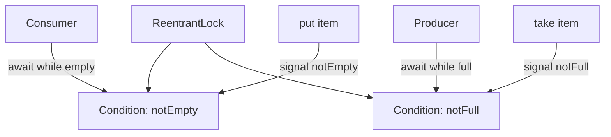
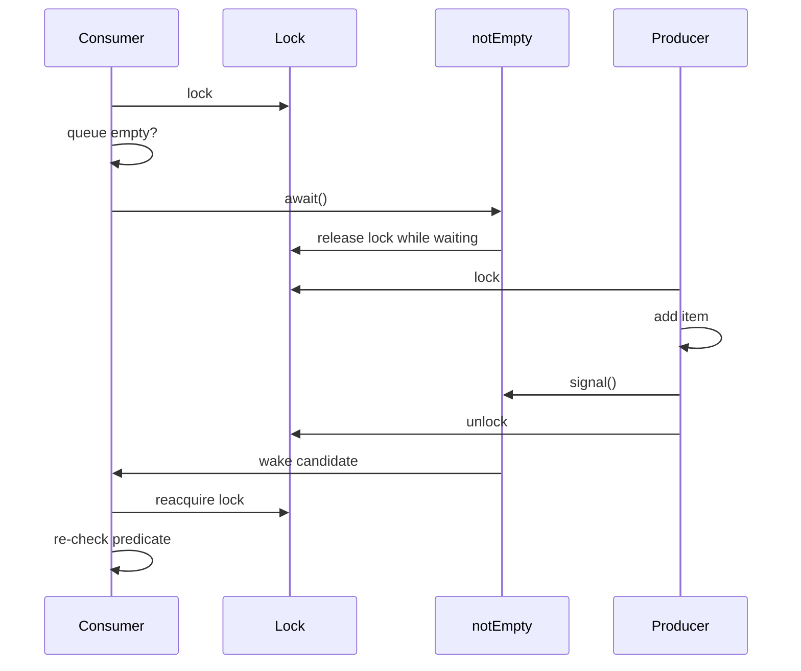
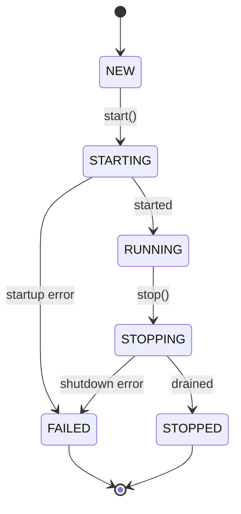

------
title: Learn Java Concurrency & Correctness - Part 010
description: Explicit locks, ReentrantLock, Condition, fairness, timed and interruptible acquisition, coordination protocols, signal discipline, and production lock design.
series: learn-java-concurrency-correctness
seriesTitle: Learn Java Concurrency & Correctness
order: 10
partTitle: Locks, Conditions, and Coordination
tags:
- java
- concurrency
- correctness
- reentrantlock
- condition
- coordination
- locking
date: 2026-06-28
---

# Part 010 — Locks, Conditions, and Coordination

Part 009 covered `synchronized`, Java's intrinsic monitor-based locking mechanism.

This part moves to the explicit locking API in `java.util.concurrent.locks`, especially:

- `Lock`;
- `ReentrantLock`;
- `Condition`.

Do not think of `ReentrantLock` as simply "better synchronized".

A better mental model:

> `synchronized` is structured monitor locking. `ReentrantLock` is explicit lock control with additional acquisition and coordination capabilities.

The correctness problem remains the same:

```text
Which invariant is protected, by which jurisdiction, with what waiting and cancellation semantics?
```

`ReentrantLock` gives you more power. It also gives you more ways to make mistakes.

---

## 1. Kaufman Skill Deconstruction

Explicit locking decomposes into eight subskills.

| Subskill | Engineering question |
|---|---|
| Lock ownership | Which thread owns the lock right now? |
| Acquisition mode | Should acquisition block forever, time out, or respond to interruption? |
| Release discipline | Is every successful acquisition released exactly once? |
| Fairness policy | Is throughput or queue fairness more important? |
| Condition modeling | What condition predicates can threads wait for? |
| Signal discipline | Who signals whom, and after which state transition? |
| Failure cleanup | What happens if the guarded operation throws? |
| Observability | Can we diagnose contention, queue length, and ownership? |

The core upgrade from Part 009:

> We are no longer just protecting a critical section. We are designing a coordination protocol.

---

## 2. Why Explicit Locks Exist

Intrinsic monitors are intentionally simple.

```java
synchronized (lock) {
    // acquire, execute, release
}
```

This is excellent when lock acquisition is straightforward.

But some systems need more control:

| Requirement | `synchronized` | `ReentrantLock` |
|---|---:|---:|
| Block-structured acquire/release | Yes | Yes, manually via `try/finally` |
| Reentrant ownership | Yes | Yes |
| Timed acquisition | No | Yes |
| Interruptible acquisition | No direct equivalent | Yes |
| Try without waiting | No | Yes |
| Multiple condition queues | No, one wait set per monitor | Yes, multiple `Condition`s |
| Fairness option | No explicit policy | Optional fairness constructor |
| Introspection methods | Limited | More APIs |
| Automatic release on scope exit | Yes | No |

The key trade-off:

```text
synchronized = less flexible, harder to misuse
ReentrantLock = more flexible, easier to misuse
```

---

## 3. Basic `ReentrantLock` Pattern

Always use `try/finally`.

```java
public final class Counter {
    private final ReentrantLock lock = new ReentrantLock();
    private int count;

    public void increment() {
        lock.lock();
        try {
            count++;
        } finally {
            lock.unlock();
        }
    }

    public int value() {
        lock.lock();
        try {
            return count;
        } finally {
            lock.unlock();
        }
    }
}
```

The `finally` block is not style preference. It is correctness.

Broken:

```java
lock.lock();
if (invalid()) {
    return; // lock never released
}
lock.unlock();
```

Correct:

```java
lock.lock();
try {
    if (invalid()) {
        return;
    }
    apply();
} finally {
    lock.unlock();
}
```

`ReentrantLock` does not automatically unlock when lexical scope exits. You must do it.

---

## 4. Reentrancy

Like intrinsic locks, `ReentrantLock` is reentrant.

```java
public final class Lifecycle {
    private final ReentrantLock lock = new ReentrantLock();
    private boolean started;

    public void start() {
        lock.lock();
        try {
            ensureNotStarted();
            started = true;
        } finally {
            lock.unlock();
        }
    }

    private void ensureNotStarted() {
        lock.lock();
        try {
            if (started) {
                throw new IllegalStateException("already started");
            }
        } finally {
            lock.unlock();
        }
    }
}
```

This works, but it is unnecessarily noisy.

Better:

```java
public void start() {
    lock.lock();
    try {
        ensureNotStartedLocked();
        started = true;
    } finally {
        lock.unlock();
    }
}

private void ensureNotStartedLocked() {
    if (started) {
        throw new IllegalStateException("already started");
    }
}
```

Use naming to document lock preconditions:

- `fooLocked()`;
- `fooUnderLock()`;
- `requiresLock()`;
- `assertLocked()`.

Example:

```java
private void assertLocked() {
    if (!lock.isHeldByCurrentThread()) {
        throw new IllegalStateException("lock must be held");
    }
}
```

This is useful in complex classes, especially during refactoring.

---

## 5. `lock()`: Unbounded Blocking Acquisition

The simplest acquisition mode:

```java
lock.lock();
try {
    mutateState();
} finally {
    lock.unlock();
}
```

`lock()` waits until the lock is available.

Use it when:

- waiting indefinitely is acceptable;
- the critical section is short;
- cancellation is not required while waiting;
- deadlock is structurally impossible or strongly controlled;
- the lock protects local memory state.

Do not use it blindly for request-handling code where you need deadlines.

Example risk:

```java
public Response handle(Request request) {
    lock.lock(); // may wait longer than request deadline
    try {
        return apply(request);
    } finally {
        lock.unlock();
    }
}
```

If the caller has a 200ms deadline, unbounded lock waiting can violate the end-to-end contract.

---

## 6. `tryLock()`: Opportunistic Acquisition

`tryLock()` attempts to acquire immediately.

```java
if (lock.tryLock()) {
    try {
        refreshCache();
    } finally {
        lock.unlock();
    }
} else {
    // someone else is refreshing; skip
}
```

This is useful for best-effort tasks:

- cache refresh;
- background compaction;
- non-critical cleanup;
- duplicate suppression;
- metrics aggregation;
- avoiding thundering herd refresh.

Example: single-flight-ish cache refresh.

```java
public void refreshIfIdle() {
    if (!refreshLock.tryLock()) {
        return;
    }

    try {
        performRefresh();
    } finally {
        refreshLock.unlock();
    }
}
```

This does not make callers wait. It chooses to skip when another thread owns the work.

Correctness question:

```text
Is skipping acceptable?
```

If skipping would violate business correctness, `tryLock()` is wrong.

---

## 7. Timed `tryLock`

Timed acquisition waits up to a limit.

```java
if (lock.tryLock(50, TimeUnit.MILLISECONDS)) {
    try {
        return update();
    } finally {
        lock.unlock();
    }
}

throw new TimeoutException("could not acquire lock within 50ms");
```

Use timed locking when lock acquisition is part of a larger deadline.

Example:

```java
public AssignmentResult assign(CaseId caseId, UserId userId, Deadline deadline)
        throws InterruptedException, TimeoutException {

    long waitNanos = deadline.remainingNanos();
    if (!lock.tryLock(waitNanos, TimeUnit.NANOSECONDS)) {
        throw new TimeoutException("assignment lock not acquired before deadline");
    }

    try {
        return assignLocked(caseId, userId);
    } finally {
        lock.unlock();
    }
}
```

The subtle issue:

> Lock wait time consumes the same budget as actual work.

Do not separately give the lock 200ms and the downstream call another 200ms if the request has only 200ms total.

Part 032 will cover deadline propagation deeply. For now, remember that timed locks are one way to make local coordination respect caller time.

---

## 8. `lockInterruptibly()`

`lockInterruptibly()` allows a thread waiting for a lock to respond to interruption.

```java
lock.lockInterruptibly();
try {
    updateState();
} finally {
    lock.unlock();
}
```

This matters when:

- tasks can be cancelled;
- shutdown must not hang;
- request deadlines interrupt work;
- worker threads should not wait forever during stop;
- lock acquisition can be slow due to contention.

Example:

```java
public void stop() throws InterruptedException {
    lock.lockInterruptibly();
    try {
        stopped = true;
    } finally {
        lock.unlock();
    }
}
```

If the thread is interrupted before acquiring the lock, the method throws `InterruptedException` and does not acquire the lock.

Therefore, only unlock after successful acquisition.

Broken:

```java
try {
    lock.lockInterruptibly();
    doWork();
} finally {
    lock.unlock(); // may unlock without ownership
}
```

Correct:

```java
lock.lockInterruptibly();
try {
    doWork();
} finally {
    lock.unlock();
}
```

The `try` begins after acquisition succeeds.

---

## 9. Fair vs Non-Fair Locks

`ReentrantLock` can be constructed as fair or non-fair.

```java
private final ReentrantLock unfair = new ReentrantLock();
private final ReentrantLock fair = new ReentrantLock(true);
```

A fair lock favors granting access to the longest-waiting thread under contention.

This can reduce starvation risk, but often reduces throughput due to less opportunistic scheduling.

Decision matrix:

| Situation | Prefer |
|---|---|
| Maximum throughput, short critical sections | Non-fair default |
| Strict-ish queue fairness needed | Fair lock |
| Request latency tail caused by barging | Consider fair lock, measure |
| Lock protects hot low-level path | Avoid fairness unless proven needed |
| Regulatory workflow step requiring order | Do not rely only on Java lock fairness; model order explicitly |

Fairness in `ReentrantLock` is not a business ordering guarantee.

If cases must be processed FIFO, use a queue with explicit sequence semantics, not just a fair lock.

---

## 10. Explicit Locks and Memory Semantics

`Lock` implementations must provide memory synchronization semantics comparable to intrinsic locks for lock/unlock operations.

Practical rule:

> A successful unlock makes guarded writes visible to a later successful lock on the same lock.

Example:

```java
public final class ConfigStore {
    private final ReentrantLock lock = new ReentrantLock();
    private Map<String, String> config = Map.of();

    public void replace(Map<String, String> next) {
        lock.lock();
        try {
            config = Map.copyOf(next);
        } finally {
            lock.unlock();
        }
    }

    public Optional<String> get(String key) {
        lock.lock();
        try {
            return Optional.ofNullable(config.get(key));
        } finally {
            lock.unlock();
        }
    }
}
```

Just like `synchronized`, this only works if all relevant accesses follow the protocol.

Broken:

```java
public Map<String, String> unsafeRawConfig() {
    return config;
}
```

The lock cannot protect what the class leaks.

---

## 11. Conditions: More Than One Wait Set

A monitor has one wait set per object.

A `ReentrantLock` can create multiple `Condition` objects.

```java
private final ReentrantLock lock = new ReentrantLock();
private final Condition notEmpty = lock.newCondition();
private final Condition notFull = lock.newCondition();
```

This is useful when different groups of threads wait for different predicates.

Example bounded buffer:

```text
Producers wait for: queue is not full
Consumers wait for: queue is not empty
```

With two conditions, producers and consumers can be signaled more precisely.



---

## 12. Condition Predicate Discipline

A condition is not the predicate itself.

The predicate is state under the lock.

```java
while (queue.isEmpty()) {
    notEmpty.await();
}
```

The `Condition` is merely the waiting mechanism.

Correct pattern:

```java
lock.lock();
try {
    while (!predicate()) {
        condition.await();
    }
    performActionAssumingPredicate();
} finally {
    lock.unlock();
}
```

Use `while`, not `if`.

Why?

- spurious wakeups are allowed;
- another thread may consume the condition before this thread resumes;
- signals are not durable state;
- interruption/timeouts may alter control flow;
- multiple waiters may race after signal.

Broken:

```java
if (queue.isEmpty()) {
    notEmpty.await();
}
return queue.removeFirst();
```

Correct:

```java
while (queue.isEmpty()) {
    notEmpty.await();
}
return queue.removeFirst();
```

---

## 13. `await()` Releases and Reacquires the Lock

When a thread calls `await()`:

1. it must already hold the lock;
2. it atomically releases the lock and waits;
3. another thread may acquire the lock and change state;
4. the waiting thread is signaled, interrupted, or wakes spuriously;
5. before `await()` returns, the thread reacquires the lock.

Sequence:



This explains why the predicate must be checked while holding the lock.

---

## 14. Bounded Buffer with `Condition`

A classic implementation:

```java
public final class BoundedBuffer<E> {
    private final ReentrantLock lock = new ReentrantLock();
    private final Condition notEmpty = lock.newCondition();
    private final Condition notFull = lock.newCondition();
    private final ArrayDeque<E> queue = new ArrayDeque<>();
    private final int capacity;

    public BoundedBuffer(int capacity) {
        if (capacity <= 0) {
            throw new IllegalArgumentException("capacity must be positive");
        }
        this.capacity = capacity;
    }

    public void put(E item) throws InterruptedException {
        Objects.requireNonNull(item);

        lock.lockInterruptibly();
        try {
            while (queue.size() == capacity) {
                notFull.await();
            }

            queue.addLast(item);
            notEmpty.signal();
        } finally {
            lock.unlock();
        }
    }

    public E take() throws InterruptedException {
        lock.lockInterruptibly();
        try {
            while (queue.isEmpty()) {
                notEmpty.await();
            }

            E item = queue.removeFirst();
            notFull.signal();
            return item;
        } finally {
            lock.unlock();
        }
    }

    public int size() {
        lock.lock();
        try {
            return queue.size();
        } finally {
            lock.unlock();
        }
    }
}
```

Important details:

- `queue` is guarded by `lock`;
- producers wait on `notFull`;
- consumers wait on `notEmpty`;
- `await()` is in a `while` loop;
- `signal()` happens after state mutation;
- acquisition is interruptible for cancellation/shutdown friendliness;
- `size()` also uses the lock.

In real production Java, prefer `ArrayBlockingQueue` or `LinkedBlockingQueue` unless you are building a custom synchronizer for learning or specialized behavior.

But this example is valuable because it teaches the protocol.

---

## 15. Signal After State Change

The signal should correspond to a state transition that may make a predicate true.

Correct:

```java
queue.addLast(item);
notEmpty.signal();
```

Incorrect:

```java
notEmpty.signal();
queue.addLast(item);
```

Why?

The waiting thread wakes and reacquires the lock. When it checks the predicate, the state should already reflect the reason for the signal.

General rule:

```text
mutate guarded state -> signal affected condition -> release lock
```

Do not signal without a state transition unless you are deliberately forcing a recheck, such as during shutdown.

---

## 16. `signal()` vs `signalAll()`

`signal()` wakes one waiting thread.

`signalAll()` wakes all waiting threads.

Use `signal()` when:

- one state change can satisfy at most one waiter;
- all waiters are waiting for the same kind of predicate;
- waking extra threads would cause unnecessary contention.

Use `signalAll()` when:

- multiple waiters may now proceed;
- predicates differ among waiters;
- shutdown/cancellation state changed globally;
- correctness is more important than avoiding wakeup overhead;
- you are unsure whether one signal is sufficient.

Example shutdown:

```java
public void close() {
    lock.lock();
    try {
        closed = true;
        notEmpty.signalAll();
        notFull.signalAll();
    } finally {
        lock.unlock();
    }
}
```

If you signal only one waiter during shutdown, others may sleep forever.

A useful rule for advanced review:

> Use `signal()` for one-resource-one-waiter transitions. Use `signalAll()` for mode changes.

---

## 17. Closed-State Protocol

Blocking structures need a shutdown story.

A bounded buffer without close can trap threads forever during service shutdown.

Improved version:

```java
public final class CloseableBuffer<E> {
    private final ReentrantLock lock = new ReentrantLock();
    private final Condition notEmpty = lock.newCondition();
    private final Condition notFull = lock.newCondition();
    private final ArrayDeque<E> queue = new ArrayDeque<>();
    private final int capacity;
    private boolean closed;

    public CloseableBuffer(int capacity) {
        this.capacity = capacity;
    }

    public void put(E item) throws InterruptedException {
        Objects.requireNonNull(item);

        lock.lockInterruptibly();
        try {
            while (!closed && queue.size() == capacity) {
                notFull.await();
            }
            if (closed) {
                throw new IllegalStateException("buffer is closed");
            }
            queue.addLast(item);
            notEmpty.signal();
        } finally {
            lock.unlock();
        }
    }

    public Optional<E> take() throws InterruptedException {
        lock.lockInterruptibly();
        try {
            while (!closed && queue.isEmpty()) {
                notEmpty.await();
            }
            if (queue.isEmpty()) {
                return Optional.empty();
            }
            E item = queue.removeFirst();
            notFull.signal();
            return Optional.of(item);
        } finally {
            lock.unlock();
        }
    }

    public void close() {
        lock.lock();
        try {
            closed = true;
            notEmpty.signalAll();
            notFull.signalAll();
        } finally {
            lock.unlock();
        }
    }
}
```

This illustrates a crucial production invariant:

> Every blocking wait must have a plausible wakeup path for normal progress and shutdown.

---

## 18. Await Variants

`Condition` provides multiple waiting styles:

| Method | Use case |
|---|---|
| `await()` | Interruptible indefinite wait |
| `awaitUninterruptibly()` | Rare cases where interruption must not abort wait |
| `awaitNanos(long)` | Deadline-aware loops |
| `await(long, TimeUnit)` | Simpler timed wait |
| `awaitUntil(Date)` | Legacy absolute date style |

Prefer interruptible and deadline-aware waits for production services.

Example deadline-aware wait:

```java
public Optional<E> poll(Duration timeout) throws InterruptedException {
    long nanos = timeout.toNanos();

    lock.lockInterruptibly();
    try {
        while (queue.isEmpty()) {
            if (nanos <= 0L) {
                return Optional.empty();
            }
            nanos = notEmpty.awaitNanos(nanos);
        }

        E item = queue.removeFirst();
        notFull.signal();
        return Optional.of(item);
    } finally {
        lock.unlock();
    }
}
```

Notice that the remaining time is updated.

Broken timed wait:

```java
while (queue.isEmpty()) {
    notEmpty.await(100, TimeUnit.MILLISECONDS); // resets budget every loop
}
```

This can wait much longer than intended.

---

## 19. Coordination Is State Machine Design

Condition code is easier when written as a state machine.

Example lifecycle:

```java
enum State {
    NEW,
    STARTING,
    RUNNING,
    STOPPING,
    STOPPED,
    FAILED
}
```

State transitions:



Condition predicates:

```text
running: state == RUNNING
terminal: state == STOPPED || state == FAILED
canStart: state == NEW
canStop: state == RUNNING
```

Implementation sketch:

```java
public final class ServiceLifecycle {
    private final ReentrantLock lock = new ReentrantLock();
    private final Condition running = lock.newCondition();
    private final Condition terminal = lock.newCondition();
    private State state = State.NEW;

    public void markRunning() {
        lock.lock();
        try {
            state = State.RUNNING;
            running.signalAll();
        } finally {
            lock.unlock();
        }
    }

    public void awaitRunning() throws InterruptedException {
        lock.lockInterruptibly();
        try {
            while (state != State.RUNNING && state != State.FAILED) {
                running.await();
            }
            if (state == State.FAILED) {
                throw new IllegalStateException("service failed");
            }
        } finally {
            lock.unlock();
        }
    }

    public void markStopped() {
        lock.lock();
        try {
            state = State.STOPPED;
            terminal.signalAll();
        } finally {
            lock.unlock();
        }
    }
}
```

The conditions are not random events. They are tied to state predicates.

---

## 20. Lost Signal Myth

A common phrase is "lost signal".

The deeper issue is usually:

> The code treated the signal as the condition, instead of treating guarded state as the condition.

Correct waiting does not require remembering signals.

If the state is already true, the thread does not wait:

```java
while (!ready) {
    readyCondition.await();
}
```

If `ready` became true before the thread arrived, the loop is skipped.

This is why the predicate must be stored in guarded state.

Broken event-style thinking:

```java
condition.await(); // waits for a signal, but what if signal already happened?
```

Correct state-style thinking:

```java
while (!ready) {
    condition.await();
}
```

Signals are nudges. State is truth.

---

## 21. Multiple Conditions vs Multiple Locks

Do not create multiple locks just because there are multiple conditions.

One invariant often needs one lock and several conditions.

Example:

```java
private final ReentrantLock lock = new ReentrantLock();
private final Condition notEmpty = lock.newCondition();
private final Condition notFull = lock.newCondition();
```

Both conditions are associated with the same lock because they both depend on the same state:

```java
private final ArrayDeque<E> queue;
private final int capacity;
```

Bad design:

```java
private final ReentrantLock producerLock = new ReentrantLock();
private final ReentrantLock consumerLock = new ReentrantLock();
```

Unless very carefully designed, this splits access to one queue across two jurisdictions.

Advanced rule:

> Use multiple conditions when multiple predicates guard the same state. Use multiple locks only when the invariants are actually independent.

---

## 22. Non-Block-Structured Locking

`Lock` can support patterns that `synchronized` cannot express cleanly, such as hand-over-hand locking.

Example concept: traversing a linked structure while locking current and next nodes.

```java
Node current = head;
current.lock.lock();
try {
    while (current.next != null) {
        Node next = current.next;
        next.lock.lock();
        try {
            current.lock.unlock();
            current = next;
        } catch (RuntimeException e) {
            next.lock.unlock();
            throw e;
        }
    }
} finally {
    current.lock.unlock();
}
```

This style is advanced and error-prone.

Most application code should avoid it.

In enterprise systems, if you think you need non-block-structured locking, challenge the design:

- Can state ownership be partitioned more cleanly?
- Can a queue/actor own the mutation?
- Can the database handle the isolation?
- Can immutable snapshots avoid traversal mutation?
- Is a concurrent collection already available?

The existence of `Lock` does not mean application code should emulate low-level concurrent data structures.

---

## 23. Lock Introspection

`ReentrantLock` exposes methods such as:

- `isLocked()`;
- `isHeldByCurrentThread()`;
- `getHoldCount()`;
- `hasQueuedThreads()`;
- `getQueueLength()`;
- `hasWaiters(condition)`;
- `getWaitQueueLength(condition)`.

These are useful for diagnostics and assertions, not core correctness.

Example assertion:

```java
private void requireLockHeld() {
    if (!lock.isHeldByCurrentThread()) {
        throw new IllegalStateException("lock must be held");
    }
}
```

Avoid writing business logic like:

```java
if (!lock.isLocked()) {
    // assume safe to proceed
}
```

That check is immediately stale. Another thread may acquire the lock after the check.

Introspection is observational, not a substitute for acquisition.

---

## 24. Mixing `synchronized` and `ReentrantLock`

Do not guard one invariant with both mechanisms unless there is a very deliberate bridge.

Broken:

```java
private final ReentrantLock lock = new ReentrantLock();
private int count;

public synchronized void increment() {
    count++;
}

public int value() {
    lock.lock();
    try {
        return count;
    } finally {
        lock.unlock();
    }
}
```

This uses two unrelated locks:

- `increment()` uses `this` monitor;
- `value()` uses `lock`.

They do not coordinate.

Correct:

```java
public void increment() {
    lock.lock();
    try {
        count++;
    } finally {
        lock.unlock();
    }
}
```

or:

```java
public synchronized void increment() {
    count++;
}

public synchronized int value() {
    return count;
}
```

One invariant, one lock protocol.

---

## 25. Do Not Expose the Lock Casually

Some classes expose a lock intentionally.

```java
public Lock lock() {
    return lock;
}
```

This turns the lock into part of your public protocol. That may be necessary for specialized libraries, but it is dangerous for ordinary application classes.

Risks:

- external code can hold your lock too long;
- lock ordering becomes impossible to enforce;
- invariants can be modified indirectly;
- deadlocks can involve unknown callers;
- future refactoring is constrained.

Prefer domain methods:

```java
public AssignmentChange assign(CaseId caseId, UserId userId) { ... }
```

not generic lock access:

```java
public Lock assignmentLock() { ... }
```

Expose capabilities, not locks.

---

## 26. Explicit Locking with Virtual Threads

Virtual threads make blocking cheaper, but they do not make locks disappear.

With virtual threads, you can often use a straightforward thread-per-task style. Still:

- a contended lock serializes virtual threads just like platform threads;
- a hot monitor or `ReentrantLock` can dominate tail latency;
- holding locks across IO still blocks other logical tasks needing the same invariant;
- resource limiting should be explicit, not achieved by pooling virtual threads.

Good virtual-thread-era pattern:

```java
try (var executor = Executors.newVirtualThreadPerTaskExecutor()) {
    Future<Result> future = executor.submit(() -> service.handle(request));
    return future.get();
}
```

Inside `handle`, local state may still need locks.

But avoid using locks as resource limiters:

```java
private final ReentrantLock dbLock = new ReentrantLock(); // bad resource limiter
```

Use a semaphore or bounded connection pool for resource capacity. Locks protect invariants. Semaphores limit permits. Queues absorb work. Thread pools schedule execution.

Do not mix these concepts casually.

---

## 27. Coordination vs Mutual Exclusion

Mutual exclusion answers:

```text
Who may enter this critical section right now?
```

Coordination answers:

```text
When is it valid for a waiting thread to proceed?
```

Example:

```java
while (queue.isEmpty()) {
    notEmpty.await();
}
```

The lock provides exclusive access to the queue.

The condition coordinates consumers around the predicate `!queue.isEmpty()`.

A correct design needs both:

```text
exclusive access + explicit predicate + signal after state transition
```

---

## 28. Production Anti-Patterns

### 28.1 Missing `finally`

```java
lock.lock();
mutate();
lock.unlock();
```

If `mutate()` throws, the lock stays held.

Fix:

```java
lock.lock();
try {
    mutate();
} finally {
    lock.unlock();
}
```

---

### 28.2 Unlocking Without Ownership

```java
try {
    if (lock.tryLock()) {
        mutate();
    }
} finally {
    lock.unlock();
}
```

If `tryLock()` returns false, this unlocks without ownership.

Fix:

```java
if (lock.tryLock()) {
    try {
        mutate();
    } finally {
        lock.unlock();
    }
}
```

---

### 28.3 Waiting with `if`

```java
if (!ready) {
    condition.await();
}
```

Fix:

```java
while (!ready) {
    condition.await();
}
```

---

### 28.4 Signaling Without State Change

```java
condition.signal();
```

Signal should normally follow mutation that may satisfy a predicate.

Fix:

```java
ready = true;
condition.signalAll();
```

---

### 28.5 Swallowing Interruption

```java
try {
    condition.await();
} catch (InterruptedException ignored) {
}
```

This breaks cancellation protocols.

Better options:

```java
throw e;
```

or:

```java
Thread.currentThread().interrupt();
return;
```

The right choice depends on the API contract.

---

### 28.6 Using Fair Locks as Business Ordering

```java
new ReentrantLock(true)
```

This does not make business workflows FIFO in a durable or distributed sense.

If order matters, model order in data:

- sequence number;
- queue offset;
- database timestamp with tie-breaker;
- workflow state transition record;
- command log.

---

### 28.7 Condition Without Predicate

Bad:

```java
condition.await();
process();
```

Correct:

```java
while (!canProcess()) {
    condition.await();
}
process();
```

Condition variables do not hold truth. Guarded state holds truth.

---

## 29. Choosing `synchronized` vs `ReentrantLock`

Default to `synchronized` when:

- critical section is simple;
- no timed acquisition is needed;
- no interruptible acquisition is needed;
- one wait set is sufficient or there is no waiting;
- block-structured locking is natural;
- you want minimal surface area.

Choose `ReentrantLock` when:

- you need `tryLock()`;
- you need timed acquisition;
- you need `lockInterruptibly()`;
- you need multiple `Condition`s;
- you need optional fairness;
- you need introspection for diagnostics;
- lock lifecycle cannot be block-structured;
- you are implementing a synchronizer-like component.

Do not migrate from `synchronized` to `ReentrantLock` merely for fashion.

Migration should be justified by a capability gap.

---

## 30. Design Exercise: Case Intake Gate

Problem:

A regulatory case intake service has a bounded in-memory staging area before persistence. Producers submit cases. Workers drain cases. During shutdown:

- no new cases should be accepted;
- workers should drain existing cases;
- waiting producers should wake and fail;
- waiting consumers should wake and exit when empty.

State:

```java
private final ArrayDeque<CaseCommand> queue = new ArrayDeque<>();
private final int capacity;
private boolean closing;
```

Predicates:

```text
canPut = !closing && queue.size() < capacity
canTake = !queue.isEmpty() || closing
closedAndEmpty = closing && queue.isEmpty()
```

Conditions:

```java
private final Condition notFull = lock.newCondition();
private final Condition notEmptyOrClosing = lock.newCondition();
```

Implementation:

```java
public final class CaseIntakeGate {
    private final ReentrantLock lock = new ReentrantLock();
    private final Condition notFull = lock.newCondition();
    private final Condition notEmptyOrClosing = lock.newCondition();
    private final ArrayDeque<CaseCommand> queue = new ArrayDeque<>();
    private final int capacity;
    private boolean closing;

    public CaseIntakeGate(int capacity) {
        if (capacity <= 0) {
            throw new IllegalArgumentException("capacity must be positive");
        }
        this.capacity = capacity;
    }

    public void submit(CaseCommand command) throws InterruptedException {
        Objects.requireNonNull(command);

        lock.lockInterruptibly();
        try {
            while (!closing && queue.size() == capacity) {
                notFull.await();
            }
            if (closing) {
                throw new IllegalStateException("intake is closing");
            }
            queue.addLast(command);
            notEmptyOrClosing.signal();
        } finally {
            lock.unlock();
        }
    }

    public Optional<CaseCommand> take() throws InterruptedException {
        lock.lockInterruptibly();
        try {
            while (!closing && queue.isEmpty()) {
                notEmptyOrClosing.await();
            }
            if (queue.isEmpty()) {
                return Optional.empty();
            }
            CaseCommand command = queue.removeFirst();
            notFull.signal();
            return Optional.of(command);
        } finally {
            lock.unlock();
        }
    }

    public void close() {
        lock.lock();
        try {
            closing = true;
            notFull.signalAll();
            notEmptyOrClosing.signalAll();
        } finally {
            lock.unlock();
        }
    }
}
```

Why this is production-shaped:

- bounded capacity creates backpressure;
- condition predicates are explicit;
- shutdown wakes all relevant waiters;
- producers and consumers have separate conditions;
- no external side effects occur under lock;
- the API exposes domain behavior, not the lock.

But for most real systems, you would first consider `BlockingQueue` and executor lifecycle primitives. Implement custom locks only when built-in abstractions do not match your semantics.

---

## 31. Review Checklist

### Lock Use

- Is every `lock.lock()` followed by `try/finally`?
- Does the `try` start only after successful acquisition?
- Does the code avoid unlocking when `tryLock()` failed?
- Is the lock private unless intentionally part of the public protocol?

### Invariant

- What state is guarded by the lock?
- Are all reads and writes guarded consistently?
- Are helper methods named to show lock preconditions?
- Is mutable guarded state copied before returning?

### Conditions

- Is every `await()` inside a `while` loop?
- Is the condition predicate explicit?
- Is the predicate checked under the lock?
- Does signal happen after state mutation?
- Is `signalAll()` used for shutdown/mode changes?

### Cancellation and Time

- Should acquisition be interruptible?
- Should acquisition have a timeout?
- Does timed waiting correctly preserve remaining budget?
- Is interruption propagated or restored?

### Fairness and Ordering

- Is fairness selected deliberately?
- Is fairness being misused as business ordering?
- Is durable order modeled outside the lock when needed?

---

## 32. Mental Model Summary

`ReentrantLock` is useful when you need explicit control over lock acquisition and condition queues.

The essential rules:

- use `try/finally` for every acquisition;
- choose acquisition mode deliberately;
- guard one invariant with one protocol;
- use `while` around condition waits;
- treat signals as nudges, not truth;
- mutate state before signaling;
- use `signalAll()` for global mode changes;
- make shutdown wake all blocked waiters;
- do not expose locks casually;
- do not use lock fairness as business ordering.

Advanced Java concurrency is mostly not about knowing obscure classes. It is about designing explicit protocols where state, waiting, cancellation, and failure all line up.

---

## 33. Practice Drills

### Drill 1 — Convert Monitor to Explicit Lock

Take a class using `synchronized` and convert it to `ReentrantLock`.

Then answer:

- what capability did you gain?
- what new mistake became possible?
- was the conversion actually justified?

### Drill 2 — Add Timeout

Add a timed `tryLock` to a request-handling method.

Ensure the timeout participates in the caller's total deadline rather than adding a separate hidden budget.

### Drill 3 — Build a Two-Condition Buffer

Implement a bounded buffer with `notEmpty` and `notFull`.

Then add:

- interruptible waits;
- timed `poll`;
- close semantics;
- tests for shutdown wakeups.

### Drill 4 — Signal Audit

For every `signal` or `signalAll`, write the state transition that justifies it.

Format:

```text
State transition: queue size 0 -> 1
Affected predicate: !queue.isEmpty()
Signal: notEmpty.signal()
```

If you cannot name the predicate, the condition design is unclear.

---

## 34. Part 010 Checklist

Before moving on, you should be able to explain:

- when `ReentrantLock` is justified over `synchronized`;
- why `try/finally` is mandatory;
- why `lockInterruptibly()` matters for cancellation;
- how timed lock acquisition supports deadline-aware systems;
- what a condition predicate is;
- why `await()` must be used in a `while` loop;
- why signal follows mutation;
- when to use `signalAll()`;
- why fairness is not business ordering;
- why multiple conditions often share one lock.

Part 011 will build on this by analyzing what happens when coordination goes wrong: deadlock, starvation, livelock, priority inversion, lock convoying, and practical liveness failure analysis.

---

## References

- Java SE 25 API: `Lock` — https://docs.oracle.com/en/java/javase/25/docs/api/java.base/java/util/concurrent/locks/Lock.html
- Java SE 25 API: `ReentrantLock` — https://docs.oracle.com/en/java/javase/25/docs/api/java.base/java/util/concurrent/locks/ReentrantLock.html
- Java SE 25 API: `Condition` — https://docs.oracle.com/en/java/javase/25/docs/api/java.base/java/util/concurrent/locks/Condition.html
- Java Language Specification, Chapter 17: Threads and Locks — https://docs.oracle.com/javase/specs/jls/se25/html/jls-17.html
