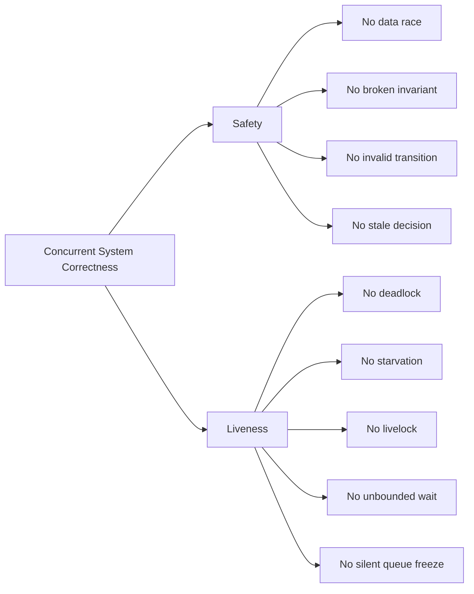
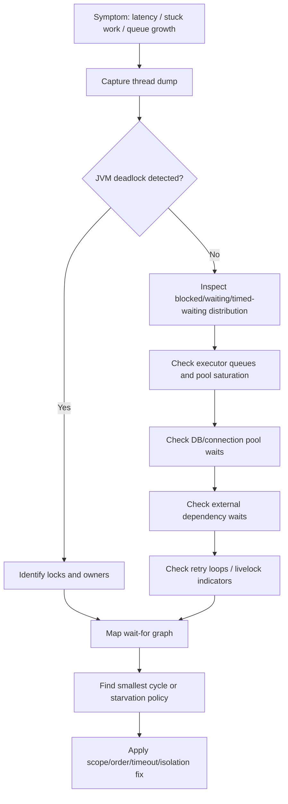
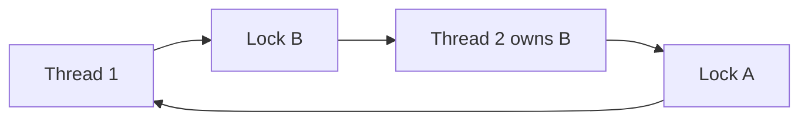

------
title: Learn Java Concurrency & Correctness - Part 011
description: Liveness failure modes in Java concurrency: deadlock, starvation, livelock, priority inversion, lock ordering, timeout strategy, diagnostics, and production prevention.
series: learn-java-concurrency-correctness
seriesTitle: Learn Java Concurrency & Correctness
order: 11
partTitle: Liveness, Deadlock, Starvation, and Livelock
tags:
- java
- concurrency
- correctness
- liveness
- deadlock
- starvation
- livelock
- production-engineering
date: 2026-06-28
---

# Part 011 — Liveness, Deadlock, Starvation, and Livelock

Concurrency correctness has two large families:

1. **Safety** — bad things must not happen.
2. **Liveness** — good things must eventually happen.

Earlier parts focused heavily on safety: data races, stale reads, unsafe publication, lost updates, and broken invariants. This part focuses on the other half: a concurrent system that is internally consistent but **stops making progress**.

That distinction matters. A system can have no data corruption and still be unusable because requests hang forever, queues never drain, workers keep retrying without useful progress, or high-priority work is permanently delayed behind low-value work.

In production systems, liveness bugs often appear as:

- request latency increasing until timeout,
- thread pools saturated with blocked tasks,
- CPU low but throughput also low,
- one shard/tenant/case stuck while others work,
- periodic jobs overlapping and never completing,
- database transactions held open too long,
- queues growing although consumers are “running”,
- distributed locks not released,
- retry storms that create activity but no completion.

A top-tier engineer does not treat these as random “performance problems”. They classify them as **progress failures**.

---

## 1. Kaufman Framing: The Subskill We Are Training

From the Kaufman learning model, the subskill here is:

> Given a concurrent design, predict whether every valid execution path can make progress, and identify the smallest condition that can permanently block progress.

You are not merely learning definitions of deadlock, starvation, and livelock. You are learning to audit a system for progress.

### Practice Target

After this part, you should be able to answer:

- Which resource can block progress?
- Which code path holds that resource?
- Can another path wait for it while holding a second resource?
- Can two or more paths form a cycle?
- Can a task be repeatedly bypassed forever?
- Can tasks keep reacting to each other without completing?
- Is timeout/cancellation a real recovery path or just a log message?
- Is fairness required, or would fairness reduce throughput without improving correctness?

---

## 2. The Core Mental Model: Progress Is a System Invariant

A concurrent component usually has state invariants:

```text
balance >= 0
case.status follows allowed transition graph
only one active investigation assignment per case
no document can be approved before validation
```

A concurrent component also needs progress invariants:

```text
Every submitted task is eventually completed, rejected, cancelled, or handed off.
Every acquired lock is eventually released.
Every waiting thread has a reachable signal path.
Every bounded queue has a reachable drain path.
Every retry loop has a bounded or externally governed lifetime.
Every request deadline is propagated to downstream waits.
```

Safety tells you what must not be violated. Liveness tells you what must not be waited on forever.

### Mermaid: Safety vs Liveness



---

## 3. Deadlock: The System Waits in a Cycle

A **deadlock** occurs when a set of threads or tasks are permanently waiting for each other in a cycle.

The classic Java case:

```java
final Object accountA = new Object();
final Object accountB = new Object();

Thread t1 = Thread.ofPlatform().start(() -> {
    synchronized (accountA) {
        sleepSilently(100);
        synchronized (accountB) {
            transferAtoB();
        }
    }
});

Thread t2 = Thread.ofPlatform().start(() -> {
    synchronized (accountB) {
        sleepSilently(100);
        synchronized (accountA) {
            transferBtoA();
        }
    }
});
```

Possible execution:

```text
t1 locks accountA
t2 locks accountB
t1 waits for accountB
t2 waits for accountA
```

No thread can proceed. No thread can release what the other needs because release only happens after entering the second critical section.

### Deadlock Is Not “Slow”

Deadlock is not high latency. It is not low throughput. It is **zero possible progress** for the involved dependency cycle.

A deadlocked subsystem might still show:

- healthy CPU,
- healthy process uptime,
- partial traffic success,
- normal GC,
- some successful requests.

This is why thread dumps and dependency graph thinking are essential.

---

## 4. Coffman Conditions

Deadlock requires four conditions at the same time:

| Condition | Meaning | Java Example |
|---|---|---|
| Mutual exclusion | Resource can be owned by one actor at a time | lock, DB row lock, semaphore permit |
| Hold and wait | Actor holds one resource while waiting for another | nested `synchronized`, transaction + external call |
| No preemption | Resource cannot be forcibly taken safely | lock released only by owner |
| Circular wait | A waits for B, B waits for A, or larger cycle | inconsistent lock ordering |

To prevent deadlock, break at least one condition.

In Java application code, the most practical condition to break is usually **circular wait** through global ordering, or **hold-and-wait** through lock scope reduction.

---

## 5. Deadlock Beyond Java Locks

A common weak assumption: “deadlock is only about `synchronized`.”

In production systems, deadlock can happen across many resource types:

| Resource | Deadlock Shape |
|---|---|
| JVM locks | Thread A holds lock X waits lock Y; Thread B holds Y waits X |
| DB row locks | Transaction A locks row 1 waits row 2; Transaction B locks row 2 waits row 1 |
| Thread pools | Task waits for child task submitted to same saturated pool |
| Connection pools | Task holds connection while waiting for another operation needing connection |
| Semaphores | Task holds permit A while waiting for permit B |
| Distributed locks | Node A holds lock X waits Y; node B holds Y waits X |
| Event loops | Event loop blocks waiting for work that must run on same event loop |
| Reactive pipelines | Pipeline blocks on value scheduled on the same blocked scheduler |
| Workflow engines | State transition waits on callback that cannot be processed because worker is held |

The invariant is always the same:

```text
If A waits for B while holding C, ask whether B may need C to finish.
```

---

## 6. Thread Pool Deadlock

Thread pool deadlock is subtle because no explicit lock is visible.

### Broken Example

```java
ExecutorService pool = Executors.newFixedThreadPool(2);

Callable<String> parent = () -> {
    Future<String> child = pool.submit(() -> computeChild());
    return "parent:" + child.get();
};

Future<String> f1 = pool.submit(parent);
Future<String> f2 = pool.submit(parent);

System.out.println(f1.get());
System.out.println(f2.get());
```

Execution:

```text
pool size = 2
worker-1 runs parent-1
worker-2 runs parent-2
parent-1 submits child-1 and waits
parent-2 submits child-2 and waits
no free worker exists to run child-1 or child-2
```

No Java monitor deadlock exists, but progress is impossible.

### Fix Options

Option 1: Do not block inside tasks on work submitted to the same bounded executor.

```java
CompletableFuture<String> parentAsync(Executor executor) {
    return CompletableFuture
            .supplyAsync(this::computeChild, executor)
            .thenApply(child -> "parent:" + child);
}
```

Option 2: Use separate executors for parent orchestration and child execution, if the dependency is intentional.

```java
ExecutorService orchestrators = Executors.newFixedThreadPool(2);
ExecutorService workers = Executors.newFixedThreadPool(16);
```

Option 3: Use structured concurrency where child task lifetime is scoped and cancellation/failure propagation is explicit. Structured concurrency will be covered later.

### Rule

> A bounded executor is a resource. Waiting inside a task for another task that needs the same saturated executor is a deadlock candidate.

---

## 7. Connection Pool Deadlock

A connection pool can deadlock or appear deadlocked when a request holds a scarce resource while waiting for another operation that also needs that resource.

### Broken Shape

```text
request thread obtains DB connection
request starts transaction
request calls internal async operation
async operation needs DB connection
pool has no free connections
request waits for async operation
async operation waits for connection
```

This is common when engineers mix:

- transaction scopes,
- async calls,
- connection pools,
- nested repository calls,
- blocking waits.

### Better Shape

```text
compute/validate before transaction
open transaction late
perform DB changes
commit/rollback quickly
release connection
trigger async work after transaction boundary
```

For correctness-sensitive systems, the transaction boundary should be as small as the invariant requires, not as large as the whole use case flow.

---

## 8. Lock Ordering: The Most Practical Deadlock Prevention Tool

If multiple locks must be acquired together, impose a deterministic global order.

### Broken Transfer

```java
void transfer(Account from, Account to, Money amount) {
    synchronized (from) {
        synchronized (to) {
            from.debit(amount);
            to.credit(amount);
        }
    }
}
```

This deadlocks if two threads transfer in opposite directions.

### Fixed with Ordered Locking

```java
void transfer(Account from, Account to, Money amount) {
    Account first = from.id().compareTo(to.id()) < 0 ? from : to;
    Account second = first == from ? to : from;

    synchronized (first.lock()) {
        synchronized (second.lock()) {
            from.debit(amount);
            to.credit(amount);
        }
    }
}
```

The order must be:

- total,
- deterministic,
- stable,
- independent of request direction.

### Tie-Breaker Pattern

If two objects can have equal ordering keys, use a tie lock.

```java
private static final Object tieLock = new Object();

void transfer(Account from, Account to, Money amount) {
    int fromHash = System.identityHashCode(from);
    int toHash = System.identityHashCode(to);

    if (fromHash < toHash) {
        lockBoth(from, to, amount);
    } else if (fromHash > toHash) {
        lockBoth(to, from, amount);
    } else {
        synchronized (tieLock) {
            lockBoth(from, to, amount);
        }
    }
}

private void lockBoth(Account first, Account second, Money amount) {
    synchronized (first.lock()) {
        synchronized (second.lock()) {
            // Apply operation using domain order, not lock order.
        }
    }
}
```

Prefer stable domain identifiers where possible. Identity hash ordering is mostly a fallback technique for object-level locking.

---

## 9. Lock Scope Reduction

Deadlocks become more likely when a lock scope includes operations that can block, call back, or acquire unknown resources.

### Dangerous Critical Section

```java
synchronized (caseFile) {
    caseFile.markUnderReview(userId);
    externalRiskService.recalculate(caseFile.id());
    auditRepository.save(caseFile.snapshot());
    notificationClient.send(...);
}
```

This lock protects too much. It includes:

- external service call,
- repository call,
- network IO,
- notification side effect.

Any of these can block, re-enter, or acquire other resources.

### Better Shape

```java
CaseSnapshot snapshot;

synchronized (caseFile) {
    caseFile.markUnderReview(userId);
    snapshot = caseFile.snapshot();
}

auditRepository.save(snapshot);
notificationClient.send(...);
```

The lock only protects in-memory invariant mutation. Side effects happen outside.

### Rule

> Do not hold JVM locks while performing network IO, database IO, filesystem IO, user callbacks, logging with unknown appenders, or calls into code whose locking behavior you do not own.

---

## 10. Open Calls

An **open call** is a call made without holding a lock.

The idea:

```text
close over the data while locked
release lock
call external dependency
```

### Closed Call Risk

```java
synchronized void addListener(Listener listener) {
    listeners.add(listener);
}

synchronized void publish(Event event) {
    for (Listener listener : listeners) {
        listener.onEvent(event); // dangerous while lock is held
    }
}
```

A listener might:

- call back into this object,
- block,
- acquire another lock,
- throw exception,
- remove itself,
- submit work and wait.

### Open Call Version

```java
void publish(Event event) {
    List<Listener> snapshot;
    synchronized (this) {
        snapshot = List.copyOf(listeners);
    }

    for (Listener listener : snapshot) {
        listener.onEvent(event);
    }
}
```

This is not just a performance optimization. It is a liveness control.

---

## 11. Timeout Is Not Automatically Recovery

Timeouts are useful, but a timeout does not magically make a system correct.

A timeout is only a recovery path if it answers:

- What resource is released?
- What state is rolled back?
- What state is marked uncertain?
- Is the operation safe to retry?
- Will the caller see a deterministic result?
- Is the timeout propagated downstream?
- Is the underlying operation cancelled or merely abandoned?

### Bad Timeout

```java
boolean acquired = lock.tryLock(100, TimeUnit.MILLISECONDS);
if (!acquired) {
    log.warn("Could not acquire lock");
    return;
}
```

This may silently drop required work.

### Better Timeout

```java
boolean acquired = lock.tryLock(100, TimeUnit.MILLISECONDS);
if (!acquired) {
    throw new OverloadedCasePartitionException(caseId);
}

try {
    transitionCase(caseId, command);
} finally {
    lock.unlock();
}
```

Now the timeout is part of the contract.

### Timeout Outcome Types

| Outcome | Meaning | Good For |
|---|---|---|
| Fail fast | Caller receives explicit error | synchronous APIs |
| Retry later | Work is rescheduled | background jobs |
| Escalate | Human/system intervention | regulatory workflows |
| Degrade | Lower-value path skipped | optional enrichment |
| Cancel subtree | Dependent tasks stopped | structured async work |
| Quarantine | Entity marked blocked | case processing, workflow engines |

---

## 12. Starvation: Some Work Never Gets a Turn

**Starvation** happens when a thread/task is ready to proceed but is repeatedly denied the required resource.

Unlike deadlock, the system continues doing work. The problem is that some work is permanently or unacceptably delayed.

### Examples

- A low-priority task never runs because high-priority tasks keep arriving.
- A request for a fair lock is repeatedly beaten by new arrivals using non-fair acquisition.
- A tenant with low volume never gets capacity because high-volume tenants occupy all workers.
- Background reconciliation never catches up because foreground traffic always consumes the pool.
- A queue consumer always drains one partition first, leaving later partitions stale.

### Starvation Is Often a Policy Bug

Starvation is not always caused by the JVM. It is often caused by scheduling policy.

```text
Who gets capacity first?
Who can monopolize capacity?
How long can work wait?
Is every class of work guaranteed eventual service?
```

For backend systems, starvation is frequently a product or compliance issue: one customer, case, or entity may be neglected indefinitely.

---

## 13. Fairness: Useful but Not Free

Java has some fairness options, for example `ReentrantLock(boolean fair)` and fair `Semaphore`.

Fairness generally means that under contention, acquisition attempts are granted in a more queue-like order.

But fairness is not always better.

| Policy | Benefit | Cost |
|---|---|---|
| Non-fair | Higher throughput, less scheduling overhead | Can starve under contention |
| Fair | More predictable acquisition order | Lower throughput, more context switching |

### When Fairness Matters

Use fairness when:

- the resource protects user-visible work,
- waiting time is part of SLO/SLA,
- starvation is unacceptable,
- compliance requires equal treatment,
- long-lived service classes compete for capacity,
- you need easier reasoning under contention.

Avoid fairness as a reflex for short critical sections where throughput matters and starvation is unlikely.

### Example

```java
private final ReentrantLock lock = new ReentrantLock(true); // fair
```

This may help bound starvation risk, but it does not fix deadlock, does not shrink critical sections, and does not replace proper timeout design.

---

## 14. Priority Inversion

**Priority inversion** happens when high-priority work is blocked behind low-priority work holding a required resource.

In Java application code, thread priorities are usually not a robust control mechanism. Priority inversion still appears at the architectural level:

```text
high priority enforcement action waits for case lock
low priority enrichment job holds case lock while doing slow IO
medium priority traffic keeps consuming CPU/worker time
low priority job cannot finish and release lock
high priority action remains blocked
```

The practical fix is not usually Java thread priority. It is:

- shorter lock scope,
- no IO inside lock,
- separate worker pools by class of work,
- priority-aware queues,
- cancellation of low-priority work,
- preemptible workflows,
- resource leases with deadlines.

---

## 15. Livelock: Everyone Moves, Nothing Completes

**Livelock** occurs when actors keep changing state in response to each other but no useful progress is made.

Classic shape:

```text
A detects conflict and backs off
B detects conflict and backs off
A retries at same time
B retries at same time
repeat forever
```

Unlike deadlock:

- threads are not blocked,
- CPU may be active,
- logs may be noisy,
- retries may be high,
- throughput may be near zero.

### Broken Example

```java
while (!tryAcquireBothResources()) {
    releaseWhatWasAcquired();
    Thread.yield();
}
```

If many threads use the same deterministic retry behavior, they can repeatedly collide.

### Better Retry

```java
int attempt = 0;
while (attempt < maxAttempts) {
    if (tryAcquireBothResources()) {
        try {
            doWork();
            return;
        } finally {
            releaseBothResources();
        }
    }

    long delayMillis = jitteredBackoff(attempt++);
    sleep(delayMillis);
}

throw new ResourceContentionException();
```

Better still: design so only one lock order exists, and retry is the exceptional path rather than the normal coordination mechanism.

---

## 16. Livelock in Distributed Systems

Although this series is Java-focused, enterprise Java services often participate in distributed workflows. Livelock can cross JVM boundaries:

```text
service A updates entity version 10 -> conflict
service B updates entity version 10 -> conflict
both reload
both recompute
both retry immediately
both conflict again
```

Common causes:

- optimistic locking without jitter,
- retry-on-conflict with no cap,
- multiple consumers competing for same entity,
- command handlers that requeue immediately,
- circuit breakers resetting in sync,
- scheduler jobs aligned on the same clock boundary.

Mitigations:

- jitter,
- idempotency keys,
- per-entity serialization,
- bounded retry,
- dead-letter/quarantine path,
- randomized scheduling,
- leader/owner partitioning,
- command coalescing.

---

## 17. Diagnosing Deadlock in Java

### Thread Dump Clues

Look for states:

- `BLOCKED` — waiting to enter a monitor lock.
- `WAITING` — waiting indefinitely for another action.
- `TIMED_WAITING` — waiting with timeout, sleeping, parking, or timed join/wait.

A deadlock often appears as threads blocked on monitors owned by each other.

### ThreadMXBean Deadlock Detection

The JVM exposes management APIs that can detect monitor and ownable synchronizer deadlocks.

```java
import java.lang.management.ManagementFactory;
import java.lang.management.ThreadInfo;
import java.lang.management.ThreadMXBean;

public final class DeadlockProbe {
    public static void printDeadlocks() {
        ThreadMXBean bean = ManagementFactory.getThreadMXBean();
        long[] ids = bean.findDeadlockedThreads();

        if (ids == null || ids.length == 0) {
            System.out.println("No deadlocked threads detected");
            return;
        }

        ThreadInfo[] infos = bean.getThreadInfo(ids, true, true);
        for (ThreadInfo info : infos) {
            System.out.println(info);
        }
    }
}
```

This should not be your only defense. It detects certain JVM-level cycles, not every distributed or resource-pool liveness problem.

### Production Diagnostic Flow



---

## 18. Wait-For Graph Thinking

A wait-for graph is a directed graph:

```text
A -> B means A is waiting for B
```

Deadlock exists if there is a cycle.



For production systems, graph nodes may be:

- thread,
- task,
- executor queue,
- DB connection,
- DB row lock,
- semaphore permit,
- distributed lease,
- event loop,
- workflow token,
- partition ownership,
- reactive scheduler.

The goal is to find cycles and monopolies.

---

## 19. Starvation Diagnostics

Starvation is harder than deadlock because there may be no cycle.

Look for:

- old tasks still queued while newer tasks complete,
- one tenant/entity/priority class delayed disproportionately,
- queue age growing while throughput remains non-zero,
- lock wait time high but no deadlock,
- task retries high but success low,
- executor active count constantly at max,
- long-tail latency widening while median looks healthy.

### Metrics That Matter

| Metric | Why It Matters |
|---|---|
| Queue depth | Shows backlog size |
| Queue age | Shows whether old work is being served |
| Active workers | Shows saturation |
| Completed task rate | Shows throughput |
| Rejected task count | Shows overload boundary |
| Lock wait duration | Shows contention |
| Critical section duration | Shows lock ownership cost |
| Retry count | Shows conflict/livelock pressure |
| Per-key/per-tenant lag | Shows starvation unfairness |

Median latency is not enough. Starvation usually hides in age, tail, and per-class distribution.

---

## 20. Lock Timeout with `ReentrantLock`

`ReentrantLock` gives you acquisition modes that intrinsic locks do not expose directly.

```java
public final class CaseGate {
    private final ReentrantLock lock = new ReentrantLock();

    public CaseSnapshot updateWithTimeout(Command command, Duration timeout)
            throws InterruptedException {

        boolean acquired = lock.tryLock(timeout.toMillis(), TimeUnit.MILLISECONDS);
        if (!acquired) {
            throw new CaseBusyException(command.caseId());
        }

        try {
            return apply(command);
        } finally {
            lock.unlock();
        }
    }
}
```

Important details:

- `tryLock(timeout, unit)` can be interrupted.
- Always unlock in `finally`.
- A timeout must be part of the domain/API contract.
- Do not pretend the operation succeeded if lock acquisition failed.

---

## 21. Interruptible Lock Acquisition

A thread waiting for a lock may need to respond to cancellation.

```java
lock.lockInterruptibly();
try {
    doWork();
} finally {
    lock.unlock();
}
```

This is useful when:

- request deadline expires,
- service is shutting down,
- parent task cancels children,
- user cancels operation,
- workflow branch is no longer needed.

Ignoring interruption can turn a recoverable wait into a liveness bug.

---

## 22. Rejection Is a Liveness Tool

Many engineers view rejection as failure. In concurrency engineering, rejection is often a necessary progress-preservation mechanism.

A bounded system needs a way to say:

```text
I cannot accept more work without harming work already admitted.
```

This applies to:

- executor queues,
- semaphores,
- bulkheads,
- connection pools,
- API rate limits,
- workflow partitions.

An unbounded queue can hide liveness failure until memory or latency collapses.

### Better Philosophy

```text
Bound the queue.
Measure queue age.
Reject or shed low-value work.
Preserve capacity for admitted work.
```

---

## 23. Virtual Threads and Liveness

Virtual threads reduce the cost of blocking threads. They do not eliminate liveness bugs.

Virtual threads make this feasible:

```text
one request -> one virtual thread
blocking style code -> scalable for IO waits
```

But virtual threads do not make these safe:

- deadlock from lock cycles,
- connection pool exhaustion,
- bounded resource starvation,
- database lock contention,
- infinite retry loops,
- missing cancellation,
- semaphore permit leaks,
- external dependency hangs.

Virtual threads move the bottleneck away from OS threads, often revealing the **real scarce resources**:

- DB connections,
- downstream service capacity,
- locks,
- rate limits,
- memory,
- CPU,
- queue capacity.

### Rule

> With virtual threads, do not ask “can I create enough threads?” first. Ask “what resource actually limits progress?”

---

## 24. Liveness Design Checklist

Use this checklist in design review.

### Locking

- Are multiple locks acquired?
- Is there a global lock order?
- Is any lock held across IO?
- Is any lock held while calling unknown/user-provided code?
- Is lock scope minimal?
- Is there a timeout or cancellation path where appropriate?

### Executors

- Can a task wait for another task in the same executor?
- Is the executor bounded?
- What happens when saturated?
- Are CPU-bound and IO-bound work separated?
- Can high-priority work be starved?
- Is queue age measured?

### Pools and Bulkheads

- Can a request hold one pooled resource while waiting for another?
- Is acquisition order consistent?
- Are permits/connections released in `finally`?
- Are timeout failures explicit?

### Retry

- Is retry bounded?
- Is there jitter?
- Is the operation idempotent?
- Does retry amplify load?
- Is there a dead-letter/quarantine path?

### Shutdown

- Can waiting work be interrupted?
- Are queues drained or rejected deterministically?
- Are locks released during failure?
- Are long-running operations cancellable?

---

## 25. Anti-Patterns

### Anti-Pattern: Nested Locking Without Order

```java
synchronized (a) {
    synchronized (b) {
        doWork();
    }
}
```

Without a global order, this is a deadlock candidate.

### Anti-Pattern: Lock While Calling External Code

```java
synchronized (state) {
    listener.onChanged(state);
}
```

The listener may call back or block.

### Anti-Pattern: Blocking on Same Pool

```java
pool.submit(() -> pool.submit(child).get());
```

This can deadlock under saturation.

### Anti-Pattern: Infinite Retry Without Jitter

```java
while (true) {
    if (tryUpdate()) return;
}
```

This can livelock or overload dependencies.

### Anti-Pattern: Timeout That Silently Drops Work

```java
if (!lock.tryLock(10, MILLISECONDS)) {
    return;
}
```

A timeout must produce an explicit semantic outcome.

---

## 26. Production Example: Case Assignment Gate

Imagine a regulatory case management service where each case can have only one active assignment transition at a time.

Naive design:

```java
public void assign(CaseId id, UserId assignee) {
    synchronized (getCaseLock(id)) {
        CaseFile file = repository.load(id);
        externalEligibilityService.check(assignee);
        file.assignTo(assignee);
        repository.save(file);
        notificationService.sendAssignment(file);
    }
}
```

Problems:

- JVM lock held across DB IO.
- JVM lock held across external service call.
- JVM lock held across notification.
- JVM lock does not protect multi-node deployment anyway.
- Failure path is unclear.

Better design shape:

```java
public void assign(CaseId id, UserId assignee, Deadline deadline) {
    eligibilityService.check(assignee, deadline.remaining());

    AssignmentResult result = repository.inTransaction(deadline, tx -> {
        CaseFile file = tx.loadForUpdate(id);
        file.assignTo(assignee);
        tx.save(file);
        return AssignmentResult.from(file);
    });

    outbox.enqueueAssignmentNotification(result);
}
```

Here:

- DB row lock protects cross-node state.
- Transaction scope is minimal.
- External eligibility check happens before DB lock if it does not depend on locked state.
- Notification is moved to outbox.
- Deadline is propagated.

This is concurrency correctness applied at architecture level.

---

## 27. Practice Drills

### Drill 1: Find the Cycle

Given:

```java
void approve(CaseFile file, User user) {
    synchronized (file) {
        synchronized (user) {
            file.approveBy(user);
        }
    }
}

void revoke(User user, CaseFile file) {
    synchronized (user) {
        synchronized (file) {
            user.revokeAccess(file);
        }
    }
}
```

Questions:

1. What is the deadlock cycle?
2. What global order would you impose?
3. Is locking on domain objects acceptable here?
4. What private lock objects would be better?

### Drill 2: Executor Deadlock

Given a fixed pool of size 4 where each task submits 2 subtasks and waits for both, determine when deadlock is possible.

Then propose three fixes:

- one design fix,
- one executor isolation fix,
- one async composition fix.

### Drill 3: Starvation Audit

You have a queue ordered by priority:

```text
urgent > normal > background
```

Urgent work arrives continuously. Background reconciliation never runs.

Design a scheduling policy that preserves urgent latency without starving background work.

### Drill 4: Livelock Mitigation

Two workers repeatedly attempt optimistic updates on the same entity and requeue immediately on conflict.

Add:

- bounded retry,
- jitter,
- per-entity serialization or ownership,
- quarantine after repeated conflict.

---

## 28. Review Questions

1. What is the difference between safety and liveness?
2. Why can a system with no data races still be incorrect?
3. What are the four Coffman conditions?
4. Which condition does lock ordering break?
5. Why is holding a lock across IO dangerous?
6. How can a thread pool deadlock without any explicit Java lock?
7. Why does timeout need a semantic outcome?
8. When is fair locking useful?
9. Why are virtual threads not a solution to deadlock?
10. What metrics reveal starvation better than average latency?

---

## 29. Key Takeaways

- Liveness is about eventual progress, not data validity.
- Deadlock is a wait cycle.
- Starvation is indefinite exclusion from progress while the system continues doing other work.
- Livelock is activity without completion.
- The most practical deadlock prevention tools are lock ordering, lock scope reduction, open calls, and bounded waiting.
- Thread pools, connection pools, DB transactions, semaphores, event loops, and distributed locks can all participate in liveness failures.
- Timeouts are only useful when tied to explicit recovery semantics.
- Fairness is a policy decision with throughput cost.
- Virtual threads reduce thread scarcity but do not remove resource scarcity.
- Production liveness engineering requires metrics for queue age, lock wait, retries, saturation, and per-class lag.

---

## 30. Sources and Further Reading

- Java Tutorials — Deadlock: `https://docs.oracle.com/javase/tutorial/essential/concurrency/deadlock.html`
- Java Tutorials — Starvation and Livelock: `https://docs.oracle.com/javase/tutorial/essential/concurrency/starvelive.html`
- Java SE 25 API — `Thread.State`: `https://docs.oracle.com/en/java/javase/25/docs/api/java.base/java/lang/Thread.State.html`
- Java SE API — `ReentrantLock`: `https://docs.oracle.com/en/java/javase/25/docs/api/java.base/java/util/concurrent/locks/ReentrantLock.html`
- Java Management API — `ThreadMXBean`: `https://docs.oracle.com/en/java/javase/25/docs/api/java.management/java/lang/management/ThreadMXBean.html`
