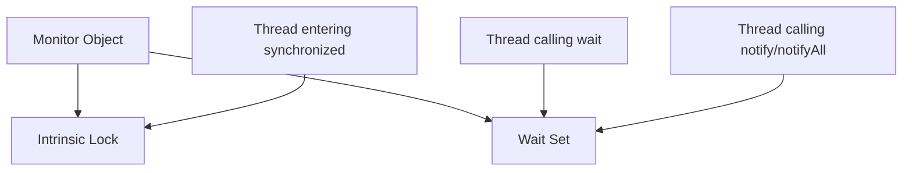
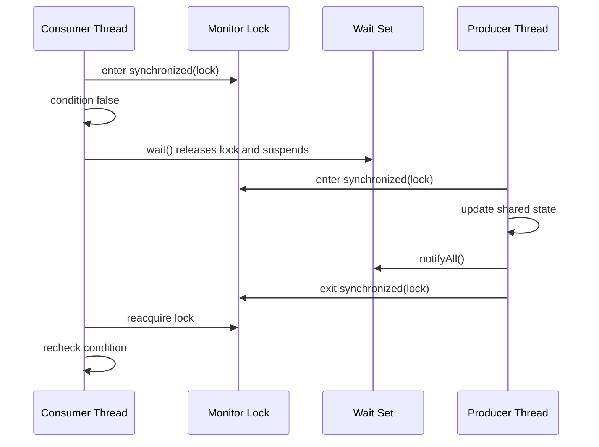
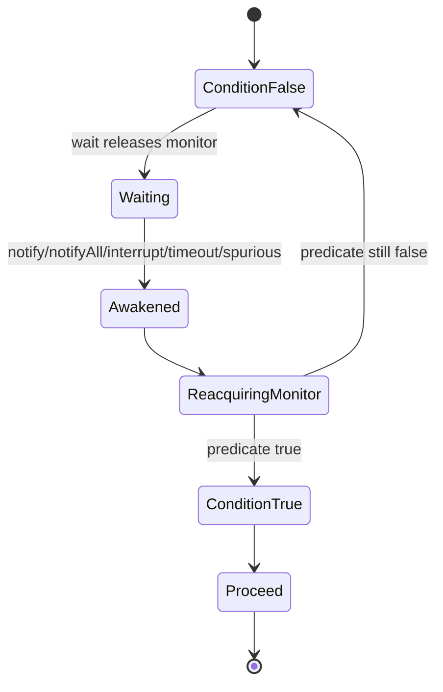

------
title: Learn Java Concurrency & Correctness - Part 012
description: Deep dive into wait, notify, notifyAll, guarded suspension, condition predicates, missed signals, spurious wakeups, monitor wait sets, and safer modern alternatives.
series: learn-java-concurrency-correctness
seriesTitle: Learn Java Concurrency & Correctness
order: 12
partTitle: Wait, Notify, and Guarded Suspension
tags:
- java
- concurrency
- wait-notify
- guarded-suspension
- coordination
- monitors
- correctness
date: 2026-06-28
---

# Part 012 — Wait, Notify, and Guarded Suspension

This part covers one of the oldest and most misunderstood areas of Java concurrency: `wait`, `notify`, and `notifyAll`.

Most production code should prefer higher-level constructs such as:

- `BlockingQueue`,
- `Semaphore`,
- `CountDownLatch`,
- `Phaser`,
- `CompletableFuture`,
- structured concurrency,
- reactive streams,
- explicit `Lock` + `Condition` when lower-level coordination is required.

But a serious Java engineer still needs to understand `wait/notify` because:

- it explains how monitor-based coordination works,
- many libraries and legacy code still use it,
- `Condition.await/signal` follows the same conceptual pattern,
- thread dumps often expose `WAITING` on monitor objects,
- the rules teach the difference between state, lock, and signal.

The most important lesson:

> `notify` does not carry state. The condition predicate carries state.

If you remember only one thing from this part, remember that.

---

## 1. The Coordination Problem

Suppose one thread cannot continue until another thread changes shared state.

Example:

```text
consumer cannot take item until buffer is non-empty
producer cannot put item until buffer is non-full
worker cannot start until configuration is loaded
request cannot proceed until token refresh completes
case transition cannot execute until entity snapshot is available
```

A bad solution is busy waiting:

```java
while (queue.isEmpty()) {
    // burn CPU doing nothing
}
```

A better low-level solution is guarded suspension:

```java
synchronized (lock) {
    while (!conditionHolds()) {
        lock.wait();
    }
    proceedWithConditionTrue();
}
```

The thread suspends while the condition is false, then rechecks the condition after being awakened.

---

## 2. Monitor Concepts

Every Java object can be used as a monitor. A monitor has:

1. a lock, used by `synchronized`,
2. a wait set, used by `wait`, `notify`, and `notifyAll`.



A thread must own the monitor lock before calling:

- `wait`,
- `notify`,
- `notifyAll`.

Otherwise Java throws `IllegalMonitorStateException`.

### Correct Shape

```java
synchronized (lock) {
    lock.wait();
}
```

### Incorrect Shape

```java
lock.wait(); // IllegalMonitorStateException
```

---

## 3. What `wait()` Actually Does

When a thread calls `wait()` on an object whose monitor it owns, the thread:

1. releases that monitor lock,
2. enters the object's wait set,
3. becomes disabled for scheduling until awakened,
4. later wakes due to notification, interruption, timeout, or spurious wakeup,
5. competes to reacquire the same monitor lock,
6. returns from `wait()` only after reacquiring the lock.

The release/reacquire behavior is critical.



Notice that notification does not immediately run the waiting thread. The notifier still holds the monitor until it exits the synchronized block.

---

## 4. The Guarded Suspension Pattern

The correct form is:

```java
synchronized (lock) {
    while (!conditionHolds()) {
        lock.wait();
    }

    // condition holds while lock is still held
    performAction();
}
```

Three elements are mandatory:

1. **Shared condition state** guarded by the same lock.
2. **Loop**, not `if`.
3. **State update before notification** by the producer/notifier.

### Minimal Example

```java
public final class OneShotSignal {
    private final Object lock = new Object();
    private boolean ready;

    public void awaitReady() throws InterruptedException {
        synchronized (lock) {
            while (!ready) {
                lock.wait();
            }
        }
    }

    public void markReady() {
        synchronized (lock) {
            ready = true;
            lock.notifyAll();
        }
    }
}
```

This is correct because `ready` is the state. `notifyAll()` only wakes waiters so they can recheck the state.

---

## 5. Why `while`, Not `if`

This is wrong:

```java
synchronized (lock) {
    if (!ready) {
        lock.wait();
    }
    useReadyState();
}
```

It is wrong because a thread can wake up when the condition is still false.

Reasons include:

- another thread consumed the condition first,
- multiple waiters were awakened by `notifyAll`,
- the wrong waiter was awakened by `notify`,
- the wait timed out,
- the thread was interrupted,
- spurious wakeup occurred,
- the condition changed again before the thread reacquired the monitor.

The loop is not a defensive superstition. It is the correctness boundary.

Correct:

```java
synchronized (lock) {
    while (!ready) {
        lock.wait();
    }
    useReadyState();
}
```

---

## 6. Signal Is Not State

A common beginner mental model:

```text
producer sends notify
consumer receives notify
```

This is misleading. Java monitor notification is not a message queue.

Better model:

```text
producer changes state
producer notifies waiters that state may have changed
consumer wakes
consumer reacquires lock
consumer checks state
consumer proceeds only if predicate is true
```

### Broken Lost Signal Example

```java
public final class BrokenSignal {
    private final Object lock = new Object();

    public void await() throws InterruptedException {
        synchronized (lock) {
            lock.wait();
        }
    }

    public void signal() {
        synchronized (lock) {
            lock.notify();
        }
    }
}
```

If `signal()` runs before `await()`, the notification is lost forever. A future waiter can block forever because no state records that the signal happened.

### Fixed Version

```java
public final class FixedSignal {
    private final Object lock = new Object();
    private boolean signaled;

    public void await() throws InterruptedException {
        synchronized (lock) {
            while (!signaled) {
                lock.wait();
            }
        }
    }

    public void signal() {
        synchronized (lock) {
            signaled = true;
            lock.notifyAll();
        }
    }
}
```

Now the event is represented as durable state.

---

## 7. `notify` vs `notifyAll`

`notify()` wakes one arbitrary thread waiting on the object's wait set.

`notifyAll()` wakes all threads waiting on the object's wait set.

The awakened threads do not all proceed. They must reacquire the monitor lock one at a time and recheck their predicates.

### When `notify` Is Dangerous

Suppose one monitor has multiple condition predicates:

```text
notEmpty
notFull
shutdown
```

If a producer calls `notify()`, the JVM may wake another producer waiting for `notFull`, even though the condition that changed is `notEmpty` for consumers.

That awakened producer rechecks `notFull`, sees false, waits again. Meanwhile consumers may remain asleep. This can produce a stuck system.

### Safer Default

For raw `wait/notify`, prefer `notifyAll()` unless you can prove:

- there is exactly one condition predicate,
- any awakened waiter can make progress,
- missed selection cannot cause liveness failure,
- notification storms are unacceptable and correctness is still proven.

Higher-level constructs such as `Condition` let you separate wait sets by condition, which reduces the need to wake unrelated waiters.

---

## 8. Bounded Buffer with `wait/notifyAll`

This example shows a small bounded buffer.

```java
import java.util.ArrayDeque;
import java.util.Queue;

public final class BoundedBuffer<T> {
    private final Object lock = new Object();
    private final Queue<T> queue = new ArrayDeque<>();
    private final int capacity;
    private boolean closed;

    public BoundedBuffer(int capacity) {
        if (capacity <= 0) {
            throw new IllegalArgumentException("capacity must be positive");
        }
        this.capacity = capacity;
    }

    public void put(T item) throws InterruptedException {
        synchronized (lock) {
            while (!closed && queue.size() == capacity) {
                lock.wait();
            }

            if (closed) {
                throw new IllegalStateException("buffer is closed");
            }

            queue.add(item);
            lock.notifyAll();
        }
    }

    public T take() throws InterruptedException {
        synchronized (lock) {
            while (!closed && queue.isEmpty()) {
                lock.wait();
            }

            if (queue.isEmpty()) {
                return null; // closed and drained
            }

            T item = queue.remove();
            lock.notifyAll();
            return item;
        }
    }

    public void close() {
        synchronized (lock) {
            closed = true;
            lock.notifyAll();
        }
    }
}
```

This code has three condition predicates:

```text
queue.size() < capacity
queue is not empty
closed
```

Because there are multiple conditions sharing the same wait set, `notifyAll()` is the safer primitive.

In real production code, use `ArrayBlockingQueue`, `LinkedBlockingQueue`, or another `BlockingQueue` unless you have a strong reason to implement the coordination yourself.

---

## 9. Shutdown Is a Condition Too

Many wait/notify bugs happen because shutdown is not included in the condition predicate.

Broken:

```java
while (queue.isEmpty()) {
    lock.wait();
}
```

If shutdown happens while the queue is empty, this consumer may wait forever.

Better:

```java
while (!closed && queue.isEmpty()) {
    lock.wait();
}

if (closed && queue.isEmpty()) {
    return null;
}
```

A top-tier concurrency design treats shutdown as part of normal control flow, not an afterthought.

---

## 10. Interruption and Guarded Blocks

`wait()` throws `InterruptedException`. That is not noise. It is part of the cancellation contract.

### Bad Handling

```java
try {
    lock.wait();
} catch (InterruptedException e) {
    // ignore
}
```

This destroys cancellation and can make shutdown hang.

### Better: Propagate

```java
public T take() throws InterruptedException {
    synchronized (lock) {
        while (queue.isEmpty()) {
            lock.wait();
        }
        return queue.remove();
    }
}
```

### Better: Restore Interrupt When You Cannot Throw

```java
try {
    waitForCondition();
} catch (InterruptedException e) {
    Thread.currentThread().interrupt();
    return;
}
```

Do not swallow interruption silently.

---

## 11. Timed Waits

A timed wait is used when the caller has a deadline or timeout.

Wrong-ish shape:

```java
synchronized (lock) {
    if (!ready) {
        lock.wait(1000);
    }
    return ready;
}
```

Better shape:

```java
public boolean awaitReady(Duration timeout) throws InterruptedException {
    long deadlineNanos = System.nanoTime() + timeout.toNanos();

    synchronized (lock) {
        while (!ready) {
            long remainingNanos = deadlineNanos - System.nanoTime();
            if (remainingNanos <= 0) {
                return false;
            }

            long millis = remainingNanos / 1_000_000L;
            int nanos = (int) (remainingNanos % 1_000_000L);
            lock.wait(millis, nanos);
        }
        return true;
    }
}
```

The timeout must be recomputed after every wakeup because wakeups can happen before the condition becomes true.

### Prefer Deadline Over Repeated Timeout

A timeout says “wait at most N each time”. A deadline says “the whole operation must finish by T”.

For service code, deadline is usually the better mental model.

---

## 12. Wait Set Is Per Object

Each monitor object has its own wait set.

This matters because calling `notifyAll()` on the wrong object wakes nobody relevant.

Broken:

```java
private final Object lockA = new Object();
private final Object lockB = new Object();
private boolean ready;

void awaitReady() throws InterruptedException {
    synchronized (lockA) {
        while (!ready) {
            lockA.wait();
        }
    }
}

void markReady() {
    synchronized (lockB) {
        ready = true;
        lockB.notifyAll();
    }
}
```

This has multiple bugs:

- state is guarded by inconsistent locks,
- waiter waits on `lockA`, notifier notifies `lockB`,
- visibility is not guaranteed by one common monitor,
- liveness may fail forever.

Correct:

```java
private final Object lock = new Object();
private boolean ready;

void awaitReady() throws InterruptedException {
    synchronized (lock) {
        while (!ready) {
            lock.wait();
        }
    }
}

void markReady() {
    synchronized (lock) {
        ready = true;
        lock.notifyAll();
    }
}
```

---

## 13. The Condition Predicate Must Be Guarded by the Same Lock

This is a key invariant:

```text
The lock used for wait/notify must also protect the condition predicate.
```

Bad:

```java
private volatile boolean ready;
private final Object lock = new Object();

void awaitReady() throws InterruptedException {
    synchronized (lock) {
        while (!ready) {
            lock.wait();
        }
    }
}

void markReady() {
    ready = true;
    synchronized (lock) {
        lock.notifyAll();
    }
}
```

This may appear to work because `ready` is volatile, but it splits the protocol. The state change and notification are no longer one atomic monitor-protected action.

Prefer:

```java
synchronized (lock) {
    ready = true;
    lock.notifyAll();
}
```

The producer changes state and notifies while holding the same monitor.

---

## 14. Notification Ordering

Correct notifier order:

```java
synchronized (lock) {
    updateConditionState();
    lock.notifyAll();
}
```

Do not notify first and update later.

Broken:

```java
synchronized (lock) {
    lock.notifyAll();
    ready = true;
}
```

This is usually less catastrophic than notifying outside the lock because waiters cannot return until the notifier releases the lock, but it is still the wrong mental model. Signal should announce a completed state change, not a future state change.

More dangerous:

```java
synchronized (lock) {
    lock.notifyAll();
}
ready = true;
```

This can wake waiters before the state is visible under the monitor protocol.

---

## 15. Monitor Wait vs Lock Acquisition Block

A thread can be unable to progress for different reasons.

| State | Meaning |
|---|---|
| `BLOCKED` | Waiting to acquire monitor lock to enter/re-enter synchronized block |
| `WAITING` | Waiting indefinitely for another action, such as `Object.wait()` with no timeout or `Thread.join()` |
| `TIMED_WAITING` | Waiting with a timeout, sleep, timed wait, timed join, timed park |

Important distinction:

```text
BLOCKED = cannot enter monitor
WAITING = already entered monitor earlier, called wait, released monitor, and is now in wait set
```

After notification, a waiting thread does not immediately proceed. It first competes to reacquire the monitor. During that competition, the practical observation in dumps can involve blocked acquisition behavior.

---

## 16. `sleep` Is Not Coordination

This is broken:

```java
while (!ready) {
    Thread.sleep(10);
}
```

Problems:

- delay is arbitrary,
- CPU/wakeup waste,
- visibility may be wrong if `ready` is not volatile/locked,
- latency is either too high or polling too frequent,
- tests become flaky.

`sleep` is for delaying execution, not waiting for a condition owned by another thread.

Use:

- `wait/notifyAll` for low-level monitor condition waiting,
- `Condition` for explicit lock conditions,
- `BlockingQueue` for producer-consumer,
- `CountDownLatch` for one-shot gates,
- `CompletableFuture` for async completion,
- `Phaser`/`CyclicBarrier` for phase coordination.

---

## 17. `notify` Does Not Release the Lock

This surprises many engineers.

```java
synchronized (lock) {
    ready = true;
    lock.notifyAll();
    slowOperationStillInsideLock();
}
```

Waiters are awakened, but they cannot return from `wait()` until the notifying thread exits the synchronized block.

Therefore, keep the notifier critical section short.

Better:

```java
synchronized (lock) {
    ready = true;
    lock.notifyAll();
}

slowOperationOutsideLock();
```

---

## 18. `wait/notify` vs `Condition`

`Condition` is the explicit-lock equivalent of monitor wait sets.

With one monitor object, you get one wait set:

```java
synchronized (lock) {
    lock.wait();
}
```

With `Condition`, you can create multiple condition queues:

```java
private final ReentrantLock lock = new ReentrantLock();
private final Condition notEmpty = lock.newCondition();
private final Condition notFull = lock.newCondition();
```

This allows more targeted signaling:

```java
notEmpty.signal();
notFull.signal();
```

`Condition` does not remove the need for loops. You still use:

```java
while (!predicate) {
    condition.await();
}
```

The predicate still carries state.

---

## 19. One-Shot Gate: Prefer CountDownLatch

Raw wait/notify version:

```java
public final class StartGate {
    private final Object lock = new Object();
    private boolean open;

    public void await() throws InterruptedException {
        synchronized (lock) {
            while (!open) {
                lock.wait();
            }
        }
    }

    public void open() {
        synchronized (lock) {
            open = true;
            lock.notifyAll();
        }
    }
}
```

Preferred:

```java
public final class StartGate {
    private final CountDownLatch latch = new CountDownLatch(1);

    public void await() throws InterruptedException {
        latch.await();
    }

    public void open() {
        latch.countDown();
    }
}
```

The latch encodes the one-shot state and avoids custom monitor protocol.

---

## 20. Producer-Consumer: Prefer BlockingQueue

Raw wait/notify buffer is educational. Production code should normally use:

```java
BlockingQueue<Command> queue = new ArrayBlockingQueue<>(1000);

queue.put(command);   // waits while full
Command c = queue.take(); // waits while empty
```

`BlockingQueue` already handles:

- waiting,
- signaling,
- memory visibility,
- interruption,
- bounded capacity,
- producer-consumer coordination.

Use custom wait/notify only when the abstraction you need is truly not available.

---

## 21. Request Coalescing Example

A useful monitor pattern is request coalescing: if many threads need the same expensive value, only one computes it while others wait.

```java
public final class TokenRefresher {
    private final Object lock = new Object();
    private Token token;
    private boolean refreshInProgress;

    public Token getToken() throws InterruptedException {
        synchronized (lock) {
            while (refreshInProgress) {
                lock.wait();
            }

            if (token != null && !token.isExpired()) {
                return token;
            }

            refreshInProgress = true;
        }

        Token refreshed;
        try {
            refreshed = fetchTokenFromServer();
        } catch (RuntimeException e) {
            synchronized (lock) {
                refreshInProgress = false;
                lock.notifyAll();
            }
            throw e;
        }

        synchronized (lock) {
            token = refreshed;
            refreshInProgress = false;
            lock.notifyAll();
            return token;
        }
    }
}
```

Important details:

- remote call happens outside lock,
- `refreshInProgress` is state, not notification,
- waiters loop on state,
- failure clears in-progress state and notifies waiters,
- notification happens after state update.

This example still has design limitations, but it shows correct monitor thinking.

---

## 22. Exception Safety

When wait/notify protocols include state like `inProgress`, failure paths must restore state and notify waiters.

Broken:

```java
synchronized (lock) {
    inProgress = true;
}

doWorkThatCanThrow();

synchronized (lock) {
    inProgress = false;
    lock.notifyAll();
}
```

If `doWorkThatCanThrow()` throws, waiters may block forever.

Better:

```java
synchronized (lock) {
    inProgress = true;
}

try {
    doWorkThatCanThrow();
} finally {
    synchronized (lock) {
        inProgress = false;
        lock.notifyAll();
    }
}
```

However, sometimes the failure must be stored and observed by waiters:

```java
private RuntimeException failure;
```

A waiting thread should not wake and proceed as if success occurred if the producer failed.

---

## 23. Multi-Condition State Machine

For complex coordination, think in state machines, not booleans.

```java
enum State {
    NEW,
    LOADING,
    READY,
    FAILED,
    CLOSED
}
```

```java
public final class ResourceGate {
    private final Object lock = new Object();
    private State state = State.NEW;
    private Resource resource;
    private Throwable failure;

    public Resource awaitReady() throws InterruptedException {
        synchronized (lock) {
            while (state == State.NEW || state == State.LOADING) {
                lock.wait();
            }

            return switch (state) {
                case READY -> resource;
                case FAILED -> throw new IllegalStateException("resource failed", failure);
                case CLOSED -> throw new IllegalStateException("resource closed");
                default -> throw new IllegalStateException("unexpected state: " + state);
            };
        }
    }

    public void markReady(Resource resource) {
        synchronized (lock) {
            this.resource = resource;
            this.state = State.READY;
            lock.notifyAll();
        }
    }

    public void markFailed(Throwable failure) {
        synchronized (lock) {
            this.failure = failure;
            this.state = State.FAILED;
            lock.notifyAll();
        }
    }
}
```

This is often clearer than multiple booleans whose combinations may become invalid.

---

## 24. Mermaid: Guarded Suspension State Machine



The loop is visible in the transition from `ReacquiringMonitor` back to `ConditionFalse`.

---

## 25. Common Anti-Patterns

### Anti-Pattern: `if` Around Wait

```java
if (!ready) {
    lock.wait();
}
```

Use `while`.

### Anti-Pattern: No State Predicate

```java
lock.notifyAll();
```

Without state, notification can be lost.

### Anti-Pattern: Different Lock for State and Wait

```java
synchronized (a) { while (!ready) a.wait(); }
synchronized (b) { ready = true; b.notifyAll(); }
```

Use one lock per condition state.

### Anti-Pattern: Swallowed InterruptedException

```java
catch (InterruptedException ignored) {}
```

Propagate or restore the interrupt.

### Anti-Pattern: Notify One Waiter with Multiple Conditions

```java
lock.notify();
```

If multiple predicates share a wait set, prefer `notifyAll()` or use `Condition`.

### Anti-Pattern: Slow Work After Notify Inside Lock

```java
lock.notifyAll();
slowWork();
```

Waiters cannot proceed until the lock is released.

---

## 26. Code Review Checklist

For every `wait/notify` usage, ask:

1. What is the exact condition predicate?
2. Is the predicate guarded by the same monitor?
3. Is `wait()` inside a `while` loop?
4. Can the condition become true before the waiter starts waiting?
5. If yes, is the state durable enough to avoid lost signal?
6. Are all state changes followed by notification when needed?
7. Is `notifyAll()` safer than `notify()` here?
8. Are interruption and shutdown handled?
9. Are timeouts based on a recomputed deadline?
10. Is custom wait/notify truly needed, or would a higher-level construct be clearer?

---

## 27. How This Maps to `Condition`

Everything you learned here transfers directly:

| Monitor API | Lock/Condition API |
|---|---|
| `synchronized (lock)` | `lock.lock(); try/finally unlock` |
| `lock.wait()` | `condition.await()` |
| `lock.notify()` | `condition.signal()` |
| `lock.notifyAll()` | `condition.signalAll()` |
| monitor wait set | condition queue |
| condition predicate | condition predicate |

The same rule remains:

```text
Always wait in a loop that checks state guarded by the lock.
```

---

## 28. Practice Drills

### Drill 1: Fix the Lost Signal

Given:

```java
class Gate {
    private final Object lock = new Object();

    void await() throws InterruptedException {
        synchronized (lock) {
            lock.wait();
        }
    }

    void open() {
        synchronized (lock) {
            lock.notify();
        }
    }
}
```

Fix it with a durable state predicate.

### Drill 2: Replace with Higher-Level Construct

Replace a one-shot `ready` gate implemented with wait/notify using `CountDownLatch`.

### Drill 3: Multi-Condition Queue

Build a bounded queue with:

- `put`,
- `take`,
- `close`,
- interruption support,
- no lost signals.

Then replace it with `BlockingQueue` and explain what behavior moved into the library.

### Drill 4: Timeout Correctness

Implement `awaitReady(Duration timeout)` using a deadline. Explain why a simple `wait(timeout)` inside `if` is insufficient.

---

## 29. Review Questions

1. Why must a thread own an object's monitor before calling `wait()`?
2. What happens to the monitor lock when `wait()` is called?
3. Why must `wait()` be inside a loop?
4. Why is `notify` not equivalent to sending a message?
5. What is a lost signal?
6. When is `notifyAll()` safer than `notify()`?
7. Why should the condition predicate be guarded by the same lock?
8. How should `InterruptedException` be handled?
9. Why is shutdown a condition predicate?
10. When should `BlockingQueue` replace custom wait/notify?

---

## 30. Key Takeaways

- `wait/notify` is about condition coordination, not message passing.
- The condition predicate is the source of truth.
- `wait()` releases the monitor and returns only after reacquiring it.
- `notify()` does not release the monitor.
- Always wait in a `while` loop.
- Prefer `notifyAll()` when multiple predicates share a monitor wait set.
- Lost signals happen when notification is not represented as durable state.
- The lock used for waiting must also guard the condition state.
- Interruption, timeout, failure, and shutdown are part of the protocol.
- Prefer higher-level constructs unless custom monitor coordination is truly justified.

---

## 31. Sources and Further Reading

- Java SE 25 API — `Object.wait`, `notify`, and `notifyAll`: `https://docs.oracle.com/en/java/javase/25/docs/api/java.base/java/lang/Object.html`
- Java SE 25 API — `Thread.State`: `https://docs.oracle.com/en/java/javase/25/docs/api/java.base/java/lang/Thread.State.html`
- Java Tutorials — Guarded Blocks: `https://docs.oracle.com/javase/tutorial/essential/concurrency/guardmeth.html`
- Java SE API — `Condition`: `https://docs.oracle.com/en/java/javase/25/docs/api/java.base/java/util/concurrent/locks/Condition.html`
- Java SE API — `BlockingQueue`: `https://docs.oracle.com/en/java/javase/25/docs/api/java.base/java/util/concurrent/BlockingQueue.html`
