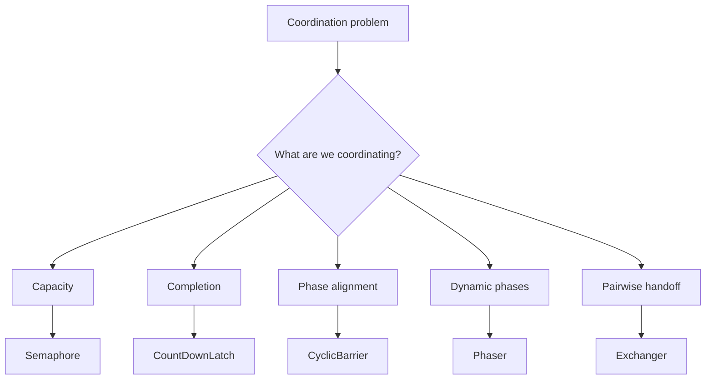
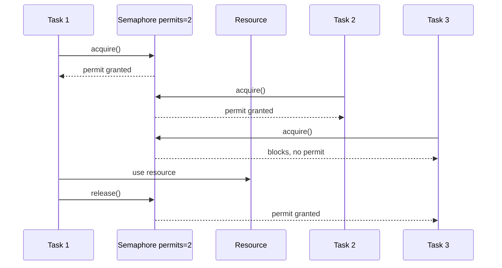
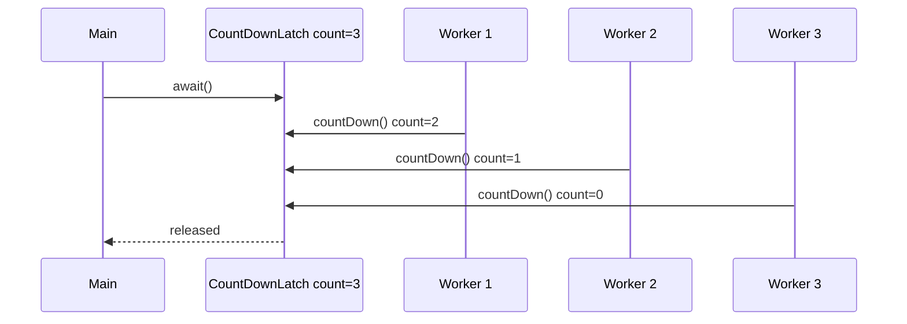
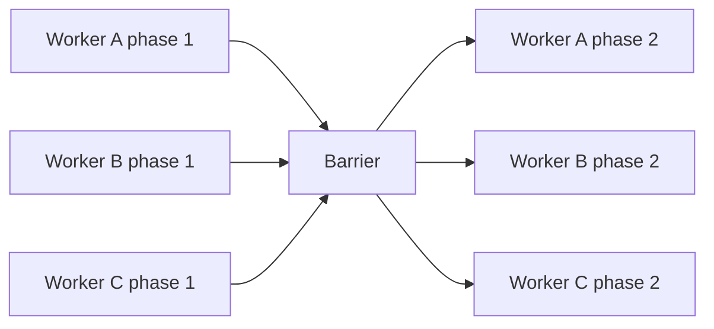
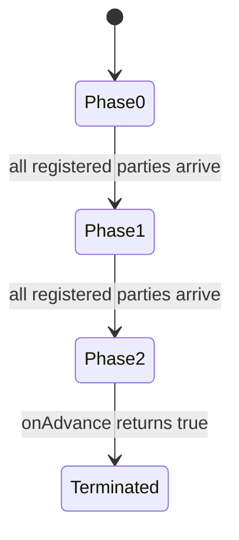
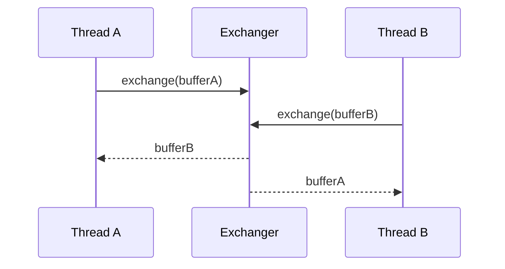
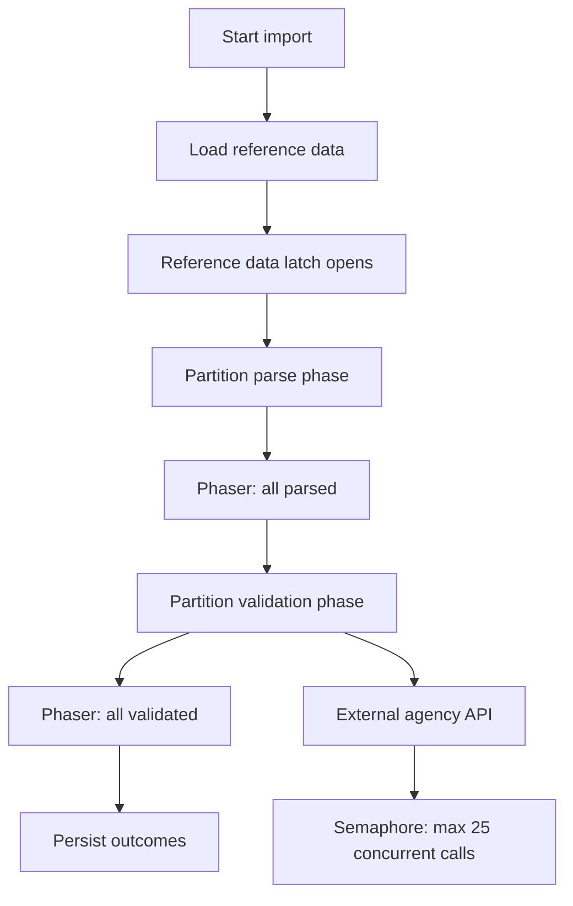

------
title: Learn Java Concurrency & Correctness - Part 013
description: Deep dive into Java high-level synchronizers: Semaphore, CountDownLatch, CyclicBarrier, Phaser, Exchanger, coordination contracts, invariants, failure modes, and production usage.
series: learn-java-concurrency-correctness
seriesTitle: Learn Java Concurrency & Correctness
order: 13
partTitle: High-Level Synchronizers
tags:
- java
- concurrency
- correctness
- synchronizers
- semaphore
- countdownlatch
- cyclicbarrier
- phaser
- exchanger
- coordination
date: 2026-06-28
---

# Part 013 — High-Level Synchronizers

This part moves from low-level monitor coordination into the higher-level synchronizers in `java.util.concurrent`.

The goal is not to memorize APIs. The goal is to select the right coordination primitive from the shape of the problem.

A senior engineer should be able to answer these questions before writing code:

- Are we limiting access, waiting for completion, aligning phases, exchanging values, or coordinating shutdown?
- Is the coordination one-shot or reusable?
- Is the number of participants fixed or dynamic?
- Is failure propagation part of the contract?
- What happens when a participant is interrupted, times out, crashes, or never arrives?
- Is the synchronizer protecting a correctness invariant, a capacity limit, or a lifecycle boundary?

Java's high-level synchronizers let us express intent directly:

| Problem shape | Primitive | Core mental model |
|---|---|---|
| Limit concurrent access to a scarce resource | `Semaphore` | Permit accounting |
| Wait until N things finish | `CountDownLatch` | One-shot completion gate |
| Make N parties meet at repeated phase boundaries | `CyclicBarrier` | Fixed-party rendezvous |
| Coordinate dynamic, multi-phase computation | `Phaser` | Flexible phase clock |
| Pair producers and consumers for data handoff | `Exchanger` | Two-party swap point |

Oracle's Java SE concurrency guide lists these as high-performance threading utilities alongside thread pools and blocking queues. The package summary also describes `Semaphore`, `CountDownLatch`, `CyclicBarrier`, `Phaser`, and `Exchanger` as coordination utilities intended to avoid hand-rolled low-level synchronization.

---

## 1. Kaufman Deconstruction

Following Josh Kaufman's skill acquisition approach, we deconstruct high-level synchronizers into smaller subskills.

### 1.1 What We Are Learning

We are learning to design **coordination protocols**.

A coordination protocol defines:

1. **Participants** — which threads/tasks take part.
2. **State** — what shared lifecycle/capacity/progress state is tracked.
3. **Blocking condition** — when a participant must wait.
4. **Release condition** — when waiting participants may proceed.
5. **Failure policy** — what interruption, timeout, cancellation, or broken coordination means.
6. **Reuse policy** — whether the protocol is one-shot or cyclic.
7. **Ownership policy** — who is allowed to signal progress.

The primitive is just the syntax. The protocol is the design.

### 1.2 What To Avoid

Do not begin by asking:

> Should I use `CountDownLatch`, `Semaphore`, or `Phaser`?

Begin by asking:

> What is the exact condition that must become true before this code can safely proceed?

Then choose the primitive that models that condition with the least accidental complexity.

### 1.3 Minimum Useful Competence

After this part, you should be able to:

- replace fragile `wait/notify` code with a higher-level synchronizer,
- use `Semaphore` for resource admission control,
- use `CountDownLatch` for one-shot completion boundaries,
- decide when `CyclicBarrier` is too rigid and `Phaser` is better,
- identify broken coordination and stuck-wait failure modes,
- design timeouts and shutdown behavior explicitly,
- review concurrency code by asking what lifecycle condition is being modeled.

---

## 2. Synchronizer Taxonomy

Most synchronizers answer one of five questions.



This taxonomy matters because misuse usually comes from choosing a primitive with the wrong lifecycle model.

Examples:

- Using `CountDownLatch` when the condition repeats creates latch-recreation complexity.
- Using `CyclicBarrier` when participants are dynamic causes deadlocks or broken barriers.
- Using `Semaphore` as a mutex hides ownership semantics because permits are not tied to the acquiring thread.
- Using `Exchanger` for multi-consumer queues creates accidental pairwise coupling.

---

## 3. `Semaphore`: Permit Accounting

A `Semaphore` controls access through a counter of permits.

A thread acquires one or more permits before entering a limited section and releases them afterward.



### 3.1 Mental Model

A semaphore is not primarily a lock. It is **capacity accounting**.

Use it when the invariant is:

> No more than N concurrent operations may enter this region.

Typical production examples:

- limit concurrent calls to a fragile downstream,
- limit file uploads being processed,
- limit concurrent expensive validations,
- limit requests using a memory-heavy component,
- limit tasks using a non-thread-safe legacy adapter by setting permits to `1`, although a lock is usually clearer for pure mutual exclusion.

### 3.2 Basic Usage

```java
import java.util.concurrent.Semaphore;

public final class LimitedGateway {
    private final Semaphore permits;
    private final ExternalClient client;

    public LimitedGateway(int maxConcurrentCalls, ExternalClient client) {
        if (maxConcurrentCalls <= 0) {
            throw new IllegalArgumentException("maxConcurrentCalls must be positive");
        }
        this.permits = new Semaphore(maxConcurrentCalls);
        this.client = client;
    }

    public Response call(Request request) throws InterruptedException {
        permits.acquire();
        try {
            return client.call(request);
        } finally {
            permits.release();
        }
    }
}
```

The invariant is simple:

```text
inFlightCalls <= maxConcurrentCalls
```

The `finally` block is non-negotiable. Missing release is a capacity leak.

### 3.3 Timeout-Based Admission

In production, blocking forever is often wrong. It can transform overload into thread accumulation.

```java
import java.time.Duration;
import java.util.concurrent.Semaphore;
import java.util.concurrent.TimeUnit;

public final class BoundedValidator {
    private final Semaphore permits;
    private final ValidationEngine engine;

    public BoundedValidator(int concurrency, ValidationEngine engine) {
        this.permits = new Semaphore(concurrency);
        this.engine = engine;
    }

    public ValidationResult validate(CaseFile file, Duration admissionTimeout)
            throws InterruptedException {

        boolean admitted = permits.tryAcquire(
                admissionTimeout.toMillis(),
                TimeUnit.MILLISECONDS
        );

        if (!admitted) {
            return ValidationResult.rejected("validator_overloaded");
        }

        try {
            return engine.validate(file);
        } finally {
            permits.release();
        }
    }
}
```

This turns contention into an explicit business/system outcome.

### 3.4 Fairness

`Semaphore` can be created as fair:

```java
Semaphore fairSemaphore = new Semaphore(10, true);
```

Fairness means threads acquire permits roughly in first-in-first-out order under contention. It can reduce starvation but may reduce throughput.

Use fairness when:

- starvation is unacceptable,
- waiting order has semantic importance,
- request latency distribution matters more than absolute throughput.

Avoid fairness by default when:

- throughput is the dominant metric,
- operations are short,
- there is no starvation evidence.

### 3.5 Semaphore Is Not Ownership-Based

Unlike `Lock`, a semaphore permit is not owned by a specific thread. One thread can acquire and another can release.

That is sometimes useful, but dangerous when accidental.

```java
// Legal, but usually suspicious if not intentional.
semaphore.release();
```

A senior review question:

> Can this release happen without a matching successful acquire?

If yes, capacity accounting can become corrupt.

### 3.6 Weighted Permits

A semaphore can acquire multiple permits.

```java
permits.acquire(estimatedWeight);
try {
    processHeavyJob(job);
} finally {
    permits.release(estimatedWeight);
}
```

This is useful when tasks consume different amounts of scarce capacity.

But it introduces new failure modes:

- bad weight estimation,
- large jobs starving behind smaller jobs,
- permit fragmentation,
- unfair throughput if weight is correlated with customer priority.

Prefer simple single-permit admission unless weighted capacity is clearly justified.

### 3.7 Semaphore Anti-Patterns

#### Anti-pattern: Semaphore as hidden global throttle

```java
public final class GlobalThrottle {
    public static final Semaphore SEMAPHORE = new Semaphore(100);
}
```

This couples unrelated workloads. One noisy caller can starve others.

Better:

- per dependency,
- per tenant,
- per endpoint,
- per workload class,
- or as part of a known bulkhead boundary.

#### Anti-pattern: Acquire outside cancellation awareness

```java
semaphore.acquireUninterruptibly();
```

This ignores cancellation and shutdown. It may be correct for very small critical lifecycle sections, but it is dangerous in request handling.

Prefer interruptible acquisition or timed acquisition.

#### Anti-pattern: Release in callback that may never run

```java
permits.acquire();
asyncClient.call(request, response -> {
    permits.release();
});
```

What if the callback is never invoked? What if it throws before release? What if there is a timeout path?

For async APIs, model permit ownership with a completion stage:

```java
public CompletableFuture<Response> call(Request request) {
    if (!permits.tryAcquire()) {
        return CompletableFuture.failedFuture(new RejectedExecutionException("overloaded"));
    }

    CompletableFuture<Response> result;
    try {
        result = asyncClient.call(request);
    } catch (Throwable t) {
        permits.release();
        return CompletableFuture.failedFuture(t);
    }

    return result.whenComplete((value, error) -> permits.release());
}
```

The release is attached to all completion paths.

---

## 4. `CountDownLatch`: One-Shot Completion Gate

A `CountDownLatch` lets one or more waiting threads block until a counter reaches zero.

It is one-shot. Once the count reaches zero, it stays open forever.

### 4.1 Mental Model

A latch models:

> Do not proceed until N required events have happened.

The events may be:

- worker initialization completed,
- parallel warm-up tasks completed,
- test threads ready to start,
- shutdown acknowledgments received,
- external callbacks completed.



### 4.2 Startup Gate Example

```java
import java.time.Duration;
import java.util.List;
import java.util.concurrent.CountDownLatch;
import java.util.concurrent.TimeUnit;

public final class ServiceBootstrap {
    private final List<Component> components;

    public ServiceBootstrap(List<Component> components) {
        this.components = List.copyOf(components);
    }

    public boolean start(Duration timeout) throws InterruptedException {
        CountDownLatch ready = new CountDownLatch(components.size());

        for (Component component : components) {
            Thread.ofVirtual().start(() -> {
                try {
                    component.start();
                } finally {
                    ready.countDown();
                }
            });
        }

        return ready.await(timeout.toMillis(), TimeUnit.MILLISECONDS);
    }
}
```

This waits for all components to finish their startup attempt.

However, notice a correctness issue: `CountDownLatch` alone does not capture component failure. It only captures that a component reached `countDown()`.

A stronger version needs error collection.

```java
import java.util.Queue;
import java.util.concurrent.ConcurrentLinkedQueue;
import java.util.concurrent.CountDownLatch;
import java.util.concurrent.TimeUnit;

public final class RobustBootstrap {
    private final List<Component> components;

    public RobustBootstrap(List<Component> components) {
        this.components = List.copyOf(components);
    }

    public void start(Duration timeout) throws InterruptedException {
        CountDownLatch done = new CountDownLatch(components.size());
        Queue<Throwable> failures = new ConcurrentLinkedQueue<>();

        for (Component component : components) {
            Thread.ofVirtual().start(() -> {
                try {
                    component.start();
                } catch (Throwable t) {
                    failures.add(t);
                } finally {
                    done.countDown();
                }
            });
        }

        boolean completed = done.await(timeout.toMillis(), TimeUnit.MILLISECONDS);
        if (!completed) {
            throw new IllegalStateException("bootstrap timed out");
        }
        if (!failures.isEmpty()) {
            IllegalStateException ex = new IllegalStateException("bootstrap failed");
            failures.forEach(ex::addSuppressed);
            throw ex;
        }
    }
}
```

### 4.3 Start Gun Pattern For Testing

A latch can coordinate test threads to start at approximately the same time.

```java
CountDownLatch ready = new CountDownLatch(threadCount);
CountDownLatch start = new CountDownLatch(1);
CountDownLatch done = new CountDownLatch(threadCount);

for (int i = 0; i < threadCount; i++) {
    Thread.ofPlatform().start(() -> {
        ready.countDown();
        try {
            start.await();
            exerciseConcurrentCode();
        } catch (InterruptedException e) {
            Thread.currentThread().interrupt();
        } finally {
            done.countDown();
        }
    });
}

ready.await();
start.countDown();
done.await();
```

This does not prove correctness, but it improves the chance of overlapping operations in tests.

### 4.4 Latch Failure Modes

#### Missing countdown

```java
try {
    doWork();
    latch.countDown();
} catch (Exception e) {
    log.error("failed", e);
}
```

If `doWork()` throws, the latch never opens.

Correct pattern:

```java
try {
    doWork();
} finally {
    latch.countDown();
}
```

#### Counting completion instead of success

A latch tracks events, not success. If success matters, add a result channel.

#### Reusing a latch

A latch cannot be reset. If the workflow repeats, use `CyclicBarrier`, `Phaser`, or create a new latch per lifecycle instance.

#### Waiting without timeout

For request-serving systems, unbounded `await()` can accumulate stuck threads. Use a deadline when failure is possible.

---

## 5. `CyclicBarrier`: Fixed-Party Rendezvous

A `CyclicBarrier` lets a fixed number of parties wait for each other at a barrier point.

When the last party arrives, all parties are released. The barrier can then be reused for the next cycle.

### 5.1 Mental Model

A cyclic barrier models:

> N participants must reach the same phase boundary before any of them continue.

It is common in simulations and phased parallel algorithms.



### 5.2 Example: Parallel Stage With Barrier Action

```java
import java.util.concurrent.BrokenBarrierException;
import java.util.concurrent.CyclicBarrier;

public final class ParallelSimulation {
    private final int workers;
    private final CyclicBarrier barrier;

    public ParallelSimulation(int workers) {
        this.workers = workers;
        this.barrier = new CyclicBarrier(workers, this::mergePhaseResults);
    }

    public void run(int phases) {
        for (int i = 0; i < workers; i++) {
            int workerId = i;
            Thread.ofPlatform().start(() -> runWorker(workerId, phases));
        }
    }

    private void runWorker(int workerId, int phases) {
        for (int phase = 0; phase < phases; phase++) {
            computeLocalPhase(workerId, phase);
            awaitBarrier();
        }
    }

    private void awaitBarrier() {
        try {
            barrier.await();
        } catch (InterruptedException e) {
            Thread.currentThread().interrupt();
        } catch (BrokenBarrierException e) {
            throw new IllegalStateException("barrier broken", e);
        }
    }

    private void computeLocalPhase(int workerId, int phase) {
        // CPU-bound local work
    }

    private void mergePhaseResults() {
        // Runs once per phase, by one of the arriving threads.
    }
}
```

### 5.3 Broken Barrier

A barrier becomes broken when one of the waiting parties is interrupted or times out.

This is a major difference from a latch.

A broken barrier means:

> The group coordination contract failed; the current phase cannot be trusted.

Do not casually ignore `BrokenBarrierException`.

### 5.4 When `CyclicBarrier` Is Wrong

Avoid `CyclicBarrier` when:

- participant count changes dynamically,
- tasks can finish early,
- some participants are optional,
- failures should cancel the whole group but are not otherwise modeled,
- phases are nested or hierarchical,
- the group is managed by an executor with limited workers and barrier waits can exhaust the pool.

In those cases, consider `Phaser`, structured concurrency, or task composition through futures.

---

## 6. `Phaser`: Flexible Phase Coordination

`Phaser` generalizes latch and barrier ideas.

It supports:

- dynamic registration,
- deregistration,
- repeated phases,
- hierarchical use,
- phase advancement hooks.

### 6.1 Mental Model

A phaser models:

> A set of registered parties advances through numbered phases, and the set of parties can change over time.



### 6.2 Dynamic Participant Example

```java
import java.util.concurrent.Phaser;

public final class DynamicPhaseWork {
    private final Phaser phaser = new Phaser(1); // register coordinator

    public void submit(List<Job> jobs) {
        for (Job job : jobs) {
            phaser.register();
            Thread.ofVirtual().start(() -> {
                try {
                    process(job);
                } finally {
                    phaser.arriveAndDeregister();
                }
            });
        }

        // Coordinator arrives and deregisters; phase completes when all jobs finish.
        phaser.arriveAndDeregister();
    }

    private void process(Job job) {
        // Work
    }
}
```

This is similar to a latch, but registration can be dynamic.

### 6.3 Multi-Phase Example

```java
import java.util.concurrent.Phaser;

public final class ThreePhaseImport {
    private final Phaser phaser;

    public ThreePhaseImport(int workers) {
        this.phaser = new Phaser(workers);
    }

    public void runWorker(ImportPartition partition) {
        try {
            parse(partition);
            phaser.arriveAndAwaitAdvance();

            validate(partition);
            phaser.arriveAndAwaitAdvance();

            persist(partition);
            phaser.arriveAndAwaitAdvance();
        } finally {
            phaser.arriveAndDeregister();
        }
    }
}
```

This expresses:

```text
No partition validates before all partitions finish parsing.
No partition persists before all partitions finish validation.
```

### 6.4 Custom Termination

`Phaser` can be subclassed to customize phase advancement.

```java
Phaser phaser = new Phaser(workers) {
    @Override
    protected boolean onAdvance(int phase, int registeredParties) {
        return phase >= 2 || registeredParties == 0;
    }
};
```

This terminates after phase 2 or when no parties remain.

### 6.5 Phaser Hazards

`Phaser` is powerful but easier to misuse than `CountDownLatch`.

Common hazards:

- forgetting to deregister,
- registering after coordinator assumes all parties are known,
- mixing `arrive()` and `arriveAndAwaitAdvance()` without a clear protocol,
- using phasers where task composition would be simpler,
- failing to handle interruption around waiting.

Review question:

> At every point, can we state the exact number of registered parties and who is responsible for deregistering?

If not, the phaser protocol is under-specified.

---

## 7. `Exchanger`: Pairwise Value Swap

`Exchanger<V>` lets two threads meet and exchange values.

### 7.1 Mental Model

An exchanger models:

> Two parties rendezvous, each gives one value and receives the other's value.



### 7.2 Buffer Swap Example

```java
import java.util.ArrayList;
import java.util.List;
import java.util.concurrent.Exchanger;

public final class BufferPipeline {
    private final Exchanger<List<Event>> exchanger = new Exchanger<>();

    public void produce() throws InterruptedException {
        List<Event> buffer = new ArrayList<>(1024);
        while (!Thread.currentThread().isInterrupted()) {
            fill(buffer);
            buffer = exchanger.exchange(buffer);
            buffer.clear();
        }
    }

    public void consume() throws InterruptedException {
        List<Event> buffer = new ArrayList<>(1024);
        while (!Thread.currentThread().isInterrupted()) {
            buffer = exchanger.exchange(buffer);
            process(buffer);
        }
    }
}
```

The producer hands over a full buffer and receives an empty/reusable buffer.

### 7.3 When Exchanger Is Appropriate

Use `Exchanger` when:

- exactly two parties cooperate,
- the handoff is symmetric,
- pairing is intentional,
- both sides should wait for each other,
- value reuse reduces allocation pressure.

Avoid it when:

- there are many producers or consumers,
- ordering matters across a queue,
- one side may be absent for long periods,
- timeout/cancellation semantics are complex,
- a `BlockingQueue` would express the protocol more directly.

---

## 8. Synchronizer Selection Matrix

| Need | Best first choice | Why |
|---|---|---|
| Limit concurrent calls to downstream | `Semaphore` | Models capacity directly |
| Wait for N startup tasks | `CountDownLatch` | One-shot completion gate |
| Start many test threads simultaneously | `CountDownLatch` pair | Ready gate + start gun |
| Align fixed workers after each simulation step | `CyclicBarrier` | Reusable fixed-party barrier |
| Align dynamic workers across phases | `Phaser` | Registration can change |
| Swap buffers between one producer and one consumer | `Exchanger` | Pairwise exchange |
| Send many items from producers to consumers | `BlockingQueue` | Queue semantics, not pairwise rendezvous |
| Compose async result dependencies | `CompletableFuture` | Dataflow rather than blocking coordination |
| Parent-child concurrent tasks with failure propagation | Structured concurrency | Lifecycle ownership, cancellation propagation |

---

## 9. Correctness Invariants By Primitive

### 9.1 Semaphore

Invariant:

```text
availablePermits + inUsePermits == configuredPermits
inUsePermits <= configuredPermits
```

Failure modes:

- release without acquire,
- missing release,
- permit leaked on exception,
- unbounded wait under overload,
- fairness mismatch.

### 9.2 CountDownLatch

Invariant:

```text
count never increases
await releases only when count == 0
```

Failure modes:

- missing count down,
- waiting forever,
- treating completion as success,
- trying to reuse one latch.

### 9.3 CyclicBarrier

Invariant:

```text
exactly parties participants must reach each generation
```

Failure modes:

- fixed party count wrong,
- one participant exits early,
- executor starvation,
- broken barrier ignored,
- barrier action too slow or unsafe.

### 9.4 Phaser

Invariant:

```text
phase advances when all registered parties arrive
registered parties accurately represent participants
```

Failure modes:

- leaked registration,
- premature deregistration,
- ambiguous coordinator role,
- dynamic registration race,
- phase number assumptions after termination.

### 9.5 Exchanger

Invariant:

```text
exchange completes only by pairing two parties
```

Failure modes:

- missing counterpart,
- accidental pairing,
- deadlock under asymmetric lifecycle,
- wrong primitive for many-to-many handoff.

---

## 10. Interruption and Timeout Policy

Every blocking synchronizer call forces a design decision.

| Method type | Meaning | Production implication |
|---|---|---|
| Interruptible wait | Caller can cancel | Preferred for request/task code |
| Timed wait | Caller can bound waiting | Useful for overload and dependency failure |
| Uninterruptible wait | Caller cannot cancel normally | Use only for narrow critical lifecycle code |

Examples:

```java
semaphore.acquire();                 // interruptible
semaphore.tryAcquire(100, MILLISECONDS); // timed
latch.await(5, SECONDS);              // timed
barrier.await(5, SECONDS);            // timed; may break barrier
phaser.awaitAdvanceInterruptibly(phase); // interruptible
exchanger.exchange(value, 1, SECONDS);   // timed
```

A blocking call without timeout is acceptable only when:

- the wait condition is guaranteed by local logic,
- failure is handled elsewhere,
- shutdown interruption is reliable,
- thread accumulation is acceptable.

Those conditions are rarer than many codebases assume.

---

## 11. Virtual Threads And Synchronizers

Virtual threads make blocking cheaper, not semantically safe.

High-level synchronizers still matter because they represent correctness and resource constraints.

### 11.1 What Virtual Threads Improve

Virtual threads make it practical to have many blocked tasks waiting on:

- latches,
- semaphores,
- blocking queues,
- futures,
- IO operations.

A virtual thread parked on a synchronizer usually does not consume an OS thread while parked.

### 11.2 What Virtual Threads Do Not Fix

They do not fix:

- deadlocks,
- leaked permits,
- missed countdowns,
- wrong barrier party counts,
- broken cancellation policy,
- resource overload.

A million cheap blocked virtual threads are still a symptom if they are waiting for a condition that will never happen.

### 11.3 Resource Limiting Still Matters

A common mistake is thinking virtual threads remove the need for throttles.

They do not.

Example:

```java
try (var executor = Executors.newVirtualThreadPerTaskExecutor()) {
    for (Request request : requests) {
        executor.submit(() -> downstream.call(request));
    }
}
```

This may create many concurrent downstream calls. If the downstream can handle only 50, use a semaphore or another bulkhead.

```java
Semaphore downstreamLimit = new Semaphore(50);

try (var executor = Executors.newVirtualThreadPerTaskExecutor()) {
    for (Request request : requests) {
        executor.submit(() -> {
            downstreamLimit.acquire();
            try {
                return downstream.call(request);
            } finally {
                downstreamLimit.release();
            }
        });
    }
}
```

Virtual threads reduce thread scarcity. They do not remove downstream scarcity.

---

## 12. Design Patterns

### 12.1 Admission-Control Gateway

Use when protecting an external dependency.

```java
public final class AdmissionControlledService {
    private final Semaphore permits;
    private final Service delegate;

    public AdmissionControlledService(int concurrency, Service delegate) {
        this.permits = new Semaphore(concurrency);
        this.delegate = delegate;
    }

    public Result handle(Command command) throws InterruptedException {
        if (!permits.tryAcquire(250, TimeUnit.MILLISECONDS)) {
            return Result.rejected("too_many_concurrent_requests");
        }

        try {
            return delegate.handle(command);
        } finally {
            permits.release();
        }
    }
}
```

Properties:

- bounds in-flight work,
- surfaces overload explicitly,
- protects caller from indefinite waiting,
- protects downstream from stampede.

### 12.2 One-Shot Readiness Gate

Use when a service must wait for components to be ready.

```java
public final class ReadinessGate {
    private final CountDownLatch ready;

    public ReadinessGate(int components) {
        this.ready = new CountDownLatch(components);
    }

    public void markReady() {
        ready.countDown();
    }

    public boolean awaitReady(Duration timeout) throws InterruptedException {
        return ready.await(timeout.toMillis(), TimeUnit.MILLISECONDS);
    }
}
```

Properties:

- one-shot,
- simple,
- easy to observe through remaining count,
- not suitable for repeated readiness transitions.

### 12.3 Phased Batch Job

Use when all partitions must pass phase A before any partition starts phase B.

```java
public final class PhasedBatchJob {
    private final Phaser phaser;

    public PhasedBatchJob(int partitions) {
        this.phaser = new Phaser(partitions);
    }

    public void runPartition(Partition partition) {
        try {
            extract(partition);
            phaser.arriveAndAwaitAdvance();

            transform(partition);
            phaser.arriveAndAwaitAdvance();

            load(partition);
            phaser.arriveAndAwaitAdvance();
        } finally {
            phaser.arriveAndDeregister();
        }
    }
}
```

Properties:

- phase-level correctness,
- repeated barriers,
- dynamic party count if needed,
- requires careful deregistration.

---

## 13. Anti-Pattern Catalog

### 13.1 Synchronizer Without Named Invariant

Bad:

```java
private final CountDownLatch latch = new CountDownLatch(3);
```

What does `3` mean?

Better:

```java
private static final int REQUIRED_STARTUP_COMPONENTS = 3;
private final CountDownLatch startupComplete =
        new CountDownLatch(REQUIRED_STARTUP_COMPONENTS);
```

Best:

```java
private final CountDownLatch startupComplete;

public Bootstrap(List<Component> components) {
    this.components = List.copyOf(components);
    this.startupComplete = new CountDownLatch(components.size());
}
```

Tie count to the actual participant set.

### 13.2 Blocking Under Unknown Executor Capacity

```java
ExecutorService pool = Executors.newFixedThreadPool(4);
CyclicBarrier barrier = new CyclicBarrier(8);

for (int i = 0; i < 8; i++) {
    pool.submit(() -> barrier.await());
}
```

Only four tasks can run. They wait for eight parties. The remaining four cannot start. Deadlock.

Invariant:

```text
available executor workers >= barrier parties that must run concurrently
```

This is one reason virtual threads simplify some coordination workflows. But if the tasks depend on scarce downstream resources, deadlock can still happen elsewhere.

### 13.3 Ignoring `InterruptedException`

Bad:

```java
try {
    latch.await();
} catch (InterruptedException ignored) {
}
```

Better:

```java
try {
    latch.await();
} catch (InterruptedException e) {
    Thread.currentThread().interrupt();
    throw new IllegalStateException("interrupted while waiting for startup", e);
}
```

Or return a cancellation outcome if this is request-level code.

### 13.4 Using Synchronizers As Business State

A latch can tell that N events occurred. It should not become the only source of domain truth.

Bad:

```java
if (latch.getCount() == 0) {
    markCaseApproved();
}
```

Better:

- store domain state explicitly,
- use latch only to coordinate threads,
- validate domain state before transition.

### 13.5 Unobservable Coordination

If a production incident occurs, you need to know:

- how many permits are available,
- how many tasks are waiting,
- which phase a phaser is in,
- whether a barrier is broken,
- how long waiters have waited.

Wrap coordination boundaries with metrics and logs.

---

## 14. Observability Checklist

For every synchronizer, add observability appropriate to its risk.

### 14.1 Semaphore Metrics

- available permits,
- estimated queue length if using fair semaphore or known wrapper,
- acquire wait time,
- acquire timeout count,
- permit leak suspicion,
- in-flight operations.

### 14.2 Latch Metrics

- initial count,
- remaining count,
- await timeout count,
- startup/shutdown duration,
- participant failure count.

### 14.3 Barrier/Phaser Metrics

- current phase,
- registered parties,
- arrived parties,
- unarrived parties,
- broken barrier count,
- phase duration.

### 14.4 Log Shape

Good logs include:

```text
component=case-importer event=phase-timeout phase=validation registered=12 arrived=11 unarrived=1 timeoutMs=30000
```

Bad logs say:

```text
Timed out waiting.
```

The first log supports diagnosis. The second only confirms pain.

---

## 15. Review Checklist

Use this checklist during code review.

### 15.1 Problem Fit

- Is the primitive matched to the lifecycle shape?
- Is the condition one-shot, cyclic, dynamic, capacity-based, or pairwise?
- Would `BlockingQueue`, `CompletableFuture`, or structured concurrency express the problem better?

### 15.2 Correctness

- What invariant does the synchronizer protect?
- Is the participant count derived from real participants?
- Can any code path miss `countDown`, `release`, or `deregister`?
- Are success and completion distinguished?
- Can a waiting thread wait forever?

### 15.3 Failure

- What happens on interruption?
- What happens on timeout?
- What happens if one participant fails before signaling?
- What happens during shutdown?
- Is broken barrier state handled?

### 15.4 Production

- Are wait durations measured?
- Are timeouts meaningful relative to upstream deadlines?
- Is overload rejected, queued, or backpressured intentionally?
- Can the system recover after a coordination failure?

---

## 16. Practice Drills

### Drill 1 — Replace `wait/notify`

Take a producer-consumer example using `wait/notify` and replace it with:

- `BlockingQueue` if it transports items,
- `CountDownLatch` if it waits for one-shot readiness,
- `Condition` if it has multiple explicit predicates.

Explain why your replacement is semantically closer.

### Drill 2 — Design A Downstream Bulkhead

Build a wrapper around a fake downstream client that:

- allows at most 20 concurrent calls,
- times out admission after 100 ms,
- records rejected count,
- releases permits on success, failure, and exception.

Then intentionally inject exceptions and verify permits do not leak.

### Drill 3 — Barrier Failure

Create a `CyclicBarrier` with 3 workers. Make one worker time out. Observe:

- what exception each worker sees,
- whether the barrier becomes broken,
- how to reset or discard the workflow safely.

### Drill 4 — Phaser Party Leak

Create a phaser workflow where one worker forgets to deregister. Observe how phase advancement behaves. Add `finally` and fix it.

---

## 17. Mini Case Study: Regulatory Case Import

Imagine a regulatory platform imports 100,000 case events from an external agency.

The system has these constraints:

1. At most 25 concurrent calls to the agency API.
2. All dictionary reference data must load before case validation begins.
3. Import partitions must finish parsing before validation begins.
4. Failed partitions must be visible to the coordinator.
5. Shutdown must not wait forever.

A possible design:

| Constraint | Primitive |
|---|---|
| Limit agency API calls | `Semaphore` |
| Wait for reference data load | `CountDownLatch` or `CompletableFuture.allOf` |
| Align parse/validate phases | `Phaser` |
| Collect failures | Concurrent result queue / structured task scope |
| Bound shutdown wait | Timed awaits + cancellation |

Mermaid sketch:



Notice the key design principle:

> Each synchronizer models a different invariant. Do not force one primitive to carry all coordination responsibilities.

---

## 18. Common Interview vs Production Difference

Interview-level understanding:

> `CountDownLatch` waits for threads to finish. `Semaphore` limits concurrency. `CyclicBarrier` waits for all threads at a barrier.

Production-level understanding:

> A synchronizer is a coordination contract with participants, lifecycle, failure policy, observability, and recovery behavior. The hard part is not calling `await`; the hard part is ensuring every possible execution path preserves the coordination invariant.

That distinction is what separates API familiarity from engineering competence.

---

## 19. Summary

High-level synchronizers are safer than hand-rolled monitor coordination because they encode common coordination protocols directly.

Key takeaways:

- Use `Semaphore` for capacity limits.
- Use `CountDownLatch` for one-shot completion gates.
- Use `CyclicBarrier` for fixed-party repeated rendezvous.
- Use `Phaser` for dynamic, phased coordination.
- Use `Exchanger` for two-party value swaps.
- Add timeouts and interruption handling where failure is possible.
- Do not confuse completion with success.
- Do not let virtual threads hide resource constraints.
- Always name the invariant the synchronizer protects.

In the next part, we go deeper into `BlockingQueue` and backpressure: the point where coordination becomes dataflow and overload control.

---

## References

- Java SE 25 API — `java.util.concurrent`: https://docs.oracle.com/en/java/javase/25/docs/api/java.base/java/util/concurrent/package-summary.html
- Java SE 25 API — `CountDownLatch`: https://docs.oracle.com/en/java/javase/25/docs/api/java.base/java/util/concurrent/CountDownLatch.html
- Java SE 25 API — `Semaphore`: https://docs.oracle.com/en/java/javase/25/docs/api/java.base/java/util/concurrent/Semaphore.html
- Java SE 25 API — `CyclicBarrier`: https://docs.oracle.com/en/java/javase/25/docs/api/java.base/java/util/concurrent/CyclicBarrier.html
- Java SE 25 API — `Phaser`: https://docs.oracle.com/en/java/javase/25/docs/api/java.base/java/util/concurrent/Phaser.html
- Java SE 25 API — `Exchanger`: https://docs.oracle.com/en/java/javase/25/docs/api/java.base/java/util/concurrent/Exchanger.html
- Oracle Java SE 25 Guide — Concurrency: https://docs.oracle.com/en/java/javase/25/core/concurrency.html
