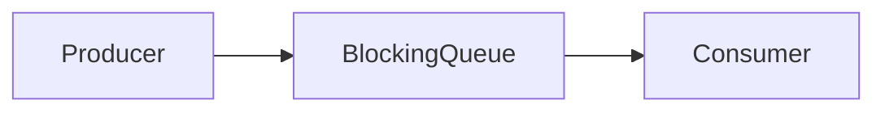
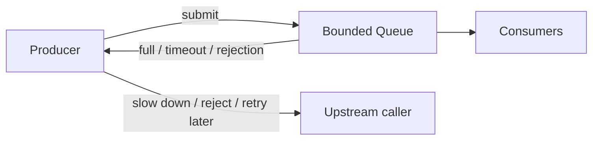
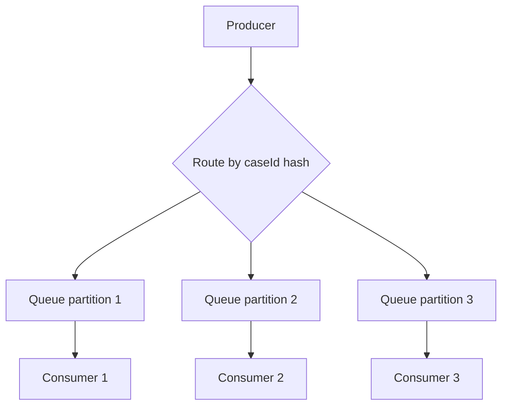
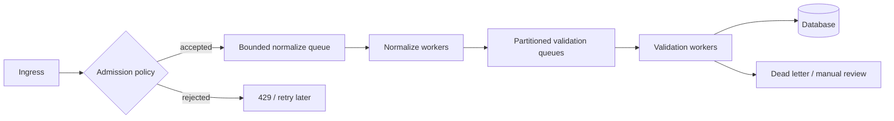

------
title: Learn Java Concurrency & Correctness - Part 014
description: Deep dive into BlockingQueue, bounded queues, producer-consumer correctness, backpressure, saturation, poison pill, shutdown, queue implementation choices, and production overload behavior.
series: learn-java-concurrency-correctness
seriesTitle: Learn Java Concurrency & Correctness
order: 14
partTitle: Blocking Queues and Backpressure
tags:
- java
- concurrency
- blockingqueue
- backpressure
- producer-consumer
- saturation
- bounded-queue
- correctness
date: 2026-06-28
---

# Part 014 — Blocking Queues and Backpressure

`BlockingQueue` is one of the most important abstractions in Java concurrency.

It is not just a container. It is a coordination boundary, a load buffer, a producer-consumer protocol, and often the first line of defense against overload.

A weak engineer sees a queue as:

> A place to put tasks.

A strong engineer sees a queue as:

> A contract about ownership transfer, ordering, capacity, blocking, fairness, latency, shutdown, and overload behavior.

This part focuses on how to use blocking queues without accidentally building invisible outages.

---

## 1. Why Blocking Queues Matter

Many concurrent systems can be decomposed into stages:



The queue does three jobs:

1. **Transfers ownership** of work items.
2. **Coordinates pace** between producer and consumer.
3. **Absorbs burst** up to a bounded capacity.

But a queue also creates risk:

- too small: unnecessary rejection or producer blocking,
- too large: latency hiding, memory growth, stale work,
- unbounded: overload becomes heap pressure,
- wrong shutdown: consumers hang forever,
- wrong retry: poison message blocks progress,
- wrong metrics: queue becomes a black hole.

A queue is not a free buffer. It is a policy decision.

---

## 2. `BlockingQueue` Mental Model

A `BlockingQueue<E>` extends queue semantics with blocking insertion and removal operations.

The key invariant is:

```text
0 <= queue.size() <= capacity
```

For bounded queues:

```text
producer may block or fail when queue is full
consumer may block or fail when queue is empty
```

For unbounded queues:

```text
producer usually does not block due to capacity
memory becomes the effective limit
```

That distinction is critical.

Backpressure exists only when overload is communicated upstream.

An unbounded queue often hides overload until the heap, latency budget, or business SLA fails.

---

## 3. Four Method Families

`BlockingQueue` provides method families with different failure behavior.

| Operation | Throws exception | Special value | Blocks | Times out |
|---|---|---|---|---|
| Insert | `add(e)` | `offer(e)` | `put(e)` | `offer(e, time, unit)` |
| Remove | `remove()` | `poll()` | `take()` | `poll(time, unit)` |
| Examine | `element()` | `peek()` | N/A | N/A |

This table is not trivia. It is design vocabulary.

### 3.1 `put`: Backpressure By Blocking

```java
queue.put(workItem);
```

If the queue is full, the producer waits.

Use when:

- producer can safely slow down,
- blocking does not violate upstream deadline,
- preserving work is more important than immediate rejection,
- shutdown interruption is handled.

Avoid when:

- producer is an event-loop thread,
- producer holds locks,
- producer is a request thread with strict latency budget,
- blocking can cause thread-pool starvation.

### 3.2 `offer`: Backpressure By Rejection

```java
boolean accepted = queue.offer(workItem);
if (!accepted) {
    reject(workItem);
}
```

Use when:

- overload should fail fast,
- caller can retry later,
- work can be dropped or redirected,
- upstream needs an immediate signal.

### 3.3 Timed `offer`: Backpressure With A Budget

```java
boolean accepted = queue.offer(workItem, 100, TimeUnit.MILLISECONDS);
if (!accepted) {
    reject(workItem);
}
```

This is often a good production default.

It says:

> I am willing to wait a little for capacity, but not indefinitely.

### 3.4 `take`: Blocking Consumption

```java
WorkItem item = queue.take();
```

Use when consumers should sleep until work exists.

Always decide how the consumer stops:

- interruption,
- poison pill,
- closed queue wrapper,
- executor shutdown,
- lifecycle flag plus timed poll.

---

## 4. Basic Producer-Consumer

```java
import java.util.concurrent.ArrayBlockingQueue;
import java.util.concurrent.BlockingQueue;

public final class WorkPipeline {
    private final BlockingQueue<WorkItem> queue = new ArrayBlockingQueue<>(1_000);

    public void submit(WorkItem item) throws InterruptedException {
        queue.put(item);
    }

    public void runConsumer() {
        while (!Thread.currentThread().isInterrupted()) {
            try {
                WorkItem item = queue.take();
                process(item);
            } catch (InterruptedException e) {
                Thread.currentThread().interrupt();
            } catch (Throwable t) {
                logFailure(t);
            }
        }
    }

    private void process(WorkItem item) {
        // Business logic
    }

    private void logFailure(Throwable t) {
        // Logging/metrics
    }
}
```

This is simple, but incomplete for production.

Missing design decisions:

- What happens when the queue is full?
- Is blocking submit acceptable?
- How are consumers stopped?
- What happens to queued work during shutdown?
- How is processing failure handled?
- Are duplicate submissions possible?
- How is queue depth observed?

---

## 5. Backpressure

Backpressure is not just a queue being full.

Backpressure is a signal that travels upstream and changes behavior.



If the producer ignores the signal, there is no real backpressure.

### 5.1 Backpressure Policies

| Policy | Behavior | Good for | Risk |
|---|---|---|---|
| Block | Producer waits | Lossless local pipelines | Thread accumulation |
| Timed wait | Producer waits within budget | Request systems with SLA | Tuning complexity |
| Reject | Producer fails fast | Overload protection | Caller must handle it |
| Drop newest | New work discarded | Telemetry, sampling | Data loss |
| Drop oldest | Preserve fresh work | UI/events/metrics | Old work loss |
| Spill to durable queue | Move to broker/db | Reliability | Operational complexity |
| Shed by priority | Reject low priority | Multi-tenant systems | Policy fairness |

The wrong policy is worse than no queue.

For regulatory/case systems, silent dropping is usually unacceptable unless the data is explicitly non-authoritative telemetry.

---

## 6. Bounded vs Unbounded Queues

### 6.1 Bounded Queues

Bounded queues have explicit capacity.

Examples:

- `ArrayBlockingQueue`
- `LinkedBlockingQueue` with capacity
- `LinkedBlockingDeque` with capacity

Bounded queues force you to answer:

> What happens when the system receives more work than it can process?

That is good.

### 6.2 Unbounded Queues

Examples:

- default `LinkedBlockingQueue()` constructor behavior is effectively very large,
- `PriorityBlockingQueue` is logically unbounded,
- `DelayQueue` is unbounded,
- many executor factory methods use unbounded queues internally.

Unbounded queues can be valid for controlled workloads, but they are dangerous as overload buffers.

They convert overload into:

- increased latency,
- increased memory usage,
- stale work,
- delayed failure,
- eventual `OutOfMemoryError`,
- impossible incident diagnosis if queue age is not measured.

### 6.3 Rule Of Thumb

For production request/service workloads:

> Prefer bounded queues unless you can prove the producer rate is naturally bounded and memory risk is acceptable.

---

## 7. Queue Implementation Choices

### 7.1 `ArrayBlockingQueue`

Characteristics:

- bounded,
- array-backed,
- FIFO,
- fixed capacity,
- optional fairness policy,
- predictable memory footprint.

Good for:

- stable producer-consumer pipelines,
- explicit overload control,
- fixed memory budget,
- cases where capacity must be obvious.

Example:

```java
BlockingQueue<WorkItem> queue = new ArrayBlockingQueue<>(10_000);
```

### 7.2 `LinkedBlockingQueue`

Characteristics:

- optionally bounded,
- linked-node based,
- FIFO,
- can be accidentally unbounded if capacity is omitted.

Good for:

- producer-consumer workloads with configurable capacity,
- executor queues where node allocation cost is acceptable.

Danger:

```java
BlockingQueue<WorkItem> queue = new LinkedBlockingQueue<>(); // effectively unbounded
```

Prefer:

```java
BlockingQueue<WorkItem> queue = new LinkedBlockingQueue<>(10_000);
```

### 7.3 `SynchronousQueue`

Characteristics:

- no internal capacity,
- each insertion waits for a corresponding removal,
- direct handoff.

Mental model:

```text
queue size is always zero
producer and consumer rendezvous
```

Good for:

- direct handoff designs,
- executor designs that spawn or reject rather than queue,
- low-latency handoff when consumers are available.

Bad for:

- burst buffering,
- smoothing producer/consumer mismatch,
- storing work.

### 7.4 `PriorityBlockingQueue`

Characteristics:

- priority ordering,
- blocking retrieval,
- logically unbounded,
- does not provide FIFO across equal priorities unless comparator encodes tie-breaker.

Good for:

- priority-based schedulers,
- deadline-based processing,
- high-priority incident or escalation queues.

Risks:

- starvation of low priority work,
- unbounded memory,
- unstable ordering if priority mutates after insertion,
- fairness issues if priority policy is not explicit.

### 7.5 `DelayQueue`

Characteristics:

- elements become available only after delay expires,
- unbounded,
- useful for delayed scheduling.

Good for:

- retry-after queues,
- scheduled timeout checks,
- delayed reprocessing.

Risks:

- not durable,
- heap memory growth,
- clock/time assumptions,
- process restart loses in-memory delayed work.

### 7.6 `LinkedTransferQueue`

Characteristics:

- unbounded transfer queue,
- supports direct handoff when consumers are waiting,
- useful for high-throughput producer-consumer cases.

Good for:

- advanced high-throughput systems,
- cases where transfer semantics matter.

Not the first choice for ordinary bounded production pipelines because it does not provide a fixed capacity boundary.

---

## 8. Queue Selection Matrix

| Need | Good first choice | Avoid |
|---|---|---|
| Fixed bounded FIFO pipeline | `ArrayBlockingQueue` | Unbounded `LinkedBlockingQueue` |
| Bounded FIFO with linked nodes | `LinkedBlockingQueue(capacity)` | No-capacity constructor |
| Direct handoff, no buffering | `SynchronousQueue` | Expecting queue depth |
| Priority scheduling | `PriorityBlockingQueue` | Mutable priority fields |
| Delayed retry in-memory | `DelayQueue` | Critical durable retry |
| Many-to-many high-throughput transfer | `LinkedTransferQueue` | Workloads needing capacity cap |

---

## 9. Capacity Design

Queue capacity is not arbitrary.

A queue capacity should come from:

- memory budget,
- average item size,
- downstream processing rate,
- acceptable waiting time,
- burst tolerance,
- upstream deadline,
- failure recovery behavior.

### 9.1 Little's Law Intuition

A useful mental model:

```text
queue length ≈ arrival rate × waiting time
```

If items arrive at 1,000/sec and the queue holds 60,000 items, the queue can represent roughly 60 seconds of waiting at that rate.

If the request SLA is 2 seconds, a 60-second queue is not resilience. It is latency camouflage.

### 9.2 Capacity Budget Example

Assume:

- average item size: 8 KB,
- capacity: 50,000,
- queue item memory only: 400 MB,
- plus object overhead and retained references.

That queue may hold much more live memory than expected.

If each item references a large payload graph, the queue retains the whole graph.

Review question:

> What is the maximum retained memory when this queue is full?

If nobody knows, the capacity is not engineered.

---

## 10. Producer Policies

### 10.1 Lossless Blocking Producer

```java
public void submit(WorkItem item) throws InterruptedException {
    queue.put(item);
}
```

Use only when producer blocking is allowed.

### 10.2 SLA-Bounded Producer

```java
public SubmissionResult submit(WorkItem item, Duration timeout)
        throws InterruptedException {

    boolean accepted = queue.offer(
            item,
            timeout.toMillis(),
            TimeUnit.MILLISECONDS
    );

    if (!accepted) {
        return SubmissionResult.rejected("queue_full");
    }

    return SubmissionResult.accepted();
}
```

This is often better for service boundaries.

### 10.3 Non-Blocking Producer

```java
public SubmissionResult submit(WorkItem item) {
    if (!queue.offer(item)) {
        return SubmissionResult.rejected("queue_full");
    }
    return SubmissionResult.accepted();
}
```

Good when upstream can retry or fail fast.

### 10.4 Producer Must Not Hold Locks While Blocking

Bad:

```java
synchronized (stateLock) {
    updateState(item);
    queue.put(item); // can block while holding stateLock
}
```

This can block consumers that need the same lock to make progress.

Better:

```java
StateUpdate update;
synchronized (stateLock) {
    update = updateState(item);
}
queue.put(update.toWorkItem());
```

Never block on a queue while holding unrelated locks unless you have a proof of safety.

---

## 11. Consumer Policies

### 11.1 Interruption-Aware Consumer

```java
public void runConsumer() {
    while (!Thread.currentThread().isInterrupted()) {
        try {
            WorkItem item = queue.take();
            process(item);
        } catch (InterruptedException e) {
            Thread.currentThread().interrupt();
        } catch (Throwable t) {
            recordFailure(t);
        }
    }
}
```

Key points:

- `take()` is interruptible.
- Restore interrupt status.
- Do not let one bad item kill the consumer silently unless fail-fast is intentional.

### 11.2 Timed Poll Consumer

```java
public void runConsumer(BooleanSupplier running) {
    while (running.getAsBoolean() || !queue.isEmpty()) {
        try {
            WorkItem item = queue.poll(500, TimeUnit.MILLISECONDS);
            if (item == null) {
                continue;
            }
            process(item);
        } catch (InterruptedException e) {
            Thread.currentThread().interrupt();
            break;
        }
    }
}
```

Timed poll is useful when consumers must periodically check lifecycle state.

### 11.3 Batch Drain

```java
List<WorkItem> batch = new ArrayList<>(100);

WorkItem first = queue.take();
batch.add(first);
queue.drainTo(batch, 99);
processBatch(batch);
batch.clear();
```

Batching can improve throughput by amortizing overhead.

Risks:

- increases per-item latency,
- complicates failure handling,
- may create unfairness,
- can increase transaction size or lock duration.

---

## 12. Shutdown Design

Queue-based systems often fail during shutdown.

There are three common strategies.

### 12.1 Interruption

If consumers run in an executor, shutdown can interrupt them.

```java
executor.shutdownNow();
```

Consumer must handle `InterruptedException` correctly.

Pros:

- simple,
- works with blocking methods,
- aligns with Java cancellation model.

Cons:

- may abandon queued work,
- requires careful cleanup,
- not a domain-level signal.

### 12.2 Poison Pill

A poison pill is a sentinel item that tells consumers to stop.

```java
sealed interface QueueItem permits Work, StopSignal {}
record Work(String id) implements QueueItem {}
record StopSignal() implements QueueItem {}
```

Consumer:

```java
QueueItem item = queue.take();
if (item instanceof StopSignal) {
    return;
}
process((Work) item);
```

For N consumers, usually enqueue N poison pills.

```java
for (int i = 0; i < consumerCount; i++) {
    queue.put(new StopSignal());
}
```

Pros:

- explicit domain/lifecycle signal,
- graceful drain possible.

Cons:

- can get stuck behind a large backlog,
- requires type design,
- producers must stop before poison insertion or ordering becomes ambiguous.

### 12.3 Closeable Queue Wrapper

Java's `BlockingQueue` does not have built-in close semantics.

A wrapper can model closure explicitly.

```java
public final class CloseableWorkQueue {
    private final BlockingQueue<WorkItem> queue;
    private final AtomicBoolean closed = new AtomicBoolean();

    public CloseableWorkQueue(int capacity) {
        this.queue = new ArrayBlockingQueue<>(capacity);
    }

    public boolean submit(WorkItem item, Duration timeout) throws InterruptedException {
        if (closed.get()) {
            return false;
        }
        return queue.offer(item, timeout.toMillis(), TimeUnit.MILLISECONDS);
    }

    public WorkItem poll(Duration timeout) throws InterruptedException {
        return queue.poll(timeout.toMillis(), TimeUnit.MILLISECONDS);
    }

    public void close() {
        closed.set(true);
    }

    public boolean isDrained() {
        return closed.get() && queue.isEmpty();
    }
}
```

This is still incomplete for every use case, but it makes lifecycle explicit.

---

## 13. Poison Pill Correctness

Poison pill looks simple but has edge cases.

### 13.1 Multi-Consumer Rule

If there are 4 consumers and only 1 poison pill, only one consumer stops.

```text
poisonPills == consumerCount
```

unless the poison pill is reinserted by each consumer, which has its own hazards.

### 13.2 Stop Producers First

Bad order:

```text
insert poison pill
producer continues adding work
```

A consumer may stop while work is added behind the poison pill.

Better order:

```text
stop accepting new work
wait or reject active producers
insert poison pills
consumers drain/stop
```

### 13.3 Priority Queue Hazard

A poison pill in `PriorityBlockingQueue` may not be consumed when expected unless its priority is designed carefully.

If poison has low priority, consumers may process normal work indefinitely before seeing it.

---

## 14. Failure Handling

A queue transfers work. It does not define what happens when work fails.

You must define:

- retry or no retry,
- max attempts,
- backoff,
- dead-letter handling,
- poison item detection,
- idempotency,
- partial failure visibility.

### 14.1 Bad Failure Loop

```java
while (true) {
    WorkItem item = queue.take();
    try {
        process(item);
    } catch (Exception e) {
        queue.put(item); // immediate retry
    }
}
```

This can create a hot retry loop.

Better:

- increment attempt count,
- delay retry,
- cap attempts,
- record failure,
- separate retry queue from main queue.

### 14.2 Attempt-Aware Item

```java
record WorkItem(String id, int attempt, Payload payload) {
    WorkItem nextAttempt() {
        return new WorkItem(id, attempt + 1, payload);
    }
}
```

Retry logic:

```java
try {
    process(item);
} catch (TransientException e) {
    if (item.attempt() < 3) {
        retryQueue.put(item.nextAttempt());
    } else {
        deadLetter(item, e);
    }
} catch (PermanentException e) {
    deadLetter(item, e);
}
```

For critical workflows, consider durable queues or a database-backed retry state instead of in-memory queues.

---

## 15. Queue Metrics

A production queue without metrics is an outage hiding place.

Track:

- current depth,
- remaining capacity,
- enqueue rate,
- dequeue rate,
- enqueue wait time,
- dequeue idle time,
- item age,
- rejection count,
- processing duration,
- failure count,
- retry count,
- dead-letter count.

### 15.1 Item Age Is More Important Than Depth

Queue depth alone can mislead.

A queue of 100 items may be fine if consumers process 10,000/sec.

A queue of 10 items may be terrible if the oldest item is 45 minutes old.

Add enqueue timestamp:

```java
record QueuedWork<T>(T value, Instant enqueuedAt) {}
```

Then measure age at consumption:

```java
Duration age = Duration.between(item.enqueuedAt(), Instant.now());
metrics.recordQueueAge(age);
```

### 15.2 Saturation Signals

A saturated queue is a system event, not a debug log.

Record:

- full queue count,
- timed-out offer count,
- rejected submissions,
- producer wait duration percentiles,
- consumer utilization,
- downstream latency.

---

## 16. Queueing And Thread Pools

Thread pools and queues interact strongly.

A dangerous design:

```java
ExecutorService executor = Executors.newFixedThreadPool(10);
BlockingQueue<WorkItem> queue = new LinkedBlockingQueue<>();
```

If the queue is unbounded, overload does not create more workers or rejection. It creates backlog.

### 16.1 ThreadPoolExecutor Reminder

A `ThreadPoolExecutor` has:

- core pool size,
- maximum pool size,
- work queue,
- keep-alive,
- rejection handler.

Queue choice changes behavior.

Common patterns:

| Queue | Effect |
|---|---|
| Unbounded queue | Pool grows to core size, then queues indefinitely |
| Bounded queue | Queues up to capacity, then may grow/reject depending config |
| `SynchronousQueue` | Direct handoff; may grow threads up to max before rejecting |

This will be covered deeper in the thread pool part, but the queue choice already determines overload behavior.

---

## 17. Virtual Threads And Blocking Queues

Virtual threads make blocking on `put`, `take`, and timed waits cheaper.

But virtual threads do not make queues unnecessary.

### 17.1 Good Use

A virtual-thread-per-task system can use a bounded queue or semaphore to limit scarce downstream resources.

```java
BlockingQueue<Job> queue = new ArrayBlockingQueue<>(10_000);

try (var executor = Executors.newVirtualThreadPerTaskExecutor()) {
    for (int i = 0; i < 100; i++) {
        executor.submit(() -> consume(queue));
    }
}
```

The virtual threads can block cheaply while waiting for work.

### 17.2 Bad Assumption

Bad reasoning:

> Virtual threads are cheap, so we can queue or block unlimited work.

Correct reasoning:

> Virtual threads reduce thread cost, but memory, downstream capacity, database connections, CPU, locks, and business deadlines are still finite.

The queue must still be bounded by resource and latency constraints.

---

## 18. Event Loop Warning

Never call blocking queue methods from an event-loop thread unless the framework explicitly allows it.

Bad:

```java
public void onNettyEvent(Event event) throws InterruptedException {
    queue.put(event); // can block event loop
}
```

Better:

```java
public void onNettyEvent(Event event) {
    if (!queue.offer(event)) {
        rejectOrScheduleElsewhere(event);
    }
}
```

Event loops need non-blocking handoff or offloading.

This becomes important when we discuss reactive/event-loop models later.

---

## 19. Ordering Guarantees

Blocking queues differ in ordering.

| Queue | Ordering |
|---|---|
| `ArrayBlockingQueue` | FIFO |
| `LinkedBlockingQueue` | FIFO |
| `PriorityBlockingQueue` | Priority order |
| `DelayQueue` | Delay expiration order |
| `SynchronousQueue` | No storage order; handoff semantics |

Ordering is part of correctness.

For regulatory event processing, FIFO may be required per entity, but global FIFO is often impossible or inefficient.

A better design may use partitioned queues:



This gives:

- ordering per partition,
- parallelism across partitions,
- lower contention,
- clearer backpressure per lane.

But it also creates:

- hot partition risk,
- uneven load,
- harder rebalancing,
- per-entity retry complexity.

---

## 20. Ownership Transfer

When an item is placed into a queue, ownership should transfer.

Bad:

```java
List<String> mutable = new ArrayList<>();
queue.put(new WorkItem(mutable));
mutable.add("changed after enqueue");
```

This creates a race over object state.

Better:

```java
queue.put(new WorkItem(List.copyOf(mutable)));
```

Or use immutable payloads.

Queue thread-safety does not make the objects inside the queue thread-safe.

This is one of the most common hidden mistakes.

---

## 21. Drain And Flush Semantics

Sometimes shutdown or phase transition requires draining a queue.

```java
List<WorkItem> remaining = new ArrayList<>();
queue.drainTo(remaining);
```

But `drainTo` is not a global stop-the-world operation. Producers may add items concurrently unless stopped.

Safe drain sequence:

```text
1. Stop accepting producers.
2. Wait for in-flight producers to finish or cancel them.
3. Drain queue.
4. Process, persist, or discard remaining work according to policy.
```

If producers continue, drain is only a snapshot-like transfer.

---

## 22. Case Study: Enforcement Event Normalization Pipeline

Assume a platform receives raw enforcement events from multiple agencies.

Stages:

1. receive raw event,
2. normalize schema,
3. enrich with reference data,
4. validate lifecycle transition,
5. persist normalized event.

A naive design:

```text
single unbounded queue -> 50 consumers -> database
```

Problems:

- upstream can overwhelm memory,
- queue hides database slowdown,
- event age is invisible,
- high-priority cases wait behind low-priority bulk import,
- retries may reorder entity events,
- shutdown may lose in-memory work.

A better design:



Design choices:

- bounded ingress queue,
- timed offer at service boundary,
- partition by case ID for per-case ordering,
- separate dead-letter path,
- metrics for queue age and rejection,
- durable state before accepting critical events if loss is unacceptable.

Key principle:

> A queue boundary must match a recoverability boundary.

If losing queued work is unacceptable, in-memory queue acceptance may not be enough. You may need durable persistence before acknowledging upstream.

---

## 23. Anti-Pattern Catalog

### 23.1 Unbounded Queue As Resilience

Bad:

```java
BlockingQueue<Job> queue = new LinkedBlockingQueue<>();
```

This says:

> We will accept work until memory says no.

Better:

```java
BlockingQueue<Job> queue = new LinkedBlockingQueue<>(capacityFromBudget);
```

### 23.2 Queue Without Rejection Policy

Bad:

```java
queue.offer(job); // return value ignored
```

This silently drops work if the queue is full.

Correct:

```java
if (!queue.offer(job)) {
    rejectedJobs.increment();
    throw new RejectedExecutionException("queue full");
}
```

### 23.3 Blocking While Holding A Transaction

Bad:

```java
transactionTemplate.execute(status -> {
    updateDatabase();
    queue.put(job); // blocks while transaction remains open
    return null;
});
```

Risks:

- holds database locks,
- increases transaction duration,
- can deadlock with consumers that need the database,
- couples DB resource to queue capacity.

### 23.4 Mutable Item After Enqueue

Bad:

```java
job.setStatus("QUEUED");
queue.put(job);
job.setStatus("MODIFIED");
```

The consumer may see either state depending on timing.

Use immutable command objects or snapshots.

### 23.5 Poison Pill With Active Producers

Bad:

```java
queue.put(POISON);
// producers still running
```

Consumers may stop before all work is submitted.

### 23.6 Metrics Only On Depth

Depth without age, rate, and rejection is incomplete.

A stable queue depth can hide equal arrival and consumption rates with very old items if priority or partitioning is broken.

---

## 24. Production Checklist

Before approving a queue-based design, answer these questions.

### 24.1 Capacity

- Is the queue bounded?
- What is the capacity?
- Why that number?
- What is max retained memory?
- What is max expected item age at full capacity?

### 24.2 Backpressure

- What happens when full?
- Does upstream see rejection, delay, retry-after, or blocking?
- Is the producer allowed to block?
- Is timed admission aligned with request deadline?

### 24.3 Correctness

- Does enqueue transfer ownership?
- Are queued items immutable or safely published?
- Is ordering required globally, per entity, or not at all?
- Are duplicate items possible?
- Is processing idempotent?

### 24.4 Failure

- What happens when processing fails?
- Is retry bounded?
- Is there dead-letter handling?
- Can one poison item block the queue?
- What happens during shutdown?

### 24.5 Observability

- Are depth and remaining capacity measured?
- Is item age measured?
- Are offer timeouts counted?
- Are rejections visible?
- Are consumers' processing times visible?

---

## 25. Practice Drills

### Drill 1 — Queue Method Semantics

Create a bounded `ArrayBlockingQueue` of capacity 1. Demonstrate behavior of:

- `add`,
- `offer`,
- `put`,
- timed `offer`,
- `remove`,
- `poll`,
- `take`,
- timed `poll`.

Write down which methods throw, return special values, block, or time out.

### Drill 2 — Build A Bounded Pipeline

Build a pipeline with:

- 1 producer,
- 3 consumers,
- queue capacity 100,
- timed `offer`,
- queue depth metrics,
- item age metrics,
- graceful shutdown.

Inject slow consumers and observe rejection behavior.

### Drill 3 — Poison Pill Shutdown

Implement poison pill shutdown for 4 consumers.

Then intentionally enqueue only 1 poison pill and observe the bug.

Fix it.

### Drill 4 — Mutable Payload Race

Enqueue a mutable object and modify it after enqueue. Show that consumer-visible state is timing-dependent.

Fix it with immutable snapshots.

### Drill 5 — Unbounded Queue Failure Simulation

Create an unbounded `LinkedBlockingQueue` and a producer faster than the consumer.

Track:

- depth,
- memory usage,
- item age.

Then replace with bounded queue and explicit rejection.

---

## 26. Summary

`BlockingQueue` is a deceptively simple abstraction.

Used well, it gives:

- safe producer-consumer coordination,
- ownership transfer,
- burst absorption,
- overload control,
- clean stage separation.

Used poorly, it hides:

- memory growth,
- stale work,
- downstream failure,
- shutdown bugs,
- ordering violations,
- silent data loss.

Key takeaways:

- Prefer bounded queues for service workloads.
- Choose queue methods based on failure semantics.
- Treat full queue as a designed outcome, not an exception surprise.
- Measure item age, not just depth.
- Do not mutate objects after enqueue.
- Stop producers before draining or poisoning queues.
- Use durable queues when accepted work must survive process failure.
- Virtual threads make blocking cheaper, but do not remove capacity limits.

The next part covers concurrent collections and their invariants: how to use collections like `ConcurrentHashMap`, copy-on-write collections, and skip-list structures without assuming stronger consistency than they actually provide.

---

## References

- Java SE 25 API — `BlockingQueue`: https://docs.oracle.com/en/java/javase/25/docs/api/java.base/java/util/concurrent/BlockingQueue.html
- Java SE 25 API — `ArrayBlockingQueue`: https://docs.oracle.com/en/java/javase/25/docs/api/java.base/java/util/concurrent/ArrayBlockingQueue.html
- Java SE 25 API — `LinkedBlockingQueue`: https://docs.oracle.com/en/java/javase/25/docs/api/java.base/java/util/concurrent/LinkedBlockingQueue.html
- Java SE 25 API — `SynchronousQueue`: https://docs.oracle.com/en/java/javase/25/docs/api/java.base/java/util/concurrent/SynchronousQueue.html
- Java SE 25 API — `PriorityBlockingQueue`: https://docs.oracle.com/en/java/javase/25/docs/api/java.base/java/util/concurrent/PriorityBlockingQueue.html
- Java SE 25 API — `DelayQueue`: https://docs.oracle.com/en/java/javase/25/docs/api/java.base/java/util/concurrent/DelayQueue.html
- Java SE 25 API — `LinkedTransferQueue`: https://docs.oracle.com/en/java/javase/25/docs/api/java.base/java/util/concurrent/LinkedTransferQueue.html
- Oracle Java SE 25 Guide — Concurrency: https://docs.oracle.com/en/java/javase/25/core/concurrency.html
