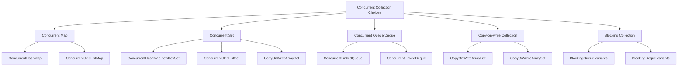
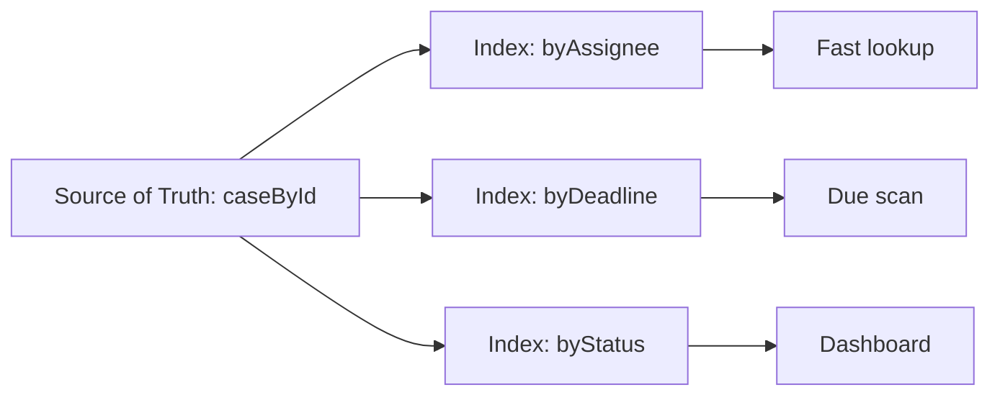

------
title: Learn Java Concurrency & Correctness - Part 015
description: Concurrent collections tidak hanya tentang memakai Map yang thread-safe, tetapi tentang menjaga invariants data saat banyak thread membaca dan menulis secara bersamaan.
series: learn-java-concurrency-correctness
seriesTitle: Learn Java Concurrency & Correctness
order: 15
partTitle: Concurrent Collections Invariants
tags:
- java
- concurrency
- correctness
- concurrent-collections
- invariants
date: 2026-06-28
---

# Part 015 — Concurrent Collections Invariants

Concurrent collections sering disalahpahami sebagai solusi otomatis untuk semua bug shared state. Padahal `ConcurrentHashMap`, `CopyOnWriteArrayList`, `ConcurrentLinkedQueue`, atau `ConcurrentSkipListMap` hanya memberi jaminan tertentu pada operasi tertentu. Ia tidak otomatis menjaga invariant bisnis yang melibatkan beberapa key, beberapa collection, beberapa object, atau urutan operasi yang lebih besar daripada satu method call.

Mental model yang tepat:

> Concurrent collection membuat struktur data internalnya aman dipakai banyak thread. Ia tidak otomatis membuat workflow, aggregate, atau business invariant Anda aman.

Di level top engineer, pertanyaan utamanya bukan “collection mana yang thread-safe?”, tetapi:

1. invariant apa yang harus selalu benar?
2. operasi apa yang menjadi linearization point?
3. apakah invariant cukup hidup di satu entry/key, atau melebar ke banyak entry?
4. apakah value object immutable, mutable, atau punya lock sendiri?
5. apakah pembacaan butuh snapshot konsisten atau cukup weakly consistent?
6. apa yang terjadi saat update function lambat, blocking, reentrant, atau gagal?

Part ini membahas concurrent collections sebagai alat desain correctness, bukan sekadar daftar class.

---

## 1. Problem yang Diselesaikan Concurrent Collections

Tanpa concurrent collections, kita sering jatuh ke dua ekstrem:

| Pendekatan | Masalah |
|---|---|
| `HashMap` biasa dipakai banyak thread | data race, corruption, stale read, lost update |
| `Collections.synchronizedMap(new HashMap<>())` | semua akses serial, mudah lupa lock saat iterasi, bottleneck global |
| lock manual di seluruh repository/cache | correctness mungkin bisa, tetapi contention tinggi dan error-prone |
| copy seluruh snapshot setiap update | aman untuk read-heavy, tetapi mahal untuk write-heavy |

Concurrent collections memberi kompromi: operasi umum seperti `get`, `put`, `compute`, `remove`, traversal, dan update tertentu bisa dilakukan aman dengan granularitas internal yang lebih baik daripada satu lock global.

Namun, mereka tetap punya batas:

```java
if (!map.containsKey(id)) {
    map.put(id, createValue());
}
```

Kode ini memakai collection thread-safe sekalipun tetap bukan operasi atomik. Dua thread bisa sama-sama melihat key belum ada, lalu sama-sama membuat value. Untuk invariant “hanya satu value dibuat per id”, gunakan operasi atomik yang tepat:

```java
Value value = map.computeIfAbsent(id, ignored -> createValue());
```

Perbedaan utamanya bukan di class, tetapi di atomic boundary.

---

## 2. Taxonomy Concurrent Collections di Java

Secara konseptual, concurrent collections di Java bisa dikelompokkan sebagai berikut:



Part 014 sudah membahas `BlockingQueue`, jadi di sini kita hanya mengaitkannya sebagai collection yang punya blocking/backpressure semantics. Fokus utama part ini adalah map/set/list/queue non-blocking dan invariants di atasnya.

---

## 3. Thread-Safe Collection vs Correct Aggregate

Thread-safe collection menjamin internal structure tidak rusak saat concurrent access. Correct aggregate berarti invariant domain tetap benar.

Contoh invariant lokal satu key:

> Untuk setiap `customerId`, hanya ada satu `CustomerSession` aktif.

Ini cocok memakai `ConcurrentHashMap.computeIfAbsent`:

```java
public final class SessionRegistry {
    private final ConcurrentHashMap<String, CustomerSession> sessions = new ConcurrentHashMap<>();

    public CustomerSession getOrCreate(String customerId) {
        return sessions.computeIfAbsent(customerId, CustomerSession::new);
    }
}
```

Contoh invariant multi-key:

> Satu case tidak boleh berada di dua bucket status sekaligus.

```java
private final ConcurrentHashMap<Status, Set<CaseId>> byStatus = new ConcurrentHashMap<>();
```

Operasi pindah status butuh menghapus dari bucket lama dan menambah ke bucket baru. Walaupun tiap set thread-safe, invariant “case hanya ada di satu status” melintasi dua collection/key. Concurrent collection saja tidak cukup.

Solusi yang lebih benar biasanya salah satu dari berikut:

1. ubah model jadi satu source of truth: `ConcurrentHashMap<CaseId, Status>`;
2. pakai immutable aggregate state dan update dengan CAS;
3. lindungi multi-key transition dengan lock per aggregate;
4. jadikan index turunan yang eventual-consistent dan bisa direbuild;
5. delegasikan perubahan ke single-writer actor/pipeline.

Decision rule:

> Jika invariant melibatkan lebih dari satu key/entry, jangan mengasumsikan concurrent collection akan menjaganya. Anda perlu aggregate boundary yang eksplisit.

---

## 4. ConcurrentHashMap Mental Model

`ConcurrentHashMap<K,V>` adalah pilihan default untuk map yang sering diakses banyak thread.

Karakteristik penting:

- aman untuk concurrent read/write;
- tidak mengizinkan `null` key atau `null` value;
- retrieval operation seperti `get` biasanya tidak blocking;
- update operation menjaga internal consistency;
- iterator/view bersifat weakly consistent, bukan fail-fast snapshot;
- operasi aggregate seperti `size()` dapat berubah maknanya saat ada concurrent modification;
- atomic methods seperti `putIfAbsent`, `remove(key, value)`, `replace`, `compute`, `merge`, dan `computeIfAbsent` adalah alat correctness utama.

### 4.1 Mengapa `null` Tidak Diizinkan

Pada `Map` biasa, `get(key)` yang mengembalikan `null` ambigu:

1. key tidak ada;
2. key ada tetapi value-nya `null`.

Dalam concurrent map, ambiguitas ini berbahaya karena `containsKey` + `get` bukan snapshot atomik. Dengan melarang `null`, `get(key) == null` dapat berarti tidak ada mapping pada saat operasi `get` tersebut.

Jangan melawan desain ini dengan sentinel sembarangan. Gunakan salah satu:

```java
ConcurrentHashMap<String, Optional<User>> cache = new ConcurrentHashMap<>();
```

atau sentinel eksplisit:

```java
sealed interface LookupResult permits Found, NotFound {}
record Found(User user) implements LookupResult {}
record NotFound() implements LookupResult {}
```

Untuk production cache, sentinel harus didesain dengan TTL/error policy yang jelas. Kalau tidak, Anda bisa meng-cache kegagalan sementara sebagai “not found” permanen.

---

## 5. Atomic Map Methods sebagai Linearization Boundary

Concurrent map method yang penting bukan `put`, melainkan method yang menggabungkan cek dan update menjadi satu operasi.

| Method | Gunakan untuk | Invariant yang dibantu |
|---|---|---|
| `putIfAbsent(k, v)` | insert jika belum ada | single owner/single registration |
| `remove(k, v)` | remove hanya jika value masih sama | compare-and-remove |
| `replace(k, old, new)` | update hanya jika current value cocok | optimistic transition |
| `computeIfAbsent(k, f)` | lazy creation per key | one value per key |
| `computeIfPresent(k, f)` | update hanya jika ada | guarded update |
| `compute(k, f)` | full transition per key | per-key state machine |
| `merge(k, v, f)` | aggregation | counter/reducer per key |

### 5.1 Bad: Check Then Act

```java
public UserProfile profileFor(String userId) {
    UserProfile profile = profiles.get(userId);
    if (profile == null) {
        profile = loadProfile(userId);
        profiles.put(userId, profile);
    }
    return profile;
}
```

Bug:

- beberapa thread bisa menjalankan `loadProfile` untuk user yang sama;
- value terakhir menang tanpa policy eksplisit;
- side effect di `loadProfile` bisa terjadi berkali-kali;
- invariant “load once per user” tidak benar.

### 5.2 Better: Atomic Insert

```java
public UserProfile profileFor(String userId) {
    return profiles.computeIfAbsent(userId, this::loadProfile);
}
```

Namun, ini bukan izin untuk menjalankan sembarang logic di mapping function. Mapping function harus kecil, deterministic, tidak reentrant ke map yang sama secara berbahaya, dan idealnya tidak memegang resource yang bisa deadlock.

### 5.3 Mapping Function Rule

Mapping function pada `compute*`/`merge` harus diperlakukan seperti critical section semantik.

Checklist:

- tidak blocking lama;
- tidak melakukan network call jika bisa dihindari;
- tidak mengambil lock lain dengan urutan tidak jelas;
- tidak memanggil kembali update ke map yang sama untuk key yang saling bergantung;
- tidak mengandalkan berapa kali function dieksekusi kecuali dokumentasi method menjamin;
- tidak menyimpan object mutable yang belum siap;
- menangani exception sebagai bagian dari transition contract.

Contoh berisiko:

```java
orders.compute(orderId, (id, current) -> {
    PaymentAuthorization authorization = paymentGateway.authorize(id); // blocking external call
    return current.authorizedBy(authorization);
});
```

Lebih baik pisahkan external side effect dari short atomic transition:

```java
PaymentAuthorization authorization = paymentGateway.authorize(orderId);

orders.compute(orderId, (id, current) -> {
    if (current == null) {
        throw new IllegalStateException("Order disappeared: " + id);
    }
    return current.authorizedBy(authorization);
});
```

Masih ada isu idempotency pembayaran, tetapi minimal map update tidak menahan struktur concurrent saat network call berlangsung.

---

## 6. Value Object: Immutable atau Mutable?

Concurrent map melindungi mapping, bukan otomatis isi object yang menjadi value.

```java
ConcurrentHashMap<String, MutableCart> carts = new ConcurrentHashMap<>();
```

Jika `MutableCart` tidak thread-safe, maka ini tetap berbahaya:

```java
carts.get(cartId).addItem(item);
```

Map-nya aman. Cart-nya belum tentu.

Ada tiga desain umum.

### 6.1 Immutable Value + Atomic Replace

```java
record Cart(String id, List<CartItem> items, long version) {
    Cart add(CartItem item) {
        var next = new ArrayList<>(items);
        next.add(item);
        return new Cart(id, List.copyOf(next), version + 1);
    }
}
```

```java
carts.compute(cartId, (id, current) -> {
    if (current == null) {
        return new Cart(id, List.of(item), 1);
    }
    return current.add(item);
});
```

Kelebihan:

- snapshot aman;
- reasoning mudah;
- cocok untuk state machine kecil/menengah;
- per-key update atomic.

Kekurangan:

- allocation lebih tinggi;
- copy cost meningkat pada aggregate besar;
- perlu desain versioning.

### 6.2 Mutable Value dengan Lock Internal

```java
public final class Cart {
    private final ReentrantLock lock = new ReentrantLock();
    private final List<CartItem> items = new ArrayList<>();

    public void add(CartItem item) {
        lock.lock();
        try {
            items.add(item);
        } finally {
            lock.unlock();
        }
    }

    public List<CartItem> snapshot() {
        lock.lock();
        try {
            return List.copyOf(items);
        } finally {
            lock.unlock();
        }
    }
}
```

Kelebihan:

- tidak copy seluruh aggregate di setiap update;
- cocok untuk object besar;
- lock scope jelas per aggregate.

Kekurangan:

- nested lock risk;
- snapshot harus disiplin;
- map-level transition dan value-level transition bisa saling bentrok.

### 6.3 Concurrent Value Structure

```java
record Cart(String id, ConcurrentHashMap<String, CartItem> itemsBySku) {}
```

Kelebihan:

- granularitas tinggi;
- cocok untuk independent entries.

Kekurangan:

- invariant antar item sulit;
- ordering sulit;
- snapshot konsisten sulit;
- business rules sering menyelinap melintasi entries.

Rule praktis:

> Untuk domain invariant yang kuat, mulai dari immutable value + `compute`. Pindah ke mutable locked value hanya jika profiling membuktikan copy cost menjadi masalah.

---

## 7. Weakly Consistent Iteration

Concurrent collections tidak selalu memberi iterator fail-fast atau snapshot penuh. Banyak iterator concurrent bersifat weakly consistent: mereka aman dipakai saat collection berubah, tetapi tidak menjamin melihat semua perubahan terbaru atau merepresentasikan satu titik waktu tunggal.

Ini cocok untuk:

- metrics best-effort;
- background cleanup;
- monitoring;
- cache maintenance;
- approximate reporting.

Ini tidak cocok untuk:

- audit legal yang perlu snapshot konsisten;
- billing calculation;
- enforcement decision;
- invariant validation final;
- migration yang butuh exact once coverage.

Contoh salah:

```java
long total = 0;
for (Account account : accounts.values()) {
    total += account.balance();
}

if (total != expectedTotal) {
    alert();
}
```

Jika `accounts` berubah saat iterasi, `total` bukan snapshot akuntansi yang valid.

Solusi bergantung pada kebutuhan:

1. ambil snapshot immutable di bawah lock/single writer;
2. simpan ledger append-only dan hitung dari sequence konsisten;
3. gunakan database transaction sebagai boundary;
4. gunakan versioned aggregate;
5. terima approximate metrics jika memang hanya observability.

---

## 8. Size, Count, dan Metrics Under Concurrency

Di concurrent system, `size()` sering misleading.

Pertanyaan yang benar:

- butuh exact count atau approximate count?
- count dipakai untuk correctness atau observability?
- count dipakai untuk admission control?
- collection sedang berubah saat count dibaca?

Bad admission control:

```java
if (sessions.size() < maxSessions) {
    sessions.put(sessionId, session);
}
```

Ini race. Banyak thread bisa melihat size masih di bawah limit lalu semuanya insert.

Better dengan semaphore:

```java
public final class BoundedSessionRegistry {
    private final Semaphore permits;
    private final ConcurrentHashMap<String, Session> sessions = new ConcurrentHashMap<>();

    public BoundedSessionRegistry(int maxSessions) {
        this.permits = new Semaphore(maxSessions);
    }

    public boolean register(String id, Session session) throws InterruptedException {
        if (!permits.tryAcquire()) {
            return false;
        }

        boolean inserted = false;
        try {
            Session previous = sessions.putIfAbsent(id, session);
            inserted = previous == null;
            return inserted;
        } finally {
            if (!inserted) {
                permits.release();
            }
        }
    }

    public void unregister(String id) {
        Session removed = sessions.remove(id);
        if (removed != null) {
            permits.release();
        }
    }
}
```

Sekarang limit capacity dijaga oleh `Semaphore`, bukan `size()` yang berubah-ubah.

---

## 9. ConcurrentHashMap sebagai Frequency Map

Untuk counter per key di bawah contention tinggi, pattern umum adalah `ConcurrentHashMap<K, LongAdder>`.

```java
public final class ErrorCounter {
    private final ConcurrentHashMap<String, LongAdder> counts = new ConcurrentHashMap<>();

    public void increment(String errorCode) {
        counts.computeIfAbsent(errorCode, ignored -> new LongAdder()).increment();
    }

    public long count(String errorCode) {
        LongAdder adder = counts.get(errorCode);
        return adder == null ? 0 : adder.sum();
    }
}
```

Ini bagus untuk metrics high-throughput. Namun, `LongAdder.sum()` bukan atomic snapshot terhadap concurrent updates. Untuk observability biasanya cukup. Untuk billing atau enforcement quota, gunakan boundary yang lebih kuat.

Anti-pattern:

```java
if (counter.count(userId) < limit) {
    counter.increment(userId);
    allow();
}
```

Ini bukan quota enforcement yang benar. Counter metrics bukan admission-control primitive.

---

## 10. CopyOnWriteArrayList

`CopyOnWriteArrayList` adalah thread-safe variant dari `ArrayList` yang membuat copy array baru saat mutasi. Ini sangat baik untuk read-heavy, write-rare workloads.

Cocok untuk:

- listener registry;
- plugin hooks;
- feature flag observers;
- routing subscribers yang jarang berubah;
- allowlist kecil yang lebih sering dibaca daripada ditulis.

Tidak cocok untuk:

- frequently updated list;
- large list dengan write tinggi;
- producer-consumer queue;
- mutable elements tanpa discipline;
- low-latency write path.

Contoh listener registry:

```java
public final class DomainEventBus {
    private final CopyOnWriteArrayList<DomainEventListener> listeners = new CopyOnWriteArrayList<>();

    public void register(DomainEventListener listener) {
        listeners.addIfAbsent(listener);
    }

    public void publish(DomainEvent event) {
        for (DomainEventListener listener : listeners) {
            listener.onEvent(event);
        }
    }
}
```

Iteration tidak perlu lock dan melihat snapshot array. Listener yang didaftarkan saat publish berjalan tidak wajib menerima event yang sedang dipublish. Itu harus menjadi bagian dari contract.

Contract yang jelas:

> Registration berlaku untuk event setelah registration berhasil, bukan retroaktif untuk publish yang sedang berjalan.

---

## 11. Concurrent Sets

Tidak ada satu class `ConcurrentHashSet` utama, tetapi set concurrent umum bisa dibuat dari `ConcurrentHashMap`.

```java
Set<String> activeUsers = ConcurrentHashMap.newKeySet();
```

Gunakan untuk membership independent:

```java
public boolean markActive(String userId) {
    return activeUsers.add(userId);
}

public boolean markInactive(String userId) {
    return activeUsers.remove(userId);
}
```

Pertanyaan invariant:

- Apakah membership berdiri sendiri?
- Apakah setiap member butuh metadata?
- Apakah transisi perlu validasi status lama?
- Apakah order diperlukan?

Jika butuh metadata, pakai map:

```java
ConcurrentHashMap<String, ActiveSession> activeSessions = new ConcurrentHashMap<>();
```

Jika butuh ordering, pertimbangkan `ConcurrentSkipListSet`.

---

## 12. ConcurrentSkipListMap dan ConcurrentSkipListSet

`ConcurrentSkipListMap` dan `ConcurrentSkipListSet` berguna saat Anda butuh struktur concurrent yang sorted/navigable.

Cocok untuk:

- time-indexed tasks;
- priority-like lookup;
- range query;
- scheduled cleanup index;
- ordered deduplication;
- deadline registry.

Contoh deadline index:

```java
public final class DeadlineIndex {
    private final ConcurrentSkipListMap<Instant, ConcurrentHashMap.KeySetView<CaseId, Boolean>> byDeadline =
            new ConcurrentSkipListMap<>();

    public void add(CaseId caseId, Instant deadline) {
        byDeadline
                .computeIfAbsent(deadline, ignored -> ConcurrentHashMap.newKeySet())
                .add(caseId);
    }

    public List<CaseId> dueBefore(Instant now, int limit) {
        var result = new ArrayList<CaseId>(limit);

        for (var entry : byDeadline.headMap(now, true).entrySet()) {
            for (CaseId caseId : entry.getValue()) {
                result.add(caseId);
                if (result.size() == limit) {
                    return result;
                }
            }
        }

        return result;
    }
}
```

Kelemahan desain di atas:

- index bisa stale jika case deadline berubah tapi entry lama tidak dihapus;
- satu case bisa muncul di beberapa deadline;
- `dueBefore` bukan snapshot konsisten;
- removal empty bucket perlu cleanup.

Untuk correctness kuat, simpan source of truth terpisah:

```java
ConcurrentHashMap<CaseId, DeadlineRecord> deadlinesByCase;
ConcurrentSkipListMap<Instant, Set<CaseId>> indexByDeadline;
```

Lalu saat mengambil due item, validasi lagi ke source of truth.

```java
DeadlineRecord record = deadlinesByCase.get(caseId);
if (record != null && !record.deadline().isAfter(now)) {
    process(caseId);
}
```

Pattern ini umum: concurrent index boleh approximate/stale, source of truth harus divalidasi sebelum keputusan final.

---

## 13. ConcurrentLinkedQueue dan ConcurrentLinkedDeque

`ConcurrentLinkedQueue` cocok untuk unbounded non-blocking FIFO queue. Ia tidak memberi blocking wait dan tidak memberi backpressure.

Cocok untuk:

- best-effort handoff;
- local buffer kecil dengan external drain loop;
- work queue internal yang punya admission control terpisah;
- metrics/event accumulation sementara.

Tidak cocok untuk:

- producer-consumer yang butuh blocking;
- overload protection;
- strict capacity;
- exact queue length control;
- shutdown protocol yang butuh deterministic drain.

Bad:

```java
ConcurrentLinkedQueue<Job> queue = new ConcurrentLinkedQueue<>();

public void submit(Job job) {
    queue.add(job); // no capacity, no backpressure
}
```

Jika producer lebih cepat dari consumer, memory bisa naik tanpa batas.

Better jika butuh backpressure:

```java
BlockingQueue<Job> queue = new ArrayBlockingQueue<>(capacity);
```

Atau jika tetap ingin non-blocking queue, tambahkan admission control:

```java
public final class BoundedNonBlockingQueue<T> {
    private final int capacity;
    private final AtomicInteger size = new AtomicInteger();
    private final ConcurrentLinkedQueue<T> queue = new ConcurrentLinkedQueue<>();

    public BoundedNonBlockingQueue(int capacity) {
        this.capacity = capacity;
    }

    public boolean offer(T item) {
        while (true) {
            int current = size.get();
            if (current >= capacity) {
                return false;
            }
            if (size.compareAndSet(current, current + 1)) {
                queue.add(item);
                return true;
            }
        }
    }

    public T poll() {
        T item = queue.poll();
        if (item != null) {
            size.decrementAndGet();
        }
        return item;
    }
}
```

Tetapi desain ini punya edge case jika `queue.add` gagal karena exception setelah size increment. Untuk production, pastikan operation after permit acquisition tidak gagal, atau rollback dengan hati-hati.

---

## 14. Synchronized Wrappers vs Concurrent Collections

Java masih punya wrapper seperti:

```java
Map<K, V> map = Collections.synchronizedMap(new HashMap<>());
```

Ini membuat setiap method synchronized pada wrapper. Namun iterasi tetap butuh synchronization eksternal pada map wrapper.

```java
synchronized (map) {
    for (K key : map.keySet()) {
        use(key);
    }
}
```

Masalah:

- mudah lupa lock saat iterasi;
- lock global menjadi bottleneck;
- callback di dalam synchronized block berisiko deadlock;
- kurang cocok untuk high-concurrency hot path.

Gunakan synchronized wrappers jika:

- legacy API membutuhkan `List`/`Map` biasa;
- concurrency rendah;
- Anda butuh coarse-grained locking sederhana;
- semua akses bisa dikontrol.

Gunakan concurrent collections jika:

- banyak thread baca/tulis;
- invariant lokal per key;
- tidak butuh snapshot penuh setiap saat;
- operasi atomic built-in cukup untuk correctness.

Gunakan lock eksplisit/aggregate model jika:

- invariant multi-entry;
- transaction-like transition;
- snapshot exact;
- ordering kompleks;
- side effect perlu dikaitkan dengan state transition.

---

## 15. Decision Matrix

| Kebutuhan | Pilihan Awal | Catatan |
|---|---|---|
| map concurrent general-purpose | `ConcurrentHashMap` | default untuk cache/registry/index |
| sorted concurrent map | `ConcurrentSkipListMap` | range query, ordered traversal |
| read-heavy list, rare writes | `CopyOnWriteArrayList` | listener registry |
| concurrent membership set | `ConcurrentHashMap.newKeySet()` | unordered membership |
| sorted concurrent set | `ConcurrentSkipListSet` | ordered membership |
| non-blocking unbounded FIFO | `ConcurrentLinkedQueue` | tidak ada backpressure |
| producer-consumer dengan backpressure | `BlockingQueue` | lihat Part 014 |
| exact aggregate invariant | lock / immutable CAS / DB transaction | collection saja tidak cukup |
| high-contention counters | `LongAdder` per key | metrics, bukan strict quota |

---

## 16. Common Anti-Patterns

### 16.1 Concurrent Collection sebagai Magic Safety Blanket

```java
ConcurrentHashMap<String, ArrayList<Event>> events = new ConcurrentHashMap<>();
```

Map aman, list tidak aman.

Better:

```java
events.compute(userId, (id, current) -> {
    List<Event> existing = current == null ? List.of() : current;
    var next = new ArrayList<>(existing);
    next.add(event);
    return List.copyOf(next);
});
```

### 16.2 Multi-Step Logic di Luar Atomic Method

```java
if (map.containsKey(k)) {
    map.put(k, transform(map.get(k)));
}
```

Gunakan `computeIfPresent`.

### 16.3 Mutable Value Tanpa Ownership

```java
OrderState state = states.get(orderId);
state.markPaid();
state.addAuditTrail(entry);
```

Siapa yang menjaga lock? Kalau jawabannya “semoga tidak bersamaan”, desain salah.

### 16.4 Iterasi untuk Keputusan Exact

```java
for (Case c : activeCases.values()) {
    if (c.owner().equals(owner)) {
        count++;
    }
}
if (count > limit) reject();
```

Ini bukan enforcement limit yang benar jika map berubah bersamaan.

### 16.5 Blocking di `compute`

```java
map.compute(k, (key, value) -> remoteCallThenUpdate(value));
```

Map update function bukan tempat ideal untuk IO eksternal.

### 16.6 Mengabaikan Removal

```java
counters.computeIfAbsent(id, ignored -> new LongAdder()).increment();
```

Jika `id` high-cardinality dan tidak pernah dihapus, ini memory leak metrics.

---

## 17. Production Pattern: Concurrent Registry dengan State Transition

Misal kita membangun registry worker node.

Invariant:

1. setiap node ID hanya punya satu record;
2. heartbeat hanya diterima jika generation cocok;
3. transition `ACTIVE -> SUSPECT -> REMOVED` harus monotonic;
4. stale heartbeat dari generation lama tidak boleh menghidupkan node baru.

```java
enum NodeStatus {
    ACTIVE,
    SUSPECT,
    REMOVED
}

record NodeRecord(
        String nodeId,
        long generation,
        NodeStatus status,
        Instant lastHeartbeat
) {
    NodeRecord heartbeat(long observedGeneration, Instant now) {
        if (observedGeneration != generation) {
            return this;
        }
        if (status == NodeStatus.REMOVED) {
            return this;
        }
        return new NodeRecord(nodeId, generation, NodeStatus.ACTIVE, now);
    }

    NodeRecord suspect(Instant now, Duration timeout) {
        if (status != NodeStatus.ACTIVE) {
            return this;
        }
        if (lastHeartbeat.plus(timeout).isAfter(now)) {
            return this;
        }
        return new NodeRecord(nodeId, generation, NodeStatus.SUSPECT, lastHeartbeat);
    }
}
```

```java
public final class NodeRegistry {
    private final ConcurrentHashMap<String, NodeRecord> nodes = new ConcurrentHashMap<>();

    public boolean register(String nodeId, long generation, Instant now) {
        NodeRecord record = new NodeRecord(nodeId, generation, NodeStatus.ACTIVE, now);
        return nodes.putIfAbsent(nodeId, record) == null;
    }

    public void heartbeat(String nodeId, long generation, Instant now) {
        nodes.computeIfPresent(nodeId, (id, current) -> current.heartbeat(generation, now));
    }

    public void markSuspect(String nodeId, Instant now, Duration timeout) {
        nodes.computeIfPresent(nodeId, (id, current) -> current.suspect(now, timeout));
    }
}
```

Kenapa desain ini kuat:

- state immutable;
- transition per node linearized di `computeIfPresent`;
- stale heartbeat ditolak oleh generation;
- removed state tidak bisa hidup lagi tanpa explicit registration policy;
- external caller tidak mendapat mutable reference untuk merusak invariant.

---

## 18. Production Pattern: Index Turunan yang Bisa Stale

Dalam sistem besar, sering ada satu source of truth dan beberapa index turunan.



Jika semua index harus selalu exact secara atomik, desain akan mahal. Banyak platform memilih:

- source of truth kuat;
- index turunan best-effort;
- validasi ulang sebelum action penting;
- background repair/reconciliation;
- metrics untuk index drift.

Contoh:

```java
public Optional<CaseRecord> findDueCase(CaseId idFromDeadlineIndex, Instant now) {
    CaseRecord record = caseById.get(idFromDeadlineIndex);
    if (record == null) {
        return Optional.empty();
    }
    if (record.deadline().isAfter(now)) {
        return Optional.empty();
    }
    if (record.status().isTerminal()) {
        return Optional.empty();
    }
    return Optional.of(record);
}
```

Prinsip:

> Index concurrent boleh mempercepat pencarian. Keputusan domain final harus membaca source of truth yang authoritative.

---

## 19. Audit Checklist untuk Concurrent Collections

Saat review kode, tanya hal berikut.

### 19.1 Collection Boundary

- Collection mana yang shared antar thread?
- Apakah semua akses melewati abstraction yang sama?
- Apakah object collection diekspos keluar?
- Apakah caller bisa mutate value object tanpa protocol?

### 19.2 Invariant Boundary

- Invariant hanya per key atau multi-key?
- Apakah operasi atomic built-in cukup?
- Apakah snapshot exact diperlukan?
- Apakah weak consistency acceptable?

### 19.3 Value Safety

- Value immutable?
- Jika mutable, siapa lock owner-nya?
- Apakah returned value boleh disimpan caller?
- Apakah ada defensive copy?

### 19.4 Update Function

- Apakah `compute`/`merge` function singkat?
- Apakah function melakukan IO/blocking?
- Apakah function memanggil map yang sama secara nested?
- Apakah exception policy jelas?

### 19.5 Operational Safety

- Apakah collection bisa tumbuh tanpa batas?
- Apakah ada cleanup/TTL?
- Apakah high-cardinality key aman?
- Apakah metrics exact atau approximate?
- Apakah ada backpressure jika producer lebih cepat?

---

## 20. Deliberate Practice

### Drill 1 — Replace Check-Then-Act

Cari kode seperti:

```java
if (!map.containsKey(k)) {
    map.put(k, v);
}
```

Ubah menjadi `putIfAbsent`, `computeIfAbsent`, atau desain lain yang sesuai. Jelaskan invariant yang dijaga.

### Drill 2 — Value Mutability Audit

Ambil satu `ConcurrentHashMap<K,V>` dari codebase. Jawab:

- apakah `V` immutable?
- jika tidak, siapa yang mengunci `V`?
- apakah caller bisa mutate `V`?
- apakah map operation cukup menjaga invariant?

### Drill 3 — Weak Iteration Classification

Ambil semua loop atas concurrent collection. Labeli:

- approximate metrics;
- maintenance best-effort;
- exact business decision;
- audit/reporting.

Jika exact business decision memakai weak iteration, redesign.

### Drill 4 — Derived Index Design

Desain `caseById` sebagai source of truth dan `byAssignee` sebagai derived index. Buat policy untuk:

- stale index entry;
- reassignment;
- terminal case;
- background repair;
- validation before action.

---

## 21. Ringkasan

Concurrent collections adalah alat penting, tetapi bukan pengganti desain invariant.

Prinsip utama:

1. gunakan `ConcurrentHashMap` sebagai default map concurrent;
2. gunakan atomic methods, bukan check-then-act;
3. jangan simpan mutable value tanpa ownership policy;
4. anggap iterator concurrent sebagai weakly consistent kecuali Anda sengaja membuat snapshot;
5. jangan gunakan `size()` untuk correctness under concurrency;
6. pilih `CopyOnWriteArrayList` hanya untuk read-heavy/write-rare;
7. bedakan source of truth dan derived index;
8. jangan blocking lama di update function;
9. exact multi-entry invariant butuh aggregate boundary yang lebih kuat;
10. collection thread-safe tidak otomatis membuat domain state benar.

Part berikutnya masuk ke level lebih rendah: atomic classes, `VarHandle`, CAS, dan lock-free thinking. Di sana kita akan melihat kapan atomic operation cukup, kapan menjadi terlalu rumit, dan mengapa lock-free bukan sinonim dari faster atau simpler.

---

## References

- Java SE 25 API — `ConcurrentHashMap`: https://docs.oracle.com/en/java/javase/25/docs/api/java.base/java/util/concurrent/ConcurrentHashMap.html
- Java SE 25 API — `CopyOnWriteArrayList`: https://docs.oracle.com/en/java/javase/25/docs/api/java.base/java/util/concurrent/CopyOnWriteArrayList.html
- Java SE 25 API — `java.util.concurrent`: https://docs.oracle.com/en/java/javase/25/docs/api/java.base/java/util/concurrent/package-summary.html
