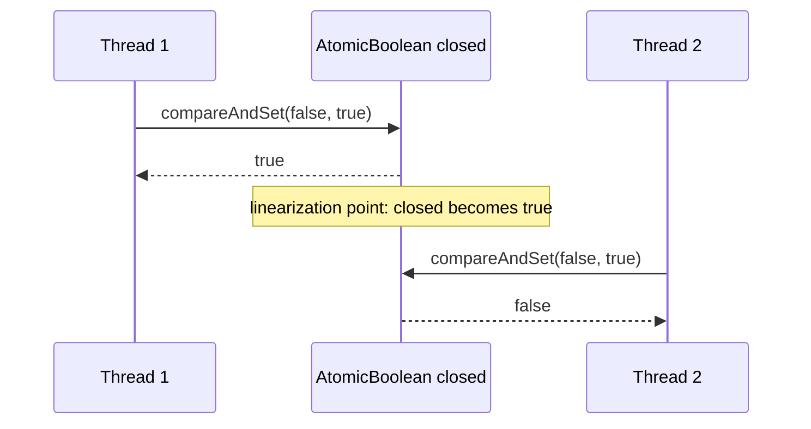
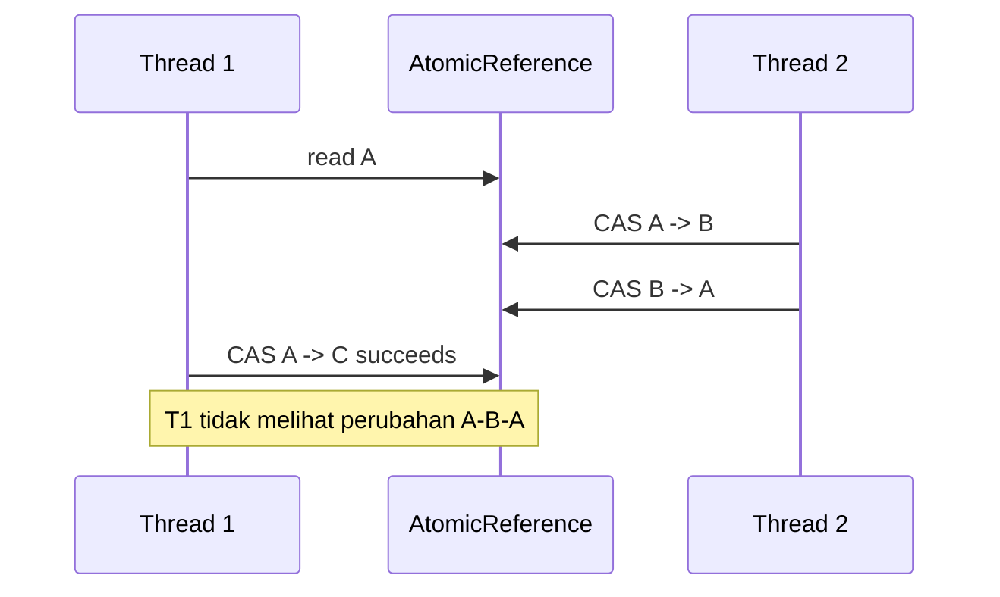
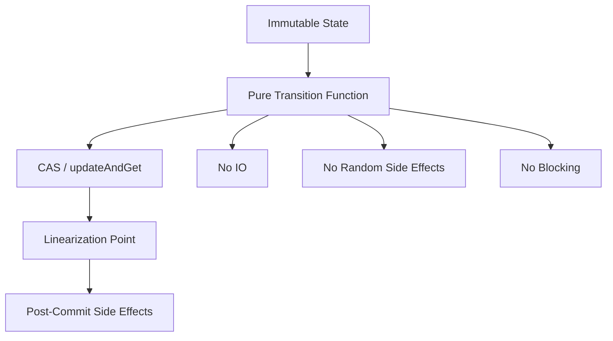

------
title: Learn Java Concurrency & Correctness - Part 016
description: Atomic classes, VarHandle, CAS, memory access modes, dan lock-free thinking untuk engineer yang ingin benar, bukan sekadar menghindari synchronized.
series: learn-java-concurrency-correctness
seriesTitle: Learn Java Concurrency & Correctness
order: 16
partTitle: Atomics, VarHandle, and Lock-Free Thinking
tags:
- java
- concurrency
- atomics
- varhandle
- lock-free
- correctness
seriesStatus: in-progress
---

# Part 016 — Atomics, VarHandle, and Lock-Free Thinking

Atomic programming adalah salah satu area Java concurrency yang paling sering membuat engineer merasa “sudah advanced”, padahal risikonya besar. `AtomicInteger`, `AtomicReference`, `LongAdder`, dan `VarHandle` memang powerful. Tetapi mereka bukan pengganti desain invariant. Mereka adalah primitive untuk membuat operasi tertentu menjadi atomic dan visible sesuai memory semantics tertentu.

Mental model utama:

> Atomic primitive aman untuk satu lokasi state atau satu reference transition. Begitu invariant melebar ke beberapa field, beberapa object, atau beberapa side effect, kompleksitas correctness naik tajam.

Part ini membangun kemampuan membaca dan menulis atomic code dengan benar: kapan atomic cukup, kapan lock lebih jelas, kapan CAS loop valid, kapan `LongAdder` cocok, kapan `VarHandle` layak dipakai, dan kapan “lock-free” justru menjadi technical debt.

---

## 1. Apa yang Diberikan Atomic Classes?

Package `java.util.concurrent.atomic` berisi toolkit untuk lock-free thread-safe programming pada single variables. Contoh paling umum:

- `AtomicBoolean`
- `AtomicInteger`
- `AtomicLong`
- `AtomicReference<T>`
- `AtomicIntegerArray`, `AtomicLongArray`, `AtomicReferenceArray`
- `AtomicMarkableReference<T>`
- `AtomicStampedReference<T>`
- `LongAdder`
- `LongAccumulator`
- `DoubleAdder`
- `DoubleAccumulator`

Atomic classes memberi operasi seperti:

```java
counter.incrementAndGet();
reference.compareAndSet(expected, updated);
flag.getAndSet(true);
value.updateAndGet(current -> transform(current));
```

Tujuannya bukan “lebih cepat dari lock” secara universal. Tujuannya adalah membuat operasi kecil dapat dijalankan atomik tanpa explicit lock.

---

## 2. Atomicity Boundary

Atomic operation punya boundary sempit.

```java
AtomicInteger count = new AtomicInteger();
count.incrementAndGet();
```

Operasi increment atomic. Tetapi ini tidak otomatis membuat logic berikut benar:

```java
if (count.get() < limit) {
    count.incrementAndGet();
    allow();
}
```

Itu masih check-then-act race.

Versi lebih benar:

```java
public boolean tryAcquireSlot(AtomicInteger used, int limit) {
    while (true) {
        int current = used.get();
        if (current >= limit) {
            return false;
        }
        if (used.compareAndSet(current, current + 1)) {
            return true;
        }
    }
}
```

Di sini linearization point-nya adalah `compareAndSet` yang berhasil.

---

## 3. Linearization Point

Dalam concurrent object, linearization point adalah titik tunggal ketika operasi dianggap “terjadi” secara atomik dari sudut pandang thread lain.

Contoh:

```java
public boolean close() {
    return closed.compareAndSet(false, true);
}
```

Jika `compareAndSet(false, true)` berhasil, di titik itu object berpindah dari open ke closed. Semua side effect setelah itu harus dipahami sebagai konsekuensi setelah state closed.



Jika Anda tidak bisa menunjuk linearization point, atomic design Anda kemungkinan belum matang.

---

## 4. CAS Mental Model

CAS berarti compare-and-set:

1. baca nilai saat ini;
2. bandingkan dengan nilai yang diharapkan;
3. jika masih sama, update ke nilai baru secara atomik;
4. jika sudah berubah, gagal dan caller memutuskan retry/give up.

Pseudo-model:

```java
boolean compareAndSet(expected, updated) {
    atomic {
        if (value == expected) {
            value = updated;
            return true;
        }
        return false;
    }
}
```

CAS loop umum:

```java
public int incrementBelowLimit(AtomicInteger value, int limit) {
    while (true) {
        int current = value.get();
        if (current >= limit) {
            return current;
        }

        int next = current + 1;
        if (value.compareAndSet(current, next)) {
            return next;
        }
    }
}
```

CAS failure bukan exception. CAS failure adalah sinyal bahwa thread lain menang race dan kita harus membaca state baru.

---

## 5. CAS Loop Failure Modes

CAS loop terlihat sederhana, tetapi production failure-nya nyata.

### 5.1 High Contention Spin

Jika banyak thread mencoba update variable yang sama, CAS sering gagal. CPU bisa habis untuk retry.

```java
while (!ref.compareAndSet(expected, updated)) {
    expected = ref.get();
    updated = transform(expected);
}
```

Mitigasi:

- kurangi shared hotspot;
- shard state;
- gunakan `LongAdder` untuk counter metrics;
- tambahkan backoff jika perlu;
- gunakan lock jika contention tinggi dan critical section jelas;
- ubah desain menjadi single-writer.

### 5.2 Expensive Transform Repeated

```java
state.updateAndGet(current -> expensiveTransform(current));
```

Function bisa dievaluasi lebih dari sekali saat contention. Jangan letakkan side effect di transform function.

Bad:

```java
state.updateAndGet(current -> {
    auditLog.write("transition"); // side effect dangerous
    return current.next();
});
```

Better:

```java
State previous;
State next;

do {
    previous = state.get();
    next = previous.next();
} while (!state.compareAndSet(previous, next));

auditLog.write("transition from " + previous.version() + " to " + next.version());
```

Masih perlu idempotency jika audit write gagal, tetapi setidaknya side effect tidak terjadi pada CAS retry yang gagal.

### 5.3 Unbounded Retry

Lock-free tidak berarti setiap thread cepat selesai. Dalam beberapa algorithm, satu thread bisa terus kalah.

Jika fairness atau bounded latency penting, lock bisa lebih tepat.

---

## 6. AtomicReference untuk Immutable State Machine

Salah satu pattern paling kuat adalah menyimpan seluruh state kecil dalam immutable record, lalu transition menggunakan `AtomicReference`.

```java
record CircuitBreakerState(
        Mode mode,
        int failures,
        Instant openedAt
) {
    CircuitBreakerState onSuccess() {
        return new CircuitBreakerState(Mode.CLOSED, 0, null);
    }

    CircuitBreakerState onFailure(int threshold, Instant now) {
        int nextFailures = failures + 1;
        if (nextFailures >= threshold) {
            return new CircuitBreakerState(Mode.OPEN, nextFailures, now);
        }
        return new CircuitBreakerState(mode, nextFailures, openedAt);
    }
}

enum Mode {
    CLOSED,
    OPEN,
    HALF_OPEN
}
```

```java
public final class CircuitBreaker {
    private final int threshold;
    private final AtomicReference<CircuitBreakerState> state;

    public CircuitBreaker(int threshold) {
        this.threshold = threshold;
        this.state = new AtomicReference<>(new CircuitBreakerState(Mode.CLOSED, 0, null));
    }

    public void recordFailure(Instant now) {
        state.updateAndGet(current -> current.onFailure(threshold, now));
    }

    public void recordSuccess() {
        state.updateAndGet(CircuitBreakerState::onSuccess);
    }

    public CircuitBreakerState snapshot() {
        return state.get();
    }
}
```

Kelebihan:

- beberapa field berubah atomik sebagai satu reference;
- snapshot mudah;
- no partial update;
- transition logic bisa dites tanpa concurrency;
- tidak perlu lock untuk state kecil.

Batas:

- transform harus pure;
- state jangan terlalu besar;
- side effect harus di luar CAS loop;
- contention tinggi bisa membuat retry mahal.

---

## 7. Atomic Classes vs Volatile

`volatile` memberi visibility dan ordering tertentu untuk satu variable. Tetapi operasi compound tetap tidak atomic.

```java
private volatile int count;

public void increment() {
    count++; // read, add, write; not atomic
}
```

Gunakan atomic:

```java
private final AtomicInteger count = new AtomicInteger();

public void increment() {
    count.incrementAndGet();
}
```

Perbandingan:

| Kebutuhan | `volatile` | Atomic |
|---|---:|---:|
| publish flag | cocok | cocok |
| latest config reference | cocok | cocok |
| increment counter | tidak cukup | cocok |
| compare-and-transition | tidak cukup | cocok |
| immutable state swap | bisa dengan volatile write, tetapi CAS tidak ada | cocok |
| multi-field invariant | tidak cukup sendiri | hanya jika dikemas jadi satu immutable reference |

Rule:

> Gunakan `volatile` untuk visibility sederhana. Gunakan atomic saat Anda butuh read-modify-write atau conditional transition.

---

## 8. LongAdder dan LongAccumulator

`LongAdder` didesain untuk update counter dengan contention tinggi. Alih-alih semua thread update satu lokasi atomic yang sama, ia dapat menyebar update ke beberapa cell internal dan menjumlahkannya saat `sum()`.

Cocok untuk:

- metrics;
- counters high-throughput;
- request count;
- per-error histogram;
- observability under contention.

Tidak cocok untuk:

- strict quota;
- sequence number;
- unique ID;
- exactly consistent balance;
- admission control yang butuh atomic read+increment.

Contoh cocok:

```java
public final class HttpMetrics {
    private final LongAdder requests = new LongAdder();
    private final LongAdder failures = new LongAdder();

    public void recordSuccess() {
        requests.increment();
    }

    public void recordFailure() {
        requests.increment();
        failures.increment();
    }

    public double failureRatio() {
        long total = requests.sum();
        if (total == 0) {
            return 0.0;
        }
        return failures.sum() / (double) total;
    }
}
```

`failureRatio()` adalah approximate view saat update berjalan. Untuk dashboard bagus. Untuk billing tidak cukup.

`LongAccumulator` cocok untuk associative accumulation:

```java
LongAccumulator maxLatencyMillis = new LongAccumulator(Long::max, 0);
maxLatencyMillis.accumulate(duration.toMillis());
```

---

## 9. ABA Problem

ABA problem terjadi ketika sebuah value berubah dari A ke B lalu kembali ke A. CAS melihat value sama dengan expected A dan menganggap tidak berubah, padahal ada perubahan di tengah.



ABA penting jika identitas atau riwayat perubahan bermakna. Contoh:

- lock-free stack;
- free list;
- object pool;
- state transition yang harus mendeteksi generation;
- resource handle reuse.

Mitigasi:

1. sertakan version/generation dalam immutable state;
2. gunakan `AtomicStampedReference`;
3. gunakan `AtomicMarkableReference` jika hanya perlu mark bit;
4. hindari object reuse yang membuat identity kembali sama;
5. gunakan lock jika algorithm terlalu rumit.

Pattern versioned state:

```java
record VersionedState(long version, Status status) {
    VersionedState transitionTo(Status next) {
        return new VersionedState(version + 1, next);
    }
}
```

Dengan begitu A versi 1, B versi 2, A versi 3 tidak sama.

---

## 10. AtomicStampedReference dan AtomicMarkableReference

`AtomicStampedReference<T>` menyimpan reference plus stamp integer. Ini berguna saat Anda perlu mendeteksi perubahan walau reference kembali sama.

```java
AtomicStampedReference<Node> head = new AtomicStampedReference<>(initialNode, 0);

int[] stampHolder = new int[1];
Node current = head.get(stampHolder);
int currentStamp = stampHolder[0];

boolean updated = head.compareAndSet(
        current,
        newNode,
        currentStamp,
        currentStamp + 1
);
```

`AtomicMarkableReference<T>` menyimpan reference plus boolean mark. Ini sering dipakai untuk algorithm yang perlu menandai logical deletion.

Untuk business application biasa, immutable record dengan explicit `version` sering lebih readable daripada stamped reference.

---

## 11. VarHandle: Apa dan Kapan Dipakai

`VarHandle` adalah reference yang strongly typed ke variable, seperti field static, field instance, array element, atau struktur tertentu. Ia menyediakan access modes seperti plain, opaque, acquire/release, volatile, dan atomic compare/set operations.

Atomic classes modern sendiri dibangun di atas konsep operasi yang tersedia lewat `VarHandle`.

Kapan memakai `VarHandle`?

- Anda membangun low-level concurrency primitive;
- Anda butuh atomic operation pada field tanpa wrapper allocation;
- Anda mengoptimalkan library internal yang sangat hot;
- Anda perlu access mode spesifik seperti release/acquire;
- Anda mengimplementasikan data structure concurrent.

Kapan tidak memakai `VarHandle`?

- business service biasa;
- state machine domain yang bisa memakai lock/atomic reference;
- team belum nyaman dengan memory ordering;
- readability lebih penting daripada micro-optimization;
- correctness bisa dicapai dengan `AtomicReference` atau `ReentrantLock`.

---

## 12. VarHandle Basic Example

```java
import java.lang.invoke.MethodHandles;
import java.lang.invoke.VarHandle;

public final class VarHandleCounter {
    private volatile int value;

    private static final VarHandle VALUE;

    static {
        try {
            VALUE = MethodHandles.lookup().findVarHandle(
                    VarHandleCounter.class,
                    "value",
                    int.class
            );
        } catch (ReflectiveOperationException e) {
            throw new ExceptionInInitializerError(e);
        }
    }

    public int incrementAndGet() {
        while (true) {
            int current = (int) VALUE.getVolatile(this);
            int next = current + 1;
            if (VALUE.compareAndSet(this, current, next)) {
                return next;
            }
        }
    }

    public int get() {
        return (int) VALUE.getVolatile(this);
    }
}
```

Untuk kode aplikasi, `AtomicInteger` jauh lebih jelas:

```java
private final AtomicInteger value = new AtomicInteger();
```

Gunakan `VarHandle` saat Anda punya alasan kuat, bukan untuk terlihat advanced.

---

## 13. Memory Access Modes: Plain, Opaque, Acquire/Release, Volatile

`VarHandle` membuka pilihan memory semantics yang lebih halus. Ini powerful tetapi rawan disalahgunakan.

Simplifikasi mental model:

| Mode | Intuisi | Kapan relevan |
|---|---|---|
| Plain | seperti akses field biasa | bukan untuk coordination concurrent |
| Opaque | ordering paling lemah yang tetap coherent per variable | low-level algorithms |
| Acquire read | read yang mencegah operasi setelahnya bergerak sebelum read | consumer side publication |
| Release write | write yang mencegah operasi sebelumnya bergerak setelah write | producer side publication |
| Volatile | ordering/visibility kuat seperti volatile | general coordination lebih aman |
| CAS/compareExchange | conditional atomic transition | lock-free update |

Untuk sebagian besar engineer aplikasi:

1. gunakan `volatile`/atomic classes dulu;
2. gunakan acquire/release hanya jika Anda benar-benar memahami publication protocol;
3. dokumentasikan pairing release-write dan acquire-read;
4. test dengan stress testing;
5. hindari mencampur mode tanpa alasan.

---

## 14. Release/Acquire Publication Example

Contoh konseptual:

```java
public final class OneSlot<T> {
    private T item;
    private boolean available;

    private static final VarHandle ITEM;
    private static final VarHandle AVAILABLE;

    static {
        try {
            MethodHandles.Lookup lookup = MethodHandles.lookup();
            ITEM = lookup.findVarHandle(OneSlot.class, "item", Object.class);
            AVAILABLE = lookup.findVarHandle(OneSlot.class, "available", boolean.class);
        } catch (ReflectiveOperationException e) {
            throw new ExceptionInInitializerError(e);
        }
    }

    public void publish(T value) {
        ITEM.set(this, value);                  // plain write item first
        AVAILABLE.setRelease(this, true);       // release publishes previous writes
    }

    @SuppressWarnings("unchecked")
    public T consumeIfAvailable() {
        boolean seen = (boolean) AVAILABLE.getAcquire(this);
        if (!seen) {
            return null;
        }
        return (T) ITEM.get(this);              // visible after acquire
    }
}
```

Ini contoh edukasi, bukan rekomendasi membuat queue sendiri. Production queue jauh lebih sulit: perlu multi-producer, multi-consumer, reset state, ABA, false sharing, cancellation, backpressure, dan shutdown.

---

## 15. Lock-Free, Wait-Free, Obstruction-Free

Istilah ini sering dicampur.

| Istilah | Makna ringkas |
|---|---|
| Blocking | thread bisa berhenti menunggu lock/condition/IO |
| Lock-free | system secara keseluruhan terus progress; satu thread individual bisa starvation |
| Wait-free | setiap thread menyelesaikan operasi dalam batas langkah tertentu |
| Obstruction-free | progress jika thread berjalan sendiri tanpa interference |

Atomic code biasa dengan CAS loop sering lock-free, tetapi tidak wait-free.

Jangan menjual lock-free sebagai otomatis:

- lebih cepat;
- lebih adil;
- lebih mudah debug;
- lebih aman;
- lebih cocok untuk business invariants.

Lock-free adalah trade-off. Ia mengurangi blocking, tetapi meningkatkan complexity.

---

## 16. Lock vs Atomic Decision Matrix

| Situasi | Pilihan lebih masuk akal |
|---|---|
| satu counter sederhana | `AtomicLong` atau `LongAdder` |
| high-contention metric counter | `LongAdder` |
| single flag close/open | `AtomicBoolean` atau `volatile` |
| immutable small state transition | `AtomicReference<State>` |
| multi-field invariant dengan critical section kecil | `ReentrantLock` atau `synchronized` |
| operation melibatkan IO | jangan di CAS loop; pisahkan atau pakai lock/pipeline |
| fairness penting | lock fair atau queueing design |
| bounded latency per thread penting | lock-free belum tentu cukup |
| algorithm sulit direview | lock lebih baik |
| library low-level hot path | atomic/VarHandle bisa layak |

Rule keras:

> Jika atomic code tidak bisa dijelaskan dengan invariant dan linearization point yang jelas, gunakan lock atau redesign.

---

## 17. Idempotency dan Side Effect di Atomic Transition

Atomic transition hanya mengatur memory state lokal. Ia tidak otomatis membuat side effect eksternal atomic.

Bad:

```java
if (closed.compareAndSet(false, true)) {
    remoteSystem.closeAccount(accountId);
    audit.write("closed");
}
```

Masalah:

- state lokal closed, tetapi remote call bisa gagal;
- audit bisa gagal setelah remote berhasil;
- retry bisa melihat closed true lalu melewati remote close;
- system menjadi partially updated.

Better model:

```java
enum ClosePhase {
    OPEN,
    CLOSE_REQUESTED,
    REMOTE_CLOSED,
    AUDITED,
    FAILED
}
```

Atomic state transition hanya mencatat fase. Side effect dijalankan oleh workflow yang idempotent dan retryable.

```java
boolean requested = state.compareAndSet(ClosePhase.OPEN, ClosePhase.CLOSE_REQUESTED);
if (requested) {
    closeWorker.enqueue(accountId);
}
```

Prinsip:

> CAS cocok untuk state transition lokal. Distributed side effect tetap butuh workflow, idempotency, retry, dan reconciliation.

---

## 18. False Sharing dan Contention Awareness

Atomic variable yang sering diupdate banyak thread bisa menjadi bottleneck karena cache-line contention. Bahkan jika operation lock-free, hardware tetap harus mengkoordinasikan ownership cache line.

Gejala:

- CPU tinggi;
- throughput tidak naik saat thread ditambah;
- perf bottleneck di atomic update;
- latency p99 naik;
- flame graph menunjukkan CAS/retry/spin overhead.

Mitigasi:

- shard counter per key/thread/core;
- gunakan `LongAdder` untuk metrics;
- batch update;
- single-writer aggregation;
- kurangi sharing;
- ubah model dari write-shared menjadi message-passing.

Atomic bukan magic. Atomic hotspot tetap hotspot.

---

## 19. Backoff Strategy

CAS retry ketat bisa membakar CPU.

```java
while (true) {
    State current = ref.get();
    State next = transform(current);
    if (ref.compareAndSet(current, next)) {
        return next;
    }
}
```

Dalam contention tinggi, pertimbangkan:

```java
int failures = 0;
while (true) {
    State current = ref.get();
    State next = transform(current);
    if (ref.compareAndSet(current, next)) {
        return next;
    }

    failures++;
    if (failures < 10) {
        Thread.onSpinWait();
    } else if (failures < 20) {
        Thread.yield();
    } else {
        LockSupport.parkNanos(Duration.ofMicros(10).toNanos());
    }
}
```

Ini bukan resep universal. Backoff harus diukur. Kadang solusi terbaik adalah tidak membuat semua thread berebut satu atomic variable.

---

## 20. Thread.onSpinWait

`Thread.onSpinWait()` memberi hint bahwa thread sedang spin-wait. JVM/platform bisa mengoptimalkan power/performance untuk spin loop.

Gunakan hanya untuk spin yang memang pendek dan low-level.

Bad untuk aplikasi umum:

```java
while (!ready.get()) {
    Thread.onSpinWait();
}
```

Jika ready bisa lama, gunakan blocking primitive seperti `CountDownLatch`, `Condition`, `BlockingQueue`, atau `CompletableFuture`.

Spin-wait cocok untuk:

- very short wait;
- low-level queue/ring buffer;
- handoff micro-optimization;
- library internals dengan benchmark kuat.

---

## 21. Atomic Field Updaters

Atomic field updater seperti `AtomicIntegerFieldUpdater<T>` memungkinkan atomic update pada volatile field tertentu tanpa membuat wrapper object per instance.

Contoh:

```java
public final class TaskState {
    @SuppressWarnings("unused")
    private volatile int status;

    private static final AtomicIntegerFieldUpdater<TaskState> STATUS =
            AtomicIntegerFieldUpdater.newUpdater(TaskState.class, "status");

    public boolean markStarted() {
        return STATUS.compareAndSet(this, 0, 1);
    }
}
```

Namun, untuk kode modern, `VarHandle` sering menjadi primitive yang lebih fleksibel. Untuk aplikasi biasa, `AtomicInteger`/`AtomicReference` lebih readable.

Gunakan updater jika:

- jumlah instance sangat besar;
- allocation wrapper signifikan;
- field layout penting;
- Anda membuat library/data structure.

---

## 22. Designing Atomic State Machines

Atomic state machine yang baik punya struktur berikut:



Contoh state machine close:

```java
record ResourceState(boolean open, long version) {
    ResourceState close() {
        if (!open) {
            return this;
        }
        return new ResourceState(false, version + 1);
    }
}
```

```java
public final class Resource {
    private final AtomicReference<ResourceState> state =
            new AtomicReference<>(new ResourceState(true, 0));

    public boolean close() {
        while (true) {
            ResourceState current = state.get();
            ResourceState next = current.close();

            if (current == next) {
                return false;
            }

            if (state.compareAndSet(current, next)) {
                cleanupAfterClose();
                return true;
            }
        }
    }

    private void cleanupAfterClose() {
        // Must be idempotent or only called by successful closer.
    }
}
```

Catatan: `cleanupAfterClose` terjadi setelah state closed. Jika cleanup gagal, object sudah closed. Itu harus menjadi contract yang disengaja.

---

## 23. Common Anti-Patterns

### 23.1 Atomic Counter untuk Quota Kompleks

```java
if (used.get() < max) {
    used.incrementAndGet();
    return true;
}
return false;
```

Race. Pakai CAS loop atau semaphore.

### 23.2 Side Effect dalam Update Function

```java
ref.updateAndGet(state -> {
    email.send(...);
    return state.next();
});
```

Function bisa retry. Email bisa terkirim berkali-kali.

### 23.3 AtomicReference ke Mutable Object

```java
AtomicReference<List<String>> ref = new AtomicReference<>(new ArrayList<>());
ref.get().add("x");
```

Reference atomic. List tidak aman.

Better:

```java
ref.updateAndGet(current -> {
    var next = new ArrayList<>(current);
    next.add("x");
    return List.copyOf(next);
});
```

### 23.4 Lock-Free untuk Semua Hal

Atomic code sulit direview. Jika invariant lebih mudah dijelaskan dengan lock, pakai lock.

### 23.5 Menggunakan LongAdder untuk Exact Limit

```java
if (requests.sum() < limit) {
    requests.increment();
    allow();
}
```

Salah untuk strict limit. `sum()` bukan boundary atomic read+increment.

### 23.6 Mengabaikan ABA

Jika state identity bisa kembali ke nilai lama, CAS bisa false confidence. Tambahkan version/stamp.

---

## 24. Testing Atomic Code

Atomic code perlu diuji berbeda dari kode single-thread.

### 24.1 Test Pure Transition Terlebih Dahulu

```java
@Test
void failureOpensCircuitAtThreshold() {
    var initial = new CircuitBreakerState(Mode.CLOSED, 2, null);
    var next = initial.onFailure(3, Instant.EPOCH);

    assertEquals(Mode.OPEN, next.mode());
    assertEquals(3, next.failures());
}
```

### 24.2 Stress Test Invariant

```java
@Test
void neverExceedsLimit() throws Exception {
    AtomicInteger used = new AtomicInteger();
    int limit = 100;
    int threads = 32;
    ExecutorService executor = Executors.newFixedThreadPool(threads);

    CountDownLatch start = new CountDownLatch(1);
    CountDownLatch done = new CountDownLatch(threads);
    AtomicInteger successes = new AtomicInteger();

    for (int i = 0; i < threads; i++) {
        executor.submit(() -> {
            try {
                start.await();
                for (int j = 0; j < 1_000; j++) {
                    if (tryAcquireSlot(used, limit)) {
                        successes.incrementAndGet();
                    }
                }
            } catch (InterruptedException e) {
                Thread.currentThread().interrupt();
            } finally {
                done.countDown();
            }
        });
    }

    start.countDown();
    assertTrue(done.await(10, TimeUnit.SECONDS));
    assertEquals(limit, successes.get());
    executor.shutdownNow();
}
```

Stress test bukan bukti formal, tetapi membantu menemukan bug obvious. Part 033 nanti akan membahas testing concurrent code lebih dalam, termasuk model JCStress-style thinking.

---

## 25. Observability for Atomic Hotspots

Atomic contention sering tidak terlihat dari log aplikasi.

Pantau:

- CPU usage;
- p99 latency;
- throughput vs thread count;
- failed CAS attempts jika Anda expose metric;
- queue length around atomic bottleneck;
- allocation dari immutable CAS state;
- GC pressure;
- flame graph;
- JFR events terkait CPU/lock/thread scheduling.

Untuk custom CAS loop, tambahkan metric retry:

```java
private final LongAdder casFailures = new LongAdder();

public State transition(UnaryOperator<State> transition) {
    while (true) {
        State current = ref.get();
        State next = transition.apply(current);
        if (ref.compareAndSet(current, next)) {
            return next;
        }
        casFailures.increment();
    }
}
```

Jika CAS failure tinggi, jangan langsung micro-optimize. Tanyakan apakah shared state bisa dipecah.

---

## 26. Production Review Checklist

Sebelum menerima atomic/VarHandle code, jawab:

### Correctness

- Apa invariant yang dijaga?
- Apa linearization point?
- Apakah invariant hanya satu variable/reference?
- Jika multi-field, apakah dikemas dalam immutable state?
- Apakah ABA mungkin?
- Apakah transition function pure?

### Failure

- Apa yang terjadi jika CAS retry terus?
- Apa yang terjadi jika side effect setelah CAS gagal?
- Apakah side effect idempotent?
- Apakah exception policy jelas?
- Apakah thread bisa spin terlalu lama?

### Performance

- Apakah variable menjadi contention hotspot?
- Apakah `LongAdder` lebih cocok?
- Apakah allocation dari immutable state acceptable?
- Apakah lock lebih cepat/lebih jelas di contention aktual?

### Maintainability

- Bisakah engineer lain mereview ini?
- Apakah memory semantics didokumentasikan?
- Apakah ada test stress?
- Apakah `VarHandle` benar-benar perlu?
- Apakah lock/pipeline lebih sederhana?

---

## 27. Deliberate Practice

### Drill 1 — Find the Linearization Point

Ambil satu class yang memakai `AtomicBoolean`, `AtomicInteger`, atau `AtomicReference`. Tulis komentar:

```java
// Linearization point: successful compareAndSet from X to Y.
```

Jika tidak bisa menunjuk titiknya, desain belum jelas.

### Drill 2 — Refactor Mutable AtomicReference

Ubah:

```java
AtomicReference<ArrayList<Event>> events;
```

menjadi:

```java
AtomicReference<List<Event>> events;
```

dengan update immutable copy.

### Drill 3 — LongAdder Classification

Untuk setiap `LongAdder`, labeli:

- metrics only;
- approximate operational signal;
- incorrectly used for correctness.

Jika kategori ketiga ditemukan, redesign.

### Drill 4 — Replace CAS with Lock

Ambil CAS loop yang rumit. Tulis versi `ReentrantLock`-nya. Bandingkan:

- correctness clarity;
- performance expectation;
- failure handling;
- reviewability.

Tujuannya bukan selalu memakai lock, tetapi memastikan atomic code memang layak.

---

## 28. Ringkasan

Atomic dan `VarHandle` adalah primitive kuat untuk concurrency correctness, tetapi scope-nya sempit.

Prinsip utama:

1. atomic operation harus punya linearization point jelas;
2. CAS failure adalah normal, bukan exceptional;
3. update function harus pure dan bebas side effect;
4. `AtomicReference<ImmutableState>` adalah pattern kuat untuk state kecil;
5. `LongAdder` bagus untuk high-contention metrics, bukan strict quota;
6. ABA perlu version/stamp jika riwayat perubahan bermakna;
7. `VarHandle` cocok untuk library/low-level code, bukan default aplikasi;
8. lock-free tidak berarti wait-free, fair, atau lebih sederhana;
9. side effect eksternal butuh idempotency/workflow, bukan hanya CAS;
10. jika atomic code sulit dijelaskan, lock atau redesign sering lebih benar.

Part berikutnya akan masuk ke `ExecutorService` dan lifecycle task: bagaimana task masuk, berjalan, gagal, dibatalkan, ditolak, dan dihentikan secara production-safe.

---

## References

- Java SE 25 API — `java.util.concurrent.atomic`: https://docs.oracle.com/en/java/javase/25/docs/api/java.base/java/util/concurrent/atomic/package-summary.html
- Java SE 25 API — `VarHandle`: https://docs.oracle.com/en/java/javase/25/docs/api/java.base/java/lang/invoke/VarHandle.html
- Java SE 25 API — `Thread.onSpinWait`: https://docs.oracle.com/en/java/javase/25/docs/api/java.base/java/lang/Thread.html#onSpinWait()
