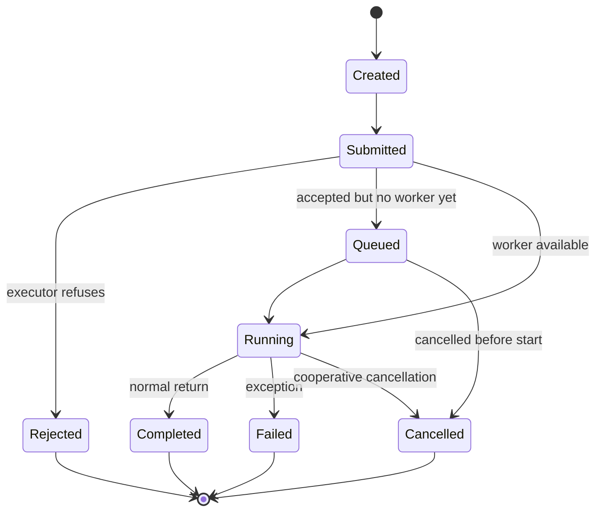
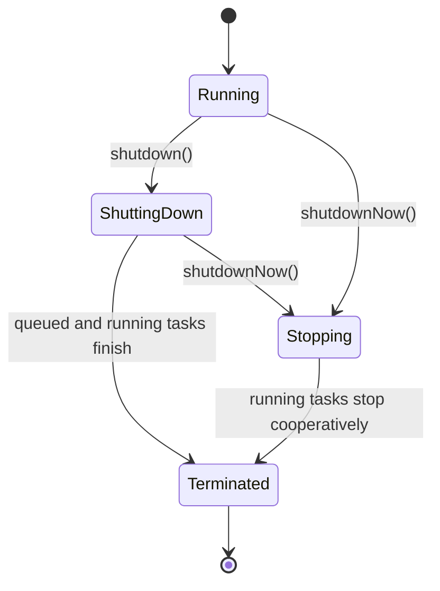

------
title: Learn Java Concurrency & Correctness - Part 017
description: ExecutorService, task lifecycle, Future, shutdown, cancellation, rejection, dan kontrak task production-grade di Java modern.
series: learn-java-concurrency-correctness
seriesTitle: Learn Java Concurrency & Correctness
order: 17
partTitle: ExecutorService and Task Lifecycle
tags:
- java
- concurrency
- executorservice
- future
- task-lifecycle
- correctness
seriesStatus: in-progress
---

# Part 017 — ExecutorService and Task Lifecycle

Di part sebelumnya kita sudah membahas shared state, memory model, locks, synchronizers, blocking queues, concurrent collections, dan atomics. Sekarang kita naik ke level yang lebih dekat dengan production service: **bagaimana pekerjaan dieksekusi**.

Banyak engineer memakai `ExecutorService` sebagai “cara menjalankan task paralel”. Itu terlalu dangkal. `ExecutorService` adalah boundary antara caller dan execution environment. Ia mengatur task admission, scheduling, queueing, execution, failure capture, cancellation, shutdown, dan observability.

Mental model utama:

> Thread adalah worker. Task adalah unit pekerjaan. Executor adalah kontrak penyerahan pekerjaan. ExecutorService adalah lifecycle manager untuk pekerjaan tersebut.

Kalau boundary ini kabur, bug production biasanya muncul sebagai:

- request menggantung karena task tidak pernah selesai;
- exception hilang karena disimpan di `Future` tetapi tidak pernah dibaca;
- shutdown service lama atau tidak pernah selesai;
- queue tumbuh tanpa batas;
- task tetap berjalan setelah caller timeout;
- cancellation tidak bekerja karena task mengabaikan interruption;
- thread pool deadlock karena task menunggu task lain di pool yang sama;
- context/security/MDC bocor antar task.

Part ini membangun mental model lengkap untuk `ExecutorService` dan lifecycle task sebelum kita masuk ke thread pool engineering di Part 018.

---

## 1. Dari Thread Manual ke Executor

Java memungkinkan membuat thread langsung:

```java
Thread thread = new Thread(() -> processJob(job));
thread.start();
```

Ini berguna untuk belajar, tetapi buruk sebagai default production design karena caller langsung mencampur:

1. definisi pekerjaan;
2. pembuatan thread;
3. naming thread;
4. exception handling;
5. resource control;
6. shutdown;
7. observability;
8. concurrency limit.

`Executor` memisahkan definisi pekerjaan dari cara menjalankannya:

```java
Executor executor = command -> new Thread(command).start();
executor.execute(() -> processJob(job));
```

Tetapi `Executor` terlalu minimal. Ia hanya punya:

```java
void execute(Runnable command);
```

`ExecutorService` menambahkan lifecycle:

- submit task dan dapat `Future`;
- shutdown;
- await termination;
- batch execution;
- cancellation via `Future`.

```java
ExecutorService executor = Executors.newFixedThreadPool(8);
Future<Result> future = executor.submit(() -> process(job));
```

Dari perspektif desain, `ExecutorService` adalah **execution boundary**.

---

## 2. Task vs Thread vs Workload

Jangan menyamakan task dengan thread.

| Konsep | Makna | Contoh |
|---|---|---|
| Task | Unit pekerjaan logis | validate case, fetch customer profile, calculate risk score |
| Thread | Eksekutor runtime | platform thread atau virtual thread |
| Workload | Pola beban | CPU-bound, IO-bound, blocking, bursty, latency-sensitive |
| Executor | Boundary penyerahan task | fixed pool, virtual-thread-per-task executor, scheduled executor |
| Queue | Buffer sebelum task dijalankan | bounded queue, unbounded queue, synchronous handoff |

Task yang sama bisa dieksekusi oleh model berbeda:

```java
Runnable task = () -> enrichCase(caseId);

platformThreadPool.submit(task);
virtualThreadExecutor.submit(task);
directExecutor.execute(task); // menjalankan di caller thread
```

Correctness task tidak boleh bergantung pada “kebetulan” thread tertentu, kecuali kontraknya memang single-thread confinement.

---

## 3. Lifecycle Task

Task tidak hanya “jalan atau tidak jalan”. Dalam sistem nyata, task melewati beberapa state.



Lifecycle ini penting karena setiap state memiliki failure mode berbeda.

| State | Pertanyaan correctness |
|---|---|
| Created | Apakah task immutable? Apakah input sudah dipublikasi aman? |
| Submitted | Apakah admission bisa gagal? Apakah caller siap menerima rejection? |
| Queued | Berapa lama boleh menunggu? Apakah queue bounded? |
| Running | Apakah task interruptible? Apakah side effect idempotent? |
| Completed | Apakah result dikonsumsi? Apakah resource dibersihkan? |
| Failed | Apakah exception terlihat? Apakah retry aman? |
| Cancelled | Apakah cancellation menghentikan kerja nyata atau hanya mengganti status `Future`? |
| Rejected | Apakah rejection menjadi backpressure, fallback, atau data loss? |

Top 1% engineer tidak hanya bertanya “pakai executor apa?”, tetapi “apa kontrak lifecycle task ini?”.

---

## 4. `Runnable` vs `Callable`

`Runnable` tidak mengembalikan nilai dan tidak mendeklarasikan checked exception.

```java
Runnable task = () -> audit("CASE_APPROVED");
```

`Callable<V>` mengembalikan value dan dapat melempar exception.

```java
Callable<RiskScore> task = () -> riskClient.score(caseId);
```

Gunakan mental model berikut:

| Kebutuhan | Bentuk task |
|---|---|
| fire-and-observe side effect | `Runnable` plus explicit failure reporting |
| menghasilkan value | `Callable<V>` |
| butuh exception dikirim ke caller | `Callable<V>` via `Future.get()` |
| pipeline async/composition | nanti `CompletableFuture` atau structured concurrency |

Kesalahan umum:

```java
executor.submit(() -> {
    riskyOperation();
});
```

Jika caller tidak menyimpan dan membaca `Future`, exception dari task bisa tidak pernah terlihat oleh caller.

---

## 5. `execute()` vs `submit()`

`Executor.execute(Runnable)` menjalankan command tanpa `Future`.

```java
executor.execute(() -> sendAuditEvent(event));
```

`ExecutorService.submit(...)` mengembalikan `Future`.

```java
Future<?> future = executor.submit(() -> sendAuditEvent(event));
```

Perbedaannya sangat penting untuk failure visibility.

### 5.1 Dengan `execute()`

Jika task melempar unchecked exception, exception biasanya mencapai worker thread dan ditangani oleh `UncaughtExceptionHandler` atau mekanisme executor.

```java
executor.execute(() -> {
    throw new IllegalStateException("boom");
});
```

Pada `ThreadPoolExecutor`, worker bisa menangkap failure untuk menjaga pool tetap hidup, tetapi exception tetap terlihat pada jalur uncaught/logging tertentu tergantung konfigurasi.

### 5.2 Dengan `submit()`

`submit()` menangkap exception dan menyimpannya di `Future`.

```java
Future<?> future = executor.submit(() -> {
    throw new IllegalStateException("boom");
});

future.get(); // ExecutionException wrapping IllegalStateException
```

Jika `future.get()` tidak pernah dipanggil, failure bisa menjadi silent failure dari sudut pandang business flow.

### 5.3 Rule Praktis

Gunakan `submit()` jika caller akan melakukan salah satu dari ini:

- menunggu hasil;
- membaca exception;
- membatalkan task;
- menggabungkan beberapa task;
- menaruh timeout pada hasil.

Gunakan `execute()` untuk fire-and-forget hanya jika task punya failure reporting sendiri.

```java
executor.execute(() -> {
    try {
        sendAuditEvent(event);
    } catch (Exception e) {
        auditFailureCounter.increment();
        log.error("Failed to send audit event: eventId={}", event.id(), e);
    }
});
```

Fire-and-forget tanpa observability adalah data loss yang tertunda.

---

## 6. `Future` Mental Model

`Future<V>` merepresentasikan hasil computation yang mungkin belum selesai.

Operasi utama:

```java
boolean done = future.isDone();
boolean cancelled = future.isCancelled();
V value = future.get();
V valueWithTimeout = future.get(500, TimeUnit.MILLISECONDS);
boolean cancelledNow = future.cancel(true);
```

`Future` bukan promise compositional seperti `CompletableFuture`. Ia lebih seperti handle ke task.

| Method | Makna |
|---|---|
| `get()` | tunggu sampai selesai, gagal, atau cancelled |
| `get(timeout, unit)` | tunggu terbatas |
| `cancel(mayInterruptIfRunning)` | minta pembatalan |
| `isDone()` | selesai dalam bentuk apapun |
| `isCancelled()` | selesai karena cancellation |

### 6.1 `Future.get()` dan Exception

```java
try {
    RiskScore score = future.get(300, TimeUnit.MILLISECONDS);
} catch (TimeoutException e) {
    future.cancel(true);
    throw new RiskTimeoutException(caseId, e);
} catch (ExecutionException e) {
    Throwable cause = e.getCause();
    throw mapFailure(cause);
} catch (InterruptedException e) {
    Thread.currentThread().interrupt();
    throw new RequestInterruptedException(e);
}
```

Perhatikan tiga prinsip:

1. timeout harus dipasangkan dengan cancellation policy;
2. `ExecutionException` harus dibuka dan dipetakan;
3. `InterruptedException` harus memulihkan interrupt status.

Anti-pattern:

```java
try {
    return future.get();
} catch (Exception e) {
    return fallback();
}
```

Kode ini menyamakan timeout, cancellation, interruption, dan business failure. Itu buruk untuk diagnosis dan correctness.

---

## 7. Cancellation Itu Cooperative

`future.cancel(true)` bukan magic kill.

```java
boolean accepted = future.cancel(true);
```

Maknanya:

- jika task belum mulai, executor dapat mencegah task berjalan;
- jika task sedang berjalan dan `mayInterruptIfRunning=true`, thread worker akan di-interrupt;
- task hanya berhenti jika ia merespons interruption atau mengecek cancellation condition;
- operasi blocking tertentu merespons interrupt, tetapi tidak semua operasi eksternal otomatis berhenti.

Task yang benar harus cooperative.

```java
final class ReportGenerationTask implements Callable<Report> {
    private final ReportRepository repository;
    private final List<String> ids;

    ReportGenerationTask(ReportRepository repository, List<String> ids) {
        this.repository = repository;
        this.ids = List.copyOf(ids);
    }

    @Override
    public Report call() throws Exception {
        ReportBuilder builder = new ReportBuilder();

        for (String id : ids) {
            if (Thread.currentThread().isInterrupted()) {
                throw new InterruptedException("Report generation interrupted");
            }

            builder.add(repository.load(id));
        }

        return builder.build();
    }
}
```

Jika task berisi loop panjang tanpa interrupt check, cancellation hampir tidak berguna.

---

## 8. Interruption Policy

Setiap task production perlu interruption policy.

Pertanyaan minimum:

1. Apakah task boleh dihentikan di tengah jalan?
2. Jika berhenti, side effect apa yang sudah terjadi?
3. Apakah side effect idempotent?
4. Apakah partial state perlu cleanup?
5. Apakah caller mendapat status cancelled, timeout, atau failed?
6. Apakah interrupt status dipertahankan?

Contoh pola benar untuk catching interruption:

```java
try {
    queue.put(command);
} catch (InterruptedException e) {
    Thread.currentThread().interrupt();
    throw new CommandSubmissionInterruptedException(command.id(), e);
}
```

Contoh buruk:

```java
try {
    queue.put(command);
} catch (InterruptedException ignored) {
}
```

Mengabaikan interrupt bisa membuat shutdown macet dan membuat parent scope salah memahami state worker.

---

## 9. Timeout Bukan Cancellation

Timeout pada caller tidak selalu menghentikan task.

```java
try {
    return future.get(200, TimeUnit.MILLISECONDS);
} catch (TimeoutException e) {
    return fallback();
}
```

Kode di atas mengembalikan fallback, tetapi task masih bisa berjalan di background. Itu bisa aman atau berbahaya tergantung side effect.

Versi lebih eksplisit:

```java
try {
    return future.get(200, TimeUnit.MILLISECONDS);
} catch (TimeoutException e) {
    boolean cancelRequested = future.cancel(true);
    log.warn("Task timed out: caseId={}, cancelRequested={}", caseId, cancelRequested);
    throw new ExternalDependencyTimeoutException(caseId, e);
}
```

Namun `cancel(true)` tetap cooperative. Jika task sedang blocking pada library yang tidak interruptible, thread dapat tetap sibuk.

Kontrak yang sehat:

> Caller timeout harus diselaraskan dengan task cancellation, dependency timeout, dan cleanup policy.

---

## 10. Task Design: Immutable Input

Task sering berjalan setelah caller melanjutkan eksekusi. Jangan biarkan task membaca object mutable yang masih dimodifikasi caller.

Anti-pattern:

```java
List<String> ids = new ArrayList<>();
ids.add("A");

executor.submit(() -> process(ids));

ids.add("B"); // race terhadap task
```

Lebih benar:

```java
List<String> snapshot = List.copyOf(ids);
executor.submit(() -> process(snapshot));
```

Aturan:

- capture immutable values;
- hindari capture mutable builder;
- hindari capture request object yang lifecycle-nya dimiliki framework;
- hindari capture ORM entity/session/context;
- pastikan semua dependency task thread-safe atau task-confined.

---

## 11. Task Design: Ownership dan Side Effects

Task concurrent tidak hanya membaca state; ia sering mengubah sistem.

Contoh side effect:

- update database;
- publish event;
- write file;
- call external API;
- mutate in-memory cache;
- increment metric;
- send email.

Untuk setiap side effect, tentukan:

| Pertanyaan | Mengapa penting |
|---|---|
| Apakah side effect idempotent? | retry/cancellation dapat menyebabkan duplicate |
| Apakah side effect transactional? | failure setengah jalan bisa merusak invariant |
| Apakah urutan antar task penting? | executor pool tidak menjamin ordering umum |
| Apakah resource terbatas? | pool bisa menekan DB/API terlalu keras |
| Apakah observability cukup? | failure async sering tidak terlihat di request log |

Contoh task yang eksplisit:

```java
final class CaseEscalationTask implements Callable<EscalationResult> {
    private final UUID commandId;
    private final String caseId;
    private final CaseEscalationService service;

    CaseEscalationTask(UUID commandId, String caseId, CaseEscalationService service) {
        this.commandId = commandId;
        this.caseId = caseId;
        this.service = service;
    }

    @Override
    public EscalationResult call() throws Exception {
        return service.escalate(commandId, caseId);
    }
}
```

`commandId` membantu idempotency. `caseId` immutable. Dependency adalah service thread-safe.

---

## 12. Submission Contract

Submitting task adalah admission decision.

```java
Future<Result> future = executor.submit(task);
```

Pertanyaan yang harus dijawab:

1. Jika executor sudah shutdown, apa yang terjadi?
2. Jika queue penuh, apa policy?
3. Apakah caller boleh block saat submit?
4. Apakah caller boleh menerima rejection?
5. Apakah task boleh didrop?
6. Apakah task harus persisted sebelum submit?

Dalam `ThreadPoolExecutor`, rejection terjadi ketika executor tidak dapat menerima task, misalnya karena sudah shutdown atau saturated sesuai konfigurasi.

Jangan treat `submit()` sebagai operasi yang selalu berhasil.

```java
try {
    executor.submit(task);
} catch (RejectedExecutionException e) {
    rejectedCounter.increment();
    throw new ServiceOverloadedException("Escalation worker is overloaded", e);
}
```

Untuk command penting, strategi lebih aman adalah persist dulu, lalu worker mengambil dari durable queue. Executor in-memory bukan durable work queue.

---

## 13. Rejection Is Backpressure

`RejectedExecutionException` bukan sekadar error teknis. Ia adalah sinyal bahwa execution boundary menolak pekerjaan.

Kemungkinan respons:

| Situasi | Respons yang masuk akal |
|---|---|
| request online latency-sensitive | return 429/503 atau fallback |
| background best-effort | drop dengan metric eksplisit |
| critical command | persist ke durable queue, jangan hanya submit ke memory |
| internal fan-out | reduce fan-out atau run in caller dengan hati-hati |
| shutdown | reject sebagai lifecycle state normal |

Anti-pattern:

```java
catch (RejectedExecutionException ignored) {
    // silently drop
}
```

Silent rejection adalah data loss.

---

## 14. Shutdown Lifecycle

Executor harus dimatikan dengan benar. Jika tidak, JVM bisa tetap hidup, resource bocor, atau work hilang.

Lifecycle umum:



`shutdown()`:

- tidak menerima task baru;
- task yang sudah submitted tetap dijalankan;
- method return segera.

`shutdownNow()`:

- mencoba menghentikan running tasks via interruption;
- mengembalikan task yang belum mulai;
- tidak menjamin task running benar-benar berhenti.

`awaitTermination()`:

- menunggu executor terminated sampai timeout.

---

## 15. Shutdown Pattern yang Aman

Pola umum:

```java
public static void shutdownGracefully(
        ExecutorService executor,
        Duration gracefulTimeout,
        Duration forcedTimeout
) {
    executor.shutdown();

    try {
        if (!executor.awaitTermination(gracefulTimeout.toMillis(), TimeUnit.MILLISECONDS)) {
            List<Runnable> dropped = executor.shutdownNow();
            log.warn("Forced executor shutdown; queuedTasks={}", dropped.size());

            if (!executor.awaitTermination(forcedTimeout.toMillis(), TimeUnit.MILLISECONDS)) {
                log.error("Executor did not terminate after forced shutdown");
            }
        }
    } catch (InterruptedException e) {
        List<Runnable> dropped = executor.shutdownNow();
        log.warn("Interrupted during executor shutdown; queuedTasks={}", dropped.size());
        Thread.currentThread().interrupt();
    }
}
```

Prinsipnya:

1. stop admission;
2. beri waktu task selesai;
3. minta stop paksa via interrupt;
4. tunggu lagi;
5. jika caller interrupted, restore interrupt;
6. log queued tasks yang tidak dijalankan.

---

## 16. AutoCloseable Executor di Java Modern

Pada Java modern, `ExecutorService` adalah `AutoCloseable`. Ini membuat executor dapat dipakai dalam `try-with-resources` untuk scope yang jelas.

```java
try (ExecutorService executor = Executors.newVirtualThreadPerTaskExecutor()) {
    Future<User> user = executor.submit(() -> userClient.fetch(userId));
    Future<RiskScore> risk = executor.submit(() -> riskClient.score(userId));

    return new EnrichedUser(user.get(), risk.get());
}
```

Tetapi hati-hati: `close()` menunggu task selesai sesuai kontrak executor. Jika task macet, scope juga macet. Karena itu timeout/cancellation tetap harus didesain.

Untuk structured concurrency yang lebih kuat, kita akan bahas di Part 026. `ExecutorService` memberi lifecycle executor, tetapi belum memodelkan parent-child task tree sejelas structured concurrency.

---

## 17. Batch APIs: `invokeAll` dan `invokeAny`

`invokeAll` menjalankan sekumpulan `Callable` dan mengembalikan list `Future` ketika semuanya selesai atau timeout.

```java
List<Callable<CheckResult>> checks = List.of(
    () -> sanctionsCheck(caseId),
    () -> creditCheck(caseId),
    () -> fraudCheck(caseId)
);

List<Future<CheckResult>> futures = executor.invokeAll(checks, 800, TimeUnit.MILLISECONDS);

for (Future<CheckResult> future : futures) {
    if (future.isCancelled()) {
        throw new CheckTimeoutException(caseId);
    }
    results.add(future.get());
}
```

`invokeAny` mengembalikan hasil pertama yang sukses, dan task lain dapat dibatalkan oleh implementation.

```java
String quote = executor.invokeAny(List.of(
    () -> providerA.quote(symbol),
    () -> providerB.quote(symbol),
    () -> providerC.quote(symbol)
), 300, TimeUnit.MILLISECONDS);
```

Gunakan dengan hati-hati. Jika side effect task tidak idempotent, menjalankan banyak task untuk mengambil hasil pertama bisa menimbulkan duplicate side effect.

---

## 18. ThreadFactory: Naming, Daemon, Uncaught Failure

Default thread name sering tidak cukup untuk production debugging.

Gunakan `ThreadFactory`.

```java
public final class NamedThreadFactory implements ThreadFactory {
    private final AtomicInteger sequence = new AtomicInteger();
    private final String prefix;

    public NamedThreadFactory(String prefix) {
        this.prefix = Objects.requireNonNull(prefix);
    }

    @Override
    public Thread newThread(Runnable runnable) {
        Thread thread = new Thread(runnable);
        thread.setName(prefix + "-" + sequence.incrementAndGet());
        thread.setUncaughtExceptionHandler((t, e) ->
            log.error("Uncaught failure in thread {}", t.getName(), e)
        );
        return thread;
    }
}
```

Gunakan nama yang menggambarkan workload:

- `case-escalation-worker-1`
- `risk-score-io-3`
- `audit-publisher-2`
- `report-cpu-7`

Jangan gunakan nama generik seperti `pool-1-thread-3` di sistem besar.

---

## 19. Context Propagation Problem

Task async sering butuh context:

- correlation ID;
- request ID;
- tenant ID;
- authenticated principal;
- locale;
- deadline;
- tracing span;
- MDC logging context.

Masalahnya: `ThreadLocal` context tidak otomatis aman berpindah antar executor task. Pada platform thread pool, thread dipakai ulang sehingga context bisa bocor jika tidak dibersihkan.

Anti-pattern:

```java
MDC.put("caseId", caseId);
executor.submit(() -> process(caseId));
// MDC belum tentu ada di worker thread
```

Lebih eksplisit:

```java
Map<String, String> contextMap = MDC.getCopyOfContextMap();

executor.submit(() -> {
    Map<String, String> previous = MDC.getCopyOfContextMap();
    try {
        if (contextMap != null) {
            MDC.setContextMap(contextMap);
        } else {
            MDC.clear();
        }
        process(caseId);
    } finally {
        if (previous != null) {
            MDC.setContextMap(previous);
        } else {
            MDC.clear();
        }
    }
});
```

Ini verbose, tetapi menunjukkan invariant penting:

> Context yang dipasang di worker harus dilepas atau dipulihkan.

Scoped values dan structured concurrency akan memberi model yang lebih baik untuk beberapa kasus di part lanjutan.

---

## 20. Task Wrapper untuk Observability

Dalam production, jangan submit task mentah tanpa observability untuk workload penting.

Contoh wrapper:

```java
public final class ObservedCallable<V> implements Callable<V> {
    private final String operation;
    private final Callable<V> delegate;

    public ObservedCallable(String operation, Callable<V> delegate) {
        this.operation = operation;
        this.delegate = delegate;
    }

    @Override
    public V call() throws Exception {
        long started = System.nanoTime();
        try {
            V result = delegate.call();
            Metrics.timer(operation + ".success").record(System.nanoTime() - started);
            return result;
        } catch (Exception e) {
            Metrics.counter(operation + ".failure").increment();
            throw e;
        }
    }
}
```

Gunakan wrapper untuk:

- latency;
- success/failure;
- timeout;
- cancellation;
- queue wait time;
- context propagation;
- tracing;
- naming logical task.

Queue wait time tidak terlihat jika hanya mengukur durasi `call()`. Untuk mengukur queue wait, timestamp harus dibuat sebelum submit.

```java
public final class QueuedCallable<V> implements Callable<V> {
    private final long submittedAtNanos = System.nanoTime();
    private final Callable<V> delegate;

    public QueuedCallable(Callable<V> delegate) {
        this.delegate = delegate;
    }

    @Override
    public V call() throws Exception {
        long queueWaitNanos = System.nanoTime() - submittedAtNanos;
        Metrics.timer("executor.queue.wait").record(queueWaitNanos);
        return delegate.call();
    }
}
```

---

## 21. `ExecutorCompletionService`

Jika Anda submit banyak task dan ingin mengambil hasil sesuai urutan selesai, bukan urutan submit, gunakan `ExecutorCompletionService`.

```java
ExecutorCompletionService<CheckResult> completion = new ExecutorCompletionService<>(executor);

for (Check check : checks) {
    completion.submit(() -> check.run(caseId));
}

for (int i = 0; i < checks.size(); i++) {
    Future<CheckResult> completed = completion.take();
    results.add(completed.get());
}
```

Ini berguna untuk fan-out/fan-in sederhana.

Namun tetap harus memikirkan:

- timeout total;
- cancellation task yang belum selesai;
- partial failure policy;
- side effect policy;
- executor saturation.

Contoh dengan timeout global:

```java
List<Future<CheckResult>> submitted = new ArrayList<>();
ExecutorCompletionService<CheckResult> completion = new ExecutorCompletionService<>(executor);

for (Check check : checks) {
    submitted.add(completion.submit(() -> check.run(caseId)));
}

long deadline = System.nanoTime() + TimeUnit.MILLISECONDS.toNanos(800);
try {
    for (int i = 0; i < checks.size(); i++) {
        long remaining = deadline - System.nanoTime();
        if (remaining <= 0) {
            throw new TimeoutException("checks timed out");
        }

        Future<CheckResult> completed = completion.poll(remaining, TimeUnit.NANOSECONDS);
        if (completed == null) {
            throw new TimeoutException("checks timed out");
        }
        results.add(completed.get());
    }
} finally {
    for (Future<CheckResult> future : submitted) {
        if (!future.isDone()) {
            future.cancel(true);
        }
    }
}
```

---

## 22. ExecutorService Bukan Structured Concurrency

Dengan plain `ExecutorService`, task parent-child tidak otomatis terstruktur.

```java
Future<A> a = executor.submit(this::callA);
Future<B> b = executor.submit(this::callB);

return combine(a.get(), b.get());
```

Masalah:

- jika `a.get()` gagal, apakah `b` dibatalkan?
- jika caller interrupted, apakah kedua task dibatalkan?
- jika `b` timeout, apakah `a` tetap jalan?
- siapa pemilik lifecycle dua child task?

Dengan plain executor, semua policy itu harus ditulis manual.

Structured concurrency bertujuan membuat child tasks hidup dalam scope parent yang jelas. Kita akan bahas khusus di Part 026. Untuk saat ini, pahami bahwa `ExecutorService` adalah primitive lifecycle executor, bukan otomatis structured task tree.

---

## 23. Executor dan Virtual Threads

Java modern menyediakan executor yang membuat virtual thread per task:

```java
try (ExecutorService executor = Executors.newVirtualThreadPerTaskExecutor()) {
    Future<String> a = executor.submit(() -> serviceA.call());
    Future<String> b = executor.submit(() -> serviceB.call());
    return combine(a.get(), b.get());
}
```

Mental model penting:

- virtual thread membuat blocking code lebih scalable untuk banyak IO-bound tasks;
- virtual thread bukan alasan mengabaikan cancellation, timeout, safe publication, atau side effect semantics;
- virtual-thread-per-task executor tidak sama dengan “pool virtual thread”; virtual threads murah dan tidak perlu dipool untuk menghemat thread;
- resource eksternal tetap perlu limit, misalnya DB connection, API quota, file descriptor.

Contoh limit resource dengan semaphore:

```java
Semaphore permits = new Semaphore(50);

try (ExecutorService executor = Executors.newVirtualThreadPerTaskExecutor()) {
    List<Future<Response>> futures = requests.stream()
        .map(request -> executor.submit(() -> {
            if (!permits.tryAcquire(200, TimeUnit.MILLISECONDS)) {
                throw new ServiceOverloadedException("too many outbound calls");
            }
            try {
                return client.call(request);
            } finally {
                permits.release();
            }
        }))
        .toList();
}
```

Virtual threads mengubah cost model thread, bukan kapasitas database, network dependency, atau downstream service.

---

## 24. Direct Executor untuk Test dan Boundary Kecil

Kadang kita butuh executor yang menjalankan task langsung di caller thread.

```java
Executor direct = Runnable::run;
```

Ini berguna untuk test deterministik atau konfigurasi synchronous.

```java
class AsyncNotifier {
    private final Executor executor;

    AsyncNotifier(Executor executor) {
        this.executor = executor;
    }

    void notify(CaseEvent event) {
        executor.execute(() -> send(event));
    }
}
```

Test:

```java
AsyncNotifier notifier = new AsyncNotifier(Runnable::run);
notifier.notify(event);

assertThat(fakeSender.sentEvents()).containsExactly(event);
```

Namun jangan menyalahgunakan direct executor untuk task yang mungkin blocking lama di production, karena caller thread akan tertahan.

---

## 25. Common Failure Modes

### 25.1 Silent Exception dengan `submit()`

```java
executor.submit(() -> riskyOperation());
```

Tidak ada `Future.get()`, tidak ada logging wrapper, failure hilang.

Perbaikan:

```java
executor.submit(new ObservedCallable<>("riskyOperation", () -> {
    riskyOperation();
    return null;
}));
```

Atau gunakan `execute()` plus explicit try/catch.

### 25.2 Task Tidak Interruptible

```java
while (!done) {
    doSmallWork();
}
```

Perbaikan:

```java
while (!done && !Thread.currentThread().isInterrupted()) {
    doSmallWork();
}
```

### 25.3 Future Timeout Tanpa Cancel

```java
future.get(100, TimeUnit.MILLISECONDS);
```

Jika timeout, task tetap jalan.

Perbaikan:

```java
try {
    return future.get(100, TimeUnit.MILLISECONDS);
} catch (TimeoutException e) {
    future.cancel(true);
    throw e;
}
```

### 25.4 Executor Tidak Pernah Shutdown

```java
ExecutorService executor = Executors.newFixedThreadPool(4);
executor.submit(task);
```

Tanpa shutdown, thread non-daemon dapat menjaga JVM tetap hidup.

Perbaikan:

```java
ExecutorService executor = Executors.newFixedThreadPool(4);
try {
    executor.submit(task).get();
} finally {
    shutdownGracefully(executor, Duration.ofSeconds(5), Duration.ofSeconds(5));
}
```

### 25.5 Context Leak

```java
MDC.put("tenant", tenant);
executor.submit(task);
```

Jika worker thread pool menyimpan MDC lama, request berikutnya bisa mewarisi context salah.

Perbaikan: capture/restore/clear context secara eksplisit.

---

## 26. Production Checklist untuk Task

Sebelum submit task ke executor, jawab checklist ini.

### 26.1 Input

- Apakah input immutable atau snapshot?
- Apakah object yang di-capture masih dimodifikasi caller?
- Apakah dependency task thread-safe?
- Apakah ORM/session/request object bocor ke worker?

### 26.2 Lifecycle

- Apakah task bisa ditolak?
- Apakah rejection ditangani?
- Apakah queue wait time dimonitor?
- Apakah task punya timeout?
- Apakah task bisa dibatalkan?
- Apakah cancellation menghentikan kerja nyata?

### 26.3 Failure

- Apakah exception terlihat?
- Apakah `Future` selalu dikonsumsi?
- Apakah fire-and-forget punya logging/metric?
- Apakah retry idempotent?
- Apakah partial side effect aman?

### 26.4 Shutdown

- Siapa pemilik executor?
- Kapan executor shutdown?
- Berapa graceful timeout?
- Apa yang terjadi pada queued tasks saat forced shutdown?
- Apakah interruption dipertahankan?

### 26.5 Context

- Apakah correlation ID ikut task?
- Apakah tenant/security context ikut dengan benar?
- Apakah context dibersihkan setelah task?
- Apakah deadline ikut dipropagasikan?

---

## 27. Review Heuristic

Gunakan heuristic berikut saat code review.

Jika melihat:

```java
executor.submit(() -> doSomething());
```

Tanya:

1. Di mana `Future` dibaca?
2. Apa yang terjadi jika `doSomething()` throw exception?
3. Apa timeout-nya?
4. Apa cancellation policy-nya?
5. Apa yang terjadi saat executor shutdown?
6. Apakah task bisa ditolak?
7. Apakah input task immutable?
8. Apakah context benar?
9. Apakah side effect idempotent?
10. Apakah queue executor bounded?

Jika jawabannya tidak jelas, kode itu belum production-ready.

---

## 28. Mini Case Study: Async Case Enrichment

Misalkan kita ingin enrich case dengan tiga dependency:

- customer profile;
- risk score;
- sanctions status.

Versi naif:

```java
Future<CustomerProfile> profile = executor.submit(() -> profileClient.get(caseId));
Future<RiskScore> risk = executor.submit(() -> riskClient.score(caseId));
Future<SanctionsStatus> sanctions = executor.submit(() -> sanctionsClient.check(caseId));

return new EnrichedCase(profile.get(), risk.get(), sanctions.get());
```

Masalah:

- tidak ada timeout;
- jika profile gagal, risk/sanctions mungkin tetap jalan;
- jika caller interrupted, child tasks tidak dibatalkan;
- exception mapping kasar;
- context tidak jelas;
- dependency timeout tidak jelas.

Versi lebih defensif dengan plain executor:

```java
List<Future<?>> futures = new ArrayList<>();
try {
    Future<CustomerProfile> profile = executor.submit(() -> profileClient.get(caseId));
    Future<RiskScore> risk = executor.submit(() -> riskClient.score(caseId));
    Future<SanctionsStatus> sanctions = executor.submit(() -> sanctionsClient.check(caseId));

    futures.add(profile);
    futures.add(risk);
    futures.add(sanctions);

    CustomerProfile p = profile.get(300, TimeUnit.MILLISECONDS);
    RiskScore r = risk.get(300, TimeUnit.MILLISECONDS);
    SanctionsStatus s = sanctions.get(300, TimeUnit.MILLISECONDS);

    return new EnrichedCase(p, r, s);
} catch (TimeoutException e) {
    throw new EnrichmentTimeoutException(caseId, e);
} catch (ExecutionException e) {
    throw mapEnrichmentFailure(caseId, e.getCause());
} catch (InterruptedException e) {
    Thread.currentThread().interrupt();
    throw new EnrichmentInterruptedException(caseId, e);
} finally {
    for (Future<?> future : futures) {
        if (!future.isDone()) {
            future.cancel(true);
        }
    }
}
```

Ini belum sebersih structured concurrency, tetapi sudah menunjukkan lifecycle awareness.

---

## 29. Latihan Deliberate Practice

### Latihan 1 — Silent Failure Hunt

Cari semua penggunaan:

```java
executor.submit(...)
```

di codebase Anda. Untuk setiap penggunaan, klasifikasikan:

- apakah `Future` dibaca?
- apakah exception terlihat?
- apakah task fire-and-forget?
- apakah ada metric/logging?

Output: daftar task dengan risk level.

### Latihan 2 — Interruptible Task

Buat task CPU-loop yang bisa dibatalkan dengan `Future.cancel(true)`. Tambahkan test yang memastikan task selesai setelah cancellation.

### Latihan 3 — Shutdown Drill

Buat executor dengan 3 task:

1. task cepat;
2. task blocking interruptible;
3. task yang mengabaikan interrupt.

Jalankan `shutdown()` lalu `shutdownNow()`. Amati perilakunya dengan log.

### Latihan 4 — Context Propagation

Implementasikan wrapper yang capture dan restore MDC. Uji bahwa context tidak bocor antar task pada fixed thread pool.

### Latihan 5 — Rejection Contract

Buat `ThreadPoolExecutor` dengan queue kecil. Submit task sampai penuh. Rancang response untuk rejection: block, drop, fallback, atau error.

---

## 30. Ringkasan

`ExecutorService` bukan sekadar utilitas menjalankan task paralel. Ia adalah boundary lifecycle task. Engineer yang kuat harus bisa menjelaskan apa yang terjadi dari task dibuat, disubmit, queued, running, completed, failed, cancelled, rejected, sampai executor shutdown.

Prinsip utama:

- bedakan task, thread, executor, queue, dan workload;
- jangan kehilangan exception dari `submit()`;
- timeout bukan cancellation;
- cancellation bersifat cooperative;
- interruption harus dihormati;
- task input sebaiknya immutable/snapshot;
- side effect task harus punya idempotency dan failure contract;
- executor harus punya owner dan shutdown lifecycle;
- rejection adalah backpressure, bukan noise;
- context propagation harus eksplisit;
- virtual threads tidak menghapus kebutuhan lifecycle correctness.

Part berikutnya akan membahas **thread pool engineering**: sizing, queue capacity, saturation, rejection policy, CPU-bound vs IO-bound workloads, bulkhead, dan hubungan platform thread pool dengan virtual-thread-era Java.

---

## Referensi Resmi

- Java SE 25 API — `ExecutorService`: https://docs.oracle.com/en/java/javase/25/docs/api/java.base/java/util/concurrent/ExecutorService.html
- Java SE 25 API — `Executors`: https://docs.oracle.com/en/java/javase/25/docs/api/java.base/java/util/concurrent/Executors.html
- Java SE 25 API — `Future`: https://docs.oracle.com/en/java/javase/25/docs/api/java.base/java/util/concurrent/Future.html
- Java SE 25 API — `ThreadPoolExecutor`: https://docs.oracle.com/en/java/javase/25/docs/api/java.base/java/util/concurrent/ThreadPoolExecutor.html
- Java SE 25 Guide — Virtual Threads: https://docs.oracle.com/en/java/javase/25/core/virtual-threads.html
