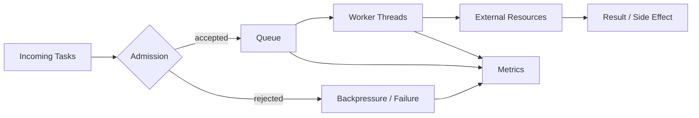
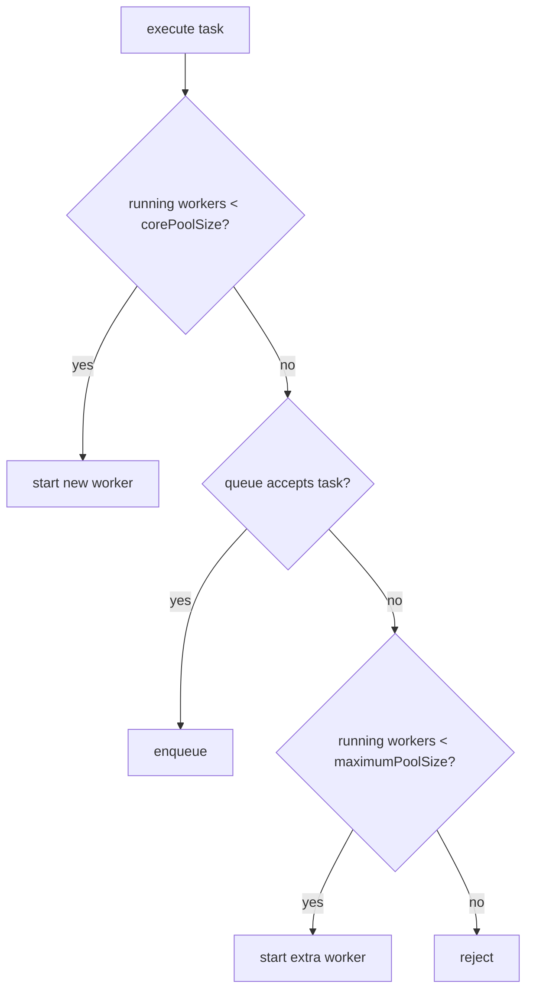
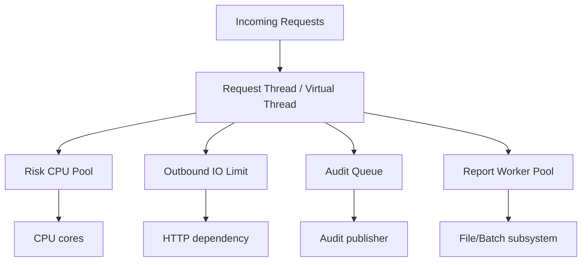
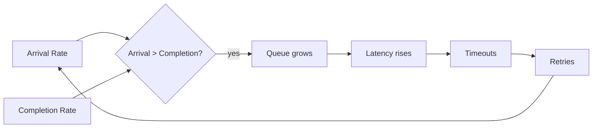
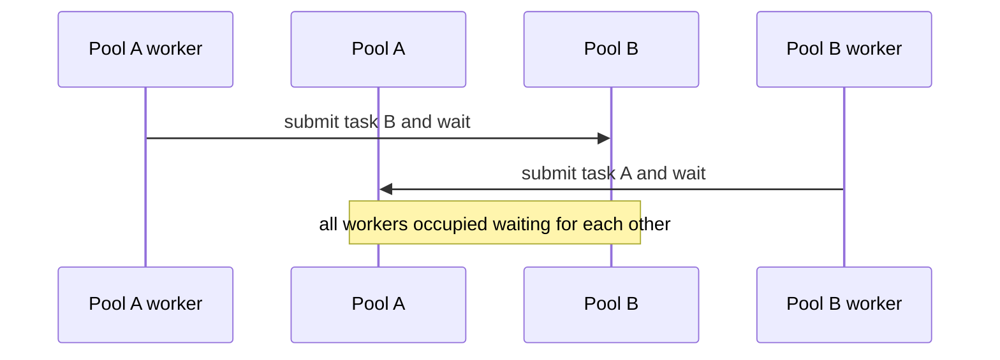
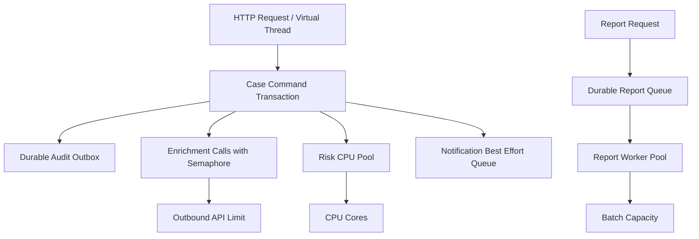

------
title: Learn Java Concurrency & Correctness - Part 018
description: Thread pool engineering untuk CPU-bound, IO-bound, blocking workloads, queue capacity, rejection policy, saturation, bulkhead, dan virtual-thread-era Java.
series: learn-java-concurrency-correctness
seriesTitle: Learn Java Concurrency & Correctness
order: 18
partTitle: Thread Pool Engineering
tags:
- java
- concurrency
- thread-pool
- executor
- performance
- correctness
seriesStatus: in-progress
---

# Part 018 — Thread Pool Engineering

Part 017 membahas lifecycle task dan `ExecutorService`. Sekarang kita masuk ke keputusan yang lebih berbahaya: **mendesain thread pool**.

Thread pool bukan sekadar angka `newFixedThreadPool(10)`. Ia adalah mekanisme admission control, scheduling, buffering, overload behavior, resource protection, latency shaping, dan failure isolation.

Mental model utama:

> Thread pool bukan alat untuk “membuat semua pekerjaan jalan”. Thread pool adalah kontrak kapasitas: pekerjaan apa yang boleh berjalan, berapa banyak, berapa lama boleh menunggu, dan apa yang terjadi saat sistem penuh.

Thread pool engineering yang buruk biasanya tidak gagal saat traffic rendah. Ia gagal saat traffic naik, dependency melambat, queue menumpuk, GC pressure meningkat, shutdown macet, atau pool saling menunggu.

---

## 1. Mengapa Thread Pool Ada?

Pada platform thread, membuat thread punya biaya:

- stack memory;
- OS scheduling;
- context switch;
- lifecycle creation/destruction;
- limit OS/JVM;
- observability overhead.

Thread pool mencoba reuse worker thread.

```java
ExecutorService executor = Executors.newFixedThreadPool(16);
```

Tetapi pooling bukan hanya optimization. Pool juga membatasi concurrency.

Jika 10.000 request memicu task blocking dan hanya 50 worker tersedia, hanya 50 task yang running; sisanya queued atau rejected tergantung konfigurasi.

Ini bisa baik jika melindungi dependency. Bisa buruk jika queue tidak bounded dan request menunggu terlalu lama.

---

## 2. Thread Pool sebagai Control System

Lihat thread pool sebagai control system.



Komponen kontrol:

| Komponen | Fungsi |
|---|---|
| pool size | berapa banyak task bisa running |
| queue | berapa banyak task boleh menunggu |
| rejection policy | apa yang terjadi saat penuh |
| keep alive | kapan thread idle dihancurkan |
| thread factory | naming, priority, daemon, failure handler |
| metrics | feedback untuk tuning |
| timeout/cancellation | mencegah work menggantung |
| bulkhead | isolasi antar workload |

Kalau Anda tidak mendefinisikan salah satu komponen ini, default akan memilihkan untuk Anda. Default sering tidak sesuai dengan reliability target.

---

## 3. `ThreadPoolExecutor` Anatomy

`ThreadPoolExecutor` adalah primitive utama untuk pool platform thread.

Constructor lengkap:

```java
ThreadPoolExecutor executor = new ThreadPoolExecutor(
    corePoolSize,
    maximumPoolSize,
    keepAliveTime,
    timeUnit,
    workQueue,
    threadFactory,
    rejectionHandler
);
```

Makna parameter:

| Parameter | Makna |
|---|---|
| `corePoolSize` | jumlah worker dasar yang dipertahankan |
| `maximumPoolSize` | batas worker maksimum |
| `keepAliveTime` | durasi thread idle sebelum dihentikan |
| `workQueue` | tempat task menunggu sebelum running |
| `threadFactory` | cara membuat thread |
| `rejectionHandler` | policy saat task tidak diterima |

Kunci pemahaman: interaksi antara pool size dan queue menentukan perilaku sebenarnya.

---

## 4. Admission Algorithm Mental Model

Secara sederhana, ketika task masuk:



Ini sering mengejutkan. Jika memakai unbounded queue, queue hampir selalu menerima task. Akibatnya `maximumPoolSize` menjadi kurang relevan karena task di-queue daripada membuat worker tambahan.

Contoh:

```java
new ThreadPoolExecutor(
    10,
    100,
    60, TimeUnit.SECONDS,
    new LinkedBlockingQueue<>()
);
```

Dengan unbounded queue, pool bisa tetap sekitar 10 worker dan queue membesar, bukannya naik ke 100 worker.

---

## 5. Jangan Mulai dari Angka, Mulai dari Workload

Pertanyaan awal bukan “berapa thread?”. Pertanyaan awal:

1. Apakah workload CPU-bound atau IO-bound?
2. Apakah task blocking?
3. Berapa latency budget?
4. Apakah task boleh queued?
5. Berapa queue wait maksimum?
6. Apakah downstream resource punya kapasitas terbatas?
7. Apa yang terjadi saat overload?
8. Apakah workload perlu ordering?
9. Apakah task bisa dibatalkan?
10. Apakah task penting/durable?

Angka thread pool adalah hasil dari model ini, bukan tebakan.

---

## 6. CPU-bound Workload

CPU-bound task menghabiskan waktu terutama pada CPU:

- compression;
- encryption/hash berat;
- image processing;
- parsing besar;
- in-memory scoring;
- simulation;
- data transformation besar.

Untuk CPU-bound workload, terlalu banyak thread bisa memperburuk throughput karena context switching dan cache contention.

Heuristic awal:

```text
threads ≈ number of available processors
```

atau sedikit lebih tinggi jika ada minor blocking.

```java
int cpu = Runtime.getRuntime().availableProcessors();
ExecutorService cpuPool = Executors.newFixedThreadPool(
    cpu,
    new NamedThreadFactory("risk-cpu")
);
```

Namun final tuning harus berdasarkan measurement.

### 6.1 CPU-bound Anti-pattern

```java
ExecutorService executor = Executors.newCachedThreadPool();
```

Untuk CPU-bound task, cached pool bisa membuat terlalu banyak thread dan merusak throughput.

### 6.2 CPU-bound Queue

Untuk CPU-bound online requests, queue panjang sering buruk. Jika CPU penuh dan queue menumpuk, latency naik tanpa memperbaiki throughput.

Gunakan queue bounded kecil dan rejection/backpressure jelas.

```java
ThreadPoolExecutor cpuPool = new ThreadPoolExecutor(
    cpu,
    cpu,
    0L, TimeUnit.MILLISECONDS,
    new ArrayBlockingQueue<>(cpu * 2),
    new NamedThreadFactory("risk-cpu"),
    new ThreadPoolExecutor.AbortPolicy()
);
```

Ini memaksa overload terlihat cepat.

---

## 7. IO-bound Workload

IO-bound task banyak menunggu:

- HTTP call;
- database query;
- filesystem;
- message broker call;
- remote service;
- cache network call.

Pada platform threads, IO-bound pool biasanya membutuhkan lebih banyak thread daripada CPU count karena banyak worker sedang blocked.

Heuristic klasik:

```text
threads ≈ cores * target_cpu_utilization * (1 + wait_time / compute_time)
```

Contoh: jika task 90 ms menunggu IO dan 10 ms CPU, rasio wait/compute = 9. Dengan 8 core dan target util 0.8:

```text
threads ≈ 8 * 0.8 * (1 + 9) = 64
```

Ini bukan hukum, hanya starting point. Validasi dengan load test.

### 7.1 IO-bound dengan Virtual Threads

Virtual threads mengubah cost model untuk blocking IO. Untuk banyak IO-bound task, Anda sering tidak perlu platform thread pool besar.

```java
try (ExecutorService executor = Executors.newVirtualThreadPerTaskExecutor()) {
    Future<Response> response = executor.submit(() -> client.call(request));
    return response.get();
}
```

Namun resource limit tetap perlu.

```java
Semaphore outboundLimit = new Semaphore(100);

Response callWithLimit(Request request) throws Exception {
    if (!outboundLimit.tryAcquire(200, TimeUnit.MILLISECONDS)) {
        throw new ServiceOverloadedException("outbound dependency saturated");
    }
    try {
        return client.call(request);
    } finally {
        outboundLimit.release();
    }
}
```

Rule:

> Pada virtual-thread-era Java, jangan pool virtual threads untuk menghemat thread. Batasi resource yang benar: DB connections, outbound calls, permits, rate, memory, dan queue.

---

## 8. Mixed Workload Adalah Red Flag

Satu pool untuk semua pekerjaan sering terlihat sederhana:

```java
ExecutorService executor = Executors.newFixedThreadPool(32);
```

Lalu dipakai untuk:

- CPU-heavy risk calculation;
- blocking HTTP calls;
- DB operations;
- audit publishing;
- file export;
- notification.

Ini membuat workload saling mengganggu.

Jika HTTP dependency melambat dan menahan 32 worker, CPU task tidak bisa jalan. Jika report export panjang, request latency ikut naik.

Solusi: isolasi workload.



Bulkhead bukan pattern mewah. Ia adalah proteksi agar satu subsistem tidak memakan kapasitas subsistem lain.

---

## 9. Queue Selection

Queue menentukan overload behavior.

| Queue | Karakter | Risiko |
|---|---|---|
| `LinkedBlockingQueue` unbounded | mudah, buffer besar | memory growth, latency tersembunyi, maxPool kurang berguna |
| `ArrayBlockingQueue` bounded | kapasitas eksplisit | perlu memilih ukuran dan rejection policy |
| `SynchronousQueue` | handoff langsung, tanpa buffer | aggressive thread growth/rejection |
| `PriorityBlockingQueue` | priority ordering | unbounded by default, starvation risk |
| `DelayQueue` | time-based scheduling | bukan general executor queue |

Untuk production online workloads, queue bounded sering lebih sehat karena overload terlihat.

---

## 10. Unbounded Queue: Bahaya yang Tenang

Factory seperti `Executors.newFixedThreadPool(n)` menggunakan queue unbounded dalam implementasi JDK.

```java
ExecutorService executor = Executors.newFixedThreadPool(16);
```

Konsekuensi:

- task diterima terus selama memory cukup;
- latency bisa naik diam-diam;
- memory bisa membengkak;
- caller tidak mendapat backpressure;
- overload baru terlihat saat sudah parah.

Ini bukan berarti `newFixedThreadPool` selalu salah. Tetapi untuk service latency-sensitive, unbounded queue harus dianggap keputusan sadar, bukan default tanpa pikir.

Versi lebih eksplisit:

```java
ThreadPoolExecutor executor = new ThreadPoolExecutor(
    16,
    16,
    0L, TimeUnit.MILLISECONDS,
    new ArrayBlockingQueue<>(200),
    new NamedThreadFactory("case-worker"),
    new ThreadPoolExecutor.AbortPolicy()
);
```

Sekarang kapasitas sistem jelas: 16 running + 200 waiting. Setelah itu reject.

---

## 11. Queue Capacity: Bukan “Semakin Besar Semakin Aman”

Queue besar menurunkan rejection, tetapi menaikkan latency.

Misal:

- pool bisa memproses 100 task/detik;
- queue berisi 10.000 task;
- task paling belakang menunggu sekitar 100 detik sebelum mulai.

Untuk request online, itu tidak berguna jika timeout client hanya 2 detik.

Queue capacity harus dikaitkan dengan latency budget.

```text
max_queue_size ≈ sustainable_throughput_per_second * acceptable_queue_wait_seconds
```

Jika pool memproses 200 task/detik dan queue wait maksimum 0.5 detik:

```text
queue ≈ 200 * 0.5 = 100
```

Ini heuristic awal. Monitoring item age lebih penting daripada hanya queue size.

---

## 12. Rejection Policies

`ThreadPoolExecutor` menyediakan beberapa policy bawaan:

| Policy | Perilaku | Cocok untuk |
|---|---|---|
| `AbortPolicy` | throw `RejectedExecutionException` | service yang ingin overload terlihat |
| `CallerRunsPolicy` | caller menjalankan task | backpressure sederhana, hati-hati latency |
| `DiscardPolicy` | drop diam-diam | jarang aman |
| `DiscardOldestPolicy` | drop task tertua lalu retry | priority tertentu, tetapi berisiko |

### 12.1 `AbortPolicy`

Default yang eksplisit dan sering paling aman untuk online service.

```java
new ThreadPoolExecutor.AbortPolicy()
```

Caller bisa mengubahnya menjadi HTTP 429/503, retryable failure, atau fallback.

### 12.2 `CallerRunsPolicy`

```java
new ThreadPoolExecutor.CallerRunsPolicy()
```

Ini memberi backpressure karena caller thread ikut bekerja. Tetapi hati-hati:

- jika caller adalah event loop, ini fatal;
- jika caller memegang lock, bisa deadlock/liveness issue;
- jika task lama, request latency naik;
- jika caller adalah scheduler single-thread, schedule lain tertunda.

### 12.3 Discard Policies

Drop diam-diam hampir selalu buruk untuk business command.

Jika memang best-effort, tetap harus metric.

```java
RejectedExecutionHandler handler = (task, executor) -> {
    droppedCounter.increment();
    log.warn("Dropped task due to saturation: executor={}", executor);
};
```

---

## 13. Saturation sebagai State Normal

Sistem production harus menganggap saturation sebagai state normal, bukan kejadian aneh.

Saturation terjadi ketika arrival rate lebih besar dari service rate.



Retry bisa memperparah saturation jika tidak dibatasi. Ini disebut retry storm.

Thread pool harus terhubung ke overload strategy:

- queue bounded;
- timeout pendek;
- rejection jelas;
- retry budget;
- circuit breaker;
- load shedding;
- bulkhead;
- rate limit;
- dependency-specific permits.

---

## 14. Thread Starvation Deadlock

Thread starvation deadlock terjadi ketika task dalam pool menunggu task lain yang juga butuh worker dari pool yang sama, tetapi semua worker sedang blocked.

Contoh:

```java
ExecutorService pool = Executors.newFixedThreadPool(1);

pool.submit(() -> {
    Future<String> nested = pool.submit(() -> "nested");
    return nested.get();
});
```

Satu worker menjalankan outer task. Outer task menunggu nested task. Nested task queued tetapi tidak ada worker kosong. Deadlock.

Dengan pool lebih besar, bug ini bisa hanya muncul saat traffic tinggi.

Rule:

> Jangan blocking menunggu child task di executor yang sama kecuali Anda membuktikan kapasitas, ordering, dan dependency graph aman.

Solusi:

- gunakan executor berbeda untuk nested work;
- gunakan structured concurrency;
- gunakan async composition tanpa blocking;
- hindari nested submit;
- desain work graph eksplisit.

---

## 15. Pool-to-Pool Deadlock

Lebih berbahaya: dua pool saling menunggu.



Ini sering terjadi saat service layer, async event, dan blocking bridge tercampur.

Review smell:

- task di pool A memanggil `.get()` pada future dari pool B;
- task di pool B memanggil callback ke pool A;
- kedua pool punya bounded worker;
- tidak ada timeout/cancellation.

Solusi utamanya adalah memecah dependency cycle.

---

## 16. Thread Pool vs Connection Pool

Thread pool tidak boleh didesain terpisah dari resource pool.

Contoh:

- thread pool: 100 worker;
- DB connection pool: 10 connection;
- semua task butuh DB connection.

Akibat:

- 10 task jalan dengan connection;
- 90 task blocked menunggu connection;
- worker habis;
- queue menumpuk;
- request lain yang tidak butuh DB ikut tertahan jika pool sama.

Better:

```text
DB-bound concurrency <= DB connection pool capacity
```

Atau gunakan semaphore/limiter:

```java
Semaphore dbPermits = new Semaphore(10);

<T> T withDbPermit(Callable<T> operation) throws Exception {
    if (!dbPermits.tryAcquire(100, TimeUnit.MILLISECONDS)) {
        throw new ServiceOverloadedException("DB permits exhausted");
    }
    try {
        return operation.call();
    } finally {
        dbPermits.release();
    }
}
```

Jika memakai virtual threads, prinsip ini makin penting. Anda bisa punya banyak virtual thread blocked menunggu DB, tetapi connection pool tetap bottleneck.

---

## 17. Pool Ownership

Setiap executor harus punya owner.

Pertanyaan ownership:

1. Siapa membuat executor?
2. Siapa mematikannya?
3. Apakah executor shared atau dedicated?
4. Workload apa yang boleh masuk?
5. Apakah ada naming convention?
6. Metrics apa yang diekspor?
7. Apa rejection policy?
8. Apa shutdown order?

Anti-pattern:

```java
class Service {
    void handle(Request request) {
        ExecutorService executor = Executors.newFixedThreadPool(10);
        executor.submit(() -> process(request));
    }
}
```

Ini membuat pool baru per request dan sering tidak di-shutdown.

Better:

```java
final class CaseWorker implements AutoCloseable {
    private final ThreadPoolExecutor executor;

    CaseWorker(ThreadPoolExecutor executor) {
        this.executor = executor;
    }

    Future<CaseResult> submit(CaseCommand command) {
        return executor.submit(() -> process(command));
    }

    @Override
    public void close() {
        shutdownGracefully(executor, Duration.ofSeconds(10), Duration.ofSeconds(5));
    }
}
```

---

## 18. ThreadFactory Engineering

Thread naming adalah observability primitive.

```java
ThreadFactory factory = new ThreadFactory() {
    private final AtomicInteger sequence = new AtomicInteger();

    @Override
    public Thread newThread(Runnable runnable) {
        Thread thread = new Thread(runnable);
        thread.setName("case-worker-" + sequence.incrementAndGet());
        thread.setUncaughtExceptionHandler((t, e) ->
            log.error("Uncaught exception in {}", t.getName(), e)
        );
        return thread;
    }
};
```

Pertimbangan:

- nama harus workload-specific;
- daemon thread hanya jika Anda paham shutdown semantics;
- priority jarang perlu diubah;
- uncaught exception handler membantu debugging `execute()`;
- virtual thread factory juga bisa diberi nama.

Virtual thread factory:

```java
ThreadFactory factory = Thread.ofVirtual()
    .name("outbound-vt-", 0)
    .factory();

ExecutorService executor = Executors.newThreadPerTaskExecutor(factory);
```

---

## 19. Metrics yang Wajib Ada

Untuk `ThreadPoolExecutor`, ekspor minimal:

| Metric | Makna |
|---|---|
| active threads | worker sedang menjalankan task |
| pool size | jumlah worker saat ini |
| core/max size | kapasitas konfigurasi |
| queue size | jumlah task menunggu |
| queue remaining capacity | sisa buffer |
| completed task count | throughput kasar |
| task execution time | durasi running |
| queue wait time | durasi menunggu sebelum running |
| rejection count | overload signal |
| cancellation count | task dihentikan |
| timeout count | caller tidak mendapat hasil tepat waktu |

Queue wait time sangat penting. Queue size 50 bisa aman jika task cepat, atau bencana jika task lambat.

---

## 20. Instrumented Executor Pattern

Buat wrapper untuk mencatat queue wait dan execution time.

```java
public final class InstrumentedExecutor {
    private final ThreadPoolExecutor delegate;
    private final String name;

    public InstrumentedExecutor(String name, ThreadPoolExecutor delegate) {
        this.name = name;
        this.delegate = delegate;
    }

    public Future<?> submit(Runnable command) {
        long submittedAt = System.nanoTime();
        return delegate.submit(() -> {
            long startedAt = System.nanoTime();
            Metrics.timer(name + ".queue.wait").record(startedAt - submittedAt);
            try {
                command.run();
                Metrics.counter(name + ".task.success").increment();
            } catch (RuntimeException | Error e) {
                Metrics.counter(name + ".task.failure").increment();
                throw e;
            } finally {
                Metrics.timer(name + ".task.duration").record(System.nanoTime() - startedAt);
            }
        });
    }
}
```

Untuk `Callable<V>`:

```java
public <V> Future<V> submit(Callable<V> command) {
    long submittedAt = System.nanoTime();
    return delegate.submit(() -> {
        long startedAt = System.nanoTime();
        Metrics.timer(name + ".queue.wait").record(startedAt - submittedAt);
        try {
            V result = command.call();
            Metrics.counter(name + ".task.success").increment();
            return result;
        } catch (Exception e) {
            Metrics.counter(name + ".task.failure").increment();
            throw e;
        } finally {
            Metrics.timer(name + ".task.duration").record(System.nanoTime() - startedAt);
        }
    });
}
```

---

## 21. Overload Response Matrix

| Workload | Saat pool penuh | Alasan |
|---|---|---|
| online user request | reject cepat / 503 / 429 | latency lebih penting daripada antre lama |
| regulatory command critical | persist durable lalu process async | tidak boleh hilang |
| audit best-effort | bounded queue + metric drop | jangan merusak primary flow |
| report export | queue durable + worker pool terpisah | workload panjang harus isolated |
| outbound dependency | semaphore + timeout + circuit breaker | bottleneck ada di dependency |
| CPU batch | bounded CPU pool | jangan mengganggu service request |

Jangan gunakan satu policy untuk semua workload.

---

## 22. Platform Thread Pool vs Virtual Threads

### 22.1 Platform Thread Pool

Cocok untuk:

- CPU-bound tasks;
- bounded worker model;
- legacy blocking tasks dengan resource terbatas;
- workload yang butuh fixed concurrency;
- integration dengan library yang belum ideal untuk virtual threads.

### 22.2 Virtual Thread Per Task

Cocok untuk:

- banyak blocking IO tasks;
- thread-per-request style;
- mengurangi callback/async sprawl;
- menjaga kode imperative tetap readable.

```java
try (ExecutorService executor = Executors.newVirtualThreadPerTaskExecutor()) {
    for (Request request : requests) {
        executor.submit(() -> handle(request));
    }
}
```

Tetapi jangan lupa:

- virtual thread tetap menjalankan Java code di carrier platform threads;
- CPU-bound virtual thread tetap mengonsumsi CPU;
- resource eksternal tetap harus dibatasi;
- queue/admission tetap perlu pada boundary sistem;
- cancellation/timeout tetap harus explicit.

### 22.3 Jangan “Pool Virtual Threads” sebagai Default

Ini smell:

```java
// pseudo: limiting virtual threads because "threads are expensive"
ExecutorService limitedVirtualPool = someFixedVirtualThreadPool(100);
```

Virtual threads dirancang murah dan biasanya dibuat per task. Jika butuh limit 100, tanyakan: 100 apa?

- 100 DB queries?
- 100 outbound HTTP calls?
- 100 file operations?
- 100 CPU tasks?

Limit resource tersebut secara eksplisit, bukan “pool virtual thread” secara kabur.

---

## 23. `Executors` Factory Methods: Use with Awareness

Factory methods nyaman, tetapi beberapa menyembunyikan konfigurasi penting.

| Factory | Catatan |
|---|---|
| `newFixedThreadPool(n)` | fixed workers, unbounded queue |
| `newCachedThreadPool()` | unbounded thread growth secara praktis, `SynchronousQueue` |
| `newSingleThreadExecutor()` | sequential execution, unbounded queue |
| `newScheduledThreadPool(n)` | untuk delayed/periodic task |
| `newWorkStealingPool()` | fork-join style, tidak cocok untuk semua blocking workload |
| `newVirtualThreadPerTaskExecutor()` | virtual thread baru per task, unbounded task admission |

Untuk internal platform dengan reliability target jelas, sering lebih baik menggunakan `ThreadPoolExecutor` eksplisit.

---

## 24. Single-thread Executor: Confinement atau Bottleneck?

Single-thread executor bisa berguna untuk thread confinement:

```java
ExecutorService sequencer = Executors.newSingleThreadExecutor(
    new NamedThreadFactory("case-sequencer")
);
```

Keuntungan:

- operasi sequential;
- shared state bisa confined ke satu worker;
- ordering lebih mudah.

Risiko:

- unbounded queue jika memakai factory default;
- satu task lambat menahan semua task;
- exception/failure handling tetap perlu;
- shutdown dan cancellation tetap perlu.

Jika dipakai untuk actor-like model, pastikan mailbox bounded atau durable.

---

## 25. Scheduled Thread Pool Hazards

`ScheduledExecutorService` sering dipakai untuk periodic jobs.

```java
ScheduledExecutorService scheduler = Executors.newScheduledThreadPool(2);

scheduler.scheduleAtFixedRate(
    this::refreshCache,
    0,
    1,
    TimeUnit.MINUTES
);
```

Hazards:

- task periodic yang throw exception bisa menghentikan future executions;
- task lama bisa overlap tergantung metode dan konfigurasi;
- scheduler pool terlalu kecil bisa menunda job lain;
- periodic job butuh timeout internal;
- shutdown harus jelas.

Gunakan wrapper:

```java
Runnable safeRefresh = () -> {
    try {
        refreshCache();
    } catch (Exception e) {
        log.error("Cache refresh failed", e);
        Metrics.counter("cache.refresh.failure").increment();
    }
};
```

Pilih:

- `scheduleAtFixedRate` jika ingin cadence berdasarkan waktu awal;
- `scheduleWithFixedDelay` jika ingin jeda setelah task selesai.

---

## 26. Load Test untuk Pool

Thread pool tidak bisa divalidasi hanya dengan unit test.

Load test minimum:

1. normal traffic;
2. burst traffic;
3. dependency latency naik;
4. dependency hang;
5. downstream error rate tinggi;
6. task CPU lebih berat dari estimasi;
7. shutdown saat task running;
8. cancellation banyak;
9. queue penuh;
10. retry storm.

Observasi:

- p50/p95/p99 latency;
- queue wait;
- active workers;
- rejection;
- timeout;
- CPU utilization;
- memory;
- GC;
- downstream saturation;
- thread dump saat macet.

Tuning tanpa observability adalah guesswork.

---

## 27. Tuning Playbook

### Step 1 — Klasifikasikan workload

CPU-bound, IO-bound, mixed, scheduled, batch, online, best-effort, critical.

### Step 2 — Tentukan isolation boundary

Pisahkan pool berdasarkan failure domain.

### Step 3 — Tentukan resource bottleneck

CPU? DB connection? remote API? queue memory? file descriptor?

### Step 4 — Pilih execution model

Platform thread pool, virtual thread per task, event loop, fork-join, scheduled executor.

### Step 5 — Tetapkan capacity

Pool size, queue size, permits, deadline, rate limit.

### Step 6 — Tetapkan overload behavior

Reject, caller-runs, drop measured, persist durable, fallback, shed load.

### Step 7 — Instrumentasi

Queue wait, execution time, rejections, task age, active workers, timeout.

### Step 8 — Uji failure

Dependency slow/hang, burst, shutdown, cancellation, retry.

### Step 9 — Review ulang setelah production data

Pool tuning adalah feedback loop.

---

## 28. Case Study: Regulatory Case Processing Platform

Bayangkan platform case management:

- user request membuat case;
- enrichment memanggil beberapa API;
- risk scoring CPU-heavy;
- audit event wajib;
- report export batch;
- notification best-effort.

Desain buruk:

```java
ExecutorService executor = Executors.newFixedThreadPool(50);
```

Semua workload masuk ke pool yang sama.

Desain lebih baik:



Kapasitas contoh:

| Workload | Model |
|---|---|
| HTTP request | virtual thread per request |
| enrichment IO | virtual thread + semaphore per dependency |
| risk scoring | fixed CPU pool sized near cores |
| audit | durable outbox, bukan fire-and-forget memory task |
| notification | bounded best-effort queue dengan metric drop/retry |
| report export | dedicated worker pool + durable queue |

Ini bukan hanya performance design. Ini correctness design: audit tidak hilang, CPU task tidak ditahan IO, report batch tidak merusak request latency, dan dependency slow tidak memakan semua worker.

---

## 29. Code Template: Explicit Bounded Pool

```java
public final class ExecutorFactory {
    public static ThreadPoolExecutor boundedPool(
            String name,
            int threads,
            int queueCapacity
    ) {
        return new ThreadPoolExecutor(
            threads,
            threads,
            0L,
            TimeUnit.MILLISECONDS,
            new ArrayBlockingQueue<>(queueCapacity),
            new NamedThreadFactory(name),
            (task, executor) -> {
                Metrics.counter(name + ".rejected").increment();
                throw new RejectedExecutionException(
                    "Executor saturated: name=" + name
                        + ", active=" + executor.getActiveCount()
                        + ", queue=" + executor.getQueue().size()
                );
            }
        );
    }
}
```

Usage:

```java
ThreadPoolExecutor riskPool = ExecutorFactory.boundedPool(
    "risk-cpu",
    Runtime.getRuntime().availableProcessors(),
    Runtime.getRuntime().availableProcessors() * 2
);
```

---

## 30. Code Template: Resource Limit with Virtual Threads

```java
public final class LimitedOutboundClient {
    private final Semaphore permits;
    private final OutboundClient delegate;

    public LimitedOutboundClient(int maxConcurrentCalls, OutboundClient delegate) {
        this.permits = new Semaphore(maxConcurrentCalls);
        this.delegate = delegate;
    }

    public Response call(Request request, Duration acquireTimeout) throws Exception {
        boolean acquired = permits.tryAcquire(
            acquireTimeout.toMillis(),
            TimeUnit.MILLISECONDS
        );

        if (!acquired) {
            throw new ServiceOverloadedException("Outbound call limit reached");
        }

        try {
            return delegate.call(request);
        } finally {
            permits.release();
        }
    }
}
```

Execution:

```java
try (ExecutorService executor = Executors.newVirtualThreadPerTaskExecutor()) {
    List<Future<Response>> futures = requests.stream()
        .map(request -> executor.submit(() -> client.call(request, Duration.ofMillis(100))))
        .toList();
}
```

This limits the scarce thing: outbound concurrency, not virtual thread count.

---

## 31. Anti-pattern Catalog

### 31.1 Magic Number Pool

```java
Executors.newFixedThreadPool(10);
```

Tanpa alasan kapasitas.

### 31.2 One Global Pool

Satu pool untuk semua workload. Failure domain bercampur.

### 31.3 Unbounded Queue untuk Online Requests

Latency tersembunyi sampai terlambat.

### 31.4 Cached Pool untuk CPU-bound Work

Thread explosion dan context switching.

### 31.5 Silent Discard

Task hilang tanpa metric.

### 31.6 CallerRuns di Event Loop

Event loop blocked, seluruh pipeline macet.

### 31.7 Nested `Future.get()` di Pool Sama

Thread starvation deadlock.

### 31.8 Pool Lebih Besar dari Resource Pool

100 worker menunggu 10 DB connections.

### 31.9 No Shutdown Owner

Executor hidup selamanya atau mati pada waktu salah.

### 31.10 No Queue Wait Metric

Anda hanya melihat task lambat, bukan antrean lambat.

---

## 32. Review Checklist

Saat melihat thread pool config, tanyakan:

1. Workload apa yang masuk ke pool ini?
2. Apakah workload homogen?
3. Apakah CPU-bound atau IO-bound?
4. Apa resource bottleneck-nya?
5. Mengapa ukuran pool segitu?
6. Queue bounded atau unbounded?
7. Mengapa queue capacity segitu?
8. Apa rejection policy-nya?
9. Apakah rejection dipetakan ke response yang benar?
10. Apakah task punya timeout?
11. Apakah task interruptible?
12. Apakah pool punya owner?
13. Bagaimana shutdown dilakukan?
14. Apa metric yang diekspor?
15. Apakah ada queue wait metric?
16. Apakah ada pool-to-pool blocking?
17. Apakah pool menunggu DB/API/resource lain?
18. Apakah virtual threads lebih cocok?
19. Apakah resource limiter lebih tepat daripada pool?
20. Apakah load test sudah mencakup dependency slow/hang?

---

## 33. Latihan Deliberate Practice

### Latihan 1 — Audit Executor di Codebase

Cari semua:

```java
Executors.newFixedThreadPool
Executors.newCachedThreadPool
Executors.newSingleThreadExecutor
new ThreadPoolExecutor
newVirtualThreadPerTaskExecutor
```

Untuk setiap executor, catat:

- owner;
- workload;
- pool size;
- queue type;
- rejection policy;
- shutdown;
- metrics.

### Latihan 2 — Build Bounded Pool

Implementasikan bounded executor dengan:

- named thread factory;
- bounded queue;
- custom rejection handler;
- queue wait metric;
- graceful shutdown.

### Latihan 3 — Simulasi Saturation

Buat pool 4 thread, queue 8. Submit 100 task yang masing-masing sleep 1 detik. Amati:

- accepted tasks;
- rejected tasks;
- queue size;
- latency.

Ubah queue menjadi unbounded dan bandingkan.

### Latihan 4 — Thread Starvation Deadlock

Reproduksi nested submit ke pool yang sama. Tambahkan timeout dan thread dump. Jelaskan wait graph.

### Latihan 5 — Virtual Thread + Resource Limit

Buat 1.000 virtual thread task yang memanggil fake dependency. Batasi dependency dengan semaphore 50. Buktikan bahwa concurrent call tidak pernah lebih dari 50.

---

## 34. Ringkasan

Thread pool engineering adalah capacity design. Pool bukan tempat membuang pekerjaan agar “async”. Pool harus memiliki workload jelas, capacity jelas, queue jelas, overload behavior jelas, owner jelas, dan metrics jelas.

Prinsip utama:

- mulai dari workload, bukan angka thread;
- CPU-bound pool biasanya dekat jumlah core;
- IO-bound platform pool bisa lebih besar, tetapi virtual threads sering lebih cocok untuk blocking IO modern;
- queue bounded membuat overload terlihat;
- queue besar menyembunyikan latency;
- rejection adalah bagian dari desain, bukan exception tak terduga;
- pisahkan workload dengan bulkhead;
- jangan biarkan pool menunggu pool lain tanpa analisis wait graph;
- thread pool harus diselaraskan dengan DB/API/resource pool;
- virtual threads tidak mengganti resource limit;
- metrics queue wait, rejection, dan task duration wajib ada.

Part berikutnya akan membahas **ForkJoinPool and Work Stealing**: bagaimana decomposition recursive, work stealing, common pool, blocking hazard, dan managed blocking bekerja.

---

## Referensi Resmi

- Java SE 25 API — `ThreadPoolExecutor`: https://docs.oracle.com/en/java/javase/25/docs/api/java.base/java/util/concurrent/ThreadPoolExecutor.html
- Java SE 25 API — `Executors`: https://docs.oracle.com/en/java/javase/25/docs/api/java.base/java/util/concurrent/Executors.html
- Java SE 25 API — `RejectedExecutionHandler`: https://docs.oracle.com/en/java/javase/25/docs/api/java.base/java/util/concurrent/RejectedExecutionHandler.html
- Java SE 25 API — `ScheduledThreadPoolExecutor`: https://docs.oracle.com/en/java/javase/25/docs/api/java.base/java/util/concurrent/ScheduledThreadPoolExecutor.html
- Java SE 25 Guide — Virtual Threads: https://docs.oracle.com/en/java/javase/25/core/virtual-threads.html
