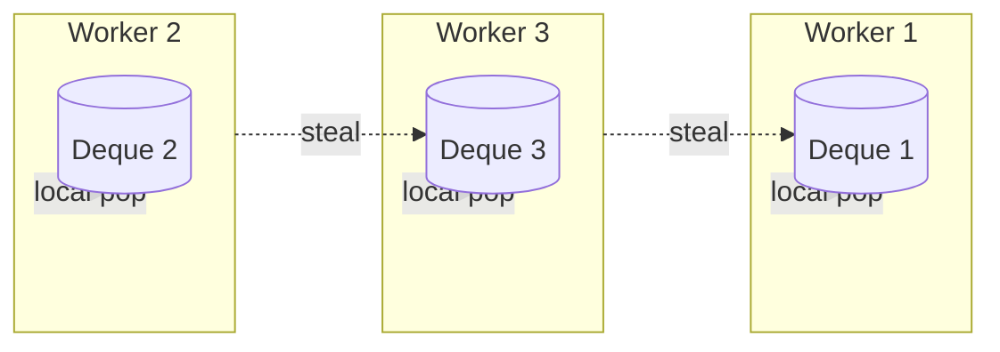
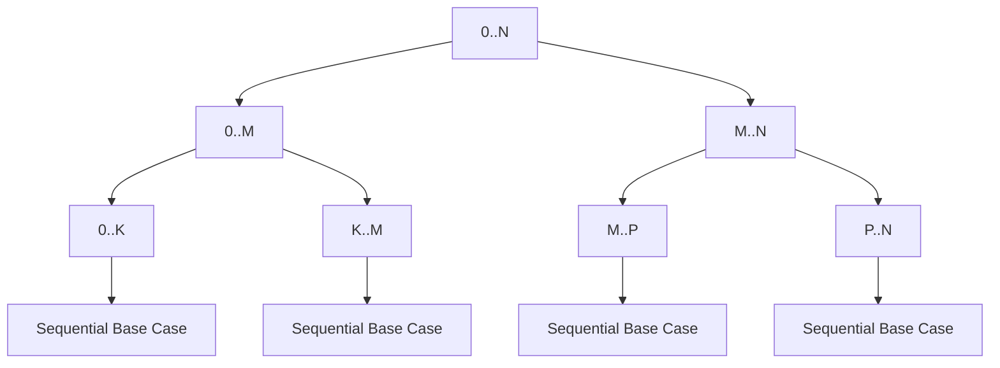

------
title: Learn Java Concurrency & Correctness - Part 019
description: ForkJoinPool, work stealing, RecursiveTask, RecursiveAction, task decomposition, threshold design, blocking hazards, ManagedBlocker, and production-grade parallel execution.
series: learn-java-concurrency-correctness
seriesTitle: Learn Java Concurrency & Correctness
order: 19
partTitle: ForkJoin and Work Stealing
tags:
- java
- concurrency
- forkjoin
- work-stealing
- parallelism
- correctness
seriesStatus: in-progress
---

# Part 019 — ForkJoin and Work Stealing

Pada part sebelumnya kita membahas `ExecutorService` dan thread pool sebagai mekanisme eksekusi umum. Sekarang kita masuk ke model eksekusi yang lebih spesifik: **fork/join parallelism**.

`ForkJoinPool` bukan sekadar thread pool lain. Ia dirancang untuk workload yang dapat dipecah menjadi banyak subtask kecil, lalu digabungkan kembali. Contoh natural:

- divide-and-conquer computation;
- recursive tree traversal;
- parallel aggregation;
- partitioned search;
- CPU-bound transformation;
- graph-like decomposition dengan batasan tertentu;
- internal engine untuk parallel streams.

Mental model utama:

> `ForkJoinPool` unggul ketika pekerjaan dapat dipecah menjadi subtask independen yang CPU-bound, cukup besar untuk amortize overhead, cukup kecil untuk balancing, dan tidak banyak blocking.

Jika workload adalah blocking IO, remote call, database query, atau operasi dengan external latency tinggi, `ForkJoinPool` sering bukan model pertama yang benar.

---

## 1. Problem yang Diselesaikan Fork/Join

Thread pool biasa menjalankan task yang relatif independen.

```java
ExecutorService executor = Executors.newFixedThreadPool(8);
executor.submit(() -> doWork(item));
```

Fork/join menangani task yang memecah dirinya sendiri:

```text
compute(A..Z)
  fork compute(A..M)
  compute(N..Z)
  join left
  combine
```

Masalahnya: jika setiap task membuat task baru, bagaimana worker tetap sibuk tanpa central queue menjadi bottleneck?

Jawabannya: **work stealing**.

---

## 2. Work Stealing Mental Model

Dalam `ForkJoinPool`, worker thread memiliki deque lokal. Worker biasanya mendorong dan mengambil task dari deque miliknya sendiri. Ketika worker kehabisan pekerjaan, ia mencoba mencuri task dari deque worker lain.



Intuisi penting:

- worker yang punya banyak pekerjaan tidak perlu selalu koordinasi dengan central queue;
- idle worker membantu worker sibuk dengan mencuri pekerjaan;
- decomposition yang seimbang membuat semua core bekerja;
- task terlalu kecil membuat overhead scheduling lebih mahal daripada kerja aktual;
- task terlalu besar membuat load imbalance.

---

## 3. ForkJoinPool vs ThreadPoolExecutor

| Aspek | `ThreadPoolExecutor` | `ForkJoinPool` |
|---|---|---|
| Model utama | queue task eksternal | recursive decomposition + work stealing |
| Cocok untuk | service task umum, request, IO wrapper, background jobs | CPU-bound divide-and-conquer |
| Queue | biasanya shared queue | deque per worker + stealing |
| Blocking | bisa, asal pool/queue disizing benar | berbahaya jika blocking tanpa kompensasi |
| Task result | `Future`, `Callable` | `ForkJoinTask`, `RecursiveTask`, `RecursiveAction` |
| Join pattern | antar task manual rawan deadlock | join-aware scheduler |
| Common user | application executors | parallel streams, recursive compute |

Kesalahan umum:

> Menggunakan `ForkJoinPool` untuk semua hal yang “parallel”. Padahal parallelism bukan hanya “lebih banyak thread”. Parallelism harus cocok dengan bentuk pekerjaan.

---

## 4. API Utama

Komponen utama:

| API | Fungsi |
|---|---|
| `ForkJoinPool` | executor khusus fork/join |
| `ForkJoinTask<V>` | base task |
| `RecursiveTask<V>` | task recursive yang menghasilkan nilai |
| `RecursiveAction` | task recursive tanpa return value |
| `CountedCompleter<T>` | advanced completion-driven task |
| `ForkJoinPool.commonPool()` | pool global shared |
| `ForkJoinPool.ManagedBlocker` | memberi tahu pool bahwa worker akan blocking |

Contoh paling sederhana memakai `RecursiveTask`.

```java
import java.util.concurrent.RecursiveTask;

final class SumTask extends RecursiveTask<Long> {
    private static final int THRESHOLD = 10_000;

    private final long[] values;
    private final int startInclusive;
    private final int endExclusive;

    SumTask(long[] values, int startInclusive, int endExclusive) {
        this.values = values;
        this.startInclusive = startInclusive;
        this.endExclusive = endExclusive;
    }

    @Override
    protected Long compute() {
        int size = endExclusive - startInclusive;
        if (size <= THRESHOLD) {
            long sum = 0;
            for (int i = startInclusive; i < endExclusive; i++) {
                sum += values[i];
            }
            return sum;
        }

        int mid = startInclusive + size / 2;
        SumTask left = new SumTask(values, startInclusive, mid);
        SumTask right = new SumTask(values, mid, endExclusive);

        left.fork();
        long rightResult = right.compute();
        long leftResult = left.join();

        return leftResult + rightResult;
    }
}
```

Cara menjalankan:

```java
try (ForkJoinPool pool = new ForkJoinPool()) {
    long result = pool.invoke(new SumTask(values, 0, values.length));
    System.out.println(result);
}
```

Catatan: `ForkJoinPool` mengimplementasikan `ExecutorService`, tetapi konsep task internalnya berbeda dari sekadar `submit()` task biasa.

---

## 5. Pola `fork one, compute one, join one`

Perhatikan bagian ini:

```java
left.fork();
long rightResult = right.compute();
long leftResult = left.join();
```

Kenapa tidak begini?

```java
left.fork();
right.fork();
return left.join() + right.join();
```

Versi kedua membuat task saat ini hanya menjadi scheduler kecil lalu menunggu. Versi pertama menjaga worker tetap melakukan kerja aktual pada salah satu branch.

Mental model:

> Fork satu branch untuk dicuri worker lain, kerjakan branch lain sendiri, lalu join hasil branch yang difork.

Ini mengurangi overhead dan meningkatkan locality.

---

## 6. Correctness Invariant dalam Fork/Join

Fork/join bukan membebaskan kita dari correctness. Ia hanya mengatur eksekusi.

Untuk setiap task, pastikan invariant berikut:

1. **Range invariant**: setiap subtask memproses range yang tepat.
2. **No overlap unless intentional**: dua subtask tidak menulis lokasi mutable yang sama.
3. **Complete coverage**: semua input diproses tepat satu kali.
4. **Associative combine**: penggabungan hasil aman terhadap grouping berbeda.
5. **No hidden shared mutable state**: task tidak diam-diam menulis state global.
6. **No blocking dependency cycle**: task tidak menunggu pekerjaan yang tidak bisa dijalankan.
7. **Threshold is explicit**: base case mencegah recursive explosion.

Diagram coverage:



Bug paling mahal biasanya bukan syntax bug. Bug paling mahal adalah range overlap atau missing range yang hasilnya hanya salah pada ukuran input tertentu.

---

## 7. Decomposition Strategy

Fork/join butuh decomposition yang tepat.

Pertanyaan desain:

- Apakah input bisa dipartisi independen?
- Apakah hasil bisa digabung secara associative?
- Apakah kerja per item cukup mahal?
- Apakah overhead task creation lebih kecil dari manfaat parallelism?
- Apakah data locality memburuk jika dipartisi?
- Apakah ada shared mutable state?
- Apakah order penting?
- Apakah task blocking?

Contoh workload yang cocok:

| Workload | Cocok? | Alasan |
|---|---:|---|
| sum array besar | ya | associative reduce |
| image processing pixel independent | ya | partitioned data parallelism |
| JSON parsing banyak dokumen lokal | mungkin | tergantung ukuran dan allocation |
| HTTP call ke 100 service | tidak ideal | blocking/remote latency |
| DB query per item | tidak ideal | external resource bottleneck |
| updating shared `HashMap` | tidak | shared mutation dan contention |
| tree search immutable | ya | recursive natural decomposition |

---

## 8. Threshold Design

Threshold menentukan kapan task berhenti memecah dan mulai kerja sequential.

```java
if (size <= THRESHOLD) {
    return sequentialCompute();
}
```

Threshold terlalu kecil:

- terlalu banyak task;
- scheduling overhead naik;
- allocation task naik;
- cache locality turun;
- GC pressure naik.

Threshold terlalu besar:

- parallelism kurang;
- load imbalance;
- worker idle;
- tail latency tinggi.

### 8.1 Rule of Thumb

Mulai dengan pendekatan empiris:

```text
threshold ≈ input_size / (parallelism * factor)
```

Dengan `factor` awal 4 sampai 16, lalu benchmark.

Tetapi threshold harus mempertimbangkan cost per element.

Jika per-element murah seperti integer addition, threshold harus besar.

Jika per-element mahal seperti parsing, hashing besar, compression chunk, threshold bisa lebih kecil.

---

## 9. Associativity dan Determinism

Parallel reduction aman jika combine function associative.

Aman:

```text
(a + b) + c == a + (b + c)
```

Untuk integer addition secara matematis iya, tetapi overflow tetap perlu dipahami.

Tidak selalu aman:

```text
(a - b) - c != a - (b - c)
```

Floating point juga tricky karena precision dan rounding.

```java
double a = (1e16 + -1e16) + 1.0;
double b = 1e16 + (-1e16 + 1.0);
```

Parallel grouping bisa mengubah hasil floating point. Ini bukan race condition, tetapi konsekuensi non-associativity numerik.

Production invariant:

> Jika hasil harus bit-identical deterministic, desain reduction dan order secara eksplisit.

---

## 10. Shared Mutable State: Jangan Bocorkan ke Task

Anti-pattern:

```java
final class BadTask extends RecursiveAction {
    private final List<Order> orders;
    private final Map<String, BigDecimal> totals; // shared mutable HashMap

    @Override
    protected void compute() {
        orders.parallelStream().forEach(order -> {
            totals.merge(order.customerId(), order.amount(), BigDecimal::add);
        });
    }
}
```

Problem:

- `HashMap` tidak thread-safe;
- compound aggregate invariant tidak dilindungi;
- task nested parallelism;
- side effect tersembunyi;
- correctness bergantung pada scheduling.

Lebih baik: task menghasilkan partial result immutable, lalu combine.

```java
record CustomerTotals(Map<String, BigDecimal> totals) {
    CustomerTotals merge(CustomerTotals other) {
        Map<String, BigDecimal> merged = new HashMap<>(totals);
        other.totals.forEach((customerId, amount) ->
            merged.merge(customerId, amount, BigDecimal::add)
        );
        return new CustomerTotals(Map.copyOf(merged));
    }
}
```

Prinsip:

> Fork/join paling sehat ketika task tidak saling berkomunikasi lewat shared mutation, melainkan lewat return value.

---

## 11. RecursiveTask Example: Parallel Validation

Misal kita punya banyak `RegulatoryEvent` dan ingin validasi CPU-bound terhadap rule lokal.

```java
record RegulatoryEvent(String id, String actorId, long timestamp, String payload) {}
record Violation(String eventId, String code, String message) {}

interface EventRule {
    Optional<Violation> validate(RegulatoryEvent event);
}
```

Fork/join task:

```java
final class ValidationTask extends RecursiveTask<List<Violation>> {
    private static final int THRESHOLD = 1_000;

    private final List<RegulatoryEvent> events;
    private final List<EventRule> rules;
    private final int start;
    private final int end;

    ValidationTask(
            List<RegulatoryEvent> events,
            List<EventRule> rules,
            int start,
            int end
    ) {
        this.events = events;
        this.rules = rules;
        this.start = start;
        this.end = end;
    }

    @Override
    protected List<Violation> compute() {
        int size = end - start;
        if (size <= THRESHOLD) {
            return validateSequentially();
        }

        int mid = start + size / 2;
        ValidationTask left = new ValidationTask(events, rules, start, mid);
        ValidationTask right = new ValidationTask(events, rules, mid, end);

        left.fork();
        List<Violation> rightViolations = right.compute();
        List<Violation> leftViolations = left.join();

        ArrayList<Violation> combined = new ArrayList<>(leftViolations.size() + rightViolations.size());
        combined.addAll(leftViolations);
        combined.addAll(rightViolations);
        return List.copyOf(combined);
    }

    private List<Violation> validateSequentially() {
        ArrayList<Violation> violations = new ArrayList<>();
        for (int i = start; i < end; i++) {
            RegulatoryEvent event = events.get(i);
            for (EventRule rule : rules) {
                rule.validate(event).ifPresent(violations::add);
            }
        }
        return List.copyOf(violations);
    }
}
```

Eksekusi:

```java
try (ForkJoinPool pool = new ForkJoinPool(Runtime.getRuntime().availableProcessors())) {
    List<Violation> violations = pool.invoke(
        new ValidationTask(events, rules, 0, events.size())
    );
}
```

Correctness properties:

- input list tidak dimutasi selama task berjalan;
- rules stateless atau immutable;
- setiap subtask punya range eksklusif;
- hasil digabung lewat return value;
- tidak ada shared mutable accumulator.

---

## 12. RecursiveAction Example: Parallel Array Transform

Jika task tidak mengembalikan nilai, gunakan `RecursiveAction`.

```java
final class NormalizeScoresAction extends RecursiveAction {
    private static final int THRESHOLD = 20_000;

    private final double[] scores;
    private final double min;
    private final double max;
    private final int start;
    private final int end;

    NormalizeScoresAction(double[] scores, double min, double max, int start, int end) {
        this.scores = scores;
        this.min = min;
        this.max = max;
        this.start = start;
        this.end = end;
    }

    @Override
    protected void compute() {
        int size = end - start;
        if (size <= THRESHOLD) {
            normalizeSequentially();
            return;
        }

        int mid = start + size / 2;
        invokeAll(
            new NormalizeScoresAction(scores, min, max, start, mid),
            new NormalizeScoresAction(scores, min, max, mid, end)
        );
    }

    private void normalizeSequentially() {
        double range = max - min;
        for (int i = start; i < end; i++) {
            scores[i] = (scores[i] - min) / range;
        }
    }
}
```

Ini aman jika setiap task menulis index berbeda.

Invariant:

```text
For any two active tasks T1 and T2:
T1.range ∩ T2.range = ∅
```

---

## 13. Memory Visibility dalam Fork/Join

`fork()` dan `join()` bukan hanya control flow. Mereka juga menyediakan ordering yang dibutuhkan agar hasil subtask yang selesai terlihat oleh task yang melakukan `join()`.

Tetapi jangan salah paham:

- `join()` membuat hasil task yang dijoin aman dibaca;
- `join()` tidak membuat semua shared mutable state global tiba-tiba aman;
- jika dua task menulis lokasi yang sama tanpa koordinasi, tetap race;
- jika object dipublikasikan tidak aman sebelum fork, tetap berbahaya.

Model praktis:

```text
parent constructs immutable task state
parent forks child
child computes isolated result
parent joins child
parent reads result
```

Ini adalah lifecycle paling aman.

---

## 14. Exception Semantics

Jika task gagal, exception akan muncul saat `join()` atau `invoke()`.

```java
try (ForkJoinPool pool = new ForkJoinPool()) {
    Long result = pool.invoke(new SumTask(values, 0, values.length));
} catch (RuntimeException ex) {
    // task failure propagated
}
```

Hal yang harus didesain:

- apakah satu subtask gagal harus menggagalkan seluruh computation?
- apakah sebagian result boleh dipakai?
- apakah failure perlu dikumpulkan, bukan fail-fast?
- apakah task perlu cleanup?
- apakah exception wrapping menghilangkan domain context?

Untuk domain production, jangan biarkan exception mentah kehilangan identitas partition.

```java
throw new PartitionProcessingException(start, end, ex);
```

---

## 15. Cancellation

Fork/join cancellation tidak sama dengan membunuh thread.

`ForkJoinTask.cancel()` mencoba membatalkan task, tetapi task harus tetap cooperative.

Desain cancellation praktis:

```java
final class SearchTask extends RecursiveTask<Optional<Result>> {
    private final AtomicBoolean cancelled;

    @Override
    protected Optional<Result> compute() {
        if (cancelled.get()) {
            return Optional.empty();
        }
        // compute
        if (found) {
            cancelled.set(true);
            return Optional.of(result);
        }
        // fork children
    }
}
```

Namun hati-hati: shared `AtomicBoolean` adalah shared state. Ia cocok untuk signal global sederhana, bukan untuk aggregate mutation kompleks.

---

## 16. Blocking Hazard

`ForkJoinPool` diasumsikan idealnya menjalankan CPU-bound tasks. Blocking bisa merusak parallelism.

Anti-pattern:

```java
class BadRemoteTask extends RecursiveTask<Response> {
    @Override
    protected Response compute() {
        return httpClient.send(request); // blocking remote call
    }
}
```

Jika semua worker blocking menunggu network, tidak ada worker tersisa untuk menjalankan subtask lain.

Efek:

- throughput turun;
- worker starvation;
- latency unpredictable;
- common pool terganggu;
- unrelated parallel stream atau `CompletableFuture` async bisa ikut terdampak jika memakai pool yang sama.

---

## 17. ManagedBlocker

Untuk blocking yang tak terhindarkan, `ForkJoinPool.ManagedBlocker` dapat memberi sinyal kepada pool bahwa worker akan blocking, sehingga pool dapat mengompensasi dengan worker tambahan jika perlu.

Contoh sederhana:

```java
final class QueueTaker<T> implements ForkJoinPool.ManagedBlocker {
    private final BlockingQueue<T> queue;
    private T item;

    QueueTaker(BlockingQueue<T> queue) {
        this.queue = queue;
    }

    @Override
    public boolean block() throws InterruptedException {
        if (item == null) {
            item = queue.take();
        }
        return true;
    }

    @Override
    public boolean isReleasable() {
        return item != null || (item = queue.poll()) != null;
    }

    T item() {
        return item;
    }
}
```

Pemakaian:

```java
QueueTaker<Job> blocker = new QueueTaker<>(queue);
ForkJoinPool.managedBlock(blocker);
Job job = blocker.item();
```

Tetapi ini bukan izin untuk membuat `ForkJoinPool` menjadi general blocking executor. Gunakan hanya ketika desain memang membutuhkan blocking kecil dan terkontrol di dalam fork/join computation.

---

## 18. Common Pool: Global Shared Resource

`ForkJoinPool.commonPool()` adalah pool global yang dipakai banyak API, termasuk parallel streams dan beberapa async default execution path.

Problem common pool:

- shared dengan library lain;
- sulit mengisolasi workload;
- blocking di satu area bisa mengganggu area lain;
- observability attribution lebih sulit;
- konfigurasi global dapat mempengaruhi seluruh process.

Anti-pattern:

```java
list.parallelStream()
    .map(this::callRemoteService)
    .toList();
```

Ini menggunakan common pool untuk blocking remote call. Pada traffic tinggi, efeknya bisa menyebar ke seluruh JVM.

Production guideline:

> Jangan jadikan common pool tempat sampah semua parallel work. Untuk workload penting, buat pool eksplisit, beri nama thread, metric, dan lifecycle.

---

## 19. Custom ForkJoinPool

```java
ForkJoinPool pool = new ForkJoinPool(
    Runtime.getRuntime().availableProcessors(),
    ForkJoinPool.defaultForkJoinWorkerThreadFactory,
    (thread, error) -> log.error("ForkJoin worker failed: {}", thread.getName(), error),
    false
);
```

Parameter umum:

| Parameter | Fungsi |
|---|---|
| parallelism | target jumlah worker aktif |
| factory | cara membuat worker |
| exception handler | menangani uncaught exception |
| asyncMode | mode scheduling async event-style tasks |

Gunakan custom pool untuk:

- isolasi computation besar;
- observability terpisah;
- menghindari gangguan common pool;
- eksperimen tuning threshold/parallelism;
- batch jobs CPU-bound.

---

## 20. Naming Worker Thread

Observability lebih mudah jika worker bernama jelas.

```java
final class NamedForkJoinWorkerThreadFactory
        implements ForkJoinPool.ForkJoinWorkerThreadFactory {

    private final AtomicInteger sequence = new AtomicInteger();
    private final String prefix;

    NamedForkJoinWorkerThreadFactory(String prefix) {
        this.prefix = prefix;
    }

    @Override
    public ForkJoinWorkerThread newThread(ForkJoinPool pool) {
        ForkJoinWorkerThread worker =
            ForkJoinPool.defaultForkJoinWorkerThreadFactory.newThread(pool);
        worker.setName(prefix + "-" + sequence.incrementAndGet());
        return worker;
    }
}
```

Pemakaian:

```java
ForkJoinPool pool = new ForkJoinPool(
    8,
    new NamedForkJoinWorkerThreadFactory("rules-fjp"),
    null,
    false
);
```

Saat incident, nama thread sering mempercepat diagnosis.

---

## 21. Nested Parallelism

Nested fork/join dapat menjadi footgun.

```java
outer.parallelStream().forEach(o -> {
    inner.parallelStream().forEach(i -> process(o, i));
});
```

Problem:

- explosion of tasks;
- common pool contention;
- unpredictable scheduling;
- memory pressure;
- sulit membatasi capacity;
- sulit menghubungkan failure ke input.

Lebih baik flatten atau pilih satu level parallelism.

```java
outer.stream()
    .flatMap(o -> inner.stream().map(i -> new Pair<>(o, i)))
    .parallel()
    .forEach(pair -> process(pair.left(), pair.right()));
```

Atau eksplisit dengan bounded executor jika bukan CPU-bound.

---

## 22. Granularity dan False Sharing

Parallelism bisa kalah oleh memory subsystem.

False sharing terjadi ketika beberapa worker menulis variable berbeda tetapi berada pada cache line yang sama, sehingga cache invalidation terjadi terus-menerus.

Contoh simplifikasi:

```java
long[] counters = new long[parallelism];
// worker i writes counters[i]
```

Walaupun index berbeda, lokasi memory berdekatan bisa saling mengganggu cache line.

Mitigasi:

- gunakan per-task local accumulator;
- combine di akhir;
- hindari shared counter hot path;
- gunakan `LongAdder` untuk counter high-contention;
- benchmark dengan data realistis.

---

## 23. Workload CPU-Bound vs Memory-Bound

Tidak semua CPU-looking workload scale dengan core.

| Workload | Bottleneck mungkin |
|---|---|
| arithmetic heavy | CPU ALU/vectorization |
| parsing text besar | allocation + branch + memory bandwidth |
| scanning array besar | memory bandwidth |
| hashing banyak object | CPU + cache miss |
| object graph traversal | pointer chasing/cache miss |
| compression | CPU + memory |

Jika workload memory-bound, menambah parallelism bisa tidak mempercepat dan malah memperlambat.

Production rule:

> Ukur speedup, jangan diasumsikan. Parallelism adalah hipotesis performance, bukan guarantee.

---

## 24. Amdahl's Law untuk Engineer

Jika hanya sebagian kerja bisa diparalelkan, speedup maksimum dibatasi.

```text
Speedup = 1 / ((1 - P) + P / N)
```

P = proporsi kerja yang parallelizable. N = jumlah worker/core.

Jika 80% kerja parallelizable dan 20% sequential:

```text
N = 8
Speedup = 1 / (0.2 + 0.8/8) = 3.33x
```

Bukan 8x.

Bagian sequential termasuk:

- input loading;
- output writing;
- combine result;
- lock contention;
- allocation/GC;
- coordination overhead;
- logging;
- remote calls.

---

## 25. Benchmarking ForkJoin

Jangan benchmark dengan satu run `System.currentTimeMillis()`.

Minimal lakukan:

- warmup;
- multiple iterations;
- realistic input size;
- compare sequential baseline;
- test different thresholds;
- test different parallelism;
- check correctness output;
- measure allocation;
- measure CPU utilization;
- profile hot path.

Pseudo benchmark manual sederhana:

```java
for (int threshold : List.of(1_000, 5_000, 10_000, 50_000, 100_000)) {
    long best = Long.MAX_VALUE;
    for (int i = 0; i < 10; i++) {
        long start = System.nanoTime();
        long result = pool.invoke(new SumTask(values, 0, values.length, threshold));
        long elapsed = System.nanoTime() - start;
        best = Math.min(best, elapsed);
        assert result == expected;
    }
    System.out.printf("threshold=%d best=%dms%n", threshold, best / 1_000_000);
}
```

Untuk measurement serius, gunakan JMH.

---

## 26. ForkJoin and Virtual Threads

Virtual threads dan fork/join menyelesaikan problem berbeda.

| Problem | Tool |
|---|---|
| banyak blocking IO request | virtual threads |
| CPU-bound divide-and-conquer | ForkJoinPool |
| structured lifetime banyak concurrent subtask | structured concurrency |
| pipeline async non-blocking dengan backpressure | reactive/event-loop |

Virtual threads bukan pengganti CPU-bound parallelism. Jika ada 8 core dan 10.000 virtual threads melakukan CPU work, scheduler tetap hanya punya core terbatas. CPU-bound work perlu capacity control.

ForkJoinPool tetap relevan untuk compute-heavy partitioned work.

---

## 27. ForkJoin vs Structured Concurrency

Structured concurrency membantu lifetime management: fork multiple subtasks, join/cancel as scope.

ForkJoin membantu decomposition compute-heavy: task split recursively dan work stealing.

Perbedaan mental model:

```text
Structured concurrency: organize concurrent tasks by lexical lifetime.
Fork/join: execute recursively decomposed CPU work efficiently.
```

Jangan mencampur tanpa alasan jelas. Jika task adalah request-level concurrent IO, structured concurrency + virtual threads lebih natural. Jika task adalah recursive CPU-bound computation, fork/join lebih natural.

---

## 28. Case Study: Parallel Case Risk Scoring

Misal sistem enforcement perlu menghitung risk score untuk banyak case berdasarkan data lokal yang sudah dimuat ke memory.

Domain:

```java
record CaseSnapshot(
    String caseId,
    List<Event> events,
    List<Party> parties,
    List<Sanction> sanctions
) {}

record RiskScore(String caseId, int score, List<String> reasons) {}
```

Desain yang salah:

```java
Map<String, RiskScore> scores = new HashMap<>();
cases.parallelStream().forEach(c -> scores.put(c.caseId(), score(c)));
```

Desain fork/join yang lebih defensible:

- input immutable;
- scoring function pure;
- task menghasilkan list score;
- combine list;
- no shared mutable map;
- persist hasil setelah compute selesai.

Task:

```java
final class RiskScoringTask extends RecursiveTask<List<RiskScore>> {
    private static final int THRESHOLD = 500;

    private final List<CaseSnapshot> cases;
    private final RiskScorer scorer;
    private final int start;
    private final int end;

    RiskScoringTask(List<CaseSnapshot> cases, RiskScorer scorer, int start, int end) {
        this.cases = cases;
        this.scorer = scorer;
        this.start = start;
        this.end = end;
    }

    @Override
    protected List<RiskScore> compute() {
        if (end - start <= THRESHOLD) {
            ArrayList<RiskScore> result = new ArrayList<>(end - start);
            for (int i = start; i < end; i++) {
                result.add(scorer.score(cases.get(i)));
            }
            return List.copyOf(result);
        }

        int mid = start + (end - start) / 2;
        RiskScoringTask left = new RiskScoringTask(cases, scorer, start, mid);
        RiskScoringTask right = new RiskScoringTask(cases, scorer, mid, end);

        left.fork();
        List<RiskScore> rightResult = right.compute();
        List<RiskScore> leftResult = left.join();

        ArrayList<RiskScore> merged = new ArrayList<>(leftResult.size() + rightResult.size());
        merged.addAll(leftResult);
        merged.addAll(rightResult);
        return List.copyOf(merged);
    }
}
```

Production properties:

| Concern | Decision |
|---|---|
| correctness | no shared mutable output |
| traceability | score contains reasons |
| failure | exception can include range |
| capacity | pool parallelism explicit |
| repeatability | pure function easier to test |
| audit | deterministic input snapshot |

---

## 29. Anti-Patterns

### 29.1 Forking Too Much

```java
if (size <= 1) return computeOne();
```

Task overhead dominates.

### 29.2 Blocking Inside ForkJoin

```java
return jdbcTemplate.queryForObject(sql, mapper);
```

Database pool, network, and fork/join worker availability become tangled.

### 29.3 Shared Mutable Accumulator

```java
List<Result> results = new ArrayList<>();
// many tasks call results.add(...)
```

Race and corruption unless synchronized; if synchronized, contention may erase benefits.

### 29.4 Non-Associative Combine

```java
return leftResult - rightResult;
```

Result depends on decomposition shape.

### 29.5 Hidden Common Pool Dependency

```java
someLibraryCallThatUsesParallelStream();
```

You may be using the common pool without realizing.

### 29.6 Nested Parallelism

Parallel inside parallel without capacity model.

### 29.7 Logging in Hot Loop

Logging from many worker tasks can serialize, allocate, and distort timing.

---

## 30. Review Checklist

Before approving fork/join code, ask:

- Is workload CPU-bound?
- Is input immutable or safely confined?
- Are subtask ranges non-overlapping?
- Is base threshold explicit?
- Has threshold been benchmarked?
- Is combine operation associative and deterministic enough?
- Are exceptions enriched with partition context?
- Is common pool avoided for critical workloads?
- Is there blocking? If yes, why is fork/join still correct?
- Are metrics exposed for pool state and duration?
- Is sequential baseline measured?
- Does result match sequential implementation across randomized inputs?
- Does task avoid shared mutable accumulators?
- Is nested parallelism avoided?
- Does cancellation have a cooperative signal if needed?

---

## 31. Testing Strategy

Test fork/join code against a simple sequential oracle.

```java
@Test
void parallelResultMatchesSequentialResult() {
    List<CaseSnapshot> input = randomCases(10_000);

    List<RiskScore> expected = input.stream()
        .map(scorer::score)
        .toList();

    List<RiskScore> actual;
    try (ForkJoinPool pool = new ForkJoinPool(4)) {
        actual = pool.invoke(new RiskScoringTask(input, scorer, 0, input.size()));
    }

    assertEquals(expected, actual);
}
```

Vary:

- input size 0, 1, threshold - 1, threshold, threshold + 1;
- odd/even sizes;
- large input;
- exception in one partition;
- deterministic random seed;
- different pool parallelism;
- different thresholds.

---

## 32. Observability

Expose metrics:

- pool parallelism;
- active thread count;
- running thread count;
- queued task count;
- steal count;
- duration per computation;
- input size;
- threshold;
- failure count;
- cancellation count.

Example:

```java
ForkJoinPool pool = ...;
log.info(
    "fjp parallelism={} active={} running={} queued={} steals={}",
    pool.getParallelism(),
    pool.getActiveThreadCount(),
    pool.getRunningThreadCount(),
    pool.getQueuedTaskCount(),
    pool.getStealCount()
);
```

Jangan terlalu sering memanggil metrics di hot path. Gunakan sampling atau scrape periodik.

---

## 33. Decision Matrix

| Situasi | Pilihan utama |
|---|---|
| CPU-bound recursive decomposition | `ForkJoinPool` |
| CPU-bound flat list transformation | parallel stream atau explicit fork/join setelah benchmark |
| Blocking IO banyak task | virtual threads + semaphore/resource limit |
| Request-scoped multiple remote calls | structured concurrency + virtual threads |
| Event loop non-blocking stack | reactive/event loop |
| Background jobs dengan bounded queue | `ThreadPoolExecutor` |
| Tiny collection | sequential |
| Mutable aggregate invariant | lock or single owner, not raw fork/join mutation |

---

## 34. Mini Exercise

Implementasikan parallel computation untuk:

1. menghitung total nilai transaksi;
2. mencari transaksi suspicious dengan rule CPU-bound lokal;
3. menggabungkan hasil per customer;
4. membandingkan hasil dengan sequential oracle;
5. melakukan benchmark threshold 500, 1.000, 5.000, 10.000;
6. menambahkan metrics pool.

Constraint:

- jangan menggunakan shared mutable `HashMap` antar task;
- jangan melakukan IO di dalam `compute()`;
- hasil harus deterministic untuk input yang sama;
- exception harus menyertakan range partition.

---

## 35. Ringkasan

`ForkJoinPool` adalah tool spesifik untuk parallel computation yang dapat dipecah dan digabung. Kekuatan utamanya berasal dari work stealing, bukan dari jumlah thread semata.

Yang harus diingat:

- gunakan untuk CPU-bound divide-and-conquer;
- desain task sebagai isolated computation;
- hindari shared mutable output;
- pilih threshold berdasarkan benchmark;
- hati-hati dengan blocking;
- jangan sembarang memakai common pool;
- validasi hasil terhadap sequential oracle;
- ukur speedup dan overhead.

Part berikutnya membahas **parallel streams**. Parallel streams terlihat lebih mudah daripada fork/join manual, tetapi justru lebih sering menjadi footgun karena menyembunyikan executor, splitting, ordering, side effect, dan blocking behavior.
