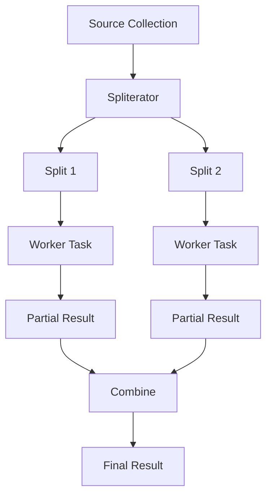

------
title: Learn Java Concurrency & Correctness - Part 020
description: Parallel streams tanpa footgun: spliterator, side effects, ordering, collectors, common pool, blocking hazards, custom pool caveats, and production decision rules.
series: learn-java-concurrency-correctness
seriesTitle: Learn Java Concurrency & Correctness
order: 20
partTitle: Parallel Streams Without Footguns
tags:
- java
- concurrency
- streams
- parallel-streams
- forkjoin
- correctness
seriesStatus: in-progress
---

# Part 020 — Parallel Streams Without Footguns

Parallel stream adalah salah satu fitur Java yang paling mudah dipakai dan paling mudah disalahgunakan.

```java
List<Result> results = items.parallelStream()
    .map(this::process)
    .toList();
```

Satu method call dapat mengubah execution model dari sequential menjadi parallel. Itu menarik, tetapi berbahaya jika kita tidak memahami:

- bagaimana data di-split;
- executor apa yang dipakai;
- apakah lambda stateless;
- apakah ada side effect;
- apakah order penting;
- apakah collector aman;
- apakah operation blocking;
- apakah output deterministic;
- apakah overhead lebih besar daripada benefit.

Mental model utama:

> Parallel stream cocok untuk data-parallel computation yang stateless, non-blocking, cukup besar, mudah di-split, dan memakai reduction/collector yang benar.

Jika salah satu syarat itu tidak terpenuhi, parallel stream sering menambah risiko lebih besar daripada performance benefit.

---

## 1. Stream Bukan Collection

Stream adalah pipeline operasi.

```java
List<String> names = users.stream()
    .filter(User::active)
    .map(User::name)
    .toList();
```

Pipeline stream terdiri dari:

- source;
- intermediate operations;
- terminal operation.

Parallel stream berarti pipeline dapat dieksekusi secara parallel, tetapi bukan berarti setiap stage otomatis punya thread sendiri. Ini bukan pipeline actor/event system. Ini data-parallel execution.

---

## 2. Sequential vs Parallel Stream

Sequential:

```java
items.stream()
    .map(this::transform)
    .toList();
```

Parallel:

```java
items.parallelStream()
    .map(this::transform)
    .toList();
```

Atau:

```java
items.stream()
    .parallel()
    .map(this::transform)
    .toList();
```

Perbedaan fundamental:

| Aspek | Sequential | Parallel |
|---|---|---|
| Execution | satu thread caller | banyak worker, biasanya common pool |
| Ordering | natural encounter order mudah dipahami | order bisa dipertahankan dengan biaya |
| Lambda requirement | tetap sebaiknya stateless | wajib lebih disiplin stateless/non-interfering |
| Side effect | masih bisa buruk | jauh lebih berbahaya |
| Debuggability | lebih mudah | lebih sulit |
| Performance | predictable | bergantung splitting, overhead, work cost |

---

## 3. Bagaimana Parallel Stream Bekerja

Secara konseptual:

1. source menyediakan `Spliterator`;
2. stream mencoba memecah data;
3. subtask diproses di pool;
4. partial result digabung;
5. terminal result dikembalikan.



Kualitas parallel stream sangat bergantung pada kualitas splitting.

---

## 4. Spliterator Mental Model

`Spliterator` adalah abstraction untuk traversal dan partitioning.

Karakteristik penting:

| Characteristic | Arti praktis |
|---|---|
| `SIZED` | ukuran diketahui |
| `SUBSIZED` | hasil split juga punya ukuran diketahui |
| `ORDERED` | encounter order berarti |
| `DISTINCT` | elemen distinct |
| `SORTED` | elemen sorted |
| `IMMUTABLE` | source tidak berubah |
| `CONCURRENT` | source dapat dimodifikasi concurrent dengan aturan tertentu |
| `NONNULL` | tidak ada null |

Source yang mudah di-split:

- `ArrayList`;
- array;
- range primitive seperti `IntStream.range()`;
- immutable indexed data.

Source yang kurang ideal:

- `LinkedList`;
- IO stream;
- generator infinite;
- source dengan expensive `trySplit()`;
- source dengan unknown size;
- source yang berubah saat traversal.

---

## 5. Non-Interference

Lambda stream harus **non-interfering**: tidak memodifikasi source stream selama pipeline berjalan.

Anti-pattern:

```java
List<Order> orders = new ArrayList<>(...);

orders.parallelStream()
    .filter(order -> order.amount().signum() > 0)
    .forEach(order -> orders.remove(order)); // broken
```

Problem:

- concurrent modification;
- undefined/unstable behavior;
- race;
- structural mutation;
- correctness bergantung timing.

Benar:

```java
List<Order> positiveOrders = orders.parallelStream()
    .filter(order -> order.amount().signum() > 0)
    .toList();
```

Jangan mutasi source. Buat result baru.

---

## 6. Statelessness

Lambda parallel stream harus stateless. Artinya output hanya bergantung pada input elemen dan immutable context, bukan state mutable yang berubah antar elemen.

Anti-pattern:

```java
AtomicInteger index = new AtomicInteger();

List<Row> rows = items.parallelStream()
    .map(item -> new Row(index.incrementAndGet(), item.value()))
    .toList();
```

Walaupun `AtomicInteger` thread-safe, hasil index tidak merepresentasikan encounter order secara aman dan membuat output tergantung scheduling.

Jika butuh index, gunakan `IntStream.range()`.

```java
List<Row> rows = IntStream.range(0, items.size())
    .parallel()
    .mapToObj(i -> new Row(i, items.get(i).value()))
    .toList();
```

---

## 7. Side Effects

Side effect di stream operation biasanya tanda bahaya.

Anti-pattern:

```java
List<Result> results = new ArrayList<>();

items.parallelStream()
    .map(this::process)
    .forEach(results::add); // race
```

`ArrayList` tidak thread-safe. Hasil bisa corrupt, missing, duplicate, atau exception.

Versi thread-safe pun belum tentu bagus:

```java
List<Result> results = Collections.synchronizedList(new ArrayList<>());
items.parallelStream().map(this::process).forEach(results::add);
```

Ini benar secara basic thread-safety, tetapi sering buruk:

- lock contention;
- order tidak jelas;
- performance menurun;
- side effect tersembunyi.

Gunakan collector:

```java
List<Result> results = items.parallelStream()
    .map(this::process)
    .toList();
```

---

## 8. `forEach` vs `forEachOrdered`

`forEach` pada parallel stream tidak menjamin encounter order.

```java
items.parallelStream().forEach(System.out::println);
```

Output bisa berbeda urutan.

Jika order penting:

```java
items.parallelStream().forEachOrdered(System.out::println);
```

Namun `forEachOrdered` dapat mengurangi parallel benefit karena harus mempertahankan order.

Decision:

| Kebutuhan | Pilihan |
|---|---|
| side-effect-free transform | `map(...).toList()` |
| unordered independent action | `forEach` bisa diterima |
| ordered output | `forEachOrdered`, atau sequential |
| audit log ordered | jangan pakai parallel side-effect langsung |

---

## 9. Encounter Order

Beberapa source punya encounter order:

- `List`;
- array;
- ordered stream;
- `LinkedHashSet`.

Beberapa source tidak punya order stabil:

- `HashSet`;
- `ConcurrentHashMap.keySet()`;
- unordered generated source.

Parallel stream bisa mempertahankan encounter order untuk operasi tertentu, tetapi biaya coordination bisa naik.

Jika order tidak penting, beri tahu stream:

```java
items.parallelStream()
    .unordered()
    .filter(this::matches)
    .limit(100)
    .toList();
```

`unordered()` dapat membantu operasi tertentu, tetapi hanya jika domain benar-benar tidak membutuhkan order.

---

## 10. Reduction yang Benar

Reduction harus memakai identity, accumulator, dan combiner yang benar.

```java
int total = items.parallelStream()
    .mapToInt(Item::quantity)
    .sum();
```

Custom reduce:

```java
int total = items.parallelStream()
    .reduce(
        0,
        (sum, item) -> sum + item.quantity(),
        Integer::sum
    );
```

Syarat:

- identity benar;
- accumulator associative compatible;
- combiner associative;
- tidak mutate shared state;
- hasil tidak bergantung urutan kecuali order dijaga.

Anti-pattern:

```java
String result = items.parallelStream()
    .reduce("", (a, b) -> a + b.name(), (a, b) -> a + b);
```

Ini bisa sangat mahal karena string concatenation berulang. Gunakan collector/joining.

---

## 11. Mutable Reduction dengan Collector

Collector adalah cara aman untuk mutable reduction jika collector dirancang benar.

```java
Map<String, Long> countByStatus = cases.parallelStream()
    .collect(Collectors.groupingBy(Case::status, Collectors.counting()));
```

Untuk parallel stream, collector dapat membuat container intermediate per task lalu menggabungkannya.

Jangan menulis sendiri collector concurrent kecuali paham kontraknya.

---

## 12. `groupingBy` vs `groupingByConcurrent`

```java
Map<Status, List<Case>> byStatus = cases.parallelStream()
    .collect(Collectors.groupingBy(Case::status));
```

`groupingBy` tidak berarti satu shared `HashMap` dimutasi semua worker. Framework dapat membuat partial map lalu combine.

`groupingByConcurrent` menggunakan concurrent collector:

```java
ConcurrentMap<Status, List<Case>> byStatus = cases.parallelStream()
    .collect(Collectors.groupingByConcurrent(Case::status));
```

Tetapi concurrent collector tidak otomatis lebih cepat. Ia dapat meningkatkan contention jika banyak elemen masuk key yang sama.

Decision:

| Situasi | Pilihan |
|---|---|
| key distribution merata | `groupingByConcurrent` mungkin baik |
| sedikit key hot | partial map + combine bisa lebih baik |
| order list per group penting | hati-hati dengan concurrent unordered collector |
| result kecil | sequential mungkin cukup |

---

## 13. Blocking dalam Parallel Stream

Anti-pattern paling umum:

```java
List<Response> responses = requests.parallelStream()
    .map(httpClient::sendBlocking)
    .toList();
```

Ini terlihat nyaman, tetapi buruk:

- memakai common pool secara default;
- blocking remote call menahan worker;
- tidak ada deadline propagation eksplisit;
- tidak ada per-dependency concurrency limit;
- cancellation tidak jelas;
- error handling menjadi batch-level kasar;
- pool global bisa terdampak.

Untuk IO-bound workload modern Java, biasanya lebih tepat:

- virtual threads;
- structured concurrency;
- explicit semaphore/rate limit;
- timeout per call;
- bulkhead per dependency.

Contoh virtual thread style:

```java
try (ExecutorService executor = Executors.newVirtualThreadPerTaskExecutor()) {
    List<Future<Response>> futures = requests.stream()
        .map(request -> executor.submit(() -> httpClient.sendBlocking(request)))
        .toList();

    List<Response> responses = new ArrayList<>();
    for (Future<Response> future : futures) {
        responses.add(future.get(500, TimeUnit.MILLISECONDS));
    }
}
```

Ini masih perlu resource limit. Virtual thread bukan izin membuat 100.000 request ke dependency tanpa bulkhead.

---

## 14. Common Pool Hazard

Parallel streams biasanya memakai `ForkJoinPool.commonPool()`.

Implikasi:

- pool dibagi oleh seluruh JVM;
- library lain bisa memakai pool yang sama;
- blocking atau computation berat dapat mengganggu area lain;
- sulit mengontrol lifecycle;
- sulit mengaitkan metrics ke business operation;
- custom thread naming tidak tersedia.

Contoh risiko:

```java
// Service A
orders.parallelStream().map(this::expensiveCpuWork).toList();

// Service B in same JVM
reports.parallelStream().map(this::generateReport).toList();
```

Keduanya bisa bertarung di common pool.

---

## 15. Custom Pool Caveat

Banyak developer mencoba:

```java
ForkJoinPool pool = new ForkJoinPool(4);
List<Result> results = pool.submit(() ->
    items.parallelStream()
        .map(this::process)
        .toList()
).join();
```

Ini sering bekerja, tetapi harus dipahami sebagai caveat, bukan desain ideal universal. Parallel stream tidak dirancang sebagai API eksplisit untuk memilih executor per pipeline.

Risiko:

- readability rendah;
- nested parallel behavior sulit;
- library code dalam pipeline bisa memanggil parallel stream lain;
- observability tetap tidak sebaik explicit task model;
- lifecycle pool harus dikelola;
- exception/cancellation tetap mengikuti stream abstraction.

Jika butuh executor eksplisit, sering lebih baik gunakan:

- `ForkJoinPool` manual;
- `ExecutorService` explicit;
- virtual threads;
- structured concurrency;
- reactive pipeline.

---

## 16. Tiny Workload Footgun

Parallel stream punya overhead:

- splitting;
- task creation;
- scheduling;
- combining;
- synchronization;
- cache effects.

Anti-pattern:

```java
List<String> upper = List.of("a", "b", "c")
    .parallelStream()
    .map(String::toUpperCase)
    .toList();
```

Sequential lebih sederhana dan kemungkinan lebih cepat.

Gunakan parallel stream hanya jika:

- data cukup besar;
- work per element cukup mahal;
- operation stateless;
- source mudah di-split;
- combine efisien;
- benchmark menunjukkan benefit.

---

## 17. State Mutation dalam Domain Object

Anti-pattern:

```java
cases.parallelStream()
    .forEach(c -> c.setRiskScore(score(c)));
```

Walaupun tiap case object berbeda, desain ini memiliki risiko:

- object mungkin juga dibaca thread lain;
- lifecycle mutation tidak jelas;
- auditability buruk;
- partial update jika exception;
- sulit rollback;
- hidden side effect;
- DTO/entity bisa terikat persistence context.

Lebih baik hasil baru:

```java
List<ScoredCase> scoredCases = cases.parallelStream()
    .map(c -> new ScoredCase(c.caseId(), score(c)))
    .toList();
```

Lalu persist/update dalam phase terpisah dengan transaction boundary yang jelas.

---

## 18. Persistence Context Warning

Jangan pakai parallel stream di atas JPA/Hibernate managed entities atau persistence context yang tidak dirancang untuk concurrent access.

Anti-pattern:

```java
entities.parallelStream()
    .forEach(entity -> entity.setStatus(Status.PROCESSED));
```

Problem:

- persistence context biasanya thread-bound;
- lazy loading dapat memicu IO/blocking;
- dirty tracking tidak thread-safe;
- transaction boundary tidak jelas;
- exception dapat meninggalkan state sebagian berubah.

Walaupun seri persistence sudah dipelajari terpisah, aturan concurrency-nya sederhana:

> Jangan membawa thread-bound mutable infrastructure ke parallel stream.

Ubah entity menjadi immutable snapshot dulu, proses parallel, lalu tulis hasil dengan boundary eksplisit.

---

## 19. Logging dan Metrics Side Effects

Logging di parallel stream bisa mengacaukan performance dan ordering.

```java
items.parallelStream()
    .map(item -> {
        log.info("processing {}", item.id());
        return process(item);
    })
    .toList();
```

Masalah:

- output interleaving;
- lock/IO overhead logger;
- MDC context belum tentu benar;
- volume log meledak;
- performance benchmark menjadi palsu.

Lebih baik aggregate metrics:

```java
LongSummaryStatistics stats = items.parallelStream()
    .mapToLong(item -> process(item).durationMillis())
    .summaryStatistics();
```

Untuk tracing detail, gunakan sampling dan correlation id yang dipropagasi secara eksplisit.

---

## 20. Context Propagation

Parallel stream worker bukan request thread. `ThreadLocal`, MDC, security context, tenant context, locale, dan request deadline bisa hilang atau salah.

Anti-pattern:

```java
String tenantId = TenantContext.current();

items.parallelStream()
    .map(item -> processForTenant(item)) // reads ThreadLocal internally
    .toList();
```

Lebih baik jadikan context explicit value:

```java
String tenantId = TenantContext.current();

items.parallelStream()
    .map(item -> processForTenant(tenantId, item))
    .toList();
```

Ini lebih testable dan tidak bergantung pada thread affinity.

---

## 21. Exceptions

Exception dalam parallel stream akan menggagalkan terminal operation.

```java
try {
    List<Result> results = items.parallelStream()
        .map(this::process)
        .toList();
} catch (RuntimeException ex) {
    // one or more elements failed, but context may be weak
}
```

Masalah:

- exception mungkin tidak menyertakan item id;
- beberapa worker mungkin sudah memproses elemen lain;
- partial side effects bisa sudah terjadi;
- debugging sulit jika error hanya muncul saat parallel.

Pattern lebih baik:

```java
record ProcessingFailure(String itemId, String message, Throwable cause) {}
record ProcessingOutcome(String itemId, Optional<Result> result, Optional<ProcessingFailure> failure) {}

ProcessingOutcome safeProcess(Item item) {
    try {
        return new ProcessingOutcome(item.id(), Optional.of(process(item)), Optional.empty());
    } catch (Exception ex) {
        return new ProcessingOutcome(
            item.id(),
            Optional.empty(),
            Optional.of(new ProcessingFailure(item.id(), ex.getMessage(), ex))
        );
    }
}
```

Then:

```java
List<ProcessingOutcome> outcomes = items.parallelStream()
    .map(this::safeProcess)
    .toList();
```

Ini cocok jika business semantics mengizinkan partial failure collection.

---

## 22. Cancellation and Short-Circuiting

Operasi seperti `findAny`, `anyMatch`, `allMatch`, `noneMatch`, `limit` dapat short-circuit.

```java
Optional<Item> suspicious = items.parallelStream()
    .filter(this::isSuspicious)
    .findAny();
```

`findAny` cocok jika elemen mana pun cukup. Untuk ordered deterministic result, gunakan `findFirst`, tetapi bisa lebih mahal.

```java
Optional<Item> firstSuspicious = items.parallelStream()
    .filter(this::isSuspicious)
    .findFirst();
```

Decision:

| Requirement | Operation |
|---|---|
| any matching item | `findAny` |
| first by encounter order | `findFirst` |
| existence | `anyMatch` |
| all must pass | `allMatch` |
| deterministic first suspicious case | maybe sequential or ordered parallel |

---

## 23. Primitive Streams

Gunakan primitive streams untuk mengurangi boxing.

Buruk:

```java
Integer total = items.parallelStream()
    .map(Item::quantity)
    .reduce(0, Integer::sum);
```

Lebih baik:

```java
int total = items.parallelStream()
    .mapToInt(Item::quantity)
    .sum();
```

Primitive streams:

- `IntStream`;
- `LongStream`;
- `DoubleStream`.

Ini mengurangi allocation dan improve locality.

---

## 24. Parallel Stream and `limit`

`limit()` pada ordered parallel stream bisa mahal karena sistem harus mempertahankan encounter order.

```java
List<Item> first100 = items.parallelStream()
    .filter(this::matches)
    .limit(100)
    .toList();
```

Jika order tidak penting:

```java
List<Item> any100 = items.parallelStream()
    .unordered()
    .filter(this::matches)
    .limit(100)
    .toList();
```

Tetapi jangan gunakan `unordered()` jika business semantics membutuhkan first 100 berdasarkan urutan tertentu.

---

## 25. Sorting

Sorting parallel bisa membantu untuk data besar, tetapi tidak selalu.

```java
List<Item> sorted = items.parallelStream()
    .sorted(Comparator.comparing(Item::score))
    .toList();
```

Pertanyaan:

- berapa besar input?
- comparator mahal atau murah?
- apakah score precomputed?
- apakah sorting seluruh data perlu, atau top-K cukup?
- apakah memory overhead acceptable?

Untuk top-K, full sort bisa lebih mahal daripada bounded heap/selection algorithm. Jangan pakai parallel sort sebagai default.

---

## 26. Parallel Stream in Request Path

Parallel stream dalam request path harus dicurigai.

Risiko:

- memakai common pool shared;
- latency tail unpredictable;
- context propagation buruk;
- blocking contamination;
- sulit memberi per-request deadline;
- observability per subtask lemah;
- nested parallel antar request dapat oversubscribe CPU.

Contoh oversubscription:

```text
100 concurrent HTTP requests
each request uses parallelStream over 8 workers
=> CPU work competes globally without explicit admission control
```

Lebih baik:

- request path CPU-heavy: bounded executor/bulkhead atau explicit service capacity;
- request path IO-heavy: virtual threads + deadline + semaphore;
- offline batch CPU-heavy: parallel stream/forkjoin bisa diterima setelah benchmark.

---

## 27. Batch Job Use Case

Parallel stream lebih cocok untuk batch computation yang:

- input sudah di memory;
- tidak perlu request context;
- tidak blocking remote dependency;
- hasil bisa dikumpulkan;
- duration dapat dimonitor;
- failure policy jelas.

Contoh:

```java
List<RiskScore> scores = snapshots.parallelStream()
    .map(riskScorer::score)
    .toList();
```

Syarat:

- `riskScorer` stateless atau immutable;
- `snapshots` immutable;
- `score()` tidak melakukan IO;
- hasil tidak perlu external side effect selama pipeline;
- sequential oracle tersedia untuk test.

---

## 28. Case Study: Regulatory Case Classification

Domain:

```java
record CaseSnapshot(String caseId, List<Event> events, List<Party> parties) {}
record Classification(String caseId, String category, int confidence) {}
```

Pure classifier:

```java
final class CaseClassifier {
    Classification classify(CaseSnapshot snapshot) {
        int signal = computeSignal(snapshot);
        String category = signal > 80 ? "HIGH_RISK" : "NORMAL";
        return new Classification(snapshot.caseId(), category, signal);
    }
}
```

Parallel stream:

```java
List<Classification> classifications = snapshots.parallelStream()
    .map(classifier::classify)
    .toList();
```

Ini reasonable jika:

- snapshots immutable;
- classifier tidak memakai mutable shared cache unsafe;
- `computeSignal` CPU-bound;
- data cukup besar;
- output order mengikuti source atau order tidak penting;
- tidak ada database/lazy loading;
- sudah dibandingkan dengan sequential baseline.

---

## 29. Safer Alternative: Explicit ForkJoin for Critical Work

Jika butuh:

- pool khusus;
- named worker;
- threshold eksplisit;
- partition context dalam error;
- metrics per computation;
- custom cancellation;
- deterministic partitioning;

maka explicit `ForkJoinPool` lebih baik daripada parallel stream.

Parallel stream bagus saat pipeline sederhana. Untuk production critical compute engine, explicit task sering lebih audit-friendly.

---

## 30. Performance Checklist

Sebelum memakai parallel stream:

- ukur sequential baseline;
- ukur parallel pada data realistis;
- ukur dengan warmup;
- cek CPU utilization;
- cek allocation rate;
- cek GC;
- cek common pool contention;
- cek ordering cost;
- cek collector cost;
- cek source splitting;
- cek side effect/logging;
- cek blocking calls;
- cek p95/p99 jika di request path.

Parallel stream yang lebih lambat dari sequential bukan anomali. Itu sering hasil natural overhead.

---

## 31. Correctness Checklist

Sebelum approve parallel stream code:

- Lambda stateless?
- Tidak mutate source?
- Tidak mutate shared output?
- Tidak mengandalkan `ThreadLocal`?
- Tidak melakukan blocking IO?
- Collector benar untuk parallel?
- Reduction associative?
- Identity benar?
- Order requirement jelas?
- Exception semantics jelas?
- Partial side effect tidak terjadi?
- Output diuji melawan sequential oracle?
- Data source immutable selama traversal?
- Domain object tidak dimutasi secara tersembunyi?

---

## 32. Anti-Pattern Catalog

### 32.1 `parallelStream()` sebagai Performance Magic

```java
return items.parallelStream().map(this::cheapMap).toList();
```

Tanpa benchmark, ini spekulasi.

### 32.2 Shared Mutable List

```java
var results = new ArrayList<Result>();
items.parallelStream().forEach(i -> results.add(process(i)));
```

Race.

### 32.3 Blocking Remote Call

```java
ids.parallelStream().map(client::fetch).toList();
```

Common pool blocking.

### 32.4 Hidden Persistence Lazy Loading

```java
entities.parallelStream().map(Entity::getChildren).toList();
```

Bisa memicu DB access thread-bound.

### 32.5 ThreadLocal Context

```java
items.parallelStream().map(i -> service.processWithCurrentUser(i)).toList();
```

Worker thread tidak otomatis punya context.

### 32.6 Non-Associative Reduce

```java
items.parallelStream().reduce(0, (a, b) -> a - b);
```

Hasil tidak benar secara parallel reduction.

### 32.7 Nested Parallel Stream

```java
outer.parallelStream().forEach(o -> inner.parallelStream().forEach(...));
```

Oversubscription dan common pool contention.

---

## 33. Decision Matrix

| Situasi | Rekomendasi |
|---|---|
| Simple CPU-bound map over large `ArrayList` | parallel stream boleh dicoba dan diukur |
| Small collection | sequential |
| Blocking IO per element | virtual threads / bounded executor, bukan parallel stream |
| Need custom pool and metrics | explicit fork/join atau executor |
| Need strict order and side effects | sequential atau explicit design |
| Need grouping large data | collector, benchmark `groupingBy` vs `groupingByConcurrent` |
| Need per-item failure collection | map to `Outcome`, not raw exception |
| Request path hot endpoint | hati-hati; prefer explicit capacity model |
| Offline batch CPU-bound | parallel stream reasonable after benchmark |
| Mutable entity graph | snapshot first, process immutable data |

---

## 34. Testing Parallel Stream Code

Gunakan sequential oracle.

```java
@Test
void parallelClassificationMatchesSequential() {
    List<CaseSnapshot> input = randomSnapshots(50_000);

    List<Classification> expected = input.stream()
        .map(classifier::classify)
        .toList();

    List<Classification> actual = input.parallelStream()
        .map(classifier::classify)
        .toList();

    assertEquals(expected, actual);
}
```

Tambahkan test:

- input kosong;
- satu elemen;
- ukuran kecil;
- ukuran besar;
- duplicate keys;
- exception item tertentu;
- source unordered;
- repeated run;
- classifier dengan deterministic seed.

Untuk side effect, test harus membuktikan tidak ada mutation tersembunyi.

---

## 35. Refactoring Guide

Jika menemukan parallel stream buruk:

### Dari shared mutable list

Sebelum:

```java
List<Result> results = new ArrayList<>();
items.parallelStream().forEach(i -> results.add(process(i)));
```

Sesudah:

```java
List<Result> results = items.parallelStream()
    .map(this::process)
    .toList();
```

### Dari blocking remote call

Sebelum:

```java
List<Response> responses = requests.parallelStream()
    .map(client::send)
    .toList();
```

Sesudah:

```java
Semaphore permits = new Semaphore(50);

try (ExecutorService executor = Executors.newVirtualThreadPerTaskExecutor()) {
    List<Future<Response>> futures = requests.stream()
        .map(request -> executor.submit(() -> {
            if (!permits.tryAcquire(500, TimeUnit.MILLISECONDS)) {
                throw new RejectedExecutionException("dependency bulkhead full");
            }
            try {
                return client.send(request);
            } finally {
                permits.release();
            }
        }))
        .toList();
}
```

### Dari domain mutation

Sebelum:

```java
cases.parallelStream().forEach(c -> c.setScore(score(c)));
```

Sesudah:

```java
List<ScoredCase> scored = cases.parallelStream()
    .map(c -> new ScoredCase(c.id(), score(c)))
    .toList();
```

---

## 36. Mini Exercise

Ambil fungsi berikut:

```java
void classifyAll(List<CaseEntity> cases) {
    cases.parallelStream().forEach(c -> {
        c.setCategory(classifier.classify(c));
        repository.save(c);
    });
}
```

Refactor menjadi desain yang benar:

1. load immutable snapshot;
2. classify CPU-bound secara parallel atau sequential setelah benchmark;
3. collect `ClassificationResult`;
4. persist dengan transaction boundary eksplisit;
5. tambahkan failure report;
6. hindari `ThreadLocal` context tersembunyi;
7. ukur sequential vs parallel.

Expected shape:

```java
List<CaseSnapshot> snapshots = repository.loadSnapshots(batchId);

List<ClassificationResult> results = snapshots.parallelStream()
    .map(classifier::classify)
    .toList();

repository.saveClassifications(batchId, results);
```

---

## 37. Ringkasan

Parallel stream adalah alat yang bagus jika problem-nya cocok: data parallel, CPU-bound, stateless, non-interfering, source mudah di-split, collector benar, dan hasil sudah dibenchmark.

Yang harus diingat:

- jangan mutate source;
- jangan mutate shared result;
- jangan gunakan untuk blocking IO;
- jangan mengandalkan `ThreadLocal`;
- jangan nested parallel tanpa model kapasitas;
- pahami common pool;
- reduction harus associative;
- collector harus benar;
- order requirement harus eksplisit;
- bandingkan dengan sequential baseline.

Part berikutnya masuk ke `CompletableFuture`: async composition, execution context, exception propagation, timeout, cancellation limits, dan design smell ketika future chain berubah menjadi distributed spaghetti.
