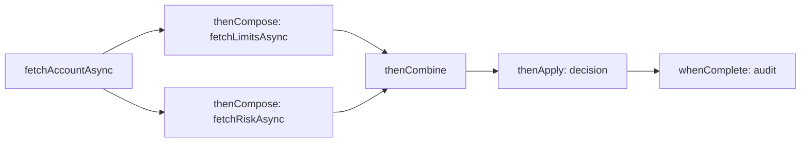
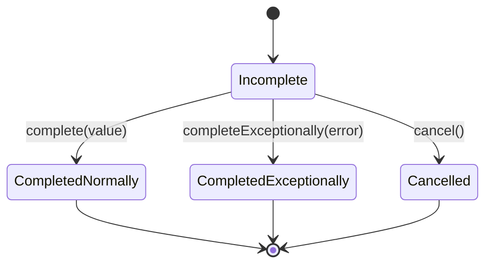
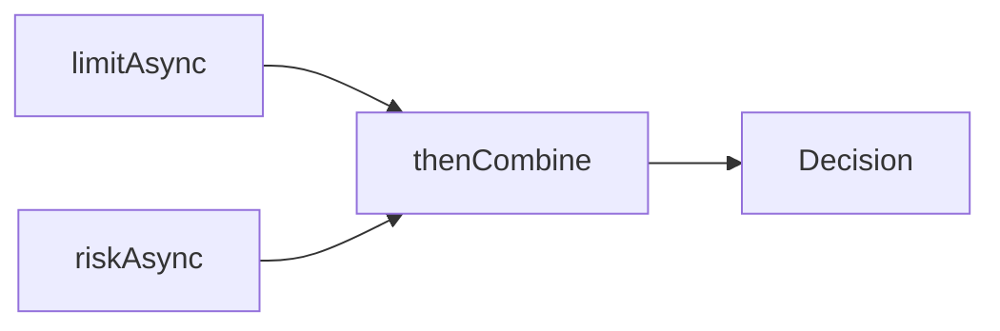
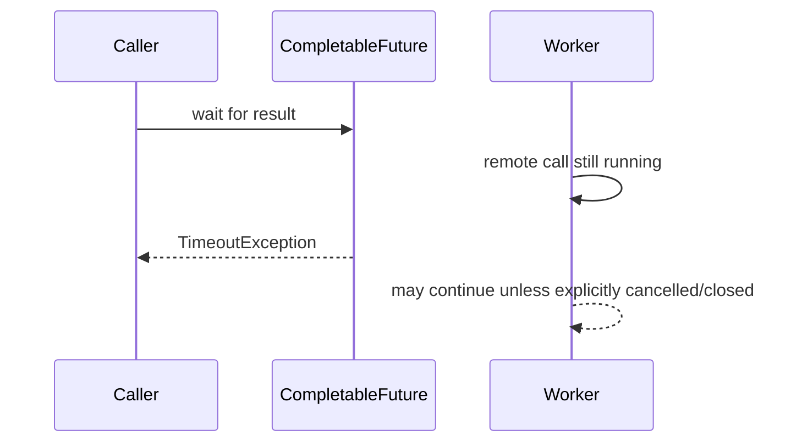

------
title: Learn Java Concurrency & Correctness - Part 021
description: Deep dive CompletableFuture untuk komposisi asynchronous computation, executor ownership, failure flow, timeout, cancellation, dan correctness boundary.
series: learn-java-concurrency-correctness
seriesTitle: Learn Java Concurrency & Correctness
order: 21
partTitle: CompletableFuture Deep Dive
tags:
- java
- concurrency
- completablefuture
- async
- correctness
- series
date: 2026-06-28
---

# Part 021 — CompletableFuture Deep Dive

`CompletableFuture` sering dianggap sebagai “Promise versi Java”. Itu terlalu dangkal. Dalam sistem production, `CompletableFuture` adalah **graph of dependent computations**: setiap node punya status completion, setiap edge mendefinisikan transformasi, dan setiap continuation punya implikasi terhadap executor, exception, timeout, cancellation, context propagation, serta observability.

Tujuan part ini bukan sekadar menghafal method seperti `thenApply`, `thenCompose`, atau `allOf`. Tujuannya adalah membangun mental model agar kita bisa menjawab pertanyaan engineering yang lebih penting:

- Apakah computation ini benar-benar asynchronous atau hanya continuation yang kebetulan dipanggil nanti?
- Thread mana yang menjalankan callback?
- Executor siapa yang dikonsumsi?
- Apa yang terjadi kalau upstream gagal?
- Apakah timeout hanya timeout di caller atau benar-benar menghentikan work?
- Apakah cancellation memutus graph atau membatalkan resource di bawahnya?
- Apakah context request, tracing, MDC, tenant, dan security context ikut terbawa?
- Apakah fan-out/fan-in menghasilkan failure behavior yang bisa diprediksi?

Official contract yang perlu diingat: `CompletableFuture` adalah `Future` yang dapat diselesaikan secara eksplisit dan juga merupakan `CompletionStage` untuk mendukung dependent actions yang dipicu saat completion. `CompletionStage` sendiri merepresentasikan tahap computation yang mungkin asynchronous dan dapat memicu tahap lain saat selesai.

---

## 1. Kaufman Deconstruction

Skill `CompletableFuture` bisa dipecah menjadi delapan sub-skill.

| Sub-skill | Yang harus dikuasai | Failure kalau tidak paham |
|---|---|---|
| Completion lifecycle | normal, exceptional, cancelled, dependent completion | future menggantung, error tertelan, caller menunggu selamanya |
| Stage composition | map, flatMap, combine, race, fan-in | nested future, callback pyramid, result salah urutan |
| Execution context | sync continuation, async continuation, explicit executor | common pool tersaturasi, callback jalan di thread tak terduga |
| Failure flow | `exceptionally`, `handle`, `whenComplete`, wrapping exception | partial failure tidak jelas, retry salah tempat |
| Timeout model | `orTimeout`, `completeOnTimeout`, delayed executor, deadline | timeout palsu, work tetap jalan, resource bocor |
| Cancellation model | cancellation as exceptional completion, downstream propagation | caller mengira work berhenti padahal tidak |
| Context propagation | trace id, MDC, tenant, security, locale | log tidak berkorelasi, authorization context hilang |
| Production design | observability, bounded fan-out, cleanup, testing | incident sulit didiagnosis |

Kaufman-style practice target untuk part ini: setelah 2–3 jam latihan, kita harus bisa membaca chain `CompletableFuture` dan menggambar **execution graph** serta **failure graph** tanpa menjalankan code.

---

## 2. Mental Model: CompletableFuture adalah Completion Graph

Jangan lihat `CompletableFuture` sebagai “sebuah thread”. Ia bukan thread. Ia juga bukan executor. Ia adalah **holder hasil computation** plus mekanisme untuk mendaftarkan dependent stages.



Setiap node punya completion state:



Ingat invariant paling penting:

> Sebuah `CompletableFuture` selesai tepat satu kali secara efektif. Jika banyak thread mencoba `complete`, `completeExceptionally`, atau `cancel`, hanya satu yang menang.

Konsekuensinya besar. Kita bisa menjadikan `CompletableFuture` sebagai **single-assignment cell** untuk result asynchronous. Namun kita tidak boleh menggunakannya untuk mutable shared state yang berubah berkali-kali.

---

## 3. `Future`, `CompletionStage`, dan `CompletableFuture`

### 3.1 `Future`

`Future` menjawab pertanyaan:

> “Apakah task selesai, bisa dibatalkan, dan apa hasilnya kalau saya menunggu?”

Kelemahannya:

- `get()` blocking.
- Composition buruk.
- Exception handling tidak fluent.
- Tidak punya pipeline transformation.

### 3.2 `CompletionStage`

`CompletionStage` menjawab pertanyaan:

> “Apa stage berikutnya setelah computation ini selesai?”

Interface ini cocok untuk API surface karena mengurangi kemampuan caller untuk memaksa completion manual.

```java
public interface PricingClient {
    CompletionStage<PriceQuote> quoteAsync(QuoteRequest request);
}
```

Dengan return type `CompletionStage`, caller bisa compose, tetapi tidak seharusnya bisa `complete()` hasil internal service.

### 3.3 `CompletableFuture`

`CompletableFuture` menjawab dua pertanyaan sekaligus:

> “Bagaimana saya compose stage?” dan “Bagaimana saya menyelesaikan stage ini secara eksplisit?”

Gunakan `CompletableFuture` saat kita memang perlu membuat bridge dari callback, event listener, atau adapter non-standard.

```java
public CompletionStage<Ack> sendAsync(Command command) {
    CompletableFuture<Ack> promise = new CompletableFuture<>();

    client.send(command, new Callback<>() {
        @Override
        public void onSuccess(Ack ack) {
            promise.complete(ack);
        }

        @Override
        public void onFailure(Throwable error) {
            promise.completeExceptionally(error);
        }
    });

    return promise;
}
```

Design rule:

> Return `CompletionStage` dari public API. Pakai `CompletableFuture` di implementation boundary ketika butuh completion control.

---

## 4. Sync Continuation vs Async Continuation

Nama method di `CompletableFuture` punya pola penting.

| Method family | Makna |
|---|---|
| `thenApply` | transform result secara synchronous terhadap completion thread |
| `thenApplyAsync` | transform result lewat async execution facility |
| `thenApplyAsync(fn, executor)` | transform result lewat executor eksplisit |
| `thenCompose` | flat-map ke stage berikutnya |
| `thenCombine` | gabungkan dua stage yang sama-sama selesai normal |
| `exceptionally` | recover dari failure menjadi value |
| `handle` | transform normal/failure menjadi value baru |
| `whenComplete` | observe normal/failure, biasanya untuk side effect |

### 4.1 Non-async method tidak berarti blocking, tetapi continuation-nya bisa inline

```java
CompletionStage<Integer> stage = fetchAsync()
    .thenApply(value -> value + 1)
    .thenApply(value -> value * 10);
```

`thenApply` tidak membuat thread baru. Continuation dapat dijalankan oleh thread yang menyelesaikan upstream stage. Jika upstream selesai oleh IO callback thread, maka callback thread itu bisa menjalankan transformasi kita.

Ini benar untuk transformasi kecil, pure, cepat.

Buruk:

```java
fetchAsync()
    .thenApply(response -> heavyJsonNormalization(response))
    .thenApply(normalized -> expensiveCpuWork(normalized));
```

Jika `heavyJsonNormalization` berat, kita mungkin mengunci callback thread, common pool worker, atau event-loop thread.

### 4.2 Async tanpa executor eksplisit adalah design smell di service production

```java
CompletableFuture.supplyAsync(() -> expensiveCall()); // default executor
```

Async methods tanpa executor eksplisit memakai default asynchronous execution facility. Dalam `CompletableFuture` JDK modern, ini umumnya `ForkJoinPool.commonPool()` untuk async methods tanpa explicit `Executor`.

Problem production:

- common pool dipakai banyak code tak terkait;
- blocking task dapat mengganggu CPU-bound task lain;
- tracing dan naming sulit;
- tuning sulit;
- resource ownership kabur;
- starvation lebih susah dilacak.

Lebih baik:

```java
private final Executor pricingExecutor;

public CompletionStage<Quote> quoteAsync(Request request) {
    return CompletableFuture.supplyAsync(
        () -> pricingEngine.quote(request),
        pricingExecutor
    );
}
```

Rule:

> Di code application/service, hampir selalu berikan executor eksplisit atau gunakan execution model yang lebih cocok seperti virtual threads.

---

## 5. Transformasi: `thenApply` vs `thenCompose`

Ini analog dengan `map` vs `flatMap`.

### 5.1 `thenApply`: synchronous transform value

```java
CompletionStage<CustomerView> view = customerAsync(id)
    .thenApply(customer -> new CustomerView(customer.id(), customer.name()));
```

Gunakan ketika function mengubah `T -> U`.

### 5.2 `thenCompose`: chaining async operation

```java
CompletionStage<Eligibility> eligibility = customerAsync(id)
    .thenCompose(customer -> riskClient.riskAsync(customer.id()))
    .thenCompose(risk -> policyClient.evaluateAsync(risk));
```

Gunakan ketika function mengubah `T -> CompletionStage<U>` dan kita ingin hasil akhirnya `CompletionStage<U>`, bukan `CompletionStage<CompletionStage<U>>`.

Salah:

```java
CompletionStage<CompletionStage<Risk>> nested = customerAsync(id)
    .thenApply(customer -> riskClient.riskAsync(customer.id()));
```

Benar:

```java
CompletionStage<Risk> flat = customerAsync(id)
    .thenCompose(customer -> riskClient.riskAsync(customer.id()));
```

Invariant:

> Jika transformasi memulai async work baru, pakai `thenCompose`, bukan `thenApply`.

---

## 6. Combining: `thenCombine`, `allOf`, dan Typed Fan-in

### 6.1 `thenCombine` untuk dua independent stages

```java
CompletionStage<Decision> decision = limitAsync(accountId)
    .thenCombine(riskAsync(accountId), (limit, risk) ->
        Decision.from(limit, risk)
    );
```

Ini cocok jika dua operation independent.



### 6.2 `allOf` untuk banyak stages, tetapi result-nya `Void`

`CompletableFuture.allOf(...)` berguna untuk barrier, tetapi tidak typed. Kita harus mengumpulkan result sendiri.

```java
public CompletionStage<List<Quote>> quoteAll(List<Provider> providers, Request request) {
    List<CompletableFuture<Quote>> futures = providers.stream()
        .map(provider -> provider.quoteAsync(request).toCompletableFuture())
        .toList();

    CompletableFuture<Void> allDone = CompletableFuture.allOf(
        futures.toArray(CompletableFuture[]::new)
    );

    return allDone.thenApply(ignored -> futures.stream()
        .map(CompletableFuture::join)
        .toList()
    );
}
```

Catatan correctness:

- `join()` di atas aman setelah `allDone` selesai normal.
- Jika salah satu future gagal, `allDone` juga selesai exceptional.
- Jika ingin partial success, jangan gunakan pattern ini mentah-mentah.

### 6.3 Typed helper untuk menghindari noise

```java
public static <T> CompletionStage<List<T>> sequence(
    List<? extends CompletionStage<? extends T>> stages
) {
    List<CompletableFuture<? extends T>> futures = stages.stream()
        .map(CompletionStage::toCompletableFuture)
        .toList();

    CompletableFuture<Void> all = CompletableFuture.allOf(
        futures.toArray(CompletableFuture[]::new)
    );

    return all.thenApply(ignored -> futures.stream()
        .map(CompletableFuture::join)
        .map(value -> (T) value)
        .toList()
    );
}
```

Dalam production code, lebih baik bungkus result per item agar partial failure eksplisit:

```java
public sealed interface Attempt<T> permits Attempt.Success, Attempt.Failure {
    record Success<T>(T value) implements Attempt<T> {}
    record Failure<T>(Throwable error) implements Attempt<T> {}
}
```

```java
public static <T> CompletionStage<Attempt<T>> attempt(CompletionStage<T> stage) {
    return stage.handle((value, error) -> {
        if (error == null) {
            return new Attempt.Success<>(value);
        }
        return new Attempt.Failure<T>(unwrapCompletion(error));
    });
}
```

---

## 7. Race: `applyToEither` dan First-Winner Semantics

Kadang kita ingin hasil tercepat dari beberapa provider.

```java
CompletionStage<Quote> quote = primary.quoteAsync(request)
    .applyToEither(secondary.quoteAsync(request), Function.identity());
```

Ini kelihatan sederhana, tetapi ada jebakan:

- provider yang kalah belum tentu dibatalkan;
- resource provider kalah bisa tetap berjalan;
- jika yang tercepat gagal, semantics harus dipahami;
- audit harus menyimpan provider mana yang menang;
- timeout global tetap dibutuhkan.

Pattern lebih eksplisit:

```java
record ProviderQuote(String provider, Quote quote) {}

CompletionStage<ProviderQuote> primaryStage = primary.quoteAsync(request)
    .thenApply(quote -> new ProviderQuote("primary", quote));

CompletionStage<ProviderQuote> secondaryStage = secondary.quoteAsync(request)
    .thenApply(quote -> new ProviderQuote("secondary", quote));

CompletionStage<ProviderQuote> fastest = primaryStage.applyToEither(
    secondaryStage,
    Function.identity()
);
```

Untuk production, first-winner biasanya harus disertai:

- cancellation attempt terhadap losers;
- metric untuk loser completion;
- cleanup;
- policy jika first completion adalah failure.

---

## 8. Exception Flow

Exception di `CompletableFuture` tidak berjalan seperti exception synchronous biasa. Ia menjadi **exceptional completion**.

```java
CompletionStage<Invoice> stage = fetchOrderAsync(orderId)
    .thenApply(this::toInvoice)
    .exceptionally(error -> fallbackInvoice(orderId, error));
```

### 8.1 `exceptionally`

`exceptionally` hanya jalan saat upstream gagal dan mengubah failure menjadi value.

```java
CompletionStage<UserProfile> profile = userClient.fetchAsync(userId)
    .exceptionally(error -> UserProfile.anonymous(userId));
```

Cocok untuk fallback yang valid secara domain.

Buruk:

```java
.exceptionally(error -> null)
```

Ini mengubah failure menjadi `NullPointerException` jauh di downstream. Jangan sembunyikan failure dengan `null`.

### 8.2 `handle`

`handle` menerima value atau error dan selalu menghasilkan value baru.

```java
CompletionStage<Result<Quote>> result = quoteAsync(request)
    .handle((quote, error) -> {
        if (error == null) {
            return Result.success(quote);
        }
        return Result.failure(unwrapCompletion(error));
    });
```

Cocok saat kita ingin mengubah success/failure menjadi model result eksplisit.

### 8.3 `whenComplete`

`whenComplete` dipakai untuk observability/cleanup, bukan recovery utama.

```java
CompletionStage<Decision> decision = decideAsync(command)
    .whenComplete((value, error) -> {
        if (error == null) {
            metrics.increment("decision.success");
        } else {
            metrics.increment("decision.failure");
        }
    });
```

Jebakan: exception dalam `whenComplete` bisa mempengaruhi stage hasil. Keep side effect safe.

```java
.whenComplete((value, error) -> {
    try {
        audit(value, error);
    } catch (Exception auditError) {
        logger.warn("audit failed", auditError);
    }
})
```

### 8.4 Unwrap exception secara sadar

Banyak failure dibungkus dalam `CompletionException` atau `ExecutionException`.

```java
public static Throwable unwrapCompletion(Throwable error) {
    Throwable current = error;
    while (current instanceof CompletionException || current instanceof ExecutionException) {
        if (current.getCause() == null) {
            return current;
        }
        current = current.getCause();
    }
    return current;
}
```

Rule:

> Jangan membuat retry, fallback, atau mapping error domain tanpa unwrap policy yang konsisten.

---

## 9. Timeout: Caller Timeout vs Work Cancellation

Timeout adalah salah satu sumber ilusi terbesar.

```java
CompletionStage<Quote> quote = quoteClient.quoteAsync(request)
    .toCompletableFuture()
    .orTimeout(300, TimeUnit.MILLISECONDS);
```

`orTimeout` membuat `CompletableFuture` selesai exceptional jika timeout tercapai. Tetapi itu tidak otomatis berarti work underlying berhenti.



### 9.1 `orTimeout`

Gunakan ketika timeout harus menjadi failure.

```java
CompletionStage<Response> response = remoteCallAsync(request)
    .toCompletableFuture()
    .orTimeout(500, TimeUnit.MILLISECONDS);
```

### 9.2 `completeOnTimeout`

Gunakan ketika timeout punya fallback value yang domain-valid.

```java
CompletionStage<RiskScore> score = riskClient.scoreAsync(accountId)
    .toCompletableFuture()
    .completeOnTimeout(RiskScore.unknown(), 200, TimeUnit.MILLISECONDS);
```

Jangan gunakan fallback default jika domain sebenarnya membutuhkan hard failure.

### 9.3 Deadline lebih baik daripada timeout lokal acak

Jika request punya budget 2 detik, setiap downstream tidak boleh asal membuat timeout 2 detik sendiri.

```java
record Deadline(Instant expiresAt) {
    Duration remaining(Clock clock) {
        return Duration.between(clock.instant(), expiresAt).isNegative()
            ? Duration.ZERO
            : Duration.between(clock.instant(), expiresAt);
    }
}
```

```java
CompletionStage<Decision> decide(Command command, Deadline deadline) {
    Duration riskBudget = min(deadline.remaining(clock), Duration.ofMillis(250));

    return riskClient.scoreAsync(command.accountId())
        .toCompletableFuture()
        .orTimeout(riskBudget.toMillis(), TimeUnit.MILLISECONDS)
        .thenApply(score -> Decision.from(score));
}
```

Rule:

> Timeout harus didesain sebagai contract budget, bukan angka magic tersebar.

---

## 10. Cancellation: Bukan Selalu Interruption

`CompletableFuture.cancel(true)` sering disalahpahami. Pada `CompletableFuture`, cancellation adalah bentuk exceptional completion. Ini tidak boleh diasumsikan menghentikan computation yang sedang berjalan di executor atau remote IO.

```java
CompletableFuture<Quote> future = CompletableFuture.supplyAsync(() -> {
    return slowBlockingCall();
}, executor);

future.cancel(true);
```

Caller melihat future cancelled. Tetapi worker yang menjalankan `slowBlockingCall()` belum tentu berhenti.

### 10.1 Cancellation contract harus eksplisit

Jika API mengklaim cancellable, ia harus punya mekanisme membatalkan resource bawah:

```java
public interface CancellableStage<T> {
    CompletionStage<T> stage();
    boolean cancel(String reason);
}
```

Atau gunakan resource-specific handle:

```java
public final class HttpCallStage<T> {
    private final CompletableFuture<T> future;
    private final HttpRequestHandle handle;

    public CompletionStage<T> stage() {
        return future;
    }

    public boolean cancel() {
        boolean accepted = handle.abort();
        future.cancel(false);
        return accepted;
    }
}
```

### 10.2 Downstream cancellation propagation tidak otomatis cukup

```java
CompletionStage<B> b = a.thenCompose(this::callBAsync);
```

Jika caller membatalkan `b`, belum tentu `a` atau call B yang sedang berjalan ikut berhenti. Design cancellation pada `CompletableFuture` harus diuji, bukan diasumsikan.

---

## 11. Executor Ownership

Async code harus menjawab: **executor siapa yang menjalankan apa?**

Buruk:

```java
return CompletableFuture.supplyAsync(() -> callPartner(request))
    .thenApplyAsync(this::normalize)
    .thenApplyAsync(this::score);
```

Masalah:

- semua async stage default ke common pool;
- blocking IO dan CPU normalization campur;
- tidak ada isolation antar domain;
- susah tuning;
- failure satu component bisa menekan component lain.

Lebih baik:

```java
return CompletableFuture.supplyAsync(() -> callPartner(request), partnerIoExecutor)
    .thenApplyAsync(this::normalize, cpuExecutor)
    .thenApplyAsync(this::score, scoringExecutor);
```

Namun jangan over-fragment executor tanpa alasan. Setiap executor adalah resource governance boundary.

Decision matrix:

| Work type | Executor strategy |
|---|---|
| CPU-bound pure transform | fixed-size CPU executor atau inline jika ringan |
| Blocking IO legacy | bounded executor atau virtual threads + semaphore/resource limit |
| Event loop callback | jangan block; offload work berat |
| Short pure mapping | non-async continuation biasanya cukup |
| Long-running task | dedicated executor dengan lifecycle jelas |
| Untrusted plugin/user logic | isolated executor + timeout + circuit/bulkhead |

---

## 12. Context Propagation

`CompletableFuture` tidak otomatis membawa semua context application.

Contoh yang sering hilang:

- correlation id;
- trace/span context;
- MDC logging;
- tenant id;
- locale;
- auth/security subject;
- request deadline.

ThreadLocal-based context rentan hilang ketika stage pindah executor.

```java
CompletableFuture.supplyAsync(() -> {
    // MDC may be empty here unless explicitly propagated
    return callPartner();
}, executor);
```

Salah satu pattern adalah wrapper executor:

```java
public final class ContextAwareExecutor implements Executor {
    private final Executor delegate;
    private final RequestContextSnapshot snapshot;

    public ContextAwareExecutor(Executor delegate, RequestContextSnapshot snapshot) {
        this.delegate = delegate;
        this.snapshot = snapshot;
    }

    @Override
    public void execute(Runnable command) {
        delegate.execute(() -> {
            RequestContext previous = RequestContext.install(snapshot);
            try {
                command.run();
            } finally {
                RequestContext.restore(previous);
            }
        });
    }
}
```

Namun context propagation harus dibatasi. Jangan menyebarkan object mutable besar. Propagate immutable snapshot.

---

## 13. Bounded Fan-out

Async membuat fan-out terasa murah. Itu jebakan.

Buruk:

```java
List<CompletionStage<Result>> stages = ids.stream()
    .map(id -> client.fetchAsync(id))
    .toList();
```

Jika `ids` berisi 50.000 item, kita bisa membanjiri executor, connection pool, remote system, memory, dan queue.

Gunakan bounded concurrency.

```java
public <T, R> CompletionStage<List<R>> mapBounded(
    List<T> items,
    int concurrency,
    Function<T, CompletionStage<R>> mapper,
    Executor executor
) {
    Semaphore permits = new Semaphore(concurrency);

    List<CompletionStage<R>> stages = items.stream()
        .map(item -> CompletableFuture.runAsync(() -> {
            try {
                permits.acquire();
            } catch (InterruptedException e) {
                Thread.currentThread().interrupt();
                throw new CompletionException(e);
            }
        }, executor).thenCompose(ignored ->
            mapper.apply(item).whenComplete((r, e) -> permits.release())
        ))
        .toList();

    return sequence(stages);
}
```

Catatan: pattern di atas pedagogis. Untuk production, pertimbangkan queue/worker, structured concurrency, reactive streams, atau library yang sudah mengelola backpressure.

Invariant:

> Fan-out harus punya bound yang berkaitan dengan resource bottleneck: connection pool, remote RPS, CPU, memory, atau business quota.

---

## 14. Blocking dengan CompletableFuture

`CompletableFuture` sering digunakan untuk membungkus blocking call.

```java
CompletableFuture.supplyAsync(() -> jdbcCall(), executor);
```

Ini bukan non-blocking. Ini hanya memindahkan blocking ke thread lain.

Di era virtual threads, untuk banyak kasus request/response blocking IO, code synchronous di virtual thread lebih sederhana dan lebih mudah dipahami:

```java
try (ExecutorService executor = Executors.newVirtualThreadPerTaskExecutor()) {
    Future<Quote> quote = executor.submit(() -> partnerClient.quote(request));
    return quote.get(500, TimeUnit.MILLISECONDS);
}
```

Namun `CompletableFuture` tetap berguna ketika:

- API dependency memang async;
- perlu compose banyak stage independent;
- perlu bridge callback;
- perlu non-blocking integration boundary;
- perlu express dependency graph;
- library framework return `CompletionStage`.

Rule:

> Jangan memakai `CompletableFuture` untuk membuat code blocking terlihat modern. Pakai karena graph composition-nya memang dibutuhkan.

---

## 15. Common Anti-patterns

### 15.1 Blocking inside common pool

```java
CompletableFuture.supplyAsync(() -> blockingHttpCall());
```

Ini memakai common pool secara implisit. Gunakan executor eksplisit atau virtual threads.

### 15.2 `join()` di tengah chain

```java
return aAsync()
    .thenApply(a -> bAsync(a).toCompletableFuture().join());
```

Ini mengubah async composition menjadi blocking. Gunakan `thenCompose`.

```java
return aAsync()
    .thenCompose(this::bAsync);
```

### 15.3 Error swallowing

```java
.exceptionally(error -> null)
```

Gunakan fallback domain-valid atau result object.

### 15.4 Unbounded fan-out

```java
ids.stream().map(this::callAsync).toList();
```

Tambahkan bound.

### 15.5 Mixing business logic and threading logic everywhere

Buruk:

```java
public CompletionStage<Decision> decide(Command command) {
    return CompletableFuture.supplyAsync(() -> step1(command), executor1)
        .thenApplyAsync(this::step2, executor2)
        .thenComposeAsync(this::step3Async, executor3)
        .thenApplyAsync(this::step4, executor4);
}
```

Lebih baik pisahkan orchestration, policy, dan computation.

---

## 16. Production Pattern: Explicit Async Boundary

```java
public final class PartnerQuoteService {
    private final PartnerClient client;
    private final Executor partnerExecutor;
    private final Clock clock;

    public CompletionStage<Quote> quoteAsync(QuoteCommand command, Deadline deadline) {
        Duration remaining = deadline.remaining(clock);
        if (remaining.isZero()) {
            return CompletableFuture.failedFuture(new TimeoutException("deadline exceeded before partner call"));
        }

        return CompletableFuture
            .supplyAsync(() -> client.quote(command), partnerExecutor)
            .orTimeout(remaining.toMillis(), TimeUnit.MILLISECONDS)
            .whenComplete((quote, error) -> recordMetrics(command, quote, error));
    }

    private void recordMetrics(QuoteCommand command, Quote quote, Throwable error) {
        try {
            if (error == null) {
                // metrics.success(command.partner())
            } else {
                // metrics.failure(command.partner(), unwrapCompletion(error))
            }
        } catch (RuntimeException metricsError) {
            // never allow metrics failure to change business result
        }
    }
}
```

Strength:

- executor explicit;
- timeout derived from deadline;
- failure not hidden;
- metrics isolated;
- public API is `CompletionStage`;
- blocking dependency isolated behind executor.

Weakness:

- underlying work may still continue after timeout;
- cancellation requires client support;
- context propagation must be handled separately.

---

## 17. Observability Checklist

Untuk setiap async graph, pastikan kita bisa menjawab:

| Question | Why it matters |
|---|---|
| Berapa banyak stage created? | fan-out explosion |
| Executor mana yang menjalankan stage berat? | saturation diagnosis |
| Berapa queue depth executor? | overload early signal |
| Berapa age task sebelum mulai jalan? | hidden queuing latency |
| Failure type apa yang dominan? | remote vs local vs timeout |
| Timeout terjadi di stage mana? | budget allocation |
| Apakah cancellation diminta? | caller abort pattern |
| Apakah underlying work tetap berjalan setelah timeout? | resource leakage |
| Apakah trace id konsisten di semua callback? | incident correlation |

Minimal production metrics:

- async operation started/completed/failed/timed out;
- duration from request start to completion;
- executor active count;
- executor queue depth;
- task rejection count;
- fan-out size;
- timeout budget remaining;
- fallback count;
- cancellation count.

---

## 18. Testing CompletableFuture Code

### 18.1 Hindari sleep-based test

Buruk:

```java
Thread.sleep(100);
assertTrue(stage.toCompletableFuture().isDone());
```

Lebih baik gunakan controllable future.

```java
@Test
void mapsCustomerToViewAfterCompletion() {
    CompletableFuture<Customer> source = new CompletableFuture<>();

    CompletionStage<CustomerView> view = source.thenApply(customer ->
        new CustomerView(customer.id(), customer.name())
    );

    source.complete(new Customer("C-1", "Ari"));

    assertEquals("Ari", view.toCompletableFuture().join().name());
}
```

### 18.2 Test exceptional path

```java
@Test
void recoversWithAnonymousProfile() {
    CompletableFuture<UserProfile> source = new CompletableFuture<>();

    CompletionStage<UserProfile> stage = source
        .exceptionally(error -> UserProfile.anonymous("U-1"));

    source.completeExceptionally(new RuntimeException("downstream failed"));

    assertEquals("U-1", stage.toCompletableFuture().join().userId());
}
```

### 18.3 Test executor usage

Gunakan executor test yang mencatat tasks.

```java
public final class RecordingExecutor implements Executor {
    private final Queue<Runnable> tasks = new ArrayDeque<>();

    @Override
    public void execute(Runnable command) {
        tasks.add(command);
    }

    public int queuedTasks() {
        return tasks.size();
    }

    public void runNext() {
        Runnable task = tasks.remove();
        task.run();
    }
}
```

```java
@Test
void usesProvidedExecutorForAsyncStage() {
    RecordingExecutor executor = new RecordingExecutor();

    CompletableFuture<Integer> source = new CompletableFuture<>();
    CompletionStage<Integer> stage = source.thenApplyAsync(x -> x + 1, executor);

    source.complete(41);

    assertEquals(1, executor.queuedTasks());
    executor.runNext();
    assertEquals(42, stage.toCompletableFuture().join());
}
```

---

## 19. Decision Matrix

| Need | Better choice |
|---|---|
| Compose async dependency graph | `CompletionStage` / `CompletableFuture` |
| Simple request-per-task blocking IO | virtual thread often simpler |
| CPU parallel decomposition | `ForkJoinPool` or explicit CPU executor |
| Streaming with backpressure | Reactive Streams / `Flow` / Reactor |
| Bounded producer-consumer pipeline | `BlockingQueue` / worker pool |
| One-shot signal | `CompletableFuture` or `CountDownLatch` depending API shape |
| Explicit cancellation tree | structured concurrency when available/applicable |
| Callback bridge | `CompletableFuture` as promise |

---

## 20. Code Review Checklist

Sebelum approve code `CompletableFuture`, tanyakan:

- Apakah public API return `CompletionStage` kecuali ada alasan kuat return `CompletableFuture`?
- Apakah setiap async method memakai executor eksplisit?
- Apakah callback berat tidak berjalan inline di thread sensitif?
- Apakah blocking call tidak masuk common pool?
- Apakah `thenCompose` digunakan untuk async chaining?
- Apakah `join()`/`get()` tidak muncul di tengah chain?
- Apakah timeout berasal dari deadline/budget yang jelas?
- Apakah cancellation behavior jujur dan terdokumentasi?
- Apakah exceptional flow tidak ditelan dengan `null`?
- Apakah fan-out dibatasi?
- Apakah context propagation aman?
- Apakah observability cukup untuk incident?
- Apakah test mencakup success, failure, timeout, cancellation, dan executor behavior?

---

## 21. Practice Drills

### Drill 1 — Draw the graph

Ambil chain berikut dan gambar execution graph + failure graph:

```java
return accountAsync(id)
    .thenCompose(account -> limitAsync(account.id())
        .thenCombine(riskAsync(account.id()), DecisionInput::new))
    .thenApply(this::decide)
    .orTimeout(300, TimeUnit.MILLISECONDS)
    .exceptionally(this::fallback);
```

Jawab:

- stage mana yang dependent?
- stage mana yang independent?
- timeout berlaku di graph mana?
- fallback menangani error apa saja?
- thread mana yang menjalankan setiap callback?

### Drill 2 — Refactor blocking join

Ubah ini menjadi async composition yang benar:

```java
return userAsync(id)
    .thenApply(user -> orderAsync(user.id()).toCompletableFuture().join())
    .thenApply(order -> summary(order));
```

Target:

```java
return userAsync(id)
    .thenCompose(user -> orderAsync(user.id()))
    .thenApply(this::summary);
```

### Drill 3 — Add deadline-aware timeout

Buat helper:

```java
public static <T> CompletionStage<T> withDeadline(
    CompletionStage<T> stage,
    Deadline deadline,
    Clock clock
) {
    Duration remaining = deadline.remaining(clock);
    if (remaining.isZero()) {
        return CompletableFuture.failedFuture(new TimeoutException("deadline exceeded"));
    }
    return stage.toCompletableFuture()
        .orTimeout(remaining.toMillis(), TimeUnit.MILLISECONDS);
}
```

Diskusikan: apakah helper ini membatalkan underlying work? Tidak otomatis.

---

## 22. Key Takeaways

- `CompletableFuture` adalah completion graph, bukan thread.
- `CompletionStage` lebih aman sebagai public API surface.
- Non-async continuation bisa jalan di completion thread.
- Async tanpa executor eksplisit biasanya tidak cukup production-grade.
- `thenCompose` adalah primitive utama untuk chaining async work.
- `allOf` adalah barrier, bukan typed aggregator.
- Exception berubah menjadi exceptional completion.
- Timeout pada future belum tentu menghentikan underlying work.
- Cancellation harus dianggap contract eksplisit, bukan magic.
- Context propagation harus dirancang; jangan diasumsikan.
- Fan-out async harus bounded.
- Di era virtual threads, gunakan `CompletableFuture` karena composition-nya, bukan karena ingin menyamarkan blocking code.

---

## References

- Java SE 25 API — `CompletableFuture`
- Java SE 25 API — `CompletionStage`
- Java SE 25 API — `Executor`, `ExecutorService`, `Executors`
- Java Language Specification, Chapter 17 — Threads and Locks
- OpenJDK JEP 444 — Virtual Threads
