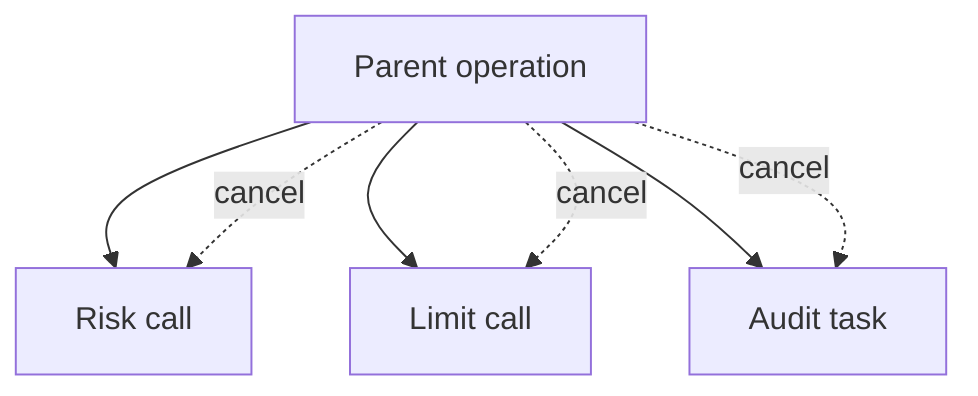
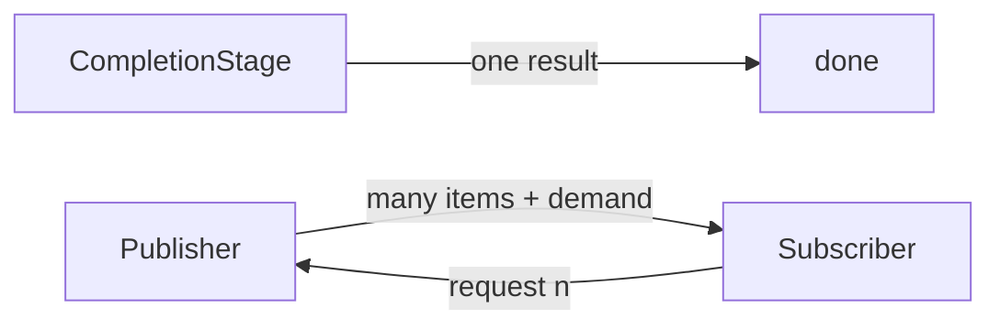

------
title: Learn Java Concurrency & Correctness - Part 022
description: Desain API asynchronous yang production-grade: contract, executor ownership, timeout, cancellation, context propagation, backpressure, observability, dan compatibility dengan virtual threads/reactive programming.
series: learn-java-concurrency-correctness
seriesTitle: Learn Java Concurrency & Correctness
order: 22
partTitle: Async API Design
tags:
- java
- concurrency
- async-api
- completablefuture
- correctness
- architecture
- series
date: 2026-06-28
---

# Part 022 — Async API Design

Part sebelumnya membahas `CompletableFuture` sebagai primitive komposisi. Part ini naik satu level: **bagaimana mendesain API async yang benar**.

API async bukan sekadar method yang return `CompletableFuture`. API async adalah contract tentang lifetime, ownership, failure, timeout, cancellation, threading, context, resource budget, dan observability.

Banyak sistem production gagal bukan karena developer tidak tahu `thenCompose`, tetapi karena API-nya tidak menjawab pertanyaan berikut:

- Kapan work benar-benar dimulai?
- Siapa pemilik executor?
- Apakah callback boleh berjalan di thread caller?
- Apakah caller boleh membatalkan?
- Kalau timeout terjadi, apakah work bawah dihentikan?
- Failure apa yang bisa muncul?
- Apakah context request ikut terbawa?
- Apakah ada limit fan-out?
- Bagaimana tracing dan metrics dilakukan?
- Apakah API ini akan tetap masuk akal di era virtual threads?

Mental model utama:

> Async API adalah boundary contract, bukan implementation detail.

---

## 1. Kaufman Deconstruction

Untuk menguasai desain async API, pecah skill-nya menjadi sembilan komponen.

| Skill | Pertanyaan inti | Output design |
|---|---|---|
| Surface selection | Return type apa yang paling tepat? | sync, `CompletionStage`, `Publisher`, callback, handle |
| Start semantics | Work mulai kapan? | eager, lazy, deferred, subscribed |
| Execution ownership | Thread/executor siapa? | explicit executor policy |
| Completion semantics | Selesai normal/failure/cancel bagaimana? | documented state model |
| Timeout/deadline | Budget siapa yang berlaku? | deadline propagation |
| Cancellation | Apa yang benar-benar dibatalkan? | cancellation contract |
| Context propagation | Context apa yang ikut? | immutable context snapshot |
| Resource governance | Berapa concurrency maksimum? | bulkhead/backpressure |
| Observability | Bagaimana incident ditelusuri? | metrics/tracing/log fields |

Target kompetensi: setelah part ini, kita harus bisa menulis contract async service yang bisa direview oleh engineer platform, SRE, security, dan domain team tanpa “hidden behavior”.

---

## 2. Jangan Mulai dari Return Type

Kesalahan umum: langsung bertanya “pakai `CompletableFuture` atau Reactor?”

Pertanyaan yang benar:

1. Work ini single result atau stream?
2. Work ini CPU-bound, IO-bound, event-driven, atau long-running?
3. Apakah caller butuh composition atau cukup result synchronous?
4. Apakah caller harus bisa cancel?
5. Apakah ada backpressure?
6. Apakah concurrency harus dibatasi?
7. Apakah context harus ikut?
8. Apakah API ini internal process boundary atau public library boundary?
9. Apakah platform target memakai virtual threads, event loop, atau thread pool klasik?

Baru setelah itu pilih surface.

---

## 3. API Surface Decision Matrix

| Surface | Cocok untuk | Tidak cocok untuk |
|---|---|---|
| Synchronous return | Operation cepat atau virtual-thread-friendly blocking IO | composition graph kompleks, event-driven callback |
| `CompletionStage<T>` | single async result, composable, caller tidak perlu complete manual | stream multi-result, backpressure protocol |
| `CompletableFuture<T>` | internal promise/bridge callback | public API yang tidak boleh di-complete caller |
| `Future<T>` | legacy executor integration sederhana | fluent async composition |
| Callback | bridging legacy/event API | domain API baru yang butuh composition bersih |
| `Flow.Publisher<T>` / Reactive Streams | stream, backpressure, multiple items | simple one-shot request-response |
| Custom handle | cancellation/resource lifecycle penting | simple one-shot pure computation |

Default untuk Java application service:

```java
public interface RiskClient {
    CompletionStage<RiskScore> scoreAsync(RiskRequest request);
}
```

Bukan:

```java
public interface RiskClient {
    CompletableFuture<RiskScore> scoreAsync(RiskRequest request);
}
```

Kecuali caller memang perlu `CompletableFuture`-specific API, return `CompletionStage`.

---

## 4. Start Semantics: Eager, Lazy, atau On-Subscribe?

Async API harus menjelaskan kapan work dimulai.

### 4.1 Eager async

```java
CompletionStage<Quote> quoteAsync(QuoteRequest request);
```

Biasanya work dimulai saat method dipanggil.

Kelebihan:

- sederhana;
- cocok untuk service call;
- caller bisa langsung compose.

Kelemahan:

- caller tidak bisa membangun graph tanpa memulai work;
- jika stage tidak pernah diamati, work tetap jalan;
- sulit untuk deferred retry policy.

### 4.2 Lazy supplier

```java
Supplier<CompletionStage<Quote>> quotePlan(QuoteRequest request);
```

Work baru dimulai saat supplier dieksekusi.

Kelebihan:

- caller bisa membangun plan;
- cocok untuk retry/orchestration;
- lebih jelas kapan resource dipakai.

Kelemahan:

- API lebih berat;
- caller harus disiplin;
- bisa dieksekusi berkali-kali jika tidak didesain idempotent.

### 4.3 Reactive on-subscribe

```java
Flow.Publisher<Event> events(EventQuery query);
```

Dalam model reactive, work biasanya dimulai ketika ada subscriber dan demand.

Kelebihan:

- backpressure protocol;
- cocok untuk stream;
- demand-driven.

Kelemahan:

- complexity tinggi;
- debugging lebih sulit;
- tidak ideal untuk simple one-shot.

Design rule:

> Dokumentasikan start semantics. Jangan biarkan caller menebak apakah method call sudah memulai work.

---

## 5. Completion Contract

Async API minimal harus menyatakan:

- apa arti completion normal;
- exception apa yang mungkin muncul;
- apakah cancellation possible;
- apakah timeout direpresentasikan sebagai exception, fallback, atau status domain;
- apakah partial result mungkin;
- apakah retry dilakukan internal atau external;
- apakah completion order punya makna.

Contoh contract yang buruk:

```java
CompletionStage<Decision> decideAsync(Command command);
```

Tidak jelas:

- timeout berapa?
- executor siapa?
- cancellation bagaimana?
- exception apa?
- apakah idempotent?
- context dari mana?

Contract lebih baik:

```java
/**
 * Starts an asynchronous eligibility decision for a single command.
 *
 * Semantics:
 * - Work starts eagerly when this method is called.
 * - Returned stage completes normally with a final domain decision.
 * - Returned stage completes exceptionally for validation, dependency, timeout,
 *   or internal execution failure.
 * - The method does not retry dependency calls internally.
 * - Timeout is derived from the supplied Deadline.
 * - Cancelling the returned stage marks the caller-visible stage as cancelled,
 *   but does not guarantee remote dependency cancellation.
 * - Blocking dependency calls run on the service-owned dependency executor.
 * - The supplied RequestContext is captured as an immutable snapshot.
 */
CompletionStage<Decision> decideAsync(
    Command command,
    Deadline deadline,
    RequestContext context
);
```

API comment bukan pengganti design, tetapi membantu menjaga invariant antar team.

---

## 6. Executor Ownership

Pertanyaan paling penting:

> Apakah caller atau callee yang memilih executor?

### 6.1 Callee-owned executor

```java
public final class PartnerClient {
    private final Executor ioExecutor;

    public CompletionStage<PartnerResponse> callAsync(PartnerRequest request) {
        return CompletableFuture.supplyAsync(() -> callBlocking(request), ioExecutor);
    }
}
```

Cocok untuk service/library yang ingin menyembunyikan execution policy internal.

Kelebihan:

- caller sederhana;
- callee bisa mengontrol bulkhead;
- metrics executor bisa domain-specific.

Risiko:

- caller tidak tahu resource cost;
- banyak client bisa membuat banyak executor;
- lifecycle executor harus dikelola.

### 6.2 Caller-provided executor

```java
CompletionStage<PartnerResponse> callAsync(
    PartnerRequest request,
    Executor executor
);
```

Cocok untuk low-level library atau framework integration.

Kelebihan:

- caller mengontrol resource;
- library tidak membuat thread sendiri;
- test lebih mudah.

Risiko:

- caller bisa memberi executor salah;
- API lebih noisy;
- responsibility bisa kabur.

### 6.3 Hybrid: builder/configured executor

```java
PartnerClient client = PartnerClient.builder()
    .executor(partnerExecutor)
    .timeout(Duration.ofMillis(300))
    .build();
```

Ini sering paling baik untuk reusable client.

Design rule:

> Public async API harus punya executor ownership yang eksplisit: callee-owned, caller-provided, atau configured at construction. Jangan diam-diam memakai common pool untuk business service.

---

## 7. Threading Contract

API async harus menjawab: callback caller akan dijalankan di mana?

Misalnya:

```java
CompletionStage<Result> stage = client.callAsync(request);
stage.thenApply(this::transform);
```

Jika `callAsync` menyelesaikan stage dari IO callback thread, `thenApply` caller bisa berjalan di IO callback thread. Ini mungkin acceptable atau sangat berbahaya.

Ada beberapa approach.

### 7.1 Document “no callback thread guarantee”

```text
Dependent non-async stages may run on the thread that completes the returned stage.
Callers must offload heavy continuations using their own executor.
```

Ini umum dan realistis.

### 7.2 Normalize completion onto executor

```java
public CompletionStage<Response> callAsync(Request request) {
    CompletableFuture<Response> promise = new CompletableFuture<>();

    rawClient.call(request, new Callback<>() {
        @Override
        public void success(Response response) {
            completionExecutor.execute(() -> promise.complete(response));
        }

        @Override
        public void failure(Throwable error) {
            completionExecutor.execute(() -> promise.completeExceptionally(error));
        }
    });

    return promise;
}
```

Kelebihan:

- callback caller tidak jalan di event loop/raw callback thread;
- lebih predictable.

Kelemahan:

- ada scheduling cost;
- executor bisa saturasi;
- completion ordering perlu dipahami.

### 7.3 Return async boundary helper

```java
public CompletionStage<Response> callAsync(Request request, Executor continuationExecutor) {
    return callAsync(request).thenApplyAsync(Function.identity(), continuationExecutor);
}
```

Tidak selalu elegant, tetapi kadang berguna di framework boundary.

---

## 8. Timeout and Deadline Design

Timeout lokal tersebar adalah tanda design lemah.

Buruk:

```java
riskClient.scoreAsync(request).orTimeout(500, TimeUnit.MILLISECONDS);
limitClient.limitAsync(request).orTimeout(500, TimeUnit.MILLISECONDS);
auditClient.auditAsync(request).orTimeout(500, TimeUnit.MILLISECONDS);
```

Jika parent request budget 700 ms, tiga timeout 500 ms tidak berarti sistem selesai dalam 700 ms.

Gunakan deadline.

```java
public record Deadline(Instant expiresAt) {
    public Duration remaining(Clock clock) {
        Duration d = Duration.between(clock.instant(), expiresAt);
        return d.isNegative() ? Duration.ZERO : d;
    }

    public Deadline subBudget(Clock clock, Duration max) {
        Duration remaining = remaining(clock);
        Duration selected = remaining.compareTo(max) < 0 ? remaining : max;
        return new Deadline(clock.instant().plus(selected));
    }
}
```

```java
public CompletionStage<Decision> decideAsync(
    Command command,
    Deadline deadline,
    RequestContext context
) {
    Deadline riskDeadline = deadline.subBudget(clock, Duration.ofMillis(250));
    Deadline limitDeadline = deadline.subBudget(clock, Duration.ofMillis(250));

    CompletionStage<RiskScore> risk = riskClient.scoreAsync(command, riskDeadline, context);
    CompletionStage<Limit> limit = limitClient.limitAsync(command, limitDeadline, context);

    return risk.thenCombine(limit, DecisionInput::new)
        .thenApply(policy::decide)
        .toCompletableFuture()
        .orTimeout(deadline.remaining(clock).toMillis(), TimeUnit.MILLISECONDS);
}
```

Important distinction:

| Concept | Meaning |
|---|---|
| Timeout | Relative duration from now |
| Deadline | Absolute expiry instant |
| Budget | Allowed remaining time for an operation |
| Cancellation | Request to stop work |
| Abort | Concrete resource-level stop mechanism |

Rule:

> API boundary sebaiknya menerima `Deadline`, bukan angka timeout mentah, jika operation berada dalam request chain.

---

## 9. Cancellation Contract

Cancellation harus jujur. Jangan tulis “supports cancellation” jika yang terjadi hanya caller-visible stage berubah cancelled.

### 9.1 Three levels of cancellation

| Level | Meaning | Example |
|---|---|---|
| Caller-visible cancellation | returned stage completes cancelled | `future.cancel(false)` |
| Local task cancellation | local worker cooperatively stops | interruption flag checked |
| Resource cancellation | socket/request/subprocess aborted | HTTP call aborted |

`CompletableFuture` cancellation umumnya hanya caller-visible exceptional completion kecuali implementation menghubungkannya ke resource bawah.

### 9.2 API with cancellation handle

```java
public interface AsyncOperation<T> {
    CompletionStage<T> result();
    boolean cancel(CancelReason reason);
}

public enum CancelReason {
    CALLER_ABORTED,
    DEADLINE_EXCEEDED,
    SUPERSEDED,
    SHUTDOWN
}
```

```java
public AsyncOperation<Report> generateReport(ReportCommand command, RequestContext context) {
    CompletableFuture<Report> result = new CompletableFuture<>();
    JobHandle handle = worker.submit(command, new JobCallback<>() {
        @Override
        public void completed(Report report) {
            result.complete(report);
        }

        @Override
        public void failed(Throwable error) {
            result.completeExceptionally(error);
        }
    });

    return new AsyncOperation<>() {
        @Override
        public CompletionStage<Report> result() {
            return result;
        }

        @Override
        public boolean cancel(CancelReason reason) {
            boolean aborted = handle.abort(reason.name());
            result.cancel(false);
            return aborted;
        }
    };
}
```

Gunakan custom handle ketika cancellation punya konsekuensi resource nyata.

### 9.3 Cancellation propagation

Dalam orchestration, cancellation harus berjalan dari parent ke child.



Jika memakai structured concurrency di Java modern, parent-child lifetime akan dibahas di Part 026. Untuk `CompletableFuture`, kita sering harus menulis propagation sendiri.

---

## 10. Failure Model

API async yang baik punya failure taxonomy.

Contoh sealed failure:

```java
public sealed class AsyncServiceException extends RuntimeException
    permits ValidationFailure,
            DependencyFailure,
            DependencyTimeout,
            ExecutionRejected,
            CancelledByCaller {

    protected AsyncServiceException(String message, Throwable cause) {
        super(message, cause);
    }
}
```

```java
public final class DependencyTimeout extends AsyncServiceException {
    private final String dependency;
    private final Duration budget;

    public DependencyTimeout(String dependency, Duration budget, Throwable cause) {
        super("dependency timeout: " + dependency + " after " + budget, cause);
        this.dependency = dependency;
        this.budget = budget;
    }
}
```

Why this matters:

- retry policy butuh membedakan timeout vs validation;
- metrics butuh cardinality stabil;
- caller butuh fallback sesuai jenis failure;
- incident review butuh root category.

Buruk:

```java
throw new RuntimeException("failed");
```

Baik:

```java
throw new DependencyTimeout("risk-service", budget, error);
```

Namun jangan membuat hierarchy terlalu rumit. Failure taxonomy harus actionable.

---

## 11. Async Result: Exception vs Domain Status

Tidak semua negative outcome adalah exception.

Contoh:

```java
CompletionStage<EligibilityDecision> decideAsync(Command command);
```

Jika customer tidak eligible, itu normal domain result.

```java
public sealed interface EligibilityDecision {
    record Approved(String reason) implements EligibilityDecision {}
    record Rejected(String reason) implements EligibilityDecision {}
    record ManualReview(String reason) implements EligibilityDecision {}
}
```

Exception untuk:

- dependency unavailable;
- timeout;
- data corruption;
- programmer bug;
- infrastructure rejection;
- cancellation jika bukan normal domain path.

Rule:

> Gunakan exceptional completion untuk failure eksekusi, bukan untuk semua hasil domain yang tidak menyenangkan.

---

## 12. Context Propagation Contract

Async boundary memutus asumsi ThreadLocal.

Request context yang umum:

```java
public record RequestContext(
    String correlationId,
    String tenantId,
    String actorId,
    Locale locale,
    Deadline deadline
) {}
```

Lebih baik pass context eksplisit daripada berharap `ThreadLocal` ikut.

```java
CompletionStage<Decision> decideAsync(
    Command command,
    RequestContext context
);
```

Kelebihan:

- testable;
- jelas di API;
- aman saat pindah executor;
- kompatibel dengan virtual threads, platform threads, dan reactive.

Kelemahan:

- signature lebih panjang;
- developer bisa meneruskan context salah;
- perlu discipline.

ThreadLocal tetap bisa dipakai untuk framework-level integration seperti logging MDC, tetapi context domain penting jangan hanya hidup di ThreadLocal.

---

## 13. Security and Tenant Context Warning

Walaupun seri security sudah terpisah, async API punya implikasi correctness serius untuk authorization/tenant.

Anti-pattern:

```java
public CompletionStage<List<Record>> findAsync(Query query) {
    String tenant = TenantContext.currentTenant(); // ThreadLocal
    return CompletableFuture.supplyAsync(() -> repository.find(tenant, query), executor);
}
```

Jika `TenantContext` tidak terpropagasi, tenant bisa kosong atau salah.

Lebih baik:

```java
public CompletionStage<List<Record>> findAsync(Query query, RequestContext context) {
    TenantId tenant = TenantId.of(context.tenantId());
    return CompletableFuture.supplyAsync(
        () -> repository.find(tenant, query),
        executor
    );
}
```

Correctness invariant:

> Authorization/tenant context harus menjadi data eksplisit atau snapshot yang terverifikasi, bukan asumsi implicit thread affinity.

---

## 14. Backpressure and Bounded Concurrency

Async API tanpa limit adalah denial-of-service internal.

### 14.1 Bad API: unbounded async fan-out

```java
CompletionStage<List<Result>> enrichAllAsync(List<Item> items);
```

Tidak jelas:

- maximum item berapa?
- concurrency berapa?
- memory growth berapa?
- remote call rate berapa?
- partial failure bagaimana?

### 14.2 Better API: explicit options

```java
public record EnrichmentOptions(
    int maxConcurrency,
    Deadline deadline,
    FailureMode failureMode
) {}

public enum FailureMode {
    FAIL_FAST,
    COLLECT_PARTIAL
}
```

```java
CompletionStage<EnrichmentReport> enrichAllAsync(
    List<Item> items,
    EnrichmentOptions options,
    RequestContext context
);
```

### 14.3 Stream/backpressure API

Jika result besar atau continuous, jangan return `CompletionStage<List<T>>`.

```java
Flow.Publisher<EnrichedItem> enrichStream(
    Flow.Publisher<Item> items,
    EnrichmentOptions options,
    RequestContext context
);
```

Decision:

| Case | Better API |
|---|---|
| 10 independent calls | `CompletionStage<List<T>>` with bounded fan-out |
| 10 million records | stream/reactive/pull pagination |
| continuous event flow | `Flow.Publisher`/reactive |
| simple request/response | sync or `CompletionStage<T>` |

---

## 15. Async API and Virtual Threads

Virtual threads change the trade-off.

Before virtual threads, developers often used async APIs to avoid blocking many platform threads. With virtual threads, many blocking request/response workflows become feasible with direct style.

Synchronous direct style on virtual threads:

```java
public Decision decide(Command command, RequestContext context) {
    RiskScore risk = riskClient.score(command.accountId(), context.deadline());
    Limit limit = limitClient.limit(command.accountId(), context.deadline());
    return policy.decide(risk, limit);
}
```

This can be simpler, easier to debug, and easier to profile.

But async API still wins when:

- dependency API is inherently async;
- result graph is naturally compositional;
- callback/event integration is needed;
- streaming/backpressure matters;
- framework contract is async;
- caller needs non-blocking composition;
- you need race/fan-in/fan-out without tying up a structured scope yet.

Rule:

> In modern Java, choose async API for semantic composition, not merely to avoid platform-thread blocking.

---

## 16. Async API and Reactive Boundary

`CompletionStage<T>` is one-shot. Reactive streams are multi-item with demand.



Use `CompletionStage<T>` for:

- one result;
- one command acknowledgement;
- one decision;
- one response DTO.

Use reactive API for:

- many items;
- unbounded stream;
- demand-aware pipeline;
- streaming IO;
- event processing with backpressure.

Avoid returning `CompletionStage<List<T>>` for unbounded queries. It creates memory pressure and hides backpressure.

---

## 17. API Naming

Naming should reveal semantics.

| Name | Meaning |
|---|---|
| `find()` | synchronous/blocking/direct |
| `findAsync()` | returns immediately with future/stage |
| `submit()` | starts a job, maybe returns handle/id |
| `schedule()` | work planned for future time |
| `stream()` | multi-item/publisher/iterator-like |
| `tryX()` | may fail without throwing for expected condition |
| `cancel()` | attempts cancellation |
| `abort()` | stronger resource-level stop attempt |

Avoid ambiguous method names:

```java
ProcessResult process(Command command);          // sync? blocking?
CompletableFuture<ProcessResult> process(Command command); // confusing overload
```

Better:

```java
ProcessResult process(Command command);
CompletionStage<ProcessResult> processAsync(Command command);
```

---

## 18. Public API Type Discipline

Prefer narrow return type:

```java
CompletionStage<Decision> decideAsync(Command command);
```

Instead of:

```java
CompletableFuture<Decision> decideAsync(Command command);
```

Why:

- caller should not complete your internal promise;
- implementation can change;
- surface expresses composition, not mutation;
- easier to wrap with framework-specific implementation.

But returning `CompletableFuture` can be acceptable when:

- framework requires it;
- API is internal and caller needs `orTimeout`, `completeOnTimeout`, or `join` convenience;
- contract explicitly allows caller-side completion/cancellation semantics.

For library code, be conservative.

---

## 19. Example: Designing a Production Async Client

### 19.1 Domain

A `DecisionClient` calls a remote decision engine. Requirements:

- one response per command;
- caller supplies request context and deadline;
- remote call is blocking today;
- API must be composable;
- timeout should be caller budget aware;
- cancellation is best effort;
- metrics required;
- executor is configured at construction.

### 19.2 API

```java
public interface DecisionClient {
    CompletionStage<DecisionResponse> decideAsync(
        DecisionRequest request,
        RequestContext context
    );
}
```

### 19.3 Implementation skeleton

```java
public final class HttpDecisionClient implements DecisionClient, AutoCloseable {
    private final BlockingDecisionHttpClient httpClient;
    private final ExecutorService executor;
    private final Clock clock;

    public HttpDecisionClient(
        BlockingDecisionHttpClient httpClient,
        ExecutorService executor,
        Clock clock
    ) {
        this.httpClient = Objects.requireNonNull(httpClient);
        this.executor = Objects.requireNonNull(executor);
        this.clock = Objects.requireNonNull(clock);
    }

    @Override
    public CompletionStage<DecisionResponse> decideAsync(
        DecisionRequest request,
        RequestContext context
    ) {
        validate(request, context);

        Duration remaining = context.deadline().remaining(clock);
        if (remaining.isZero()) {
            return CompletableFuture.failedFuture(
                new DependencyTimeout("decision-engine", remaining, null)
            );
        }

        RequestContextSnapshot snapshot = RequestContextSnapshot.capture(context);

        return CompletableFuture
            .supplyAsync(() -> callWithContext(request, snapshot), executor)
            .orTimeout(remaining.toMillis(), TimeUnit.MILLISECONDS)
            .whenComplete((response, error) -> record(request, response, error));
    }

    private DecisionResponse callWithContext(
        DecisionRequest request,
        RequestContextSnapshot snapshot
    ) {
        RequestContext previous = RequestContext.install(snapshot);
        try {
            return httpClient.decide(request);
        } finally {
            RequestContext.restore(previous);
        }
    }

    private void record(DecisionRequest request, DecisionResponse response, Throwable error) {
        try {
            if (error == null) {
                // metrics success
            } else {
                // metrics failure category
            }
        } catch (RuntimeException ignored) {
            // observability must not alter business completion
        }
    }

    @Override
    public void close() {
        executor.shutdown();
    }
}
```

### 19.4 Review

Good:

- public return type is `CompletionStage`;
- executor explicit and lifecycle managed;
- context captured;
- timeout based on deadline;
- validation happens before async scheduling;
- metrics isolated.

Still limited:

- timeout does not necessarily abort blocking HTTP call;
- `close()` shutdown policy needs await termination in real code;
- cancellation is not resource-level;
- if using virtual threads, implementation may become simpler.

---

## 20. Example: Async API with Explicit Operation Handle

For long-running job, `CompletionStage<T>` alone may not be enough.

```java
public interface ReportService {
    AsyncOperation<ReportResult> startReport(
        ReportCommand command,
        RequestContext context
    );
}
```

```java
public interface AsyncOperation<T> {
    OperationId id();
    CompletionStage<T> result();
    OperationStatus status();
    boolean cancel(CancelReason reason);
}
```

This is better when:

- operation lasts seconds/minutes;
- caller may poll status;
- cancellation matters;
- audit trail required;
- operation survives process boundary;
- job id is domain-relevant.

Do not force long-running workflow into raw `CompletableFuture` if lifecycle is business-visible.

---

## 21. Testing Async API Contracts

### 21.1 Test start semantics

```java
@Test
void workStartsWhenMethodIsCalled() {
    FakeExecutor executor = new FakeExecutor();
    Client client = new Client(executor);

    CompletionStage<Response> stage = client.callAsync(request, context);

    assertEquals(1, executor.submittedCount());
    assertFalse(stage.toCompletableFuture().isDone());
}
```

### 21.2 Test deadline exceeded before scheduling

```java
@Test
void returnsFailedStageWhenDeadlineAlreadyExpired() {
    RequestContext context = contextWithExpiredDeadline();

    CompletionStage<Response> stage = client.callAsync(request, context);

    CompletionException error = assertThrows(
        CompletionException.class,
        () -> stage.toCompletableFuture().join()
    );

    assertInstanceOf(DependencyTimeout.class, unwrapCompletion(error));
}
```

### 21.3 Test executor ownership

```java
@Test
void usesConfiguredExecutor() {
    RecordingExecutorService executor = new RecordingExecutorService();
    Client client = new Client(blockingClient, executor, clock);

    client.callAsync(request, context);

    assertEquals(1, executor.queuedTasks());
}
```

### 21.4 Test context propagation

```java
@Test
void propagatesTenantContextToWorker() {
    BlockingClient blocking = request -> {
        assertEquals("tenant-1", RequestContext.current().tenantId());
        return new Response("ok");
    };

    Client client = new Client(blocking, directExecutor(), clock);

    Response response = client.callAsync(request, contextForTenant("tenant-1"))
        .toCompletableFuture()
        .join();

    assertEquals("ok", response.status());
}
```

---

## 22. Async API Review Checklist

Use this checklist for design review.

### Surface

- Is this operation one-shot, stream, or long-running job?
- Is `CompletionStage<T>` sufficient?
- Should public API avoid `CompletableFuture<T>`?
- Does naming make sync vs async obvious?

### Start and lifetime

- Does work start eagerly or lazily?
- Who owns child operations?
- Does the operation survive caller request cancellation?
- Is lifecycle business-visible?

### Execution

- Who owns executor?
- Is common pool avoided for business blocking work?
- Are heavy continuations offloaded intentionally?
- Are event-loop/callback threads protected?

### Timeout/deadline

- Is timeout derived from request deadline?
- Are budgets documented?
- Does timeout abort underlying work or only complete caller stage?
- Is fallback domain-valid?

### Cancellation

- Is cancellation supported?
- What level of cancellation is supported?
- Does cancellation propagate to child operations?
- Is resource abort possible?

### Failure

- Are failure categories actionable?
- Are exceptions wrapped consistently?
- Is domain rejection modeled as normal result?
- Are partial failures supported or fail-fast?

### Context

- Is request context explicit or safely captured?
- Are tenant/security assumptions thread-independent?
- Is MDC/tracing handled?
- Are mutable context objects avoided?

### Resource governance

- Is fan-out bounded?
- Is queue capacity bounded?
- Is concurrency aligned with downstream capacity?
- Are rejection policies intentional?

### Observability

- Are metrics emitted for start/success/failure/timeout/cancel?
- Can logs be correlated by operation id/correlation id?
- Are executor metrics visible?
- Can incident responders identify stuck stage/resource leak?

---

## 23. Design Smells

| Smell | Why dangerous | Better design |
|---|---|---|
| `CompletableFuture.supplyAsync` without executor | common pool leakage | configured executor |
| API returns `CompletableFuture` unnecessarily | caller can mutate completion | return `CompletionStage` |
| timeout literals everywhere | inconsistent budget | deadline object |
| cancellation undocumented | false confidence | explicit cancellation contract |
| `ThreadLocal` tenant context | lost/wrong context across executor | explicit context snapshot |
| `CompletionStage<List<T>>` for huge result | memory blowup | stream/pagination/reactive |
| `exceptionally(e -> null)` | hidden failure | domain fallback/result object |
| async wrapper around everything | complexity without benefit | virtual-thread direct style where appropriate |
| no executor lifecycle | thread leak | managed component lifecycle |
| no fan-out bound | internal DoS | semaphore/queue/backpressure |

---

## 24. Practical Design Template

Use this template before implementing any async API.

```text
API name:
Operation type:
- one-shot / stream / long-running job

Start semantics:
- eager / lazy / on-subscribe

Return type:
- sync / CompletionStage / Publisher / custom handle

Executor ownership:
- caller-provided / callee-owned / configured

Threading contract:
- non-async continuations may run on completion thread: yes/no
- event-loop protected: yes/no/not applicable

Timeout/deadline:
- deadline source:
- local max budget:
- timeout behavior:

Cancellation:
- caller-visible cancellation:
- local task stop:
- resource abort:

Failure model:
- validation:
- dependency timeout:
- dependency failure:
- rejection:
- cancellation:

Context:
- explicit context fields:
- ThreadLocal dependencies:
- MDC/tracing propagation:

Resource governance:
- max concurrency:
- queue capacity:
- downstream quota:

Observability:
- metrics:
- logs:
- trace/span:
- operation id:
```

---

## 25. Key Takeaways

- Async API design is contract design, not just return type selection.
- Prefer `CompletionStage<T>` for public one-shot composable async results.
- Return `CompletableFuture<T>` only when caller should use `CompletableFuture`-specific semantics.
- Document whether work starts eagerly, lazily, or on subscription.
- Executor ownership must be explicit.
- Non-async continuations may run on completion thread; design for that.
- Timeout must be budget/deadline-aware.
- Timeout is not the same as cancellation.
- Cancellation must state what is actually cancelled.
- Context propagation must not rely blindly on thread affinity.
- Async fan-out must be bounded by real bottlenecks.
- Virtual threads reduce the need for async wrappers around blocking IO, but do not remove the need for async APIs where composition, streaming, or event-driven semantics matter.

---

## References

- Java SE 25 API — `CompletionStage`
- Java SE 25 API — `CompletableFuture`
- Java SE 25 API — `Executor`, `ExecutorService`, `Executors`
- Java SE 25 API — `Flow`
- OpenJDK JEP 444 — Virtual Threads
- OpenJDK JEP 505 — Structured Concurrency
- OpenJDK JEP 506 — Scoped Values
