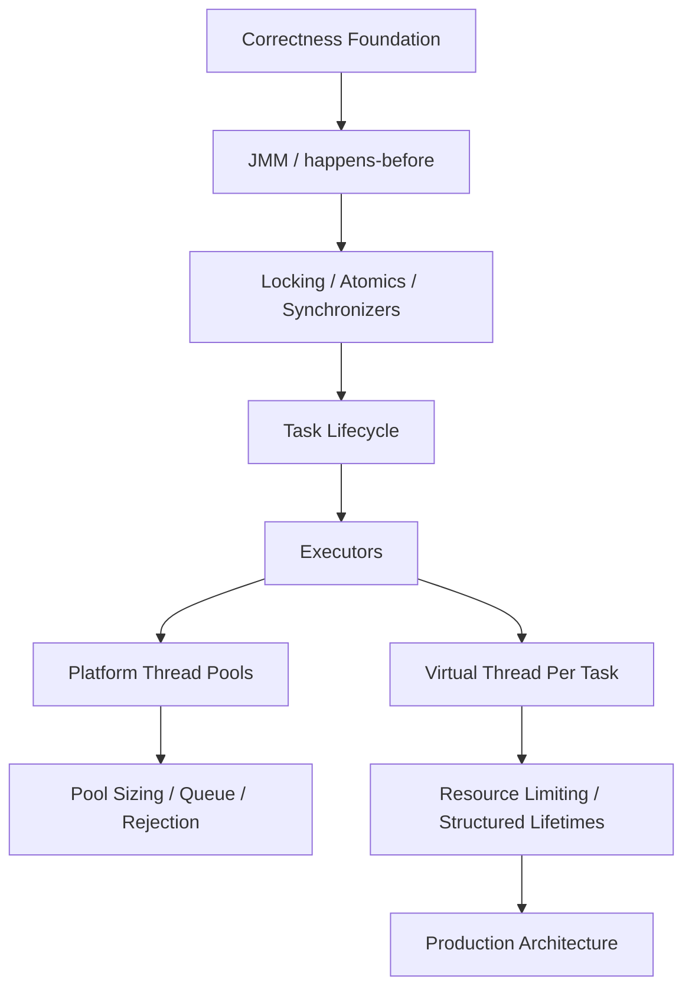
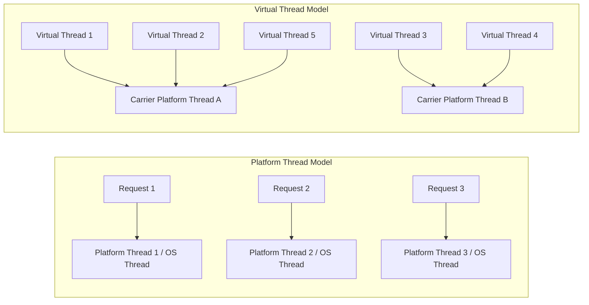
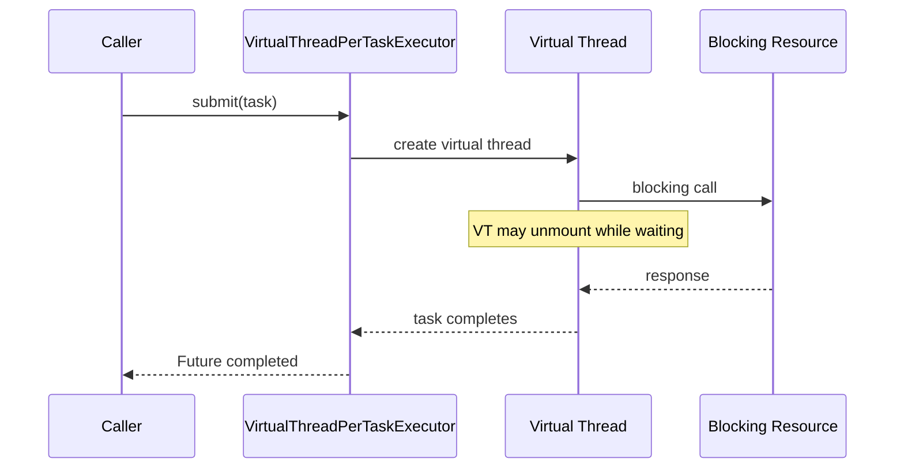
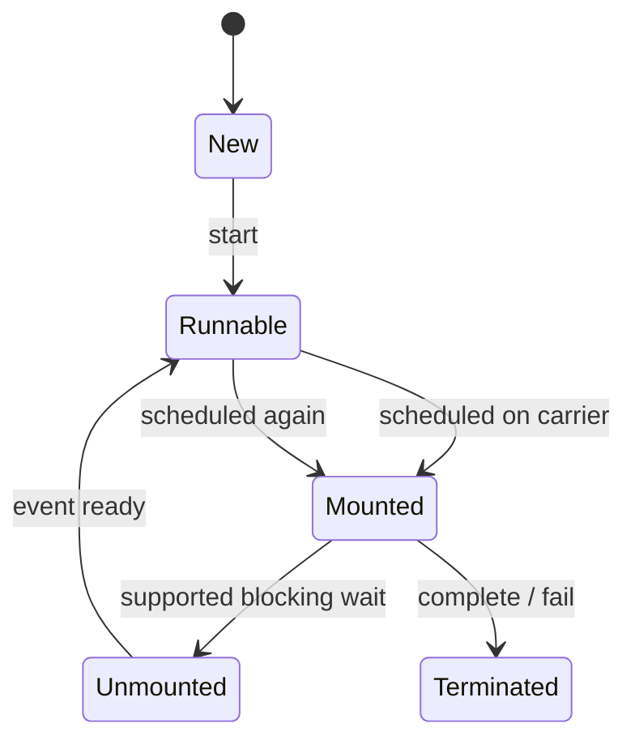
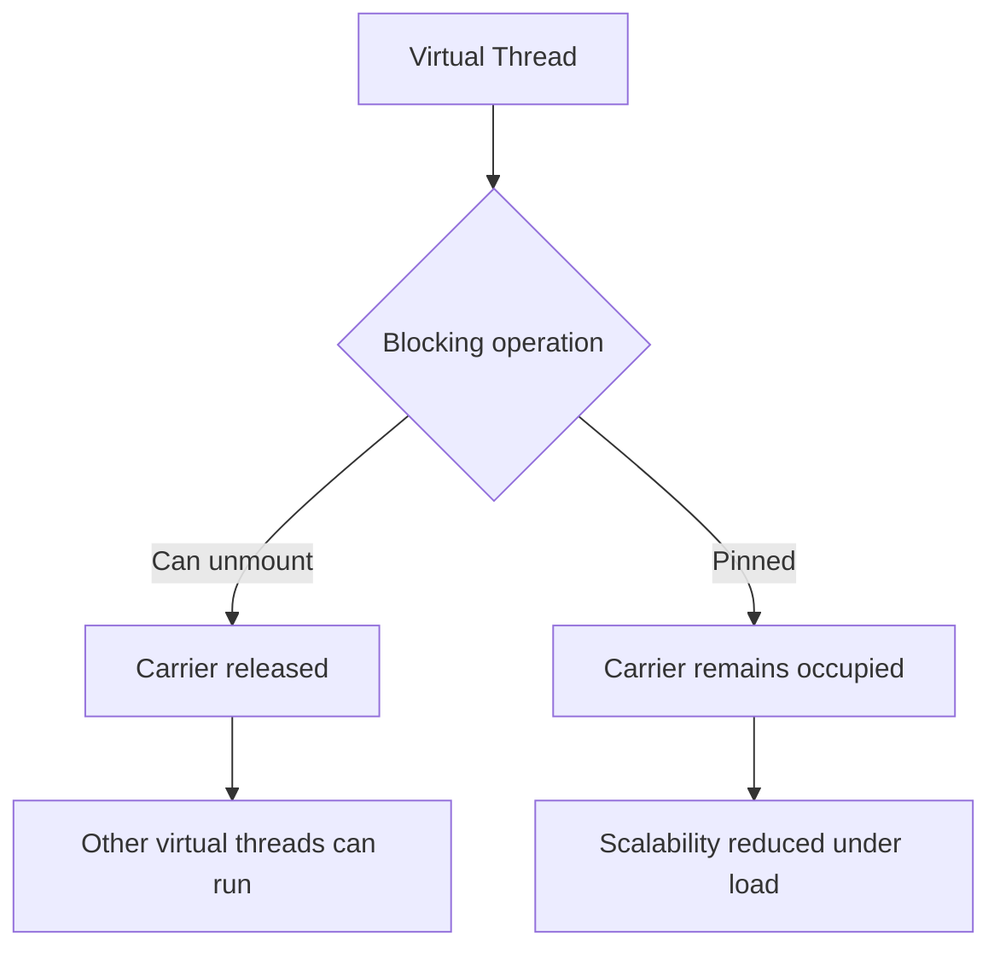
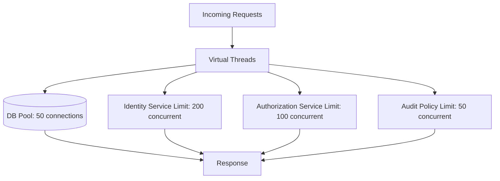

------
title: Learn Java Concurrency & Correctness - Part 023
description: Fondasi virtual threads Project Loom: thread-per-task model, platform vs virtual thread, carrier thread, mount/unmount, blocking I/O, scheduler, ThreadLocal, correctness boundary, dan non-goals.
series: learn-java-concurrency-correctness
seriesTitle: Learn Java Concurrency & Correctness
order: 23
partTitle: Virtual Threads Foundation
tags:
- java
- concurrency
- virtual-threads
- project-loom
- correctness
- jep-444
- series
date: 2026-06-28
---

# Part 023 — Virtual Threads Foundation

Part sebelumnya membahas desain API asynchronous. Sekarang kita masuk ke salah satu perubahan paling penting di Java modern: **virtual threads**.

Virtual threads bukan “thread pool yang lebih cepat”. Virtual threads juga bukan replacement untuk correctness discipline. Virtual threads adalah perubahan **execution model** yang membuat gaya pemrograman **thread-per-task** kembali masuk akal untuk workload yang banyak melakukan blocking I/O.

JEP 444 memfinalisasi virtual threads di JDK 21. Oracle Java documentation mendeskripsikan virtual threads sebagai lightweight threads yang membantu menulis, memelihara, dan men-debug high-throughput concurrent applications. Satu hal penting: virtual threads tetap instance `java.lang.Thread`, sehingga banyak API Java yang berbasis thread tetap relevan.

Namun mental model yang salah akan mahal. Banyak engineer melihat virtual threads lalu menyimpulkan:

- “Kita tidak perlu async lagi.”
- “Kita bisa membuat jutaan task tanpa limit.”
- “Lock tidak penting karena thread murah.”
- “Kalau blocking murah, backpressure tidak perlu.”
- “Virtual threads otomatis membuat aplikasi lebih cepat.”

Semua pernyataan itu berbahaya.

Mental model utama part ini:

> Virtual threads membuat blocking lebih scalable, bukan membuat resource tak terbatas dan bukan menghapus masalah shared-state correctness.

---

## 1. Posisi Virtual Threads Dalam Skill Map

Sampai Part 022, kita sudah membahas:

- shared state;
- data race;
- Java Memory Model;
- `volatile`, `final`, safe publication;
- lock dan coordination;
- executor dan thread pool;
- `ForkJoinPool` dan parallel streams;
- `CompletableFuture` dan async API design.

Virtual threads berada di atas fondasi itu, bukan menggantikannya.



Virtual threads mengubah cara kita mengeksekusi task. Mereka tidak mengubah aturan:

- visibility;
- atomicity;
- ordering;
- lock ownership;
- interruption;
- cancellation;
- resource capacity;
- failure propagation;
- backpressure.

Karena itu virtual threads harus dipahami sebagai **execution primitive**, bukan silver bullet.

---

## 2. Problem Yang Ingin Diselesaikan Virtual Threads

Sebelum virtual threads, Java server biasanya menghadapi dilema:

1. **Thread-per-request dengan platform thread**
   - kode sederhana;
   - blocking style mudah dipahami;
   - debugging relatif natural;
   - tetapi platform thread mahal.

2. **Async/non-blocking/reactive style**
   - bisa menangani banyak concurrent I/O;
   - efisien memakai thread;
   - tetapi kode sering lebih kompleks;
   - stack trace terfragmentasi;
   - context propagation sulit;
   - error handling/cancellation lebih rumit.

Virtual threads mengincar titik tengah:

> Pertahankan gaya blocking sequential yang mudah dipahami, tetapi buat thread-nya cukup murah untuk jumlah task concurrent yang sangat besar.

Contoh blocking style yang natural:

```java
String user = userClient.fetchUser(userId);
List<Order> orders = orderClient.fetchOrders(userId);
RiskScore risk = riskClient.score(user, orders);
return new UserProfile(user, orders, risk);
```

Dengan platform thread, setiap blocking call bisa menahan OS thread. Dengan virtual thread, saat blocking operation yang supported terjadi, virtual thread dapat **unmount** dari carrier platform thread sehingga carrier bisa menjalankan virtual thread lain.

---

## 3. Platform Thread vs Virtual Thread

Platform thread adalah wrapper Java di atas OS thread. OS thread relatif mahal karena:

- memiliki stack native besar;
- dijadwalkan oleh OS;
- jumlah practical-nya terbatas;
- context switching-nya mahal dibanding lightweight task switching;
- memory footprint-nya besar jika dibuat ribuan atau puluhan ribu.

Virtual thread adalah lightweight thread yang dikelola JVM. Ia tetap `Thread`, tetapi tidak selalu terikat satu-ke-satu dengan OS thread.



Perbedaan praktis:

| Aspek | Platform Thread | Virtual Thread |
|---|---|---|
| Backing | OS thread | JVM-managed lightweight thread |
| Cost per thread | Tinggi | Rendah |
| Cocok untuk | jumlah task terbatas, CPU/legacy integration | banyak concurrent blocking I/O tasks |
| Pooling | sering perlu | biasanya tidak perlu |
| API | `Thread` | `Thread` |
| Scheduling | OS | JVM scheduler di atas carrier threads |
| Correctness rules | JMM tetap berlaku | JMM tetap berlaku |

Hal penting:

> Virtual thread tetap thread. Ia bukan coroutine JavaScript, bukan green thread lama yang terlihat sebagai abstraction berbeda, dan bukan `CompletableFuture`.

---

## 4. Thread-Per-Task, Bukan Thread-Pool-Per-Task

Model paling penting virtual threads adalah **thread-per-task**.

Dengan platform thread, kita biasa membuat pool:

```java
ExecutorService executor = Executors.newFixedThreadPool(100);
```

Task harus antre karena thread mahal. Pool menjadi mekanisme:

- membatasi jumlah platform thread;
- mengontrol memory;
- mengurangi overhead creation;
- mengatur saturation.

Dengan virtual threads, entry point idiomatik adalah:

```java
try (ExecutorService executor = Executors.newVirtualThreadPerTaskExecutor()) {
    Future<String> result = executor.submit(() -> fetchRemoteData());
    return result.get();
}
```

Executor ini membuat virtual thread baru untuk setiap task. Ini berbeda dari fixed pool:

- tidak reuse virtual thread;
- tidak pool virtual thread;
- tidak membatasi concurrency secara otomatis;
- jumlah virtual thread yang dibuat bersifat unbounded secara model;
- lifetime task lebih langsung: satu task = satu virtual thread.

Mental model:



Jangan membuat virtual thread pool seperti ini:

```java
// Anti-pattern: mencoba "pool" virtual threads seperti platform threads
ExecutorService executor = Executors.newFixedThreadPool(
        100,
        Thread.ofVirtual().factory()
);
```

Kode itu membatasi jumlah worker virtual thread, tetapi biasanya bukan cara terbaik membatasi resource. Jika yang ingin dibatasi adalah database connection, remote service concurrency, atau CPU work, gunakan mekanisme yang membatasi **resource**, bukan jumlah virtual thread secara buta.

---

## 5. Carrier Thread, Mount, dan Unmount

Virtual thread dijalankan di atas platform thread yang disebut **carrier thread**. Saat virtual thread aktif menjalankan Java code, ia mounted pada carrier. Saat virtual thread melakukan blocking operation yang didukung mekanisme Loom, JVM bisa meng-unmount virtual thread dari carrier.



Contoh:

```java
void handle(Request request) throws IOException {
    User user = userClient.fetch(request.userId()); // blocking I/O
    Account account = accountClient.fetch(user.accountId()); // blocking I/O
    respond(user, account);
}
```

Pada platform thread model, thread yang memanggil `fetch` biasanya tertahan. Pada virtual thread model, blocking dapat membuat virtual thread unmount, sehingga carrier dapat menjalankan virtual thread lain.

Namun jangan salah:

- blocking operation tetap blocking dari sudut pandang kode;
- latency remote call tetap ada;
- downstream capacity tetap terbatas;
- connection pool tetap terbatas;
- transaction duration tetap berdampak;
- lock contention tetap berdampak;
- CPU-bound work tetap memakai CPU sungguhan.

Virtual thread membuat **waiting cheaper**, bukan membuat **waiting disappear**.

---

## 6. Virtual Threads Cocok Untuk Apa?

Virtual threads paling cocok untuk workload:

- banyak concurrent request/task;
- sebagian besar waktu habis menunggu I/O;
- kode blocking sequential lebih mudah dipahami;
- task memiliki lifetime jelas;
- task tidak CPU-bound berat;
- task tidak bergantung pada event-loop-only contract;
- task bisa dibatalkan/interrupted secara wajar.

Contoh cocok:

```java
public CustomerProfile loadProfile(CustomerId id) throws Exception {
    Customer customer = customerRepository.findById(id);
    List<Order> orders = orderClient.findRecentOrders(id);
    RiskScore risk = riskClient.score(customer, orders);
    return new CustomerProfile(customer, orders, risk);
}
```

Use case cocok:

- REST endpoint dengan blocking database driver;
- fan-out HTTP calls;
- background task yang menunggu network;
- file I/O tertentu;
- orchestration service;
- case management workflow steps;
- regulatory lifecycle actions yang banyak I/O ke sistem internal;
- adapter service ke legacy blocking API.

---

## 7. Virtual Threads Tidak Cocok Untuk Apa?

Virtual threads tidak memberi keuntungan besar untuk CPU-bound parallelism.

Contoh:

```java
long count = records.stream()
        .mapToLong(this::expensiveCpuHash)
        .sum();
```

Jika pekerjaan utamanya CPU, jumlah core tetap batas utama. Menjalankan 100.000 virtual threads CPU-bound hanya akan membuat scheduling overhead dan contention.

Untuk CPU-bound workload, gunakan:

- fixed-size executor sesuai core;
- `ForkJoinPool`;
- parallel stream dengan hati-hati;
- batching;
- vectorization jika cocok;
- native/accelerated computation bila relevan.

Virtual threads juga tidak otomatis cocok untuk:

- event-loop framework yang melarang blocking;
- low-latency ultra-tight loops;
- code yang menahan lock global lama;
- code yang memakai native blocking call yang tidak cooperatively unmount;
- task tanpa resource budget;
- workload dengan fan-out tak terbatas;
- workload yang menghasilkan memory pressure masif.

Rule sederhana:

> Virtual threads meningkatkan scalability I/O-bound blocking concurrency. Mereka bukan alat utama untuk CPU parallelism.

---

## 8. Basic API: Membuat Virtual Thread

Ada beberapa cara membuat virtual thread.

### 8.1 `Thread.startVirtualThread`

```java
Thread thread = Thread.startVirtualThread(() -> {
    System.out.println("Running in " + Thread.currentThread());
});

thread.join();
```

Cocok untuk demo atau task kecil. Untuk production, biasanya gunakan executor atau structured concurrency.

### 8.2 `Thread.ofVirtual()`

```java
Thread thread = Thread.ofVirtual()
        .name("profile-loader-", 0)
        .start(() -> loadProfile(customerId));

thread.join();
```

Builder ini memberi kontrol naming.

### 8.3 `Executors.newVirtualThreadPerTaskExecutor()`

```java
try (ExecutorService executor = Executors.newVirtualThreadPerTaskExecutor()) {
    Future<CustomerProfile> future = executor.submit(() -> loadProfile(customerId));
    CustomerProfile profile = future.get();
}
```

Ini entry point paling praktis untuk memigrasikan task-oriented code.

### 8.4 Thread factory virtual

```java
ThreadFactory factory = Thread.ofVirtual()
        .name("case-task-", 0)
        .factory();

Thread thread = factory.newThread(() -> processCase(caseId));
thread.start();
```

Gunakan ketika framework menerima `ThreadFactory`.

---

## 9. Jangan Pool Virtual Threads

Platform thread perlu dipool karena mahal. Virtual thread murah dan dirancang untuk dibuat per task.

Anti-pattern:

```java
ExecutorService virtualPool = Executors.newFixedThreadPool(
        200,
        Thread.ofVirtual().factory()
);
```

Ini biasanya menunjukkan kebingungan antara:

- membatasi jumlah thread;
- membatasi jumlah request;
- membatasi downstream resource;
- membatasi DB connection;
- membatasi memory;
- membatasi CPU.

Dengan virtual threads, limit harus ditempelkan pada resource yang benar.

Contoh: batasi akses ke remote service dengan `Semaphore`.

```java
final class RiskClient {
    private final Semaphore permits = new Semaphore(100);
    private final HttpClient httpClient;

    RiskClient(HttpClient httpClient) {
        this.httpClient = httpClient;
    }

    RiskScore score(Customer customer) throws Exception {
        if (!permits.tryAcquire(200, TimeUnit.MILLISECONDS)) {
            throw new RejectedExecutionException("Risk service concurrency limit reached");
        }
        try {
            return callRiskService(customer);
        } finally {
            permits.release();
        }
    }

    private RiskScore callRiskService(Customer customer) {
        // blocking HTTP call or synchronous wrapper around client
        return new RiskScore("LOW");
    }
}
```

Ini lebih akurat daripada membatasi virtual thread count, karena invariant yang ingin dijaga adalah:

> Tidak lebih dari 100 concurrent calls ke risk service.

Bukan:

> Tidak lebih dari 100 virtual threads exist.

---

## 10. Virtual Threads dan Blocking I/O

Virtual threads mengembalikan blocking I/O ke posisi yang lebih sehat.

Sebelum virtual threads:

```java
CompletableFuture<User> userFuture = CompletableFuture.supplyAsync(() -> userClient.fetch(id), ioPool);
CompletableFuture<List<Order>> ordersFuture = CompletableFuture.supplyAsync(() -> orderClient.fetch(id), ioPool);

return userFuture.thenCombine(ordersFuture, Profile::new).join();
```

Dengan virtual threads, untuk banyak kasus:

```java
try (ExecutorService executor = Executors.newVirtualThreadPerTaskExecutor()) {
    Future<User> user = executor.submit(() -> userClient.fetch(id));
    Future<List<Order>> orders = executor.submit(() -> orderClient.fetch(id));

    return new Profile(user.get(), orders.get());
}
```

Atau dengan structured concurrency pada part selanjutnya:

```java
// Preview API concept; detail dibahas di Part 026.
try (var scope = new StructuredTaskScope.ShutdownOnFailure()) {
    var user = scope.fork(() -> userClient.fetch(id));
    var orders = scope.fork(() -> orderClient.fetch(id));

    scope.join().throwIfFailed();
    return new Profile(user.get(), orders.get());
}
```

Perhatikan konsekuensi:

- kode blocking lebih mudah dibaca;
- error propagation lebih eksplisit;
- stack trace lebih natural;
- task per request lebih jelas;
- tetapi limit downstream tetap harus ada.

---

## 11. Virtual Threads dan ThreadLocal

JEP 444 memastikan virtual threads mendukung thread-local variables. Ini penting untuk compatibility dengan ecosystem Java yang banyak memakai:

- logging MDC;
- security context;
- transaction context;
- tenant context;
- locale context;
- correlation id;
- request-scoped metadata.

Namun dukungan bukan berarti `ThreadLocal` selalu desain terbaik.

Masalah `ThreadLocal` tetap ada:

- hidden dependency;
- context leak jika tidak dibersihkan;
- value besar bisa menambah memory footprint;
- inheritance semantics bisa membingungkan;
- sulit dites;
- sulit dilacak di fan-out concurrent task.

Contoh aman minimal:

```java
final class RequestContextHolder {
    private static final ThreadLocal<RequestContext> CURRENT = new ThreadLocal<>();

    static void withContext(RequestContext context, Runnable action) {
        RequestContext previous = CURRENT.get();
        CURRENT.set(context);
        try {
            action.run();
        } finally {
            if (previous == null) {
                CURRENT.remove();
            } else {
                CURRENT.set(previous);
            }
        }
    }

    static RequestContext current() {
        RequestContext context = CURRENT.get();
        if (context == null) {
            throw new IllegalStateException("No request context bound");
        }
        return context;
    }
}
```

Part 027 dan Part 028 akan membahas `ScopedValue` dan `ThreadLocal` secara lebih detail. Untuk sekarang, pegang rule ini:

> Virtual threads membuat `ThreadLocal` compatible, bukan otomatis membuatnya desirable.

---

## 12. Virtual Threads dan Interruption

Virtual threads tetap `Thread`, sehingga interruption tetap mekanisme cancellation kooperatif utama.

```java
Thread worker = Thread.startVirtualThread(() -> {
    try {
        while (!Thread.currentThread().isInterrupted()) {
            processNextItem();
        }
    } catch (InterruptedException e) {
        Thread.currentThread().interrupt();
        cleanup();
    }
});

worker.interrupt();
worker.join();
```

Kesalahan umum:

```java
try {
    blockingCall();
} catch (InterruptedException e) {
    // Anti-pattern: swallow interruption
}
```

Correct pattern:

```java
try {
    blockingCall();
} catch (InterruptedException e) {
    Thread.currentThread().interrupt();
    throw new CancellationException("Operation interrupted");
}
```

Di virtual-thread world, jumlah task bisa jauh lebih besar. Kalau cancellation policy buruk, sistem bisa menumpuk banyak task zombie yang sebenarnya sudah tidak dibutuhkan.

Invariant:

> Setiap task yang bisa menunggu harus punya cancellation story.

---

## 13. Virtual Threads dan Locks

Virtual threads tidak menghapus kebutuhan lock. Jika ada shared mutable state, rules tetap sama:

```java
final class Counter {
    private int value;

    synchronized int incrementAndGet() {
        return ++value;
    }
}
```

Correctness-nya tetap bergantung pada monitor lock. Virtual thread hanya mempengaruhi cost waiting/blocking pada beberapa kondisi.

Hal yang perlu diingat:

1. Lock contention tetap bottleneck.
2. Critical section panjang tetap buruk.
3. Lock ordering tetap diperlukan untuk deadlock prevention.
4. Blocking di dalam lock tetap desain yang perlu dicurigai.
5. Shared mutable aggregate invariant tetap perlu single jurisdiction.

Anti-pattern:

```java
synchronized Order enrich(Order order) {
    Customer customer = customerClient.fetch(order.customerId()); // blocking I/O inside lock
    return order.withCustomer(customer);
}
```

Lebih baik:

```java
OrderSnapshot snapshot;
synchronized (lock) {
    snapshot = order.snapshot();
}

Customer customer = customerClient.fetch(snapshot.customerId());

synchronized (lock) {
    order.attachCustomerIfVersionMatches(customer, snapshot.version());
}
```

JEP 491 di JDK 24 mengurangi masalah virtual-thread pinning akibat `synchronized`, tetapi itu bukan izin untuk menahan monitor sembarangan.

---

## 14. Pinning: Konsep Singkat

Pinning terjadi ketika virtual thread tidak dapat unmount dari carrier thread saat blocking. Jika banyak virtual threads pinned, carrier threads ikut tertahan, sehingga scalability virtual threads turun.

Secara historis, kasus umum pinning adalah:

- blocking di dalam `synchronized`;
- native/foreign call tertentu;
- operasi yang tidak cooperatively managed oleh JVM.

JDK 24 melalui JEP 491 memperbaiki sebagian besar kasus pinning terkait `synchronized`, tetapi pinning tetap konsep diagnostik yang perlu dipahami. Part 025 akan membahas ini secara khusus.

Mental model:



Rule praktis:

> Jangan desain aplikasi dengan asumsi semua blocking selalu murah. Ukur, observasi, dan pahami jenis blocking-nya.

---

## 15. Virtual Threads dan Memory Footprint

Virtual thread jauh lebih murah daripada platform thread, tetapi bukan gratis.

Setiap virtual thread tetap punya:

- `Thread` object;
- stack chunks;
- task object;
- captured lambda/object references;
- local variables;
- `ThreadLocal` values jika dipakai;
- continuation state;
- pending I/O state;
- associated request/resource references.

Jika membuat 1 juta virtual threads yang masing-masing memegang request besar, memory tetap habis.

Anti-pattern:

```java
try (ExecutorService executor = Executors.newVirtualThreadPerTaskExecutor()) {
    for (Customer customer : allCustomersInMemory) {
        executor.submit(() -> processHugeCustomerGraph(customer));
    }
}
```

Masalah:

- semua task disubmit sekaligus;
- captured object bisa besar;
- tidak ada bounded concurrency;
- downstream bisa overload;
- memory pressure meningkat.

Lebih baik:

```java
Semaphore permits = new Semaphore(500);

try (ExecutorService executor = Executors.newVirtualThreadPerTaskExecutor()) {
    for (CustomerId customerId : customerIds) {
        permits.acquire();
        executor.submit(() -> {
            try {
                processCustomerById(customerId);
            } finally {
                permits.release();
            }
        });
    }
}
```

Catatan: contoh ini masih perlu error propagation strategy. Part 024 dan 026 akan membuatnya lebih production-grade.

---

## 16. Virtual Threads dan Throughput

Virtual threads dapat meningkatkan throughput jika bottleneck sebelumnya adalah jumlah platform thread yang tertahan menunggu I/O.

Contoh lama:

- server punya 200 request threads;
- setiap request memanggil 3 remote services;
- tiap remote call rata-rata 200 ms;
- CPU masih rendah, tetapi request antre karena thread habis.

Virtual threads dapat membantu karena request yang menunggu I/O tidak harus menahan platform thread.

Namun throughput tetap dibatasi oleh:

- downstream service capacity;
- database connection pool;
- rate limits;
- network bandwidth;
- CPU serialization/deserialization;
- lock contention;
- GC pressure;
- memory;
- queue/backpressure design.

Formula mental:

```text
End-to-end throughput = min(
    ingress capacity,
    CPU capacity,
    memory capacity,
    downstream capacity,
    DB connection capacity,
    lock/coordination capacity,
    external rate limit
)
```

Virtual threads terutama menaikkan kapasitas pada dimensi **waiting thread scalability**, bukan semua dimensi.

---

## 17. Virtual Threads dan Latency

Virtual threads tidak otomatis mengurangi latency remote call.

Jika remote service butuh 300 ms, virtual thread tidak membuatnya 30 ms. Yang berubah adalah sistem dapat menangani lebih banyak request lain selama menunggu.

Latency bisa memburuk jika:

- fan-out menjadi terlalu agresif;
- downstream overload;
- tidak ada timeout;
- tidak ada rate limit;
- terlalu banyak virtual threads berebut CPU setelah wakeup;
- GC pressure meningkat;
- lock contention meningkat;
- observability overhead berlebihan.

Karena itu production design tetap perlu:

- timeout;
- deadline;
- bounded concurrency;
- retry budget;
- circuit breaker jika diperlukan;
- bulkhead;
- metrics;
- tracing;
- queue age tracking;
- load shedding.

---

## 18. Virtual Threads Bukan Reactive Streams

Virtual threads dan reactive programming menyelesaikan masalah yang overlap, tetapi bukan identik.

Virtual threads:

- bagus untuk request/task blocking sequential;
- mudah dipahami;
- stack trace natural;
- cocok untuk banyak synchronous APIs;
- satu task terlihat sebagai satu call stack.

Reactive streams:

- bagus untuk asynchronous stream of data;
- punya backpressure protocol formal;
- cocok untuk event stream, continuous data, non-blocking pipeline;
- membutuhkan disiplin scheduler dan operator;
- error/cancellation ada dalam stream contract.

Perbandingan:

| Dimensi | Virtual Threads | Reactive |
|---|---|---|
| Model utama | thread-per-task | stream pipeline |
| Code style | blocking sequential | declarative async operators |
| Backpressure | harus didesain eksplisit | bagian dari protocol |
| Debugging | stack trace natural | operator chain/context perlu tooling |
| Cocok untuk | request/response blocking I/O | stream, event pipeline, non-blocking integration |
| Risiko | unbounded concurrency/resource flood | scheduler misuse/blocking contamination |

Rule praktis:

> Jangan ubah reactive pipeline yang sehat menjadi virtual threads hanya karena virtual threads baru. Jangan pula mempertahankan reactive complexity jika use case-nya hanya blocking request/response sederhana.

---

## 19. Simple Server Mental Model

Bayangkan service case management:

- menerima request `GET /cases/{id}`;
- baca case dari DB;
- panggil identity service;
- panggil authorization service;
- panggil audit policy service;
- gabungkan hasil.

Dengan platform thread pool:

```text
1 request occupies 1 platform thread while waiting for all blocking calls.
```

Dengan virtual thread:

```text
1 request occupies 1 virtual thread; carrier thread can be released while supported blocking calls wait.
```

Namun resource constraints tetap:



Correct design tidak bertanya:

> Berapa banyak virtual thread yang bisa saya buat?

Ia bertanya:

> Berapa banyak work yang boleh aktif terhadap setiap constrained resource?

---

## 20. Error Handling Tetap Sama Pentingnya

Virtual thread failure tetap failure task.

```java
try (ExecutorService executor = Executors.newVirtualThreadPerTaskExecutor()) {
    Future<Decision> decision = executor.submit(() -> evaluate(caseId));
    return decision.get(2, TimeUnit.SECONDS);
} catch (TimeoutException e) {
    throw new ServiceUnavailableException("Decision evaluation timed out", e);
} catch (ExecutionException e) {
    throw unwrap(e);
} catch (InterruptedException e) {
    Thread.currentThread().interrupt();
    throw new CancellationException("Request interrupted");
}
```

Jangan treat virtual threads sebagai fire-and-forget default.

Anti-pattern:

```java
Thread.startVirtualThread(() -> audit(request));
return response;
```

Masalah:

- siapa observe failure?
- siapa retry?
- siapa shutdown?
- siapa flush audit?
- apakah audit boleh hilang?
- apakah request context masih valid?
- apakah ada rate limit?

Lebih baik gunakan explicit lifecycle:

- executor owned by component;
- structured scope;
- durable queue;
- outbox;
- scheduler;
- explicit error handler.

---

## 21. Naming Virtual Threads

Karena virtual threads bisa sangat banyak, naming harus berguna tetapi tidak boros.

```java
ThreadFactory factory = Thread.ofVirtual()
        .name("case-eval-vt-", 0)
        .factory();

try (ExecutorService executor = Executors.newThreadPerTaskExecutor(factory)) {
    Future<Decision> result = executor.submit(() -> evaluate(caseId));
    return result.get();
}
```

Naming membantu:

- thread dump;
- JFR analysis;
- logs;
- incident response;
- correlation dengan component.

Namun jangan memasukkan terlalu banyak PII atau high-cardinality business data ke thread name.

Buruk:

```text
customer-john.doe@example.com-case-123456789-vthread
```

Lebih baik:

```text
case-eval-vt-1024
```

Business correlation sebaiknya melalui trace id/MDC, bukan thread name.

---

## 22. Virtual Threads dan Framework

Adopsi virtual threads sering terjadi melalui framework:

- servlet container dengan virtual-thread-per-request mode;
- Spring Boot virtual thread setting;
- custom executor injection;
- job worker framework;
- HTTP client integration;
- database driver blocking call;
- scheduler/background processing.

Tapi framework flag bukan akhir desain.

Checklist:

- Apakah semua request sekarang bisa masuk jauh lebih banyak?
- Apakah DB pool cukup dilindungi?
- Apakah HTTP client punya connection limit?
- Apakah downstream punya rate limit?
- Apakah request timeout turun sampai driver/client?
- Apakah ThreadLocal context dibersihkan?
- Apakah MDC kompatibel?
- Apakah thread dump/JFR sudah diuji?
- Apakah load test mencerminkan bottleneck asli?

Virtual threads sering memindahkan bottleneck dari “thread pool penuh” ke “downstream/resource penuh”. Itu bagus jika disadari, buruk jika tidak disiapkan.

---

## 23. Migration Mental Model

Migrasi ke virtual threads bukan refactor sintaks, tetapi perubahan bottleneck model.

Sebelum:

```text
Thread pool size protects system from too much concurrency.
```

Sesudah:

```text
Virtual threads allow much more concurrency, so every constrained resource needs explicit protection.
```

Langkah migrasi sehat:

1. Identifikasi endpoint/job I/O-bound blocking.
2. Ukur baseline:
   - throughput;
   - p50/p95/p99 latency;
   - thread count;
   - CPU;
   - heap;
   - DB pool usage;
   - downstream latency;
   - error/timeout rate.
3. Aktifkan virtual threads pada scope kecil.
4. Tambahkan resource guards.
5. Load test dengan skenario overload.
6. Observasi thread dump/JFR.
7. Perbaiki timeout/cancellation.
8. Baru perluas adoption.

Jangan mulai dari seluruh aplikasi.

---

## 24. Common Misconceptions

### Misconception 1: “Virtual threads membuat async tidak perlu”

Tidak. Async masih relevan untuk:

- event streams;
- reactive protocol;
- UI/event systems;
- high-performance non-blocking pipeline;
- integration dengan API async native;
- pipeline yang membutuhkan backpressure formal.

### Misconception 2: “Virtual threads membuat thread pool tidak perlu”

Thread pool platform masih relevan untuk:

- CPU-bound work;
- limited parallelism;
- event loop;
- scheduled executor;
- legacy integration;
- specialized execution isolation.

### Misconception 3: “Virtual threads otomatis aman untuk shared state”

Salah. Race condition tetap race condition.

### Misconception 4: “Virtual threads berarti semua task boleh dibuat sekaligus”

Salah. Resource tetap terbatas.

### Misconception 5: “Blocking selalu murah”

Salah. Supported blocking bisa murah terhadap carrier thread, tetapi downstream latency, memory, dan resource hold tetap nyata.

---

## 25. Correctness Checklist Untuk Virtual Thread Code

Sebelum approve virtual-thread code, tanyakan:

### Execution

- Apakah satu task benar-benar punya lifetime jelas?
- Apakah task perlu result, atau fire-and-forget?
- Kalau fire-and-forget, siapa observe failure?
- Apakah executor lifecycle jelas?

### Resource

- Resource apa yang dibatasi?
- Apakah concurrency limit ditempel pada resource yang benar?
- Apakah DB/HTTP/file/client punya pool/limit?
- Apakah ada backpressure/load shedding?

### Correctness

- Apakah shared state dilindungi?
- Apakah safe publication jelas?
- Apakah `ThreadLocal` dibersihkan?
- Apakah interruption ditangani?
- Apakah timeout turun ke bawah?

### Performance

- Apakah workload I/O-bound?
- Apakah ada CPU-heavy stage?
- Apakah lock contention diukur?
- Apakah memory footprint diuji?

### Operability

- Apakah thread naming cukup?
- Apakah JFR/thread dump diuji?
- Apakah metrics ada?
- Apakah trace/correlation id terbawa?

---

## 26. Practice Drill

### Drill 1 — Klasifikasi workload

Ambil 5 komponen di sistemmu. Untuk masing-masing, isi tabel:

| Komponen | Dominan I/O atau CPU? | Blocking? | Shared state? | Resource terbatas? | Cocok virtual thread? |
|---|---|---|---|---|---|
| Case search API | I/O | Ya | Minimal | DB pool | Ya, dengan DB guard |
| Report generation | CPU + I/O | Campuran | Ya | CPU/memory | Hati-hati |
| Audit event consumer | I/O | Ya | Minimal | broker/downstream | Mungkin |
| Risk score fan-out | I/O | Ya | Minimal | remote service | Ya, dengan semaphore |
| Batch reconciliation | CPU + DB | Campuran | Ya | DB + CPU | Perlu hybrid |

### Drill 2 — Refactor thread pool thinking

Ubah mindset ini:

```java
Executors.newFixedThreadPool(50)
```

Menjadi pertanyaan:

- Apa yang sebenarnya ingin dibatasi?
- 50 itu batas CPU, DB, HTTP, memory, atau downstream?
- Apa yang terjadi pada request ke-51?
- Apakah dia antre, ditolak, timeout, atau degradasi?
- Apakah caller tahu?

### Drill 3 — Audit hidden blocking

Cari blocking calls:

- JDBC;
- HTTP sync client;
- file read/write;
- lock acquisition;
- `Future.get()`;
- `Thread.sleep()`;
- queue `take()`/`put()`;
- external SDK;
- native call.

Klasifikasikan apakah blocking tersebut:

- acceptable;
- perlu timeout;
- perlu resource guard;
- harus dipindahkan dari lock;
- perlu diganti async/reactive.

---

## 27. Mini Case Study: Case Authorization Aggregator

Requirement:

- request masuk untuk membuka regulatory case;
- service harus mengambil case metadata dari DB;
- mengambil identity dari IAM;
- mengambil role assignment;
- mengambil policy decision;
- response harus selesai dalam 1 detik;
- IAM maksimal 200 concurrent calls;
- policy service maksimal 100 concurrent calls;
- DB pool 50.

Naive virtual-thread implementation:

```java
try (ExecutorService executor = Executors.newVirtualThreadPerTaskExecutor()) {
    Future<CaseMetadata> metadata = executor.submit(() -> caseRepo.find(caseId));
    Future<Identity> identity = executor.submit(() -> iamClient.identity(userId));
    Future<RoleSet> roles = executor.submit(() -> roleClient.roles(userId));
    Future<PolicyDecision> decision = executor.submit(() -> policyClient.decide(userId, caseId));

    return assemble(metadata.get(), identity.get(), roles.get(), decision.get());
}
```

Masalah:

- tidak ada timeout per dependency;
- tidak ada deadline bersama;
- tidak ada concurrency guard;
- jika satu gagal, yang lain belum tentu dibatalkan;
- `get()` bisa menunggu terlalu lama;
- tidak ada observability;
- tidak ada fallback/degradation policy.

Lebih baik sebagai target design:

```java
final class CaseAccessService {
    private final ExecutorService executor = Executors.newVirtualThreadPerTaskExecutor();
    private final Semaphore iamPermits = new Semaphore(200);
    private final Semaphore policyPermits = new Semaphore(100);

    CaseAccessView load(CaseId caseId, UserId userId, Deadline deadline) throws Exception {
        Future<CaseMetadata> metadata = executor.submit(() -> withDeadline(deadline, () -> caseRepo.find(caseId)));
        Future<Identity> identity = executor.submit(() -> withPermit(iamPermits, deadline, () -> iamClient.identity(userId)));
        Future<RoleSet> roles = executor.submit(() -> withDeadline(deadline, () -> roleClient.roles(userId)));
        Future<PolicyDecision> decision = executor.submit(() -> withPermit(policyPermits, deadline, () -> policyClient.decide(userId, caseId)));

        try {
            return assemble(
                    metadata.get(deadline.remainingMillis(), TimeUnit.MILLISECONDS),
                    identity.get(deadline.remainingMillis(), TimeUnit.MILLISECONDS),
                    roles.get(deadline.remainingMillis(), TimeUnit.MILLISECONDS),
                    decision.get(deadline.remainingMillis(), TimeUnit.MILLISECONDS)
            );
        } catch (Exception e) {
            metadata.cancel(true);
            identity.cancel(true);
            roles.cancel(true);
            decision.cancel(true);
            throw e;
        }
    }
}
```

Ini belum sebaik structured concurrency, tetapi sudah menunjukkan prinsip:

- virtual threads untuk blocking fan-out;
- semaphore untuk resource limit;
- deadline untuk bounded wait;
- cancellation pada failure;
- executor lifecycle explicit.

---

## 28. What Good Looks Like

Kode virtual thread yang baik biasanya memiliki ciri:

- blocking style tetap readable;
- concurrency limit explicit pada resource;
- timeout dan deadline jelas;
- cancellation propagated;
- shared mutable state minimal;
- lock scope kecil;
- `ThreadLocal` dikelola;
- failure observable;
- thread naming baik;
- load test membuktikan bottleneck baru terkendali;
- tidak ada assumption “karena virtual thread murah maka semua bebas”.

Kode virtual thread yang buruk biasanya:

- submit task tak terbatas;
- tidak punya timeout;
- mengandalkan executor sebagai limiter;
- memanggil remote service di dalam lock;
- swallow interruption;
- memakai ThreadLocal besar tanpa cleanup;
- mengabaikan failure fire-and-forget;
- tidak punya metrics;
- memindahkan overload ke DB/downstream.

---

## 29. Key Takeaways

- Virtual threads adalah lightweight `Thread` yang memampukan model thread-per-task untuk banyak I/O-bound blocking workloads.
- Mereka final di JDK 21 melalui JEP 444.
- Virtual thread bukan pengganti Java Memory Model, lock discipline, cancellation, timeout, atau resource management.
- Jangan pool virtual threads untuk alasan yang sama seperti platform thread pool.
- Batasi resource yang benar: DB connection, HTTP concurrency, downstream service, memory, CPU.
- Virtual threads membuat blocking style lebih scalable, tetapi tidak membuat latency downstream hilang.
- CPU-bound work tetap butuh bounded parallelism.
- Reactive programming tetap relevan untuk stream/backpressure/event pipeline.
- ThreadLocal compatible, tetapi perlu disiplin cleanup dan context design.
- Observability dan load testing wajib karena bottleneck akan berpindah.

---

## 30. Referensi

- OpenJDK — JEP 444: Virtual Threads: https://openjdk.org/jeps/444
- Oracle Java SE 25 — Virtual Threads Guide: https://docs.oracle.com/en/java/javase/25/core/virtual-threads.html
- Oracle Java SE 25 — `Executors`: https://docs.oracle.com/en/java/javase/25/docs/api/java.base/java/util/concurrent/Executors.html
- OpenJDK — JEP 491: Synchronize Virtual Threads without Pinning: https://openjdk.org/jeps/491
- Java Language Specification — Chapter 17, Threads and Locks: https://docs.oracle.com/javase/specs/jls/se25/html/jls-17.html

---

## 31. Transisi Ke Part 024

Part ini membangun fondasi mental model virtual threads. Part berikutnya akan membahas **Virtual Threads Production Engineering**:

- cara migrate service existing;
- kapan memakai virtual-thread-per-request;
- resource limiting;
- database dan HTTP client integration;
- overload protection;
- observability;
- deployment checklist;
- anti-pattern production yang paling sering terjadi.
