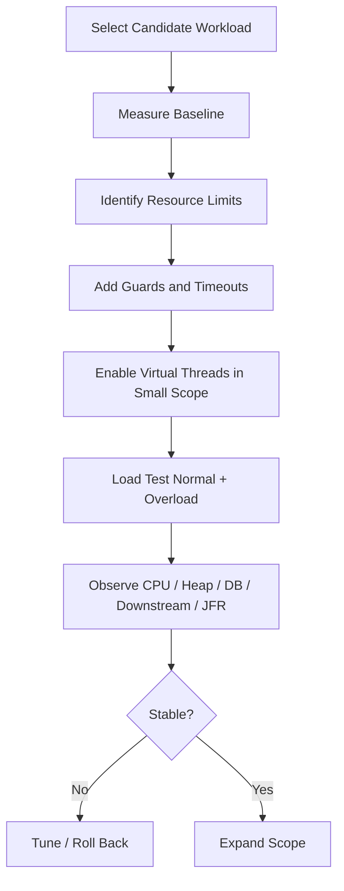
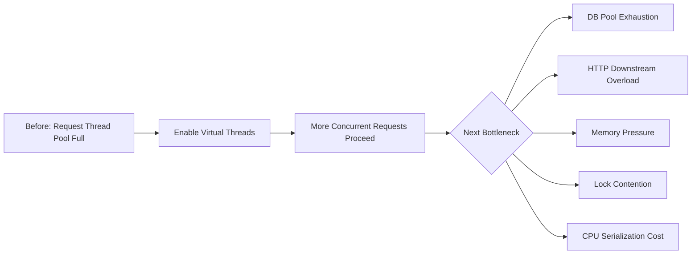
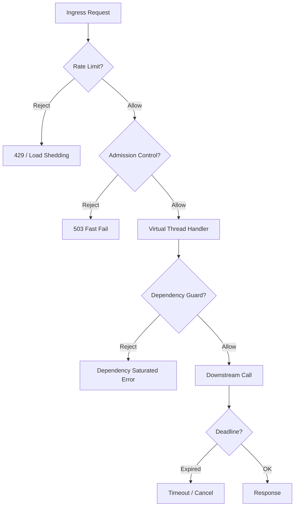
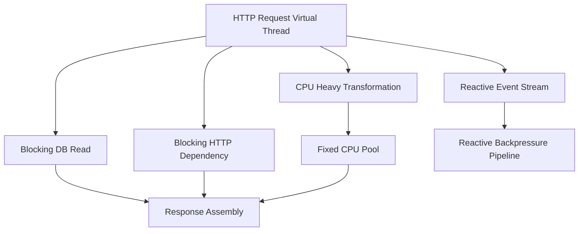
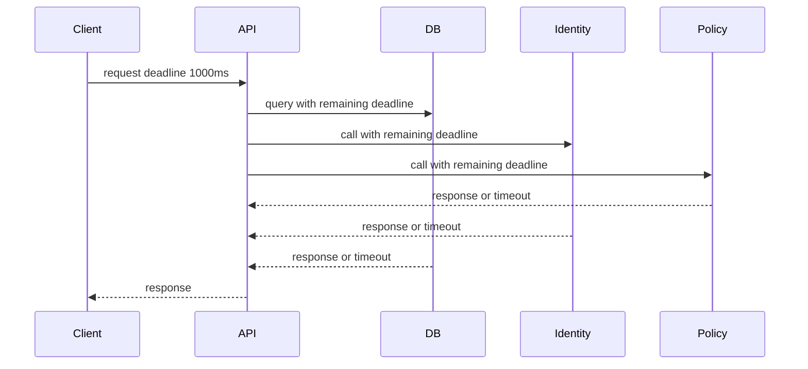

------
title: Learn Java Concurrency & Correctness - Part 024
description: Engineering virtual threads untuk production: migration strategy, virtual-thread-per-request, resource guards, DB/HTTP integration, timeouts, cancellation, overload, observability, testing, dan rollout playbook.
series: learn-java-concurrency-correctness
seriesTitle: Learn Java Concurrency & Correctness
order: 24
partTitle: Virtual Threads Production Engineering
tags:
- java
- concurrency
- virtual-threads
- production-engineering
- scalability
- correctness
- series
date: 2026-06-28
---

# Part 024 — Virtual Threads Production Engineering

Part sebelumnya membahas fondasi virtual threads: thread-per-task, carrier thread, blocking I/O, ThreadLocal, interruption, dan batasan mental model.

Part ini membahas pertanyaan yang lebih sulit:

> Bagaimana memakai virtual threads di production tanpa memindahkan bottleneck secara liar ke database, downstream services, memory, lock contention, atau observability blind spot?

Virtual threads membuat concurrency lebih murah. Itu bagus. Tetapi murahnya concurrency dapat membuka floodgate ke resource yang sebelumnya “terlindungi secara tidak sengaja” oleh platform thread pool.

Sebelum virtual threads:

```text
100 platform request threads accidentally limited concurrent DB/downstream calls.
```

Setelah virtual threads:

```text
10_000 virtual request threads can reach DB/downstream unless explicitly guarded.
```

Itulah inti production engineering virtual threads.

Mental model utama:

> Virtual threads remove thread scarcity as the primary limiter. Production systems must replace accidental thread-based throttling with explicit resource-based throttling.

---

## 1. Production Readiness Bukan “Bisa Jalan”

Kode ini bisa jalan:

```java
try (ExecutorService executor = Executors.newVirtualThreadPerTaskExecutor()) {
    for (Request request : requests) {
        executor.submit(() -> handle(request));
    }
}
```

Tetapi production-ready code harus menjawab:

- Berapa banyak task yang boleh aktif?
- Resource apa yang dibatasi?
- Apa yang terjadi ketika limit penuh?
- Berapa timeout total?
- Apakah timeout membatalkan work bawah?
- Apakah caller mendapat error yang benar?
- Apakah task failure terobservasi?
- Apakah shutdown menunggu task?
- Apakah context aman?
- Apakah thread dump/JFR membantu incident?
- Apakah load test mencakup overload downstream?

Virtual threads membuat style blocking lebih sederhana. Production engineering memastikan simplicity itu tidak menjadi **unbounded concurrency bug**.

---

## 2. Migration Rule: Jangan Mulai Dari “Enable Everywhere”

Anti-pattern umum:

```text
Aktifkan virtual threads untuk seluruh aplikasi, deploy, lihat apa yang terjadi.
```

Ini berisiko karena virtual threads bisa mengubah profil traffic internal secara drastis.

Migration sehat dimulai dari satu boundary yang jelas:

- satu endpoint;
- satu job type;
- satu adapter service;
- satu fan-out orchestration;
- satu background worker;
- satu blocking integration yang bottleneck-nya sudah dipahami.



Tujuan bukan “menggunakan virtual threads”, tetapi:

- mengurangi thread starvation;
- mempertahankan readability;
- meningkatkan throughput I/O-bound;
- menjaga downstream tetap sehat;
- memperbaiki debuggability;
- mempertahankan correctness.

---

## 3. Candidate Workload Selection

Virtual threads paling tepat dimulai dari workload yang memenuhi mayoritas kriteria ini:

| Kriteria | Indikasi Baik |
|---|---|
| Dominan I/O-bound | thread banyak menunggu DB/HTTP/file/network |
| Blocking API | JDBC, synchronous HTTP client, legacy SDK |
| Stack mudah dimodelkan | request/task sequential |
| Shared state rendah | state mostly request-local |
| Timeout bisa didefinisikan | deadline jelas |
| Resource limit diketahui | DB pool, HTTP max connections, external quota |
| Failure handling bisa dikendalikan | caller jelas, retry jelas |
| Observability tersedia | metrics/tracing/JFR/logging |

Workload yang kurang cocok sebagai kandidat awal:

- CPU-heavy analytics;
- code dengan global lock besar;
- event-loop framework yang sensitif terhadap blocking;
- transaction panjang dan kompleks;
- batch besar tanpa chunking;
- task fire-and-forget tanpa failure story;
- legacy SDK yang tidak jelas interruption/timeout semantics-nya.

---

## 4. Baseline Yang Wajib Diukur

Sebelum migration, ukur baseline.

### 4.1 Service-level metrics

- request throughput;
- p50/p95/p99 latency;
- error rate;
- timeout rate;
- saturation indicators;
- queue length/age;
- retry count;
- fallback count.

### 4.2 JVM-level metrics

- platform thread count;
- virtual thread count jika sudah eksperimen;
- CPU utilization;
- heap usage;
- allocation rate;
- GC pause;
- lock contention;
- blocked/waiting states;
- JFR events.

### 4.3 Dependency-level metrics

- DB pool active/idle/waiting;
- DB query latency;
- HTTP client connection pool usage;
- downstream p95/p99;
- external rate-limit response;
- broker lag;
- circuit breaker state;
- connection timeout/read timeout.

Tanpa baseline, virtual-thread adoption berubah menjadi opini.

---

## 5. The Bottleneck Shift

Virtual threads sering berhasil menghapus bottleneck pertama: “thread pool habis”. Tetapi sistem kemudian menabrak bottleneck berikutnya.



Ini bukan kegagalan virtual threads. Ini tanda bahwa thread pool sebelumnya berfungsi sebagai limiter kasar.

Production design harus mengganti limiter kasar itu dengan limiter yang benar.

---

## 6. Resource-Based Throttling

Jangan batasi virtual thread demi membatasi virtual thread. Batasi resource yang benar.

### 6.1 Database guard

Jika DB pool 50, jangan izinkan 5000 request serentak menunggu connection tanpa kontrol.

```java
final class DbAccessGate {
    private final Semaphore permits;

    DbAccessGate(int maxConcurrentDbOperations) {
        this.permits = new Semaphore(maxConcurrentDbOperations);
    }

    <T> T execute(Callable<T> operation, Duration maxWait) throws Exception {
        if (!permits.tryAcquire(maxWait.toMillis(), TimeUnit.MILLISECONDS)) {
            throw new RejectedExecutionException("DB access gate saturated");
        }
        try {
            return operation.call();
        } finally {
            permits.release();
        }
    }
}
```

Catatan: connection pool sendiri sudah membatasi connection, tetapi guard tambahan bisa memberi error lebih cepat dan lebih terkendali daripada membuat ribuan virtual threads menunggu pool.

### 6.2 Downstream service guard

```java
final class DownstreamLimiter {
    private final Semaphore permits;
    private final String dependencyName;

    DownstreamLimiter(String dependencyName, int concurrency) {
        this.dependencyName = dependencyName;
        this.permits = new Semaphore(concurrency);
    }

    <T> T call(Callable<T> action, Duration maxQueueWait) throws Exception {
        if (!permits.tryAcquire(maxQueueWait.toMillis(), TimeUnit.MILLISECONDS)) {
            throw new RejectedExecutionException(dependencyName + " concurrency limit reached");
        }
        try {
            return action.call();
        } finally {
            permits.release();
        }
    }
}
```

### 6.3 CPU guard

Jika ada stage CPU-heavy, jangan lempar semua ke virtual threads.

```java
ExecutorService cpuPool = Executors.newFixedThreadPool(
        Runtime.getRuntime().availableProcessors()
);

Future<Report> report = cpuPool.submit(() -> renderReport(data));
```

Virtual threads boleh mengorkestrasi, tetapi CPU-heavy execution sebaiknya tetap bounded.

---

## 7. Virtual-Thread-Per-Request

Salah satu deployment model yang umum adalah menjalankan setiap request server di virtual thread.

Secara konseptual:

```text
Incoming HTTP request -> one virtual thread -> blocking handler code -> response
```

Keuntungan:

- handler code tetap sequential;
- blocking database/HTTP call tidak menghabiskan platform request thread;
- stack trace natural;
- model mental mirip servlet blocking tradisional;
- lebih mudah daripada callback/reactive untuk banyak endpoint CRUD/orchestration.

Risiko:

- request concurrency bisa naik tajam;
- DB pool menjadi bottleneck;
- downstream dipukul lebih keras;
- memory per request tetap ada;
- ThreadLocal/MDC leak bisa lebih banyak;
- timeout yang lemah menjadi lebih mahal.

Checklist untuk virtual-thread-per-request:

- request timeout global ada;
- DB pool dan query timeout jelas;
- HTTP client connect/read/request timeout jelas;
- per-dependency concurrency guard ada untuk dependency sensitif;
- rate limit/load shedding ada;
- graceful shutdown diuji;
- request body size dibatasi;
- response streaming dipahami;
- MDC/security context cleanup diuji;
- thread dump/JFR path diuji.

---

## 8. Database Integration

Virtual threads cocok dengan blocking JDBC dari sisi programming model. Tetapi database tetap finite resource.

### 8.1 Jangan samakan virtual concurrency dengan DB concurrency

Misal:

- virtual request threads: 10.000;
- DB pool: 50;
- query p95: 100 ms;
- transaction p95: 500 ms.

Jika semua request butuh DB, ribuan virtual threads bisa menunggu connection. Itu mungkin lebih murah daripada ribuan platform threads, tetapi tetap menghasilkan:

- queueing latency;
- request timeout;
- memory pressure;
- transaction contention;
- DB overload;
- retry storm.

### 8.2 Gunakan query timeout

Connection acquisition timeout saja tidak cukup. Query juga harus dibatasi.

```java
try (PreparedStatement ps = connection.prepareStatement(sql)) {
    ps.setQueryTimeout(2); // seconds
    try (ResultSet rs = ps.executeQuery()) {
        return map(rs);
    }
}
```

Framework/pool biasanya punya konfigurasi tambahan:

- connection timeout;
- validation timeout;
- idle timeout;
- max lifetime;
- leak detection;
- statement timeout;
- transaction timeout.

### 8.3 Jangan tahan transaction selama fan-out external

Anti-pattern:

```java
@Transactional
public Decision decide(CaseId id) {
    CaseEntity entity = repository.find(id);
    RiskScore risk = riskClient.score(entity); // external blocking call inside transaction
    entity.attachRisk(risk);
    return repository.save(entity).decision();
}
```

Masalah:

- DB connection tertahan selama remote call;
- lock database bisa tertahan;
- virtual thread murah, tetapi DB connection mahal;
- downstream latency memperpanjang transaction.

Lebih baik:

```java
CaseSnapshot snapshot = transactionTemplate.execute(tx -> repository.snapshot(caseId));
RiskScore risk = riskClient.score(snapshot);
Decision decision = transactionTemplate.execute(tx -> repository.applyRisk(caseId, snapshot.version(), risk));
```

Prinsip:

> Virtual threads membuat thread wait murah, bukan membuat transaction wait murah.

---

## 9. HTTP Client Integration

Synchronous HTTP call di virtual thread sering menjadi kombinasi yang baik.

Namun pastikan:

- connect timeout;
- request timeout;
- response timeout/read timeout jika client mendukung;
- max connections;
- per-host limit;
- retry budget;
- cancellation behavior;
- body size limit;
- TLS handshake cost;
- DNS behavior.

Contoh konseptual:

```java
final class PolicyClient {
    private final HttpClient client;
    private final Semaphore permits = new Semaphore(100);

    PolicyDecision decide(UserId userId, CaseId caseId, Deadline deadline) throws Exception {
        if (!permits.tryAcquire(deadline.remainingMillis(), TimeUnit.MILLISECONDS)) {
            throw new RejectedExecutionException("Policy service saturated");
        }
        try {
            HttpRequest request = HttpRequest.newBuilder(policyUri(userId, caseId))
                    .timeout(deadline.remainingDuration())
                    .GET()
                    .build();

            HttpResponse<String> response = client.send(request, HttpResponse.BodyHandlers.ofString());
            return decode(response.body());
        } finally {
            permits.release();
        }
    }
}
```

Jangan hanya mengandalkan virtual threads untuk menyerap downstream slowness.

---

## 10. Timeout, Deadline, dan Budget

Virtual-thread production code harus punya timeout model yang konsisten.

### 10.1 Timeout lokal vs deadline global

Timeout lokal:

```text
Policy service timeout = 300 ms
```

Deadline global:

```text
Entire request must finish before T = now + 1000 ms
```

Deadline lebih kuat karena semua downstream call berbagi budget.

```java
record Deadline(long deadlineNanos) {
    static Deadline after(Duration duration) {
        return new Deadline(System.nanoTime() + duration.toNanos());
    }

    Duration remainingDuration() {
        long remaining = deadlineNanos - System.nanoTime();
        return Duration.ofNanos(Math.max(0, remaining));
    }

    long remainingMillis() {
        return Math.max(0, remainingDuration().toMillis());
    }

    void throwIfExpired() {
        if (System.nanoTime() >= deadlineNanos) {
            throw new TimeoutException("Deadline expired");
        }
    }
}
```

Catatan: `TimeoutException` checked exception tidak bisa langsung dilempar dari method tanpa deklarasi; contoh ini konseptual. Dalam kode production, gunakan custom unchecked deadline exception atau deklarasikan checked exception.

### 10.2 Timeout harus turun ke bawah

Buruk:

```java
Future<Result> future = executor.submit(this::callDependency);
return future.get(500, TimeUnit.MILLISECONDS);
```

Ini membatasi wait caller, tetapi belum tentu membatalkan underlying I/O.

Lebih baik:

```java
Future<Result> future = executor.submit(() -> callDependency(deadline));
try {
    return future.get(deadline.remainingMillis(), TimeUnit.MILLISECONDS);
} catch (TimeoutException e) {
    future.cancel(true);
    throw e;
}
```

Dan `callDependency(deadline)` harus memakai timeout client/driver.

---

## 11. Cancellation Policy

Virtual threads memperbanyak jumlah task yang mungkin aktif. Cancellation policy menjadi lebih penting.

Cancellation harus menjawab:

- Siapa boleh cancel?
- Kapan cancel dikirim?
- Apakah cancel berupa interruption?
- Apakah underlying operation interruption-aware?
- Apakah cleanup idempotent?
- Apakah partial work harus dikompensasi?
- Apakah failure dibungkus menjadi domain error?

Correct pattern:

```java
Future<Decision> future = executor.submit(() -> evaluate(caseId, deadline));
try {
    return future.get(deadline.remainingMillis(), TimeUnit.MILLISECONDS);
} catch (TimeoutException e) {
    future.cancel(true);
    throw new ServiceUnavailableException("Decision evaluation timed out", e);
} catch (InterruptedException e) {
    future.cancel(true);
    Thread.currentThread().interrupt();
    throw new CancellationException("Request interrupted");
}
```

Task harus menghormati interruption:

```java
void processChunks(List<Chunk> chunks) throws InterruptedException {
    for (Chunk chunk : chunks) {
        if (Thread.currentThread().isInterrupted()) {
            throw new InterruptedException("Chunk processing interrupted");
        }
        process(chunk);
    }
}
```

---

## 12. Overload Protection

Virtual threads membuat server mampu menerima lebih banyak concurrent work. Tanpa overload policy, sistem bisa rusak lebih dalam.

Overload protection harus memiliki beberapa lapis:



### 12.1 Admission control

Admission control melindungi service sebelum work dimulai.

```java
final class AdmissionController {
    private final Semaphore inFlight;

    AdmissionController(int maxInFlight) {
        this.inFlight = new Semaphore(maxInFlight);
    }

    <T> T admit(Callable<T> action) throws Exception {
        if (!inFlight.tryAcquire()) {
            throw new RejectedExecutionException("Service overloaded");
        }
        try {
            return action.call();
        } finally {
            inFlight.release();
        }
    }
}
```

### 12.2 Dependency bulkhead

Bulkhead mencegah satu dependency lambat menghabiskan seluruh kapasitas service.

```java
final class DependencyBulkheads {
    final DownstreamLimiter identity = new DownstreamLimiter("identity", 200);
    final DownstreamLimiter policy = new DownstreamLimiter("policy", 100);
    final DownstreamLimiter document = new DownstreamLimiter("document", 50);
}
```

### 12.3 Fast failure lebih baik daripada slow collapse

Saat resource sudah penuh, fast failure sering lebih baik daripada membiarkan semua request menunggu sampai timeout.

---

## 13. Backpressure Di Virtual Thread World

Virtual threads tidak memiliki backpressure protocol bawaan. Jika producer lebih cepat dari consumer, tetap perlu mekanisme:

- bounded queue;
- semaphore;
- rate limiter;
- admission control;
- `BlockingQueue` capacity;
- reactive streams backpressure;
- broker lag control;
- batch size limit.

Anti-pattern:

```java
for (Event event : events) {
    Thread.startVirtualThread(() -> publish(event));
}
```

Lebih baik:

```java
BlockingQueue<Event> queue = new ArrayBlockingQueue<>(10_000);

try (ExecutorService executor = Executors.newVirtualThreadPerTaskExecutor()) {
    for (int i = 0; i < 200; i++) {
        executor.submit(() -> {
            while (!Thread.currentThread().isInterrupted()) {
                Event event = queue.take();
                publish(event);
            }
            return null;
        });
    }
}
```

Namun perhatikan: contoh di atas membuat 200 workers virtual threads. Itu dapat diterima jika yang dibatasi memang concurrency publish = 200. Jika worker count menjadi limiter resource, dokumentasikan invariant-nya.

---

## 14. Structured Lifetime Sebelum Structured Concurrency

Part 026 akan membahas structured concurrency secara detail. Tetapi production virtual-thread code sudah harus memikirkan structured lifetime.

Buruk:

```java
void handle(Request request) {
    Thread.startVirtualThread(() -> audit(request));
    Thread.startVirtualThread(() -> notifyExternal(request));
    respondOk();
}
```

Masalah:

- task bisa hidup lebih lama dari request;
- failure hilang;
- request context mungkin invalid;
- shutdown tidak jelas;
- audit bisa tertinggal;
- duplicate side effect sulit dikendalikan.

Lebih baik:

- task anak harus selesai sebelum parent selesai; atau
- task asynchronous harus dikirim ke durable system; atau
- task background harus dimiliki supervisor component.

```text
Request-scoped work -> structured scope
Durable side effect -> outbox/message broker
Recurring background work -> managed scheduler/supervisor
```

---

## 15. Fire-and-Forget Policy

Fire-and-forget bukan haram, tetapi harus punya contract.

Pertanyaan wajib:

- Apakah work boleh hilang?
- Apakah failure harus dilog?
- Apakah retry perlu?
- Apakah duplicate aman?
- Apakah ordering penting?
- Apakah shutdown harus drain?
- Apakah context masih valid setelah request selesai?

Jika jawaban “tidak boleh hilang”, jangan fire-and-forget virtual thread. Gunakan durable queue/outbox.

Buruk untuk audit wajib:

```java
Thread.startVirtualThread(() -> auditRepository.insert(event));
return ok();
```

Lebih baik:

```java
transactionTemplate.execute(tx -> {
    businessRepository.update(command);
    outboxRepository.insert(AuditEvent.from(command));
    return null;
});
```

Kemudian outbox worker memproses secara terpisah dengan retry dan observability.

---

## 16. Observability: Apa Yang Harus Dilihat

Virtual threads mengubah cara membaca sistem. Jumlah thread bukan lagi sinyal yang sama seperti dulu.

### 16.1 Metrics wajib

- number of submitted tasks;
- active request count;
- dependency concurrency usage;
- semaphore permits available;
- admission rejections;
- timeout count;
- cancellation count;
- task duration histogram;
- dependency latency;
- queue length/age;
- DB pool active/waiting;
- HTTP connection usage;
- heap/allocation;
- GC;
- lock contention.

### 16.2 Log fields

- trace id;
- request id;
- tenant id jika aman;
- dependency name;
- deadline remaining;
- concurrency limit name;
- rejection reason;
- timeout reason;
- task type;
- executor/scope name.

### 16.3 Thread naming

```java
ThreadFactory factory = Thread.ofVirtual()
        .name("case-request-vt-", 0)
        .factory();

ExecutorService executor = Executors.newThreadPerTaskExecutor(factory);
```

Thread name bukan pengganti tracing. Gunakan untuk kategori execution, bukan business identity detail.

---

## 17. JFR dan Thread Dumps

JDK tooling semakin mendukung virtual threads. Production playbook harus mencakup:

- mengambil thread dump;
- membaca virtual thread states;
- melihat blocked/waiting patterns;
- melihat lock contention;
- memakai Java Flight Recorder;
- mendeteksi pinning jika relevan;
- mengkorelasikan dengan dependency saturation.

Incident questions:

- Apakah banyak virtual threads menunggu DB connection?
- Apakah banyak menunggu HTTP response?
- Apakah banyak blocked pada lock yang sama?
- Apakah banyak task stuck tanpa timeout?
- Apakah carrier/platform threads saturated?
- Apakah CPU penuh?
- Apakah heap naik karena pending tasks?

Thread dump harus dibaca bersama metrics. Banyak virtual threads dalam waiting state tidak selalu buruk. Banyak virtual threads waiting pada resource yang sama dengan queue age tinggi adalah sinyal masalah.

---

## 18. Memory Engineering

Virtual threads murah, tetapi jumlah besar tetap berdampak ke memory.

Sumber memory:

- task objects;
- lambdas capturing large objects;
- stack chunks;
- request payload;
- response buffers;
- ThreadLocal values;
- MDC maps;
- pending futures;
- queues;
- client buffers;
- exception stack traces.

Anti-pattern:

```java
for (LargeCaseDocument document : documents) {
    executor.submit(() -> process(document)); // captures full object graph
}
```

Lebih baik capture ID, load per task sesuai budget:

```java
for (DocumentId documentId : documentIds) {
    executor.submit(() -> processById(documentId));
}
```

Checklist memory:

- Apakah task capture object besar?
- Apakah request body disimpan di ThreadLocal?
- Apakah MDC dibersihkan?
- Apakah fan-out dibatasi?
- Apakah result dikumpulkan semua di memory?
- Apakah batch chunk size masuk akal?

---

## 19. Lock Contention Engineering

Virtual threads bisa meningkatkan jumlah concurrent access ke shared object. Lock yang dulu “cukup baik” bisa menjadi bottleneck.

Contoh:

```java
final class CaseCache {
    private final Map<CaseId, CaseView> cache = new HashMap<>();

    synchronized CaseView get(CaseId id) {
        return cache.get(id);
    }

    synchronized void put(CaseId id, CaseView view) {
        cache.put(id, view);
    }
}
```

Dengan concurrency lebih tinggi, monitor ini bisa panas.

Pilihan perbaikan:

- `ConcurrentHashMap` untuk independent key invariant;
- immutable snapshot;
- sharding lock;
- cache library yang matang;
- reduce shared mutable state;
- move expensive computation outside lock;
- measure sebelum optimize.

Jangan otomatis mengganti semua `synchronized`. Evaluasi invariant.

---

## 20. Virtual Threads dan `synchronized` Setelah JEP 491

JEP 491 di JDK 24 memperbaiki scalability virtual threads yang blocking di `synchronized` dengan mengurangi pinning pada kasus tersebut. Ini penting untuk compatibility dengan library Java lama yang memakai synchronized methods/statements.

Namun production rule tetap:

- critical section harus kecil;
- jangan panggil remote I/O sambil memegang lock;
- jangan menunggu queue/future di dalam lock;
- jaga lock ordering;
- ukur contention;
- pisahkan lock untuk invariant berbeda;
- pilih `ReentrantLock` jika butuh timed/interruptible acquisition atau multiple `Condition`.

JEP 491 mengurangi satu failure mode runtime. Ia tidak memperbaiki desain lock yang buruk.

---

## 21. ThreadLocal, MDC, dan Security Context

Virtual threads mendukung ThreadLocal, tetapi production service harus punya cleanup discipline.

Buruk:

```java
CURRENT_USER.set(user);
handle(request);
// missing remove
```

Lebih baik:

```java
try {
    CURRENT_USER.set(user);
    MDC.put("traceId", traceId);
    handle(request);
} finally {
    CURRENT_USER.remove();
    MDC.clear();
}
```

Masalah khusus virtual threads:

- jumlah thread bisa sangat besar;
- ThreadLocal value besar memperbesar memory footprint;
- context propagation ke child task tidak otomatis selalu sesuai kebutuhan;
- library lama mungkin menyimpan state lebih lama dari yang diharapkan.

Untuk request context immutable, `ScopedValue` dapat menjadi alternatif modern pada Java terbaru. Detailnya di Part 027.

---

## 22. Framework Adoption Checklist

Jika memakai framework yang mendukung virtual threads, jangan berhenti di konfigurasi.

Contoh konfigurasi bisa terlihat sederhana:

```properties
# contoh framework-level setting; nama property tergantung framework
server.virtual-threads.enabled=true
```

Checklist tetap:

- Apakah handler blocking atau non-blocking?
- Apakah endpoint CPU-heavy dikecualikan?
- Apakah DB pool dikonfigurasi ulang?
- Apakah request timeout disesuaikan?
- Apakah max request body aman?
- Apakah async controller behavior berubah?
- Apakah scheduled/background tasks ikut berubah?
- Apakah security/MDC context kompatibel?
- Apakah tests menutupi cancellation?
- Apakah monitoring dashboard diperbarui?

Framework flag hanya mengubah executor model. Architecture tetap tanggung jawab kita.

---

## 23. Virtual Threads Dengan Existing Executor-Based Code

Banyak code existing menerima `ExecutorService`.

Sebelum:

```java
ExecutorService ioPool = Executors.newFixedThreadPool(200);
```

Sesudah untuk I/O-bound task:

```java
ExecutorService ioExecutor = Executors.newVirtualThreadPerTaskExecutor();
```

Namun review call site:

```java
CompletableFuture.supplyAsync(() -> blockingFetch(id), ioExecutor)
```

Pertanyaan:

- Apakah tetap perlu `CompletableFuture`, atau blocking call di virtual thread lebih sederhana?
- Apakah callback executor explicit?
- Apakah fan-out bounded?
- Apakah error/cancellation masih benar?
- Apakah underlying client timeout benar?

Virtual thread executor bisa menjadi migration bridge, tetapi jangan mempertahankan async complexity yang tidak lagi memberi nilai.

---

## 24. Mixed Architecture: Virtual Threads + CPU Pool + Reactive

Production system modern tidak harus memilih satu model untuk semua.



Gunakan:

- virtual threads untuk request orchestration blocking I/O;
- fixed CPU pool untuk CPU-heavy stages;
- reactive streams untuk continuous stream/backpressure pipeline;
- scheduled executor untuk periodic work;
- durable broker untuk reliable async side effects.

Top 1% engineer tidak fanatik pada model. Ia memilih execution model berdasarkan invariant, resource, dan operability.

---

## 25. Load Testing Strategy

Virtual-thread migration wajib diuji dengan skenario normal dan buruk.

### 25.1 Normal load

- expected RPS;
- expected downstream latency;
- expected DB latency;
- typical payload;
- normal cache hit ratio.

### 25.2 Spike load

- traffic naik 2x/5x/10x;
- lihat admission rejection;
- lihat latency tail;
- lihat memory;
- lihat queue age.

### 25.3 Slow dependency

- policy service p95 naik dari 100 ms ke 2 s;
- identity service timeout 20%;
- DB query slow;
- DNS/TLS latency naik.

### 25.4 Partial failure

- downstream returns 500;
- downstream rate limits;
- connection refused;
- DB pool exhausted;
- network partition.

### 25.5 Shutdown test

- deploy while requests active;
- verify graceful shutdown;
- verify no task leak;
- verify audit/outbox semantics.

Jika load test hanya happy path, virtual threads akan terlihat selalu sukses.

---

## 26. Rollout Playbook

### Step 1 — Inventory

Buat daftar:

- endpoint/job;
- blocking dependencies;
- transaction boundaries;
- thread pools;
- timeouts;
- pool sizes;
- queue sizes;
- shared locks;
- ThreadLocal usage.

### Step 2 — Pick candidate

Pilih workload I/O-bound, low shared state, clear ownership.

### Step 3 — Add observability first

Tambahkan metrics sebelum mengubah execution model.

### Step 4 — Add resource guards

Tambahkan DB/downstream/admission guards.

### Step 5 — Enable virtual threads narrowly

Scope kecil. Jangan global dulu.

### Step 6 — Load test

Normal, spike, slow dependency, failure, shutdown.

### Step 7 — Canary

Deploy sebagian traffic.

### Step 8 — Compare

Bandingkan:

- throughput;
- p99;
- CPU;
- heap;
- DB pool wait;
- downstream errors;
- timeout;
- thread dump;
- JFR.

### Step 9 — Expand or rollback

Jika bottleneck baru tidak terkendali, rollback bukan gagal. Itu feedback arsitektur.

---

## 27. Code Review Checklist

Gunakan checklist ini untuk PR virtual-thread adoption.

### Scope

- Apakah perubahan scope-nya kecil dan jelas?
- Apakah endpoint/job yang dipilih I/O-bound?
- Apakah CPU-heavy part dipisah?

### Executor

- Apakah virtual-thread-per-task dipakai, bukan virtual thread pool aneh?
- Apakah executor lifecycle jelas?
- Apakah thread naming cukup?
- Apakah shutdown benar?

### Resource

- Apakah constrained resources teridentifikasi?
- Apakah ada DB/downstream guard?
- Apakah connection pool config konsisten?
- Apakah request fan-out bounded?

### Timeout/Cancellation

- Apakah ada deadline global?
- Apakah timeout turun ke client/driver?
- Apakah cancellation melakukan `cancel(true)`?
- Apakah `InterruptedException` ditangani benar?

### Correctness

- Apakah shared state tetap aman?
- Apakah lock scope pendek?
- Apakah no blocking inside lock?
- Apakah ThreadLocal cleanup ada?

### Observability

- Apakah metrics ditambahkan?
- Apakah rejection/timeout/logging jelas?
- Apakah JFR/thread dump story ada?
- Apakah dashboard berubah sesuai model baru?

---

## 28. Anti-Patterns

### Anti-pattern 1 — Unbounded fan-out

```java
for (Item item : items) {
    executor.submit(() -> callRemote(item));
}
```

Tanpa limit, ini remote-service DDoS dari dalam.

### Anti-pattern 2 — Treat DB pool as queue

```text
Biarkan 20.000 virtual threads menunggu connection pool 50.
```

Ini membuat queue tersembunyi yang sulit dikontrol.

### Anti-pattern 3 — Timeout only at top

```java
future.get(1, TimeUnit.SECONDS)
```

Underlying client tetap bisa lanjut jika tidak dibatalkan/ditimeout.

### Anti-pattern 4 — Blocking inside lock

```java
synchronized(lock) {
    remote.call();
}
```

Virtual threads tidak memperbaiki invariant lock yang buruk.

### Anti-pattern 5 — Fire-and-forget mandatory side effect

```java
Thread.startVirtualThread(() -> audit(event));
```

Jika wajib, durable-kan.

### Anti-pattern 6 — CPU-bound virtual thread storm

```java
for (Task task : cpuTasks) {
    executor.submit(() -> expensiveCpuWork(task));
}
```

CPU tetap finite.

### Anti-pattern 7 — ThreadLocal payload besar

```java
REQUEST_CONTEXT.set(hugeRequestObject);
```

Gunakan context kecil dan immutable.

---

## 29. Production Design Template

Gunakan template ini saat mendesain component virtual-thread-enabled.

```text
Component:
Workload type:
Execution model:
- virtual-thread-per-request/task?
- CPU pool?
- reactive boundary?

Resource constraints:
- DB:
- HTTP dependency A:
- HTTP dependency B:
- memory:
- CPU:

Concurrency guards:
- admission:
- per dependency:
- per tenant/user if needed:

Timeout/deadline:
- global request deadline:
- DB timeout:
- dependency timeout:

Cancellation:
- parent cancellation:
- child cancellation:
- cleanup:

State correctness:
- shared state:
- lock/atomic strategy:
- safe publication:

Context:
- ThreadLocal/MDC:
- ScopedValue candidate:
- cleanup:

Observability:
- metrics:
- logs:
- traces:
- JFR/thread dump:

Overload behavior:
- reject:
- degrade:
- fallback:
- retry budget:

Rollout:
- baseline:
- canary:
- rollback trigger:
```

---

## 30. Mini Case Study: Regulatory Case Search

Scenario:

- endpoint mencari enforcement cases;
- query DB utama;
- enrich result dengan identity service;
- enrich dengan document service;
- user dapat filter kompleks;
- SLA p95 800 ms;
- DB pool 80;
- identity max 200 concurrent;
- document service max 60 concurrent.

### Naive migration

```java
ExecutorService executor = Executors.newVirtualThreadPerTaskExecutor();

public SearchResponse search(SearchRequest request) throws Exception {
    List<CaseRow> rows = caseRepository.search(request);

    List<Future<EnrichedCase>> futures = new ArrayList<>();
    for (CaseRow row : rows) {
        futures.add(executor.submit(() -> enrich(row)));
    }

    List<EnrichedCase> result = new ArrayList<>();
    for (Future<EnrichedCase> future : futures) {
        result.add(future.get());
    }
    return new SearchResponse(result);
}
```

Problems:

- result size bisa besar;
- fan-out unbounded;
- tidak ada deadline;
- document service bisa overload;
- failure satu enrichment tidak membatalkan yang lain;
- memory menahan semua futures;
- DB query mungkin terlalu besar;
- no partial response policy.

### Better design

```java
final class CaseSearchService {
    private static final int MAX_RESULT_SIZE = 100;

    private final ExecutorService vtExecutor = Executors.newVirtualThreadPerTaskExecutor();
    private final Semaphore identityPermits = new Semaphore(200);
    private final Semaphore documentPermits = new Semaphore(60);

    SearchResponse search(SearchRequest request) throws Exception {
        Deadline deadline = Deadline.after(Duration.ofMillis(800));

        List<CaseRow> rows = caseRepository.search(request.limit(MAX_RESULT_SIZE));
        List<Future<EnrichedCase>> futures = new ArrayList<>();

        for (CaseRow row : rows) {
            futures.add(vtExecutor.submit(() -> enrich(row, deadline)));
        }

        List<EnrichedCase> result = new ArrayList<>(rows.size());
        try {
            for (Future<EnrichedCase> future : futures) {
                result.add(future.get(deadline.remainingMillis(), TimeUnit.MILLISECONDS));
            }
            return new SearchResponse(result);
        } catch (Exception e) {
            for (Future<EnrichedCase> future : futures) {
                future.cancel(true);
            }
            throw e;
        }
    }

    private EnrichedCase enrich(CaseRow row, Deadline deadline) throws Exception {
        Identity identity = withPermit(identityPermits, deadline, () -> identityClient.get(row.ownerId(), deadline));
        DocumentSummary docs = withPermit(documentPermits, deadline, () -> documentClient.summary(row.caseId(), deadline));
        return EnrichedCase.from(row, identity, docs);
    }
}
```

Masih ada ruang improvement dengan structured concurrency, tetapi desain ini sudah memperjelas:

- result limit;
- deadline;
- dependency guards;
- cancellation;
- bounded enrichment per dependency;
- explicit failure behavior.

---

## 31. Decision Matrix

| Situation | Recommended Execution Model |
|---|---|
| Blocking request/response I/O | Virtual thread per request/task |
| CPU-heavy computation | Fixed CPU pool / ForkJoin |
| Continuous event stream with backpressure | Reactive Streams / broker consumer protocol |
| Small fan-out blocking calls | Virtual threads + deadline + structured concurrency |
| Huge fan-out to constrained dependency | Virtual threads + semaphore/rate limit/chunking |
| Mandatory async side effect | Outbox / durable queue |
| Fire-and-forget optional telemetry | Managed background executor with error handler |
| Legacy synchronized code | Usually okay on modern JDK, still measure contention |
| Context-heavy request handling | ScopedValue/ThreadLocal discipline |
| Event loop framework | Do not block event loop; bridge carefully |

---

## 32. What Good Production Adoption Looks Like

Good adoption:

- starts narrow;
- measures baseline;
- identifies bottleneck shift;
- adds resource guards;
- uses deadlines;
- respects interruption;
- avoids unbounded fan-out;
- separates CPU-bound work;
- cleans ThreadLocal/MDC;
- uses JFR/thread dump in testing;
- has rollback criteria;
- simplifies code where async complexity was accidental.

Bad adoption:

- enables globally;
- removes thread pools without replacing resource limits;
- lets DB pool become hidden queue;
- creates fire-and-forget side effects;
- ignores timeout propagation;
- swallows interruption;
- performs remote I/O inside locks;
- treats virtual threads as performance magic;
- has no new metrics.

---

## 33. Practice Drill

### Drill 1 — Migration candidate

Pilih satu endpoint. Isi:

```text
Endpoint:
Current executor/thread model:
Blocking calls:
DB pool dependency:
HTTP dependencies:
Current p95/p99:
Current thread pool saturation:
Virtual thread benefit hypothesis:
New bottleneck risk:
Needed guards:
Rollback trigger:
```

### Drill 2 — Bottleneck replacement

Untuk setiap existing `newFixedThreadPool(N)`, jawab:

- Apa fungsi N saat ini?
- Apakah N membatasi CPU, I/O, DB, HTTP, atau memory?
- Jika diganti virtual threads, limiter apa yang hilang?
- Resource guard apa penggantinya?

### Drill 3 — Timeout propagation audit

Ambil satu request flow dan gambar deadline propagation:



Pastikan setiap arrow punya timeout nyata.

---

## 34. Key Takeaways

- Virtual threads menghilangkan scarcity platform thread sebagai limiter utama, sehingga resource guard eksplisit menjadi wajib.
- Migration harus dimulai dari workload I/O-bound yang jelas, bukan enable global tanpa baseline.
- Jangan mengganti fixed thread pool dengan virtual threads tanpa memahami fungsi pool lama sebagai limiter.
- Database pool, HTTP connection pool, downstream quota, memory, CPU, dan locks tetap finite.
- Timeout harus menjadi deadline yang turun sampai client/driver, bukan hanya `Future.get(timeout)`.
- Cancellation harus memakai interruption dengan cleanup dan failure mapping yang benar.
- Fire-and-forget harus punya reliability contract; mandatory side effect butuh durable mechanism.
- Observability harus diperbarui karena thread count tidak lagi dibaca dengan cara lama.
- JEP 491 mengurangi masalah pinning `synchronized`, tetapi tidak mengganti lock design discipline.
- Production adoption yang baik adalah resource-oriented, measurable, reversible, dan correctness-first.

---

## 35. Referensi

- OpenJDK — JEP 444: Virtual Threads: https://openjdk.org/jeps/444
- Oracle Java SE 25 — Virtual Threads Guide: https://docs.oracle.com/en/java/javase/25/core/virtual-threads.html
- Oracle Java SE 25 — `Executors`: https://docs.oracle.com/en/java/javase/25/docs/api/java.base/java/util/concurrent/Executors.html
- OpenJDK — JEP 491: Synchronize Virtual Threads without Pinning: https://openjdk.org/jeps/491
- Oracle Java SE 25 — `Semaphore`: https://docs.oracle.com/en/java/javase/25/docs/api/java.base/java/util/concurrent/Semaphore.html
- Java Language Specification — Chapter 17, Threads and Locks: https://docs.oracle.com/javase/specs/jls/se25/html/jls-17.html

---

## 36. Transisi Ke Part 025

Part ini membahas production engineering virtual threads secara umum. Part berikutnya akan fokus pada area yang sering disalahpahami: **virtual thread pinning dan perubahan JDK 24+**.

Kita akan membahas:

- apa itu pinning secara teknis;
- kapan carrier thread tertahan;
- perubahan JEP 491;
- kenapa `synchronized` story berubah;
- native/foreign blocking;
- diagnostics;
- cara membaca warning/JFR/thread dump;
- migration checklist untuk library lama.
