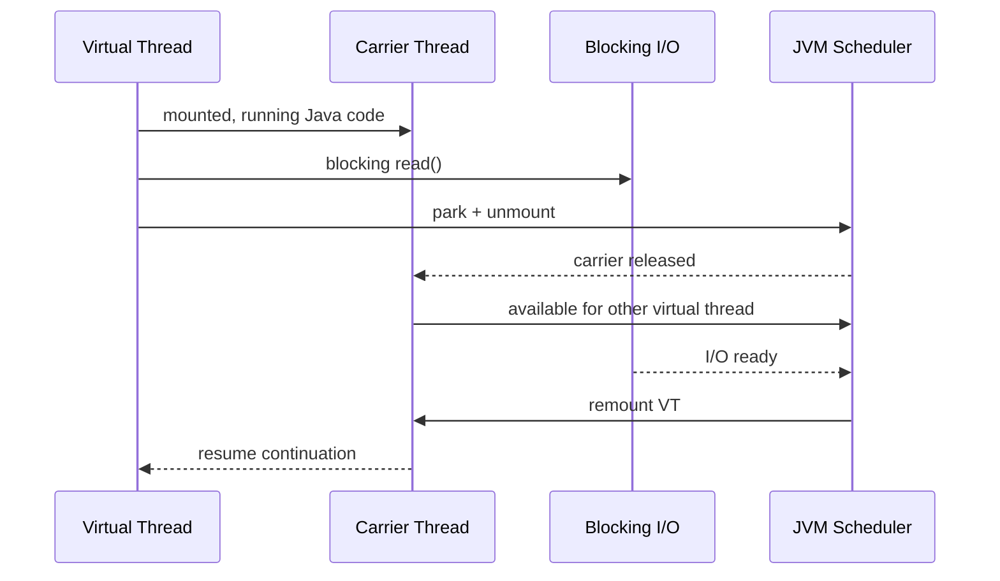
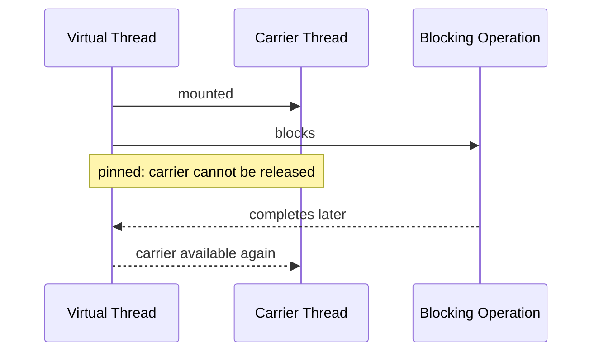
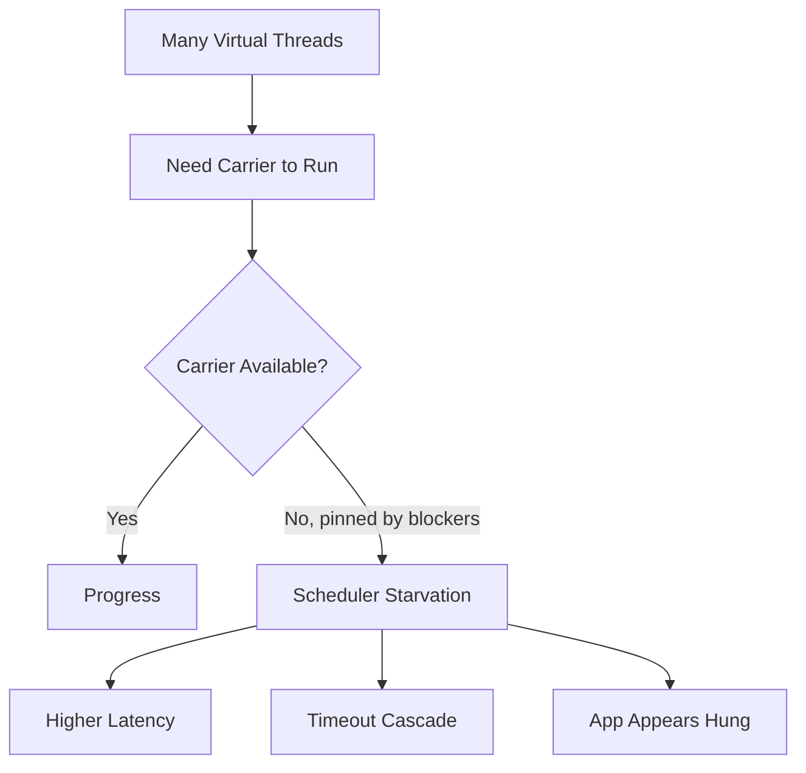

------
title: Learn Java Concurrency & Correctness - Part 025
description: Virtual thread pinning secara mendalam: apa itu pinning, apa yang berubah di JDK 24+, sisa kasus pinning, diagnosis dengan JFR/thread dump, dan decision matrix synchronized vs locks.
series: learn-java-concurrency-correctness
seriesTitle: Learn Java Concurrency & Correctness
order: 25
partTitle: Virtual Thread Pinning and JDK 24+
tags:
- java
- concurrency
- virtual-threads
- pinning
- jdk24
- jdk25
- jfr
- correctness
- series
date: 2026-06-28
---

# Part 025 — Virtual Thread Pinning and JDK 24+

Part sebelumnya membahas production engineering virtual threads: migration, resource guards, DB/HTTP integration, cancellation, observability, dan rollout.

Part ini membahas satu topik yang sering disalahpahami ketika tim mulai mengadopsi virtual threads:

> Pinning.

Pinning sering dibahas seolah-olah ia adalah bug correctness. Itu framing yang kurang tepat.

Pinning adalah masalah **scheduler scalability**: virtual thread yang seharusnya bisa melepas carrier thread saat blocking ternyata tetap menahan carrier tersebut. Akibatnya, carrier thread ikut tertahan dan virtual threads lain kehilangan kesempatan berjalan.

Mental model utamanya:

> Virtual thread murah karena bisa park/unmount saat blocking. Pinning adalah kondisi ketika virtual thread tidak bisa unmount, sehingga blocking-nya menjadi blocking carrier.

Di Java 21–23, `synchronized` yang melakukan blocking di dalam critical section dapat menyebabkan pinning. Di Java 24+, JEP 491 mengubah implementasi monitor sehingga kasus `synchronized` tidak lagi menjadi alasan utama untuk meninggalkan `synchronized` hanya demi virtual threads.

Namun ini bukan berarti semua desain lock otomatis bagus.

JDK 24+ memperbaiki **carrier pinning** untuk monitor, bukan memperbaiki **contention**, **oversized critical section**, **deadlock**, **slow resource inside lock**, atau **bad ownership boundary**.

---

## 1. Apa Itu Carrier, Mount, Unmount, Park, dan Pinning?

Virtual thread berjalan di atas platform thread yang disebut carrier.


Ketika virtual thread menjalankan blocking operation yang didukung JVM, virtual thread bisa **park** dan **unmount**.



Pinning terjadi ketika virtual thread **tidak bisa unmount** walaupun ia block.



Dampaknya:

- virtual thread yang block tetap murah dari perspektif Java object;
- tetapi carrier thread yang harusnya reusable ikut tertahan;
- jumlah carrier terbatas;
- jika banyak virtual threads pinned lama, throughput turun;
- pada kasus ekstrem, aplikasi tampak seperti starvation atau deadlock scheduler.

Pinning bukan berarti data race. Pinning bukan berarti monitor broken. Pinning bukan berarti virtual thread gagal.

Pinning berarti:

> Runtime tidak bisa memultiplex virtual thread lain ke carrier yang sedang tertahan.

---

## 2. Pinning Bukan Bottleneck yang Sama Dengan Lock Contention

Dua hal ini sering tertukar.

### 2.1 Lock contention

Lock contention terjadi ketika banyak thread ingin masuk critical section yang sama.

```java
synchronized (lock) {
    updateSharedState();
}
```

Jika thread A memegang lock, thread B harus menunggu.

Ini benar, bahkan di JDK 25.

### 2.2 Pinning

Pinning adalah ketika virtual thread yang sedang memegang atau menunggu sesuatu tidak bisa melepaskan carrier saat blocking.

Contoh historis Java 21:

```java
synchronized byte[] readData() throws IOException {
    return socket.getInputStream().readAllBytes(); // blocking inside synchronized
}
```

Di Java 21–23, blocking I/O di dalam `synchronized` dapat menahan carrier.

Di Java 24+, monitor-related pinning ini diperbaiki oleh JEP 491.

Tetapi method di atas tetap desain yang buruk jika lock menutupi I/O lambat.

Kenapa?

Karena semua caller lain yang butuh monitor yang sama tetap menunggu.

JDK 24+ menjawab:

> Carrier thread tidak perlu ikut tertahan.

JDK 24+ tidak menjawab:

> Apakah masuk akal menahan lock saat network I/O?

Biasanya tidak.

---

## 3. Timeline Mental Model: JDK 21 vs JDK 24+

| Area | JDK 21–23 | JDK 24+ |
|---|---|---|
| Virtual threads | Final sejak JDK 21 | Tetap final |
| Thread-per-task | Direkomendasikan untuk I/O-bound blocking apps | Tetap direkomendasikan |
| `synchronized` + blocking | Dapat menyebabkan pinning | Monitor-related pinning hampir seluruhnya dihilangkan |
| `jdk.tracePinnedThreads` | Berguna untuk mencari blocking inside synchronized | Tidak lagi diperlukan; setting tidak berefek menurut JEP 491 |
| `ReentrantLock` migration | Kadang disarankan untuk menghindari pinning | Pilih berdasarkan semantics, bukan karena takut `synchronized` |
| Remaining pinning | Synchronized/native cases | Native/FFM callback cases masih relevan |
| Observability | JFR event pinning penting untuk synchronized cases | JFR pinning retained untuk remaining cases |

Prinsip setelah JDK 24:

> Jangan mengganti `synchronized` ke `ReentrantLock` hanya karena virtual threads. Ganti karena butuh fitur `Lock`: timed acquisition, interruptible acquisition, multiple conditions, fairness, atau protocol yang lebih eksplisit.

---

## 4. Contoh Pinning Historis: Blocking Inside `synchronized`

Misalnya ada cache legacy:

```java
final class LegacyRemoteCache {
    private final Map<String, byte[]> cache = new HashMap<>();
    private final RemoteClient client;

    LegacyRemoteCache(RemoteClient client) {
        this.client = client;
    }

    synchronized byte[] get(String key) throws IOException {
        byte[] cached = cache.get(key);
        if (cached != null) {
            return cached;
        }

        byte[] loaded = client.fetch(key); // blocking network I/O
        cache.put(key, loaded);
        return loaded;
    }
}
```

Ada dua masalah berbeda.

### Masalah A — pinning historis

Di JDK 21–23, jika `client.fetch()` block ketika virtual thread berada dalam synchronized method, carrier dapat tertahan.

### Masalah B — desain critical section buruk

Semua request untuk semua key menunggu satu monitor saat remote fetch berlangsung.

JDK 24+ membantu Masalah A.

JDK 24+ tidak memperbaiki Masalah B.

Perbaikan desain tetap diperlukan:

```java
final class BetterRemoteCache {
    private final ConcurrentHashMap<String, CompletableFuture<byte[]>> inFlight = new ConcurrentHashMap<>();
    private final RemoteClient client;

    BetterRemoteCache(RemoteClient client) {
        this.client = client;
    }

    byte[] get(String key) throws Exception {
        CompletableFuture<byte[]> future = inFlight.computeIfAbsent(key, k ->
            CompletableFuture.supplyAsync(() -> {
                try {
                    return client.fetch(k);
                } catch (IOException e) {
                    throw new CompletionException(e);
                }
            })
        );

        try {
            return future.get();
        } finally {
            inFlight.remove(key, future);
        }
    }
}
```

Tetapi contoh ini sendiri belum sempurna untuk production karena:

- `supplyAsync()` tanpa executor eksplisit memakai default executor;
- timeout belum jelas;
- cancellation belum jelas;
- result cache belum dipisah dari in-flight map;
- exception caching policy belum dijelaskan.

Versi blocking virtual-thread-friendly lebih eksplisit:

```java
final class SingleFlightCache {
    private final ConcurrentHashMap<String, FutureTask<byte[]>> inFlight = new ConcurrentHashMap<>();
    private final RemoteClient client;

    SingleFlightCache(RemoteClient client) {
        this.client = client;
    }

    byte[] get(String key) throws Exception {
        FutureTask<byte[]> created = new FutureTask<>(() -> client.fetch(key));
        FutureTask<byte[]> existing = inFlight.putIfAbsent(key, created);
        FutureTask<byte[]> task = existing != null ? existing : created;

        if (existing == null) {
            created.run(); // runs in current virtual thread; no extra executor required
        }

        try {
            return task.get();
        } finally {
            inFlight.remove(key, task);
        }
    }
}
```

Lesson:

> Pinning fix lets old monitor code scale better. It does not remove the need to design ownership, scope, key-level isolation, and resource boundaries.

---

## 5. Kenapa `synchronized` Pernah Mem-pin Virtual Threads?

`Synchronized` berbasis monitor object.

```java
synchronized (account) {
    account.withdraw(amount);
}
```

Pada level semantics:

- hanya satu thread boleh memegang monitor object pada waktu tertentu;
- monitor harus tetap dimiliki oleh thread yang masuk critical section;
- reentrant acquisition harus tetap benar;
- `wait()`/`notify()` berhubungan dengan monitor yang sama;
- Java Memory Model memberi happens-before dari monitor release ke monitor acquire berikutnya.

Masalah historisnya: JVM dahulu mengasosiasikan monitor ownership dengan carrier/platform execution dalam cara yang membuat unmount virtual thread di dalam monitor tidak aman secara implementasi.

Jika virtual thread A unmount saat memegang monitor, lalu carrier dipakai virtual thread B, runtime harus memastikan B tidak dianggap pemilik monitor A.

JEP 491 mengubah bookkeeping monitor sehingga virtual thread bisa acquire/hold/release monitor secara independen dari carrier.

Hasilnya:

- blocking saat acquire monitor dapat unmount;
- blocking di dalam synchronized method/statement dapat unmount;
- `Object.wait()` dan timed wait dapat unmount ketika menunggu dan saat re-acquire monitor;
- carrier dapat dipakai virtual threads lain.

Konsekuensi desain:

> Monitor ownership tetap milik virtual thread secara semantic. Carrier hanyalah execution vehicle.

---

## 6. Apa yang Masih Bisa Menyebabkan Pinning?

Setelah JDK 24, kasus synchronized bukan lagi alasan utama.

Sisa kasus penting adalah interaksi native/foreign code.

Contoh kategori:

- `native` method melalui JNI;
- Foreign Function & Memory API call;
- native code yang callback ke Java;
- callback tersebut melakukan blocking operation;
- callback tersebut mencoba block pada monitor;
- library native yang tidak virtual-thread-aware.

Contoh konseptual:

```java
final class NativeBridge {
    native void callNative(NativeCallback callback);
}

interface NativeCallback {
    void onEvent();
}

void process(NativeBridge bridge, Repository repository) {
    bridge.callNative(() -> {
        // Java callback invoked from native code.
        // If this blocks, pinning can still matter.
        repository.loadSomething();
    });
}
```

Kode seperti ini tidak otomatis salah.

Tetapi perlu diaudit jika:

- blocking duration panjang;
- concurrency tinggi;
- callback dipanggil di request path;
- native library under load tidak predictable;
- JFR menunjukkan `jdk.VirtualThreadPinned`.

Decision rule:

> Treat native/FFM boundaries as scheduler escape hatches. Measure them under realistic concurrency before assuming virtual-thread scalability.

---

## 7. Pinning Severity Model

Tidak semua pinning adalah incident.

Gunakan model severity berikut.

| Severity | Durasi | Frekuensi | Dampak | Tindakan |
|---|---:|---:|---|---|
| Low | sangat pendek | jarang | tidak terlihat | monitor saja |
| Medium | puluhan ms | sedang | tail latency naik | profil + isolate boundary |
| High | ratusan ms/detik | sering | carrier starvation | refactor / offload / limit concurrency |
| Critical | lama/tidak bounded | banyak | service stall | rollback / disable path / redesign |

Pinning menjadi serius jika memenuhi kombinasi:

```text
pin duration × pin frequency × carrier scarcity × request criticality
```

Virtual-thread service bisa punya ribuan virtual threads, tetapi carrier tetap terbatas. Pinning yang lama mengurangi carrier efektif.



---

## 8. `jdk.tracePinnedThreads`: Jangan Jadikan Crutch Modern

Pada era Java 21, property ini sering dipakai:

```bash
-Djdk.tracePinnedThreads=full
```

atau:

```bash
-Djdk.tracePinnedThreads=short
```

Tujuannya: mencetak stack trace saat virtual thread pinned karena blocking inside synchronized.

Pada JDK 24+, property ini tidak lagi diperlukan dan menurut JEP 491 setting-nya tidak berefek.

Implikasi:

- jangan membangun monitoring production modern di atas `jdk.tracePinnedThreads`;
- gunakan JFR untuk observability;
- gunakan thread dump untuk context;
- gunakan load test untuk melihat saturation;
- gunakan metrics untuk melihat symptom.

Checklist migration:

```text
Java 21/22/23:
  use jdk.tracePinnedThreads only during local/staging diagnosis
  use JFR in production-like tests
  inspect synchronized + blocking hot paths

Java 24+:
  do not rely on jdk.tracePinnedThreads
  use JFR jdk.VirtualThreadPinned for remaining native/FFM-related cases
  choose synchronized vs Lock by semantics
```

---

## 9. JFR Events untuk Virtual Threads

JFR adalah alat utama untuk observability virtual-thread runtime.

Event yang relevan:

| Event | Makna |
|---|---|
| `jdk.VirtualThreadStart` | virtual thread mulai |
| `jdk.VirtualThreadEnd` | virtual thread selesai |
| `jdk.VirtualThreadPinned` | virtual thread pinned lebih lama dari threshold |
| `jdk.VirtualThreadSubmitFailed` | start/unpark virtual thread gagal, biasanya resource issue |

Cara praktis menjalankan JFR saat load test:

```bash
java \
  -XX:StartFlightRecording=filename=recording.jfr,settings=profile,dumponexit=true \
  -jar app.jar
```

Atau attach ke proses:

```bash
jcmd <pid> JFR.start name=loom settings=profile filename=loom.jfr
jcmd <pid> JFR.dump name=loom filename=loom-dump.jfr
jcmd <pid> JFR.stop name=loom
```

Yang dicari:

- event `VirtualThreadPinned` dengan durasi signifikan;
- stack trace menuju native/FFM/library boundary;
- korelasi dengan latency spike;
- korelasi dengan carrier/thread starvation;
- korelasi dengan downstream timeout;
- apakah pinning terjadi di critical endpoint atau background path.

Jangan hanya melihat jumlah event. Lihat distribusi durasi.

```text
Bad interpretation:
  There were 500 pinned events. Panic.

Better interpretation:
  p99 pinned duration = 1.2ms, no latency correlation. Monitor.

Incident interpretation:
  p95 pinned duration = 800ms during peak, same stack, request p99 explodes.
```

---

## 10. Thread Dump Setelah Virtual Threads

Thread dump modern harus dibaca sebagai topology, bukan hanya list.

Gunakan:

```bash
jcmd <pid> Thread.dump_to_file -format=json /tmp/threads.json
```

atau sesuai tooling JDK yang tersedia di environment.

Yang dicari:

- jumlah virtual threads runnable vs waiting;
- apakah banyak virtual threads blocked di resource yang sama;
- stack yang menunjukkan native boundary;
- stack yang menunjukkan lock contention;
- stack yang menunjukkan downstream client;
- structured concurrency scope grouping jika digunakan;
- request context/thread name yang cukup informatif.

Naming penting.

```java
ThreadFactory factory = Thread.ofVirtual()
    .name("request-vt-", 0)
    .factory();
```

Tetapi jangan overdo naming untuk semua ephemeral tasks jika overhead/debug noise tidak sepadan.

Prinsip:

> Thread names are for forensic correlation, not business state storage.

---

## 11. Memilih `synchronized` vs `ReentrantLock` Setelah JDK 24

Setelah monitor pinning diperbaiki, decision matrix menjadi lebih bersih.

### Pilih `synchronized` jika:

- critical section kecil;
- satu condition implicit cukup;
- tidak butuh timeout saat acquire lock;
- tidak butuh interruptible lock acquisition;
- tidak butuh fairness policy;
- lock release lexical lebih disukai;
- monitor ownership sederhana;
- maintainability lebih penting daripada fleksibilitas.

```java
final class Counter {
    private long value;

    synchronized long incrementAndGet() {
        return ++value;
    }
}
```

### Pilih `ReentrantLock` jika:

- butuh `tryLock()`;
- butuh timed lock acquisition;
- butuh `lockInterruptibly()`;
- butuh multiple `Condition` objects;
- butuh fairness mode;
- butuh introspection tertentu;
- protocol lock kompleks;
- lock/unlock tidak bisa lexical sederhana.

```java
final class InventoryGate {
    private final ReentrantLock lock = new ReentrantLock();
    private final Condition enoughStock = lock.newCondition();
    private int stock;

    boolean reserve(int amount, Duration timeout) throws InterruptedException {
        long nanos = timeout.toNanos();
        lock.lockInterruptibly();
        try {
            while (stock < amount) {
                if (nanos <= 0L) {
                    return false;
                }
                nanos = enoughStock.awaitNanos(nanos);
            }
            stock -= amount;
            return true;
        } finally {
            lock.unlock();
        }
    }
}
```

Decision anti-rule:

> Jangan memilih `ReentrantLock` hanya karena “katanya synchronized tidak cocok dengan virtual threads”. Itu benar untuk Java 21-era pinning concerns, tetapi bukan rule modern JDK 24+.

---

## 12. Critical Section Hygiene Tetap Wajib

JDK 24+ mengurangi satu hazard runtime, tetapi critical section yang buruk tetap buruk.

### Hindari I/O di dalam lock

```java
synchronized void updateAndNotify(Order order) {
    orders.put(order.id(), order);
    emailClient.send(order); // bad: slow external operation inside lock
}
```

Lebih baik:

```java
void updateAndNotify(Order order) {
    boolean shouldSend;

    synchronized (this) {
        shouldSend = orders.put(order.id(), order) == null;
    }

    if (shouldSend) {
        emailClient.send(order); // outside lock
    }
}
```

### Hindari callback asing di dalam lock

```java
synchronized void register(Listener listener) {
    listeners.add(listener);
    listener.onRegistered(); // bad: external callback under lock
}
```

Kenapa buruk?

- listener bisa re-enter;
- listener bisa block;
- listener bisa throw;
- listener bisa call balik object ini;
- lock graph menjadi tidak terkendali.

Lebih baik:

```java
void register(Listener listener) {
    synchronized (this) {
        listeners.add(listener);
    }
    listener.onRegistered();
}
```

### Hindari critical section besar

```java
synchronized Report generateReport(Query query) {
    Data data = repository.load(query);
    Stats stats = calculate(data);
    byte[] pdf = renderer.render(stats);
    audit.write(query);
    return new Report(pdf);
}
```

Ini bukan hanya pinning concern. Ini lock scope concern.

Pertanyaan review:

- state apa yang benar-benar dilindungi lock?
- operasi mana yang hanya butuh snapshot?
- bisa tidak ambil snapshot kecil lalu release lock?
- apakah invariant aggregate perlu lock selama seluruh proses?
- apakah slow path bisa dipisahkan dari mutation path?

---

## 13. Monitor Wait dan Virtual Threads

`Object.wait()` selalu terkait monitor.

```java
synchronized (lock) {
    while (!condition()) {
        lock.wait();
    }
    consume();
}
```

Di JDK 24+, JEP 491 mencakup `Object.wait()` dan timed wait sehingga virtual thread dapat unmount ketika menunggu dan ketika block untuk re-acquire monitor.

Tetapi correctness rule tidak berubah:

- harus hold monitor sebelum `wait()`;
- predicate harus dicek dalam `while`;
- `notifyAll()` sering lebih aman daripada `notify()` jika multiple predicates;
- interruption harus diputuskan policy-nya;
- timeout harus dihitung ulang;
- shared state harus dilindungi monitor yang sama.

Jangan mengubah:

```java
while (!ready) {
    lock.wait();
}
```

menjadi:

```java
if (!ready) {
    lock.wait();
}
```

hanya karena virtual threads.

Spurious wakeup tetap mungkin. Lost signal tetap mungkin jika predicate salah.

---

## 14. Pinning vs Blocking vs Parking

Gunakan vocabulary yang tepat saat incident.

| Term | Maksud | Apakah buruk? |
|---|---|---|
| Blocking | Task menunggu operasi selesai | Tidak selalu buruk |
| Parking | Thread sengaja disuspend menunggu signal/time | Normal |
| Unmounting | Virtual thread melepas carrier saat parked/blocking | Baik untuk scalability |
| Pinning | Virtual thread tidak bisa unmount saat block | Bisa buruk jika lama/sering |
| Contention | Banyak thread rebutan lock/resource | Bisa buruk meski tanpa pinning |
| Starvation | Work tidak mendapat kesempatan progress | Buruk |

Contoh incident report yang buruk:

```text
Service lambat karena banyak thread blocking.
```

Terlalu umum.

Contoh yang lebih baik:

```text
Pada p95 traffic, 70% request virtual threads waiting di pool DB. Tidak ada carrier starvation. Bottleneck adalah DB connection pool, bukan virtual thread pinning.
```

Atau:

```text
JFR menunjukkan VirtualThreadPinned p99 1.8s pada JNI callback ke compression library. Carrier effective parallelism turun, request p99 naik dari 300ms ke 5s.
```

---

## 15. Resource Limiting Lebih Penting Daripada Menghindari Pinning

Virtual threads membuat blocking murah, tetapi resource tetap mahal.

```java
final class BoundedClient {
    private final Semaphore permits;
    private final HttpClient client;

    BoundedClient(int maxConcurrent, HttpClient client) {
        this.permits = new Semaphore(maxConcurrent);
        this.client = client;
    }

    Response call(Request request) throws InterruptedException {
        if (!permits.tryAcquire(200, TimeUnit.MILLISECONDS)) {
            throw new RejectedExecutionException("downstream concurrency limit exceeded");
        }
        try {
            return client.call(request);
        } finally {
            permits.release();
        }
    }
}
```

Ini tidak berkaitan langsung dengan pinning, tetapi jauh lebih sering menjadi perbedaan antara virtual-thread adoption yang aman dan incident.

Salah satu kesalahan migrasi:

```text
Old platform pool size = 200
New virtual thread request concurrency = unbounded
DB max connections = 80
Downstream p99 = unstable
```

Hasilnya bukan “virtual thread lambat”.

Hasilnya:

> aplikasi menghapus throttle tidak sengaja tanpa menggantinya dengan throttle eksplisit.

---

## 16. Benchmark Pinning Dengan Benar

Microbenchmark pinning mudah menyesatkan.

Benchmark buruk:

```java
for (int i = 0; i < 1_000_000; i++) {
    Thread.startVirtualThread(() -> {
        synchronized (lock) {
            Thread.sleep(Duration.ofMillis(10));
        }
    });
}
```

Masalah:

- tidak merepresentasikan workload production;
- satu global lock membuat contention artifisial;
- `sleep` bukan I/O downstream;
- tidak mengukur tail latency request;
- tidak mengukur carrier starvation;
- tidak mengukur resource saturation.

Benchmark lebih berguna:

- pakai workload real endpoint;
- jalankan di JDK target;
- aktifkan JFR;
- ukur p50/p95/p99 latency;
- ukur throughput;
- ukur DB pool wait time;
- ukur downstream latency;
- ukur CPU, heap, GC;
- ukur VirtualThreadPinned duration;
- bandingkan normal load dan overload;
- bandingkan JDK 21 vs 24/25 jika migrasi penting.

Template eksperimen:

```text
Experiment: virtual-thread pinning and resource saturation

JDK versions:
  - 21.0.x
  - 25.0.x

Workload:
  - endpoint: POST /cases/{id}/evaluate
  - concurrency: 50, 200, 1000, 5000
  - downstream latency injection: p50 30ms, p99 900ms

Metrics:
  - request latency p50/p95/p99
  - throughput
  - error rate
  - DB pool wait
  - downstream inflight
  - carrier utilization symptom
  - JFR VirtualThreadPinned count/duration/stack

Decision:
  - adopt as-is
  - add resource guard
  - refactor native boundary
  - retain platform pool for one adapter
```

---

## 17. Native Boundary Isolation Pattern

Jika native/FFM path masih pinning, jangan langsung menolak virtual threads untuk seluruh aplikasi.

Isolasi boundary.

```java
final class NativeCompressorAdapter implements AutoCloseable {
    private final ExecutorService platformPool;
    private final Semaphore permits;

    NativeCompressorAdapter(int parallelism) {
        this.platformPool = Executors.newFixedThreadPool(parallelism);
        this.permits = new Semaphore(parallelism);
    }

    byte[] compress(byte[] input) throws Exception {
        if (!permits.tryAcquire(100, TimeUnit.MILLISECONDS)) {
            throw new RejectedExecutionException("native compressor overloaded");
        }
        try {
            Future<byte[]> future = platformPool.submit(() -> NativeCompressor.compress(input));
            return future.get(2, TimeUnit.SECONDS);
        } finally {
            permits.release();
        }
    }

    @Override
    public void close() {
        platformPool.shutdown();
    }
}
```

Trade-off:

- virtual-thread request path tetap sederhana;
- native region dibatasi dengan platform pool;
- concurrency native tidak unbounded;
- cancellation masih perlu diperhatikan;
- timeout harus ditranslate dengan benar;
- hasil JFR menjadi lebih jelas.

Jangan gunakan pattern ini untuk semua blocking I/O biasa. Ini khusus untuk boundary yang memang tidak virtual-thread-friendly.

---

## 18. `synchronized` Setelah JDK 24: Contoh Pemakaian yang Masih Baik

Untuk state kecil dan invariant lokal, `synchronized` tetap sangat baik.

```java
final class CaseCounter {
    private long opened;
    private long closed;

    synchronized void markOpened() {
        opened++;
    }

    synchronized void markClosed() {
        closed++;
    }

    synchronized Snapshot snapshot() {
        return new Snapshot(opened, closed);
    }
}
```

Keunggulan:

- lexical scope jelas;
- release lock otomatis;
- memory visibility jelas;
- tidak ada explicit `unlock()` yang bisa lupa;
- cukup untuk simple invariant.

Tidak perlu mengganti ini ke `ReentrantLock` hanya demi virtual threads.

---

## 19. `ReentrantLock` Setelah JDK 24: Contoh Pemakaian yang Masih Tepat

Jika acquisition harus timeout:

```java
final class CaseMutationGate {
    private final ReentrantLock lock = new ReentrantLock();

    boolean tryMutate(CaseId id, Duration maxWait) throws InterruptedException {
        if (!lock.tryLock(maxWait.toMillis(), TimeUnit.MILLISECONDS)) {
            return false;
        }
        try {
            mutate(id);
            return true;
        } finally {
            lock.unlock();
        }
    }

    private void mutate(CaseId id) {
        // mutation under lock
    }
}
```

Jika wait condition terpisah:

```java
final class CaseQueue {
    private final ReentrantLock lock = new ReentrantLock();
    private final Condition notEmpty = lock.newCondition();
    private final Condition notFull = lock.newCondition();
    private final Deque<CaseWork> queue = new ArrayDeque<>();
    private final int capacity;

    CaseQueue(int capacity) {
        this.capacity = capacity;
    }

    void put(CaseWork work) throws InterruptedException {
        lock.lockInterruptibly();
        try {
            while (queue.size() == capacity) {
                notFull.await();
            }
            queue.addLast(work);
            notEmpty.signal();
        } finally {
            lock.unlock();
        }
    }

    CaseWork take() throws InterruptedException {
        lock.lockInterruptibly();
        try {
            while (queue.isEmpty()) {
                notEmpty.await();
            }
            CaseWork work = queue.removeFirst();
            notFull.signal();
            return work;
        } finally {
            lock.unlock();
        }
    }
}
```

Pada production code, Anda biasanya akan memakai `BlockingQueue` untuk kasus ini. Contoh ini menunjukkan kapan explicit `Condition` masuk akal.

---

## 20. Audit Checklist untuk Pinning dan Virtual Threads

Gunakan checklist ini saat review service yang sudah memakai virtual threads.

### Runtime/JDK

- JDK target versi berapa?
- Jika JDK 21–23, apakah ada blocking inside synchronized hot path?
- Jika JDK 24+, apakah tim masih membawa workaround lama yang tidak perlu?
- Apakah `jdk.tracePinnedThreads` masih dipakai di config?
- Apakah JFR recording sudah menangkap virtual-thread events?

### Locking

- Lock melindungi state apa?
- Critical section sekecil mungkin?
- Ada I/O di dalam lock?
- Ada callback external di dalam lock?
- Ada nested lock tanpa ordering?
- Ada `wait()` dengan `if` bukan `while`?
- Ada `notify()` dengan multiple predicates?

### Native/FFM

- Ada JNI/FFM di request path?
- Native code callback ke Java?
- Callback melakukan blocking?
- Ada JFR `VirtualThreadPinned` stack menuju native boundary?
- Perlu isolasi platform pool?

### Resource

- Apakah DB/downstream concurrency eksplisit dibatasi?
- Apakah timeout total ada?
- Apakah timeout bawah lebih kecil dari timeout atas?
- Apakah cancellation/interruption didukung?
- Apakah overload menghasilkan rejection cepat, bukan queue tak terbatas?

### Observability

- Apakah thread names/scope names cukup informatif?
- Apakah JFR dapat dikumpulkan saat incident?
- Apakah ada metric pinning duration/count di load test?
- Apakah tail latency dikorelasikan dengan pinning/resource wait?

---

## 21. Anti-Patterns

### Anti-pattern 1 — ReentrantLock migration cult

```text
Semua synchronized harus diganti ReentrantLock karena virtual threads.
```

Setelah JDK 24+, ini bukan rule yang sehat.

Yang benar:

```text
Pilih primitive berdasarkan correctness semantics dan operational needs.
```

### Anti-pattern 2 — ignoring lock scope because pinning fixed

```text
JDK 24 sudah memperbaiki pinning, jadi aman melakukan HTTP call di synchronized.
```

Salah.

Pinning fix tidak menghapus lock contention dan bad critical section.

### Anti-pattern 3 — treating JFR pinning event count as absolute failure

```text
Ada event pinned, berarti deploy gagal.
```

Belum tentu.

Lihat durasi, stack, frekuensi, dan korelasi latency.

### Anti-pattern 4 — unbounded native calls from virtual threads

```java
try (var executor = Executors.newVirtualThreadPerTaskExecutor()) {
    requests.forEach(req -> executor.submit(() -> nativeLibrary.call(req)));
}
```

Jika native call pinned/blocking lama, ini bisa merusak scalability.

Tambahkan bounded adapter.

### Anti-pattern 5 — using platform pool as universal workaround

```text
Ada virtual thread issue? Jalankan semua di fixed thread pool.
```

Ini membuang manfaat virtual threads dan mengembalikan thread starvation lama.

Isolasi hanya boundary yang perlu.

---

## 22. Review Questions untuk Senior Engineer

Saat membaca kode virtual-thread service, tanya:

1. Apakah concurrency dibatasi oleh thread count atau resource capacity?
2. Apakah ada critical section yang menutupi I/O?
3. Apakah JDK target masih punya monitor pinning concern?
4. Apakah penggunaan `ReentrantLock` karena semantics atau trauma JDK 21?
5. Apakah native/FFM boundary dipetakan?
6. Apakah JFR membuktikan pinning sebagai problem, atau hanya asumsi?
7. Apakah failure adalah pinning, contention, pool wait, downstream slowness, atau CPU saturation?
8. Apakah cancellation sampai ke operation yang block?
9. Apakah virtual threads diberi nama/scope untuk forensic debugging?
10. Apakah load test mencakup overload dan downstream degradation?

---

## 23. Small Drill: Klasifikasikan Masalah

Untuk setiap kasus, tentukan apakah masalah utama adalah pinning, contention, unbounded concurrency, atau bad cancellation.

### Kasus A

```java
synchronized void update(Order order) {
    state.put(order.id(), order);
}
```

Ini biasanya bukan masalah pinning. Critical section kecil. `synchronized` masuk akal.

### Kasus B

```java
synchronized void update(Order order) {
    state.put(order.id(), order);
    paymentClient.charge(order);
}
```

Ini bad critical section. Di JDK 21 bisa juga pinning. Di JDK 24+ pinning monitor diperbaiki, tetapi lock contention tetap buruk.

### Kasus C

```java
requests.forEach(r -> Thread.startVirtualThread(() -> db.query(r)));
```

Masalah utama kemungkinan unbounded DB concurrency, bukan pinning.

### Kasus D

```java
nativeBridge.call(() -> repository.load());
```

Jika JFR menunjukkan `VirtualThreadPinned`, masalah mungkin native/FFM callback boundary.

### Kasus E

```java
Future<?> f = executor.submit(this::runForever);
f.cancel(true);
```

Jika `runForever` menelan interrupt atau block pada API non-interruptible, masalah utama cancellation/progress, bukan pinning.

---

## 24. Mental Model Final

Ringkasnya:

```text
Virtual thread scalability = cheap parked tasks + available carriers + bounded scarce resources.
```

Pinning merusak bagian “available carriers”.

Tetapi sistem production juga bisa gagal karena:

- lock contention;
- deadlock;
- unbounded fan-out;
- DB pool starvation;
- downstream overload;
- CPU saturation;
- bad timeout hierarchy;
- cancellation yang tidak dihormati;
- context leakage;
- observability yang buruk.

JDK 24+ membuat virtual threads lebih praktis untuk codebase Java lama karena `synchronized` tidak lagi perlu dicurigai secara default sebagai source pinning.

Namun engineering principle tetap:

> Jangan block lama di bawah lock. Jangan biarkan concurrency mencapai resource langka tanpa guard. Jangan menyimpulkan root cause tanpa JFR/thread dump/metrics.

---

## 25. Production Checklist

Sebelum menyatakan virtual-thread service siap production:

- [ ] JDK target jelas dan diuji.
- [ ] Jika JDK 21–23, blocking inside synchronized diaudit.
- [ ] Jika JDK 24+, workaround pinning lama direview ulang.
- [ ] JFR recording tersedia di staging/load test.
- [ ] `VirtualThreadPinned` event dievaluasi berdasarkan durasi dan stack.
- [ ] Native/FFM boundary diketahui.
- [ ] Resource guard eksplisit tersedia untuk DB/downstream/native.
- [ ] Critical section tidak menutupi slow I/O/callback asing.
- [ ] Lock choice didasarkan pada semantics.
- [ ] Timeout dan cancellation diuji.
- [ ] Thread dump bisa dikorelasikan dengan request path.
- [ ] Load test mencakup overload, bukan hanya happy path.

---

## 26. Referensi

- JEP 444: Virtual Threads — https://openjdk.org/jeps/444
- JEP 491: Synchronize Virtual Threads without Pinning — https://openjdk.org/jeps/491
- Oracle Java Virtual Threads Guide — https://docs.oracle.com/en/java/javase/21/core/virtual-threads.html
- Java SE 25 API: `Thread` — https://docs.oracle.com/en/java/javase/25/docs/api/java.base/java/lang/Thread.html
- Java SE 25 API: `ReentrantLock` — https://docs.oracle.com/en/java/javase/25/docs/api/java.base/java/util/concurrent/locks/ReentrantLock.html
- Java SE 25 API: `Object.wait/notify` — https://docs.oracle.com/en/java/javase/25/docs/api/java.base/java/lang/Object.html
