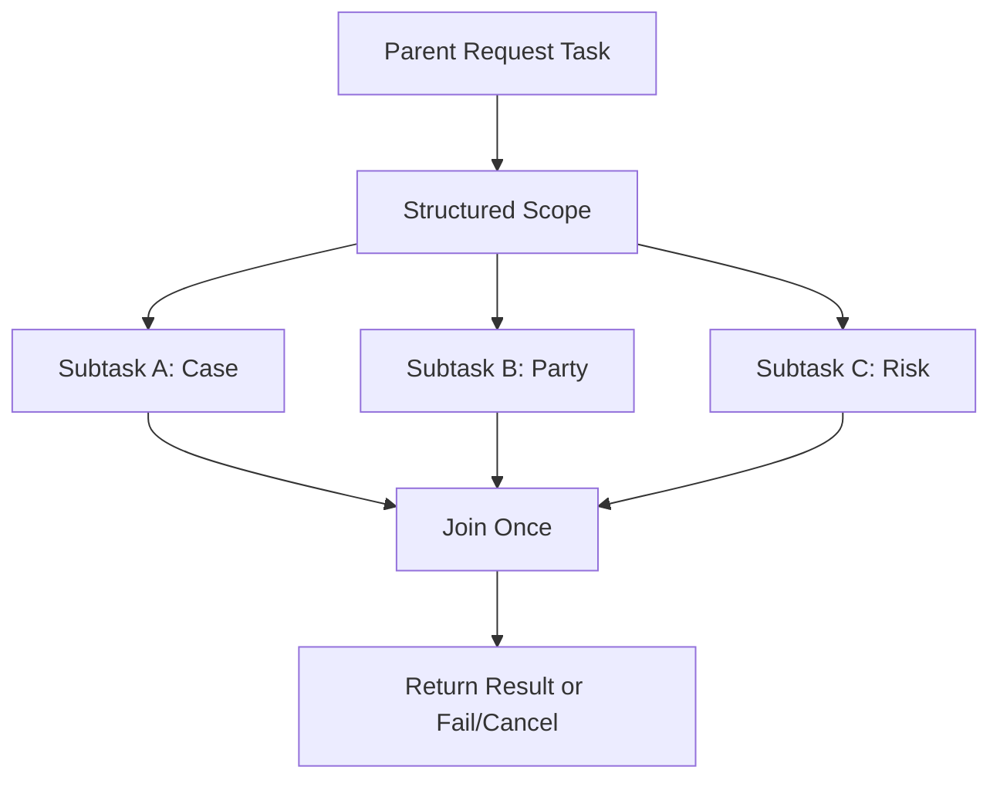
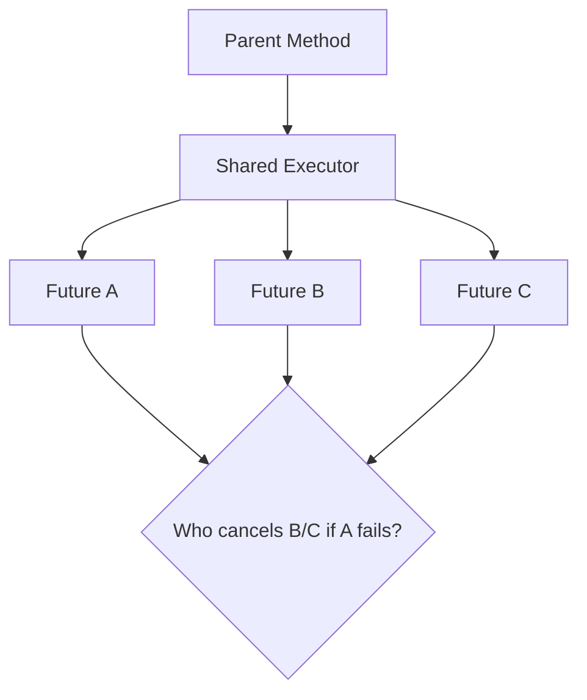
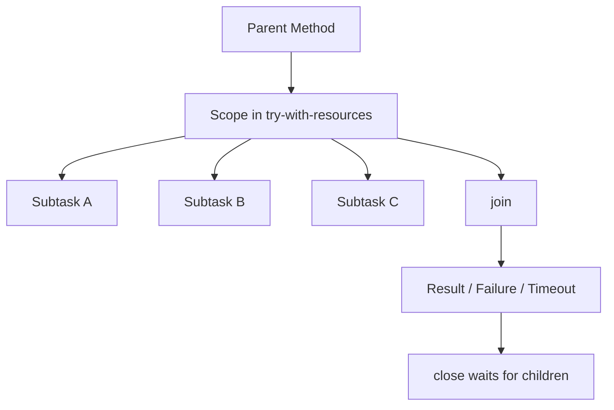
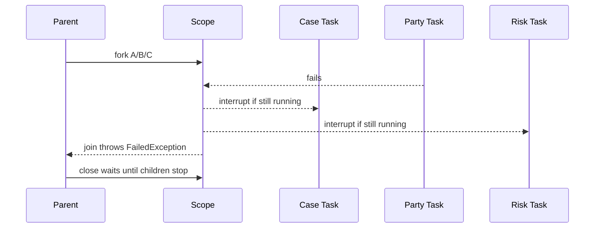
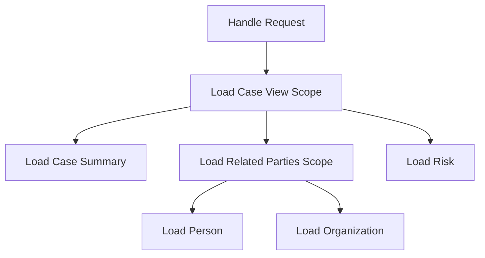
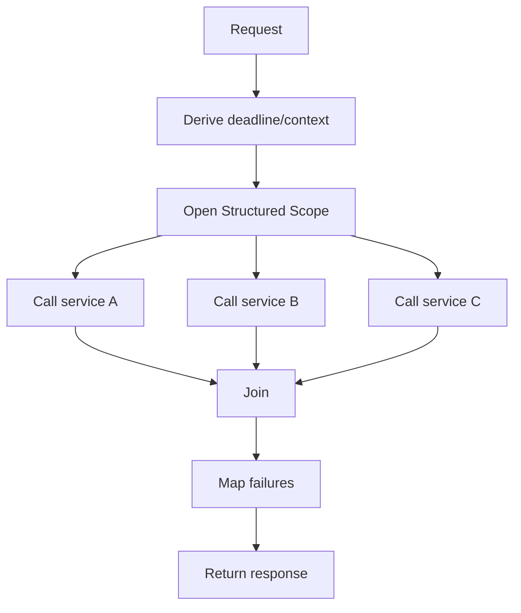

------
title: Learn Java Concurrency & Correctness - Part 026
description: Structured concurrency di Java modern: mental model parent-child lifetime, StructuredTaskScope JDK 25, Joiner, failure propagation, cancellation, timeout, observability, dan production design.
series: learn-java-concurrency-correctness
seriesTitle: Learn Java Concurrency & Correctness
order: 26
partTitle: Structured Concurrency
tags:
- java
- concurrency
- structured-concurrency
- virtual-threads
- cancellation
- correctness
- jdk25
- series
date: 2026-06-28
---

# Part 026 — Structured Concurrency

Part sebelumnya membahas virtual-thread pinning dan perubahan penting di JDK 24+.

Part ini membahas salah satu konsep paling penting setelah virtual threads:

> Structured concurrency.

Virtual threads membuat thread murah. Structured concurrency membuat penggunaan banyak thread tetap **terikat, dapat dibatalkan, dapat diamati, dan dapat dipahami**.

Tanpa structured concurrency, virtual threads bisa berubah menjadi versi baru dari masalah lama:

- task bocor;
- failure hilang;
- cancellation tidak menyebar;
- timeout tidak konsisten;
- thread dump sulit dibaca;
- parent request selesai tetapi child task masih berjalan;
- partial result tidak jelas ownership-nya.

Mental model utama:

> If a task starts subtasks, the task owns their lifetime. The parent should not finish until its children are complete, cancelled, or failed in a controlled way.

Structured concurrency bukan sekadar API. Ia adalah disiplin desain.

---

## 1. Problem: Unstructured Concurrency

Contoh umum:

```java
final class CaseViewService {
    private final ExecutorService executor;
    private final CaseClient caseClient;
    private final PartyClient partyClient;
    private final RiskClient riskClient;

    CaseViewService(
        ExecutorService executor,
        CaseClient caseClient,
        PartyClient partyClient,
        RiskClient riskClient
    ) {
        this.executor = executor;
        this.caseClient = caseClient;
        this.partyClient = partyClient;
        this.riskClient = riskClient;
    }

    CaseView load(CaseId caseId) throws Exception {
        Future<CaseData> caseFuture = executor.submit(() -> caseClient.load(caseId));
        Future<PartyData> partyFuture = executor.submit(() -> partyClient.load(caseId));
        Future<RiskData> riskFuture = executor.submit(() -> riskClient.load(caseId));

        CaseData caseData = caseFuture.get();
        PartyData partyData = partyFuture.get();
        RiskData riskData = riskFuture.get();

        return new CaseView(caseData, partyData, riskData);
    }
}
```

Sekilas benar. Tetapi ada banyak pertanyaan:

- Jika `caseFuture.get()` gagal, siapa membatalkan `partyFuture` dan `riskFuture`?
- Jika caller timeout, apakah subtasks ikut berhenti?
- Jika satu task lambat, apakah yang lain terus berjalan percuma?
- Jika method throw sebelum membaca semua `Future`, apakah ada task bocor?
- Apakah executor overload terlihat sebagai bagian dari request?
- Apakah thread dump menunjukkan ketiga task ini satu family?
- Apakah context request aman di-propagate?
- Apakah exception dipusatkan atau tersebar?

Unstructured concurrency membuat lifetime task seperti object manual memory management: mudah dibuat, sulit dipastikan selesai.

---

## 2. Structured Concurrency: Bentuk Mental

Structured concurrency memperlakukan beberapa subtasks sebagai satu unit kerja.



Invariant-nya:

```text
Parent cannot outlive uncontrolled children.
Children cannot silently outlive parent scope.
Failure and cancellation are centralized at the scope boundary.
```

Ini mirip structured programming:

```java
if (...) {
    doA();
    doB();
}
```

Block punya entry dan exit yang jelas.

Structured concurrency menerapkan ide yang sama ke concurrent subtasks.

```java
try (var scope = StructuredTaskScope.open()) {
    var a = scope.fork(this::loadA);
    var b = scope.fork(this::loadB);

    scope.join();
    return combine(a.get(), b.get());
}
```

Ketika block selesai, subtasks tidak boleh dibiarkan liar.

---

## 3. Status API di JDK 25

Di JDK 25, `StructuredTaskScope` adalah preview API. Artinya:

- perlu `--enable-preview` saat compile/run;
- API dapat berubah pada rilis berikutnya;
- cocok untuk eksplorasi, internal platform experimentation, atau controlled adoption;
- untuk library public yang harus stabil lintas JDK, perlu hati-hati.

Compile:

```bash
javac --release 25 --enable-preview Main.java
```

Run:

```bash
java --enable-preview Main
```

Bentuk JDK 25 berbeda dari beberapa artikel lama karena API preview mengalami perubahan. Di JDK 25, scope dibuat dengan static factory seperti:

```java
StructuredTaskScope.open()
```

atau:

```java
StructuredTaskScope.open(StructuredTaskScope.Joiner.anySuccessfulResultOrThrow())
```

Bukan lagi bergantung pada constructor public lama atau subclass policy lama seperti yang mungkin Anda temukan di materi JDK 21/22.

---

## 4. Basic Pattern: All Must Succeed

Kasus paling umum: request butuh semua data.

```java
import java.util.concurrent.StructuredTaskScope;

final class CaseViewService {
    private final CaseClient caseClient;
    private final PartyClient partyClient;
    private final RiskClient riskClient;

    CaseView load(CaseId caseId) throws Exception {
        try (var scope = StructuredTaskScope.open()) {
            var caseTask = scope.fork(() -> caseClient.load(caseId));
            var partyTask = scope.fork(() -> partyClient.load(caseId));
            var riskTask = scope.fork(() -> riskClient.load(caseId));

            scope.join(); // waits for all success or fails if any subtask fails

            return new CaseView(
                caseTask.get(),
                partyTask.get(),
                riskTask.get()
            );
        }
    }
}
```

Semantics penting:

- `fork()` memulai subtask dalam thread baru di scope;
- default thread factory membuat virtual threads;
- `join()` adalah boundary tunggal untuk menunggu outcome;
- jika subtask gagal, scope membatalkan subtasks lain;
- cancellation dilakukan dengan interrupt;
- `Subtask.get()` dipanggil setelah `join()` dan hanya untuk subtask yang sukses;
- `close()` memastikan scope tidak ditinggalkan sebelum subtasks selesai.

Ini jauh lebih mudah diaudit daripada `Future` manual.

---

## 5. Apa yang Diperbaiki Dibanding `ExecutorService` Manual?

Bandingkan ownership.

### ExecutorService manual



Task lifetime keluar dari lexical block parent.

### StructuredTaskScope



Lifetime task terlihat dari struktur kode.

| Concern | Manual Future | StructuredTaskScope |
|---|---|---|
| Parent-child ownership | implisit | eksplisit |
| Join point | tersebar | satu boundary |
| Failure propagation | manual | built-in via Joiner policy |
| Cancellation sibling | manual | built-in untuk policy tertentu |
| Scope closure | manual | try-with-resources |
| Observability | task tampak terpisah | scope dapat membantu grouping |
| Context inheritance | sering manual/ThreadLocal | scoped values inherited oleh forked subtasks |

---

## 6. Failure Propagation: Fail Fast Dengan Aman

Misalnya tiga subtasks:

- `loadCase()` sukses 80ms;
- `loadParty()` gagal 50ms;
- `loadRisk()` masih berjalan 1s.

Dalam desain manual, `loadRisk()` bisa terus berjalan percuma jika tidak dibatalkan.

Structured scope default all-success policy membatalkan sibling saat failure.



Namun cancellation hanya efektif jika subtasks menghormati interrupt.

```java
RiskData loadRisk(CaseId id) throws InterruptedException {
    while (true) {
        if (Thread.currentThread().isInterrupted()) {
            throw new InterruptedException("risk load cancelled");
        }
        // do bounded chunk
    }
}
```

Untuk I/O clients, pastikan:

- timeout ada;
- client operation bisa interrupted atau dibatalkan;
- resource ditutup saat cancellation;
- retry loop cek interrupt;
- backoff sleep tidak menelan interrupt.

Anti-pattern:

```java
RiskData loadRisk(CaseId id) {
    try {
        return client.call(id);
    } catch (InterruptedException e) {
        // bad: cancellation swallowed
        return fallbackRisk();
    }
}
```

Lebih baik:

```java
RiskData loadRisk(CaseId id) throws InterruptedException {
    try {
        return client.call(id);
    } catch (InterruptedException e) {
        Thread.currentThread().interrupt();
        throw e;
    }
}
```

---

## 7. Joiner: Policy dan Outcome

`Joiner` menentukan:

- kapan scope dianggap selesai;
- apakah failure membatalkan siblings;
- apakah join menghasilkan `null`, satu result, stream subtasks, atau outcome lain;
- kapan scope harus short-circuit.

Factory umum di JDK 25:

| Joiner | Use case |
|---|---|
| `awaitAllSuccessfulOrThrow()` | tunggu semua sukses; fail jika ada subtask gagal |
| `allSuccessfulOrThrow()` | kumpulkan subtasks sukses sebagai stream; fail jika ada gagal |
| `anySuccessfulResultOrThrow()` | ambil result pertama yang sukses; fail jika semua gagal |
| `awaitAll()` | tunggu semua selesai tanpa otomatis throw/cancel karena failure |
| `allUntil(predicate)` | custom cancellation policy berbasis predicate |

### 7.1 Any successful result

Contoh: query beberapa replica, ambil yang pertama sukses.

```java
import java.util.concurrent.StructuredTaskScope;
import java.util.concurrent.StructuredTaskScope.Joiner;

final class ReplicaReader {
    String readFromFastest(Key key) throws Exception {
        try (var scope = StructuredTaskScope.open(Joiner.<String>anySuccessfulResultOrThrow())) {
            scope.fork(() -> readReplicaA(key));
            scope.fork(() -> readReplicaB(key));
            scope.fork(() -> readReplicaC(key));

            return scope.join(); // returns first successful String, cancels unneeded siblings
        }
    }
}
```

Ini cocok jika:

- result antar replica equivalent;
- first success valid;
- latency lebih penting daripada cost semua completion;
- operasi aman dibatalkan.

Tidak cocok jika:

- perlu quorum;
- result harus dibandingkan;
- side effect tidak idempotent;
- sibling cancellation tidak aman.

### 7.2 All successful as stream

Contoh: semua subtasks sama tipe dan ingin collect.

```java
import java.util.List;
import java.util.concurrent.StructuredTaskScope;
import java.util.concurrent.StructuredTaskScope.Joiner;
import java.util.concurrent.StructuredTaskScope.Subtask;

final class BatchLookup {
    List<Customer> loadAll(List<CustomerId> ids) throws Exception {
        try (var scope = StructuredTaskScope.open(Joiner.<Customer>allSuccessfulOrThrow())) {
            for (CustomerId id : ids) {
                scope.fork(() -> loadCustomer(id));
            }

            return scope.join()
                .map(Subtask::get)
                .toList();
        }
    }
}
```

Perhatikan: jika list besar, jangan fan-out tanpa limit. Structured concurrency mengatur lifetime, bukan kapasitas resource.

---

## 8. Timeout Scope

Timeout harus melekat ke scope, bukan tersebar di `Future.get(timeout)` satu per satu tanpa deadline global.

Di JDK 25, configuration scope dapat diberi timeout.

```java
import java.time.Duration;
import java.util.concurrent.StructuredTaskScope;
import java.util.concurrent.StructuredTaskScope.Joiner;

final class TimedCaseViewService {
    CaseView load(CaseId caseId) throws Exception {
        Duration timeout = Duration.ofMillis(800);

        try (var scope = StructuredTaskScope.open(
            Joiner.<Object>awaitAllSuccessfulOrThrow(),
            config -> config.withTimeout(timeout)
        )) {
            var caseTask = scope.fork(() -> caseClient.load(caseId));
            var partyTask = scope.fork(() -> partyClient.load(caseId));
            var riskTask = scope.fork(() -> riskClient.load(caseId));

            scope.join();

            return new CaseView(
                (CaseData) caseTask.get(),
                (PartyData) partyTask.get(),
                (RiskData) riskTask.get()
            );
        }
    }
}
```

Catatan: contoh memakai `Object` karena subtasks berbeda tipe. Untuk code production, Anda bisa memakai default `open()` untuk all-success heterogeneous tasks atau membungkus result ke sealed interface/domain object jika ingin type lebih rapi.

Timeout scope memberi satu deadline untuk family subtasks.

Tetapi operation bawah tetap butuh timeout sendiri.

```text
Request deadline: 1000ms
  case client timeout: 300ms
  party client timeout: 300ms
  risk client timeout: 500ms
  scope timeout: 900ms
  server response budget: 100ms
```

Rule:

> Scope timeout coordinates the family. Lower-level timeout protects each resource operation.

---

## 9. Deadline Propagation

Timeout relatif bisa salah jika tiap layer menghitung ulang dari nol.

Lebih baik propagate deadline absolut.

```java
record RequestDeadline(Instant expiresAt) {
    Duration remaining() {
        Duration duration = Duration.between(Instant.now(), expiresAt);
        return duration.isNegative() ? Duration.ZERO : duration;
    }

    boolean expired() {
        return !Instant.now().isBefore(expiresAt);
    }
}
```

Pakai di scope:

```java
CaseView load(CaseId id, RequestDeadline deadline) throws Exception {
    try (var scope = StructuredTaskScope.open(
        StructuredTaskScope.Joiner.<Object>awaitAllSuccessfulOrThrow(),
        config -> config.withTimeout(deadline.remaining())
    )) {
        var caseTask = scope.fork(() -> caseClient.load(id, deadline.remaining()));
        var riskTask = scope.fork(() -> riskClient.load(id, deadline.remaining()));

        scope.join();
        return combine(caseTask.get(), riskTask.get());
    }
}
```

Jika API preview di environment Anda berbeda, pertahankan prinsipnya:

- satu parent deadline;
- setiap child menerima remaining budget;
- child tidak membuat budget baru yang lebih panjang;
- timeout harus cancel work, bukan hanya berhenti menunggu result.

---

## 10. Bounded Fan-Out Tetap Diperlukan

Structured concurrency bukan rate limiter.

Kode ini terstruktur tetapi tetap berbahaya:

```java
try (var scope = StructuredTaskScope.open()) {
    for (CaseId id : tenThousandIds) {
        scope.fork(() -> repository.load(id));
    }
    scope.join();
}
```

Masalah:

- 10.000 DB calls bisa dibuat;
- connection pool queue meledak;
- downstream overload;
- memory naik;
- timeout cascade.

Tambahkan resource guard.

```java
final class BoundedRepository {
    private final Semaphore permits;
    private final Repository delegate;

    BoundedRepository(int maxConcurrent, Repository delegate) {
        this.permits = new Semaphore(maxConcurrent);
        this.delegate = delegate;
    }

    CaseData load(CaseId id) throws Exception {
        if (!permits.tryAcquire(100, TimeUnit.MILLISECONDS)) {
            throw new RejectedExecutionException("repository overloaded");
        }
        try {
            return delegate.load(id);
        } finally {
            permits.release();
        }
    }
}
```

Atau chunk fan-out:

```java
List<CaseData> loadInBatches(List<CaseId> ids, int batchSize) throws Exception {
    List<CaseData> result = new ArrayList<>();

    for (int start = 0; start < ids.size(); start += batchSize) {
        List<CaseId> batch = ids.subList(start, Math.min(start + batchSize, ids.size()));
        result.addAll(loadBatch(batch));
    }

    return result;
}

private List<CaseData> loadBatch(List<CaseId> batch) throws Exception {
    try (var scope = StructuredTaskScope.open(StructuredTaskScope.Joiner.<CaseData>allSuccessfulOrThrow())) {
        for (CaseId id : batch) {
            scope.fork(() -> repository.load(id));
        }
        return scope.join().map(StructuredTaskScope.Subtask::get).toList();
    }
}
```

Structured concurrency menjawab lifetime. Capacity tetap harus dijawab desain resource.

---

## 11. Partial Failure Policy

Tidak semua agregasi harus fail-fast.

Contoh case dashboard:

- case summary wajib;
- risk score optional;
- recent activity optional;
- enforcement actions wajib.

Jangan paksakan semua ke policy yang sama.

Modelkan explicit.

```java
record Dashboard(
    CaseSummary summary,
    EnforcementActions actions,
    Optional<RiskScore> riskScore,
    Optional<ActivityFeed> activity
) {}
```

Satu pendekatan: buat optional failures ditangani di dalam subtask.

```java
Dashboard loadDashboard(CaseId id) throws Exception {
    try (var scope = StructuredTaskScope.open()) {
        var summaryTask = scope.fork(() -> summaryClient.load(id));
        var actionsTask = scope.fork(() -> actionsClient.load(id));
        var riskTask = scope.fork(() -> safeOptional(() -> riskClient.load(id)));
        var activityTask = scope.fork(() -> safeOptional(() -> activityClient.load(id)));

        scope.join();

        return new Dashboard(
            summaryTask.get(),
            actionsTask.get(),
            riskTask.get(),
            activityTask.get()
        );
    }
}

private static <T> Optional<T> safeOptional(Callable<T> callable) throws Exception {
    try {
        return Optional.ofNullable(callable.call());
    } catch (NotFoundException | TimeoutException ex) {
        return Optional.empty();
    }
}
```

Tapi hati-hati: `safeOptional` jangan menangkap semua exception sembarangan. Bedakan:

- acceptable absence;
- expected timeout;
- downstream degraded;
- bug/serialization error;
- authorization error;
- data integrity failure.

Partial failure bukan alasan untuk menelan invariant violation.

---

## 12. Context Propagation

StructuredTaskScope mewariskan scoped value bindings ke subtasks. Ini akan dibahas detail di Part 027.

Mental model awal:

```java
static final ScopedValue<RequestContext> REQUEST_CONTEXT = ScopedValue.newInstance();

Response handle(Request request) throws Exception {
    RequestContext context = RequestContext.from(request);

    return ScopedValue.where(REQUEST_CONTEXT, context)
        .call(() -> loadResponse(request.caseId()));
}

Response loadResponse(CaseId id) throws Exception {
    try (var scope = StructuredTaskScope.open()) {
        var a = scope.fork(() -> serviceA.load(id, REQUEST_CONTEXT.get()));
        var b = scope.fork(() -> serviceB.load(id, REQUEST_CONTEXT.get()));

        scope.join();
        return combine(a.get(), b.get());
    }
}
```

Ini lebih aman daripada menyebarkan mutable `ThreadLocal` context ke banyak virtual threads.

Namun jangan gunakan context sebagai global bag.

Context yang sehat:

- request id;
- tenant id;
- actor id;
- deadline;
- trace/span metadata;
- immutable authorization snapshot.

Context yang buruk:

- mutable entity manager;
- transaction object;
- JDBC connection;
- mutable domain aggregate;
- large cache;
- request-scoped service locator.

---

## 13. Structured Concurrency dan Transaction Boundary

Jangan memparalelkan pekerjaan di dalam satu transaction/persistence context yang tidak thread-safe.

Bad idea:

```java
@Transactional
CaseView load(CaseId id) throws Exception {
    try (var scope = StructuredTaskScope.open()) {
        var a = scope.fork(() -> repository.loadCase(id));
        var b = scope.fork(() -> repository.loadParties(id));
        scope.join();
        return combine(a.get(), b.get());
    }
}
```

Masalah potensial:

- persistence context biasanya thread-bound;
- JDBC connection tidak boleh dipakai concurrent sembarangan;
- transaction semantics jadi kabur;
- lazy loading dapat terjadi di thread berbeda;
- lock ordering DB bisa berubah;
- isolation assumption rusak.

Pilihan lebih aman:

1. Jalankan query sequential dalam transaction jika butuh satu consistent snapshot.
2. Gunakan read-only independent calls dengan transaction terpisah dan semantics jelas.
3. Ambil snapshot minimal lalu parallelize compute di luar transaction.
4. Gunakan database-level query yang tepat daripada parallel Java calls.

Structured concurrency bukan izin untuk membuat transaction multi-threaded sembarangan.

---

## 14. Error Taxonomy di Scope Boundary

Scope boundary adalah tempat bagus untuk mengubah technical failure menjadi domain/application failure.

```java
CaseView load(CaseId id) throws CaseViewUnavailableException {
    try (var scope = StructuredTaskScope.open()) {
        var caseTask = scope.fork(() -> caseClient.load(id));
        var partyTask = scope.fork(() -> partyClient.load(id));

        scope.join();
        return combine(caseTask.get(), partyTask.get());
    } catch (StructuredTaskScope.FailedException e) {
        throw mapFailure(id, e.getCause());
    } catch (InterruptedException e) {
        Thread.currentThread().interrupt();
        throw new CaseViewUnavailableException("request interrupted", e);
    }
}
```

Mapping harus mempertahankan informasi penting:

- root cause;
- downstream name;
- timeout vs rejection vs validation;
- retryable vs non-retryable;
- user-visible vs internal;
- correlation id.

Jangan jadikan semua failure sebagai `RuntimeException("failed")`.

---

## 15. Cancellation Discipline

Structured concurrency memakai interruption sebagai mekanisme cancellation dasar.

Subtasks harus:

- tidak menelan `InterruptedException`;
- restore interrupt jika tidak bisa throw;
- menutup resource yang sedang dipakai;
- berhenti retry saat interrupted;
- tidak menjalankan side effect lanjutan setelah cancellation;
- memperlakukan cancellation sebagai outcome normal, bukan error log besar-besaran.

Bad retry loop:

```java
while (true) {
    try {
        return client.call();
    } catch (Exception e) {
        Thread.sleep(100); // if interrupted, maybe swallowed elsewhere
    }
}
```

Better:

```java
while (!Thread.currentThread().isInterrupted()) {
    try {
        return client.call();
    } catch (TransientException e) {
        try {
            Thread.sleep(backoff.nextMillis());
        } catch (InterruptedException interrupted) {
            Thread.currentThread().interrupt();
            throw interrupted;
        }
    }
}

throw new InterruptedException("cancelled before completion");
```

---

## 16. Observability: Mengapa Structured Lebih Mudah Di-debug

Unstructured concurrency membuat thread dump seperti tumpukan task unrelated.

Structured concurrency memberi runtime kesempatan menampilkan threads sesuai relationship developer:

```text
request /case/123
  scope: load-case-view
    virtual-thread: load-case-summary
    virtual-thread: load-party-data
    virtual-thread: load-risk-score
```

Agar ini berguna:

- beri nama scope jika API/config mendukung;
- beri nama thread factory untuk scope tertentu jika perlu;
- sertakan request id dalam logs via scoped values/MDC bridge;
- jangan membuat jutaan subtasks dengan nama terlalu verbose;
- rekam JFR pada load test.

Contoh config name/thread factory:

```java
ThreadFactory factory = Thread.ofVirtual()
    .name("case-view-", 0)
    .factory();

try (var scope = StructuredTaskScope.open(
    StructuredTaskScope.Joiner.awaitAllSuccessfulOrThrow(),
    config -> config
        .withName("load-case-view")
        .withThreadFactory(factory)
)) {
    // fork subtasks
    scope.join();
}
```

---

## 17. Nested Scopes

Nested scope sah jika mencerminkan struktur pekerjaan nyata.



Tetapi nested scope bisa menyulitkan jika dipakai untuk menyembunyikan fan-out tak terbatas.

Rule:

> Nest scopes according to business decomposition, not as a way to hide concurrency explosion.

Review nested scopes:

- apakah parent deadline diwariskan?
- apakah resource guard shared atau duplicated?
- apakah failure child diterjemahkan tepat?
- apakah context immutable?
- apakah observability names jelas?

---

## 18. Structured Concurrency vs `CompletableFuture`

`CompletableFuture` masih berguna untuk API async, pipeline completion, bridging event-driven systems, dan non-blocking composition.

Structured concurrency lebih cocok ketika:

- Anda berada di request/task blocking style;
- subtasks punya parent lexical yang jelas;
- subtasks harus selesai sebelum method return;
- failure/cancellation sibling penting;
- Anda ingin stack/thread dump tetap mudah dibaca;
- virtual threads dipakai sebagai execution model.

| Scenario | Better default |
|---|---|
| Request handler melakukan 3 independent blocking calls | StructuredTaskScope |
| API public harus mengembalikan future non-blocking | CompletionStage |
| Reactive stream banyak event dengan backpressure | Reactive Streams/Reactor/RxJava |
| Fire-and-forget background task | Queue/worker dengan explicit lifecycle |
| CPU divide-and-conquer | ForkJoin |
| Need fastest of replicas | StructuredTaskScope with any-success Joiner |

Anti-pattern:

```java
CompletableFuture.supplyAsync(...)
    .thenCompose(...)
    .thenCombine(...)
    .join(); // immediately block in request anyway
```

Jika akhirnya blocking menunggu semua result di same request, structured concurrency sering lebih sederhana dan debuggable.

---

## 19. Structured Concurrency vs ExecutorService

`ExecutorService` tetap penting untuk:

- long-lived worker pools;
- bounded platform pool untuk native adapter;
- scheduled execution;
- background processing;
- integration dengan framework lama;
- custom queue/rejection semantics.

StructuredTaskScope lebih tepat untuk:

- short-lived family subtasks;
- request-scoped fan-out;
- all-success/first-success composition;
- cancellation sibling;
- lifetime lexical.

Jangan mengganti semua executor dengan scope.

Pertanyaan:

```text
Apakah task family selesai sebelum method return?
```

Jika ya, scope mungkin cocok.

```text
Apakah task hidup sebagai sistem independen jangka panjang?
```

Jika ya, executor/worker lifecycle mungkin cocok.

---

## 20. Fire-and-Forget Bukan Structured Concurrency

Fire-and-forget dalam request path biasanya code smell.

```java
void handle(Request request) {
    Thread.startVirtualThread(() -> audit.write(request));
    return; // audit lifetime unknown
}
```

Pertanyaan:

- Jika audit gagal, siapa tahu?
- Jika service shutdown, siapa drain?
- Jika request cancelled, audit tetap jalan?
- Jika audit queue overload, apa policy-nya?

Lebih baik modelkan sebagai queue/worker eksplisit:

```java
final class AuditPublisher {
    private final BlockingQueue<AuditEvent> queue;

    void publish(AuditEvent event) {
        if (!queue.offer(event)) {
            // explicit overload policy
            throw new RejectedExecutionException("audit queue full");
        }
    }
}
```

Atau jika audit wajib sebelum response, masukkan ke scope dan treat failure sesuai policy.

Structured concurrency bukan untuk menyembunyikan background lifecycle.

---

## 21. Preview API Risk Management

Karena `StructuredTaskScope` di JDK 25 masih preview, production adoption harus terkontrol.

Jika organisasi Anda menggunakan JDK 25 preview APIs:

- isolasi penggunaan di module internal;
- hindari mengekspos type preview di public API;
- buat wrapper tipis domain-specific;
- siapkan migration saat API berubah;
- compile/run dengan `--enable-preview` di CI/CD;
- dokumentasikan minimum JDK dan flag;
- jangan mencampur artikel JDK 21/22 API dengan code JDK 25 tanpa verifikasi.

Wrapper contoh:

```java
final class ConcurrentQueries {
    static <A, B, R> R both(
        Callable<A> left,
        Callable<B> right,
        BiFunction<A, B, R> combiner
    ) throws Exception {
        try (var scope = StructuredTaskScope.open()) {
            var a = scope.fork(left);
            var b = scope.fork(right);
            scope.join();
            return combiner.apply(a.get(), b.get());
        }
    }
}
```

Keuntungan:

- call sites bersih;
- perubahan API preview lebih mudah dikurung;
- policy failure/cancellation seragam;
- observability bisa distandardisasi.

---

## 22. Production Pattern: Request Fan-Out Aggregator

Pattern:



Skeleton:

```java
final class CaseAggregator {
    CaseView aggregate(CaseId id, RequestContext ctx) throws CaseViewException {
        try {
            return ScopedValue.where(RequestContexts.CURRENT, ctx)
                .call(() -> aggregateInScope(id, ctx.deadline()));
        } catch (CaseViewException e) {
            throw e;
        } catch (Exception e) {
            throw new CaseViewException("unexpected aggregation failure", e);
        }
    }

    private CaseView aggregateInScope(CaseId id, RequestDeadline deadline) throws Exception {
        try (var scope = StructuredTaskScope.open(
            StructuredTaskScope.Joiner.<Object>awaitAllSuccessfulOrThrow(),
            config -> config
                .withName("case-aggregate")
                .withTimeout(deadline.remaining())
        )) {
            var caseTask = scope.fork(() -> caseClient.load(id, deadline.remaining()));
            var riskTask = scope.fork(() -> riskClient.load(id, deadline.remaining()));
            var policyTask = scope.fork(() -> policyClient.load(id, deadline.remaining()));

            scope.join();

            return new CaseView(
                caseTask.get(),
                riskTask.get(),
                policyTask.get()
            );
        } catch (StructuredTaskScope.TimeoutException e) {
            throw new CaseViewException("case aggregation timed out", e);
        } catch (StructuredTaskScope.FailedException e) {
            throw mapFailure(e.getCause());
        } catch (InterruptedException e) {
            Thread.currentThread().interrupt();
            throw new CaseViewException("case aggregation interrupted", e);
        }
    }
}
```

Catatan: API preview dapat berubah; wrapper domain membantu mengurangi blast radius.

---

## 23. Common Mistakes

### Mistake 1 — Fork after join

StructuredTaskScope tidak mengizinkan `fork()` setelah `join()`.

Ini by design.

Jika butuh fase kedua, buat scope kedua.

```java
try (var phase1 = StructuredTaskScope.open()) {
    var a = phase1.fork(this::loadA);
    phase1.join();

    A resultA = a.get();

    try (var phase2 = StructuredTaskScope.open()) {
        var b = phase2.fork(() -> loadB(resultA));
        phase2.join();
        return b.get();
    }
}
```

### Mistake 2 — Using scope from child thread

Scope owner adalah thread yang membuka scope. `fork`, `join`, dan `close` hanya boleh dipanggil owner thread.

Jangan pass scope ke subtask untuk fork arbitrarily.

Bad:

```java
try (var scope = StructuredTaskScope.open()) {
    scope.fork(() -> {
        scope.fork(this::nested); // wrong ownership model
        return load();
    });
    scope.join();
}
```

Buat nested scope di dalam subtask jika memang perlu.

### Mistake 3 — Not joining

Jika sudah fork, owner harus join sebelum close.

`try-with-resources` membantu, tetapi tidak menghapus kewajiban protocol.

### Mistake 4 — Unbounded fan-out

Structured tidak berarti bounded.

### Mistake 5 — Treating interruption as error spam

Cancellation expected harus log low/noise, bukan error stacktrace ribuan baris.

---

## 24. Testing Structured Concurrent Code

Test bukan hanya happy path.

### Test all success

```java
@Test
void loadsAllParts() throws Exception {
    CaseView view = service.load(caseId);
    assertThat(view.summary()).isNotNull();
    assertThat(view.risk()).isNotNull();
}
```

### Test one failure cancels siblings

Gunakan fake client yang mencatat interruption.

```java
final class InterruptAwareClient {
    private final CountDownLatch started = new CountDownLatch(1);
    private final AtomicBoolean interrupted = new AtomicBoolean();

    Data blockUntilInterrupted() throws InterruptedException {
        started.countDown();
        try {
            Thread.sleep(Duration.ofSeconds(60));
            throw new AssertionError("should have been interrupted");
        } catch (InterruptedException e) {
            interrupted.set(true);
            throw e;
        }
    }

    boolean wasInterrupted() {
        return interrupted.get();
    }
}
```

### Test timeout

- scope timeout expires;
- subtasks receive interrupt;
- response maps to expected timeout error;
- no task continues after method returns.

### Test deadline propagation

- child timeout never exceeds parent remaining budget;
- slow child does not consume post-response work;
- timeout hierarchy avoids cascading waits.

---

## 25. Review Checklist

Saat review structured concurrency code:

- [ ] Apakah subtasks benar-benar independent?
- [ ] Apakah parent membutuhkan semua result atau first success?
- [ ] Apakah Joiner sesuai policy?
- [ ] Apakah failure sibling harus cancel?
- [ ] Apakah cancellation via interrupt dihormati subtasks?
- [ ] Apakah timeout scope ada?
- [ ] Apakah lower-level clients juga punya timeout?
- [ ] Apakah fan-out bounded?
- [ ] Apakah resource guard tersedia?
- [ ] Apakah transaction/persistence context tidak dipakai concurrent secara unsafe?
- [ ] Apakah context propagation immutable?
- [ ] Apakah scope/thread names membantu observability?
- [ ] Apakah preview API tidak bocor ke public API?
- [ ] Apakah test mencakup failure, timeout, cancellation, dan overload?

---

## 26. Mental Model Final

Structured concurrency adalah jawaban untuk masalah lifecycle.

Virtual threads memberi kemampuan:

```text
Create many cheap blocking tasks.
```

Structured concurrency memberi disiplin:

```text
Those tasks must have a parent, a boundary, a cancellation policy, and a join point.
```

Tanpa structured concurrency, virtual threads dapat membuat sistem lebih mudah menulis tetapi lebih sulit dihentikan dan diobservasi.

Dengan structured concurrency:

- parent-child relationship jelas;
- failure propagation terpusat;
- cancellation sibling menjadi default untuk policy tertentu;
- timeout family lebih natural;
- observability lebih dekat dengan mental model developer;
- kode concurrent kembali terlihat seperti structured block biasa.

Rule paling penting:

> If concurrent subtasks are part of one answer, model them as one unit of work.

---

## 27. Referensi

- JEP 505: Structured Concurrency (Fifth Preview) — https://openjdk.org/jeps/505
- Java SE 25 API: `StructuredTaskScope` — https://docs.oracle.com/en/java/javase/25/docs/api/java.base/java/util/concurrent/StructuredTaskScope.html
- Java SE 25 API: `StructuredTaskScope.Joiner` — https://docs.oracle.com/en/java/javase/25/docs/api/java.base/java/util/concurrent/StructuredTaskScope.Joiner.html
- Java SE 25 API: `StructuredTaskScope.Subtask` — https://docs.oracle.com/en/java/javase/25/docs/api/java.base/java/util/concurrent/StructuredTaskScope.Subtask.html
- Java SE 25 API: `ScopedValue` — https://docs.oracle.com/en/java/javase/25/docs/api/java.base/java/lang/ScopedValue.html
- JEP 444: Virtual Threads — https://openjdk.org/jeps/444
