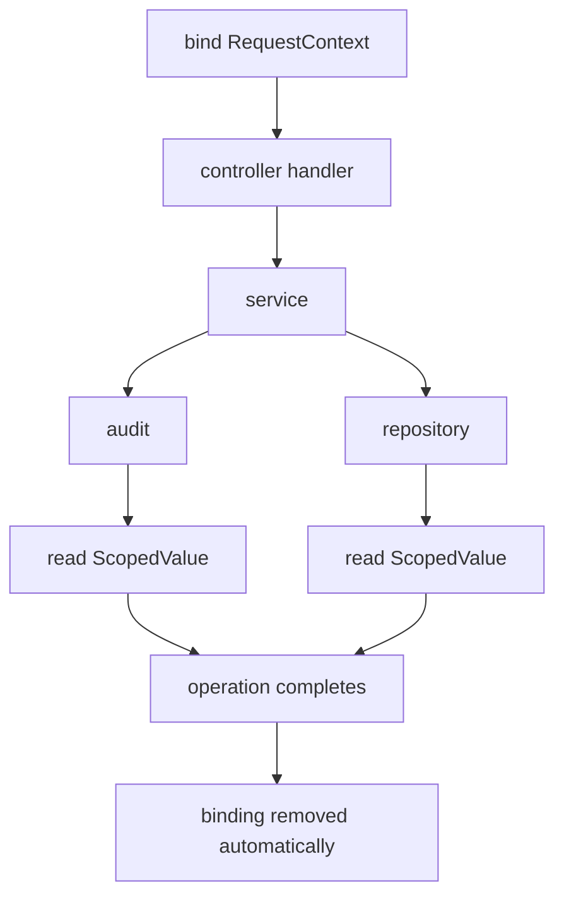
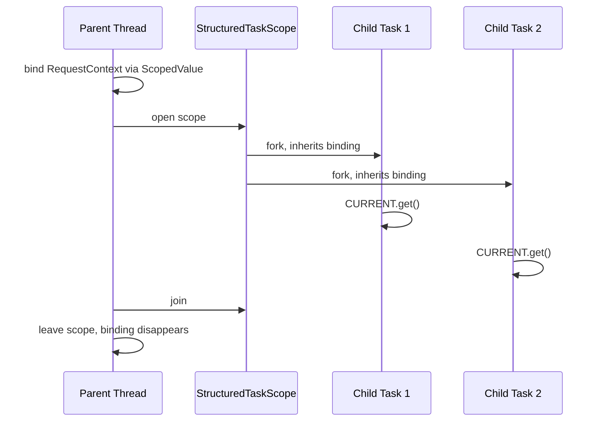

------
title: Learn Java Concurrency & Correctness - Part 027
description: ScopedValue, bounded context propagation, structured concurrency inheritance, and the modern mental model for request context in Java 25.
series: learn-java-concurrency-correctness
seriesTitle: Learn Java Concurrency & Correctness
order: 27
partTitle: Scoped Values and Context Propagation
tags:
- java
- concurrency
- correctness
- scoped-value
- context-propagation
- virtual-threads
- structured-concurrency
- series
date: 2026-06-28
---

# Part 027 — Scoped Values and Context Propagation

> Target utama part ini: mampu mendesain **context propagation** yang aman, bounded, murah, dan mudah diaudit di Java modern, terutama ketika sistem memakai virtual threads dan structured concurrency.

Kita sudah membahas thread, memory model, locking, executor, async composition, virtual threads, dan structured concurrency. Sekarang kita masuk ke masalah yang sangat production-grade: **bagaimana data request/context mengalir melintasi layer tanpa membuat signature method penuh noise dan tanpa membuat global mutable state tersembunyi**.

Di codebase besar, concurrency bug sering tidak muncul dari `AtomicInteger` atau `synchronized` yang salah. Banyak bug muncul dari context yang salah:

- request A memakai user/security context request B;
- trace ID hilang di task async;
- deadline tidak terbawa ke child task;
- MDC log tercampur antar request;
- `ThreadLocal` tidak dibersihkan di thread pool;
- context diwariskan terlalu luas ke child thread;
- context di reactive pipeline berbeda dari context di thread blocking;
- context dianggap “local”, padahal lifetime-nya tidak jelas.

`ScopedValue` di Java 25 adalah jawaban modern untuk sebagian besar kasus **one-way immutable context transmission**.

---

## 1. Kaufman Skill Slice

Dalam kerangka Josh Kaufman, kita pecah skill ini menjadi unit yang dapat dilatih cepat:

| Sub-skill | Yang harus dikuasai | Failure jika tidak dikuasai |
|---|---|---|
| Context taxonomy | Bedakan business input, ambient metadata, operational context, mutable state | Semua hal dimasukkan ke context global |
| Lifetime reasoning | Tahu kapan context mulai, siapa boleh membaca, kapan berakhir | Leakage antar request/task |
| Propagation boundary | Tahu kapan context melewati method call, child task, executor, reactive boundary | Trace/security/deadline hilang |
| Capability design | Batasi siapa yang bisa membaca context | Callee jauh bisa membaca/memodifikasi state sembarangan |
| Immutable context | Context dianggap snapshot, bukan mutable bag | Race condition via object yang “kelihatannya local” |
| Structured propagation | Gabungkan `ScopedValue` dengan structured concurrency | Child task tidak punya context atau context hidup lebih lama dari parent |
| Migration judgment | Tahu kapan pindah dari `ThreadLocal`, kapan tidak | Migrasi buta, broken framework integration |

Latihan 20 jam untuk topik ini bukan menghafal API. Latihannya adalah membaca flow request dan menjawab:

> “Data ini harus eksplisit sebagai parameter, bounded sebagai scoped context, local sebagai variable biasa, atau external sebagai state durable?”

---

## 2. Problem yang Sebenarnya: Context Bukan Data Biasa

Context adalah data yang diperlukan oleh beberapa layer, tetapi sering tidak menjadi input bisnis utama method tersebut.

Contoh:

```java
public Invoice approve(InvoiceId id) {
    var invoice = invoiceRepository.findById(id);
    policy.assertCanApprove(invoice);       // butuh current actor
    audit.record("invoice.approved", id);   // butuh actor, traceId, requestId
    notifier.send(invoice);                 // butuh tenant/locale/correlation
    return invoice.approve();
}
```

Signature `approve(InvoiceId id)` tidak menunjukkan `actor`, `traceId`, `tenantId`, `deadline`, atau `locale`. Ada beberapa pilihan:

1. Tambahkan semua sebagai parameter.
2. Bungkus ke `RequestContext` dan teruskan sebagai parameter.
3. Simpan di `ThreadLocal`.
4. Simpan di global singleton.
5. Simpan di `ScopedValue`.
6. Untuk reactive pipeline, gunakan context native dari library.
7. Untuk data bisnis penting, jangan jadikan ambient context sama sekali.

Tidak ada satu pilihan yang selalu benar.

---

## 3. Taxonomy Context

Sebelum memilih mekanisme, klasifikasikan data.

| Jenis data | Contoh | Cara lewat yang ideal |
|---|---|---|
| Business input | `invoiceId`, `amount`, `approvalDecision` | Parameter eksplisit |
| Business invariant | status invoice, limit approval, case state | Domain object / aggregate |
| Security identity | actor id, roles snapshot | Parameter eksplisit untuk boundary penting; `ScopedValue` untuk ambient read |
| Tenant/request metadata | tenant id, request id, trace id | `ScopedValue` atau framework context |
| Observability metadata | correlation id, span id, MDC fields | `ScopedValue` + bridge ke MDC / tracer |
| Deadline/cancellation | deadline timestamp, remaining budget | Parameter or context; harus eksplisit di IO boundary |
| Locale/timezone | locale, timezone | Context immutable, atau parameter pada formatting boundary |
| Transaction handle | JDBC connection, ORM session | Biasanya framework-managed; jangan sembarang `ScopedValue` tanpa lifecycle ketat |
| Mutable accumulator | list event, mutable counter | Jangan `ScopedValue`; gunakan return value, collector, channel, atau synchronized owner |
| Authorization decision | “allowed to approve” | Jangan hanya context; hasil policy eksplisit atau enforced di boundary |

Rule sederhana:

> Context boleh ambient hanya jika ia adalah **metadata pendukung**, bukan sumber utama kebenaran bisnis.

---

## 4. Kenapa Parameter Saja Tidak Selalu Cukup

Parameter eksplisit adalah default terbaik untuk data yang penting terhadap business behavior. Tetapi parameter juga punya biaya.

Bayangkan chain ini:

```java
controller -> service -> domain service -> repository -> audit -> tracing -> metrics
```

Jika semua layer harus menambahkan parameter `RequestContext ctx`, akan muncul beberapa masalah:

- method yang tidak membutuhkan context tetap harus meneruskan context;
- framework callback sulit diubah signaturenya;
- public API menjadi noisy;
- callee bisa menyimpan context jauh di luar lifetime request;
- context sering berubah menjadi “bag of everything”.

Parameter eksplisit cocok untuk **intentional dependency**. `ScopedValue` cocok untuk **ambient immutable metadata** yang harus tersedia di callee tertentu tanpa mencemari semua intermediate method.

---

## 5. Mental Model `ScopedValue`

`ScopedValue<T>` adalah semacam **implicit method parameter** dengan lifetime yang dibatasi oleh dynamic scope.

Bentuk pikirannya:

```text
bind context
  run operation
    call method A
      call method B
        B reads context
  binding automatically disappears
```

Dalam Java:

```java
import java.lang.ScopedValue;

public final class RequestContextHolder {
    private static final ScopedValue<RequestContext> CURRENT = ScopedValue.newInstance();

    public static void runWith(RequestContext context, Runnable operation) {
        ScopedValue.where(CURRENT, context).run(operation);
    }

    public static RequestContext current() {
        return CURRENT.orElseThrow(() -> new IllegalStateException("No request context bound"));
    }
}
```

Pemakaian:

```java
var context = new RequestContext(
    new RequestId("req-123"),
    new TenantId("tenant-a"),
    new ActorId("user-42"),
    Deadline.after(Duration.ofSeconds(2))
);

RequestContextHolder.runWith(context, () -> {
    invoiceService.approve(new InvoiceId("inv-100"));
});
```

Callee jauh bisa membaca:

```java
public final class AuditService {
    public void record(String eventType, Object target) {
        RequestContext ctx = RequestContextHolder.current();
        auditSink.append(new AuditEvent(
            ctx.requestId(),
            ctx.tenantId(),
            ctx.actorId(),
            eventType,
            target
        ));
    }
}
```

Yang penting: callee tidak bisa melakukan `CURRENT.set(...)`. Tidak ada `set`. Ia hanya bisa membaca binding yang valid dalam scope.

---

## 6. Dynamic Scope vs Lexical Code Shape

`ScopedValue` bekerja berdasarkan dynamic scope: method apa pun yang dipanggil langsung/tidak langsung selama operation berjalan dapat membaca binding, selama ia punya akses ke key `ScopedValue`.



Ini berbeda dari global variable:

- binding hanya berlaku saat operation berjalan;
- binding per-thread;
- binding bisa diwariskan ke child tasks yang dibuat secara structured;
- binding otomatis berakhir saat `run`/`call` selesai normal atau exceptional;
- access ke value dikontrol oleh access ke object `ScopedValue`.

---

## 7. RequestContext Harus Immutable

`ScopedValue` membatasi rebinding, bukan membuat object di dalamnya otomatis thread-safe. Jika value yang dibawa mutable, kamu masih bisa membuat race condition.

Buruk:

```java
public final class MutableRequestContext {
    public String requestId;
    public Map<String, Object> attributes = new HashMap<>();
}
```

Lebih baik:

```java
public record RequestContext(
    RequestId requestId,
    TenantId tenantId,
    ActorId actorId,
    TraceContext trace,
    Deadline deadline,
    Locale locale
) {}
```

Jika perlu membawa banyak metadata, ikat **satu record context**, bukan banyak scoped values.

Buruk:

```java
private static final ScopedValue<RequestId> REQUEST_ID = ScopedValue.newInstance();
private static final ScopedValue<TenantId> TENANT_ID = ScopedValue.newInstance();
private static final ScopedValue<ActorId> ACTOR_ID = ScopedValue.newInstance();
private static final ScopedValue<Deadline> DEADLINE = ScopedValue.newInstance();
private static final ScopedValue<Locale> LOCALE = ScopedValue.newInstance();
```

Lebih baik:

```java
private static final ScopedValue<RequestContext> CURRENT = ScopedValue.newInstance();
```

Alasannya bukan hanya estetika. `ScopedValue` didesain untuk jumlah key yang relatif kecil. Banyak scoped values aktif secara siklik bisa menurunkan locality/cache hit.

---

## 8. Capability Pattern: Jangan Bocorkan Key

`ScopedValue` object adalah capability. Siapa pun yang memiliki reference ke key dapat membaca binding ketika bound.

Buruk:

```java
public final class ContextKeys {
    public static final ScopedValue<RequestContext> CURRENT = ScopedValue.newInstance();
}
```

Dengan desain ini, seluruh codebase dapat membaca context. Itu hampir sama seperti global variable read-only.

Lebih baik:

```java
public final class RequestContexts {
    private static final ScopedValue<RequestContext> CURRENT = ScopedValue.newInstance();

    private RequestContexts() {}

    public static void runWith(RequestContext context, Runnable operation) {
        ScopedValue.where(CURRENT, context).run(operation);
    }

    public static RequestContext currentRequired() {
        return CURRENT.orElseThrow(() -> new IllegalStateException("RequestContext is not bound"));
    }

    public static Optional<RequestContext> currentOptional() {
        return CURRENT.isBound() ? Optional.of(CURRENT.get()) : Optional.empty();
    }
}
```

Key tetap private. API publik hanya operasi yang kamu izinkan.

---

## 9. Bounded Lifetime: Properti Paling Penting

Bandingkan dengan `ThreadLocal`:

```java
CONTEXT.set(ctx);
try {
    handle();
} finally {
    CONTEXT.remove();
}
```

Dengan `ScopedValue`:

```java
ScopedValue.where(CURRENT, ctx).run(() -> handle());
```

Di `ThreadLocal`, cleanup adalah protocol manual. Di `ScopedValue`, cleanup bagian dari struktur eksekusi.

Jika `handle()` throw exception, binding tetap hilang setelah `run` keluar.

```java
try {
    ScopedValue.where(CURRENT, ctx).run(() -> {
        throw new RuntimeException("boom");
    });
} catch (RuntimeException ignored) {
}

assert !CURRENT.isBound();
```

Mental model production:

> Context yang masuk lewat `ScopedValue` tidak boleh hidup lebih panjang dari operation yang membutuhkannya.

---

## 10. Rebinding: Shadowing yang Terkontrol

`ScopedValue` tidak punya `set`, tetapi mengizinkan nested binding.

```java
private static final ScopedValue<String> NAME = ScopedValue.newInstance();

ScopedValue.where(NAME, "outer").run(() -> {
    System.out.println(NAME.get()); // outer

    ScopedValue.where(NAME, "inner").run(() -> {
        System.out.println(NAME.get()); // inner
    });

    System.out.println(NAME.get()); // outer
});
```

Gunakan rebinding untuk scope yang memang lebih sempit:

- temporary impersonation untuk internal system call;
- child operation dengan deadline lebih pendek;
- override locale pada rendering segment;
- subtrace/subspan boundary jika tracing library membutuhkan representasi tertentu.

Jangan gunakan rebinding sebagai “mutation with extra steps”.

Buruk:

```java
public void process() {
    ScopedValue.where(CURRENT, current().withRole("admin")).run(() -> {
        // banyak operasi tidak jelas mengapa role berubah
    });
}
```

Lebih baik:

```java
public void runAsSystem(String reason, Runnable operation) {
    RequestContext parent = current();
    RequestContext system = parent.asSystemActor(reason);

    ScopedValue.where(CURRENT, system).run(operation);
}
```

Beri nama pada rebinding agar alasan boundary jelas.

---

## 11. `run` vs `call`

Gunakan `run` untuk operasi tanpa return value.

```java
ScopedValue.where(CURRENT, ctx).run(() -> service.handle(command));
```

Gunakan `call` jika operasi menghasilkan value atau checked exception.

```java
Invoice invoice = ScopedValue.where(CURRENT, ctx).call(() -> {
    return invoiceService.approve(command);
});
```

Wrapper berguna:

```java
public static <T, X extends Throwable> T callWith(
        RequestContext context,
        ScopedValue.CallableOp<T, X> operation
) throws X {
    return ScopedValue.where(CURRENT, context).call(operation);
}
```

Dengan wrapper, call-site tetap bersih:

```java
Invoice result = RequestContexts.callWith(ctx, () -> invoiceService.approve(command));
```

---

## 12. Propagation ke Structured Child Tasks

Salah satu alasan `ScopedValue` penting di era Java 25 adalah integrasinya dengan structured concurrency.

Ketika child tasks dibuat dengan `StructuredTaskScope`, scoped value binding dari parent dapat diwariskan ke child tasks dalam scope itu.

```java
private static final ScopedValue<RequestContext> CURRENT = ScopedValue.newInstance();

public Report buildReport(RequestContext ctx, ReportId id) throws Exception {
    return ScopedValue.where(CURRENT, ctx).call(() -> {
        try (var scope = StructuredTaskScope.open()) { // preview API in JDK 25
            var invoice = scope.fork(() -> invoiceClient.fetch(id));
            var cases = scope.fork(() -> caseClient.fetchRelated(id));
            var risk = scope.fork(() -> riskClient.score(id));

            scope.join();

            return new Report(
                invoice.get(),
                cases.get(),
                risk.get(),
                CURRENT.get().requestId()
            );
        }
    });
}
```

Child task dapat membaca `CURRENT.get()` karena task dibuat di structured scope di bawah binding parent.



Catatan penting: structured concurrency di JDK 25 masih preview, sehingga contoh ini bergantung pada compiler/runtime flag preview.

---

## 13. Propagation Tidak Otomatis ke Semua Executor

`ScopedValue` bukan magic global context yang otomatis meloncat ke semua thread pool.

Contoh:

```java
ScopedValue.where(CURRENT, ctx).run(() -> {
    executor.submit(() -> {
        // Jangan asumsikan CURRENT bound di sini.
        audit.record("async-work");
    });
});
```

Task yang dikirim ke executor biasa tidak otomatis punya binding parent. Ini bagus dari sisi correctness: context tidak diam-diam hidup lebih lama dari scope.

Jika kamu benar-benar perlu mengirim context ke executor unstructured, capture immutable context secara eksplisit:

```java
public static Runnable contextAware(Runnable task) {
    RequestContext captured = currentRequired();
    return () -> ScopedValue.where(CURRENT, captured).run(task);
}
```

Pemakaian:

```java
ScopedValue.where(CURRENT, ctx).run(() -> {
    executor.submit(RequestContexts.contextAware(() -> audit.record("async-work")));
});
```

Namun ini harus dipakai hati-hati. Begitu task keluar dari lexical scope, kamu telah membuat propagation manual. Pastikan context memang aman hidup sampai task selesai.

Preferensi production:

1. Gunakan structured concurrency jika parent perlu menunggu child.
2. Gunakan explicit message jika work asynchronous jangka panjang.
3. Gunakan context capture wrapper hanya untuk short-lived executor boundary yang terkontrol.

---

## 14. Context Boundary untuk Fire-and-Forget

Fire-and-forget adalah red flag untuk context propagation.

Buruk:

```java
public void handle(Command command) {
    executor.submit(RequestContexts.contextAware(() -> sendEmail(command)));
    return;
}
```

Pertanyaan yang harus dijawab:

- Jika request dibatalkan, apakah email tetap dikirim?
- Jika deadline habis, apakah task harus stop?
- Jika actor logout, apakah context actor masih valid?
- Jika tenant config berubah, apakah task harus memakai snapshot lama atau terbaru?
- Jika task gagal setelah response dikirim, siapa menangani retry?

Untuk asynchronous durable work, jangan propagasi request context penuh. Buat command/event eksplisit.

```java
public record SendEmailJob(
    TenantId tenantId,
    UserId requestedBy,
    CorrelationId correlationId,
    EmailTemplate template,
    Map<String, String> parameters
) {}
```

Context request menjadi input job yang jelas, bukan ambient scope tersembunyi.

---

## 15. Deadline dan Cancellation Context

Deadline sering dianggap metadata, tetapi mempengaruhi behavior IO. Maka desainnya harus eksplisit di boundary penting.

```java
public record Deadline(Instant at) {
    public Duration remaining(Clock clock) {
        return Duration.between(clock.instant(), at);
    }

    public boolean expired(Clock clock) {
        return !remaining(clock).isPositive();
    }

    public static Deadline after(Duration duration, Clock clock) {
        return new Deadline(clock.instant().plus(duration));
    }
}
```

Context:

```java
public record RequestContext(
    RequestId requestId,
    TenantId tenantId,
    ActorId actorId,
    TraceContext trace,
    Deadline deadline
) {}
```

Repository/client harus mengubah deadline menjadi timeout eksplisit:

```java
public Customer fetch(CustomerId id) {
    RequestContext ctx = RequestContexts.currentRequired();
    Duration timeout = ctx.deadline().remaining(clock);

    if (!timeout.isPositive()) {
        throw new DeadlineExceededException(ctx.requestId());
    }

    return httpClient.get("/customers/" + id.value(), timeout);
}
```

Jangan berharap `ScopedValue` membatalkan pekerjaan secara otomatis. Ia hanya membawa informasi. Cancellation tetap harus menjadi protocol.

---

## 16. Security Context: Jangan Tersembunyi Sepenuhnya

Security context boleh tersedia ambient untuk logging/audit/policy helper. Namun authorization boundary tetap harus jelas.

Buruk:

```java
public void approve(Invoice invoice) {
    if (RequestContexts.currentRequired().actorId().equals(invoice.owner())) {
        invoice.approve();
    }
}
```

Masalahnya: domain operation diam-diam tergantung ambient actor.

Lebih baik:

```java
public void approve(InvoiceId id) {
    Actor actor = actorResolver.currentActor();
    Invoice invoice = invoiceRepository.get(id);

    approvalPolicy.assertCanApprove(actor, invoice);
    invoice.approveBy(actor.id());
    audit.record("invoice.approved", invoice.id());
}
```

`ScopedValue` dapat membantu `actorResolver.currentActor()` dan `audit.record(...)`, tetapi policy decision tetap terlihat sebagai dependency service/application layer.

Rule:

> Ambient security context boleh membantu akses metadata, tetapi jangan menyembunyikan authorization invariant utama.

---

## 17. Tenant Context: Wajib Defensif

Multi-tenant system adalah area berisiko tinggi. Tenant context yang salah bisa menjadi data breach.

Prinsip:

1. Tenant ID di context harus immutable.
2. Repository boundary harus memverifikasi tenant constraint eksplisit.
3. Jangan hanya mengandalkan context implicit untuk query isolation.
4. Audit harus mencatat tenant dari request context dan tenant pada entity jika relevan.

Contoh:

```java
public Invoice getInvoice(InvoiceId id) {
    TenantId tenantId = RequestContexts.currentRequired().tenantId();

    return jdbc.queryOne("""
        select *
        from invoices
        where tenant_id = ? and invoice_id = ?
        """, tenantId.value(), id.value());
}
```

Namun untuk domain object yang sudah dimuat, tetap validasi:

```java
public void assertTenantMatches(Invoice invoice) {
    TenantId current = RequestContexts.currentRequired().tenantId();
    if (!invoice.tenantId().equals(current)) {
        throw new CrossTenantAccessException(current, invoice.tenantId());
    }
}
```

Context membantu, bukan menggantikan access control.

---

## 18. Observability: Bridge ke Log/Tracing

Banyak logging framework memakai MDC yang berbasis `ThreadLocal`. Kamu dapat memakai `ScopedValue` sebagai source-of-truth request context, lalu bridge ke MDC di boundary.

Pseudocode:

```java
public static void runWithLogging(RequestContext ctx, Runnable operation) {
    ScopedValue.where(CURRENT, ctx).run(() -> {
        try (var ignored = LoggingContext.open(ctx)) {
            operation.run();
        }
    });
}
```

`LoggingContext.open(ctx)` bertanggung jawab memasang MDC dan membersihkannya.

```java
public final class LoggingContext implements AutoCloseable {
    private LoggingContext() {}

    public static LoggingContext open(RequestContext ctx) {
        Mdc.put("requestId", ctx.requestId().value());
        Mdc.put("tenantId", ctx.tenantId().value());
        Mdc.put("actorId", ctx.actorId().value());
        return new LoggingContext();
    }

    @Override
    public void close() {
        Mdc.remove("actorId");
        Mdc.remove("tenantId");
        Mdc.remove("requestId");
    }
}
```

Di part berikutnya kita bahas detail risiko MDC/ThreadLocal. Untuk sekarang, mental modelnya:

> `ScopedValue` adalah source-of-truth scoped context; MDC adalah adapter ke logging system legacy.

---

## 19. Reactive Boundary

Reactive libraries seperti Reactor/RxJava biasanya punya context model sendiri. Jangan berasumsi `ScopedValue` otomatis mengalir sepanjang reactive pipeline, karena pipeline bisa berpindah thread dan memiliki execution model berbeda.

Contoh risiko:

```java
ScopedValue.where(CURRENT, ctx).run(() -> {
    Mono.defer(() -> Mono.just(RequestContexts.currentRequired().requestId()))
        .publishOn(Schedulers.parallel())
        .subscribe();
});
```

Ketika operasi dieksekusi nanti di scheduler lain, binding `ScopedValue` mungkin sudah tidak aktif.

Strategi:

1. Di boundary blocking/imperative: gunakan `ScopedValue`.
2. Di boundary reactive: konversi ke context native reactive library.
3. Saat kembali ke imperative code, re-bind context secara eksplisit.

Pola bridge konseptual:

```java
public Mono<Response> handleReactive(Request request) {
    RequestContext ctx = buildContext(request);

    return service.handle(request)
        .contextWrite(reactiveContext -> reactiveContext.put(RequestContext.class, ctx));
}
```

Lalu di boundary yang memanggil blocking code:

```java
Mono.deferContextual(contextView -> {
    RequestContext ctx = contextView.get(RequestContext.class);
    return Mono.fromCallable(() -> RequestContexts.callWith(ctx, () -> blockingService.call()));
});
```

Kita akan bahas reactive lebih dalam di Part 029–031.

---

## 20. Design Pattern: Request Context Holder yang Terkontrol

Template minimal:

```java
public final class RequestContexts {
    private static final ScopedValue<RequestContext> CURRENT = ScopedValue.newInstance();

    private RequestContexts() {}

    public static void runWith(RequestContext context, Runnable operation) {
        Objects.requireNonNull(context, "context");
        Objects.requireNonNull(operation, "operation");
        ScopedValue.where(CURRENT, context).run(operation);
    }

    public static <T, X extends Throwable> T callWith(
            RequestContext context,
            ScopedValue.CallableOp<T, X> operation
    ) throws X {
        Objects.requireNonNull(context, "context");
        Objects.requireNonNull(operation, "operation");
        return ScopedValue.where(CURRENT, context).call(operation);
    }

    public static RequestContext currentRequired() {
        return CURRENT.orElseThrow(() -> new IllegalStateException("RequestContext is not bound"));
    }

    public static Optional<RequestContext> currentOptional() {
        return CURRENT.isBound() ? Optional.of(CURRENT.get()) : Optional.empty();
    }

    public static Runnable wrapCurrent(Runnable operation) {
        RequestContext captured = currentRequired();
        return () -> runWith(captured, operation);
    }
}
```

Catatan desain:

- `CURRENT` private;
- context immutable;
- ada API `currentRequired()` untuk boundary yang wajib punya context;
- ada API `currentOptional()` untuk library/helper yang bisa berjalan tanpa context;
- `wrapCurrent()` digunakan hemat, hanya saat crossing executor boundary yang disengaja.

---

## 21. Anti-Pattern: Context sebagai Service Locator

Buruk:

```java
public record RequestContext(
    User user,
    Tenant tenant,
    Connection connection,
    EntityManager entityManager,
    FeatureFlagService flags,
    ObjectMapper mapper,
    MetricsRegistry metrics
) {}
```

Ini bukan context. Ini service locator yang disamarkan.

Risikonya:

- lifecycle resource tidak jelas;
- test sulit;
- hidden coupling;
- callee jauh bisa melakukan IO tanpa terlihat;
- resource seperti connection bisa dipakai oleh child task secara tidak aman;
- object mutable masuk ke banyak thread.

Context idealnya kecil:

```java
public record RequestContext(
    RequestId requestId,
    TenantId tenantId,
    ActorId actorId,
    TraceContext trace,
    Deadline deadline,
    Locale locale
) {}
```

Jika suatu layer membutuhkan `FeatureFlagService`, inject service tersebut. Jika membutuhkan `Connection`, kelola lifecycle di transaction boundary, bukan ambient context umum.

---

## 22. Anti-Pattern: Mutable Context Bag

Buruk:

```java
public final class RequestContext {
    private final Map<String, Object> attributes = new ConcurrentHashMap<>();

    public void put(String key, Object value) {
        attributes.put(key, value);
    }

    public Object get(String key) {
        return attributes.get(key);
    }
}
```

Ini menghapus hampir semua benefit `ScopedValue`:

- context bisa berubah di callee jauh;
- tipe tidak jelas;
- ownership value tidak jelas;
- race condition tetap mungkin;
- invariant tidak bisa diaudit.

Gunakan typed record. Jika perlu extension, batasi secara eksplisit:

```java
public record RequestContext(
    RequestId requestId,
    TenantId tenantId,
    ActorId actorId,
    TraceContext trace,
    Deadline deadline,
    Map<ContextKey<?>, Object> extensions
) {
    public <T> Optional<T> extension(ContextKey<T> key) {
        return Optional.ofNullable(key.type().cast(extensions.get(key)));
    }
}
```

Namun extension map sebaiknya jarang dipakai. Ia harus immutable copy.

---

## 23. Anti-Pattern: Menangkap Context Besar ke Task Lama

Buruk:

```java
executor.submit(RequestContexts.wrapCurrent(() -> {
    monthlyReportService.generateLargeReport();
}));
```

Jika task berjalan 30 menit, request context 2 detik sudah tidak bermakna. Lebih parah, context mungkin membawa actor/security state yang tidak lagi valid.

Lebih baik:

```java
public record GenerateReportCommand(
    TenantId tenantId,
    ActorId requestedBy,
    ReportType reportType,
    CorrelationId correlationId
) {}
```

Asynchronous long-running work harus punya command/event eksplisit.

---

## 24. Context Propagation Decision Matrix

| Situasi | Gunakan |
|---|---|
| Data bisnis inti method | Parameter eksplisit |
| Metadata request immutable lintas layer imperative | `ScopedValue` |
| Child subtasks yang parent tunggu | `ScopedValue` + `StructuredTaskScope` |
| Task executor pendek tapi unstructured | Capture immutable context eksplisit, hati-hati |
| Fire-and-forget durable work | Command/event eksplisit |
| Reactive pipeline | Context native reactive library |
| Logging MDC | Adapter dari scoped/request context ke MDC |
| Transaction/session resource | Framework transaction boundary; jangan context umum |
| Mutable accumulator | Return value, collector, channel, atau synchronized owner |
| Global config read-only | Config service/immutable config object, bukan request context |

---

## 25. Testing Scoped Context

Test basic binding:

```java
@Test
void contextIsAvailableInsideScope() {
    RequestContext ctx = testContext("req-1");

    RequestContexts.runWith(ctx, () -> {
        assertEquals(new RequestId("req-1"), RequestContexts.currentRequired().requestId());
    });
}
```

Test cleanup:

```java
@Test
void contextIsNotAvailableAfterScope() {
    RequestContexts.runWith(testContext("req-1"), () -> {
        assertTrue(RequestContexts.currentOptional().isPresent());
    });

    assertTrue(RequestContexts.currentOptional().isEmpty());
}
```

Test exception cleanup:

```java
@Test
void contextIsCleanedAfterException() {
    assertThrows(RuntimeException.class, () -> {
        RequestContexts.runWith(testContext("req-1"), () -> {
            throw new RuntimeException("boom");
        });
    });

    assertTrue(RequestContexts.currentOptional().isEmpty());
}
```

Test nested rebinding:

```java
@Test
void nestedBindingRestoresOuterBinding() {
    RequestContext outer = testContext("outer");
    RequestContext inner = testContext("inner");

    RequestContexts.runWith(outer, () -> {
        assertEquals("outer", RequestContexts.currentRequired().requestId().value());

        RequestContexts.runWith(inner, () -> {
            assertEquals("inner", RequestContexts.currentRequired().requestId().value());
        });

        assertEquals("outer", RequestContexts.currentRequired().requestId().value());
    });
}
```

---

## 26. Production Review Checklist

Gunakan checklist ini saat code review:

### Context Content

- Apakah context immutable?
- Apakah context kecil dan typed?
- Apakah tidak membawa connection/session/service/object mutable besar?
- Apakah security/tenant data cukup defensif?
- Apakah deadline merepresentasikan absolute deadline, bukan timeout relatif yang makin usang?

### API Boundary

- Apakah `ScopedValue` key private?
- Apakah wrapper API jelas: `runWith`, `callWith`, `currentRequired`, `currentOptional`?
- Apakah callee yang membaca context memang pantas membaca context?
- Apakah data bisnis inti tetap explicit parameter?

### Lifetime

- Apakah binding dibuat di boundary request/job yang jelas?
- Apakah tidak ada context capture untuk task long-running?
- Apakah executor propagation manual benar-benar diperlukan?
- Apakah structured concurrency dipilih ketika parent harus menunggu child?

### Failure

- Apakah exception tetap cleanup otomatis?
- Apakah deadline/cancellation dipakai di IO boundary?
- Apakah missing context fail fast di tempat yang benar?
- Apakah observability context tetap tersedia di log/error path?

### Migration

- Apakah `ThreadLocal` lama memang one-way immutable context?
- Apakah ada callee yang mengubah context via `set`?
- Apakah framework masih membutuhkan `ThreadLocal` adapter?
- Apakah reactive boundary punya bridge eksplisit?

---

## 27. Mental Model Final

`ScopedValue` bukan “ThreadLocal versi baru” secara sempit. Ia adalah cara untuk membuat **ambient context yang bounded, immutable, one-way, dan structurally visible**.

Pikirkan seperti ini:

```text
Parameter eksplisit  -> data penting untuk method ini
ScopedValue          -> metadata immutable untuk call tree ini
ThreadLocal          -> legacy/adaptasi per-thread mutable/local state
Reactive Context     -> metadata untuk reactive execution graph
Command/Event        -> data durable untuk async work jangka panjang
```

Jika kamu salah memilih mekanisme, bug-nya sering mahal: cross-tenant access, audit salah, log tidak bisa dikorelasi, task jalan tanpa deadline, atau memory leak.

`ScopedValue` membantu karena ia mengunci tiga hal sekaligus:

1. **Siapa yang bisa membaca**: hanya code yang punya key/capability.
2. **Kapan bisa membaca**: hanya selama dynamic scope aktif.
3. **Apa yang dibaca**: idealnya immutable snapshot.

---

## 28. Deliberate Practice

Latihan berikut membantu membentuk intuisi:

1. Ambil service request handler nyata.
2. Tandai semua data yang melewati 5+ layer.
3. Klasifikasikan: business input, ambient metadata, resource, mutable state, durable command.
4. Ubah ambient metadata menjadi immutable `RequestContext`.
5. Buat holder berbasis `ScopedValue` dengan key private.
6. Tambahkan test cleanup normal, cleanup exception, nested rebinding.
7. Tambahkan structured child task dan pastikan context terbaca.
8. Tambahkan executor unstructured dan buktikan context tidak otomatis terbawa.
9. Tulis policy kapan boleh memakai wrapper propagation manual.
10. Review apakah ada hidden authorization decision yang seharusnya explicit.

---

## 29. References

- OpenJDK JEP 506 — Scoped Values: https://openjdk.org/jeps/506
- Java SE 25 `ScopedValue` API: https://docs.oracle.com/en/java/javase/25/docs/api/java.base/java/lang/ScopedValue.html
- Java SE 25 Scoped Values guide: https://docs.oracle.com/en/java/javase/25/core/scoped-values.html
- Java SE 25 `ThreadLocal` API: https://docs.oracle.com/en/java/javase/25/docs/api/java.base/java/lang/ThreadLocal.html
- Java SE 25 `InheritableThreadLocal` API: https://docs.oracle.com/en/java/javase/25/docs/api/java.base/java/lang/InheritableThreadLocal.html

---

## 30. Key Takeaways

- `ScopedValue` cocok untuk one-way immutable context transmission.
- Context bukan tempat menyimpan semua dependency.
- `ScopedValue` key sebaiknya private dan dipakai sebagai capability.
- Binding punya bounded lifetime dan otomatis hilang setelah scope selesai.
- `ScopedValue` tidak otomatis melompat ke executor biasa.
- Structured concurrency adalah partner natural `ScopedValue` untuk child tasks.
- Reactive pipeline punya model context sendiri; bridge harus eksplisit.
- Security/tenant context tetap perlu enforcement eksplisit di boundary kritis.
