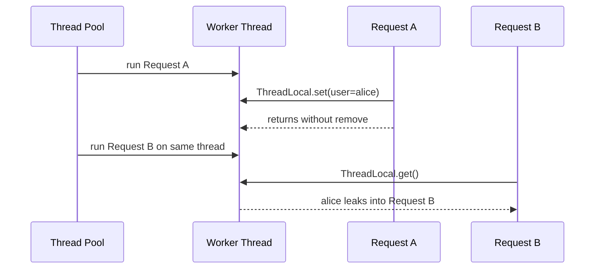
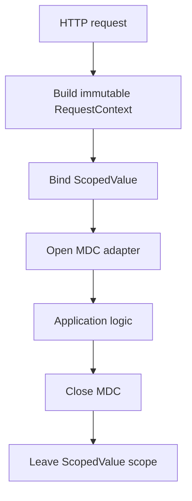

------
title: Learn Java Concurrency & Correctness - Part 028
description: ThreadLocal, InheritableThreadLocal, MDC, context leakage, async boundary loss, virtual-thread impact, and safe migration toward ScopedValue.
series: learn-java-concurrency-correctness
seriesTitle: Learn Java Concurrency & Correctness
order: 28
partTitle: ThreadLocal Context and Leakage
tags:
- java
- concurrency
- correctness
- threadlocal
- context-propagation
- mdc
- virtual-threads
- series
date: 2026-06-28
---

# Part 028 — ThreadLocal Context and Leakage

> Target utama part ini: mampu memakai, membatasi, mengaudit, dan memigrasikan `ThreadLocal` tanpa menciptakan context leakage, memory retention, security contamination, atau observability gap.

Di part sebelumnya kita membahas `ScopedValue` sebagai model modern untuk **bounded immutable context**. Sekarang kita bedah `ThreadLocal`, karena di sistem Java nyata kamu tetap akan bertemu dengannya:

- logging MDC;
- security context framework;
- transaction/session binding;
- request context lama;
- per-thread caches;
- date/number formatter legacy;
- tracing library lama;
- ORM/persistence context;
- framework web yang lahir sebelum virtual threads.

`ThreadLocal` bukan API buruk. Ia powerful. Masalahnya: ia terlalu powerful untuk banyak kebutuhan context propagation modern.

---

## 1. Mental Model `ThreadLocal`

`ThreadLocal<T>` memberi setiap thread copy value sendiri untuk key tertentu.

```java
private static final ThreadLocal<String> CURRENT_USER = new ThreadLocal<>();

public void handle(Request request) {
    CURRENT_USER.set(request.userId());
    try {
        service.process(request);
    } finally {
        CURRENT_USER.remove();
    }
}

public void audit(String event) {
    String user = CURRENT_USER.get();
    auditSink.write(user, event);
}
```

Modelnya:

```text
Thread T1 -> CURRENT_USER = alice
Thread T2 -> CURRENT_USER = bob
Thread T3 -> CURRENT_USER = null
```

Setiap thread melihat value sendiri. Itu membantu ketika satu object static harus menyimpan state yang berbeda per thread.

Namun perhatikan: lifetime value melekat pada **thread**, bukan pada **request**, **task**, atau **scope lexical**.

Itulah akar banyak bug.

---

## 2. Kenapa `ThreadLocal` Berbahaya di Thread Pool

Thread pool mendaur ulang thread.



Bug paling sederhana:

```java
private static final ThreadLocal<ActorId> ACTOR = new ThreadLocal<>();

public void handle(Request request) {
    ACTOR.set(request.actorId());
    service.process(request);
    // BUG: forgot remove
}
```

Pada request berikutnya di worker yang sama:

```java
public void audit(String event) {
    ActorId actor = ACTOR.get(); // actor dari request sebelumnya mungkin masih ada
    audit.write(actor, event);
}
```

Ini bukan hanya memory leak. Ini bisa menjadi **security/data-integrity incident**.

---

## 3. Correct Protocol: `set` + `try/finally remove`

Jika kamu harus memakai `ThreadLocal`, default protocol-nya:

```java
ACTOR.set(actor);
try {
    operation.run();
} finally {
    ACTOR.remove();
}
```

Jangan pernah:

```java
ACTOR.set(actor);
operation.run();
ACTOR.remove(); // tidak dieksekusi jika operation throw
```

Bungkus agar tidak diulang manual:

```java
public final class ActorContext {
    private static final ThreadLocal<ActorId> CURRENT = new ThreadLocal<>();

    private ActorContext() {}

    public static void runWith(ActorId actorId, Runnable operation) {
        CURRENT.set(Objects.requireNonNull(actorId));
        try {
            operation.run();
        } finally {
            CURRENT.remove();
        }
    }

    public static ActorId currentRequired() {
        ActorId actor = CURRENT.get();
        if (actor == null) {
            throw new IllegalStateException("Actor is not bound");
        }
        return actor;
    }
}
```

Namun wrapper ini belum aman untuk nested scope.

---

## 4. Nested Scope Problem

Misalnya request berjalan sebagai user biasa, lalu sebagian kecil operasi berjalan sebagai system actor.

Naive wrapper:

```java
public static void runWith(ActorId actorId, Runnable operation) {
    CURRENT.set(actorId);
    try {
        operation.run();
    } finally {
        CURRENT.remove();
    }
}
```

Bug:

```java
ActorContext.runWith(alice, () -> {
    assertEquals(alice, ActorContext.currentRequired());

    ActorContext.runWith(system, () -> {
        assertEquals(system, ActorContext.currentRequired());
    });

    // BUG: current actor hilang, karena inner remove menghapus outer value.
    assertEquals(alice, ActorContext.currentRequired());
});
```

Untuk nested scope, simpan previous value.

```java
public static void runWith(ActorId actorId, Runnable operation) {
    ActorId previous = CURRENT.get();
    boolean hadPrevious = previous != null;

    CURRENT.set(Objects.requireNonNull(actorId));
    try {
        operation.run();
    } finally {
        if (hadPrevious) {
            CURRENT.set(previous);
        } else {
            CURRENT.remove();
        }
    }
}
```

Namun ini pun punya batas: `null` tidak bisa dibedakan dari no binding jika kamu mengizinkan null. Maka jangan simpan null sebagai value.

---

## 5. AutoCloseable Scope Pattern

Untuk integration code, `AutoCloseable` sering lebih nyaman.

```java
public final class ThreadLocalScope<T> implements AutoCloseable {
    private final ThreadLocal<T> local;
    private final T previous;
    private final boolean hadPrevious;

    private ThreadLocalScope(ThreadLocal<T> local, T value) {
        this.local = local;
        this.previous = local.get();
        this.hadPrevious = previous != null;
        local.set(Objects.requireNonNull(value));
    }

    public static <T> ThreadLocalScope<T> bind(ThreadLocal<T> local, T value) {
        return new ThreadLocalScope<>(local, value);
    }

    @Override
    public void close() {
        if (hadPrevious) {
            local.set(previous);
        } else {
            local.remove();
        }
    }
}
```

Pemakaian:

```java
try (var ignored = ThreadLocalScope.bind(CURRENT_ACTOR, actor)) {
    service.process(command);
}
```

Production note: pattern ini masih lemah jika value boleh `null`. Solusi yang lebih robust memakai sentinel atau stack.

---

## 6. Stack-Based ThreadLocal untuk Nested Context

Jika nested binding sering terjadi, simpan stack.

```java
public final class ActorContext {
    private static final ThreadLocal<Deque<ActorId>> STACK = ThreadLocal.withInitial(ArrayDeque::new);

    private ActorContext() {}

    public static Scope bind(ActorId actorId) {
        Deque<ActorId> stack = STACK.get();
        stack.push(Objects.requireNonNull(actorId));
        return new Scope();
    }

    public static ActorId currentRequired() {
        Deque<ActorId> stack = STACK.get();
        ActorId current = stack.peek();
        if (current == null) {
            throw new IllegalStateException("Actor is not bound");
        }
        return current;
    }

    public static final class Scope implements AutoCloseable {
        private boolean closed;

        @Override
        public void close() {
            if (closed) {
                return;
            }
            Deque<ActorId> stack = STACK.get();
            stack.pop();
            if (stack.isEmpty()) {
                STACK.remove();
            }
            closed = true;
        }
    }
}
```

Pemakaian:

```java
try (var ignored = ActorContext.bind(alice)) {
    service.process();

    try (var system = ActorContext.bind(systemActor)) {
        maintenance.run();
    }

    audit.record("done-as-alice");
}
```

Ini benar secara nesting, tetapi tetap manual, mutable, dan rawan jika scope tidak ditutup. Untuk one-way immutable context, `ScopedValue` lebih sederhana.

---

## 7. `ThreadLocal.withInitial`: Berguna, Tapi Bisa Menipu

```java
private static final ThreadLocal<Formatter> FORMATTER =
    ThreadLocal.withInitial(() -> new Formatter(Locale.US));
```

`withInitial` lazily membuat value ketika `get()` pertama kali dipanggil. Ini berguna untuk state yang benar-benar per-thread.

Namun jangan gunakan `withInitial` untuk request context.

Buruk:

```java
private static final ThreadLocal<RequestContext> CURRENT =
    ThreadLocal.withInitial(RequestContext::anonymous);
```

Kenapa buruk?

- missing context tidak fail fast;
- operasi yang seharusnya wajib punya context berjalan sebagai anonymous;
- audit/security bisa silently salah;
- test tidak mendeteksi binding yang hilang.

Untuk request/security/tenant context, gunakan `currentRequired()` dan fail fast.

---

## 8. InheritableThreadLocal

`InheritableThreadLocal<T>` membuat child thread menerima initial value dari parent saat child thread dibuat.

```java
private static final InheritableThreadLocal<RequestContext> CURRENT =
    new InheritableThreadLocal<>();
```

Masalahnya:

1. Inheritance terjadi saat thread dibuat, bukan saat task disubmit.
2. Thread pool sudah punya worker lama, sehingga inheritance sering tidak sesuai harapan.
3. Value bisa terlalu luas diwariskan ke child yang tidak seharusnya tahu.
4. Parent/child bisa punya copy reference ke object mutable yang sama.
5. Banyak inherited values mahal di dunia thread yang banyak.

Contoh misleading:

```java
CURRENT.set(ctx);
executor.submit(() -> {
    // Kemungkinan besar tidak melihat ctx,
    // karena worker thread sudah dibuat sebelum CURRENT.set(ctx)
});
```

`InheritableThreadLocal` bukan solusi umum context propagation ke executor.

---

## 9. ThreadLocal dan Virtual Threads

Virtual threads mengubah cost model.

Pada platform-thread pool lama, leak terbesar adalah cross-request contamination karena worker dipakai ulang.

Pada virtual-thread-per-task, thread biasanya pendek umur. Jika virtual thread selesai, thread-local value ikut hilang. Ini mengurangi risiko long-term leak per request.

Namun bukan berarti `ThreadLocal` otomatis aman:

- jutaan virtual threads dengan thread-local values besar bisa boros memory;
- `ThreadLocal` tetap mutable dan unbounded selama thread hidup;
- context tidak otomatis mengalir ke task lain;
- `ThreadLocal` tetap dapat disalahgunakan sebagai hidden global state;
- framework yang membuat banyak thread-local entries bisa punya overhead signifikan.

Rule:

> Virtual threads mengurangi sebagian risiko leak karena thread pendek umur, tetapi tidak memperbaiki mutability, hidden dependency, unstructured propagation, atau memory footprint per task.

---

## 10. Async Boundary Loss

`ThreadLocal` melekat ke thread, bukan logical task.

```java
private static final ThreadLocal<RequestContext> CURRENT = new ThreadLocal<>();

public CompletableFuture<Result> handle(Request request) {
    CURRENT.set(buildContext(request));
    try {
        return CompletableFuture.supplyAsync(() -> {
            return service.process(); // CURRENT.get() likely null here
        }, executor);
    } finally {
        CURRENT.remove();
    }
}
```

Task `supplyAsync` berjalan di thread lain. Context tidak otomatis ikut.

Jika kamu capture manual:

```java
public static <T> Supplier<T> wrap(Supplier<T> supplier) {
    RequestContext captured = CURRENT.get();
    return () -> {
        RequestContext previous = CURRENT.get();
        try {
            CURRENT.set(captured);
            return supplier.get();
        } finally {
            if (previous != null) {
                CURRENT.set(previous);
            } else {
                CURRENT.remove();
            }
        }
    };
}
```

Pemakaian:

```java
return CompletableFuture.supplyAsync(wrap(() -> service.process()), executor);
```

Ini membuat propagation eksplisit, tetapi juga membuka pertanyaan lifetime: apakah context masih valid saat task berjalan?

---

## 11. Context Propagation Wrapper untuk Executor

Jika harus memakai executor lama, buat wrapper executor.

```java
public final class ContextAwareExecutor implements Executor {
    private final Executor delegate;

    public ContextAwareExecutor(Executor delegate) {
        this.delegate = Objects.requireNonNull(delegate);
    }

    @Override
    public void execute(Runnable command) {
        RequestContext captured = RequestContextThreadLocal.currentOptional().orElse(null);
        delegate.execute(() -> {
            if (captured == null) {
                command.run();
                return;
            }

            RequestContextThreadLocal.runWith(captured, command);
        });
    }
}
```

Tetapi jangan jadikan ini global default tanpa review. Propagation otomatis bisa menyembunyikan lifetime bug.

Pertanyaan review:

- Apakah semua task yang masuk executor ini memang request-scoped?
- Apakah task dapat hidup lebih lama dari request?
- Apakah context berisi security/tenant data?
- Apakah task boleh berjalan setelah cancellation/deadline?
- Apakah cleanup dijamin walaupun task throw?

---

## 12. MDC: ThreadLocal yang Paling Sering Dilupakan

MDC atau mapped diagnostic context biasanya menyimpan key log seperti:

- `requestId`;
- `traceId`;
- `tenantId`;
- `actorId`;
- `caseId`.

Banyak MDC implementation berbasis `ThreadLocal`. Maka semua risiko ThreadLocal berlaku.

Buruk:

```java
MDC.put("requestId", request.id());
handler.handle(request);
MDC.clear(); // tidak jalan jika handler throw
```

Lebih baik:

```java
MDC.put("requestId", request.id());
MDC.put("tenantId", request.tenantId());
try {
    handler.handle(request);
} finally {
    MDC.remove("tenantId");
    MDC.remove("requestId");
}
```

Lebih baik lagi: wrapper scope.

```java
public final class MdcScope implements AutoCloseable {
    private final Map<String, String> previous = new HashMap<>();
    private final Set<String> keys;

    private MdcScope(Map<String, String> values) {
        this.keys = Set.copyOf(values.keySet());
        for (var entry : values.entrySet()) {
            String key = entry.getKey();
            previous.put(key, MDC.get(key));
            MDC.put(key, entry.getValue());
        }
    }

    public static MdcScope open(RequestContext ctx) {
        return new MdcScope(Map.of(
            "requestId", ctx.requestId().value(),
            "tenantId", ctx.tenantId().value(),
            "actorId", ctx.actorId().value()
        ));
    }

    @Override
    public void close() {
        for (String key : keys) {
            String old = previous.get(key);
            if (old == null) {
                MDC.remove(key);
            } else {
                MDC.put(key, old);
            }
        }
    }
}
```

Pemakaian:

```java
try (var ignored = MdcScope.open(ctx)) {
    handler.handle(request);
}
```

---

## 13. ScopedValue sebagai Source-of-Truth, MDC sebagai Adapter

Pola modern:

```java
public void handle(Request request) {
    RequestContext ctx = buildContext(request);

    RequestContexts.runWith(ctx, () -> {
        try (var ignored = MdcScope.open(ctx)) {
            application.handle(request);
        }
    });
}
```

Flow:



Kelebihannya:

- application code membaca context dari `ScopedValue`;
- logging framework tetap mendapat MDC;
- MDC cleanup jelas;
- source-of-truth tidak tergantung ThreadLocal mutable legacy;
- context lifetime terlihat.

---

## 14. Memory Retention Mode

`ThreadLocal` value dapat membuat object tetap reachable selama thread hidup dan key/value masih tersimpan.

Pada server lama dengan platform thread pool, thread dapat hidup selama proses JVM. Jika value besar tidak dibersihkan, retention bisa panjang.

Contoh buruk:

```java
private static final ThreadLocal<byte[]> BUFFER = new ThreadLocal<>();

public void handle(Request request) {
    BUFFER.set(new byte[10 * 1024 * 1024]);
    process(request);
    // forgot remove
}
```

Jika thread pool punya 200 worker, ini bisa menahan banyak memory.

Lebih buruk jika value mereferensikan object graph besar:

```text
Thread -> ThreadLocalMap -> RequestContext -> User -> Permissions -> TenantConfig -> Cache -> ClassLoader
```

Dalam application server/redeploy environment, ini juga bisa memicu classloader retention jika ThreadLocal static/value berasal dari classloader aplikasi lama.

---

## 15. ThreadLocalMap Implementation Caveat

Secara implementasi, JVM menyimpan thread-local values dalam struktur internal per thread. Detail implementasi dapat berubah, jadi jangan menulis logic yang bergantung pada struktur internal itu.

Yang perlu kamu tahu untuk engineering:

- value tidak otomatis hilang saat logical request selesai;
- value hilang jika `remove()` dipanggil atau thread mati;
- cleanup internal tidak boleh dijadikan contract;
- thread pool membuat thread hidup lama;
- value besar harus selalu dibersihkan eksplisit.

Rule review:

> Treat every `ThreadLocal.set` as resource acquisition. It must have deterministic release.

---

## 16. Mutable Value Hazard

Bahkan jika setiap thread punya copy reference sendiri, object di dalam `ThreadLocal` bisa mutable dan bisa bocor.

```java
private static final ThreadLocal<List<String>> EVENTS =
    ThreadLocal.withInitial(ArrayList::new);
```

Risiko:

- list tidak dibersihkan antar request;
- callee jauh bisa menambah event tanpa ownership jelas;
- reference list bisa disimpan ke object lain;
- nested operation bisa mencampur event parent/child.

Lebih baik:

- gunakan local variable dan return value;
- gunakan collector eksplisit;
- gunakan event sink dengan boundary jelas;
- jika harus `ThreadLocal`, clear di finally dan desain stack.

Contoh safer:

```java
public List<DomainEvent> process(Command command) {
    List<DomainEvent> events = new ArrayList<>();
    aggregate.handle(command, events::add);
    return List.copyOf(events);
}
```

Tidak semua hal perlu context.

---

## 17. Transaction Context

Banyak framework transaction management memakai `ThreadLocal` untuk mengikat connection/session ke current thread.

Contoh konseptual:

```java
TransactionManager.runInTransaction(() -> {
    repository.save(entity); // repository menemukan current connection/session dari context framework
});
```

Ini bisa valid jika:

- transaction boundary jelas;
- connection/session hanya dipakai thread yang benar;
- cleanup selalu di finally;
- child async task tidak memakai session parent;
- virtual thread integration diuji;
- framework resmi mendukung execution model yang dipakai.

Jangan membuat transaction context manual berbasis `ThreadLocal` kecuali kamu benar-benar mengontrol lifecycle.

Buruk:

```java
CURRENT_CONNECTION.set(connection);
executor.submit(() -> repository.save(entity)); // connection crossing thread boundary
```

Database connection dan ORM session biasanya tidak boleh dipakai bebas lintas thread.

---

## 18. Security Context

Security context berbasis `ThreadLocal` umum ditemukan.

Risiko utama:

1. User A leak ke request B.
2. Async task tidak punya authentication.
3. Child thread mewarisi authentication yang tidak seharusnya.
4. Test pass karena context sisa test sebelumnya.
5. Impersonation nested salah restore.

Protocol minimal:

```java
public static void runAs(Authentication authentication, Runnable operation) {
    Authentication previous = CURRENT.get();
    boolean hadPrevious = previous != null;

    CURRENT.set(authentication);
    try {
        operation.run();
    } finally {
        if (hadPrevious) {
            CURRENT.set(previous);
        } else {
            CURRENT.remove();
        }
    }
}
```

Untuk operation security-critical, jangan hanya membaca ambient context deep di domain object. Buat policy decision eksplisit di service/application layer.

---

## 19. Testing ThreadLocal Leakage

Test cleanup normal:

```java
@Test
void removesContextAfterSuccess() {
    ActorContext.runWith(alice, () -> {
        assertEquals(alice, ActorContext.currentRequired());
    });

    assertTrue(ActorContext.currentOptional().isEmpty());
}
```

Test cleanup exception:

```java
@Test
void removesContextAfterFailure() {
    assertThrows(RuntimeException.class, () -> {
        ActorContext.runWith(alice, () -> {
            throw new RuntimeException("boom");
        });
    });

    assertTrue(ActorContext.currentOptional().isEmpty());
}
```

Test nested restore:

```java
@Test
void restoresOuterContextAfterNestedScope() {
    ActorContext.runWith(alice, () -> {
        ActorContext.runWith(system, () -> {
            assertEquals(system, ActorContext.currentRequired());
        });

        assertEquals(alice, ActorContext.currentRequired());
    });
}
```

Test executor boundary:

```java
@Test
void contextDoesNotMagicallyPropagateToExecutor() throws Exception {
    ExecutorService executor = Executors.newSingleThreadExecutor();
    try {
        ActorContext.runWith(alice, () -> {
            Future<Optional<ActorId>> result = executor.submit(ActorContext::currentOptional);
            assertTrue(result.get().isEmpty());
        });
    } finally {
        executor.shutdownNow();
    }
}
```

Test leak di reused worker:

```java
@Test
void detectsLeakAcrossTasksInSameWorker() throws Exception {
    ExecutorService executor = Executors.newSingleThreadExecutor();
    ThreadLocal<String> local = new ThreadLocal<>();

    try {
        executor.submit(() -> local.set("leaked")).get();
        String observed = executor.submit(local::get).get();
        assertEquals("leaked", observed);
    } finally {
        executor.submit(local::remove).get();
        executor.shutdownNow();
    }
}
```

Test seperti ini mengajari tim bahwa thread reuse adalah real.

---

## 20. Audit Query untuk Codebase

Cari pola berikut:

```text
ThreadLocal<
InheritableThreadLocal<
.withInitial(
.set(
.remove(
MDC.put
MDC.clear
SecurityContextHolder
TransactionSynchronizationManager
```

Untuk setiap temuan, catat:

| Pertanyaan | Jawaban yang dicari |
|---|---|
| Apa value type-nya? | Immutable? mutable? resource? besar? |
| Siapa set? | Boundary request/job/transaction/test? |
| Siapa read? | Layer mana? legitimate? |
| Siapa remove? | `finally`? wrapper? framework? |
| Apakah nested scope benar? | Previous value restore? stack? |
| Apakah melewati executor? | Manual capture? lost? forbidden? |
| Apakah melewati reactive boundary? | Native context bridge? |
| Apakah virtual-thread safe? | Per-task footprint? framework supported? |
| Apakah bisa diganti `ScopedValue`? | One-way immutable data? |

---

## 21. Migration ke ScopedValue

Migrasi cocok jika ThreadLocal dipakai untuk:

- request id;
- tenant id;
- actor id immutable;
- trace/correlation metadata;
- locale/timezone;
- deadline snapshot;
- read-only framework context;
- one-way caller-to-callee data.

Migrasi tidak cocok jika ThreadLocal dipakai untuk:

- callee-to-caller communication;
- mutable accumulator;
- per-thread reusable mutable object;
- transaction/session framework yang belum support;
- library compatibility layer;
- context yang harus berubah arbitrarily di deep call.

Langkah migrasi:

1. Inventory semua `ThreadLocal`.
2. Klasifikasikan value type dan direction dataflow.
3. Ubah mutable context menjadi immutable record jika bisa.
4. Buat `ScopedValue` holder dengan key private.
5. Ubah request/job entrypoint untuk bind scoped context.
6. Sisakan adapter ke MDC/framework ThreadLocal di boundary.
7. Tambah test cleanup, nested binding, executor boundary.
8. Hapus direct access ke ThreadLocal lama dari application code.

---

## 22. Migration Example

Sebelum:

```java
public final class LegacyRequestContext {
    private static final ThreadLocal<RequestContext> CURRENT = new ThreadLocal<>();

    public static void set(RequestContext context) {
        CURRENT.set(context);
    }

    public static RequestContext get() {
        return CURRENT.get();
    }

    public static void clear() {
        CURRENT.remove();
    }
}
```

Entry point:

```java
LegacyRequestContext.set(ctx);
try {
    handler.handle(request);
} finally {
    LegacyRequestContext.clear();
}
```

Sesudah:

```java
public final class RequestContexts {
    private static final ScopedValue<RequestContext> CURRENT = ScopedValue.newInstance();

    private RequestContexts() {}

    public static void runWith(RequestContext context, Runnable operation) {
        ScopedValue.where(CURRENT, context).run(operation);
    }

    public static RequestContext currentRequired() {
        return CURRENT.orElseThrow(() -> new IllegalStateException("No request context bound"));
    }
}
```

Entry point:

```java
RequestContexts.runWith(ctx, () -> handler.handle(request));
```

Adapter sementara untuk library lama:

```java
public void handle(Request request) {
    RequestContext ctx = buildContext(request);

    RequestContexts.runWith(ctx, () -> {
        LegacyRequestContext.set(ctx);
        try {
            handler.handle(request);
        } finally {
            LegacyRequestContext.clear();
        }
    });
}
```

Tujuan akhirnya: application code membaca `RequestContexts.currentRequired()`, bukan `LegacyRequestContext.get()`.

---

## 23. ThreadLocal vs ScopedValue Decision Matrix

| Kebutuhan | `ThreadLocal` | `ScopedValue` |
|---|---:|---:|
| One-way immutable context | Bisa, tapi riskan | Sangat cocok |
| Bounded lifetime by lexical operation | Manual | Bawaan |
| Callee dapat mengubah value | Bisa | Tidak via API |
| Nested rebinding | Manual restore/stack | Bawaan |
| Thread pool reuse safety | Manual remove wajib | Tidak melekat ke worker setelah scope |
| Structured child task inheritance | Tidak natural | Natural dengan structured concurrency |
| Unstructured executor propagation | Manual | Manual juga |
| Per-thread mutable cache | Cocok dalam kasus tertentu | Tidak cocok |
| Legacy framework integration | Sering perlu | Kadang perlu adapter |
| Banyak virtual threads | Bisa mahal jika value banyak/besar | Lebih sesuai untuk small immutable context |

---

## 24. Common Anti-Patterns

### Anti-Pattern 1 — Public ThreadLocal

```java
public static final ThreadLocal<RequestContext> CURRENT = new ThreadLocal<>();
```

Masalah: siapa pun bisa `set`, `remove`, atau menyimpan value.

### Anti-Pattern 2 — Missing Finally

```java
CURRENT.set(ctx);
handler.handle();
CURRENT.remove();
```

Masalah: exception melewati cleanup.

### Anti-Pattern 3 — `clear()` Semua MDC Sembarangan

```java
MDC.clear();
```

Masalah: bisa menghapus key yang dipasang outer framework. Prefer restore previous keys.

### Anti-Pattern 4 — ThreadLocal untuk Data Bisnis

```java
OrderContext.current().discountPolicy().apply(order);
```

Masalah: hidden dependency. Business input utama harus explicit.

### Anti-Pattern 5 — ThreadLocal untuk Accumulator

```java
EVENTS.get().add(event);
```

Masalah: hidden mutable state, nested contamination, cleanup risk.

### Anti-Pattern 6 — InheritableThreadLocal untuk Executor

```java
INHERITABLE.set(ctx);
executor.submit(task);
```

Masalah: worker thread mungkin sudah dibuat; inheritance tidak terjadi saat task submit.

### Anti-Pattern 7 — Propagation Wrapper Global

```java
Executor executor = new ContextAwareExecutor(globalExecutor);
```

Masalah: semua task diam-diam membawa context, termasuk task yang lifetime-nya berbeda.

---

## 25. Production Checklist

### Untuk Setiap `ThreadLocal`

- Apakah key private?
- Apakah ada wrapper API?
- Apakah setiap `set` punya deterministic `remove`?
- Apakah cleanup ada di `finally`?
- Apakah nested binding restore previous value?
- Apakah value immutable atau mutable?
- Apakah value besar?
- Apakah value mereferensikan resource eksternal?
- Apakah boleh hidup selama thread hidup?
- Apakah kompatibel dengan virtual threads?

### Untuk Request/Security/Tenant Context

- Apakah missing context fail fast?
- Apakah anonymous/default context tidak menyembunyikan bug?
- Apakah cross-request contamination diuji?
- Apakah async boundary explicit?
- Apakah reactive boundary explicit?
- Apakah MDC cleanup restore, bukan asal clear?
- Apakah policy/security decision tetap explicit di boundary penting?

### Untuk Migration

- Apakah dataflow one-way?
- Apakah context bisa dibuat immutable?
- Apakah bisa diganti `ScopedValue`?
- Apakah masih perlu adapter ke framework lama?
- Apakah ada test untuk exception cleanup?
- Apakah ada test untuk nested scope?
- Apakah ada test untuk executor boundary?

---

## 26. Incident Forensics: Gejala ThreadLocal Leak

Gejala yang umum:

- log request B punya requestId request A;
- audit actor salah;
- tenant mismatch intermittent;
- test order-dependent;
- bug hanya muncul di production load, bukan local;
- memory naik setelah redeploy;
- async task kehilangan security context;
- tracing span putus setelah `CompletableFuture`/executor boundary;
- worker thread tertentu selalu membawa context aneh.

Langkah diagnosis:

1. Cari semua `ThreadLocal` dan MDC usage.
2. Cari code path exception sebelum cleanup.
3. Periksa executor reuse.
4. Tambah log temporary di bind/unbind dengan thread name/id.
5. Tambah test single-thread executor untuk reproduksi leak.
6. Periksa nested context yang tidak restore previous value.
7. Periksa async continuation yang berjalan di executor berbeda.
8. Periksa reactive scheduler boundary.
9. Periksa classloader leak jika environment redeploy.
10. Migrasikan one-way immutable context ke `ScopedValue` jika memungkinkan.

---

## 27. Better Default untuk Java Modern

Untuk code baru di Java 25+:

- gunakan parameter eksplisit untuk business input;
- gunakan `ScopedValue` untuk bounded immutable request context;
- gunakan structured concurrency untuk child tasks yang parent tunggu;
- gunakan explicit command/event untuk async durable work;
- gunakan reactive context untuk reactive graph;
- gunakan `ThreadLocal` hanya untuk legacy integration atau state yang benar-benar per-thread;
- jika memakai MDC, treat sebagai adapter yang harus dibuka/ditutup deterministic.

---

## 28. References

- Java SE 25 `ThreadLocal` API: https://docs.oracle.com/en/java/javase/25/docs/api/java.base/java/lang/ThreadLocal.html
- Java SE 25 `InheritableThreadLocal` API: https://docs.oracle.com/en/java/javase/25/docs/api/java.base/java/lang/InheritableThreadLocal.html
- Java SE 25 Thread-Local Variables guide: https://docs.oracle.com/en/java/javase/25/core/thread-local-variables.html
- Java SE 25 `ScopedValue` API: https://docs.oracle.com/en/java/javase/25/docs/api/java.base/java/lang/ScopedValue.html
- OpenJDK JEP 506 — Scoped Values: https://openjdk.org/jeps/506

---

## 29. Key Takeaways

- `ThreadLocal` lifetime melekat pada thread, bukan request/task.
- Thread pool reuse membuat cleanup wajib.
- `set` tanpa `finally remove` adalah production risk.
- Nested scope butuh restore previous value atau stack.
- `InheritableThreadLocal` bukan solusi context propagation ke executor.
- Virtual threads mengurangi beberapa leak lama, tetapi tidak menghapus mutability dan footprint risk.
- MDC adalah ThreadLocal risk dengan wajah observability.
- `ScopedValue` lebih cocok untuk one-way immutable bounded context.
- Untuk async durable work, gunakan command/event eksplisit, bukan context ambient.

---

## 30. Deliberate Practice

Lakukan latihan ini pada codebase nyata atau sample service:

1. Buat endpoint yang memasang `ThreadLocal` request context tanpa cleanup.
2. Jalankan dua request pada single-thread executor dan buktikan leakage.
3. Tambahkan `try/finally remove`.
4. Tambahkan nested impersonation dan buktikan naive remove menghapus outer context.
5. Perbaiki dengan previous-value restore atau stack.
6. Tambahkan `CompletableFuture.supplyAsync` dan buktikan context hilang.
7. Buat wrapper propagation eksplisit dan review lifetime-nya.
8. Tambahkan MDC scope dan pastikan key outer tidak terhapus sembarangan.
9. Migrasikan request context immutable ke `ScopedValue`.
10. Sisakan MDC sebagai adapter, bukan source-of-truth.
