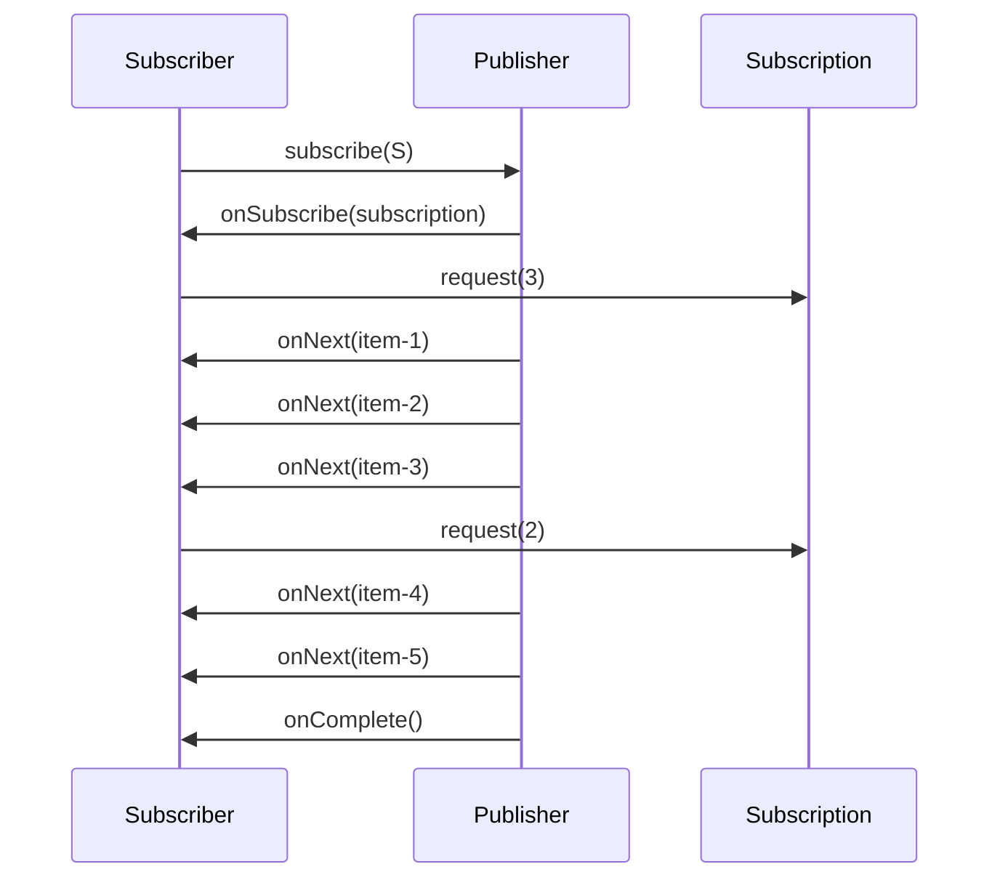
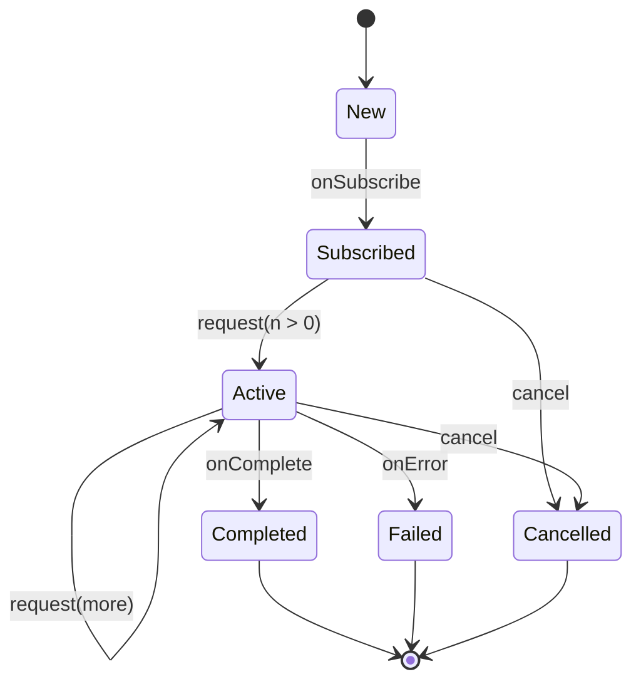
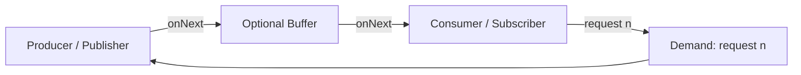
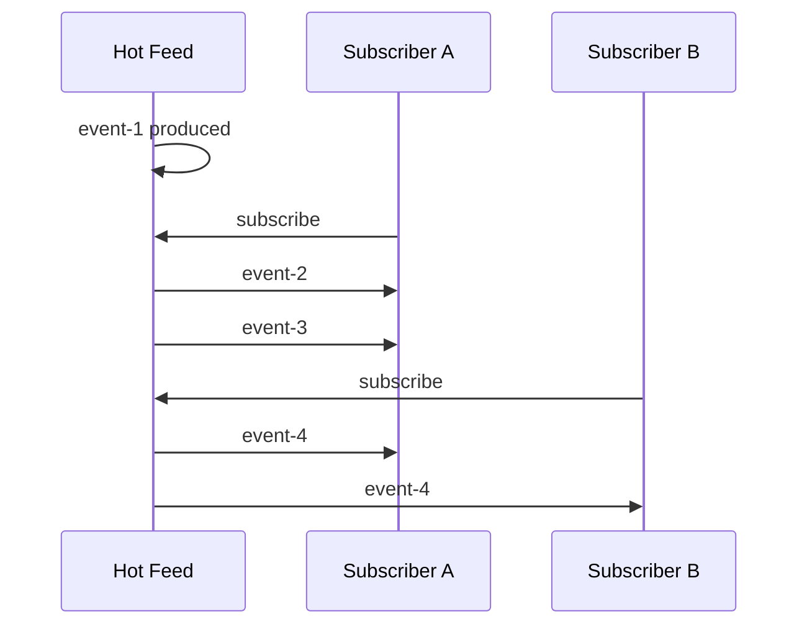
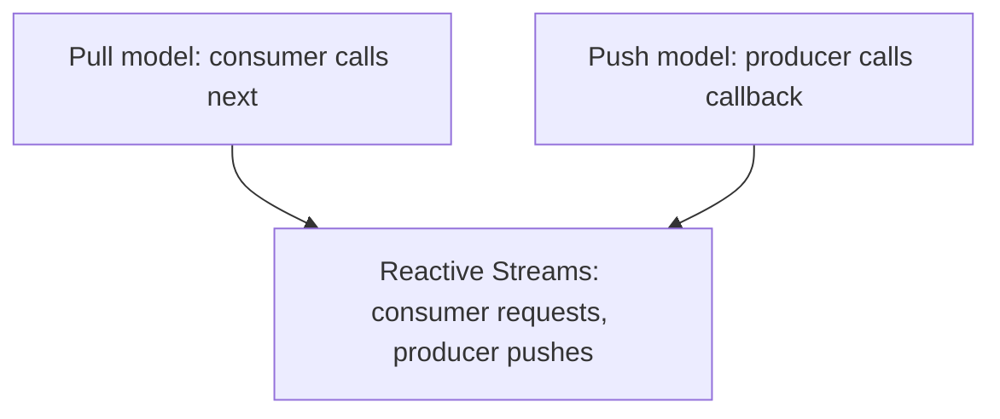
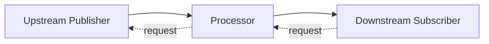

------
title: Learn Java Concurrency & Correctness - Part 029
description: Reactive Streams, java.util.concurrent.Flow, Publisher/Subscriber/Subscription/Processor contracts, demand management, backpressure, cancellation, and correctness boundaries.
series: learn-java-concurrency-correctness
seriesTitle: Learn Java Concurrency & Correctness
order: 29
partTitle: Reactive Streams and Flow API
tags:
- java
- concurrency
- correctness
- reactive-streams
- flow-api
- backpressure
- async
- series
date: 2026-06-28
---

# Part 029 — Reactive Streams and Flow API

> Target utama part ini: memahami reactive programming dari kontrak correctness-nya, bukan dari gaya syntax. Setelah part ini, kamu harus bisa membaca pipeline reactive sebagai protokol demand, signal, cancellation, dan backpressure; bukan sekadar rangkaian operator.

Reactive programming sering diajarkan terlalu cepat lewat `Flux`, `Mono`, `Observable`, atau `flatMap`. Akibatnya engineer hafal operator, tetapi gagal menjawab pertanyaan produksi yang lebih penting:

- siapa yang boleh mengirim data?
- kapan data boleh dikirim?
- siapa yang mengatur kecepatan?
- apa yang terjadi ketika downstream lambat?
- apa beda error, complete, cancel, timeout, dan drop?
- apakah stream ini hot atau cold?
- apakah subscriber bisa dipanggil concurrent?
- apakah pipeline ini benar-benar non-blocking?
- apakah backpressure dipertahankan atau diam-diam dihancurkan?

Di Java modern, titik paling netral untuk memahami reactive adalah **Reactive Streams** dan `java.util.concurrent.Flow`.

`Flow` bukan framework aplikasi. Ia adalah set interface standar di JDK untuk membangun komponen flow-controlled:

- `Flow.Publisher<T>`;
- `Flow.Subscriber<T>`;
- `Flow.Subscription`;
- `Flow.Processor<T, R>`.

Reactive Streams sendiri adalah spesifikasi JVM untuk **asynchronous stream processing with non-blocking backpressure**. Kalimat itu padat. Kita akan membongkarnya secara operasional.

---

## 1. Masalah yang Diselesaikan Reactive Streams

Bayangkan service menerima 1 juta event dari upstream, tetapi database hanya sanggup commit 5 ribu event per detik.

Pendekatan naive:

```java
for (Event event : upstream.readAll()) {
    database.save(event);
}
```

Masalahnya bukan hanya lambat. Masalahnya adalah **tidak ada protokol pressure**. Upstream bisa lebih cepat dari downstream, sehingga sistem harus memilih:

1. menahan producer;
2. buffer tanpa batas;
3. drop data;
4. fail cepat;
5. degrade;
6. membagi beban;
7. mengubah semantic delivery.

Tanpa protokol eksplisit, sistem biasanya memilih opsi terburuk secara tidak sadar: **buffer tanpa batas sampai memory habis**.

Reactive Streams memberi kontrak:

> Downstream harus bisa menyatakan demand. Upstream hanya boleh mengirim sesuai demand.

Inilah inti backpressure.

---

## 2. Reactive Streams Bukan “Async Callback Biasa”

Callback biasa:

```java
source.onEvent(event -> handle(event));
```

Pertanyaan yang tidak terjawab:

- apakah callback bisa dipanggil concurrent?
- apakah callback boleh memblokir?
- bagaimana consumer bilang “pelan-pelan”?
- bagaimana cancel?
- bagaimana error terminal dikirim?
- bagaimana tahu stream selesai?

Reactive Streams menambahkan kontrak formal:

```java
public interface Publisher<T> {
    void subscribe(Subscriber<? super T> subscriber);
}

public interface Subscriber<T> {
    void onSubscribe(Subscription subscription);
    void onNext(T item);
    void onError(Throwable throwable);
    void onComplete();
}

public interface Subscription {
    void request(long n);
    void cancel();
}

public interface Processor<T, R> extends Subscriber<T>, Publisher<R> {
}
```

Mental model:



Tidak ada item boleh dikirim sebelum ada demand.

---

## 3. Empat Role Utama

### 3.1 `Publisher`

`Publisher` adalah sumber signal.

Ia tidak sekadar “collection async”. Ia adalah kontrak bahwa item dikirim kepada subscriber melalui subscription dan mengikuti demand.

Contoh sumber:

- rows dari database driver reactive;
- HTTP body stream;
- Kafka records;
- file chunks;
- timer ticks;
- WebSocket messages;
- event bus;
- in-memory generated sequence.

Hal penting:

- `Publisher` bisa cold atau hot;
- `Publisher` bisa finite atau infinite;
- `Publisher` bisa synchronous atau asynchronous secara implementasi;
- `Publisher` bisa single-subscriber atau multi-subscriber;
- `Publisher` tidak otomatis non-blocking hanya karena namanya reactive.

### 3.2 `Subscriber`

`Subscriber` menerima signal:

1. `onSubscribe`;
2. zero or more `onNext`;
3. exactly one terminal signal: `onError` atau `onComplete`.

Subscriber yang benar tidak boleh menganggap item datang sekaligus. Ia harus mengelola demand.

### 3.3 `Subscription`

`Subscription` adalah control channel.

Subscriber memakai subscription untuk:

- `request(n)`: meminta `n` item lagi;
- `cancel()`: menghentikan aliran.

Ini bukan detail kecil. `Subscription` adalah mekanisme utama backpressure.

### 3.4 `Processor`

`Processor<T, R>` adalah stage yang menjadi `Subscriber<T>` sekaligus `Publisher<R>`.

Contoh:

```text
Publisher<OrderEvent>
    -> Processor<OrderEvent, ValidatedOrder>
    -> Processor<ValidatedOrder, RiskDecision>
    -> Subscriber<RiskDecision>
```

Processor harus menjaga dua kontrak sekaligus:

- sebagai downstream terhadap upstream;
- sebagai upstream terhadap downstream berikutnya.

Processor adalah tempat paling sering terjadi bug backpressure karena ia harus menerjemahkan demand downstream menjadi request upstream.

---

## 4. Signal Grammar

Reactive Streams dapat dibaca sebagai grammar:

```text
onSubscribe
(onNext)*
(onError | onComplete)?
```

Dengan constraint:

- `onSubscribe` tepat satu kali;
- `onNext` hanya boleh setelah `onSubscribe`;
- `onNext` tidak boleh melebihi demand;
- `onError` terminal;
- `onComplete` terminal;
- setelah terminal signal, tidak boleh ada signal lagi;
- `cancel` menghentikan minat subscriber terhadap stream;
- `request(n)` dengan `n <= 0` adalah pelanggaran kontrak.

Diagram:



Kunci correctness: signal terminal menutup stream. Tidak ada “recover” di subscription yang sama. Operator recovery biasanya membuat subscription baru atau mengganti publisher.

---

## 5. Demand adalah Budget, Bukan Saran

Ketika subscriber memanggil:

```java
subscription.request(10);
```

Artinya publisher mendapat budget maksimal 10 `onNext`.

Jika publisher mengirim 11 item, ia melanggar kontrak.

Demand model:

```text
initial demand = 0
request(5)     -> demand = 5
onNext         -> demand = 4
onNext         -> demand = 3
request(10)    -> demand = 13
onNext         -> demand = 12
```

Praktisnya, demand sering diakumulasi dengan saturating arithmetic agar tidak overflow.

```java
static long addCap(long current, long requested) {
    long result = current + requested;
    return result < 0 ? Long.MAX_VALUE : result;
}
```

`Long.MAX_VALUE` sering dipakai sebagai semantic “unbounded demand”. Hati-hati: unbounded demand berarti subscriber berkata “kirim sebanyak mungkin”, sehingga backpressure downstream dilepas.

---

## 6. Backpressure: Flow Control Application-Level

Backpressure bukan:

- retry;
- rate limit saja;
- queue saja;
- thread pool saja;
- async saja;
- non-blocking saja.

Backpressure adalah **feedback loop dari consumer ke producer**.



Tanpa feedback loop, sistem hanya punya buffering atau dropping.

### 6.1 Backpressure vs Buffering

Buffering menunda masalah.

Backpressure mengubah kecepatan sumber.

| Mekanisme | Apa yang terjadi | Risiko |
|---|---|---|
| Unbounded buffer | Producer bebas, consumer menyusul nanti | OOM, latency tail panjang |
| Bounded buffer + block | Producer tertahan | thread starvation, deadlock jika salah pool |
| Bounded buffer + drop | Data dibuang | semantic loss |
| Bounded buffer + fail | Cepat gagal | perlu retry/idempotency |
| Demand protocol | Producer kirim sesuai request | lebih stabil, lebih kompleks |

### 6.2 Backpressure vs Rate Limiting

Rate limiting mengatur seberapa cepat sesuatu boleh terjadi menurut policy eksternal.

Backpressure mengatur produksi berdasarkan kapasitas downstream saat ini.

Keduanya bisa digabung:

```text
effective allowed rate = min(rate-limit-policy, downstream-demand, resource-capacity)
```

---

## 7. `java.util.concurrent.Flow`

`Flow` masuk JDK sebagai interface standar. Ia tidak memberikan operator seperti `map`, `flatMap`, atau `buffer`. Ia menyediakan kontrak dasar.

Contoh subscriber sederhana:

```java
import java.util.concurrent.Flow;

public final class LoggingSubscriber<T> implements Flow.Subscriber<T> {
    private Flow.Subscription subscription;
    private final int batchSize;
    private int remaining;

    public LoggingSubscriber(int batchSize) {
        if (batchSize <= 0) {
            throw new IllegalArgumentException("batchSize must be positive");
        }
        this.batchSize = batchSize;
        this.remaining = batchSize;
    }

    @Override
    public void onSubscribe(Flow.Subscription subscription) {
        this.subscription = subscription;
        subscription.request(batchSize);
    }

    @Override
    public void onNext(T item) {
        System.out.println("item = " + item);

        remaining--;
        if (remaining == 0) {
            remaining = batchSize;
            subscription.request(batchSize);
        }
    }

    @Override
    public void onError(Throwable throwable) {
        throwable.printStackTrace();
    }

    @Override
    public void onComplete() {
        System.out.println("complete");
    }
}
```

Ini model batch demand:

- minta 10;
- proses 10;
- minta 10 lagi.

Kelemahannya: jika `onNext` lambat, publisher mungkin menunggu; jika `onNext` memblokir thread event loop, pipeline rusak.

---

## 8. Contoh Publisher Minimal

Publisher benar sulit dibuat. Ini contoh edukatif, bukan implementasi produksi penuh.

```java
import java.util.List;
import java.util.Objects;
import java.util.concurrent.Flow;
import java.util.concurrent.atomic.AtomicBoolean;
import java.util.concurrent.atomic.AtomicLong;

public final class ListPublisher<T> implements Flow.Publisher<T> {
    private final List<T> items;

    public ListPublisher(List<T> items) {
        this.items = List.copyOf(items);
    }

    @Override
    public void subscribe(Flow.Subscriber<? super T> subscriber) {
        Objects.requireNonNull(subscriber, "subscriber");
        subscriber.onSubscribe(new ListSubscription<>(subscriber, items));
    }

    private static final class ListSubscription<T> implements Flow.Subscription {
        private final Flow.Subscriber<? super T> subscriber;
        private final List<T> items;
        private final AtomicLong demand = new AtomicLong();
        private final AtomicBoolean cancelled = new AtomicBoolean();
        private int index;

        private ListSubscription(Flow.Subscriber<? super T> subscriber, List<T> items) {
            this.subscriber = subscriber;
            this.items = items;
        }

        @Override
        public void request(long n) {
            if (n <= 0) {
                if (cancelled.compareAndSet(false, true)) {
                    subscriber.onError(new IllegalArgumentException("request must be positive"));
                }
                return;
            }

            addDemand(n);
            drain();
        }

        @Override
        public void cancel() {
            cancelled.set(true);
        }

        private void addDemand(long n) {
            while (true) {
                long current = demand.get();
                long next = current + n;
                if (next < 0) {
                    next = Long.MAX_VALUE;
                }
                if (demand.compareAndSet(current, next)) {
                    return;
                }
            }
        }

        private void drain() {
            while (!cancelled.get() && demand.get() > 0 && index < items.size()) {
                T item = items.get(index++);
                demand.decrementAndGet();
                subscriber.onNext(item);
            }

            if (!cancelled.get() && index == items.size()) {
                cancelled.set(true);
                subscriber.onComplete();
            }
        }
    }
}
```

Kelemahan contoh ini:

- `drain()` belum aman terhadap reentrant/concurrent `request` kompleks;
- tidak mengatur serialization signal secara lengkap;
- synchronous; caller `request()` bisa menjalankan `onNext()` langsung;
- tidak punya executor boundary.

Tujuan contoh: memperlihatkan bahwa publisher harus menjaga **demand accounting**.

---

## 9. Serialization: Subscriber Signal Tidak Boleh Sembarangan Concurrent

Kesalahan umum: menganggap reactive berarti `onNext` bisa dipanggil dari banyak thread bebas.

Subscriber biasanya harus menerima signal secara sequential untuk satu subscription. Jika beberapa producer thread ingin mengirim item ke subscriber yang sama, publisher harus men-serialize signal.

Anti-pattern:

```java
public void emitFromManyThreads(T item) {
    subscriber.onNext(item); // race terhadap onNext lain
}
```

Masalah:

- subscriber state rusak;
- demand accounting bisa negatif;
- `onComplete` bisa balapan dengan `onNext`;
- error bisa dikirim dua kali;
- operator downstream tidak thread-safe.

Pattern konseptual:

```java
private final Queue<T> queue = new ConcurrentLinkedQueue<>();
private final AtomicInteger wip = new AtomicInteger();

void emit(T item) {
    queue.offer(item);
    drain();
}

void drain() {
    if (wip.getAndIncrement() != 0) {
        return;
    }

    int missed = 1;
    for (;;) {
        // single drainer region
        // read demand, poll queue, call onNext sequentially

        missed = wip.addAndGet(-missed);
        if (missed == 0) {
            break;
        }
    }
}
```

Ini disebut drain loop pattern. Framework reactive besar memakai variasi pattern ini.

---

## 10. Cold vs Hot Publisher

### 10.1 Cold Publisher

Cold publisher memulai produksi untuk setiap subscriber.

Contoh:

```text
Subscriber A subscribe -> sequence 1,2,3 mulai untuk A
Subscriber B subscribe -> sequence 1,2,3 mulai untuk B
```

Cocok untuk:

- HTTP request per subscriber;
- database query per subscriber;
- generated range;
- file read per subscription;
- deferred computation.

Mental model: “recipe”.

### 10.2 Hot Publisher

Hot publisher menghasilkan event terlepas dari subscriber.

Contoh:

```text
market data feed
Kafka topic tailing
UI events
WebSocket live stream
sensor data
```

Subscriber yang terlambat mungkin kehilangan event.

Mental model: “live broadcast”.

Diagram:



Kesalahan desain: memperlakukan hot stream seperti cold stream lalu kaget ada data hilang.

---

## 11. Push, Pull, dan Push-Pull Hybrid

Iterator adalah pull:

```java
while (iterator.hasNext()) {
    T item = iterator.next();
}
```

Callback adalah push:

```java
source.onEvent(item -> handle(item));
```

Reactive Streams adalah push-pull hybrid:

- subscriber menarik demand dengan `request(n)`;
- publisher mendorong item dengan `onNext` sesuai demand.



Ini alasan reactive bisa tetap asynchronous sambil punya flow control.

---

## 12. Terminal Semantics

Stream punya dua terminal signal:

```java
void onError(Throwable throwable);
void onComplete();
```

`onError` berarti stream gagal dan selesai.

`onComplete` berarti stream sukses selesai.

Setelah salah satu terjadi:

- tidak boleh ada `onNext` lagi;
- tidak boleh ada terminal signal lagi;
- resource harus dianggap bisa dibersihkan;
- retry berarti subscription baru, bukan melanjutkan subscription lama.

Anti-pattern:

```java
subscriber.onError(ex);
subscriber.onNext(fallback); // illegal mental model
subscriber.onComplete();     // illegal mental model
```

Correct mental model:

```text
upstream failed
    -> operator recovery creates fallback publisher
    -> downstream sees fallback items from a new logical path
```

---

## 13. Cancellation Semantics

`cancel()` bukan error. `cancel()` berarti subscriber tidak tertarik lagi.

Sumber cancellation:

- client disconnect;
- timeout;
- user abort;
- `take(n)` sudah cukup;
- competing branch menang;
- parent structured task cancelled;
- service shutdown.

Publisher yang benar harus memperhatikan cancellation.

```java
@Override
public void cancel() {
    cancelled.set(true);
    cleanupResources();
}
```

Resource yang harus dibersihkan:

- socket;
- cursor database;
- file handle;
- scheduled timer;
- pending task;
- buffer;
- lock atau permit;
- subscription upstream.

Cancellation leak adalah salah satu sumber incident reactive paling mahal.

---

## 14. Processor: Stage yang Sulit

Processor menghubungkan upstream dan downstream.



Processor harus menjawab:

- apakah 1 input menghasilkan 1 output?
- apakah 1 input menghasilkan 0..N output?
- apakah output butuh async call?
- apakah order harus dipertahankan?
- apakah error input membatalkan seluruh stream?
- apakah demand downstream diterjemahkan langsung ke upstream?
- apakah perlu buffer?
- bagaimana cancel downstream diteruskan ke upstream?

Contoh map processor mudah:

```text
1 input -> 1 output
request downstream n -> request upstream n
```

Contoh flatMap processor sulit:

```text
1 input -> async inner publisher -> 0..N output
concurrency limit harus eksplisit
order mungkin berubah
inner cancellation harus dikelola
error policy harus jelas
```

Karena itu framework seperti Reactor/RxJava jauh lebih kompleks daripada tampilan operatornya.

---

## 15. Backpressure Strategy

Tidak semua source bisa diperlambat.

Source yang bisa diperlambat:

- database cursor reactive;
- file read yang dikendalikan sendiri;
- generated range;
- pull-based broker consumer dengan pause/resume;
- HTTP response body reader.

Source yang sulit diperlambat:

- UI event;
- sensor stream;
- market feed;
- external push webhook;
- OS signal;
- hot multicast feed.

Jika source tidak bisa diperlambat, backpressure harus diterjemahkan ke strategi lain:

| Strategy | Kapan dipakai | Risiko |
|---|---|---|
| Buffer bounded | burst pendek | latency naik, overflow |
| Drop latest | telemetry non-critical | kehilangan data baru |
| Drop oldest | UI/latest-state semantics | kehilangan sejarah |
| Sample | monitoring/visualization | akurasi turun |
| Throttle/debounce | user event | delay atau kehilangan detail |
| Fail fast | data harus tidak hilang | perlu retry upstream |
| Spill to disk | workload durable | kompleksitas tinggi |

Top 1% engineer tidak bertanya “pakai operator apa?”, tetapi “semantic loss apa yang boleh terjadi?”.

---

## 16. Demand Translation Examples

### 16.1 `map`

```text
input:  A B C
map:    f(A) f(B) f(C)
output: X Y Z
```

Demand downstream 10 -> request upstream 10.

### 16.2 `filter`

```text
input:  A B C D
filter: keep A, D
output: A D
```

Demand downstream 10 tidak cukup diterjemahkan ke request upstream 10 jika banyak item difilter. Processor mungkin harus request lebih banyak upstream sampai downstream demand terpenuhi atau upstream selesai.

### 16.3 `buffer(100)`

```text
input:  100 items
output: List<100 items>
```

Demand downstream 1 buffer -> request upstream 100 item.

### 16.4 `flatMap(concurrency = 32)`

```text
input item -> inner publisher
many inner publishers active concurrently
```

Demand harus dibagi ke inner publisher. Concurrency harus dibatasi agar tidak membuat fan-out tidak terkendali.

---

## 17. Ordering Semantics

Reactive Streams menjaga order signal untuk satu publisher-subscription path, tetapi operator bisa mengubah order.

Contoh:

- `map`: order preserved;
- `filter`: order preserved untuk item yang lolos;
- `flatMap`: order bisa berubah karena inner async selesai berbeda waktu;
- `concatMap`: order preserved tetapi concurrency lebih rendah;
- `merge`: order berdasarkan arrival;
- `zip`: order berdasarkan pasangan;
- `groupBy`: order per group, bukan global.

Kesalahan production:

```text
Assumption: result order sama dengan request order
Reality: flatMap async mengubah order
Impact: wrong audit sequence, wrong version update, broken reconciliation
```

Jika order adalah invariant, tulis eksplisit.

---

## 18. Async Boundary

Reactive chain bisa terlihat linear, tetapi thread-nya berubah di boundary tertentu.

```text
source -> map -> filter -> publishOn(worker) -> flatMap(asyncCall) -> subscriber
```

Pertanyaan wajib:

- operator mana yang membuat boundary thread?
- state apa yang dibawa melewati boundary?
- apakah context propagation aman?
- apakah downstream sequential?
- apakah blocking masuk event-loop?
- apakah cancellation menembus boundary?

Di level `Flow`, interface tidak menentukan scheduler. Scheduler adalah concern implementasi/framework.

---

## 19. Non-Blocking Tidak Sama dengan Tidak Ada Thread

Semua program tetap berjalan di thread.

Non-blocking berarti thread tidak menunggu resource secara blocking ketika operasi belum siap. Ia bisa kembali menjalankan work lain.

Reactive sering digabung dengan non-blocking I/O, tetapi reactive sendiri adalah protokol stream. Sebuah implementation bisa saja reactive tapi masih memanggil blocking JDBC di tengah pipeline. Itu bukan non-blocking pipeline.

Anti-pattern:

```java
// Secara bentuk reactive, tetapi isinya blocking.
return userIds.flatMap(id -> Mono.just(repository.findById(id)));
```

Masalah:

- `findById` blocking dieksekusi saat chain berjalan;
- jika thread event loop, event loop macet;
- jika common scheduler, worker habis;
- backpressure tidak menyelamatkan thread starvation sepenuhnya.

---

## 20. Memory Safety dan Buffer Accounting

Reactive code sering gagal bukan karena race klasik, tetapi karena buffer tidak terlihat.

Sumber buffer:

- operator `buffer`;
- prefetch;
- merge/flatMap inner queues;
- retry queue;
- network receive buffer;
- broker client buffer;
- scheduler queue;
- executor queue;
- application cache;
- database driver buffer.

Checklist:

```text
For every queue/buffer:
- bounded atau unbounded?
- capacity berapa?
- unit capacity item atau bytes?
- apa overflow policy?
- metric apa yang expose occupancy?
- cancellation membersihkan buffer?
- retry menggandakan buffer?
- item age terukur?
```

Backpressure hanya efektif jika semua boundary menghormatinya.

---

## 21. Implementasi Subscriber dengan Resource Guard

Contoh: subscriber memproses item dengan limit resource eksternal.

```java
public final class SavingSubscriber implements Flow.Subscriber<OrderEvent> {
    private final OrderRepository repository;
    private Flow.Subscription subscription;
    private boolean done;

    public SavingSubscriber(OrderRepository repository) {
        this.repository = repository;
    }

    @Override
    public void onSubscribe(Flow.Subscription subscription) {
        this.subscription = subscription;
        subscription.request(1);
    }

    @Override
    public void onNext(OrderEvent event) {
        if (done) {
            return;
        }

        try {
            repository.save(event); // assume blocking for example
            subscription.request(1);
        } catch (Exception ex) {
            done = true;
            subscription.cancel();
            // report failure to side-channel; Subscriber cannot call onError on itself
            logFailure(event, ex);
        }
    }

    @Override
    public void onError(Throwable throwable) {
        done = true;
        logUpstreamFailure(throwable);
    }

    @Override
    public void onComplete() {
        done = true;
        flushAudit();
    }
}
```

Ini request-one-by-one. Stabil, tetapi throughput rendah jika processing lambat. Untuk throughput tinggi, biasanya pakai batch demand atau async stage dengan bounded concurrency.

---

## 22. Why `request(1)` Bisa Benar tapi Lambat

`request(1)` menjaga memory kecil dan control ketat. Namun latency round-trip demand bisa menurunkan throughput.

Trade-off:

| Demand style | Kelebihan | Kekurangan |
|---|---|---|
| `request(1)` | memory kecil, fairness tinggi | overhead tinggi |
| batch request | throughput lebih baik | buffer lebih besar |
| unbounded | simple, cepat untuk source kecil | pressure hilang |
| adaptive | stabil di variasi beban | kompleks |

Batching yang masuk akal:

```java
final int batchSize = 128;
final int replenishAt = 64;
```

Minta 128 item, request 64 lagi ketika tersisa 64. Ini mengurangi stop-and-go.

---

## 23. Reactive Streams TCK Mental Model

Reactive Streams punya TCK untuk memvalidasi implementasi. Kamu tidak perlu menulis TCK dari nol, tetapi mental modelnya berguna.

Hal yang diuji:

- subscriber menerima `onSubscribe` sekali;
- publisher menghormati demand;
- `request(0)` atau negatif menghasilkan error sesuai kontrak;
- terminal signal hanya satu;
- signal setelah terminal tidak terjadi;
- cancellation menghentikan signal;
- subscriber method tidak dipanggil concurrent secara tidak sah;
- publisher tidak mengirim item tanpa request.

Saat membuat bridge custom, pikirkan seperti implementor TCK.

---

## 24. Membuat Bridge dari Callback ke Flow

Misalnya ada API callback:

```java
interface LegacyListener<T> {
    void onEvent(T event);
    void onFailure(Throwable error);
}
```

Bridge naive:

```java
listener.onEvent(item -> subscriber.onNext(item));
```

Ini salah karena tidak menghormati demand.

Bridge yang lebih benar harus punya:

- queue bounded;
- demand counter;
- cancellation flag;
- overflow policy;
- drain loop;
- terminal coordination.

Pseudo-code:

```java
onEvent(item):
    if cancelled: return
    if queue.offer(item) fails:
        cancel upstream
        onError(overflow)
    drain()

request(n):
    add demand
    drain()

drain():
    while demand > 0 and queue not empty and not cancelled:
        item = queue.poll()
        demand--
        subscriber.onNext(item)
    if terminal and queue empty:
        send terminal
```

Bridge adalah tempat kamu harus eksplisit tentang semantic overflow.

---

## 25. Error Handling Correctness

Dalam reactive pipeline, error adalah signal terminal. Namun error handling operator dapat mengganti stream.

Policy yang harus didefinisikan:

| Policy | Makna |
|---|---|
| fail stream | satu error menghentikan semua |
| skip bad item | data buruk diabaikan, stream lanjut |
| route to dead-letter | item gagal dikirim ke kompensasi |
| retry same item | butuh idempotency dan deadline |
| fallback value | hanya aman jika semantic-nya jelas |
| resume with alternate publisher | subscription path baru |

Anti-pattern:

```text
"onErrorResume saja"
```

Pertanyaan yang benar:

- error ini transient atau permanent?
- item-nya aman diulang?
- downstream menerima fallback sebagai fakta atau sebagai degraded value?
- apakah audit mencatat error asli?
- apakah retry menghormati deadline?
- apakah retry mempertahankan ordering?

---

## 26. Reactive Boundary dengan Database

Reactive database driver hanya berguna penuh jika driver benar-benar non-blocking dan mendukung demand.

Jika kamu memakai blocking JDBC di pipeline reactive, kamu harus mengisolasi blocking call di scheduler khusus atau memakai virtual threads/thread-per-task di boundary yang tepat.

Decision matrix:

| Database layer | Model yang masuk akal |
|---|---|
| JDBC blocking | virtual threads atau bounded blocking scheduler |
| R2DBC/reactive driver | reactive end-to-end |
| Mixed legacy | explicit bridge + bounded concurrency |
| Transaction long-running | hati-hati dengan reactive composition |
| ORM session-bound | reactive sering tidak cocok tanpa framework khusus |

Jangan menyebut sistem “reactive” hanya karena return type-nya `Publisher`.

---

## 27. Reactive Boundary dengan Message Broker

Broker punya mekanisme flow control sendiri.

Contoh concern:

- Kafka poll loop;
- consumer pause/resume;
- max poll records;
- commit offset;
- ordering per partition;
- at-least-once semantics;
- retry topic;
- dead-letter topic.

Reactive bridge harus menerjemahkan demand ke broker control.

```text
downstream demand rendah
    -> jangan poll terlalu banyak
    -> atau pause partition
    -> atau buffer bounded
    -> jangan commit sebelum processing aman
```

Backpressure tanpa delivery semantics bisa merusak correctness.

---

## 28. Reactive Boundary dengan HTTP

HTTP response body streaming cocok untuk reactive karena body bisa berupa chunks.

Pertanyaan:

- apakah client disconnect menghasilkan cancel?
- apakah upstream HTTP call dicancel?
- apakah response body buffer bounded?
- apakah timeout membatalkan network operation?
- apakah partial response boleh terjadi?
- apakah error setelah header dikirim bisa direpresentasikan?

Untuk HTTP server, cancellation sering berasal dari client yang menutup koneksi. Pipeline harus membersihkan resource.

---

## 29. Context Propagation di Reactive Streams

Thread-local context tidak otomatis aman di reactive pipeline karena execution bisa berpindah thread.

Jangan mengandalkan:

```java
ThreadLocal<RequestContext> CURRENT = new ThreadLocal<>();
```

Jika pipeline berpindah scheduler, context bisa hilang.

Model yang lebih benar:

- context sebagai bagian dari item;
- framework context object;
- immutable request context;
- explicit parameter;
- bridge ke MDC hanya di logging boundary;
- `ScopedValue` untuk lexical structured code, bukan otomatis semua reactive chain.

Reactive context propagation adalah concern terpisah dari backpressure.

---

## 30. Observability

Minimal metrics untuk pipeline reactive:

```text
subscription.count
request.count
emitted.count
completed.count
error.count
cancel.count
buffer.size
buffer.capacity
buffer.overflow.count
processing.latency
item.age
demand.outstanding
active.inner.publishers
scheduler.queue.size
scheduler.worker.active
```

Logs penting:

- subscription created;
- demand requested;
- cancellation reason;
- terminal signal;
- overflow event;
- timeout;
- retry attempt;
- operator boundary;
- dropped item reason.

Jangan log setiap item di stream besar kecuali sampling/diagnostic mode.

---

## 31. Testing Reactive Correctness

Test jangan hanya `expectNext`. Test juga demand.

Test cases:

- no item before request;
- exact number of items after request;
- cancellation stops upstream;
- error terminal ends stream;
- complete terminal ends stream;
- slow subscriber does not cause unbounded memory;
- invalid request fails;
- concurrent producer signal serialized;
- retry respects deadline;
- context not leaked between subscribers;
- hot stream late subscriber behavior documented.

Pseudo-test:

```java
@Test
void publisherShouldNotEmitBeforeDemand() {
    TestSubscriber<Integer> subscriber = new TestSubscriber<>();
    publisher.subscribe(subscriber);

    subscriber.assertNoValues();

    subscriber.request(1);
    subscriber.assertValues(1);
}
```

Framework seperti Reactor dan RxJava punya testing tools sendiri, tetapi invariant-nya tetap sama.

---

## 32. Common Anti-Patterns

### 32.1 `subscribe()` di Dalam Service Method

```java
public void process() {
    publisher.subscribe(...);
}
```

Masalah:

- lifecycle hilang;
- caller tidak bisa cancel;
- error hilang ke side-channel;
- testing sulit;
- backpressure chain terputus.

Lebih baik return publisher/mono/flux ke boundary yang memiliki lifecycle.

### 32.2 Unbounded `flatMap`

```java
source.flatMap(item -> callRemote(item));
```

Jika concurrency tidak dibatasi, fan-out bisa meledak.

Selalu tanya:

```text
max concurrent inner operations berapa?
```

### 32.3 Blocking di Event Loop

```java
.map(item -> jdbcRepository.save(item))
```

Jika dijalankan di event-loop, semua connection di event-loop bisa stuck.

### 32.4 Ignoring Cancel

Publisher tetap membaca file/socket setelah subscriber cancel.

Impact:

- resource leak;
- wasted work;
- wrong billing;
- late writes;
- noisy logs.

### 32.5 Treating Backpressure as Infinite Buffer

```text
"Tenang, reactive punya backpressure"
```

Backpressure hanya ada jika semua stage menghormati demand.

---

## 33. Decision Matrix: Reactive Streams Cocok atau Tidak?

| Situation | Reactive cocok? | Catatan |
|---|---:|---|
| high-concurrency streaming HTTP | Ya | terutama body streaming dan backpressure |
| many small blocking CRUD calls | Belum tentu | virtual threads sering lebih sederhana |
| event stream dengan fan-out | Ya | butuh semantic drop/retry jelas |
| CPU-bound batch | Kadang | ForkJoin/parallel decomposition mungkin lebih cocok |
| simple request-response | Belum tentu | complexity bisa tidak sepadan |
| UI/event stream | Ya | hot stream semantics penting |
| blocking ORM transaction | Hati-hati | reactive bisa memperumit correctness |
| end-to-end non-blocking stack | Ya | jika driver dan framework mendukung |

Reactive adalah alat arsitektural. Pakai ketika problem-nya memang stream, demand, asynchronous boundary, dan backpressure.

---

## 34. Review Checklist

Sebelum approve reactive code, jawab ini:

```text
Signal contract:
- Apakah onSubscribe tepat satu kali?
- Apakah terminal signal tepat satu?
- Apakah tidak ada onNext setelah terminal?

Demand:
- Apakah item hanya dikirim setelah request?
- Apakah request(n <= 0) ditangani?
- Apakah demand overflow aman?

Backpressure:
- Apakah setiap boundary menghormati demand?
- Apakah buffer bounded?
- Apa overflow policy?

Cancellation:
- Apakah cancel membersihkan resource?
- Apakah cancel diteruskan ke upstream?
- Apakah timeout menghasilkan cancel?

Threading:
- Apakah signal subscriber serialized?
- Apakah blocking call diisolasi?
- Apakah context propagation benar?

Semantics:
- Apakah stream cold/hot terdokumentasi?
- Apakah ordering dijamin atau tidak?
- Apakah error policy eksplisit?
```

---

## 35. Latihan 20 Jam — Drill Part Ini

### Drill 1 — Manual Subscriber

Buat `Flow.Subscriber<Integer>` yang:

- request batch 5;
- mencatat item;
- cancel setelah 12 item;
- memastikan tidak memproses item setelah cancel.

### Drill 2 — Demand Accounting

Simulasikan demand counter dengan:

- request 3;
- emit 2;
- request 5;
- emit 6;
- complete.

Tulis state demand setiap langkah.

### Drill 3 — Callback Bridge Design

Ambil callback source imajiner:

```java
void register(Listener<T> listener);
```

Desain bridge ke `Flow.Publisher<T>` dengan:

- bounded queue;
- overflow fail-fast;
- cancel cleanup;
- single drain loop.

Tidak perlu sempurna, tetapi invariant harus jelas.

### Drill 4 — Hot vs Cold Audit

Ambil 5 stream di sistem kerja kamu. Klasifikasikan:

- hot/cold;
- finite/infinite;
- backpressurable/tidak;
- ordered/unordered;
- lossless/lossy.

### Drill 5 — Reactive Incident Postmortem

Tulis postmortem mini untuk incident:

```text
Reactive service OOM karena downstream database lambat.
```

Jawab:

- buffer mana yang tumbuh?
- demand boundary mana yang pecah?
- metric apa yang seharusnya ada?
- remediation apa yang benar?

---

## 36. Ringkasan

Reactive Streams adalah protokol correctness untuk stream asynchronous dengan backpressure.

Empat interface utama:

- `Publisher`: sumber item;
- `Subscriber`: penerima signal;
- `Subscription`: control channel untuk demand dan cancel;
- `Processor`: stage transformasi yang menjadi subscriber dan publisher.

Mental model paling penting:

```text
Subscriber controls demand.
Publisher must respect demand.
Cancellation must release resources.
Terminal signal ends the stream.
Backpressure only works if every boundary preserves it.
```

Jika kamu memahami protokol ini, framework seperti Reactor dan RxJava menjadi lebih mudah dibaca. Operator bukan magic. Operator hanyalah implementasi dari demand translation, signal transformation, scheduling boundary, buffering, cancellation, dan error semantics.

Di part berikutnya kita masuk ke Reactor/RxJava secara praktis: scheduler, `publishOn`, `subscribeOn`, `flatMap`, hot/cold publisher, blocking bridge, dan batasnya terhadap virtual threads.
