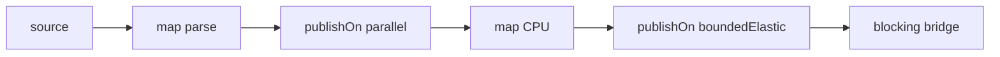

------
title: Learn Java Concurrency & Correctness - Part 030
description: Project Reactor, RxJava, schedulers, cold/hot publishers, operator boundaries, blocking bridges, backpressure, and how to reason about reactive code in the virtual-thread era.
series: learn-java-concurrency-correctness
seriesTitle: Learn Java Concurrency & Correctness
order: 30
partTitle: Reactor, RxJava, and Virtual Thread Boundaries
tags:
- java
- concurrency
- correctness
- reactor
- rxjava
- reactive-programming
- virtual-threads
- scheduler
- series
date: 2026-06-28
---

# Part 030 — Reactor, RxJava, and Virtual Thread Boundaries

> Target utama part ini: mampu memilih, membaca, dan mereview Reactor/RxJava pipeline secara production-grade, terutama ketika bertemu scheduler, blocking code, backpressure, context propagation, dan virtual threads.

Part sebelumnya membahas kontrak dasar Reactive Streams dan `Flow`. Sekarang kita naik ke framework yang umum dipakai di sistem Java:

- **Project Reactor**: `Flux`, `Mono`, scheduler, WebFlux ecosystem;
- **RxJava 3**: `Flowable`, `Observable`, `Single`, `Maybe`, `Completable`, scheduler;
- **Virtual Threads**: alternatif modern untuk banyak use case blocking concurrency.

Tujuan part ini bukan membuat katalog operator. Operator terlalu banyak dan berubah mengikuti framework. Yang lebih penting adalah mental model:

```text
reactive chain = signal protocol + operator semantics + scheduler boundary + resource contract
```

Jika kamu bisa membaca empat layer itu, kamu tidak akan mudah tertipu oleh pipeline yang terlihat elegan tetapi salah secara production.

---

## 1. Reactor dan RxJava dalam Peta Concurrency Java

Reactor/RxJava menyelesaikan kelas problem tertentu:

- stream asynchronous;
- multiple values over time;
- composition across async boundaries;
- non-blocking I/O;
- backpressure;
- event processing;
- hot/cold stream;
- cancellation propagation;
- operator-level error handling;
- scheduler-aware execution.

Namun mereka bukan pengganti universal untuk:

- semua thread;
- semua executor;
- semua queue;
- semua batch processing;
- semua request-response service;
- semua blocking database call;
- semua correctness design.

Dengan virtual threads, sebagian kasus yang dahulu “dipaksa reactive” sekarang bisa dibuat lebih sederhana dengan thread-per-task. Tetapi reactive tetap kuat ketika domain-nya memang **stream + demand + async composition + non-blocking boundary**.

---

## 2. Reactor Core Types

Reactor punya dua tipe utama:

```java
Mono<T>  // 0..1 item
Flux<T>  // 0..N item
```

Mental model:

| Type | Cardinality | Use case |
|---|---:|---|
| `Mono<T>` | 0 atau 1 | HTTP call result, DB row optional, async command result |
| `Flux<T>` | 0 sampai banyak | event stream, list async, data chunks, records |

Contoh:

```java
Mono<User> user = userClient.findById(userId);

Flux<OrderEvent> events = orderEventSource.streamByTenant(tenantId);
```

Jangan gunakan `Flux<T>` untuk semua hal. Cardinality adalah bagian dari contract.

---

## 3. RxJava Core Types

RxJava 3 memisahkan beberapa tipe:

| Type | Cardinality | Backpressure |
|---|---:|---|
| `Flowable<T>` | 0..N | Ya |
| `Observable<T>` | 0..N | Tidak seperti `Flowable` |
| `Single<T>` | 1 | Tidak relevan untuk stream banyak |
| `Maybe<T>` | 0..1 | Tidak relevan untuk stream banyak |
| `Completable` | no item, only completion/error | Tidak relevan untuk item stream |

Rule sederhana:

```text
Jika 0..N dan source bisa lebih cepat dari consumer, pakai Flowable.
Jika event UI atau stream kecil tanpa backpressure semantics, Observable bisa cukup.
Jika exactly one result, pakai Single.
Jika optional result, pakai Maybe.
Jika command completion, pakai Completable.
```

Kesalahan umum: memakai `Observable` untuk high-volume event yang seharusnya punya backpressure.

---

## 4. Lazy Execution dan Subscription

Reactive chain biasanya lazy.

```java
Mono<User> pipeline = userClient.findById(userId)
    .map(UserDto::from);
```

Di banyak kasus, belum ada eksekusi sampai ada subscription.

```java
pipeline.subscribe(dto -> log.info("{}", dto));
```

Dalam framework web reactive, framework yang subscribe. Service method biasanya **jangan subscribe sendiri**.

Anti-pattern:

```java
public Mono<UserDto> getUser(String id) {
    userClient.findById(id)
        .subscribe(user -> audit(user)); // side-effect tersembunyi

    return userClient.findById(id).map(UserDto::from);
}
```

Masalah:

- double subscription;
- duplicate remote call;
- error audit tidak tersambung;
- cancellation dari HTTP request tidak membatalkan audit;
- lifecycle tidak jelas.

Pattern lebih baik:

```java
public Mono<UserDto> getUser(String id) {
    return userClient.findById(id)
        .doOnNext(this::audit)
        .map(UserDto::from);
}
```

Atau jika audit harus async dan reliable, desain sebagai pipeline eksplisit dengan delivery semantics.

---

## 5. Cold vs Hot di Reactor/RxJava

### 5.1 Cold

Cold publisher menjalankan logic per subscriber.

```java
Flux<Integer> cold = Flux.range(1, 3);
```

Setiap subscriber menerima sequence dari awal.

### 5.2 Hot

Hot publisher emit tanpa menunggu subscriber tertentu.

Contoh:

- `Sinks.Many` di Reactor;
- `Subject` di RxJava;
- WebSocket feed;
- broker tailing;
- UI event stream.

Kesalahan besar: menganggap hot stream replay semua data untuk subscriber baru.

Diagram:



```mermaid
sequenceDiagram
    participant Source as Hot Source
    participant A as Subscriber A
    participant B as Subscriber B

    Source->>Source: emit event-1
    A->>Source: subscribe
    Source->>A: event-2
    Source->>A: event-3
    B->>Source: subscribe
    Source->>A: event-4
    Source->>B: event-4
```

Jika butuh replay, harus eksplisit:

- replay buffer;
- cache;
- persisted log;
- broker offset;
- durable event store.

---

## 6. Operator Layer: Transformation Bukan Eksekusi Magis

Contoh Reactor:

```java
return orderIds
    .flatMap(orderClient::fetchOrder, 32)
    .filter(Order::isActive)
    .map(OrderDto::from)
    .timeout(Duration.ofSeconds(2));
```

Baca sebagai:

```text
Input: stream orderId
flatMap: fan-out async fetchOrder dengan concurrency 32
filter: drop inactive order
map: transform active order to dto
timeout: fail jika stream/item timeout sesuai operator semantics
```

Pertanyaan review:

- apakah `fetchOrder` non-blocking?
- apakah concurrency 32 sesuai resource downstream?
- apakah order boleh berubah?
- apakah inactive order memang boleh hilang?
- timeout ini per item atau seluruh stream?
- error satu remote call menghentikan semua atau per-item fallback?

Operator adalah declaration of semantics. Setiap operator harus dibaca terhadap correctness.

---

## 7. `map` vs `flatMap`

### 7.1 `map`

`map` untuk transformasi synchronous 1 ke 1.

```java
Flux<OrderDto> dtos = orders.map(OrderDto::from);
```

Jika function blocking atau async, `map` biasanya salah.

Anti-pattern:

```java
orders.map(order -> remoteClient.fetchInvoice(order.id()));
```

Hasilnya bisa menjadi `Flux<Mono<Invoice>>` atau blocking call tersembunyi.

### 7.2 `flatMap`

`flatMap` untuk transformasi ke publisher lalu merge.

```java
Flux<Invoice> invoices = orders.flatMap(order -> invoiceClient.fetch(order.id()));
```

`flatMap` bisa mengubah order dan meningkatkan concurrency.

Selalu tanyakan batas concurrency:

```java
orders.flatMap(order -> invoiceClient.fetch(order.id()), 32);
```

Tanpa limit, fan-out bisa membanjiri downstream.

### 7.3 `concatMap`

`concatMap` menjaga order dengan memproses inner publisher secara berurutan.

```java
orders.concatMap(order -> invoiceClient.fetch(order.id()));
```

Trade-off:

- order aman;
- throughput lebih rendah.

### 7.4 `flatMapSequential`

Beberapa framework punya operator yang mempertahankan order output sambil melakukan concurrency internal. Ini sering memakai buffer untuk menunggu item yang selesai lebih awal.

Trade-off:

- order aman;
- memory bisa naik jika item awal lambat.

---

## 8. Scheduler Mental Model

Scheduler menentukan **di mana** work berjalan.

Di Reactor, scheduler adalah abstraksi mirip `ExecutorService`, tetapi juga berperan sebagai clock untuk operasi waktu.

Common Reactor scheduler:

| Scheduler | Mental model | Use case |
|---|---|---|
| `immediate` | current thread | no boundary |
| `single` | satu thread | serialized work |
| `parallel` | CPU-bound fixed workers | short CPU work |
| `boundedElastic` | bounded blocking/long task scheduler | blocking bridge atau long task |
| custom scheduler | resource-specific pool | isolation/bulkhead |

Di RxJava, konsep serupa ada di `Schedulers.computation()`, `Schedulers.io()`, `Schedulers.single()`, `Schedulers.from(executor)`, dan lain-lain.

Prinsip production:

```text
Scheduler adalah resource boundary.
Jangan biarkan library memilih boundary penting secara implisit.
```

---

## 9. `subscribeOn` vs `publishOn` / `observeOn`

### 9.1 Reactor

- `subscribeOn(scheduler)`: memengaruhi subscription dan upstream source execution.
- `publishOn(scheduler)`: memindahkan downstream execution setelah titik itu.

```java
Mono.fromCallable(() -> blockingCall())
    .subscribeOn(Schedulers.boundedElastic())
    .map(this::toDto);
```

```java
source
    .map(this::parse)
    .publishOn(Schedulers.parallel())
    .map(this::cpuWork)
    .publishOn(Schedulers.boundedElastic())
    .map(this::blockingLegacyCall);
```

Diagram:



### 9.2 RxJava

- `subscribeOn`: menentukan scheduler untuk subscription/upstream.
- `observeOn`: menentukan scheduler untuk downstream observer setelah titik itu.

```java
Single.fromCallable(() -> blockingCall())
    .subscribeOn(Schedulers.io())
    .map(this::toDto);
```

Kesalahan umum: menaruh banyak `subscribeOn` dan berharap semua stage pindah thread. Biasanya `publishOn`/`observeOn` yang membuat boundary downstream.

---

## 10. Event Loop Rule

Framework reactive web sering memakai event loop.

Rule keras:

```text
Jangan blocking event loop.
```

Blocking di event loop menyebabkan:

- semua request yang berbagi event loop ikut lambat;
- latency tail melonjak;
- timeout berantai;
- health check gagal;
- throughput turun drastis;
- incident sulit didiagnosis karena CPU mungkin rendah.

Anti-pattern:

```java
return requestBody
    .map(payload -> jdbcRepository.save(payload)); // blocking di chain event-loop
```

Pattern bridging:

```java
return Mono.fromCallable(() -> jdbcRepository.save(payload))
    .subscribeOn(Schedulers.boundedElastic());
```

Namun ini bukan silver bullet. Kamu tetap perlu limit database connection, timeout, dan cancellation policy.

---

## 11. `boundedElastic` dan Virtual Threads

Reactor `boundedElastic` dibuat untuk pekerjaan blocking/long-running agar tidak mengikat worker non-blocking. Pada Reactor modern, ada mode yang dapat memakai virtual threads untuk implementasi bounded elastic ketika berjalan di Java 21+ dan system property tertentu diaktifkan.

Mental model:

```text
boundedElastic classic:
    bounded pool of platform threads + queue

boundedElastic virtual-thread mode:
    virtual thread per task style for blocking work
    tetap harus ada resource cap di boundary eksternal
```

Yang tidak berubah:

- database connection tetap terbatas;
- remote service capacity tetap terbatas;
- memory tetap terbatas;
- downstream tetap bisa overload;
- cancellation tetap harus ditangani;
- blocking call tetap butuh timeout.

Virtual threads mengurangi biaya thread blocking. Mereka tidak menghapus hukum kapasitas resource.

---

## 12. Reactive vs Virtual Threads: Decision Matrix

| Problem | Reactive lebih cocok | Virtual threads lebih cocok |
|---|---|---|
| streaming 0..N dengan backpressure | Ya | Bisa, tetapi manual flow control |
| simple request-response blocking IO | Kadang terlalu kompleks | Ya |
| end-to-end non-blocking WebFlux/R2DBC | Ya | Tidak perlu jika stack reactive sudah kuat |
| legacy JDBC service | Bridge bisa, tapi kompleks | Ya, sering lebih sederhana |
| high fan-out async composition | Ya | Ya, dengan structured concurrency |
| hot event stream | Ya | Butuh queue/protocol manual |
| CPU-bound computation | Tidak otomatis | Executor/ForkJoin/structured task lebih jelas |
| long-lived live feed | Ya | Thread-per-connection bisa mahal jika tidak hati-hati |
| team belum paham reactive | Risiko tinggi | Lebih mudah direview |

Rule praktis:

```text
Jika problem adalah banyak blocking request-response sederhana, virtual threads sering menang.
Jika problem adalah stream async dengan demand/backpressure, reactive tetap sangat relevan.
```

---

## 13. Blocking Bridge yang Benar

### 13.1 Reactor

```java
public Mono<User> findUser(String id) {
    return Mono.fromCallable(() -> jdbcUserRepository.findById(id))
        .subscribeOn(Schedulers.boundedElastic())
        .timeout(Duration.ofMillis(500));
}
```

Tapi production-grade version butuh:

```java
public Mono<User> findUser(String id) {
    return Mono.defer(() ->
            Mono.fromCallable(() -> jdbcUserRepository.findById(id))
        )
        .subscribeOn(userRepositoryScheduler)
        .timeout(Duration.ofMillis(500))
        .doOnCancel(() -> metrics.increment("user.lookup.cancel"))
        .doOnError(ex -> metrics.increment("user.lookup.error"));
}
```

`userRepositoryScheduler` bisa custom untuk bulkhead.

### 13.2 RxJava

```java
public Single<User> findUser(String id) {
    return Single.fromCallable(() -> jdbcUserRepository.findById(id))
        .subscribeOn(Schedulers.io())
        .timeout(500, TimeUnit.MILLISECONDS);
}
```

Untuk service serius, jangan semua blocking dependency masuk `Schedulers.io()` global tanpa batas pemikiran. Pakai scheduler dari executor yang diatur.

```java
Scheduler userRepositoryScheduler = Schedulers.from(userRepositoryExecutor);
```

---

## 14. Backpressure di Reactor

`Flux` mendukung backpressure sesuai Reactive Streams.

Namun operator bisa memperkenalkan buffer/prefetch. Contoh mental model:

```java
source
    .flatMap(this::callRemote, 32)
    .onBackpressureBuffer(10_000)
```

Pertanyaan:

- mengapa 10.000?
- item size berapa?
- latency item tertua berapa?
- overflow policy apa?
- apakah buffer membuat timeout tak berarti?
- apakah remote call concurrency 32 sesuai downstream?

`onBackpressureBuffer` tanpa batas atau tanpa overflow policy adalah red flag.

Better:

```java
source
    .onBackpressureBuffer(
        1_000,
        dropped -> auditOverflow(dropped),
        BufferOverflowStrategy.ERROR
    )
    .flatMap(this::process, 32);
```

Pilih strategy berdasarkan business semantics.

---

## 15. Backpressure di RxJava

RxJava membedakan `Flowable` dan `Observable`.

- `Flowable`: untuk stream dengan backpressure;
- `Observable`: untuk stream tanpa backpressure protocol seperti UI events atau stream kecil.

Contoh `Flowable`:

```java
Flowable<OrderEvent> events = Flowable.create(emitter -> {
    legacySource.register(event -> {
        if (!emitter.isCancelled()) {
            emitter.onNext(event);
        }
    });
}, BackpressureStrategy.BUFFER);
```

Hati-hati: `BUFFER` bisa berbahaya jika tidak bounded secara efektif. Strategy lain seperti `DROP`, `LATEST`, atau `ERROR` harus dipilih sesuai semantics.

Checklist:

```text
Jika memakai Flowable.create:
- strategy apa?
- apakah source bisa diperlambat?
- apakah buffer bounded?
- apakah cancellation unregister listener?
- apakah error terminal dikirim sekali?
```

---

## 16. `flatMap` Concurrency Hazard

Anti-pattern Reactor:

```java
return users.flatMap(user -> remoteClient.enrich(user));
```

Jika `users` besar, concurrency bisa tidak sesuai kapasitas remote.

Lebih aman:

```java
return users.flatMap(user -> remoteClient.enrich(user), 32);
```

Namun angka 32 juga bukan magic. Ia harus dikaitkan dengan:

- remote service concurrency budget;
- connection pool;
- timeout;
- retry policy;
- CPU/memory;
- downstream demand;
- fairness antar tenant.

Dalam sistem multi-tenant, limit global saja belum cukup. Kamu mungkin butuh per-tenant concurrency guard.

---

## 17. Retry: Operator Kecil, Risiko Besar

Retry dalam reactive terlihat sederhana:

```java
remoteCall.retry(3);
```

Pertanyaan correctness:

- operasi idempotent?
- apakah retry melanggar ordering?
- apakah retry tetap dalam deadline request?
- apakah retry memperbanyak pressure saat downstream sudah sakit?
- apakah retry storm mungkin terjadi?
- apakah error permanent ikut di-retry?
- apakah ada jitter/backoff?

Better mental model:

```text
retry = additional demand + additional load + delayed failure + possible duplicate side effect
```

Untuk command side-effect, retry harus punya idempotency key atau deduplication strategy.

---

## 18. Timeout dan Deadline

Timeout lokal:

```java
call.timeout(Duration.ofSeconds(1));
```

Deadline propagation:

```text
request deadline = now + 2s
service A consumes 300ms
service B receives remaining 1700ms
service C receives remaining 900ms
```

Reactive pipeline sering punya banyak stage. Kalau setiap stage punya timeout 2 detik, total request bisa jauh lebih lama dari SLA.

Pattern:

- simpan deadline di context;
- hitung remaining time per stage;
- cancel upstream saat timeout;
- pastikan resource cleanup;
- expose timeout reason.

---

## 19. Error Handling Operators

Common Reactor style:

```java
return callRemote(id)
    .onErrorResume(NotFoundException.class, ex -> Mono.empty())
    .onErrorMap(TimeoutException.class, ex -> new DependencyTimeoutException(ex))
    .doOnError(ex -> metrics.increment("remote.error"));
```

Review pertanyaan:

- apakah `NotFound` memang empty atau domain error?
- apakah `TimeoutException` berasal dari dependency mana?
- apakah `doOnError` cukup atau perlu audit durable?
- apakah fallback menutupi incident?

RxJava serupa punya operator seperti `onErrorResumeNext`, `onErrorReturnItem`, `retry`, `doOnError`.

Prinsip:

```text
Error handling operator harus menjaga domain semantics, bukan hanya membuat pipeline hijau.
```

---

## 20. Context Propagation di Reactor/RxJava

ThreadLocal/MDC sering tidak otomatis benar karena scheduler boundary.

Anti-pattern:

```java
MDC.put("requestId", requestId);
return service.call()
    .map(this::toDto);
```

Setelah `publishOn`, thread bisa berbeda dan MDC hilang.

Strategi:

1. bawa context di payload;
2. pakai Reactor `Context` untuk metadata per subscription;
3. bridge context ke MDC saat logging;
4. hindari mutable global context;
5. bersihkan setelah signal;
6. test context leakage antar request.

Contoh Reactor conceptual:

```java
return service.call()
    .contextWrite(ctx -> ctx.put("requestId", requestId));
```

Lalu logging operator membaca context dan memasang MDC sementara. Jangan asumsikan `ThreadLocal` lama bekerja otomatis.

---

## 21. `doOn...` Operators: Side Effect dengan Batas

Operator seperti:

- `doOnNext`;
- `doOnError`;
- `doOnComplete`;
- `doOnCancel`;
- `doFinally`;
- `doOnSubscribe`;
- `doOnRequest`.

Berguna untuk observability dan resource lifecycle.

Namun jangan menaruh business side effect yang wajib berhasil tanpa semantic jelas.

Anti-pattern:

```java
return paymentService.charge(command)
    .doOnNext(result -> auditRepository.save(result)); // blocking + failure ignored?
```

Jika audit wajib:

- masukkan ke pipeline sebagai stage eksplisit;
- tentukan retry/error policy;
- tentukan apakah payment sukses jika audit gagal;
- isolasi scheduler jika blocking.

---

## 22. Resource Lifecycle

Reactive punya operator lifecycle, tetapi tetap mudah leak.

Resource yang harus dipikirkan:

- file handle;
- socket;
- DB cursor;
- transaction/session;
- broker subscription;
- timer;
- executor/scheduler;
- buffer;
- permit semaphore;
- distributed lock.

Pattern konseptual:

```java
Mono.usingWhen(
    acquireConnection(),
    connection -> executeQuery(connection),
    connection -> close(connection),
    (connection, error) -> rollbackAndClose(connection),
    connection -> cancelAndClose(connection)
);
```

Poinnya bukan hafal operator tertentu, tetapi memastikan cleanup berbeda untuk:

- complete;
- error;
- cancel.

---

## 23. Transaction Boundary

Reactive transaction lebih sulit daripada imperative transaction karena execution melintasi async boundary.

Hal yang harus jelas:

- transaction lifetime;
- connection binding;
- context propagation;
- cancel behavior;
- timeout;
- retry;
- isolation;
- ordering;
- commit/rollback path.

Anti-pattern:

```java
@Transactional
public Mono<Result> process(Command command) {
    return repository.save(command)
        .flatMap(saved -> remoteClient.call(saved));
}
```

Annotation transaction tradisional mungkin tidak berlaku seperti yang diasumsikan jika framework tidak reactive-aware. Jangan menyamakan imperative call stack dengan reactive chain.

---

## 24. Testing Reactor/RxJava Pipeline

Testing reactive code harus menguji:

- value;
- terminal signal;
- error;
- cancellation;
- virtual time;
- demand;
- concurrency limit;
- context;
- scheduler boundary;
- no blocking.

Contoh Reactor biasanya memakai `StepVerifier`:

```java
StepVerifier.create(service.streamOrders(), 0)
    .thenRequest(1)
    .expectNextMatches(order -> order.status() == ACTIVE)
    .thenCancel()
    .verify();
```

Hal penting: initial request `0` menguji bahwa publisher tidak emit sebelum demand.

RxJava punya `TestObserver` dan `TestSubscriber`.

```java
TestSubscriber<Order> subscriber = new TestSubscriber<>(0);
flowable.subscribe(subscriber);

subscriber.assertNoValues();
subscriber.request(1);
subscriber.assertValueCount(1);
subscriber.cancel();
```

---

## 25. Debugging Reactive Code

Reactive stack trace sering sulit karena execution async dan operator chain.

Gunakan:

- assembly tracing saat debugging;
- operator naming/checkpoint;
- structured logs dengan request id;
- metrics per operator boundary;
- scheduler metrics;
- thread dump untuk blocking contamination;
- event-loop blocked detection;
- JFR untuk thread/blocking/latency;
- timeout/cancel/error counters.

Tambahkan checkpoint di boundary penting:

```java
return pipeline
    .checkpoint("order-enrichment-after-remote-call");
```

Jangan aktifkan heavy debug global di production tanpa memahami overhead.

---

## 26. Observability Checklist

Minimal untuk pipeline reactive production:

```text
Throughput:
- item received/sec
- item emitted/sec
- item dropped/sec

Latency:
- per stage latency
- queue wait time
- item age
- end-to-end latency

Backpressure:
- requested count
- outstanding demand
- buffer occupancy
- overflow count

Concurrency:
- active flatMap inner count
- scheduler active workers
- scheduler queue size
- event-loop blocked duration

Termination:
- complete count
- error count by type
- cancel count by reason
- timeout count

Resource:
- connection usage
- semaphore permits
- memory allocation
- retry attempts
```

Tanpa observability ini, reactive incident menjadi tebak-tebakan.

---

## 27. Anti-Pattern: Reactive Wrapper Around Blocking Monolith

```java
public Mono<Result> process(Command command) {
    return Mono.just(blockingService.process(command));
}
```

Ini langsung menjalankan blocking call sebelum pipeline benar-benar asynchronous.

Lebih benar jika harus bridge:

```java
public Mono<Result> process(Command command) {
    return Mono.fromCallable(() -> blockingService.process(command))
        .subscribeOn(blockingScheduler);
}
```

Namun tanya: apakah lebih baik service ini cukup imperative dengan virtual threads?

Reactive wrapper tidak membuat desain menjadi reactive. Ia hanya mengganti bungkus return type.

---

## 28. Anti-Pattern: Global Scheduler Abuse

```java
.subscribeOn(Schedulers.boundedElastic())
```

Dipakai di semua dependency blocking.

Masalah:

- tidak ada bulkhead per dependency;
- satu dependency lambat bisa mengganggu semua;
- metrics tidak spesifik;
- queue global membesar;
- tuning tidak bisa granular.

Pattern lebih baik:

```java
Scheduler paymentScheduler = Schedulers.fromExecutorService(paymentExecutor);
Scheduler reportScheduler = Schedulers.fromExecutorService(reportExecutor);
```

Kemudian setiap dependency punya boundary dan budget sendiri.

---

## 29. Anti-Pattern: Fire-and-Forget `subscribe`

```java
public void handle(Event event) {
    audit(event).subscribe();
}
```

Masalah:

- error hilang;
- lifecycle tidak dimiliki;
- shutdown tidak menunggu;
- retry tidak jelas;
- backpressure chain putus;
- test flakey.

Jika benar-benar fire-and-forget, perlakukan sebagai messaging problem:

- durable queue;
- explicit handoff;
- retry/dead-letter;
- observability;
- shutdown drain.

---

## 30. Anti-Pattern: Mixing Imperative Mutation in Parallel Reactive Flow

```java
List<Result> results = new ArrayList<>();

return source
    .flatMap(item -> call(item))
    .doOnNext(results::add)
    .thenReturn(results);
```

Masalah:

- `ArrayList` tidak thread-safe;
- ordering tidak jelas;
- mutation side-effect di luar stream;
- cancellation meninggalkan partial state.

Pattern:

```java
return source
    .flatMap(item -> call(item), 32)
    .collectList();
```

Lalu tentukan apakah order harus dipertahankan.

---

## 31. Backpressure End-to-End Review

Untuk setiap pipeline:

```text
Source -> operator -> async boundary -> operator -> sink
```

Tandai:

- source backpressurable?
- prefetch berapa?
- flatMap concurrency berapa?
- queue/buffer mana saja?
- sink capacity berapa?
- overflow policy apa?
- cancellation cleanup di mana?

Contoh review:

```text
Kafka source
  -> flatMap HTTP call concurrency=128
  -> buffer 10_000
  -> JDBC write boundedElastic
```

Red flags:

- Kafka poll bisa lebih cepat dari JDBC;
- HTTP concurrency 128 mungkin overload dependency;
- buffer 10.000 mungkin menyembunyikan latency;
- JDBC blocking di boundedElastic tetap dibatasi connection pool;
- offset commit harus menunggu processing.

---

## 32. Reactive with Structured Concurrency

Virtual threads + structured concurrency dapat menggantikan sebagian `Mono.zip`/`flatMap` fan-out imperative.

Reactive style:

```java
Mono.zip(
    userClient.find(id),
    orderClient.latest(id),
    riskClient.score(id)
).map(tuple -> aggregate(tuple.getT1(), tuple.getT2(), tuple.getT3()));
```

Structured style dengan virtual threads:

```java
try (var scope = StructuredTaskScope.open()) {
    var user = scope.fork(() -> userClient.findBlocking(id));
    var order = scope.fork(() -> orderClient.latestBlocking(id));
    var risk = scope.fork(() -> riskClient.scoreBlocking(id));

    scope.join();
    return aggregate(user.get(), order.get(), risk.get());
}
```

Pertanyaan pemilihan:

- apakah sumbernya single-result atau stream?
- apakah dependency blocking atau non-blocking?
- apakah perlu backpressure 0..N?
- apakah team lebih mudah mereview imperative structured code?
- apakah framework boundary sudah reactive?

Tidak ada pemenang universal.

---

## 33. Migration Playbook: Reactive ke Virtual Threads

Beberapa organisasi ingin menyederhanakan service reactive yang sebenarnya hanya CRUD blocking.

Langkah:

1. inventarisasi endpoint;
2. klasifikasikan `Mono` single-result vs `Flux` stream;
3. temukan blocking bridge;
4. cek driver database/client;
5. ukur scheduler queue dan latency;
6. buat endpoint eksperimen dengan virtual threads;
7. pertahankan timeout/deadline/cancellation;
8. ganti backpressure dengan resource guards eksplisit jika perlu;
9. load test;
10. rollout bertahap.

Jangan migrasi stream backpressured ke virtual threads tanpa mengganti protokol flow control.

---

## 34. Migration Playbook: Imperative ke Reactive

Jika perlu masuk reactive:

1. pastikan problem memang stream/non-blocking;
2. pilih driver non-blocking end-to-end;
3. definisikan hot/cold semantics;
4. definisikan backpressure strategy;
5. batasi concurrency `flatMap`;
6. hindari blocking call;
7. desain context propagation;
8. siapkan testing demand/cancel/error;
9. siapkan metrics scheduler/buffer;
10. training team untuk review operator semantics.

Reactive adoption gagal ketika hanya mengganti return type tanpa mengganti mental model.

---

## 35. Production Review Template

Gunakan template ini saat review PR Reactor/RxJava.

```text
Cardinality:
- Mono/Single/Maybe/Completable/Flux/Flowable/Observable sudah sesuai?

Subscription:
- Ada subscribe manual di service layer?
- Ada double subscription yang memicu side effect ganda?

Threading:
- Operator mana yang mengubah scheduler?
- Blocking call ada di mana?
- Event loop aman?

Backpressure:
- Source mendukung demand?
- Buffer bounded?
- flatMap concurrency eksplisit?
- Overflow policy sesuai domain?

Error:
- Error terminal dipahami?
- Retry idempotent dan bounded?
- Fallback tidak menyembunyikan incident?

Cancellation:
- Client disconnect membatalkan upstream?
- Resource dibersihkan saat cancel?
- Timeout menghasilkan cancel yang efektif?

Context:
- Request id/security/tenant context aman melewati scheduler boundary?
- MDC tidak leak?

Resource:
- Scheduler/custom executor dimiliki siapa?
- Shutdown lifecycle jelas?
- Metrics cukup?
```

---

## 36. Capstone Example: Order Enrichment Pipeline

Requirement:

- baca order id dari stream;
- fetch order detail dari remote service;
- fetch risk score;
- simpan hasil ke database blocking legacy;
- maksimal 32 order aktif;
- maksimal 8 DB write concurrent;
- timeout per order 2 detik;
- error per order masuk dead-letter;
- stream tidak boleh mati karena satu order gagal.

Sketch Reactor:

```java
public Flux<EnrichedOrder> process(Flux<OrderId> orderIds) {
    return orderIds
        .flatMap(this::processOneSafely, 32);
}

private Mono<EnrichedOrder> processOneSafely(OrderId orderId) {
    return Mono.zip(
            orderClient.fetch(orderId),
            riskClient.score(orderId)
        )
        .map(tuple -> EnrichedOrder.of(tuple.getT1(), tuple.getT2()))
        .flatMap(this::saveBlockingWithLimit)
        .timeout(Duration.ofSeconds(2))
        .onErrorResume(ex -> deadLetter(orderId, ex).then(Mono.empty()));
}

private Mono<EnrichedOrder> saveBlockingWithLimit(EnrichedOrder order) {
    return Mono.fromCallable(() -> {
            dbWriteSemaphore.acquire();
            try {
                legacyRepository.save(order);
                return order;
            } finally {
                dbWriteSemaphore.release();
            }
        })
        .subscribeOn(dbScheduler);
}
```

Review:

- `flatMap(..., 32)` membatasi active order;
- DB write diberi guard 8 permit;
- blocking DB di scheduler khusus;
- timeout ada per order;
- per-item error masuk dead-letter dan tidak mematikan seluruh stream;
- cancellation perlu memastikan semaphore release;
- dead-letter harus punya reliability policy;
- order global tidak dijamin.

Jika order wajib preserved, ganti strategi: `concatMap`, `flatMapSequential`, partitioned processing, atau sequence reconstruction.

---

## 37. Latihan 20 Jam — Drill Part Ini

### Drill 1 — Operator Reading

Ambil pipeline Reactor/RxJava dari codebase nyata. Untuk setiap operator tulis:

```text
operator:
input cardinality:
output cardinality:
thread boundary:
buffer/demand impact:
error behavior:
cancellation behavior:
```

### Drill 2 — Blocking Detection

Cari semua `.map(...)`, `.doOnNext(...)`, dan `.flatMap(...)` yang memanggil:

- JDBC;
- file IO;
- HTTP blocking client;
- sleep;
- lock acquisition lama;
- synchronous SDK.

Klasifikasikan apakah butuh scheduler boundary atau migrasi virtual threads.

### Drill 3 — `flatMap` Limit Audit

Cari semua `flatMap` tanpa concurrency limit. Untuk masing-masing, tentukan:

- source size bounded atau unbounded;
- dependency capacity;
- connection limit;
- retry behavior;
- acceptable concurrency.

### Drill 4 — Context Leakage Test

Buat test dua request concurrent dengan request id berbeda. Pastikan log/context tidak tertukar setelah `publishOn`/`observeOn`.

### Drill 5 — Virtual Thread Alternative

Pilih satu endpoint reactive yang hanya melakukan 3 blocking call single-result. Tulis versi structured concurrency virtual-thread. Bandingkan:

- readability;
- cancellation;
- deadline;
- resource guard;
- testability;
- operational metrics.

---

## 38. Ringkasan

Reactor dan RxJava adalah framework kuat, tetapi correctness-nya tetap bergantung pada beberapa invariant:

```text
Cardinality must be explicit.
Subscription owns lifecycle.
Schedulers are resource boundaries.
Blocking must be isolated or avoided.
Backpressure must survive every boundary.
flatMap concurrency must be intentional.
Error handling must preserve domain semantics.
Cancellation must release resources.
Context propagation must be designed.
Virtual threads simplify some blocking use cases but do not replace stream backpressure.
```

Di era Java modern, pilihan bukan lagi “reactive atau ketinggalan zaman”. Pilihan yang benar adalah:

```text
Use reactive when the problem is stream + async boundary + backpressure.
Use virtual threads when the problem is many blocking tasks with simple request-response control flow.
Use structured concurrency when fan-out/fan-in needs lexical lifetime and clear cancellation.
Use explicit queues/semaphores when resource pressure is the central problem.
```

Part berikutnya akan masuk ke **non-blocking IO dan event loop model**. Itu akan memperjelas kenapa reactive framework sering sangat peduli terhadap event loop, selector, dan blocking contamination.
