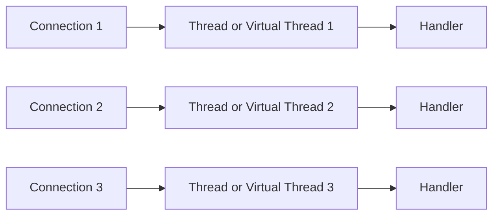
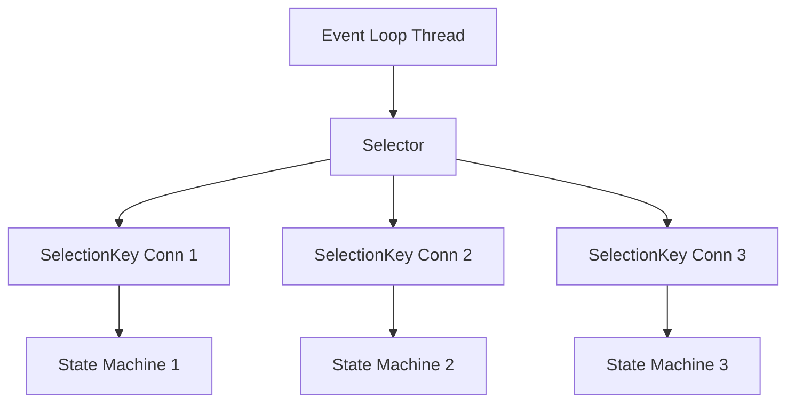
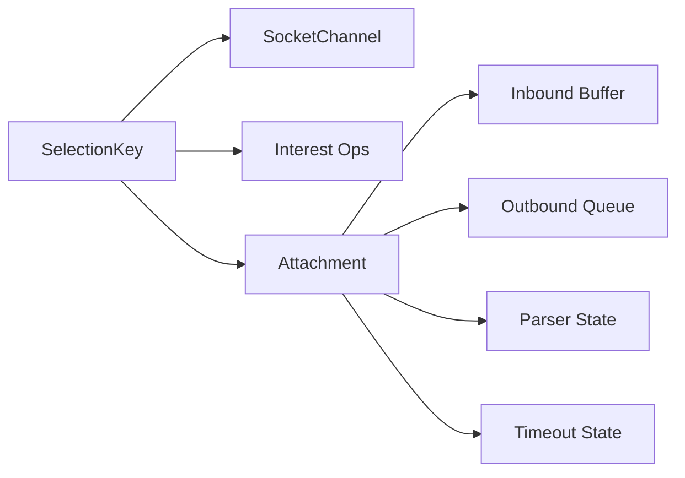
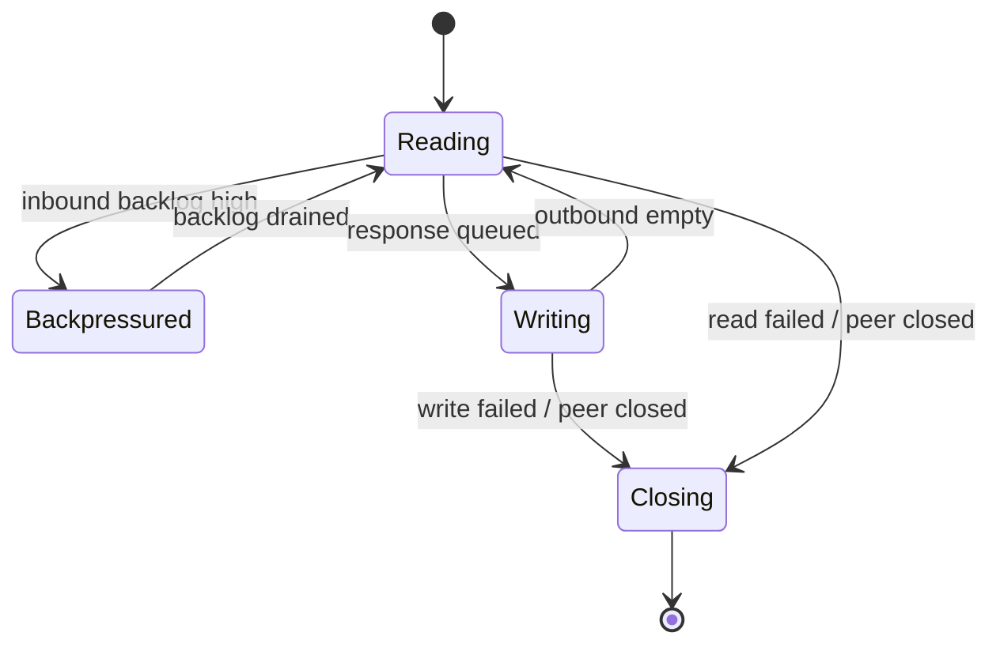
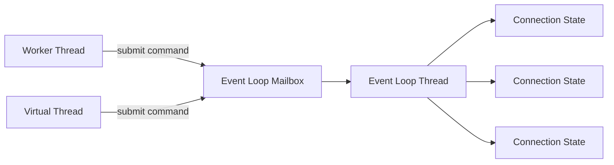
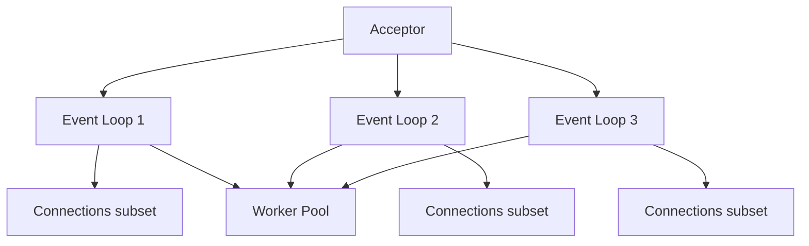
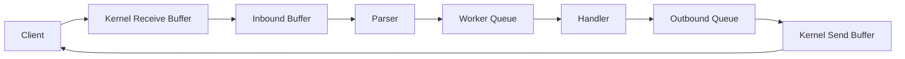
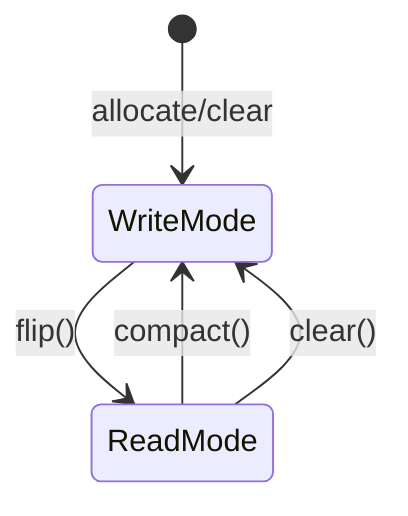

------
title: Learn Java Concurrency & Correctness - Part 031
description: Non-blocking IO, selector-based multiplexing, event-loop architecture, and how to keep asynchronous IO systems correct under load.
series: learn-java-concurrency-correctness
seriesTitle: Learn Java Concurrency & Correctness
order: 31
partTitle: Non-Blocking IO and Event Loop Model
tags:
- java
- concurrency
- correctness
- nio
- event-loop
- non-blocking-io
- backpressure
date: 2026-06-28
---

# Part 031 — Non-Blocking IO and Event Loop Model

> Goal: memahami **event loop** sebagai model koordinasi state machine, bukan sekadar teknik “pakai sedikit thread untuk banyak koneksi”.

Di part sebelumnya, kita sudah membahas `CompletableFuture`, virtual threads, structured concurrency, context propagation, dan reactive streams. Sekarang kita masuk ke model yang sering berada di bawah framework seperti Netty, Reactor Netty, Vert.x, gRPC async transport, Kafka client internals, database async drivers, dan HTTP clients modern: **non-blocking IO + event loop**.

Mental model yang salah:

> “Non-blocking IO artinya lebih cepat.”

Mental model yang benar:

> “Non-blocking IO memisahkan *readiness waiting* dari *application work*, lalu menjalankan banyak state machine kecil di sedikit thread. Ia bisa sangat scalable, tetapi correctness-nya bergantung pada disiplin: event loop tidak boleh diblokir, state per connection harus eksplisit, dan backpressure harus dipertahankan.”

Referensi dasar:
- Java NIO `java.nio.channels` mendefinisikan channels, selectors, dan multiplexed non-blocking IO.
- `Selector` memantau banyak selectable channels melalui `SelectionKey`.
- `AsynchronousSocketChannel` adalah model completion-style async socket channel, berbeda dari selector readiness-style.
- Virtual threads tidak menghapus kebutuhan memahami event loop pada framework/network stack yang memang berbasis non-blocking IO.

---

## 1. Kaufman Skill Slice

Untuk menguasai event-loop programming secara efisien, jangan mulai dari framework. Mulai dari skill kecil yang paling mahal jika salah.

| Skill | Pertanyaan yang harus bisa dijawab |
|---|---|
| Readiness vs completion | Apakah event berarti data sudah dipindahkan, atau hanya operasi mungkin dapat dicoba? |
| Loop invariant | Apa yang tidak boleh dilakukan di thread event loop? |
| Connection state machine | Di mana state parsing, buffering, pending write, timeout, dan close disimpan? |
| Partial IO | Apa yang terjadi jika `read()` hanya membaca sebagian frame atau `write()` hanya menulis sebagian buffer? |
| Backpressure | Kapan kita berhenti membaca, berhenti menerima request, atau menolak work? |
| Thread affinity | State apa yang hanya boleh disentuh oleh event-loop thread? |
| Offloading | Work apa yang harus dipindah ke worker pool atau virtual thread? |
| Cancellation/close | Apa urutan aman untuk cancel key, close channel, release buffer, dan complete future? |
| Observability | Metrik apa yang membuktikan event loop sehat? |

Dalam 20 jam, targetnya bukan menulis Netty baru. Target yang benar:

> Bisa membaca, men-debug, dan mereview desain event-loop/non-blocking IO dengan percaya diri.

Deliverable latihan:
1. Buat echo server NIO sederhana.
2. Tambahkan frame protocol length-prefixed.
3. Tambahkan bounded outbound queue.
4. Tambahkan timeout idle connection.
5. Tambahkan offload CPU-bound handler.
6. Ukur event loop latency dan queue depth.
7. Simulasikan slow client.
8. Simulasikan handler blocking.
9. Simulasikan partial read/write.
10. Buat checklist review production.

---

## 2. Blocking IO vs Non-Blocking IO

### 2.1 Blocking IO

Pada blocking IO tradisional:

```java
var line = reader.readLine(); // thread berhenti sampai data tersedia
```

Thread yang memanggil operasi akan berhenti sampai:
- data tersedia,
- koneksi ditutup,
- timeout terjadi,
- error muncul,
- thread diinterupsi, jika API mendukung.

Dengan virtual threads, blocking IO menjadi jauh lebih scalable dibanding platform thread tradisional karena virtual thread dapat unmount dari carrier thread saat blocking operation yang didukung JDK terjadi.

Namun blocking IO tetap model **thread-per-task**:



Correctness-nya relatif mudah:
- call stack merepresentasikan flow,
- `try/finally` mudah,
- local variables mudah,
- cancellation relatif jelas,
- timeout bisa diletakkan di boundary.

Trade-off:
- banyak task berarti banyak thread object,
- perlu resource limiter,
- blocking external dependency tetap harus diatur,
- context propagation harus benar.

### 2.2 Non-Blocking IO

Pada non-blocking IO:

```java
int n = channel.read(buffer); // return segera: bisa >0, 0, atau -1
```

Thread tidak menunggu data. Ia mencoba operasi. Jika belum bisa, ia lanjut mengurus channel lain.

Modelnya:



Correctness menjadi lebih sulit karena call stack bukan lagi workflow bisnis. Workflow tersebar ke state machine:
- partial read,
- partial parse,
- partial write,
- timeout,
- cancellation,
- retry,
- close,
- buffer lifecycle.

---

## 3. Readiness vs Completion

Ini distinction paling penting.

### 3.1 Readiness-style IO

Selector-style NIO adalah readiness-style.

Event `OP_READ` artinya:

> Channel kemungkinan dapat dibaca tanpa blocking.

Bukan berarti:
- seluruh message tersedia,
- frame lengkap,
- read pasti menghasilkan byte,
- tidak ada race dengan close,
- application-level request sudah siap.

Event `OP_WRITE` artinya:

> Channel kemungkinan dapat menerima beberapa byte.

Bukan berarti:
- seluruh response bisa ditulis,
- outbound queue aman tak terbatas,
- peer cepat,
- kernel send buffer tidak akan penuh lagi.

### 3.2 Completion-style IO

Completion-style API terlihat seperti:

```java
channel.read(buffer, attachment, new CompletionHandler<Integer, Attachment>() {
    @Override
    public void completed(Integer result, Attachment attachment) {
        // read selesai
    }

    @Override
    public void failed(Throwable exc, Attachment attachment) {
        // read gagal
    }
});
```

Event berarti operasi selesai, bukan hanya siap dicoba.

Java menyediakan `AsynchronousSocketChannel` untuk socket async completion-style.

### 3.3 Konsekuensi desain

| Aspek | Readiness-style | Completion-style |
|---|---|---|
| Event berarti | operasi mungkin bisa dicoba | operasi sudah selesai |
| State machine | eksplisit di loop | tersebar di callback/future |
| Partial IO | tetap wajib di-handle | tetap wajib di-handle |
| Risiko utama | busy loop, missed interest update | callback hell, lifecycle overlap |
| Contoh Java | `Selector`, `SocketChannel` non-blocking | `AsynchronousSocketChannel` |

Rule:

> Di readiness-style IO, event bukan “data sudah ada”. Event adalah “silakan coba operasi sekarang, lalu handle semua hasil yang legal”.

---

## 4. Anatomy of Selector-Based Event Loop

Minimal skeleton:

```java
try (Selector selector = Selector.open()) {
    ServerSocketChannel server = ServerSocketChannel.open();
    server.configureBlocking(false);
    server.bind(new InetSocketAddress(8080));
    server.register(selector, SelectionKey.OP_ACCEPT);

    while (running) {
        selector.select();

        Iterator<SelectionKey> iterator = selector.selectedKeys().iterator();
        while (iterator.hasNext()) {
            SelectionKey key = iterator.next();
            iterator.remove();

            if (!key.isValid()) {
                continue;
            }

            if (key.isAcceptable()) {
                accept(server, selector);
            } else {
                if (key.isReadable()) {
                    read(key);
                }
                if (key.isWritable()) {
                    write(key);
                }
            }
        }
    }
}
```

Skeleton ini menyembunyikan bagian sulit. Production event loop harus mengelola:
- key lifecycle,
- interest ops mutation,
- selected set cleanup,
- attachment state,
- partial IO,
- exceptions,
- close semantics,
- wakeup from another thread,
- pending tasks,
- timeout scan,
- outbound queue,
- fairness.

---

## 5. `SelectionKey` as Connection Handle

`SelectionKey` biasanya menjadi handle untuk connection state.

```java
final class ConnectionState {
    final SocketChannel channel;
    final ByteBuffer inbound = ByteBuffer.allocateDirect(8192);
    final Deque<ByteBuffer> outbound = new ArrayDeque<>();
    long lastReadNanos;
    long lastWriteNanos;
    boolean closing;
    Parser parser = new LengthPrefixedParser();

    ConnectionState(SocketChannel channel) {
        this.channel = channel;
    }
}
```

Register:

```java
SocketChannel channel = server.accept();
channel.configureBlocking(false);

SelectionKey key = channel.register(selector, SelectionKey.OP_READ);
key.attach(new ConnectionState(channel));
```

Mental model:



Invariant:

> Semua mutable state milik satu connection disentuh oleh satu event-loop thread, kecuali ada mailbox/task queue eksplisit untuk cross-thread handoff.

---

## 6. Interest Ops Are Backpressure Controls

Salah satu kesalahan paling umum adalah selalu mendaftarkan `OP_WRITE`.

Bad:

```java
key.interestOps(SelectionKey.OP_READ | SelectionKey.OP_WRITE);
```

Mengapa buruk? Karena socket sering “write-ready”. Jika `OP_WRITE` selalu aktif walaupun tidak ada data yang harus ditulis, event loop bisa spin terus.

Better:

```java
void enableWrite(SelectionKey key) {
    key.interestOps(key.interestOps() | SelectionKey.OP_WRITE);
}

void disableWrite(SelectionKey key) {
    key.interestOps(key.interestOps() & ~SelectionKey.OP_WRITE);
}
```

Rule:
- Enable `OP_WRITE` hanya jika outbound queue tidak kosong.
- Disable `OP_WRITE` segera setelah queue kosong.
- Disable `OP_READ` jika inbound/application backlog melewati batas.
- Re-enable `OP_READ` saat backlog turun.

Interest ops bukan sekadar flag. Ia adalah bagian dari flow control.



---

## 7. Partial Read Is Normal

Never assume one read equals one message.

```java
int n = channel.read(state.inbound);
if (n == -1) {
    close(key);
    return;
}
if (n == 0) {
    return;
}

state.inbound.flip();
while (state.parser.tryParse(state.inbound)) {
    Request request = state.parser.take();
    handleRequest(key, state, request);
}
state.inbound.compact();
```

Key points:
- `read()` may return 0.
- `read()` may return partial frame.
- `read()` may return multiple frames.
- `read()` may return -1 when peer closed.
- buffer `flip()` switches from writing to reading.
- buffer `compact()` preserves unconsumed bytes.

Wrong model:

> “Satu TCP packet sama dengan satu application message.”

Correct model:

> TCP is a byte stream. Framing is your responsibility.

### 7.1 Length-prefixed parser sketch

```java
final class LengthPrefixedParser {
    private Integer expectedLength;
    private ByteBuffer body;

    boolean tryParse(ByteBuffer in) {
        if (expectedLength == null) {
            if (in.remaining() < Integer.BYTES) {
                return false;
            }

            expectedLength = in.getInt();
            if (expectedLength < 0 || expectedLength > 1_048_576) {
                throw new ProtocolException("Invalid frame length: " + expectedLength);
            }

            body = ByteBuffer.allocate(expectedLength);
        }

        int toCopy = Math.min(in.remaining(), body.remaining());
        int oldLimit = in.limit();
        in.limit(in.position() + toCopy);
        body.put(in);
        in.limit(oldLimit);

        return !body.hasRemaining();
    }

    Request take() {
        if (body == null || body.hasRemaining()) {
            throw new IllegalStateException("No complete frame");
        }

        body.flip();
        Request request = decode(body);

        expectedLength = null;
        body = null;

        return request;
    }
}
```

Production concerns:
- max frame size,
- malformed length,
- memory allocation attack,
- slowloris,
- idle timeout,
- partial request timeout,
- decode cost offloading.

---

## 8. Partial Write Is Also Normal

Never assume one write sends entire response.

```java
void write(SelectionKey key) throws IOException {
    ConnectionState state = (ConnectionState) key.attachment();

    while (!state.outbound.isEmpty()) {
        ByteBuffer head = state.outbound.peek();
        int n = state.channel.write(head);

        if (n == 0) {
            break;
        }

        if (!head.hasRemaining()) {
            state.outbound.remove();
        }
    }

    if (state.outbound.isEmpty()) {
        disableWrite(key);

        if (state.closing) {
            close(key);
        }
    } else {
        enableWrite(key);
    }
}
```

Important:
- socket write can write fewer bytes than requested,
- write can return 0,
- outbound queue can grow if peer is slow,
- enabling `OP_WRITE` is necessary when there is pending data,
- closing must often wait until pending response is flushed.

### 8.1 Bounded outbound queue

Unbounded outbound queue is a memory leak under slow clients.

```java
final int MAX_PENDING_BYTES = 4 * 1024 * 1024;

void enqueueResponse(SelectionKey key, ConnectionState state, ByteBuffer response) {
    int newPending = state.pendingBytes + response.remaining();

    if (newPending > MAX_PENDING_BYTES) {
        failFastAndClose(key, "client too slow");
        return;
    }

    state.outbound.add(response);
    state.pendingBytes = newPending;
    enableWrite(key);
}
```

Design rule:

> Every queue in a concurrent system needs an owner, a capacity, a rejection policy, and metrics.

---

## 9. Event Loop Invariants

A production event loop must preserve invariants.

### 9.1 Never block the event loop

Do not do this inside event loop:
- blocking database call,
- blocking HTTP call,
- file IO that may block,
- `Thread.sleep`,
- `Future.get`,
- `CompletableFuture.join`,
- synchronized wait on external lock,
- long CPU-bound JSON/XML/protobuf processing,
- cryptography-heavy operation,
- compression,
- unbounded logging appenders,
- DNS lookup if blocking,
- class loading surprise during hot path.

Event-loop thread is shared infrastructure. Blocking it punishes unrelated connections.

### 9.2 Keep handlers short

Every callback should have a bounded cost.

Bad:

```java
void handleRequest(Request request) {
    validateHugePayload(request);
    callDatabase(request);
    generatePdf(request);
    writeResponse(request);
}
```

Better:

```java
void handleRequest(SelectionKey key, ConnectionState state, Request request) {
    WorkItem item = new WorkItem(key, request, Context.capture(state));

    workerPool.execute(() -> {
        Response response = service.handle(item.request());
        eventLoop.submit(() -> enqueueResponse(key, state, encode(response)));
    });
}
```

But this introduces cross-thread handoff. The event loop must provide a safe mailbox.

---

## 10. Cross-Thread Handoff and Wakeup

If worker thread wants event loop to mutate connection state, do not mutate state directly.

Bad:

```java
// worker thread
state.outbound.add(buffer);     // data race
key.interestOps(OP_WRITE);      // unsafe lifecycle race
```

Better:

```java
eventLoop.execute(() -> {
    if (!key.isValid()) {
        return;
    }

    ConnectionState state = (ConnectionState) key.attachment();
    state.outbound.add(buffer);
    enableWrite(key);
});
```

Event loop implementation sketch:

```java
final class EventLoop {
    private final Selector selector;
    private final Queue<Runnable> tasks = new ConcurrentLinkedQueue<>();

    void execute(Runnable task) {
        tasks.add(task);
        selector.wakeup();
    }

    void runLoop() throws IOException {
        while (running) {
            selector.select(computeSelectTimeoutMillis());
            runPendingTasks();
            processSelectedKeys();
            expireTimeouts();
        }
    }

    private void runPendingTasks() {
        Runnable task;
        while ((task = tasks.poll()) != null) {
            task.run();
        }
    }
}
```

`selector.wakeup()` penting ketika thread lain menambahkan task saat selector sedang blocked di `select()`.

### 10.1 Handoff invariant

> Cross-thread code may enqueue commands to the event loop, but only the event loop mutates connection state.

This is actor-like confinement.



---

## 11. Event Loop as Actor System

An event loop is not just a loop. It is a single-threaded actor runtime for many connection actors.

| Actor concept | Event loop equivalent |
|---|---|
| Actor mailbox | pending task queue |
| Actor state | connection attachment |
| Actor turn | callback execution |
| Actor supervision | close/error policy |
| Backpressure | bounded mailbox/outbound queue |
| Affinity | channel assigned to loop |
| Poison pill | close command |

This mental model helps prevent data races.

Instead of asking:

> “Is this collection thread-safe?”

Ask:

> “Who owns this state? Which thread is allowed to mutate it? Through what message protocol?”

---

## 12. Multi-Event-Loop Architecture

Single event loop is easy but limited. Production systems often use multiple event loops.



Rules:
- each connection belongs to exactly one event loop,
- connection state does not migrate casually,
- handoff between loops is message-based,
- shared worker pools must be bounded,
- acceptor must distribute fairly,
- per-loop metrics are mandatory.

### 12.1 Why per-loop metrics matter

Aggregate metrics hide imbalance.

Track:
- event loop task queue depth,
- selected key count,
- loop iteration duration,
- max callback duration,
- pending outbound bytes per loop,
- number of active channels per loop,
- slowest connection,
- timeout scan cost,
- rejected offloads,
- worker callback latency.

If one event loop is overloaded, p99 latency can explode even while average CPU looks fine.

---

## 13. Non-Blocking Does Not Mean Non-Blocking System

A non-blocking socket layer can still be blocked by:
- blocking handler,
- blocking logger,
- blocking metrics exporter,
- blocking DNS,
- blocking TLS handshake implementation path,
- synchronized lock contention,
- full queue,
- GC pause,
- CPU starvation,
- native call,
- kernel-level network congestion,
- cgroup CPU quota,
- OS file descriptor limit.

“Non-blocking” is a local property, not system-wide magic.

Production question:

> Which path can block this event loop for more than 1ms, 10ms, 100ms?

Create a table:

| Path | Blocks loop? | Bound? | Offloaded? | Observed? |
|---|---:|---:|---:|---:|
| Decode frame | Maybe | Max frame size | Optional | Timer |
| Auth token parse | Maybe | Token size | Optional | Timer |
| DB call | Yes | Timeout | Yes | Span |
| JSON serialize | Maybe | Response size | Maybe | Timer |
| Socket write | No/partial | Queue capacity | No | Pending bytes |
| Logging | Maybe | Async appender | Yes | Appender queue |

---

## 14. Event Loop and Backpressure

Backpressure exists at multiple layers.



Each layer needs a bound or policy.

### 14.1 Inbound backpressure

If worker queue is full, should event loop keep reading?

Usually no. Options:
1. Stop reading from that channel by clearing `OP_READ`.
2. Return protocol-level overload response.
3. Close connection.
4. Apply per-tenant quota.
5. Drop low-priority work if protocol allows.

Example:

```java
if (!workerQueue.offer(workItem)) {
    disableRead(key);
    enqueueResponse(key, state, overloadResponse());
    state.resumeReadWhenWorkerBacklogBelow = true;
}
```

### 14.2 Outbound backpressure

If peer is slow, outbound queue grows. Options:
1. Cap pending bytes.
2. Coalesce messages.
3. Drop non-critical messages.
4. Close slow connection.
5. Reduce upstream demand.

Example:

```java
if (state.pendingBytes > MAX_PENDING_BYTES) {
    closeWithReason(key, CloseReason.SLOW_CONSUMER);
}
```

### 14.3 Backpressure is a correctness issue

If queues are unbounded, the system does not merely become slow. It changes failure mode:
- memory exhaustion,
- long-tail latency,
- stale responses,
- retries amplify load,
- GC pressure,
- connection storms,
- unfair tenant impact.

Bounded queues are part of correctness.

---

## 15. Event Loop vs Virtual Threads

With modern Java, you should not assume event loop is always better.

### 15.1 Virtual thread model

```java
try (var executor = Executors.newVirtualThreadPerTaskExecutor()) {
    while (running) {
        Socket socket = serverSocket.accept();
        executor.submit(() -> handleConnection(socket));
    }
}
```

Advantages:
- sequential style,
- easier cancellation with `try/finally`,
- natural stack traces,
- easier context scoping,
- easier debugging,
- often good enough for many IO-bound services.

### 15.2 Event loop model

Advantages:
- precise control over IO multiplexing,
- fewer scheduler objects,
- excellent for protocol engines,
- natural integration with reactive streams,
- mature ecosystem in Netty-like frameworks,
- useful when millions of mostly-idle sockets matter.

### 15.3 Decision matrix

| Situation | Prefer virtual threads | Prefer event loop |
|---|---:|---:|
| Typical REST service with blocking DB | Yes | Rarely |
| Protocol engine / proxy / gateway | Maybe | Often |
| Millions of idle connections | Maybe | Often |
| Complex streaming backpressure | Maybe | Often |
| Sequential business workflow | Yes | Rarely |
| Existing Netty/Reactor stack | Maybe | Yes |
| Team has limited concurrency expertise | Yes | No |
| Need low-level network protocol control | No | Yes |
| Need simple debuggability | Yes | No |

The point is not ideology. The point is matching model to failure surface.

---

## 16. Blocking Contamination

The most dangerous event-loop bug is blocking contamination.

Example:

```java
void channelRead(Request request) {
    User user = userRepository.findById(request.userId()); // blocking DB call
    writeResponse(user);
}
```

Symptoms:
- p99 latency spikes,
- unrelated connections slow down,
- CPU not necessarily high,
- thread dump shows event loop in socket read, DB, file IO, lock, or logging,
- event loop pending tasks rise,
- timeout storm,
- retry amplification.

Mitigation:
- detect blocking calls in event-loop thread,
- name event-loop threads clearly,
- assert not-event-loop for blocking APIs,
- isolate blocking code to bounded worker/virtual-thread pool,
- cap worker queue,
- propagate deadline,
- return result via event-loop mailbox.

Example guard:

```java
final class BlockingGuard {
    static void assertNotEventLoopThread() {
        if (Thread.currentThread().getName().startsWith("io-loop-")) {
            throw new IllegalStateException("Blocking call on event loop thread");
        }
    }
}
```

---

## 17. Offloading Correctly

Offloading is not “just submit to executor”. It creates new queues and failure modes.

Bad offload:

```java
workerPool.execute(() -> {
    Response response = service.handle(request);
    state.outbound.add(encode(response)); // unsafe
});
```

Better offload:

```java
if (!workerPool.offer(() -> {
    Response response;

    try {
        response = service.handle(request);
    } catch (Throwable t) {
        response = Response.error(t);
    }

    eventLoop.execute(() -> {
        if (!key.isValid()) {
            return;
        }
        enqueueResponse(key, state, encode(response));
    });
})) {
    enqueueResponse(key, state, Response.overloaded());
}
```

Production offload needs:
- bounded worker queue,
- timeout/deadline,
- cancellation on close,
- context propagation,
- error mapping,
- result handoff,
- overload policy,
- metrics.

---

## 18. Correct Close Semantics

Closing a non-blocking channel is not trivial.

### 18.1 Close reasons

Use explicit close reasons:
- peer closed,
- protocol violation,
- idle timeout,
- read timeout,
- write timeout,
- outbound overflow,
- server shutdown,
- application cancellation,
- TLS failure,
- internal error.

### 18.2 Close protocol

```java
void close(SelectionKey key) {
    try {
        key.cancel();

        ConnectionState state = (ConnectionState) key.attachment();
        if (state != null) {
            releaseBuffers(state);
            failPendingRequests(state);
        }

        key.channel().close();
    } catch (IOException ignored) {
        // Log at debug or metric.
    }
}
```

Rules:
- cancel key,
- detach/release state,
- close channel,
- complete pending promises/futures,
- avoid double close hazards,
- make close idempotent.

```java
void closeOnce(SelectionKey key, CloseReason reason) {
    ConnectionState state = (ConnectionState) key.attachment();

    if (state == null || state.closed) {
        return;
    }

    state.closed = true;
    state.closeReason = reason;

    close(key);
}
```

### 18.3 Half-close

Some protocols care about half-close. TCP can receive FIN for one direction while still allowing writes. Many application protocols choose simpler semantics: peer close means full close.

State this explicitly.

---

## 19. Timeouts in Event Loop

Event-loop architecture must implement timeouts without blocking.

Common timeouts:
- accept timeout,
- connect timeout,
- idle timeout,
- read timeout,
- frame assembly timeout,
- request processing timeout,
- write drain timeout,
- shutdown drain timeout.

Simple scan:

```java
void expireTimeouts(long nowNanos) {
    for (SelectionKey key : selector.keys()) {
        if (!key.isValid()) {
            continue;
        }

        ConnectionState state = (ConnectionState) key.attachment();
        if (state == null) {
            continue;
        }

        if (nowNanos - state.lastReadNanos > IDLE_TIMEOUT_NANOS) {
            closeOnce(key, CloseReason.IDLE_TIMEOUT);
        }

        if (state.pendingBytes > 0 &&
            nowNanos - state.lastWriteProgressNanos > WRITE_TIMEOUT_NANOS) {
            closeOnce(key, CloseReason.WRITE_TIMEOUT);
        }
    }
}
```

For large systems, use timer wheel or priority queue.

Important:
- timeout checks must be bounded,
- timeout should close/fail pending operations,
- timeout reason must be observable,
- timeout should propagate upstream.

Part 032 covers this deeply.

---

## 20. Buffers and Memory Ownership

NIO code often fails due to buffer ownership ambiguity.

### 20.1 Buffer lifecycle

A `ByteBuffer` has:
- capacity,
- limit,
- position,
- mark.

Common transitions:



Rules:
- `flip()` before reading from buffer after writing into it,
- `compact()` when preserving unread bytes,
- `clear()` when discarding unread bytes,
- never share mutable buffer across threads without ownership protocol,
- prefer immutable/sliced response buffer if sharing,
- track direct memory usage.

### 20.2 Direct vs heap buffer

Direct buffers can reduce copying for native IO but are outside normal heap allocation visibility. They still count against process memory and can cause pressure.

Production rule:

> Direct buffer usage needs pooling or strict allocation discipline in hot paths.

Avoid allocating new buffers per read event in high-throughput loops.

---

## 21. Event Loop Error Taxonomy

Not all exceptions should crash the event loop.

| Error | Scope | Action |
|---|---|---|
| Malformed request | Connection | close or error response |
| IOException on read | Connection | close |
| Parser bug | Process/connection | log, close, alert |
| OutOfMemoryError | Process | fail fast / emergency handling |
| Rejected offload | Request/connection | overload response or close |
| Selector failure | Event loop | restart loop or fail process |
| Unexpected RuntimeException in handler | Connection/request | isolate, close, metric |

Top-level event loop must not die silently.

```java
while (running) {
    try {
        selector.select(timeout);
        runPendingTasks();
        processSelectedKeys();
    } catch (Throwable t) {
        log.error("Event loop failure", t);
        if (isFatal(t)) {
            throw t;
        }
    }
}
```

Be careful: catching `Throwable` without policy can hide fatal conditions. Use it only at supervision boundary.

---

## 22. Event Loop Fairness

A single connection must not monopolize the loop.

Risk patterns:
- while loop drains entire huge inbound buffer,
- writes unlimited outbound queue for one channel,
- processes unlimited pending tasks before selected keys,
- timeout scan over huge key set every iteration,
- one handler enqueues recursive tasks.

Fairness controls:
- max bytes read per turn,
- max frames decoded per turn,
- max bytes written per turn,
- max pending tasks per loop iteration,
- per-connection outbound cap,
- per-tenant quota.

Example:

```java
int frames = 0;
while (frames < MAX_FRAMES_PER_TURN && state.parser.tryParse(state.inbound)) {
    handleRequest(key, state, state.parser.take());
    frames++;
}

if (state.parser.hasCompleteFrame()) {
    eventLoop.execute(() -> continueParsing(key));
}
```

---

## 23. Observability for Event Loop Systems

Minimum metrics:

| Metric | Why it matters |
|---|---|
| Event loop iteration duration | Detect blocking/long callback |
| Pending task queue depth | Detect cross-thread backlog |
| Selected key count | Traffic/loop pressure |
| Active channels per loop | Imbalance |
| Read bytes / write bytes | Throughput |
| Read events / write events | Interest ops health |
| Pending outbound bytes | Slow consumers |
| Rejected offloads | Overload |
| Worker queue depth | Handler bottleneck |
| Connection close reason | Failure taxonomy |
| Idle/read/write timeout count | Network/client health |
| Max callback duration | Contamination detector |
| Selector wakeup count | Handoff behavior |

### 23.1 Event-loop latency probe

```java
final class EventLoopLagProbe {
    private final EventLoop loop;
    private volatile long lastLagNanos;

    void start() {
        scheduleNext(System.nanoTime());
    }

    private void scheduleNext(long expectedNanos) {
        loop.execute(() -> {
            long now = System.nanoTime();
            lastLagNanos = now - expectedNanos;

            long next = now + TimeUnit.MILLISECONDS.toNanos(10);
            scheduleAfter(10, TimeUnit.MILLISECONDS, () -> scheduleNext(next));
        });
    }
}
```

If lag increases, event loop is delayed by:
- long callback,
- too many tasks,
- OS scheduling,
- GC,
- CPU starvation,
- blocking contamination.

---

## 24. Debugging Playbook

### 24.1 Symptoms: high p99, low CPU

Likely:
- event loop blocked on external call,
- worker pool saturated,
- lock contention,
- slow consumer outbound queue,
- DNS/TLS/logging blocking,
- queue backpressure disabled.

Check:
- thread dump,
- event loop lag,
- pending tasks,
- outbound bytes,
- worker queue depth,
- close reasons,
- per-loop imbalance.

### 24.2 Symptoms: high CPU, low throughput

Likely:
- `OP_WRITE` always enabled,
- selector spin,
- busy retry on zero read/write,
- task recursion,
- parse loop never yields,
- logging storm,
- protocol error loop.

Check:
- write-ready event count,
- selected key count,
- empty write attempts,
- loop iteration count,
- CPU profiles.

### 24.3 Symptoms: memory growth

Likely:
- unbounded outbound queue,
- unbounded worker queue,
- frame allocation attack,
- direct buffer leak,
- pending futures not completed on close,
- connection state retained after cancel.

Check:
- pending bytes,
- queue sizes,
- heap histogram,
- direct memory,
- attachment lifecycle,
- close cleanup.

---

## 25. Design Review Checklist

Use this checklist before approving event-loop/non-blocking IO code.

### 25.1 Ownership

- [ ] Which thread owns connection state?
- [ ] Are cross-thread mutations impossible except through event-loop mailbox?
- [ ] Are buffers owned by exactly one component at a time?
- [ ] Is close idempotent?

### 25.2 Backpressure

- [ ] Is inbound backlog bounded?
- [ ] Is outbound pending byte count bounded?
- [ ] Is worker queue bounded?
- [ ] Is `OP_READ` disabled under pressure?
- [ ] Is `OP_WRITE` enabled only when there is pending data?
- [ ] Is overload behavior explicit?

### 25.3 Correctness

- [ ] Are partial reads handled?
- [ ] Are partial writes handled?
- [ ] Is application framing explicit?
- [ ] Are malformed frames rejected safely?
- [ ] Are timeouts applied per phase?
- [ ] Are pending operations failed on close?

### 25.4 Performance

- [ ] Are handlers bounded?
- [ ] Are blocking calls offloaded?
- [ ] Are large CPU tasks offloaded?
- [ ] Are buffer allocations controlled?
- [ ] Is fairness enforced per loop turn?
- [ ] Are per-loop metrics available?

### 25.5 Operations

- [ ] Can thread dumps identify event-loop threads?
- [ ] Are close reasons measured?
- [ ] Is event-loop lag measured?
- [ ] Are slow consumers visible?
- [ ] Are rejected offloads visible?
- [ ] Are timeouts reason-specific?

---

## 26. Anti-Patterns

### 26.1 Event loop as generic executor

Bad:

```java
eventLoop.execute(() -> expensiveReportGeneration());
```

Event loop is not a general-purpose executor.

### 26.2 Unbounded write buffer

Bad:

```java
state.outbound.add(response); // no capacity, no pending bytes
```

Slow clients become memory attacks.

### 26.3 Direct state mutation from worker

Bad:

```java
worker.submit(() -> state.parser.reset());
```

This destroys thread confinement.

### 26.4 Assuming read event equals request

Bad:

```java
int n = channel.read(buffer);
Request request = decode(buffer.array());
```

TCP has no message boundary.

### 26.5 Always enabling write interest

Bad:

```java
key.interestOps(OP_READ | OP_WRITE);
```

Can cause busy loop.

### 26.6 Blocking bridge without boundary

Bad:

```java
Response response = future.join(); // inside event loop
```

This can deadlock or stall the loop.

---

## 27. Mini Capstone: Protocol Engine Skeleton

A minimal production-shaped connection handler:

```java
final class ConnectionState {
    final SocketChannel channel;
    final ByteBuffer inbound = ByteBuffer.allocateDirect(8192);
    final Deque<ByteBuffer> outbound = new ArrayDeque<>();

    final LengthPrefixedParser parser = new LengthPrefixedParser();

    long pendingBytes;
    long lastReadNanos;
    long lastWriteProgressNanos;
    boolean closed;
    boolean readDisabledByBackpressure;
}

void onRead(SelectionKey key) {
    ConnectionState state = state(key);

    try {
        int totalRead = 0;

        while (totalRead < MAX_READ_BYTES_PER_TURN) {
            int n = state.channel.read(state.inbound);

            if (n == -1) {
                closeOnce(key, CloseReason.PEER_CLOSED);
                return;
            }

            if (n == 0) {
                break;
            }

            totalRead += n;
            state.lastReadNanos = System.nanoTime();
        }

        state.inbound.flip();

        int frames = 0;
        while (frames < MAX_FRAMES_PER_TURN && state.parser.tryParse(state.inbound)) {
            Request request = state.parser.take();

            if (!offloadRequest(key, state, request)) {
                disableRead(key);
                state.readDisabledByBackpressure = true;
                enqueueResponse(key, state, overloadResponse());
                break;
            }

            frames++;
        }

        state.inbound.compact();
    } catch (ProtocolException e) {
        enqueueResponse(key, state, badRequest(e));
        state.closed = true;
    } catch (IOException e) {
        closeOnce(key, CloseReason.IO_ERROR);
    } catch (Throwable t) {
        closeOnce(key, CloseReason.INTERNAL_ERROR);
        throw t;
    }
}

void onWrite(SelectionKey key) {
    ConnectionState state = state(key);

    try {
        int totalWritten = 0;

        while (!state.outbound.isEmpty() && totalWritten < MAX_WRITE_BYTES_PER_TURN) {
            ByteBuffer buffer = state.outbound.peek();
            int n = state.channel.write(buffer);

            if (n == 0) {
                break;
            }

            totalWritten += n;
            state.pendingBytes -= n;
            state.lastWriteProgressNanos = System.nanoTime();

            if (!buffer.hasRemaining()) {
                state.outbound.remove();
            }
        }

        if (state.outbound.isEmpty()) {
            disableWrite(key);

            if (state.closed) {
                closeOnce(key, CloseReason.FLUSHED_AND_CLOSED);
            }
        } else {
            enableWrite(key);
        }
    } catch (IOException e) {
        closeOnce(key, CloseReason.IO_ERROR);
    }
}
```

This is intentionally not a framework. It is a correctness map.

---

## 28. How This Connects to Reactive and Virtual Threads

Reactive Streams:
- `request(n)` is demand backpressure.
- event loop often drives network IO.
- blocking inside `map`/`flatMap` on event-loop scheduler is contamination.
- cancellation must close network demand/path.

Virtual threads:
- can simplify handler code,
- can replace many callback-heavy designs,
- still require resource caps,
- still rely on lower-level IO runtime,
- do not eliminate protocol framing/backpressure.

Structured concurrency:
- helps bound lifetime of offloaded subtasks,
- can propagate failure/deadline,
- but event loop state mutation still needs mailbox discipline.

Scoped values:
- useful for bounded context,
- but event loop callbacks need explicit binding boundaries,
- context must not leak across connections.

---

## 29. Practice Drill

Build a small NIO server with these stages:

### Drill 1 — Echo server

- Accept connection.
- Read bytes.
- Write same bytes back.
- Handle close.

### Drill 2 — Length-prefixed protocol

- 4-byte frame length.
- Max frame size.
- Partial frame.
- Multiple frames per read.

### Drill 3 — Slow client

- Client reads one byte per second.
- Server must cap pending outbound bytes.
- Server closes slow client with reason.

### Drill 4 — Blocking contamination

- Add `Thread.sleep(100)` inside event loop handler.
- Measure impact on unrelated connections.
- Move sleep to worker pool.
- Compare.

### Drill 5 — Worker saturation

- Use bounded worker queue.
- Under overload, disable read or return overload response.
- Measure queue depth.

### Drill 6 — Timeout

- Close idle connection.
- Close partial-frame timeout.
- Close write-stalled connection.

Expected learning:
- readiness is not completion,
- partial IO is normal,
- event loop must never block,
- queue bounds define survival,
- ownership discipline prevents data races.

---

## 30. Summary

Non-blocking IO is not “faster blocking IO”. It is a different correctness model.

Core invariants:

1. Event loop thread must not block.
2. Connection state must have a clear owner.
3. Cross-thread handoff must use mailbox/commands.
4. Readiness event means “try operation”, not “operation complete”.
5. Partial read/write is normal.
6. Interest ops are flow-control tools.
7. Queues must be bounded.
8. Slow clients are a correctness problem.
9. Close must be idempotent and complete pending work.
10. Observability must expose event-loop lag, queue depth, pending bytes, and close reasons.

In the next part, we will go deeper into a problem that cuts across every model we have learned: **timeouts, cancellation, and deadline propagation**.

---

## References

- Java SE 25 API — `java.nio.channels` package: https://docs.oracle.com/en/java/javase/25/docs/api/java.base/java/nio/channels/package-summary.html
- Java SE 25 API — `Selector`: https://docs.oracle.com/en/java/javase/25/docs/api/java.base/java/nio/channels/Selector.html
- Java SE 25 API — `SelectionKey`: https://docs.oracle.com/en/java/javase/25/docs/api/java.base/java/nio/channels/SelectionKey.html
- Java SE 25 API — `SocketChannel`: https://docs.oracle.com/en/java/javase/25/docs/api/java.base/java/nio/channels/SocketChannel.html
- Java SE 25 API — `AsynchronousSocketChannel`: https://docs.oracle.com/en/java/javase/25/docs/api/java.base/java/nio/channels/AsynchronousSocketChannel.html
- JEP 444 — Virtual Threads: https://openjdk.org/jeps/444
