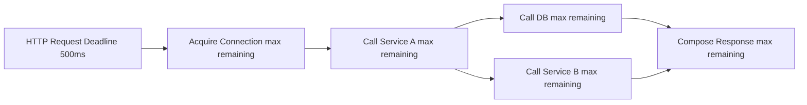
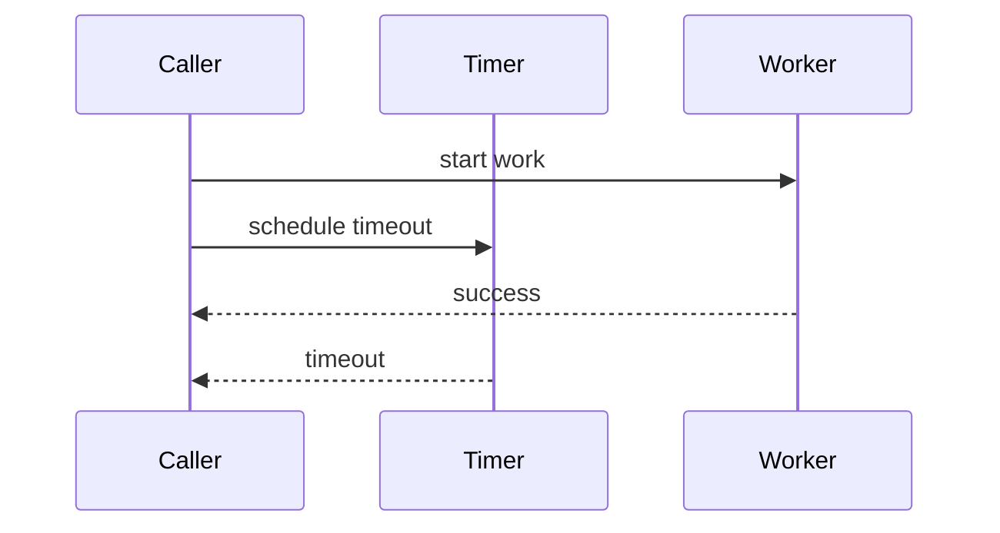
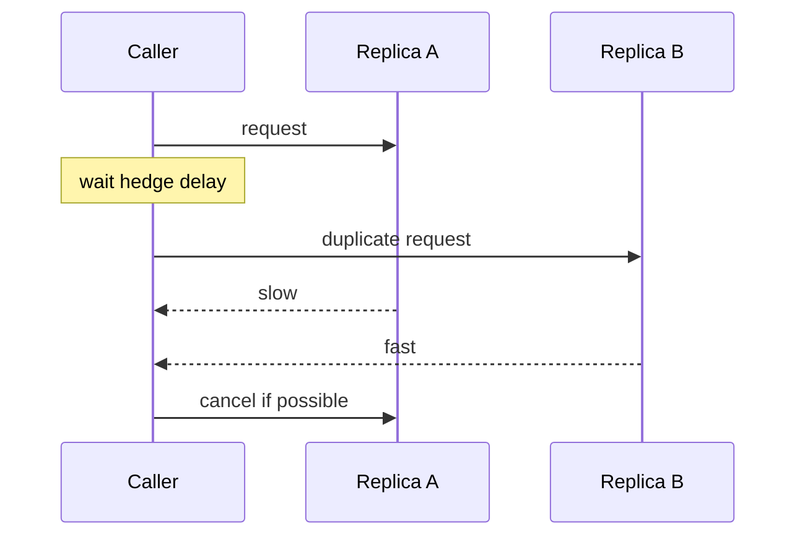

------
title: Learn Java Concurrency & Correctness - Part 032
description: Timeout hierarchy, cancellation semantics, deadline propagation, cleanup, idempotency, and failure containment across Java concurrency models.
series: learn-java-concurrency-correctness
seriesTitle: Learn Java Concurrency & Correctness
order: 32
partTitle: Timeouts, Cancellation, and Deadline Propation
tags:
- java
- concurrency
- correctness
- timeout
- cancellation
- deadline
- structured-concurrency
- virtual-threads
date: 2026-06-28
---

# Part 032 — Timeouts, Cancellation, and Deadline Propagation

> Goal: mampu mendesain operasi concurrent yang **tidak menggantung**, **bisa dihentikan**, **membersihkan resource**, dan **menghormati deadline end-to-end**.

Concurrency bug yang paling mahal sering bukan data race. Banyak incident production terjadi karena operasi **tidak pernah selesai**:

- thread menunggu external dependency tanpa timeout,
- future selesai setelah caller sudah menyerah,
- cancellation tidak menghentikan kerja,
- retry tetap berjalan setelah deadline habis,
- DB query masih jalan walau HTTP request sudah timeout,
- event loop menumpuk pending write untuk client yang pergi,
- structured subtasks gagal tetapi sibling tetap memakai resource,
- thread pool penuh oleh task yang sudah tidak relevan.

Mental model:

> Timeout menjawab “berapa lama caller bersedia menunggu”. Cancellation menjawab “bagaimana menghentikan kerja”. Deadline propagation menjawab “bagaimana seluruh subtree kerja tahu sisa waktu yang sama”.

Tanpa ketiganya, sistem hanya punya ilusi reliability.

---

## 1. Kaufman Skill Slice

Untuk menguasai timeout/cancellation secara efisien, pecah skill menjadi komponen kecil.

| Skill | Pertanyaan yang harus bisa dijawab |
|---|---|
| Timeout taxonomy | Timeout ini untuk acquire resource, connect, read, write, request, atau total deadline? |
| Cancellation semantics | Apakah cancellation hanya membatalkan waiting caller atau benar-benar menghentikan worker? |
| Interrupt handling | Apakah blocking call merespons interrupt? Apa yang terjadi jika tidak? |
| Deadline propagation | Apakah setiap nested call memakai sisa waktu dari parent? |
| Cleanup | Resource apa yang harus dilepas saat timeout/cancel/error? |
| Idempotency | Aman tidak jika operation selesai setelah caller timeout? |
| Race condition | Apa yang terjadi jika sukses dan timeout terjadi bersamaan? |
| Observability | Bisakah kita membedakan timeout karena queue, connect, read, handler, write, atau shutdown? |

Target 20 jam:

> Bisa membuat service method concurrent yang punya total deadline, membatalkan child work, membersihkan resource, dan menghasilkan error taxonomy yang bisa dioperasikan.

---

## 2. Timeout Is Not Cancellation

Timeout dan cancellation sering dicampur, padahal berbeda.

### 2.1 Timeout

Timeout adalah keputusan caller:

> “Saya tidak akan menunggu lebih lama dari X.”

Contoh:

```java
Result result = future.get(200, TimeUnit.MILLISECONDS);
```

Jika timeout terjadi, caller berhenti menunggu. Tetapi task di balik future belum tentu berhenti.

### 2.2 Cancellation

Cancellation adalah permintaan ke pekerjaan:

> “Berhentilah secepat dan seaman mungkin.”

Contoh:

```java
future.cancel(true);
```

Untuk `Future`, `cancel(true)` dapat mencoba interrupt jika task sedang berjalan, tetapi efektivitasnya tergantung task dan blocking API yang digunakan.

### 2.3 Deadline

Deadline adalah batas waktu absolut:

> “Seluruh operasi harus selesai sebelum waktu T.”

Contoh:

```java
Instant deadline = Instant.now().plusMillis(500);
```

Deadline lebih baik daripada timeout relatif ketika operasi punya banyak tahap.



Jika setiap layer memakai timeout fixed sendiri, total latency bisa meledak.

Bad:

```java
callA(timeout = 500ms);
callB(timeout = 500ms);
callC(timeout = 500ms);
// total could exceed 1500ms
```

Better:

```java
Deadline deadline = Deadline.after(Duration.ofMillis(500));

callA(deadline);
callB(deadline);
callC(deadline);
```

---

## 3. Timeout Taxonomy

Jangan hanya punya satu “timeout”.

| Timeout | Meaning | Failure signal |
|---|---|---|
| Queue timeout | Terlalu lama menunggu dieksekusi | overload/saturation |
| Acquire timeout | Terlalu lama menunggu permit/connection/lock | resource contention |
| Connect timeout | Terlalu lama membuat koneksi | network/dependency |
| TLS handshake timeout | Terlalu lama handshake | network/security/dependency |
| Read timeout | Tidak ada data/progress saat membaca | slow dependency |
| Write timeout | Tidak ada progress saat menulis | slow consumer/network |
| Request timeout | Satu call ke dependency terlalu lama | dependency latency |
| Total deadline | End-to-end operasi habis waktu | budget exhausted |
| Idle timeout | Koneksi tidak aktif terlalu lama | stale connection |
| Shutdown timeout | Terlalu lama drain saat stop | graceful shutdown fail |

Production requirement:

> Timeout error harus menyebut phase, bukan hanya “timeout”.

Bad:

```text
TimeoutException
```

Better:

```text
DB_READ_TIMEOUT after 180ms remainingDeadline=0ms dependency=customer-db
```

---

## 4. Deadline as First-Class Value

Buat abstraction kecil.

```java
public final class Deadline {
    private final long deadlineNanos;

    private Deadline(long deadlineNanos) {
        this.deadlineNanos = deadlineNanos;
    }

    public static Deadline after(Duration duration) {
        return new Deadline(System.nanoTime() + duration.toNanos());
    }

    public Duration remaining() {
        long remaining = deadlineNanos - System.nanoTime();
        return Duration.ofNanos(Math.max(0, remaining));
    }

    public long remainingNanos() {
        return Math.max(0, deadlineNanos - System.nanoTime());
    }

    public boolean expired() {
        return remainingNanos() == 0;
    }

    public void throwIfExpired() throws TimeoutException {
        if (expired()) {
            throw new TimeoutException("deadline expired");
        }
    }
}
```

Use `System.nanoTime()` for elapsed time measurement. Avoid wall-clock time for timeout measurement because wall clock can jump.

### 4.1 Pass deadline, not timeout

Prefer:

```java
Customer loadCustomer(CustomerId id, Deadline deadline)
```

Over:

```java
Customer loadCustomer(CustomerId id, Duration timeout)
```

Why?
- avoids multiplying timeout per layer,
- enables consistent end-to-end budget,
- simplifies logging,
- makes nested calls fair,
- supports fast-fail before starting expensive work.

---

## 5. Timeout Race: Success vs Timeout

Any timeout design has race conditions.



Possible outcomes:
1. success wins,
2. timeout wins,
3. cancellation wins,
4. failure wins,
5. close wins.

Correct design needs a single completion gate.

```java
final class Once<T> {
    private final AtomicBoolean completed = new AtomicBoolean();

    boolean completeSuccess(T value) {
        if (!completed.compareAndSet(false, true)) {
            return false;
        }
        // publish success
        return true;
    }

    boolean completeFailure(Throwable error) {
        if (!completed.compareAndSet(false, true)) {
            return false;
        }
        // publish failure
        return true;
    }
}
```

If late success arrives after timeout:
- release resources,
- do not write response to closed client,
- do not update state if request is no longer valid,
- log at debug/metric if useful,
- never double-complete future/promise.

---

## 6. Java `Future` Timeout and Cancellation

### 6.1 `get(timeout)`

```java
Future<Result> future = executor.submit(task);

try {
    return future.get(200, TimeUnit.MILLISECONDS);
} catch (TimeoutException e) {
    future.cancel(true);
    throw e;
}
```

Important:
- `get(timeout)` times out waiting caller.
- It does not automatically stop task.
- You usually need `cancel(true)` after timeout.
- `cancel(true)` is cooperative.
- Task should handle interruption.

### 6.2 Cooperative task

```java
final class SearchTask implements Callable<Result> {
    @Override
    public Result call() throws Exception {
        while (!Thread.currentThread().isInterrupted()) {
            Result partial = doSmallUnitOfWork();

            if (partial.complete()) {
                return partial;
            }
        }

        throw new CancellationException("interrupted");
    }
}
```

For blocking APIs, interruption depends on the API. Some blocking calls respond; some do not. Design wrappers that close underlying resources when necessary.

---

## 7. Interruption Policy

Interruption is not an exception type. It is a cancellation signal stored on the thread.

### 7.1 Correct handling

If you catch `InterruptedException`, either:
1. stop and propagate, or
2. restore interrupt status and return/throw.

Bad:

```java
try {
    queue.take();
} catch (InterruptedException e) {
    // ignored
}
```

Better:

```java
try {
    queue.take();
} catch (InterruptedException e) {
    Thread.currentThread().interrupt();
    throw new CancellationException("interrupted");
}
```

### 7.2 Layer policy

| Layer | Correct behavior |
|---|---|
| Low-level utility | restore interrupt and throw/return |
| Worker task | stop as soon as safe |
| Service boundary | map to cancellation/timeout error |
| Top-level server loop | do not accidentally kill shared infrastructure |
| Shutdown hook | interrupt and drain with deadline |

---

## 8. `CompletableFuture` Timeout

`CompletableFuture` provides timeout helpers:

```java
CompletableFuture<Result> cf =
    callAsync()
        .orTimeout(200, TimeUnit.MILLISECONDS);
```

Or fallback:

```java
CompletableFuture<Result> cf =
    callAsync()
        .completeOnTimeout(Result.fallback(), 200, TimeUnit.MILLISECONDS);
```

Important nuance:

> Timing out a `CompletableFuture` completion does not necessarily stop the underlying work.

Example:

```java
CompletableFuture<Result> cf = CompletableFuture.supplyAsync(() -> {
    return slowBlockingCall();
}, executor).orTimeout(100, TimeUnit.MILLISECONDS);
```

If timeout fires, the `CompletableFuture` completes exceptionally, but the supplier may still run unless you explicitly connect cancellation to the underlying operation.

### 8.1 Bridge cancellation explicitly

```java
final class CancellableCall<T> {
    private final CompletableFuture<T> future;
    private final Runnable cancelUnderlying;

    CancellableCall(CompletableFuture<T> future, Runnable cancelUnderlying) {
        this.future = future;
        this.cancelUnderlying = cancelUnderlying;
    }

    CompletableFuture<T> future() {
        return future;
    }

    void cancel() {
        cancelUnderlying.run();
        future.cancel(true);
    }
}
```

For HTTP clients, DB clients, or custom network operations, use their native cancellation/close API when available.

---

## 9. Structured Concurrency and Deadline

Structured concurrency gives a better lifecycle model:

```java
try (var scope = StructuredTaskScope.open(joiner, config)) {
    Subtask<Customer> customer = scope.fork(() -> loadCustomer(id, deadline));
    Subtask<Account> account = scope.fork(() -> loadAccount(id, deadline));

    Result result = scope.join();

    return combine(customer.get(), account.get());
}
```

Benefits:
- child tasks cannot outlive lexical scope,
- parent waits at join,
- failure policy can cancel siblings,
- timeout can be scope configuration,
- observability can group subtasks.

### 9.1 Structured cancellation invariant

> If parent operation is no longer useful, children should not continue consuming resources.

This is the opposite of ad hoc futures where subtasks can be orphaned.

### 9.2 Deadline inside subtasks

Even with structured scope timeout, still pass deadline into child operations. Scope timeout controls task lifetime. Dependency clients need their own timeout/cancel configuration.

```java
Customer loadCustomer(CustomerId id, Deadline deadline) throws Exception {
    deadline.throwIfExpired();

    Duration remaining = deadline.remaining();

    return customerClient
        .withRequestTimeout(remaining)
        .getCustomer(id);
}
```

---

## 10. Virtual Threads and Cancellation

Virtual threads make blocking style scalable, but not automatically cancellable.

Example:

```java
Thread vt = Thread.ofVirtual().start(() -> {
    service.handle(request);
});

vt.interrupt();
```

If the virtual thread is blocked in an interruptible operation, interruption can help. If it is blocked in a non-interruptible native call or external library that ignores interruption, it may not stop promptly.

### 10.1 Virtual thread deadline pattern

```java
Result handle(Request request, Deadline deadline) throws Exception {
    deadline.throwIfExpired();

    try (var executor = Executors.newVirtualThreadPerTaskExecutor()) {
        Future<A> a = executor.submit(() -> callA(deadline));
        Future<B> b = executor.submit(() -> callB(deadline));

        return combine(
            getWithinDeadline(a, deadline),
            getWithinDeadline(b, deadline)
        );
    }
}
```

Helper:

```java
static <T> T getWithinDeadline(Future<T> future, Deadline deadline)
        throws Exception {
    try {
        return future.get(deadline.remainingNanos(), TimeUnit.NANOSECONDS);
    } catch (TimeoutException e) {
        future.cancel(true);
        throw e;
    }
}
```

### 10.2 Still need resource timeouts

Thread interruption is not enough. Configure:
- socket connect timeout,
- socket read timeout,
- HTTP request timeout,
- DB query timeout,
- lock acquisition timeout,
- semaphore acquisition timeout,
- queue offer timeout,
- graceful shutdown timeout.

---

## 11. Cancellation in Event Loop Systems

Event loop cancellation usually means:
- remove/cancel pending command,
- close channel,
- cancel selection key,
- fail pending promises,
- remove timeout task,
- release buffers,
- stop reading/writing,
- notify upstream demand.

Example:

```java
void cancelRequest(RequestId id, CancelReason reason) {
    eventLoop.execute(() -> {
        PendingRequest pending = pendingRequests.remove(id);
        if (pending == null) {
            return;
        }

        pending.cancelled = true;
        pending.timeoutTask.cancel();
        pending.promise.completeExceptionally(new CancellationException(reason.name()));

        if (pending.closeConnectionOnCancel()) {
            closeOnce(pending.key(), CloseReason.REQUEST_CANCELLED);
        }
    });
}
```

Invariant:

> Cancellation must be serialized through the same owner that owns the state being cancelled.

---

## 12. Cancellation in Reactive Streams

Reactive Streams has explicit cancellation via `Subscription.cancel()`.

Mental model:
- `request(n)` increases demand,
- `onNext` consumes demand,
- `cancel` says downstream no longer wants signals,
- publisher should stop producing as soon as practical,
- after terminal signal or cancel, no further signals should be delivered.

### 12.1 Reactive timeout

```java
Mono<Result> result =
    remoteCall()
        .timeout(Duration.ofMillis(200));
```

Again, timeout operator must be connected to upstream cancellation. Mature reactive libraries usually propagate cancellation upstream, but bridge code must respect it.

### 12.2 Blocking bridge hazard

Bad:

```java
Mono.fromCallable(() -> blockingDbCall())
    .timeout(Duration.ofMillis(100));
```

If blocking call runs on a scheduler thread and does not respond to cancellation, timeout may only stop downstream waiting.

Better:
- run blocking code on bounded scheduler,
- configure DB query timeout,
- cancel native request if supported,
- cap concurrency,
- propagate deadline.

---

## 13. Lock Acquisition Timeouts

Not all waiting is IO. Lock waiting also needs policy.

### 13.1 Avoid unbounded lock wait in request path

Bad:

```java
lock.lock();
try {
    updateState();
} finally {
    lock.unlock();
}
```

This may be correct for short internal critical sections, but dangerous if lock can be held by slow path.

Better when request has deadline:

```java
if (!lock.tryLock(deadline.remainingNanos(), TimeUnit.NANOSECONDS)) {
    throw new TimeoutException("state lock acquisition timeout");
}

try {
    updateState();
} finally {
    lock.unlock();
}
```

### 13.2 Lock timeout is not always solution

If critical section is tiny and lock is local, timeout may add unnecessary complexity. Use timeout when:
- lock can be held across IO,
- lock protects high-contention aggregate,
- request path has strict SLO,
- deadlock detection/avoidance matters,
- shutdown must not hang.

Better solution often:
- reduce lock scope,
- split lock,
- use actor confinement,
- use immutable snapshot,
- use queue/serializer,
- remove blocking call inside lock.

---

## 14. Semaphore and Bulkhead Timeout

Bulkhead example:

```java
if (!permits.tryAcquire(deadline.remainingNanos(), TimeUnit.NANOSECONDS)) {
    throw new TimeoutException("bulkhead acquire timeout");
}

try {
    return callDependency(deadline);
} finally {
    permits.release();
}
```

Semantics:
- if permit unavailable before deadline, fail fast,
- release exactly once,
- do not hold permit after cancellation,
- distinguish acquire timeout from dependency timeout.

Failure taxonomy:
- `PAYMENT_BULKHEAD_TIMEOUT`
- `PAYMENT_CONNECT_TIMEOUT`
- `PAYMENT_READ_TIMEOUT`
- `PAYMENT_TOTAL_DEADLINE_EXCEEDED`

This tells operators where capacity is exhausted.

---

## 15. Queue Timeout

Queue waiting is often invisible.

Bad:

```java
executor.execute(task); // can queue indefinitely depending executor
```

Better:

```java
boolean accepted = workerQueue.offer(task, deadline.remainingNanos(), TimeUnit.NANOSECONDS);

if (!accepted) {
    throw new TimeoutException("worker queue timeout");
}
```

In `ThreadPoolExecutor`, submission to an internal queue does not usually support caller deadline directly. For strict deadline:
- use bounded queue and rejection policy,
- check deadline before task starts,
- wrap task with enqueue timestamp,
- reject stale tasks.

```java
record DeadlineTask(Deadline deadline, Runnable delegate) implements Runnable {
    @Override
    public void run() {
        if (deadline.expired()) {
            return;
        }
        delegate.run();
    }
}
```

Queue time must be measured separately from execution time.

---

## 16. Retrying Under Deadline

Retry without deadline is latency amplification.

Bad:

```java
for (int i = 0; i < 3; i++) {
    try {
        return call(timeout = 500ms);
    } catch (TimeoutException e) {
        // retry
    }
}
```

Total can exceed 1500ms plus backoff.

Better:

```java
for (int attempt = 1; attempt <= maxAttempts; attempt++) {
    deadline.throwIfExpired();

    try {
        return callDependency(deadline);
    } catch (TransientException e) {
        Duration sleep = backoff(attempt);

        if (deadline.remaining().compareTo(sleep) <= 0) {
            throw new TimeoutException("no budget for retry backoff");
        }

        sleepInterruptibly(sleep);
    }
}
```

Rules:
- retry only while deadline remains,
- cap per-attempt timeout by remaining budget,
- include jitter,
- do not retry non-idempotent operation unless idempotency key exists,
- cancel previous attempt before retrying,
- avoid retry storm during dependency outage.

---

## 17. Hedging Under Deadline

Hedging sends a duplicate request after delay to reduce tail latency.



Hedging can improve p99 but increases load.

Use only if:
- operation is idempotent,
- dependency can handle extra load,
- cancellation is supported,
- hedge delay is tuned,
- deadline is enforced,
- winner cancels losers,
- metrics track hedge rate.

Structured concurrency can model this cleanly with “first successful result wins” and sibling cancellation.

---

## 18. Idempotency and Late Completion

Timeout creates ambiguity:

> The caller timed out. Did the callee perform the action?

For read-only calls, late completion is usually harmless. For writes, it can be dangerous.

Examples:
- payment authorization,
- case enforcement action,
- email sending,
- document submission,
- account update,
- order placement.

Design requirements:
- idempotency key,
- operation id,
- deduplication store,
- status query,
- exactly-once illusion through at-least-once execution + idempotency,
- compensation workflow if needed.

Timeout should not mean “operation did not happen”. It means “caller did not observe completion before deadline”.

This distinction is critical in regulatory/case-management workflows.

---

## 19. Cleanup Patterns

Every operation should define cleanup for each exit path.

Exit paths:
- success,
- domain failure,
- technical failure,
- timeout,
- cancellation,
- interruption,
- shutdown,
- rejected execution,
- partial completion.

### 19.1 `try/finally`

```java
Permit permit = bulkhead.acquire(deadline);
try {
    return call();
} finally {
    permit.release();
}
```

### 19.2 Close on timeout

```java
try {
    return future.get(deadline.remainingNanos(), TimeUnit.NANOSECONDS);
} catch (TimeoutException e) {
    requestHandle.cancel();
    connection.close();
    throw e;
}
```

### 19.3 Complete pending promises

```java
void closeConnection(ConnectionState state, CloseReason reason) {
    for (PendingRequest pending : state.pendingRequests.values()) {
        pending.future.completeExceptionally(new IOException("closed: " + reason));
    }
    state.pendingRequests.clear();
}
```

### 19.4 Remove scheduled timeout

```java
TimeoutHandle timeout = scheduler.schedule(...);

future.whenComplete((value, error) -> timeout.cancel());
```

If you do not remove timeout tasks, you can create memory retention and late cancellation races.

---

## 20. Deadline Propagation Through Context

Explicit parameter is best:

```java
Result handle(Request request, Deadline deadline)
```

But context can help for cross-cutting infrastructure.

With `ScopedValue`:

```java
static final ScopedValue<Deadline> CURRENT_DEADLINE = ScopedValue.newInstance();

ScopedValue.where(CURRENT_DEADLINE, Deadline.after(Duration.ofMillis(500)))
    .run(() -> service.handle(request));
```

Inside:

```java
Deadline deadline = CURRENT_DEADLINE.get();
```

Use with discipline:
- deadline context must be immutable,
- binding must be bounded,
- do not hide business-relevant constraints too deeply,
- prefer explicit parameter for core domain/service APIs,
- use context for infrastructure integration where parameter threading is noisy.

---

## 21. Timeout Configuration Anti-Patterns

### 21.1 One global timeout

Bad:

```yaml
timeout: 30s
```

This hides phase differences.

### 21.2 Timeout longer than caller deadline

Bad:
- HTTP server timeout: 1s
- DB query timeout: 30s

DB keeps running after request is gone.

### 21.3 Infinite queue with finite request timeout

Bad:
- request times out at 500ms,
- task waits in executor queue for 5s,
- then runs anyway.

### 21.4 Retry timeout reset

Bad:
- every retry gets full timeout,
- parent deadline ignored.

### 21.5 Timeout without cleanup

Bad:
- caller gets timeout,
- socket/request/thread keeps running.

### 21.6 Catching timeout as generic failure

Bad:
- timeout mapped to 500 without phase,
- no metrics by cause,
- no cancellation.

---

## 22. Observability

Track timeout and cancellation as first-class signals.

Metrics:
- timeout count by phase,
- cancellation count by caller/deadline/shutdown/client disconnect,
- queue wait time,
- execution time,
- remaining deadline at dependency call,
- cancellation latency,
- late completion count,
- orphan work count,
- resource cleanup latency,
- retries attempted under deadline,
- permits held at cancellation,
- pending futures on close,
- dependency timeout vs total deadline.

Logs should include:
- correlation id,
- operation id,
- deadline remaining,
- phase,
- dependency,
- attempt,
- timeout configured,
- elapsed time,
- cancellation cause,
- cleanup result.

Trace spans:
- queue wait,
- acquire permit,
- connect,
- write request,
- wait response,
- read response,
- decode,
- handler,
- compose response.

---

## 23. Testing Timeout and Cancellation

### 23.1 Fake clock

Use fake clock where possible for deterministic timeout tests.

### 23.2 Controllable dependency

```java
final class ControllableClient {
    final CompletableFuture<Response> response = new CompletableFuture<>();

    CompletableFuture<Response> call() {
        return response;
    }
}
```

Test:
- timeout fires,
- future completes exceptionally,
- underlying call cancelled,
- cleanup executed,
- late success ignored.

### 23.3 Interrupt test

```java
@Test
void taskStopsOnInterrupt() throws Exception {
    Future<?> future = executor.submit(() -> service.longRunningTask());

    future.cancel(true);

    assertTrue(eventually(() -> service.stopped()));
}
```

### 23.4 Late completion race

Test both orderings:
1. success before timeout,
2. timeout before success,
3. timeout and success near-simultaneous.

Use `CountDownLatch` or barriers to control interleaving.

### 23.5 Queue timeout

Saturate worker queue and verify:
- request fails with queue timeout,
- task not executed after caller timeout,
- metrics increment,
- no resource leak.

---

## 24. Production Decision Matrix

| Problem | Best tool |
|---|---|
| One blocking call with caller wait limit | `Future.get(timeout)` + cancellation + resource timeout |
| Async composition timeout | `CompletableFuture.orTimeout` + underlying cancellation |
| Parent with child subtasks | Structured concurrency with scope timeout/deadline |
| Request-scoped budget | `Deadline` value propagated explicitly |
| Cross-cutting request deadline | `ScopedValue<Deadline>` with bounded scope |
| Lock wait under SLO | `tryLock(timeout)` |
| Resource bulkhead | `Semaphore.tryAcquire(timeout)` |
| Slow client in event loop | write timeout + pending byte cap + close |
| Reactive stream timeout | `timeout` operator + upstream cancellation |
| Blocking dependency | client-native timeout + cancellation/close |
| Retry policy | retry while deadline remains |
| Write operation with uncertain outcome | idempotency key + status query |

---

## 25. Review Checklist

### 25.1 Deadline

- [ ] Does the top-level request create a deadline?
- [ ] Is the same deadline propagated to nested calls?
- [ ] Are fixed per-layer timeouts avoided unless intentionally capped?
- [ ] Is remaining time checked before expensive work starts?
- [ ] Is deadline logged on failure?

### 25.2 Cancellation

- [ ] Does timeout trigger cancellation?
- [ ] Does cancellation stop underlying work, not only caller waiting?
- [ ] Are interrupts handled correctly?
- [ ] Are non-interruptible operations closed/cancelled through native handles?
- [ ] Are sibling tasks cancelled when parent fails?

### 25.3 Cleanup

- [ ] Are permits released exactly once?
- [ ] Are locks released in `finally`?
- [ ] Are sockets/channels closed on timeout?
- [ ] Are pending futures completed exceptionally on close?
- [ ] Are scheduled timeout tasks cancelled after success/failure?
- [ ] Are buffers/resources released?

### 25.4 Race safety

- [ ] Is completion single-winner?
- [ ] Are late successes ignored safely?
- [ ] Is late failure logged without double completion?
- [ ] Is close idempotent?
- [ ] Are callbacks serialized through correct owner?

### 25.5 Observability

- [ ] Are timeout phases distinguishable?
- [ ] Are cancellation reasons tracked?
- [ ] Is queue wait separate from execution time?
- [ ] Is cancellation latency measured?
- [ ] Are orphan/late completions visible?

---

## 26. Mini Playbook: End-to-End Deadline in a Service

```java
public Response handle(HttpRequest request) throws Exception {
    Deadline deadline = Deadline.after(Duration.ofMillis(500));

    return ScopedValue
        .where(RequestContext.DEADLINE, deadline)
        .call(() -> handleWithDeadline(request, deadline));
}

private Response handleWithDeadline(HttpRequest request, Deadline deadline)
        throws Exception {
    deadline.throwIfExpired();

    try (var scope = StructuredTaskScope.open(joiner, configWithTimeout(deadline))) {
        var customer = scope.fork(() -> customerClient.get(request.customerId(), deadline));
        var risk = scope.fork(() -> riskClient.evaluate(request.customerId(), deadline));

        var joined = scope.join();

        deadline.throwIfExpired();

        return compose(customer.get(), risk.get());
    } catch (TimeoutException e) {
        throw new ServiceTimeoutException("request deadline exceeded", e);
    }
}
```

Client call:

```java
Customer get(CustomerId id, Deadline deadline) throws Exception {
    deadline.throwIfExpired();

    Duration remaining = deadline.remaining();

    HttpRequest request = HttpRequest.newBuilder()
        .uri(uriFor(id))
        .timeout(remaining)
        .GET()
        .build();

    return httpClient
        .sendAsync(request, BodyHandlers.ofString())
        .orTimeout(remaining.toMillis(), TimeUnit.MILLISECONDS)
        .thenApply(this::decode)
        .get(remaining.toNanos(), TimeUnit.NANOSECONDS);
}
```

This example is simplified. In production, avoid duplicating timeout mechanisms blindly. The key is semantic alignment:
- top-level deadline,
- client-native timeout,
- async wait timeout,
- cancellation on failure,
- cleanup.

---

## 27. Regulatory/Case Management Angle

In enforcement lifecycle or case management systems, timeout design has a domain impact.

A timed-out operation may have:
- created an audit entry,
- sent a notification,
- reserved a case number,
- escalated a workflow,
- changed deadline state,
- locked an entity,
- produced an external side effect.

Therefore:
- never equate timeout with rollback,
- use operation IDs,
- record attempt status,
- make side effects idempotent,
- reconcile unknown outcomes,
- design compensation workflow,
- preserve audit defensibility.

A correct timeout outcome might be:

```text
status = UNKNOWN_REMOTE_OUTCOME
operationId = ENF-2026-000123
nextAction = RECONCILE_WITH_REMOTE_STATUS
```

Not:

```text
status = FAILED
```

This distinction is part of concurrency correctness at business-process level.

---

## 28. Common Failure Stories

### 28.1 Caller timeout, DB keeps running

Symptom:
- web request timeout at 1s,
- DB query continues for 30s,
- connection pool exhausted.

Fix:
- propagate deadline,
- set query timeout,
- cancel statement if supported,
- release connection,
- track DB timeout separately.

### 28.2 CompletableFuture timeout, supplier keeps running

Symptom:
- `orTimeout` errors quickly,
- executor remains busy,
- stale work completes later.

Fix:
- retain task handle,
- cancel underlying operation,
- bounded executor,
- stale task check.

### 28.3 Event loop write timeout missing

Symptom:
- slow clients accumulate pending responses,
- memory grows,
- GC pressure,
- p99 spike.

Fix:
- pending byte cap,
- write progress timestamp,
- write timeout,
- close slow clients.

### 28.4 Retry storm after dependency slowdown

Symptom:
- dependency slow,
- clients retry,
- upstream retries,
- load multiplies,
- recovery delayed.

Fix:
- deadline-aware retry,
- backoff with jitter,
- retry budget,
- circuit breaker/bulkhead,
- idempotency.

---

## 29. Practice Drill

### Drill 1 — Future timeout

Create a task that sleeps for 10s. Wait with 100ms timeout. Verify:
- caller times out,
- task receives interrupt,
- executor thread/virtual thread exits,
- cleanup runs.

### Drill 2 — CompletableFuture orphan

Create `supplyAsync` with long-running loop. Apply `orTimeout`. Observe that timeout alone does not necessarily stop work. Add explicit cancellation.

### Drill 3 — Deadline chain

Implement:
- controller deadline 500ms,
- service A,
- service B,
- repository.

Each layer must use remaining deadline, not fixed timeout.

### Drill 4 — Lock timeout

Simulate lock held by one task. Another task tries `tryLock(deadline)`. Verify timeout phase.

### Drill 5 — Event-loop slow client

Simulate client not reading response. Verify pending byte cap and write timeout.

### Drill 6 — Unknown side effect

Simulate external write that completes after caller timeout. Add idempotency key and reconciliation status.

---

## 30. Summary

Timeout/cancellation/deadline correctness is about bounding work.

Core rules:

1. Timeout is not cancellation.
2. Cancellation is cooperative unless the underlying resource is closed/cancelled.
3. Deadline is better than nested relative timeouts.
4. Always propagate remaining budget.
5. Configure native dependency timeouts.
6. Interrupt handling must preserve cancellation signal.
7. Use a single-winner completion gate.
8. Late completion must be safe.
9. Cleanup must run on every exit path.
10. Timeout phases must be observable.
11. Retrying must respect deadline.
12. Side-effecting operations need idempotency and unknown-outcome handling.

Next, we move from designing concurrency to proving it: **testing concurrent code**.

---

## References

- Java SE 25 API — `Future`: https://docs.oracle.com/en/java/javase/25/docs/api/java.base/java/util/concurrent/Future.html
- Java SE 25 API — `CompletableFuture`: https://docs.oracle.com/en/java/javase/25/docs/api/java.base/java/util/concurrent/CompletableFuture.html
- Java SE 25 API — `Thread`: https://docs.oracle.com/en/java/javase/25/docs/api/java.base/java/lang/Thread.html
- Java SE 25 API — `ReentrantLock`: https://docs.oracle.com/en/java/javase/25/docs/api/java.base/java/util/concurrent/locks/ReentrantLock.html
- Java SE 25 API — `Semaphore`: https://docs.oracle.com/en/java/javase/25/docs/api/java.base/java/util/concurrent/Semaphore.html
- Java SE 25 API — `StructuredTaskScope`: https://docs.oracle.com/en/java/javase/25/docs/api/java.base/java/util/concurrent/StructuredTaskScope.html
- Java SE 25 API — `StructuredTaskScope.Configuration`: https://docs.oracle.com/en/java/javase/25/docs/api/java.base/java/util/concurrent/StructuredTaskScope.Configuration.html
- Java SE 25 API — `ScopedValue`: https://docs.oracle.com/en/java/javase/25/docs/api/java.base/java/lang/ScopedValue.html
