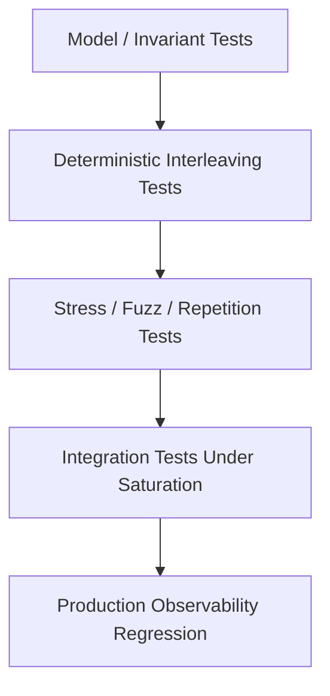

------
title: Learn Java Concurrency & Correctness - Part 033
description: Deterministic tests, stress tests, interleaving control, JCStress-style reasoning, race detection limits, and flakiness control for Java concurrent code.
series: learn-java-concurrency-correctness
seriesTitle: Learn Java Concurrency & Correctness
order: 33
partTitle: Testing Concurrent Code
tags:
- java
- concurrency
- correctness
- testing
- jcstress
- race-condition
- determinism
date: 2026-06-28
---

# Part 033 — Testing Concurrent Code

> Goal: mampu menguji concurrent code bukan hanya “semoga tidak flaky”, tetapi dengan strategi yang memisahkan **deterministic contract tests**, **interleaving tests**, **stress tests**, **timeout/cancellation tests**, dan **production regression tests**.

Testing concurrent code berbeda dari testing kode sequential. Sequential test biasanya membuktikan:

> Dengan input X, function menghasilkan output Y.

Concurrent test harus membuktikan hal yang lebih keras:

> Dalam semua interleaving yang relevan, invariant tetap benar, operasi tetap progress, resource tetap bersih, dan failure tidak berubah menjadi hidden corruption.

Kesalahan umum:

> “Saya sudah run test 100 kali, berarti thread-safe.”

Mental model yang benar:

> “Satu test run hanya mengeksplorasi satu atau sedikit interleaving. Testing concurrency harus sengaja memperbesar ruang interleaving, mengontrol koordinasi, menguji invariant, dan tetap mengakui batas observasi.”

OpenJDK `jcstress` mendeskripsikan dirinya sebagai harness eksperimental dan suite test untuk membantu riset correctness concurrency support di JVM, class libraries, dan hardware. Itu memberi arah penting: concurrency testing bukan sekadar unit test biasa; ia membutuhkan eksplorasi interleaving dan outcome classification.

---

## 1. Kaufman Skill Slice

Untuk belajar efektif, pecah testing concurrency ke lima skill kecil.

| Skill | Tujuan |
|---|---|
| Contract testing | Membuktikan API semantics di kondisi normal dan failure |
| Deterministic coordination | Mengatur urutan thread memakai latch/barrier/phaser |
| Invariant checking | Mengecek safety property setelah operasi concurrent |
| Stress testing | Mengeksplorasi banyak interleaving secara probabilistic |
| Forensic regression | Mengubah incident production menjadi test yang menjaga bug tidak balik |

Target 20 jam:

1. Bisa menulis test untuk lost update.
2. Bisa membuat dua thread start bersamaan.
3. Bisa memaksa interleaving tertentu.
4. Bisa menguji timeout/cancellation tanpa sleep rapuh.
5. Bisa membuat mini stress harness.
6. Bisa membaca hasil jcstress-style.
7. Bisa menulis test untuk thread leak/resource leak.
8. Bisa membuat regression test dari thread dump incident.

---

## 2. Testing Pyramid for Concurrent Code

Concurrency perlu pyramid berbeda.



### 2.1 Model / invariant tests

Tujuan:
- invariant domain benar,
- state transition valid,
- no impossible state,
- sequential reference model tersedia.

Contoh invariant:

```java
record Account(long balance) {
    Account debit(long amount) {
        if (amount > balance) {
            throw new InsufficientFundsException();
        }
        return new Account(balance - amount);
    }
}
```

Sebelum menguji concurrency, pastikan model sequential-nya benar.

### 2.2 Deterministic interleaving tests

Tujuan:
- memaksa urutan tertentu,
- membuktikan known race terjadi atau tidak terjadi,
- menguji timeout/cancellation deterministically.

### 2.3 Stress tests

Tujuan:
- menjalankan ribuan/jutaan operasi,
- memperbesar peluang interleaving berbahaya,
- mengumpulkan outcome,
- tidak menggantikan correctness proof.

### 2.4 Saturation integration tests

Tujuan:
- menguji thread pool penuh,
- queue penuh,
- slow dependency,
- slow client,
- cancellation storm,
- shutdown drain.

### 2.5 Production observability regression

Tujuan:
- memastikan metrik/log/trace yang diperlukan tersedia,
- thread names benar,
- JFR events/context cukup,
- stuck detector bekerja.

---

## 3. What Are We Proving?

Concurrent code harus diuji berdasarkan property.

### 3.1 Safety property

Safety berarti “hal buruk tidak pernah terjadi”.

Contoh:
- balance tidak negatif,
- counter tidak lost update,
- task tidak double-complete,
- resource permit tidak bocor,
- state machine tidak masuk state invalid,
- lock tidak dilepas oleh non-owner,
- response tidak dikirim dua kali,
- subscriber tidak menerima `onNext` setelah `onComplete`.

### 3.2 Liveness property

Liveness berarti “hal baik akhirnya terjadi”.

Contoh:
- task yang diterima akhirnya dieksekusi,
- cancellation akhirnya menghentikan worker,
- shutdown akhirnya selesai,
- waiter akhirnya dibangunkan,
- queue backlog akhirnya turun,
- no deadlock.

### 3.3 Performance/progress property

Progress bukan sekadar cepat. Ia tentang sistem tidak berhenti.

Contoh:
- p99 di bawah target saat queue penuh,
- event loop lag tidak melewati threshold,
- no unbounded queue growth,
- retry tidak memperbesar overload.

### 3.4 Resource property

Contoh:
- semua permit dilepas,
- connection ditutup,
- scheduled timeout dicancel,
- ThreadLocal dibersihkan,
- executor shutdown,
- no thread leak,
- no direct buffer leak.

---

## 4. Anti-Pattern: Sleep-Based Testing

Bad:

```java
@Test
void badConcurrentTest() throws Exception {
    service.startAsync();
    Thread.sleep(100);
    assertTrue(service.isStarted());
}
```

Masalah:
- terlalu pendek di CI lambat,
- terlalu panjang di laptop cepat,
- tidak membuktikan interleaving,
- flaky,
- memperlambat suite.

Better: gunakan event/condition.

```java
@Test
void startsEventually() {
    service.startAsync();

    await()
        .atMost(Duration.ofSeconds(1))
        .until(service::isStarted);
}
```

Atau tanpa library:

```java
static void eventually(BooleanSupplier condition, Duration timeout)
        throws InterruptedException {
    long deadline = System.nanoTime() + timeout.toNanos();

    while (System.nanoTime() < deadline) {
        if (condition.getAsBoolean()) {
            return;
        }

        Thread.sleep(10);
    }

    fail("condition did not become true within " + timeout);
}
```

Rule:

> `sleep` boleh dipakai sebagai polling interval kecil, bukan sebagai bukti bahwa operasi sudah selesai.

---

## 5. Deterministic Start with `CountDownLatch`

Untuk mengekspos race, thread harus mulai bersamaan.

```java
@Test
void lostUpdateAppears() throws Exception {
    UnsafeCounter counter = new UnsafeCounter();

    int threads = 8;
    int incrementsPerThread = 100_000;

    CountDownLatch ready = new CountDownLatch(threads);
    CountDownLatch start = new CountDownLatch(1);
    CountDownLatch done = new CountDownLatch(threads);

    for (int i = 0; i < threads; i++) {
        Thread.ofPlatform().start(() -> {
            ready.countDown();

            try {
                start.await();

                for (int j = 0; j < incrementsPerThread; j++) {
                    counter.increment();
                }
            } catch (InterruptedException e) {
                Thread.currentThread().interrupt();
            } finally {
                done.countDown();
            }
        });
    }

    assertTrue(ready.await(1, TimeUnit.SECONDS));
    start.countDown();
    assertTrue(done.await(5, TimeUnit.SECONDS));

    assertEquals(threads * incrementsPerThread, counter.value());
}
```

Jika `UnsafeCounter.increment()` adalah:

```java
void increment() {
    value++;
}
```

Test ini mungkin gagal, mungkin tidak. Itu tetap probabilistic, tetapi jauh lebih baik daripada thread start acak.

---

## 6. Coordinating a Specific Interleaving

Kadang kita ingin memaksa race.

Contoh bug check-then-act:

```java
final class Registry {
    private final Map<String, Session> sessions = new HashMap<>();

    Session getOrCreate(String id) {
        Session existing = sessions.get(id);
        if (existing != null) {
            return existing;
        }

        Session created = new Session(id);
        sessions.put(id, created);
        return created;
    }
}
```

Test dengan hook:

```java
final class HookedRegistry {
    private final Map<String, Session> sessions = new HashMap<>();
    private final Runnable afterMiss;

    HookedRegistry(Runnable afterMiss) {
        this.afterMiss = afterMiss;
    }

    Session getOrCreate(String id) {
        Session existing = sessions.get(id);
        if (existing != null) {
            return existing;
        }

        afterMiss.run();

        Session created = new Session(id);
        sessions.put(id, created);
        return created;
    }
}
```

Test:

```java
@Test
void duplicateCreateWhenBothThreadsMiss() throws Exception {
    CyclicBarrier bothMissed = new CyclicBarrier(2);

    HookedRegistry registry = new HookedRegistry(() -> {
        awaitBarrier(bothMissed);
    });

    Future<Session> a = executor.submit(() -> registry.getOrCreate("u1"));
    Future<Session> b = executor.submit(() -> registry.getOrCreate("u1"));

    Session s1 = a.get(1, TimeUnit.SECONDS);
    Session s2 = b.get(1, TimeUnit.SECONDS);

    assertSame(s1, s2);
}
```

Jika test gagal, solusi bukan “tambahkan sleep”. Solusinya memperjelas atomicity.

```java
Session getOrCreate(String id) {
    return sessions.computeIfAbsent(id, Session::new);
}
```

Atau lindungi dengan lock jika invariant lebih luas dari satu entry.

---

## 7. Barriers, Latches, Phasers: Testing Use Cases

| Tool | Cocok untuk test |
|---|---|
| `CountDownLatch` | one-shot start/done gate |
| `CyclicBarrier` | beberapa thread harus mencapai titik yang sama |
| `Phaser` | multi-phase test dengan jumlah participant dinamis |
| `Semaphore` | membatasi progress agar interleaving tertentu terjadi |
| `BlockingQueue` | handoff deterministik antar thread |
| `CompletableFuture` | controllable async dependency |
| `Exchanger` | dua thread bertukar signal/value |

### 7.1 `Phaser` for multi-step interleaving

```java
Phaser phaser = new Phaser(2);

Thread t1 = Thread.ofPlatform().start(() -> {
    service.step1();
    phaser.arriveAndAwaitAdvance();

    service.step2();
    phaser.arriveAndAwaitAdvance();

    service.step3();
});

Thread t2 = Thread.ofPlatform().start(() -> {
    observer.afterStep1();
    phaser.arriveAndAwaitAdvance();

    observer.afterStep2();
    phaser.arriveAndAwaitAdvance();
});
```

Gunakan phaser ketika test butuh beberapa phase, bukan hanya start gate.

---

## 8. Test Doubles for Concurrency

Concurrency-friendly test double harus controllable.

### 8.1 Controllable dependency

```java
final class ControllablePaymentClient implements PaymentClient {
    final CompletableFuture<PaymentResult> result = new CompletableFuture<>();
    final AtomicBoolean cancelled = new AtomicBoolean();

    @Override
    public CompletionStage<PaymentResult> charge(PaymentRequest request) {
        return result;
    }

    void succeed(PaymentResult value) {
        result.complete(value);
    }

    void fail(Throwable error) {
        result.completeExceptionally(error);
    }

    void cancel() {
        cancelled.set(true);
        result.cancel(true);
    }
}
```

### 8.2 Blocking dependency with release gate

```java
final class BlockingRepository {
    final CountDownLatch entered = new CountDownLatch(1);
    final CountDownLatch release = new CountDownLatch(1);

    Entity load(Id id) throws InterruptedException {
        entered.countDown();
        release.await();
        return new Entity(id);
    }
}
```

Test:
- service starts call,
- assert it is blocked,
- cancel request,
- release dependency,
- verify cleanup.

### 8.3 Slow consumer

```java
final class SlowConsumer {
    private final BlockingQueue<ByteBuffer> received = new ArrayBlockingQueue<>(1);

    void receive(ByteBuffer buffer) throws InterruptedException {
        received.put(buffer); // blocks when full
    }
}
```

Useful for backpressure tests.

---

## 9. Testing Atomicity

Atomicity tests should define expected invariant.

### 9.1 Counter example

Unsafe:

```java
final class UnsafeCounter {
    private int value;

    void increment() {
        value++;
    }

    int value() {
        return value;
    }
}
```

Safe:

```java
final class SafeCounter {
    private final AtomicInteger value = new AtomicInteger();

    void increment() {
        value.incrementAndGet();
    }

    int value() {
        return value.get();
    }
}
```

Test structure:
- many threads,
- simultaneous start,
- many operations,
- final value exact,
- repeat several times.

```java
@RepeatedTest(100)
void atomicCounterPreservesAllIncrements() throws Exception {
    SafeCounter counter = new SafeCounter();

    runConcurrently(8, () -> {
        for (int i = 0; i < 100_000; i++) {
            counter.increment();
        }
    });

    assertEquals(800_000, counter.value());
}
```

### 9.2 Compound invariant

More realistic:

```java
final class TransferBook {
    private final Map<AccountId, Long> balances = new HashMap<>();

    void transfer(AccountId from, AccountId to, long amount) {
        long fromBalance = balances.get(from);
        long toBalance = balances.get(to);

        if (fromBalance < amount) {
            throw new InsufficientFundsException();
        }

        balances.put(from, fromBalance - amount);
        balances.put(to, toBalance + amount);
    }

    long totalBalance() {
        return balances.values().stream().mapToLong(Long::longValue).sum();
    }
}
```

Invariant:

> Total balance must remain constant.

Test:

```java
@Test
void concurrentTransfersPreserveTotalBalance() throws Exception {
    TransferBook book = TransferBook.withAccounts(100, 1_000);

    long initialTotal = book.totalBalance();

    runConcurrently(16, () -> {
        for (int i = 0; i < 10_000; i++) {
            book.transfer(randomAccount(), randomAccount(), 1);
        }
    });

    assertEquals(initialTotal, book.totalBalance());
}
```

This catches broader corruption than checking one result.

---

## 10. Testing Visibility and Safe Publication

Visibility bugs are hard because they may appear only under optimization, CPU architecture, timing, and JIT behavior.

Bad publication:

```java
final class Holder {
    Config config;

    void reload() {
        config = new Config(Map.of("limit", "10"));
    }

    Config current() {
        return config;
    }
}
```

If `Config` is mutable or unsafely published, readers may see stale or inconsistent state.

Better:
- immutable config,
- `volatile` reference,
- safe publication through lock,
- `AtomicReference<Config>`.

Test pattern:
- writer repeatedly publishes new snapshot,
- readers check internal invariants,
- no partial/invalid state allowed.

```java
@Test
void readersNeverSeeInvalidConfig() throws Exception {
    AtomicBoolean stop = new AtomicBoolean();
    ConfigHolder holder = new ConfigHolder();

    Future<?> writer = executor.submit(() -> {
        int version = 0;
        while (!stop.get()) {
            holder.publish(Config.valid(version++));
        }
    });

    List<Future<?>> readers = IntStream.range(0, 8)
        .mapToObj(i -> executor.submit(() -> {
            while (!stop.get()) {
                Config c = holder.current();
                if (c != null) {
                    assertTrue(c.isInternallyConsistent());
                }
            }
        }))
        .toList();

    Thread.sleep(1_000);
    stop.set(true);

    writer.get();
    for (Future<?> reader : readers) {
        reader.get();
    }
}
```

This is stress-like, not proof. For low-level memory behavior, use jcstress-style litmus tests.

---

## 11. JCStress-Style Thinking

Even if you do not run jcstress daily, its mental model is valuable.

A jcstress-style test defines:
- shared state,
- actor 1 operation,
- actor 2 operation,
- arbiter observation,
- acceptable outcomes,
- forbidden outcomes.

Example litmus: visibility of non-volatile flag.

```java
// Pseudocode for teaching, not full jcstress syntax.
class FlagTest {
    int data;
    boolean ready;

    actor1() {
        data = 42;
        ready = true;
    }

    actor2(Result r) {
        if (ready) {
            r.value = data;
        }
    }
}
```

Potential outcome:
- `ready == true`, `data == 0` may be possible without happens-before.

The lesson:

> Test expected outcomes, not just one “correct-looking” result.

### 11.1 Outcome table

| Outcome | Meaning | Acceptability |
|---|---|---|
| `ready=false` | reader did not observe publish | acceptable |
| `ready=true,data=42` | reader observed full publish | acceptable |
| `ready=true,data=0` | observed flag without data visibility | forbidden for intended contract |

To fix, use `volatile ready`, lock, or safe publication.

---

## 12. Mini Stress Harness

A simple stress harness:

```java
final class Stress {
    static void repeat(int iterations, ThrowingRunnable test) throws Exception {
        for (int i = 0; i < iterations; i++) {
            try {
                test.run();
            } catch (Throwable t) {
                throw new AssertionError("failed at iteration " + i, t);
            }
        }
    }

    @FunctionalInterface
    interface ThrowingRunnable {
        void run() throws Exception;
    }
}
```

Usage:

```java
@Test
void stressGetOrCreate() throws Exception {
    Stress.repeat(10_000, () -> {
        Registry registry = new Registry();
        runConcurrently(2, () -> registry.getOrCreate("x"));

        assertEquals(1, registry.size());
    });
}
```

Add randomization:

```java
static void randomYield() {
    int n = ThreadLocalRandom.current().nextInt(4);

    if (n == 0) {
        Thread.yield();
    } else if (n == 1) {
        LockSupport.parkNanos(1);
    }
}
```

Use inside suspicious points in test-only hooks.

### 12.1 Beware false confidence

Stress tests are useful but limited:
- they do not explore all interleavings,
- they can pass for years before failing,
- they depend on CPU/JVM/options,
- they can be flaky if assertions depend on timing.

Use them as smoke detectors, not formal proof.

---

## 13. Linearizability Testing

For concurrent data structures or services, linearizability asks:

> Can concurrent operations be ordered as if each took effect atomically at some point between invocation and response?

You can test this by recording history.

```java
record Operation(
    String thread,
    String method,
    Object input,
    Object output,
    long startNanos,
    long endNanos
) {}
```

Example:
- `put(k, v)` starts at 10, ends at 20,
- `get(k)` starts at 15, ends at 25,
- `get` may legally see old or new value depending linearization.
- If `get` starts after `put` ends, it must see new value.

For business systems, use “observable consistency”:
- after case transition accepted, subsequent reads must show new state,
- after idempotency key accepted, retry must return same outcome,
- after cancellation accepted, no new side effect should start.

---

## 14. Testing Liveness

Liveness test should avoid infinite waiting.

Bad:

```java
done.await(); // can hang test suite forever
```

Better:

```java
assertTrue(done.await(1, TimeUnit.SECONDS), "operation did not complete");
```

### 14.1 Deadlock test

```java
@Test
void noDeadlockUnderOppositeTransferDirection() throws Exception {
    Future<?> a = executor.submit(() -> book.transfer(A, B, 10));
    Future<?> b = executor.submit(() -> book.transfer(B, A, 10));

    assertDoesNotThrow(() -> a.get(1, TimeUnit.SECONDS));
    assertDoesNotThrow(() -> b.get(1, TimeUnit.SECONDS));
}
```

But one run is weak. Repeat:

```java
@RepeatedTest(1000)
void noDeadlockRepeated() throws Exception {
    noDeadlockUnderOppositeTransferDirection();
}
```

Better design: enforce lock ordering and test lock-order function.

```java
List<AccountId> ordered = lockOrder(A, B);
assertEquals(ordered, ordered.stream().sorted().toList());
```

### 14.2 Starvation test

Starvation is harder. Test measurable fairness:
- every worker processes at least one item,
- no tenant waits longer than threshold under controlled load,
- queue age does not grow unbounded.

---

## 15. Testing Cancellation

Cancellation test must verify:
1. caller sees cancellation,
2. worker stops,
3. resource is cleaned,
4. late completion ignored,
5. no thread leak.

Example:

```java
@Test
void timeoutCancelsUnderlyingWork() throws Exception {
    BlockingRepository repo = new BlockingRepository();
    Service service = new Service(repo);

    CompletableFuture<Result> result = service.loadWithTimeout(Duration.ofMillis(50));

    assertTrue(repo.entered.await(1, TimeUnit.SECONDS));

    assertThrows(ExecutionException.class, result::get);

    assertTrue(repo.cancelled());
    assertEquals(0, service.activeOperations());
}
```

If underlying work is not interruptible, test resource close:

```java
assertTrue(repo.connectionClosed());
```

---

## 16. Testing Timeout Without Slow Tests

Do not actually wait seconds. Use:
- fake clock,
- scheduled executor abstraction,
- controllable timer,
- deadline passed as value,
- very small timeout only if deterministic.

### 16.1 Scheduler abstraction

```java
interface Scheduler {
    Cancellable schedule(Runnable task, Duration delay);
}
```

Test scheduler:

```java
final class ManualScheduler implements Scheduler {
    private final Queue<Runnable> tasks = new ArrayDeque<>();

    @Override
    public Cancellable schedule(Runnable task, Duration delay) {
        tasks.add(task);
        return () -> tasks.remove(task);
    }

    void runNext() {
        tasks.remove().run();
    }
}
```

Now timeout test:

```java
@Test
void timeoutCompletesOperationExceptionally() {
    ManualScheduler scheduler = new ManualScheduler();
    Operation op = new Operation(scheduler);

    CompletableFuture<Result> result = op.start();

    scheduler.runNext();

    assertTrue(result.isCompletedExceptionally());
}
```

No sleeping.

---

## 17. Testing Executor and Thread Pool Behavior

Execution engineering needs tests too.

### 17.1 Rejection

```java
@Test
void rejectsWhenQueueFull() {
    ThreadPoolExecutor executor = new ThreadPoolExecutor(
        1, 1,
        0L, TimeUnit.MILLISECONDS,
        new ArrayBlockingQueue<>(1),
        new ThreadPoolExecutor.AbortPolicy()
    );

    CountDownLatch block = new CountDownLatch(1);

    executor.execute(() -> await(block));
    executor.execute(() -> await(block));

    assertThrows(RejectedExecutionException.class,
        () -> executor.execute(() -> {}));

    block.countDown();
}
```

### 17.2 Shutdown

```java
@Test
void shutdownDrainsAcceptedTasks() throws Exception {
    TrackingExecutor executor = new TrackingExecutor(4);

    for (int i = 0; i < 100; i++) {
        executor.execute(() -> work());
    }

    executor.shutdown();

    assertTrue(executor.awaitTermination(1, TimeUnit.SECONDS));
    assertEquals(100, executor.completedCount());
}
```

### 17.3 Thread naming

```java
@Test
void threadNamesAreDiagnostic() throws Exception {
    ExecutorService executor = Executors.newFixedThreadPool(
        1,
        r -> new Thread(r, "case-worker-0")
    );

    Future<String> name = executor.submit(() -> Thread.currentThread().getName());

    assertTrue(name.get().startsWith("case-worker-"));
}
```

Thread names are not cosmetic. They are production forensics.

---

## 18. Testing Virtual Thread Code

Virtual threads encourage thread-per-task style. Tests should verify:
- no accidental platform thread pool bottleneck,
- resource limits are externalized,
- cancellation works,
- ThreadLocal usage does not leak,
- blocking code has native timeouts,
- task count does not imply resource count.

### 18.1 Do-not-pool virtual threads test

Bad design:

```java
ExecutorService limitedVirtualPool = Executors.newFixedThreadPool(100, Thread.ofVirtual().factory());
```

This defeats the thread-per-task model and creates confusing semantics. Prefer unbounded virtual thread creation plus bounded resources:

```java
ExecutorService executor = Executors.newVirtualThreadPerTaskExecutor();
Semaphore dbPermits = new Semaphore(50);
```

Test:

```java
@Test
void databaseConcurrencyIsLimitedBySemaphoreNotThreadPool() throws Exception {
    Semaphore permits = new Semaphore(2);
    AtomicInteger active = new AtomicInteger();
    AtomicInteger maxActive = new AtomicInteger();

    runVirtualTasks(100, () -> {
        permits.acquire();
        try {
            int now = active.incrementAndGet();
            maxActive.accumulateAndGet(now, Math::max);
            Thread.sleep(10);
        } finally {
            active.decrementAndGet();
            permits.release();
        }
    });

    assertEquals(2, maxActive.get());
}
```

### 18.2 ThreadLocal cleanup

```java
@Test
void threadLocalIsCleared() throws Exception {
    ThreadLocal<String> local = new ThreadLocal<>();

    try (var executor = Executors.newVirtualThreadPerTaskExecutor()) {
        executor.submit(() -> {
            local.set("request-1");
            local.remove();
        }).get();

        executor.submit(() -> {
            assertNull(local.get());
        }).get();
    }
}
```

Virtual threads reduce pool reuse leakage, but ThreadLocal can still retain data for the lifetime of that virtual thread and can be expensive at scale.

---

## 19. Testing Structured Concurrency

Structured concurrency tests should verify lifecycle:

- child success joined,
- child failure cancels siblings,
- parent does not return before children finish,
- timeout cancels unfinished children,
- resources close after scope,
- context inherited as intended.

Example with sibling cancellation:

```java
@Test
void failingChildCancelsSibling() throws Exception {
    AtomicBoolean siblingCancelled = new AtomicBoolean();

    assertThrows(Exception.class, () -> {
        try (var scope = StructuredTaskScope.open(joiner, config)) {
            scope.fork(() -> {
                throw new IllegalStateException("boom");
            });

            scope.fork(() -> {
                try {
                    Thread.sleep(Duration.ofSeconds(10));
                    return "too late";
                } catch (InterruptedException e) {
                    siblingCancelled.set(true);
                    Thread.currentThread().interrupt();
                    throw e;
                }
            });

            scope.join();
        }
    });

    assertTrue(siblingCancelled.get());
}
```

Exact API can vary by JDK preview state, so isolate structured concurrency usage behind a small adapter in production code if you are compiling across JDK versions.

---

## 20. Testing Reactive Streams

Reactive Streams tests should focus on protocol:

- `onSubscribe` exactly once,
- no `onNext` before demand,
- demand not exceeded,
- terminal signal once,
- no signal after terminal,
- cancellation stops upstream,
- errors propagate,
- backpressure works.

Minimal subscriber test double:

```java
final class RecordingSubscriber<T> implements Flow.Subscriber<T> {
    Flow.Subscription subscription;
    final List<T> items = new CopyOnWriteArrayList<>();
    final AtomicReference<Throwable> error = new AtomicReference<>();
    final CountDownLatch complete = new CountDownLatch(1);

    @Override
    public void onSubscribe(Flow.Subscription subscription) {
        this.subscription = subscription;
    }

    @Override
    public void onNext(T item) {
        items.add(item);
    }

    @Override
    public void onError(Throwable throwable) {
        error.set(throwable);
        complete.countDown();
    }

    @Override
    public void onComplete() {
        complete.countDown();
    }
}
```

Test demand:

```java
@Test
void publisherDoesNotEmitWithoutDemand() throws Exception {
    RecordingSubscriber<Integer> sub = new RecordingSubscriber<>();

    publisher.subscribe(sub);

    Thread.sleep(50);

    assertEquals(List.of(), sub.items);

    sub.subscription.request(1);

    await().untilAsserted(() -> assertEquals(1, sub.items.size()));
}
```

Prefer library-specific test tools when using Reactor/RxJava, but keep protocol mental model.

---

## 21. Testing Context Propagation

Context propagation bugs are common across executor, future, virtual thread, reactive, and event-loop boundaries.

### 21.1 Explicit context

```java
@Test
void requestContextPropagatesToAsyncTask() throws Exception {
    RequestContext ctx = new RequestContext("case-123");

    CompletableFuture<String> result = service.handle(ctx);

    assertEquals("case-123", result.get().correlationId());
}
```

### 21.2 ScopedValue

```java
@Test
void scopedValueAvailableOnlyInsideScope() throws Exception {
    ScopedValue<String> REQUEST_ID = ScopedValue.newInstance();

    ScopedValue.where(REQUEST_ID, "r1").run(() -> {
        assertEquals("r1", REQUEST_ID.get());
    });

    assertThrows(NoSuchElementException.class, REQUEST_ID::get);
}
```

### 21.3 ThreadLocal leakage

```java
@Test
void threadLocalDoesNotLeakBetweenExecutorTasks() throws Exception {
    ThreadLocal<String> local = new ThreadLocal<>();
    ExecutorService executor = Executors.newSingleThreadExecutor();

    executor.submit(() -> local.set("secret")).get();

    String leaked = executor.submit(local::get).get();

    assertNull(leaked);
}
```

This test will fail unless the first task removes the value or executor wrapper cleans up.

---

## 22. Testing Event Loop Code

Event-loop test principles:
- never rely on real network if unit-level is enough,
- expose mailbox execution,
- use fake channel where possible,
- test partial read/write,
- test slow consumer,
- test close idempotency,
- test state ownership.

### 22.1 Partial write test

```java
@Test
void partialWriteKeepsOpWriteEnabled() throws Exception {
    FakeSocketChannel channel = new FakeSocketChannel();
    channel.maxBytesPerWrite(2);

    ConnectionState state = new ConnectionState(channel);
    state.outbound.add(ByteBuffer.wrap(new byte[] {1, 2, 3, 4}));

    eventLoop.onWrite(keyFor(state));

    assertEquals(2, state.pendingBytes());
    assertTrue(keyFor(state).isWriteEnabled());
}
```

### 22.2 Slow consumer test

```java
@Test
void slowConsumerIsClosedWhenPendingBytesExceeded() {
    ConnectionState state = new ConnectionState(channel);
    state.maxPendingBytes = 1024;

    enqueueResponse(key, state, ByteBuffer.allocate(2048));

    assertTrue(state.closed());
    assertEquals(CloseReason.SLOW_CONSUMER, state.closeReason());
}
```

---

## 23. Testing Deadlock Detection

You can test that a known deadlock is detected using `ThreadMXBean`.

```java
ThreadMXBean bean = ManagementFactory.getThreadMXBean();

long[] deadlocked = bean.findDeadlockedThreads();

assertNull(deadlocked, "deadlocked threads: " + Arrays.toString(deadlocked));
```

Use this carefully:
- not as replacement for correct lock ordering,
- useful in integration/stress tests,
- run after workload,
- include thread dump on failure.

Example failure helper:

```java
static void assertNoDeadlocks() {
    ThreadMXBean bean = ManagementFactory.getThreadMXBean();
    long[] ids = bean.findDeadlockedThreads();

    if (ids != null && ids.length > 0) {
        ThreadInfo[] infos = bean.getThreadInfo(ids, true, true);
        fail(Arrays.stream(infos)
            .map(ThreadInfo::toString)
            .collect(Collectors.joining("\n")));
    }
}
```

---

## 24. Thread Leak Testing

Thread leaks are concurrency bugs.

```java
Set<String> before = threadNames();

service.start();
service.stop();

eventually(() -> {
    Set<String> after = threadNames();
    return after.stream().noneMatch(name -> name.startsWith("case-worker-"));
}, Duration.ofSeconds(2));
```

Better:
- track executors directly,
- expose `isTerminated`,
- ensure custom thread factories use names,
- avoid asserting exact global thread counts because JVM/test runner has background threads.

### 24.1 Executor leak test

```java
@Test
void executorTerminatesOnStop() throws Exception {
    service.start();
    service.stop();

    assertTrue(service.executor().awaitTermination(1, TimeUnit.SECONDS));
}
```

---

## 25. Resource Leak Testing

### 25.1 Permit leak

```java
@Test
void permitReleasedOnFailure() {
    Semaphore permits = new Semaphore(1);

    assertThrows(RuntimeException.class, () -> {
        service.withPermit(() -> {
            throw new RuntimeException("boom");
        });
    });

    assertEquals(1, permits.availablePermits());
}
```

### 25.2 Pending future leak

```java
@Test
void closeCompletesAllPendingRequests() {
    ConnectionState state = new ConnectionState(channel);
    CompletableFuture<Response> pending = state.registerPending("r1");

    state.close(CloseReason.CLIENT_CLOSED);

    assertTrue(pending.isCompletedExceptionally());
    assertEquals(0, state.pendingCount());
}
```

### 25.3 Timeout task leak

```java
@Test
void timeoutTaskCancelledAfterSuccess() {
    ManualScheduler scheduler = new ManualScheduler();

    Operation op = new Operation(scheduler);
    CompletableFuture<Result> result = op.start();

    result.complete(Result.ok());

    assertEquals(0, scheduler.pendingTaskCount());
}
```

---

## 26. Flakiness Control

Concurrent tests can become flaky. Some flakiness is test bug, not product bug.

### 26.1 Rules

- Avoid real sleeps as synchronization.
- Use timeouts on every wait.
- Make failure messages include state snapshots.
- Clean up executors in `finally`.
- Cancel futures after test failure.
- Avoid relying on exact scheduling order.
- Repeat stress tests separately from fast unit tests.
- Tag long-running stress tests.
- Use CI jobs with different CPU counts if possible.
- Capture thread dump on timeout.

### 26.2 Failure diagnostics

When a concurrency test times out, print:
- thread dump,
- executor queue size,
- active count,
- latch counts,
- pending operations,
- lock owner if available,
- current state machine state,
- remaining permits,
- virtual thread count if relevant.

Example:

```java
assertTrue(done.await(1, TimeUnit.SECONDS),
    () -> "timeout; state=" + service.snapshot()
        + "\nthreads=\n" + ThreadDump.capture());
```

---

## 27. Test Helper: `runConcurrently`

A reusable helper:

```java
static void runConcurrently(int threads, ThrowingRunnable action)
        throws Exception {
    ExecutorService executor = Executors.newFixedThreadPool(threads);
    CountDownLatch ready = new CountDownLatch(threads);
    CountDownLatch start = new CountDownLatch(1);

    List<Future<?>> futures = new ArrayList<>();

    try {
        for (int i = 0; i < threads; i++) {
            futures.add(executor.submit(() -> {
                ready.countDown();
                start.await();
                action.run();
                return null;
            }));
        }

        assertTrue(ready.await(1, TimeUnit.SECONDS));
        start.countDown();

        for (Future<?> future : futures) {
            future.get(5, TimeUnit.SECONDS);
        }
    } finally {
        executor.shutdownNow();
        assertTrue(executor.awaitTermination(1, TimeUnit.SECONDS));
    }
}

@FunctionalInterface
interface ThrowingRunnable {
    void run() throws Exception;
}
```

Virtual thread version:

```java
static void runVirtualTasks(int tasks, ThrowingRunnable action)
        throws Exception {
    try (ExecutorService executor = Executors.newVirtualThreadPerTaskExecutor()) {
        List<Future<?>> futures = new ArrayList<>();

        for (int i = 0; i < tasks; i++) {
            futures.add(executor.submit(() -> {
                action.run();
                return null;
            }));
        }

        for (Future<?> future : futures) {
            future.get(5, TimeUnit.SECONDS);
        }
    }
}
```

---

## 28. Production Regression from Incident

Suppose incident:
- p99 latency spike,
- thread dump shows event-loop thread blocked in `UserRepository.findById`,
- worker queue empty,
- event-loop pending tasks high.

Regression tests:
1. Guard test: repository cannot be called from event-loop thread.
2. Offload test: handler submits blocking work to bounded worker.
3. Backpressure test: worker queue full disables read/returns overload.
4. Observability test: event-loop lag metric increments.
5. Timeout test: handler respects request deadline.
6. Shutdown test: pending work cancelled.

Incident-derived tests are more valuable than generic coverage.

---

## 29. What Not to Test

Do not test the JDK itself unless you are writing low-level concurrent primitives.

Bad:
- testing that `ConcurrentHashMap` is thread-safe,
- testing that `AtomicInteger.incrementAndGet()` is atomic,
- testing that `Semaphore` releases permits correctly.

Test your usage:
- the mapping function has no illegal side effect,
- compound invariant is not split across multiple map operations,
- permit is released on every path,
- timeout/cancellation policy is correct.

---

## 30. Summary

Testing concurrent code means testing properties under interleaving.

Core rules:

1. Define safety, liveness, and resource invariants first.
2. Use deterministic coordination instead of sleeps.
3. Stress tests increase confidence but do not prove correctness.
4. Use jcstress-style outcome thinking for memory/interleaving issues.
5. Test timeout and cancellation as first-class behavior.
6. Test cleanup on every exit path.
7. Test thread/context/resource leaks.
8. Capture thread dump and state snapshot on failure.
9. Convert production incidents into regression tests.
10. Do not test JDK primitives; test your composition and invariants.

Next: once code is in production, tests are not enough. We need observability, debugging, and forensic workflows.

---

## References

- OpenJDK Code Tools — jcstress: https://openjdk.org/projects/code-tools/jcstress/
- Java SE 25 API — `CountDownLatch`: https://docs.oracle.com/en/java/javase/25/docs/api/java.base/java/util/concurrent/CountDownLatch.html
- Java SE 25 API — `CyclicBarrier`: https://docs.oracle.com/en/java/javase/25/docs/api/java.base/java/util/concurrent/CyclicBarrier.html
- Java SE 25 API — `Phaser`: https://docs.oracle.com/en/java/javase/25/docs/api/java.base/java/util/concurrent/Phaser.html
- Java SE 25 API — `Future`: https://docs.oracle.com/en/java/javase/25/docs/api/java.base/java/util/concurrent/Future.html
- Java SE 25 API — `CompletableFuture`: https://docs.oracle.com/en/java/javase/25/docs/api/java.base/java/util/concurrent/CompletableFuture.html
- Java SE 25 API — `ThreadMXBean`: https://docs.oracle.com/en/java/javase/25/docs/api/java.management/java/lang/management/ThreadMXBean.html
- Java SE 25 API — `Flow`: https://docs.oracle.com/en/java/javase/25/docs/api/java.base/java/util/concurrent/Flow.html
