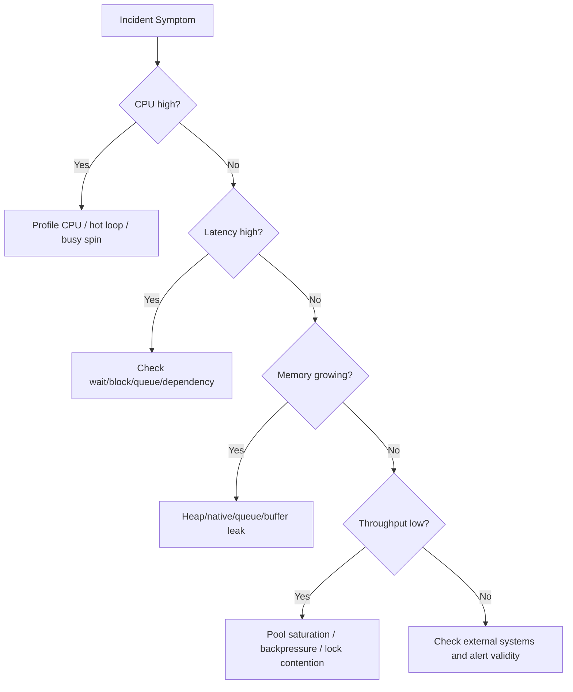
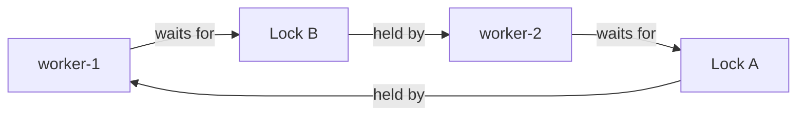
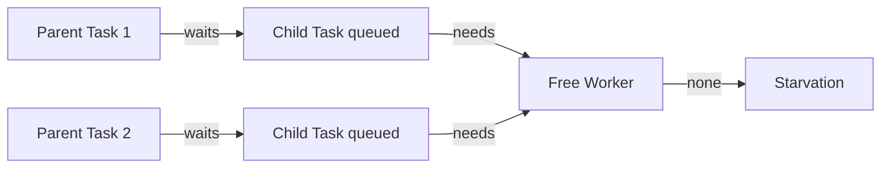
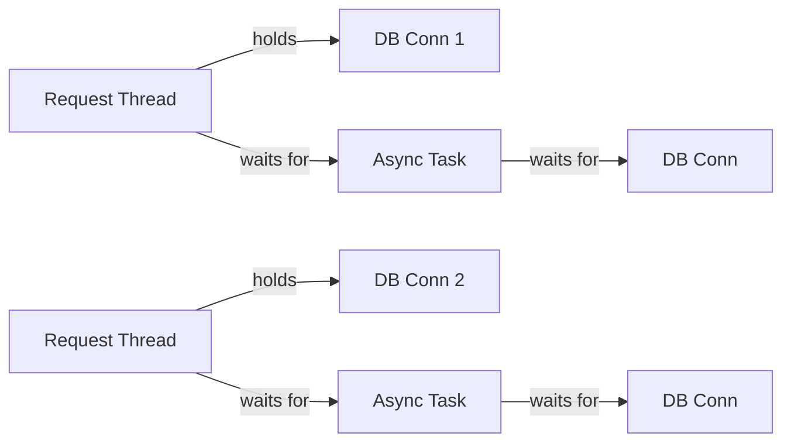
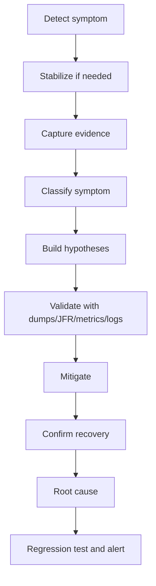
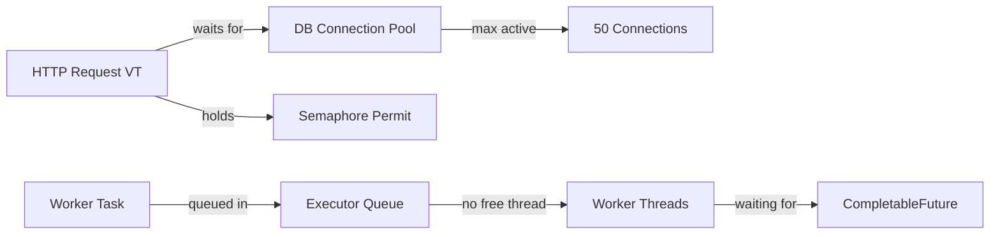
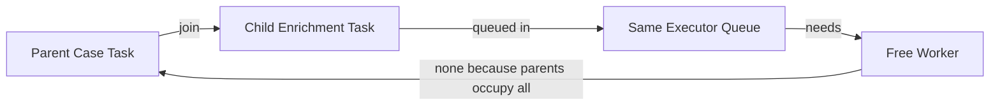

------
title: Learn Java Concurrency & Correctness - Part 034
description: Thread dumps, virtual thread diagnostics, JFR, jcmd, async profiling, blocked-thread analysis, and production incident forensics for Java concurrent systems.
series: learn-java-concurrency-correctness
seriesTitle: Learn Java Concurrency & Correctness
order: 34
partTitle: Observability, Debugging, and Forensics
tags:
- java
- concurrency
- correctness
- observability
- debugging
- jfr
- thread-dump
- production
date: 2026-06-28
---

# Part 034 — Observability, Debugging, and Forensics

> Goal: mampu mendiagnosis concurrency incident di production dengan alur sistematis: **symptom → signal → hypothesis → evidence → mitigation → regression**.

Testing membantu mencegah bug. Observability membantu ketika bug tetap lolos.

Concurrency incident biasanya terlihat sebagai:
- latency spike,
- throughput collapse,
- CPU tinggi,
- CPU rendah tetapi latency tinggi,
- thread pool penuh,
- queue backlog,
- deadlock,
- livelock,
- starvation,
- request timeout storm,
- memory growth,
- stuck shutdown,
- event-loop blocked,
- virtual thread count sangat besar,
- connection pool exhausted,
- lock contention.

Mental model:

> Concurrency forensics adalah rekonstruksi “siapa menunggu siapa, resource apa yang penuh, invariant apa yang rusak, dan work mana yang tidak lagi punya owner”.

---

## 1. Kaufman Skill Slice

Skill observability concurrency bisa dipecah menjadi:

| Skill | Pertanyaan |
|---|---|
| Symptom classification | Apakah ini CPU, lock, IO, queue, GC, event-loop, atau dependency? |
| Thread dump reading | Thread mana blocked, waiting, runnable, atau timed waiting? |
| Wait-for graph | Siapa menunggu lock/permit/future/connection milik siapa? |
| JFR analysis | Event mana menunjukkan blocking, lock contention, allocation, IO, atau virtual thread issue? |
| Metrics correlation | Queue, pool, latency, timeout, CPU, GC, dan dependency mana yang bergerak bersama? |
| Production-safe capture | Command apa aman dijalankan, kapan, dan berapa overhead-nya? |
| Incident narrative | Bagaimana membuat timeline faktual tanpa menebak? |
| Regression conversion | Bagaimana incident menjadi test/checklist/alert? |

Target 20 jam:
1. Bisa mengambil thread dump dengan `jcmd`.
2. Bisa membaca deadlock/blocked/waiting.
3. Bisa membedakan starvation vs deadlock.
4. Bisa menjalankan JFR recording pendek.
5. Bisa menganalisis lock contention dan event-loop blocking.
6. Bisa membuat metrics minimal untuk executor/queue.
7. Bisa menulis incident timeline.
8. Bisa mengubah incident menjadi regression test.

---

## 2. First Rule: Preserve Evidence

Saat incident, jangan langsung restart jika masih ada ruang untuk capture.

Capture minimum:
1. timestamp absolut,
2. service version/commit,
3. pod/host/container id,
4. JVM flags,
5. thread dump 2–3 kali dengan jarak beberapa detik,
6. JFR recording jika aman,
7. metrics window sebelum/saat/sesudah,
8. logs dengan correlation id,
9. heap/native memory summary jika memory symptom,
10. dependency metrics.

Mengapa beberapa thread dump? Satu dump hanya snapshot. Tiga dump menunjukkan movement:
- thread stuck di stack sama,
- thread bergerak tapi lambat,
- lock owner berubah,
- queue worker tidak progress,
- event loop tetap di blocking call.

---

## 3. Symptom Classifier

Mulai dari classifier, bukan opini.



### 3.1 CPU high

Likely:
- busy spin,
- always-enabled `OP_WRITE`,
- tight retry loop,
- serialization/compression hot path,
- excessive context switching,
- lock contention with spin,
- GC overhead,
- logging storm.

### 3.2 CPU low, latency high

Likely:
- waiting on dependency,
- connection pool exhausted,
- thread pool exhausted,
- lock deadlock,
- semaphore starvation,
- event-loop blocked,
- queue backlog,
- slow consumer.

### 3.3 Memory growth

Likely:
- unbounded queue,
- pending futures retained,
- ThreadLocal retention,
- direct buffer growth,
- virtual threads blocked with retained stacks,
- slow clients accumulating outbound buffers,
- scheduled timeout task leak.

---

## 4. Thread Dump Basics

A thread dump answers:

- thread name,
- thread state,
- stack trace,
- lock held,
- lock waited on,
- parking blocker,
- deadlock info,
- sometimes ownable synchronizers.

Common states:
- `RUNNABLE`,
- `BLOCKED`,
- `WAITING`,
- `TIMED_WAITING`,
- `TERMINATED`.

Interpretation nuance:

| State | Meaning | Common cause |
|---|---|---|
| `RUNNABLE` | runnable or in native call | CPU work, socket read native, busy loop |
| `BLOCKED` | waiting to enter monitor | `synchronized` contention |
| `WAITING` | waiting indefinitely | `LockSupport.park`, `Object.wait`, `Future.get` |
| `TIMED_WAITING` | waiting with timeout | sleep, timed poll, timed park |
| many idle workers | maybe normal | depends queue/pool |
| many blocked virtual threads | maybe okay until resource saturated | check resource owner |

Do not equate `RUNNABLE` with consuming CPU. A thread in native socket read may appear runnable depending JVM/OS representation.

---

## 5. Capturing Thread Dumps

Common command:

```bash
jcmd <pid> Thread.print -l
```

`-l` includes additional ownable synchronizer information.

For virtual-thread-heavy applications, prefer dump-to-file:

```bash
jcmd <pid> Thread.dump_to_file -format=text /tmp/threads.txt
jcmd <pid> Thread.dump_to_file -format=json /tmp/threads.json
```

The `jcmd` man page for JDK 25 lists `Thread.dump_to_file` as a diagnostic command that dumps threads with stack traces to a file in text or JSON format.

### 5.1 Capture sequence

```bash
date -Is
jcmd <pid> Thread.print -l > /tmp/tdump-1.txt
sleep 5
date -Is
jcmd <pid> Thread.print -l > /tmp/tdump-2.txt
sleep 5
date -Is
jcmd <pid> Thread.print -l > /tmp/tdump-3.txt
```

Analyze:
- same threads stuck at same stack?
- lock owner changes?
- queue workers progress?
- event-loop stack stable?
- blocked count increasing?
- virtual thread count increasing?

---

## 6. Reading a Deadlock

Deadlock pattern:

```text
"worker-1" BLOCKED on lock B
  holding lock A

"worker-2" BLOCKED on lock A
  holding lock B
```

Wait-for graph:



Fix pattern:
- global lock ordering,
- reduce lock scope,
- avoid nested locks,
- use timed lock acquisition,
- actor confinement,
- immutable snapshot,
- single aggregate owner.

Thread dump may identify Java-level monitor deadlocks automatically. But not all liveness failures are deadlocks. Thread-pool starvation and connection-pool deadlock may not appear as JVM monitor deadlock.

---

## 7. Thread-Pool Starvation Forensics

Pattern:
- all worker threads waiting for subtasks,
- subtasks queued in same executor,
- no free worker to execute subtasks.

Thread dump:

```text
pool-1-thread-1 WAITING at CompletableFuture.join
pool-1-thread-2 WAITING at FutureTask.get
...
```

Executor metrics:
- active threads = max threads,
- queue size > 0,
- completed task count not increasing.

Graph:



Mitigations:
- avoid blocking wait inside bounded pool,
- use separate executor for child tasks,
- use structured concurrency with virtual threads,
- use async composition instead of blocking join,
- increase pool only if architecture is otherwise sound,
- reject nested submission pattern in review.

---

## 8. Connection Pool Deadlock

Pattern:
- request holds DB connection,
- submits async work that also needs DB connection,
- waits for async work,
- pool exhausted.

Symptoms:
- DB pool active = max,
- DB pool pending acquire rising,
- worker threads waiting on connection acquire,
- database itself may be idle.

Graph:



Fix:
- do not hold connection while waiting for async work,
- scope connection tightly,
- separate read/write phases,
- pass data not connection,
- use bounded concurrency aligned with pool size,
- add acquire timeout and metric.

---

## 9. Event-Loop Blocking Forensics

Symptoms:
- p99 spike across many connections,
- CPU maybe low,
- one event-loop thread stack shows blocking call,
- event-loop lag metric high,
- pending tasks rising.

Thread dump examples:
- event loop inside JDBC call,
- event loop inside file read,
- event loop inside logger append,
- event loop inside DNS lookup,
- event loop waiting on `CompletableFuture.join`.

Bad stack shape:

```text
io-loop-2
  at java.util.concurrent.CompletableFuture.join
  at com.example.Handler.channelRead
```

Fix:
- move blocking work to bounded worker/virtual-thread executor,
- never join on event loop,
- add guard assertion,
- measure callback duration,
- apply backpressure when worker full.

---

## 10. Lock Contention Analysis

Thread dump:
- many threads `BLOCKED` on same monitor,
- one owner thread holds lock,
- owner stack shows slow operation.

JFR can show lock profiles and blocked times. Oracle troubleshooting documentation describes Flight Recorder as collecting diagnostic/profiling data including thread samples, lock profiles, and GC details with small overhead suitable for production use.

### 10.1 What to inspect

- lock object/class,
- owner thread,
- owner stack,
- blocked duration,
- blocked thread count,
- critical section size,
- IO inside lock,
- logging inside lock,
- nested lock,
- lock convoy.

### 10.2 Fix options

- reduce critical section,
- move IO outside lock,
- split lock,
- use read/write lock only when read-heavy and low write contention,
- replace shared state with actor/queue,
- use immutable snapshot,
- use `ConcurrentHashMap.compute` for per-key atomicity,
- avoid global lock in hot path.

---

## 11. `jcmd` Beyond Thread Dumps

Useful diagnostics vary by JDK and flags. Common starting points:

```bash
jcmd <pid> help
jcmd <pid> VM.command_line
jcmd <pid> VM.flags
jcmd <pid> VM.system_properties
jcmd <pid> Thread.print -l
jcmd <pid> Thread.dump_to_file -format=json /tmp/threads.json
jcmd <pid> JFR.start name=incident settings=profile duration=60s filename=/tmp/incident.jfr
jcmd <pid> JFR.check
jcmd <pid> JFR.stop name=incident filename=/tmp/incident.jfr
```

Production discipline:
- know allowed commands before incident,
- test command overhead in staging,
- document capture runbook,
- store artifacts with timestamp/version,
- never run unknown diagnostic command blindly under severe pressure.

---

## 12. JDK Flight Recorder

JFR is built into the JVM. It captures event-based diagnostic data such as:
- CPU samples,
- allocation,
- GC,
- exceptions,
- monitor enter,
- thread park,
- socket IO,
- file IO,
- virtual thread events,
- execution samples,
- method profiling,
- custom application events.

Basic command:

```bash
jcmd <pid> JFR.start name=incident settings=profile duration=60s filename=/tmp/incident.jfr
```

Then open in Java Mission Control or analyze with CLI.

### 12.1 When to use JFR

Use JFR when:
- thread dump is inconclusive,
- latency is intermittent,
- lock contention suspected,
- CPU high but stack dump not enough,
- allocation/memory growth suspected,
- virtual thread pinning/blocking suspected,
- event-loop lag needs correlation.

### 12.2 JFR vs thread dump

| Tool | Best for |
|---|---|
| Thread dump | current wait/block snapshot |
| Multiple thread dumps | progress/stuck comparison |
| JFR | timeline and statistical event evidence |
| CPU profiler | hot methods |
| Heap dump | retained memory graph |
| Metrics | trend and alerting |
| Logs/traces | request-level causality |

---

## 13. Virtual Thread Observability

Virtual threads change the scale of thread observation.

Old assumption:

> “Hundreds of threads means many.”

New reality:

> “Thousands or millions of virtual threads can be normal, but blocked virtual threads still retain work and resources.”

For virtual-thread-heavy systems, inspect:
- number of virtual threads,
- where they are parked,
- what resource they wait for,
- whether they hold locks/resources,
- deadline/cancellation state,
- ThreadLocal usage,
- pinning/blocking events,
- carrier thread saturation,
- external pool saturation.

Oracle virtual thread documentation notes that `jcmd` can create thread dumps including virtual threads, and can output to text or JSON. Traditional thread dump tools may be less useful at very high virtual-thread counts, so use filtering/grouping.

### 13.1 Bad pattern

```text
100,000 virtual threads parked waiting for DB connection
DB pool max = 50
request timeout = 1s
DB acquire timeout = 30s
```

Interpretation:
- virtual threads are not the bottleneck,
- DB pool/acquire timeout is,
- request work outlives caller,
- queueing is hidden in connection acquisition.

Fix:
- align DB acquire timeout with request deadline,
- use semaphore/bulkhead before starting DB work,
- reject earlier,
- track acquire wait.

---

## 14. Metrics for Executors

Minimum executor metrics:
- pool size,
- active threads,
- queue size,
- remaining queue capacity,
- completed task count,
- rejected task count,
- task wait time,
- task execution time,
- task timeout count,
- shutdown status,
- largest pool size.

For `ThreadPoolExecutor`:

```java
record ExecutorSnapshot(
    int poolSize,
    int activeCount,
    int queueSize,
    long completedTaskCount,
    long taskCount,
    boolean shutdown,
    boolean terminated
) {}

ExecutorSnapshot snapshot(ThreadPoolExecutor executor) {
    return new ExecutorSnapshot(
        executor.getPoolSize(),
        executor.getActiveCount(),
        executor.getQueue().size(),
        executor.getCompletedTaskCount(),
        executor.getTaskCount(),
        executor.isShutdown(),
        executor.isTerminated()
    );
}
```

Better: wrap tasks to measure queue wait.

```java
final class TimedRunnable implements Runnable {
    private final long submittedNanos = System.nanoTime();
    private final Runnable delegate;

    TimedRunnable(Runnable delegate) {
        this.delegate = delegate;
    }

    @Override
    public void run() {
        long queueWait = System.nanoTime() - submittedNanos;
        metrics.recordQueueWait(queueWait);

        long start = System.nanoTime();
        try {
            delegate.run();
        } finally {
            metrics.recordExecutionTime(System.nanoTime() - start);
        }
    }
}
```

Queue wait and execution time answer different questions.

---

## 15. Metrics for Locks and Coordination

Not every lock should be instrumented, but critical locks should expose:
- acquisition wait time,
- hold time,
- contention count,
- timeout count,
- owner operation if possible,
- queue length approximation if available.

Pattern:

```java
long waitStart = System.nanoTime();

if (!lock.tryLock(timeout.toNanos(), TimeUnit.NANOSECONDS)) {
    metrics.lockTimeout(lockName);
    throw new TimeoutException(lockName);
}

long acquired = System.nanoTime();
metrics.lockWait(lockName, acquired - waitStart);

try {
    criticalSection();
} finally {
    metrics.lockHold(lockName, System.nanoTime() - acquired);
    lock.unlock();
}
```

High lock hold time usually points to:
- IO inside lock,
- logging inside lock,
- large computation,
- nested calls,
- lock protecting too much state,
- poor key partitioning.

---

## 16. Metrics for Queues and Backpressure

Queue metrics:
- current depth,
- remaining capacity,
- enqueue rate,
- dequeue rate,
- oldest item age,
- rejection count,
- drop count,
- producer blocked time,
- consumer idle time.

Oldest item age is often more important than depth.

Example:
- depth 10 with oldest age 5 seconds = stuck,
- depth 10,000 with oldest age 5ms = high throughput burst.

```java
record QueueItem<T>(T value, long enqueuedNanos) {}

long oldestAgeNanos(BlockingQueue<QueueItem<?>> queue) {
    QueueItem<?> head = queue.peek();
    return head == null ? 0 : System.nanoTime() - head.enqueuedNanos();
}
```

Backpressure metrics:
- `OP_READ` disabled count,
- slow consumer close count,
- pending outbound bytes,
- subscriber demand,
- semaphore permits available,
- rejected execution.

---

## 17. Reactive Observability

Reactive stack traces can be difficult because execution crosses scheduler boundaries.

Track:
- scheduler queue depth if exposed,
- active tasks,
- `flatMap` concurrency,
- demand,
- cancellation,
- timeout,
- retry,
- blocking call detection,
- context propagation.

Common failure:
- blocking call on event-loop scheduler,
- unbounded `flatMap`,
- `publishOn` causing queue backlog,
- retry storm,
- swallowed error,
- missing subscription,
- hot publisher without backpressure policy.

Instrumentation pattern:
- name pipelines,
- add checkpoints where appropriate,
- propagate correlation id through reactive context,
- track demand/backpressure,
- measure operator latency at boundaries.

---

## 18. Logs: What to Include

Concurrency logs must avoid noise but preserve causality.

Include:
- correlation id,
- operation id,
- parent task id,
- thread name,
- executor name,
- queue wait,
- deadline remaining,
- resource id,
- lock/key if safe,
- state transition,
- cancellation reason,
- timeout phase,
- close reason.

Bad:

```text
TimeoutException
```

Good:

```text
operation=case-escalation
caseId=CASE-123
phase=db-acquire
deadlineRemainingMs=0
queueWaitMs=180
thread=case-worker-12
executor=case-command-pool
action=cancelled
```

Never log secrets or sensitive case data.

---

## 19. Distributed Tracing and Concurrency

Tracing helps when concurrency crosses service boundaries.

Useful spans:
- queue wait,
- executor execution,
- lock acquire,
- DB connection acquire,
- external call,
- retry attempt,
- bulkhead wait,
- event-loop dispatch,
- reactive scheduler hop,
- structured child task.

Trace attributes:
- deadline remaining,
- attempt number,
- timeout phase,
- cancellation reason,
- executor name,
- queue depth at submit,
- permit wait time.

Pitfall:
- tracing itself can add overhead,
- too many spans in hot path,
- high-cardinality labels,
- missing context propagation across async boundaries.

---

## 20. Incident Workflow

Use a disciplined workflow.



### 20.1 Stabilize

Examples:
- shed load,
- disable feature flag,
- reduce concurrency,
- increase timeout only if safe,
- restart only after capture if possible,
- scale out if bottleneck is not shared dependency,
- pause retry storm,
- open circuit breaker.

### 20.2 Validate before fix

Avoid:
- “CPU high, increase CPU”,
- “threads high, increase thread pool”,
- “timeouts, increase timeout”,
- “queue full, increase queue”.

Each can worsen incident.

---

## 21. Building a Wait-For Graph

Forensics often needs graph thinking.

Nodes:
- threads,
- virtual threads,
- locks,
- semaphores,
- queues,
- futures,
- connection pools,
- event loops,
- external dependencies.

Edges:
- waits for,
- holds,
- owns,
- submits to,
- consumes from,
- blocked by,
- times out at.

Example:



A good incident analysis identifies the cycle or bottleneck.

---

## 22. Common Forensic Patterns

### 22.1 All workers blocked on same lock

Likely:
- global lock,
- synchronized cache reload,
- slow operation inside lock.

Evidence:
- many `BLOCKED`,
- same monitor,
- owner stack slow.

Fix:
- reduce lock scope,
- compute outside lock,
- use per-key lock,
- immutable snapshot.

### 22.2 All workers waiting on `Future.get`

Likely:
- nested executor starvation,
- async dependency not completing,
- missing timeout,
- deadlock through callback.

Evidence:
- active=max,
- queue non-empty,
- completed count flat.

Fix:
- remove blocking wait,
- separate executor,
- structured concurrency,
- propagate deadline.

### 22.3 Many virtual threads waiting on semaphore

Likely:
- resource bulkhead reached,
- hidden queue in virtual threads,
- no acquire timeout.

Evidence:
- virtual thread dump grouping,
- semaphore permits zero,
- request deadlines exceeded.

Fix:
- acquire timeout,
- reject earlier,
- align concurrency with downstream capacity.

### 22.4 Event loop in application method

Likely:
- blocking contamination.

Evidence:
- event-loop stack in repository/client/logger,
- event-loop lag high.

Fix:
- offload,
- guard,
- bounded worker,
- deadline.

### 22.5 Outbound bytes growing

Likely:
- slow consumers,
- missing write timeout,
- unbounded response queue.

Evidence:
- pending outbound bytes,
- old response age,
- client read slow,
- memory growth.

Fix:
- cap pending bytes,
- close slow consumers,
- backpressure upstream.

---

## 23. Profiling CPU and Allocation

When CPU is high, use profiler/JFR.

Look for:
- hot serialization,
- spin loops,
- excessive CAS retries,
- lock convoy overhead,
- regex/logging,
- JSON allocation,
- object churn in queue items,
- `CompletableFuture` graph explosion,
- reactive operator overhead,
- context capture cost.

Allocation issues in concurrent systems:
- allocating buffer per event,
- per-signal object creation,
- large exception creation,
- ThreadLocal maps,
- virtual thread retained stack due to blocking,
- scheduled timeout per item without cleanup.

---

## 24. Heap Dump Caution

Heap dump can be large and disruptive. Use when:
- memory leak suspected,
- queue/pending future retention unclear,
- ThreadLocal retention suspected,
- direct buffer leak needs correlation,
- OOM happened.

Before heap dump:
- know process memory headroom,
- know disk space,
- avoid dumping sensitive data unnecessarily,
- follow org policy.

Often first use:
- class histogram,
- native memory tracking if enabled,
- JFR allocation profile,
- queue metrics.

---

## 25. Custom JFR Events

For high-value operations, custom JFR events can bridge application semantics and JVM evidence.

Example:

```java
@Name("com.example.CaseTransition")
@Label("Case Transition")
class CaseTransitionEvent extends Event {
    @Label("Case Id")
    String caseId;

    @Label("From State")
    String fromState;

    @Label("To State")
    String toState;

    @Label("Queue Wait Nanos")
    long queueWaitNanos;

    @Label("Deadline Remaining Nanos")
    long deadlineRemainingNanos;
}
```

Usage:

```java
CaseTransitionEvent event = new CaseTransitionEvent();
event.caseId = caseId.redacted();
event.fromState = from.name();
event.toState = to.name();
event.queueWaitNanos = queueWait;
event.deadlineRemainingNanos = deadline.remainingNanos();

event.begin();
try {
    transition();
} finally {
    event.commit();
}
```

Use for:
- case transition latency,
- queue wait,
- lock wait,
- timeout phase,
- cancellation,
- slow external call,
- state-machine anomalies.

Avoid:
- sensitive data,
- high-cardinality explosion,
- events in ultra-hot path without sampling/throttling.

---

## 26. Alert Design

Bad alert:
- “thread count > 500”.

Better alerts:
- executor queue oldest age > threshold,
- event-loop lag p99 > threshold,
- rejected execution > 0,
- DB acquire timeout rate > threshold,
- request deadline exceeded by phase,
- deadlock detected,
- active=max and completed count flat,
- pending outbound bytes increasing,
- cancellation latency high,
- virtual threads waiting on same resource > threshold.

Alert should imply action.

### 26.1 Alert runbook fields

For each alert:
- what it means,
- likely causes,
- first commands,
- relevant dashboard,
- mitigation options,
- rollback/feature flag,
- owner,
- escalation condition.

---

## 27. Debugging Checklist by Component

### 27.1 Executor

- [ ] active threads?
- [ ] queue size?
- [ ] oldest queue age?
- [ ] completed task count moving?
- [ ] rejected count?
- [ ] task execution p99?
- [ ] thread dump stack?
- [ ] shutdown state?

### 27.2 Lock

- [ ] blocked thread count?
- [ ] owner?
- [ ] hold time?
- [ ] IO inside lock?
- [ ] nested lock?
- [ ] lock ordering?
- [ ] timeout policy?

### 27.3 Virtual threads

- [ ] virtual thread count?
- [ ] top parked stacks?
- [ ] resource waited on?
- [ ] ThreadLocal use?
- [ ] deadline alignment?
- [ ] carrier saturation?
- [ ] pinning/blocking events?

### 27.4 Event loop

- [ ] lag?
- [ ] callback max duration?
- [ ] pending task queue?
- [ ] selected keys?
- [ ] pending outbound bytes?
- [ ] `OP_WRITE` always on?
- [ ] blocking stack?

### 27.5 Reactive

- [ ] scheduler?
- [ ] demand?
- [ ] cancellation?
- [ ] retry?
- [ ] timeout?
- [ ] blocking bridge?
- [ ] context propagation?

### 27.6 Database/client pool

- [ ] active=max?
- [ ] pending acquire?
- [ ] acquire timeout?
- [ ] query timeout?
- [ ] caller deadline?
- [ ] connection held across async wait?
- [ ] leak detection?

---

## 28. Production-Safe Mitigations

Mitigation should reduce blast radius.

Options:
- shed load,
- reduce concurrency to dependency,
- enable circuit breaker,
- disable expensive feature,
- lower queue capacity to fail fast,
- lower retry count,
- increase timeout only if dependency is healthy and caller deadline permits,
- scale out stateless workers,
- restart only if leak/stuck cannot be relieved safely,
- isolate tenant,
- close slow consumers,
- drain and recreate executor if designed for it.

Dangerous mitigations:
- increasing thread pool blindly,
- increasing queue capacity blindly,
- increasing all timeouts,
- disabling backpressure,
- retrying more,
- restarting without evidence,
- scaling callers when shared dependency is saturated.

---

## 29. Post-Incident Output

A good concurrency postmortem includes:

1. exact timeline,
2. user/system impact,
3. first bad signal,
4. resource bottleneck,
5. wait-for graph,
6. thread dump/JFR excerpts,
7. contributing design flaws,
8. why tests did not catch it,
9. why alerts did or did not catch it,
10. mitigation,
11. permanent fix,
12. regression test,
13. dashboard/alert change,
14. review checklist update.

Root cause should not be “Java threads hung”. That is symptom. Root cause should identify:
- missing timeout,
- wrong executor ownership,
- unbounded queue,
- lock held across IO,
- context leak,
- event-loop contamination,
- unsafe publication,
- missing cancellation,
- external dependency saturation without backpressure.

---

## 30. Example Incident Narrative

### 30.1 Symptom

At 10:05 UTC, case submission p99 increased from 180ms to 12s. Timeout rate reached 35%.

### 30.2 Evidence

- HTTP worker active threads at max.
- Executor queue oldest age 9s.
- Thread dumps showed all `case-worker-*` threads waiting in `CompletableFuture.join`.
- Queue contained child enrichment tasks submitted to same executor.
- DB pool active low, so database was not bottleneck.
- JFR showed low CPU and high thread park time.

### 30.3 Wait-for graph



### 30.4 Root cause

Thread-pool starvation caused by parent tasks blocking on child tasks submitted to the same bounded executor.

### 30.5 Fix

- Replace nested `join` with structured concurrency using virtual threads.
- Add request deadline propagation.
- Add executor queue oldest-age alert.
- Add regression test that saturates executor and verifies no nested starvation.
- Update review checklist: no blocking wait on tasks submitted to same bounded executor.

This is a useful postmortem because it maps symptom to resource graph.

---

## 31. Minimal Concurrency Observability Baseline

Every serious Java service should expose:

### Executor
- active,
- queue depth,
- queue oldest age,
- rejected,
- completed rate,
- execution time.

### Request
- deadline remaining at start/end,
- timeout by phase,
- cancellation reason,
- retry count.

### Resource pool
- active,
- idle,
- pending acquire,
- acquire wait,
- acquire timeout.

### Event loop / reactive
- event-loop lag,
- scheduler queue if available,
- pending outbound bytes,
- slow consumer close.

### Lock/coordination
- high-value lock wait/hold,
- semaphore permits,
- bulkhead rejection.

### JVM
- CPU,
- GC,
- allocation,
- thread count,
- virtual thread diagnostics,
- JFR on-demand capability.

---

## 32. Summary

Production concurrency debugging is about resource ownership and waiting relationships.

Core rules:

1. Capture evidence before destroying it.
2. Use multiple thread dumps, not one.
3. Classify symptom before acting.
4. Build wait-for graph.
5. Distinguish deadlock, starvation, blocking, and saturation.
6. Use JFR for timeline evidence.
7. Track queue age, not only queue depth.
8. Thread names and executor names are operational data.
9. Virtual threads make thread count less meaningful; resource waits matter more.
10. Mitigation should reduce load, not amplify it.
11. Every incident should produce regression tests, alerts, and checklist updates.

Next is the final synthesis: **production architecture and final playbook**.

---

## References

- Oracle Java SE 25 Troubleshooting — Diagnostic Tools: https://docs.oracle.com/en/java/javase/25/troubleshoot/diagnostic-tools.html
- Oracle Java SE 25 `jcmd` man page: https://docs.oracle.com/en/java/javase/25/docs/specs/man/jcmd.html
- Oracle Java SE 25 API — JDK Flight Recorder module `jdk.jfr`: https://docs.oracle.com/en/java/javase/25/docs/api/jdk.jfr/module-summary.html
- Oracle Java SE 25 — Virtual Threads: https://docs.oracle.com/en/java/javase/25/core/virtual-threads.html
- Java Mission Control / JFR learning material: https://dev.java/learn/jvm/jfr/
- Java SE 25 API — `ThreadMXBean`: https://docs.oracle.com/en/java/javase/25/docs/api/java.management/java/lang/management/ThreadMXBean.html
- Java SE 25 API — `ThreadPoolExecutor`: https://docs.oracle.com/en/java/javase/25/docs/api/java.base/java/util/concurrent/ThreadPoolExecutor.html
