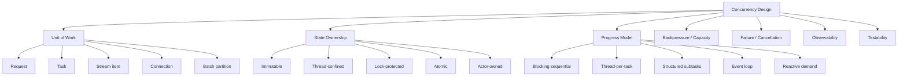
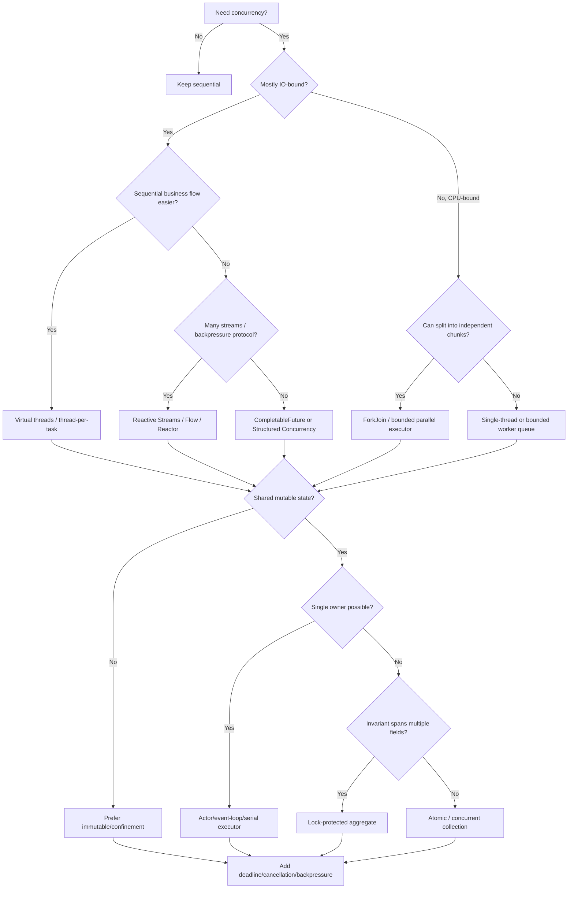
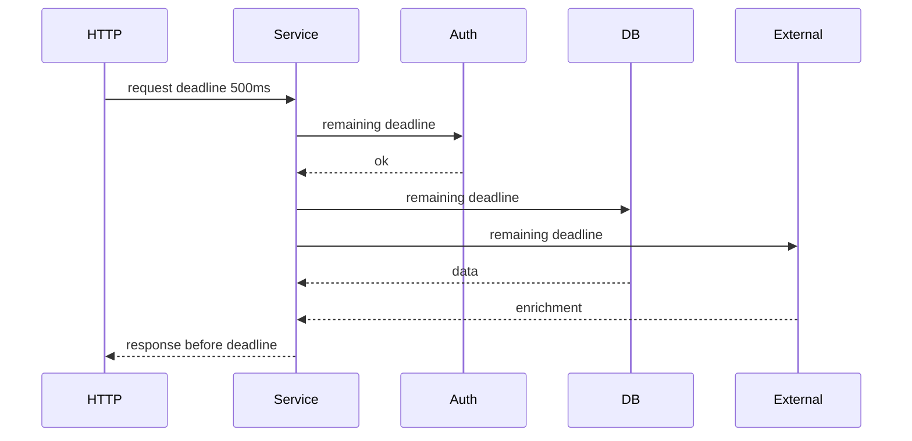
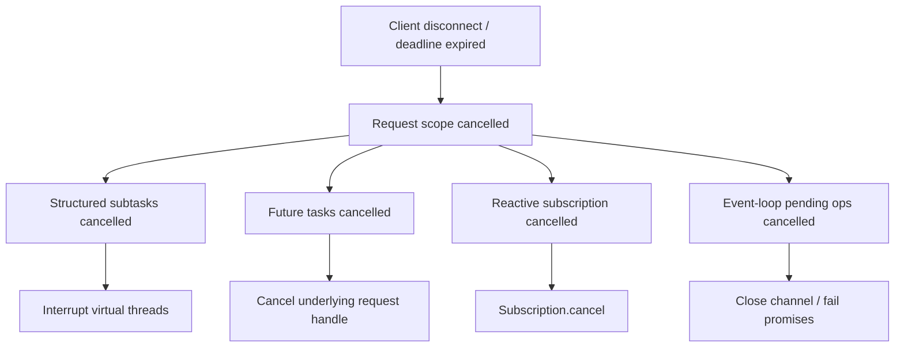
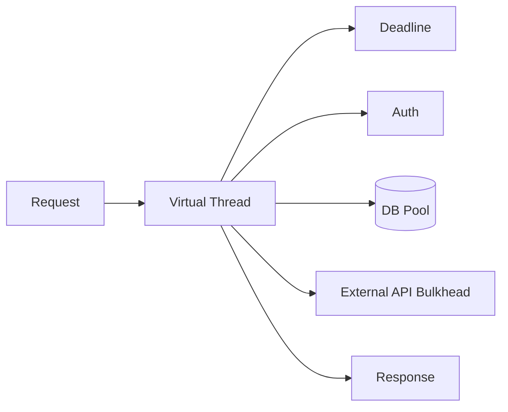
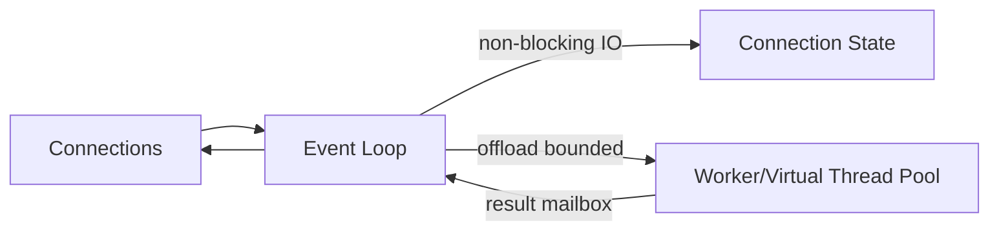
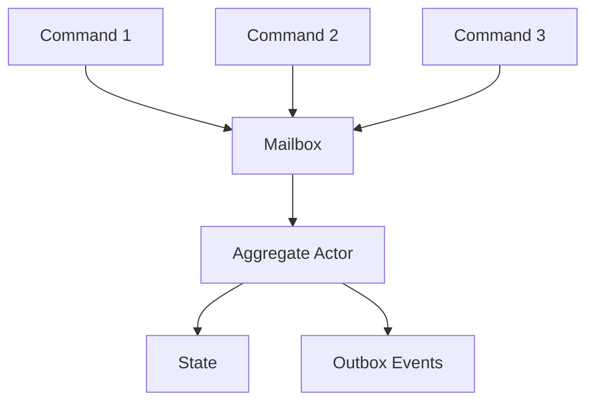
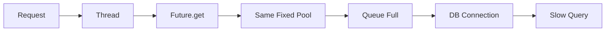
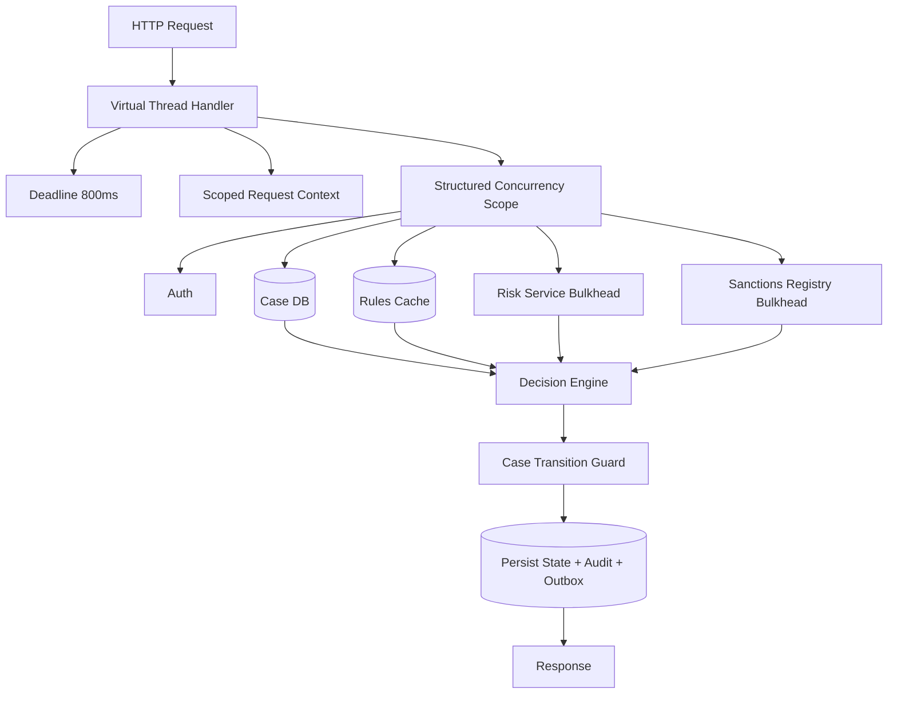
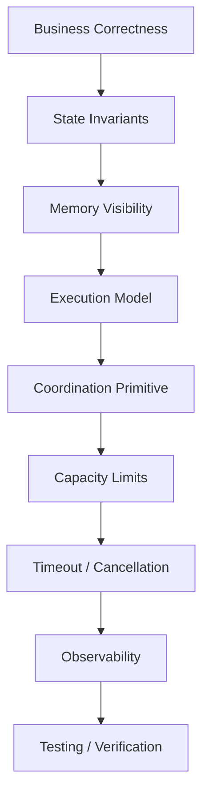

------
title: Learn Java Concurrency & Correctness - Part 035
description: Final production architecture playbook for choosing concurrency models, reviewing correctness, preventing failure modes, and migrating Java systems safely.
series: learn-java-concurrency-correctness
seriesTitle: Learn Java Concurrency & Correctness
order: 35
partTitle: Production Architecture and Final Playbook
tags:
- java
- concurrency
- correctness
- architecture
- production
- review-checklist
- virtual-threads
- structured-concurrency
- reactive
date: 2026-06-28
---

# Part 035 — Production Architecture and Final Playbook

> Goal: menyatukan seluruh seri menjadi **playbook arsitektur concurrency production-grade**: kapan memilih thread-per-request, virtual threads, executor pools, structured concurrency, event loop, reactive streams, locking, atomics, queues, atau actor-like confinement.

Ini bagian terakhir dari seri. Fokusnya bukan API baru, tetapi kemampuan yang membedakan engineer senior biasa dengan engineer yang benar-benar kuat di concurrency:

> Mampu memilih model concurrency yang benar untuk problem tertentu, mendefinisikan invariant, mencegah failure mode, menguji correctness, mengobservasi production, dan memigrasikan sistem tanpa menciptakan risiko tersembunyi.

Seri ini sudah membahas:
- concurrency vs parallelism vs async,
- correctness-first thinking,
- Java Memory Model,
- `volatile`, `final`, safe publication,
- locks, conditions, wait/notify,
- liveness failure,
- synchronizers,
- blocking queues,
- concurrent collections,
- atomics and VarHandle,
- executors and thread pools,
- fork/join and parallel streams,
- `CompletableFuture`,
- async API design,
- virtual threads,
- pinning and JDK 24+,
- structured concurrency,
- scoped values,
- `ThreadLocal` leakage,
- Reactive Streams and `Flow`,
- Reactor/RxJava boundaries,
- NIO/event loop,
- timeout, cancellation, deadline,
- testing,
- observability and forensics.

Sekarang kita ubah semuanya menjadi satu operational framework.

---

## 1. Final Mental Model

Concurrency architecture bukan tentang “pakai fitur terbaru”. Ia tentang menjawab lima pertanyaan:

1. **Apa unit kerja?**
2. **Siapa pemilik state?**
3. **Bagaimana progress dijamin?**
4. **Bagaimana overload dibatasi?**
5. **Bagaimana kegagalan dibatalkan, dibersihkan, dan diamati?**

Jika satu saja tidak jelas, sistem concurrent akan menjadi rapuh.



---

## 2. Kaufman Final Deconstruction

Josh Kaufman menekankan deconstruction, self-correction, practice, dan removing barriers. Untuk concurrency, final decomposition-nya seperti ini:

| Layer | Competency | Failure jika lemah |
|---|---|---|
| Memory model | Mengerti visibility/order/happens-before | stale reads, unsafe publication |
| State ownership | Menentukan siapa boleh mutate | data race, invariant corruption |
| Coordination | Memilih lock/queue/synchronizer | deadlock, missed signal, starvation |
| Execution | Memilih thread/pool/virtual/event-loop | starvation, saturation, wasted CPU |
| Composition | Menggabungkan subtasks dengan lifecycle jelas | orphan work, leak, hidden failure |
| Backpressure | Membatasi queue/resource/demand | OOM, retry storm, latency collapse |
| Cancellation | Menghentikan work yang tidak lagi berguna | pool exhaustion, side effects late |
| Testing | Memaksa interleaving dan invariant | false confidence |
| Observability | Melihat failure mode di production | incident blind spot |
| Architecture | Memilih model sesuai workload | accidental complexity |

Top 1% bukan berarti hafal semua class. Top 1% berarti bisa melihat hidden coupling:

> “This is not just a timeout bug; this is a missing ownership/cancellation/backpressure invariant across the boundary.”

---

## 3. The Concurrency Decision Tree

Gunakan decision tree ini sebelum menulis code.



A concurrency model is not chosen in isolation. It is chosen together with:
- state ownership model,
- cancellation semantics,
- timeout/deadline policy,
- backpressure policy,
- observability strategy,
- test strategy.

---

## 4. Model Selection Matrix

### 4.1 Execution model

| Model | Best for | Avoid when | Main risk |
|---|---|---|---|
| Plain sequential | Simple logic, no concurrency need | Latency from independent IO dominates | Underutilization |
| Platform thread per request | Low concurrency, legacy stack | Many blocking requests | OS thread exhaustion |
| Virtual thread per task | High-throughput blocking IO, simple code | CPU-bound parallelism or unbounded resource use | Resource saturation masked by cheap threads |
| Fixed thread pool | Bounded CPU/IO work | Pool sizing unknown, hidden blocking | Starvation/deadlock |
| ForkJoinPool | Recursive CPU decomposition | Blocking IO tasks | Common-pool contamination |
| `CompletableFuture` | One-shot async composition | Complex lifecycle/cancellation | Orphan work, executor ambiguity |
| Structured concurrency | Parent-child subtask lifetime | API unavailable/preview constraints | Misconfigured scope/deadline |
| Event loop | Protocol engine, proxy, streaming transport | Blocking business workflow | Blocking contamination |
| Reactive streams | Continuous async streams with backpressure | Simple CRUD with blocking dependencies | Debuggability/context complexity |

### 4.2 State model

| State problem | Preferred model |
|---|---|
| Immutable snapshot | `record`, final fields, safe publication |
| Per-request temporary state | local variables, virtual-thread stack |
| Per-connection state | event-loop attachment or actor-owned state |
| Shared cache value | concurrent collection + immutable values |
| Counter/statistics | `LongAdder` / `AtomicLong` |
| Multi-field invariant | lock-protected aggregate |
| Multi-entity workflow | durable transaction/workflow state, not memory lock |
| Cross-node coordination | database/lease/consensus, not JVM lock |
| Request context | explicit parameter or `ScopedValue` |
| Logging/security context legacy | disciplined `ThreadLocal` with cleanup |

---

## 5. Correctness Architecture: Define Invariants First

Before implementation, write invariants. No concurrency review is serious without them.

### 5.1 Invariant template

```text
Component:
State:
Owner:
Invariant:
Mutation protocol:
Read protocol:
Failure behavior:
Timeout/cancellation:
Backpressure:
Observability:
Test strategy:
```

Example:

```text
Component: CaseAssignmentQueue
State:
  - pendingAssignments
  - assignedOfficerByCaseId
Owner:
  - single AssignmentCoordinator actor
Invariant:
  - a case has at most one active assigned officer
  - pending case cannot also be assigned
Mutation protocol:
  - all mutations go through coordinator mailbox
Read protocol:
  - snapshot reads only
Failure behavior:
  - failed assignment returns case to pending with attempt record
Timeout/cancellation:
  - assignment attempt deadline 2s
Backpressure:
  - mailbox bounded by tenant quota
Observability:
  - queue depth, assignment latency, rejected assignments, duplicate prevention
Test strategy:
  - stress concurrent assignment requests, assert uniqueness
```

This is much more valuable than:

```text
Use ConcurrentHashMap.
```

`ConcurrentHashMap` can make map operations safe. It does not make business invariants safe.

---

## 6. Ownership Patterns

### 6.1 Immutable by default

Best concurrency design: no shared mutable state.

```java
public record DecisionSnapshot(
    CaseId caseId,
    CaseStatus status,
    OfficerId owner,
    Instant capturedAt
) {}
```

Safe if:
- fields are immutable or treated immutably,
- object is safely published,
- readers never mutate nested state.

### 6.2 Thread confinement

State belongs to one thread or one task.

Virtual thread example:

```java
void handle(Request request) {
    var draft = new DecisionDraft();

    validate(request, draft);
    enrich(request, draft);
    persist(draft);
}
```

No synchronization required if draft never escapes.

### 6.3 Actor/event-loop confinement

State belongs to one serialized executor.

```java
coordinator.submit(() -> {
    // only coordinator mutates aggregate state
    assign(caseId, officerId);
});
```

Good for:
- aggregate invariants,
- per-connection state,
- routing tables,
- sequential protocols,
- state machine transitions.

Risk:
- actor mailbox overload,
- single owner bottleneck,
- blocking inside actor,
- hidden queue latency.

### 6.4 Lock-protected aggregate

Use lock when multiple fields must change atomically.

```java
final class CaseState {
    private final ReentrantLock lock = new ReentrantLock();

    private CaseStatus status;
    private OfficerId owner;
    private long version;

    Assignment assign(OfficerId officer, Deadline deadline) throws Exception {
        if (!lock.tryLock(deadline.remainingNanos(), TimeUnit.NANOSECONDS)) {
            throw new TimeoutException("case lock timeout");
        }

        try {
            if (status != CaseStatus.OPEN) {
                throw new InvalidTransitionException();
            }

            status = CaseStatus.ASSIGNED;
            owner = officer;
            version++;

            return new Assignment(owner, version);
        } finally {
            lock.unlock();
        }
    }
}
```

Lock rule:

> Lock protects invariants, not code blocks.

If you cannot name the invariant, you probably should not add a lock yet.

### 6.5 Atomic state transition

Use atomic when invariant fits one reference.

```java
record State(CaseStatus status, OfficerId owner, long version) {}

final AtomicReference<State> state =
    new AtomicReference<>(new State(CaseStatus.OPEN, null, 0));

boolean assign(OfficerId officer) {
    while (true) {
        State current = state.get();

        if (current.status() != CaseStatus.OPEN) {
            return false;
        }

        State next = new State(CaseStatus.ASSIGNED, officer, current.version() + 1);

        if (state.compareAndSet(current, next)) {
            return true;
        }
    }
}
```

Good:
- small immutable state,
- clear transition,
- low contention,
- no blocking.

Bad:
- complex multi-step workflows,
- blocking inside CAS loop,
- side effects during retry,
- large mutable object graphs.

---

## 7. Capacity Architecture

Concurrency without capacity limits is not architecture. It is delayed failure.

### 7.1 Every queue must answer four questions

```text
Queue:
Owner:
Capacity:
Enqueue policy:
Dequeue policy:
Rejection policy:
Metrics:
```

Example:

```text
Queue: risk-evaluation-worker-queue
Owner: RiskEvaluationExecutor
Capacity: 500 tasks
Enqueue policy: offer until request deadline
Dequeue policy: FIFO, priority for regulatory deadline cases
Rejection policy: return 503 / reschedule async workflow
Metrics: depth, age, rejected, execution latency
```

### 7.2 Bulkheads

Bulkhead by resource, not by random service name.

| Resource | Bulkhead |
|---|---|
| Database pool | max connections + query timeout |
| External API | semaphore + deadline |
| CPU-heavy validator | fixed pool |
| Event loop | no blocking + offload cap |
| Case aggregate actor | bounded mailbox |
| Tenant | quota by tenant |
| Notification sender | bounded queue + retry budget |

### 7.3 Little’s Law intuition

For a stable system:

```text
concurrency ≈ throughput × latency
```

If average latency rises while arrival rate stays constant, in-flight work rises. If in-flight work is unbounded, memory and queues grow.

This is why slow dependencies cause queue explosion.

---

## 8. Deadline Architecture

Use one top-level deadline and propagate it.



Rules:
1. Parent creates deadline.
2. Child receives deadline.
3. Child fails fast if expired.
4. Resource acquisition respects deadline.
5. Client-native timeout respects deadline.
6. Retry consumes same deadline.
7. Cancellation cleans up child work.
8. Side-effecting operations use idempotency key.

### 8.1 Timeout hierarchy

```text
Total request deadline
  ├── queue wait budget
  ├── auth budget
  ├── data load budget
  │     ├── connection acquire timeout
  │     ├── query timeout
  │     └── result mapping time
  ├── external enrichment budget
  │     ├── bulkhead acquire timeout
  │     ├── connect timeout
  │     └── read timeout
  └── response write budget
```

Each timeout should be observable separately.

---

## 9. Cancellation Architecture

Cancellation must follow ownership.

### 9.1 Cancellation propagation



### 9.2 Cancellation contract

Every public async/concurrent API should state:

```text
If caller cancels:
- does waiting stop?
- does underlying work stop?
- is thread interrupted?
- is socket/request closed?
- are permits released?
- are child tasks cancelled?
- can operation still complete late?
- are side effects idempotent?
```

If the answer is “unknown”, the API is not production-ready.

---

## 10. Choosing Between Virtual Threads and Reactive

This deserves a dedicated final rule set.

### 10.1 Prefer virtual threads when

- workflow is request/response,
- business logic is naturally sequential,
- dependencies are blocking but bounded,
- team values debuggable stack traces,
- context propagation should be simple,
- per-request state fits stack/local variables,
- backpressure can be represented by semaphores/queues/pools,
- streaming is not the core abstraction.

Example:

```java
Response handle(Request request) {
    Deadline deadline = Deadline.after(Duration.ofMillis(500));

    try (var scope = StructuredTaskScope.open(joiner, config)) {
        var customer = scope.fork(() -> customerClient.get(request.customerId(), deadline));
        var risk = scope.fork(() -> riskClient.evaluate(request.customerId(), deadline));

        scope.join();

        return compose(customer.get(), risk.get());
    }
}
```

### 10.2 Prefer reactive/event-loop when

- protocol is streaming,
- backpressure is part of contract,
- many mostly-idle connections,
- framework stack is already reactive,
- transport is Netty/event-loop based,
- you need demand-driven pipelines,
- you are building a gateway/proxy/stream processor,
- non-blocking client ecosystem is mature for dependencies.

Example:

```java
Flux<Event> stream =
    source.receive()
        .limitRate(256)
        .flatMap(this::enrichAsync, 32)
        .timeout(Duration.ofSeconds(2))
        .onBackpressureBuffer(1000);
```

### 10.3 Avoid hybrid confusion

Dangerous hybrid:
- reactive pipeline with random blocking calls,
- virtual threads calling `.block()` inside event-loop thread,
- `CompletableFuture` using common pool for blocking IO,
- `ThreadLocal` context expected to cross reactive boundaries,
- unbounded `flatMap`,
- event-loop code waiting on future.

Bridge with explicit boundaries:
- `boundedElastic` or equivalent for blocking in reactive,
- virtual-thread executor for blocking adapters,
- `ScopedValue` only where lexical/thread inheritance is valid,
- explicit context for reactive,
- semaphores for external dependency concurrency,
- deadlines everywhere.

---

## 11. Choosing Between Locks, Atomics, Queues, and Actors

### 11.1 Quick matrix

| Need | Use |
|---|---|
| Protect multiple mutable fields | Lock |
| Wait for condition with explicit predicate | `Condition` or blocking queue |
| Single numeric metric under high contention | `LongAdder` |
| Single state reference transition | `AtomicReference` |
| Producer-consumer handoff | `BlockingQueue` |
| Limit concurrent access to resource | `Semaphore` |
| Coordinate one-time start/finish | `CountDownLatch` |
| Repeated phase coordination | `Phaser` |
| Serialize aggregate mutations | Actor/serial executor |
| Avoid sharing entirely | Immutability/confinement |

### 11.2 What not to do

- Do not use atomics to protect multi-field mutable object graphs unless state is immutable snapshot.
- Do not use `ConcurrentHashMap` as substitute for transaction/invariant.
- Do not use `synchronized` around blocking external calls.
- Do not use unbounded queues to “absorb spikes”.
- Do not use parallel streams in request path without measuring and isolating pool.
- Do not use `CompletableFuture` without explicit executor ownership.
- Do not assume timeout cancels underlying work.
- Do not assume virtual threads remove resource limits.

---

## 12. Production Review Template

Use this template for design review.

```md
# Concurrency Design Review

## Component

Name:
Owner:
Runtime:
Criticality:

## Workload

Request rate:
Peak rate:
Latency target:
Work type:
- CPU-bound:
- IO-bound:
- blocking:
- streaming:
- bursty:

## Execution Model

Chosen model:
Alternatives considered:
Why chosen:
Thread/executor/event-loop ownership:
Blocking policy:
Offload policy:

## State Ownership

Mutable state:
Owner:
Invariant:
Mutation protocol:
Read protocol:
Publication protocol:

## Capacity

Queues:
Limits:
Bulkheads:
Rejection behavior:
Tenant fairness:
Slow consumer policy:

## Timeout / Deadline

Top-level deadline:
Phase timeouts:
Dependency timeouts:
Retry budget:
Shutdown deadline:

## Cancellation

Cancellation triggers:
Propagation path:
Underlying resource cancellation:
Cleanup:
Late completion policy:

## Failure Modes

Data race:
Deadlock:
Starvation:
Livelock:
Pool exhaustion:
Queue growth:
Slow dependency:
Slow consumer:
Orphan work:
Context leak:
Unknown side effect:

## Observability

Metrics:
Logs:
Traces:
JFR events:
Thread dump strategy:
Alert thresholds:

## Tests

Unit deterministic:
Stress:
JCStress-style:
Timeout/cancellation:
Leak:
Load:
Failure injection:
Regression from incidents:
```

This template forces architecture-level thinking.

---

## 13. Failure Mode Catalogue

### 13.1 Data race

Signal:
- non-deterministic state,
- impossible values,
- flakiness,
- only appears under load.

Prevention:
- immutability,
- safe publication,
- lock ownership,
- actor confinement,
- concurrent collection with immutable values.

### 13.2 Unsafe publication

Signal:
- partially initialized objects observed,
- stale config,
- null field impossible by constructor logic.

Prevention:
- final fields,
- immutable objects,
- volatile reference,
- lock handoff,
- static initialization,
- thread-safe containers.

### 13.3 Deadlock

Signal:
- thread dump shows cycles,
- no CPU,
- requests hang.

Prevention:
- lock ordering,
- no external calls under lock,
- timed lock,
- smaller critical sections,
- actor confinement.

### 13.4 Starvation

Signal:
- some work never runs,
- pool busy with wrong work,
- priority inversion.

Prevention:
- separate pools,
- bounded queues,
- fair locks only when justified,
- queue age metrics,
- bulkheads.

### 13.5 Thread pool deadlock

Signal:
- tasks wait for subtasks submitted to same saturated pool.

Prevention:
- structured concurrency,
- avoid blocking joins inside fixed pool,
- use separate executor,
- use virtual threads for blocking composition,
- enforce pool ownership.

### 13.6 Event-loop blocking

Signal:
- p99 spikes,
- low CPU,
- event loop thread stack in DB/logging/lock/sleep.

Prevention:
- offload blocking work,
- blocking guard,
- event-loop lag metric,
- bounded worker queue.

### 13.7 Queue explosion

Signal:
- memory growth,
- old work,
- latency grows before error rate.

Prevention:
- bounded queues,
- rejection policy,
- deadline-aware queueing,
- load shedding,
- queue age metrics.

### 13.8 Orphan work

Signal:
- work continues after request timeout,
- executor busy with irrelevant tasks.

Prevention:
- structured scopes,
- cancellation handles,
- deadline check before execution,
- `Future.cancel`,
- underlying resource close.

### 13.9 Context leak

Signal:
- wrong tenant/user/correlation id,
- security context bleed,
- MDC wrong in logs.

Prevention:
- `ScopedValue`,
- explicit context,
- `ThreadLocal.remove`,
- executor wrappers,
- reactive context discipline.

### 13.10 Unknown side effect

Signal:
- caller timed out but external action may have happened.

Prevention:
- idempotency key,
- operation status table,
- reconciliation,
- compensation workflow,
- audit trail.

---

## 14. Migration Playbook: Legacy Thread Pools to Virtual Threads

Virtual threads are powerful, but migration must be controlled.

### 14.1 Good candidates

- synchronous REST handlers,
- blocking HTTP clients,
- blocking database access with bounded connection pool,
- per-request orchestration,
- file/network IO where JDK/libraries cooperate,
- code where stack traces matter.

### 14.2 Bad first candidates

- CPU-bound workloads,
- code relying heavily on thread-local mutable caches,
- code with unbounded fan-out,
- event-loop frameworks where blocking is forbidden,
- code with hidden native blocking,
- code without timeout/cancellation discipline.

### 14.3 Migration steps

1. Inventory blocking paths.
2. Inventory resource pools: DB, HTTP, file, locks, semaphores.
3. Add top-level deadlines.
4. Add dependency-native timeouts.
5. Add bulkheads.
6. Replace platform-thread request executor with virtual-thread-per-task executor.
7. Remove unnecessary large IO thread pools.
8. Keep CPU-bound pools bounded.
9. Audit `ThreadLocal` usage.
10. Add JFR/thread dump observability.
11. Load test with slow dependencies.
12. Roll out gradually.

### 14.4 Virtual thread anti-patterns

Bad:

```java
// "Threads are cheap, so no limit"
for (Item item : millionItems) {
    Thread.startVirtualThread(() -> callExternalApi(item));
}
```

Better:

```java
Semaphore permits = new Semaphore(100);

try (var executor = Executors.newVirtualThreadPerTaskExecutor()) {
    for (Item item : items) {
        executor.submit(() -> {
            permits.acquire();
            try {
                callExternalApi(item);
            } finally {
                permits.release();
            }
        });
    }
}
```

Cheap threads do not make external systems infinite.

---

## 15. Migration Playbook: Ad Hoc Futures to Structured Concurrency

Ad hoc future code often leaks lifecycle.

Bad:

```java
CompletableFuture<A> a = callA();
CompletableFuture<B> b = callB();

return a.thenCombine(b, this::combine);
```

Potential issues:
- executor unclear,
- cancellation unclear,
- one failure may not cancel sibling,
- deadline not shared,
- child work may outlive parent,
- context propagation unclear.

Migration:
1. Identify parent operation.
2. Identify child tasks.
3. Define success policy: all success? first success? quorum?
4. Define failure policy.
5. Define deadline.
6. Use structured scope where available.
7. Pass deadline to child dependencies.
8. Cancel siblings on failure/deadline.
9. Observe scope as one operation.

Structured design:

```java
try (var scope = StructuredTaskScope.open(joiner, config)) {
    var a = scope.fork(() -> callA(deadline));
    var b = scope.fork(() -> callB(deadline));

    scope.join();

    return combine(a.get(), b.get());
}
```

Where structured concurrency is preview/unavailable, emulate the same lifecycle discipline manually.

---

## 16. Migration Playbook: ThreadLocal to ScopedValue

### 16.1 When to migrate

Migrate request-scoped immutable context:
- correlation id,
- tenant id,
- deadline,
- read-only security principal,
- tracing metadata,
- locale,
- request feature flags.

Be careful with mutable context:
- transaction/session,
- persistence context,
- mutable security context,
- accumulators,
- caches.

### 16.2 ThreadLocal risk

```java
USER_CONTEXT.set(user);
try {
    service.handle();
} finally {
    USER_CONTEXT.remove();
}
```

Problems:
- forgotten cleanup,
- thread pool reuse leak,
- async boundary loss,
- virtual thread memory overhead if abused,
- unclear ownership.

### 16.3 ScopedValue pattern

```java
static final ScopedValue<RequestContext> REQUEST_CONTEXT =
    ScopedValue.newInstance();

ScopedValue.where(REQUEST_CONTEXT, context)
    .run(() -> service.handle(request));
```

Benefits:
- bounded lifetime,
- immutable sharing,
- easier reasoning,
- child task inheritance with structured concurrency,
- lower risk of stale context.

Rule:

> Use `ScopedValue` for immutable scoped context; use explicit parameters for domain-critical values; avoid hidden mutable global state.

---

## 17. Architecture Patterns

### 17.1 Thread-per-request with virtual threads

Use for:
- synchronous service endpoints,
- request orchestration,
- blocking dependencies,
- straightforward business workflow.

Shape:



Key controls:
- DB pool,
- HTTP client connection pool,
- semaphores,
- deadline,
- cancellation,
- structured subtasks,
- context via scoped value.

### 17.2 Event-loop transport with worker offload

Use for:
- gateway,
- protocol server,
- high connection count,
- streaming transport.

Shape:



Key controls:
- event-loop non-blocking invariant,
- bounded worker queue,
- outbound pending bytes,
- interest ops,
- close reasons,
- event-loop lag.

### 17.3 Reactive pipeline

Use for:
- async streams,
- backpressure protocol,
- data/event pipeline,
- non-blocking clients.

Shape:


Key controls:
- bounded concurrency,
- scheduler discipline,
- timeout,
- cancellation,
- context propagation,
- blocking isolation,
- backpressure policy.

### 17.4 Actor-like aggregate coordinator

Use for:
- complex aggregate invariants,
- sequential state machine,
- workflow coordination,
- high correctness requirements.

Shape:



Key controls:
- bounded mailbox,
- no blocking in actor,
- persistent outbox if side effects,
- snapshot reads,
- command idempotency,
- replay/recovery if durable.

---

## 18. Regulatory Workflow Angle

For regulatory systems, concurrency correctness is not merely technical. It affects defensibility.

Common high-risk cases:
- duplicate enforcement actions,
- missed escalation deadline,
- inconsistent case status,
- notification sent twice,
- audit log order mismatch,
- stale authorization context,
- cross-tenant context leak,
- timeout interpreted as failure when outcome unknown,
- race between manual override and automated escalation.

### 18.1 Domain invariant examples

```text
A case cannot be simultaneously CLOSED and PENDING_REVIEW.
An enforcement action cannot be issued twice for same violation and version.
A manual override must supersede automated escalation if committed first.
Every external notification must have an idempotency key.
Every status transition must have audit causality.
A timeout from remote registry update produces UNKNOWN_REMOTE_OUTCOME, not FAILED.
```

### 18.2 Concurrency design implications

- Use versioned state transitions.
- Use optimistic locking at durable boundary.
- Use idempotency keys for side effects.
- Use outbox pattern for events.
- Use reconciliation for unknown outcomes.
- Keep audit append independent but causally linked.
- Use command IDs to deduplicate retries.
- Avoid in-memory locks as source of cross-node truth.

JVM concurrency protects in-process correctness. Regulatory correctness often needs durable concurrency control too.

---

## 19. Code Review Red Flags

If you see these, pause review.

### 19.1 Execution red flags

```java
CompletableFuture.supplyAsync(() -> blockingCall());
```

No executor.

```java
parallelStream().forEach(item -> repository.save(item));
```

Blocking side effects in parallel stream.

```java
Executors.newCachedThreadPool();
```

Unbounded thread creation.

```java
new LinkedBlockingQueue<>();
```

Unbounded queue by default.

```java
future.get();
```

No timeout.

```java
Thread.sleep(...);
```

Suspicious coordination.

### 19.2 State red flags

```java
static Map<K, V> cache = new HashMap<>();
```

Shared non-thread-safe state.

```java
volatile List<Item> items;
items.add(x);
```

Volatile reference does not make list mutation safe.

```java
ConcurrentHashMap<K, MutableValue>
```

Map is concurrent; value may not be.

```java
if (!map.containsKey(k)) {
    map.put(k, v);
}
```

Check-then-act race.

### 19.3 Lock red flags

```java
synchronized (publicObject) { ... }
```

External code can lock it.

```java
lock.lock();
externalCall();
lock.unlock();
```

External call under lock.

```java
catch (InterruptedException ignored) {}
```

Cancellation swallowed.

```java
condition.await();
```

No loop predicate.

### 19.4 Reactive/event-loop red flags

```java
mono.map(x -> blockingCall(x));
```

Blocking inside operator without scheduler boundary.

```java
.flatMap(this::call)
```

No concurrency bound.

```java
eventLoop.execute(() -> repository.findAll());
```

Blocking event loop.

```java
key.interestOps(OP_READ | OP_WRITE);
```

Always write-ready spin risk.

---

## 20. Production Readiness Checklist

### 20.1 Design

- [ ] Execution model is explicitly chosen.
- [ ] State ownership is documented.
- [ ] Invariants are written.
- [ ] Shared mutable state is minimized.
- [ ] Resource limits are explicit.
- [ ] Deadlines are propagated.
- [ ] Cancellation is defined.
- [ ] Backpressure behavior is defined.
- [ ] Failure taxonomy is defined.
- [ ] Test strategy includes concurrency-specific tests.

### 20.2 Implementation

- [ ] No unbounded executor/queue accidentally.
- [ ] No blocking call on event-loop/reactive scheduler.
- [ ] No external call under lock.
- [ ] No swallowed interrupt.
- [ ] No unsafe publication.
- [ ] No mutable object stored in concurrent map without ownership.
- [ ] No common-pool blocking.
- [ ] No timeout without cleanup.
- [ ] No retry without deadline.
- [ ] No context without cleanup/boundary.

### 20.3 Operations

- [ ] Thread names are meaningful.
- [ ] Thread dumps are actionable.
- [ ] JFR profile can be captured in production.
- [ ] Executor metrics exist.
- [ ] Queue depth and age are measured.
- [ ] Lock contention is observable.
- [ ] Event-loop lag is measured where relevant.
- [ ] Timeout phase is labeled.
- [ ] Cancellation reason is labeled.
- [ ] Late completion/orphan work is observable.

### 20.4 Resilience

- [ ] Slow dependency test passed.
- [ ] Slow consumer test passed.
- [ ] Pool saturation test passed.
- [ ] Queue saturation test passed.
- [ ] Cancellation storm test passed.
- [ ] Shutdown drain test passed.
- [ ] Context leak test passed.
- [ ] Duplicate side-effect test passed.
- [ ] Unknown outcome reconciliation exists.

---

## 21. Load Testing Playbook

Load tests must include failure, not only happy path.

### 21.1 Baseline tests

- normal load,
- peak load,
- burst load,
- soak test,
- high cardinality tenant test,
- large payload test.

### 21.2 Failure injection

- dependency latency +500ms,
- dependency timeout,
- connection pool exhaustion,
- slow DB query,
- slow client read,
- event loop blocking injection,
- executor saturation,
- queue full,
- lock holder pause,
- cancellation storm,
- client disconnect storm,
- retry storm,
- GC pressure.

### 21.3 What to measure

- p50/p95/p99/p999 latency,
- throughput,
- error rate by failure class,
- queue depth,
- queue age,
- active threads,
- virtual thread count,
- carrier thread utilization,
- blocked/waiting thread count,
- lock contention,
- DB pool active/waiting,
- external API concurrency,
- timeouts by phase,
- cancellation latency,
- CPU,
- heap/direct memory,
- GC pause,
- JFR events.

### 21.4 Pass/fail criteria

Good load test has explicit fail conditions:

```text
p99 < 300ms under normal load
p99 < 800ms under dependency p95=500ms
queue age < request deadline
no unbounded memory growth for 30 min soak
timeout error has phase label
no thread leak after cancellation storm
no pending futures after client disconnect
slow clients are closed before pending bytes > cap
```

---

## 22. Incident Response Playbook

When concurrency incident happens, avoid random fixes. Follow structure.

### 22.1 First classify symptom

| Symptom | Likely class |
|---|---|
| High latency, low CPU | blocking, deadlock, starvation, pool wait |
| High CPU, low throughput | spin, retry storm, busy loop |
| Memory growth | unbounded queue, slow consumer, leak |
| Requests hang | missing timeout, deadlock, orphan wait |
| Wrong user/tenant context | context leak |
| Duplicate action | idempotency/race |
| Thread count explosion | unbounded executor/platform threads |
| DB pool exhausted | leaked connection, slow query, orphan work |
| Event loop lag | blocking contamination |

### 22.2 Capture evidence

1. Thread dump.
2. JFR recording.
3. Executor/queue metrics.
4. DB pool metrics.
5. Dependency latency.
6. GC logs/metrics.
7. Error taxonomy.
8. Recent deployment diff.
9. Load/retry rate.
10. Context/correlation samples.

### 22.3 Build wait-for graph

Ask:

```text
Request waits for what?
Thread waits for what?
Task waits for what?
Pool waits for what?
Lock waits for what?
Dependency waits for what?
Queue waits for what?
```

Diagram it:



This often reveals circular dependency or missing bulkhead.

### 22.4 Mitigate before optimizing

Possible mitigations:
- lower timeout,
- disable retry,
- shed load,
- reduce concurrency to dependency,
- increase connection pool only if dependency can handle it,
- close slow consumers,
- restart stuck nodes,
- enable fallback,
- isolate tenant,
- roll back blocking change,
- switch off expensive feature.

Do not “just increase thread pool” unless wait-for graph proves it is safe.

---

## 23. Final Capstone: Designing a Concurrent Case Evaluation Service

### 23.1 Requirements

A service receives a case evaluation request:
- authenticate user,
- load case,
- load regulatory rules,
- call risk scoring service,
- call sanctions registry,
- evaluate decision,
- persist audit,
- return result under 800ms,
- never duplicate enforcement action,
- support cancellation on client disconnect,
- survive slow risk service,
- preserve tenant context,
- expose diagnostics.

### 23.2 Architecture



### 23.3 Execution model

- Use virtual thread per request.
- Use structured concurrency for independent subtasks.
- Use deadline propagated to every dependency.
- Use scoped value for immutable request context.
- Use DB optimistic versioning for durable case transition.
- Use idempotency key for enforcement action.
- Use outbox for external notifications.
- Use semaphores/bulkheads for risk and sanctions calls.

### 23.4 Critical invariants

```text
Invariant 1:
A case transition is valid only from the latest persisted version.

Invariant 2:
An enforcement action for (caseId, violationId, decisionVersion) is created at most once.

Invariant 3:
A timed-out external side effect is UNKNOWN_REMOTE_OUTCOME until reconciled.

Invariant 4:
Tenant context used for authorization, query, audit, and outbox must be identical.

Invariant 5:
If request deadline expires, child tasks are cancelled and no new side effect begins.

Invariant 6:
Audit record must causally reference decision input version and command id.
```

### 23.5 Example pseudo-code

```java
Response evaluate(EvaluateCommand command) throws Exception {
    Deadline deadline = Deadline.after(Duration.ofMillis(800));
    RequestContext context = RequestContext.from(command, deadline);

    return ScopedValue.where(RequestContexts.CURRENT, context)
        .call(() -> evaluateWithinContext(command, deadline));
}

Response evaluateWithinContext(EvaluateCommand command, Deadline deadline)
        throws Exception {
    deadline.throwIfExpired();

    try (var scope = StructuredTaskScope.open(joiner, configWithDeadline(deadline))) {
        var auth = scope.fork(() -> authService.authorize(command, deadline));
        var caseData = scope.fork(() -> caseRepository.load(command.caseId(), deadline));
        var rules = scope.fork(() -> rulesCache.load(command.ruleSetId(), deadline));
        var risk = scope.fork(() -> riskClient.score(command.subject(), deadline));
        var sanctions = scope.fork(() -> sanctionsClient.check(command.subject(), deadline));

        scope.join();

        Authorization authorization = auth.get();
        CaseRecord record = caseData.get();

        authorization.assertCanEvaluate(record);

        Decision decision = decisionEngine.evaluate(
            record,
            rules.get(),
            risk.get(),
            sanctions.get()
        );

        deadline.throwIfExpired();

        return persistDecision(command, record, decision, deadline);
    }
}

Response persistDecision(
    EvaluateCommand command,
    CaseRecord record,
    Decision decision,
    Deadline deadline
) throws Exception {
    String idempotencyKey = command.commandId().value();

    return transactionTemplate.execute(deadline, tx -> {
        CaseRecord latest = caseRepository.loadForUpdate(record.id(), deadline);

        if (latest.version() != record.version()) {
            throw new ConcurrentCaseUpdateException();
        }

        EnforcementAction action = enforcementActions.createIfAbsent(
            idempotencyKey,
            latest.id(),
            decision
        );

        caseRepository.transition(latest, decision.nextStatus(), deadline);
        auditRepository.append(decision.auditEvent(command.commandId()), deadline);
        outboxRepository.enqueue(action.notificationEvent(), deadline);

        return Response.from(decision, action);
    });
}
```

This design intentionally combines:
- virtual threads,
- structured concurrency,
- scoped context,
- deadlines,
- durable concurrency control,
- idempotency,
- transactional outbox.

This is the level where concurrency becomes system correctness.

---

## 24. Final “Do This, Not That”

| Do this | Not that |
|---|---|
| Define invariants before locks | Add locks until bug disappears |
| Prefer immutable snapshots | Share mutable DTOs everywhere |
| Use deadline propagation | Give every layer fixed timeout |
| Bound every queue | Use unbounded queues as buffer |
| Use virtual threads for blocking IO orchestration | Use virtual threads as excuse for unbounded dependency calls |
| Use structured concurrency for child tasks | Fire futures and forget lifecycle |
| Use scoped values for immutable request context | Depend on leaking thread locals |
| Use event loop only with non-blocking discipline | Call blocking repositories on event loop |
| Use reactive when backpressure is core | Use reactive for simple CRUD because it looks advanced |
| Use lock for multi-field invariant | Use atomics for complex mutable graphs |
| Observe queue age and close reasons | Only observe average latency |
| Test cancellation and late completion | Only test happy path |
| Treat timeout as unknown outcome for side effects | Assume timeout means operation failed |

---

## 25. What “Top 1%” Looks Like in Concurrency

A top-tier engineer does these consistently:

1. **Names the invariant.**
2. **Chooses ownership before choosing primitive.**
3. **Rejects unbounded queues by default.**
4. **Asks what happens when dependency is slow.**
5. **Asks what happens when caller goes away.**
6. **Separates timeout from cancellation.**
7. **Knows when virtual threads simplify and when they hide saturation.**
8. **Knows when reactive is essential and when it is accidental complexity.**
9. **Avoids shared mutable state unless there is a protocol.**
10. **Reads thread dumps and JFR recordings.**
11. **Tests interleavings, not just examples.**
12. **Designs for unknown remote outcomes.**
13. **Documents concurrency contracts in APIs.**
14. **Makes failure modes observable.**
15. **Does not confuse throughput with correctness.**

---

## 26. Final Study Path After This Series

To keep improving, build projects that force different models.

### Project 1 — Virtual-thread service

Build:
- REST endpoint,
- blocking DB,
- external HTTP call,
- deadline propagation,
- structured concurrency,
- scoped context,
- cancellation on client disconnect,
- JFR profiling.

### Project 2 — Event-loop protocol server

Build:
- NIO selector server,
- length-prefixed protocol,
- bounded outbound queue,
- slow client close,
- worker offload,
- event-loop lag metric.

### Project 3 — Reactive stream processor

Build:
- `Flow.Publisher`,
- bounded demand,
- cancellation,
- timeout,
- bridge to blocking operation,
- tests for protocol violations.

### Project 4 — Concurrent aggregate coordinator

Build:
- actor-like case state coordinator,
- bounded mailbox,
- snapshot reads,
- idempotent commands,
- stress tests for invariant.

### Project 5 — JCStress-style experiments

Build:
- unsafe publication test,
- volatile visibility test,
- atomic transition test,
- lock ordering failure,
- `ThreadLocal` leak simulation.

---

## 27. Final Summary

Concurrency correctness is not one topic. It is a stack:



A system is only as reliable as the weakest layer.

Final rules:

1. Start from invariants.
2. Minimize shared mutable state.
3. Choose ownership model first.
4. Choose execution model second.
5. Choose primitive last.
6. Bound queues and resources.
7. Propagate deadlines.
8. Treat cancellation as part of API contract.
9. Make timeout phases observable.
10. Test failure interleavings.
11. Use virtual threads to simplify blocking orchestration, not to ignore capacity.
12. Use reactive/event-loop when backpressure and streaming are central.
13. Use structured concurrency to prevent orphan work.
14. Use scoped values for bounded immutable context.
15. Treat production incidents as feedback into tests and design templates.

This completes the series.

---

## References

- Java SE 25 API — `ExecutorService`: https://docs.oracle.com/en/java/javase/25/docs/api/java.base/java/util/concurrent/ExecutorService.html
- Java SE 25 API — `StructuredTaskScope`: https://docs.oracle.com/en/java/javase/25/docs/api/java.base/java/util/concurrent/StructuredTaskScope.html
- Oracle Java SE 25 — Structured Concurrency: https://docs.oracle.com/en/java/javase/25/core/structured-concurrency.html
- Java SE 25 API — `ScopedValue`: https://docs.oracle.com/en/java/javase/25/docs/api/java.base/java/lang/ScopedValue.html
- Java SE 25 API — `Flow`: https://docs.oracle.com/en/java/javase/25/docs/api/java.base/java/util/concurrent/Flow.html
- Java SE 25 API — `Thread`: https://docs.oracle.com/en/java/javase/25/docs/api/java.base/java/lang/Thread.html
- Oracle Java SE 21 Guide — Virtual Threads: https://docs.oracle.com/en/java/javase/21/core/virtual-threads.html
- JEP 444 — Virtual Threads: https://openjdk.org/jeps/444
- JEP 491 — Synchronize Virtual Threads without Pinning: https://openjdk.org/jeps/491
- JEP 505 — Structured Concurrency: https://openjdk.org/jeps/505
- JEP 506 — Scoped Values: https://openjdk.org/jeps/506
- Java SE 25 Troubleshooting — Diagnostic Tools / JFR: https://docs.oracle.com/en/java/javase/25/troubleshoot/diagnostic-tools.html
- Java SE 25 API — `jdk.jfr`: https://docs.oracle.com/en/java/javase/25/docs/api/jdk.jfr/module-summary.html
