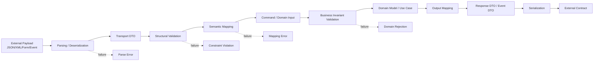
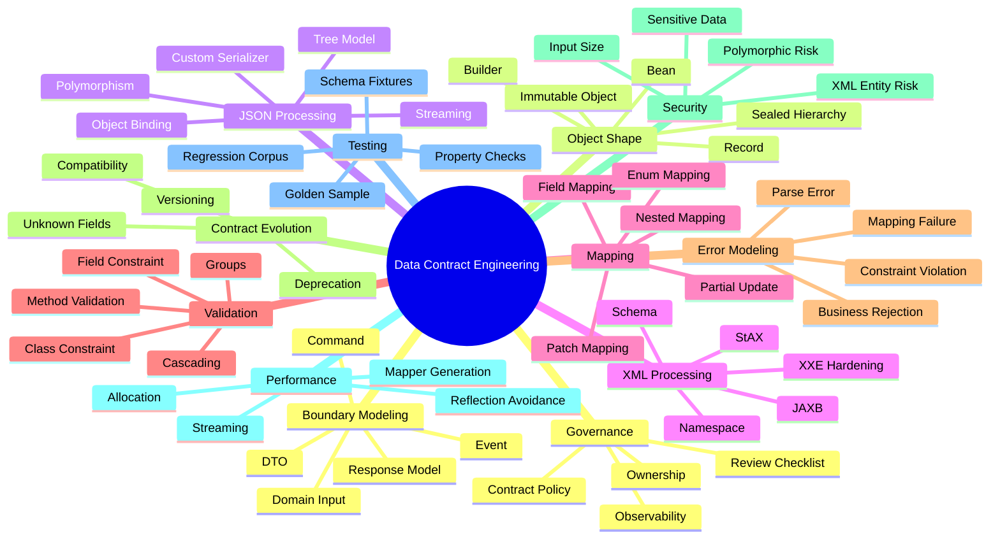
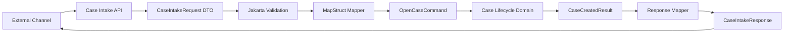
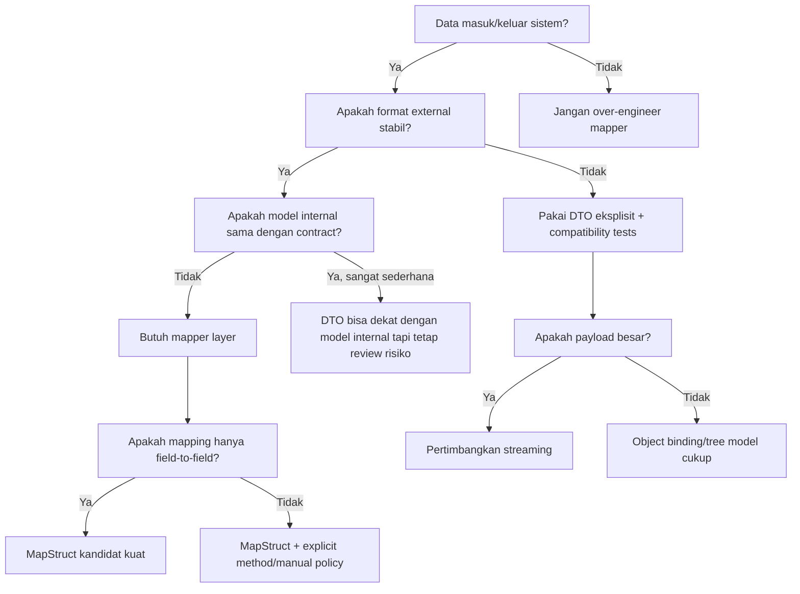

------
title: Learn Java Data Mapper, JSON/XML Processing & Validation - Part 001
description: Kaufman skill map untuk menguasai data mapper, JSON/XML processing, serialization/deserialization, dan validation sebagai engineering skill yang defensible di production.
series: learn-java-data-mapper-json-xml-validation
seriesTitle: Learn Java Data Mapper, JSON/XML Processing & Validation
order: 1
partTitle: Kaufman Skill Map
tags:
- java
- data-mapper
- json
- xml
- jackson
- mapstruct
- jakarta-validation
- hibernate-validator
- serialization
- deserialization
date: 2026-06-29
---

# Part 001 — Kaufman Skill Map

## 1. Tujuan Part Ini

Part ini bukan tutorial annotation.

Target part ini adalah membangun **peta keahlian** agar pembelajaran berikutnya tidak berubah menjadi hafalan `@JsonProperty`, `@Mapping`, atau `@NotNull`.

Di production, masalah mapper/serialization/validation jarang gagal karena engineer tidak tahu nama annotation. Masalahnya biasanya lebih fundamental:

- salah memahami boundary;
- salah membedakan data shape vs business meaning;
- salah menafsirkan null, absence, empty, dan default;
- salah memilih lokasi validasi;
- salah memperlakukan DTO sebagai domain model;
- salah membuat mapper yang tampak benar tetapi mengubah intent;
- salah membuat JSON/XML contract yang susah berevolusi;
- salah menganggap serialization hanyalah “convert object to string”;
- salah menganggap validation hanyalah “cek field required”.

Seri ini akan memperlakukan mapping, serialization, deserialization, dan validation sebagai satu skill besar:

> **Data contract engineering:** kemampuan mendesain, membaca, mengubah, memvalidasi, mengamankan, mengobservasi, dan mengevolusi data yang melintasi boundary sistem tanpa merusak makna bisnis.

Framework pembelajaran mengikuti prinsip Josh Kaufman dari *The First 20 Hours*:

1. deconstruct skill;
2. learn enough to self-correct;
3. remove practice barriers;
4. practice deliberately;
5. create tight feedback loop.

Kita akan mengadaptasikan itu ke konteks software engineering senior/lead.

---

## 2. Mengapa Skill Ini Layak Dipelajari Secara Serius

Banyak engineer menganggap mapper sebagai plumbing code. Itu asumsi yang berbahaya.

Mapper adalah tempat di mana data berubah bentuk. Ketika data berubah bentuk, ada kemungkinan makna berubah.

Contoh bug yang terlihat kecil tetapi mahal:

```java
// external JSON
{
  "status": "SUSPENDED",
  "reason": null
}
```

Jika mapper mengubah `reason: null` menjadi empty string, downstream mungkin menganggap reason “dikirim tetapi kosong”, bukan “tidak diketahui”.

Contoh lain:

```java
// PATCH request
{
  "email": null
}
```

Apakah ini berarti:

1. client ingin menghapus email?
2. client tidak sengaja mengirim null?
3. field harus diabaikan?
4. request invalid?
5. domain tidak mengizinkan email null?
6. API version lama belum punya semantic null yang jelas?

Jawaban yang benar bukan ditentukan oleh Jackson, MapStruct, atau Hibernate Validator. Jawaban yang benar ditentukan oleh **contract**.

Library hanya mengeksekusi keputusan desain.

Karena itu, top engineer tidak memulai dari annotation. Mereka memulai dari pertanyaan:

> Boundary apa yang sedang dilintasi, contract apa yang dijaga, dan invariant apa yang tidak boleh rusak?

---

## 3. Definisi Skill yang Akan Kita Kuasai

Skill ini bisa didefinisikan sebagai kemampuan untuk:

1. mendesain Java model yang cocok untuk serialization/deserialization;
2. memahami perbedaan DTO, command, event, domain object, persistence entity, dan read model;
3. mengonfigurasi Jackson secara aman, eksplisit, dan maintainable;
4. membaca serta menulis JSON secara object binding, tree model, dan streaming;
5. menangani XML dengan model DOM/SAX/StAX/JAXB/Jackson XML secara tepat;
6. membuat mapper MapStruct yang type-safe, testable, dan tidak menyembunyikan semantic loss;
7. mendesain validation layer menggunakan Jakarta Validation/Hibernate Validator;
8. membedakan structural validation, semantic validation, business invariant, dan policy validation;
9. membuat data contract yang bisa berevolusi;
10. mendeteksi failure mode mapping sebelum menjadi incident production.

---

## 4. Mental Model Utama

Gunakan model berikut sepanjang seri.



Kita akan ulangi diagram ini dalam bentuk lebih detail pada part berikutnya.

Makna tiap tahap:

| Tahap | Pertanyaan utama | Contoh tools |
|---|---|---|
| Parsing | Apakah bytes/string bisa dibaca sebagai JSON/XML valid? | Jackson Core, XML parser |
| Deserialization | Apakah payload bisa dibentuk menjadi object Java? | Jackson Databind, JAXB |
| Structural validation | Apakah field wajib, format, size, dan constraint dasar valid? | Jakarta Validation |
| Semantic mapping | Apakah data bisa diterjemahkan ke model internal tanpa kehilangan makna? | MapStruct, manual mapper |
| Business invariant | Apakah data valid menurut aturan domain? | domain service, aggregate, policy engine |
| Serialization | Apakah output sesuai external contract? | Jackson, JAXB |
| Contract evolution | Apakah perubahan aman untuk client lama dan baru? | schema, tests, compatibility policy |

---

## 5. Deconstruct the Skill

Dalam pendekatan Kaufman, skill besar harus dipecah menjadi subskill kecil. Untuk topik ini, kita akan memecahnya menjadi 12 subskill.



Urutan seri ini mengikuti urutan kebutuhan skill, bukan urutan library.

Kita tidak mulai dari “Jackson annotation list”. Kita mulai dari boundary, karena annotation yang benar bergantung pada boundary.

---

## 6. Target Performance Level

Dalam Kaufman, kita harus menentukan level performa yang cukup jelas. Untuk seri ini, target performa bukan “menjadi maintainer Jackson” atau “hafal seluruh Jakarta Validation specification”.

Target performa seri ini:

> Setelah menyelesaikan seri ini, kamu mampu mendesain dan mengimplementasikan data boundary production-grade di Java: JSON/XML contract, mapper, serializer/deserializer, validation, error model, testing strategy, compatibility policy, dan migration playbook.

Secara lebih konkret, kamu harus bisa:

| Area | Kemampuan minimum yang harus tercapai |
|---|---|
| Boundary design | Menentukan model mana yang boleh keluar/masuk boundary dan mana yang internal saja |
| JSON | Memilih object binding, tree model, atau streaming berdasarkan kebutuhan |
| Jackson | Membuat konfigurasi `ObjectMapper` yang eksplisit, reusable, dan aman |
| XML | Memilih JAXB/Jackson XML/StAX/DOM/SAX sesuai masalah |
| MapStruct | Mendesain mapper compile-time yang jelas, teruji, dan maintainable |
| Validation | Menentukan constraint field/class/method/container serta grouping strategy |
| Error handling | Membedakan parse error, validation error, mapping error, domain rejection |
| Evolution | Menjaga backward/forward compatibility contract |
| Testing | Membuat test fixture yang menangkap semantic regression |
| Review | Mereview PR mapper/DTO/validation secara arsitektural, bukan hanya style |

---

## 7. Apa yang Sengaja Tidak Kita Ulang

Kita tidak akan mengulang materi dari seri sebelumnya, kecuali ketika langsung menyentuh boundary data.

Tidak dibahas ulang secara umum:

- Java syntax dasar;
- collection dan generic dasar;
- exception handling umum;
- REST API design umum;
- persistence/JPA/MyBatis detail;
- concurrency umum;
- security cryptography umum;
- observability umum;
- domain banking/telecom secara luas;
- design pattern katalog umum.

Yang akan dibahas hanya bagian yang spesifik terhadap:

- data transformation;
- payload parsing;
- contract compatibility;
- mapper correctness;
- validation invariant;
- serialization/deserialization safety;
- boundary error model.

---

## 8. Framework 20 Jam untuk Seri Ini

Seri ini jauh lebih besar dari 20 jam jika dipelajari sampai mastery. Tetapi Kaufman berguna sebagai kerangka untuk membuat 20 jam pertama sangat efektif.

### 8.1 Jam 0–2: Model Boundary

Fokus:

- bedakan payload, DTO, command, domain, entity, event, read model;
- pahami null vs absence;
- pahami contract vs implementation;
- buat satu diagram data flow.

Deliverable:

- satu diagram boundary untuk use case nyata;
- daftar field dengan makna bisnis;
- daftar invariant.

### 8.2 Jam 2–5: Jackson Core Survival

Fokus:

- `ObjectMapper`;
- read/write object;
- `JsonNode`;
- unknown fields;
- inclusion rules;
- date/time;
- enum handling;
- error handling.

Deliverable:

- DTO request/response;
- JSON fixture valid/invalid;
- deserialization test;
- serialization snapshot test.

### 8.3 Jam 5–8: Mapping with Intent

Fokus:

- MapStruct basic;
- nested mapping;
- enum mapping;
- null strategy;
- update mapping;
- mapper tests.

Deliverable:

- external request DTO → command;
- domain output → response DTO;
- patch DTO → update object;
- mapping regression tests.

### 8.4 Jam 8–11: Validation

Fokus:

- built-in constraints;
- custom constraints;
- class-level validation;
- cascaded validation;
- groups;
- container element validation.

Deliverable:

- request validation;
- command validation;
- violation response model;
- tests for boundary cases.

### 8.5 Jam 11–14: XML

Fokus:

- XML namespace;
- JAXB model;
- XML parser hardening;
- Jackson XML pitfalls;
- schema validation overview.

Deliverable:

- XML payload read/write;
- safe parser configuration;
- namespace-aware test fixture.

### 8.6 Jam 14–17: Failure Model

Fokus:

- parse failure;
- mapping failure;
- validation failure;
- domain rejection;
- observability fields;
- data redaction.

Deliverable:

- error taxonomy;
- log/metric tags;
- structured problem response;
- failure test cases.

### 8.7 Jam 17–20: Contract Evolution

Fokus:

- backward compatible field addition;
- deprecation;
- unknown field policy;
- versioning;
- golden samples;
- migration checklist.

Deliverable:

- v1/v2 DTO pair;
- compatibility tests;
- contract review checklist.

---

## 9. Learning Enough to Self-Correct

Dalam skill ini, self-correction berarti kamu bisa melihat mapping/validation code dan bertanya:

1. Apakah model ini mewakili contract atau implementation detail?
2. Apakah field ini punya semantic ambiguity?
3. Apakah null dan absence dibedakan?
4. Apakah mapper mengubah makna?
5. Apakah validasi berada di layer yang benar?
6. Apakah error yang muncul bisa dipahami client?
7. Apakah perubahan field ini backward compatible?
8. Apakah payload invalid akan gagal secara deterministic?
9. Apakah field sensitif bisa bocor saat serialization/logging?
10. Apakah test menangkap regression makna, bukan hanya coverage baris?

Self-correction bukan “bisa memperbaiki compile error”. Itu level dasar.

Self-correction yang kita incar adalah:

> Bisa mendeteksi bahwa code yang compile dan test-nya hijau tetap bisa salah secara contract.

Contoh:

```java
@Mapper
interface CustomerMapper {
    CustomerCommand toCommand(CustomerRequest request);
}
```

Ini terlihat benar.

Tetapi pertanyaan self-correction:

- Apakah `CustomerRequest.status` boleh langsung masuk ke `CustomerCommand.status`?
- Apakah status dari client trusted?
- Apakah status external sama dengan status domain?
- Apakah ada status yang hanya boleh dibuat sistem?
- Apakah `null` berarti unknown, unchanged, atau clear?
- Apakah enum external boleh berubah tanpa deploy service?
- Apakah field deprecated masih harus diterima?
- Apakah field baru dari client lama diabaikan atau ditolak?

Mapper yang baik bukan hanya copy field. Mapper yang baik menjaga boundary.

---

## 10. Remove Practice Barriers

Agar belajar cepat, kita perlu menghilangkan friction.

Siapkan satu repo latihan kecil dengan modul seperti ini:

```txt
data-contract-lab/
  build.gradle.kts
  src/main/java/
    com/example/contracts/
      customer/api/
      customer/domain/
      customer/mapper/
      customer/validation/
      customer/xml/
      customer/json/
    com/example/shared/
      error/
      money/
      time/
      ids/
  src/test/java/
    com/example/contracts/
      customer/
        json/
        xml/
        mapper/
        validation/
        compatibility/
  src/test/resources/
    fixtures/
      customer/
        v1/
        v2/
        invalid/
        xml/
```

Minimal dependencies untuk latihan awal:

```kotlin
dependencies {
    implementation("com.fasterxml.jackson.core:jackson-databind")
    implementation("com.fasterxml.jackson.datatype:jackson-datatype-jsr310")

    implementation("org.mapstruct:mapstruct")
    annotationProcessor("org.mapstruct:mapstruct-processor")

    implementation("jakarta.validation:jakarta.validation-api")
    implementation("org.hibernate.validator:hibernate-validator")

    testImplementation("org.junit.jupiter:junit-jupiter")
    testImplementation("org.assertj:assertj-core")
}
```

Catatan:

- versi dependency sengaja tidak dikunci di part ini karena setiap organisasi punya baseline berbeda;
- saat masuk part implementasi, versi akan dibahas sebagai keputusan compatibility;
- untuk production, gunakan dependency management/BOM yang konsisten dengan platform internal.

---

## 11. Practice Object: Case Intake Boundary

Sepanjang seri, kita akan sering memakai contoh “case intake boundary” karena cukup kaya untuk mapping dan validation.

Skenario:

Sistem menerima laporan kasus dari channel external. Payload bisa JSON atau XML. Data perlu divalidasi, dimapping ke command internal, diproses domain, lalu menghasilkan response/event.



Contoh payload JSON:

```json
{
  "externalReference": "EXT-2026-0001",
  "reporter": {
    "name": "Ayu",
    "email": "ayu@example.com"
  },
  "caseType": "COMPLAINT",
  "priority": "NORMAL",
  "occurredAt": "2026-06-29T09:30:00+07:00",
  "description": "Customer reports repeated billing mismatch.",
  "attachments": []
}
```

Pertanyaan engineering:

- `externalReference` unik di scope apa?
- `reporter.email` wajib atau optional?
- `caseType` external enum atau internal enum?
- `priority` boleh ditentukan client atau dihitung sistem?
- `occurredAt` pakai timezone client atau server?
- `description` boleh berisi HTML?
- `attachments: []` beda dengan field `attachments` tidak ada?
- apakah payload lama tanpa `priority` masih valid?
- apakah unknown field ditolak?
- apakah data reporter boleh masuk log?

Ini jenis pertanyaan yang membedakan mapper biasa dengan contract engineer.

---

## 12. Tool Role: Jackson, MapStruct, Jakarta Validation, Hibernate Validator

Gunakan pembagian tanggung jawab berikut.

| Tool | Tanggung jawab utama | Jangan dipakai untuk |
|---|---|---|
| Jackson | parse, serialize, deserialize JSON dan format data terkait | business decision |
| Jackson XML | mapping XML ke model object ketika XML cukup dekat dengan object model | XML kompleks yang lebih cocok diproses streaming |
| JAXB/Jakarta XML Binding | Java-object ↔ XML binding berbasis annotation | validasi domain kompleks |
| MapStruct | compile-time mapping antar object model | menyembunyikan policy bisnis yang butuh eksplisit |
| Jakarta Validation | constraint declarative untuk object/method/container | seluruh business workflow |
| Hibernate Validator | implementation Jakarta Validation + extension production | mengganti domain invariant |

Aturan praktis:

> Library boleh membantu mengeksekusi aturan. Library tidak boleh menjadi tempat satu-satunya aturan dipahami.

---

## 13. Skill Progression

Kita akan bergerak dari level rendah ke level tinggi.

| Level | Ciri | Risiko |
|---|---|---|
| 1. Syntax user | tahu annotation umum | menganggap semua masalah bisa diselesaikan annotation |
| 2. Config user | bisa konfigurasi `ObjectMapper` dan mapper | konfigurasi tersebar dan tidak konsisten |
| 3. Boundary designer | bisa membedakan model per boundary | butuh disiplin review lebih kuat |
| 4. Failure modeler | bisa memprediksi parse/validation/mapping failures | perlu test corpus |
| 5. Contract governor | bisa mengevolusi contract lintas tim/client | perlu governance dan ownership |

Target seri ini adalah level 4–5.

---

## 14. Decision Tree Awal

Gunakan decision tree ini saat mendesain fitur baru.



---

## 15. Praktik: Baseline Case Model

Kita mulai dari model sederhana. Ini belum final. Model ini akan diperbaiki sepanjang seri.

```java
package com.example.contracts.caseintake.api;

import jakarta.validation.Valid;
import jakarta.validation.constraints.Email;
import jakarta.validation.constraints.NotBlank;
import jakarta.validation.constraints.NotNull;
import jakarta.validation.constraints.Size;

import java.time.OffsetDateTime;
import java.util.List;

public record CaseIntakeRequest(
        @NotBlank
        String externalReference,

        @Valid
        @NotNull
        ReporterDto reporter,

        @NotNull
        CaseTypeDto caseType,

        PriorityDto priority,

        @NotNull
        OffsetDateTime occurredAt,

        @NotBlank
        @Size(max = 4000)
        String description,

        List<AttachmentDto> attachments
) {
}
```

```java
package com.example.contracts.caseintake.api;

import jakarta.validation.constraints.Email;
import jakarta.validation.constraints.NotBlank;

public record ReporterDto(
        @NotBlank
        String name,

        @Email
        String email
) {
}
```

```java
package com.example.contracts.caseintake.api;

public enum CaseTypeDto {
    COMPLAINT,
    INQUIRY,
    INCIDENT
}
```

```java
package com.example.contracts.caseintake.api;

public enum PriorityDto {
    LOW,
    NORMAL,
    HIGH,
    URGENT
}
```

Sekarang domain command:

```java
package com.example.contracts.caseintake.domain;

import java.time.OffsetDateTime;
import java.util.List;

public record OpenCaseCommand(
        ExternalReference externalReference,
        Reporter reporter,
        CaseType caseType,
        Priority requestedPriority,
        OffsetDateTime occurredAt,
        CaseDescription description,
        List<AttachmentReference> attachments
) {
}
```

Perhatikan: DTO memakai primitive-ish types (`String`, enum DTO), command memakai value object domain (`ExternalReference`, `CaseDescription`, `Reporter`). Ini disengaja agar boundary mapping tidak menjadi copy field buta.

---

## 16. Skill Drill: Pertanyaan Review untuk Setiap DTO

Saat melihat DTO baru, tanyakan:

1. Field mana yang berasal dari external actor?
2. Field mana yang trusted?
3. Field mana yang boleh diabaikan jika unknown?
4. Field mana yang harus backward compatible?
5. Field mana yang punya semantic default?
6. Field mana yang nullable?
7. Nullable berarti apa?
8. Field mana yang wajib ada tetapi boleh empty?
9. Field mana yang wajib non-empty?
10. Field mana yang harus divalidasi format?
11. Field mana yang butuh normalisasi?
12. Field mana yang punya locale/timezone?
13. Field mana yang sensitif?
14. Field mana yang tidak boleh dipantulkan ke response?
15. Field mana yang berubah namanya antara v1 dan v2?
16. Field mana yang harus diuji dengan golden sample?
17. Field mana yang butuh migration policy?
18. Field mana yang bisa menyebabkan over-posting vulnerability?
19. Field mana yang bisa menyebabkan mass-assignment bug?
20. Field mana yang bisa membuat downstream salah mengambil keputusan?

---

## 17. Mapper Bug Taxonomy

Kita akan memakai taxonomy ini sepanjang seri.

| Bug type | Contoh | Dampak |
|---|---|---|
| Shape mismatch | JSON field tidak cocok dengan DTO | request gagal |
| Type coercion surprise | `"1"` diterima sebagai number | data tidak konsisten |
| Null ambiguity | null dianggap default | intent berubah |
| Absence ambiguity | field hilang dianggap clear | data hilang |
| Enum drift | external enum tidak cocok internal enum | deployment coupling |
| Timezone loss | `OffsetDateTime` jadi `LocalDateTime` | salah waktu kejadian |
| Money precision loss | decimal jadi double | selisih nilai |
| Identity confusion | external id dipakai sebagai internal id | security/data leak |
| Over-posting | client mengisi field internal | privilege escalation |
| Under-validation | invalid data lolos | domain corruption |
| Over-validation | request valid ditolak | compatibility break |
| Silent truncation | string dipotong | audit problem |
| Sensitive exposure | password/token ikut serialize | security incident |
| Cycle serialization | object graph recursive | runtime failure |
| Unknown field policy error | client baru/lama gagal | integration break |

---

## 18. Rule of Thumb: Boundary Before Library

Gunakan urutan berpikir ini:

```txt
1. Apa boundary-nya?
2. Siapa producer dan consumer?
3. Apa contract-nya?
4. Apa invariant-nya?
5. Apa compatibility policy-nya?
6. Apa error model-nya?
7. Baru pilih library/annotation/config.
```

Jangan dibalik menjadi:

```txt
1. Tambahkan @JsonProperty.
2. Tambahkan @NotNull.
3. Generate mapper.
4. Semoga benar.
```

Cara kedua biasanya bekerja pada demo. Cara pertama bertahan di production.

---

## 19. Practice Plan untuk Part 001

Buat file `docs/case-intake-boundary.md` di repo latihanmu.

Isi minimal:

```md
# Case Intake Boundary

## Producer
External partner/channel.

## Consumer
Case lifecycle service.

## Input Format
JSON v1, XML v1.

## External Contract Fields
- externalReference
- reporter.name
- reporter.email
- caseType
- priority
- occurredAt
- description
- attachments

## Trust Policy
- externalReference trusted only as external id
- priority is requested priority, not final priority
- occurredAt must include offset
- description is user-controlled text

## Null/Absence Policy
- priority absent -> NORMAL
- priority null -> invalid
- attachments absent -> empty list
- attachments null -> invalid

## Validation Policy
- structural validation at DTO boundary
- business invariant in domain command handler

## Compatibility Policy
- unknown fields ignored for v1 input
- output fields are additive only for minor version
```

Lalu review dengan checklist part ini.

---

## 20. Mini Exercise

Jawab tanpa coding dulu.

### Exercise 1

Payload:

```json
{
  "externalReference": "EXT-1",
  "reporter": {
    "name": "Ayu"
  },
  "caseType": "COMPLAINT",
  "occurredAt": "2026-06-29T09:30:00+07:00",
  "description": "..."
}
```

Pertanyaan:

1. Apakah valid jika `reporter.email` tidak ada?
2. Siapa yang menentukan?
3. Apakah `priority` harus default?
4. Default ada di DTO, mapper, domain, atau database?
5. Test apa yang harus dibuat?

Jawaban yang matang:

- valid/tidak valid harus datang dari contract, bukan dari library;
- jika contract menyatakan email optional, DTO boleh tidak punya `@NotBlank` di email;
- jika `priority` absent berarti `NORMAL`, default sebaiknya eksplisit di mapper/domain input factory, bukan tersembunyi di field initializer yang tidak terlihat pada deserialization;
- test harus membedakan `priority` absent, `priority: null`, dan `priority: "NORMAL"`.

### Exercise 2

Payload:

```json
{
  "externalReference": "EXT-1",
  "status": "APPROVED"
}
```

Apakah field `status` boleh diterima?

Jawaban matang:

- jika status adalah output/system-owned field, request DTO seharusnya tidak punya field status;
- unknown field policy harus menentukan apakah field ini ditolak atau diabaikan;
- untuk boundary berisiko tinggi, menolak unknown field bisa menghindari client berpikir field itu dipakai;
- untuk public API yang butuh forward compatibility, unknown field kadang diabaikan tetapi harus dipantau.

---

## 21. Checklist Penguasaan Part 001

Kamu dianggap menguasai part ini jika bisa menjelaskan:

- mengapa mapper bukan sekadar copy field;
- perbedaan parsing, deserialization, validation, mapping, dan domain rejection;
- mengapa null dan absence harus punya policy;
- mengapa DTO tidak boleh otomatis dianggap domain model;
- kapan Jackson, MapStruct, Jakarta Validation, dan Hibernate Validator digunakan;
- apa target performa 20 jam pertama;
- apa failure taxonomy awal;
- bagaimana menyiapkan practice repo;
- bagaimana mereview DTO dari perspektif contract.

---

## 22. Referensi Resmi dan Primer

- Josh Kaufman — *The First 20 Hours* official context: https://joshkaufman.net/
- Jackson Databind Javadocs: https://javadoc.io/doc/com.fasterxml.jackson.core/jackson-databind/latest/
- FasterXML Jackson Databind repository: https://github.com/FasterXML/jackson-databind
- MapStruct Reference Guide: https://mapstruct.org/documentation/stable/reference/html/
- Jakarta Validation Specification: https://jakarta.ee/specifications/bean-validation/3.1/jakarta-validation-spec-3.1.html
- Hibernate Validator Documentation: https://hibernate.org/validator/documentation/

---

## 23. Ringkasan

Part ini menetapkan cara berpikir seri:

> Mapping, serialization, deserialization, dan validation adalah bagian dari data contract engineering.

Mulai sekarang, setiap annotation akan dievaluasi dengan pertanyaan:

- boundary apa?
- contract apa?
- invariant apa?
- compatibility apa?
- failure mode apa?

Pada Part 002, kita akan masuk lebih dalam ke **data boundary mental model**: DTO, entity, API contract, event contract, command, read model, dan bagaimana semua itu berinteraksi tanpa saling mencemari.
