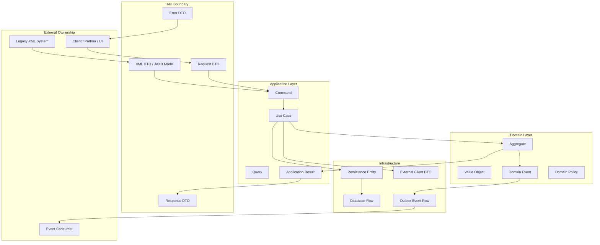
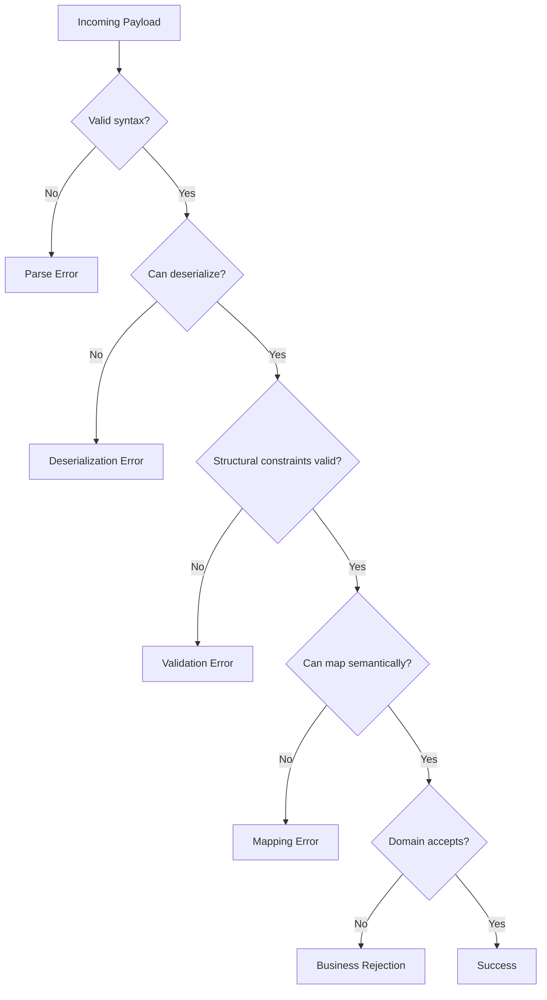
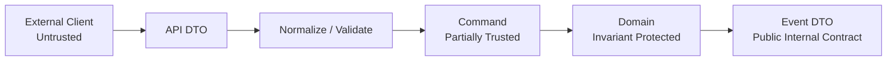
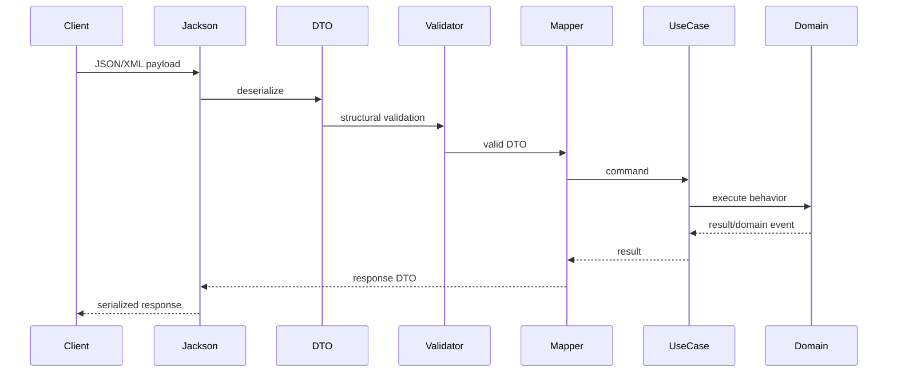
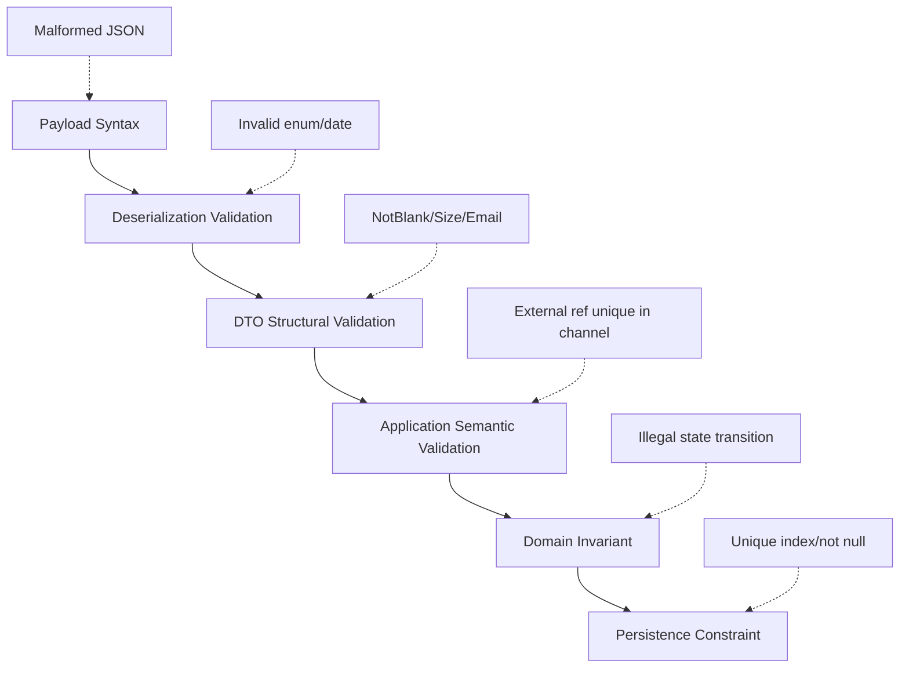
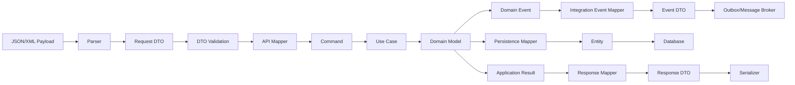

------
title: Learn Java Data Mapper, JSON/XML Processing & Validation - Part 002
description: Mental model data boundary untuk membedakan DTO, entity, command, event, API contract, read model, dan validation/mapping responsibility di sistem Java production.
series: learn-java-data-mapper-json-xml-validation
seriesTitle: Learn Java Data Mapper, JSON/XML Processing & Validation
order: 2
partTitle: Data Boundary Mental Model
tags:
- java
- data-boundary
- dto
- api-contract
- event-contract
- command
- entity
- jackson
- mapstruct
- validation
date: 2026-06-29
---

# Part 002 — Data Boundary Mental Model

## 1. Tujuan Part Ini

Part ini menjawab pertanyaan fundamental:

> Model apa yang seharusnya dipakai di boundary, model apa yang seharusnya tetap internal, dan kapan data harus dimapping?

Kesalahan besar dalam sistem Java enterprise bukan sekadar salah konfigurasi Jackson atau MapStruct. Kesalahan besarnya adalah **mencampur model yang punya alasan hidup berbeda**.

Contoh anti-pattern:

```java
@RestController
class CaseController {

    @PostMapping("/cases")
    CaseEntity create(@RequestBody CaseEntity entity) {
        return repository.save(entity);
    }
}
```

Ini ringkas. Ini juga berbahaya.

Masalahnya:

- persistence entity menjadi API contract;
- database structure bocor ke client;
- field internal bisa diisi client;
- lazy-loading/cycle bisa ikut serialize;
- migration database menjadi breaking change API;
- validation database dan validation external tercampur;
- domain invariant tidak punya boundary jelas;
- security review menjadi sulit.

Part ini membangun mental model untuk menghindari itu.

---

## 2. Boundary: Definisi Praktis

Boundary adalah titik ketika data berpindah dari satu ownership context ke ownership context lain.

Boundary tidak selalu berarti network.

Contoh boundary:

| Boundary | Dari | Ke |
|---|---|---|
| HTTP request | external client | service |
| HTTP response | service | external client |
| message event | producer service | consumer service |
| database row | database | application |
| command | application layer | domain/use case |
| query result | database/read side | UI/API response |
| file import | file system/vendor | ingestion service |
| XML exchange | legacy system | integration layer |
| scheduled job input | scheduler/config | job handler |
| validation result | validation layer | error response model |

Setiap boundary punya contract.

Contract menjawab:

- field apa yang ada;
- tipe apa yang diterima;
- field mana required;
- field mana optional;
- null berarti apa;
- unknown field diapakan;
- format date-time apa;
- enum boleh apa saja;
- error apa yang dikembalikan;
- perubahan apa yang dianggap breaking.

---

## 3. Model Bukan Sekadar Class

Di Java, semuanya bisa terlihat seperti class/record. Tetapi class dengan shape yang mirip belum tentu punya peran yang sama.

Contoh:

```java
public record CaseDto(
        String id,
        String status,
        String description
) {}
```

```java
public record Case(
        CaseId id,
        CaseStatus status,
        CaseDescription description
) {}
```

```java
@Entity
class CaseEntity {
    @Id
    String id;

    String status;

    @Column(length = 4000)
    String description;
}
```

Tiga model ini mirip. Tetapi alasan hidupnya berbeda.

| Model | Alasan hidup |
|---|---|
| DTO | contract dengan consumer/producer tertentu |
| Domain model | menjaga invariant dan behavior bisnis |
| Entity | persistence mapping dan lifecycle database |
| Event | fakta yang sudah terjadi dan dikonsumsi async |
| Command | intent untuk melakukan perubahan |
| Query/read model | bentuk data optimal untuk baca/display |
| XML model | representasi contract XML, sering namespace/schema-driven |
| Error model | contract kegagalan yang bisa dipahami client |

Kesalahan umum: karena field-nya sama, engineer menganggap modelnya boleh sama.

Padahal model tidak hanya ditentukan oleh field. Model ditentukan oleh **ownership, lifecycle, invariant, compatibility, dan trust level**.

---

## 4. Peta Model dalam Aplikasi Production



Aturan inti:

> Model boleh mirip. Ownership tidak boleh kabur.

---

## 5. DTO: Data Transfer Object

DTO adalah model contract. DTO tidak harus punya behavior bisnis. DTO harus mudah diserialisasi/deserialisasi dan stabil terhadap consumer.

DTO yang baik:

- eksplisit terhadap external field name;
- jelas terhadap null/absence policy;
- tidak membawa field internal;
- tidak mengandung lazy-loaded graph;
- tidak menyembunyikan business rule;
- punya validation structural;
- punya fixture contract;
- punya compatibility policy.

Contoh request DTO:

```java
package com.example.caseintake.api.v1;

import jakarta.validation.Valid;
import jakarta.validation.constraints.NotBlank;
import jakarta.validation.constraints.NotNull;
import jakarta.validation.constraints.Size;

import java.time.OffsetDateTime;
import java.util.List;

public record CaseIntakeRequest(
        @NotBlank
        String externalReference,

        @Valid
        @NotNull
        ReporterRequest reporter,

        @NotNull
        CaseTypeRequest caseType,

        PriorityRequest priority,

        @NotNull
        OffsetDateTime occurredAt,

        @NotBlank
        @Size(max = 4000)
        String description,

        List<AttachmentRequest> attachments
) {
}
```

Contoh response DTO:

```java
package com.example.caseintake.api.v1;

import java.time.OffsetDateTime;

public record CaseIntakeResponse(
        String caseId,
        String externalReference,
        String status,
        OffsetDateTime acceptedAt
) {
}
```

Perhatikan:

- request DTO dan response DTO dipisah;
- request tidak punya `caseId` internal;
- response tidak perlu mengembalikan semua field input;
- field `status` output berasal dari sistem, bukan dari client.

---

## 6. Command: Intent untuk Mengubah Sistem

Command bukan external contract. Command adalah intent internal application layer.

DTO menjawab:

> Client mengirim apa?

Command menjawab:

> Sistem diminta melakukan apa?

Contoh:

```java
package com.example.caseintake.application;

import java.time.OffsetDateTime;
import java.util.List;

public record OpenCaseCommand(
        ExternalReference externalReference,
        Reporter reporter,
        RequestedCaseType caseType,
        RequestedPriority requestedPriority,
        OffsetDateTime occurredAt,
        CaseDescription description,
        List<AttachmentReference> attachments,
        Actor actor
) {
}
```

Command bisa punya data yang tidak berasal dari request body:

- authenticated actor;
- tenant id;
- request id;
- channel;
- correlation id;
- resolved default;
- normalized value;
- idempotency key.

Itulah sebabnya `RequestDto` tidak selalu sama dengan `Command`.

Mapping dari DTO ke command adalah semantic mapping.

```java
@Mapper(componentModel = "spring")
public interface CaseIntakeMapper {

    OpenCaseCommand toCommand(
            CaseIntakeRequest request,
            Actor actor,
            Channel channel
    );
}
```

Dalam praktik, method seperti di atas sering butuh `@Context`, factory, atau manual assembler karena tidak semua field berasal dari satu source.

---

## 7. Domain Model: Invariant dan Behavior

Domain model bukan bentuk data untuk JSON. Domain model adalah tempat invariant hidup.

Contoh:

```java
public final class CaseDescription {
    private final String value;

    private CaseDescription(String value) {
        this.value = value;
    }

    public static CaseDescription of(String raw) {
        String normalized = raw == null ? "" : raw.trim();

        if (normalized.isBlank()) {
            throw new IllegalArgumentException("description must not be blank");
        }

        if (normalized.length() > 4000) {
            throw new IllegalArgumentException("description must not exceed 4000 characters");
        }

        return new CaseDescription(normalized);
    }

    public String value() {
        return value;
    }
}
```

Mungkin terlihat mirip dengan `@NotBlank` dan `@Size(max = 4000)` di DTO. Tetapi tujuannya beda.

- DTO validation memberi feedback cepat ke client.
- Domain invariant memastikan object internal tidak bisa berada pada state invalid.

Untuk sistem serius, keduanya bisa hidup bersamaan.

Jangan berpikir:

> “Sudah ada `@NotBlank`, domain tidak perlu validate.”

Lebih aman berpikir:

> “DTO validation menolak input buruk. Domain invariant melindungi sistem dari semua caller, termasuk test, batch job, migration, dan future code.”

---

## 8. Entity: Persistence Mapping, Bukan API Contract

Entity hidup karena database. Entity punya concern yang berbeda:

- table/column mapping;
- id generation;
- optimistic locking;
- lazy loading;
- relationship;
- persistence lifecycle;
- migration compatibility;
- database constraints.

Contoh:

```java
@Entity
@Table(name = "case_record")
class CaseEntity {

    @Id
    @Column(name = "case_id")
    private String id;

    @Column(name = "external_ref", nullable = false)
    private String externalReference;

    @Column(name = "status", nullable = false)
    private String status;

    @Column(name = "description", nullable = false, length = 4000)
    private String description;

    @Version
    private long version;

    protected CaseEntity() {
    }

    // factory/update methods omitted
}
```

Entity tidak boleh otomatis menjadi response DTO.

Alasannya:

| Entity concern | Risiko jika diekspos ke API |
|---|---|
| lazy relation | serialization error/cycle/N+1 |
| internal id | data leak atau enumeration risk |
| version field | concurrency detail bocor |
| soft delete flag | implementation detail bocor |
| audit column | user/internal metadata bocor |
| schema migration | API ikut berubah |
| bidirectional relation | infinite recursion |
| JPA proxy | serialization unpredictable |

Kita tidak membahas JPA detail di seri ini, tetapi kita harus tahu batasnya karena mapper sering berdiri di antara entity dan DTO.

---

## 9. Event Contract

Event berbeda dari response.

Response adalah jawaban langsung ke caller.

Event adalah fakta yang dipublikasikan untuk consumer lain, sering async, sering disimpan lama, dan sering lebih sulit diubah.

Contoh event:

```java
public record CaseOpenedEventV1(
        String eventId,
        String caseId,
        String externalReference,
        String caseType,
        String occurredAt,
        String openedAt
) {
}
```

Event contract harus lebih hati-hati karena:

- consumer bisa banyak dan tidak semua diketahui;
- event bisa disimpan di log/outbox/topic lama;
- replay event lama harus tetap bisa diproses;
- field removal sangat berisiko;
- enum drift bisa mematahkan consumer;
- timestamp semantics harus jelas.

Rule of thumb:

> Treat event DTO as a long-lived public contract, even inside company.

Mapping domain event ke integration event harus eksplisit.

```java
@Mapper(componentModel = "spring")
public interface CaseEventMapper {
    CaseOpenedEventV1 toIntegrationEvent(CaseOpened domainEvent);
}
```

Jangan langsung serialize domain event jika domain event mengandung object internal, value object kompleks, atau field yang belum punya compatibility policy.

---

## 10. Read Model / View Model

Read model adalah model untuk kebutuhan baca. Ia bisa berbeda dari domain dan entity.

Contoh:

```java
public record CaseSummaryResponse(
        String caseId,
        String title,
        String statusLabel,
        String priorityLabel,
        String reporterName,
        String openedAtDisplay
) {
}
```

Read model boleh punya field display-oriented. Tetapi perlu hati-hati:

- jangan campur localization terlalu dini;
- jangan ubah machine-readable value menjadi label jika consumer butuh logic;
- jangan expose internal status jika external status mapping berbeda;
- jangan serialize field agregat yang mahal tanpa sadar.

Read model mapping sering terlihat sederhana, tetapi sebenarnya banyak semantic decision:

```java
public record CaseSummaryProjection(
        String caseId,
        String statusCode,
        String priorityCode,
        String reporterName,
        OffsetDateTime openedAt
) {
}
```

```java
public record CaseSummaryResponse(
        String caseId,
        String status,
        String priority,
        String reporterName,
        String openedAt
) {
}
```

Pertanyaan:

- apakah `status` response pakai internal code atau external code?
- apakah `openedAt` harus ISO-8601 atau localized string?
- apakah `priority` hasil request atau hasil kalkulasi sistem?
- apakah `reporterName` sensitif?

---

## 11. Error Model: Contract Saat Gagal

Error response juga contract.

Jangan biarkan exception internal langsung menjadi API response.

Contoh error DTO:

```java
public record ApiErrorResponse(
        String code,
        String message,
        String correlationId,
        List<FieldViolationResponse> violations
) {
}
```

```java
public record FieldViolationResponse(
        String field,
        String code,
        String message,
        Object rejectedValue
) {
}
```

Tetapi `rejectedValue` berbahaya jika field sensitif.

Lebih aman:

```java
public record FieldViolationResponse(
        String field,
        String code,
        String message
) {
}
```

Failure taxonomy:



Setiap failure type harus punya handling berbeda.

| Failure | Biasanya HTTP | Contoh |
|---|---:|---|
| Parse error | 400 | JSON malformed |
| Deserialization error | 400 | enum tidak dikenal |
| Validation error | 400/422 | field required kosong |
| Mapping error | 400/422/500 tergantung sebab | external code tidak punya mapping |
| Business rejection | 409/422 | case sudah ada, transition illegal |
| Internal serialization error | 500 | response gagal dibentuk |

Status HTTP bisa bervariasi sesuai standar organisasi, tetapi taxonomy-nya harus jelas.

---

## 12. Trust Boundary

Mapping harus sadar trust.

Data dari client tidak otomatis trusted. Bahkan data dari service internal lain pun hanya trusted sesuai contract.



Contoh field dengan trust issue:

| Field | Risiko |
|---|---|
| `userId` | client impersonation |
| `tenantId` | cross-tenant access |
| `status` | client mengatur state internal |
| `role` | privilege escalation |
| `createdAt` | audit manipulation |
| `price` | tampering |
| `priority` | bypass triage |
| `isVerified` | trust escalation |
| `sourceSystem` | spoofing |
| `correlationId` | log injection jika tidak dibatasi |

Aturan:

> Field yang menentukan authorization, ownership, audit, atau lifecycle kritis sebaiknya tidak diambil mentah dari request body.

Mapper harus sering menggabungkan body dengan context:

```java
public record CreateCaseHttpInput(
        CaseIntakeRequest body,
        AuthenticatedActor actor,
        TenantId tenantId,
        RequestMetadata metadata
) {
}
```

Lalu:

```java
public record OpenCaseCommand(
        TenantId tenantId,
        ActorId actorId,
        ExternalReference externalReference,
        Reporter reporter,
        RequestedPriority requestedPriority,
        RequestMetadata metadata
) {
}
```

---

## 13. Contract Axes

Saat mendesain model boundary, jangan hanya lihat field. Evaluasi tujuh axis berikut.

| Axis | Pertanyaan |
|---|---|
| Shape | Struktur field/object/array seperti apa? |
| Type | Tipe data external dan internal apa? |
| Meaning | Field berarti apa dalam domain? |
| Lifecycle | Kapan field dibuat, berubah, deprecated, atau dihapus? |
| Ownership | Siapa yang boleh mengisi atau mengubah field? |
| Compatibility | Apa yang terjadi pada client lama dan baru? |
| Failure | Jika invalid, error apa yang muncul? |

Contoh `priority`.

| Axis | Keputusan |
|---|---|
| Shape | string enum |
| Type | external enum `LOW/NORMAL/HIGH/URGENT` |
| Meaning | requested priority, bukan final priority |
| Lifecycle | optional di v1, mungkin required di v2 |
| Ownership | client boleh request, sistem boleh override |
| Compatibility | absent default `NORMAL`; unknown rejected |
| Failure | invalid enum -> deserialization/validation error |

Dengan matrix ini, mapper menjadi jelas:

- `PriorityRequest` tidak sama dengan domain `Priority`;
- field di command harus bernama `requestedPriority`;
- domain service menentukan final priority.

---

## 14. Null vs Absence di Boundary

Ini salah satu topik terbesar dan akan punya part sendiri. Namun mental model-nya harus dimulai sekarang.

JSON bisa membedakan:

```json
{}
```

dan:

```json
{
  "priority": null
}
```

Tetapi Java object biasa sering kehilangan perbedaan itu jika langsung deserialized ke field nullable.

Dalam create request:

| Input | Kemungkinan makna |
|---|---|
| field absent | gunakan default |
| field null | invalid |
| field empty string | invalid atau clear? |
| field empty array | sengaja kosong |
| field absent array | tidak dikirim, mungkin default empty |
| field object `{}` | object ada tetapi isinya kosong |

Dalam patch request:

| Input | Kemungkinan makna |
|---|---|
| field absent | jangan ubah |
| field null | clear value |
| field value | set value |

Karena itu create DTO dan patch DTO sering harus berbeda.

```java
public record CreateCaseRequest(
        String description,
        PriorityRequest priority
) {
}
```

```java
public record PatchCaseRequest(
        JsonNullable<String> description,
        JsonNullable<PriorityRequest> priority
) {
}
```

`JsonNullable` hanya contoh konsep. Library/approach yang dipakai harus dipilih sesuai stack. Yang penting: PATCH perlu merepresentasikan tri-state:

1. absent;
2. explicit null;
3. present value.

Jika tidak, mapper tidak bisa tahu intent client.

---

## 15. Boundary Model Decision Table

| Situation | Model yang disarankan | Alasan |
|---|---|---|
| Public HTTP request | Request DTO | contract stabil, validasi jelas |
| Public HTTP response | Response DTO | hindari leak internal |
| Internal command | Command object | mewakili intent use case |
| Domain invariant | Domain model/value object | menjaga correctness |
| Database mapping | Entity/record persistence | schema/lifecycle DB |
| Message event | Event DTO/versioned event | compatibility async |
| XML legacy integration | XML DTO/JAXB model | namespace/schema-driven |
| Large import file | Streaming record model | hemat memory |
| UI-specific read | Read model/response projection | optimize query/display |
| Error response | Error DTO | failure contract stabil |

---

## 16. Where Mapping Lives

Mapping harus berada di boundary antar model, bukan tersebar random.

```txt
api/
  CaseController.java
  dto/
    CaseIntakeRequest.java
    CaseIntakeResponse.java
  mapper/
    CaseApiMapper.java

application/
  OpenCaseCommand.java
  OpenCaseUseCase.java

domain/
  Case.java
  CaseStatus.java
  CaseDescription.java

infrastructure/
  persistence/
    CaseEntity.java
    CasePersistenceMapper.java
  messaging/
    CaseEventMapper.java
```

Aturan praktis:

| Mapping | Lokasi |
|---|---|
| Request DTO → Command | API/application boundary |
| Command → Domain value object | application/domain factory |
| Domain → Response DTO | API mapper |
| Entity → Domain | infrastructure mapper/repository |
| Domain → Entity | infrastructure mapper/repository |
| Domain event → Integration event | messaging/outbox mapper |
| External service DTO → internal model | integration adapter |

Jangan membuat satu `GlobalMapper` yang tahu semua hal.

Contoh buruk:

```java
@Component
public class CaseMapper {
    CaseEntity requestToEntity(CaseIntakeRequest request) { ... }
    CaseIntakeResponse entityToResponse(CaseEntity entity) { ... }
    CaseOpenedEvent entityToEvent(CaseEntity entity) { ... }
}
```

Masalah:

- request langsung ke entity;
- entity menjadi pusat semua mapping;
- domain dilewati;
- mapper tahu terlalu banyak;
- perubahan satu boundary merusak boundary lain.

Lebih baik:

```txt
CaseApiMapper:
  CaseIntakeRequest -> OpenCaseCommand
  CaseCreatedResult -> CaseIntakeResponse

CasePersistenceMapper:
  Case -> CaseEntity
  CaseEntity -> Case

CaseIntegrationEventMapper:
  CaseOpened -> CaseOpenedEventV1
```

---

## 17. Jackson, MapStruct, Validation dalam Boundary

Tools bekerja pada tahap berbeda.



Tanggung jawab:

| Stage | Tool | Failure yang mungkin |
|---|---|---|
| parse | Jackson Core/XML parser | malformed payload |
| deserialize | Jackson Databind/JAXB | type mismatch, unknown enum |
| validate DTO | Jakarta Validation/Hibernate Validator | constraint violation |
| map | MapStruct/manual mapper | unmapped semantic, unsupported value |
| execute domain | domain model/use case | invariant violation, conflict |
| serialize | Jackson/JAXB | object graph/cycle/custom serializer error |

---

## 18. Example: Bad Boundary vs Good Boundary

### 18.1 Bad Boundary

```java
@PostMapping("/cases")
public CaseEntity create(@RequestBody @Valid CaseEntity entity) {
    return caseRepository.save(entity);
}
```

Problems:

- external client can set entity fields;
- validation annotations serve persistence and API at same time;
- entity relationship may serialize accidentally;
- database column names influence API shape;
- audit fields may leak;
- future schema change becomes API change.

### 18.2 Better Boundary

```java
@PostMapping("/cases")
public CaseIntakeResponse create(
        @RequestBody @Valid CaseIntakeRequest request,
        Authentication authentication
) {
    Actor actor = actorResolver.resolve(authentication);
    OpenCaseCommand command = mapper.toCommand(request, actor);
    CaseCreatedResult result = openCaseUseCase.open(command);
    return mapper.toResponse(result);
}
```

Better because:

- request DTO is external contract;
- actor comes from security context, not body;
- command expresses internal intent;
- use case owns business decision;
- response DTO controls output contract.

---

## 19. Validation Placement

Validation is layered.



Contoh placement:

| Rule | Placement |
|---|---|
| `description` must not be blank | DTO + domain value object |
| `description` max 4000 | DTO + domain/database |
| `email` format | DTO |
| `externalReference` unique per partner | application/domain service + database unique constraint |
| `status` transition allowed | domain |
| `createdAt` generated by system | application/domain, not request |
| tenant must match actor | application authorization |
| foreign id exists | application/domain repository check |
| XML syntax valid | parser |
| JSON field unknown allowed? | Jackson config/contract test |

Rule of thumb:

> Use Jakarta Validation for local structural constraints. Use domain/application code for rules requiring state, authorization, lifecycle, or cross-aggregate knowledge.

---

## 20. Contract Evolution Mental Model

DTO changes are not all equal.

| Change | Usually safe? | Notes |
|---|---|---|
| Add optional request field | usually safe | if unknown fields ignored by old server/client |
| Add response field | usually safe | if clients tolerate extra fields |
| Remove field | risky/breaking | clients may depend on it |
| Rename field | breaking | unless alias/versioning used |
| Change type | breaking | string to object, number to string |
| Tighten validation | potentially breaking | old valid requests become invalid |
| Loosen validation | often safer | but can affect domain |
| Add enum value | risky | clients may not handle it |
| Change default | risky | behavior changes silently |
| Change null semantics | very risky | can corrupt intent |

Kunci:

> Compatibility is about observed behavior, not just compile-time shape.

---

## 21. Anti-Patterns

### 21.1 Entity as DTO

```java
@RequestBody CaseEntity entity
```

Avoid.

### 21.2 One Model for Everything

```java
class CaseModel {
    // used for request, response, entity, event, command
}
```

Avoid unless system sangat kecil dan risikonya sadar.

### 21.3 Mapper as Business Engine

```java
@Mapping(target = "status", expression = "java(decideStatus(request))")
```

Jika `decideStatus` adalah business policy kompleks, jangan sembunyikan di mapper.

### 21.4 Validation as Domain Replacement

```java
public record TransferRequest(
    @Positive BigDecimal amount
) {}
```

Ini tidak menjamin domain transfer valid. Domain masih perlu rules seperti balance, account status, limit, currency, fraud policy.

### 21.5 Silent Default Everywhere

```java
public Priority priority() {
    return priority == null ? Priority.NORMAL : priority;
}
```

Default tersembunyi membuat audit sulit. Default harus ada di tempat yang bisa diuji dan dijelaskan.

### 21.6 Unknown Field Policy Tanpa Kesadaran

```java
objectMapper.configure(FAIL_ON_UNKNOWN_PROPERTIES, false);
```

Ini bukan selalu salah. Yang salah adalah melakukannya tanpa contract policy.

### 21.7 Exposing Internal Enum Directly

```java
public enum CaseStatus {
    DRAFT,
    PENDING_TRIAGE,
    AUTO_ESCALATED,
    CLOSED_BY_MIGRATION
}
```

Jika enum ini keluar ke public API, setiap internal state menjadi public contract.

---

## 22. Boundary Review Checklist

Gunakan checklist ini saat review PR.

### Model Ownership

- Apakah model ini request, response, command, domain, entity, event, atau read model?
- Apakah nama package mencerminkan perannya?
- Apakah model internal bocor ke external boundary?
- Apakah model external masuk terlalu jauh ke domain?

### Field Semantics

- Apakah setiap field punya makna jelas?
- Apakah field system-owned tidak bisa diisi client?
- Apakah field audit tidak berasal dari request body?
- Apakah enum external dipisah dari enum internal?
- Apakah timestamp punya timezone/offset policy?

### Null/Absence

- Apakah required/optional jelas?
- Apakah null berbeda dari absent?
- Apakah default eksplisit?
- Apakah PATCH memakai tri-state?

### Validation

- Apakah structural validation ada di DTO?
- Apakah domain invariant tetap ada?
- Apakah cross-field rule ditempatkan benar?
- Apakah rule yang butuh database tidak dipaksa masuk annotation field?

### Mapping

- Apakah mapper hanya mengubah bentuk atau juga menyembunyikan policy?
- Apakah mapper test mencakup null/absence/default?
- Apakah field sensitif tidak ikut map ke response/event?
- Apakah unmapped target policy cukup ketat?

### Compatibility

- Apakah perubahan ini additive atau breaking?
- Apakah fixture v1/v2 diperbarui?
- Apakah unknown field behavior jelas?
- Apakah enum baru aman untuk consumer?

### Failure

- Apakah parse/deserialization/validation/mapping/domain errors dibedakan?
- Apakah error response tidak membocorkan sensitive value?
- Apakah correlation id tersedia?
- Apakah log tidak menyimpan payload sensitif mentah?

---

## 23. Practice: Desain Boundary untuk Case Intake

Buat struktur package:

```txt
com.example.caseintake
  api
    v1
      CaseIntakeRequest.java
      CaseIntakeResponse.java
      ReporterRequest.java
      AttachmentRequest.java
      CaseTypeRequest.java
      PriorityRequest.java
      CaseErrorResponse.java
  application
    OpenCaseCommand.java
    OpenCaseUseCase.java
    CaseCreatedResult.java
  domain
    Case.java
    CaseId.java
    ExternalReference.java
    Reporter.java
    CaseDescription.java
    CaseType.java
    Priority.java
  infrastructure
    persistence
      CaseEntity.java
      CasePersistenceMapper.java
    messaging
      CaseOpenedEventV1.java
      CaseEventMapper.java
```

Lalu tulis mapping responsibility:

```md
# Mapping Responsibility

## API
- CaseIntakeRequest -> OpenCaseCommand
- CaseCreatedResult -> CaseIntakeResponse
- ConstraintViolation -> CaseErrorResponse

## Domain
- OpenCaseCommand -> Case creation behavior
- domain validates lifecycle and invariant

## Persistence
- Case -> CaseEntity
- CaseEntity -> Case

## Messaging
- CaseOpened -> CaseOpenedEventV1
```

---

## 24. Mini Case Study: Priority Field

### Requirement

Client boleh mengirim `priority`, tetapi sistem boleh override berdasarkan policy.

Payload:

```json
{
  "externalReference": "EXT-1",
  "priority": "URGENT"
}
```

Bad model:

```java
public record Case(
        String externalReference,
        Priority priority
) {
}
```

Kenapa buruk?

- tidak membedakan requested priority dan final priority;
- domain sulit audit;
- response bisa membingungkan;
- event tidak menjelaskan apakah priority berasal dari client atau system.

Better model:

```java
public record OpenCaseCommand(
        ExternalReference externalReference,
        RequestedPriority requestedPriority
) {
}
```

```java
public final class Case {
    private Priority finalPriority;
    private RequestedPriority requestedPriority;

    public static Case open(OpenCaseCommand command, PriorityPolicy policy) {
        Priority finalPriority = policy.resolve(command.requestedPriority());
        return new Case(command.requestedPriority(), finalPriority);
    }
}
```

Response:

```java
public record CaseIntakeResponse(
        String caseId,
        String requestedPriority,
        String assignedPriority,
        String status
) {
}
```

Event:

```java
public record CaseOpenedEventV1(
        String caseId,
        String requestedPriority,
        String assignedPriority
) {
}
```

Makna menjadi jelas.

---

## 25. Mini Case Study: External Reference vs Internal Id

Payload:

```json
{
  "caseId": "CASE-123"
}
```

Pertanyaan:

- apakah `caseId` dari client boleh menentukan id internal?
- apakah ini sebenarnya `externalReference`?
- apakah id internal harus generated?
- apakah external reference unik per tenant/channel?
- apakah response perlu mengembalikan keduanya?

Better request:

```java
public record CaseIntakeRequest(
        String externalReference
) {
}
```

Better response:

```java
public record CaseIntakeResponse(
        String caseId,
        String externalReference
) {
}
```

Internal command:

```java
public record OpenCaseCommand(
        TenantId tenantId,
        ExternalReference externalReference
) {
}
```

Internal id:

```java
public record CaseId(String value) {
}
```

Rule:

> Jangan biarkan nama field membuat trust decision tersamar.

---

## 26. Mermaid: Complete Boundary Flow



Saat ada bug data, cari di tahap yang benar.

Contoh:

| Gejala | Kemungkinan layer |
|---|---|
| JSON malformed | parser |
| enum unknown | deserializer |
| required missing | validation |
| priority salah default | mapper/application |
| transition illegal | domain |
| response field bocor | response mapper/serializer |
| XML namespace gagal | XML parser/binding |
| duplicate external ref | application/database constraint |
| consumer event gagal | event contract/evolution |

---

## 27. Exercise

Desain model untuk requirement berikut.

### Requirement

API menerima request create customer:

```json
{
  "externalCustomerId": "C-001",
  "name": "Ayu",
  "email": "ayu@example.com",
  "tier": "GOLD",
  "isVerified": true
}
```

Aturan:

- `externalCustomerId` berasal dari partner;
- `name` wajib;
- `email` optional tetapi jika ada harus valid;
- `tier` boleh dikirim partner sebagai requested tier;
- final tier ditentukan sistem;
- `isVerified` tidak boleh dipercaya dari partner;
- response harus mengembalikan internal `customerId`.

Pertanyaan:

1. Field apa saja di request DTO?
2. Field apa saja di command?
3. Field apa saja di domain?
4. Field apa saja di response?
5. Field mana yang harus diabaikan/ditolak?
6. Validasi apa di DTO?
7. Validasi apa di domain/application?
8. Mapper apa yang diperlukan?

Jawaban arah:

- request DTO sebaiknya tidak punya `isVerified`, atau unknown field policy menolaknya;
- command punya `requestedTier`, bukan `tier`;
- domain punya `assignedTier`;
- response boleh punya `customerId`, `externalCustomerId`, `assignedTier`, status;
- final verification status berasal dari workflow internal;
- email validation bisa di DTO;
- tier policy di domain/application;
- mapper memisahkan requested vs assigned.

---

## 28. Checklist Penguasaan Part 002

Kamu dianggap menguasai part ini jika bisa:

- membedakan DTO, command, domain model, entity, event, read model, dan error model;
- menjelaskan mengapa entity tidak boleh langsung menjadi API contract;
- menjelaskan mengapa event contract lebih sulit diubah daripada response;
- menentukan lokasi mapper berdasarkan boundary;
- menentukan lokasi validation berdasarkan jenis rule;
- menjelaskan trust boundary;
- mendesain model untuk create vs patch;
- memetakan failure ke parser/deserializer/validator/mapper/domain;
- membuat boundary review checklist untuk PR.

---

## 29. Referensi Resmi dan Primer

- Jackson Databind Javadocs: https://javadoc.io/doc/com.fasterxml.jackson.core/jackson-databind/latest/
- FasterXML Jackson Databind repository: https://github.com/FasterXML/jackson-databind
- MapStruct Reference Guide: https://mapstruct.org/documentation/stable/reference/html/
- Jakarta Validation Specification: https://jakarta.ee/specifications/bean-validation/3.1/jakarta-validation-spec-3.1.html
- Hibernate Validator Documentation: https://hibernate.org/validator/documentation/
- Jakarta XML Binding Specification: https://jakarta.ee/specifications/xml-binding/

---

## 30. Ringkasan

Data boundary bukan sekadar tempat object masuk dan keluar. Boundary adalah tempat ownership, trust, lifecycle, compatibility, dan invariant berubah.

Model yang mirip shape-nya bisa punya peran yang berbeda:

- DTO menjaga contract;
- command membawa intent;
- domain menjaga invariant;
- entity menjaga persistence;
- event membawa fakta lintas waktu;
- read model mengoptimalkan konsumsi;
- error model menjelaskan kegagalan.

Pada Part 003, kita akan masuk ke **semantic mapping vs mechanical copying**: mengapa mapper yang compile dan terlihat benar tetap bisa menciptakan bug bisnis yang sulit dideteksi.
