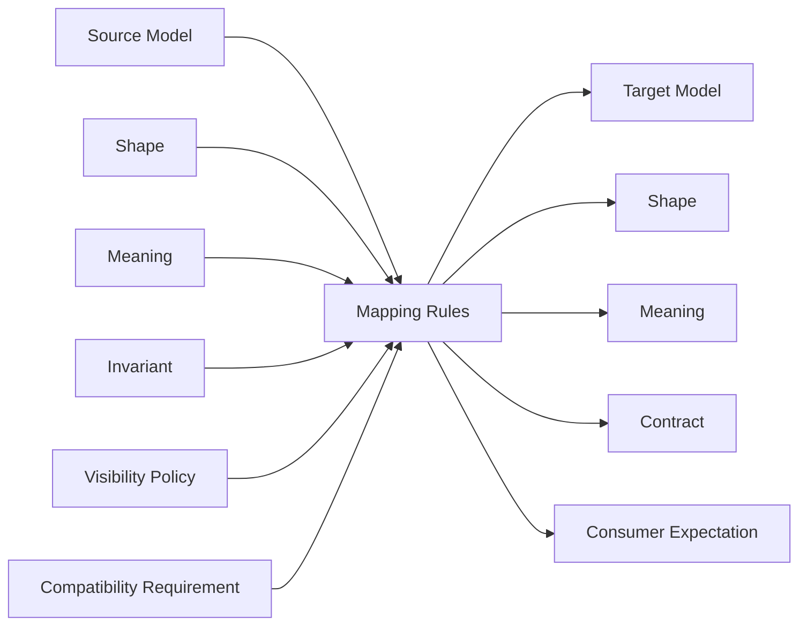
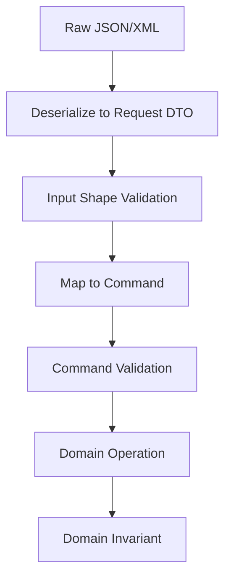
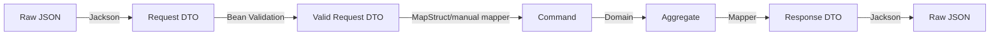

------
title: Learn Java Data Mapper, JSON/XML Processing & Validation - Part 003
description: Pemahaman mendalam tentang semantic mapping vs mechanical copying agar mapper tidak hanya memindahkan field, tetapi menjaga makna bisnis, intent, invariants, dan contract correctness.
series: learn-java-data-mapper-json-xml-validation
seriesTitle: Learn Java Data Mapper, JSON/XML Processing & Validation
order: 3
partTitle: Semantic Mapping vs Mechanical Copying
tags:
- java
- data-mapper
- semantic-mapping
- dto
- mapstruct
- jackson
- validation
- contract-correctness
- architecture
date: 2026-06-29
---

# Part 003 — Semantic Mapping vs Mechanical Copying

## 1. Tujuan Part Ini

Part ini membahas skill yang membedakan engineer biasa dan engineer yang bisa dipercaya menangani boundary kritis:

> **membedakan mapping sebagai copy field dengan mapping sebagai transformasi makna.**

Di banyak codebase, mapper terlihat seperti pekerjaan sederhana:

```java
customerDto.setName(customer.getName());
customerDto.setEmail(customer.getEmail());
customerDto.setStatus(customer.getStatus());
```

Atau dengan MapStruct:

```java
@Mapper
interface CustomerMapper {
    CustomerResponse toResponse(Customer customer);
}
```

Secara mekanis, itu benar.

Tetapi di production, pertanyaannya bukan hanya:

> “Apakah field A masuk ke field B?”

Pertanyaan yang lebih penting:

> “Apakah meaning dari data setelah melewati boundary masih sama dengan intent aslinya?”

Part ini akan membangun mental model, taxonomy, rule, dan checklist agar mapping tidak menjadi sumber bug bisnis tersembunyi.

---

## 2. Kaufman Focus untuk Part Ini

Dalam framework Josh Kaufman, kita tidak mencoba menghafal semua annotation sejak awal. Kita pecah skill menjadi subskill yang paling sering menghasilkan bug.

Untuk semantic mapping, subskill bernilai tinggi adalah:

1. membedakan **shape mapping** dan **meaning mapping**;
2. mengenali mapping yang mengandung keputusan bisnis;
3. memahami kapan mapper harus pure, kapan boleh enrich, kapan harus menolak data;
4. menjaga invariant saat data berubah bentuk;
5. mendesain mapper agar bisa dites sebagai contract;
6. mencegah silent data corruption;
7. menghindari implicit behavior yang tidak terlihat di review.

Kriteria berhasil:

- Anda bisa melihat mapper dan menjelaskan makna setiap transformasi.
- Anda bisa membedakan mapping aman, mapping berisiko, dan mapping yang seharusnya bukan mapper.
- Anda bisa menulis test yang menangkap perubahan semantic, bukan hanya coverage setter/getter.
- Anda bisa mereview PR mapper dengan pertanyaan arsitektural, bukan hanya syntax.

---

## 3. Definisi: Mechanical Copying

**Mechanical copying** adalah proses memindahkan nilai dari source ke target berdasarkan kesamaan field, nama, atau struktur.

Contoh:

```java
record CustomerEntity(
    Long id,
    String fullName,
    String email,
    String status
) {}

record CustomerResponse(
    Long id,
    String fullName,
    String email,
    String status
) {}
```

Mapper manual:

```java
CustomerResponse toResponse(CustomerEntity source) {
    return new CustomerResponse(
        source.id(),
        source.fullName(),
        source.email(),
        source.status()
    );
}
```

Di sini transformasinya hampir tidak mengandung keputusan.

Mechanical copying biasanya aman jika:

- source dan target berada pada boundary yang sama maknanya;
- field punya unit, tipe, dan semantic yang sama;
- tidak ada defaulting;
- tidak ada filtering;
- tidak ada authorization;
- tidak ada lifecycle transition;
- tidak ada interpretasi null/absence;
- tidak ada perubahan enum/domain state;
- tidak ada perubahan granularitas.

Tetapi kondisi seperti itu jarang bertahan lama.

---

## 4. Definisi: Semantic Mapping

**Semantic mapping** adalah transformasi yang mempertahankan atau mengubah makna data saat melewati boundary.

Contoh:

```java
record InternalCase(
    String caseId,
    CaseStatus status,
    Instant submittedAt,
    Instant lastEscalatedAt,
    boolean internalHold,
    boolean visibleToPublic,
    EnforcementRiskScore riskScore
) {}

record PublicCaseResponse(
    String id,
    String lifecycleStatus,
    String submittedDate,
    boolean escalationVisible
) {}
```

Mapping ini bukan hanya copy:

```java
PublicCaseResponse toPublicResponse(InternalCase source) {
    return new PublicCaseResponse(
        source.caseId(),
        publicLifecycleStatusOf(source.status(), source.internalHold()),
        source.submittedAt().atZone(ZoneOffset.UTC).toLocalDate().toString(),
        source.lastEscalatedAt() != null && source.visibleToPublic()
    );
}
```

Ada beberapa keputusan semantic:

- `caseId` diekspos sebagai `id`;
- `CaseStatus` internal diubah menjadi status public;
- timestamp dipotong menjadi tanggal;
- escalation hanya visible jika memenuhi policy;
- internal hold memengaruhi representasi external;
- risk score sengaja tidak keluar dari boundary.

Ini mapper, tetapi juga contract logic.

Jika salah, bug-nya bukan hanya bug teknis. Bug-nya bisa menjadi:

- data leakage;
- salah status ke client;
- pelanggaran SLA;
- salah escalation;
- audit inconsistency;
- dispute karena public record tidak sama dengan internal decision trail.

---

## 5. Model Mental Utama

Gunakan model berikut:

> Mapper bukan tempat data “dipindahkan”. Mapper adalah tempat **makna dinegosiasikan antar model**.



Saat membuat mapper, jangan mulai dari field.

Mulai dari pertanyaan:

1. Source model mewakili apa?
2. Target model mewakili apa?
3. Boundary apa yang sedang dilewati?
4. Siapa consumer dari target model?
5. Apa yang boleh hilang?
6. Apa yang tidak boleh berubah?
7. Apa yang harus disembunyikan?
8. Apa yang harus dibuat eksplisit?
9. Apa yang harus divalidasi sebelum mapping?
10. Apa yang harus divalidasi setelah mapping?

---

## 6. Boundary Menentukan Meaning

Field yang sama bisa punya makna berbeda tergantung boundary.

Contoh field `status`:

| Boundary | `status` berarti |
|---|---|
| Database entity | state persistence terakhir |
| Domain aggregate | state yang valid menurut lifecycle invariant |
| API response | state yang boleh dilihat client |
| API request | state yang diminta client, belum tentu boleh diterima |
| Event payload | fakta state change pada waktu tertentu |
| Report model | state yang dipakai untuk analitik historis |
| UI view model | label/status yang memudahkan user memahami proses |

Jika semua model punya field bernama `status`, mapper tetap tidak boleh menganggap semuanya sama.

Contoh berbahaya:

```java
@Mapper
interface CaseMapper {
    PublicCaseResponse toPublic(CaseEntity entity);
}
```

Jika MapStruct menemukan field dengan nama sama, ia akan generate assignment. Ini berguna untuk mechanical mapping, tetapi berbahaya jika field sama nama tetapi beda meaning.

Lebih aman:

```java
@Mapper
interface CaseMapper {

    @Mapping(target = "status", source = "entity", qualifiedByName = "publicStatus")
    PublicCaseResponse toPublic(CaseEntity entity);

    @Named("publicStatus")
    static String publicStatus(CaseEntity entity) {
        if (entity.isInternalHold()) {
            return "UNDER_REVIEW";
        }
        return switch (entity.getStatus()) {
            case OPEN -> "OPEN";
            case INVESTIGATING -> "IN_PROGRESS";
            case CLOSED_NO_ACTION, CLOSED_WITH_ACTION -> "CLOSED";
            case SEALED -> "RESTRICTED";
        };
    }
}
```

Rule:

> Jika field memiliki nama sama tetapi semantic berbeda, mapping harus dibuat eksplisit.

---

## 7. Taxonomy Transformasi Mapping

Agar mapper bisa direview dengan jelas, klasifikasikan transformasi ke beberapa jenis.

### 7.1 Rename Mapping

Hanya mengganti nama field.

```java
@Mapping(target = "id", source = "caseId")
CaseResponse toResponse(Case source);
```

Risiko rendah jika meaning tetap sama.

Review question:

- Apakah `caseId` dan `id` benar-benar identifier yang sama?
- Apakah formatnya sama?
- Apakah exposed ID boleh sama dengan internal ID?

Jika internal ID tidak boleh bocor, rename mapping berubah menjadi security problem.

---

### 7.2 Shape Mapping

Mengubah struktur tanpa mengubah meaning.

Contoh flattening:

```java
record Customer(
    CustomerId id,
    PersonName name,
    Contact contact
) {}

record CustomerResponse(
    String id,
    String fullName,
    String email
) {}
```

```java
@Mapping(target = "id", source = "id.value")
@Mapping(target = "fullName", source = "name.displayName")
@Mapping(target = "email", source = "contact.email")
CustomerResponse toResponse(Customer source);
```

Review question:

- Apakah flattening kehilangan data yang dibutuhkan consumer?
- Apakah nested object boleh null?
- Apakah `displayName` adalah representasi yang stabil?

---

### 7.3 Type Conversion Mapping

Mengubah tipe.

Contoh:

```java
@Mapping(target = "submittedAt", expression = "java(source.submittedAt().toString())")
```

Type conversion terlihat sederhana, tetapi sering mengandung semantic:

| Source | Target | Risiko |
|---|---|---|
| `Instant` | `String` | timezone/format ambiguity |
| `BigDecimal` | `double` | precision loss |
| `Long` | `String` | format dan leading zero |
| `String` | `Enum` | unknown value handling |
| `boolean` | `String` | localization/contract ambiguity |
| `LocalDateTime` | `Instant` | missing zone |

Rule:

> Type conversion harus punya policy eksplisit untuk format, precision, timezone, overflow, unknown value, dan null.

---

### 7.4 Reduction Mapping

Menghapus sebagian informasi.

Contoh:

```java
record InternalDecision(
    String decisionId,
    String outcome,
    String internalNotes,
    String investigatorComment,
    List<String> legalBasisCodes
) {}

record PublicDecisionResponse(
    String decisionId,
    String outcome
) {}
```

Reduction mapping sering diperlukan untuk privacy/security.

Tetapi ia harus disengaja.

Anti-pattern:

```java
// Field tidak dimapping karena lupa, bukan karena sengaja.
```

Lebih baik dokumentasikan:

```java
@Mapper(unmappedTargetPolicy = ReportingPolicy.ERROR)
interface DecisionMapper {

    @Mapping(target = "decisionId", source = "decisionId")
    @Mapping(target = "outcome", source = "outcome")
    PublicDecisionResponse toPublic(InternalDecision source);
}
```

Untuk target yang lebih kecil, `unmappedTargetPolicy = ERROR` membantu menangkap field target yang lupa dimapping. Tetapi field source yang sengaja tidak dipakai tetap perlu review/dokumentasi melalui mapper contract/test.

---

### 7.5 Enrichment Mapping

Menambahkan data yang tidak ada di source utama.

Contoh:

```java
record OrderResponse(
    String orderId,
    String customerName,
    String tierLabel
) {}
```

Jika `tierLabel` berasal dari service lain, mapper menjadi lebih dari pure mapping.

```java
OrderResponse toResponse(Order order) {
    Customer customer = customerClient.getCustomer(order.customerId());
    return new OrderResponse(
        order.id().value(),
        customer.name(),
        customer.tier().label()
    );
}
```

Ini mungkin bekerja, tetapi risikonya besar:

- mapper punya I/O;
- mapping bisa gagal karena network;
- testing lebih sulit;
- latency tersembunyi;
- retry policy tidak jelas;
- N+1 call bisa muncul;
- mapper tidak lagi deterministic.

Rule:

> Mapper sebaiknya pure. Enrichment sebaiknya terjadi sebelum mapper, melalui assembler/application service yang eksplisit.

Lebih baik:

```java
record OrderView(
    Order order,
    CustomerSnapshot customer
) {}

@Mapper
interface OrderViewMapper {
    OrderResponse toResponse(OrderView view);
}
```

Application service:

```java
OrderView view = new OrderView(order, customerSnapshot);
return mapper.toResponse(view);
```

---

### 7.6 Canonicalization Mapping

Menormalkan data ke bentuk canonical.

Contoh:

```java
String normalizedEmail = email.trim().toLowerCase(Locale.ROOT);
```

Pertanyaannya: apakah ini mapping atau domain rule?

Jika canonical email adalah invariant domain, jangan sembunyikan di DTO mapper.

Lebih baik:

```java
record EmailAddress(String value) {
    EmailAddress {
        Objects.requireNonNull(value, "value");
        value = value.trim().toLowerCase(Locale.ROOT);
        if (!value.contains("@")) {
            throw new IllegalArgumentException("Invalid email");
        }
    }
}
```

Mapper hanya membangun value object:

```java
EmailAddress toEmailAddress(String value) {
    return new EmailAddress(value);
}
```

Rule:

> Jika canonicalization menentukan validitas domain, letakkan di domain/value object. Jika hanya format output, letakkan di presentation mapper.

---

### 7.7 Policy Mapping

Mapping yang menerapkan policy visibility, authorization, masking, atau compliance.

Contoh:

```java
String maskNationalId(String id, Viewer viewer) {
    if (viewer.hasPermission("VIEW_FULL_ID")) {
        return id;
    }
    return "****" + id.substring(id.length() - 4);
}
```

Policy mapping tidak boleh terlihat seperti mapping biasa.

Jika tersembunyi di MapStruct expression, reviewer bisa melewatkan dampaknya.

Lebih baik:

```java
@Mapper
abstract class CustomerPrivacyMapper {

    @Mapping(target = "nationalId", expression = "java(mask(source.nationalId(), viewer))")
    abstract CustomerResponse toResponse(Customer source, @Context ViewerContext viewer);

    protected String mask(String nationalId, ViewerContext viewer) {
        return viewer.canViewFullNationalId()
            ? nationalId
            : NationalIdMasker.mask(nationalId);
    }
}
```

Dan test harus menyebut policy:

```java
@Test
void masksNationalIdForViewerWithoutPermission() {
    // given
    var viewer = ViewerContext.without("VIEW_FULL_ID");

    // when
    var response = mapper.toResponse(customerWithNationalId("1234567890"), viewer);

    // then
    assertThat(response.nationalId()).isEqualTo("****7890");
}
```

---

## 8. Mapping Responsibility Matrix

Tidak semua transformasi seharusnya berada di mapper.

| Transformasi | Cocok di mapper? | Tempat yang lebih tepat |
|---|---:|---|
| rename field | Ya | Mapper |
| flatten object | Ya | Mapper |
| enum externalization | Ya, jika explicit | Mapper + enum adapter |
| date formatting untuk API | Ya | Mapper/serializer |
| domain invariant | Tidak | Domain model/value object |
| authorization decision | Biasanya tidak | Policy service/application service |
| masking field | Bisa, dengan context eksplisit | Privacy mapper/policy mapper |
| load data dari DB/service | Tidak | Application service/assembler |
| compute aggregate business status | Hati-hati | Domain service/read model projector |
| fill audit fields | Tidak | Application command handler/infrastructure |
| default request values | Bisa, tapi eksplisit | Request normalizer/application layer |
| validation external payload | Tidak hanya mapper | Validation layer + domain factory |

Prinsipnya:

> Mapper boleh mengubah representasi. Mapper tidak boleh diam-diam mengambil keputusan lifecycle besar.

---

## 9. Mapper sebagai Function: Purity dan Determinism

Mapper paling mudah dipahami jika dianggap sebagai function:

```text
Target = f(Source)
```

Atau dengan context eksplisit:

```text
Target = f(Source, MappingContext)
```

Mapper yang sehat memiliki sifat:

- deterministic: input sama menghasilkan output sama;
- side-effect free: tidak menulis database, tidak publish event, tidak mutate global state;
- explicit dependency: context atau service dependency terlihat;
- fail-fast: invalid source gagal dengan jelas;
- observable by test: transformasi bisa diuji tanpa container besar;
- no hidden I/O: tidak melakukan network call secara diam-diam.

Anti-pattern:

```java
class InvoiceMapper {
    private final TaxClient taxClient;
    private final AuditRepository auditRepository;

    InvoiceResponse toResponse(Invoice invoice) {
        auditRepository.save(new AuditEntry("mapped invoice"));
        BigDecimal tax = taxClient.calculate(invoice.total());
        return new InvoiceResponse(invoice.id(), invoice.total().add(tax));
    }
}
```

Ini bukan mapper. Ini orchestration.

Lebih baik:

```java
record InvoiceProjection(
    Invoice invoice,
    TaxCalculation tax
) {}

@Mapper
interface InvoiceMapper {
    InvoiceResponse toResponse(InvoiceProjection projection);
}
```

---

## 10. Silent Data Corruption

Bug mapper paling berbahaya adalah bug yang tidak throw exception.

Contoh:

```java
@Mapping(target = "amount", source = "amount")
PaymentCommand toCommand(PaymentRequest request);
```

Jika source `amount` adalah dollar dan target `amount` adalah cent, mapping tetap compile.

Data corrupt secara semantic.

### 10.1 Contoh Unit Mismatch

```java
record PaymentRequest(BigDecimal amount) {} // dollars
record PaymentCommand(long amount) {}       // cents
```

Mapper berbahaya:

```java
PaymentCommand toCommand(PaymentRequest request) {
    return new PaymentCommand(request.amount().longValue());
}
```

Input `10.50` menjadi `10`, bukan `1050`.

Solusi:

```java
record MoneyMinorUnit(long cents) {
    static MoneyMinorUnit fromMajor(BigDecimal major) {
        return new MoneyMinorUnit(
            major.movePointRight(2).setScale(0, RoundingMode.UNNECESSARY).longValueExact()
        );
    }
}
```

Mapper:

```java
PaymentCommand toCommand(PaymentRequest request) {
    return new PaymentCommand(MoneyMinorUnit.fromMajor(request.amount()).cents());
}
```

Test:

```java
@Test
void convertsMajorUnitToMinorUnitExactly() {
    var command = mapper.toCommand(new PaymentRequest(new BigDecimal("10.50")));
    assertThat(command.amount()).isEqualTo(1050L);
}
```

---

## 11. Null, Absence, and Intent

Null adalah sumber bug semantic terbesar dalam mapper.

Perbedaan penting:

| Bentuk | Meaning yang mungkin |
|---|---|
| field tidak dikirim | client tidak ingin mengubah field |
| field dikirim `null` | client ingin menghapus field |
| field dikirim `""` | client mengirim empty value |
| field dikirim default `0` | nilai aktual 0 atau default parser? |
| field dikirim `[]` | clear semua item atau list kosong? |

Contoh PATCH:

```json
{
  "phoneNumber": null
}
```

Bisa berarti:

1. hapus phone number;
2. field tidak valid karena phone number required;
3. tidak tahu phone number;
4. tidak ada perubahan.

Mapper tidak boleh menebak.

Model request yang lebih eksplisit:

```java
record PatchField<T>(boolean present, T value) {
    static <T> PatchField<T> absent() {
        return new PatchField<>(false, null);
    }

    static <T> PatchField<T> of(T value) {
        return new PatchField<>(true, value);
    }
}
```

Command:

```java
record UpdateCustomerCommand(
    String customerId,
    PatchField<String> phoneNumber
) {}
```

Dengan model ini, mapper bisa membedakan absence dari null.

Rule:

> Untuk update/patch, jangan gunakan DTO biasa jika Anda perlu membedakan “tidak dikirim” dan “dikirim null”.

---

## 12. Enum Mapping: Closed Internal vs Open External

Enum mapping sering dianggap mudah.

```java
ExternalStatus.valueOf(internalStatus.name())
```

Ini rapuh.

Internal enum biasanya closed untuk domain saat ini. External contract sebaiknya dirancang untuk evolution.

Contoh internal:

```java
enum CaseStatus {
    DRAFT,
    SUBMITTED,
    UNDER_REVIEW,
    ESCALATED,
    CLOSED,
    SEALED
}
```

External:

```java
enum CaseResponseStatus {
    DRAFT,
    IN_PROGRESS,
    CLOSED,
    RESTRICTED
}
```

Mapping explicit:

```java
CaseResponseStatus toExternal(CaseStatus status) {
    return switch (status) {
        case DRAFT -> CaseResponseStatus.DRAFT;
        case SUBMITTED, UNDER_REVIEW, ESCALATED -> CaseResponseStatus.IN_PROGRESS;
        case CLOSED -> CaseResponseStatus.CLOSED;
        case SEALED -> CaseResponseStatus.RESTRICTED;
    };
}
```

Manfaat switch exhaustive:

- jika internal enum bertambah, compiler memaksa mapping dipikirkan;
- reviewer melihat semantic grouping;
- external contract tidak ikut berubah karena internal lifecycle berubah.

Anti-pattern:

```java
return CaseResponseStatus.valueOf(status.name());
```

Ini mengikat external contract ke internal lifecycle.

---

## 13. Validation Before Mapping vs After Mapping

Mapping dan validation berhubungan erat, tetapi tidak sama.

Ada tiga level validasi:

1. **input shape validation**: apakah JSON/XML bisa dibaca dan field required tersedia;
2. **command validation**: apakah request bermakna sebagai command;
3. **domain validation**: apakah command boleh mengubah aggregate dalam state saat ini.



Contoh:

```java
record TransferRequest(
    @NotBlank String sourceAccountId,
    @NotBlank String destinationAccountId,
    @NotNull @Positive BigDecimal amount
) {}
```

Ini input validation.

Command:

```java
record TransferCommand(
    AccountId source,
    AccountId destination,
    Money amount
) {}
```

Mapping request ke command bisa gagal jika ID tidak valid secara format atau amount tidak bisa menjadi Money.

Domain validation:

```java
account.transferTo(destination, amount);
```

Di sini dicek saldo, account status, limit, hold, dan policy.

Rule:

> Jangan berharap Bean Validation di DTO menyelesaikan domain invariant.

---

## 14. Mapper as Anti-Corruption Layer

Dalam sistem yang berinteraksi dengan vendor, legacy system, atau public API, mapper sering menjadi anti-corruption layer.

Legacy payload:

```json
{
  "cust_no": "000123",
  "stat": "A",
  "dob": "19800131",
  "vip": "Y"
}
```

Internal model:

```java
record CustomerSnapshot(
    CustomerNumber number,
    CustomerStatus status,
    LocalDate dateOfBirth,
    boolean vip
) {}
```

Mapper tidak hanya copy:

- `cust_no` harus menjaga leading zero;
- `stat` harus dipetakan dari kode legacy;
- `dob` perlu format parser eksplisit;
- `vip` memakai flag `Y/N`;
- unknown code harus ditangani.

```java
CustomerStatus mapStatus(String stat) {
    return switch (stat) {
        case "A" -> CustomerStatus.ACTIVE;
        case "I" -> CustomerStatus.INACTIVE;
        case "S" -> CustomerStatus.SUSPENDED;
        default -> throw new UnknownLegacyStatusException(stat);
    };
}
```

Anti-corruption mapper harus lebih strict daripada mapper internal biasa.

Checklist:

- semua kode legacy dipetakan eksplisit;
- unknown code tidak menjadi default diam-diam;
- date format explicit;
- numeric identifier tidak dikonversi ke integer jika leading zero penting;
- boolean legacy flag punya parser khusus;
- error menyimpan raw value yang gagal;
- test memakai sample dari vendor/legacy nyata.

---

## 15. Jackson Mapping vs MapStruct Mapping

Jackson dan MapStruct sama-sama mengubah data, tetapi tanggung jawabnya berbeda.

| Tool | Source | Target | Fokus |
|---|---|---|---|
| Jackson | JSON/XML/string/stream/tree | Java object atau tree | serialization/deserialization |
| MapStruct | Java object | Java object | compile-time bean mapping |

Pipeline umum:



Kesalahan umum:

- memakai Jackson annotation untuk menyelesaikan domain mapping;
- memakai MapStruct untuk membaca JSON dynamic;
- membuat DTO Jackson terlalu mirip entity karena ingin mapper otomatis;
- menyembunyikan business rule dalam custom deserializer;
- memakai `@JsonAlias` untuk mengatasi rename internal, bukan contract evolution;
- menggunakan `@JsonIgnore` untuk security tanpa policy review.

Rule:

> Jackson menjaga contract external representation. MapStruct menjaga transformasi antar Java model. Domain menjaga invariant.

---

## 16. Semantic Mapping dengan MapStruct

MapStruct sangat baik untuk mapping eksplisit, tetapi harus dikonfigurasi agar tidak terlalu “percaya diri”.

Baseline yang disarankan:

```java
@MapperConfig(
    componentModel = "spring",
    unmappedTargetPolicy = ReportingPolicy.ERROR,
    typeConversionPolicy = ReportingPolicy.ERROR
)
public interface StrictMapperConfig {
}
```

Mapper:

```java
@Mapper(config = StrictMapperConfig.class)
interface CustomerMapper {

    @Mapping(target = "id", source = "id.value")
    @Mapping(target = "displayName", source = "profile.fullName")
    @Mapping(target = "status", source = "status", qualifiedByName = "externalStatus")
    CustomerResponse toResponse(Customer source);

    @Named("externalStatus")
    static String externalStatus(CustomerStatus status) {
        return switch (status) {
            case ACTIVE -> "ACTIVE";
            case SUSPENDED -> "RESTRICTED";
            case DELETED -> "UNAVAILABLE";
        };
    }
}
```

Kenapa strict?

- field target baru tidak otomatis terlupakan;
- conversion berisiko tidak terjadi diam-diam;
- mapping intent terlihat di PR;
- compiler menjadi feedback loop cepat.

Tetapi strict config bukan pengganti semantic review.

MapStruct bisa memastikan field mapped. Ia tidak bisa tahu apakah meaning benar.

---

## 17. Semantic Mapping dengan Jackson

Jackson annotation juga bisa mengandung semantic.

Contoh:

```java
record CustomerResponse(
    @JsonProperty("customer_id") String id,
    @JsonInclude(JsonInclude.Include.NON_NULL) String email,
    @JsonFormat(pattern = "yyyy-MM-dd") LocalDate registeredDate
) {}
```

Ini bukan hanya serialization syntax.

Keputusan semantic:

- external field name adalah `customer_id`;
- `email` hilang dari payload jika null;
- date dikirim tanpa timezone;
- consumer akan menganggap field absent berbeda dari null.

Review question:

- Apakah `NON_NULL` aman untuk consumer?
- Apakah field null perlu dikirim eksplisit?
- Apakah format tanggal sudah contractually stable?
- Apakah rename memakai `@JsonProperty` karena external contract atau hanya mengikuti style internal?

Jackson juga bisa membuat semantic drift jika annotation ditempel di domain model.

Anti-pattern:

```java
class Customer {
    @JsonIgnore
    private RiskScore riskScore;
}
```

Masalah:

- domain model tahu tentang JSON;
- riskScore ignore untuk semua serialization, termasuk internal tooling;
- security policy tersebar;
- jika ada serializer lain, field bisa bocor.

Lebih baik pisahkan response DTO.

---

## 18. Mapping Failure Strategy

Mapper harus punya strategi failure.

Kemungkinan failure:

- source null;
- required nested object null;
- unknown enum;
- invalid date format;
- unsupported legacy code;
- lossy conversion;
- overflow;
- precision loss;
- illegal state transition;
- missing context;
- inconsistent source fields.

Jangan default ke nilai aman palsu.

Anti-pattern:

```java
CustomerStatus mapStatus(String value) {
    try {
        return CustomerStatus.valueOf(value);
    } catch (Exception e) {
        return CustomerStatus.ACTIVE;
    }
}
```

Ini catastrophic.

Lebih baik:

```java
CustomerStatus mapStatus(String value) {
    return switch (value) {
        case "A" -> CustomerStatus.ACTIVE;
        case "I" -> CustomerStatus.INACTIVE;
        case "S" -> CustomerStatus.SUSPENDED;
        default -> throw new InvalidExternalCodeException("Unknown customer status: " + value);
    };
}
```

Untuk response mapping, kadang fallback boleh dipakai, tetapi harus eksplisit:

```java
String toDisplayStatus(CustomerStatus status) {
    return switch (status) {
        case ACTIVE -> "Active";
        case INACTIVE -> "Inactive";
        case SUSPENDED -> "Suspended";
        case UNKNOWN -> "Unknown";
    };
}
```

Rule:

> Unknown input dan unknown output adalah dua problem berbeda. Input unknown biasanya harus fail atau quarantine. Output unknown kadang bisa degrade gracefully.

---

## 19. Mapping Spec: Cara Membuat Mapper Bisa Direview

Untuk mapper penting, tulis mapping spec singkat.

Contoh format:

```mdx
## Mapping Spec: CaseEntity -> PublicCaseResponse

Source meaning:
- CaseEntity adalah persistence snapshot internal.
- Status mencerminkan lifecycle internal.

Target meaning:
- PublicCaseResponse adalah contract untuk external public API.
- Status tidak boleh mengekspos SEALED, INTERNAL_HOLD, atau legal review state.

Rules:
- caseId -> id, exposed as opaque string.
- status:
  - DRAFT -> not exposed because draft case should not be public.
  - SUBMITTED/UNDER_REVIEW/ESCALATED -> IN_PROGRESS.
  - CLOSED_* -> CLOSED.
  - SEALED -> RESTRICTED.
- internalNotes never mapped.
- riskScore never mapped.
- submittedAt is rendered as ISO-8601 UTC date-time.

Failure:
- null source: IllegalArgumentException.
- unknown status: fail-fast.

Tests:
- all statuses are covered.
- internal fields are not exposed.
- timezone format is stable.
```

Spec seperti ini membuat mapper bisa di-audit.

---

## 20. Golden Sample Testing

Mapper test sebaiknya berbasis sample yang punya meaning.

Contoh JSON response expected:

```json
{
  "id": "CASE-2026-0001",
  "status": "IN_PROGRESS",
  "submittedAt": "2026-06-29T01:30:00Z"
}
```

Test:

```java
@Test
void mapsInternalReviewCaseToPublicInProgress() {
    var source = CaseEntity.builder()
        .caseId("CASE-2026-0001")
        .status(CaseStatus.UNDER_REVIEW)
        .submittedAt(Instant.parse("2026-06-29T01:30:00Z"))
        .internalNotes("do not expose")
        .riskScore(new RiskScore(95))
        .build();

    var response = mapper.toPublic(source);

    assertThat(response.id()).isEqualTo("CASE-2026-0001");
    assertThat(response.status()).isEqualTo("IN_PROGRESS");
    assertThat(response.submittedAt()).isEqualTo("2026-06-29T01:30:00Z");
}
```

Test ini tidak hanya mengecek field. Ia mengecek policy.

---

## 21. Exhaustive Enum Test

Untuk enum mapping, test coverage harus exhaustive.

```java
@ParameterizedTest
@EnumSource(CaseStatus.class)
void everyInternalStatusHasPublicMapping(CaseStatus status) {
    assertThatCode(() -> mapper.toPublicStatus(status))
        .doesNotThrowAnyException();
}
```

Tambahkan expected table:

```java
static Stream<Arguments> publicStatusMapping() {
    return Stream.of(
        arguments(CaseStatus.SUBMITTED, "IN_PROGRESS"),
        arguments(CaseStatus.UNDER_REVIEW, "IN_PROGRESS"),
        arguments(CaseStatus.ESCALATED, "IN_PROGRESS"),
        arguments(CaseStatus.CLOSED_NO_ACTION, "CLOSED"),
        arguments(CaseStatus.CLOSED_WITH_ACTION, "CLOSED"),
        arguments(CaseStatus.SEALED, "RESTRICTED")
    );
}
```

Jika enum bertambah, test gagal dan memaksa keputusan.

---

## 22. Property-Based Thinking untuk Mapper

Tidak semua mapper cukup dites dengan satu sample.

Untuk transformasi yang punya invariant, gunakan property-based thinking.

Contoh invariant:

- mapping tidak boleh mengubah identifier;
- amount tidak boleh kehilangan precision;
- output date selalu UTC;
- sensitive fields tidak pernah muncul;
- unknown enum tidak boleh menjadi valid default;
- round-trip hanya boleh untuk model yang memang reversible.

Contoh pseudo-test:

```java
@Property
void mappingPreservesCustomerId(@ForAll("validCustomers") Customer customer) {
    CustomerResponse response = mapper.toResponse(customer);
    assertThat(response.id()).isEqualTo(customer.id().value());
}
```

Tidak harus selalu memakai library property-based testing. Yang penting adalah berpikir dalam invariant.

---

## 23. Reversibility: Jangan Asumsikan Mapping Bisa Dibalik

Banyak mapper dibuat dua arah:

```java
CustomerResponse toResponse(Customer customer);
Customer toDomain(CustomerResponse response);
```

Ini sering salah.

Mapping response biasanya reduction. Data yang hilang tidak bisa dikembalikan.

Contoh:

```java
Customer -> PublicCustomerResponse
```

Jika response tidak berisi risk score, internal notes, verification state, dan audit metadata, maka reverse mapping tidak mungkin benar.

Rule:

> Mapper dua arah hanya aman jika transformasi benar-benar bijective atau lossless. Mayoritas DTO mapping production tidak lossless.

Lebih baik gunakan model arah-spesifik:

```java
CreateCustomerRequest -> CreateCustomerCommand
Customer -> CustomerResponse
Customer -> CustomerEvent
```

Masing-masing punya semantic sendiri.

---

## 24. Mapping dan Auditability

Di domain regulated atau critical workflow, mapping harus audit-friendly.

Pertanyaan audit:

- Dari field mana output berasal?
- Apakah ada field yang disembunyikan?
- Apakah ada policy masking?
- Apakah ada perubahan status?
- Apakah ada defaulting?
- Apakah mapping berubah di release tertentu?
- Apakah historical payload masih bisa dibaca?
- Apakah failed mapping tersimpan untuk investigation?

Untuk mapper kritis, pertimbangkan:

- mapping spec;
- versioned mapper;
- golden input/output fixture;
- changelog untuk contract change;
- explicit exception untuk unsupported code;
- structured logging di boundary, bukan di pure mapper;
- correlation ID di orchestration layer.

---

## 25. Anti-Pattern Catalogue

### 25.1 Same Name Means Same Meaning

```java
@Mapping(target = "status", source = "status")
```

Masalah: nama sama tidak menjamin makna sama.

Solusi: mapping eksplisit untuk field semantic tinggi.

---

### 25.2 Mapper as Dumping Ground

```java
response.setAllowedActions(calculateAllowedActions(user, caseEntity));
response.setSlaBreached(slaService.isBreached(caseEntity));
response.setRiskLevel(riskClient.score(caseEntity));
```

Masalah: mapper menjadi orchestration service.

Solusi: buat projection/view model di application layer, lalu mapper hanya representasi.

---

### 25.3 Defaulting Unknown to Safe-Looking Value

```java
return value == null ? Status.ACTIVE : Status.valueOf(value);
```

Masalah: default palsu bisa mengaktifkan entity yang seharusnya invalid.

Solusi: unknown harus eksplisit.

---

### 25.4 Entity as DTO

```java
@PostMapping
CustomerEntity create(@RequestBody CustomerEntity entity) { ... }
```

Masalah: boundary hilang.

Solusi: request DTO dan command model.

---

### 25.5 Bidirectional Mapper by Habit

```java
CustomerDto toDto(Customer entity);
Customer toEntity(CustomerDto dto);
```

Masalah: arah mapping punya meaning berbeda.

Solusi: buat mapper arah-spesifik.

---

### 25.6 Silent Field Drop

Field source hilang tanpa alasan.

Solusi:

- mapping spec;
- test untuk sensitive/non-sensitive field;
- strict target policy;
- review source fields saat contract berubah.

---

### 25.7 Overusing Reflection-Based Magic

Mapper reflection-based bisa cepat untuk prototype, tetapi sulit diaudit untuk contract kritis.

Risiko:

- refactor field mengubah behavior diam-diam;
- runtime failure;
- performance overhead;
- sulit melihat generated/actual mapping;
- sulit enforce exhaustive enum.

MapStruct memberi feedback compile-time karena mapper implementation dihasilkan saat build.

---

## 26. Pattern: Semantic Adapter

Untuk mapping semantic tinggi, gunakan adapter kecil dan eksplisit.

```java
final class CaseStatusContractMapper {

    private CaseStatusContractMapper() {}

    static PublicCaseStatus toPublic(CaseStatus status) {
        return switch (status) {
            case DRAFT -> PublicCaseStatus.DRAFT;
            case SUBMITTED, UNDER_REVIEW, ESCALATED -> PublicCaseStatus.IN_PROGRESS;
            case CLOSED_NO_ACTION, CLOSED_WITH_ACTION -> PublicCaseStatus.CLOSED;
            case SEALED -> PublicCaseStatus.RESTRICTED;
        };
    }
}
```

MapStruct memakai adapter:

```java
@Mapper(uses = CaseStatusContractMapper.class)
interface CaseMapper {
    PublicCaseResponse toPublic(Case source);
}
```

Manfaat:

- semantic decision punya nama;
- bisa dites terpisah;
- tidak tersembunyi di expression panjang;
- mudah di-review oleh domain expert.

---

## 27. Pattern: Boundary Mapper per Use Case

Jangan membuat satu `CustomerMapper` raksasa untuk semua arah.

Anti-pattern:

```java
interface CustomerMapper {
    CustomerDto toDto(Customer entity);
    Customer toEntity(CustomerDto dto);
    CustomerResponse toResponse(Customer domain);
    CustomerEvent toEvent(Customer domain);
    CustomerReportRow toReport(Customer domain);
    CustomerSearchDocument toSearchDocument(Customer domain);
}
```

Masalah:

- terlalu banyak alasan berubah;
- sulit review;
- context campur;
- accidental reuse;
- mapping event bisa berubah karena response API berubah.

Lebih baik:

```java
interface CustomerCommandMapper {}
interface CustomerResponseMapper {}
interface CustomerEventMapper {}
interface CustomerReportMapper {}
interface CustomerSearchMapper {}
```

Rule:

> Mapper sebaiknya mengikuti boundary atau use case, bukan hanya entity name.

---

## 28. Pattern: Mapper Contract Test

Untuk mapper kritis, buat test berbasis contract.

```java
class PublicCaseMapperContractTest {

    @Test
    void publicResponseNeverContainsInternalFields() throws Exception {
        var response = mapper.toPublic(caseWithInternalData());
        String json = objectMapper.writeValueAsString(response);

        assertThat(json).doesNotContain("internalNotes");
        assertThat(json).doesNotContain("riskScore");
        assertThat(json).doesNotContain("investigatorId");
    }
}
```

Ini menggabungkan mapper dan serialization untuk boundary test.

Catatan penting:

- Unit test mapper mengecek Java-to-Java transformation.
- Contract test mengecek final external representation.
- Keduanya perlu untuk boundary penting.

---

## 29. Pattern: Mapping Decision Table

Untuk field dengan logic non-trivial, gunakan decision table.

| Internal status | Internal hold | Visibility | Public status |
|---|---:|---:|---|
| SUBMITTED | false | true | IN_PROGRESS |
| UNDER_REVIEW | false | true | IN_PROGRESS |
| ESCALATED | false | true | IN_PROGRESS |
| CLOSED_WITH_ACTION | false | true | CLOSED |
| SEALED | false | true | RESTRICTED |
| UNDER_REVIEW | true | true | UNDER_REVIEW |
| UNDER_REVIEW | true | false | RESTRICTED |

Decision table membantu:

- domain expert review;
- test generation;
- menghindari nested if tidak terbaca;
- menemukan missing case.

---

## 30. Code Review Checklist

Saat review mapper, tanyakan:

### 30.1 Boundary

- Boundary apa yang dilewati?
- Apakah source dan target punya alasan hidup berbeda?
- Apakah mapper mengikuti use case atau hanya entity name?

### 30.2 Meaning

- Field mana yang semantic tinggi?
- Apakah field bernama sama benar-benar bermakna sama?
- Apakah enum mapping explicit dan exhaustive?
- Apakah date/time punya timezone dan format policy?
- Apakah amount/money tidak kehilangan precision?

### 30.3 Null and Absence

- Apakah null, absent, empty, default dibedakan?
- Untuk PATCH, apakah intent user jelas?
- Apakah `nullValuePropertyMappingStrategy` digunakan dengan sadar?

### 30.4 Security and Privacy

- Apakah internal field bisa bocor?
- Apakah masking policy explicit?
- Apakah `@JsonIgnore` ditempel di domain model tanpa alasan kuat?

### 30.5 Failure

- Apa yang terjadi pada unknown enum/code?
- Apakah fallback aman atau menyembunyikan corruption?
- Apakah exception membawa context cukup?

### 30.6 Testing

- Apakah ada golden sample?
- Apakah enum exhaustive?
- Apakah contract serialization dites?
- Apakah negative case dites?

---

## 31. Latihan 20 Jam untuk Skill Ini

### Jam 1–2: Mapper Inventory

Ambil satu service nyata. Daftar semua mapper:

- request -> command;
- entity -> domain;
- domain -> response;
- domain -> event;
- event -> projection;
- XML/JSON external -> internal.

Klasifikasikan mechanical vs semantic.

### Jam 3–5: Semantic Field Review

Pilih 10 field semantic tinggi:

- status;
- type;
- amount;
- currency;
- effectiveDate;
- reason;
- priority;
- role;
- permission;
- visibility.

Tulis meaning per boundary.

### Jam 6–8: Enum Mapping Refactor

Cari mapping enum berbasis `name()` atau `valueOf()`.

Refactor menjadi switch explicit dan exhaustive.

### Jam 9–11: Null/Absence Drill

Ambil satu PATCH endpoint.

Tulis perbedaan:

- field absent;
- field null;
- field empty;
- field default.

Buat model intent eksplisit.

### Jam 12–14: Golden Fixture

Ambil satu mapper public response.

Buat golden input dan expected output.

Pastikan sensitive field tidak muncul.

### Jam 15–17: Mapping Spec

Tulis mapping spec untuk mapper paling berisiko.

Gunakan decision table untuk field status/type.

### Jam 18–20: Review Simulation

Review PR mapper seolah-olah Anda tech lead.

Cari:

- silent conversion;
- hidden policy;
- unclear fallback;
- leaking internal model;
- accidental bidirectional mapper;
- missing contract test.

---

## 32. Ringkasan Mental Model

Semantic mapping adalah discipline untuk menjaga meaning saat data berubah bentuk.

Prinsip utama:

1. Mapper bukan sekadar field copier.
2. Nama field sama tidak menjamin meaning sama.
3. Mapping arah-spesifik lebih aman daripada mapper dua arah generik.
4. Null, absence, empty, dan default harus punya meaning eksplisit.
5. Enum mapping harus explicit dan preferably exhaustive.
6. Mapper sebaiknya pure dan deterministic.
7. Enrichment dan I/O sebaiknya tidak disembunyikan di mapper.
8. Validation shape, command, dan domain invariant harus dipisahkan.
9. MapStruct membantu compile-time safety, bukan semantic correctness otomatis.
10. Jackson menjaga external representation, bukan domain truth.
11. Mapper kritis membutuhkan spec, golden sample, dan contract test.
12. Silent data corruption lebih berbahaya daripada exception yang jelas.

---

## 33. Referensi Primer

- MapStruct Reference Guide — compile-time type-safe mapper generation, annotation processor, generated implementation model.
- Jackson Databind `ObjectMapper` Javadoc — read/write JSON to/from POJO and tree model.
- Jakarta Validation Specification 3.1 — constraints, object graph validation, method/constructor validation, metadata model.
- Hibernate Validator Reference Guide — Jakarta Validation reference implementation and production features.

Di part berikutnya, kita akan membahas **contract evolution**: bagaimana JSON/XML/API/event payload berubah tanpa merusak consumer, bagaimana membedakan backward dan forward compatibility, dan bagaimana Jackson/validation/mapping strategy membantu menjaga evolusi contract.
