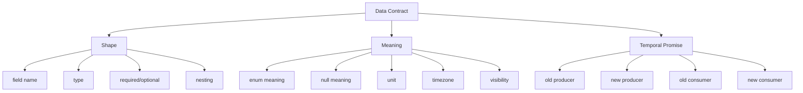
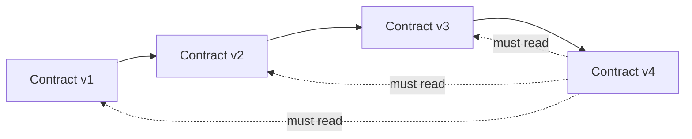
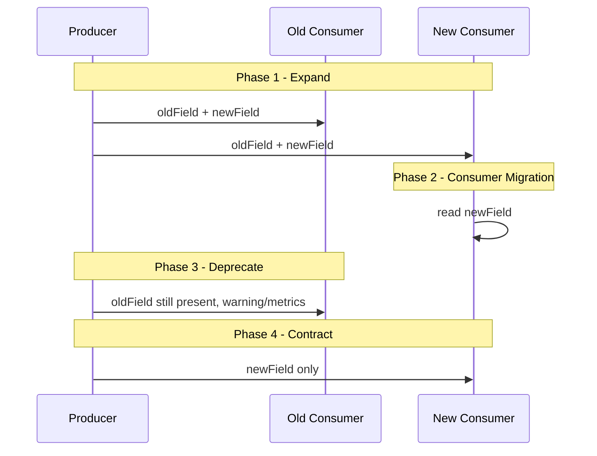

------
title: Learn Java Data Mapper, JSON/XML Processing & Validation - Part 004
description: Strategi contract evolution untuk JSON, XML, API payload, event payload, DTO, Jackson, MapStruct, dan validation agar perubahan data contract tetap backward/forward compatible di production.
series: learn-java-data-mapper-json-xml-validation
seriesTitle: Learn Java Data Mapper, JSON/XML Processing & Validation
order: 4
partTitle: Contract Evolution Compatibility
tags:
- java
- contract-evolution
- compatibility
- json
- xml
- jackson
- mapstruct
- validation
- api-contract
- event-contract
date: 2026-06-29
---

# Part 004 — Contract Evolution: Backward Compatibility, Forward Compatibility, Versioning, Deprecation

## 1. Tujuan Part Ini

Part ini membahas masalah yang selalu muncul begitu sistem dipakai banyak consumer:

> Bagaimana mengubah data contract tanpa merusak client, consumer, event subscriber, batch reader, partner integration, atau historical payload?

Pada tahap basic, kita sering berpikir contract sebagai class Java:

```java
record CustomerResponse(
    String id,
    String name,
    String email
) {}
```

Di production, contract bukan class. Contract adalah janji lintas waktu.

Jika contract sudah dikonsumsi oleh mobile app, frontend, partner, batch job, data pipeline, atau event consumer, perubahan kecil bisa menjadi breaking change.

Contoh perubahan yang terlihat aman tetapi berbahaya:

```diff
{
  "id": "C-001",
- "status": "ACTIVE"
+ "status": "ENABLED"
}
```

Bagi server, ini rename enum. Bagi consumer, ini bisa production outage.

Part ini membangun mental model dan playbook untuk mengelola evolusi contract secara defensible.

---

## 2. Kaufman Focus untuk Part Ini

Subskill bernilai tinggi:

1. membedakan producer compatibility dan consumer compatibility;
2. memahami backward, forward, full, dan transitive compatibility;
3. mengenali perubahan breaking vs non-breaking;
4. mendesain field agar mudah berevolusi;
5. memakai Jackson feature secara sadar untuk unknown/missing field;
6. mengelola enum evolution;
7. mengatur deprecation dan migration window;
8. menulis compatibility test;
9. memisahkan DTO versioning dari domain versioning;
10. menghindari “version everything” tanpa governance.

Target skill:

- Anda bisa membaca PR perubahan DTO dan memprediksi consumer mana yang rusak.
- Anda bisa membuat strategi evolusi tanpa langsung membuat `/v2` untuk semua perubahan.
- Anda bisa menentukan kapan additive change aman dan kapan tidak.
- Anda bisa membuat compatibility test untuk payload lama dan baru.

---

## 3. Contract sebagai Janji Lintas Waktu

Data contract punya tiga dimensi:



Banyak tim hanya mengelola shape.

Tim yang matang mengelola:

- shape;
- meaning;
- consumer expectation;
- historical payload;
- deployment order;
- deprecation window;
- schema registry atau contract test;
- observability untuk usage lama.

---

## 4. Vocabulary Compatibility

Ada empat istilah penting.

### 4.1 Backward Compatibility

**New consumer can read old data.**

Dalam event/schema context:

```text
new reader + old payload = works
```

Contoh:

```json
// old payload
{
  "id": "C-001",
  "name": "Alya"
}
```

New Java model:

```java
record CustomerEvent(
    String id,
    String name,
    String email
) {}
```

Jika `email` optional/default, new consumer bisa membaca old payload.

---

### 4.2 Forward Compatibility

**Old consumer can read new data.**

```text
old reader + new payload = works
```

Contoh new payload:

```json
{
  "id": "C-001",
  "name": "Alya",
  "email": "alya@example.com"
}
```

Old consumer harus ignore unknown field `email` agar tetap berjalan.

Dengan Jackson:

```java
@JsonIgnoreProperties(ignoreUnknown = true)
record CustomerEventV1(
    String id,
    String name
) {}
```

Catatan: ignore unknown field membantu shape compatibility, tetapi tidak otomatis menjamin semantic compatibility.

---

### 4.3 Full Compatibility

**Backward + forward compatible.**

```text
new consumer reads old data
old consumer reads new data
```

Biasanya aman untuk perubahan additive optional.

Contoh:

- tambah optional field;
- hapus field optional yang tidak required consumer;
- tambah alias field sementara;
- tambah enum value hanya jika consumer dirancang untuk unknown enum.

---

### 4.4 Transitive Compatibility

Compatibility tidak hanya dicek terhadap versi terakhir, tetapi terhadap semua versi historis yang masih perlu didukung.



Ini penting untuk event log, audit log, long-lived data, dan batch replay.

Jika Kafka topic/event store menyimpan event lama selama bertahun-tahun, consumer baru tidak cukup kompatibel dengan event versi kemarin. Ia harus bisa membaca event lama yang masih ada di retention atau archive.

---

## 5. API Contract vs Event Contract

API response dan event payload sama-sama data contract, tetapi evolution pressure-nya berbeda.

| Aspek | API Contract | Event Contract |
|---|---|---|
| Consumer | Biasanya request/response client | Banyak subscriber async |
| Historical payload | Biasanya tidak lama, kecuali cache/log | Sangat penting, event lama bisa replay |
| Deployment order | Server biasanya di-deploy dulu | Producer/consumer bisa tidak sinkron |
| Unknown field | Client mungkin ignore | Consumer harus didesain robust |
| Breaking change | Bisa pakai endpoint version | Sulit, topic/version strategy perlu governance |
| Validation | Request validation ketat | Event validation harus hati-hati agar replay tidak gagal |

Rule:

> Event contract biasanya perlu compatibility discipline lebih ketat daripada API response biasa karena event hidup lebih lama daripada request.

---

## 6. Change Taxonomy

### 6.1 Add Optional Field

Biasanya non-breaking.

```diff
{
  "id": "C-001",
  "name": "Alya",
+ "email": "alya@example.com"
}
```

Syarat:

- old consumer ignore unknown field;
- new field tidak mengubah meaning field lama;
- new field optional untuk old payload;
- producer tidak membuat consumer lama salah interpretasi.

Jackson old consumer:

```java
@JsonIgnoreProperties(ignoreUnknown = true)
record CustomerResponse(String id, String name) {}
```

New DTO:

```java
record CustomerResponse(String id, String name, String email) {}
```

Tetapi hati-hati: additive tidak selalu aman.

Contoh tidak aman:

```diff
{
  "status": "ACTIVE",
+ "suspended": true
}
```

Jika old consumer hanya membaca `status`, ia mungkin tetap menganggap customer active, padahal field baru mengubah meaning.

Rule:

> Additive field aman hanya jika tidak mengubah semantic field lama.

---

### 6.2 Add Required Field

Biasanya breaking untuk backward compatibility.

New model:

```java
record CreateCustomerRequest(
    @NotBlank String name,
    @NotBlank String email,
    @NotBlank String nationalId
) {}
```

Jika client lama tidak mengirim `nationalId`, request gagal.

Strategi:

1. tambah field sebagai optional;
2. observe adoption;
3. beri warning/deprecation;
4. setelah semua client siap, enforce required;
5. atau buat endpoint/contract version baru.

Jangan langsung menambahkan `@NotBlank` ke request contract yang sudah public tanpa migration plan.

---

### 6.3 Remove Field

Biasanya breaking untuk consumer yang masih membaca field.

```diff
{
  "id": "C-001",
- "email": "alya@example.com"
}
```

Strategi:

- deprecate field dulu;
- instrument usage;
- communicate timeline;
- keep field with null? Hati-hati, null bisa breaking semantic;
- remove hanya setelah consumer tidak memakai.

Dalam Java DTO:

```java
record CustomerResponse(
    String id,
    String name,
    /** @deprecated use contacts.primaryEmail */
    @Deprecated String email,
    ContactResponse contacts
) {}
```

---

### 6.4 Rename Field

Rename adalah remove + add.

```diff
{
- "customerName": "Alya",
+ "name": "Alya"
}
```

Untuk JSON input, Jackson bisa membantu migration:

```java
record CustomerRequest(
    @JsonProperty("name")
    @JsonAlias("customerName")
    String name
) {}
```

Ini berarti server menerima `name` dan `customerName`, tetapi serialize tetap memakai `name`.

Untuk response, rename lebih sulit karena consumer lama membaca field lama.

Strategi response:

```java
record CustomerResponse(
    String name,
    /** @deprecated use name */
    @Deprecated String customerName
) {
    CustomerResponse(String name) {
        this(name, name);
    }
}
```

Atau custom serializer jika perlu.

Rule:

> Rename field tidak boleh dianggap refactor internal. Di contract, rename adalah breaking change kecuali ada compatibility bridge.

---

### 6.5 Change Type

Biasanya breaking.

```diff
- "amount": "10.50"
+ "amount": 10.50
```

Atau:

```diff
- "createdAt": "2026-06-29"
+ "createdAt": "2026-06-29T10:15:30Z"
```

Risiko:

- parser consumer gagal;
- precision berubah;
- timezone ambiguity;
- validation rule berubah;
- analytics schema rusak.

Strategi aman:

```json
{
  "amount": "10.50",
  "amountMinor": 1050,
  "currency": "USD"
}
```

Deprecate field lama setelah migration.

---

### 6.6 Change Enum Values

Sangat sering breaking.

```diff
- "status": "ACTIVE"
+ "status": "ENABLED"
```

Ini bukan kosmetik.

Consumer sering melakukan:

```java
switch (status) {
    case "ACTIVE" -> showActive();
    case "SUSPENDED" -> showSuspended();
    default -> throw new IllegalStateException();
}
```

Strategi:

- jangan rename enum value tanpa versioning;
- tambahkan enum baru hanya jika consumer punya unknown handling;
- gunakan external enum yang lebih stabil daripada internal enum;
- dokumentasikan enum as open atau closed.

Open enum pattern:

```java
record CustomerStatusValue(String value) {
    boolean isKnown() {
        return Set.of("ACTIVE", "SUSPENDED", "CLOSED").contains(value);
    }
}
```

Atau Jackson fallback:

```java
enum CustomerStatus {
    ACTIVE,
    SUSPENDED,
    CLOSED,
    UNKNOWN
}
```

Dengan konfigurasi/annotation yang tepat, unknown value bisa diarahkan ke `UNKNOWN`. Tetapi gunakan dengan hati-hati: untuk command input, unknown status mungkin harus rejected, bukan diterima.

---

### 6.7 Change Meaning Without Changing Shape

Ini paling berbahaya karena contract test shape bisa tetap hijau.

Contoh:

```json
{
  "score": 80
}
```

Versi lama:

- `score` = raw score 0–100.

Versi baru:

- `score` = percentile 0–100.

Shape sama. Meaning berubah total.

Contoh lain:

| Field | Old meaning | New meaning |
|---|---|---|
| `active` | account can transact | account not deleted |
| `status=OPEN` | case submitted | case visible to investigator |
| `amount` | tax-exclusive amount | tax-inclusive amount |
| `createdAt` | server receive time | business effective time |
| `priority` | manual priority | algorithmic risk priority |

Rule:

> Perubahan meaning adalah breaking change meskipun JSON schema tidak berubah.

---

## 7. Contract Evolution dan Jackson

Jackson bisa membantu compatibility, tetapi juga bisa menyembunyikan masalah.

### 7.1 Ignore Unknown Properties

```java
@JsonIgnoreProperties(ignoreUnknown = true)
record CustomerEvent(
    String id,
    String name
) {}
```

Manfaat:

- old consumer tidak gagal saat producer menambah field;
- membantu forward compatibility.

Risiko:

- consumer mungkin mengabaikan field yang seharusnya mengubah behavior;
- typo field pada producer bisa tidak terdeteksi jika dipakai di input internal;
- security-sensitive unknown field bisa lewat tanpa disadari.

Rekomendasi:

| Context | `ignoreUnknown` |
|---|---|
| Public API request | Hati-hati; sering lebih baik reject unknown untuk strict API |
| Internal event consumer | Sering berguna untuk forward compatibility |
| Partner integration input | Tergantung contract; strict biasanya lebih aman |
| Config file | Biasanya reject unknown agar typo ketahuan |
| External response dari vendor | Ignore unknown bisa berguna |

---

### 7.2 Alias untuk Input Migration

```java
record CustomerRequest(
    @JsonProperty("name")
    @JsonAlias({"customerName", "full_name"})
    String name
) {}
```

Alias cocok untuk:

- rename input field;
- menerima client lama;
- migration window.

Alias bukan solusi permanen tanpa governance.

Tambahkan rencana:

- kapan alias ditambahkan;
- client mana yang masih memakai alias;
- kapan alias dihapus;
- bagaimana monitoring usage dilakukan.

---

### 7.3 Include Policy dan Null Contract

```java
@JsonInclude(JsonInclude.Include.NON_NULL)
record CustomerResponse(
    String id,
    String email
) {}
```

Jika `email` null, field hilang.

Consumer melihat:

```json
{
  "id": "C-001"
}
```

Ini berbeda dari:

```json
{
  "id": "C-001",
  "email": null
}
```

Contract harus menjawab:

- Apakah absent berarti unknown?
- Apakah null berarti intentionally empty?
- Apakah consumer wajib membedakan?
- Apakah schema mendokumentasikan nullable vs optional?

Rule:

> Jangan pakai `NON_NULL` global tanpa memahami semantic absence.

---

### 7.4 Default Values

Default values membantu backward compatibility, tetapi bisa berbahaya.

```java
record CustomerPreferences(
    String customerId,
    boolean marketingOptIn
) {}
```

Jika old payload tidak punya `marketingOptIn`, Java default `false` bisa berarti:

- user opt-out;
- data belum pernah dikumpulkan;
- consent unknown.

Ketiganya berbeda secara legal/produk.

Lebih baik:

```java
record CustomerPreferences(
    String customerId,
    ConsentState marketingConsent
) {}

enum ConsentState {
    OPTED_IN,
    OPTED_OUT,
    UNKNOWN
}
```

---

## 8. Contract Evolution dan MapStruct

MapStruct membantu menjaga compile-time mapping saat DTO berubah.

Contoh strict config:

```java
@MapperConfig(
    unmappedTargetPolicy = ReportingPolicy.ERROR,
    typeConversionPolicy = ReportingPolicy.ERROR
)
interface StrictMappingConfig {}
```

Jika target DTO menambah required field, mapper gagal compile sampai field dipetakan.

Ini bagus.

Tetapi compatibility tetap harus dipikirkan.

Contoh:

```java
record CustomerResponse(
    String id,
    String name,
    String email
) {}
```

Mapper bisa compile setelah Anda menambahkan:

```java
@Mapping(target = "email", source = "primaryEmail")
```

Namun consumer lama mungkin tidak siap terhadap field baru jika mereka strict parser. Jadi compile-time mapping safety bukan contract compatibility.

Rule:

> MapStruct menjaga producer code lengkap. Ia tidak menjamin consumer compatibility.

---

## 9. Contract Evolution dan Jakarta Validation

Validation bisa membuat perubahan menjadi breaking.

Contoh:

```java
record CreateCustomerRequest(
    @NotBlank String name,
    String email
) {}
```

Lalu berubah menjadi:

```java
record CreateCustomerRequest(
    @NotBlank String name,
    @NotBlank String email
) {}
```

Ini breaking untuk client yang tidak mengirim email.

Strategi bertahap:

```java
interface V1 {}
interface V2 {}

record CreateCustomerRequest(
    @NotBlank(groups = V1.class) String name,
    @NotBlank(groups = V2.class) String email
) {}
```

Atau lebih jelas dengan DTO berbeda:

```java
record CreateCustomerRequestV1(String name) {}
record CreateCustomerRequestV2(String name, String email) {}
```

Gunakan validation groups dengan hati-hati. Terlalu banyak group membuat model sulit dipahami.

Rule:

> Menambah constraint pada public request adalah contract change, bukan sekadar hardening.

---

## 10. XML Contract Evolution

XML punya isu tambahan:

- namespace;
- XSD;
- element vs attribute;
- ordering;
- optional/minOccurs;
- nillable;
- mixed content;
- schemaLocation;
- parser strictness.

Contoh additive XML field:

```xml
<Customer>
  <Id>C-001</Id>
  <Name>Alya</Name>
  <Email>alya@example.com</Email>
</Customer>
```

Jika consumer XSD lama strict dan tidak mengizinkan `<Email>`, payload baru bisa gagal.

Strategi:

- gunakan namespace versioning untuk perubahan besar;
- gunakan optional elements untuk additive evolution;
- jangan ubah meaning element tanpa versioning;
- jangan rename element tanpa dual-read/dual-write migration;
- jangan bergantung pada order jika consumer tidak butuh;
- validasi XML terhadap XSD yang sesuai versi.

JAXB/Jakarta XML Binding annotation bisa membantu mapping XML, tetapi compatibility tetap contract problem.

---

## 11. Versioning Strategy

Tidak semua perubahan membutuhkan `/v2`. Tetapi beberapa perubahan memang harus di-version.

### 11.1 No Version, Additive Compatible Change

Cocok untuk:

- tambah optional response field;
- tambah optional event field;
- tambah alias input sementara;
- perluas metadata tanpa mengubah meaning.

Syarat:

- consumer robust;
- dokumentasi update;
- test compatibility.

---

### 11.2 Field-Level Deprecation

Cocok untuk rename/migration kecil.

```json
{
  "name": "Alya",
  "customerName": "Alya"
}
```

`customerName` deprecated.

Kelemahan:

- payload redundant;
- mapper lebih kompleks;
- perlu timeline jelas.

---

### 11.3 Media Type Versioning

Contoh:

```http
Accept: application/vnd.company.customer.v2+json
Content-Type: application/vnd.company.customer.v2+json
```

Cocok untuk API yang butuh multiple representation pada endpoint sama.

Kelemahan:

- client dan tooling lebih kompleks;
- cache/proxy harus benar;
- dokumentasi harus kuat.

---

### 11.4 URI Versioning

```http
/api/v1/customers
/api/v2/customers
```

Mudah dipahami.

Kelemahan:

- bisa mendorong copy-paste controller;
- versioning resource bisa bercampur dengan versioning domain;
- lifecycle v1/v2 harus dikelola.

---

### 11.5 Event Type Versioning

Contoh:

```json
{
  "eventType": "CustomerRegisteredV2",
  "eventVersion": 2,
  "data": { ... }
}
```

Cocok untuk event breaking change.

Strategi event:

- event type baru untuk meaning baru;
- upcaster untuk membaca event lama;
- consumer bisa subscribe ke versi tertentu;
- schema registry/compatibility checks bila ada;
- replay test wajib.

---

## 12. DTO Versioning vs Domain Versioning

Jangan samakan DTO version dengan domain model version.

Domain bisa berubah tanpa contract berubah.

Contract bisa berubah tanpa domain berubah.

Contoh:

```java
// Domain berubah
record Customer(Name name, Email primaryEmail, List<Email> secondaryEmails) {}

// Contract lama tetap dipertahankan
record CustomerResponseV1(String name, String email) {}

// Contract baru mengekspose struktur baru
record CustomerResponseV2(String name, ContactResponse contacts) {}
```

Mapper menjaga isolasi:

```java
CustomerResponseV1 toV1(Customer customer);
CustomerResponseV2 toV2(Customer customer);
```

Rule:

> Jangan memaksa domain mengikuti DTO lama. Jangan memaksa consumer mengikuti domain baru.

---

## 13. Expand-and-Contract Migration

Pattern aman untuk perubahan contract:



Langkah:

1. Tambah field baru tanpa menghapus lama.
2. Producer mengisi keduanya.
3. Consumer baru mulai membaca field baru.
4. Monitor consumer lama.
5. Deprecate field lama.
6. Hapus setelah window selesai.

Contoh rename:

```json
{
  "customerName": "Alya",
  "name": "Alya"
}
```

---

## 14. Consumer-Driven Compatibility

Provider sering tidak tahu field mana yang dipakai consumer.

Solusi:

- consumer-driven contract tests;
- schema compatibility check;
- canary consumer;
- payload usage telemetry;
- deprecation headers;
- partner certification tests;
- sample replay.

Untuk internal platform, minimal:

```text
For every published contract:
- keep golden samples for old payloads;
- test new reader against old samples;
- test old reader or compatibility simulator against new samples;
- document breaking change policy;
- require owner approval for contract field removal/rename/type change.
```

---

## 15. Historical Payload Strategy

Jika Anda menyimpan raw JSON/XML untuk audit, replay, atau investigation, maka reader baru harus memikirkan payload lama.

Contoh old event:

```json
{
  "eventType": "CaseSubmitted",
  "caseId": "CASE-1",
  "submittedAt": "2024-01-01T10:00:00Z"
}
```

New event:

```json
{
  "eventType": "CaseSubmitted",
  "caseId": "CASE-1",
  "submission": {
    "submittedAt": "2024-01-01T10:00:00Z",
    "channel": "PORTAL"
  }
}
```

New reader harus bisa membaca old payload atau ada upcaster:

```java
interface EventUpcaster {
    boolean supports(String eventType, int version);
    JsonNode upcast(JsonNode oldPayload);
}
```

Upcaster mengubah old shape ke canonical new shape.

Rule:

> Jika data lama masih bisa replay, contract lama belum mati.

---

## 16. Compatibility Test Matrix

Buat matrix:

| Producer | Consumer | Expected |
|---|---|---|
| old producer | old consumer | works |
| old producer | new consumer | backward compatible |
| new producer | old consumer | forward compatible |
| new producer | new consumer | works |

Untuk event:

```java
@Test
void newConsumerReadsV1Event() throws Exception {
    String oldJson = fixture("customer-registered-v1.json");

    CustomerRegistered event = objectMapper.readValue(oldJson, CustomerRegistered.class);

    assertThat(event.customerId()).isEqualTo("C-001");
    assertThat(event.email()).isNull(); // or UNKNOWN, depending contract
}
```

Untuk new payload against old consumer, bisa pakai old DTO fixture/test module jika masih disimpan.

```java
@Test
void oldConsumerIgnoresNewOptionalField() throws Exception {
    String newJson = fixture("customer-registered-v2.json");

    CustomerRegisteredV1 event = oldObjectMapper.readValue(newJson, CustomerRegisteredV1.class);

    assertThat(event.customerId()).isEqualTo("C-001");
}
```

---

## 17. Breaking Change Checklist

Perubahan berikut biasanya breaking:

- remove field;
- rename field;
- change field type;
- change date/time format;
- change numeric unit;
- change enum value;
- remove enum value;
- add enum value untuk closed consumer;
- make optional field required;
- add validation constraint pada existing request;
- change null vs absent behavior;
- change default value meaning;
- change field meaning tanpa shape change;
- move field nesting tanpa compatibility bridge;
- change XML namespace;
- change XML element order untuk strict consumer;
- change XSD minOccurs/nillable;
- change error response shape;
- change pagination field meaning;
- change identifier format.

Perubahan yang sering non-breaking jika dirancang benar:

- add optional field;
- add optional metadata;
- add input alias;
- add enum value untuk open enum consumer;
- loosen validation constraint;
- support additional input format sambil mempertahankan format lama;
- add new endpoint without removing old endpoint;
- add new event type without changing old event type.

---

## 18. Error Contract Evolution

Banyak tim lupa bahwa error response juga contract.

Old:

```json
{
  "message": "Invalid email"
}
```

New:

```json
{
  "code": "INVALID_EMAIL",
  "message": "Invalid email",
  "field": "email"
}
```

Additive field mungkin aman.

Tetapi jika berubah menjadi:

```json
{
  "errors": [
    { "code": "INVALID_EMAIL", "field": "email" }
  ]
}
```

Consumer lama yang membaca `message` bisa rusak.

Rule:

> Error payload adalah contract, terutama untuk frontend, partner API, SDK, dan automated client.

---

## 19. Validation Error and Localization

Jakarta Validation/Hibernate Validator bisa menghasilkan message yang dilokalisasi.

Hati-hati menjadikan human message sebagai machine contract.

Bad client behavior:

```javascript
if (error.message === "must not be blank") {
  showNameRequired();
}
```

Lebih baik error punya stable code:

```json
{
  "code": "VALIDATION_FAILED",
  "violations": [
    {
      "field": "name",
      "constraint": "NotBlank",
      "message": "Name must not be blank"
    }
  ]
}
```

Even better untuk machine contract:

```json
{
  "field": "name",
  "code": "CUSTOMER_NAME_REQUIRED",
  "message": "Name must not be blank"
}
```

Human message boleh berubah. Error code harus stabil.

---

## 20. Deprecation Playbook

Deprecation tanpa telemetry hanya harapan.

Playbook:

1. Tandai field/endpoint/event sebagai deprecated di dokumentasi.
2. Tambahkan replacement field.
3. Jika request input, terima field lama dan baru.
4. Jika response output, kirim field lama dan baru selama migration window.
5. Tambahkan warning header/log/metric jika client memakai field lama.
6. Identifikasi consumer owner.
7. Berikan deadline.
8. Setelah usage nol atau disetujui, hapus.
9. Simpan compatibility fixture lama untuk reader jika historical payload masih ada.

Contoh header:

```http
Deprecation: true
Sunset: Wed, 31 Dec 2026 23:59:59 GMT
Link: </docs/api/customers#migration-name>; rel="deprecation"
```

Untuk event, gunakan metadata:

```json
{
  "eventType": "CustomerUpdated",
  "eventVersion": 1,
  "deprecated": true,
  "data": { ... }
}
```

---

## 21. Governance Ringan tetapi Efektif

Tidak perlu membuat birokrasi besar. Yang dibutuhkan adalah guardrail.

Minimal untuk tim senior:

```text
Contract Change Rule:
1. Add optional field: allowed with test and docs.
2. Add required field: requires migration plan.
3. Rename/remove/type change: breaking; requires versioning or expand-contract.
4. Enum change: requires compatibility review.
5. Validation tightening: breaking unless scoped to new version.
6. Meaning change: breaking even if shape same.
7. Historical event change: requires replay test.
```

Tambahkan PR checklist:

```mdx
## Contract Change Checklist

- [ ] Does this change external JSON/XML/API/event shape?
- [ ] Does this change meaning of any existing field?
- [ ] Are old payloads still readable by new code?
- [ ] Can old consumers tolerate new payloads?
- [ ] Are enum changes backward/forward compatible?
- [ ] Are validation constraints tightened?
- [ ] Are null/absence semantics documented?
- [ ] Is there a deprecation or versioning plan?
- [ ] Are golden fixtures updated?
- [ ] Are old fixtures still tested?
```

---

## 22. Practical Jackson Configuration Strategy

Jangan pakai satu global `ObjectMapper` behavior untuk semua boundary tanpa pikir panjang.

Contoh kebutuhan berbeda:

| Boundary | Unknown property | Null handling | Date format |
|---|---|---|---|
| Public API request | often reject | explicit | documented |
| Public API response | controlled | stable include policy | documented |
| Internal event | often ignore unknown | compatible | ISO instant |
| Vendor input | tolerant but logged | case-by-case | vendor-specific |
| Config file | reject unknown | strict | explicit |
| Audit replay | tolerant/upcast | version-aware | historical |

Strategi:

- satu base ObjectMapper;
- boundary-specific `ObjectReader`/`ObjectWriter`;
- DTO-specific annotation jika itu bagian contract;
- test final JSON, bukan hanya object equality.

Pseudo-config:

```java
@Configuration
class JsonConfig {

    @Bean
    ObjectMapper objectMapper() {
        return JsonMapper.builder()
            .findAndAddModules()
            .build();
    }

    @Bean
    ObjectReader eventReader(ObjectMapper mapper) {
        return mapper.reader()
            .without(DeserializationFeature.FAIL_ON_UNKNOWN_PROPERTIES);
    }
}
```

Catatan: gunakan API aktual sesuai versi Jackson yang dipakai di project. Prinsipnya adalah boundary-specific reader/writer.

---

## 23. Practical MapStruct Strategy untuk Evolution

Gunakan MapStruct untuk memaksa perubahan DTO terlihat di compile time.

```java
@MapperConfig(
    unmappedTargetPolicy = ReportingPolicy.ERROR,
    unmappedSourcePolicy = ReportingPolicy.WARN,
    typeConversionPolicy = ReportingPolicy.ERROR
)
interface ContractMapperConfig {}
```

Untuk DTO versi berbeda:

```java
@Mapper(config = ContractMapperConfig.class)
interface CustomerContractMapper {
    CustomerResponseV1 toV1(Customer customer);
    CustomerResponseV2 toV2(Customer customer);
}
```

Untuk deprecation bridge:

```java
@Mapping(target = "name", source = "name.displayName")
@Mapping(target = "customerName", source = "name.displayName") // deprecated field
CustomerResponseV2 toV2(Customer customer);
```

Tambahkan komentar/test agar field deprecated tidak dianggap duplikasi tidak sengaja.

---

## 24. Practical Validation Strategy untuk Evolution

Gunakan pendekatan staged validation.

### Phase 1: Accept Optional

```java
record CreateCustomerRequest(
    @NotBlank String name,
    String email
) {}
```

### Phase 2: Warn If Missing

Di application layer:

```java
if (request.email() == null) {
    metrics.increment("customer.create.email_missing");
}
```

### Phase 3: New Version Requires Field

```java
record CreateCustomerRequestV2(
    @NotBlank String name,
    @NotBlank String email
) {}
```

### Phase 4: Sunset V1

Setelah migration selesai, V1 dihapus atau dibatasi.

Rule:

> Validation tightening harus punya migration path seperti contract change lain.

---

## 25. Case Study: Rename `fullName` to `name`

### 25.1 Starting Contract

```json
{
  "customerId": "C-001",
  "fullName": "Alya Rahman"
}
```

DTO:

```java
record CustomerResponseV1(
    String customerId,
    String fullName
) {}
```

### 25.2 Desired Contract

```json
{
  "customerId": "C-001",
  "name": "Alya Rahman"
}
```

### 25.3 Unsafe Change

```java
record CustomerResponse(
    String customerId,
    String name
) {}
```

Consumer lama rusak.

### 25.4 Compatible Migration

```java
record CustomerResponse(
    String customerId,
    String name,
    /** @deprecated use name */
    @Deprecated String fullName
) {}
```

Mapper:

```java
CustomerResponse toResponse(Customer customer) {
    String displayName = customer.name().displayName();
    return new CustomerResponse(customer.id().value(), displayName, displayName);
}
```

Input migration:

```java
record UpdateCustomerRequest(
    @JsonProperty("name")
    @JsonAlias("fullName")
    String name
) {}
```

Tests:

```java
@Test
void responseContainsNewAndDeprecatedNameDuringMigration() throws Exception {
    var response = mapper.toResponse(customer("Alya Rahman"));

    String json = objectMapper.writeValueAsString(response);

    assertThat(json).contains("\"name\":\"Alya Rahman\"");
    assertThat(json).contains("\"fullName\":\"Alya Rahman\"");
}

@Test
void requestAcceptsDeprecatedFullNameAlias() throws Exception {
    String json = """
        { "fullName": "Alya Rahman" }
        """;

    var request = objectMapper.readValue(json, UpdateCustomerRequest.class);

    assertThat(request.name()).isEqualTo("Alya Rahman");
}
```

---

## 26. Case Study: Add Required Consent Field

Requirement baru:

> Customer creation must include marketing consent.

Naive change:

```java
record CreateCustomerRequest(
    @NotBlank String name,
    @NotNull Boolean marketingConsent
) {}
```

Ini breaking.

Better staged approach:

### Phase 1: Add Optional Field

```java
record CreateCustomerRequest(
    @NotBlank String name,
    Boolean marketingConsent
) {}
```

Command:

```java
record CreateCustomerCommand(
    String name,
    ConsentState marketingConsent
) {}
```

Mapper:

```java
ConsentState mapConsent(Boolean value) {
    if (value == null) {
        return ConsentState.UNKNOWN;
    }
    return value ? ConsentState.OPTED_IN : ConsentState.OPTED_OUT;
}
```

### Phase 2: Track Unknown

Metric:

```text
customer.create.marketing_consent.unknown
```

### Phase 3: New Version Requires Consent

```java
record CreateCustomerRequestV2(
    @NotBlank String name,
    @NotNull Boolean marketingConsent
) {}
```

### Phase 4: Disable V1 or Restrict Usage

Jika legal requirement wajib, gunakan versioning/deadline jelas.

---

## 27. Case Study: Event Evolution with Upcaster

Old event:

```json
{
  "eventType": "CustomerRegistered",
  "eventVersion": 1,
  "customerId": "C-001",
  "email": "alya@example.com"
}
```

New canonical event:

```json
{
  "eventType": "CustomerRegistered",
  "eventVersion": 2,
  "customerId": "C-001",
  "contact": {
    "primaryEmail": "alya@example.com"
  }
}
```

Upcaster:

```java
final class CustomerRegisteredV1ToV2Upcaster implements EventUpcaster {

    @Override
    public boolean supports(String eventType, int version) {
        return eventType.equals("CustomerRegistered") && version == 1;
    }

    @Override
    public ObjectNode upcast(ObjectMapper mapper, ObjectNode oldPayload) {
        ObjectNode newPayload = oldPayload.deepCopy();
        ObjectNode contact = mapper.createObjectNode();
        contact.put("primaryEmail", oldPayload.path("email").asText(null));

        newPayload.set("contact", contact);
        newPayload.remove("email");
        newPayload.put("eventVersion", 2);
        return newPayload;
    }
}
```

Replay test:

```java
@Test
void replaysV1CustomerRegisteredThroughCurrentReader() throws Exception {
    ObjectNode oldPayload = (ObjectNode) objectMapper.readTree(fixture("customer-registered-v1.json"));

    ObjectNode currentPayload = upcaster.upcast(objectMapper, oldPayload);
    CustomerRegistered event = objectMapper.treeToValue(currentPayload, CustomerRegistered.class);

    assertThat(event.contact().primaryEmail()).isEqualTo("alya@example.com");
}
```

---

## 28. Semantic Versioning for Contracts

Jangan terlalu literal memakai SemVer, tetapi prinsipnya berguna.

| Change | Suggested Contract Version Impact |
|---|---|
| add optional field | minor-compatible |
| add required field | major/breaking |
| remove field | major/breaking |
| rename field | major/breaking unless bridged |
| change type | major/breaking |
| add enum value | minor only if open enum |
| change enum meaning | major/breaking |
| loosen validation | minor-compatible |
| tighten validation | major/breaking |
| change meaning | major/breaking |

Tapi ingat: version number tidak menyelesaikan compatibility. Version number hanya memberi label.

Yang menyelesaikan compatibility adalah:

- reader/writer strategy;
- migration timeline;
- test matrix;
- consumer adoption;
- monitoring;
- deprecation discipline.

---

## 29. Observability untuk Contract Evolution

Agar deprecation bisa dieksekusi, Anda perlu tahu usage.

Metric/log yang berguna:

- request memakai deprecated field;
- response field lama masih diminta via sparse fieldset;
- client version;
- event consumer lag per schema version;
- deserialization unknown field count;
- validation failures after tightening;
- event upcaster invocation count;
- old endpoint usage;
- partner ID yang masih memakai v1.

Contoh structured log:

```json
{
  "event": "deprecated_field_used",
  "field": "fullName",
  "replacement": "name",
  "clientId": "partner-abc",
  "endpoint": "/customers",
  "sunsetDate": "2026-12-31"
}
```

Jangan log payload sensitive.

---

## 30. Contract Review Questions

Sebelum merge perubahan DTO/event/XML schema, jawab:

1. Apakah shape berubah?
2. Apakah meaning berubah?
3. Apakah required/optional berubah?
4. Apakah null/absence behavior berubah?
5. Apakah enum berubah?
6. Apakah date/time format berubah?
7. Apakah numeric unit/precision berubah?
8. Apakah field lama masih dikirim/dibaca?
9. Apakah old payload masih bisa dibaca?
10. Apakah old consumer masih bisa membaca payload baru?
11. Apakah validation menjadi lebih ketat?
12. Apakah error response berubah?
13. Apakah XML namespace/XSD berubah?
14. Apakah ada golden fixture untuk versi lama dan baru?
15. Apakah ada deprecation plan dan owner?

---

## 31. Latihan 20 Jam untuk Contract Evolution

### Jam 1–3: Contract Inventory

Ambil satu service dan daftar:

- public request DTO;
- public response DTO;
- internal events;
- external partner payload;
- XML payload jika ada;
- error response;
- validation constraints.

Tandai mana yang public/stable dan mana internal.

### Jam 4–6: Breaking Change Classification

Ambil 20 perubahan historis dari git.

Klasifikasikan:

- additive compatible;
- breaking shape;
- breaking meaning;
- validation tightening;
- enum risk;
- null/absence risk.

### Jam 7–9: Golden Fixture Setup

Buat folder:

```text
src/test/resources/contracts/customer/v1/
src/test/resources/contracts/customer/v2/
```

Simpan old/new JSON samples.

### Jam 10–12: Backward Reader Test

Pastikan current DTO bisa membaca old payload.

### Jam 13–15: Forward Compatibility Simulation

Pastikan old DTO/test module bisa ignore new optional field, jika itu requirement.

### Jam 16–17: Deprecation Plan

Pilih satu field yang ingin diganti.

Tulis expand-and-contract plan.

### Jam 18–19: Validation Migration

Ambil satu required field baru.

Rancang staged validation.

### Jam 20: PR Checklist Integration

Tambahkan contract checklist ke PR template/service handbook.

---

## 32. Ringkasan Mental Model

Contract evolution adalah kemampuan mengubah data contract tanpa memutus waktu.

Prinsip utama:

1. Contract adalah janji lintas waktu, bukan hanya class Java.
2. Backward compatibility berarti new consumer membaca old data.
3. Forward compatibility berarti old consumer membaca new data.
4. Add optional field biasanya aman, tetapi tidak jika mengubah meaning field lama.
5. Rename adalah remove + add; perlakukan sebagai breaking kecuali ada bridge.
6. Type change, enum rename, unit change, dan date format change hampir selalu breaking.
7. Meaning change adalah breaking meskipun shape sama.
8. Jackson membantu unknown/alias/null handling, tetapi tidak menggantikan governance.
9. MapStruct membantu compile-time completeness, bukan consumer compatibility.
10. Jakarta Validation tightening adalah contract change.
11. Event contract butuh discipline lebih kuat karena event hidup lama dan bisa replay.
12. XML evolution harus memperhatikan namespace, XSD, ordering, optionality, dan nillable.
13. Deprecation butuh telemetry, owner, deadline, dan removal plan.
14. Compatibility harus dites dengan old dan new fixtures.
15. Jika historical payload masih perlu dibaca, versi lama belum mati.

---

## 33. Referensi Primer

- Jackson Databind `ObjectMapper` Javadoc — JSON read/write, POJO binding, tree model, `ObjectReader`, `ObjectWriter`.
- MapStruct Reference Guide — annotation processor, generated mapper implementation, reporting policies, type conversion policy.
- Jakarta Validation 3.1 Specification — constraint model, method validation, object graph validation, groups.
- Hibernate Validator Reference Guide — Jakarta Validation reference implementation behavior dan advanced validation usage.
- Confluent Schema Evolution Documentation — backward, forward, full, transitive compatibility vocabulary untuk schema evolution.

Di part berikutnya, kita akan masuk ke **Java object shape for mapping**: JavaBeans, records, builders, immutable types, sealed models, constructor binding, dan bagaimana bentuk object menentukan keberhasilan Jackson/MapStruct/Validation.
