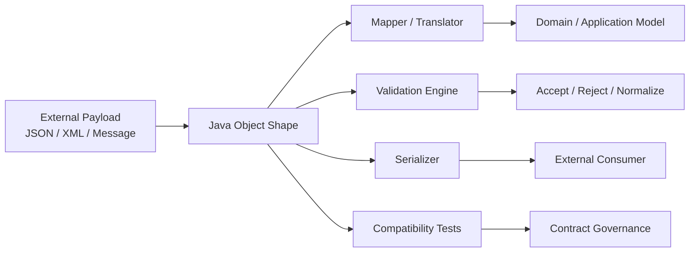
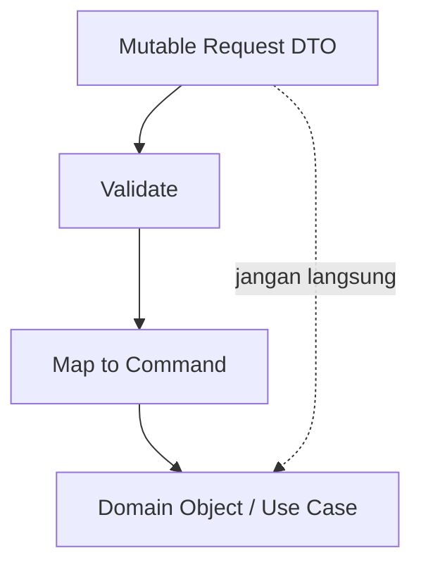
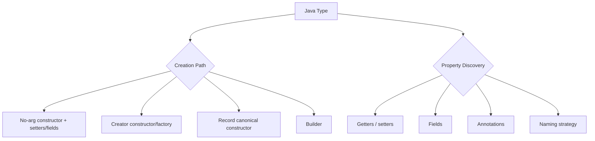
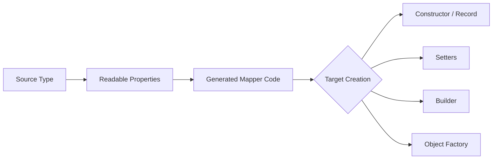

------
title: Learn Java Data Mapper, JSON/XML Processing & Validation - Part 005
description: Java object shape decisions for mapping: Beans, records, builders, immutable types, sealed models, value objects, and how Jackson, MapStruct, XML binding, and validation see them.
series: learn-java-data-mapper-json-xml-validation
seriesTitle: Learn Java Data Mapper, JSON/XML Processing & Validation
order: 5
partTitle: Java Object Shape for Mapping
tags:
- java
- data-mapper
- dto
- record
- jackson
- mapstruct
- serialization
- deserialization
- validation
date: 2026-06-29
---

# Part 005 — Java Object Shape for Mapping

> Goal: mampu memilih bentuk object Java yang tepat untuk setiap boundary: inbound request, outbound response, internal command, domain value object, event contract, persistence projection, XML document, dan validation target.

Mapping bug jarang terjadi karena engineer tidak tahu cara copy field. Mapping bug terjadi karena bentuk object yang dipilih **tidak sesuai dengan semantic responsibility** object tersebut.

Object shape menentukan:

- bagaimana Jackson membuat object saat deserialization;
- bagaimana MapStruct membaca dan menulis property;
- bagaimana Jakarta Validation menemukan constraint;
- bagaimana XML binding melihat field, property, constructor, namespace, dan wrapper;
- bagaimana invariant domain dipaksa atau justru bocor;
- apakah perubahan contract dapat dilakukan tanpa breaking consumer;
- apakah test bisa membedakan `missing`, `null`, default, dan nilai eksplisit.

Part ini bukan pengulangan Java basic. Fokusnya adalah object shape sebagai **data boundary design tool**.

---

## 1. Kaufman Framing: Subskill yang Harus Dikuasai

Josh Kaufman menekankan deconstruction: pecah skill besar menjadi subskill kecil yang paling menentukan performa. Untuk mapper/serialization/validation, subskill bernilai tinggi adalah:

1. mengenali bentuk object yang tersedia;
2. memahami bagaimana library melihat object itu;
3. memilih bentuk yang sesuai dengan semantic boundary;
4. menjaga invariant tanpa membuat mapper terlalu pintar;
5. menulis compatibility test untuk object shape tersebut.

Skill ini membuat kita tidak hanya bisa menulis DTO, tapi bisa mendesain **data contract yang defensible**.

---

## 2. Mental Model: Object Shape adalah Contract Surface

Object Java bukan hanya container. Dalam sistem enterprise, object adalah permukaan kontrak.



Object shape menjawab pertanyaan berikut:

| Pertanyaan | Dampak |
|---|---|
| Apakah object mutable? | Apakah mapper boleh update target in-place? |
| Apakah constructor memaksa invariant? | Apakah invalid object bisa hidup setelah deserialization? |
| Apakah property punya setter? | Apakah Jackson/MapStruct bisa populate tanpa custom config? |
| Apakah field nullable? | Apakah validation atau mapper harus menolak, default, atau preserve? |
| Apakah object punya identity? | Apakah equality by value aman? |
| Apakah ada hierarchy? | Apakah type discriminator diperlukan? |
| Apakah object merepresentasikan payload atau domain concept? | Apakah annotation JSON/XML boleh ditempel? |

Object yang buruk biasanya mencampur semua jawaban di atas dalam satu class.

---

## 3. Taxonomy Object Shape dalam Mapping Layer

| Shape | Cocok Untuk | Tidak Cocok Untuk | Risiko Utama |
|---|---|---|---|
| Mutable JavaBean | legacy frameworks, XML binding, simple DTO | invariant kuat, immutable domain | invalid intermediate state |
| Record | stable data carrier, request/response kecil, value projection | patch semantics, lifecycle complex | tidak bisa bedakan absent/null tanpa desain tambahan |
| Immutable class | domain value object, stable command | mechanical bulk mapping tanpa factory | constructor ambiguity |
| Builder-backed DTO | payload besar, optional banyak, evolusi contract | simple tiny request | default tersembunyi |
| Sealed hierarchy | finite variants, domain algebra, typed event families | open external contract tanpa discriminator | polymorphic security/config risk |
| Value object | identifier, money, email, code, period | raw transport passthrough | over-normalization terlalu awal |
| Map/JsonNode shape | dynamic extension, partial payload, envelope metadata | core invariant business | type-safety hilang |

Tidak ada shape terbaik secara universal. Top engineer memilih shape berdasarkan boundary.

---

## 4. Mutable JavaBean: Framework-Friendly, Invariant-Weak

Bentuk klasik:

```java
public class CreateCustomerRequest {
    private String name;
    private String email;

    public CreateCustomerRequest() {
    }

    public String getName() {
        return name;
    }

    public void setName(String name) {
        this.name = name;
    }

    public String getEmail() {
        return email;
    }

    public void setEmail(String email) {
        this.email = email;
    }
}
```

Kelebihan:

- mudah diproses oleh banyak framework;
- cocok untuk XML binding dan legacy serializer;
- mudah di-update oleh MapStruct dengan `@MappingTarget`;
- cocok untuk generated clients atau schema-first tooling.

Kekurangan:

- object bisa hidup dalam keadaan setengah valid;
- setter dapat dipanggil dari mana saja;
- default Java (`null`, `0`, `false`) sering terlihat seperti input user;
- invariant harus dijaga di luar object.

### Production Rule

Mutable JavaBean boleh dipakai sebagai **boundary DTO**, tetapi jangan jadikan ia domain model.



Jika request DTO langsung dipakai sebagai domain object, domain logic akan menerima object yang mungkin:

- belum divalidasi;
- sudah diubah setelah validasi;
- punya field default yang tidak berasal dari user;
- mengandung transport annotation yang tidak relevan untuk domain.

---

## 5. Record: Data Carrier yang Jelas, Bukan Solusi Semua DTO

Java record adalah bentuk yang sangat kuat untuk contract yang stabil dan berbasis value.

```java
public record CustomerResponse(
        String id,
        String name,
        String email,
        String status
) {
}
```

Record cocok ketika:

- semua component adalah bagian eksplisit dari shape;
- object tidak perlu lifecycle mutation;
- equality by value masuk akal;
- constructor canonical cukup untuk membuat object;
- mapping target dibuat baru, bukan di-update in-place.

Record tidak ideal untuk:

- PATCH request yang harus membedakan absent vs explicit null;
- payload besar dengan default kompleks;
- object yang perlu incremental construction;
- model yang akan sering berubah tetapi compatibility harus dijaga ketat;
- object dengan invariant yang membutuhkan dependency eksternal.

### 5.1 Compact Constructor untuk Normalization Kecil

```java
public record CustomerName(String value) {
    public CustomerName {
        if (value == null || value.isBlank()) {
            throw new IllegalArgumentException("Customer name is required");
        }
        value = value.strip();
    }
}
```

Gunakan compact constructor untuk invariant lokal dan deterministic:

- trim string;
- reject blank;
- normalize case untuk code;
- enforce range sederhana.

Jangan gunakan compact constructor untuk:

- memanggil database;
- membaca clock/network;
- validasi rule yang butuh service;
- mapping antar layer;
- melakukan logging noisy.

Constructor record harus membuat object valid secara lokal, bukan menjadi mini use-case.

### 5.2 Record sebagai Request DTO

```java
public record RegisterCustomerRequest(
        String fullName,
        String email,
        String referralCode
) {
}
```

Ini readable, tetapi ada konsekuensi:

- property absent pada JSON biasanya menjadi nilai Java default/`null` saat object dibuat, kecuali konfigurasi deserialization dibuat strict;
- explicit JSON `null` dan property yang tidak dikirim dapat collapse ke representasi Java yang sama;
- semua component adalah constructor input, sehingga error deserialization terjadi lebih awal;
- validation biasanya terjadi setelah object terbentuk.

Untuk create request, record sering bagus. Untuk patch request, record biasa sering terlalu lemah.

### 5.3 Record sebagai Response DTO

Response DTO dengan record biasanya sangat baik:

```java
public record CustomerSummaryResponse(
        String customerId,
        String displayName,
        String riskSegment,
        boolean active
) {
}
```

Alasannya:

- response biasanya dibuat dari internal model;
- tidak butuh partial update;
- shape eksplisit;
- object immutable;
- snapshot output mudah dites.

---

## 6. Immutable Class: Untuk Invariant yang Lebih Kaya

Jika invariant lebih kompleks dari sekadar data carrier, gunakan immutable class.

```java
public final class Money {
    private final String currency;
    private final long minorUnits;

    private Money(String currency, long minorUnits) {
        if (currency == null || !currency.matches("[A-Z]{3}")) {
            throw new IllegalArgumentException("Invalid currency");
        }
        if (minorUnits < 0) {
            throw new IllegalArgumentException("Money cannot be negative here");
        }
        this.currency = currency;
        this.minorUnits = minorUnits;
    }

    public static Money of(String currency, long minorUnits) {
        return new Money(currency, minorUnits);
    }

    public String currency() {
        return currency;
    }

    public long minorUnits() {
        return minorUnits;
    }
}
```

Immutable class lebih verbose dari record, tetapi memberi ruang untuk:

- named factory;
- private constructor;
- canonicalization;
- multiple creation paths;
- richer method behavior;
- explicit equality strategy;
- hiding internal representation.

### Mapping Implication

MapStruct tidak bisa menulis field final dengan setter. Ia harus tahu cara membuat target:

```java
@Mapper
public interface MoneyMapper {
    default Money toMoney(MoneyDto dto) {
        if (dto == null) {
            return null;
        }
        return Money.of(dto.currency(), dto.minorUnits());
    }
}
```

Jackson juga perlu creation path yang jelas:

```java
public final class MoneyJson {
    private final String currency;
    private final long minorUnits;

    @JsonCreator
    public MoneyJson(
            @JsonProperty("currency") String currency,
            @JsonProperty("minorUnits") long minorUnits
    ) {
        this.currency = currency;
        this.minorUnits = minorUnits;
    }

    public String getCurrency() {
        return currency;
    }

    public long getMinorUnits() {
        return minorUnits;
    }
}
```

Production advice: jangan paksakan domain value object langsung menjadi JSON DTO jika annotation dan creation semantics mulai mencemari domain.

---

## 7. Builder-Backed Shape: Untuk Payload Besar dan Evolusi

Builder berguna ketika object punya banyak optional field atau perlu compatibility evolution.

```java
public final class SearchCustomerQuery {
    private final String name;
    private final String status;
    private final Integer page;
    private final Integer size;

    private SearchCustomerQuery(Builder builder) {
        this.name = builder.name;
        this.status = builder.status;
        this.page = builder.page == null ? 0 : builder.page;
        this.size = builder.size == null ? 50 : builder.size;
    }

    public static Builder builder() {
        return new Builder();
    }

    public static final class Builder {
        private String name;
        private String status;
        private Integer page;
        private Integer size;

        public Builder name(String name) {
            this.name = name;
            return this;
        }

        public Builder status(String status) {
            this.status = status;
            return this;
        }

        public Builder page(Integer page) {
            this.page = page;
            return this;
        }

        public Builder size(Integer size) {
            this.size = size;
            return this;
        }

        public SearchCustomerQuery build() {
            return new SearchCustomerQuery(this);
        }
    }
}
```

Builder cocok untuk:

- query object;
- response besar;
- object dengan banyak optional field;
- object yang dibuat dari beberapa source;
- compatibility evolution yang menambah field optional.

Builder berbahaya jika default tersembunyi tidak dites.

### Builder Default Rule

Default harus diklasifikasikan:

| Default | Aman? | Contoh |
|---|---:|---|
| Technical default | relatif aman | `page = 0`, `size = 50` |
| Presentation default | hati-hati | `displayName = "-"` |
| Business default | harus eksplisit | `riskLevel = LOW` |
| Security default | harus fail-closed | `permission = DENIED` |
| Money/default amount | hampir selalu berbahaya | `amount = 0` |

Jika default memengaruhi keputusan bisnis, jangan sembunyikan di builder tanpa test dan approval governance.

---

## 8. Sealed Hierarchy: Untuk Variant yang Finite

Sealed types berguna saat domain punya kumpulan variant terbatas.

```java
public sealed interface PaymentInstruction
        permits BankTransferInstruction, WalletInstruction {
}

public record BankTransferInstruction(
        String bankCode,
        String accountNumber,
        long amount
) implements PaymentInstruction {
}

public record WalletInstruction(
        String walletProvider,
        String walletId,
        long amount
) implements PaymentInstruction {
}
```

Ini bagus untuk domain/application layer karena compiler bisa membantu exhaustiveness.

Namun untuk JSON/XML contract, hierarchy butuh discriminator:

```json
{
  "type": "BANK_TRANSFER",
  "bankCode": "ABC",
  "accountNumber": "1234567890",
  "amount": 100000
}
```

Tanpa discriminator yang jelas, deserializer harus menebak variant dari field. Itu rapuh.

### Production Rule untuk Polymorphic DTO

Gunakan polymorphic DTO hanya jika:

- variant benar-benar bagian dari external contract;
- discriminator eksplisit dan stabil;
- subtype whitelist dikontrol;
- compatibility test mencakup setiap subtype;
- unknown subtype punya policy: reject, ignore, atau route to dead-letter.

Jangan expose arbitrary class name sebagai type id. Itu masuk ke topik security deserialization yang akan dibahas lebih dalam di Part 015.

---

## 9. Value Object: Mengurangi Primitive Obsession di Boundary Internal

Primitive obsession membuat mapper tampak mudah tetapi menyebar bug.

```java
public record CustomerId(String value) {
    public CustomerId {
        if (value == null || value.isBlank()) {
            throw new IllegalArgumentException("CustomerId is required");
        }
    }
}
```

Value object cocok untuk:

- identifier;
- code;
- email;
- phone number;
- money;
- period;
- percentage;
- country/currency code.

Tetapi jangan memaksa external payload memakai nested value object jika contract-nya tidak demikian.

Transport DTO:

```java
public record CustomerResponse(
        String customerId,
        String displayName
) {
}
```

Domain/application model:

```java
public record CustomerSnapshot(
        CustomerId customerId,
        CustomerName displayName
) {
}
```

Mapper:

```java
@Mapper
public interface CustomerMapper {
    default CustomerId toCustomerId(String value) {
        return value == null ? null : new CustomerId(value);
    }

    default String fromCustomerId(CustomerId id) {
        return id == null ? null : id.value();
    }
}
```

Ini menjaga external contract tetap sederhana, tetapi internal model tetap kuat.

---

## 10. Dynamic Shape: `Map<String, Object>` dan `JsonNode`

Tidak semua payload pantas dipaksa menjadi POJO penuh.

Gunakan dynamic shape ketika:

- ada extension fields;
- payload dari pihak ketiga belum stabil;
- perlu preserve unknown fields;
- perlu partial inspection;
- schema terlalu variatif;
- ada metadata envelope yang tidak selalu dipakai.

Contoh:

```java
public record WebhookEnvelope(
        String provider,
        String eventType,
        JsonNode payload
) {
}
```

Ini lebih jujur daripada membuat satu DTO raksasa yang 80% field-nya nullable.

Namun dynamic shape harus dibatasi:

- hanya di edge;
- segera validate minimal envelope;
- route berdasarkan event type;
- map ke typed command jika sudah masuk use-case;
- log dengan redaction;
- punya schema sample/golden files.

---

## 11. Object Shape per Boundary

### 11.1 Inbound Create Request

Preferensi:

- record atau simple DTO;
- constraint jelas;
- tidak ada domain behavior;
- tidak ada default bisnis tersembunyi;
- mapping ke command eksplisit.

```java
public record CreateCustomerRequest(
        @NotBlank String fullName,
        @NotBlank String email
) {
}
```

Command:

```java
public record CreateCustomerCommand(
        CustomerName fullName,
        EmailAddress email
) {
}
```

Mapper mengubah string menjadi value object.

### 11.2 Inbound Patch Request

Jangan gunakan DTO biasa jika harus membedakan absent vs null.

Buruk:

```java
public record PatchCustomerRequest(
        String fullName,
        String email
) {
}
```

Lebih eksplisit:

```java
public record PatchCustomerRequest(
        FieldPatch<String> fullName,
        FieldPatch<String> email
) {
}
```

```java
public sealed interface FieldPatch<T>
        permits FieldPatch.Absent, FieldPatch.Clear, FieldPatch.Set {

    record Absent<T>() implements FieldPatch<T> {
    }

    record Clear<T>() implements FieldPatch<T> {
    }

    record Set<T>(T value) implements FieldPatch<T> {
    }
}
```

Part 006 akan membahas ini lebih dalam.

### 11.3 Outbound Response

Record sangat cocok:

```java
public record CustomerDetailResponse(
        String customerId,
        String displayName,
        String email,
        String status,
        Instant createdAt
) {
}
```

Response DTO boleh punya Jackson annotation untuk presentation contract:

```java
public record CustomerDetailResponse(
        @JsonProperty("customer_id") String customerId,
        @JsonProperty("display_name") String displayName
) {
}
```

Tetapi jangan tempel annotation external contract pada domain object kecuali domain object memang contract object.

### 11.4 Event Contract

Event contract harus lebih konservatif dari response DTO.

```java
public record CustomerRegisteredEventV1(
        String eventId,
        String occurredAt,
        String customerId,
        String fullName,
        String email
) {
}
```

Event shape harus stabil karena consumer bisa banyak, asynchronous, dan sulit dikoordinasi. Hindari rename field. Tambah field optional lebih aman daripada mengubah makna field existing.

### 11.5 XML Document

XML sering butuh shape berbeda dari JSON karena namespace, wrapper, attribute, element order, dan schema.

```java
@XmlRootElement(name = "Customer")
@XmlAccessorType(XmlAccessType.FIELD)
public class CustomerXmlDocument {
    @XmlElement(name = "CustomerId", required = true)
    private String customerId;

    @XmlElement(name = "FullName", required = true)
    private String fullName;

    public CustomerXmlDocument() {
    }
}
```

XML document object sering lebih cocok menjadi dedicated boundary object, bukan record/domain object yang dipaksa cocok untuk semuanya.

---

## 12. Jackson View of Object Shape

Jackson melihat object melalui beberapa jalur:



Checklist untuk Jackson-friendly shape:

- creation path jelas;
- property name stabil;
- no accidental getter exposing internal state;
- unknown-property policy jelas;
- null handling jelas;
- date-time module/config jelas;
- polymorphism tidak membuka subtype arbitrary;
- tests mencakup serialize dan deserialize.

### Bad Example: Accidental Getter

```java
public final class CustomerInternalState {
    private final SecretToken token;

    public SecretToken getToken() {
        return token;
    }
}
```

Jika class ini tidak sengaja diserialisasi, getter bisa expose internal secret. Object shape harus mempertimbangkan serializer visibility.

---

## 13. MapStruct View of Object Shape

MapStruct membaca source dan menulis target melalui property/constructor/builder/factory yang bisa diketahui saat compile time.



MapStruct sangat kuat ketika object shape eksplisit.

Baik:

```java
public record CustomerDto(String id, String name) {
}

public record CustomerView(String customerId, String displayName) {
}

@Mapper
public interface CustomerViewMapper {
    @Mapping(target = "customerId", source = "id")
    @Mapping(target = "displayName", source = "name")
    CustomerView toView(CustomerDto dto);
}
```

Rapuh:

```java
public class CustomerDto {
    public String a;
    public String b;
    public Map<String, Object> metadata;
}
```

MapStruct bisa map field, tetapi tidak tahu semantic dari `a`, `b`, atau metadata. Type-safe mapper tidak otomatis berarti semantically safe mapping.

---

## 14. Jakarta Validation View of Object Shape

Validation engine melihat constraint pada:

- field;
- getter;
- method parameter;
- constructor parameter;
- type use/container element;
- class-level constraint;
- cascaded object via `@Valid`.

Shape memengaruhi lokasi constraint.

Record request:

```java
public record CreateAccountRequest(
        @NotBlank String customerId,
        @NotBlank String productCode
) {
}
```

Nested request:

```java
public record CreateOrderRequest(
        @NotBlank String customerId,
        @Valid List<OrderLineRequest> lines
) {
}

public record OrderLineRequest(
        @NotBlank String productId,
        @Positive int quantity
) {
}
```

Field vs getter validation harus konsisten. Jangan campur tanpa alasan kuat, karena violation path dan framework behavior bisa membingungkan.

---

## 15. Annotation Placement Strategy

Tidak semua annotation pantas berada di semua object.

| Annotation Type | Cocok di DTO | Cocok di Domain | Catatan |
|---|---:|---:|---|
| Jackson JSON annotation | Ya | Jarang | Domain jangan terlalu tahu JSON |
| JAXB/XML annotation | Ya | Jarang | XML shape sering berbeda dari domain |
| Jakarta Validation constraint | Ya | Ya, selektif | DTO validates input; domain enforces invariant |
| MapStruct annotation | Mapper only | Mapper only | Jangan tempel mapping concern ke model |
| OpenAPI/schema annotation | DTO | Tidak | Presentation/API concern |

Rule of thumb:

> Annotation yang menjelaskan external representation tinggal di boundary object. Annotation yang menjelaskan invariant universal boleh tinggal di domain/value object.

---

## 16. Shape Smells

### 16.1 God DTO

Satu DTO dipakai untuk create, update, response, database projection, event, dan audit.

Gejala:

- field banyak sekali;
- sebagian besar nullable;
- annotation campur JSON/XML/validation/persistence;
- nama field generic;
- mapping penuh `if`;
- consumer bingung field mana valid untuk operasi tertentu.

Perbaikan: split by use case.

### 16.2 Domain Object with Transport Annotation Everywhere

```java
@Entity
@XmlRootElement
@JsonIgnoreProperties
public class Customer {
    // persistence + JSON + XML + validation + domain behavior
}
```

Ini membuat domain berubah setiap ada kebutuhan API/XML baru.

Perbaikan: dedicated boundary model + mapper.

### 16.3 Boolean Primitive in Patch Request

```java
public record UpdatePreferenceRequest(boolean marketingOptIn) {
}
```

`false` bisa berarti:

- user mengirim false;
- field absent lalu Java default false;
- deserializer default;
- mapper default.

Gunakan `Boolean`, atau lebih baik field patch wrapper jika perlu absent/null distinction.

### 16.4 `Map<String, Object>` as Domain

Map berguna di edge, tetapi buruk sebagai core domain karena tidak ada compiler help, validation lemah, dan refactoring berbahaya.

### 16.5 Record with Too Many Optional Components

Record dengan 40 component nullable bukan clarity. Itu schema smell.

---

## 17. Decision Matrix

| Scenario | Recommended Shape | Reason |
|---|---|---|
| Simple create request | record DTO | explicit, immutable-ish, concise |
| Complex create request with nested list | record DTO + nested records | validation path clear |
| Partial update/patch | patch wrapper DTO | preserves absent/null/set intent |
| Response projection | record | stable snapshot, easy test |
| External event | dedicated versioned record/class | governance, compatibility |
| XML schema-bound document | JAXB-style class | XML model has different needs |
| Domain identifier | value object | prevents primitive confusion |
| Domain aggregate | rich class | behavior/invariant, not mere data carrier |
| Dynamic webhook | envelope + `JsonNode` | preserve unknown provider payload |
| Mapper target update | mutable target or builder strategy | MapStruct can update existing target |

---

## 18. End-to-End Example: Create Customer Boundary

### 18.1 Request DTO

```java
public record CreateCustomerRequest(
        @NotBlank String fullName,
        @NotBlank String email,
        String referralCode
) {
}
```

### 18.2 Command

```java
public record CreateCustomerCommand(
        CustomerName fullName,
        EmailAddress email,
        Optional<ReferralCode> referralCode
) {
}
```

### 18.3 Value Objects

```java
public record CustomerName(String value) {
    public CustomerName {
        if (value == null || value.isBlank()) {
            throw new IllegalArgumentException("Customer name is required");
        }
        value = value.strip();
    }
}

public record EmailAddress(String value) {
    public EmailAddress {
        if (value == null || value.isBlank()) {
            throw new IllegalArgumentException("Email is required");
        }
        value = value.strip().toLowerCase(Locale.ROOT);
    }
}
```

### 18.4 Mapper

```java
@Mapper
public interface CustomerCommandMapper {
    default CreateCustomerCommand toCommand(CreateCustomerRequest request) {
        if (request == null) {
            return null;
        }

        return new CreateCustomerCommand(
                new CustomerName(request.fullName()),
                new EmailAddress(request.email()),
                toReferralCode(request.referralCode())
        );
    }

    default Optional<ReferralCode> toReferralCode(String value) {
        if (value == null || value.isBlank()) {
            return Optional.empty();
        }
        return Optional.of(new ReferralCode(value.strip()));
    }
}
```

### 18.5 Why This Shape Works

| Layer | Shape | Responsibility |
|---|---|---|
| JSON request | `CreateCustomerRequest` | capture external payload |
| Validation | annotations | reject structurally invalid input |
| Mapper | `CustomerCommandMapper` | convert transport primitives to domain values |
| Application | `CreateCustomerCommand` | express use-case intent |
| Domain | value objects | enforce local invariants |

No layer does everything. That is the point.

---

## 19. Testing Object Shape

Test object shape, not only mapper result.

### 19.1 Serialization Snapshot

```java
@Test
void serializesCustomerResponseShape() throws Exception {
    var response = new CustomerResponse("C-001", "Ayu", "ACTIVE");

    var json = objectMapper.writeValueAsString(response);

    assertThatJson(json).isEqualTo("""
        {
          "customerId": "C-001",
          "displayName": "Ayu",
          "status": "ACTIVE"
        }
        """);
}
```

### 19.2 Deserialization Shape

```java
@Test
void deserializesCreateRequest() throws Exception {
    var json = """
        {
          "fullName": "Ayu Lestari",
          "email": "ayu@example.com"
        }
        """;

    var request = objectMapper.readValue(json, CreateCustomerRequest.class);

    assertThat(request.fullName()).isEqualTo("Ayu Lestari");
    assertThat(request.email()).isEqualTo("ayu@example.com");
}
```

### 19.3 Mapper Compile-Time Guard

MapStruct should fail build if a target field is unmapped and policy is strict.

```java
@Mapper(unmappedTargetPolicy = ReportingPolicy.ERROR)
public interface CustomerResponseMapper {
    CustomerResponse toResponse(CustomerSnapshot snapshot);
}
```

This is not just style. It makes contract change visible at build time.

---

## 20. Practical Heuristics

Use these rules in code review.

1. If an object crosses a boundary, name the boundary in the class name: `Request`, `Response`, `Event`, `Document`, `Command`, `Projection`.
2. If an object has domain behavior, do not let JSON/XML requirements shape it.
3. If update semantics matter, do not use a plain nullable DTO.
4. If a field is security-sensitive, assume serializer may expose it unless proven otherwise.
5. If a class has more than one reason to change, split it.
6. If mapping needs many conditionals, object shape may be wrong.
7. If a default changes business meaning, make it explicit in mapper/use-case, not hidden in field initialization.
8. If external contract uses primitive strings but domain needs value objects, map at the boundary.
9. If you need dynamic JSON, isolate it and convert to typed models as soon as practical.
10. If a DTO is used by both inbound and outbound flows, challenge it.

---

## 21. Exercises

### Exercise 1 — Shape Classification

Given this class:

```java
public class CustomerDto {
    public String id;
    public String name;
    public String email;
    public String status;
    public String createdAt;
    public String updatedAt;
    public Boolean active;
    public Map<String, Object> metadata;
}
```

Classify whether it is suitable for:

- create request;
- update request;
- response;
- event;
- domain model;
- persistence projection.

Then split it into at least three better shapes.

### Exercise 2 — Record vs Class Decision

For each scenario, choose record, mutable class, immutable class, builder, or dynamic shape:

1. XML document generated from XSD.
2. Customer response with 8 stable fields.
3. Patch profile request with `clear middleName` support.
4. Domain `Money` concept.
5. Third-party webhook envelope.
6. Search query with 15 optional filters.

Explain the trade-off.

### Exercise 3 — Mapper-Friendly Refactor

Take an existing DTO in your codebase and ask:

- Which fields are inbound-only?
- Which fields are outbound-only?
- Which fields are internal-only?
- Which fields are nullable because of business meaning?
- Which fields are nullable because the object is reused too broadly?

Refactor into boundary-specific classes.

---

## 22. Part 005 Checklist

You are done with this part when you can:

- explain why object shape is a contract surface;
- choose between JavaBean, record, immutable class, builder, sealed hierarchy, value object, and dynamic shape;
- predict how Jackson, MapStruct, XML binding, and validation will see a class;
- identify shape smells in DTO/domain models;
- design create, patch, response, event, and XML shapes differently;
- write tests that protect object shape and serialization behavior.

---

## References

- Oracle Java Records documentation: https://docs.oracle.com/en/java/javase/21/docs/api/java.base/java/lang/Record.html
- OpenJDK JEP 395 Records: https://openjdk.org/jeps/395
- Jackson Databind project: https://github.com/FasterXML/jackson-databind
- Jackson annotations Javadoc: https://www.javadoc.io/doc/com.fasterxml.jackson.core/jackson-annotations
- MapStruct Reference Guide: https://mapstruct.org/documentation/stable/reference/html/
- Jakarta Validation 3.1 Specification: https://jakarta.ee/specifications/bean-validation/3.1/jakarta-validation-spec-3.1.html
