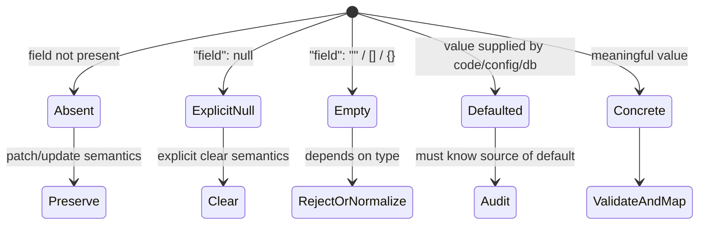
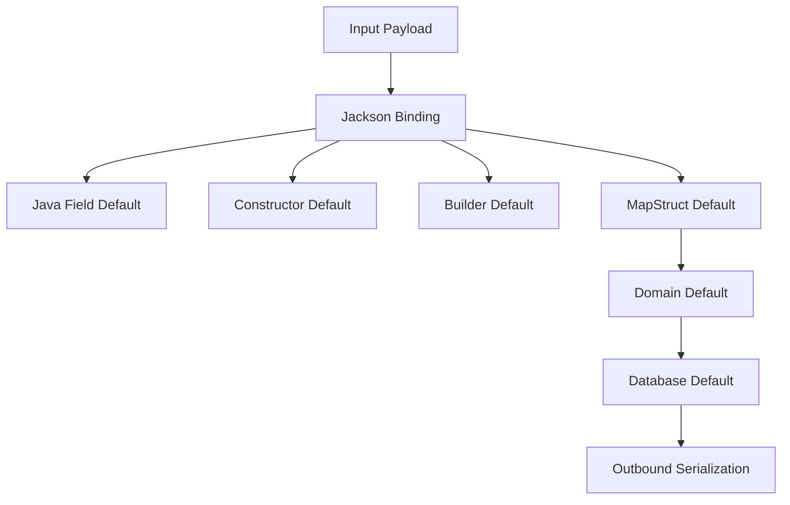
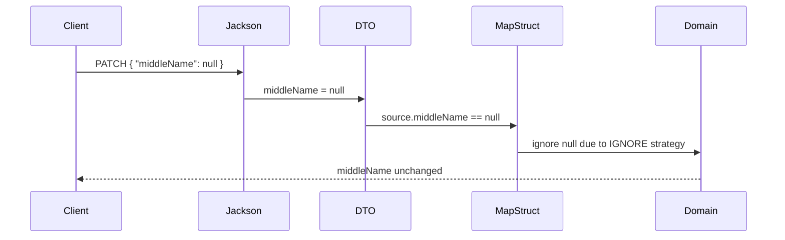
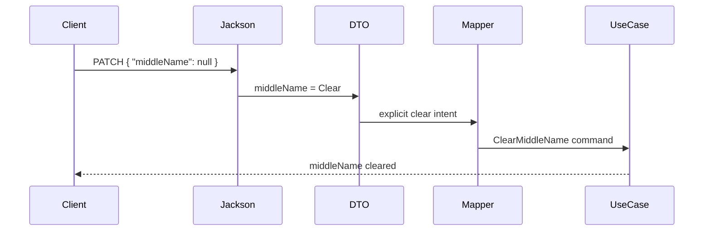

------
title: Learn Java Data Mapper, JSON/XML Processing & Validation - Part 006
description: Null, absence, defaults, empty values, and partial intent in Java data contracts, Jackson, MapStruct, and Jakarta Validation.
series: learn-java-data-mapper-json-xml-validation
seriesTitle: Learn Java Data Mapper, JSON/XML Processing & Validation
order: 6
partTitle: Null, Absence, Defaults, Empty Values
tags:
- java
- json
- jackson
- mapstruct
- validation
- null-handling
- serialization
- deserialization
- dto
date: 2026-06-29
---

# Part 006 — Null, Absence, Defaults, Empty Values

> Goal: mampu mendesain semantics untuk `missing`, explicit `null`, empty, default, dan concrete value sehingga mapper, validator, serializer, dan consumer tidak saling menebak.

Null adalah salah satu sumber bug paling mahal dalam data boundary. Masalahnya bukan hanya `NullPointerException`. Masalah sebenarnya adalah **hilangnya intent**.

Di boundary, nilai kosong bisa berarti banyak hal:

- client lupa mengirim field;
- client sengaja mengirim `null` untuk clear value;
- client mengirim empty string karena UI form kosong;
- serializer menghilangkan field karena `NON_NULL`;
- mapper mengabaikan field karena patch semantics;
- default Java mengisi `false`, `0`, atau `null`;
- database default mengisi nilai setelah insert;
- validation memperlakukan blank berbeda dari null.

Jika sistem tidak membedakan kondisi ini, bug akan terlihat seperti “mapper issue”, padahal desain contract-nya ambigu.

---

## 1. Kaufman Framing: High-Value Subskill

Untuk menjadi efektif cepat, kuasai satu subskill ini:

> Jangan pernah bertanya “field ini null atau tidak?” sebelum bertanya “null di boundary ini artinya apa?”

Kita akan membedakan lima state:

1. **Absent** — property tidak ada di payload.
2. **Explicit null** — property ada dan nilainya `null`.
3. **Empty** — property ada tetapi kosong: `""`, `[]`, `{}`.
4. **Default** — nilai muncul karena aturan default, bukan input langsung.
5. **Concrete value** — nilai eksplisit bermakna.

---

## 2. The Five-State Model



State ini harus diputuskan per boundary, bukan secara global.

| State | JSON Example | Java Representation | Possible Meaning |
|---|---|---|---|
| Absent | `{}` | often `null` after binding | not provided, preserve existing, use default, reject missing |
| Explicit null | `{ "name": null }` | `null` | clear, unknown, invalid, intentionally blank |
| Empty string | `{ "name": "" }` | `""` | blank input, clear-like, invalid, meaningful empty label |
| Empty array | `{ "tags": [] }` | empty list | clear all, no tags, valid empty set |
| Default | no direct example | `false`, `0`, configured value | system-assigned, Java primitive default, mapper default |
| Concrete | `{ "name": "Ayu" }` | `"Ayu"` | set/update/value |

---

## 3. Why Java Makes This Hard

Java object fields collapse many states.

```java
public class UpdateCustomerRequest {
    private String name;
    private boolean active;
}
```

After deserialization:

| Payload | `name` | `active` |
|---|---:|---:|
| `{}` | `null` | `false` |
| `{ "name": null }` | `null` | `false` |
| `{ "active": false }` | `null` | `false` |
| `{ "active": true }` | `null` | `true` |

For `name`, absent and explicit null collapsed. For `active`, absent and explicit false collapsed because primitive boolean defaults to `false`.

This is why patch DTOs with primitive fields are dangerous.

---

## 4. Create vs Update vs Patch Semantics

The correct null behavior depends on operation type.

### 4.1 Create

In create operations, absent and null are usually invalid for required fields.

```json
{}
```

For required `name`, this should fail.

```json
{ "name": null }
```

This should also fail.

```json
{ "name": "" }
```

Usually fail if name must be non-blank.

Create DTO:

```java
public record CreateCustomerRequest(
        @NotBlank String name,
        @NotBlank String email
) {
}
```

### 4.2 Replace

In replace operations, absent often means “set missing fields to default/empty” or “invalid because full representation required”.

Replace should be strict. A replace payload should usually represent the whole resource state.

### 4.3 Patch

In patch operations:

- absent often means preserve existing value;
- explicit null may mean clear existing value;
- concrete value means set/update;
- empty collection may mean clear all;
- empty string may be invalid or may mean set to empty label depending on domain.

Plain Java nullable fields cannot represent this safely.

---

## 5. The Patch Intent Problem

Bad patch DTO:

```java
public record PatchCustomerRequest(
        String displayName,
        String middleName,
        Boolean marketingOptIn
) {
}
```

This object cannot reliably answer:

- Was `middleName` absent?
- Was `middleName` explicitly set to null?
- Did the client want to clear it?
- Did the JSON parser default anything?

Better: model intent explicitly.

```java
public sealed interface FieldPatch<T>
        permits FieldPatch.Absent, FieldPatch.Clear, FieldPatch.Set {

    record Absent<T>() implements FieldPatch<T> {
    }

    record Clear<T>() implements FieldPatch<T> {
    }

    record Set<T>(T value) implements FieldPatch<T> {
    }
}
```

Request:

```java
public record PatchCustomerRequest(
        FieldPatch<String> displayName,
        FieldPatch<String> middleName,
        FieldPatch<Boolean> marketingOptIn
) {
}
```

Use-case logic:

```java
public Customer patch(Customer current, PatchCustomerCommand command) {
    var next = current;

    next = switch (command.middleName()) {
        case FieldPatch.Absent<String> ignored -> next;
        case FieldPatch.Clear<String> ignored -> next.clearMiddleName();
        case FieldPatch.Set<String> set -> next.changeMiddleName(new CustomerName(set.value()));
    };

    return next;
}
```

This is more code, but the intent is explicit and testable.

---

## 6. Null Policy Matrix

Every boundary should define a null policy matrix.

| Boundary | Absent | Explicit Null | Empty String | Empty Array | Default |
|---|---|---|---|---|---|
| Create request | reject if required | reject if required | reject/normalize | valid if collection may be empty | technical only |
| Patch request | preserve | clear or reject | set/reject/clear | set empty collection | avoid hidden default |
| Response | omit or include by policy | expose if meaningful | expose if meaningful | expose empty list often | explicit contract |
| Event | prefer explicit stable fields | avoid ambiguous nulls | avoid blank if invalid | stable semantic | never silent business default |
| XML document | schema-driven | schema nillable-driven | schema/domain-driven | schema/domain-driven | schema/default-driven |
| Internal command | no ambiguity | model intent | normalized | domain-specific | explicit |

Without this matrix, teams argue about nulls repeatedly in code review.

---

## 7. Jackson Serialization: Output Null Policy

Jackson output inclusion controls whether fields appear in serialized JSON.

Common modes:

| Inclusion | Meaning | Risk |
|---|---|---|
| `ALWAYS` | include property regardless of value | noisy but explicit |
| `NON_NULL` | omit Java null values | absent/null distinction lost for consumer |
| `NON_ABSENT` | omit null and absent referential values such as empty `Optional` | can hide intent if overused |
| `NON_EMPTY` | omit null and empty strings/collections/arrays | can hide meaningful empty |
| `NON_DEFAULT` | omit values considered default | dangerous for compatibility unless carefully tested |

Example:

```java
@JsonInclude(JsonInclude.Include.NON_NULL)
public record CustomerResponse(
        String customerId,
        String displayName,
        String middleName
) {
}
```

If `middleName == null`, output omits the field.

```json
{
  "customerId": "C-001",
  "displayName": "Ayu"
}
```

This may be fine for response readability. It may be bad for event contracts where consumer needs to know that `middleName` is unknown or intentionally absent.

### Production Rule

Set inclusion policy per boundary, not by global habit.

Bad:

```java
objectMapper.setSerializationInclusion(JsonInclude.Include.NON_NULL);
```

This global setting silently changes every response/event/debug payload.

Better:

- configure global defaults conservatively;
- use boundary-specific DTO annotation;
- test output shape;
- avoid `NON_EMPTY` unless empty truly means “not present”.

---

## 8. Jackson Deserialization: Input Null Policy

Output null policy and input null policy are different.

For input, explicit `null` may be:

- accepted as null;
- skipped;
- converted to empty;
- rejected;
- failed for primitives;
- handled by custom deserializer.

Jackson has null-handling tools such as `@JsonSetter` and `Nulls` for explicit null handling.

Example:

```java
public class CreateCustomerRequest {
    private String name;

    @JsonSetter(nulls = Nulls.FAIL)
    public void setName(String name) {
        this.name = name;
    }
}
```

This rejects explicit `null` for `name` at deserialization time.

However, be careful: validation error and deserialization error are different failure categories.

| Failure Type | Example | Typical Owner |
|---|---|---|
| Deserialization error | invalid JSON type, forbidden explicit null if configured | parser/binder |
| Validation error | blank name, missing required field after binding | validation layer |
| Business rule error | customer type cannot use product | use-case/domain |

Do not push all validation into Jackson. Use Jackson for structural binding rules and Jakarta Validation for input constraints.

---

## 9. `@NotNull`, `@NotEmpty`, `@NotBlank`: Different Meanings

Jakarta Validation constraints are not interchangeable.

| Constraint | Rejects null | Rejects empty string | Rejects blank string | Applies To |
|---|---:|---:|---:|---|
| `@NotNull` | yes | no | no | any type |
| `@NotEmpty` | yes | yes | not necessarily whitespace-only depending type semantics | string/collection/map/array |
| `@NotBlank` | yes | yes | yes | character sequence |

Examples:

```java
public record CreateUserRequest(
        @NotBlank String username,
        @NotEmpty List<@NotBlank String> roles,
        @NotNull Boolean termsAccepted
) {
}
```

Do not use `@NotNull` for a user-facing text field if blank text is invalid.

Bad:

```java
public record CreateProductRequest(
        @NotNull String name
) {
}
```

This allows `""` and potentially `"   "`.

Better:

```java
public record CreateProductRequest(
        @NotBlank String name
) {
}
```

### Primitive Trap

```java
public record CreateUserRequest(
        @NotNull boolean termsAccepted
) {
}
```

This is meaningless. Primitive `boolean` cannot be null. Use `Boolean` if you need to validate presence.

```java
public record CreateUserRequest(
        @NotNull Boolean termsAccepted
) {
}
```

Then business rule may additionally require it to be `true`.

---

## 10. Empty Is Not Always Invalid

Empty collection often has legitimate meaning.

```json
{
  "roles": []
}
```

This might mean:

- user has no roles;
- clear all roles;
- invalid because at least one role required;
- query filter matches no roles;
- consumer should show empty state.

Use the correct constraint:

```java
public record AssignRolesRequest(
        @NotEmpty List<@NotBlank String> roles
) {
}
```

But for a search filter:

```java
public record SearchUsersRequest(
        List<String> roles
) {
}
```

An empty list may mean “filter by no roles”, “no filter”, or invalid. Decide explicitly. Do not let UI/library behavior define it accidentally.

---

## 11. Defaults: The Most Dangerous Convenience

Defaults come from many places.



Each default has an owner.

| Default Source | Example | Risk |
|---|---|---|
| Java primitive default | `false`, `0` | absent collapsed into value |
| Field initializer | `private int page = 0` | hides input absence |
| Constructor | `size == null ? 50 : size` | good if technical, risky if business |
| Builder | `status = ACTIVE` | accidental business decision |
| Mapper | `defaultValue = "ACTIVE"` | mapping layer makes policy |
| Database | default column value | object state differs before/after save |
| Serializer omission | omit null/default | consumer cannot infer source |

### Production Rule

Default is acceptable only when all are true:

1. owner is clear;
2. default is documented in contract;
3. default is tested;
4. default does not hide user intent;
5. default is safe under security/compliance failure mode.

---

## 12. MapStruct Null Handling

MapStruct has several null-related strategies. The two most commonly confused are:

- `NullValueCheckStrategy` — when generated code checks source for null before mapping;
- `NullValuePropertyMappingStrategy` — how null or not-present source properties affect existing target properties in update mapping.

### 12.1 Create Mapping

```java
@Mapper
public interface CustomerMapper {
    CustomerView toView(Customer source);
}
```

If source field is null, target field may become null unless configured or custom mapping handles it.

### 12.2 Update Mapping

```java
@Mapper
public interface CustomerPatchMapper {
    @BeanMapping(nullValuePropertyMappingStrategy = NullValuePropertyMappingStrategy.IGNORE)
    void apply(PatchCustomerDto source, @MappingTarget CustomerDraft target);
}
```

With `IGNORE`, null source property does not overwrite existing target property.

This is useful when null means “not provided”, but wrong when null means “clear”.

### 12.3 Null Strategy Must Match Intent

| Intent | Strategy |
|---|---|
| Null means preserve existing | `IGNORE` in update mapping can fit |
| Null means clear existing | do not use `IGNORE`; map explicit clear |
| Null means default | use explicit default, document owner |
| Null means invalid | validate/reject before mapping |
| Absent distinct from null | DTO must preserve presence info |

MapStruct cannot recover intent if DTO collapsed absent and null before mapper sees it.

---

## 13. Jackson + MapStruct Failure Chain

A common failure chain:



But the client intended to clear `middleName`. The bug is not in MapStruct. The bug is in ambiguous contract semantics.

Fix by modeling intent:



---

## 14. Optional in DTOs

`Optional` is useful as a return type in Java APIs, but fields/components of type `Optional<T>` in DTOs require caution.

```java
public record CustomerResponse(
        String customerId,
        Optional<String> middleName
) {
}
```

This can express absence in Java, and Jackson has inclusion modes such as `NON_ABSENT`. But DTOs with many `Optional` fields can become noisy and may not solve explicit null vs absent unless input handling is designed carefully.

Use `Optional` in DTO only if:

- team agrees on serialization/deserialization rules;
- ObjectMapper modules/config are consistent;
- JSON samples clearly document output;
- tests cover absent, explicit null, and present values.

For patch intent, prefer explicit patch wrapper over `Optional<T>` because `Optional.empty()` usually means absent, not clear.

---

## 15. Empty String Normalization

Many systems normalize blank text at the boundary.

```java
public final class TextNormalizer {
    public static String blankToNull(String value) {
        if (value == null) {
            return null;
        }
        var stripped = value.strip();
        return stripped.isEmpty() ? null : stripped;
    }
}
```

This can be good for create request:

```java
public record CreateCustomerCommand(CustomerName name) {
}
```

Mapper:

```java
@Mapper
public interface CustomerCommandMapper {
    default CustomerName toCustomerName(String value) {
        var normalized = TextNormalizer.blankToNull(value);
        return normalized == null ? null : new CustomerName(normalized);
    }
}
```

But do not normalize blindly for all fields.

| Field | Blank Handling |
|---|---|
| customer name | usually reject/normalize strip |
| free-form note | blank may be valid |
| password | do not strip without explicit security decision |
| code | strip + uppercase may be valid |
| address line 2 | blank may mean absent |
| search query | blank may mean no filter |

Normalization is business semantics, not mere utility code.

---

## 16. Null in XML

XML has its own null/absence semantics.

Examples:

Absent element:

```xml
<Customer>
  <CustomerId>C-001</CustomerId>
</Customer>
```

Empty element:

```xml
<Customer>
  <MiddleName></MiddleName>
</Customer>
```

Nil element:

```xml
<Customer xmlns:xsi="http://www.w3.org/2001/XMLSchema-instance">
  <MiddleName xsi:nil="true" />
</Customer>
```

These are not the same. XML schema can define whether element is required, optional, nillable, or has default/fixed values.

Production advice:

- do not assume JSON null rules apply to XML;
- read the XSD contract;
- test marshal and unmarshal for absent, empty, and nil;
- avoid sharing one DTO for JSON and XML if semantics differ.

---

## 17. Validation Groups and Null Semantics

Create and patch often need different validation.

```java
public interface CreateChecks {
}

public interface PatchChecks {
}
```

DTO:

```java
public record CustomerRequest(
        @NotBlank(groups = CreateChecks.class)
        String name,

        @Email(groups = {CreateChecks.class, PatchChecks.class})
        String email
) {
}
```

This can work, but be careful. One DTO with many groups can become hard to reason about.

Prefer separate DTOs when operation semantics differ sharply:

```java
public record CreateCustomerRequest(
        @NotBlank String name,
        @Email @NotBlank String email
) {
}

public record PatchCustomerRequest(
        FieldPatch<String> name,
        FieldPatch<String> email
) {
}
```

Validation groups are powerful, but separate shapes are often clearer.

---

## 18. Designing a Null Semantics Contract

Every endpoint/message/document should answer these questions.

### 18.1 Requiredness

- Is the field required on create?
- Is it required on replace?
- Is it optional on patch?
- Is it always present in response?
- Is it always present in event?

### 18.2 Nullability

- Can consumer send explicit null?
- Does explicit null mean clear?
- Does explicit null mean unknown?
- Is explicit null rejected?
- Does serializer ever emit null?

### 18.3 Emptiness

- Is empty string valid?
- Is blank string valid?
- Is empty collection valid?
- Does empty collection mean clear all?
- Should empty be normalized to null?

### 18.4 Defaults

- Who owns the default?
- Is default visible to consumer?
- Is default audited?
- Can default change without breaking compatibility?
- Is default safe under failure?

Document these decisions near the DTO or schema, then enforce with tests.

---

## 19. Example: Production-Grade Patch Design

### 19.1 External JSON Contract

```json
{
  "displayName": "Ayu",
  "middleName": null,
  "marketingOptIn": false
}
```

Meaning:

- `displayName`: set to `Ayu`;
- `middleName`: clear;
- `marketingOptIn`: set to false;
- absent fields: preserve.

### 19.2 Internal Command

```java
public record PatchCustomerCommand(
        FieldPatch<CustomerName> displayName,
        FieldPatch<CustomerName> middleName,
        FieldPatch<Boolean> marketingOptIn
) {
}
```

### 19.3 Use-Case Application

```java
public Customer applyPatch(Customer customer, PatchCustomerCommand command) {
    var result = customer;

    result = applyDisplayName(result, command.displayName());
    result = applyMiddleName(result, command.middleName());
    result = applyMarketingOptIn(result, command.marketingOptIn());

    return result;
}

private Customer applyMiddleName(Customer customer, FieldPatch<CustomerName> patch) {
    return switch (patch) {
        case FieldPatch.Absent<CustomerName> ignored -> customer;
        case FieldPatch.Clear<CustomerName> ignored -> customer.clearMiddleName();
        case FieldPatch.Set<CustomerName> set -> customer.changeMiddleName(set.value());
    };
}
```

This is not accidental mapping. It is an explicit state transition.

---

## 20. Test Matrix for Null Semantics

For each field with nuanced semantics, test all states.

| Case | Payload | Expected DTO/Command | Expected Result |
|---|---|---|---|
| absent | `{}` | `Absent` | preserve |
| explicit null | `{ "middleName": null }` | `Clear` | clear field |
| empty string | `{ "middleName": "" }` | reject or normalize | domain-specific |
| blank string | `{ "middleName": "   " }` | reject or normalize | domain-specific |
| concrete | `{ "middleName": "Made" }` | `Set(CustomerName)` | update |

JUnit-style skeleton:

```java
@ParameterizedTest
@MethodSource("patchCases")
void mapsPatchIntent(String json, ExpectedPatch expected) throws Exception {
    var request = objectMapper.readValue(json, PatchCustomerRequest.class);
    var command = mapper.toCommand(request);

    assertThat(command.middleName()).isEqualTo(expected.middleName());
}
```

Do not only test happy path.

---

## 21. Observability of Null Decisions

Null/default decisions should be visible enough to debug.

Useful logs/metrics at boundary:

- validation error count by field and reason;
- rejected explicit null count;
- patch clear operation count;
- default applied count for important technical defaults;
- dead-letter count for missing required event fields;
- contract compatibility failure count.

Avoid logging raw sensitive values. Log field names and reasons, not secrets.

Example structured error:

```json
{
  "code": "VALIDATION_FAILED",
  "violations": [
    {
      "field": "displayName",
      "reason": "must not be blank"
    }
  ]
}
```

---

## 22. Anti-Patterns

### 22.1 Global `NON_NULL` Everywhere

Global null omission makes payloads pretty but can hide meaning.

Use it only if every boundary accepts that contract.

### 22.2 `Boolean` Without Requiredness Decision

```java
public record ConsentRequest(Boolean accepted) {
}
```

This distinguishes null from false, but does not define what null means. Add validation or command semantics.

### 22.3 Empty String as Magic Clear

```json
{ "middleName": "" }
```

Using empty string to mean clear is possible, but must be explicit. It often conflicts with normalization and UI behavior.

### 22.4 Mapper Defaults as Business Policy

```java
@Mapping(target = "status", source = "status", defaultValue = "ACTIVE")
```

This may be fine for a technical projection. It is risky for business status. Prefer use-case policy.

### 22.5 Validation After Destructive Mapping

If mapper converts blank to null before validation, user gets misleading error or invalid value passes. Decide order clearly.

---

## 23. Recommended Policies

### Policy 1 — Create DTOs

- Required text: `@NotBlank`.
- Required object: `@NotNull` + `@Valid` if nested.
- Required collection with at least one element: `@NotEmpty` + element constraints.
- Optional fields: wrapper type, not primitive.
- Business defaults: not in DTO; decide in use-case.

### Policy 2 — Response DTOs

- Prefer stable field presence for public contracts.
- Use `NON_NULL` only when omission is documented.
- Prefer empty arrays over null arrays for list fields when consumer expects iterable.
- Do not expose internal null uncertainty as if it were meaningful.

### Policy 3 — Patch DTOs

- Do not use plain nullable fields when clear/preserve distinction matters.
- Use explicit field intent wrapper.
- Test absent/null/empty/concrete.
- Avoid primitive fields.

### Policy 4 — Events

- Avoid ambiguous nulls.
- Prefer additive optional fields for evolution.
- Never let serializer omission accidentally change event meaning.
- Golden-file test event payloads.

### Policy 5 — XML

- Follow XSD required/nillable/default semantics.
- Test absent, empty, and `xsi:nil`.
- Use dedicated XML document classes if JSON semantics differ.

---

## 24. Mini Case Study: Boolean Consent Bug

Initial DTO:

```java
public record MarketingConsentRequest(boolean accepted) {
}
```

Payload:

```json
{}
```

Java result:

```java
accepted == false
```

The system interprets missing field as user refused consent. That may be legally and analytically wrong.

Better DTO:

```java
public record MarketingConsentRequest(
        @NotNull Boolean accepted
) {
}
```

Now missing/explicit null fails validation.

If patch semantics are required:

```java
public record PatchMarketingConsentRequest(
        FieldPatch<Boolean> accepted
) {
}
```

Now absent means preserve, `false` means explicitly opt out, and explicit null can be rejected or interpreted based on policy.

---

## 25. Mini Case Study: Empty List Bug

Request:

```java
public record UpdateUserRolesRequest(
        List<String> roles
) {
}
```

Payload:

```json
{ "roles": [] }
```

Possible interpretations:

1. clear all roles;
2. user must have at least one role, reject;
3. no change because no roles provided;
4. remove no roles.

Correct design if clear all is allowed:

```java
public record ReplaceUserRolesRequest(
        @NotNull List<@NotBlank String> roles
) {
}
```

Here empty list explicitly means no roles if domain permits it.

Correct design if at least one role is required:

```java
public record ReplaceUserRolesRequest(
        @NotEmpty List<@NotBlank String> roles
) {
}
```

Correct design if patching role field:

```java
public record PatchUserRolesRequest(
        FieldPatch<List<String>> roles
) {
}
```

---

## 26. Part 006 Exercises

### Exercise 1 — Null Semantics Matrix

Pick one create request, one patch request, one response, and one event from your system. For each nullable/optional field, fill this table:

| Field | Absent | Explicit Null | Empty | Default | Concrete |
|---|---|---|---|---|---|
|  |  |  |  |  |  |

If you cannot fill it, the contract is ambiguous.

### Exercise 2 — Primitive Default Audit

Search DTOs for:

- `boolean`;
- `int`;
- `long`;
- `double`;
- primitive arrays.

For each primitive field, ask: is default `false` or `0` a valid user input or an accidental value?

### Exercise 3 — MapStruct Patch Review

Find every mapper using `NullValuePropertyMappingStrategy.IGNORE`. For each source DTO field, decide whether null really means preserve. If any field uses null to mean clear, the mapper is wrong.

### Exercise 4 — Output Inclusion Test

For one response DTO and one event DTO, serialize examples with null/empty values. Decide whether omitted fields are safe for consumers.

---

## 27. Part 006 Checklist

You are done with this part when you can:

- distinguish absent, explicit null, empty, default, and concrete value;
- explain why Java primitives are dangerous in DTOs;
- design create, replace, patch, response, event, and XML null policies differently;
- use Jakarta Validation constraints with correct semantics;
- understand Jackson output inclusion vs input null handling;
- choose MapStruct null strategy based on business intent;
- write tests for absent/null/empty/default behavior;
- reject global null-handling rules that hide contract meaning.

---

## References

- Jackson `JsonInclude.Include` Javadoc: https://www.javadoc.io/doc/com.fasterxml.jackson.core/jackson-annotations/latest/com/fasterxml/jackson/annotation/JsonInclude.Include.html
- Jackson `Nulls` / `JsonSetter` Javadoc: https://www.javadoc.io/doc/com.fasterxml.jackson.core/jackson-annotations/latest/com/fasterxml/jackson/annotation/Nulls.html
- MapStruct Reference Guide: https://mapstruct.org/documentation/stable/reference/html/
- MapStruct `NullValuePropertyMappingStrategy` API: https://mapstruct.org/documentation/dev/api/org/mapstruct/NullValuePropertyMappingStrategy.html
- MapStruct `NullValueCheckStrategy` API: https://mapstruct.org/documentation/1.6/api/org/mapstruct/NullValueCheckStrategy.html
- Jakarta Validation 3.1 Specification: https://jakarta.ee/specifications/bean-validation/3.1/jakarta-validation-spec-3.1.html
- Hibernate Validator Reference Guide: https://docs.hibernate.org/stable/validator/reference/en-US/html_single/
