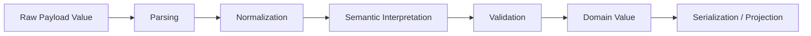
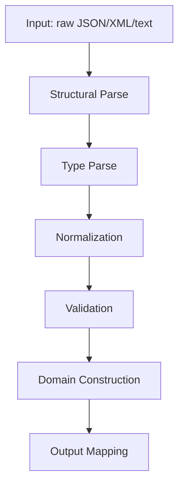
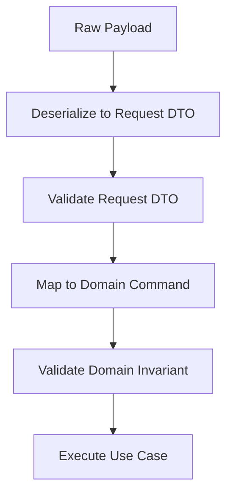

------
title: Learn Java Data Mapper, JSON/XML Processing & Validation - Part 007
description: Type conversion semantics untuk Java boundary engineering: String, number, boolean, enum, date-time, money, identifier, Jackson, MapStruct, dan validation.
series: learn-java-data-mapper-json-xml-validation
seriesTitle: Learn Java Data Mapper, JSON/XML Processing & Validation
order: 7
partTitle: Type Conversion Semantics
tags:
- java
- data-mapper
- type-conversion
- jackson
- mapstruct
- jakarta-validation
- serialization
- deserialization
- contract
date: 2026-06-29
---

# Part 007 — Type Conversion Semantics

> **Target skill:** mampu mendesain, membaca, menguji, dan mempertahankan aturan konversi tipe antar boundary dengan presisi tinggi: JSON/XML/API/event/database-facing DTO/domain model/read model.

Di level beginner, type conversion sering dianggap sebagai hal kecil: `String` ke `int`, `String` ke `UUID`, `String` ke `LocalDate`, `Enum.valueOf()`, `BigDecimal`, dan seterusnya.

Di sistem enterprise, type conversion adalah **contract policy**.

Satu keputusan kecil seperti:

```java
Integer.parseInt("00123")
```

bisa menghilangkan leading zero yang ternyata adalah bagian dari identitas bisnis.

Satu keputusan seperti:

```java
new BigDecimal(0.1)
```

bisa menghasilkan nilai yang tidak sama dengan nilai uang yang dikirim client.

Satu keputusan seperti:

```java
Enum.valueOf(Status.class, input)
```

bisa membuat sistem gagal saat provider menambahkan enum baru yang sebenarnya seharusnya masih bisa diterima sebagai `UNKNOWN`.

Satu keputusan seperti:

```java
LocalDateTime.parse("2026-06-29T10:00:00")
```

bisa menyebabkan ambiguity karena tidak ada timezone/offset.

Di part ini kita tidak belajar “cara convert tipe” saja. Kita belajar **cara berpikir** agar conversion rule tidak menjadi hidden bug di boundary.

---

## 1. Kaufman Deconstruction

Berdasarkan pendekatan Josh Kaufman, skill ini kita pecah menjadi subskill kecil yang bisa dilatih cepat:

| Subskill | Kemampuan yang harus dikuasai |
|---|---|
| Identify conversion boundary | Tahu di mana data berubah bentuk: JSON/XML input, DTO/domain, mapper, validation, output |
| Classify conversion risk | Membedakan lossless, lossy, ambiguous, locale-sensitive, timezone-sensitive |
| Define canonical representation | Menentukan bentuk resmi untuk identifier, date-time, amount, enum, code |
| Enforce conversion policy | Menggunakan Jackson, MapStruct, constructor, validator, atau custom converter dengan sengaja |
| Test conversion behavior | Membuat fixture untuk valid, invalid, edge, unknown, null, absence, overflow |
| Evolve conversion safely | Menambah alias/enum/code/date format tanpa merusak consumer |

Kaufman-style practice untuk part ini:

1. Ambil satu DTO yang punya `String`, `BigDecimal`, `Enum`, `LocalDate`, `UUID`.
2. Tulis 10 payload valid dan 10 payload invalid.
3. Jalankan deserialization, mapping, validation.
4. Catat perilaku aktual.
5. Ubah konfigurasi Jackson/MapStruct/validator.
6. Pastikan perilaku berubah sesuai policy, bukan kebetulan.

---

## 2. Mental Model: Conversion Is Policy

Conversion bukan sekadar operasi teknis.

Conversion adalah keputusan tentang:



Contoh:

```json
{
  "customerId": "000123",
  "amount": "100000.00",
  "currency": "IDR",
  "status": "approved",
  "effectiveDate": "2026-06-29"
}
```

Pertanyaan yang harus dijawab:

| Field | Pertanyaan conversion policy |
|---|---|
| `customerId` | Apakah leading zero bermakna? Jika iya, jangan convert ke number. |
| `amount` | Apakah dikirim sebagai string atau number? Berapa scale yang valid? |
| `currency` | Apakah ISO-4217? Apakah case-sensitive? |
| `status` | Apakah menerima lowercase? Apakah unknown status boleh masuk? |
| `effectiveDate` | Apakah tanggal lokal? Apakah timezone diperlukan? |

Top engineer tidak bertanya “bisa diconvert atau tidak?”. Mereka bertanya:

> “Conversion ini mempertahankan meaning atau diam-diam mengubah meaning?”

---

## 3. Conversion Taxonomy

### 3.1 Lossless Conversion

Conversion disebut lossless jika informasi tidak hilang.

Contoh relatif aman:

```java
String raw = "123";
int value = Integer.parseInt(raw);
String back = String.valueOf(value); // "123"
```

Tetapi ini tidak selalu lossless.

```java
String raw = "00123";
int value = Integer.parseInt(raw);
String back = String.valueOf(value); // "123"
```

`"00123"` menjadi `"123"`. Untuk angka matematika, mungkin aman. Untuk customer code, branch code, account suffix, atau regulatory reference number, ini bisa fatal.

### 3.2 Lossy Conversion

Conversion lossy membuang informasi.

Contoh:

```java
BigDecimal amount = new BigDecimal("100.1200");
BigDecimal normalized = amount.stripTrailingZeros();
```

Secara numeric sama, tetapi `scale` berubah. Dalam beberapa domain, scale adalah metadata penting.

Contoh lain:

```java
OffsetDateTime odt = OffsetDateTime.parse("2026-06-29T10:00:00+07:00");
LocalDateTime ldt = odt.toLocalDateTime();
```

Offset `+07:00` hilang.

### 3.3 Ambiguous Conversion

Conversion ambiguous terjadi ketika satu input bisa punya banyak interpretasi.

```txt
01/02/2026
```

Bisa berarti:

- 1 Februari 2026
- 2 Januari 2026

Ambiguity seperti ini sebaiknya tidak diselesaikan oleh “kebiasaan library”. Harus ada contract.

### 3.4 Locale-Sensitive Conversion

Contoh:

```txt
1,234
```

Bisa berarti:

- seribu dua ratus tiga puluh empat
- satu koma dua tiga empat

Untuk API contract, hindari format angka lokal. Gunakan canonical machine-readable format.

### 3.5 Timezone-Sensitive Conversion

Date-time adalah sumber bug besar.

```txt
2026-06-29T10:00:00
```

Tanpa offset/timezone, ini hanya local date-time. Ia belum menunjuk instant global.

Untuk event timestamp, gunakan bentuk seperti:

```txt
2026-06-29T03:00:00Z
2026-06-29T10:00:00+07:00
```

Untuk tanggal bisnis lokal, gunakan `LocalDate`.

---

## 4. Conversion Pipeline

Pisahkan tahapan berikut:



### 4.1 Structural Parse

Apakah payload berbentuk valid?

JSON valid:

```json
{ "amount": "100.00" }
```

JSON invalid:

```json
{ "amount": "100.00", }
```

Ini failure di parser level.

### 4.2 Type Parse

Apakah raw value bisa dibaca menjadi tipe target?

```json
{ "amount": "abc" }
```

Ini valid JSON, tetapi invalid amount.

### 4.3 Normalization

Apakah input perlu distandarkan?

```java
String normalized = input.trim().toUpperCase(Locale.ROOT);
```

Normalization harus eksplisit. Jangan tersebar di banyak mapper.

### 4.4 Validation

Apakah nilai valid secara business/contract?

```java
@DecimalMin("0.00")
@Digits(integer = 18, fraction = 2)
BigDecimal amount
```

### 4.5 Domain Construction

Apakah nilai bisa menjadi domain value object?

```java
public record Money(BigDecimal amount, Currency currency) {
    public Money {
        if (amount == null) throw new IllegalArgumentException("amount is required");
        if (currency == null) throw new IllegalArgumentException("currency is required");
        if (amount.scale() > 2) throw new IllegalArgumentException("scale must be <= 2");
    }
}
```

---

## 5. String Conversion

String adalah tipe paling berbahaya karena terlihat fleksibel.

### 5.1 String as Text

Gunakan `String` untuk text bebas:

```java
public record CustomerRequest(
    String fullName,
    String note
) {}
```

Policy yang perlu jelas:

| Concern | Rule |
|---|---|
| trim | Apakah whitespace pinggir dihapus? |
| blank | Apakah `""` dan `"   "` valid? |
| normalization | Apakah case disamakan? |
| length | Diukur character, code point, atau byte? |
| encoding | Apakah output system mendukung Unicode? |

### 5.2 String as Code

Banyak field terlihat seperti angka, tetapi sebenarnya code:

```java
public record CustomerDto(
    String customerNumber,
    String branchCode,
    String productCode
) {}
```

Jangan convert ke number bila:

- leading zero penting
- panjang tetap penting
- ada prefix/suffix
- bukan operasi matematika
- format diatur eksternal

Contoh buruk:

```java
int branchCode = Integer.parseInt("001");
```

Contoh benar:

```java
public record BranchCode(String value) {
    public BranchCode {
        if (value == null || !value.matches("\\d{3}")) {
            throw new IllegalArgumentException("branch code must be exactly 3 digits");
        }
    }
}
```

### 5.3 String Normalization

Buat normalization policy eksplisit.

```java
public final class StringNormalizers {
    private StringNormalizers() {}

    public static String trimToNull(String value) {
        if (value == null) {
            return null;
        }
        String trimmed = value.trim();
        return trimmed.isEmpty() ? null : trimmed;
    }

    public static String upperCode(String value) {
        String normalized = trimToNull(value);
        return normalized == null ? null : normalized.toUpperCase(Locale.ROOT);
    }
}
```

Hindari normalization yang diam-diam tersebar:

```java
target.setCode(source.getCode().trim().toUpperCase());
```

Lebih baik centralize:

```java
target.setCode(StringNormalizers.upperCode(source.getCode()));
```

---

## 6. Number Conversion

### 6.1 Integer vs Long vs BigInteger

Gunakan tipe berdasarkan semantic range, bukan convenience.

| Tipe | Cocok untuk |
|---|---|
| `int` / `Integer` | small bounded quantity |
| `long` / `Long` | id teknis internal, count besar, epoch millis |
| `BigInteger` | angka sangat besar, cryptographic-like numeric, arbitrary precision |
| `String` | identifier numerik yang bukan angka matematika |

Jangan memakai `Long` untuk semua identifier hanya karena database id bertipe bigint. API contract bisa berbeda dari storage shape.

### 6.2 Overflow Risk

Input:

```json
{ "count": 999999999999999999999999 }
```

Jika target `int`, failure harus jelas.

Contoh boundary DTO:

```java
public record QuantityRequest(
    @NotNull
    @Min(1)
    @Max(9999)
    Integer quantity
) {}
```

Di sini parsing dan validation punya tugas berbeda:

| Tahap | Failure |
|---|---|
| Jackson parse | value bukan integer atau overflow |
| Validation | value integer tapi di luar business bound |

### 6.3 BigDecimal for Money

Gunakan `BigDecimal` untuk money-like decimal.

Hindari:

```java
BigDecimal amount = new BigDecimal(0.1);
```

Lebih baik:

```java
BigDecimal amount = new BigDecimal("0.10");
```

Atau dari JSON string:

```json
{
  "amount": "100.00",
  "currency": "IDR"
}
```

Kenapa string untuk money sering dipilih?

- menghindari representasi floating point consumer
- menjaga scale
- mengurangi ambiguity number parser lintas bahasa
- lebih eksplisit sebagai decimal exact

### 6.4 Scale Policy

Money tidak cukup hanya `BigDecimal`.

```java
public record MoneyAmount(BigDecimal value) {
    public MoneyAmount {
        if (value == null) {
            throw new IllegalArgumentException("amount is required");
        }
        if (value.scale() > 2) {
            throw new IllegalArgumentException("amount scale must be <= 2");
        }
        if (value.signum() < 0) {
            throw new IllegalArgumentException("amount must be positive or zero");
        }
    }
}
```

Pertanyaan policy:

| Concern | Pilihan |
|---|---|
| scale lebih dari 2 | reject atau round? |
| trailing zeros | preserve atau normalize? |
| negative amount | valid untuk refund/reversal atau tidak? |
| zero amount | valid atau tidak? |
| max value | dibatasi oleh contract? |

Jangan rounding diam-diam di mapper.

Buruk:

```java
amount.setScale(2, RoundingMode.HALF_UP);
```

Jika rounding adalah business rule, letakkan di domain service atau explicit policy, bukan accidental mapper.

---

## 7. Boolean Conversion

Boolean terlihat sederhana, tetapi input eksternal sering tidak bersih.

Contoh variasi:

```txt
true
false
Y
N
YES
NO
1
0
ACTIVE
INACTIVE
```

Untuk public API, paling aman gunakan boolean JSON native:

```json
{ "active": true }
```

Untuk legacy XML/file/integration, sering perlu converter.

```java
public final class BooleanCodeConverter {
    public boolean fromYn(String value) {
        if ("Y".equalsIgnoreCase(value)) return true;
        if ("N".equalsIgnoreCase(value)) return false;
        throw new IllegalArgumentException("expected Y or N");
    }

    public String toYn(boolean value) {
        return value ? "Y" : "N";
    }
}
```

Bahaya terbesar adalah defaulting.

```java
boolean active;
```

Primitive `boolean` default ke `false`.

Kalau input absence berarti “tidak dikirim”, gunakan wrapper:

```java
Boolean active;
```

Jangan membuat absence menjadi false tanpa sengaja.

---

## 8. Enum Conversion

Enum adalah contract hotspot.

### 8.1 Simple Enum

```java
public enum OrderStatus {
    PENDING,
    APPROVED,
    REJECTED
}
```

Payload:

```json
{ "status": "APPROVED" }
```

Ini mudah, tetapi fragile jika consumer/provider punya casing berbeda.

### 8.2 External Code vs Java Enum Name

Jangan selalu mengekspos Java enum name sebagai wire contract.

```java
public enum PaymentStatus {
    WAITING_FOR_CUSTOMER("WAITING"),
    PAID("PAID"),
    FAILED("FAILED");

    private final String code;

    PaymentStatus(String code) {
        this.code = code;
    }

    @JsonValue
    public String code() {
        return code;
    }

    @JsonCreator
    public static PaymentStatus fromCode(String raw) {
        if (raw == null) return null;
        String normalized = raw.trim().toUpperCase(Locale.ROOT);
        return switch (normalized) {
            case "WAITING" -> WAITING_FOR_CUSTOMER;
            case "PAID" -> PAID;
            case "FAILED" -> FAILED;
            default -> throw new IllegalArgumentException("Unknown payment status: " + raw);
        };
    }
}
```

### 8.3 Unknown Enum Strategy

Ada tiga strategi:

| Strategy | Kapan cocok |
|---|---|
| reject unknown | command/request dari client internal yang harus strict |
| map to `UNKNOWN` | event/read model dari provider yang bisa evolve |
| store raw code | regulatory/audit/integration yang perlu preserve unknown value |

Contoh raw-preserving model:

```java
public record ExternalStatus(
    String rawCode,
    KnownStatus knownStatus
) {
    public enum KnownStatus {
        ACTIVE,
        SUSPENDED,
        CLOSED,
        UNRECOGNIZED
    }
}
```

Dengan ini raw input tetap tersimpan.

### 8.4 MapStruct Enum Mapping

MapStruct mendukung enum mapping compile-time. Untuk mapping enum yang tidak identik, gunakan mapping eksplisit.

```java
@Mapper
public interface StatusMapper {
    @ValueMapping(source = "WAITING_FOR_CUSTOMER", target = "PENDING")
    @ValueMapping(source = "PAID", target = "COMPLETED")
    @ValueMapping(source = "FAILED", target = "REJECTED")
    OrderStatus toOrderStatus(PaymentStatus source);
}
```

Policy penting:

- jangan mengandalkan nama enum sama jika meaning berbeda
- buat mapping eksplisit untuk external enum
- test semua enum constant
- gagal build/test jika enum baru belum dimapping

---

## 9. Date-Time Conversion

Date-time harus dimodelkan berdasarkan semantic need.

| Java Type | Cocok untuk |
|---|---|
| `Instant` | machine timestamp, event occurrence, audit time |
| `OffsetDateTime` | timestamp dengan offset dari payload |
| `ZonedDateTime` | waktu dengan timezone rules, misalnya jadwal regional |
| `LocalDateTime` | waktu lokal tanpa offset; hati-hati untuk event global |
| `LocalDate` | tanggal bisnis, due date, birth date |
| `YearMonth` | billing cycle, statement period |
| `Duration` | lama waktu machine-based |
| `Period` | periode kalender |

### 9.1 Event Timestamp

Untuk event/audit:

```java
public record AuditEvent(
    Instant occurredAt
) {}
```

Payload:

```json
{
  "occurredAt": "2026-06-29T03:00:00Z"
}
```

### 9.2 Business Date

Untuk due date:

```java
public record InvoiceRequest(
    LocalDate dueDate
) {}
```

Payload:

```json
{
  "dueDate": "2026-07-31"
}
```

Jangan pakai `Instant` jika yang dimaksud tanggal bisnis lokal.

### 9.3 Offset Preservation

Jika offset dari provider penting untuk audit, jangan langsung convert ke `Instant` tanpa menyimpan context.

```java
public record ProviderTimestamp(
    OffsetDateTime observedAt
) {}
```

`2026-06-29T10:00:00+07:00` dan `2026-06-29T03:00:00Z` menunjuk instant yang sama, tetapi representasi offset berbeda.

### 9.4 Jackson Java Time

Untuk Java 8+ date-time types, register Java Time module di konfigurasi ObjectMapper. Di banyak framework modern ini sudah dikonfigurasi, tetapi untuk library/internal mapper jangan berasumsi.

Contoh konfigurasi eksplisit:

```java
ObjectMapper mapper = JsonMapper.builder()
    .addModule(new JavaTimeModule())
    .disable(SerializationFeature.WRITE_DATES_AS_TIMESTAMPS)
    .build();
```

Contract yang baik menentukan format, bukan membiarkan default framework berubah.

---

## 10. Money Conversion

Money bukan sekadar amount.

```java
public record Money(
    BigDecimal amount,
    Currency currency
) {
    public Money {
        if (amount == null) {
            throw new IllegalArgumentException("amount is required");
        }
        if (currency == null) {
            throw new IllegalArgumentException("currency is required");
        }
        if (amount.scale() > currency.getDefaultFractionDigits()) {
            throw new IllegalArgumentException("invalid scale for currency");
        }
    }
}
```

### 10.1 JSON Shape

Pilihan umum:

```json
{
  "amount": "100000.00",
  "currency": "IDR"
}
```

Atau minor unit:

```json
{
  "minorUnits": 10000000,
  "currency": "IDR"
}
```

Trade-off:

| Shape | Kelebihan | Risiko |
|---|---|---|
| decimal string | human-readable, exact decimal | perlu scale validation |
| JSON number | simple | consumer floating point risk |
| minor unit integer | exact, common payment systems | perlu currency fraction policy |
| object money | explicit | lebih verbose |

### 10.2 Do Not Hide Monetary Policy in Mapper

Buruk:

```java
@Mapping(target = "amount", expression = "java(dto.amount().setScale(2, RoundingMode.HALF_UP))")
Payment toDomain(PaymentRequest dto);
```

Lebih baik:

```java
@Mapping(target = "money", expression = "java(Money.of(dto.amount(), dto.currency()))")
Payment toDomain(PaymentRequest dto);
```

Lalu policy ada di `Money`.

---

## 11. Identifier Conversion

Identifier bisa punya banyak bentuk:

| Identifier | Recommended boundary type |
|---|---|
| UUID | `UUID` atau canonical string |
| database id | biasanya jangan expose langsung |
| business code | value object/string |
| composite id | explicit object |
| external provider id | string, preserve raw |
| correlation id | string/UUID tergantung standard internal |

### 11.1 UUID

```java
public record CustomerRequest(
    UUID customerId
) {}
```

Payload:

```json
{
  "customerId": "018ff6c1-780d-7b43-bf76-7faabf1d2a11"
}
```

Jika UUID harus version tertentu, jangan cukup mengandalkan `UUID.fromString`.

```java
public record RequestId(UUID value) {
    public RequestId {
        if (value == null) {
            throw new IllegalArgumentException("request id is required");
        }
        if (value.version() != 7) {
            throw new IllegalArgumentException("request id must be UUIDv7");
        }
    }
}
```

### 11.2 Composite Identifier

Buruk:

```java
String accountKey = bankCode + "-" + branchCode + "-" + accountNumber;
```

Lebih baik:

```java
public record AccountKey(
    String bankCode,
    String branchCode,
    String accountNumber
) {}
```

Dengan validation:

```java
public record AccountKey(
    @Pattern(regexp = "\\d{3}") String bankCode,
    @Pattern(regexp = "\\d{3}") String branchCode,
    @Pattern(regexp = "\\d{10,16}") String accountNumber
) {}
```

---

## 12. Jackson Conversion Control

Jackson melakukan banyak conversion secara otomatis. Ini berguna, tetapi di boundary high-stakes harus dikendalikan.

### 12.1 Strict Unknown Property Policy

Untuk command/request internal, sering lebih aman strict:

```java
ObjectMapper mapper = JsonMapper.builder()
    .enable(DeserializationFeature.FAIL_ON_UNKNOWN_PROPERTIES)
    .build();
```

Untuk event consumer yang harus forward-compatible, unknown field bisa diabaikan atau ditangkap.

```java
@JsonIgnoreProperties(ignoreUnknown = true)
public record ProviderEvent(
    String eventId,
    String eventType
) {}
```

Atau gunakan extension bucket:

```java
public final class ProviderEvent {
    private String eventId;
    private String eventType;
    private final Map<String, JsonNode> extensions = new LinkedHashMap<>();

    @JsonAnySetter
    public void putExtension(String name, JsonNode value) {
        extensions.put(name, value);
    }

    @JsonAnyGetter
    public Map<String, JsonNode> extensions() {
        return extensions;
    }
}
```

### 12.2 Enum Handling

Tentukan apakah unknown enum:

- reject
- null
- default value
- raw-preserved

Jangan pilih karena library feature terlihat mudah. Pilih berdasarkan compatibility policy.

### 12.3 Coercion

Contoh coercion berisiko:

```json
{
  "quantity": "10",
  "active": "true"
}
```

Apakah ini valid?

Untuk public API baru, lebih baik strict:

```json
{
  "quantity": 10,
  "active": true
}
```

Untuk legacy integration, string coercion mungkin diterima tetapi harus explicit dan tested.

---

## 13. MapStruct Conversion Control

MapStruct bisa melakukan implicit conversion untuk beberapa tipe. Ini membantu boilerplate, tetapi harus diawasi.

### 13.1 Prefer Explicit Conversion for Semantic Types

```java
@Mapper(uses = {MoneyMapper.class, IdentifierMapper.class})
public interface PaymentMapper {
    Payment toDomain(PaymentRequest request);
}
```

```java
public class MoneyMapper {
    public Money toMoney(MoneyDto dto) {
        return new Money(dto.amount(), Currency.getInstance(dto.currency()));
    }
}
```

### 13.2 Date-Time Mapping

```java
@Mapper
public interface DateMapper {
    default Instant toInstant(String value) {
        return value == null ? null : OffsetDateTime.parse(value).toInstant();
    }

    default String fromInstant(Instant value) {
        return value == null ? null : DateTimeFormatter.ISO_INSTANT.format(value);
    }
}
```

### 13.3 Fail When Target Is Unmapped

Gunakan policy ketat:

```java
@Mapper(unmappedTargetPolicy = ReportingPolicy.ERROR)
public interface CustomerMapper {
    Customer toDomain(CustomerRequest request);
}
```

Ini tidak menyelesaikan semua semantic bug, tetapi mencegah field baru diam-diam tidak dimapping.

---

## 14. Validation and Conversion Order

Urutan yang sering benar:



Tetapi ada kasus lain:

| Case | Order |
|---|---|
| JSON malformed | parser fails before validation |
| wrong primitive type | deserialization fails before validation |
| syntactically valid but semantically wrong | validation/domain fails |
| external raw code unknown but must be preserved | deserialize raw string first, interpret later |
| patch with absence/null distinction | parse with presence-aware wrapper before validation |

Contoh:

```java
public record CreatePaymentRequest(
    @NotNull
    @DecimalMin("0.01")
    @Digits(integer = 18, fraction = 2)
    BigDecimal amount,

    @NotBlank
    @Pattern(regexp = "[A-Z]{3}")
    String currency
) {}
```

Jika payload:

```json
{ "amount": "abc", "currency": "IDR" }
```

Maka `amount` gagal di deserialization.

Jika payload:

```json
{ "amount": "-10.00", "currency": "IDR" }
```

Maka deserialization sukses, validation gagal.

---

## 15. Conversion Error Design

Jangan expose raw exception internal.

Buruk:

```json
{
  "message": "Cannot deserialize value of type `java.math.BigDecimal` from String \"abc\""
}
```

Lebih baik:

```json
{
  "code": "INVALID_FIELD_TYPE",
  "message": "Field amount must be a decimal number.",
  "field": "amount",
  "rejectedValue": "abc"
}
```

Untuk high-stakes systems, error model harus:

| Property | Reason |
|---|---|
| stable code | consumer bisa automate |
| field path | user/support tahu lokasi |
| safe rejected value | jangan leak secret/PII |
| category | parse/type/validation/business |
| correlation id | traceable |

---

## 16. Production Decision Matrix

| Field Kind | Boundary Representation | Domain Representation | Validation |
|---|---|---|---|
| human name | string | value object/string | length, blank, allowed chars if needed |
| branch code | string | `BranchCode` | exact pattern |
| quantity | integer | int/value object | min/max |
| money | decimal string/object | `Money` | scale, currency, range |
| enum status | string code | enum/value object | known/unknown strategy |
| timestamp | ISO offset/instant string | `Instant`/`OffsetDateTime` | required, temporal bound |
| business date | ISO date string | `LocalDate` | range/business calendar |
| UUID | canonical string | `UUID`/value object | format/version |
| composite id | object | value object | component constraints |

---

## 17. Anti-Patterns

### 17.1 “Everything Is String”

```java
public record PaymentRequest(
    String amount,
    String currency,
    String createdAt,
    String active
) {}
```

Ini menunda semua error ke tempat yang tidak jelas.

### 17.2 “Everything Is Domain Type at API Edge”

```java
public record PaymentRequest(
    Money money,
    Account account,
    Customer customer
) {}
```

Ini membuat deserialization layer tahu terlalu banyak tentang domain graph.

### 17.3 Silent Defaulting

```java
int quantity;      // absence -> 0
boolean active;    // absence -> false
```

Gunakan wrapper untuk input boundary jika absence bermakna.

### 17.4 Mapper as Business Rule Dumping Ground

Mapper boleh mengubah bentuk. Mapper tidak seharusnya menjadi tempat tersembunyi untuk business decision seperti fee, rounding, eligibility, state transition.

### 17.5 Locale-Dependent Parsing in API

```java
NumberFormat.getInstance().parse(input);
```

Untuk machine contract, gunakan canonical format.

---

## 18. Testing Strategy

### 18.1 Golden Conversion Fixtures

Buat fixture:

```txt
valid-money-decimal-string.json
invalid-money-too-many-fraction-digits.json
invalid-money-negative.json
valid-business-date.json
invalid-ambiguous-date.json
unknown-enum-provider-event.json
```

### 18.2 Test Matrix

| Case | Expected |
|---|---|
| `"00123"` customer code | preserved as `"00123"` |
| `"00123"` quantity | rejected or parsed? explicit |
| `100.00` money JSON number | accepted/rejected based on contract |
| `"100.001"` money | rejected if scale > 2 |
| `"approved"` enum | accepted if case-insensitive policy |
| `"NEW_PROVIDER_STATUS"` enum | rejected/UNKNOWN/preserved based on boundary |
| `"2026-06-29T10:00:00"` timestamp | rejected if instant required |
| `"2026-06-29"` business date | accepted for `LocalDate` |
| missing boolean | absence preserved |
| null boolean | null preserved/rejected based on validation |

### 18.3 Property-Based Conversion Checks

Untuk conversion yang harus round-trip:

```java
String raw = generator.nextValidBranchCode();
BranchCode code = BranchCode.parse(raw);
assertEquals(raw, code.value());
```

Untuk canonicalization:

```java
CurrencyCode code = CurrencyCode.parse(" idr ");
assertEquals("IDR", code.value());
```

---

## 19. Mini Case Study: Payment Create Request

### 19.1 DTO

```java
public record CreatePaymentRequest(
    @NotBlank
    @Pattern(regexp = "[A-Z0-9]{8,32}")
    String requestId,

    @NotNull
    @DecimalMin("0.01")
    @Digits(integer = 18, fraction = 2)
    BigDecimal amount,

    @NotBlank
    @Pattern(regexp = "[A-Z]{3}")
    String currency,

    @NotNull
    LocalDate valueDate,

    @NotNull
    PaymentMethod method
) {}
```

### 19.2 Domain Command

```java
public record CreatePaymentCommand(
    RequestId requestId,
    Money money,
    LocalDate valueDate,
    PaymentMethod method
) {}
```

### 19.3 Mapper

```java
@Mapper(
    unmappedTargetPolicy = ReportingPolicy.ERROR,
    uses = {MoneyMapper.class, RequestIdMapper.class}
)
public interface PaymentCommandMapper {
    @Mapping(target = "money", source = ".")
    CreatePaymentCommand toCommand(CreatePaymentRequest request);
}
```

```java
public class MoneyMapper {
    public Money toMoney(CreatePaymentRequest request) {
        return new Money(
            request.amount(),
            Currency.getInstance(request.currency())
        );
    }
}
```

### 19.4 Why This Shape Works

- DTO is contract-facing.
- Validation checks request-level syntax and shape.
- Mapper composes domain value objects.
- Domain value objects enforce deeper invariant.
- Conversion policy is not hidden inside random setters.

---

## 20. Engineering Checklist

Sebelum merge code yang mengubah conversion:

- [ ] Apakah field ini code, number, text, date, timestamp, amount, atau identifier?
- [ ] Apakah conversion lossless?
- [ ] Apakah leading zero, scale, offset, casing, atau raw code perlu dipertahankan?
- [ ] Apakah unknown enum harus reject, default, unknown, atau preserve raw?
- [ ] Apakah null dan absence dibedakan?
- [ ] Apakah Jackson coercion sesuai contract?
- [ ] Apakah MapStruct implicit conversion aman?
- [ ] Apakah validation terjadi di layer yang benar?
- [ ] Apakah error response stabil dan aman?
- [ ] Apakah ada fixture untuk edge case?
- [ ] Apakah perubahan ini backward/forward compatible?

---

## 21. Practice Drill

Buat DTO berikut:

```java
public record ExternalTransferRequest(
    String transferId,
    String sourceAccount,
    String destinationAccount,
    String amount,
    String currency,
    String transferType,
    String requestedAt
) {}
```

Tugas:

1. Tentukan field mana yang tetap string.
2. Tentukan value object domain.
3. Tentukan enum strategy untuk `transferType`.
4. Tentukan apakah `requestedAt` harus `Instant`, `OffsetDateTime`, atau `LocalDateTime`.
5. Tulis invalid fixtures:
   - amount negative
   - amount scale terlalu panjang
   - currency lowercase
   - unknown transfer type
   - timestamp tanpa offset
   - account number leading zero
6. Tulis mapper MapStruct.
7. Tulis validation rules.
8. Jelaskan mana yang parsing error, validation error, dan domain invariant error.

---

## 22. Summary

Type conversion adalah salah satu tempat paling umum bug boundary muncul.

Mental model utama:

> **Do not convert type until you understand the meaning of the value.**

Rules yang harus diingat:

1. Identifier yang terlihat numerik belum tentu number.
2. Money butuh amount + currency + scale policy.
3. Date-time harus dipilih berdasarkan semantic: instant, local date, offset time, zoned time.
4. Enum wire contract sebaiknya tidak bergantung membabi buta pada Java enum name.
5. Unknown enum adalah compatibility decision.
6. Null, absence, default, dan empty value harus dibedakan.
7. Mapper bukan tempat tersembunyi untuk business policy.
8. Conversion harus punya fixture test.

Part berikutnya membahas object graph, identity, cycles, dan reference handling: masalah yang muncul ketika model Java berbentuk graph tetapi payload JSON/XML biasanya berbentuk tree.

---

## References

- Jackson Databind `DeserializationFeature` Javadoc: https://javadoc.io/doc/com.fasterxml.jackson.core/jackson-databind/latest/com/fasterxml/jackson/databind/DeserializationFeature.html
- Jackson 3.0 Release Notes: https://github.com/FasterXML/jackson/wiki/Jackson-Release-3.0
- MapStruct Reference Guide: https://mapstruct.org/documentation/stable/reference/html/
- Jakarta Validation 3.1 Specification: https://jakarta.ee/specifications/bean-validation/3.1/jakarta-validation-spec-3.1.html
- Hibernate Validator Reference Guide: https://docs.jboss.org/hibernate/stable/validator/reference/en-US/html_single/
